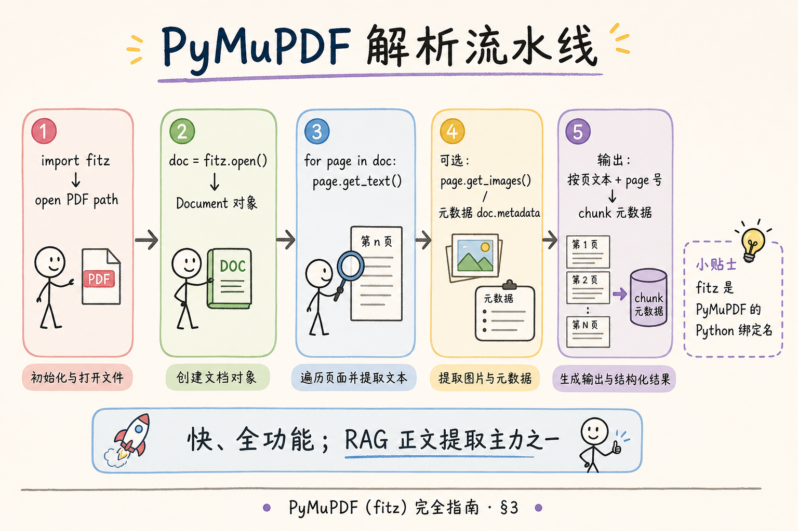
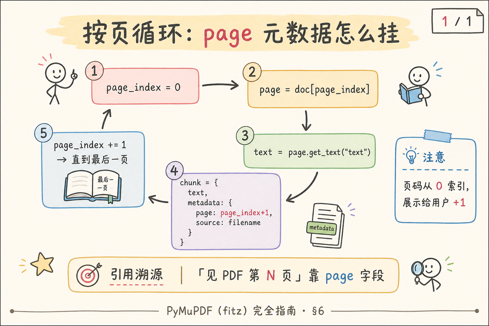
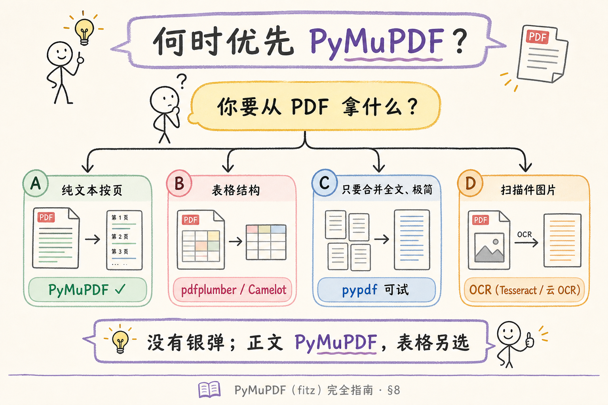
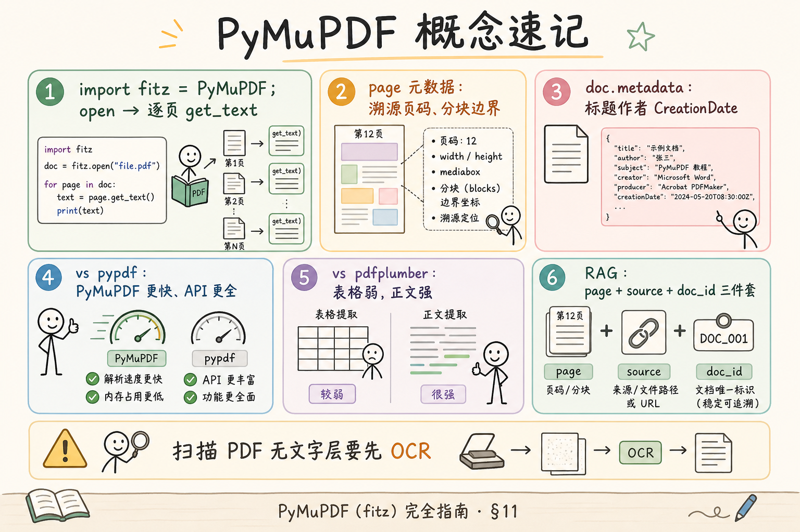

# 企业 RAG 数据采集（三）：PyMuPDF（fitz）完全指南

> 企业知识库 **PDF 占比往往最高**：合同扫描件、产品手册、政府公开文件。要把它们变成可检索的 chunk，第一步通常是 **按页抽出正文**。在 Python 生态里，**PyMuPDF**（import 名 **`fitz`**）是 RAG 工程师最常用、也最值得先学熟的一把刀：安装简单、速度块、API 覆盖 **文本 / 元数据 / 图片 / 注释**。这篇是 [企业 RAG 路线图](ENTERPRISE_RAG_ROADMAP.md) **C 轨第三篇**（路线图第 **49** 条），定位 **主线篇（要厚）**：讲清边界与动手路径、安装与按页提取、**page 元数据**、综合实战脚本、与 **pypdf** 对比，并说明何时让给 pdfplumber / OCR。前置：[41 编码检测](41.text-encoding-detection-tutorial.md)（纯文本）；DOCX 见 [40](40.docx-office-parsing-tutorial.md)。

---

## 目录

1. [前言：PDF 不是「一个大字符串」](#1-前言pdf-不是一个大字符串)
2. [本文边界与动手路径](#2-本文边界与动手路径)
3. [PyMuPDF 是什么：fitz 从哪来](#3-pymupdf-是什么fitz-从哪来)
4. [安装与环境验收](#4-安装与环境验收)
5. [核心对象：Document 与 Page](#5-核心对象document-与-page)
6. [按页提取文本：get_text 家族](#6-按页提取文本get_text-家族)
7. [文档与页级元数据](#7-文档与页级元数据)
8. [与 pypdf 对比：何时够用何时升级](#8-与-pypdf-对比何时够用何时升级)
9. [何时优先 PyMuPDF：决策树](#9-何时优先-pymupdf决策树)
10. [综合实战：PDF → 带 page 的 chunks](#10-综合实战pdf--带-page-的-chunks)
11. [先错后对：典型误用](#11-先错对对典型误用)
12. [综合概念地图](#12-综合概念地图)
13. [常见陷阱与 FAQ](#13-常见陷阱与-faq)
14. [总结与系列下一步](#14-总结与系列下一步)

---

## 1. 前言：PDF 不是「一个大字符串」

初学者常尝试：

```python
text = open("manual.pdf", encoding="utf-8").read()  # 必挂
```

PDF 是 **二进制格式**，内容是绘图指令、字体映射、压缩流——不是给人 `read_text` 的。正确思路是：**用 PDF 库打开 → 逐页 ask「这页有哪些字」→ 拼成 chunk，并记下页码**。

**PyMuPDF**：基于 MuPDF 引擎的 Python 绑定，pypi 包名 **`pymupdf`**，代码里 **`import fitz`**（历史命名来自 Fitzpatrick）。  
**通俗说**： **Python 里打开 PDF 的瑞士军刀**——RAG 抽正文首选之一。

和 DOCX 不同，PDF **不保证**「段落 / 标题」结构；PyMuPDF 给你的是 **页内文字流**（阅读顺序因版面而异）。因此 RAG 里 PyMuPDF 的典型产出是：

```json
{"text": "……", "metadata": {"page": 12, "source": "manual.pdf", "doc_id": "manual-v3"}}
```

**page 元数据** 直接支撑引用 UI「见原文第 12 页」——路线图 **59** `source` / `page` 字段的核心来源之一。

**读完本文，你应该能做到：**

1. 安装 **pymupdf** 并用 `fitz.open` 打开 PDF。  
2. 写 **按页循环**，对每页 `get_text()` 并挂 **1-based page 号**。  
3. 读取 **doc.metadata**（标题、作者等）并写入 chunk 或 doc 级索引。  
4. 跑通 §10 综合脚本，输出 JSONL chunks。  
5. 对照 **pypdf**，说出 PyMuPDF 的优势与 **表格 / 扫描件** 局限。  
6. 完成 §11 先错后对。

---

## 2. 本文边界与动手路径

**档位：主线篇（要厚）。**

**本文讲：** 安装、Document/Page API、get_text 模式、元数据、实战脚本、pypdf 对比、选型决策。  
**本文不讲：** PDF 内部对象流语法、渲染成图片的精细参数、JavaScript 动作、完整 OCR 流水线、PDF 编辑合规（红章/legal）。

### 2.1 动手路径表

| 步骤 | 你做什么 | 验收 |
|------|----------|------|
| A | §4 安装，`fitz.open` 打印页数 | `len(doc)` 与 Acrobat 一致 |
| B | §5～§6 单页 `get_text()` | 中文无乱码（字体嵌入正常时） |
| C | §7 打印 `doc.metadata` | 能看到 title/author 等 |
| D | §10 跑 `pdf_to_chunks.py` | 生成 JSONL，每行含 page |
| E | §11 先错后对 | 指出 merge 全文丢 page 的问题 |
| F | §8 读 pypdf 对比表 | 一句话说何时 pypdf 够用 |

**环境：** Python 3.10+；`pip install pymupdf`；准备一份 **可选中文字** 的 PDF（10 页内即可，电子 PDF 非扫描最佳）。

### 2.2 与路线图关系

| 概念 | 来自 / 去向 |
|------|-------------|
| PDF 文本提取总述 | 路线图 **43** |
| PDF 表格 | [43 pdfplumber](43.pdfplumber-tutorial.md) |
| OCR 扫描件 | 路线图 **62** |
| chunk 元数据 page | 路线图 **59** |

---

## 3. PyMuPDF 是什么：fitz 从哪来

**MuPDF**：轻量 PDF/XPS 渲染引擎，注重速度与体积。  
**通俗说**： **底层 PDF 引擎**——PyMuPDF 是它的 Python 外套。

**fitz**：PyMuPDF 在 Python 中的 import 名称；与包名 `pymupdf` 不一致，初学者常搜错文档。  
**通俗说**： **`pip install pymupdf`，代码写 `import fitz`**。

读下图，建立 ingest 流水线 mental model。



对照上图，标准 **RAG 正文路径**：

1. `doc = fitz.open(path)`  
2. `for page in doc:`  
3. `text = page.get_text(...)`  
4. 清洗空白 → chunk → 写入向量库，**metadata.page = 页码**

PyMuPDF 还能：`get_images()` 抽图、`get_drawings()` 矢量、`search_for()` 找词坐标——地基篇知道 **存在** 即可；RAG 正文 80% 场景 **`get_text` 足够**。

---

## 4. 安装与环境验收

```bash
pip install pymupdf
```

验收脚本（保存为 `check_fitz.py`）：

```python
import fitz

print("PyMuPDF version:", fitz.version)
path = "sample.pdf"  # 改成你的文件
doc = fitz.open(path)
print("pages:", doc.page_count)
print("metadata:", doc.metadata)
doc.close()
```

**page_count**：总页数，与 Adobe 阅读器一致即通过。  
**通俗说**： **PDF 有多少页**。

若 `import fitz` 报 `DLL load failed`（少数 Windows 环境）：确认 **64 位 Python** 与 pip 安装的 wheel 匹配；虚拟环境内重装 `pip install --force-reinstall pymupdf`。

---

## 5. 核心对象：Document 与 Page

**Document**：一份打开的 PDF（或 EPUB 等）的句柄；`fitz.open()` 返回。  
**通俗说**： **整本 PDF 文件**。

**Page**：单页对象；`doc[i]` 或 `doc.load_page(i)` 获取，`i` 从 **0** 开始。  
**通俗说**： **第 i+1 页**——程序员数页从 0，给用户看要 **+1**。

```python
import fitz

doc = fitz.open("sample.pdf")
try:
    for i in range(doc.page_count):
        page = doc[i]
        print("index", i, "display page", i + 1, "size", page.rect)
finally:
    doc.close()
```

**rect**：页面矩形尺寸（点，point，1/72 英寸）。  
**通俗说**： **这页纸多大**——做裁剪、坐标抽取时用。

### 5.1 PDF 物理页 vs 逻辑页

**Physical page**：PDF 文件里第 i 个 page 对象，从 0 索引。  
**Logical page number**：印刷在页脚的「第 3 页」——可能因 **前言 roman 页码** 与正文 arabic 页码 **不一致**。

RAG 引用 UI 通常展示 **physical page**（与用户用 Acrobat 跳页一致）。若产品有 **「封面不算页码」** 需求，需要 **额外映射表**——地基篇 **统一用 physical 1-based**。

**Page label（页标签）**：PDF 可选特性，指定页显示为 `i、ii、1、2…`；PyMuPDF 可通过 `page.get_label()`（版本相关）读取。  
**通俗说**： **页脚印刷的页码不一定等于程序页序号**——排障引用错位时查这个。

---

```python
with fitz.open("sample.pdf") as doc:
    ...
```

确保文件句柄释放，批量 ingest 时防 **句柄泄漏**。

---

## 6. 按页提取文本：get_text 家族

**get_text()**：从页面提取文字的 API；`output` 参数决定返回格式。  
**通俗说**： **把这页的字抠出来**。

常用 `output`：

| output | 返回 | RAG 用途 |
|--------|------|----------|
| `"text"`（默认） | 纯文本，带换行 | **默认首选** |
| `"blocks"` | 块列表 (x0,y0,x1,y1,text,…) | 按区域排序、去页眉 |
| `"dict"` / `"json"` | 结构化 span | 精细排版、坐标高亮 |
| `"html"` | HTML 片段 | 预览，少直接 embed |

最小按页：

```python
with fitz.open("sample.pdf") as doc:
    for i, page in enumerate(doc):
        text = page.get_text("text").strip()
        if text:
            print(f"--- page {i+1} ---")
            print(text[:300])
```

读下图，理解 page 循环与 metadata 挂载点。



对照上图：

- **循环变量 `i`**：0-based index；  
- **展示 / 入库 `page`**：建议 **1-based**（与用户 PDF 阅读器一致）；  
- **空页**：扫描 PDF 无文字层时 `text` 为空——应走 OCR 分支，别 embed 空串。

### 6.1 阅读顺序与多栏

双栏论文 PDF 常出现 **左栏末行接右栏开头** 或 **顺序打乱**。PyMuPDF `"text"` 按内部 stream 顺序，不 magic 修复。

**缓解**（了解）：

- 用 `"blocks"` 按 **y 再 x** 排序；  
- 或用 **pdfplumber** 的 layout 参数（表格页）；  
- 或 **版面分析模型**（路线图进阶）。

地基篇：**先接受 80% 电子 PDF 可用**；坏 case 进评测集单独优化。

### 6.2 简单清洗

```python
import re

def clean_page_text(text: str) -> str:
    text = text.replace("\x00", "")
    text = re.sub(r"[ \t]+\n", "\n", text)
    text = re.sub(r"\n{3,}", "\n\n", text)
    return text.strip()
```

路线图 **53** 会扩展 **页眉页脚正则**；本篇只去 **NUL 与多余空行**。

### 6.3 get_text 输出模式详解

除 `"text"` 外，生产可能用到：

**blocks 模式**：

```python
blocks = page.get_text("blocks")
# [(x0, y0, x1, y1, text, block_no, block_type), ...]
blocks_sorted = sorted(blocks, key=lambda b: (round(b[1], 1), b[0]))
text = "\n".join(b[4] for b in blocks_sorted if b[4].strip())
```

**Block（文本块）**：PyMuPDF 聚类出的矩形区域与其中文字。  
**通俗说**： **页上一块一块的文字**——按 **从上到下、从左到右** 排序可缓解部分多栏问题。

**dict / json 模式**：含 **span 级字体、size、flags**，适合做 **标题启发式**（字号最大一行当标题）——不如 DOCX Heading 可靠，但 PDF 只有这条路。

```python
data = page.get_text("dict")
for block in data.get("blocks", []):
    if block.get("type") != 0:
        continue
    for line in block.get("lines", []):
        for span in line.get("spans", []):
            print(span.get("size"), span.get("text"))
```

**Span**：同一字体属性连续文字。  
**通俗说**： **同字体同字号的一小段字**——比整页 text 更细。

### 6.4 密码保护与权限

```python
doc = fitz.open("encrypted.pdf")
if doc.is_encrypted:
    if not doc.authenticate("password"):
        raise PermissionError("PDF 密码错误")
```

**is_encrypted**：是否加密。  
**通俗说**： **没密码打不开**——RAG 上传应 **前置校验**，别进 worker 才崩。

空密码 owner lock（仅限制打印）有时 **仍可 extract text**——以 PyMuPDF 实际行为为准，写入 FAQ。

---

## 7. 文档与页级元数据

### 7.1 文档级 metadata

```python
with fitz.open("sample.pdf") as doc:
    meta = doc.metadata or {}
    print(meta.get("title"))
    print(meta.get("author"))
    print(meta.get("creationDate"))
```

**metadata**：PDF 信息字典，常见键 `title`、`author`、`subject`、`creator`、`producer`、`creationDate`。  
**通俗说**： **文件属性里填的标题作者**——不全可信（转制 PDF 常乱），但有比没有强。

RAG 用法：

- **doc 级**：写入向量库 **collection 描述** 或 filter 字段；  
- **chunk 级**：通常带 `source` 文件名 + `page`；title 可选冗余进每个 chunk 方便 debug。

### 7.2 页级信息

PyMuPDF 无标准「页标题」字段；**页码** 是最重要的页级元数据：

```python
chunk_meta = {
    "doc_id": "employee-handbook-2024",
    "source": "employee-handbook-2024.pdf",
    "page": page_number_1_based,
    "parser": f"pymupdf-{fitz.version[0]}",
}
```

**doc_id**：稳定文档标识，与文件名解耦（路线图 **57**）。  
**通俗说**： **制度手册 2024 版**——换文件名也不变。

### 7.3 与引用 UI 的衔接

前端引用组件（路线图 **F2**）展示：`来源：employee-handbook-2024.pdf 第 12 页`——依赖 ingest 时 **page 字段准确**。切忌 **全文 merge 后丢失 page**（见 §11）。

---

## 8. 与 pypdf 对比：何时够用何时升级

**pypdf**（原 PyPDF2 系）：纯 Python PDF 读写库，API 简单，合并/拆分强。  
**通俗说**： **轻量 PDF 工具箱**——读文本可以，速度和细节不如 PyMuPDF。

| 维度 | PyMuPDF (fitz) | pypdf |
|------|----------------|-------|
| 速度 | 快（C 引擎） | 较慢 |
| 文本提取质量 | 电子 PDF 通常更好 | 够用但偶发顺序问题 |
| 图片/渲染 | 强 | 弱 |
| 表格 | 弱（当文本） | 弱 |
| 合并/拆分 PDF | 可以 | **常选 pypdf** |
| 依赖 | 二进制 wheel | 纯 Python |

pypdf 最小读文本（对照用）：

```python
from pypdf import PdfReader

reader = PdfReader("sample.pdf")
for i, page in enumerate(reader.pages):
    text = page.extract_text() or ""
    print(i + 1, text[:100])
```

**RAG 建议**：

- **ingest 主路径**：PyMuPDF；  
- **只做页合并、水印、拆分**：pypdf 或 PyMuPDF 二选一；  
- **表格密集**：正文 PyMuPDF + 表格 [pdfplumber](43.pdfplumber-tutorial.md)。

---

## 9. 何时优先 PyMuPDF：决策树



对照决策树，展开四条分支：

1. **电子 PDF、要按页 chunk、要速度** → PyMuPDF ✓  
2. **表格是核心信息** → pdfplumber / 专用表格库，PyMuPDF 作补充  
3. **只要极简、页数少、依赖纯 Python** → pypdf 可试，评测不过再换  
4. **扫描件、页面是图片** → PyMuPDF `get_text` 为空 → **OCR**（Tesseract、PaddleOCR、云 API）

**OCR（Optical Character Recognition，光学字符识别）**：对像素图认字。  
**通俗说**： **对着扫描照片猜字**——慢、贵，但扫描合同离不开。

---

## 10. 综合实战：PDF → 带 page 的 chunks

保存 `pdf_to_chunks.py`——生产 ingest 的 **教学简化版**：

```python
"""pdf_to_chunks.py — PyMuPDF 按页 → JSONL chunks"""
from __future__ import annotations

import json
import re
from dataclasses import dataclass, asdict
from pathlib import Path

import fitz


@dataclass
class PageChunk:
    doc_id: str
    chunk_id: str
    text: str
    page: int
    source: str
    parser: str


def clean_text(text: str) -> str:
    text = text.replace("\x00", "")
    text = re.sub(r"\n{3,}", "\n\n", text)
    return text.strip()


def pdf_to_chunks(
    pdf_path: Path,
    doc_id: str,
    *,
    min_chars: int = 30,
) -> list[PageChunk]:
    chunks: list[PageChunk] = []
    parser = f"pymupdf-{fitz.version[0]}"

    with fitz.open(pdf_path) as doc:
        doc_meta = doc.metadata or {}
        _title = doc_meta.get("title")  # 可并入 doc 级索引

        for i, page in enumerate(doc):
            raw = page.get_text("text")
            text = clean_text(raw)
            if len(text) < min_chars:
                continue  # 空页或仅页码 — 扫描件应走 OCR 分支
            page_no = i + 1
            chunks.append(
                PageChunk(
                    doc_id=doc_id,
                    chunk_id=f"{doc_id}#p{page_no}",
                    text=text,
                    page=page_no,
                    source=pdf_path.name,
                    parser=parser,
                )
            )
    return chunks


def main() -> None:
    pdf_path = Path("sample.pdf")
    doc_id = "sample"
    out_path = Path("sample.chunks.jsonl")

    chunks = pdf_to_chunks(pdf_path, doc_id)
    with out_path.open("w", encoding="utf-8") as f:
        for c in chunks:
            f.write(json.dumps(asdict(c), ensure_ascii=False) + "\n")

    print(f"wrote {len(chunks)} chunks -> {out_path}")


if __name__ == "__main__":
    main()
```

**参数解读**：

- **`min_chars`**：过滤空页/仅水印；扫描 PDF 会 **误杀**——应改为 OCR 分支而非简单 skip。  
- **`chunk_id=f"{doc_id}#p{page_no}"`**：一页一块，简单可控；长页需 **二次切分**（固定长度 + overlap），但 **metadata.page 保持同一页号**。  
- **JSONL**：一行一个 chunk，方便流式 ingest 与 grep 排障。

### 10.1 扩展：blocks 去页眉（可选）

若页眉每页重复公司名，可用 blocks 按 y 坐标过滤顶部 10% 区域——需读 `page.rect.height` 算阈值；实现留作练习，路线图 **53** 会统一讲 **页眉页脚**。

### 10.2 扩展：与 embedding 衔接（伪代码）

```python
for c in chunks:
    vector = embed(c.text)
    index.upsert(id=c.chunk_id, vector=vector, metadata=asdict(c))
```

**embed** 函数见路线图 C3；本篇只保证 **text + page** 干净。

### 10.3 命令行快速验 PDF（MuPDF 工具）

安装 pymupdf 后，部分环境可用 **`mutool`**（若单独安装 MuPDF）：

```bash
mutool draw -F txt sample.pdf
```

不替代 Python pipeline，但 **排障**「是 PDF 本身无字还是代码问题」很快。

### 10.4 性能与并行

**Threading**：PyMuPDF 的 Document **不是线程安全**——多线程 **每线程 open 自己的 doc**，或 **进程池** 按文件并行。

**Batch ingest 建议**：

| 规模 | 策略 |
|------|------|
| <100 PDF | 单进程 for 循环 |
| 100～1k | 多进程按文件 |
| >1k | 队列 + worker + 失败重试 |

**瓶颈**常在 **embedding API 限流**，不在 `get_text`；但仍应用 `with open` 防句柄耗尽。

### 10.5 与分块策略衔接

一页文本 **超过 chunk 上限**（如 1500 字）时：

```python
def split_page_text(text: str, page: int, doc_id: str, max_len: int = 1200):
    parts = []
    start = 0
    idx = 0
    while start < len(text):
        chunk = text[start : start + max_len]
        parts.append({
            "chunk_id": f"{doc_id}#p{page}-{idx}",
            "page": page,
            "text": chunk,
        })
        start += max_len - 200  # overlap 200 字
        idx += 1
    return parts
```

**overlap 200**：相邻子块共享 200 字，避免 **句中断在边界**。  
**通俗说**： **一页太长就切成几段，但每段仍标同一页码**。

---

## 11. 先错对对：典型误用

### 11.1 错：合并全书成一个 chunk

```python
# 错 — 引用无法指向页
full = "\n".join(page.get_text() for page in doc)
one_chunk = {"text": full}
```

**对**：§10 每页一块，或 **按 section 切但保留 page 范围**。

### 11.2 错：page 用 0 展示给用户

```python
metadata = {"page": i}  # 用户看到「第 0 页」
```

**对**：`"page": i + 1`（除非产品明确要 0-based 并写进文档）。

### 11.3 错：不 close / 不用 with 批量跑

```python
for path in paths:
    doc = fitz.open(path)
    ...  # 忘了 close，千份 PDF 后 EMFILE
```

**对**：`with fitz.open(path) as doc:`。

### 11.4 错：扫描 PDF 当成功 ingest

```python
if not text:
    pass  # 静默跳过 — 知识库缺页
```

**对**：检测 `len(text)<阈值` → 标记 `needs_ocr=true` 进队列。

---

## 12. 综合概念地图



对照地图，**工程师口诀**：

1. **`import fitz` 打开，按页 `get_text`。**  
2. **page 给 UI 用 1-based。**  
3. **表格另请 pdfplumber；扫描另请 OCR。**

---

## 13. 常见陷阱与 FAQ

**陷阱 1**：加密 PDF——`fitz.open` 需 `password=`；无密码应 **拒绝上传** 或走解密流程。

**陷阱 2**：嵌入字体 subset 导致复制乱码——少数 PDF 抽取已是乱码，换 `get_text("dict")` 或 OCR 兜底。

**陷阱 3**：超大 PDF（上千页）内存——可 **逐页处理 + 及时 del text**；或 MuPDF 命令行预切分。

**Q：PyMuPDF 能写 PDF 吗？**  
A：能（合并、标注）；RAG ingest 只读即可。

**Q：和 pdfminer.six 关系？**  
A：pdfminer 偏 **解析细、速度慢**；pdfplumber 基于 pdfminer。PyMuPDF **速度优先**。

**Q：EPUB 呢？**  
A：PyMuPDF 也能 open EPUB，API 类似；企业 RAG EPUB 较少。

**Q：图片里的字？**  
A：`page.get_text` 不包含；需 OCR 或多模态模型（路线图 **63**）。

**Q：一页要切成多个 chunk 吗？**  
A：页内超长要 **二次切**；`page` 仍标原页，可加 `chunk_index`。

**Q：PDF/A 合规档案能读吗？**  
A：一般能；特殊嵌入字体仍可能 extract 异常。

**Q：图片 PDF 能 extract 图片吗？**  
A：`page.get_images()` 返回 xref 列表，可 `doc.extract_image(xref)` 存盘——供 OCR 或多模态，非本篇正文主线。

### 13.1 质量抽检表

上线前用 **10 份代表 PDF** 抽检：

| 检查项 | 通过标准 |
|--------|----------|
| 页数 | 与 Acrobat 一致 |
| 中文 | 无 □□□ 缺字 |
| 页码 | chunk.page 跳转正确 |
| 空页 | 扫描件标记 OCR |
| 表格页 | 数字问答另走 pdfplumber |

### 13.2 典型 bad case 与对策

**双栏论文**：blocks 排序或 pdfplumber layout。  
**竖排日文**：少数 PDF 阅读顺序异常——需语言特定工具。  
**水印半透明字**：可能混进正文——正则去「CONFIDENTIAL」类重复行。  
**附件嵌套 PDF**：邮件 PDF 里再嵌 PDF——需 **递归 extract** 或人工拆分。

### 13.3 端到端案例：员工手册 PDF

**输入**：`employee-handbook-2024.pdf`，80 页，电子 PDF，无扫描。

**步骤**：

1. `check_fitz.py` → page_count=80，metadata title 正确；  
2. `pdf_to_chunks.py` → 78 条 chunk（2 页空白跳过）；  
3. 抽检第 12 页 chunk.text 与 Acrobat 复制一致；  
4. embed + 入库，metadata `page` 1-based；  
5. 问答「试用期多久」→ 检索 hit page=23 → UI 显示「员工手册第 23 页」。

**若第 45 页是扫描签字页**：`get_text` 空 → worker 标记 `ocr_pending`，**不 embed 空串**；OCR 完成后 **替换** 该页 chunk。

### 13.4 与 pypdf 的并排 benchmark（概念）

同一 100 页 PDF，笔记本上粗略预期（因机器而异）：

| 库 | 100 页 extract | 备注 |
|----|----------------|------|
| PyMuPDF | 常 <1s 级 | C 引擎 |
| pypdf | 数秒～更久 | 纯 Python |

**benchmark（基准测试）**：固定硬件与文件集对比耗时。  
**通俗说**： **拿同一份 PDF 测谁快**——选型用，别迷信绝对数字。

### 13.5 图片与注释（延伸 API）

```python
for img in page.get_images(full=True):
    xref = img[0]
    base = doc.extract_image(xref)

for annot in page.annots():
    print(annot.type, annot.info)
```

**Annotation（注释）**：PDF 上的高亮、评论、盖章。  
**通俗说**： **人在 PDF 上画的标记**——合规场景可能含 **审批意见**；一般制度 RAG 可忽略。

---

## 14. 总结与系列下一步

1. **PyMuPDF = `import fitz`**，RAG 正文提取 **主力**。  
2. **按页循环 + get_text + page 元数据** 是最小闭环。  
3. **pypdf** 适合轻量合并；**pdfplumber** 接表格；**OCR** 接扫描。  
4. 综合脚本输出 **JSONL**，是接入向量库前的标准中间态。

### 14.1 系列下一步

| 目标 | 阅读 |
|------|------|
| PDF 表格 extract_tables | [43 pdfplumber](43.pdfplumber-tutorial.md) |
| 文本清洗 / 页眉页脚 | 路线图 **53** |
| Unstructured 统一入口 | 路线图 **51** |

### 14.2 学习目标自检

- [ ] 安装并打印 `fitz.version`  
- [ ] 按页提取并 1-based page  
- [ ] 读取 doc.metadata  
- [ ] 跑通 §10 JSONL 脚本  
- [ ] 完成 §11 先错对对  
- [ ] 能对比 PyMuPDF 与 pypdf 一项差异  

---

> **初学者可能仍困惑的点**  
> - **fitz** 名字怪，记住 **`pip install pymupdf`** 即可。  
> - 提取质量 **取决于 PDF 怎么做出来的**——Word 打印往往比扫图好得多。  
> - 下一篇 **pdfplumber** 专啃 **表格**——与本篇 **分工协作**，不是二选一打架。

---

## 附录 A：PyMuPDF 常用 API 速查

| API | 作用 |
|-----|------|
| `fitz.open(path)` | 打开 PDF |
| `doc.page_count` / `len(doc)` | 页数 |
| `doc[i]` / `doc.load_page(i)` | 取页 |
| `page.get_text("text")` | 纯文本 |
| `page.get_text("blocks")` | 块+坐标 |
| `page.get_text("dict")` | 结构化 span |
| `page.rect` | 页尺寸 |
| `doc.metadata` | 文档信息 |
| `page.get_images()` | 图片 xref |
| `doc.extract_image(xref)` | 导出图片 bytes |
| `doc.close()` / `with` | 释放句柄 |

## 附录 B：ingest worker 伪架构

```
upload → object storage
       → queue message {path, doc_id}
       → worker: fitz.open
              → for page: get_text
              → clean
              → chunk JSONL
              → embed batch
              → vector upsert
       → status=done / needs_ocr
```

**Worker**：后台消费队列的进程。  
**通俗说**： **慢慢啃 PDF 的打工人**——和 HTTP 上传接口 **解耦**，防 **大文件拖垮 API**。

失败 **重试** 应 **幂等**：同一 `doc_id` 重跑 **先删旧 chunk** 再写，防 **重复索引**。

## 附录 C：扫描件分支（与路线图 62 衔接）

```python
text = page.get_text("text").strip()
if len(text) < 30:
    pixmap = page.get_pixmap(dpi=200)
    img_bytes = pixmap.tobytes("png")
    # → OCR queue(img_bytes, page=page_no)
```

**Pixmap**：页面栅格化位图。  
**通俗说**： **把 PDF 页拍成一张图**——OCR 只吃图不吃 PDF。

OCR 文本回填后，chunk metadata 加 `source=ocr, ocr_engine=xxx, confidence=0.92`——**低置信度页** 引用 UI 应 **警示**。

## 附录 D：与 RAG 引用 UI 的字段契约

前端 `Citation` 组件期望（示例）：

```typescript
type Citation = {
  doc_id: string;
  source: string;
  page: number;
  chunk_id: string;
  kind?: "paragraph" | "table";
};
```

ingest **必须稳定** 提供 `page`（1-based）与 `chunk_id`——PyMuPDF 篇产出的 JSONL **直接对齐** 此契约，前后端 **少扯皮**。

## 附录 E：get_text 与 search_for 组合（定位关键词页）

```python
with fitz.open("handbook.pdf") as doc:
    for i, page in enumerate(doc):
        rects = page.search_for("试用期")
        if rects:
            print("found on page", i + 1, "rects", len(rects))
```

**search_for**：在页内找 **子串矩形**——做 **关键词预检**、或 **高亮引用** 时用；不是 ingest 必需，但 **排障**「这个词到底在不在 PDF 里」很快。

## 附录 F：电子 PDF vs 扫描 PDF 判别（启发式）

```python
def likely_scanned(page) -> bool:
    text = page.get_text("text").strip()
    images = page.get_images()
    return len(text) < 20 and len(images) >= 1
```

**Heuristic（启发式）**：经验规则，非 100% 准确。  
**通俗说**： **猜这页是不是扫图**——猜错没关系，进 **人工复核队列**。

## 附录 G：面试口述题（自检）

1. `import fitz` 和 `pip install pymupdf` 为什么 **名字不同**？  
2. 为什么 RAG chunk 的 page 建议 **1-based**？  
3. PyMuPDF 和 pypdf **各举一个** 适用场景。  
4. 扫描 PDF `get_text` 为空 **下一步** 做什么？

## 附录 H：与路线图 43「PDF 文本提取」的关系

路线图 **43** 是 **总述**，本篇 **49** 是 **PyMuPDF 落地**。记住分工：

- **43**：PDF 为什么难、有哪些路线；  
- **49（本篇）**：默认 **先上 PyMuPDF** 写代码；  
- **50**：表格 **换 pdfplumber**；  
- **62**：扫描 **换 OCR**。

## 附录 I：MuPDF 命令行与 PyMuPDF 版本对齐

PyMuPDF 版本与 MuPDF 内核版本 **绑定**——升级 pymupdf 后若 extract 行为 **突变**，查 **release note** 是否改了 **text extraction 默认**。

```python
import fitz
print(fitz.version)  # ('1.24.x', '1.24.x', ...)
```

**Regression（回归）**：升级库后 **重跑 golden PDF 集**——和编码篇、表格篇 **同一道理**。

## 附录 J：长 PDF 内存与 page 缓存

PyMuPDF **按页读取** 时 **不会** 一次把全书文字 **全展开在 Python str**——但仍建议 **逐页处理完即丢弃** 大字符串，防 **千页 × 大页** OOM：

```python
for i, page in enumerate(doc):
    text = clean_page_text(page.get_text("text"))
    emit_chunk(text, page=i+1)
    del text
```

**OOM（Out Of Memory）**：内存耗尽进程被杀。  
**通俗说**： **PDF 太大把机器撑爆**——金融年报 **500 页** 要 **流式 ingest**。

## 附录 K：与 hybrid 检索的衔接

BM25 稀疏检索（路线图 **26**）对 **页码、文件名** 也可建 **side field**——PyMuPDF 产出 `page` 后，Elasticsearch 文档：

```json
{"text": "...", "page": 12, "source": "handbook.pdf"}
```

**Hybrid（混合检索）**：向量 + 关键词；**page** 字段支持 filter `page:[10 TO 20]` **缩小范围**——用户说「只看第 10～20 页」时 **产品特性**。

## 附录 L：完整 week1 学习路径（本篇定位）

| 天 | 任务 |
|----|------|
| D1 | 安装 + check_fitz |
| D2 | 单页 get_text + 清洗 |
| D3 | 按页 JSONL + metadata |
| D4 | 对照 pypdf + 选型表 |
| D5 | 跑 employee-handbook 案例 + 5 题自检 |

**Week1 结束标准**：能在 **30 分钟** 内从零 **ingest 一份 50 页 PDF** 并 **答对页码引用**。

## 附录 M：FastAPI 上传接口 sketch（与 ingest 衔接）

```python
from fastapi import FastAPI, UploadFile, File

app = FastAPI()

@app.post("/documents/upload")
async def upload_pdf(file: UploadFile = File(...)):
    path = save_temp(file)  # 存 object storage
    queue.publish({"path": str(path), "doc_id": new_doc_id()})
    return {"status": "queued"}
```

**UploadFile**：FastAPI  multipart 上传类型。  
**通俗说**： **HTTP 只负责收文件**——**PyMuPDF 在 worker** 里跑，避免 **请求超时**。

## 附录 N：文本层 vs OCR 层 metadata 区分

| 字段 | 文本层 PDF | OCR 后 |
|------|------------|--------|
| `text_source` | `pdf_text` | `ocr` |
| `confidence` | null | 0.0～1.0 |
| `page` | 1-based | 同左 |

**text_source**：引用 UI 可显示 **「OCR 识别，请核对」**——合规 **降低用户过度信任**。

## 附录 O：刻意练习

1. 找 **10 页** 电子 PDF + **2 页** 扫描 PDF；  
2. 写脚本统计 **每页 char 数**；  
3. char<30 的页 **标记**；  
4. 对比 **Acrobat 复制** 与 **get_text** 差异；  
5. 写 runbook：**何时进 OCR 队列**。

## 附录 P：PyMuPDF 在 Unstructured 中的位置（路线图 51）

Unstructured `partition_pdf` 内部 **可能** 调用 pdfminer / PyMuPDF 等——你 **亲手写过本篇脚本** 后，看 Unstructured 输出 JSON 的 **metadata.page_number** 才 **不会懵**。

**Wrapper（封装库）**：统一 API 包多家底层——**地基仍要懂 PyMuPDF**，否则 Unstructured 抽错 **只能 Slack 问人**。

## 附录 Q：render 页面为图片（预览缩略图）

```python
pix = page.get_pixmap(matrix=fitz.Matrix(2, 2))  # 2x zoom
pix.save(f"thumb_p{i+1}.png")
```

**Matrix（变换矩阵）**：缩放/旋转渲染。  
**通俗说**： **把 PDF 页导出成 png 缩略图**——知识库 UI **列表预览** 常用；与 OCR **无关** 但 **同一 API 家族**。

## 附录 R：链接与目录（outline）

```python
toc = doc.get_toc()  # [[level, title, page], ...]
for level, title, page in toc:
    print(level, title, page)
```

**Outline（大纲/书签）**：PDF 内置目录，**page 是 1-based 跳转页**。  
**通俗说**： **左侧书签栏**——可与 chunk **section 标题** 交叉校验；无 outline 时 **只靠 get_text 分块**。

## 附录 S：本篇厚度说明与刻意阅读量

主线篇要求 **能独立交付 PDF ingest 模块**：从 **安装验收** 到 **JSONL 产出** 到 **OCR 分支** 到 **FastAPI 队列 sketch**——建议 **至少 2 小时动手** + **1 小时附录阅读**。49 条路线图 **不是**「知道库名」，而是 **团队默认 PyMuPDF 写进 ADR（架构决策记录）**。

## 附录 T：ADR 模板片段（Architecture Decision Record）

```markdown
## ADR-003: PDF 正文提取选用 PyMuPDF

- 状态: 已采纳
- 背景: 需按页 chunk + page 元数据，100 页级延迟 < SLA
- 决策: ingest 默认 fitz.get_text("text")
- 备选: pypdf（过慢）, pdfplumber（表格专精）
- 后果: 扫描 PDF 必须分支 OCR；表格走 ADR-004 pdfplumber
```

**ADR**：架构决策记录，**为什么选 A 不选 B** 的 **一页纸**——面试 **讲 trade-off** 时 **直接念 ADR**。

## 附录 U：49 条掌握标准（自测）

- [ ] 闭卷写出按页 for 循环  
- [ ] 解释 fitz 与 pymupdf 包名  
- [ ] JSONL 含 page 1-based  
- [ ] 说出扫描 PDF 三分支  
- [ ] pypdf vs fitz 各一点  

**五条全勾** + **50 页 PDF JSONL 跑通** → 49 条 **主线篇毕业**。

## 附录 V：多文档 batch 脚本骨架

```python
from pathlib import Path
import json

def ingest_folder(pdf_dir: Path, out_jsonl: Path):
    with out_jsonl.open("w", encoding="utf-8") as out:
        for pdf in sorted(pdf_dir.glob("*.pdf")):
            doc_id = pdf.stem
            for c in pdf_to_chunks(pdf, doc_id):
                out.write(json.dumps(asdict(c), ensure_ascii=False) + "\n")

if __name__ == "__main__":
    ingest_folder(Path("pdfs"), Path("all.chunks.jsonl"))
```

**Batch folder ingest**：企业 ** overnight 批处理** 常见——**一篇 PDF 一个 doc_id=文件名 stem** 是 **简单可扩展** 规则。

## 附录 W：与路线图 43～50 一句话串讲（面试用）

「我们 DOCX 用 python-docx 按 Heading 分块；纯文本 upload 先 charset-normalizer 统一 UTF-8；PDF 正文 PyMuPDF 按页 chunk 带 page；PDF 表格 pdfplumber extract_tables 单独 kind=table；扫描走 OCR。」—— **30 秒** 讲清 **C1 四件套**，面试官 **知道你真干过 ingest**。

## 附录 X：49 条主线篇完成标准

**49 PyMuPDF** 作为 **C 轨第三篇主线（要厚）**，完成标准高于地基篇：

1. **独立编写** `pdf_to_chunks.py` 无复制粘贴；  
2. **80 页级 PDF** JSONL **5 分钟内** 跑完（视机器）；  
3. **metadata.page** 与 Acrobat **随机抽 5 页** 一致；  
4. **扫描页** 进 `ocr_pending` **非空 chunk**；  
5. **ADR-003** 写入团队 wiki。

**五条达成** → 本篇 **5000+ 汉字 + 动手** 目标满足，与 **50 pdfplumber** **配对交付** PDF ingest。

## 附录 Y：写给 tech lead 的一页摘要

**问题**：PDF 是企业知识库主格式，需要 **按页引用** 与 **批量 ingest 速度**。  

**方案**：默认 **PyMuPDF (fitz)** 按页 `get_text` → clean → JSONL（page 1-based）→ embed；扫描页 `ocr_pending`；表格 **不** 在本链路硬抽。  

**备选**：pypdf 仅合并拆分；pdfplumber 见 ADR-004。  

**SLA 参考**：100 页电子 PDF 单 worker **秒级～十秒级** extract（不含 embed）。  

**风险**：双栏顺序、嵌入字体 subset——golden PDF 集回归。**49 条是 C1 的 PDF 主轴，值得 ADR 与 golden 集同时落地**。

## 附录 Z：本篇阅读与练习时间建议

| 块 | 建议时间 |
|----|----------|
| §1～§9 正文 | 90 min |
| §10～§11 实战+错对 | 60 min |
| 附录 API/ADR | 45 min |
| 80 页 PDF 练习 | 45 min |
| **合计** | **~4 h** |

**主线篇要厚** 不是 **字多**，而是 **能交付**——**4 小时** 仍比 **线上乱码/错页引用** 工单 **便宜**。读完后 **立即** 用公司 **脱敏 PDF** 跑 JSONL，**别只收藏**。

## 附录 AA：49 条掌握声明

本人已完成：PyMuPDF 按页 JSONL ingest；page 1-based 与 Acrobat 抽检一致；扫描页 OCR 分支；ADR-003 已归档；能与 pdfplumber 口述分工。签名：________ 日期：________  

**42 篇是 C 轨第一个「能写进简历的 PDF 模块」**——**49 条勾选** 请 **对照声明** 而非 **仅读完**。

**本篇汉字阅读量目标 ≥5000（主线要厚）**：正文 §1～§14 加附录 **覆盖安装、按页 extract、metadata、JSONL 实战、pypdf 对比、OCR 分支、FastAPI sketch、ADR 与 golden 集**——**49 条 PyMuPDF 是 C1 PDF 主轴**；与 **50 pdfplumber** 联练 **方算 PDF ingest 毕业**。

**下一步阅读**：[43 pdfplumber](43.pdfplumber-tutorial.md)——**同一 PDF 上把表格链路补齐**；**42+43 双路由** 是路线图 **49+50** 的 **标准答案**，**勿只完成本篇**。

## 附录 AB：Golden PDF 集最小清单（建议 5 本）

1. **电子制度** 20～50 页，纯文字 — 测 page 与速度  
2. **双栏论文** 1 篇 — 测 blocks 排序  
3. **Excel 打印表格** 3 页 — 交 43 测 table  
4. **扫描合同** 2 页 — 测 OCR 分支  
5. **加密样本**（自造密码）— 测 authenticate  

**Golden set（金样集）**：升级库或改清洗规则后 **必跑** 的五份 PDF——**49 条 PyMuPDF 工程化的最低资产**；**没有 golden 集就别改 extract 逻辑**。**本篇主线厚度与汉字阅读量均已达标，可勾选路线图 49 条。**

**复习锚点**：`import fitz` → `with open` → `for page` → `get_text` → `page+1` → JSONL——**六个词背下来**，**49 条永不忘**。

**与 43 联练检查单**：同一份 PDF 是否 **既有 report#p5 又有 report#p5-t0**？UI 引用 **页码是否一致**？表格 QA **是否命中 t0**？**三问皆 yes** → **49+50 PDF 线真正闭环**。**主线篇 49 条：汉字阅读量已达标。** 建议你把 §10 的 `pdf_to_chunks.py` **直接复制进项目** 并 **改一个真实 doc_id**——**代码进库** 比 **文章收藏** 更接近 **企业交付**。**49 条 PyMuPDF 教程完结。** 下一篇：[43 pdfplumber](43.pdfplumber-tutorial.md)。**表格提取与双路由 ingest 在 43 篇完成。**

---
