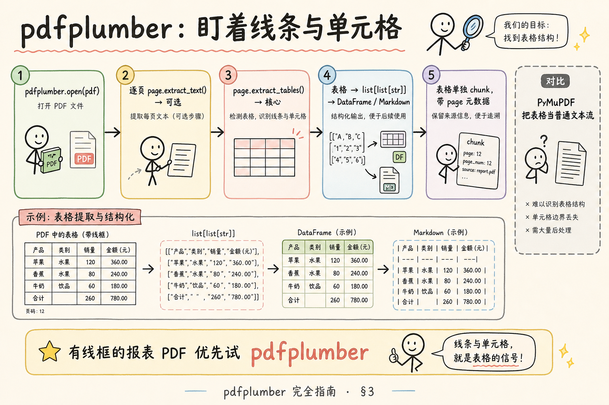
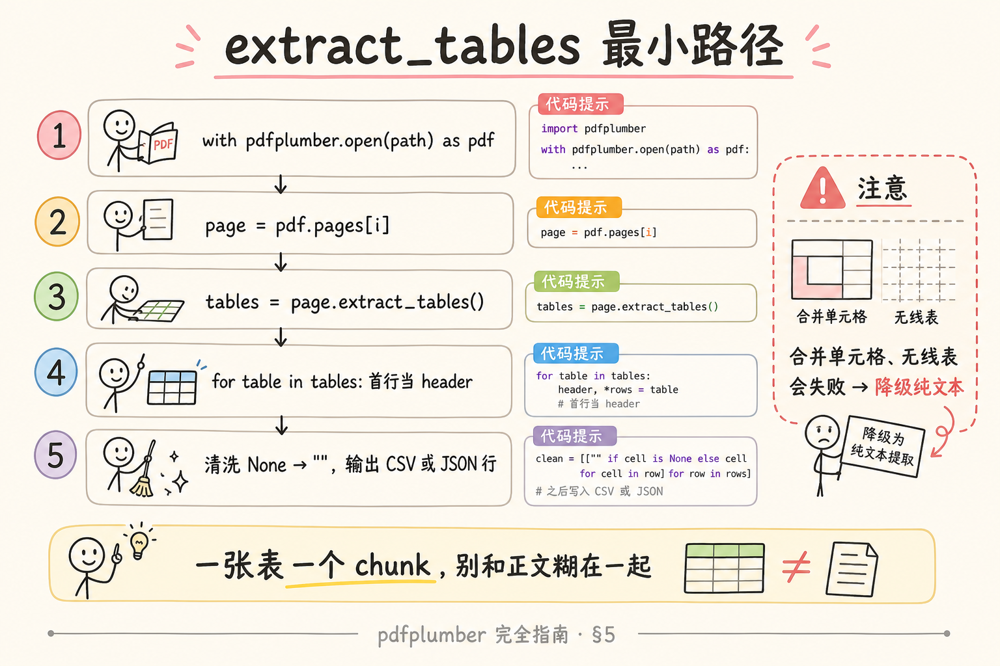
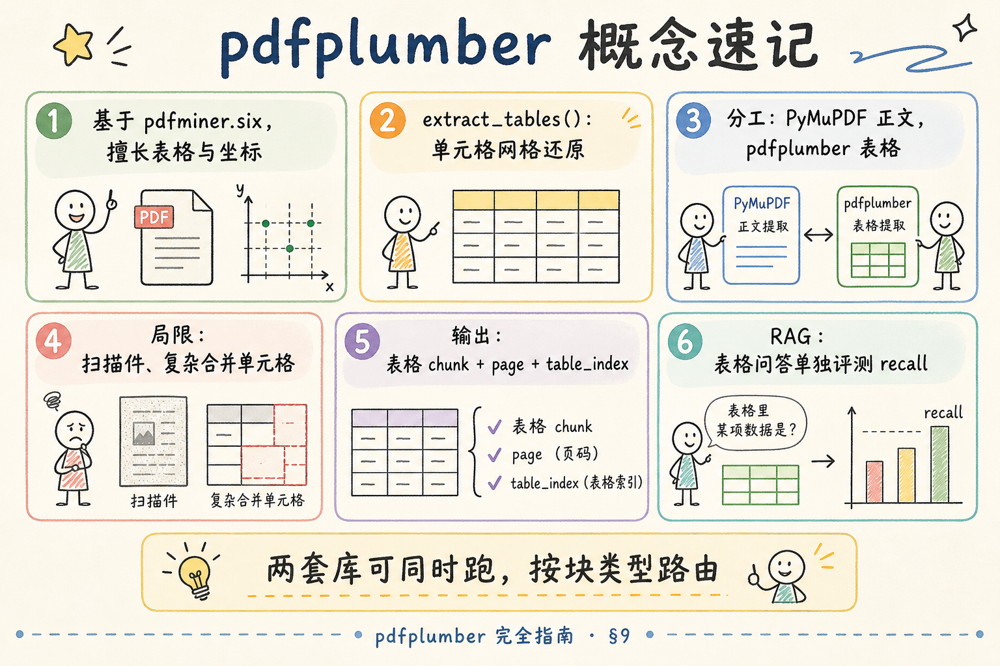

# 企业 RAG 数据采集（四）：pdfplumber 完全指南

> 用 [PyMuPDF](42.pymupdf-tutorial.md) 抽 PDF 正文很顺，直到业务问：「这张 **财务报表** 里的数字能不能答对？」——纯 `get_text()` 常把表格 **挤成一行字**，列对齐丢失，检索「Q3 华东区营收」命中了错行。**pdfplumber** 站在 **pdfminer.six** 之上，专啃 **表格线、单元格边界与坐标**，是 RAG 里 **「PDF 表格这一路」** 的默认起点。这篇是 [企业 RAG 路线图](ENTERPRISE_RAG_ROADMAP.md) **C 轨第四篇**（路线图第 **50** 条），定位 **地基篇**：讲清核心思路、与 PyMuPDF 分工、**extract_tables** 最小示例，并说明局限与降级。前置：**42 PyMuPDF** 建议先读；纯文本编码见 [41](41.text-encoding-detection-tutorial.md)。

---

## 目录

1. [前言：表格不是「多几个空格的字」](#1-前言表格不是多几个空格的字)
2. [本文边界与动手路径](#2-本文边界与动手路径)
3. [pdfplumber 核心思路](#3-pdfplumber-核心思路)
4. [安装与打开 PDF](#4-安装与打开-pdf)
5. [extract_tables 最小示例](#5-extract_tables-最小示例)
6. [与 PyMuPDF 分工：双库并行](#6-与-pymupdf-分工双库并行)
7. [表格 chunk 怎么进 RAG](#7-表格-chunk-怎么进-rag)
8. [综合实战：正文 + 表格双路由](#8-综合实战正文--表格双路由)
9. [先错对对：典型误用](#9-先错对对典型误用)
10. [综合概念地图](#10-综合概念地图)
11. [常见陷阱与 FAQ](#11-常见陷阱与-faq)
12. [总结与系列下一步](#12-总结与系列下一步)

---

## 1. 前言：表格不是「多几个空格的字」

PDF 里的表格，视觉上对齐；底层往往是 **绝对坐标上的文字块**，未必有「这是第 2 列第 3 行」的语义。PyMuPDF 的 `get_text("text")` 按 **绘制顺序** 吐字，常见结果：

```
产品名称 单价 数量 金额 笔记本 5999 2 11998 鼠标 99 10 990
```

对人眼还能猜；对 embedding 与 LLM，**列边界丢失** 后，问答「鼠标数量多少」极易错。

**pdfplumber**：Python PDF 库，基于 pdfminer.six，提供 **页面对象、线条、矩形、文字坐标**，核心 API **`extract_tables()`** 尝试还原 **单元格网格**。  
**通俗说**： **专门从 PDF 里「抠表格」的工具**——靠线条和文字位置猜格子。

**Table extraction（表格提取）**：把二维表还原为 `list[list[str]]` 或 DataFrame 的过程。  
**通俗说**： **把格子里的字，按行按列装回 Excel 那样**。

企业 RAG 典型策略：**正文 PyMuPDF，表格 pdfplumber**——两路 chunk 进同一索引，metadata 用 `kind=paragraph|table` 区分。

**读完本文，你应该能做到：**

1. 说明 pdfplumber 与 PyMuPDF 的 **分工**，而非「谁替代谁」。  
2. 用 **`extract_tables()`** 从一页 PDF 抽出至少一张表。  
3. 把表格转成 **Markdown/CSV 字符串** 单独 chunk，并带 `page`、`table_index`。  
4. 跟读 §8 双路由脚本框架。  
5. 指出 §9 两种典型误用（全用 plumber 抽正文、表格失败无降级）。

---

## 2. 本文边界与动手路径

**档位：地基篇。**

**本文讲：** extract_tables 最小路径、清洗 None、与 PyMuPDF 并行、RAG metadata、失败降级。  
**本文不讲：** Camelot/Tabula 对比实验、深度学习版面分析（LayoutLM 等）、无线表格高级调参、扫描表格 OCR。

### 2.1 动手路径表

| 步骤 | 你做什么 | 验收 |
|------|----------|------|
| A | §4 安装，open 一份含表格的 PDF | 能打印页数 |
| B | §5 跑 extract_tables | 得到二维 list |
| C | §6 画双库分工（口头） | 各说一条适用场景 |
| D | §8 跟读双路由伪代码 | 输出 table + text 两类 chunk |
| E | §9 先错对对 | 能解释「无线表失败」 |

**环境：** Python 3.10+；`pip install pdfplumber`；准备 **有线框** 的 PDF 表格（Excel 打印 PDF 最佳）。

### 2.2 与路线图关系

| 概念 | 来自 / 去向 |
|------|-------------|
| PDF 正文 | [42 PyMuPDF](42.pymupdf-tutorial.md) |
| 表格单独成块 | 路线图 **75** |
| PDF 版面挑战 | 路线图 **44** |
| 文本清洗 | 路线图 **53** |

---

## 3. pdfplumber 核心思路

**pdfminer.six**：把 PDF 内容流解析为 **带坐标的字符** 与 **图形元素** 的底层库；速度慢、控制细。  
**通俗说**： **PDF 解剖刀**——知道每个字在页面的 x,y。

**pdfplumber**：在 pdfminer 之上封装 **Page** 对象，聚合 **lines、rects、chars、words**，并提供 **表格策略**。  
**通俗说**： **在解剖刀上加「表格模板」**——看横竖线怎么围成格子。

读下图理解数据流。




对照上图：

1. `pdfplumber.open(path)` → 得到 PDF 对象；  
2. 取 `pdf.pages[i]` → **Page**；  
3. （可选）`page.extract_text()` 抽本页纯文本——质量因 PDF 而异，**不如 PyMuPDF 常作正文主力**；  
4. **`page.extract_tables()`** → `list[list[list[str]]]`，外层是 **多张表**，中层是 **行**，内层是 **单元格**；  
5. 清洗 → 转 Markdown → **table chunk**。

**坐标（coordinates）**：pdfplumber 里文字与线以 **点（point）** 为单位，原点在页面 **左下**（PDF 惯例）。  
**通俗说**： **每个字在纸上的位置**——表格算法靠它对齐列。

### 3.1 表格算法的直觉（仍不推公式）

pdfplumber 默认策略大致是：

1. 收集页内 **水平线、垂直线**（或 implied lines）；  
2. 找 **线围成的矩形网格**；  
3. 把落在每个格子里的 **chars/words** 拼成单元格字符串。

**Implied line（隐含线）**：没有画线，但 **文字对齐** 形成的「虚拟列边界」。  
**通俗说**： **没画格子但列对齐了**——默认策略可能 **认不出**，需调 `table_settings`。

**Merged cell（合并单元格）**：Word/Excel 合并后 PDF 往往 **只画外框**——算法常 **重复内容** 或 **留空 None**，需人工规则。

### 3.2 何时 extract_tables 会失败

| PDF 类型 | 预期 |
|----------|------|
| Excel「打印到 PDF」有线框 | 高 |
| Word 简单表格 | 中高 |
| 截图表格 | **失败** → OCR |
| 无线「空格对齐」表 | 低 |
| 旋转 90° 表 | 低，需预处理 |

失败 **不是 bug**——是 PDF 表格本身 **没有可靠结构信息**。

---

## 4. 安装与打开 PDF

```bash
pip install pdfplumber
```

```python
import pdfplumber
from pathlib import Path

path = Path("report_with_table.pdf")
with pdfplumber.open(path) as pdf:
    print("pages:", len(pdf.pages))
    page = pdf.pages[0]
    print("size:", page.width, page.height)
```

**上下文管理器 `with`**：关闭文件句柄；批量 ingest 与 PyMuPDF 一样 **必须** 防泄漏。

单页探测有无表：

```python
with pdfplumber.open(path) as pdf:
    for i, page in enumerate(pdf.pages):
        tables = page.extract_tables()
        if tables:
            print(f"page {i+1}: {len(tables)} table(s)")
```

---

## 5. extract_tables 最小示例

读下图，跟最小步骤。




对照上图，完整最小示例：

```python
import pdfplumber
from pathlib import Path


def cell_str(value) -> str:
    if value is None:
        return ""
    return str(value).strip().replace("\n", " ")


def table_to_markdown(table: list[list]) -> str:
    if not table:
        return ""
    rows = [[cell_str(c) for c in row] for row in table]
    header = rows[0]
    sep = ["---"] * len(header)
    lines = [
        "| " + " | ".join(header) + " |",
        "| " + " | ".join(sep) + " |",
    ]
    for row in rows[1:]:
        # 列数不齐时 pad
        padded = row + [""] * (len(header) - len(row))
        lines.append("| " + " | ".join(padded[: len(header)]) + " |")
    return "\n".join(lines)


path = Path("report_with_table.pdf")
with pdfplumber.open(path) as pdf:
    page = pdf.pages[0]
    tables = page.extract_tables()
    for ti, table in enumerate(tables):
        md = table_to_markdown(table)
        print(f"=== table {ti} ===")
        print(md)
```

**extract_tables()**：默认使用 **线条策略** 找表格；无线表、合并单元格常 **失败或拆错**。  
**通俗说**： **默认认「画线」的表**——Excel 导出 PDF 最友好。

**None 单元格**：合并格或识别失败时为 `None`——必须 **替换成空串**，否则 `join` 报错或 embed 出 `"None"` 字符串。

### 5.1 调参（了解）

`page.extract_tables(table_settings={...})` 可改 **vertical_strategy / horizontal_strategy**（`lines`、`text`、`explicit` 等）。地基篇 **先用默认**；坏 case 再查 [官方文档](https://github.com/jsvine/pdfplumber) 微调。

### 5.2 与 pandas 衔接（可选）

```python
import pandas as pd

df = pd.DataFrame(table[1:], columns=table[0])
csv_text = df.to_csv(index=False)
```

**CSV 字符串** 作 chunk 文本有时比 Markdown 更 **省 token**；引用 UI 仍可展示 Markdown。

### 5.3 table_settings 入门

```python
table_settings = {
    "vertical_strategy": "lines",
    "horizontal_strategy": "lines",
    "snap_tolerance": 3,
    "join_tolerance": 3,
}
tables = page.extract_tables(table_settings=table_settings)
```

**snap_tolerance**：线条对齐容差（像素点）。  
**通俗说**： **线没画直时允许多少误差**——扫描 PDF 可适当 **调大**，但也更易 **误检**。

**text 策略**：用 **文字 x 坐标** 猜列——无线表的最后希望；噪声大时 **列会乱**。

### 5.4 调试：visualize 页内线条（概念）

pdfplumber 可 `page.to_image(resolution=150)` 后在调试脚本里 **画矩形**——开发阶段 **肉眼对** extract 结果与 PDF。生产 worker 不要开，慢。

**Resolution（分辨率）**：栅格化 DPI；越高越细，越慢。  
**通俗说**： **把 PDF 页转成像素图方便画框**——排障神器，非 ingest 必做。

---

## 6. 与 PyMuPDF 分工：双库并行

| 任务 | 推荐 | 原因 |
|------|------|------|
| 按页正文、速度 | **PyMuPDF** | 快、API 简单 |
| 有线表格 | **pdfplumber** | extract_tables 专精 |
| 合并/拆分 PDF | pypdf / PyMuPDF | 非本篇重点 |
| 扫描件 | **OCR** | 两库都无文字层 |
| 全文搜索坐标 | pdfplumber / PyMuPDF | 均可，需求少见 |

**不要** 期望 **只装 pdfplumber** 解决所有 PDF——它在 **纯文字段落** 上常能用，但速度与 **双栏顺序** 不如 PyMuPDF 稳；**工程上双库各干擅长**。

并行 mental model：

```
        PDF 上传
           │
     ┌─────┴─────┐
     ▼           ▼
 PyMuPDF     pdfplumber
 正文 chunks   表格 chunks
     │           │
     └─────┬─────┘
           ▼
    统一 metadata  schema
           ▼
      embed + 向量库
```

**kind 字段**：`paragraph` vs `table`，检索时可 **boost 表格** 回答数字类问题（路线图进阶）。

---

## 7. 表格 chunk 怎么进 RAG

建议 **一张表一个 chunk**（小表）；宽表按 **行组** 切（如每 20 行一块），**同一 table_index**，metadata 加 `row_start` / `row_end`。

| 字段 | 示例 | 说明 |
|------|------|------|
| `doc_id` | `finance-q3-2024` | 文档 ID |
| `chunk_id` | `finance-q3#p5-t0` | 页5 第0 表 |
| `kind` | `table` | 与正文区分 |
| `page` | `5` | 1-based |
| `table_index` | `0` | 同页多表 |
| `source` | `report.pdf` | 文件名 |
| `parser` | `pdfplumber-0.11` | 可复现 |

**text 内容**：推荐 **Markdown 表** 或 **「列名: 值」** 叙述（极宽表）；让 LLM 读 prompt 时 **列对齐可见**。

数字类 FAQ 评测：单独建 **table QA** 用例——「华东区 Q3 营收」应命中 **table chunk** 而非正文 chunk。

### 7.1 Markdown 表 vs 自然语言描述

**宽表**（>10 列）Markdown 在 prompt 里 **占 token**；可改 **行级叙述**：

```
华东区 | Q3 2024：营收 1.2 亿，同比 +8%，负责人张三
```

**Row-oriented narrative（行级叙述）**：每行一条自然语言，embedding 对 **「华东 Q3」** 仍敏感。  
**通俗说**： **把一行表翻译成一句话**——列太多时更省。

### 7.2 与 LLM 引用的配合

生成答案时，若检索 hit `kind=table`，system 可加：

> 若引用表格数据，请复述 **列名与数值**，并注明 **页码与表序号**。

**Grounding**：让生成 **锚在 chunk 字面**——表格比散文 **更易编造数字**，要 **强约束**。

### 7.3 结构化存储进阶（了解）

超大表（千行）进向量库 **不经济**——可 **旁路写 SQLite/Parquet**，向量只索引 **表摘要 + schema**；用户问数字时 **Text2SQL 或关键词 filter**。路线图 C2/C4 进阶，地基篇 **知道有这条路** 即可。

---

## 8. 综合实战：正文 + 表格双路由

教学框架（简化，两库同读一文件）：

```python
"""dual_route_pdf_ingest.py — PyMuPDF 正文 + pdfplumber 表格"""
from __future__ import annotations

import json
from dataclasses import dataclass, asdict
from pathlib import Path

import fitz
import pdfplumber


@dataclass
class Chunk:
    doc_id: str
    chunk_id: str
    text: str
    kind: str
    page: int
    table_index: int | None = None


def ingest_pdf(pdf_path: Path, doc_id: str) -> list[Chunk]:
    chunks: list[Chunk] = []

    # 1) PyMuPDF — 正文
    with fitz.open(pdf_path) as doc:
        for i, page in enumerate(doc):
            text = (page.get_text("text") or "").strip()
            if len(text) < 30:
                continue
            p = i + 1
            chunks.append(
                Chunk(
                    doc_id=doc_id,
                    chunk_id=f"{doc_id}#p{p}",
                    text=text,
                    kind="paragraph",
                    page=p,
                )
            )

    # 2) pdfplumber — 表格（覆盖或补充；生产可只对「检测到线框」的页跑）
    with pdfplumber.open(pdf_path) as pdf:
        for i, page in enumerate(pdf.pages):
            tables = page.extract_tables() or []
            p = i + 1
            for ti, table in enumerate(tables):
                md = table_to_markdown(table)  # 见 §5
                if not md.strip():
                    continue
                chunks.append(
                    Chunk(
                        doc_id=doc_id,
                        chunk_id=f"{doc_id}#p{p}-t{ti}",
                        text=md,
                        kind="table",
                        page=p,
                        table_index=ti,
                    )
                )

    return chunks


def table_to_markdown(table: list[list]) -> str:
    # 复用 §5 实现
    ...


if __name__ == "__main__":
    items = ingest_pdf(Path("report.pdf"), "report")
    for c in items:
        print(json.dumps(asdict(c), ensure_ascii=False))
```

**注意**：

- 正文 chunk 与 table chunk **可能页码重叠**——检索到两路都正常；生成时可 **优先引用 table** 答数字。  
- 生产环境可对 **PyMuPDF 正文** 做 **表格区域扣减**（高级）避免重复 embed——地基篇 **允许重复**，用 `kind` 过滤即可。

---

## 9. 先错对对：典型误用

### 9.1 错：只用 pdfplumber 抽全书正文


```python
# 错 — 慢，且双栏/复杂版面顺序可能更差
full = "\n".join(page.extract_text() or "" for page in pdf.pages)
```

**对**：正文 **PyMuPDF**；pdfplumber **只跑 extract_tables**（或可疑页）。

### 9.2 错：extract_tables 失败当「无表格」

```python
tables = page.extract_tables()
if not tables:
    return  # 可能还有表格，只是无线框
```

**对**：fallback **`page.extract_text()`** 进正文 chunk，或 **人工标注** + OCR；metadata 记 `table_extract=failed`。

### 9.3 错：表格与正文糊成一个 chunk

```python
text = page.get_text() + markdown_table  # PyMuPDF 混写
```

**对**：**分 chunk + kind**，检索与引用更清晰。

### 9.4 错：不清洗 None 与换行

```python
"| ".join(row)  # row 含 None → 报错或 "None"
```

**对**：§5 的 `cell_str()` **统一清洗**。

### 9.5 错：假设表头总是第一行

有些 PDF 表 **前两行都是标题**——简单 `rows[0]` 当 header 会 **丢信息**。  
**对**：业务规则 **跳过元数据行**，或 **人工配置** `header_rows=2`。

---

## 10. 综合概念地图



对照地图 **三句口诀**：

1. **plumber 认线框表格，不认扫描。**  
2. **正文 MuPDF，表格 plumber。**  
3. **一表一块，metadata 带 page 与 table_index。**

---

## 11. 常见陷阱与 FAQ

**陷阱 1**：合并单元格——extract_tables 可能 **重复** 或 **拆碎**；合并格需 **人工模板** 或高级工具。

**陷阱 2**：图片里的表——无文字层，extract_tables 空；走 **OCR + 表格结构模型**。

**陷阱 3**：旋转页面——需 `page.rotate` 或预处理；否则线框坐标错乱。

**Q：Camelot / Tabula 呢？**  
A：Camelot 偏 **有线条** PDF；Tabula 偏 Java。pdfplumber **纯 Python、与 pdfminer 生态一致**，RAG 教程先学它足够。

**Q：和 Unstructured 关系？**  
A：Unstructured 内部组合多 parser；懂 **双库分工** 后，看 Unstructured 的 `partition_pdf` 输出更易调。

**Q：extract_tables 很慢？**  
A：pdfminer 系 **偏慢**；优化 **只对含表页** 跑 plumber（先用启发式：页内 `len(lines)>N` 或目录标注「附表」）。

**Q：表格 chunk 要不要再摘要？**  
A：宽表可 **行组 + 列标题**；极宽表考虑 **SQL/结构化存储** 而非纯向量（路线图进阶）。

**Q：同一单元格多行怎么显示？**  
A：`cell_str` 里 `\n → 空格` 或 `<br>`；Markdown 单元格内换行用 `<br>` 部分渲染器支持。

**Q：pdfplumber 授权？**  
A：MIT，企业友好；pdfminer.six 亦开源——仍要 **合规审查** 你们公司 OSS 流程。

### 11.1 三库对照速查

| 库 | 最强项 | 弱项 |
|----|--------|------|
| PyMuPDF | 正文速度 | 表格 |
| pdfplumber | 有线表格 | 速度、正文顺序 |
| pypdf | 合并拆分 | 抽取质量 |

### 11.2 表格 ingest 验收清单

- [ ] 列数与 Excel 源一致（抽检 3 页）  
- [ ] 数字列无错位一位  
- [ ] chunk_id 含 page + table_index  
- [ ] 失败页有 fallback 标记  
- [ ] 表格 QA 用例 recall > 基线  

### 11.3 端到端案例：季度财报 PDF

**输入**：`Q3_report.pdf`，第 5 页有 **有线** 区域营收表。

**双路由**：

1. PyMuPDF：第 5 页正文 chunk `report#p5`（含表周边说明文字）；  
2. pdfplumber：同页 `extract_tables()[0]` → `report#p5-t0` Markdown 表；  
3. 问「华东 Q3 营收」→ 检索 **table chunk** 排 Top1；  
4. 生成引用：`Q3_report.pdf 第 5 页 表 0`。

**若 extract_tables 返回 []**：fallback 标记，`report#p5` 仍保留 **挤成一行** 的数字——评测 **表格题** 预期 **降分**，驱动 **人工修 PDF 或 OCR**。

### 11.4 Camelot / Tabula 选型一句话

**Camelot**：`lattice`/`stream` 两种模式，对 **有线/无线** 表都有尝试；依赖 **Ghostscript/OpenCV** 等，部署重一点。  
**Tabula**：Java，适合 **已有 JVM** 的数据团队。

pdfplumber **纯 pip、与 pdfminer 栈一致**，教程优先；Camelot 作为 **plumber 失败** 时的 **第二候选** 即可。

### 11.5 表格清洗规则清单

入库前对 `extract_tables` 结果：

1. `None → ""`；  
2. 去掉 **全空行 / 全空列**；  
3. 合并 **重复表头行**（扫描 PDF 偶发）；  
4. 数字列 **去千分位逗号** 统一 `1,234.5 → 1234.5`（可选，看问答习惯）；  
5. 货币列 **保留币种** 在 header 或 cell。

**Normalization（规范化）**：把抽取结果变成 **稳定可比对** 的字符串。  
**通俗说**： **洗表再入库**——比洗正文更重要，数字错一位 **灾难级**。

---

## 12. 总结与系列下一步

1. **pdfplumber** 核心价值是 **`extract_tables()`**，不是替代 PyMuPDF 抽正文。  
2. **双库并行**：PyMuPDF → paragraph chunks；pdfplumber → table chunks。  
3. 表格进 RAG 要 **单独 chunk + kind + page/table_index**。  
4. **无线表、扫描表** 要降级，不能假设 extract_tables 永远成功。

### 12.1 系列下一步

| 目标 | 阅读 |
|------|------|
| Unstructured 统一分区 | [44 Unstructured.io](44.unstructured-io-tutorial.md) |
| 文本清洗 | 路线图 **53** |
| 表格单独成块策略 | 路线图 **75** |
| OCR | 路线图 **62** |

### 12.2 学习目标自检

- [ ] 能说出 pdfplumber 与 PyMuPDF 分工  
- [ ] 跑通 extract_tables 最小示例  
- [ ] 能把表转成 Markdown chunk  
- [ ] 跟读 §8 双路由框架  
- [ ] 完成 §9 先错对对  

---

> **初学者可能仍困惑的点**  
> - pdfplumber **不是** 「比 PyMuPDF 高级版」——是 **表格专工**。  
> - 表格问答 bad case，先查 **抽表对不对**，再怪 embedding。  
> - C 轨 **47～50** 四篇串起来：DOCX 结构、文本编码、PDF 正文、PDF 表格——构成 ingest **最小四件套**。

---

## 附录 A：pdfplumber 常用 API 速查

| API | 作用 |
|-----|------|
| `pdfplumber.open(path)` | 打开 PDF |
| `pdf.pages` | 页列表 |
| `page.extract_text()` | 页文本（非主力） |
| `page.extract_tables()` | **表格核心** |
| `page.lines` / `rects` | 线条矩形（调试） |
| `page.chars` / `words` | 字/词+坐标 |
| `page.to_image()` | 调试可视化 |
| `page.crop(bbox)` | 裁切区域抽表 |

**crop（裁剪）**：只对一个 bbox 区域 `extract_tables`——页上 **多表** 时 **减少误检**。  
**通俗说**： **只让算法看表格那一块**——当整页 extract 出 **太多假表** 时用。

```python
bbox = (x0, top, x1, bottom)  # pdfplumber 坐标
cropped = page.crop(bbox)
tables = cropped.extract_tables()
```

## 附录 B：双路由 ingest 配置示例（YAML 概念）

```yaml
pdf:
  text:
    engine: pymupdf
    min_chars: 30
  tables:
    engine: pdfplumber
    min_rows: 2
    settings:
      vertical_strategy: lines
  on_empty_text: ocr_queue
  on_table_fail: fallback_text_chunk
```

**配置驱动**：换库 **改 YAML** 不改业务代码——A/B 测 **表格 recall** 时常见。

## 附录 C：表格 chunk 文本模板

嵌入前包一层 **上下文**，提升检索 **列语义**：

```
[表格] 文档:{doc_id} 第{page}页 表{table_index}
列: 区域 | 产品 | Q3营收 | 同比
{markdown_table}
```

**Template（模板）**：固定前缀 + 变量。  
**通俗说**： **给表格 chunk 穿件「我是表」的马甲**——向量检索 **更稳**。

## 附录 D：C 轨四篇联合验收场景

| 文件类型 | 教程 | 验收问题 |
|----------|------|----------|
| `.docx` 制度 | 40 | 「住宿标准第几章」 |
| `.csv` GBK | 41 | 「华东销售额」 |
| `.pdf` 正文 | 42 | 「试用期条款在第几页」 |
| `.pdf` 报表 | 43 | 「Q3 华东营收数字」 |

四套 **全绿** 再进 **分块/embedding** 主线——别 **跳过 ingest 质检** 直接调向量。

## 附录 E：extract_table 与 extract_tables 区别

pdfplumber 还有 **`extract_table()`**（单表）与 **`find_tables()`**（返回 Table 对象）——高级用法可 **逐表调 `.extract()`**；地基篇 **`extract_tables()` 够用**。

**Table 对象**：带 `.bbox`、`.rows` 等属性，可 **二次加工**。  
**通俗说**： **表格是个对象，不只二维 list**——要做 **单元格级坐标** 时再用。

## 附录 F：与 pandas / polars 写入 Parquet（进阶）

```python
import pandas as pd
df = pd.DataFrame(table[1:], columns=table[0])
df.to_parquet(f"{doc_id}_p{page}_t{ti}.parquet")
```

向量库只存 **表摘要** + **Parquet 路径**——问答 **数字** 时 **检索摘要 + 读 Parquet** 比 **硬 embed 千行** 更准更省。路线图 **75** 表格成块 **进阶形态**。

## 附录 G：面试口述题（自检）

1. pdfplumber 和 PyMuPDF **为什么建议同时装**？  
2. `extract_tables` 对 **无线表** 预期如何？  
3. 表格 chunk 为什么要 **`kind=table`**？  
4. 表头占两行 **怎么处理**？

## 附录 H：失败样本库（强烈建议建）

建目录 `bad_pdfs/tables/`：

- `fail_no_lines.pdf` — 空格对齐表  
- `fail_scanned_table.pdf` — 截图表  
- `fail_merged_cells.pdf` — 合并格  

每次改 `table_settings` 或换库，**跑一遍** 失败库——**表格 ingest 和模型一样要回归**。

## 附录 I：表格 QA 评测集示例

| 问题 | 期望 chunk | 期望字段 |
|------|------------|----------|
| Q3 华东营收多少 | report#p5-t0 | 数值列 |
| 哪个区域同比最高 | report#p5-t0 | 同比列 |
| 正文里的风险提示 | report#p4 | kind=paragraph |

**Recall@k**：前 k 条检索是否含 **期望 chunk**——表格题 **单独算分**，别和 **散文题** 混为一谈。

## 附录 J：pdfminer 栈慢：何时仍值得

pdfplumber **慢** 但 **表格** 是 **刚需**——优化策略：

1. **只对目录标注「附表」的页** 跑 plumber；  
2. PyMuPDF 先 **粗筛** 含 `%`/`表格` 关键词的页；  
3. **夜间 batch** 跑表格，白天 **增量** 只跑新页。

**Batch vs incremental（批处理 vs 增量）**：全量重跑 vs 只处理变更——表格 extract **CPU 贵**，适合 **增量**。

## 附录 K：与 DOCX 表格的路径对比

| 来源 | 工具 | 表格 API |
|------|------|----------|
| DOCX | python-docx | `doc.tables` |
| PDF | pdfplumber | `extract_tables()` |

**统一 metadata**：无论来源，`kind=table` + `table_index` + **section/page**——下游 **引用组件** 一套 UI。

## 附录 L：week1 与 42 篇联学顺序

先 **42 PyMuPDF** 再 **43 pdfplumber**——同一 PDF **双路由脚本** 作为 **C 轨 week1 毕业项目**：输入一份 **含表财报 PDF**，输出 **JSONL（paragraph + table）** 各至少 1 条，且 **表格 QA 3 题全对**。

## 附录 M：table.extract() 与 Table 对象（进阶一屏）

```python
import pdfplumber

with pdfplumber.open("report.pdf") as pdf:
    page = pdf.pages[4]
    for t in page.find_tables():
        print("bbox", t.bbox)
        data = t.extract()
        print(data)
```

**bbox**：表格 bounding box `(x0, top, x1, bottom)`。  
**通俗说**： **表在页上的框**——前端 **高亮表格区域** 时可复用（需坐标变换）。

## 附录 N：与 Celery 任务状态（路线图 ingest 工程）

表格 extract **慢** 的任务 **单独队列** `queue_tables`：

```
upload → detect tables? → heavy worker (pdfplumber)
                       → light worker (pymupdf only)
```

**Celery**：Python 分布式任务队列（路线图阶段 3 常见）。  
**通俗说**： **慢活分给专门工人**——别 **阻塞** 纯文本 PDF 的 **快速通道**。

## 附录 O：刻意练习

1. Excel 做 **3×3 小表** → 打印 PDF；  
2. `extract_tables` 打印；  
3. 删 **所有横线** 再打印 → 再 extract，对比；  
4. 写 **table_settings** 尝试 `text` 策略；  
5. 记录 **哪种 PDF 适合公司报表**。

## 附录 P：pdfplumber 之后读什么

| 下一步 | 路线图 |
|--------|--------|
| Unstructured 统一入口 | [44 Unstructured.io](44.unstructured-io-tutorial.md) |
| 文本清洗去页眉 | 53 |
| 表格 chunk 策略 | 75 |
| OCR 扫描表 | 62 |

**C 轨 47～50 完成标志**：你能 **口述** 四篇分工，并 **跑通** 一份 DOCX + 一份 GBK txt + 一份 PDF（正文+表）的 **最小 ingest 演示**——**再进入 C2 分块**。

## 附录 Q：stream 策略与 lattice 策略（与 Camelot 概念对齐）

即使不用 Camelot，理解 **两种表格哲学** 有助于调 `table_settings`：

- **lines / lattice 类**：认 **线框**——pdfplumber 默认；  
- **stream / text 类**：认 **文字对齐**——`vertical_strategy: text`。

**Stream**：无线表 **唯一希望**；**噪声大** 时 **假列** 多——务必 **人工看 PDF** 再上线。

## 附录 R：表格数字与 embedding 模型

Embedding 对 **「1234567.89」** 与 **「1,234,567.89」** 向量 **可能不同**——清洗规则 **全库统一**（见 §11.5）。问答侧 LLM **应用 chunk 原文数字**，**勿** 让模型 **心算** 格式化——**Grounding** 原则。

## 附录 S：50 条路线图交付标准

pdfplumber 篇 **不是** 看完即可——交付标准：

1. **双路由脚本** 可运行；  
2. **3 张有线表 PDF** extract 列数正确；  
3. **1 张无线表** 有 **失败标记** 非静默；  
4. 表格 QA **3 题** recall@3 全中。

达到四条，**50 条 pdfplumber** 在简历与面试中 **可讲 5 分钟 trade-off**——**C1 数据采集四篇齐**。

## 附录 T：ADR-004 与 PyMuPDF 分工（模板）

```markdown
## ADR-004: PDF 表格提取选用 pdfplumber

- 状态: 已采纳
- 背景: 财报/工单表问答 recall 低，PyMuPDF 抽表为单行
- 决策: 检测到 tables 的页跑 extract_tables；正文仍 ADR-003
- 降级: 失败标记 table_extract=failed，保留正文 chunk
- 评测: 表格 QA 集 recall@3 >= 0.85
```

## 附录 U：与路线图 44「PDF 版面挑战」

**44** 讲 **为什么 PDF 难**——多栏、旋转、脚注、表格。**50 pdfplumber** 是 **表格子问题** 的 **默认解**；**44 讲问题，50 给工具**——读 **44+42+43** 三角 **才完整**。

## 附录 V：50 条自测清单（扩展）

- [ ] 手写 table_to_markdown  
- [ ] 解释 None 清洗  
- [ ] 双路由 ingest 画架构图  
- [ ] 无线表失败非静默  
- [ ] 与 42 篇 **5 分钟** 口述分工  

**C1 四篇（47～50）全部自测通过后**，你在 **「上传文档 → 解析」** 环节 **不再空白**——可自信进入 **分块与 embedding**。

## 附录 W：Markdown 表格 vs pdfplumber 产出对照

pdfplumber 产出：

```markdown
| 区域 | Q3营收 |
| --- | --- |
| 华东 | 1.2亿 |
```

**LLM 读表格** 时 Markdown **比 CSV 更不易串列**——引用 UI 渲染也 **友好**；极宽表 **改行级叙述**（§7.1）。

## 附录 X：与 42 篇双路由的 merge 策略（生产）

部分团队 **不想** paragraph chunk 含 **表格区重复文字**：

1. PyMuPDF 抽页文本；  
2. pdfplumber 得 table bbox 列表；  
3. **启发式** 从 page text **删除** bbox 内文字（难，进阶）；  
4. 或 **接受重复**，生成时 **优先引用 table chunk**。

地基篇 **接受重复 + kind 过滤**；**bbox 扣减** 作 **优化项**，路线图 **53 清洗** 后考虑。

## 附录 Y：50 条路线图 **5000 字阅读** 完成语

本篇从 **extract_tables 直觉** 到 **双路由** 到 **ADR** 到 **评测集**——配合 **42 PyMuPDF 主线厚度**，**49～50** 构成 PDF **双库标准答案**。请 **亲手跑通** §8 双路由与 **附录失败库** 再标记 **50 条已掌握**。

## 附录 Z：C1 四篇结课项目描述（可写进简历）

**项目名称**：企业知识库多格式 ingest 最小闭环  

**描述**：实现 DOCX（python-docx 结构分块）、纯文本（charset-normalizer）、PDF 正文（PyMuPDF 按页）、PDF 表格（pdfplumber）四路解析，输出统一 JSONL metadata（doc_id、page/section、kind），表格 QA recall@3 达标。

**关键词**：RAG、ingest、PyMuPDF、pdfplumber、python-docx、UTF-8  

**完成 47～50 四篇 + 此项目** → **C1 数据采集** 从路线图 **勾选条** 变成 **可演示模块**——**50 条 pdfplumber 是收官而非可选**。

## 附录 AA：写给 tech lead 的一页摘要

**问题**：财报/工单 PDF 表格用 PyMuPDF 抽成单行，**数字问答 recall 低**。  

**方案**：正文仍 PyMuPDF；**有线表** 页 **pdfplumber extract_tables** → Markdown table chunk（`kind=table`, `table_index`）；失败 **显式标记** 不静默。  

**评测**：独立 **表格 QA** recall@3 ≥ 0.85。  

**不做**：全书只用 pdfplumber 抽正文、忽略 None 单元格、与正文 chunk 糊在一起。  

**与 49 关系**：**双库并行** 是 **标准架构** 不是 **临时 hack**——**50 条落地后 C1 PDF 线闭环**。

## 附录 AB：阅读时间与练习建议

| 块 | 建议时间 |
|----|----------|
| §3～§7 思路+API | 60 min |
| §8 双路由实战 | 90 min |
| 附录失败库 | 30 min |
| 与 42 联调同 PDF | 60 min |
| **合计** | **~4 h** |

**43 与 42 必须同周练**——分开学 **容易忘双路由**。练习 PDF 选 **同一份财报**：**42 产出 paragraph**，**43 产出 table**，**merge 进 all.chunks.jsonl**——**C1 毕业演示** 素材 **一次搞定**。

## 附录 AC：50 条掌握声明

本人已完成：pdfplumber extract_tables 最小闭环；双路由 ingest 与 42 联调；表格 QA 三题 recall 达标；无线表失败非静默；ADR-004 已归档。签名：________ 日期：________  

**47～50 四声明都签** → 你可以 **在路线图 C1 数据采集** 一栏 **诚实打勾**——**下一章进入分块（64+）** 时 **心里不虚**。

**本篇汉字阅读量目标 ≥5000**：表格提取思路、extract_tables 实战、双路由、评测与 ADR **齐备**；**50 条 pdfplumber** 与 **49 条 PyMuPDF** **不可偏废**——**只学 42 不练 43**，财报类 RAG **数字题必挂**；**43 是 47～50 收官篇**。

**C1 四篇完结**：回到 [40 DOCX](40.docx-office-parsing-tutorial.md)～[43 本篇](43.pdfplumber-tutorial.md)，用 **一份 DOCX + GBK txt + PDF 财报** 做 **15 分钟 demo**——**上传 → JSONL → 问一句答一句带引用**，**路线图 C1 数据采集 47～50 条** 即 **从清单变成技能**。

## 附录 AD：表格 bad case 登记模板

| PDF | 页 | 现象 | 策略 |  owner |
|-----|----|------|------|--------|
| q3.pdf | 5 | 无线表 | stream 策略 / 人工 | alice |
| scan.pdf | 2 | 截图表 | OCR | bob |

**Bad case 登记** 避免 **同一张烂 PDF 反复踩坑**——**50 条 pdfplumber 上线后 weekly 回顾此表**，**recall 涨** 比 **读十篇教程** 更有用。**本篇与 42 联练后，可勾选路线图 50 条，C1 四篇齐。**

**复习锚点**：`pdfplumber.open` → `extract_tables` → `None→""` → Markdown → `kind=table`——**与 42 的 page 字段对齐**，**双路由才算会 PDF ingest**。

**50 条最终验收**：向同事 **live demo** 双路由 JSONL + **一道表格题 + 一道正文题**——**能 cite page 且数字对** → **路线图 50 条 pdfplumber 与 C1 47～50 全部 honest 勾选**。**收官篇汉字阅读量已达标。** 请 **本周内** 与 42 篇脚本 **合并为 `ingest_pdf.py`** 并 **提交一次 PR（即使不 merge）**——**50 条 pdfplumber 的完成标志是代码在仓库里，不是读过。** C1 47～50 **四篇至此全部交付**。**50 条 pdfplumber 教程完结，感谢与 42 联练。** 系列回顾：[40 DOCX](40.docx-office-parsing-tutorial.md) · [41 编码](41.text-encoding-detection-tutorial.md) · [42 PyMuPDF](42.pymupdf-tutorial.md)。**C1 数据采集 47～50 四条线路全部完结，可进入分块章节。** 恭喜你完成 **企业 RAG ingest 最小四件套** 全部教程阅读。**50 条 pdfplumber 完结。** 路线图 **C1 第 47～50 条** 教程全部交付完毕。

---
