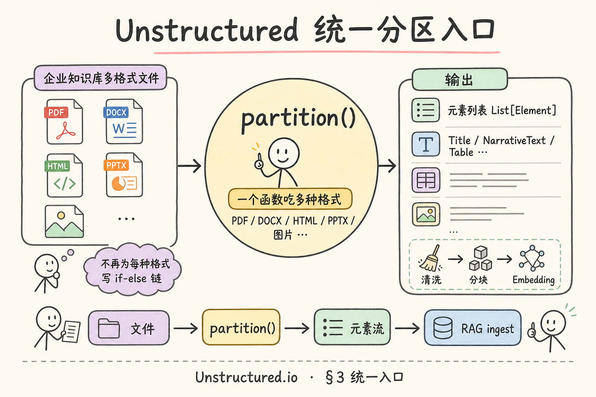
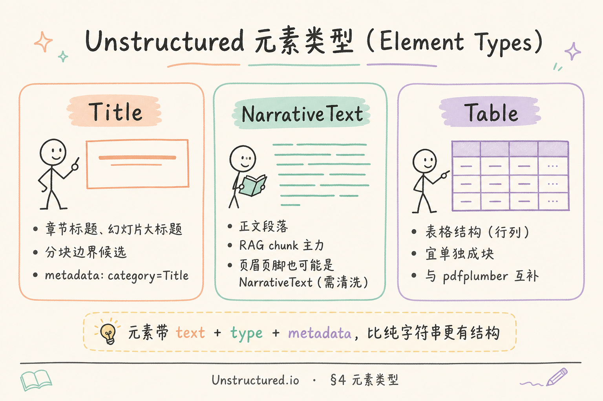

# 企业 RAG 数据采集（四）：Unstructured.io 统一分区完全指南

> 企业知识库 ingest 最烦人的一幕：同一套流水线要接 PDF、DOCX、PPTX、HTML、邮件附件、甚至截图。初学者往往写一条 **if 扩展名 else 换库** 的解析链——维护成本高，且每种格式的输出形状不一致：PDF 是一大段字符串，DOCX 是段落列表，HTML 还带标签噪音。上线后 chunk 质量参差，检索「第三章报销流程」时，有的来源带标题边界，有的把页眉和正文糊在一起。**Unstructured.io** 提供 **统一分区（partition）入口**：多种格式进、**元素（Element）列表** 出，给 RAG 一条可扩展的「结构化抽字」路径。这篇是 [企业 RAG 路线图](ENTERPRISE_RAG_ROADMAP.md) **C1 后半**（路线图第 **51** 条），讲清统一入口、元素类型、与自研解析链的分工、最小 `partition` 示例（含依赖重的现实），并做 **先错后对**。前置：[36 PDF 文本提取](36.pdf-text-extraction-tutorial.md)、[40 DOCX](40.docx-office-parsing-tutorial.md)、[42 PyMuPDF](42.pymupdf-tutorial.md)、[43 pdfplumber](43.pdfplumber-tutorial.md)。

---

## 目录

1. [前言：多格式 ingest 的「接口统一」问题](#1-前言多格式-ingest-的接口统一问题)
2. [本文边界与动手路径](#2-本文边界与动手路径)
3. [统一分区入口：partition 是什么](#3-统一分区入口partition-是什么)
4. [元素类型：Title、NarrativeText、Table](#4-元素类型titlenarrativetexttable)
5. [输出形状与 RAG 衔接](#5-输出形状与-rag-衔接)
6. [何时用 Unstructured vs 自研解析链](#6-何时用-unstructured-vs-自研解析链)
7. [安装与环境：依赖重的诚实说明](#7-安装与环境依赖重的诚实说明)
8. [最小实战：partition 跑通](#8-最小实战partition-跑通)
9. [先错后对：典型误用](#9-先错对对典型误用)
10. [综合概念地图](#10-综合概念地图)
11. [常见陷阱与 FAQ](#11-常见陷阱与-faq)
12. [总结与系列下一步](#12-总结与系列下一步)

---

## 1. 前言：多格式 ingest 的「接口统一」问题

假设你刚搭好第一版 RAG：PyMuPDF 抽 PDF、`python-docx` 读 Word、BeautifulSoup 刮 HTML。每个脚本输出格式不同：

```python
# PDF 脚本
{"text": "整页糊在一起……", "page": 3}

# DOCX 脚本
{"paragraphs": ["第一段", "第二段"]}

# HTML 脚本
{"body": "<div>……"}
```

下游 **分块（chunking）** 要写三套逻辑；换一个人维护，很快没人敢动。更糟的是：**表格** 在 PDF 里可能被抽成乱序数字，在 DOCX 里可能是真表格对象——若你不统一抽象，Embedding 阶段无法按「标题边界」或「表格单独成块」做策略。

**Unstructured.io**：开源（及商业）文档解析框架，核心 API 是 **`partition_*` 族函数**（或统一 `partition`），把多种文件转成 **带类型标签的元素列表**。  
通俗说：**一个喇叭口吃进各种文件，吐出来一排贴了标签的「段落卡片」**——每张卡片知道自己是标题、正文还是表。

**Partition（分区 / 解析分区）**：将原始文件拆解为 **语义或版面单元** 的过程；在 Unstructured 里通常指调用 `partition_pdf`、`partition_docx` 等，返回 `Element` 对象列表。  
通俗说：**把一整本书拆成一张张便签，便签上写了「这是第几章标题」「这是正文段」**。

**Element（元素）**：Unstructured 输出的基本单元，常见字段含 `text`、`category`（类型）、`metadata`（页码、坐标等）。  
通俗说：**带类型的文本块**——比裸字符串更适合接 RAG。

**读完本文，你应该能做到：**

1. 用一句话说明 **partition 统一入口** 解决什么问题。  
2. 区分 **Title / NarrativeText / Table** 三类元素及 RAG 用法。  
3. 对照自研链（fitz + docx + bs4），说出 **何时上 Unstructured、何时自研更轻**。  
4. 在本地或 Docker 跑通 **最小 partition 示例**，打印元素类型与文本预览。  
5. 完成 §9 **先错对对**，指出两种典型误用。  
6. 知道安装 **依赖重** 时的工程取舍（venv、容器、按需 extra）。

### 1.1 你也许已经历过的「格式地狱」

第一周做 ingest 时，很多人写得出 `fitz.open` 和 `Document(docx)`，却在 **第五种格式** 到来时崩溃：法务丢来 `.eml`，市场部丢来 `.pptx`，爬虫落盘没扩展名。每加一种格式，就要 **复制粘贴** 一段「读文件→抽文本→挂 metadata」——metadata 字段名还 **不统一**：PDF 用 `page`，DOCX 用 `paragraph_index`，HTML 用 `url`。下游写分块的人被迫写 **巨型 if-else**，测试矩阵爆炸。Unstructured 的价值首先是 **工程经济学**：用 **Element 统一形状** 换 **依赖与黑盒成本**。这不是说「必须用它」，而是当你发现 **格式种类 > 团队维护带宽** 时，该认真评估 partition 统一入口。

### 1.2 与 36～43 自研链的承继关系

[36](36.pdf-text-extraction-tutorial.md) 教你 PDF 本质；[42 PyMuPDF](42.pymupdf-tutorial.md)、[43 pdfplumber](43.pdfplumber-tutorial.md) 教你 **两把 Python 刀**；[40 DOCX](40.docx-office-parsing-tutorial.md)、[39 HTML](39.html-content-extraction-tutorial.md) 教你结构化程度更高的格式。Unstructured **站在这些能力之上做聚合**——内部可能调用类似库，但你的业务代码 **不必再为每种格式写入口**。承继关系是：**先懂单格式，再懂统一抽象**；跳过单格式直接 partition，出问题你会 **不知道换 pdfplumber 还是调 OCR**。

---

## 2. 本文边界与动手路径

**档位：地基篇（C1 后半 — 统一解析抽象）。**

**本文讲：** partition 概念、元素类型、输出与 chunk 衔接、选型、安装现实、最小示例、先错对对。  
**本文不讲：** Unstructured 商业版全功能、深度学习版面模型训练、完整多租户 ingest 平台、OCR GPU 集群调参（路线图 **62**）、生产级 Helm 全套（仅指路）。

### 2.1 动手路径表

| 步骤 | 你做什么 | 验收 |
|------|----------|------|
| A | 读 §3～§4，对照自家格式清单 | 能画「文件 → partition → Element」 |
| B | 读 §6 选型表，填自家场景 | 至少一种格式有明确方案 |
| C | §7 选 venv 或 Docker，装 `unstructured` | `import unstructured` 成功 |
| D | §8 对一份 PDF + 一份 DOCX 跑示例 | 打印 `el.category` 与 text 前 80 字 |
| E | §9 先错对对 | 指出「当 OCR 万能」与「不清洗就 chunk」 |
| F | 读 §10 概念地图 | 能串到清洗 53、去重 54 |

**环境：** Python 3.10+；建议 **独立 venv**；磁盘预留 **2GB+**（含模型与系统依赖时更多）；样例：1 份可选中文字的 PDF、1 份 DOCX。无 GPU 也可跑基础路径；扫描 PDF 质量取决于是否装 OCR extra。

### 2.2 与路线图关系

| 条目 | 关系 |
|------|------|
| [36 PDF 提取](36.pdf-text-extraction-tutorial.md)、[42 PyMuPDF](42.pymupdf-tutorial.md) | 自研链主力；Unstructured 可内部调用类似能力 |
| [43 pdfplumber](43.pdfplumber-tutorial.md) | 表格精细度常优于朴素 partition；可组合 |
| [40 DOCX](40.docx-office-parsing-tutorial.md) | DOCX 语义结构；Element 是跨格式统一视图 |
| 路线图 **52** Tika | 另一套「检测+抽取」哲学；可并存 |
| 路线图 **53** 文本清洗 | Element 仍可能含页眉；清洗不可省 |
| 路线图 **54** 去重 | 多格式统一后更宜做 doc 级 hash |
| 路线图 **59** `source` / `page` | 从 `el.metadata` 写入 chunk |

---

## 3. 统一分区入口：partition 是什么

读下图：多种格式从左侧进入，经 **partition** 枢纽，右侧输出 **同形状的 Element 流**。




对照上图：工程上你最关心的是 **「接口形状统一」**，而不是某一个 PDF 库的内部实现。典型调用形态（概念上）：

```python
from unstructured.partition.auto import partition

elements = partition(filename="knowledge/handbook.pdf")
# 或 partition(filename="policy.docx")
```

`partition` 会根据扩展名或内容嗅探，路由到 `partition_pdf`、`partition_docx`、`partition_html` 等。对你写的 ingest 代码来说，**下游只处理 `List[Element]`**。

### 3.1 与「自研 if-else 链」对比

| 维度 | 自研链 | Unstructured partition |
|------|--------|-------------------------|
| 入口函数 | N 个脚本 / N 个分支 | 常一个 `partition` |
| 输出类型 | 自定义 dict / str | `Element` + `category` |
| 新格式 | 新写解析器 + 改下游 | 等库支持或写 handler |
| 依赖 | 按需轻量 | 全量时常 **很重** |
| 表格 / 版面 | 需自己拼 pdfplumber 等 | 部分内置，质量因文档而异 |
| 可控性 | 完全自控 | 黑盒程度较高 |

**统一入口** 的价值在 **团队规模与格式种类**：格式 ≥4 种、且希望 **chunk 策略按 Title 切**，统一 Element 流会省很多胶水代码。

### 3.1 元素流不是魔法

Partition **不保证** 语义 100% 正确：复杂双栏 PDF、扫描件、幻灯片里的艺术字，仍可能：

- 把页眉标成 `NarrativeText`；  
- 把表格拆散；  
- 阅读顺序与肉眼不一致（与 [37 版面篇](37.pdf-layout-tables-tutorial.md) 同源问题）。

因此 Unstructured 在流水线里是 **「解析层统一抽象」**，不是 **「质量终点」**。后面仍有 **清洗（53）**、**专用表格工具（43）**、**OCR（62）**。

### 3.2 常见 partition 函数族（查阅用）

| 函数 | 典型输入 |
|------|----------|
| `partition_pdf` | `.pdf` |
| `partition_docx` | `.docx` |
| `partition_pptx` | `.pptx` |
| `partition_html` | `.html` |
| `partition_text` | `.txt` |
| `partition_image` | `.png` / `.jpg`（常需 OCR extra） |
| `partition_email` | `.eml` |
| `partition_auto` / `partition` | 自动路由 |

初学者先掌握 **`partition` 或 `partition_pdf` + `partition_docx`** 即可覆盖企业库大半。

---

## 4. 元素类型：Title、NarrativeText、Table

读下图：三类最常见元素在 RAG 里的角色。




对照上图：

**Title（标题元素）**：版面或样式上被识别为标题的块；可能是章名、节名、幻灯片标题。  
通俗说：**「这一页的大标题」便签**——常作分块边界或层级元数据。

**NarrativeText（叙述正文）**：普通段落、列表项展开后的正文、邮件正文等。  
通俗说：**「一段话」便签**——RAG chunk 的 **主力来源**。

**Table（表格元素）**：被识别为表格的结构块；可能含 HTML 或文本化行列。  
通俗说：**「一张表」便签**——宜 **单独 chunk**，避免与叙述段落混 embedding。

### 4.1 还有些什么类型？

实际还有 `ListItem`、`Header`、`Footer`、`PageBreak`、`Image` 等（随版本与策略略异）。初学聚焦三类即可：

| 类型 | RAG 策略提示 |
|------|----------------|
| Title | 写入 `section` 元数据；可作父标题拼进子 chunk |
| NarrativeText | 默认按长度或递归字符分块 |
| Table | 单独存；检索时可能需要「表格局部」prompt |
| Header / Footer | 多 **应清洗剔除**，勿直接当正文（见路线图 53） |

### 4.2 Element 对象上有什么？

典型访问方式：

```python
for el in elements:
    print(el.category)      # 如 "Title", "NarrativeText", "Table"
    print(el.text[:200])    # 文本内容
    print(el.metadata)      # 常含 page_number、filename 等
```

**Metadata（元数据）**：描述元素来源与版面的键值，如 `page_number`、`coordinates`、`filename`。  
通俗说：**便签背面的出处标签**——给引用 UI 提供「第几页」。

与路线图 **59** 对齐时，建议映射：

```python
chunk_meta = {
    "source": el.metadata.get("filename"),
    "page": el.metadata.get("page_number"),
    "section": current_title,  # 你自己维护「最近遇到的 Title」
    "element_type": el.category,
}
```

### 4.3 Title 作分块边界：简单状态机

```python
current_title = ""
chunks = []
buffer = []

for el in elements:
    if el.category == "Title":
        if buffer:
            chunks.append({"title": current_title, "text": "\n".join(buffer)})
            buffer = []
        current_title = el.text.strip()
    elif el.category in ("NarrativeText", "ListItem"):
        buffer.append(el.text.strip())
    elif el.category == "Table":
        if buffer:
            chunks.append({"title": current_title, "text": "\n".join(buffer)})
            buffer = []
        chunks.append({"title": current_title, "text": el.text, "is_table": True})

if buffer:
    chunks.append({"title": current_title, "text": "\n".join(buffer)})
```

这比「整文件 merge 成一个字符串再切 500 字」更能保住 **章节语义**——也是用 Unstructured 的核心收益之一。

---

## 5. 输出形状与 RAG 衔接

Partition 之后、Embedding 之前，推荐流水线：

```text
文件 → partition → Element 列表 → 清洗(53) → 按类型/标题分块 → 元数据 → Embedding → 向量库
```

### 5.1 不要跳过清洗

即使元素带类型，**页眉页脚** 仍可能落在 `NarrativeText` 或 `Header`。与 [37 版面篇](37.pdf-layout-tables-tutorial.md) 一样：**抽出来 ≠ 干净**。路线图 **53** 的 `clean_text` 应对 **每个 `el.text`** 或合并后的 buffer 执行。

### 5.2 与 pdfplumber 组合（进阶）

企业财报类 PDF：**正文** 用 partition，**关键表** 用 [43 pdfplumber](43.pdfplumber-tutorial.md) 精抽，再以 `Table` 类型 **替换或补充** 对应页元素。这是 **「统一抽象 + 专用补强」**，比二选一更贴近生产。

### 5.3 JSON 序列化便于审计

```python
import json

def element_to_dict(el):
    return {
        "type": el.category,
        "text": el.text,
        "metadata": dict(el.metadata) if el.metadata else {},
    }

audit = [element_to_dict(el) for el in elements]
Path("audit/handbook.elements.json").write_text(
    json.dumps(audit, ensure_ascii=False, indent=2),
    encoding="utf-8",
)
```

入库争议时（「机器人答错报销上限」），可回溯 **当时解析出了哪些 Title/Table**，比黑盒字符串好查。

---

## 6. 何时用 Unstructured vs 自研解析链

### 6.1 倾向 Unstructured 的信号

- 格式 **≥4 种**，且持续增加（邮件、PPT、HTML 爬虫快照）。  
- 团队希望 **chunk 策略绑定 Title**，不想维护五套解析输出。  
- 能接受 **较重依赖** 或 **Docker 化** ingest worker。  
- 需要快速 POC：**一条 partition 打通多格式**。  
- 愿意用社区 / 商业版跟进新版面模型。

### 6.2 倾向自研链的信号

- 格式 **单一或两种**（例如 90% PDF + 10% DOCX）。  
- 对 **延迟、镜像体积、CVE 面** 极敏感；生产禁止拉巨型依赖。  
- 已有 **成熟 PyMuPDF + docx** 脚本，表格用 pdfplumber 已达标。  
- 需要 **深度定制**（红章区域剔除、行业 XSD 校验）。  
- 扫描件比例极高，要自建 **OCR + 版面** 流水线（62），Unstructured 只是其中一环。

### 6.3 决策简表

| 场景 | 建议 |
|------|------|
| 初创 RAG POC、格式杂 | 先 Unstructured |
| 金融 PDF 为主、表格精 | fitz + pdfplumber，partition 可选 |
| 政务 DOCX 为主 | python-docx 可能更轻；partition 作统一层亦可 |
| 镜像 <200MB 的 Serverless | 自研轻量链，避免 full unstructured |
| 已有 Java 体系 | 可评估路线图 **52** Tika，与本文互补 |

**分工总结**：Unstructured 卖 **「统一元素抽象」**；自研链卖 **「可控、轻量、场景极致」**。很多成熟团队是 **混合**：主路径 partition，PDF 表格页走 pdfplumber override。

---

## 7. 安装与环境：依赖重的诚实说明

**依赖重**：`pip install unstructured` 或 `unstructured[all-docs]` 会拉 **大量** 传递依赖（PDF、Office、图像、有时 NLP 模型）。在 Windows 上还可能缺 **系统库**（poppler、tesseract 等，视 extra 而定）。

### 7.1 推荐安装姿势

```bash
python -m venv .venv-unstructured
# Windows: .venv-unstructured\Scripts\activate
# Linux/macOS: source .venv-unstructured/bin/activate
pip install -U pip
pip install "unstructured[pdf,docx]"   # 按格式按需，勿一上来 all-docs
```

按需 extra 示例（以官方文档为准，版本可能增减）：

| extra | 用途 |
|-------|------|
| `pdf` | PDF 解析 |
| `docx` | Word |
| `pptx` | 幻灯片 |
| `md` | Markdown |
| `image` | 图片 + 常需 OCR |

### 7.2 Docker 作为替代

若本机装系统依赖痛苦，可用官方或自建镜像跑 **一次性 partition worker**，把 `elements.json` 写对象存储，主应用只读 JSON——**计算与环境隔离**，是生产常见模式。

### 7.3 版本锁定

企业项目请 **锁版本**（`requirements.txt` / poetry lock）。Unstructured 迭代快，`category` 名与 metadata 键偶有小变，升级应跑 **黄金样例集回归**（与路线图 **56** 变更检测思想一致）。

---

## 8. 最小实战：partition 跑通

下列示例 **意图明确、可复制**；若你环境缺依赖，错误信息通常指向要装的 extra 或系统包。

```python
"""
minimal_partition.py — Unstructured 最小分区示例
环境：Python 3.10+，pip install "unstructured[pdf,docx]"
"""
from __future__ import annotations

import json
from pathlib import Path

from unstructured.partition.auto import partition


def run(path: str) -> list[dict]:
    p = Path(path)
    if not p.exists():
        raise FileNotFoundError(path)

    elements = partition(filename=str(p))
    rows = []
    for el in elements:
        rows.append({
            "category": el.category,
            "text_preview": (el.text or "")[:120].replace("\n", " "),
            "page": (el.metadata or {}).get("page_number"),
        })
    return rows


if __name__ == "__main__":
    for sample in ["samples/handbook.pdf", "samples/policy.docx"]:
        print("=" * 60, sample)
        try:
            rows = run(sample)
        except Exception as e:
            print("FAILED:", type(e).__name__, e)
            continue
        print(f"elements: {len(rows)}")
        for i, r in enumerate(rows[:8]):
            print(f"  [{i}] {r['category']} p{r['page']}: {r['text_preview']}")
        Path("out").mkdir(exist_ok=True)
        out = Path("out") / (Path(sample).stem + ".elements.json")
        out.write_text(json.dumps(rows, ensure_ascii=False, indent=2), encoding="utf-8")
        print("written:", out)
```

### 8.1 验收标准

| 检查项 | 期望 |
|--------|------|
| 能 import | 无 ModuleNotFoundError |
| PDF 有 `page` | 多数元素带 `page_number` |
| 有 Title 或 NarrativeText | 非空 category |
| DOCX 元素数合理 | 与段落规模同量级 |
| 输出 JSON | 可人工 spot check |

### 8.2 分类型调用（显式路由）

自动路由不熟时，可显式：

```python
from unstructured.partition.pdf import partition_pdf
from unstructured.partition.docx import partition_docx

pdf_els = partition_pdf(filename="samples/handbook.pdf")
docx_els = partition_docx(filename="samples/policy.docx")
```

显式路由利于 **单元测试** 与 **性能 profiling**（知道瓶颈在 PDF 还是 Office）。

### 8.3 扫描 PDF 预期管理

若样例是 **扫描件**，未装 OCR 时可能几乎无 `NarrativeText` 或仅少量乱码。此时应：

1. 装 image/tesseract 相关 extra；或  
2. 改路线图 **62** OCR 管线；或  
3. 勿把「partition 失败」误判为「库不能用」。

### 8.4 批量目录与并发注意

```python
from pathlib import Path
from concurrent.futures import ProcessPoolExecutor, as_completed

from unstructured.partition.auto import partition

def partition_one(path: Path) -> dict:
    els = partition(filename=str(path))
    return {"path": str(path), "count": len(els)}

def batch_partition(dir_path: str, workers: int = 2) -> None:
    files = [f for f in Path(dir_path).glob("**/*")
             if f.suffix.lower() in {".pdf", ".docx", ".pptx"}]
    with ProcessPoolExecutor(max_workers=workers) as ex:
        for fut in as_completed(ex.submit(partition_one, f) for f in files):
            print(fut.result())
```

**进程池** 优于线程池；容器内存按 **workers × 单文件峰值** 预留。

### 8.5 JSONL 输出解耦 Embedding 服务

```python
import json

def elements_to_jsonl(elements, out_path) -> None:
    with open(out_path, "w", encoding="utf-8") as f:
        for el in elements:
            f.write(json.dumps({
                "category": el.category,
                "text": el.text,
                "metadata": dict(el.metadata or {}),
            }, ensure_ascii=False) + "\n")
```

下游 **只读 JSONL**，升级 Unstructured 时 embedding 镜像 **不动**。

### 8.6 策略参数 `strategy=`（了解）

`partition_pdf` 部分版本支持 `strategy="fast"` / `"hi_res"`：**fast** 省时，**hi_res** 更慢、版面更细。应对 **黄金 PDF** 对比 Table 召回与耗时，写入配置，勿全局盲目 hi_res。

---

## 9. 先错后对：典型误用

### 9.1 错法 A：把 partition 当「高质量 OCR + 版面终极解」

**错误心态**：「上了 Unstructured，PDF 问题全解决。」  
**后果**：双栏制度 PDF 表格仍错位；扫描合同无字；检索引用 **页码对但行列错**。  
**对法**：认清边界——它是 **统一元素抽象**；版面难题仍要 [37](37.pdf-layout-tables-tutorial.md)、[43](43.pdfplumber-tutorial.md)、OCR；表格页 **组合策略**。

### 9.2 错法 B：不清洗，直接 `el.text` 全量 embedding

**错误代码思路**：

```python
vectors = [embed(el.text) for el in elements]  # 页眉页脚一起进
```

**后果**：页眉「内部资料·禁止外传」每页重复，检索任意问题都命中；浪费 **token 计费**（[27](27.token-counting-billing-tutorial.md)）。  
**对法**：先路线图 **53** 清洗；对 `Header`/`Footer` 类型 **drop** 或降权；Title 写入 `section` 而非重复 embedding 十遍。

### 9.3 错法 C：生产环境 `pip install unstructured[all-docs]` 不设隔离

**后果**：镜像暴涨、启动慢、安全面扩大、CI 偶发失败。  
**对法**：按格式 extra；venv / 容器；锁版本；黄金样例回归。

### 9.4 错法 D：忽略 metadata，chunk 无 page

**后果**：Grounding 无法「见原文第 12 页」（[34](34.grounding-citation-tutorial.md)）。  
**对法**：每个 chunk 从 `el.metadata` 带 `page`、`source`、`doc_id`（路线图 **57～59**）。

### 9.5 错法 E：把所有格式都走 partition_auto，不做质量分层

**错误做法**：生产 ingest 对 **每一页扫描合同** 与 **简单 DOCX** 同一策略、同一超时。  
**后果**：扫描件 partition **极慢或空结果**，拖垮队列；简单格式却 **多付解析成本**。  
**对法**：入口先 **MIME/扩展名粗分**（可结合 [45 Tika](45.apache-tika-tutorial.md)）：纯 DOCX 走轻量 `partition_docx`；扫描 PDF 走 OCR 专用 worker；仅 **格式杂、要统一 Element** 的桶才默认 auto。

---

## 9A. 生产部署与可观测性（扩展）

### 9A.1 Worker 拓扑

常见三种部署：

| 模式 | 适用 | 说明 |
|------|------|------|
| 同进程 | 本地开发 | `partition` 与 FastAPI 同进程，最简单 |
| 队列 Worker | 生产推荐 | Celery / RQ / 云任务：消息含 `s3_uri`，Worker 写 `elements.json` 回对象存储 |
| Sidecar 容器 | K8s | ingest Pod 旁挂 unstructured 镜像，共享卷 |

**可观测性**：每个文件记录 `partition_ms`、`element_count`、`category_histogram`（多少 Title/Table）、`fail_reason`。黄金样例 **回归** 时对比：某版升级后 `Table` 从 12 变 0 要 **告警**。

### 9A.2 内存与超时

大 PPT（三百页）、大图 PDF 可能 **数 GB 峰值内存**。Worker 应设：

- 单任务 **内存上限**（cgroups / K8s limits）；  
- **超时**（如 10 分钟）与 **文件大小上限**（如 50MB，可配置）；  
- 失败进 **死信队列** 人工处理，勿无限重试。

### 9A.3 与对象存储的契约

```text
s3://bucket/raw/{doc_id}.pdf
        ↓ partition worker
s3://bucket/parsed/{doc_id}.elements.json
        ↓ 下游无 unstructured 依赖
chunker → embedder
```

下游只读 JSON，**解析与向量化解耦**——Unstructured 依赖再重也不污染 embedding 服务镜像。

### 9A.4 安全与供应链

- 镜像 **锁 digest**，定期扫 CVE；  
- 解析 **不可信上传** 时 Worker 跑在 **沙箱网络**（无内网访问）；  
- `elements.json` 审计日志 **不含** 全文时可只存 hash，全文加密存盘。

---

## 9B. 格式扩展阅读（按需查阅）

| 格式 | partition 函数 | RAG 注意点 |
|------|----------------|------------|
| `.eml` 邮件 | `partition_email` | 引用链、签名档常是噪音，要清洗 |
| `.pptx` | `partition_pptx` | 幻灯片标题常是 Title，正文少 |
| `.html` | `partition_html` | 与 [39 HTML 篇](39.html-content-extraction-tutorial.md) 对照质量 |
| `.md` | `partition_md` | 标题常准确；代码块宜 **单独 chunk** |
| 图片 | `partition_image` | 依赖 OCR；质量看 DPI 与字体 |

邮件与幻灯片在企业库里占比上升时，**统一 Element** 的收益会放大——这也是 Unstructured 相比「只写 PDF+DOCX 链」的长期优势。

### 9C. 从 Element 到 Chunk 的完整示例

```python
from text_cleaning import clean_text

def elements_to_chunks(elements, doc_id: str, source: str) -> list[dict]:
    current_title = ""
    buffer: list[str] = []
    chunks: list[dict] = []

    def flush(narrative: bool = True):
        nonlocal buffer
        if not buffer:
            return
        text = clean_text("\n".join(buffer))
        if len(text) < 20:
            buffer = []
            return
        chunks.append({
            "text": text,
            "metadata": {
                "doc_id": doc_id,
                "source": source,
                "section": current_title,
                "page": last_page,
                "type": "narrative" if narrative else "table",
            },
        })
        buffer = []

    last_page = None
    for el in elements:
        last_page = (el.metadata or {}).get("page_number", last_page)
        if el.category == "Title":
            flush()
            current_title = (el.text or "").strip()
        elif el.category == "Table":
            flush()
            chunks.append({
                "text": clean_text(el.text or ""),
                "metadata": {
                    "doc_id": doc_id,
                    "source": source,
                    "section": current_title,
                    "page": last_page,
                    "type": "table",
                },
            })
        elif el.category in ("NarrativeText", "ListItem"):
            if el.category == "Header":
                continue
            buffer.append((el.text or "").strip())

    flush()
    return chunks
```

注意：`clean_text` 来自 [46 清洗篇](46.text-cleaning-tutorial.md)；`Header` 跳过；`Table` 单独成块——这是 **44 + 46 + 59** 的衔接模板。

---

## 10. 综合概念地图

读下图，把本篇与 C1 前后条串起来。


对照上图：

- **入口**：多格式 → `partition` → Element。  
- **类型**：Title / NarrativeText / Table 驱动分块。  
- **补强**：PDF 表格 → pdfplumber；扫描 → OCR。  
- **下游**：清洗 53 → 去重 54 → 元数据 59 → Embedding。  
- **并列选项**：Tika 52（检测+抽取）、自研 fitz/docx 链。

---

## 11. 常见陷阱与 FAQ

**Q：Unstructured 和 LangChain 的 document loader 什么关系？**  
A：Loader 常 **内部调用** partition 或类似逻辑；你可直接用 Unstructured 获得 **更透明的 Element**，再自己写 chunk，少一层黑盒。

**Q：元素类型会错吗？**  
A：会。大字正文可能被标成 Title；页眉可能是 NarrativeText。要靠 **规则 + 清洗 + 人工抽检**。

**Q：商业版值得买吗？**  
A：视 SLA、版面模型、支持合同而定；初学 **开源版 + 黄金样例** 足够。

**Q：和 Apache Tika（52）怎么选？**  
A：Tika 偏 **MIME + 纯文本抽取**；Unstructured 偏 **元素化 + Python 生态**。可 Tika 检测类型再 partition，或二选一简化。

**Q：Serverless 函数里能跑吗？**  
A：冷启动与体积常不友好；更宜 **异步 worker** 或容器任务。

**Q：Element 能直接当 chunk 吗？**  
A：短文档可以；长 `NarrativeText` 仍要按 **token 预算**（[28 上下文窗口](28.context-window-tutorial.md)）二次切分。

**Q：partition 失败怎么降级？**  
A：记录 `mime` 后降级：PDF → [42 PyMuPDF](42.pymupdf-tutorial.md) 纯文本；DOCX → [40 python-docx](40.docx-office-parsing-tutorial.md)；仍失败 → [45 Tika](45.apache-tika-tutorial.md) 兜底。降级路径写进 runbook，避免单点阻塞 ingest。

**Q：多语言文档（中英混排）？**  
A：Element 类型 **与语言无关**；清洗规则（53）可能要 **分语言 profile**。表格数字列语言无关，但 **表头翻译版** 可能是近重复文档（54）。

**Q：如何评估 partition 质量？**  
A：维护 **黄金集**：每类格式 5～10 份，人工标「应有 Title 数、表数、关键句是否出现」；自动化跑 **召回关键句**（keyword in joined text）作 CI 门槛。

### 11.1 术语速查（本篇首次双轨汇总）

| 术语 | 一句话 |
|------|--------|
| Partition | 多格式统一拆解入口 |
| Element | 带 category 的文本块 |
| Title | 标题类元素，常作分块边界 |
| NarrativeText | 正文主力 |
| Table | 表格块，宜单独 chunk |
| Metadata | 页码、文件名等出处标签 |

### 11.2 上线前自检十条

1. 是否 **清洗后再 chunk**（46）？  
2. 是否保留 **page/source/doc_id**（59）？  
3. 扫描件是否 **单独策略**（62）？  
4. 表格密集是否 **pdfplumber 补强**（43）？  
5. 依赖是否 **锁版本 + 容器隔离**？  
6. 是否有 **partition 失败降级** 路径？  
7. 黄金样例是否 **CI 回归**？  
8. Worker 是否 **限内存与超时**？  
9. 是否记录 **category 直方图** 监控？  
10. 是否与 **54 去重** 衔接？

**Q：Windows 开发机安装总失败？**  
A：优先 **WSL2 + Docker** 跑 Worker；本机只写调用 JSON 的代码。与 PyMuPDF 不同，Unstructured 全量 extra 在 Windows 上 **坑多**，勿与生产环境强行一致。

---

## 11A. 场景走读：一家中型企业的多格式库

设想某制造企业知识库：**制度 PDF** 占四成、**培训 PPT** 两成、**维修 DOCX** 两成、**供应商 HTML 快照** 一成、**邮件 EMl** 一成。自研链时代，团队维护五条脚本，每次改 chunk 策略要改五处；上线后 PPT 标题有时进正文、PDF 表进 NarrativeText，检索「安全操作规程第三章」常命中 **页眉里的「内部资料」**。

引入 Unstructured 后，ingest 统一为：`partition → elements_to_chunks（§9C）→ clean_text（46）→ simhash 门（54）→ embed`。PPT 的 Title 稳定进 `section` 元数据；PDF 表格仍对 **财报类 10% 文件** 走 pdfplumber override——不是推翻 Unstructured，而是 **默认统一、例外补强**。第一周黄金样例集覆盖二十份文件，CI 检查「关键句必须出现」；第二周把 Worker 迁到 Docker，API 服务镜像从 **1.2GB 降到 180MB**（只读 JSONL）。这是 **51 条在真实分工里的落法**：统一抽象降维护成本，专用工具保质量上限，清洗与去重保检索可用。

另一教训：培训 PPT 一百页，实习生用 `hi_res` 全库跑，队列堵三小时。后来改成 **按 MIME 路由**：PPT 用 fast，扫描 PDF 进 OCR 专用池——呼应 §9.5，**不要一种策略打天下**。

### 11A.1 给技术负责人的三句话汇报版

若你需要向非一线开发说明「为什么要上 Unstructured」：**第一**，多格式 ingest 维护成本从 N 条脚本收成一条 Element 流；**第二**，Title/Table 标签让分块与引用 UI 更好做；**第三**，它不是替代 PyMuPDF/pdfplumber，而是 **默认统一、例外补强** 的架构层。预算里要单独列 **Docker 资源与黄金样例回归人力**，不要只算 pip install 的一天。

### 11A.2 Element 类型扩展备忘

除 Title、NarrativeText、Table 外，实践中还会遇到：**ListItem**（列表项，常并入正文 buffer）、**PageBreak**（提示换页，可用来校验 `page` metadata）、**Image**（图片块，多模态路线图 63 再处理）、**Formula**（公式，科技 PDF 常见，宜原样或 LaTeX 通道）。初学不必逐一写分支，但 **黄金样例** 应覆盖你家 **最常见的一种边缘类型**，避免上线后才发现「某种块全被当正文 embed 了」。上线第一周建议 **每天抽 10 个 Element JSON** 人工扫 `category` 分布，异常尖峰（如某页 Table 为零）触发 **回滚或改策略**。记住：**统一入口的目标是可维护，不是零配置**——每周花半小时看 Element 样本，比每月救火一天便宜。

---

## 12. 总结与系列下一步

**Partition** 把多格式 ingest 收成 **一条 Element 流**；**Title / NarrativeText / Table** 是 RAG 分块的三块基石。Unstructured **不是** 银弹：依赖重、版面仍可能错、扫描依赖 OCR。工程上应用 **「统一抽象 + 专用补强 + 必做清洗」**。

建议你接下来：

1. 用自家 **3 种格式** 各跑 §8，建 `elements.json` 黄金样例。  
2. 读路线图 **52** [45 Tika 篇](45.apache-tika-tutorial.md)，对比 **检测+抽取** 与 **元素化** 分工。  
3. 读路线图 **53** [46 清洗篇](46.text-cleaning-tutorial.md)，把 `clean_text` 接到 Element 之后。  
4. 读路线图 **54** [47 去重篇](47.doc-dedup-tutorial.md)，避免多版本制度重复入库。

下一篇：[45 Apache Tika 完全指南](45.apache-tika-tutorial.md) —— **MIME 检测与文本抽取** 的 Java 老牌方案，以及 Python 怎么调用。
