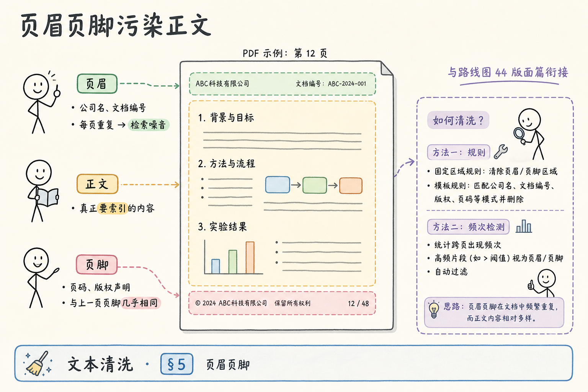
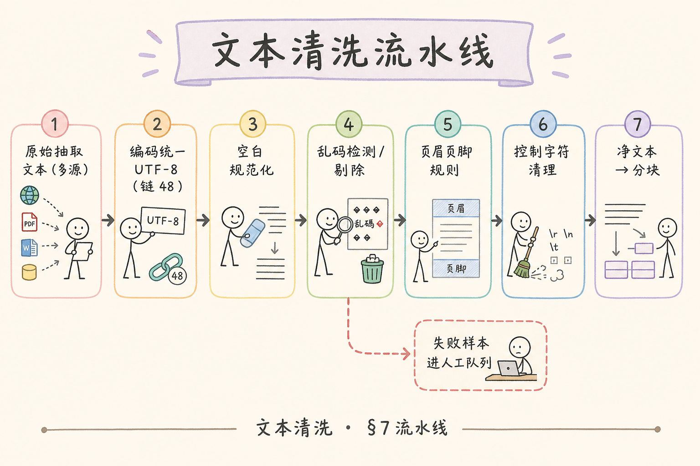
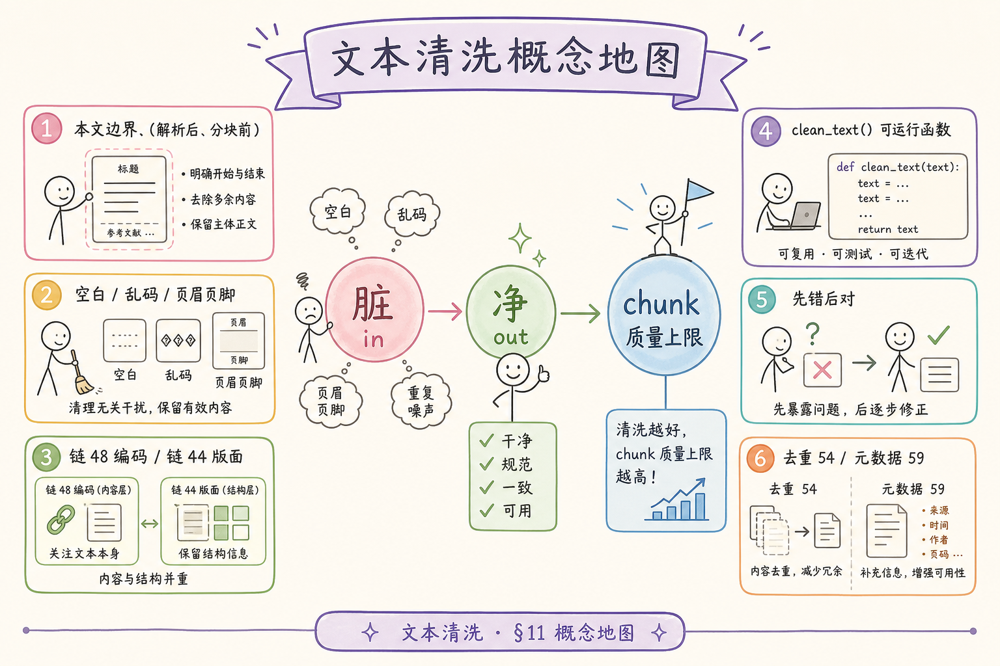

# 企业 RAG 数据采集（六）：文本清洗（空白、乱码、页眉页脚）完全指南

> 解析器终于跑通：PyMuPDF 抽出了字，Tika 也扒出了 HTML 正文，Unstructured 还贴心标了 `NarrativeText`。你兴冲冲 `embed` 入库——一周后检索「报销流程」前十条里有三条是 **「内部资料·禁止外传」**，两条是 **「第 12 页 / 共 48 页」**，还有一条满屏 **「锟斤拷」**。用户问制度条款，模型引用的 chunk 里 **页脚比正文还多**。根因往往不是 Embedding 模型差，而是 **你把「抽出来的脏文本」当成了「可索引的净文本」**。清洗是 ingest 里 **独立且必做** 的阶段：在 **解析之后、分块之前**，统一处理空白、乱码、页眉页脚与控制字符。这篇是 [企业 RAG 路线图](ENTERPRISE_RAG_ROADMAP.md) **C1 后半主线**（路线图第 **53** 条），提供 **本文边界 + 动手路径表**、可运行 **`clean_text`** 函数、**先错后对**，并衔接 [41 编码检测](41.text-encoding-detection-tutorial.md) 与 [37 PDF 版面 / 页眉页脚](37.pdf-layout-tables-tutorial.md)。前置：任意一篇解析篇（36～45）即可。

---

## 目录

1. [前言：抽字 ≠ 净字](#1-前言抽字--净字)
2. [本文边界与动手路径](#2-本文边界与动手路径)
3. [脏文本 vs 净文本：RAG 视角](#3-脏文本-vs-净文本rag-视角)
4. [空白规范化](#4-空白规范化)
5. [页眉页脚：重复噪音从哪来](#5-页眉页脚重复噪音从哪来)
6. [乱码与控制字符](#6-乱码与控制字符)
7. [清洗流水线与可运行代码](#7-清洗流水线与可运行代码)
8. [按来源定制：PDF / HTML / DOCX / 纯文本](#8-按来源定制pdf--html--docx--纯文本)
9. [先错对对：综合实战](#9-先错对对综合实战)
10. [与分块、元数据的接口](#10-与分块元数据的接口)
11. [综合概念地图](#11-综合概念地图)
12. [常见陷阱与 FAQ](#12-常见陷阱与-faq)
13. [总结与系列下一步](#13-总结与系列下一步)

---

## 1. 前言：抽字 ≠ 净字

初学者常把 ingest 画成两步：

```text
解析 → Embedding
```

生产应是：

```text
解析 → 编码统一(48) → 清洗(本篇) → 去重(54) → 分块 → Embedding
```

**文本清洗**（Text Cleaning / Normalization）：对原始抽取字符串做 **规则化、去噪、Unicode 规范化**，使其适合 **分块、检索与引用**，而不改变业务语义（在可接受误差内）。  
通俗说：**洗菜**——泥巴（页眉）、烂叶（乱码）、多余水（空白）弄掉，再下锅炒。

**Normalization（规范化）**：把同一语义的不同写法统一，如全角空格→半角、`\r\n`→`\n`、连续空行→单空行。  
通俗说：**统一度量衡**——避免「看起来不同、其实一样」浪费索引。

**Noise（噪音文本）**：对问答无贡献、却高频出现的片段，典型 **页眉页脚、页码、水印、OCR 乱符**。  
通俗说：**复读机背景声**——embedding 很认真，检索全被带偏。

**读完本文，你应该能做到：**

1. 说清 **本文边界**（做什么、不做什么）。  
2. 按 §2 动手路径 **跑通 `clean_text`** 并对照样例。  
3. 解释页眉页脚如何成为 **检索毒药**（衔接 37）。  
4. 区分 **编码乱码**（41）与 **清洗阶段乱码剔除**。  
5. 完成 §9 **先错对对** 三组对照。  
6. 把清洗嵌进 **Element / page 元数据** 流水线（59）。

### 1.1 为什么清洗值得单独一篇「主线」

在路线图里，51 Unstructured、52 Tika 讲 **怎么拿出来**；54 去重讲 **怎么不重复存**；清洗夹在中间，却决定 **拿出来的是不是能用**。很多团队把清洗当成「几个正则，顺手写」——结果 **页眉正则** 六个月没人维护，新公司合并后页眉文案变了，**旧规则删正文、新页眉进索引**。单独一篇主线，是为了把清洗 **升格为流水线阶段**：有边界、有 `clean_text` 契约、有指标、有与 41/37 的衔接、有黄金样例 CI。你读完应能 **独立交付** 清洗模块，而不是从 PDF 脚本里抠三个 `replace`。

### 1.2 清洗不是「数据增强」

不要用清洗做 **摘要、改写、翻译**——那是生成模型的事。清洗只做 **保真去噪**：删掉 **与问答无关的重复与乱码**，尽量 **不改变条款语义**。若 `clean_chars_ratio` 从 0.9 到 0.2，删掉的应是 **页眉页脚**；若 **「第三条 违约责任」** 不见了，就是 **过度清洗**，要回滚规则。这条纪律在法务、合规类 RAG 里 **生死攸关**——错删条款比多留页眉 **更严重**。

### 1.3 与 41、37 的三角关系（再强调）

[41](41.text-encoding-detection-tutorial.md) 解决 **字节怎么变成 Unicode**；[37](37.pdf-layout-tables-tutorial.md) 解释 **为什么页眉会跟正文混在一起**；本篇解决 **Unicode 字符串怎么变成适合分块的净文本**。顺序错误是最常见事故：**未解码对就清洗** → 以为清洗没用；**未理解版面就只靠正则** → 双栏 PDF 页眉删不净。动手路径表（§2.2）请 **按字母顺序做**，不要跳 C 直接跑代码。

---

## 2. 本文边界与动手路径

**档位：主线篇（要厚）—— C1 后半核心工程能力。**

### 2.1 本文边界（必读）

| 做 | 不做 |
|----|------|
| 空白、换行、制表符规范化 | 语义级摘要、改写 |
| 页眉页脚 **规则 / 频次** 剔除 | 深度学习版面分割训练 |
| Mojibake **检测与剔除/隔离** | 二进制层重新解码（属 41） |
| 控制字符、零宽字符清理 | HTML 标签级正文抽取（属 39） |
| PDF 断行连字符 `-` 处理 | OCR 引擎选型（属 62） |
| 可运行 `clean_text` + 配置化规则 | 多语言分词、实体识别 |
| 与 41、37 衔接说明 | 向量模型选型 |

**位置**：**解析之后、分块之前**。若你在 Unstructured **Element** 上操作，应对 **每个 `el.text`** 或 **合并 buffer** 清洗；若在 Tika **纯文本** 上，先整段再按页切（若有页标记）。

### 2.2 动手路径表

| 步骤 | 你做什么 | 验收 |
|------|----------|------|
| A | 读 §3，拿一段「脏 PDF 文本」肉眼看 | 列出 3 类脏东西 |
| B | 读 §4，对样例跑 `normalize_whitespace` | 无 `\t`、无连续 10 空行 |
| C | 读 §5，标出页眉重复句 | 与 37 双栏示意图对照 |
| D | §7 保存 `text_cleaning.py`，跑 `demo_dirty.txt` | `clean_text` 输出净文本 |
| E | §8 选你家主格式加一条规则 | 写入 `CLEAN_PROFILES` |
| F | §9 先错对对三组 | 能解释错因 |
| G | 把 `clean_text` 接到 44/42 解析输出 | ingest 日志有 `chars_before/after` |

**环境：** Python 3.10+；仅标准库 + 可选 `regex`（示例用标准库 `re`）；准备 `demo_dirty.txt`（下文 §7 可生成）。

### 2.3 与路线图关系

| 条目 | 关系 |
|------|------|
| [41 编码](41.text-encoding-detection-tutorial.md) | **解码** 正确是前提；清洗不替代 detect |
| [37 版面 / 页眉](37.pdf-layout-tables-tutorial.md) | 解释页眉 **为何进正文** |
| [44 Unstructured](44.unstructured-io-tutorial.md) | Element.text 清洗入口 |
| [45 Tika](45.apache-tika-tutorial.md) | parse 后必清洗 |
| 路线图 **54** 去重 | 清洗 **后** 再 hash/simhash |
| 路线图 **59** 元数据 | 清洗不删 `page`，删的是噪音 **文本** |

---

## 3. 脏文本 vs 净文本：RAG 视角

读下图：左侧脏文本如何污染检索；右侧净文本才适合 chunk。


对照上图：

### 3.1 脏文本的 RAG 代价

| 脏东西 | 检索后果 | 生成后果 |
|--------|----------|----------|
| 每页重复页眉 | 任意 query 都高相似命中 | 引用片段 **无实质内容** |
| 连续空行 / 空格 | 浪费 token（27） | 上下文窗口被掏空 |
| Mojibake | 建不了有效语义索引 | 模型瞎编「条款」 |
| 页码 `12 / 48` | 数字噪音干扰表格问 | 答非所问 |
| `\x00` 控制符 | 部分库崩溃或截断 | 不可见断句 |

### 3.2 净文本验收标准（建议写进 CI）

1. **无** Mojibake 特征串（§6 规则）。  
2. **无** 配置列表中的页眉页脚子串（或频次异常行已删）。  
3. 空白符合规范：无行尾空格、无 `\t`、空行 ≤1 连续。  
4. UTF-8 可编码，`unicodedata` 无异常 surrogate。  
5. `len(clean) / len(raw)` 记录在案（暴跌要人工看）。

### 3.3 不要过度清洗

删掉 **产品型号中的连续空格**、**诗歌换行**、**代码缩进** 会伤语义。企业制度类 RAG 通常 **保守策略**：宁可留一点空行，勿删 **数字条款编号** `3.2.1`。

---

## 4. 空白规范化

### 4.1 常见空白问题

- Windows 换行 `\r\n`；  
- 全角空格 `\u3000`；  
- NBSP `\u00a0`；  
- PDF 提取的 **硬换行**（行末无标点却断行）；  
- 制表符 `\t` 对齐假「表格」。

### 4.2 规范化步骤（推荐顺序）

```python
import re
import unicodedata

def normalize_whitespace(text: str) -> str:
    if not text:
        return ""
    # Unicode 兼容分解再组合（全角等）
    text = unicodedata.normalize("NFKC", text)
    # 各类空格统一
    text = text.replace("\u00a0", " ").replace("\u3000", " ")
    text = text.replace("\r\n", "\n").replace("\r", "\n")
    text = text.replace("\t", " ")
    # 行内多空格压扁
    text = re.sub(r"[^\S\n]+", " ", text)
    # 行尾空格
    text = re.sub(r" +\n", "\n", text)
    # 连续空行最多保留 1 个
    text = re.sub(r"\n{3,}", "\n\n", text)
    return text.strip()
```

**NFKC**：Unicode 规范化形式，把 **兼容字符**（如全角字母）转为 **普通形式**。  
通俗说：**把花式空格字母收成普通款**。

### 4.3 PDF 软换行合并（可选、保守）

仅当 **行末无句末标点** 且下一行 **小写或中文续写** 时合并——误伤标题风险存在，建议 **配置开关**：

```python
def merge_pdf_linebreaks(text: str) -> str:
    lines = text.split("\n")
    out = []
    buf = ""
    for line in lines:
        s = line.strip()
        if not s:
            if buf:
                out.append(buf)
                buf = ""
            out.append("")
            continue
        if buf and not re.search(r"[。！？；.!?]$", buf) and not re.match(r"^\d+[\.\)、]", s):
            buf += s
        else:
            if buf:
                out.append(buf)
            buf = s
    if buf:
        out.append(buf)
    return "\n".join(out)
```

### 4.4 中文标点与全角字符

企业制度 PDF 常见 **全角括号（）**、**全角逗号，** 与半角混用。NFKC 已处理部分；若你希望检索 **统一半角标点**（可选，慎伤正文）：

```python
PUNCT_MAP = str.maketrans({
    "，": ",", "。": ".", "：": ":", "；": ";",
    "（": "(", "）": ")", "！": "!", "？": "?",
})

def normalize_punct_optional(text: str, enable: bool = False) -> str:
    return text.translate(PUNCT_MAP) if enable else text
```

**通俗说**： **标点统一是「锦上添花」**——默认关闭，仅当你明确要做 **关键词规则检索** 时开启，并回归黄金样例。

### 4.5 表格与代码块的「少洗原则」

[37 篇](37.pdf-layout-tables-tutorial.md) 用 pdfplumber 得到的 **TSV 表**、[38 Markdown](38.markdown-parsing-tutorial.md) 里的 **围栏代码块**，不宜跑激进 `merge_pdf_linebreaks` 或 **删空行**。实践：按 `metadata.content_type` 或解析器标签 **分支 profile**——`table` / `code` 只做 `normalize_whitespace` 轻量版。

---

## 5. 页眉页脚：重复噪音从哪来

读下图：一页 PDF 上页眉、正文、页脚的空间关系——朴素 `get_text()` 常 **按 y 坐标排序** 把三者串进同一流（详见 37）。




对照上图：

**Header / Footer（页眉 / 页脚）**：版式上每页 **重复** 的顶部/底部固定内容，如公司名、密级、页码、「版权所有」。  
通俗说：**每页复印一遍的水印字**——对 RAG **几乎零信息增益**，却 **极高 token 权重**（重复 N 页）。

### 5.1 页眉页脚从哪钻进正文

| 来源 | 机制 |
|------|------|
| PDF 朴素提取 | 页顶页底字串与正文 **同一阅读流** |
| Tika / 老解析器 | 不区分版面角色 |
| Unstructured | 可能有 `Header` 类型，但 **常漏标** |
| DOCX | 页眉在独立 part，**若合并 doc 全文** 会重复 |
| HTML | `<header>`/`<footer>` 若未剥（39） |

### 5.2 剔除策略三层

**层 1 — 类型剔除（有结构时）**  
Unstructured：`category in ("Header", "Footer")` → `drop`。

**层 2 — 规则剔除**  
维护 **企业固定串** 列表：

```python
HEADER_FOOTER_PATTERNS = [
    r"内部资料[·•]禁止外传",
    r"版权所有",
    r"^\s*第\s*\d+\s*页\s*/?\s*共\s*\d+\s*页\s*$",
    r"^CONFIDENTIAL$",
]
```

**层 3 — 频次剔除（跨页）**  
同一行在 **>30% 页** 出现 → 标为页眉页脚候选。适合 **无规则的新库批量扫描**：

```python
from collections import Counter

def find_repeated_lines(pages: list[str], min_ratio: float = 0.3) -> set[str]:
    counter = Counter()
    n = len(pages) or 1
    for page in pages:
        lines = {ln.strip() for ln in page.split("\n") if ln.strip()}
        for ln in lines:
            counter[ln] += 1
    return {ln for ln, c in counter.items() if c / n >= min_ratio}
```

对 **页码** 这种 **每页略变** 的行，用 **正则** 比精确行匹配更好（见 `HEADER_FOOTER_PATTERNS`）。

### 5.3 与 37 的衔接

[37 篇](37.pdf-layout-tables-tutorial.md) 强调 **版面语义**；清洗篇在 **无版面模型** 时用 **规则+频次** 做 **廉价近似**。若 pdfplumber 给了 **bbox**，可 **按 y 坐标裁掉顶部 10% / 底部 8%**——扫描件慎用。

### 5.4 基于 bbox 的裁剪（有坐标时）

```python
def strip_margin_by_bbox(
    lines_with_y: list[tuple[float, str]],
    page_height: float,
    top_ratio: float = 0.10,
    bottom_ratio: float = 0.08,
) -> str:
    """lines_with_y: (y0, text) 来自 pdfplumber 或 fitz blocks"""
    y_top = page_height * top_ratio
    y_bottom = page_height * (1 - bottom_ratio)
    kept = [t for y, t in lines_with_y if y_top <= y <= y_bottom and t.strip()]
    return "\n".join(kept)
```

**版面区域（layout region）**：页面上按坐标划分的矩形块；裁 margin 是 **几何启发式**，对 **页眉特别高** 的模板要调 `top_ratio`。与规则剔除 **叠加** 使用，不要二选一。

### 5.5 DOCX 页眉为何仍会漏进全文

[40 DOCX 篇](40.docx-office-parsing-tutorial.md) 说明页眉在 **独立 XML part**。若你用某库「合并全文」把 `header.xml` 当段落读入，会得到 **每节重复** 的页眉串。解析层应 **不读 header part**；清洗层用 `HEADER_FOOTER_PATTERNS` **双保险**。

---

## 6. 乱码与控制字符

### 6.1 与 41 的分工

| 问题 | 阶段 | 工具 |
|------|------|------|
| 整文件 GBK 被当 UTF-8 读 | **解码** | charset-normalizer (41) |
| 已 Unicode 但含替换符 `` | **清洗** | 剔除或隔离 |
| 混合正常中文+少量坏段 | **清洗** | 行级丢弃 |

清洗 **不能修复** 41 里 **双重 Mojibake 已写进磁盘** 的文件——那种要 **重新从源头导出** 或人工对照。

### 6.2 Mojibake 启发式检测

```python
MOJIBAKE_MARKERS = ("锟斤拷", "烫烫烫", "屯屯屯", "娓告垙", "鏂囦欢")

def mojibake_score(text: str) -> float:
    if not text:
        return 0.0
    bad = sum(text.count(m) for m in MOJIBAKE_MARKERS)
    # 大量 CJK 兼容区乱符
    weird = sum(1 for ch in text if "\u4e00" <= ch <= "\u9fff" and unicodedata.category(ch) == "Lo")
    return bad + (0.001 * weird)

def drop_mojibake_lines(text: str, threshold: float = 1.0) -> str:
    kept = []
    for line in text.split("\n"):
        if mojibake_score(line) >= threshold and len(line) < 200:
            continue  # 短行高坏分 → 丢
        kept.append(line)
    return "\n".join(kept)
```

**通俗说**：**闻着像烂菜叶的行先挑出去**——不是科学 100%，企业制度文本 **够用了**，黄金样例要 **人工 spot check**。

### 6.3 控制字符与零宽

```python
def remove_control_chars(text: str) -> str:
    return "".join(ch for ch in text if ch == "\n" or unicodedata.category(ch)[0] != "C" or ch in "\n\t")
```

零宽：`"\u200b", "\ufeff"` 等单独 `replace("", "")`。

---

## 7. 清洗流水线与可运行代码

读下图：推荐流水线顺序——顺序错了可能 **先删行再合并断行** 失败。



对照上图，完整可运行模块：

```python
"""
text_cleaning.py — 企业 RAG 文本清洗（路线图 53）
Python 3.10+，标准库 only
"""
from __future__ import annotations

import re
import unicodedata
from collections import Counter
from dataclasses import dataclass, field

HEADER_FOOTER_PATTERNS = [
    r"内部资料[·•]禁止外传",
    r"版权所有",
    r"^\s*第\s*\d+\s*页\s*/?\s*共\s*\d+\s*页\s*$",
]

MOJIBAKE_MARKERS = ("锟斤拷", "烫烫烫", "屯屯屯")


@dataclass
class CleanConfig:
    merge_pdf_lines: bool = False
    drop_mojibake_lines: bool = True
    header_footer_patterns: list[str] = field(default_factory=lambda: list(HEADER_FOOTER_PATTERNS))
    repeated_line_ratio: float | None = None  # 跨页时用，单页 None


def normalize_whitespace(text: str) -> str:
    if not text:
        return ""
    text = unicodedata.normalize("NFKC", text)
    text = text.replace("\u00a0", " ").replace("\u3000", " ")
    text = text.replace("\r\n", "\n").replace("\r", "\n")
    text = text.replace("\t", " ")
    text = re.sub(r"[^\S\n]+", " ", text)
    text = re.sub(r" +\n", "\n", text)
    text = re.sub(r"\n{3,}", "\n\n", text)
    for z in ("\u200b", "\ufeff"):
        text = text.replace(z, "")
    return text.strip()


def remove_control_chars(text: str) -> str:
    return "".join(
        ch for ch in text
        if ch in "\n" or (unicodedata.category(ch)[0] != "C")
    )


def apply_header_footer_patterns(text: str, patterns: list[str]) -> str:
    lines = text.split("\n")
    compiled = [re.compile(p) for p in patterns]
    kept = []
    for line in lines:
        if any(p.search(line) for p in compiled):
            continue
        kept.append(line)
    return "\n".join(kept)


def mojibake_score(text: str) -> float:
    return float(sum(text.count(m) for m in MOJIBAKE_MARKERS))


def drop_bad_lines(text: str) -> str:
    kept = []
    for line in text.split("\n"):
        if mojibake_score(line) >= 1.0 and len(line.strip()) < 120:
            continue
        kept.append(line)
    return "\n".join(kept)


def merge_pdf_linebreaks(text: str) -> str:
    lines = text.split("\n")
    out, buf = [], ""
    for line in lines:
        s = line.strip()
        if not s:
            if buf:
                out.append(buf)
                buf = ""
            continue
        if buf and not re.search(r"[。！？；.!?]$", buf):
            buf += s
        else:
            if buf:
                out.append(buf)
            buf = s
    if buf:
        out.append(buf)
    return "\n".join(out)


def clean_text(text: str, config: CleanConfig | None = None) -> str:
    config = config or CleanConfig()
    raw_len = len(text)
    t = remove_control_chars(text)
    t = normalize_whitespace(t)
    if config.merge_pdf_lines:
        t = merge_pdf_linebreaks(t)
    t = apply_header_footer_patterns(t, config.header_footer_patterns)
    if config.drop_mojibake_lines:
        t = drop_bad_lines(t)
    t = normalize_whitespace(t)
    # 日志钩子：print(f"clean: {raw_len} -> {len(t)}")
    return t


def clean_pages(pages: list[str], config: CleanConfig | None = None) -> list[str]:
    """多页 PDF：先单页清洗，再可选频次剔除重复行"""
    config = config or CleanConfig()
    per_page = [clean_text(p, config) for p in pages]
    if config.repeated_line_ratio and len(per_page) > 2:
        reps = find_repeated_lines(per_page, config.repeated_line_ratio)
        per_page = [
            "\n".join(ln for ln in pg.split("\n") if ln.strip() not in reps)
            for pg in per_page
        ]
    return per_page


def find_repeated_lines(pages: list[str], min_ratio: float = 0.3) -> set[str]:
    counter = Counter()
    n = len(pages) or 1
    for page in pages:
        for ln in {x.strip() for x in page.split("\n") if x.strip()}:
            counter[ln] += 1
    return {ln for ln, c in counter.items() if c / n >= min_ratio}


if __name__ == "__main__":
    demo = """
    内部资料·禁止外传\r\n
    第三章  报销流程\r\n\r\n
    员工应于每月五日前提交申请。  \r\n
    锟斤拷锟斤拷\r\n
    第 12 页 / 共 48 页
    """
    print("=== BEFORE ===")
    print(repr(demo))
    print("=== AFTER ===")
    print(clean_text(demo))
```

### 7.1 运行验收

```bash
python text_cleaning.py
```

期望输出 **含「第三章 报销流程」**，**不含** 页眉、页码、锟斤拷行。

### 7.2 接入 PyMuPDF 按页流

```python
import fitz
from text_cleaning import clean_pages, CleanConfig

doc = fitz.open("handbook.pdf")
pages = [doc[i].get_text() for i in range(len(doc))]
config = CleanConfig(merge_pdf_lines=True, repeated_line_ratio=0.35)
cleaned = clean_pages(pages, config)
for i, text in enumerate(cleaned, start=1):
    # → chunk 元数据 page=i
    ...
```

### 7.3 日志与监控

生产记录：

```python
{"doc_id": "...", "chars_before": 12040, "chars_after": 9821, "dropped_ratio": 0.18}
```

`dropped_ratio` **异常高**（>0.5）触发人工 —— 可能 **规则太狠** 或 **源文件损坏**。

### 7.4 单元测试与黄金样例

建议仓库内 `tests/fixtures/cleaning/` 放 **三份固定输入输出**：

| 样例 | 测什么 |
|------|--------|
| `with_header_footer.txt` | 规则剔除页眉页码 |
| `mojibake_mix.txt` | 坏行丢弃、好行保留 |
| `pdf_soft_breaks.txt` | `merge_pdf_lines` 合并 |

```python
def test_clean_removes_header():
    raw = open("fixtures/with_header_footer.txt", encoding="utf-8").read()
    out = clean_text(raw)
    assert "内部资料" not in out
    assert "报销流程" in out
```

CI 跑 `pytest`，防止有人 **改规则误伤** 生产黄金库。

### 7.5 与 [41 编码篇](41.text-encoding-detection-tutorial.md) 的衔接实战

**正确顺序**（纯文本 CSV 为例）：

```python
from charset_normalizer import from_bytes

raw = path.read_bytes()
best = from_bytes(raw).best()
text = str(best)  # 已 decode 为 Unicode
clean = clean_text(text)
```

**错误顺序**：`clean_text(raw.decode("utf-8", errors="ignore"))` —— 在 **错解码** 上清洗，救不了 Mojibake。记住：**41 管字节→字；46 管字→净字**。

### 7.6 HTML 专项：剥壳后再洗

[39 HTML 篇](39.html-content-extraction-tutorial.md) 抽出 `main_content` 后，常残留 `&nbsp;`、`\n\n\n`、导航 crumbs。清洗函数 **同一套** `normalize_whitespace` 即可；额外可加 **行级** 剔除「首页 > 产品 > 文档」类面包屑（短行 + 含 `>` 或 `/`）。

---

## 8. 按来源定制：PDF / HTML / DOCX / 纯文本

| 来源 | 清洗要点 | 配置建议 |
|------|----------|----------|
| PDF | 页眉页脚、断行、页码 | `merge_pdf_lines=True`, `repeated_line_ratio=0.3` |
| HTML | 先 39 抽正文，再空白 | 剥 script 后 `clean_text` |
| DOCX | 勿重复页眉 part | 解析层不 merge 页眉；清洗作双保险 |
| 纯文本 / CSV | 编码在 41 | `drop_mojibake_lines=True` |
| Tika 输出 | 广谱无结构 | 强页眉规则 + 频次 |

```python
CLEAN_PROFILES = {
    "pdf": CleanConfig(merge_pdf_lines=True, repeated_line_ratio=0.35),
    "html": CleanConfig(merge_pdf_lines=False),
    "txt": CleanConfig(drop_mojibake_lines=True),
}
```

---

## 9. 先错对对：综合实战

### 9.1 对照 A：跳过 41，直接清洗 UTF-8 乱码文件

**错**：GBK 字节当 UTF-8 读入后，用 `drop_bad_lines` 希望变正常。  
**结果**：整段仍怪，只是 **短坏行没了**。  
**对**：ingest **先** `charset-normalizer` 得正确 Unicode，**再** `clean_text`。

### 9.2 对照 B：不洗页眉，Top-5 检索全是水印

**错**：`embed(page_text)` 原样入库。  
**结果**：问「年假几天」命中「内部资料·禁止外传」。  
**对**：`apply_header_footer_patterns` + 跨页 `find_repeated_lines`；Unstructured 则 drop `Header`。

### 9.3 对照 C：过度 `merge_pdf_linebreaks` 把列表并成一行

**错**：对 **条款枚举** 全文开合并。  
**结果**：`3.1 xxx 3.2 yyy` 粘在一起，分块 **切在句中**。  
**对**：仅对 **叙述段** 开合并；或检测 `^\d+[\.\)、]` 行 **不向上合并**（见代码）。

### 9.4 小练习

用 §7 `demo` 字符串：先只开 `normalize_whitespace`，再全开 `clean_text`，肉眼看 **哪一步去掉什么**——写进你的 ingest README。

### 9.5 对照 D：在 Element 合并后清洗 vs 先清洗再合并

**错**：先把所有 `NarrativeText` 拼成 mega 字符串再 `clean_text`，再按长度切 chunk——**页眉在页间重复**，跨页频次检测失效。  
**对**：**每元素或每页** 先 `clean_text`，再合并；或 `clean_pages` 走 **页级频次**（§7 `clean_pages`）。

### 9.6 对照 E：表格 TSV 跑全文 merge_pdf_linebreaks

**错**：pdfplumber 导出的 **制表符分隔表** 被 `merge_pdf_linebreaks` 粘成一行糊墙。  
**对**：`content_type=table` **跳过** merge 与激进空行压缩；仅做 `normalize_whitespace` 轻量版。

---

## 10A. 清洗质量指标（生产监控）

建议在 ingest 指标面板暴露：

| 指标 | 含义 | 告警 |
|------|------|------|
| `clean_chars_ratio` | `len(after)/len(before)` | <0.3 或 >0.99 |
| `mojibake_lines_dropped` | 丢行数 | 突增 |
| `header_pattern_hits` | 规则命中次数 | 新库为 0 可能规则失效 |
| `repeated_lines_removed` | 跨页剔除行数 | — |

与 **黄金样例** 对比：某 doc 的 `clean_chars_ratio` 从历史 0.85 跌到 0.40，提示 **源文件换版式** 或 **规则误伤**。

---

## 10B. `text_cleaning.py` 配置化（企业扩展）

```python
import json
from pathlib import Path

def load_tenant_config(tenant_id: str) -> CleanConfig:
    path = Path(f"config/cleaning/{tenant_id}.json")
    if not path.exists():
        return CleanConfig()
    data = json.loads(path.read_text(encoding="utf-8"))
    return CleanConfig(
        merge_pdf_lines=data.get("merge_pdf_lines", False),
        header_footer_patterns=data.get("patterns", HEADER_FOOTER_PATTERNS),
        repeated_line_ratio=data.get("repeated_line_ratio"),
    )
```

甲租户多加一条 `「绝密」` 页眉 pattern，乙租户关闭 `merge_pdf_lines`——**不用改代码发版**。

---

## 10. 与分块、元数据的接口

清洗 **不改变** `page`、`source`、`doc_id`——这些是 **元数据**（59），与 **文本正交**。

推荐 chunk 构造：

```python
{
    "text": clean_text(el.text),
    "metadata": {
        "page": el.metadata.get("page_number"),
        "source": "handbook.pdf",
        "doc_id": "hr-handbook-2024",
        "section": current_title,
    },
}
```

**分块器** 应消费 **净文本**；`chars` 统计用净文本算 **token 预算**（27、28）。

清洗后再做 **去重 54**：页眉去掉后，两版 PDF 的 simhash 更可比。

---

## 11. 综合概念地图

读下图，把清洗放在 C1 中间层。




对照上图：

- **上游**：36～45 各类解析。  
- **本篇**：空白、乱码、页眉页脚、控制符。  
- **下游**：54 去重 → 分块 → Embedding。  
- **侧链**：41 编码、37 版面理解。

---

## 12. 常见陷阱与 FAQ

**Q：清洗会不会删掉合法密级标「机密」？**  
A：会——若业务 **检索需要** 密级，把密级放进 **元数据 `acl`**（60），不要当正文洗掉。

**Q：英文 PDF 连字符 `-` 断词？**  
A：可加规则：行末 `-` 且下一行小写 → 拼接；中文场景少见。

**Q：要不要上机器学习去页眉？**  
A：量大、规则维护崩溃时再考虑；多数企业 **规则+频次** 够 MVP。

**Q：清洗放分块后行吗？**  
A：不推荐——chunk 边界已错，**先洗再切**。

**Q：和 Lowercase 冲突吗？**  
A：中文为主可不做；英文检索若统一小写，在 **净文本** 后 **可选** 一步。

**Q：清洗后文本变短很多怎么办？**  
A：看 `dropped_ratio`：若 **删掉的多是页眉**，正常；若 **条款编号消失**，规则过激，回滚合并或 pattern。

**Q：日志里要存清洗前后全文吗？**  
A：生产 **不必**；存 hash + 字数 + 删了哪些 pattern 命中即可。调试环境可 dump diff。

**Q：多租户规则不同？**  
A：`CleanConfig` 按 `tenant_id` 加载 **不同 HEADER_FOOTER_PATTERNS**——甲公司的「内部资料」于乙公司可能是正文。

**Q：和 44 Unstructured Header 类型重复？**  
A：**叠加**：先 drop Element 类型，再 `clean_text` **兜底**——页眉漏标时规则仍生效。

---

## 12A. 场景走读：从乱码工单到清洗流水线

某零售集团把历年 **门店操作手册 PDF** 批量入库。解析用 PyMuPDF，指标显示 **字符提取成功**；但客服机器人回答「开业检查清单」时，十条引用里三条是 **「第 7 页 / 共 52 页」**，两条含 **「内部交流，请勿外传」**——正是 [37 版面篇](37.pdf-layout-tables-tutorial.md) 说的页眉页脚进正文。另有批 **GBK 导出的 CSV** 被当 UTF-8 读，清洗前已乱码；团队误以为是清洗删太多，实则 **41 解码顺序错了**。

整改分三步：**一**，ingest 纯文本必须先 charset-normalizer；**二**，PDF 按页 `clean_pages`，`repeated_line_ratio=0.35` 去掉跨页重复页眉；**三**，监控 `clean_chars_ratio`，从均值 0.82 异常跌到 0.35 的文档进人工队列。两周后，同一 query 的 Top-5 **五条不同章节**，引用可点开 **净正文**。53 条主线价值在此：**不增加模型参数，只修数据**——却常被跳过，因为「抽字成功」的假象太强。

再强调 **表格块**：开业 checklist 的表格用 pdfplumber 单独成块，清洗时 **不跑 merge_pdf_linebreaks**（§9.6），避免「步骤一」与「步骤二」粘成一行。清洗配置按 `tenant_id` 加载（§10B），华东区与华南区页眉文案不同，共用一条正则就会 **要么漏要么误杀**。

---

## 12B. 与前后篇的口诀

记三句话即可：**41 先译对字节，46 再洗掉噪音，37 帮你理解噪音从哪来。** 然后再 **54 去重、64+ 分块**。跳过 46，后面全是在脏布上绣花。

### 12C. 实战作业（建议交团队仓库）

1. 从真实 PDF 抽一页原文粘贴到 `demo_dirty.txt`，标出 **三种脏东西**。  
2. 调 `HEADER_FOOTER_PATTERNS` 直到 `clean_text` 去掉你家页眉。  
3. 对同一文件 **错误 UTF-8 读** vs **41 正确读** 再清洗，写一段对比说明。  
4. 提交 PR 含 `chars_before/after` 与 pytest 一条断言。

### 12D. 为什么本篇要写得比 44、45 更厚

清洗是 **唯一不引入新解析库、却能立刻提升检索质量** 的阶段；代码可以只有两百行，却影响 **全库 chunk**。路线图把 53 标成主线，是因为 **失败模式隐蔽**：ingest 日志显示成功，客服一周后才投诉引用全是页脚。多写的篇幅给 **动手路径、指标、租户配置、与 41/37 衔接、作业**——让你能 **带初级同事做一遍** 就上线，而不是「看过正则」。若你只能精读 C1 一篇，**优先精读本篇**，再回去补 42/43 的解析刀法。

### 12E. 空白与页眉之外的「第三类脏」：语义重复段

同一 PDF 内，**「见第一章」** 重复出现、**广告式免责段** 每章抄一遍，不是页眉却 **同样污染 Top-K**。可选规则：**短于二十字且出现频次 > 页数 20%** 的句子进 `repeated_lines` 剔除（扩展 §5.2 频次逻辑到 **段内句**）。保守起见，默认 **只剔页眉页脚类 pattern**，语义重复 **第二阶段** 再加，避免误删 **法律定义**（定义句本身就要重复）。

### 12F. 交付物清单（本篇读完应产出）

| 交付物 | 说明 |
|--------|------|
| `text_cleaning.py` | §7 可运行模块 |
| `config/cleaning/{tenant}.json` | 可选租户规则 |
| `tests/test_cleaning.py` | 至少 2 条断言 |
| ingest 日志字段 | `chars_before/after` |
| 团队口诀卡片 | 41→46→分块 |

把 `clean_text` 接进 CI：**任何改动解析器或清洗规则**，黄金三样例 **必须通过**，否则禁止合并主分支——这是 53 主线篇应留下的 **工程纪律**。清洗模块的 owner 应是 **ingest 流水线负责人**，而不是「谁有空谁改正则」。本篇与 [37 版面](37.pdf-layout-tables-tutorial.md)、[41 编码](41.text-encoding-detection-tutorial.md) 形成 **「懂从哪来 → 译对 → 洗净」** 三角，缺任何一角，RAG 都会在 **无声中变差**。建议把 `HEADER_FOOTER_PATTERNS` 放进 **配置仓库** 由业务方 PR 更新，开发只维护 **引擎逻辑**——页眉文案变得最快的是 **品牌部**，不是后端。完成 §7 演示后，用一家真实 PDF 估算 `dropped_ratio`，写入 ingest 设计文档 **第一节「数据质量」**。主线篇读完的标志：你能 **向别人解释** 为什么「抽字成功」仍会导致 **检索全是页脚**——并能用 `clean_pages` 演示修掉它。

---

## 13. 总结与系列下一步

**文本清洗** 是 RAG ingest **必做独立阶段**：**抽字 ≠ 净字**。掌握 **空白规范化、页眉页脚三层剔除、乱码行丢弃**，用 §7 **`clean_text`** 接到任意解析输出；与 **41 解码**、**37 版面** 分工清晰，**先解码、后清洗、再分块**。

建议你接下来：

1. 把 `text_cleaning.py` 纳入仓库，给 3 份黄金 PDF 记 `chars_before/after`。  
2. 读路线图 **54** [47 去重篇](47.doc-dedup-tutorial.md) —— 净文本上的 **hash / simhash**。  
3. 回顾 [37 版面篇](37.pdf-layout-tables-tutorial.md) —— 表格块 **少洗结构、多洗页眉**。

下一篇：[47 文档去重完全指南](47.doc-dedup-tutorial.md) —— **SHA-256** 与 **SimHash**，为何 RAG 必须去重。
