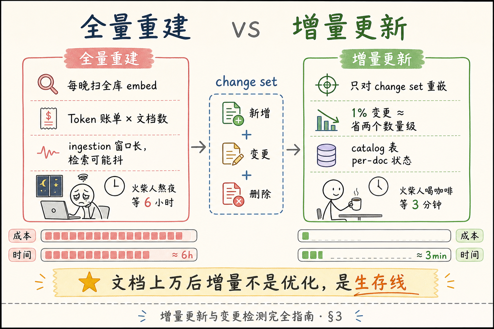
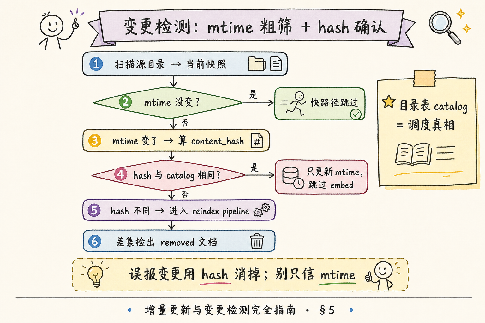
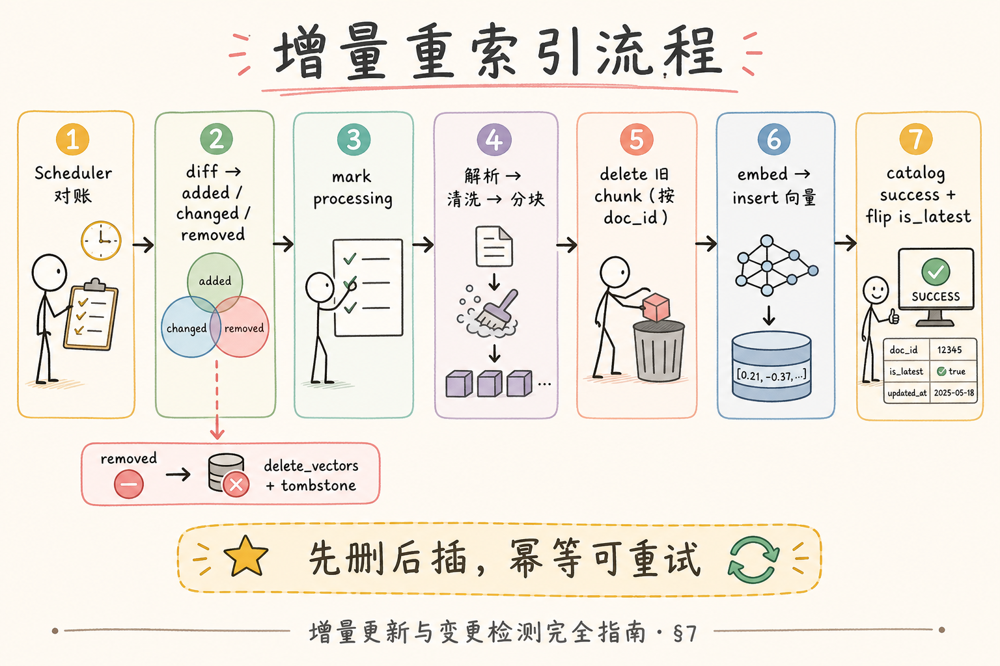

# RAG 数据采集与解析（十一）：增量更新与变更检测完全指南

> 知识库从 200 份文档涨到 2 万份后，运维最怕听到的一句话是：「今晚全量重建索引。」——Embedding API 账单飙升、向量库锁表、检索空窗半小时，业务方在群里问「为什么搜不到」。**增量更新**（Incremental Update）的核心是：**只对「变了的文档」重新解析、分块、嵌入**；没变的连 API 都不要打。这篇是 [企业 RAG 路线图](ENTERPRISE_RAG_ROADMAP.md) **C 轨主线篇**（路线图第 **56** 条），厚度刻意加码：讲清全量重建痛点、`content_hash` 与 `mtime` 变更检测、向量库 **删除/更新直觉**、完整动手路径，并提供 **可运行最小检测脚本** 与综合实战伪代码。前置：[48 文档版本](48.doc-versioning-tutorial.md)、[50 doc_id](50.metadata-doc-id-tutorial.md)；与路线图 **54** 去重、**69** 分块策略联动。

---

## 目录

1. [前言：全量重建是技术债到期日](#1-前言全量重建是技术债到期日)
2. [本文边界与动手路径](#2-本文边界与动手路径)
3. [全量重建痛点：算得清的账](#3-全量重建痛点算得清的账)
4. [增量更新的心智模型](#4-增量更新的心智模型)
5. [变更检测：content hash 与 mtime](#5-变更检测content-hash-与-mtime)
6. [向量库侧：删除、更新与留痕](#6-向量库侧删除更新与留痕)
7. [端到端重索引流程](#7-端到端重索引流程)
8. [最小可运行：变更检测脚本](#8-最小可运行变更检测脚本)
9. [综合实战：伪代码与任务编排](#9-综合实战伪代码与任务编排)
10. [先错对对：典型增量事故](#10-先错对对典型增量事故)
11. [综合概念地图](#11-综合概念地图)
12. [常见陷阱与 FAQ](#12-常见陷阱与-faq)
13. [总结与系列下一步](#13-总结与系列下一步)

---

## 1. 前言：全量重建是技术债到期日

早期 Demo 常见做法：cron 每天凌晨把 `data/` 目录扫一遍，**全部重新切块、全部 embed、全部 upsert**。文档少时「能跑」；文档多时变成 **定时炸弹**。

**增量更新**（Incremental Update）：仅对自上次索引以来 **内容或元数据发生变更** 的文档执行解析与向量化，其余文档复用已有索引。  
通俗说：**只重印改版了的那几页**，不是每晚把整本书重印一遍。

**变更检测**（Change Detection）：用 hash、mtime、版本号或业务事件判断「要不要重跑 ingestion」。  
通俗说：**门卫核对哪些包裹是新到的**。

**读完本文，你应该能做到：**

1. 量化描述全量重建在 **成本、时延、可用性** 上的三类痛点。  
2. 比较 `content_hash` 与 `mtime` 的适用场景与组合方式。  
3. 说出文档 **删除、更新、新增** 时向量库各应做什么。  
4. 跑通 §8 最小 Python 检测脚本并解释输出。  
5. 读懂 §9 编排伪代码，能映射到你用的向量库 SDK。

---

## 2. 本文边界与动手路径

**档位：主线篇（C1 工程落地）。**

**本文讲：** 增量必要性、检测手段、向量 CRUD 直觉、流程图、可运行脚本、任务编排、事故案例。  
**本文不讲：** Kafka 精确一次语义、分布式事务 2PC、跨地域多活向量同步、Kubernetes Operator 级生产运维。

### 2.1 动手路径表（建议按顺序）

| 步骤 | 你做什么 | 验收 |
|------|----------|------|
| A | 读 §3，估算你们全量一次 embed 的 token 与耗时 | 写出数量级 |
| B | 读 §5，选 hash / mtime / 双轨方案 | 能辩护 |
| C | 读 §6～§7，画「新增/更新/删除」三分支 | 口头能讲 |
| D | `pip` 后跑 §8 脚本，改 `WATCH_DIR` | 看到 added/changed/removed |
| E | 读 §9，把伪代码映射到你的向量库 API | 标出 3 个函数名 |
| F | 完成 §10 先错对对 | 指出两种事故 |

**环境：** Python 3.10+；`pip install` 无第三方依赖（§8 标准库即可）。可选：本地 Chroma / Qdrant / pgvector 任一作 §9 对照。

### 2.2 与路线图前后条的关系

| 条目 | 关系 |
|------|------|
| 路线图 **55** 版本 | 变更后升 `version` 还是覆盖，决定删哪些 chunk |
| 路线图 **57** doc_id | 增量任务以 **doc_id** 为键，不是文件路径 |
| 路线图 **58** chunk_id | 更新后 chunk 集合变，旧 chunk 要删 |
| 路线图 **54** 去重 | 内容 hash 相同可跳过 embed，即使 mtime 变 |

---

## 3. 全量重建痛点：算得清的账

### 3.1 成本：Embedding 不是免费午餐

假设：20,000 文档，平均每篇 2,000 token，嵌入模型按量计费。

| 模式 | 每次任务 token 量 | 直觉 |
|------|-------------------|------|
| 全量 | 4,000 万 token | 每晚烧一轮 |
| 增量（1% 变更） | 40 万 token | 约省两个数量级 |

还没算 **重试、失败补偿、多副本评测环境** 的重复计费。

### 3.2 时延： ingestion 窗口 vs 检索可用

全量重建常见两种粗暴实现：

1. **双索引切换**：建好 B 索引再切流量——存储翻倍，切换前要完成 **100% embed**。  
2. **原地覆盖**：边删边写——中间态 **检索结果抖动**，甚至出现「半库空窗」。

**Ingestion Window**（入库窗口）：索引与源数据不一致的时间段。  
通俗说：**货架正在换货，顾客可能拿到旧包装或空架**。

增量把单次变更面缩小，窗口从「小时级」压到「分钟级」甚至「秒级」。

### 3.3 运维与排障

全量跑完 6 小时，业务说「有一份新政策搜不到」——你很难知道是 **解析失败、embed 失败还是没进扫描目录**。增量任务带 **per-doc 状态**（`pending/success/failed`），排障粒度是 **单 doc_id**。

读下图，对比全量与增量在「变更面」上的差异。




对照上图：

**Change Set**（变更集）：一次调度周期内检出需处理的 `{added, updated, removed}` 文档集合。  
通俗说：**本轮要动刀的文件清单**。

**Steady State**（稳态文档）：内容 hash 与已索引记录一致、无需重跑的文档。  
通俗说：**昨晚怎样今早还怎样，别去打扰它**。

---

### 3.4 变更比例与「何时仍用全量」

设单次变更文档占比为 `p`。粗估 embed 成本与全量之比 ≈ `p`（忽略固定扫描开销）。

| p | 建议 |
|---|------|
| < 5% | 增量，性价比极高 |
| 5%～30% | 增量，注意并行度与失败重试 |
| > 50% | 评估全量重建或换库切换，可能更简单 |
| 分块/解析规则全改 | 视同全量——所有 doc 的 hash 规则都变 |

**Bulk Reindex**（批量重索引）：运维触发的「逻辑全量」，例如升级 embedding 模型、统一换 chunker。  
通俗说：**不是每晚自动跑，而是一次性全员换证**。

### 3.5 与 Cron、队列、人工触发的分工

| 触发源 | 典型用途 |
|--------|----------|
| Cron 每 15 分钟 | 文件目录增量 |
| 上传完成 Webhook | 单 doc 实时 pipeline |
| 管理后台「重建此文档」 | 人工修复 failed |
| 发布流水线 tag | 文档站整站同步 |

地基篇先把 **Cron + hash diff** 做对；Webhook 是体验优化，不是前提。

## 4. 增量更新的心智模型

把知识库想成 **两个数据源的对账**：

| 源 A | 源 B |
|------|------|
| 文件系统 / 对象存储 / CMS API | 索引目录表 + 向量库 metadata |

增量 = **对账 → 差分 → 仅对差分执行 pipeline**。

### 4.1 流水线阶段（单文档）

```text
发现变更 → 解析 → 清洗 → 分块 → 嵌入 → 写向量库 → 更新目录表状态
```

任何阶段失败都应 **标记 failed**，下次可 **单 doc 重试**，而不是 silently 跳过。

### 4.2 调度方式

| 方式 | 说明 |
|------|------|
| 定时轮询 | 每 N 分钟扫 mtime / hash，最简单 |
| 文件监听 | inotify / watchdog，近实时 |
| 事件驱动 | S3 Event、CMS Webhook、Git push CI |

地基篇先把 **定时 + hash** 做对，再升级事件驱动。

### 4.3 与版本管理衔接

若 [48 版](48.doc-versioning-tutorial.md) 采用 **留历史**：

- **更新** = 新版本 chunk 写入 + 旧版 `is_latest=false`（未必删向量）。  
- **删除** = 业务下架，可删全部版本或仅删 `is_latest`。

若采用 **覆盖**：

- **更新** = 按 `doc_id` 删除旧 chunk → 写入新 chunk。  
- **删除** = 按 `doc_id` 删除全部向量。

---

## 5. 变更检测：content hash 与 mtime

### 5.1 content hash（内容哈希）

对 **规范化后的正文**（或原始字节）算 SHA-256 / BLAKE2。

| 优点 | 缺点 |
|------|------|
| 内容真变才重跑 | 需读文件算 hash，有大文件 IO |
| 不受「摸一下文件」mtime 骗人 | 规范化规则要稳定（换清洗脚本 hash 全变） |

**Content Hash**（内容哈希）：文件或正文规范化结果的指纹，相同内容应得相同 hash。  
通俗说：**看里子，不看外包装是否被人摸过**。

**规范化**（Normalization）：计算 hash 前统一换行、去 BOM、统一 Unicode 等。  
通俗说：**比指纹前先洗干净手**。

### 5.2 mtime（修改时间）

文件系统 `st_mtime` 或对象存储 `LastModified`。

| 优点 | 缺点 |
|------|------|
| 极快，stat 即可 | 复制、解压、rsync 可能改 mtime 不实变 |
| 适合首轮粗筛 | 不可靠单独作为唯一依据 |

**mtime**（Modification Time，修改时间）：操作系统记录的「最后写入」时间戳。  
通俗说：**文件夹上贴的「最后碰过是几点」**。

### 5.3 推荐组合：mtime 粗筛 + hash 确认

```text
if mtime 没变 → 跳过（快路径）
if mtime 变了 → 算 hash
  if hash 与目录表相同 → 仅更新 mtime 记录，跳过 embed
  if hash 不同 → 进入完整 ingestion
```

读下图，展示双轨检测如何减少误触发。




对照上图：

**Catalog Table**（目录表）：存 `doc_id → {path, content_hash, mtime, version, index_status}` 的 OLTP 表或 SQLite。  
通俗说：**图书馆总账本，不是书架本身**。

**False Positive**（误报变更）：mtime 变但内容没变——hash 二次确认可消掉。  
通俗说：**快递盒被翻动，里面书还是同一本**。

### 5.4 删除怎么检？

只扫「当前目录」检不出 **已消失文件**。必须：

- 维护 **上次见到的 doc_id 全集**；本轮扫描后 **差集 = removed**；或  
- CMS 显式推送 `deleted` 事件。

**Removed**（移除）：源端不再存在的逻辑文档，索引侧应对应 **删向量 + 删目录行**。

### 5.5 与去重的关系

若两篇不同 `doc_id` 但 **content_hash 相同**（路线图 54），增量可：

- 只 embed 一次，第二份挂 **引用同一向量组**（高级）；或  
- 仍各存一份 metadata，embed 时检测 hash 命中 **跳过 API**（中级）。

---

## 6. 向量库侧：删除、更新与留痕

不同向量库 API 名字不同，但语义收敛到 **CRUD on vectors with metadata filter**。

### 6.1 三种操作直觉

| 事件 | 向量库动作 | 目录表动作 |
|------|------------|------------|
| 新增 added | insert 新 chunk 向量 | insert 行，status=success |
| 更新 updated | delete 旧 doc_id(+version) chunk → insert 新 chunk | hash/version 更新 |
| 删除 removed | delete by `doc_id` filter | 删行或标 tombstone |

**Delete by Filter**（按元数据过滤删除）：不按主键一条条删，而用 `doc_id == X` 批量删 chunk。  
通俗说：**按书名整捆下架，不是一页页撕**。

**Upsert**（更新插入）：有则更新、无则插入——若你的库 **chunk_id 稳定且一一对应**，可对单 chunk upsert；文档改版后 chunk 数常变，更稳妥是 **先删后插**。

### 6.2 为何「先删后插」更常见

分块策略一变，chunk 边界就变——旧 42 块、新 39 块，**无法原地 upsert 对齐**。  
流程：

```text
delete_vectors(filter={doc_id: D, version: V})
insert_vectors(new_chunks)
```

若留多版本历史，delete 时 filter 要带 **version**，避免误删旧版归档。

### 6.3 局部失败与幂等

同一 `doc_id` 任务重跑应 **幂等**：  
- 删旧 chunk 再写新 chunk，跑两次结果一样；  
- 不要「只 append 新 chunk 不删旧的」——除非版本字段严格隔离。

**Idempotent**（幂等）：同一操作执行多次，效果与执行一次相同。  
通俗说：**重按一次电梯按钮，不会多下一层楼**。

### 6.4 事务现实

多数向量库 **没有** 与 Postgres 的跨库事务。工程上：

1. 目录表 `status=processing`；  
2. 写向量；  
3. 成功则 `status=success` 并提交 hash；失败则 `failed` 保留错误信息。  
检索侧可继续用 **上一版成功快照**（若版本策略允许），直到新版 success。

---

## 7. 端到端重索引流程

读下图，从调度器视角看一轮增量周期。




对照上图：

**Reindex**（重索引）：对变更文档重新执行 **解析→分块→嵌入→写入** 的全过程。  
通俗说：**这本改版了，整本重新上架**。

**Tombstone**（墓碑标记）：源删但暂保留目录行，标记 `deleted=true`，便于审计与防误同步复活。  
通俗说：**卡片还在，但书上写了「已下架」**。

### 7.1 单文档状态机

```text
idle → detected → processing → success
                      ↓
                    failed → (retry) → processing
```

`failed` 超过 N 次应告警，避免 **静默缺口**。

### 7.2 与检索并发

- **读** 几乎总是并发于 **写**。  
- 覆盖策略下，删旧与写新之间极短空窗——可接受则用；不可接受则 **双缓冲**（新 version 写完再 flip `is_latest`）。  
- 大规模更新可对单 doc 加 **短缓存**，减少抖动（可选优化）。

---

### 7.3 各向量库 delete filter 对照（概念）

| 产品 | 删除方式直觉 |
|------|----------------|
| Chroma | `collection.delete(where={"doc_id": X})` |
| Qdrant | `Filter(must=[FieldCondition(...)])` |
| Pinecone | metadata filter delete |
| pgvector | `DELETE FROM chunks WHERE doc_id = $1` |
| Elasticsearch | `delete_by_query` on `doc_id` |

API 名各异，**语义**都是：按 metadata 批量删，不要按自增行号猜。

### 7.4 双缓冲切换（检索零空窗，可选）

1. 新版本 chunk 全部写入 `is_latest=false` 或写入 **影子 collection**；  
2. 校验 success 计数与 chunk 数；  
3. 单事务 flip `is_latest` 或 alias 切换；  
4. 删旧版或旧 collection。

适合 **金融、客服** 等不能接受「删了还没写完」的场景，代价是 **双倍写入时间窗口** 的存储。

## 8. 最小可运行：变更检测脚本

以下脚本 **仅用标准库**：扫描目录、维护 JSON 状态文件、输出 `added / changed / removed`。  
算 hash 用 **原始字节**；生产请替换为「规范化后再 hash」并与 [48 版](48.doc-versioning-tutorial.md) 的 `content_hash` 规则一致。

```python
#!/usr/bin/env python3
"""minimal_change_detect.py — 增量变更检测最小示例。

用法:
  python minimal_change_detect.py --watch ./data --state ./catalog_state.json
"""

from __future__ import annotations

import argparse
import hashlib
import json
from dataclasses import dataclass, asdict
from pathlib import Path
from typing import Dict, List, Tuple


@dataclass
class FileRecord:
    rel_path: str
    content_hash: str
    mtime: float


def file_hash(path: Path) -> str:
    h = hashlib.sha256()
    with path.open("rb") as f:
        for chunk in iter(lambda: f.read(1024 * 1024), b""):
            h.update(chunk)
    return h.hexdigest()


def scan_directory(watch_dir: Path) -> Dict[str, FileRecord]:
    records: Dict[str, FileRecord] = {}
    for path in sorted(watch_dir.rglob("*")):
        if not path.is_file():
            continue
        rel = path.relative_to(watch_dir).as_posix()
        st = path.stat()
        records[rel] = FileRecord(
            rel_path=rel,
            content_hash=file_hash(path),
            mtime=st.st_mtime,
        )
    return records


def load_state(state_path: Path) -> Dict[str, FileRecord]:
    if not state_path.exists():
        return {}
    raw = json.loads(state_path.read_text(encoding="utf-8"))
    return {k: FileRecord(**v) for k, v in raw.items()}


def save_state(state_path: Path, records: Dict[str, FileRecord]) -> None:
    payload = {k: asdict(v) for k, v in records.items()}
    state_path.write_text(json.dumps(payload, indent=2), encoding="utf-8")


def diff_catalog(
    prev: Dict[str, FileRecord], curr: Dict[str, FileRecord]
) -> Tuple[List[str], List[str], List[str]]:
    prev_keys, curr_keys = set(prev), set(curr)
    added = sorted(curr_keys - prev_keys)
    removed = sorted(prev_keys - curr_keys)
    changed: List[str] = []
    for key in sorted(prev_keys & curr_keys):
        p, c = prev[key], curr[key]
        # mtime 变但 hash 不变：仍记 changed_mtime_only，演示可并入 changed
        if p.content_hash != c.content_hash:
            changed.append(key)
    return added, changed, removed


def main() -> None:
    parser = argparse.ArgumentParser()
    parser.add_argument("--watch", type=Path, required=True, help="监控目录")
    parser.add_argument("--state", type=Path, required=True, help="状态 JSON 路径")
    parser.add_argument("--apply", action="store_true", help="写回新状态（默认只 dry-run）")
    args = parser.parse_args()

    watch_dir: Path = args.watch
    if not watch_dir.is_dir():
        raise SystemExit(f"watch 目录不存在: {watch_dir}")

    prev = load_state(args.state)
    curr = scan_directory(watch_dir)
    added, changed, removed = diff_catalog(prev, curr)

    print("=== incremental diff ===")
    print(f"added   ({len(added)}):", added)
    print(f"changed ({len(changed)}):", changed)
    print(f"removed ({len(removed)}):", removed)

    # 演示：把路径映射成未来要做的 doc_id（生产勿用文件名当 doc_id）
    def path_to_doc_id(rel: str) -> str:
        return rel.replace("/", "__").rsplit(".", 1)[0]

    for bucket, items in [("ADD", added), ("CHANGE", changed), ("REMOVE", removed)]:
        for rel in items:
            print(f"  [{bucket}] doc_id={path_to_doc_id(rel)!r} path={rel}")

    if args.apply:
        save_state(args.state, curr)
        print(f"\n状态已写入 {args.state}")
    else:
        print("\n(dry-run: 加 --apply 才会更新状态文件)")


if __name__ == "__main__":
    main()
```

### 8.1 脚本解读

1. **`scan_directory`**：递归读文件，算 SHA-256，记 mtime。  
2. **`diff_catalog`**：三路差分——新增键、消失键、同键 hash 变。  
3. **`--apply`**：只有显式传参才写状态，避免误跑污染账本。  
4. **`path_to_doc_id`**：仅为打印演示；生产必须用 [50 doc_id 篇](50.metadata-doc-id-tutorial.md) 的稳定主键。

### 8.2 本地试跑

```bash
mkdir -p data
echo "v1" > data/policy.txt
python minimal_change_detect.py --watch ./data --state ./catalog_state.json --apply
echo "v2" >> data/policy.txt
python minimal_change_detect.py --watch ./data --state ./catalog_state.json
# 应看到 changed: ['policy.txt']
```

第二次不加 `--apply` 时状态仍是 v1，可反复练习 diff 输出。

### 8.3 从脚本到生产的缺口

| 缺口 | 补法 |
|------|------|
| 路径当 doc_id | 换成业务 ID 或 UUID 映射表 |
| 原始字节 hash | 解析后规范化文本 hash |
| 无 embed | 接 §9 pipeline |
| 单 JSON 文件 | 换 Postgres catalog 表 |

---

## 9. 综合实战：伪代码与任务编排

### 9.1 目录表 schema（SQLite / Postgres）

```sql
CREATE TABLE document_catalog (
  doc_id          TEXT PRIMARY KEY,
  source_uri      TEXT NOT NULL,
  content_hash    TEXT NOT NULL,
  mtime           DOUBLE PRECISION,
  version         INTEGER NOT NULL DEFAULT 1,
  is_latest       BOOLEAN NOT NULL DEFAULT TRUE,
  index_status    TEXT NOT NULL DEFAULT 'idle',  -- idle|processing|success|failed
  last_error      TEXT,
  updated_at      TIMESTAMPTZ NOT NULL DEFAULT now()
);
```

### 9.2 编排主循环（伪代码）

```python
def incremental_sync(watch_dir: Path) -> None:
    prev = catalog.load_all()
    curr_files = scan_directory(watch_dir)
    added, changed, removed = diff_with_doc_mapping(prev, curr_files)

    for doc_id in added:
        run_pipeline(doc_id, reason="added")

    for doc_id in changed:
        run_pipeline(doc_id, reason="changed")

    for doc_id in removed:
        delete_from_index(doc_id)
        catalog.delete_or_tombstone(doc_id)


def run_pipeline(doc_id: str, reason: str) -> None:
    catalog.mark_processing(doc_id)
    try:
        raw = load_source(doc_id)
        text = parse_and_clean(raw)           # 路线图 43～48 解析链
        chunks = chunk_document(text, doc_id)   # 路线图 69
        new_hash = hash_normalized(text)

        if catalog.same_hash(doc_id, new_hash) and reason == "changed":
            catalog.mark_success(doc_id, touch_only=True)
            return

        version = catalog.next_version(doc_id)  # 或覆盖策略不递增
        delete_vectors(filter={"doc_id": doc_id, "is_latest": True})
        vectors = embed_chunks(chunks)
        insert_vectors(vectors, metadata=chunk_metadata(doc_id, version))
        catalog.mark_success(doc_id, content_hash=new_hash, version=version)
    except Exception as e:
        catalog.mark_failed(doc_id, str(e))
        raise


def delete_from_index(doc_id: str) -> None:
    delete_vectors(filter={"doc_id": doc_id})
    # 若留历史版本，可改为 filter 仅 is_latest 或按业务下架策略
```

### 9.3 embed 与 metadata 写入

```python
def chunk_metadata(doc_id: str, version: int, chunk) -> dict:
    return {
        "chunk_id": f"{doc_id}:v{version}:c{chunk.index:05d}",
        "doc_id": doc_id,
        "version": version,
        "is_latest": True,
        "section": chunk.section,
        "page": chunk.page,
        "text": chunk.text,
    }
```

`chunk_id` 编入 `version`，避免 [48 版](48.doc-versioning-tutorial.md) 跨版复用。

### 9.4 任务队列化（可选升级）

| 组件 | 职责 |
|------|------|
| Scheduler | 产出 change set |
| Queue | `doc_id` 级消息，失败重试 |
| Worker | 调 `run_pipeline` |
| DLQ | 多次失败进死信，人工介入 |

单机能用 **SQLite + 线程池**；规模上来再换 Redis/RQ 或 Celery。

### 9.5 观测指标

- `incremental_docs_added/changed/removed` 计数  
- `embed_tokens_saved`（相对全量估算）  
- `pipeline_latency_p95` per doc  
- `index_failure_rate`  

能回答：「为什么昨晚增量后仍有文档搜不到？」——查 `index_status=failed` 的 `doc_id` 列表即可。

---

## 10. 先错对对：典型增量事故

### 10.1 只追加不删除

**现象：** 文档改版后只 embed 新 chunk，旧 chunk 仍在向量库。  
**后果：** 检索命中双份矛盾内容；引用页码错乱。  
**对法：** 更新前 `delete_vectors(doc_id)` 或升 version 并 flip `is_latest` 后删旧版检索面。

### 10.2 只用 mtime，复制目录触发全库重嵌

**现象：** 运维 `cp -r` 备份，mtime 全变。  
**后果：** 一夜烧穿 API 配额，其实内容未变。  
**对法：** mtime 粗筛 + content_hash 确认；hash 相同只更新账本 mtime。

### 10.3 状态文件与向量库不同步

**现象：** 向量写入成功，catalog 未更新；下次以为没变跳过。  
**后果：** 源已删，向量还在；或源已改，检索仍旧。  
**对法：** 以 catalog 为 **调度真相**；向量写成功后 **原子更新** catalog（单库事务或 outbox）。

### 10.4 用文件路径当 delete filter

**现象：** 文件移动目录，旧路径 chunk 残留。  
**对法：** 全程 **doc_id** 过滤（[50 篇](50.metadata-doc-id-tutorial.md)）。

---

## 11. 综合概念地图


对照上图：增量 = **对账 → 差分 → 管道 → 向量 CRUD**；检测核心是 **hash**，mtime 是加速器。

### 11.1 速记表

| 概念 | 一句话 |
|------|--------|
| 全量重建 | 简单、贵、窗口长 |
| 增量 | 只处理 change set |
| content_hash | 内容变没变 |
| mtime | 快筛，不能单独信 |
| 先删后插 | 改版分块后更稳 |
| catalog 表 | 调度真相来源 |

---

### 11.2 把脚本接入 CI 的示例（Git 文档站）

```yaml
# .github/workflows/rag-incremental.yml（示意）
jobs:
  sync:
    runs-on: ubuntu-latest
    steps:
      - uses: actions/checkout@v4
      - run: pip install -r requirements.txt
      - run: |
          python minimal_change_detect.py --watch ./docs --state ./catalog_state.json > diff.txt
          python run_incremental_pipeline.py --from-diff diff.txt
```

要点：`doc_id` 用仓库内稳定路径 slug（见第五十篇），`catalog_state.json` 可缓存为 CI artifact 或存库。

### 11.3 观测日志应打什么

每条 pipeline 日志建议结构化：

```json
{
  "event": "reindex_done",
  "doc_id": "policy-travel-expense",
  "reason": "changed",
  "old_hash": "abc...",
  "new_hash": "def...",
  "version": 4,
  "chunks": 38,
  "embed_ms": 4200
}
```

排障时按 `doc_id` grep，比翻堆栈快一个数量级。

### 11.4 成本沙盘练习（自测）

假设：10,000 篇，平均 1,500 token/篇，嵌入单价 0.1 元/百万 token，每晚全量。

- 全量一晚：10,000 × 1,500 = 1.5×10⁷ token → 约 1.5 元/晚 → 月约 45 元（仅 embed 示意）。  
- 若日变更 2%：月 embed 约 0.9 元量级。  

量不大时差额看似小；加上 **重试、多环境、多模型重嵌** 与 **工程师熬夜**，增量省的是 **系统复杂度预算**。

## 12. 常见陷阱与 FAQ

1. **把「增量」等同于「实时」** —— 轮询间隔仍是分钟级，要近实时需事件驱动。  
2. **规范化规则悄悄改** —— hash 全变，等同一次全量；规则要版本化 `normalizer_v2`。  
3. **忽略 removed** —— 源删了向量还在，幽灵答案。  
4. **单文件巨型 PDF** —— 变更检测是文件级；改一页仍要重嵌整文件，除非做 **页级或块级** hash（进阶）。  

**Q：变更 0 时是否还要跑解析？**  
A：不要。diff 为空直接 return，省 CPU。

**Q：Git 拉取后算增量吗？**  
A：是。对 checkout 后工作区做 scan；`doc_id` 应用仓库内稳定路径或 manifest 映射，别用 clone 临时路径。

**Q：向量库不支持 delete by filter 怎么办？**  
A：入库时把该 doc 全部 `chunk_id` 记在 catalog；删除时按列表逐条删（慢但可行），或换支持的库。

**Q：和 CDC（变更数据捕获）关系？**  
A：数据库源用 CDC；文件源用 hash diff。RAG 最终都落到 **doc_id 级 pipeline**。

**Q：增量后评测分数掉了怎么查？**  
A：对比 change set 里 `changed` 文档列表，逐份看解析/分块 diff，常是 **清洗规则或切块** 变了而非 embed 坏了。

---

## 12.5 综合实战续：失败重试与死信

```python
MAX_RETRIES = 3

def run_pipeline_with_retry(doc_id: str, reason: str) -> None:
    for attempt in range(1, MAX_RETRIES + 1):
        try:
            run_pipeline(doc_id, reason)
            return
        except TransientError as e:
            catalog.mark_failed(doc_id, f"attempt {attempt}: {e}")
            sleep(backoff(attempt))
    catalog.mark_dlq(doc_id, reason)
    alert_on_call(doc_id)
```

**TransientError**（瞬态错误）：网络超时、429 限流等，重试可能成功。  
**DLQ**（Dead Letter Queue，死信队列）：多次失败后人工介入的队列。  
通俗说：**快递连送三次没人收，转人工客服**。

解析失败（乱码、加密 PDF）通常 **不应无限重试**——应快速 failed 并通知上传方。

## 12.6 与 embedding 模型升级

换 embedding 模型时，**内容 hash 可能未变**，但向量空间全变。这是一次 **逻辑全量**：

1. 新建 collection 或加 `embedding_model` metadata 维度；  
2. 对 **全部 doc_id** 重 embed（可与增量框架共用 worker，只是 change set = 全集）；  
3. 评测通过后切流量；  
4. 删旧 collection。

不要把「模型升级」伪装成普通增量——否则 catalog 认为没变而跳过，检索质量静默下降。

## 12.7 动手验收：你应该亲眼看到的输出

跑完 §8 脚本两轮后，catalog_state.json 应类似：

```json
{
  "policy.txt": {
    "rel_path": "policy.txt",
    "content_hash": "…",
    "mtime": 1710000000.0
  }
}
```

第三次只 touch 文件不改内容（PowerShell `(Get-Item).LastWriteTime = Now`）：  
若你实现了 mtime+hash 双轨，应 **changed 为空** 或仅记录 mtime .touch 事件而不触发 embed。  
亲眼验收一次，比读十遍文章更能建立直觉。

## 12.8 与路线图 54 去重的衔接

增量 diff 发现 **added** 时，先查全局 `content_hash` 是否已有：

```python
def handle_added(doc_id: str, new_hash: str):
    existing = catalog.find_by_hash(new_hash)
    if existing and existing.doc_id != doc_id:
        link_duplicate(doc_id, existing.doc_id)  # 或拒绝上传
        return
    run_pipeline(doc_id, "added")
```

避免「同一 PDF 换路径又 embed 一次」的增量漏网——**去重是增量之前的闸门**。

## 12.9 生产级 catalog 字段补全

在 §9.1 基础上建议加：

```sql
  embed_model     TEXT,
  chunker_version TEXT,
  chunk_count     INTEGER,
  last_run_id     TEXT,
  retry_count     INTEGER DEFAULT 0
```

`last_run_id` 串联日志；`chunker_version` 变时即使 hash 不变也可强制重切块。

## 12.10 全量与增量的统一抽象

```python
def sync_documents(doc_ids: list[str] | None = None):
    if doc_ids is None:
        doc_ids = list_all_known_doc_ids()  # 全量
    for doc_id in doc_ids:
        run_pipeline(doc_id, reason="bulk")
```

增量 = `doc_ids` 来自 diff；全量 = `doc_ids` 为全集。**同一函数**，避免两套代码分叉腐烂。

## 12.11 夜间运维 Runbook（简版）

1. 看 `index_status=failed` 列表；  
2. 看今晚 `changed` 计数是否异常飙升（可能 mtime 批量变）；  
3. 看 embed token 账单 vs 7 日均值；  
4. 抽 3 个 changed doc 人工对读源文件；  
5. 评测 smoke 10 条。

增量上线后，运维重心从「等全量跑完」变成 **看 diff 是否合理**。

## 12.12 完整 pipeline 文件布局（建议）

```text
rag_ingest/
  catalog.py          # 目录表读写
  change_detect.py    # §8 脚本演进版
  pipeline.py         # run_pipeline
  parsers/            # 按 MIME 路由
  chunkers/
  embedders/
  vector_store.py
  jobs/
    incremental_cron.py
    bulk_reindex.py
```

**单一入口** `incremental_cron.py`：diff → 调 `pipeline.run` → 打指标。  
Demo 常把所有逻辑塞在一个 `main.py`，第一周能跑，第二月没人敢改。

## 12.13 并行度与限流

```python
from concurrent.futures import ThreadPoolExecutor, as_completed

def process_change_set(doc_ids: list[str], max_workers: int = 4):
    with ThreadPoolExecutor(max_workers=max_workers) as ex:
        futs = {ex.submit(run_pipeline, d, "changed"): d for d in doc_ids}
        for fut in as_completed(futs):
            doc_id = futs[fut]
            try:
                fut.result()
            except Exception as e:
                log.error("failed %s: %s", doc_id, e)
```

Embedding API 有 RPM/TPM 限制时，`max_workers` 不是越大越好——配合 **token bucket** 限流。  
**Rate Limit**（速率限制）：上游 API 在单位时间内允许的请求数或 token 数。  
通俗说：**收费站每分钟只放行 N 辆车**。

## 12.14 扫描性能：大目录优化

- 维护 `inode` 或 `(path, size, mtime)` 三元组快筛，再 hash；  
- 巨型文件（>100MB）可 **页级 hash** 或 **抽样 hash** 作预警，全文 hash 放 worker；  
- 网络盘（NFS/SMB）mtime 不可靠——偏向 **每次 hash** 或监听本地同步副本。

## 12.15 与对象存储事件

S3 `ObjectCreated` 事件带 `key`，映射 `doc_id` 后 **单 doc pipeline**，不必等 cron 扫全桶。  
删除事件 `ObjectRemoved` 对应 `removed` 分支——**事件与 cron 双保险**，防事件丢失。

## 12.16 案例：Wiki 同步延迟

Wiki 每晚 2:00 导出 ZIP 到 `incoming/`。增量 cron 2:30 扫目录：

1. 新 ZIP 解压到 `staging/`；  
2. 对 staging 做 diff，不是对 ZIP 本身算 hash；  
3. 成功后 `incoming/` 归档，catalog 记 `last_sync_batch`。

否则 ZIP mtime 变但内含 MD 未变，会误触发整库重嵌。

## 12.17 Windows 与 Linux 路径注意

开发机在 Windows、生产在 Linux 时，`rel_path` 统一 `.as_posix()`（§8 已用）。  
`doc_id` 生成规则 **不要含盘符** `C:`。  
Git `core.autocrlf` 导致文本 hash 跨平台不一致时，规范化阶段统一 `
` 再 hash。

## 12.18 最小 Docker Compose 增量 cron（示意）

```yaml
services:
  ingest-worker:
    image: rag-ingest:latest
    command: python jobs/incremental_cron.py --watch /data --state /state/catalog.json
    volumes:
      - ./data:/data
      - ingest-state:/state
    environment:
      - EMBED_API_KEY
volumes:
  ingest-state:
```

状态卷 `ingest-state` 持久化 catalog，容器重建不丢 diff 基线。

## 12.19 本篇「主线厚度」说明

路线图 **56** 标记为主线：除概念外，本篇刻意包含 **§8 可运行脚本**、**§9 编排伪代码**、catalog DDL、失败重试、模型升级全量、CI 与 Docker 示意。建议学习路径：**先跑通 §8 diff 输出，再把 `run_pipeline` 接到你的向量库 SDK**——其余三篇（48/50/51）偏元数据契约，本篇偏 **工程落地**，合读才构成完整 ingestion 地基。

---

## 13. 总结与系列下一步

1. 文档上万后 **全量重建** 在成本与可用性上不可持续。  
2. **mtime 粗筛 + content_hash 确认** 是性价比最高的检测组合。  
3. 向量侧 **更新 ≈ 删旧 chunk + 写新 chunk**；删除要处理 **removed 差集**。  
4. 维护 **catalog 目录表** 与 per-doc 状态，才能幂等、可重试、可观测。  
5. §8 脚本可直接跑；接上 §9 即是最小增量 ingestion 骨架。

### 13.1 系列下一步

| 目标 | 阅读 |
|------|------|
| 稳定 doc_id 设计 | [50 doc_id](50.metadata-doc-id-tutorial.md) |
| chunk_id 与溯源 | [51 chunk_id](51.metadata-chunk-id-tutorial.md) |
| 版本字段 | [48 文档版本](48.doc-versioning-tutorial.md) |

### 13.2 学习目标自检

- [ ] 能估算全量 vs 增量的 token 差距  
- [ ] 能解释 hash 与 mtime 分工  
- [ ] 能说出 added/updated/removed 向量动作  
- [ ] 跑通 minimal_change_detect.py  
- [ ] 能把 §9 伪代码映射到自己的 SDK  

---

> **初学者可能仍困惑的点**  
> - 增量不是「永远比全量好」——变更比例 >50% 时全量有时更简单，要会算账。  
> - 检测的是 **源**，动的是 **索引**；两边都要有账本。  
> - 文件名当 doc_id 在 Demo 够用，上线前务必读第五十篇。  
> - 块级增量是进阶话题；地基先把 **文档级** 增量做对。
