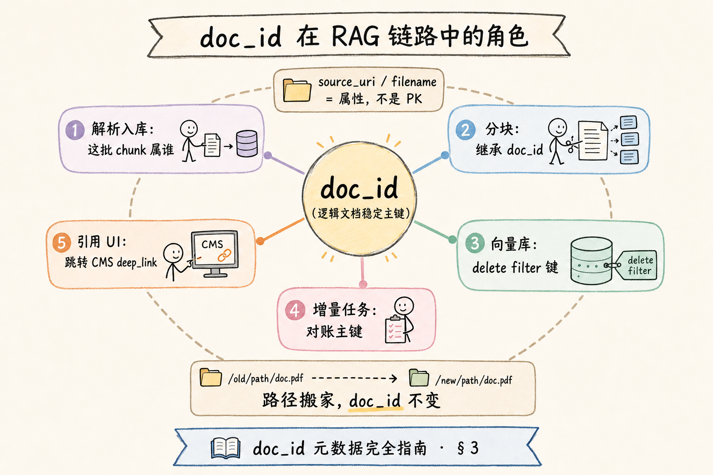
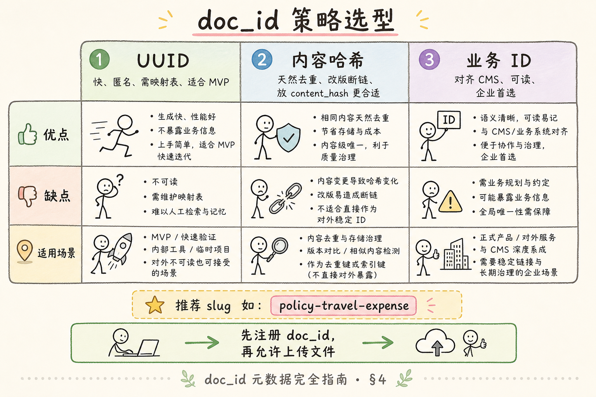
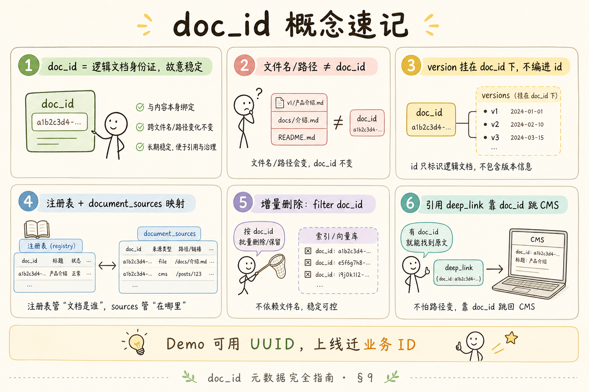

# RAG 数据采集与解析（十二）：doc_id 元数据完全指南

> 同一份 `制度.pdf` 从 `/uploads/2024/` 搬到 `/archive/policies/`，路径变了，内容没变——向量库若按路径当主键，就会变成 **同一制度的两套重复索引**；用户改名 `差旅制度_v2.pdf`，旧引用全部失效。企业 RAG 需要一根 **贯穿解析→分块→向量→引用** 的稳定主线，这根线就是 **`doc_id`**。这篇是 [企业 RAG 路线图](ENTERPRISE_RAG_ROADMAP.md) **C 轨第十二篇**（路线图第 **57** 条），讲清 **稳定主键** 的含义、**UUID vs 内容哈希 vs 业务 ID** 的选型、全链路传递方式，并用 **先错后对** 拆穿「用文件名当唯一 ID」的 Demo 陷阱。前置：[48 文档版本](48.doc-versioning-tutorial.md)、[49 增量更新](49.incremental-update-tutorial.md)；为 **58** `chunk_id`、路线图 **59** `source`/`page` 铺路。

---

## 目录

1. [前言：没有 doc_id，增量与溯源都是空中楼阁](#1-前言没有-doc_id增量与溯源都是空中楼阁)
2. [本文边界与动手路径](#2-本文边界与动手路径)
3. [doc_id 扮演什么角色](#3-doc_id-扮演什么角色)
4. [三种 ID 策略：UUID、内容哈希、业务 ID](#4-三种-id-策略uuid内容哈希业务-id)
5. [贯穿解析→分块→向量→引用](#5-贯穿解析分块向量引用)
6. [与 version、source 的边界](#6-与-versionsource-的边界)
7. [最小 schema 与映射表设计](#7-最小-schema-与映射表设计)
8. [先错对对：用文件名当唯一 ID](#8-先错对对用文件名当唯一-id)
9. [综合概念地图](#9-综合概念地图)
10. [常见陷阱与 FAQ](#10-常见陷阱与-faq)
11. [总结与系列下一步](#11-总结与系列下一步)

---

## 1. 前言：没有 doc_id，增量与溯源都是空中楼阁

初学者第一周常写：

```python
chunk_id = filename + "_" + str(i)
metadata = {"source": filename}
```

能 Demo，上线后：

- HR 重传同名文件 → 增量任务不知道删谁 → **幽灵 chunk**。  
- 多部门各有一份 `README.md` → **撞名**。  
- 前端点「查看原文」只能打开 `制度.pdf`，无法对接 CMS 深链 → **溯源断链**。

**doc_id**（Document Identifier，文档标识符）：在系统内唯一标识 **一份逻辑文档** 的稳定字符串，不随物理路径、显示文件名、单次上传批次变化。  
通俗说：**身份证号**——改名换地址，号不变。

**读完本文，你应该能做到：**

1. 说明 `doc_id` 与 `source_uri`、文件名三者的分工。  
2. 在 UUID、内容哈希、业务 ID 中为你的场景选型。  
3. 画出 `doc_id` 从入库到引用卡片的传递路径。  
4. 设计 **路径→doc_id** 映射表，支撑增量与删除。  
5. 指出「文件名当 ID」的四种失败模式并给出对法。

---

## 2. 本文边界与动手路径

**档位：地基篇（C1 元数据核心）。**

**本文讲：** doc_id 角色、策略对比、全链路传递、映射表、与 version 关系、先错后对。  
**本文不讲：** 多租户行级安全、全球分布式 ID（Snowflake）、区块链内容寻址、GraphRAG 实体 ID。

### 2.1 动手路径表

| 步骤 | 你做什么 | 验收 |
|------|----------|------|
| A | 列出你们库 3 个「路径变但文档同」的例子 | 有场景 |
| B | 读 §4，选 UUID / 业务 ID / hash 主键 | 写下理由 |
| C | 读 §5，画数据流箭头图 | 含 chunk、引用 |
| D | 按 §7 写映射表 DDL | 含 doc_id PK |
| E | 完成 §8 先错对对 | 四种错法 |

**环境：** 纸面或任意 SQL 客户端；有向量库时对照 metadata 字段即可。

### 2.2 与路线图前后条的关系

| 条目 | 关系 |
|------|------|
| 路线图 **55** version | `doc_id` 固定，其下挂多个 `version` |
| 路线图 **56** 增量 | 对账键是 `doc_id`，不是路径 |
| 路线图 **58** chunk_id | 通常 **包含** 或 **外键关联** doc_id |
| 路线图 **59** source/page | 展示与定位字段，不替代 doc_id |

---

## 3. doc_id 扮演什么角色

### 3.1 四个系统问同一句话

| 子系统 | 问题 |
|--------|------|
| 解析入库 | 这批 chunk 属于哪份逻辑文档？ |
| 向量库 | 按什么键批量删、过滤、统计？ |
| 增量任务 | 源里这份东西上次索引过没有？ |
| 引用 UI | 点击溯源跳到哪条 CMS / 哪次上传记录？ |

四个答案必须是 **同一个 doc_id**。

读下图，看 doc_id 在链路中的中心位置。




对照上图：

**Logical Document**（逻辑文档）：业务认知中的「那一份制度/合同」，生命周期长于任意一次文件落地。  
通俗说：**故事里的主角，演员换妆（路径变）还是他**。

**Physical Artifact**（物理载体）：某一磁盘路径、对象键、上传记录 ID。  
通俗说：**某一版胶片拷贝**。

`doc_id` 绑定 **逻辑文档**；`source_uri` 记录 **当前物理载体从哪读**。

### 3.2 稳定性到底指什么

| 应稳定 | 不应绑死 |
|--------|----------|
| 跨路径迁移 | 物理路径 |
| 跨重传、增量更新 | 原始文件名（可改） |
| 跨 version 递增 | 某一版 content_hash（hash 是版本属性） |
| 跨 chunk 策略调整 | 单个 chunk 的序号 |

**Stable Identifier**（稳定标识符）：在系统演进、文件搬迁、版本迭代中 **故意不变** 的键。  
通俗说：**档案柜里的卷宗号，不随文件夹换架子而改**。

### 3.3 唯一性范围

`doc_id` 在 **租户 / 知识库** 范围内唯一即可（多租户可在值前加 `tenant_id:` 前缀，或 composite key）。

不要指望全公司所有系统全局唯一——但 **RAG 服务内部必须唯一**。

---

### 3.4 doc_id 与多租户、多知识库

同一公司可能有「HR 制度库」「IT 运维库」。`doc_id` 只需在 **单库内唯一**。

常见模式：

| 模式 | 示例 |
|------|------|
| 前缀租户 | `tenant-acme:policy-travel` |
| 分库 | 每库独立 namespace，doc_id 可短 |
| 全局注册中心 | 集团统一发号 |

**Namespace**（命名空间）：隔离不同集合的命名前缀，防止跨库撞 id。  
通俗说：**不同档案柜用不同柜号段**。

### 3.5 生命周期：创建、合并、下架

| 事件 | doc_id 行为 |
|------|-------------|
| 新建制度 | 注册新 doc_id |
| 两制度合并 | 选保留 id，迁另一 id 的向量后废弃 |
| 制度废止 | 删向量，doc_id 可 tombstone |
| 仅换附件 | doc_id 不变，更新 source_uri |

合并是最痛的运维操作——越早统一 doc_id，合并时越少洗库。

## 4. 三种 ID 策略：UUID、内容哈希、业务 ID

### 4.1 UUID（或 ULID）

**生成：** `uuid4()` / `ulid()`，入库时分配。

| 优点 | 缺点 |
|------|------|
| 实现极简，永不撞名 | 人眼不可读，与业务无直观对应 |
| 路径、文件名随便变 | 无法从 ID 猜文档 |
| 适合无上游系统的纯文件上传 | 内容相同两篇需 **去重逻辑** 另判 |

**UUID**（Universally Unique Identifier，通用唯一标识符）：随机或时间序生成的 128 位标识，碰撞概率可忽略。  
通俗说：**系统随机发的身份证号**。

适用：早期 MVP、纯文件拖放上传、多源异构尚未统一主数据。

### 4.2 内容哈希（Content-addressed ID）

**生成：** `doc_id = "sha256:" + hash(normalized_content)[:16]`。

| 优点 | 缺点 |
|------|------|
| 天然去重：内容同则 ID 同 | 内容 **微调** ID 全变，版本链断裂 |
| 可审计、可复现 | 不同逻辑文档碰巧同内容会 **错误合并**（极少但灾难） |
| 适合不可变存档、WORM 存储 | 不适合「同一制度年年改」 |

**Content-addressed**（内容寻址）：用内容指纹当地址，相同字节在同一命名空间必落同一键。  
通俗说：**按书的内容指纹分柜子，不是按书名**。

适用：法规快照归档、区块链式不可变库；**与 [48 version](48.doc-versioning-tutorial.md) 联用时** hash 更适合放在 `content_hash` 字段而非 doc_id。

### 4.3 业务 ID（推荐企业主数据）

**生成：** 来自 HR/OA/CMS 的 `policy_id`、`article_id`、`contract_no`，或人工注册 slug：`policy-travel-expense`。

| 优点 | 缺点 |
|------|------|
| 与业务系统对齐，溯源一键跳 | 依赖上游发号或治理规则 |
| 运维可读，日志好查 | slug 需防重复与改名流程 |
| 版本、权限可挂在同一业务键 | 无 CMS 时需自建 **文档注册表** |

**Business Key**（业务主键）：业务领域早已认定的标识，如工号、合同号。  
通俗说：**HR 系统里早就有的那个编号**。

适用：企业知识库、制度库、产品文档站——**能注册就先注册 doc_id，再允许上传文件**。

读下图，三种策略并排选型。




对照上图：

**Slug**（语义化短名）：人类可读的 doc_id，如 `leave-policy-2025`，由注册表保证唯一。  
通俗说：**好记的档案名，背后仍唯一**。

### 4.4 选型决策简表

| 你的现状 | 建议 |
|----------|------|
| 只有文件夹上传 | UUID + 映射表，尽快迁业务 ID |
| 有 CMS API 带文章 ID | 直接用业务 ID |
| 不可变公共存档 | hash 作 content_hash；doc_id 仍用业务名 |
| 多租户 SaaS | `tenant_id + doc_id` 复合唯一 |

---

### 5.5 各语言 SDK 中的 doc_id 传递

**Python 伪代码**

```python
@dataclass
class ParsedDocument:
    doc_id: str
    version: int
    title: str
    blocks: list[Block]

def ingest(path: Path, doc_id: str):
    parsed = parse(path, doc_id=doc_id)
    for i, chunk in enumerate(chunk_document(parsed)):
        meta = {"doc_id": doc_id, "chunk_id": make_chunk_id(doc_id, parsed.version, i)}
        store.upsert(meta, embed(chunk.text))
```

**TypeScript 前端上传**

```typescript
const form = new FormData();
form.append("file", file);
form.append("doc_id", selectedDocId);  // 用户从下拉选已有制度
await fetch("/api/v1/ingest", { method: "POST", body: form });
```

前端 **不要让用户手填 doc_id 字符串**——用下拉选已注册文档，或「创建新文档」走注册 API 返回 id。

### 5.6 日志与追踪（OpenTelemetry 直觉）

每条 span 带 `doc_id` attribute：

```text
ingest.pipeline duration=4.2s doc_id=policy-travel-expense version=3
```

分布式追踪里按 doc_id 过滤，比搜文件名快得多。

### 5.7 权限模型预留

| 角色 | 可见 doc_id 范围 |
|------|------------------|
| 全员 | `visibility=public` |
| 部门 | `dept_id in user.depts` |
| 机密 | ACL 列表 |

`doc_id` 本身不加密——权限在 **检索 filter** 与 **API 网关** 层。  
不要把机密性赌在「id 够随机别人猜不到」上。

## 5. 贯穿解析→分块→向量→引用

### 5.1 数据流（单文档）

```text
注册 doc_id → 解析(raw) → 分块(chunks[]) → 嵌入 → 向量 metadata
                ↓                              ↓
           document_catalog              检索命中
                                                ↓
                                          引用卡片( doc_id )
                                                ↓
                                          跳转 CMS(source_uri)
```

**关键：** `doc_id` 在 **进入解析之前** 就要确定，不要解析完再「随便起名」。

### 5.2 各阶段字段

| 阶段 | 携带字段 |
|------|----------|
| 解析输出 | `doc_id`, `source_uri`, `title` |
| chunk | `doc_id`, `chunk_id`, `version`, `section`, `page` |
| 向量 metadata | 同上 + `is_latest` |
| 检索结果 | `doc_id`, `chunk_id`, `score` |
| API 响应引用 | `doc_id`, `title`, `version_label`, `source_uri`, `page` |

### 5.3 删除与增量

[49 增量篇](49.incremental-update-tutorial.md) 的 `delete_vectors(filter={"doc_id": X})` 之所以成立，是因为 **全库 chunk 都带同一 doc_id**。  
若早期用路径，迁移时要 **一次性 backfill doc_id** 并重写 metadata——越早规范越省痛。

### 5.4 引用溯源

前端展示：

```json
{
  "citation_id": "cite-1",
  "doc_id": "policy-travel-expense",
  "title": "差旅费用管理制度",
  "version_label": "2025-Q2",
  "page": 4,
  "snippet": "一线城市住宿上限 500 元/晚",
  "deep_link": "https://cms.example.com/docs/policy-travel-expense?v=3"
}
```

`deep_link` 由 **doc_id** 映射 CMS，不是拼文件名。

---

## 6. 与 version、source 的边界

| 字段 | 回答什么 | 会变吗 |
|------|----------|--------|
| `doc_id` | 哪份逻辑文档 | 故意不变 |
| `version` | 第几版内容 | 改版变 |
| `content_hash` | 内容指纹 | 每版一变 |
| `source_uri` | 从哪读的 | 搬迁、重传常变 |
| `source` / 展示名 | 用户看到的文件名 | 常变 |

**不要** 把 `version` 编进 doc_id（如 `policy-v3`）除非业务 **永远开新卷宗** 而非续版——否则 v4 要换 doc_id，历史引用全断。  
推荐：`doc_id=policy-travel` + `version=3` 分开存。

---

## 7. 最小 schema 与映射表设计

### 7.1 文档注册表

```sql
CREATE TABLE documents (
  doc_id       TEXT PRIMARY KEY,
  title        TEXT NOT NULL,
  owner        TEXT,
  cms_url      TEXT,
  created_at   TIMESTAMPTZ DEFAULT now()
);

CREATE TABLE document_sources (
  id           BIGSERIAL PRIMARY KEY,
  doc_id       TEXT NOT NULL REFERENCES documents(doc_id),
  source_uri   TEXT NOT NULL,
  filename     TEXT,
  is_primary   BOOLEAN DEFAULT TRUE,
  UNIQUE (doc_id, source_uri)
);
```

上传文件时：**先查或注册 doc_id**，再写 `document_sources`。  
同 doc_id 多个源（PDF + MD 镜像）可共存，`is_primary` 标默认解析源。

### 7.2 与 catalog 合并视角

[49 篇](49.incremental-update-tutorial.md) 的 `document_catalog` 以 `doc_id` 为主键，可加：

```sql
ALTER TABLE document_catalog ADD COLUMN title TEXT;
ALTER TABLE document_catalog ADD COLUMN cms_url TEXT;
```

### 7.3 API 契约示例

```json
POST /api/v1/documents
{
  "doc_id": "policy-travel-expense",
  "title": "差旅费用管理制度",
  "source_uri": "s3://bucket/policies/travel-2025.pdf"
}
```

禁止客户端只传 `filename` 让服务端猜 doc_id——除非明确是 **一次性临时上传** 且后续会注册。

---

### 7.4 从路径映射到 doc_id 的启发式（过渡用）

在尚无 CMS 时，可临时：

```python
def path_to_slug(rel_path: str) -> str:
    # docs/hr/travel-policy.md -> docs-hr-travel-policy
    stem = rel_path.replace("\", "/").rsplit(".", 1)[0]
    return stem.replace("/", "-").lower()
```

规则必须 **写入文档** 且 **稳定**——不要随便改大小写或去前缀，否则等于全员换 doc_id。  
有业务系统后，应 **显式 manifest** 覆盖启发式：

```json
{"path": "docs/hr/travel-policy.md", "doc_id": "policy-travel-expense"}
```

### 7.5 与 Confluence / Notion 导出

Wiki 导出常带 **页面 ID**（数字或 UUID）——优先用 **页面 ID 作 doc_id**，标题改名不影响。  
仅当导出丢 ID 时，才退化为标题 slug，并在注册表 **锁定 slug 与页面 URL 映射**。

## 8. 先错对对：用文件名当唯一 ID

### 8.1 错法一：`doc_id = filename`

**后果：** `README.md` 全库撞车；改名后旧向量删不掉。  
**对法：** 注册表发号；文件名仅 `document_sources.filename`。

### 8.2 错法二：`doc_id = 完整路径`

**后果：** 目录搬迁后变「新文档」，重复 embed；增量 removed/added 爆炸。  
**对法：** 路径进 `source_uri`；doc_id 不变，只更新映射表。

### 8.3 错法三：每次上传 UUID 但不记映射

**后果：** 重传无法对应旧 UUID，永远增量 added，库内_duplicate。  
**对法：** 以 **业务键** 或 **用户选定 doc_id** 为锚；UUID 仅用于上传会话。

### 8.4 错法四：把 content_hash 当 doc_id 又做版本迭代

**后果：** 改一个字 doc_id 变，引用、权限、外链全断。  
**对法：** doc_id 稳定；hash 进 `content_hash` + 触发 version 递增。

### 8.5 迁移已有库

1. 建 `documents` 表，人工或规则映射旧 `source` → `doc_id`。  
2. 批量 update 向量 metadata 加 `doc_id`。  
3. 用新 filter 删重：按 doc_id 去重后删孤儿 path 键。  
4. 冻结「仅 filename」代码路径。

---

## 9. 综合概念地图




对照上图：`doc_id` 是元数据 **轴心**；UUID/hash/业务 ID 是 **生成策略**；路径与文件名是 **属性** 不是主键。

### 9.1 速记表

| 概念 | 一句话 |
|------|--------|
| doc_id | 逻辑文档稳定主键 |
| UUID | 快、匿名、需映射表 |
| 内容哈希 | 去重强、不适合当续版 ID |
| 业务 ID | 企业首选，对齐 CMS |
| source_uri | 当前从哪读 |
| 文件名 | 展示用，不当 PK |

---

### 9.2 doc_id 命名规范建议

- 字符集：`a-z0-9-`，长度 3～64；  
- 禁止仅数字（易与版本混淆）；  
- 禁止含 `:`（与 chunk_id 分隔符冲突）；  
- 人类可读：`leave-policy` 优于 `doc_4721`（除非纯 UUID 策略）。

### 9.3 面试常问：doc_id 和数据库主键区别？

| | doc_id | surrogate PK |
|---|--------|--------------|
| 暴露给 API/向量 | 是 | 否 |
| 跨系统对齐 | 是 | 否 |
| 改名 | 不变 | 无所谓 |

回答模板：「对外与向量 metadata 用 doc_id；库内可加自增 id 做 join 性能，但 **不以路径或文件名** 充当 doc_id。」

## 10. 常见陷阱与 FAQ

1. **doc_id 含中文或空格** —— 可以但 URL 需编码；推荐 `kebab-case` ASCII。  
2. **大小写不敏感文件系统** —— `Policy.pdf` 与 `policy.pdf` 撞名，doc_id 不受影响。  
3. **软删除 doc** —— doc_id 保留，标 `active=false`，向量删除但注册表留审计。  
4. **一篇文档两个 doc_id** —— 合并时要迁向量 metadata，不是简单复制。  

**Q：用户上传时不知道 doc_id 怎么办？**  
A：UI 让选「归入已有文档」或「新建文档（生成 slug/UUID）」；默默默认 UUID 是坑。

**Q：Git 仓库怎么定 doc_id？**  
A：常用 `repo_path` 稳定相对路径作 slug，如 `docs/hr/travel-policy`；不要含 branch 名除非每 branch 独立库。

**Q：doc_id 要全局 UUID 吗？**  
A：不必；但要 **知识库内唯一** + 映射到业务系统。

**Q：和数据库主键 integer 的关系？**  
A：对内可用 surrogate key；对外 API、向量 metadata、引用 **统一暴露 doc_id 字符串**。

---

## 10.5 全链路数据包示例（从上传到引用）

**上传请求**

```json
POST /api/v1/ingest
{
  "doc_id": "policy-travel-expense",
  "source_uri": "s3://corp/policies/travel-2025.pdf",
  "version": 3
}
```

**解析输出（内部）**

```json
{
  "doc_id": "policy-travel-expense",
  "version": 3,
  "pages": [{"page": 1, "text": "..."}]
}
```

**切块输出**

```json
{
  "chunk_id": "policy-travel-expense:v3:c00004",
  "doc_id": "policy-travel-expense",
  "version": 3,
  "chunk_index": 4,
  "text": "一线城市住宿上限 500 元/晚"
}
```

**检索 API 响应**

```json
{
  "hits": [{
    "chunk_id": "policy-travel-expense:v3:c00004",
    "doc_id": "policy-travel-expense",
    "score": 0.89,
    "snippet": "一线城市住宿上限 500 元/晚"
  }]
}
```

**引用卡片**

```json
{
  "title": "差旅费用管理制度",
  "doc_id": "policy-travel-expense",
  "version_label": "2025-Q2",
  "deep_link": "https://cms.example.com/docs/policy-travel-expense?v=3"
}
```

五层 JSON 里 **doc_id 不变**——这就是「贯穿」的具象含义。

## 10.6 治理：谁有权发 doc_id？

| 组织成熟度 | 做法 |
|------------|------|
| 初创 | 上传时 UUID，运营后台补登记 |
| 成长 | 制度类必须选「已有文档」或申请新 slug |
| 企业 | CMS 为主数据源，RAG 只读 API |

**Id Registry**（标识注册表）：负责 doc_id 发放与冲突检测的服务或表。  
通俗说：**公安局办身份证号，不是路人自己随便起**。

## 10.7 先错后对续：合并两篇文档

**场景**：`leave-policy` 与 `leave-policy-2024` 实为同一制度。  
**错法**：直接删一个 id，引用全断。  
**对法**：

1. 选保留 `doc_id=leave-policy`；  
2. 向量 metadata 批量 `UPDATE doc_id`（若库支持）或重嵌；  
3. `leave-policy-2024` 标 `merged_into=leave-policy` 并重定向；  
4. 增量任务不再扫描废弃 id。

合并是 **运维级事件**，要有 runbook，不要靠周末手工改库。

## 10.9 CMS Webhook 入库示例

```json
POST /rag/webhook/document-published
{
  "event": "published",
  "doc_id": "policy-travel-expense",
  "version": 4,
  "title": "差旅费用管理制度",
  "download_url": "https://cms/.../travel.pdf",
  "effective_from": "2025-07-01"
}
```

RAG 服务 **只信 doc_id**，用 `download_url` 拉文件，不把 URL 里的随机参数当 id。

## 10.10 批量迁移 checklist

- [ ] 导出旧索引所有 `source` 去重  
- [ ] 人工+规则生成 `old_source → doc_id` 映射 CSV  
- [ ] 双写：新 chunk 带 doc_id，旧 chunk 暂留  
- [ ] 检索切 doc_id filter  
- [ ] 删旧 path-keyed 向量  
- [ ] 文档化 slug 规则给全团队

## 10.11 面试追问：两个上传入口怎么办？

答：「所有入口先进 **Ingest Gateway**，统一注册 doc_id，再进解析。禁止业务线 B 用文件名、业务线 A 用 UUID 各搞一套。」

## 10.12 反模式清单（团队公约）

1. 禁止 `metadata.source = filename` 作为唯一键。  
2. 禁止解析器内部 `uuid4()` 且无映射表。  
3. 禁止路径搬家后不更新 `document_sources`。  
4. 禁止引用 API 只返回文件名无 `doc_id`。  
5. 禁止两个 CMS 对同一制度发两个 doc_id（需主数据对齐）。

## 10.13 练习：为样例库设计注册表

给定三文件：

| 文件 | 建议 doc_id |
|------|-------------|
| `docs/hr/leave.md` | `leave-policy` |
| `docs/hr/差旅制度.pdf` | `policy-travel-expense` |
| `docs/it/oncall.md` | `it-oncall-runbook` |

写出 `documents` 表三行与 `document_sources` 映射。  
练习目的：**发号在先，上传在后**。

## 10.14 与第五十一篇 chunk_id 的拼接

记住层级：`doc_id` 定文档 → `version` 定版 → `chunk_id` 定块。  
本篇只保证第一层稳定；块级在下一篇展开。

## 10.15 深度先错对对：多源同步

**场景**：同一 `doc_id` 在 Confluence 与 SharePoint 各有一份镜像。  
**错法**：两个路径各生成 UUID，检索重复。  
**对法**：`document_sources` 两行共享 `doc_id`，指定 `is_primary`；增量时 **只解析 primary**，另一源作备份校验 hash。

## 10.16 深度先错对对：自动化脚本批量导入

**场景**：运维脚本 `for f in *.pdf: ingest(f)` 用文件名当 id。  
**对法**：先 `POST /documents` 批量注册 slug，CSV 映射 `filename,doc_id`，再 ingest。

## 10.17 doc_id 与 URL slug 的关系

对外帮助中心 URL 可能是 `/help/travel-policy`。  
`doc_id` 可与 slug 相同，但 **URL 改版** 时 doc_id 仍不变——旧外链 301 到新 URL，RAG 索引不用重嵌。

## 10.18 数据质量指标

| 指标 | 健康值直觉 |
|------|------------|
| 无 doc_id 的 chunk 占比 | 0% |
| 一 doc 多 id 的重复组 | 趋近 0 |
| 有 id 无源文件（孤儿） | 定期清理 |

每周 SQL：`SELECT COUNT(*) FROM chunks WHERE doc_id IS NULL` 应为 0。

## 10.19 延伸阅读动机

读完本篇应理解：**元数据不是「锦上添花」**，而是增量、版本、引用的 **共同语法**。  
下一篇 chunk_id 是同一语法的 **细粒度延伸**。

## 10.20 场景百科：六种企业文档来源

| 来源 | doc_id 建议 | 备注 |
|------|-------------|------|
| 员工上传 PDF | 注册表发 slug 或 UUID | 禁止纯文件名 |
| Confluence | 页面 ID | 标题可变 |
| Git 单仓 docs/ | 稳定相对路径 slug | 与 branch 策略一致 |
| SharePoint | 站点项 GUID | 同步任务映射 |
| 工单附件 | 工单号 + 附件序号 | `ticket-8821-att-1` |
| 数据库导出 CSV | 表名 + 导出批次 | 批次变则 version 变 |

每一行都应进 **集成设计评审**，不要等上线后洗库。

## 10.21 伪代码：Ingest Gateway

```python
def ingest_gateway(file, user, doc_id: str | None, create_title: str | None):
    if doc_id is None:
        if create_title is None:
            raise BadRequest("必须选择已有文档或创建新文档")
        doc_id = registry.create(title=create_title, owner=user)
    elif not registry.exists(doc_id):
        raise NotFound(f"未知 doc_id: {doc_id}")
    registry.attach_source(doc_id, file)
    queue.enqueue("pipeline", doc_id=doc_id)
    return {"doc_id": doc_id, "status": "queued"}
```

所有上传入口 **只走 Gateway**——这是 doc_id 治理的物理抓手。

## 10.22 与向量库主键的两种映射

**方案 A**：向量 `id == chunk_id`，metadata 冗余 `doc_id`。  
**方案 B**：向量 `id` 自增，metadata 同时有 `doc_id` 与 `chunk_id`。

删除文档时：

- A：按 metadata filter `doc_id` 或已知 chunk_id 列表删。  
- B：同左，**不要**假设自增 id 连续可猜。

doc_id 在两种方案下都在 metadata **必须存在**。

## 10.23 读者自测：五条判断题

1. 路径 `a/b/c.pdf` 改名 `a/b/d.pdf`，doc_id 应不变。（√）  
2. 内容完全相同的两个制度应共用一个 doc_id。（×，除非业务认定同一文档）  
3. UUID 作 doc_id 时不需要注册表。（×，至少要记录 UUID 含义）  
4. 引用 API 应返回 doc_id。（√）  
5. doc_id 可以含空格。（×）

错三条以上建议重读 §3～§5。

## 10.24 双轨术语小结

| 英文 | 中文 | 通俗说 |
|------|------|--------|
| doc_id | 文档标识符 | 逻辑文档身份证号 |
| Logical Document | 逻辑文档 | 不换主角只换拷贝 |
| Business Key | 业务主键 | 制度在 OA 里的编号 |
| source_uri | 源地址 | 当前从哪读文件 |
| Id Registry | 标识注册表 | 统一发号避免撞名 |
| Namespace | 命名空间 | 不同库用不同前缀 |

## 10.25 与增量删除的口诀

**增量删文档，filter doc_id；  
增量更路径，只改 source_uri；  
引用和评测，全程认 doc_id。**

四句话背下来，第五十篇与第四十九篇的接口就不会拧巴。

## 10.26 常见集成问题速查

| 现象 | 查什么 |
|------|--------|
| 同名文件两套索引 | 是否缺 doc_id，路径当主键 |
| 搬家后变新文档 | source_uri 未更新或 doc_id 误绑路径 |
| 引用跳错 CMS | deep_link 未用 doc_id 映射 |
| 合并制度后重复回答 | 两个 doc_id 未做 merge runbook |
| UUID 越积越多 | 缺注册表，重传当新文档 |

## 10.27 给产品经理的一句话

用户看到的「制度版本」与工程师存的 `version` / `effective_from` 可以不同文案，但 **必须可映射**——否则前台写「2025 版」，后台只有 `version=3`，客服无法对账。

## 10.28 给后端评审的四个必问

1. 上传接口是否 **强制** doc_id 或注册新文档？  
2. 向量 metadata 是否 **100%** 含 doc_id？  
3. 删除是否按 doc_id 而非 path？  
4. 引用 API 是否返回 doc_id 供前端跳转？

任一否，列入迭代债，不要等上线后洗库。

## 10.29 文档类型与 doc_id 策略（扩展表）

| 文档类型 | doc_id 来源 | 备注 |
|----------|-------------|------|
| 内部制度 PDF | OA 制度编号 | 与法务系统一致 |
| 产品帮助中心 | 产品 slug + 文章 id | URL 可 301，id 不变 |
| API 文档 OpenAPI | `api-{service}-spec` | 大改版升 version |
| 会议纪要 | `meeting-{date}-{seq}` | 一次性文档可用日期键 |
| 客户合同 | CRM 合同号 | 敏感，配合权限 filter |

会议纪要与制度不同：前者常 **不需长期留多版检索**，但仍要 doc_id 以便删除与审计，避免纯路径堆在文件夹里。

## 10.30 双写迁移期（路径 → doc_id）

1. 第一周：新 chunk 双写 `legacy_path` 与 `doc_id`；  
2. 第二周：检索改 filter doc_id，监控错误率；  
3. 第三周：删 legacy_path 索引；  
4. 保留映射 CSV 六个月备查。

**双写**（Dual Write）：迁移期同时写旧键与新键，读侧逐步切新键。  
通俗说：**换门锁期间新旧两把钥匙都能开，确认无问题再交旧钥匙**。

## 10.31 本篇与系列前文的咬合点

| 前文 | 本篇承接 |
|------|----------|
| [48 版本](48.doc-versioning-tutorial.md) | doc_id 下挂 version |
| [49 增量](49.incremental-update-tutorial.md) | 对账与删除用 doc_id |
| [38 MD 解析](38.markdown-parsing-tutorial.md) | 解析输出即带 doc_id |
| [34 Grounding](34.grounding-citation-tutorial.md) | 引用回指 doc_id |

读路线图 **55～58** 时，应按 **48→49→50→51** 顺序，不要跳读元数据两篇。

## 10.32 最后一句话

**doc_id 是 RAG 索引的「主语」**——主语不清，动词（embed、检索、引用）再华丽，句子也是错的。  
上线前用 SQL 查一次 `doc_id IS NULL`，应为零行。  
若你只能用文件名 Demo，请在 README 标明 **未生产就绪**，避免运维照抄上线。  
**稳定主键不是优化项，是上线门槛。**

---

## 11. 总结与系列下一步

1. `doc_id` 标识 **逻辑文档**，必须稳定、可贯穿全链路。  
2. 企业场景优先 **业务 ID**；UUID 是过渡；内容 hash 放 `content_hash` 更合适。  
3. 路径、文件名是 **source**，不能当主键——增量删除与溯源都靠 doc_id。  
4. 用 **注册表 + 映射表** 把上传文件锚定到 doc_id。

### 11.1 系列下一步

| 目标 | 阅读 |
|------|------|
| chunk_id 设计 | [51 chunk_id](51.metadata-chunk-id-tutorial.md) |
| 版本字段 | [48 文档版本](48.doc-versioning-tutorial.md) |
| 增量对账 | [49 增量更新](49.incremental-update-tutorial.md) |

### 11.2 学习目标自检

- [ ] 能区分 doc_id 与 source_uri  
- [ ] 能选型 UUID / hash / 业务 ID  
- [ ] 能画全链路传递图  
- [ ] 能写 documents 注册表 DDL  
- [ ] 能说出四种文件名当 ID 的错法  

---

> **初学者可能仍困惑的点**  
> - doc_id 不需要用户看得见——引用里展示 `title` 即可，后台用 doc_id 聚合。  
> - 「稳定」不等于「永远不能删」——业务下架可以删向量，但 doc_id 是否保留看审计要求。  
> - 一篇文档多个文件（PDF+附件）可共用一个 doc_id，用 `document_sources` 区分。  
> - 下一篇在 doc_id 之下讲 **chunk 级** 的 `chunk_id` 与重切块策略。
