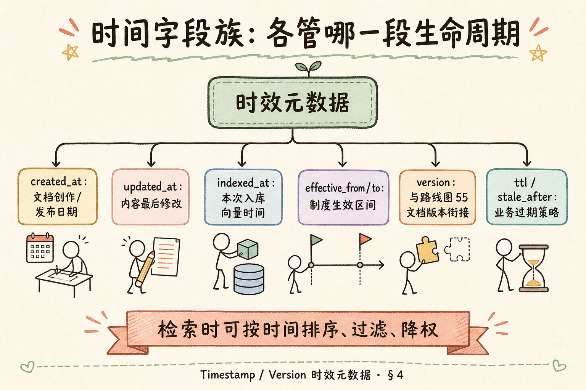
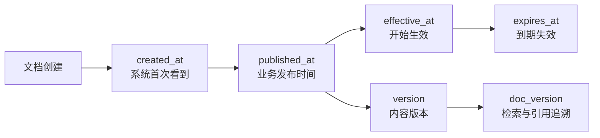
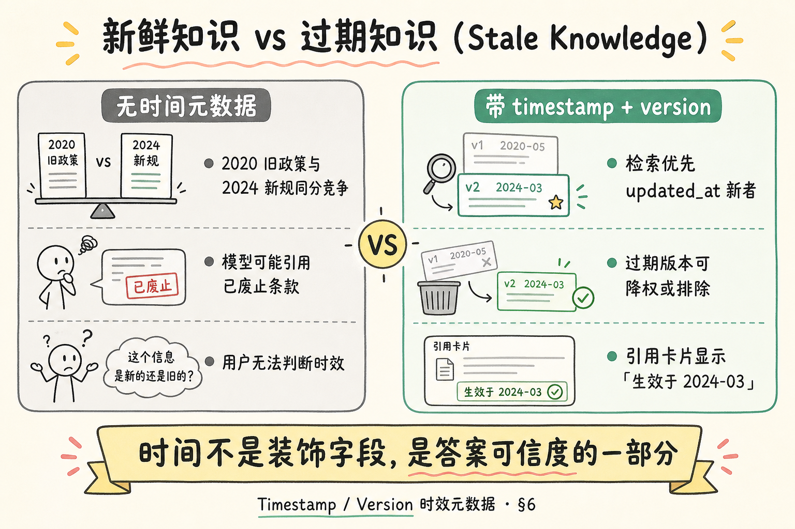
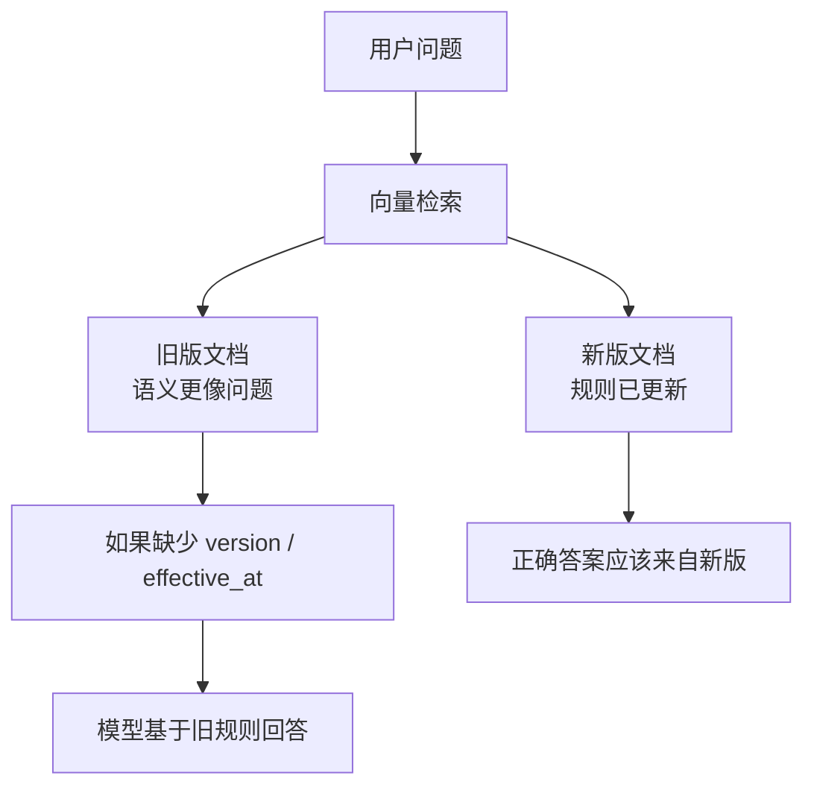
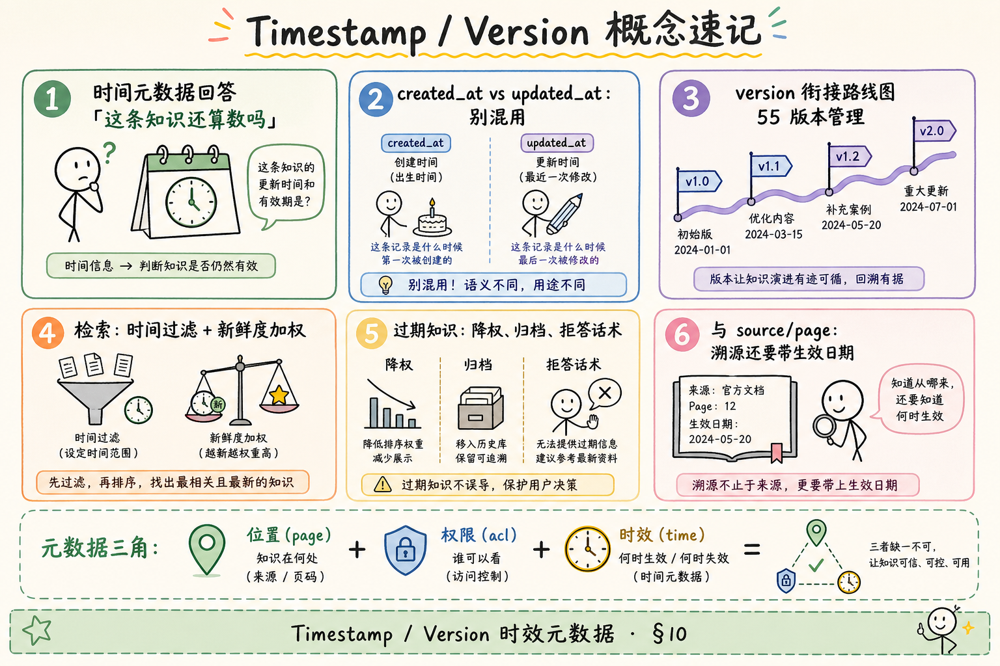
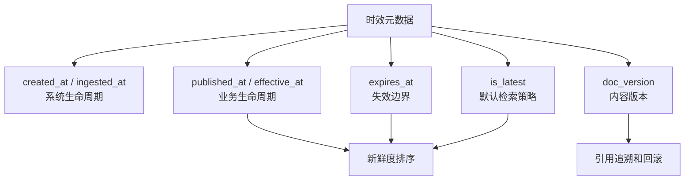

# RAG 数据采集与解析（十二）：Timestamp / Version 时效元数据完全指南

> 知识库最怕的不是「搜不到」，而是 **搜到三年前已废止的制度**——向量相似度不管「过期」，模型还会用 [34 篇](34.grounding-citation-tutorial.md) 式自信语气念出来。本篇是 [企业 RAG 路线图](ENTERPRISE_RAG_ROADMAP.md) **C1 轨第十二篇**（路线图第 **61** 条），讲清 **timestamp**（时间戳）与 **version**（版本）元数据：如何标记 **时效**、如何缓解 **过期知识（Stale Knowledge）**、如何与路线图 **55 文档版本管理** 衔接，以及在检索里做 **排序与过滤**。前置：[52 溯源元数据](52.metadata-source-page-tutorial.md)、[53 ACL](53.metadata-acl-tutorial.md)；版本全链路见路线图 **55～56**。

---

## 目录

1. [前言：对的答案也可能是过期的](#1-前言对的答案也可能是过期的)
2. [本文边界与动手路径](#2-本文边界与动手路径)
3. [时间元数据解决什么问题](#3-时间元数据解决什么问题)
4. [时间字段族：各管哪段生命周期](#4-时间字段族各管哪段生命周期)
5. [version 与路线图 55 的衔接](#5-version-与路线图-55-的衔接)
6. [过期知识：相似度不救你](#6-过期知识相似度不救你)
7. [检索侧：过滤、排序与降权](#7-检索侧过滤排序与降权)
8. [综合实战：时间字段写入与查询策略](#8-综合实战时间字段写入与查询策略)
9. [与溯源、ACL 的组合](#9-与溯源acl-的组合)
10. [综合概念地图](#10-综合概念地图)
11. [先错对对：时间字段乱写](#11-先错对对时间字段乱写)
12. [常见陷阱与 FAQ](#12-常见陷阱与-faq)
13. [总结与系列下一步](#13-总结与系列下一步)

---

## 1. 前言：对的答案也可能是过期的

用户问：「研发加班补贴标准是多少？」检索命中 2021 年旧版制度：**每晚 200 元**；2024 年新规已是 **300 元**。两段文字 **语义相近**，向量分数可能差 0.02——若无 **时间元数据**，系统会把旧规当权威，还配上 **「员工手册 p.8 [1]」** 的完美引用。

用户不会夸你 Grounding 做得好，只会说：**「系统让我按作废文件办事。」**

**Timestamp metadata**（时间戳元数据）：描述文档或 chunk 在时间轴上位置的字段，如创建、修改、生效、入库时间。  
通俗说：给知识贴 **「什么时候还算数」** 的标签。

**Version metadata**（版本元数据）：标识内容修订世代的字段，与 `doc_id` 配合区分「同一手册第 3 版 vs 第 4 版」。  
通俗说：文件名都叫 `handbook.pdf` 时，靠 **version** 知道 **哪一版**。

**Stale knowledge**（过期知识 / 陈旧知识）：曾正确但已被新版本替代、或已过生效期的信息仍被检索并采纳。  
通俗说：**对的，但是去年的**。

**读完本文，你应该能做到：**

1. 区分 `created_at`、`updated_at`、`effective_from` 等字段用途。  
2. 说明 version 与路线图 **55** 文档版本管理如何衔接。  
3. 设计至少一种 **时间过滤** 与一种 **新鲜度降权** 策略。  
4. 解释为何仅靠相似度无法解决过期问题。  
5. 写出 chunk 时间字段示例并对照 §11 纠错。

---

## 2. 本文边界与动手路径

**档位：地基篇（C1 元数据子系列收束篇）。**

**本文讲：** 时间/version 字段语义、过期风险、检索排序过滤、与 55/56 衔接、组合溯源与 ACL。  
**本文不讲：** 增量更新流水线代码（路线图 **56** 全文）、事件溯源架构、时区法务认定、实时新闻秒级爬虫。

### 2.1 动手路径表

| 步骤 | 你做什么 | 验收 |
|------|----------|------|
| A | 读 §4 字段族表 | 能分 created vs updated |
| B | 读 §5 与路线图 55 | 能画 doc_id + version |
| C | 读 §7，选过滤或降权一种 | 能写伪代码 |
| D | 跟做 §8 chunk 示例 | JSON 含时间字段 |
| E | 完成 §11 先错对对 | 指出用 indexed_at 当日志 |
| F | 对照 §10 概念地图 | 速记表口述 |

**环境：** 纸笔 / JSON；有 SQL 或向量库时可把 §7 filter 改成真实查询。

### 2.2 沿用前文

| 概念 | 来自 |
|------|------|
| doc_id / source 溯源 | [52 篇](52.metadata-source-page-tutorial.md) |
| acl 过滤 | [53 篇](53.metadata-acl-tutorial.md) |
| 引用与拒答 | [34 Grounding](34.grounding-citation-tutorial.md) |
| 文档版本管理 | 路线图 **55**；增量 **56** |

---

## 3. 时间元数据解决什么问题

| 问题 | 无时间字段时 | 有时间字段后 |
|------|--------------|--------------|
| 多版本并存 | 相似度打架 | 优先 `updated_at` 新者 |
| 制度已废止 | 仍被检索 | `effective_to < now` 过滤 |
| 用户质疑「是否最新」 | 无法回答 | 引用卡显示生效日 |
| 合规审计 | 说不清依据哪版 | 日志带 `version` |

**Timeliness**（时效性）：信息是否仍适用于当前时刻。RAG 产品信任度 **高度依赖** 时效，尤其在 HR、法务、运维手册场景。

### 3.2 三类「过期」别混谈

| 类型 | 含义 | 字段 |
|------|------|------|
| 业务废止 | 制度不再执行 | `effective_to` |
| 版本替代 | 新版发布 | `version`, `status` |
| 事实过时 | 世界变了但文档未改 | 需运营复审，非自动 |

**Semantic drift**（语义漂移）：世界变化使旧陈述不再准确，但文本未标过期——靠定期复审与外部数据源，不能单靠 `updated_at`。

### 3.3 用户信任与产品指标

展示 **生效日 + 版本** 的引用卡片，NPS 投诉里「信息过时」类通常会下降——用户知道你在 **负责任地标注**，而不是瞎编日期。

---

## 4. 时间字段族：各管哪段生命周期

读下图，避免「所有时间都叫 timestamp」这种糊法。




下面这张图把常见时间字段放在文档生命周期里。读图时重点看：不同字段回答的问题不同，不能都用一个 `updated_at` 糊过去。



结论：新鲜度排序通常看业务时间，排障和追溯要看版本号，合规留痕还要保留系统入库时间。

对照上图，推荐字段分工：

| 字段 | 含义 | 典型来源 | 检索用途 |
|------|------|----------|----------|
| `created_at` | 文档首次创建/发布 | CMS、文件 mtime | 展示、粗排序 |
| `updated_at` | 内容最后实质修改 | Git、Drive、保存时间 | **新鲜度主字段** |
| `indexed_at` | 本次写入向量库时间 | 入库流水线 | 排障、非业务时效 |
| `effective_from` | 制度开始生效 | 业务录入 | 过滤「尚未生效」 |
| `effective_to` | 制度失效 | 业务录入 | 过滤「已过期」 |
| `version` | 修订号/标签 | 见 §5 | 去重、展示、审计 |

**indexed_at**（入库时间）：向量写入完成的时间戳。  
通俗说：**你什么时候把它塞进搜素引擎**——不等于文件在业务上何时更新。

**Effective date**（生效日期）：组织认定该文本开始对员工产生约束的日期。  
通俗说：文件上周上传，但 **下周一才生效**——周一之前应用 `effective_from` 过滤。

### 4.1 用哪个字段做「新鲜度」

默认推荐：**`updated_at`（业务修改） > `effective_from`（制度）**；  
**不要用 `indexed_at` 当业务新鲜度**——除非你故意表达「刚 reindex 的旧文件」（见 §11 错例）。

时区：全库统一 **UTC 存储、界面按用户时区展示**，避免「差 8 小时就判过期」闹剧。

---

## 5. version 与路线图 55 的衔接

路线图 **55 文档版本管理** 解决：**同一逻辑文档多次修订，如何不互相污染检索**。时间元数据里的 **`version`** 是其在 **chunk 级** 的落点。

### 5.1 身份 vs 版本

| 概念 | 字段 | 变化时机 |
|------|------|----------|
| 逻辑文档身份 | `doc_id` | 尽量不变 |
| 一次修订 | `version` | 每次发新版 +1 或打标签 |
| 物理文件 | `source` / hash | 每版新文件 |

示例：

```json
{
  "doc_id": "doc_handbook",
  "version": "2024.3",
  "display_title": "员工手册（2024 年 3 月版）",
  "updated_at": "2024-03-01T00:00:00Z",
  "supersedes": "2023.12"
}
```

**Supersession**（替代关系）：新版本声明取代哪些旧版本。  
通俗说：2024.3 册子出来说 **「代替 2023.12」**。

### 5.2 与增量更新（路线图 56）的关系

**56** 关心 **检测变更、少重复嵌入**；**55/61** 关心 **变更后元数据怎么标**。  
典型流水线：diff 检测 → 新 `version` → 旧版 chunk **标记 deprecated 或从默认检索排除** → 新 chunk `indexed_at` 更新。

### 5.3 默认检索策略

| 策略 | 行为 |
|------|------|
| 仅最新版 | `filter: version == doc.latest_published` |
| 多版共存 | 降权旧版，法务场景可查历史 |
| 时间旅行 | 显式参数 `as_of=2023-06-01`（进阶） |

### 5.4 版本号排序陷阱

字符串排序里 `"2024.10" < "2024.9"` 会成立——若用 **点分字符串** 作 version，要么 **零填充**（`2024.09`），要么用 **整数 build 号**（`20240301`）作排序键，展示仍可用 `2024.3`。  
**Sort key**（排序键）：与展示分离的机器可比字段。  
通俗说：给人看「2024 年 3 月版」，给数据库看 `20240301`。

### 5.5 与 52 篇 display_title 的联动

发新版时同步改 `display_title`：`员工手册（2024 年 3 月版）`，让用户 **不看 effective 字段也能猜版本**——但不可替代 `version` 过滤，因为标题可能被手工改乱。

---

## 6. 过期知识：相似度不救你

读下图，理解「语义像」不等于「还能用」。




下面这张图说明过期知识为什么危险。读图时重点看：相似度高不代表内容仍然有效，旧制度往往更容易被检索命中。



结论：时效元数据是检索质量的一部分。对制度、价格、政策、接口文档这类内容，必须把版本和生效时间带入检索逻辑。

对照上图：

向量相似度衡量 **语义接近**，不衡量 **是否仍有效**。两条补贴规定可能只有数字不同，embedding 几乎一样——**必须用时间/version 打破平局**。

| 场景 | 风险 | 缓解 |
|------|------|------|
| 政策数字调整 | 旧数字被引用 | 最新版优先 + 失效过滤 |
| 组织架构变更 | 旧汇报关系 | `effective_to` + 定期重索引 |
| 技术标准换代 | 旧 API 仍被推荐 | 文档类型 + 版本标签 |
| 新闻/行情 | 日级过期 | 短 TTL、外部数据源 |

**TTL**（Time To Live，生存时间）：超过则不再默认检索或自动降权。  
通俗说：**这条知识保质期 90 天**，过期要重审或下架。

### 6.1 用户可见信号

引用卡片除 [52 篇] 的 page/section 外，加：

```text
员工手册（2024 年 3 月版）· 生效 2024-03-01 · p.12
```

用户一眼可知 **是不是最新**；减少「系统坑我」体感。

### 6.2 内部运营：过期文档巡检

每月跑 SQL：「`effective_to` 已过期但仍 `active` 的 chunk 数」——大于零就触发 **56 增量任务** 或人工归档。  
别等用户投诉才翻库存。

### 6.3 矛盾：旧版写得更「像问题」

有时旧版政策篇幅更长、举例更多，向量反而比精简新版 **更贴题**。这是 **必须用时间打破平局** 的典型场景：

| 信号 | 权重建议 |
|------|----------|
| vec_score | 0.75 |
| recency | 0.15 |
| version == latest | 硬 filter 或 +0.1 bonus |

在评测集上画出 **旧版命中率先降后稳**，再上线生产。

---

## 7. 检索侧：过滤、排序与降权
这一节先把「检索侧：过滤、排序与降权」放到真实 RAG 流程里理解：它解决的不是单个函数怎么写，而是数据从入库、检索到展示时如何保持可解释、可验证、可排障。

### 7.1 硬过滤（Hard filter）

```text
effective_from <= now AND (effective_to IS NULL OR effective_to >= now)
AND version IN allowed_versions(doc_id)
```

无权或过期 **根本不进候选**——与 [53 篇](53.metadata-acl-tutorial.md) ACL filter **叠加**（AND 关系）。

### 7.2 排序（Sort）

在相似度 `score` 基础上加 **新鲜度分**：

```python
final_score = 0.85 * vec_score + 0.15 * recency_score(updated_at)
```

`recency_score` 可用指数衰减：越新越接近 1，超过 2 年接近 0。系数需评测，**别一上来 50/50** 压过语义。

**Recency decay**（新鲜度衰减）：按时间差把分数向 0 收敛的函数。  
通俗说：**越久没更新，越不信**——但仍保留一点余地给仍唯一的文档。

### 7.3 降权而非删除（Soft deprecation）

培训材料、判例库需要 **查旧版** 时：旧 chunk `weight: 0.3` 或打 `status: archived`，默认检索排除，**专家模式**可开启。

### 7.4 SQL / 向量库伪代码

```sql
SELECT chunk_id, text, vec_score
FROM chunks
WHERE tenant_id = :tenant
  AND effective_from <= NOW()
  AND (effective_to IS NULL OR effective_to >= NOW())
  AND version = (SELECT max(version) FROM doc_versions WHERE doc_id = chunks.doc_id)
ORDER BY 0.85 * vec_score + 0.15 * recency(updated_at) DESC
LIMIT 10;
```

真实系统把 `recency` 放在应用层或向量库 hybrid 排序均可。

### 7.5 排序公式参数从哪来

```python
import math
from datetime import datetime, timezone

def recency_score(updated_at: str, half_life_days: float = 365) -> float:
    dt = datetime.fromisoformat(updated_at.replace("Z", "+00:00"))
    age_days = (datetime.now(timezone.utc) - dt).total_seconds() / 86400
    return math.exp(-0.693 * age_days / half_life_days)  # 半衰期一年
```

`half_life_days` 用验证集调：问「今年政策」时，旧版 chunk 的 **final_score 应稳定低于新版** 即可，不必追求理论最优。

### 7.6 与 BM25 关键词的混合（预习 C4）

时间策略对 **向量检索** 与 **关键词检索** 都应生效；否则 hybrid 检索里 BM25 仍可能把旧版标题顶上来。  
统一规则：**先 filter 生效版本，再融合分数**——别让融合把已过期文档复活。

### 7.7 Reranker 阶段的时效加权

若使用交叉编码器重排（路线图 C4），可在 **rerank 后** 再乘 `recency_multiplier`，避免 BM25/向量与 rerank 分数尺度不一致。  
原则不变：**先硬过滤废止版，再谈加权**——别让 rerank 把过期文档捞回来。

### 7.8 新闻类短 TTL 示例

```python
NEWS_TTL_DAYS = 30

def news_still_valid(meta: dict) -> bool:
    if meta.get("doc_type") != "news":
        return True
    age = days_since(meta["updated_at"])
    return age <= NEWS_TTL_DAYS
```

TTL 到期后可 **自动 archived** 或转人工复审，别永久留在默认索引里占 top-k。

---

## 8. 综合实战：时间字段写入与查询策略
这一节开始把概念落到可操作步骤上；你可以先按顺序跑通最小路径，再回头替换成自己的业务数据。

### 8.1 两个版本的同一政策 chunk

```python
chunks = [
    {
        "chunk_id": "chk_v3_08",
        "doc_id": "doc_handbook",
        "version": "2023.12",
        "display_title": "员工手册（2023 年 12 月版）",
        "updated_at": "2023-12-01T00:00:00Z",
        "effective_from": "2023-12-15T00:00:00Z",
        "effective_to": "2024-02-29T23:59:59Z",
        "status": "deprecated",
        "text": "加班补贴：每晚 200 元。",
    },
    {
        "chunk_id": "chk_v4_08",
        "doc_id": "doc_handbook",
        "version": "2024.3",
        "display_title": "员工手册（2024 年 3 月版）",
        "updated_at": "2024-03-01T00:00:00Z",
        "effective_from": "2024-03-01T00:00:00Z",
        "effective_to": None,
        "status": "active",
        "text": "加班补贴：每晚 300 元。",
    },
]
```

### 8.2 查询「现在」的过滤函数

```python
from datetime import datetime, timezone

def is_effective(meta: dict, now: datetime | None = None) -> bool:
    now = now or datetime.now(timezone.utc)
    ef = meta.get("effective_from")
    et = meta.get("effective_to")
    if ef and now < datetime.fromisoformat(ef.replace("Z", "+00:00")):
        return False
    if et and now > datetime.fromisoformat(et.replace("Z", "+00:00")):
        return False
    if meta.get("status") == "deprecated":
        return False
    return True
```

### 8.4 完整检索伪流程（串联 52/53/54）

```python
def retrieve(query_vec, user, now=None):
    candidates = ann_search(query_vec, top_k=50)
    out = []
    for c in candidates:
        if not can_read(user, c["meta"]):  # 53 ACL
            continue
        if not is_effective(c["meta"], now):  # 54 时效
            continue
        if c["meta"].get("status") == "deprecated":
            continue
        out.append(c)
    out.sort(key=lambda c: final_score(c), reverse=True)
    return out[:5]
```

返回给前端的每个 hit 应带齐 [52 篇] 的 `display_title`、`page`/`section_path`，以及本篇的 `version`、`effective_from`，**一张引用卡片信息才完整**。

### 8.5 用户说「这不是最新」时的客服脚本

1. 查日志中 `chunk_id` 的 `version` 与 `effective_from`；  
2. 查该 `doc_id` 是否有更新版未入库（路线图 56）；  
3. 若有新 PDF 未索引 → 运维工单；若已索引但 filter 漏 → 研发工单；  
4. 回复用户时 **给生效日**，不要空口「我们会改进」。

---

## 9. 与溯源、ACL 的组合

```text
[1]（员工手册 2024 年 3 月版 · 生效 2024-03-01 · p.15）
加班补贴：每晚 300 元。
```

模型与用户 **同源** 看到时效，减少「据旧规回答」争议。

---

## 9. 与溯源、ACL 的组合（扩展）

C1 元数据三角在本系列三篇中闭合：

| 篇 | 维度 | 核心字段 |
|----|------|----------|
| 52 | 位置 | source, page, section |
| 53 | 权限 | tenant_id, allowed_roles |
| 54 | 时效 | updated_at, version, effective_* |

检索时的 **合取逻辑**：

```text
hit = semantic_match AND can_read(user) AND is_effective(now) AND is_allowed_version
```

引用卡片展示：**标题 + 版本/生效日 + page/section**（52）；无权用户 **53** 已挡在检索外。

---

## 10. 综合概念地图

读下图时，先看「Timestamp Version 概念地图」想表达的主线：它把本节的概念关系压缩成一张可对照的图。




下面这张概念地图总结时间和版本字段如何配合。读图时重点看：时间解决“何时有效”，版本解决“是哪一版”。



这张图的结论是：RAG 不能只知道“哪篇文档相似”，还要知道“这篇文档现在是否还该被使用”。

对照上图：版本管理(55) → 写入时间字段 → 检索过滤/降权 → 引用展示时效 → 增量(56) 迭代。

### 10.1 速记表

| 概念 | 一句话 |
|------|--------|
| updated_at | 业务新鲜度主字段 |
| indexed_at | 入库时间，非业务时效 |
| effective_from/to | 制度生效区间 |
| version | 与 doc_id 配合区分修订 |
| stale knowledge | 语义像但已作废 |
| 硬过滤 + 降权 | 默认最新，归档可查旧 |
| TTL | 短时效知识的保质期 |

### 10.2 评测集构造建议

为时效策略单独做 **20 条** 问答对：每对含 **故意相近** 的新旧两 chunk，标签为「必须命中新版」。  
上线前 **命中率 < 95%** 则调 filter 或权重，别直接全量发布。

### 10.3 与拒答的交界

当 **仅过期版命中** 且业务配置为「严禁过期」时，应 **拒答** 而非念旧数字：

```text
知识库中存在历史版本，但无当前有效规定。请联系制度管理员或查看最新发布通知。
```

这比模型自己说「可能已变更」更可控。

### 10.4 三字段在引用卡片上的排版示例

```text
┌─────────────────────────────────────────┐
│ [1] 员工手册（2024 年 3 月版）            │
│     生效 2024-03-01 · p.15 · 第三章>年假   │
│     「入职满一年，享受 10 个工作日年假…」  │
└─────────────────────────────────────────┘
```

第一行 **版本**（54），第二行 **位置**（52），第三行 **snippet**——信息密度够且不刷屏。

### 10.5 周会三板斧（运维向）

1. 过期仍 active 的 chunk 数；  
2. 同 doc 多版本同时命中的查询占比；  
3. 用户反馈「过时」是否聚类到同一 `doc_id`。  

三个数连续两周下降，说明 **55/56/61** 闭环在转。

### 10.6 术语对照速查（双轨）

| 英文 | 中文 | 字段 |
|------|------|------|
| Timestamp | 时间戳 | updated_at, indexed_at |
| Version | 版本 | version, supersedes |
| Effective date | 生效日 | effective_from, effective_to |
| Stale knowledge | 过期知识 | 策略概念 |
| TTL | 生存时间 | 天数策略 |
| Recency decay | 新鲜度衰减 | 排序函数 |

---

## 11. 先错对对：时间字段乱写
下面这些错误看起来只是实现细节，实际会破坏检索、引用、评测或用户体验。读的时候重点看：错法缺少了哪个必要信息，以及正确做法如何补上这个缺口。

### 11.1 错：用 indexed_at 表示政策更新

**错例：** 昨晚 reindex 2019 年 PDF，`updated_at` 却写成昨晚。  
**危害：** 系统以为 **最新**，实则内容陈旧。

**对：** `updated_at` 来自 **业务修改时间** 或文档内声明版本日；`indexed_at` 单独记录。

### 11.2 错：只有 version 字符串，无 effective 区间

**错例：** `version: "v2"`，但不知道何时生效。  
**危害：** 上线日与前版并存周 **双轨打架**。

**对：** 发版流程强制 `effective_from`；旧版写 `effective_to`。

### 11.3 错：过期 chunk 不删不降权

**错例：** 怕麻烦，历史全留、检索也不滤。  
**危害：** §6 双倍命中，用户拿到旧数字。

**对：** `status: deprecated` 或移出默认 collection。

### 11.4 错：在 prompt 里让模型「选最新资料」

**错例：** 两版都塞进上下文，让模型「自行判断最新」。  
**危害：** 与 [34 篇] 冲突，模型可能错选或 **都引用**。

**对：** **检索层** 只给最新有效版；模型不负责版本仲裁。

---

## 11.5 文档类型分策略（进阶但常用）

「一刀切新鲜度衰减」会伤害 **长期稳定的法条** 与 **每日变动的新闻**。可用 `doc_type` 分支：

| doc_type | 默认策略 | 说明 |
|----------|----------|------|
| `policy` | effective 区间 + 最新版 | HR/财务制度 |
| `manual` | 低衰减，重 `updated_at` | 运维手册 |
| `news` | 短 TTL（如 30 天） | 内网新闻 |
| `meeting_notes` | 按项目归档 | 纪要易过期 |
| `api_ref` | version 绑定产品发版 | 与 semver 对齐 |

入库时由 **上传者选择 + 规则推断**（扩展名、目录）共同决定，减少全填 `policy`。

### 11.6 时间旅行查询（as_of）概念

法务偶发需要：「2023 年 6 月时加班政策是什么？」——此时 `now` 换成 `as_of`：

```python
def is_effective_at(meta: dict, as_of: datetime) -> bool:
    # 同 is_effective，但 now 改为 as_of
    ...
```

默认问答 **不传 as_of**；专家模式或法务入口才开放。UI 必须醒目提示 **「历史视图」**，避免员工按旧规办事。

**Point-in-time query**（时点查询）：在指定历史时刻评估哪条知识有效。  
通俗说：**时光机**，不是默认模式。

### 11.7 与去重（路线图 54 simhash）的交界

近重复文档可能 **新版稍改标题就整库重传**。版本元数据应与 **内容 hash** 并用：

| 信号 | 用途 |
|------|------|
| `content_hash` | 检测字节级变更 |
| `version` | 业务承认的发布世代 |
| `updated_at` | 展示与排序 |

若 hash 未变但 `version` bump，说明 **仅元数据变**；若 hash 变而 version 未 bump，说明 **流程漏了发版**。

---

## 12. 常见陷阱与 FAQ

1. **文件 mtime 不可靠**——解压缩、拷贝会改 mtime；优先 CMS/Git/人工版本表。  
2. **全球制度时区**——`effective_from` 用 UTC 存，界面注明「北京时间 0 点」等。  
3. **部分章节更新**——整 doc `version`  bump 最简单；章节级 version 进阶（路线图 **56**）。  
4. **新闻 vs 制度**——新闻用短 TTL；制度用 effective 区间，别同一套参数。  
5. **只过滤不展示**——用户看不到生效日，仍不信任答案。

**Q：没有精确生效日怎么办？**  
A：用 `updated_at` + 人工 `version` 标签；UI 写「约 2024 年更新」，别假装有日到秒。

**Q：历史版要给法务查吗？**  
A：要；放归档索引或 `include_deprecated=true` 参数，默认关。

**Q：与 54 和 55 会不会重复？**  
A：55 是流程与策略，54/本篇是 **chunk 字段怎么写、检索怎么用**——互补。

**Q：时间降权会不会伤长尾文档？**  
A：会；对「极少更新但长期有效」的文档类型降低 decay 或豁免——靠 `doc_type` 分策略。

**Q：用户问「最新」但库里有草稿版？**  
A：`status: draft` 默认不进检索；发布时改 `active` 并写 `effective_from`。

**Q：跨时区生效日展示？**  
A：存储 UTC，UI 用 `Asia/Shanghai` 等格式化，并注明时区。

**Q：版本号用数字还是日期？**  
A：均可；`2024.3` 与 `v3` 择一全库统一；避免混用导致排序字符串错乱。

**Q：重索引会改变向量分数吗？**  
A：会（模型/归一化变更是另一题）；故评测要固定 `index_generation`，与时间策略分开观测。

### 12.1 观测指标：时效坏案怎么发现

| 指标 | 定义 | 告警 |
|------|------|------|
| `stale_hit_rate` | 命中 `deprecated` chunk 比例 | >0 即 P0 |
| `version_conflict_rate` | 同问同 doc 多版本同现 | 周环比升 |
| `effective_gap` | 问效日期与 chunk `effective_from` 差 | 人工抽测 |
| `user_feedback_stale` | 用户点击「信息过时」 | 聚类到 doc_id |

把「过期」从 **体感差评** 变成 **可度量**，才能跟 55/56 迭代闭环。

### 12.2 发布 checklist（与路线图 55 对齐）

- [ ] 新版 `version` 与 `supersedes` 已填  
- [ ] 旧版 `effective_to` 或 `status: deprecated` 已执行  
- [ ] `display_title` 含版本或日期（[52 篇](52.metadata-source-page-tutorial.md)）  
- [ ] 默认检索 filter 仅 `active`  
- [ ] 引用卡片展示生效日  
- [ ] 增量任务（56）已触发 re-embed 或确认 hash 未变跳过  

### 12.3 三篇元数据系列的合奏

| 用户问题 | 52 位置 | 53 权限 | 54 时效 |
|----------|---------|---------|---------|
| 在哪一页？ | page/section | — | — |
| 我能看吗？ | — | ACL | — |
| 还算数吗？ | — | — | version/effective |
| 能点开核对吗？ | 深链接 | 有权才返回 | 展示生效日 |

上线评审时 **三张表一起勾**，缺一角都是产品债。

### 12.4 从 55 到 61 的学习路径建议

1. 先读路线图 **55** 理解版本治理流程；  
2. 再读本篇把字段落到 chunk；  
3. 做 **56** 增量时验证 `version` bump 是否触发默认 filter；  
4. 与 [52](52.metadata-source-page-tutorial.md) 一起在引用 UI 展示 **版本 + 页码**。

### 12.5 冷启动：历史库无时间字段

老库迁移可 **分批补元数据**：

| 批次 | 策略 |
|------|------|
| 高曝光制度 | 人工补 `version` + `effective_from` |
| 其余 | `updated_at := 文件 mtime` 作弱近似 + 标注「待核实」 |
| 全文 | 禁止 `indexed_at` 冒充业务时间 |

迁移窗口在 UI 打 **「历史数据，生效日待确认」** 横幅，比静默错误更体面。

### 12.6 与路线图 55 的必读衔接

若你只读一篇版本相关文档，优先级：**55 流程 → 54 字段 → 56 增量**。  
55 回答「组织怎么发版」；54 回答「chunk 上贴什么」；56 回答「检测到变更后跑什么任务」——跳过 55 直接写 `version` 字段，容易与业务发版节奏脱节。建议把本篇的 `is_effective()` 与 55 的发布 checklist 绑在同一条 CI 流水线里。上线前用 **故意相近的新旧 chunk 评测集** 跑一轮，比口头承诺「我们优先最新版」更能说服业务方。评测不过，默认检索策略就不要上线——这是 C1 元数据里成本最低的「质量门」，也是 61 对 55 的落地验收之一。务必落实。

---

## 13. 总结与系列下一步

1. **时间/version** 解决「对了但过期」；相似度不能替代时效。  
2. 字段分工：`updated_at` 业务新、`indexed_at` 入库、`effective_*` 制度、`version` 衔接 **55**。  
3. 检索：**硬过滤** 无效版 + **新鲜度排序/降权**；默认只搜最新有效。  
4. 与 [52 溯源](52.metadata-source-page-tutorial.md)、[53 ACL](53.metadata-acl-tutorial.md) **AND** 组合，引用卡片展示生效信息。  
5. 别让模型在 prompt 里 **猜最新**——检索层应只给合格 chunk。

**收束一句：** 时效元数据把「知识库」从 **静态文件堆** 变成 **有时间轴的制度系统**——用户问的是「现在」，你就别用「三年前」的答案还标着 [1]。与 [52 位置](52.metadata-source-page-tutorial.md)、[53 权限](53.metadata-acl-tutorial.md) 一起，才构成可上线企业的元数据底座。

### 13.1 系列下一步

| 目标 | 阅读 |
|------|------|
| OCR 扫描件 | [55 OCR 与扫描件](55.ocr-scanned-docs-tutorial.md) |
| 固定长度分块 | [57 固定长度分块](57.fixed-size-chunking-tutorial.md) |
| 文档版本管理详解 | [48 文档版本](48.doc-versioning-tutorial.md) |
| 增量更新 | [49 增量更新](49.incremental-update-tutorial.md) |
| 混合检索与重排 | 路线图 C4 |
| Grounding 回顾 | [34](34.grounding-citation-tutorial.md) |

### 13.2 学习目标自检

- [ ] 能区分主要时间字段  
- [ ] 能说明 version 与 doc_id 关系  
- [ ] 能写 `is_effective()` 逻辑  
- [ ] 能解释 stale knowledge 成因  
- [ ] 能设计过滤或降权策略  
- [ ] 能识别 §11 四类错例  

---

> **初学者可能仍困惑的点**  
> - 时间元数据不是「给运维看的」，是 **答案可信度** 的一部分。  
> - `indexed_at` 与 `updated_at` 混一次，排序错半年。  
> - C1 元数据三篇读完：位置(52)、权限(53)、时效(54)——下一模块 **[55 OCR](55.ocr-scanned-docs-tutorial.md)** 或 **[57 固定长度分块](57.fixed-size-chunking-tutorial.md)** 见 §13.1。
