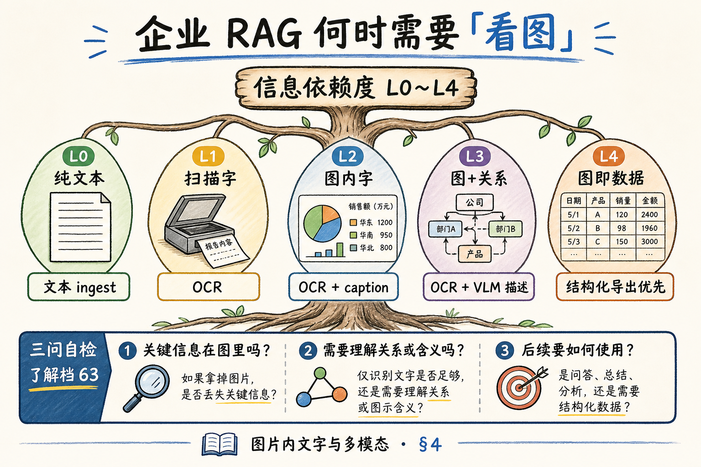
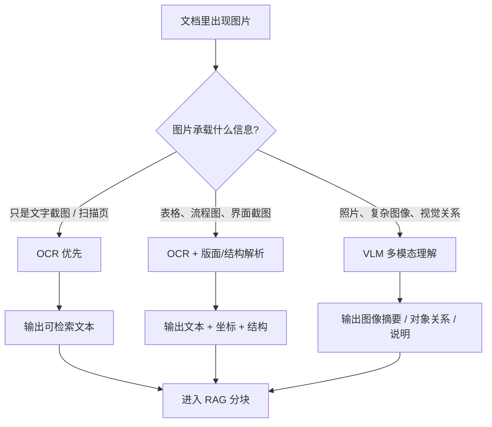
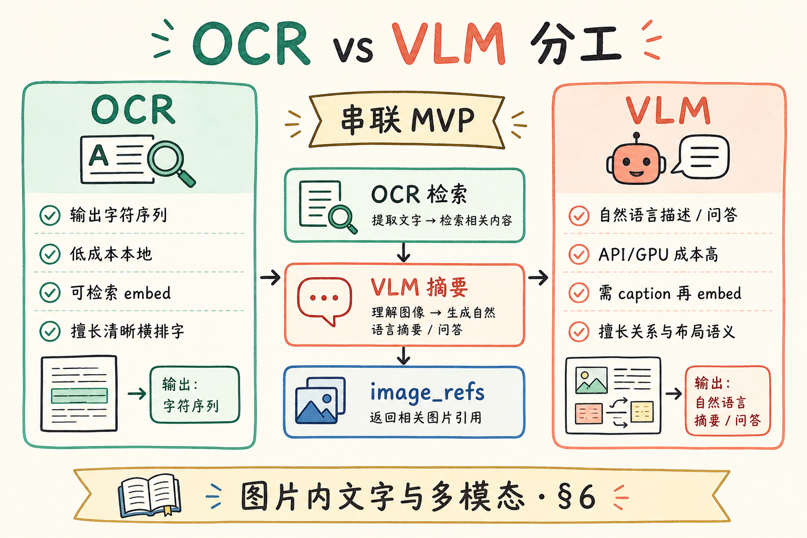
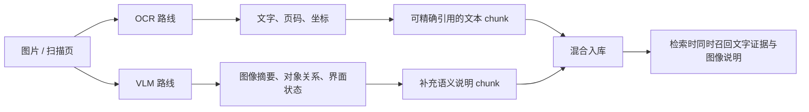
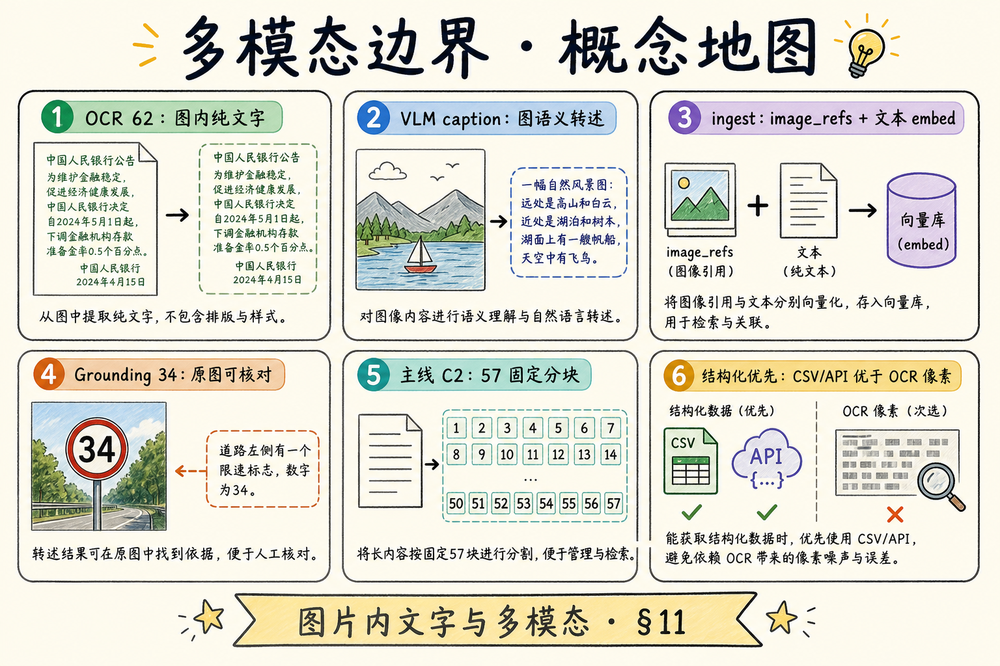
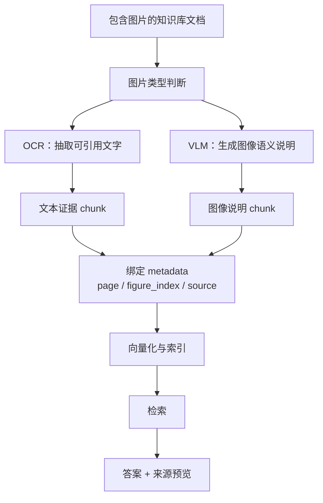

# 企业 RAG 数据采集（了解）：图片内文字与多模态边界

> 要不要读本篇？**大多数文字型 RAG 可以先跳过**——若你的库主要是 Word、可选中 PDF、Markdown，[55 OCR 篇](55.ocr-scanned-docs-tutorial.md) 够应对扫描合同。但若知识藏在 **PPT 信息图、架构截图、仪表盘 JPEG、带标注的流程图** 里，用户会问「图上那个箭头什么意思」——纯文本 chunk **根本没有这些像素**。这篇是 [企业 RAG 路线图](ENTERPRISE_RAG_ROADMAP.md) **C1 了解档**（路线图第 **63** 条），讲 **图片内文字** 与 **多模态** 在 ingest/问答中的位置、与 OCR 的分工、企业何时值得投入，**不深挖模型训练**。前置可选：[55 OCR](55.ocr-scanned-docs-tutorial.md)、[42 PyMuPDF](42.pymupdf-tutorial.md)。

---

## 目录

1. [要不要读：三问自检](#1-要不要读三问自检)
2. [前言：截图里的字，文本层里没有](#2-前言截图里的字文本层里没有)
3. [本文边界与动手路径](#3-本文边界与动手路径)
4. [企业 RAG 何时需要「看图」](#4-企业-rag-何时需要看图)
5. [图片内文字：OCR 能到哪里](#5-图片内文字ocr-能到哪里)
6. [OCR vs VLM：两条路线的分工](#6-ocr-vs-vlm-两条路线的分工)
7. [ingest 侧：图+文怎么进库](#7-ingest-侧图文怎么进库)
8. [问答侧：多模态检索与生成（了解）](#8-问答侧多模态检索与生成了解)
9. [成本、合规与 MVP 建议](#9-成本合规与-mvp-建议)
10. [先错对对：多模态误用](#10-先错对对多模态误用)
11. [综合概念地图](#11-综合概念地图)
12. [常见陷阱与 FAQ](#12-常见陷阱与-faq)
13. [总结与系列下一步](#13-总结与系列下一步)

---

## 1. 要不要读：三问自检

在打开正文前，用 **30 秒** 判断本篇是否值得精读：

| 问题 | 若「经常 yes」→ 建议读 |
|------|------------------------|
| 用户提问是否常引用 **幻灯片、架构图、监控截图**？ | ✓ |
| 文档里 **关键信息在图里**（流程、拓扑、指标趋势）而不仅是图下 caption？ | ✓ |
| OCR 抽出的字 **够搜但不够答**（例如问「红色模块负责什么」）？ | ✓ |

若三问皆 **no**：把精力留给 [57 固定长度分块](57.fixed-size-chunking-tutorial.md) 等 **C2 主线**；遇到扫描 PDF 再回 [55 OCR](55.ocr-scanned-docs-tutorial.md) 即可。

**了解档** 含义：建立 **概念坐标**，上线 MVP **不依赖** 本篇全部技术；避免团队过早 All-in 多模态 GPU。

### 1.1 谁应该精读、谁可以浏览

| 角色 | 建议 |
|------|------|
| 文本 RAG 后端 | 浏览 §1、§6，知道 ingest 扩展点 |
| 运维 / SRE 知识库 owner | 精读 §4、§12.2 截图场景 |
| 架构师 / 技术写作 | 精读 §12.4 alt 规范 |
| 算法（训练 VLM） | **可跳过**——本篇不训模型 |
| 产品经理 | 读 §1 三问 + §9 成本 |

### 1.2 与路线图 62（OCR）的边界

[55 OCR](55.ocr-scanned-docs-tutorial.md) 解决 **图里的字**；本篇解决 **字以外的像素语义** 与 **何时值得花钱**。顺序建议：**55 跑通 → 仍答不好图问题 → 再读 56**。勿跳过 55 直接 VLM——同样一张架构图，**OCR 框内文字** 仍是检索最便宜的一层。

---

## 2. 前言：截图里的字，文本层里没有

运维同学习惯在 Wiki 贴 **Grafana 截图**：轴标签、图例、告警阈值都在 **像素** 里；页面 HTML 只有一句「见下图」。纯文本 ingest 后，库里的 chunk 是：

```text
见下图。图 1 展示了 QPS 趋势。
```

用户问：「图 1 里 14:00 的 QPS 是多少？」——检索命中这段，**没有任何数字**；模型要么拒答，要么 **幻觉一个数**（见 [33 幻觉篇](33.llm-hallucination-tutorial.md)）。

另一类：**PPT 导出 PDF**，每页一大张图 + 演讲者备注。备注进文本层了，但 **图上箭头、色块分工** 没进——产品问「蓝色框和绿色框的调用关系」，仍答不好。

**Multimodal**（多模态）：同时处理 **文本、图像、（有时）音频** 等异构输入的模型或系统。  
通俗说：**不只会读字，还能「看」图**。

**Image-in-text**（图片内文字 / 图内文本）：嵌在图像像素中的可见字符，而非独立文本层。  
通俗说：**截图里那些字**——OCR 的主战场，但不是全部。

**Vision-Language Model**（VLM，视觉-语言模型）：把图像编码与语言模型联结，能根据图+文问答、描述、推理。  
通俗说：**能看图的 LLM**——GPT-4V、Gemini、Qwen-VL 等属此类。

**读完本文，你应该能做到：**

1. 用三问判断 **自家要不要做多模态**。  
2. 区分 **OCR 够用** vs **需要 VLM 语义** 的场景。  
3. 描述 ingest 时 **图+文并存** 的最小 metadata 设计。  
4. 说出 **不训练** 也能做的 MVP 路径。  
5. 避免 §10 中的典型误用。

---

## 3. 本文边界与动手路径

**档位：了解篇（C1 延伸，非 C2 主线前置）。**

**本文讲：** 场景判断、OCR 与 VLM 分工、ingest/问答架构直觉、成本合规、MVP。  
**本文不讲：** CLIP 微调、LayoutLM 训练、ColPali 索引实现、视频多模态、端侧 NPU 部署。

### 3.1 动手路径表

| 步骤 | 你做什么 | 验收 |
|------|----------|------|
| A | 完成 §1 三问 | 写下读/跳过的理由 |
| B | 盘点库中 **10 份** 文档的「图依赖度」 | 粗分高/中/低 |
| C | 读 §5～§6，各举 2 个 OCR-only / VLM 例 | 能口述 |
| D | 读 §7，草拟 `image_ref` metadata | JSON 示例 |
| E | 读 §10 先错对对 | 指出过度 VLM |
| F | 对照 §11 概念地图 | 能画 OCR/VLM 分界 |

**环境：** 纸笔即可；有 API Key 可在课后试 **一张截图 + VLM 问答**（非本文必需）。

### 3.2 与路线图关系

| 条目 | 关系 |
|------|------|
| 路线图 **62** OCR | [55 篇](55.ocr-scanned-docs-tutorial.md) — 图内 **纯文字** |
| 路线图 **63** 本篇 | 图 **语义** + 文字 |
| 路线图 **64** 分块 | [57 固定长度](57.fixed-size-chunking-tutorial.md) — 文本 chunk 主线 |
| [34 Grounding](34.grounding-citation-tutorial.md) | 图答案必须能 **指到原图** |

---

## 4. 企业 RAG 何时需要「看图」

读下图：按 **信息载体** 分档，决定技术栈深度。不要一看到图片就上多模态模型；先判断图片里到底是文字、结构，还是必须理解视觉语义。






上图的判断顺序是：能用 OCR 解决的，不要过早引入 VLM；只有当答案依赖视觉关系、界面状态或图中对象含义时，多模态理解才真正有必要。

对照上图：

| 档位 | 文档例 | 通常方案 | 多模态深度 |
|------|--------|----------|------------|
| L0 纯文本 | MD、可选中 PDF | 文本 ingest | 不需要 |
| L1 扫描字 | 扫描合同 | OCR → 文本 | 不需要 VLM |
| L2 图内字 | 截图、幻灯片照片 | OCR + caption | 轻量 |
| L3 图+关系 | 架构图、流程图 | OCR + VLM 描述 / 人工 alt | 中等 |
| L4 图即数据 | 仪表盘、热力图 | 结构化导出优先；否则 VLM | 高 |

**Information dependency**（信息依赖度）：答案是否 **必须** 读像素才能成立。  
通俗说：**不看图能不能答对**——不能则依赖度高。

### 4.1 行业粗线条

| 行业 | 图依赖 | 备注 |
|------|--------|------|
| 法务合同 | 低～中 | 扫描 OCR 为主 |
| 研发 Wiki | 中～高 | 架构图、序列图 |
| 运维手册 | 高 | 截图、拓扑 |
| 培训 PPT | 中 |  bullet 在备注，图补语义 |
| 零售陈列 | 高 | 货架图（偏 CV，超本篇） |

### 4.2 决策原则

1. **能导出结构化数据就不要硬 OCR 图**（Grafana → CSV/API）。  
2. **能写 alt 文本就不要上 VLM**（成本低、可检索）。  
3. **VLM 描述进索引，原图进对象存储**——问答时 **Grounding 到 URL**（[34 篇](34.grounding-citation-tutorial.md)）。

---

## 5. 图片内文字：OCR 能到哪里

[55 篇](55.ocr-scanned-docs-tutorial.md) 已讲 OCR 流水线。对 **截图、幻灯片、信息图上的标题/标签**，OCR 产出 **可搜索 plain text**：

| OCR 擅长 | OCR 不擅长 |
|----------|------------|
| 清晰横排中英 | 极小字、艺术字 |
| 图例文字「QPS」 | 图例 **颜色-系列** 对应 |
| 轴刻度数字 | 折线 **趋势解释** |
| 按钮文字 | UI **空间布局** 语义 |

**Caption**（图注 / 说明文字）：作者写在图外的描述段落，常在 MD/HTML 的 `alt` 或 figure caption。  
通俗说：**图下面那行「图 1：……」**。

RAG 最小增强：**OCR 文本 + caption + 周围一段正文** 合并为一个 chunk，`metadata.image_refs` 指向原图——仍属 **文本检索**，但引用 UI 可展示缩略图。

### 5.1 PyMuPDF 抽图（复习）

[42 篇](42.pymupdf-tutorial.md) 可从 PDF 提取嵌入图片 `page.get_images()`——对 **整页渲染图** 仍用 `get_pixmap` + OCR。  
抽出的图存 **对象存储**，chunk 只留 URL + OCR 字。

### 5.2 幻灯片备注 vs 幻灯片像素

| 来源 | 内容 | 建议 |
|------|------|------|
| 演讲者备注 | 讲稿 | 文本层直接 ingest |
| 幻灯片视觉 | 布局、图标 | OCR / VLM |
| 隐藏小字 | 脚注 | OCR 易漏，提高 DPI |

### 5.3 信息图 vs 自然照片

| 类型 | OCR | VLM |
|------|-----|-----|
| 清晰信息图、框图 | 高 | 中（补关系） |
| 现场照片、光照差 | 低 | 中 |
| 纯装饰 stock 图 | 无 | 通常 **跳过 ingest** |

**Decorative image**（装饰图）：对回答 **无信息增量** 的图片——ingest 应 **detect 并跳过**，避免浪费 embed 与误导检索。启发式：OCR 字少于 10 且 VLM caption 为「风景/人物/generic」→ `skip`。

### 5.4 与 HTML 正文提取的交叉

Wiki 导出 HTML 时，图可能是 `` 而 **alt 为空**——[39 HTML 正文篇](39.html-content-extraction-tutorial.md) 抽出正文后 **仍丢图**。多模态 ingest 要对 **img 节点** 单独拉取 URL、OCR/VLM，并与 **相邻段落 chunk** 通过 `image_refs` 关联，而非假设 HTML→text 一步够。

---

## 6. OCR vs VLM：两条路线的分工

读下图：左 **字串路线**，右 **语义路线**——不是替代关系，常 **串联**。OCR 负责「图里写了什么字」，VLM 负责「图整体表达了什么」。






上图要避免一个误区：VLM 不是 OCR 的高级替代品。涉及法规条款、发票金额、合同编号时，OCR 的可核对文本仍然更重要；VLM 更适合补充图表、截图和照片的语义说明。

对照上图：

| 维度 | OCR | VLM |
|------|-----|-----|
| 输出 | 字符序列 | 自然语言描述 / 问答 |
| 成本 | 低（本地） | 高（API/GPU） |
| 延迟 | 百 ms～s/页 | s～10s/图 |
| 可检索性 | 字可直接 embed | 需 **先转述成文** 再 embed |
| 数字准确 | 较准（清晰图） | 可能 **数错** |
| 关系推理 | 无 | 有（「箭头指向谁」） |
| 幻觉 | 错字 | 错语义（[33](33.llm-hallucination-tutorial.md)） |

**Image captioning**（图像描述）：模型生成对图内容的一段话，常作 VLM 的中间产物。  
通俗说：**让 AI 替你说「这图画了什么」**——再塞进向量库。

### 6.1 推荐串联（MVP）

```text
原图 → OCR（检索用关键字）
     → VLM（一次）「用条目列表描述组件与连线关系，不要编造图中没有的名字」
     → 合并文本 chunk + image_url metadata
     → embed + 索引
```

问答仍走 **文本 RAG**；只有用户 **上传新图追问** 时才 **在线调 VLM**（multimodal chat）。

### 6.2 何时跳过 VLM

- OCR 文本 + 人工 alt 已覆盖用户 90% 问题；  
- 合规 **禁止** 出网传图；  
- 图仅为装饰，无信息增量。

---

## 7. ingest 侧：图+文怎么进库

**Dual indexing**（双索引）：同一逻辑文档同时保留 **文本向量** 与 **（可选）图像向量** 或 **图像 URL 引用**。  
通俗说：**字能搜，图能点开**——初学者 MVP 常只做 **文本索引 + 图链**。

### 7.1 最小 chunk 示例

```json
{
  "text": "图 1 架构说明（OCR）：API Gateway | User Service\n（VLM 摘要）：用户请求经网关进入用户服务，数据库仅与用户服务相连。",
  "metadata": {
    "doc_id": "wiki-arch-v2",
    "page": 4,
    "chunk_id": "wiki-arch-v2-p4-img1",
    "image_refs": ["s3://kb/wiki-arch-v2/p4-slide.png"],
    "ocr_engine": "tesseract",
    "vlm_caption_model": "gpt-4o-mini"
  }
}
```

**image_refs**：一个或多个原图 URI；引用 UI 与 [52 溯源](52.metadata-source-page-tutorial.md) 的 `source` 并列。

### 7.2 与分块（C2）的衔接

[57 固定长度分块](57.fixed-size-chunking-tutorial.md) 切 **长文** 时，**不要把 OCR 与正文机械拼接到超过窗口**——图相关块可 **单独成 chunk**（「一图一块」），metadata 绑 `page` + `figure_index`。

路线图 **69 结构感知分块** 对 MD/HTML 里的 Markdown 图片语法更优雅；本篇只建立 **「图块也是 chunk」** 意识。

### 7.3 质量门

| 检查 | 动作 |
|------|------|
| OCR 空 | 仅 VLM 或人工 alt |
| VLM 描述含「可能」「似乎」过多 | 降权或人工审 |
| 图无 alt 且 OCR 空 | 不索引或标记 `low_quality` |

### 7.4 一图一块 vs 图注并入正文 chunk

| 策略 | 优点 | 缺点 |
|------|------|------|
| 一图一块 | 检索图问题精准 | chunk 数增 |
| 图注并入相邻段 | 块数少 | 图问可能带无关段文字 |
| 图+前后各一段 | 折中 | 需规则定「窗口」 |

培训材料常用 **同页合并**：`page=12` 的备注 chunk 与 slide OCR chunk **相邻 index**，检索 top-k 时 **常一起命中**——不必机械合成 mega-chunk。

### 7.5 对象存储与引用 UI

原图放 **S3/OSS**，chunk 只存 **HTTPS URL**；引用 UI 用 **签名 URL** 防未授权（配合 [53 ACL](53.metadata-acl-tutorial.md)）。缩略图可 **异步生成** 省带宽——用户点开引用再拉原图。Grounding 卡片建议 **左文右图**：文本来自 caption/OCR，右侧 **可点击原图** 核对 VLM 是否胡编。

---

## 8. 问答侧：多模态检索与生成（了解）

**Multimodal RAG**（多模态 RAG）：检索或生成阶段 **直接使用图像 embedding 或 VLM 联合推理** 的 RAG 变体。  
通俗说：**问的时候也可以带图，答的时候也可以看图**——比「只把图转成字」更贵更复杂。

了解级架构（不必实现）：

1. **检索**：文本 query → 文本向量库（主流）；或 ColPali 类 **late interaction** 图文检索（研究/高端）。  
2. **生成**：把 **top-k chunk 文本 + 原图** 一并送入 VLM，prompt 要求 **仅据图与文** 回答（[34 Grounding](34.grounding-citation-tutorial.md)）。

初学者 **90% 场景**：检索仍文本；**仅当** query 含用户上传截图时，走 **VLM 单轮**，不强行上图全库。

### 8.1 与 OpenAI 兼容 API

[35 篇](35.openai-compatible-api-tutorial.md) 的 chat 接口已支持 **image_url** content part——MVP 可 **不做** 图像向量库，用 **caption 进文本库** 即可。

### 8.2 离线 caption prompt 模板（示例）

```text
你是技术文档助手。根据图片输出：
1. 图中可见文字（列表）
2. 组件/模块名称及连线关系（箭头方向）
3. 图例颜色或线型含义（若有）
禁止编造图中未出现的名称。无法辨认处写「无法辨认」。
```

**Prompt versioning**（prompt 版本化）：caption 质量随 prompt 变——metadata 记 `vlm_caption_prompt=v3`，重跑时可对比 **同一图不同 prompt** 的检索 recall。

### 8.3 检索仍文本、生成才 multimodal 的模式

主流 **省成本** 架构：

```text
Query（纯文本）→ 向量库搜 caption/OCR 文本 → top-k chunk
→ 可选：把 chunk.image_refs 原图 + 问题送 VLM 生成
```

第一步 **不调用 VLM**；仅当 chunk 文本 **不够答** 或用户 **要求看原图** 时再 **二次 VLM**——避免每个问题都 **烧图 token**。

### 8.4 ColPali 与图像向量（仅了解）

研究界有 **ColPali** 等 **直接对页面图像 embedding** 的检索——跳过 OCR/caption。优点：复杂版式 **端到端**；缺点：**索引体积、算力、工程成熟度**。企业 MVP **不建议** 从此起步；当 caption+RAG **评测触顶** 再立项 POC。

---

## 9. 成本、合规与 MVP 建议

| 项 | OCR 路线 | + VLM caption |
|----|----------|---------------|
| 1000 页幻灯片 | 本地 CPU 可扛 | API 费显著 |
| 数据出境 | 可内网 | 传图需评审 |
| 维护 | 语言包/DPI | prompt 版本管理 |

**MVP 三步：**

1. 统计 **L3+ 文档占比**；<5% 可只做 OCR+caption 人工补全。  
2. 对 Top 50 高频图跑 **OCR + 一次 VLM 描述**，人工 spot check。  
3. 引用 UI **必须展示原图缩略图**——用户才能发现 VLM 胡编。

**PII in screenshots**（截图中的敏感信息）：工号、客户名常出现在监控截图——**打码**后再 VLM 或限制可见角色（[53 ACL](53.metadata-acl-tutorial.md)）。

---

## 10. 先错对对：多模态误用
下面的错法都把“图片能理解”误解成“图片可以随便入库”。多模态检索要同时保存图片、文字说明、来源和引用方式，否则模型即使命中图片，也说不清证据在哪里。

### 10.1 错法 A：凡有图就 VLM，不用 OCR

**后果**：贵、慢；纯文字图 **数字 OCR 更准**。  
**对法**：先 OCR，缺语义再 VLM。

### 10.2 错法 B：VLM 描述不入库，只在线问

**后果**：检索阶段 **搜不到图内容**。  
**对法**：离线 caption **embed 进库**。

### 10.3 错法 C：不存原图，只存 VLM 一句话

**后果**：无法 Grounding，无法人工核对。  
**对法**：`image_refs` + 对象存储。

### 10.4 错法 D：把 VLM 输出当 ground truth

**后果**：架构图错连关系 **比没答更毒**。  
**对法**：低置信拒答、专家审、关键图人工 alt。

### 10.5 错法 E：忽略「能导出 CSV/API」

**后果**：OCR 仪表盘像素 **又贵又错**。  
**对法**：§4 L4 — **结构化优先**。

### 10.6 错法 F：把 VLM 当 OCR 替代品抽字

**后果**：框内 **编号、金额** VLM 常 **数错**；成本还高。  
**对法**：字用 OCR，关系用 VLM；数字类问题 **优先结构化源**。

### 10.7 错法 G：多模态 ingest 不做权限

**后果**：截图里 **客户名、工号** 进库，全员可检索（违反 [53 ACL](53.metadata-acl-tutorial.md)）。  
**对法**：`image_refs` 与 chunk 同 ACL；敏感图 **打码后** 再 caption。

---

## 11. 综合概念地图

读下图，把 OCR、VLM、文本 RAG、分块串起来。多模态 RAG 的核心不是「模型会看图」这一点，而是把图像信息转换成可检索、可引用、可验收的证据。






上图的落地结论是：图像内容也要变成 chunk，并且要绑定 `page`、`figure_index`、`source` 这类元数据。否则检索可能命中图像说明，但用户无法回到原图核对。

对照上图：

| 节点 | 本篇 | 延伸 |
|------|------|------|
| 扫描字 | → [55 OCR](55.ocr-scanned-docs-tutorial.md) | |
| 图内字 | OCR | |
| 图语义 | VLM caption | 在线 multimodal chat |
| 索引 | 文本 embed 为主 | 高级：图像 embed |
| 分块 | 一图一块 | [57](57.fixed-size-chunking-tutorial.md) |
| 引用 | image_refs | [34](34.grounding-citation-tutorial.md) |

---

## 12. 常见陷阱与 FAQ

**Q：了解档是不是可以永远不读？**  
A：图依赖高的团队 **至少要读 §1、§4、§6**；纯文本库可跳过。

**Q：CLIP 要不要学？**  
A：做 **图文联合检索** 时再学；MVP 用 caption 文本化即可。

**Q：和 55 OCR 重复吗？**  
A：55 教 **怎么认字**；本篇教 **认字不够时怎么办**。

**Q：PPT 先转 PDF 再 OCR 行吗？**  
A：行；注意 **整页渲染 DPI**（[55](55.ocr-scanned-docs-tutorial.md) §9）。

**Q：能否只用多模态模型不做 RAG？**  
A：小库可以；企业库 **成本与幻觉** 难控——仍推荐 **caption + RAG**。

**Q：视频教程呢？**  
A：抽字幕（文本）+ 关键帧 OCR/VLM；超范围，知存在即可。

**Q：下一步学什么？**  
A：主线 **C2 分块** [57](57.fixed-size-chunking-tutorial.md)；图块策略见路线图 **69**。

### 12.1 场景深潜：Wiki 架构图

典型一页：**五个方框 + 箭头 + 图例颜色**。OCR 能抽到「User Service」「Order Service」等 **框内字**，但 **「红色虚线表示异步」** 往往在图例区的小字或 **纯颜色** 里。VLM caption 可产出：

```text
组件：User Service、Order Service、Payment Gateway。
User Service 同步调用 Order Service；Order Service 经消息队列异步通知 Payment（图例虚线）。
```

该段 **embed 进库**；原图 URL 进 `image_refs`。用户问「谁异步调 Payment？」检索命中 caption，引用 UI 展示 **原图缩略图** 供核对——若 VLM 把实线说成虚线，用户能 **一眼纠错**，比纯文本幻觉可治理。

### 12.2 场景深潜：监控截图

Grafana 截图的 **数字轴** OCR 往往比 VLM **更准**（清晰像素数字）。但 **「哪条线代表错误率」** 要看 **颜色-图例** 对应——OCR 抽到「错误率」三个字不够。MVP：**OCR 抽轴与图例文字 + VLM 一句「黄线=错误率，14:00 约 1.2%」**；更好是 **Prometheus API 导出时序** 代替截图——§4 L4 **结构化优先** 再次强调。

### 12.3 场景深潜：培训 PPT

企业 PPT 导出 PDF 后常见结构：**每页整页图 + 演讲者备注有 bullet**。ingest 策略：

| 层 | 来源 | 处理 |
|----|------|------|
| 备注 | 文本层 | 直接分块 |
| 幻灯片视觉 | 像素 | OCR + 可选 VLM |
| 合并 | 同页 | metadata 同 `page`，chunk 可相邻 |

用户问「讲师口头强调的那点」可能在 **备注**；问「幻灯片左侧三个图标分别是什么」要 **图**。别只 ingest 备注——那是 **了解档里最高频的漏 ingest** 之一。

### 12.4 团队规范：alt 文本与作者习惯

比 VLM 便宜的是 **从源头要 alt**：Confluence / Notion / MD 支持 **图片 alt** 或 figure caption。制定规范：

- 架构图必须 **一句 alt** 说明组件关系；  
- 截图必须 **标时间范围与系统名**；  
- 禁止 **纯图片页无伴文** 上传知识库。

运营抽查比事后 OCR **成本低一个数量级**——本篇讲多模态，不是鼓励 **纵容无 alt 截图**。

### 12.5 在线 multimodal chat 的边界

用户 **上传新截图追问** 时，可走 **VLM 单轮**（[35 API](35.openai-compatible-api-tutorial.md) image part），不必先入向量库。与 **离线 caption ingest** 分工：

| 模式 | 适用 |
|------|------|
| 离线 caption + RAG | 库内 **稳定知识** |
| 在线 VLM | **临时截图**、一次性排障 |
| 两者混 | 别把临时截图 **误入库** 污染索引 |

**Session image**（会话内图片）：只在对话上下文，不写入向量库——除非用户点击「加入知识库」并走合规审查。

### 12.6 成本粗算（了解）

假设 1000 张幻灯片，每张 **OCR 本地免费**；VLM caption 若 $0.002/图，一次性 **$2** 量级——看似便宜，但 **迭代 prompt、重跑、多模态** 会乘上版本数。更贵的是 **人工 spot check** 时间。了解档的决策：**L3+ 占比 × 单图检查分钟 × 人力时薪** 是否与 **漏答损失** 可比——算不过就不上 VLM，先 OCR + alt 规范。

---

## 13. 总结与系列下一步

1. **三问自检** 决定是否精读；多数文本库 **先分块后多模态**。  
2. **OCR** 解决图内 **字**；**VLM** 解决 **关系与语义**——常串联，非二选一。  
3. ingest MVP：**OCR + 可选 VLM 描述 + image_refs + 文本 embed**。  
4. **结构化导出优于 OCR 像素**；**原图 + Grounding** 优于只信 VLM 一句话。  
5. 不训练也能落地；训练是 **规模与准确率** 不够时的下一阶段。

**收束一句：** 多模态不是「更酷的 OCR」——是 **当答案在像素关系里** 时的补充眼睛；眼睛越贵，越要 **可核对、可引用、可拒答**。

### 13.1 系列下一步

| 目标 | 阅读 |
|------|------|
| C2 主线 | [57 固定长度分块](57.fixed-size-chunking-tutorial.md) |
| OCR 实操 | [55 OCR](55.ocr-scanned-docs-tutorial.md) |
| 结构分块 | [62 结构感知分块](62.structure-aware-chunking-tutorial.md) |

### 13.2 学习目标自检

- [ ] 完成三问并记录结论  
- [ ] 能分 L0～L4 场景  
- [ ] 能对比 OCR vs VLM 六维  
- [ ] 能写含 `image_refs` 的 chunk JSON  
- [ ] 能指出 §10 五种误用  

### 13.3 附录：L0～L4 文档占比表格（自填）

| 档位 | 你们库估计占比 % | 处理策略 | 本期是否做 |
|------|------------------|----------|------------|
| L0 | | 文本 ingest | |
| L1 | | [55 OCR](55.ocr-scanned-docs-tutorial.md) | |
| L2 | | OCR + caption | |
| L3 | | + VLM 描述 | |
| L4 | | API/CSV 优先 | |

填完此表再开多模态立项会——**没有 L3+ 占比数据** 的 VLM 采购，容易变成 **演示很好、上线很少用**。

### 13.4 附录：与 55 OCR 的联合 ingest 伪代码

```python
for asset in doc_assets:
    if asset.has_text_layer:
        text = extract_text(asset)
    else:
        text = ocr(asset)
    if asset.has_significant_image:
        caption = maybe_vlm(asset)  # 仅 L3+
        text = merge(text, ocr(asset.image), caption)
    chunks = recursive_split(text, ...)
```

**maybe_vlm** 用配置开关——默认 **关**，避免全员付 VLM 成本。

### 13.5 附录：产品侧「要不要上图」决策话术

对业务方可以这样说：**「如果用户问题只需要复制图里的字，OCR 就够；如果需要理解箭头、颜色、趋势，才考虑多模态。」** 把 L0～L4 表贴进 PRD，避免 **「我们要 GPT-4V 所以 RAG 能看图了」** 的误解——VLM 不会自动索引全库像素，**离线 caption + 文本 RAG** 仍是 MVP 主线。若业务坚持 **实时截图问答**，走 **会话内 multimodal chat**，与 **库内 ingest** 分开立项，预算也分开算。

### 13.6 附录：Confluence / Notion 导出检查清单

上传 Wiki 前 **作者自检**（比事后 VLM 便宜）：每张图是否有 **alt 或图下说明**？架构图是否 **可导出 SVG/PDF 矢量**（OCR 更准）？监控截图是否 **冗余粘贴**（应链接 dashboard）？培训 PPT 是否 **备注写全**（别只贴图）？把此清单放进 **知识库贡献指南**，multimodal ingest 工作量可降 **一半以上**——了解档的价值在 **流程**，不只在模型。

### 13.7 附录：路线图 63 与 62 的并排关系

| 条 | 问题 | 本篇/55 |
|----|------|---------|
| 62 OCR | 图里 **字** 是什么 | 55 实操 |
| 63 多模态 | 图 **语义** 是什么 | 56 了解 |

先 62 后 63——**字都没有** 时谈 VLM 描述，容易 **幻觉补全** 图上不存在的组件名。

### 13.8 附录：研发/运维知识库的典型 ingest 分工

| 内容类型 | 主路径 | 多模态深度 |
|----------|--------|------------|
| Runbook 纯文字 | MD → 58 recursive | 无 |
| 架构 Wiki 图 | 正文 + image_refs | OCR + 可选 caption |
| 告警截图归档 | 不建议长期入库 | 链 dashboard |
| 事故复盘 PDF | 55 OCR + 58 split | 复盘 timeline 图 caption |

**Runbook 优先 text**——别把 63 当成全员必修；**SRE  owner** 精读 §12 场景即可。

### 13.9 附录：Grounding 与多模态一句话

[34 Grounding](34.grounding-citation-tutorial.md) 要求答案 **可核对**——多模态场景下 **核对物是原图**，不是 VLM caption  alone。caption 进索引是为了 **搜得到**；`image_refs` 是为了 **对得上**。两者缺一则 **要么搜不到图内容，要么搜到了无法证伪**。

### 13.10 附录：了解档阅读时间建议

| 读者 | 必读章节 | 约时 |
|------|----------|------|
| 全员 skim | §1 三问 | 5 min |
| 后端 | §4～§7 | 25 min |
| 内容运营 | §12.4 alt 规范 | 10 min |
| 算法 | 可跳过 | — |

**63 不是 62 的替代**——是 **62 仍不够时** 的概念延伸；阅读顺序 **55 → 57/58 → 56（按需）** 最省时间。

### 13.11 一句话收束了解档

多模态 ingest 的 MVP 是 **OCR 抽字 + 可选 VLM 写段落 + 原图 URL + 文本向量检索**——不是 **把全库变成 GPT-4V 的相册**。读完 §1 仍选跳过，完全合理；等第一张 **架构图** 导致答错再上本课即可。

---

> **初学者可能仍困惑的点**  
> - **了解档** = 概念必备、实现可后置，不是「不重要」。  
> - 团队爱贴截图 → **迟早** 会碰到本篇问题；早定 **alt/OCR 规范** 比事后补 VLM 便宜。  
> - 真要做图文联合检索，请在 **57～58 分块扎实后** 再开专项——否则 chunk 质量与图块策略会打架。
