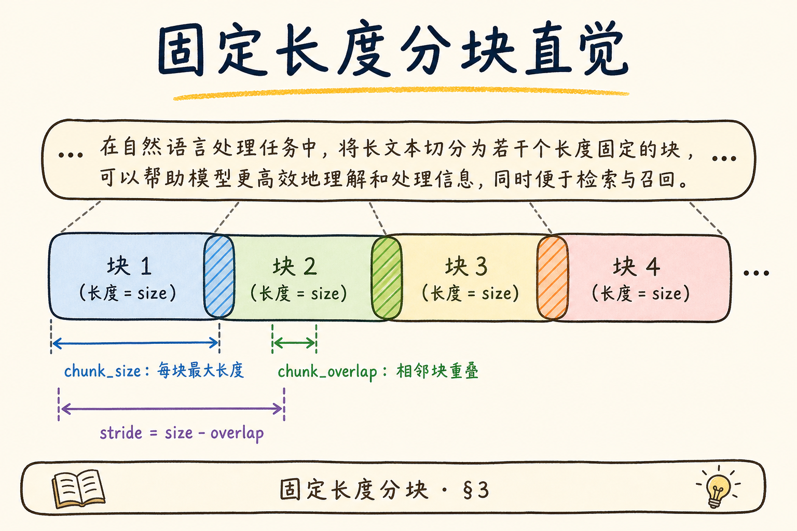
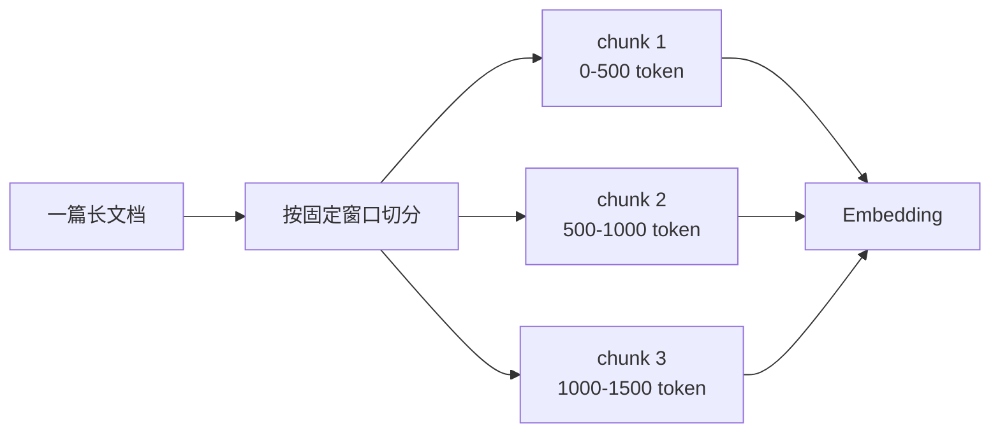
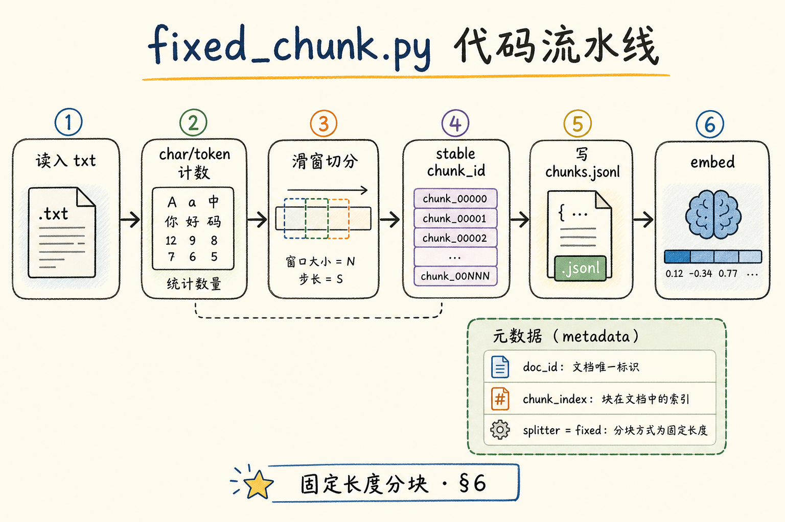
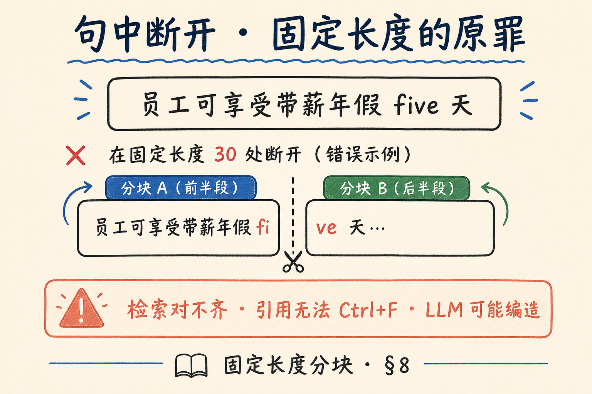
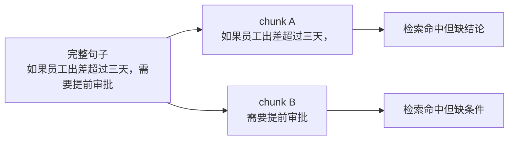
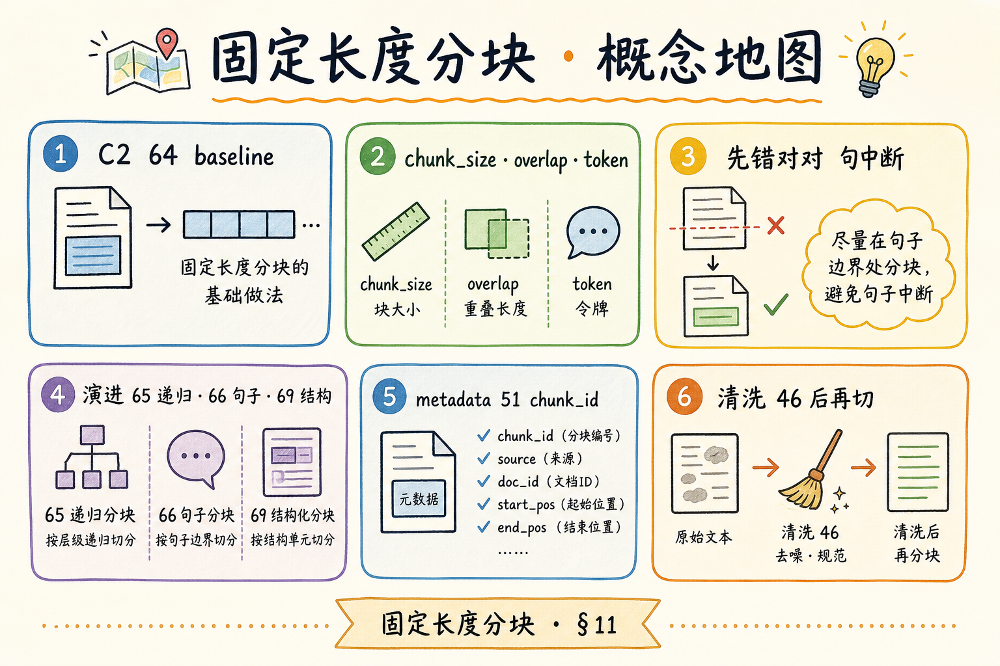
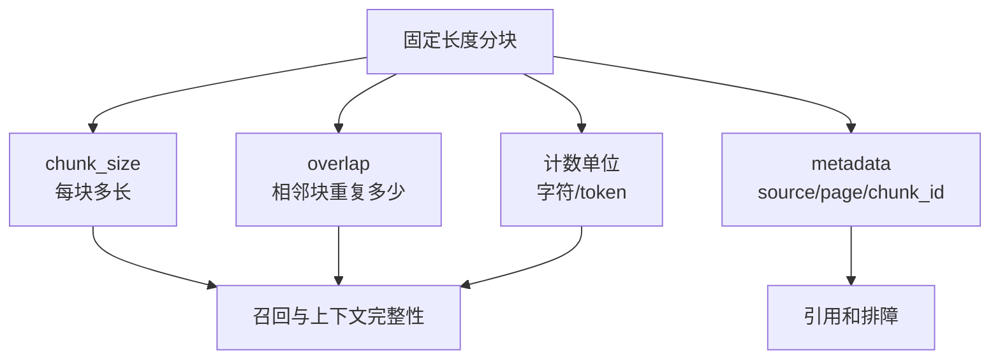

# 企业 RAG 分块（一）：固定长度分块完全指南

> 解析把 PDF 变成 **一大段字** 之后，不能整本手册塞进一次 Embedding——[28 上下文窗口篇](28.context-window-tutorial.md) 与 [27 Token 计费篇](27.token-counting-billing-tutorial.md) 都在提醒：**要切**。最简单、也最该 **先亲手做错一次** 的策略是 **固定长度分块**：按字符数或 token 数 **机械切刀**。这篇是 [企业 RAG 路线图](ENTERPRISE_RAG_ROADMAP.md) **C2 轨开篇**（路线图第 **64** 条），定位 **主线篇（要厚）**：边界与动手路径、字符 vs token 计数、**可运行 Python**、先错对对（句中断开）、与路线图 **65～69** 及元数据 **51 chunk_id** 的关系。前置：[46 文本清洗](46.text-cleaning-tutorial.md)、[51 chunk_id](51.metadata-chunk-id-tutorial.md)；Token 见 [27](27.token-counting-billing-tutorial.md)。

---

## 目录

1. [前言：为什么不能整篇入库](#1-前言为什么不能整篇入库)
2. [本文边界与动手路径](#2-本文边界与动手路径)
3. [固定长度分块是什么](#3-固定长度分块是什么)
4. [字符数 vs Token 数：刀口按什么量](#4-字符数-vs-token-数刀口按什么量)
5. [overlap：为什么要重叠一刀](#5-overlap为什么要重叠一刀)
6. [可运行 Python：从零实现切分器](#6-可运行-python从零实现切分器)
7. [接入 metadata 与 chunk_id](#7-接入-metadata-与-chunk_id)
8. [先错对对：从中间切断句子](#8-先错对对从中间切断句子)
9. [与路线图 65～69 的关系](#9-与路线图-65～69-的关系)
10. [评测与选型：何时弃固定长度](#10-评测与何时弃固定长度)
11. [综合概念地图](#11-综合概念地图)
12. [常见陷阱与 FAQ](#12-常见陷阱与-faq)
13. [总结与系列下一步](#13-总结与系列下一步)

---

## 1. 前言：为什么不能整篇入库

200 页员工手册 `get_text()` 拼出来 **40 万字符**。若整篇做一个向量：

- **Embedding 模型** 有 **最大输入长度**（如 512/8192 token），超长会被 **截断** 或报错；  
- **检索** 命中整本手册时，塞进 LLM 的 context **爆窗口**；  
- **引用** 无法指向具体段落——[34 Grounding](34.grounding-citation-tutorial.md) 只能写「见 handbook.pdf」，用户无法核对。

因此 ingest 必须有 **Chunking**（分块）：把长文本切成 **大小适中、可独立检索** 的片段。

**Fixed-size chunking**（固定长度分块）：按预设 **字符数或 token 数**（加可选 overlap）滑动窗口切分， **不感知** 段落/标题边界。  
通俗说：**每隔 N 个字切一刀**，最简单粗暴。

**Chunk**（块 / 片段）：入库的最小检索单元，通常含 `text` + `metadata`。  
通俗说：**知识库里的「一条笔记」**。

**Overlap**（重叠）：相邻 chunk 之间 **故意重复** 的一段字符/token，减少边界信息被切断。  
通俗说：**切刀留一点回头重叠**，避免答案刚好卡在缝上。

**读完本文，你应该能做到：**

1. 解释为何 RAG 必须分块。  
2. 选择 **字符** 或 **token** 作为刀口并说明 trade-off。  
3. 跑通 §6 Python 切分器，输出 JSONL。  
4. 配置 `chunk_size` / `chunk_overlap` 并观察检索差异（概念上）。  
5. 完成 §8 先错对对，说出 **句中断开** 的后果。  
6. 对照 §9，说明固定长度与 **递归/结构分块** 的分工。

---

## 2. 本文边界与动手路径

**档位：主线篇（C2 开篇，要厚）。**

**本文讲：** 固定长度直觉、字符/token、overlap、完整 Python、metadata、先错对对、与 65～69 关系。  
**本文不讲：** 语义分块、LLM 自动切章、多向量 hierarchical index 实现（路线图 **74**）、具体向量库 API。

### 2.1 动手路径表

| 步骤 | 你做什么 | 验收 |
|------|----------|------|
| A | 读 §3～§5 | 能解释 size/overlap |
| B | `pip install tiktoken`（可选） | import 成功 |
| C | 跑 §6 `fixed_chunk.py` | 生成 `chunks.jsonl` |
| D | 改 `chunk_size=50` 看 chunk 数变化 | 数量反比 |
| E | 完成 §8 先错对对 | 找到被截断的词 |
| F | 读 §9 关系表 | 能口述下一步读 58 |

**环境：** Python 3.10+；`pip install tiktoken`（token 模式）；样例 `sample.txt`（≥2000 字中文或英混合均可）。

### 2.2 与路线图关系

| 条目 | 关系 |
|------|------|
| [51 chunk_id](51.metadata-chunk-id-tutorial.md) | 每个 chunk 稳定 ID |
| [52 source/page](52.metadata-source-page-tutorial.md) | 继承 doc 溯源 |
| 路线图 **65** 递归字符 | [58 篇](58.recursive-character-chunking-tutorial.md) — **更优默认** |
| 路线图 **66** 句子边界 | 在 **句点** 切，修固定长度硬伤 |
| 路线图 **69** 结构感知 | MD/HTML 按标题切 |
| [28 上下文窗口](28.context-window-tutorial.md) | size 受窗口约束 |

---

## 3. 固定长度分块是什么

读下图：长文像一根香肠，固定长度就是 **按固定宽度切片**；overlap 是 **相邻片重叠**。




下面这张图说明固定长度分块的基本直觉。读图时重点看：它不理解语义，只是按照字符数或 token 数把长文本切成一段一段。



结论：固定长度分块胜在简单、稳定、容易实现；代价是可能切断句子、表格或完整步骤。

对照上图，参数只有两个核心（加单位）：

| 参数 | 含义 | 典型起点（需评测） |
|------|------|-------------------|
| `chunk_size` | 每块最大长度 | 512 token 或 800～1200 中文字符 |
| `chunk_overlap` | 块间重叠 | size 的 10%～20% |

**Stride**（步长）：实际每次窗口前进量，等于 `chunk_size - chunk_overlap`。  
通俗说：**切下一刀往前挪多少**——overlap 越大，stride 越小，chunk 数越多。

### 3.1 优点与代价

| 优点 | 代价 |
|------|------|
| 实现 **极简** | **句中断开**、词中断开 |
| 行为 **可预测** | 无视标题/列表结构 |
| 易算 token 成本 | 同一概念散在两块，需 overlap 或更好策略 |
| 适合 **原型 baseline** | 表格/代码块可能被拦腰截断 |

固定长度是 **第一个该写的 splitter**——不是 **最后一个该用的**。

### 3.2 RAG 里的位置

```text
解析 → 清洗 → 【分块】→ embed → 向量库
                  ↑ 本篇
```

清洗见 [46 篇](46.text-cleaning-tutorial.md)；**未清洗就切** 会把 `\r\n` 垃圾切进 chunk 边界。

### 3.3 心算：chunk 数量与存储

近似 chunk 数（无 overlap）：

```text
N ≈ ceil(总字符 / chunk_size)
```

有 overlap 时：

```text
N ≈ ceil(总字符 / (chunk_size - overlap))
```

例：**10 万字** 手册，`size=512`，`overlap=64`，stride=448 → 约 **224 块**。每块 embed 一次——[27 Token 计费](27.token-counting-billing-tutorial.md) 里 ingest embed 费 **与 N 成正比**。overlap 从 0 提到 64，块数 **涨约 15%**，是用 **存储与算力** 换 **边界 recall** 的显式 trade-off。

### 3.4 固定长度在 ingest DAG 中的节点

```text
[raw text] → clean → fixed_split → validate → embed → upsert
                         ↑
                    chunk_size/overlap 来自配置中心
```

**Validate**（校验）建议：空 chunk 丢弃、`len(text)<20` 的噪音块丢弃、单 chunk 超过 embed max **告警**——固定长度实现简单，**下游校验** 不能省。

---

## 4. 字符数 vs Token 数：刀口按什么量

**Character-based**（按字符）：以 Unicode 字符个数计长度。中文常 **1 字 ≈ 1～2 token**（视 tokenizer 而定）。  
通俗说：**数汉字个数**——快，不用调 API。

**Token-based**（按 token）：用与 **Embedding 模型相同或相近** 的分词器计数。  
通俗说：**数模型眼里的「词片」**——与计费、窗口 **对齐**。

读 [27 Token 计费篇](27.token-counting-billing-tutorial.md)：同一句话，**gpt-4** 与 **开源 BPE** 计数可能不同——生产应用 **embed 用什么 tokenizer，切什么 tokenizer**。

### 4.1 对照表

| 维度 | 字符 | Token |
|------|------|-------|
| 实现 | `len(text)` | `tiktoken` / `transformers` |
| 与 embed 对齐 | 弱 | **强** |
| 中文 | 直观 | 需指定编码 |
| 速度 | 最快 | 略慢 |
| 推荐场景 | 本地草稿、中文 prose | **生产默认** |

### 4.2 tiktoken 最小用法

```python
import tiktoken
enc = tiktoken.get_encoding("cl100k_base")  # 与 OpenAI 多款模型近
tokens = enc.encode("员工手册第三章……")
len(tokens)  # token 数
```

若 embed 用 `BAAI/bge-m3` 等，应换对应 **HuggingFace tokenizer** 计数——**一致性** 比绝对数更重要。

### 4.3 size 怎么定

| 线索 | 建议 |
|------|------|
| embed max = 512 | `chunk_size` ≤ 480 留余量 |
| LLM context 8k，top-k=5 | 5×chunk 别占满 prompt |
| 短 FAQ | size 可小（256） |
| 长制度条文 | 768～1024 token 试 |

**没有 universal 最优**——用 **评测集 recall@k** 扫参数（路线图 C4 检索评测）。

---

## 5. overlap：为什么要重叠一刀

用户问：「年假 **累计** 上限是多少？」  
真值句跨越 chunk 边界：

```text
Chunk A: ……年假可累计至下一
Chunk B: 年度，最高不超过15天……
```

无 overlap 时，单块 **语义不完整**；检索可能只命中 A，LLM 看不到「15天」。

加 **overlap ≥ 半句长度**（或 128 token）可缓解——但 **不能根治** 结构盲切；[58 递归分块](58.recursive-character-chunking-tutorial.md) 与句子边界（路线图 **66**）才针对边界。

### 5.1 overlap 的代价

| 项 | 影响 |
|----|------|
| chunk 数量 | 增加约 `size/(size-overlap)` |
| 存储与 embed 费 | 重复文本多次计费 |
| 检索 | 近重复 hit，需 dedup 或 rerank |

**Dedup at retrieve**（检索去重）：对 overlap 导致的 **高度相似** hit 只保留分最高一条。  
通俗说：**搜出来好几条几乎一样，只留一条**。

---

## 6. 可运行 Python：从零实现切分器

读下图：代码流水线从 **读入 → 计数 → 滑窗 → 写 JSONL**。




下面这张图把固定长度分块的代码流水线串起来。读图时重点看：清洗、计数、切分、补 metadata 是连续步骤，不应该只写一个 `text[i:i+n]`。


结论：固定长度切分器虽然简单，但仍要保留 `source`、`page`、`chunk_id` 等字段，否则后续引用和排障会很困难。

对照上图，完整脚本（字符模式 + 可选 token 模式）：

```python
"""fixed_chunk.py — Python 3.10+
用法: python fixed_chunk.py sample.txt --size 400 --overlap 80 --mode char
"""
from __future__ import annotations
import argparse
import hashlib
import json
from pathlib import Path

try:
    import tiktoken
except ImportError:
    tiktoken = None


def count_len(text: str, mode: str, enc) -> int:
    if mode == "token":
        if enc is None:
            raise RuntimeError("pip install tiktoken for token mode")
        return len(enc.encode(text))
    return len(text)


def fixed_split(text: str, size: int, overlap: int, mode: str = "char", enc=None) -> list[str]:
    if overlap >= size:
        raise ValueError("overlap must be < size")
    text = text.strip()
    if not text:
        return []
    chunks: list[str] = []
    start = 0
    n = len(text)

    while start < n:
        if mode == "char":
            end = min(start + size, n)
            piece = text[start:end]
            start = end - overlap if end < n else n
        else:
            # token mode: grow end until token budget
            end = start
            while end < n:
                candidate = text[start:end + 1]
                if count_len(candidate, "token", enc) > size:
                    break
                end += 1
            if end == start:
                end = min(start + 1, n)
            piece = text[start:end]
            # advance by token window with overlap (approx via char binary search)
            if end >= n:
                start = n
            else:
                back = max(1, overlap)
                start = max(start + 1, end - back)
        piece = piece.strip()
        if piece:
            chunks.append(piece)
        if mode == "char" and start >= n:
            break
    return chunks


def stable_chunk_id(doc_id: str, index: int, text: str) -> str:
    h = hashlib.sha256(text.encode("utf-8")).hexdigest()[:12]
    return f"{doc_id}#{index:04d}-{h}"


def main():
    ap = argparse.ArgumentParser()
    ap.add_argument("input", type=Path)
    ap.add_argument("--size", type=int, default=400)
    ap.add_argument("--overlap", type=int, default=80)
    ap.add_argument("--mode", choices=["char", "token"], default="char")
    ap.add_argument("--doc-id", default="sample-doc")
    ap.add_argument("-o", type=Path, default=Path("chunks.jsonl"))
    args = ap.parse_args()

    text = args.input.read_text(encoding="utf-8")
    enc = tiktoken.get_encoding("cl100k_base") if args.mode == "token" and tiktoken else None
    parts = fixed_split(text, args.size, args.overlap, args.mode, enc)

    with args.o.open("w", encoding="utf-8") as f:
        for i, t in enumerate(parts):
            row = {
                "text": t,
                "metadata": {
                    "doc_id": args.doc_id,
                    "chunk_id": stable_chunk_id(args.doc_id, i, t),
                    "chunk_index": i,
                    "splitter": "fixed",
                    "chunk_size": args.size,
                    "chunk_overlap": args.overlap,
                    "length_mode": args.mode,
                },
            }
            f.write(json.dumps(row, ensure_ascii=False) + "\n")
    print(f"wrote {len(parts)} chunks -> {args.o}")


if __name__ == "__main__":
    main()
```

**运行示例：**

```bash
pip install tiktoken
python fixed_chunk.py employee_handbook.txt --size 512 --overlap 64 --mode char -o out.jsonl
```

token 模式生产环境建议换 **与 embed 模型一致的 tokenizer** 并重写 advance 逻辑——上例 token 分支为 **教学简化**。

### 6.1 代码导读：fixed_split 在做什么

**字符模式** 核心是三行逻辑：`end = min(start + size, n)` 取窗；`piece = text[start:end]`；下一窗 `start = end - overlap`（未到 EOF 时）。这就是 **滑动窗口**——与 numpy `stride_tricks` 思想相同，只是 **字符串** 实现。

**为何 strip 每 piece**：避免 chunk 首尾 **无限空格** 浪费 embed token；但 **慎用全局 strip 原文**——会破坏 **刻意缩进**（代码、列表）。

**stable_chunk_id**：`doc_id + index + hash(text)`——index 保证 **同 hash 不同位置** 不碰撞；hash 保证 **re-index 同内容** 可对照（在 split 参数不变时）。

### 6.2 从 JSONL 到向量库的一页纸

| 步骤 | 输入 | 输出 |
|------|------|------|
| split | 长文 | N 条 text |
| validate | N 条 | 去掉空/过短 |
| embed | batch text | N 向量 |
| upsert | id+vector+payload | 索引就绪 |

固定长度的 **N 可预测** → embed **batch size** 可固定 → GPU/API **吞吐优化**。recursive 的 N **略少** 但 **变长分布**——batch 仍可做 **padding 到 batch 内最长**。

### 6.3 双语混排文档的 size 注意

同一段 **中英混排**，char 512 可能 **token 超限**；token 512 可能对 **纯中文** 略保守（块偏少、主题略杂）。metadata 记 `lang=zh-en` 便于 **分语言调参**——别全库一个 size 用十年。

---

## 7. 接入 metadata 与 chunk_id

[51 chunk_id 篇](51.metadata-chunk-id-tutorial.md) 强调：**稳定、可重建**。固定长度下：

| 字段 | 建议 |
|------|------|
| `chunk_id` | `{doc_id}#{index}-{content_hash_prefix}` |
| `chunk_index` | 0-based 顺序 |
| `splitter` | `"fixed"` |
| `chunk_size` / `overlap` | 便于重跑对比 |
| `doc_id` | 与 [50](50.metadata-doc-id-tutorial.md) 一致 |

**Content-addressed id**（内容寻址 ID）：把文本 hash 混入 id，**同内容** 在 re-index 时 id 不变（在 size/overlap 不变前提下）。  
通俗说：**换索引引擎，chunk 身份还能对上**。

若 **仅改 size** 重切，id 体系 **应整体 bump** `index_generation`——旧 query 评测与新区分开。

### 7.1 与 page 元数据

PDF 按页抽出再 **拼成长文** 切时，**chunk 丢失页码**——坏。最小修复：

- **按页切再 merge 小页**；或  
- 切分时记录 `char_offset → page` 映射（进阶）；或  
- 优先 [58 递归](58.recursive-character-chunking-tutorial.md) + 结构分块（**69**）。

---

## 8. 先错对对：从中间切断句子

读下图：固定长度 **看不见** 句号，刀可能落在词或句中间。




下面这张图展示固定长度分块最典型的问题：句中断开。读图时重点看：一个完整因果关系被拆成两块后，任意一块都可能缺少回答所需的信息。



结论：这就是后续要学习 overlap、句子边界、结构感知分块的原因。固定长度适合起步，不适合成为所有文档的最终策略。

对照上图，故意用 **`chunk_size=30`** 切一段：

```text
原文：员工入职满一年后，可享受带薪年假 five 天，并可申请调休。
Chunk 0：员工入职满一年后，可享受带薪年假 fi
Chunk 1：ve 天，并可申请调休。
```

### 8.1 后果链

| 环节 | 发生了什么 |
|------|--------------|
| 检索 | 用户搜「five 天」或「五天」，**embedding 与半词不对齐** |
| LLM | 只看到「fi」，可能 **编造** 天数 |
| 引用 | chunk 文本 **无法通过 ctrl+F 核对** |

### 8.2 对法预览（不本篇实现）

| 层级 | 策略 | 路线图 |
|------|------|--------|
| 1 | 加大 overlap | 本篇 §5 |
| 2 | 在 `\n\n` / 句号后切 | **65** [58 递归](58.recursive-character-chunking-tutorial.md) |
| 3 | 句子 tokenizer 再切 | **66** |
| 4 | 按 MD 标题切 | **69** |

**先错后对** 的学习法：**亲手用 size=30 跑 §6**，看 JSONL 里 **断词**；再把 size 调到 512，仍找 **一处** 句中断——建立 **固定长度必留痕** 的肌肉记忆。

### 8.3 代码块与表格

固定长度切 **Markdown 代码 fence** 会在 ``` 中间断开——渲染乱、检索更乱。结构内容 **69/70** 优先；临时方案：**预检测 fence 区间不切**（手写状态机，进阶）。

### 8.4 完整 walkthrough：同一段制度两种 size

**样例正文**（约 180 字，已清洗）：

```text
第三章 年假制度

员工入职满一年后，可享受带薪年假 five 个工作日。年假不可折现，不可转让。

申请流程：须在 OA 系统提前五个工作日提交，经直属主管审批后生效。未休年假可在次年三月前申请调休，逾期作废。
```

| 参数 | chunk 数 | 现象 |
|------|----------|------|
| size=40, overlap=0 | 5+ | 「five 工作」「五个工作」被拦腰截 |
| size=512, overlap=64 | 1 | 整段完整，检索「OA 提前五个工作日」命中 |
| size=80, overlap=20 | 3 | 可能在「次」与「年」间切，overlap 救部分跨句问 |

动手：**把上文存 `leave.txt`，跑 §6**，用肉眼检查 JSONL 边界——比只读理论 **记得牢**。

### 8.5 overlap 实验记录表（模板）

| overlap | chunk 数 | recall@5（你的评测集） | embed 成本相对 |
|---------|----------|------------------------|----------------|
| 0 | | | 1.0× |
| 64 | | | |
| 128 | | | |

填完此表再定生产参数——**别抄网上「512/64」** 当圣经。

---

## 9. 与路线图 65～69 的关系

| 路线图 | 策略 | 解决固定长度的什么痛 |
|--------|------|----------------------|
| **64** 本篇 | 固定 size | baseline；可预测 |
| **65** [58 递归字符](58.recursive-character-chunking-tutorial.md) | `\n\n`→`\n`→`。`→字 | **减少句中断** |
| **66** [59 句子边界](59.sentence-boundary-chunking-tutorial.md) | NLP 句子 | 英文/中文断句更准 |
| **67** [60 Overlap](60.chunk-overlap-tutorial.md) | 重叠窗口 | 缓解边界信息丢失 |
| **68** [61 Chunk size](61.chunk-size-tradeoff-tutorial.md) | size/overlap 调参 | 实验驱动定参 |
| **69** [62 结构感知](62.structure-aware-chunking-tutorial.md) | `# 标题` | MD/Wiki **章节完整** |

读法建议：**64 实现一遍 → 58 替换为默认 → 有 MD 库上 62 结构分块**。语义分块与 Agent 切章仍属路线图 C2 进阶，本篇表格已覆盖 **Overlap(67)** 与 **Chunk size(68)** 两篇地基主线。

**Semantic chunking**（语义分块）：按 embedding 距离 **突变** 处切开，使块内主题更纯。  
通俗说：**话题变了再切**——比固定长度聪明，成本更高。

固定长度在 **回归测试** 里仍有用：同样参数 **可复现**，方便 A/B embed 模型。

### 9.1 路线图 66～69 逐条预习（避免读 64 就停）

| 条 | 你将学到 | 与 fixed 的核心差异 |
|----|----------|---------------------|
| 66 句子 | spaCy 等断句 | 刀口在 **语法句** |
| 67 语义 | 相邻句 embed 距离 | 刀口在 **话题变** |
| 68 Agent | LLM 输出切点 JSON | 刀口 **模型定**，最贵 |
| 69 结构 | MD `#` 层级 | 刀口在 **文档结构** |
| 70 MD AST | 代码 fence 保护 | 刀口 **语法树** |

企业 Wiki **80% 场景**：64 baseline → 65 默认 → 有 MD 加 69——67/68 是 **评测触顶后** 的优化，不是 Day-1 必需。

### 9.2 chunk 策略变更与 [51 chunk_id](51.metadata-chunk-id-tutorial.md)

改 `chunk_size` 或从 fixed 换 recursive，**chunk 边界全变**——`chunk_id` 若含 content hash 会 **整体换 id**，等同 **新索引世代**。务必 bump `index_generation`，旧引用链接 **批量失效** 要有产品说明；或 chunk_id **仅 doc+index** 不含 hash（重切同 index 内容变——引用风险），二者择一写进规范。

---

## 10. 评测与选型：何时弃固定长度

| 信号 | 动作 |
|------|------|
| 评测集大量 **半句答案** | 上 65/66 |
| Wiki 有清晰 ## 标题 | 上 69 |
| 纯 prose PDF 无结构 | 65 递归 Often enough |
| 极短 FAQ | fixed 512 可能 **一块就够** |

**Recall@k**（前 k 召回率）：标准答案所在 chunk 是否出现在前 k 条检索结果。  
通俗说：**正确答案在不在搜出来的前几段里**——调 size/overlap 看这条曲线。

### 10.1 无 embed 的「关键词 recall」近似

上线 embed 前，可用 **gold 答案子串 in top-k chunk** 粗测 split 质量——虽不等于向量 recall，但 **断词 bug** 会立刻暴露（gold 子串被切成两半 **不在任一块**）。十问 QA 五分钟跑完，值得 **每次改 size 都跑**。

### 10.2 固定长度作为「金丝雀」监控

生产默认 recursive 后，仍 ** nightly ** 用 fixed+相同 size 对样本 doc 切分，对比 **chunk 数漂移**。若某清洗变更导致 chunk 数 **突变 2×**，说明 **换行/标点** 被改坏——split 监控是 **数据质量金丝雀**。

---

## 11. 综合概念地图

读下图，固定长度在 C2 分块族中的位置。




下面这张概念地图总结固定长度分块的关键参数。读图时重点看：`chunk_size`、`overlap`、计数单位和 metadata 会共同决定检索效果。



结论：固定长度分块是 RAG 入门地基。先掌握它，再理解为什么更复杂的切块策略有必要。

对照上图：**C1 清洗后的长文** → **64 固定（baseline）** → **65～69 演进** → embed → **C3 向量**；metadata 贯穿 [51 chunk_id](51.metadata-chunk-id-tutorial.md)。

---

## 12. 常见陷阱与 FAQ

**Q：chunk_size 越大越好吗？**  
A：越大 **单块主题越杂**，检索 **越不精准**；且 embed 可能截断。

**Q：overlap=0 行吗？**  
A：原型可试；生产 **建议 10%+**，除非更高阶分块。

**Q：中文按 char 512 够吗？**  
A：约 512～700 token，常作 **第一组超参**；以评测为准。

**Q：要先分块再清洗吗？**  
A：**先清洗**（[46](46.text-cleaning-tutorial.md)），再分块。

**Q：和 LangChain 的关系？**  
A：`CharacterTextSplitter` 即固定长度；[58 篇](58.recursive-character-chunking-tutorial.md) 讲 `RecursiveCharacterTextSplitter`。

**Q：PDF 图注要单独块吗？**  
A：见 [56 多模态](56.multimodal-image-text-tutorial.md)；文本图注可 **小 size 固定切** 或手动块。

**Q：chunk 要存全文 duplicate 吗？**  
A：向量库存 embed + 文本；**别** 只存向量不存 text，否则无法引用。

### 12.1 超参扫描：三步走

固定长度 **没有银弹 size**，但可以用 **小成本扫描** 找起点：

1. **准备 30～50 条问答评测**（问题 + 答案所在段落原文）；  
2. 对 `chunk_size ∈ {256, 512, 768, 1024}` × `overlap ∈ {0, 64, 128}` 网格跑 split + embed + 检索；  
3. 画 **recall@5** 曲线，选 **拐点**——再微调。

**Grid search**（网格搜索）：在离散参数组合上 **穷举评测**，适合 split 这种 **低维超参**；别用 LLM 调 chunk_size——贵且不可复现。

### 12.2 字符 vs token：同一文档对照

同一段 **约 800 汉字** 制度：

| 计数方式 | 数值 | 含义 |
|----------|------|------|
| `len(text)` | ~800 | 字符刀 |
| cl100k_base | ~900～1100 | OpenAI 近 tokenizer |
| bge-m3 等 | 依模型 | **embed 应用此** |

若 `chunk_size=512` 字符，对 embed 可能 **已超过 512 token** 被 **截断**——表现为 **chunk 尾部语义在向量里丢失**。生产务必 **token 刀口 ≤ embed max − margin**（margin 建议 10%～15%）。

### 12.3 与 LLM context 预算的算术

设检索 **top_k=5**，每 chunk **512 token**，system+用户问 **800 token**，模型输出预留 **500 token**：

```text
5 × 512 + 800 + 500 ≈ 3860 token
```

在 8k 窗口内 **安全**；若 chunk **2048 token**、k=10，极易 **爆窗** 或挤占回答空间——[28 上下文窗口篇](28.context-window-tutorial.md) 的 **预算表** 应在选型时一起算。

### 12.4 PDF 长文拼接：offset 映射思路

[42 PyMuPDF](42.pymupdf-tutorial.md) 按页抽出后 **拼成一大串** 再 fixed split，chunk 会 **跨页**。进阶做法：拼接时插入 **不可见页界标记** 或维护 `(char_start, char_end) → page` 数组；切 chunk 后查 **chunk 中点** 落在哪个 page 区间，写入 metadata **主展示页**。初学者 MVP 可 **按页先切再 merge 小页**——页内 fixed，避免跨页缝。

### 12.5 JSONL 下游：接 embedding 伪代码

```python
import json
from openai import OpenAI  # 或本地 embed 模型

client = OpenAI()
with open("chunks.jsonl", encoding="utf-8") as f:
    for line in f:
        row = json.loads(line)
        vec = client.embeddings.create(
            model="text-embedding-3-small",
            input=row["text"],
        ).data[0].embedding
        # upsert(row["metadata"]["chunk_id"], vec, row["text"], row["metadata"])
```

**Batch embed**：固定长度 chunk 数 **可预测**，便于 **批处理降 API 往返**——与 [27 Token 计费](27.token-counting-billing-tutorial.md) 一起估算 ingest 账单。

### 12.6 案例：FAQ 短答 vs 长制度

| 文档类型 | 建议 size | 理由 |
|----------|-----------|------|
| FAQ 每条 50 字 | 256～384 | 一题一块，检索准 |
| 技术手册章节 | 512～768 | 单主题段落 |
| 法律条文 | 768～1024 + overlap | 跨句引用多 |
| 聊天记录 dump | 先清洗再 512 | 噪音大，块宜小 |

同一库 **混 doc_type** 时，应对 **每类** 设 `chunk_size` 而非全局一个数——metadata 记 `doc_type` 与 `splitter_params` 便于重跑。

### 12.7 固定长度在 A/B 中的价值

升级 [58 递归](58.recursive-character-chunking-tutorial.md) 前，用 **同一评测集** 记录 fixed baseline 的 recall@k。否则 six 个月后没人说得清 **「递归到底提升了多少」**。固定长度的 **可复现** 是它在 C2 里 **永不过期** 的理由——哪怕生产不用，**回归对照** 仍用。

---

## 13. 总结与系列下一步

1. RAG **必须分块**；固定长度是 **最简单 baseline**。  
2. 生产优先 **token 计数** 与 embed 对齐；overlap 缓解 **边界丢失**。  
3. §6 脚本可跑通 JSONL；**chunk_id** 接 [51](51.metadata-chunk-id-tutorial.md)。  
4. **句中断开** 是固定长度 **原罪**——用 §8 亲手验证，再用 **65/66/69** 演进。  
5. 别在结构文档上 **长期** 用纯 fixed——Wiki/MD 迟早要上结构分块。

**收束一句：** 固定长度分块教会你的不是「这就是最终方案」，而是 **size/overlap/token 三维** 如何影响检索——搞懂这层，后面每一种高级 splitter 都只是 **更聪明的刀口**。

### 13.1 系列下一步

| 目标 | 阅读 |
|------|------|
| 递归字符分块 | [58 递归字符分块](58.recursive-character-chunking-tutorial.md) |
| chunk_id | [51](51.metadata-chunk-id-tutorial.md) |
| 上下文窗口 | [28](28.context-window-tutorial.md) |

### 13.2 学习目标自检

- [ ] 能解释 fixed-size 与 overlap  
- [ ] 能选 char vs token  
- [ ] 能跑 §6 并读 JSONL  
- [ ] 能演示句中断开  
- [ ] 能对照 §9 说 65～69 分工  

### 13.3 附录：从清洗到 embed 的完整最小 pipeline

```python
# 1. 读入已清洗长文
text = Path("handbook_clean.txt").read_text(encoding="utf-8")
# 2. fixed split（baseline）
from fixed_chunk import fixed_split, stable_chunk_id
parts = fixed_split(text, size=512, overlap=64, mode="char")
# 3. 写 JSONL
rows = [{"text": p, "metadata": {"chunk_id": stable_chunk_id("hb", i, p), "splitter": "fixed"}} for i, p in enumerate(parts)]
# 4. embed + upsert（接你的向量库 SDK）
```

换 [58 recursive](58.recursive-character-chunking-tutorial.md) 时 **只改 step 2**——pipeline 模块化比「一个脚本写死」更易 A/B。

### 13.4 附录：常见 doc_type 推荐超参（第一版）

| doc_type | chunk_size (token) | overlap | splitter |
|----------|-------------------|---------|----------|
| faq | 256 | 32 | fixed 或 recursive |
| policy | 512～768 | 64～128 | recursive |
| chat_log | 384 | 64 | fixed + 强清洗 |
| api_doc | 512 | 64 | 69 结构优先 |

metadata 写 `doc_type` + `split_params_version=v1`——半年后调参 **可追溯**。

### 13.5 附录：固定长度仍是最优的场景

- **回归测试 baseline**（永远保留）；  
- **极均匀短段落**（每条 100 字 FAQ）；  
- **token 预算精确控制**（每块严格 512 token 合同）；  
- **教学演示**（本文 §8 size=30 先错对对）。

除此以外，生产 **默认 recursive**（[58](58.recursive-character-chunking-tutorial.md)）——但 **64 的实现能力** 仍是 C2 的 **入场券**。

### 13.6 附录：C2 开篇学习路径（64→65 两周节奏）

**第 1 周**：读 57 全文 → 跑 `fixed_chunk.py` → 完成 §8 size=30 与 size=512 对照 → 写 10 条 QA 关键词 recall。**第 2 周**：读 58 → 跑 `recursive_chunk.py` → 同样 QA 对比 → 团队 Wiki 贴 recall 表 → 配置中心把 default splitter 改为 recursive。两周后你们应有：**可复现 JSONL**、**baseline 数字**、**默认参数 YAML**——这才算 C2 **入门毕业**，而不是「看过 LangChain 文档」。若库以 MD/Wiki 为主，**第 3 周** 预习路线图 **69**，别在 64/65 上无限调参——结构分块 often **一次解决** 半个 Wiki 的 chunk 质量问题。

### 13.7 附录：与 [28 上下文窗口](28.context-window-tutorial.md) 的联合预算表

| 组件 | token 占用（例） | 谁决定 |
|------|------------------|--------|
| system prompt | 200～800 | 产品 |
| 用户问题 | 50～500 | 用户 |
| 检索 chunk × k | k × chunk_size | **本篇** |
| 模型回答 | 300～2000 | 产品 |

若 `k=8`、`chunk_size=1024`，仅检索就 **8k token**——在 8k 窗口 **没有回答空间**。调 chunk 必须 **与 top-k、prompt 一起算**，不能 isolated 调 size。建议 spreadsheet 四行乘法 **给 PM 看**，比争论「512 还是 768」快。

### 13.8 附录：ingest 失败模式与 fixed 的关系

| 失败 | 是否 fixed 独有 | 对策 |
|------|-----------------|------|
| 句中断词 | 是（主） | 58 recursive |
| 整章一块 | size 过大 | 减 size 或 69 |
| chunk 过多 | size 过小/overlap 过大 | 调参 |
| 空 chunk | split 前未清洗 | 46 清洗 |
| embed 截断 | token size > embed max | token 刀口 |

### 13.9 附录：fixed_chunk 与 recursive_chunk 命令对照卡

```bash
# Baseline（64）
python fixed_chunk.py doc.txt --size 512 --overlap 64 -o fixed.jsonl
# Default（65）
python recursive_chunk.py doc.txt --size 512 --overlap 64 -o recursive.jsonl
# 对比
python -c "import json; print(len(open('fixed.jsonl',encoding='utf-8').readlines()), len(open('recursive.jsonl',encoding='utf-8').readlines()))"
```

打印 **行数差** 与 **随机抽 3 块首尾 80 字**——每次改清洗规则后 **跑一遍**，五分钟内可知 split 是否 **异常**。

### 13.10 附录：为何 64 要「厚」——路线图设计意图

C2 若直接从 recursive 开始，初学者 **看不到 fixed 的句中断**——会以为「分块就是这样」。路线图 **64 要厚**，是为 **先错后对** 教学法：亲手用小 size 切出 **fi/ve**，再读 58 **理解 separators 的存在理由**。你正在读的附录、walkthrough、YAML、pipeline 表，都是 **厚** 的体现——**别跳节**。

### 13.11 附录：固定长度与 Embedding 截断的数值例

设 embed 模型 **max=512 token**，chunk **char 600 中文** 可能 **≈650 token**——API **静默截断** 尾部，表现为 **「检索命中但 LLM 说上下文没有后半段」**。token 刀口设为 **480** 留 margin 是 **保守正确**；char 刀 600 是 **常见 hidden bug**。本篇 **§4 字符 vs token** 与 **§13.8 预算表** 请 **交叉阅读**。

### 13.12 附录：与 51/52 metadata 在 split 后的继承

每个 chunk 的 metadata 应 **继承** doc 级 [50 doc_id](50.metadata-doc-id-tutorial.md)、[52 source/page](52.metadata-source-page-tutorial.md)，并 **新增** split 级 [51 chunk_id](51.metadata-chunk-id-tutorial.md) 与 `chunk_index`。fixed split **不会** 自动产生 page——若 page 重要，**split 前** 就要 **按页或带 offset 映射**（§7.1、§13.4 PDF 段）。metadata 断层是 **引用 UI Broken** 的 **第二大原因**（第一大是 **没清洗**）。

### 13.13 附录：C2 64 篇交付 Definition of Done

1. 仓库里有 **可运行** `fixed_chunk.py`；  
2. 至少 **一份** 样例 `chunks.jsonl` 进 `examples/`；  
3. 团队默认 **chunk_size/overlap** 有 written 记录；  
4. §8 **句中断** demo 在 onboarding 讲过一遍。  

DoD 不齐，**不要宣称「分块已上线」**——embed 能跑 ≠ split **正确**。

### 13.14 附录：与 58 recursive 的 handoff 检查项

切 default splitter 前确认：**fixed baseline JSONL 已归档**、**recall 表已更新**、**ingest 配置 `splitter` 字段已从 fixed 改为 recursive_character**、**index_generation 已 bump**。Handoff 漏 **index_generation** 是 **线上引用指向旧 chunk 内容** 的典型事故——[49 增量](49.incremental-update-tutorial.md) 与 C2 变更 **同一 PR 描述** 可解。

### 13.15 附录：固定长度在 LangChain 里的名字

`CharacterTextSplitter` 即本篇 fixed-size；升级 [58](58.recursive-character-chunking-tutorial.md) 时换 `RecursiveCharacterTextSplitter`——**类名即策略**。读 LangChain 文档时 **别两种 Splitter 混 import**；config 里 **splitter 字段写全称**，避免 **运维 grep 找不到**。

### 13.16 附录：64 主线篇与 55 OCR 的 ingest 顺序

推荐 **全局顺序**：解析（含 OCR 支路）→ [46 清洗](46.text-cleaning-tutorial.md) → **本篇 fixed/58 recursive** → embed。OCR 与 born-digital **合并清洗规则** 后再 split——别 OCR 一套、Word 一套，**chunk 边界行为不一致** 会让评测 **无法对比**。

### 13.17 附录：本篇核心公式小结

- stride = chunk_size − chunk_overlap  
- chunks ≈ ceil(total_len / stride)（字符模式近似）  
- token 生产：embed max 定 chunk_size 上限  
- overlap 建议：size 的 10%～20%  
- **先 46 清洗，再 split，再 embed** ——顺序错误等于 **重跑全库**

### 13.18 收束：64 教会你什么

固定长度不是 **最终答案**，而是 **第一个可运行、可测、可对比** 的分块实现——搞懂 size/overlap/token 三维与 §8 句中断，你就 **有资格** 读 58 并 **理直气壮地替换默认 splitter**；跳过 64 直接 65 的团队，往往在 incident 里 **说不清 chunk 参数从哪来**。下一篇：[58 递归字符分块](58.recursive-character-chunking-tutorial.md)。**64→65 是 C2 最小闭环**——本篇字数厚，是为 **动手与评测** 服务，不是 filler。固定长度 **baseline 请永久保留在 CI**，供 recursive 升级前后 **对比 recall 与 chunk 数变化** 即可验收 C2 第一篇主线完成度达标即可。

---

> **初学者可能仍困惑的点**  
> - **chunk_size 不是 LLM context size**——前者给 embed/检索，后者给生成；两者都要留余量。  
> - 固定长度 **值得先写** 因为 debug 简单；**不值得一直用** 因为企业文档有结构。  
> - 下一篇 [58 递归](58.recursive-character-chunking-tutorial.md) 会 **替换默认 splitter**——本篇代码仍保留作 baseline 对比。
