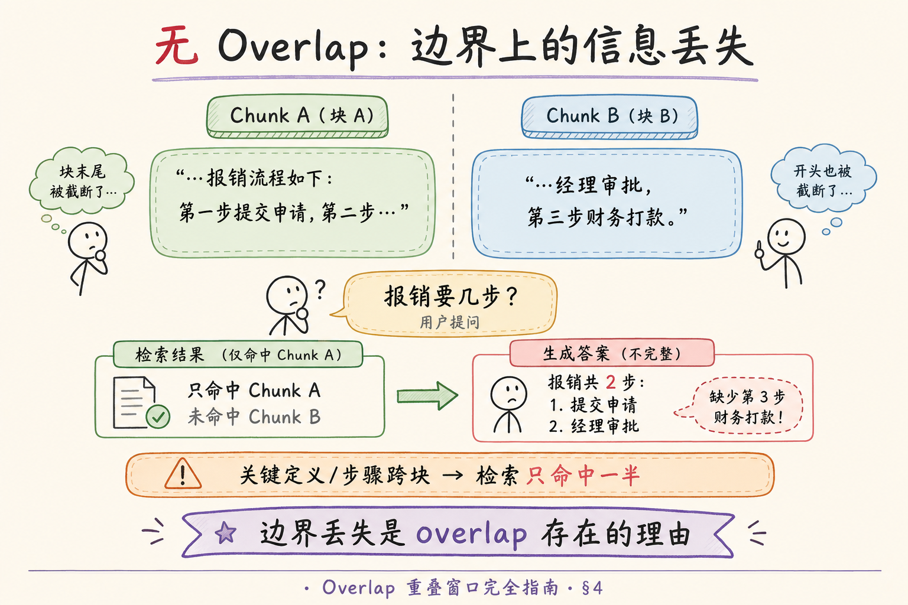
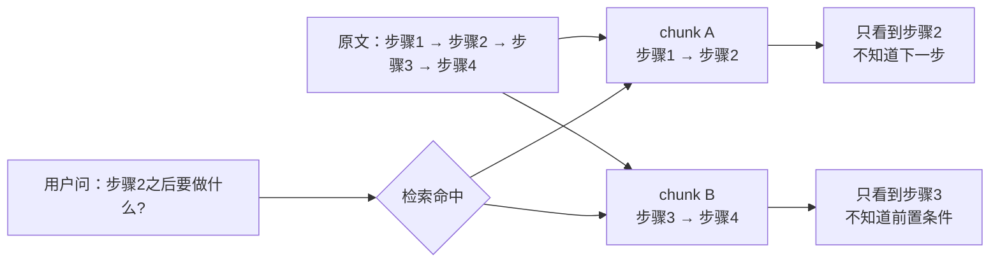
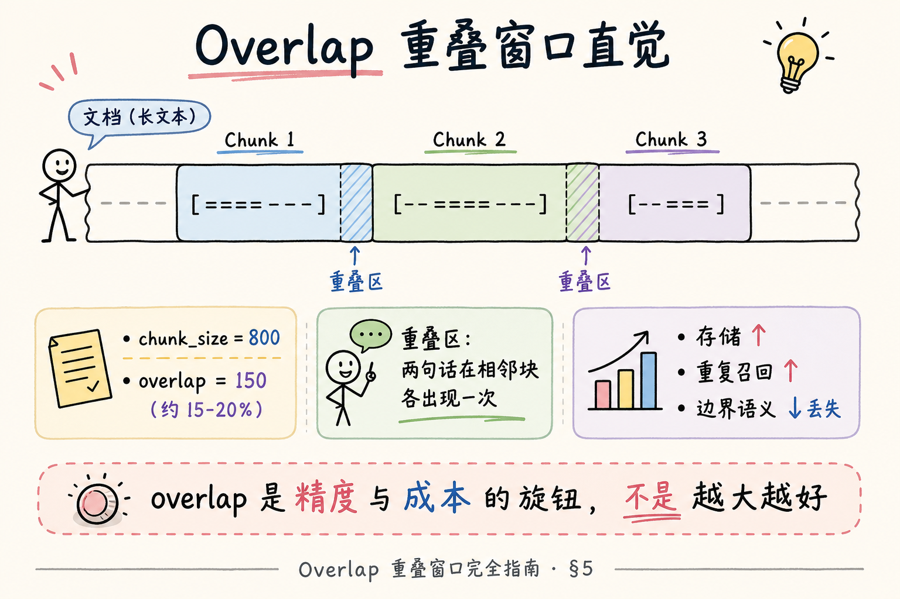
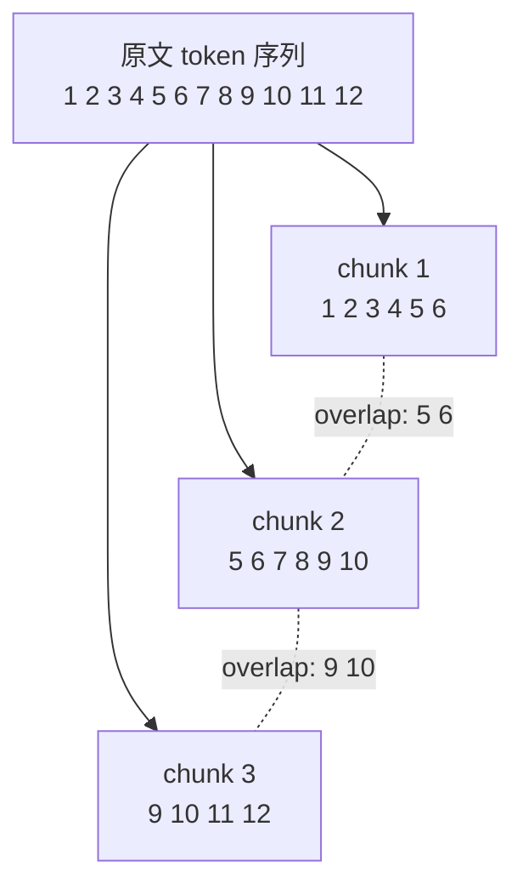
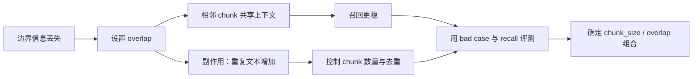

# RAG 数据采集与解析（十五）：Overlap 重叠窗口完全指南

> [59 句子边界分块](59.sentence-boundary-chunking-tutorial.md) 保证 **块内不断句**，但块与块之间仍有一道缝：报销流程写「第一步提交申请，第二步经理审批，第三步财务打款」，若第二步落在 Chunk A 末尾、第三步落在 Chunk B 开头——用户问「一共几步」，检索只命中 A，答案永远少一步。**Overlap**（重叠窗口）让相邻 chunk **共享一段文本**，用 **存储与重复召回** 换 **边界语义不丢**。这篇是 [企业 RAG 路线图](ENTERPRISE_RAG_ROADMAP.md) **C 轨第十五篇**（路线图第 **67** 条），定位 **地基篇**：讲清边界丢失机理、重叠比例直觉、代价账本、与句界/固定长度的组合，并完成 **先错对对**。前置：[59 句界](59.sentence-boundary-chunking-tutorial.md)；后续 [61 Chunk size](61.chunk-size-tradeoff-tutorial.md)。

---

## 目录

1. [前言：块与块之间的缝](#1-前言块与块之间的缝)
2. [本文边界与动手路径](#2-本文边界与动手路径)
3. [Overlap 在分块链路中的位置](#3-overlap-在分块链路中的位置)
4. [无 Overlap 时：边界信息丢失](#4-无-overlap-时边界信息丢失)
5. [重叠窗口直觉：滑窗怎么叠](#5-重叠窗口直觉滑窗怎么叠)
6. [重叠比例：10%～20% 从哪来](#6-重叠比例1020从哪来)
7. [代价账本：存储、Embedding、重复召回](#7-代价账本存储embedding重复召回)
8. [与句界、固定长度的组合顺序](#8-与句界固定长度的组合顺序)
9. [最小实战：带 overlap 的打包脚本](#9-最小实战带-overlap-的打包脚本)
10. [先错对对：两种 overlap 误用](#10-先错对对两种-overlap-误用)
11. [综合概念地图](#11-综合概念地图)
12. [常见陷阱与 FAQ](#12-常见陷阱与-faq)
13. [总结与系列下一步](#13-总结与系列下一步)

---

## 1. 前言：块与块之间的缝

分块的本质矛盾：**检索要小块**（精准命中），**理解要大块**（上下文够）。固定 `chunk_size` 且无 overlap 时，每个 chunk 是 **互斥窗口**——边界上的定义、承上启下的半句话、步骤列表的中间一环，很容易 **刚好被切在缝上**。

**Overlap**（重叠窗口 / Sliding Window Overlap）：相邻 chunk 之间 **共享一段相同文本**，后一块的开头重复前一块的结尾。  
通俗说：**像铺地砖留伸缩缝，但故意让相邻砖重叠一截**，避免缝正好踩在关键词上。

**Boundary Information Loss**（边界信息丢失）：因切分点落在语义关键处，导致 **单块无法独立回答** 用户问题的现象。  
通俗说：**答案被切成两半，检索只捡到一半**。

**读完本文，你应该能做到：**

1. 用具体例子说明 **无 overlap** 时步骤/定义类问题如何漏答。  
2. 解释 `chunk_size` 与 `overlap` 两个参数如何 **独立又联动**。  
3. 估算 overlap 对 **块数、Embedding 费用** 的大致影响。  
4. 描述 overlap 与 [59 句界](59.sentence-boundary-chunking-tutorial.md) 的 **推荐组合顺序**。  
5. 完成 §10 先错对对，指出「overlap 越大越好」与「overlap=0 省成本」的陷阱。

---

## 2. 本文边界与动手路径

**档位：地基篇（C2 分块第二课）。**

**本文讲：** 边界丢失、滑窗直觉、比例建议、代价、组合顺序、最小脚本、误用对照。  
**本文不讲：** 向量库 dedup 算法细节、Cross-encoder 去重、GraphRAG 实体级 overlap、多模态块对齐。

### 2.1 动手路径表

| 步骤 | 你做什么 | 验收 |
|------|----------|------|
| A | 读 §4，找一段 3 步流程文，手画无 overlap 切缝 | 标出丢失步 |
| B | 读 §5～§6，设 size=800 overlap=150 手算块界 | 重叠区含整句 |
| C | 读 §7，估算 1 万字文档块数 ±20% overlap | 写出倍数 |
| D | 跑 §9 脚本 | 相邻块有重复子串 |
| E | 完成 §10 先错对对 | 两种错法 |

### 2.2 与路线图前后条的关系

| 条目 | 关系 |
|------|------|
| 路线图 **66** 句界 | overlap 切在 **句界之后** 更稳 |
| 路线图 **68** chunk size | size 与 overlap **一起调** |
| [40 DOCX](40.docx-office-parsing-tutorial.md) | 按标题切后再 overlap |
| [51 chunk_id](51.metadata-chunk-id-tutorial.md) | 重叠区 **不同块各存一份**，ID 不同 |

---

## 3. Overlap 在分块链路中的位置

```text
文本 → 分句/分节 → 打包 chunk_size → 施加 overlap → Embedding → 向量库
```

**Chunk Size**（块大小）：单个 chunk 目标长度（字符或 token）。  
通俗说：**每块「主窗口」有多宽**。

**Overlap Size**（重叠大小）：相邻 chunk **共享** 的文本长度。  
通俗说：**后一块开头复制前一块结尾多少字**。

有效 **步长**（stride）：

```text
stride = chunk_size - overlap
```

例：`chunk_size=800`，`overlap=160` → 每推进 **640** 字开新块，其中 **160** 字与上一块重复。

| 参数 | 变大时的效果 |
|------|--------------|
| chunk_size ↑ | 块数 ↓，单块上下文 ↑，检索可能变糊 |
| overlap ↑ | 块数 ↑，边界更安全，存储/费用 ↑ |

---

## 4. 无 Overlap 时：边界信息丢失

读下图：同一段报销流程，切缝正好落在步骤 2 与 3 之间。没有 overlap 时，两个相邻 chunk 各自都像「半句话」，检索命中其中一个也不一定能回答完整问题。






上图的结论是：边界处的信息最脆弱。Overlap 的价值不是让文本重复看起来更完整，而是让跨边界的定义、步骤、条件能在同一个 chunk 里被检索到。

对照上图，三类高频丢失：

### 4.1 步骤/清单跨块

用户问：「报销流程几步？」  
Chunk A 含步骤 1～2，Chunk B 含步骤 3～4。检索 top-1 只返回 A → 模型答 **两步**。

**Procedural Content**（流程型内容）：依赖 **顺序编号** 的说明文。  
通俗说：**第一步第二步那种**，中间切断就数不清。

### 4.2 定义与例证分离

「**住宿上限**（定义）……例如一线城市 500 元/晚（例证）。」切在定义与例证之间 → 命中定义块缺数字，命中例证块缺术语。

### 4.3 指代与先行词

「该政策适用于所有正式员工。……**他们**须提前 3 天申请。」**他们** 在上块，约束在下块 → 单块代词 **悬空**。

Overlap 不能修复 **逻辑结构错乱**（如 PDF 乱序），但能缓解 **顺序正确、仅切缝不巧** 的情况——这在企业制度 TXT 里 **非常常见**。

### 4.4 指代与定义的跨块（扩展案例）

**案例：** 某 security 政策写：「**零信任架构**（Zero Trust）要求每次访问都验证。……（中间 600 字）……因此 **该架构** 下 VPN 需 MFA。」

无 overlap 时，「该架构」与定义分属两块 → 命中后半段的用户 **不知道架构指什么**。加 150 字 overlap 且 **句界对齐** 后，后块开头含定义句尾部 + 「该架构」句 → 单块可答。

**Anaphora**（指代 / 回指）：用「它」「该政策」「上述流程」指向前文。  
通俗说：**后面用代词指前面说过的东西**——分块时要在 **缝上留重叠** 或 **结构切在同一节内**。

### 4.5 表格行与 chunk 边界

表格按行读时，**表头 + 首行数据** 常在相邻 chunk——问「华东区 Q3」时只命中数据行、缺列头。Overlap 或 **整表一块**（[61 篇](61.chunk-size-tradeoff-tutorial.md)）二选一；pdfplumber 抽表见 [43 篇](43.pdfplumber-tutorial.md)。

---

## 5. 重叠窗口直觉：滑窗怎么叠

读下图：文档条带被切成带 **重叠区** 的滑动窗口。每个窗口仍有固定长度，但下一块不会从上一块结束处才开始，而是回退一小段。






上图可以直接对应公式：`stride = chunk_size - overlap`。如果 `chunk_size = 6`、`overlap = 2`，下一块就向前滑 4 个 token，因此相邻块会共享 2 个 token。

对照上图：

**Sliding Window**（滑动窗口）：窗口长度 `chunk_size`，每次向前滑动 `stride = chunk_size - overlap`。  
通俗说：**尺子一次量 800 字，下次从第 640 字再量 800 字**——中间 160 字量了两次。

重叠区设计原则：

1. **尽量对齐句界**（59 篇）：不要在重叠区中间再断一句。  
2. **重叠区应含「承上启下」句**：至少 1～2 句完整上下文。  
3. **末块允许偏短**：与句界打包一致，不必强行凑满。

### 5.1 字符 overlap vs token overlap

| 方式 | 说明 |
|------|------|
| 字符 overlap | 实现简单，与 §9 脚本一致 |
| token overlap | 与 Embedding 上限对齐，生产推荐 |

**Token Overlap**（按 token 计重叠）：用与 Embedding 相同的 tokenizer 计算 overlap 长度。  
通俗说：**按模型认识的「词片」数重叠，不是按汉字数**。

---

## 6. 重叠比例：10%～20% 从哪来

没有 universal 最优，但工程上常用 **overlap 占 chunk_size 的 10%～20%** 作为 **第一组实验** 起点：

| chunk_size（字） | overlap 起点（字） | 比例 |
|------------------|-------------------|------|
| 500 | 50～100 | 10%～20% |
| 800 | 80～160 | 10%～20% |
| 1200 | 120～240 | 10%～20% |

**Overlap Ratio**（重叠比例）：`overlap / chunk_size`。  
通俗说：**每块里有百分之多少是「老熟人重复内容」**。

调节直觉：

- FAQ、短事实多 → 可 **偏低**（10%），句界已较稳。  
- 长流程、叙事、法律 **跨句引用** 多 → 可 **偏高**（15%～25%），用 bad case 验证。  
- overlap **> 50%** 通常浪费严重——接近「每句一块」的块数膨胀，除非特殊评测需求。

与 [61 chunk-size-tradeoff](61.chunk-size-tradeoff-tutorial.md) 联动：**改 size 时按比例重算 overlap**，不要固定 overlap=100 字走天下。

---

## 7. 代价账本：存储、Embedding、重复召回

Overlap **不是免费午餐**。上线前要把账算清。

### 7.1 块数与存储

近似（固定 stride，忽略末块）：

```text
块数 ≈ ceil((文档长度 - overlap) / stride)
     = ceil((L - o) / (c - o))
```

例：`L=10000` 字，`c=800`，`o=160` → stride=640 → 块数 ≈ **16**；无 overlap 时约 **13** 块——**约 23% 更多块**。

**Storage Amplification**（存储放大）：因 overlap 导致同一文本在多个 chunk 中 **重复存储**。  
通俗说：**同一句话在向量库里占好几份硬盘和 embedding 向量**。

### 7.2 Embedding 费用

每块一次 API 调用（或一次本地推理）。块数 ↑ → **token 计费 ↑**。重叠区文本 **被 embed 多次**，语义向量高度相似—— **钱花了，信息增量有限**。

### 7.3 重复召回（Duplicate Retrieval）

检索 top-k=5 时，可能 **3 条来自同一文档相邻重叠块**，占用 context 预算却 **信息冗余**。

**Duplicate Retrieval**（重复召回）：同一语义片段通过不同 chunk_id **多次进入** 检索结果。  
通俗说：**前五条里三条在复读同一段话**。

缓解（进阶，本篇点到为止）：

| 手段 | 说明 |
|------|------|
| 检索后 dedup | 按 doc_id + 文本相似度合并 |
| MMR | 最大边际相关性，降冗余 |
| Rerank | 交叉编码器压重复 |
| 调小 overlap | 在 bad case 与费用间折中 |

地基篇结论：**overlap 是精度与成本的旋钮**——要测 bad case 集，不能凭感觉设为 0 或 500。

### 7.4 重复召回的量化直觉

假设：单篇文档切 20 块，overlap=15%，检索 top_k=5 **不做 dedup**。

| 场景 | 重复条数直觉 |
|------|--------------|
| 问句精准命中某一节中间 | 0～1 条重复 |
| 问句落在 overlap 区 | 2～3 条高度相似 |
| 问句宽泛「讲讲差旅制度」 | 可能 5 条都来自同 doc |

**Context Efficiency**（上下文效率）：进入 LLM 的 token 中 **有效信息占比**。  
通俗说：**喂给模型的资料里，有多少是在重复废话**。

若 5 条 chunk 占 6000 token，其中 3000 是 overlap 重复 → 效率 50%——要么 **dedup**，要么 **略降 overlap** 并观察边界 bad case 是否反弹。

### 7.5 成本估算工作表（填空即用）

| 变量 | 你的值 | 说明 |
|------|--------|------|
| 文档总字数 L | | 首批入库规模 |
| chunk_size c | | token 或字 |
| overlap o | | 通常 0.1c～0.2c |
| stride (c−o) | | 自动算 |
| 块数 ≈ L/stride | | 乘 1.1 留余量 |
| embed 单价 | | 元/百万 token |
| 重复 embed 系数 | | 1 + o/c 量级 |

例：L=500 万字，`c=800` 字，`o=160` → stride=640 → 约 **7800 块**；无 overlap 约 **6300 块**——**多 24% embed 调用**。把数字写进评审 slide，overlap 就不再是「感觉上的微调」。

---

## 8. 与句界、固定长度的组合顺序

推荐 **流水线顺序**：

```text
1. 清洗文本（46 篇）
2. 结构感知切节（62 篇，若有 H2）
3. 节内：句界分句（59 篇）
4. 句界打包到 chunk_size
5. 对 chunk 序列施加 overlap（本篇）
   或：打包时直接「回退 overlap 字符再切下一块」
6. 写 metadata → embed
```

**Fixed-size Fallback**（固定长度降级）：单句超长、无句界时，在 overlap 之前仍允许递归字符切。  
通俗说：**先尽量按句号，实在不行再硬切，硬切完再 overlap**。

LangChain 示例（概念）：

```python
# 伪代码：RecursiveCharacterTextSplitter(chunk_size=800, chunk_overlap=160)
# 分隔符列表含 "\n\n", "。", ". " 即接近 59+67 组合
```

---

## 9. 最小实战：带 overlap 的打包脚本

在 [59 篇 §8](59.sentence-boundary-chunking-tutorial.md) 打包结果上，用 **字符回退** 施加 overlap：

```python
from dataclasses import dataclass

@dataclass
class OverlapChunk:
    index: int
    text: str

def add_overlap(chunks: list[str], overlap: int) -> list[OverlapChunk]:
    """chunks: 无 overlap 的连续块文本列表"""
    if not chunks:
        return []
    out: list[OverlapChunk] = []
    for i, text in enumerate(chunks):
        if i == 0:
            merged = text
        else:
            prev = out[i - 1].text
            suffix = prev[-overlap:] if len(prev) >= overlap else prev
            merged = suffix + text  # 生产可在句界处对齐 suffix 起点
        out.append(OverlapChunk(i, merged))
    return out

# 演示
base = [
    "一线城市住宿上限为 500 元/晚。二线城市为 350 元/晚。",
    "报销须先提交 OA 申请。经理审批通过后，财务在 5 个工作日内打款。",
]
result = add_overlap(base, overlap=20)
for c in result:
    print(f"=== chunk {c.index} ===")
    print(c.text)
    print()
```

**生产改进点：**

1. `suffix` 起点 **回退到最近句界**，避免 overlap 从半句开始；  
2. 用 **token** 计 overlap；  
3. metadata 记录 `overlap_chars` 与 `base_chunk_index`。

### 9.1 句界对齐的 overlap 伪代码

```text
# 已有无 overlap 的 chunks[]（每块内句子完整）
for i in range(1, len(chunks)):
    tail = chunks[i-1][-overlap_budget:]
    # 在 tail 内找第一个句界标点位置 pos
    # suffix = tail[pos:]  # 从整句开始重叠
    chunks[i] = suffix + chunks[i]
```

**Sentence-aligned Overlap**（句界对齐重叠）：重叠区从 **完整句子** 开始，而非从字符中间开始。  
通俗说：**重复的部分至少是一整句开头**，不要「…批通过后，财务…」这种半句重复。

### 9.2 与 Parent Document Retriever 的关系

**Parent Document Retriever**：检索 **小块**，生成时展开 **大块（父文档段）**。  
通俗说：**用小卡片找位置，把整章塞给模型**。

若已用父文档策略，overlap 压力 **略降**（小块仅负责定位）——但小块仍应 **句界完整**；overlap 可 **低于 15%** 做实验，用 golden set 验证。

---

## 10. 先错对对：两种 overlap 误用
下面这些切块错误表面只是参数选择，实际会直接影响召回和引用：切太碎会丢上下文，切太粗会稀释重点，overlap 用错还会制造重复证据。


### 10.1 错法 A：overlap = 0 「省存储」

**现象：** 生产索引 10 万 chunk，overlap 关闭。  
**后果：** 流程/定义类 bad case 系统性漏答；业务方认为「RAG 不行」，其实是 **分块缝** 问题。  
**对法：** 先用 10%～20% 跑 golden set；确认边界类 case 改善后再压 overlap。

### 10.2 错法 B：overlap = chunk_size / 2 「越大越安全」

**现象：** 800 字块、400 字 overlap，stride 仅 400。  
**后果：** 块数接近翻倍；top-k 全重复；context 窗口被 **同一政策复读** 占满，真正 diverse 来源进不来。  
**对法：** 单次只调一个旋钮；overlap 不超过 25% 除非 bad case 证明必要。

### 10.3 对照表

| 策略 | 边界安全 | 块数 | top-k 多样性 | 适用 |
|------|----------|------|--------------|------|
| overlap=0 | 低 | 最少 | 高 | 仅短 FAQ、结构切很准 |
| overlap 15% | 中 | +15%～25% | 中 | **默认起点** |
| overlap 50% | 高 | ~2× | 低 | 一般不推荐 |

### 10.4 错法 C：overlap 从半句开始

**现象：** 字符回退 160 字，切在「……经」和「理审批」之间。  
**后果：** 两块都含 **不完整词**，Embedding 与 BM25 都受损。  
**对法：** §9.1 **句界对齐 overlap**。

### 10.5 运维侧：重索引触发条件

| 变更 | 是否必须全 doc 重切块 |
|------|----------------------|
| 仅 overlap 变 | 是 |
| 仅 chunk_size 变 | 是 |
| 文档正文 content_hash 变 | 该 doc 是 |
| 检索 top_k 变 | 否（分块不变） |

---

## 11. 综合概念地图

读下图时，先看「Overlap 概念地图」想表达的主线：问题从边界丢失开始，经过参数选择和去重控制，最后落到评测指标上。




上图的核心取舍是：overlap 提升边界召回，但会增加存储、Embedding 成本和重复证据。上线前要用真实 bad case 评测，而不是凭感觉填一个固定比例。

对照上图：

1. **边界丢失** 是 overlap 存在的理由。  
2. **比例** 与 **chunk_size** 联动调，见 61 篇。  
3. **代价** 三块：存储、embed 费、重复召回——都要在评测里看。  
4. **句界优先**，overlap 其次，结构感知更大粒度优先（62 篇）。

---

## 12. 常见陷阱与 FAQ

**Q：overlap 区要单独 embed 吗？**  
A：要。每个 chunk 是独立向量记录；重复文本 **各 embed 各存**——这是费用来源。

**Q：同一句话两个 chunk_id，引用显示哪个？**  
A：检索命中谁显示谁；UI 可 **按 doc_id 合并展示**。metadata 带 `char_start` 便于高亮。

**Q：Markdown 代码块 overlap 会重复半段代码吗？**  
A：会。结构感知切时 **代码块尽量整段进一块**（62 篇），减少无意义重复 embed。

**Q：和 BM25 稀疏检索有关吗？**  
A：有关。重叠区 **同一词项** 多文档频率统计变复杂——混合检索时 dedup 更重要（路线图稀疏检索条）。

**Q：增量更新时 overlap 块怎么删？**  
A：按 [49 增量](49.incremental-update-tutorial.md) **doc_id 删旧 chunk 全集** 再重插，不要只删「变更字符范围」——overlap 使范围难算。

### 12.1 企业默认参数卡（可贴进 config）

```yaml
chunking:
  strategy: sentence_boundary_then_pack
  chunk_size_tokens: 512
  overlap_ratio: 0.15
  overlap_align: sentence_boundary
  max_oversize_sentence_tokens: 768  # 超长句降级
```

**Parameter Card**（参数卡）：团队对齐的 **默认配置快照**，附 **version** 与 **变更日期**。  
通俗说：**写在 README 里的一页纸默认值**——新人不用猜 512 还是 2048。

### 12.2 与 RAG 生成的衔接

检索结果拼进 prompt 时，overlap 导致 **相邻 chunk 重复段落**——可在 **组装 prompt 前** 做轻量 dedup：

```text
按 doc_id 分组 → 按 chunk_index 排序 → 合并相邻块去重子串
```

不必在向量库层删记录；**生成前 dedup** 保检索 recall，**省 context token**。

### 12.3 综合案例：三步流程 walkthrough

原文：

```text
报销流程如下。第一步，员工在 OA 系统提交出差申请并上传行程单。第二步，直属经理在三个工作日内完成审批。第三步，财务部门对合规单据进行打款，一般为五个工作日到账。
```

**无 overlap，chunk_size 约 80 字：**

- Chunk A 含步骤 1～2 大部  
- Chunk B 含步骤 2 尾部「审批。」+ 步骤 3  

问「一共几步？」检索 top-1 命中 A → 模型易答 **两步**。

**overlap=40 字且句界对齐：**

- Chunk B 开头重复「……第二步……审批。第三步，财务……」  
- 单看 B 也能数 **三步**；A 被命中时 overlap 区也 **带步骤 3 首句**

**Step Counting QA**（步骤计数问答）：RAG 最常见 bad case 类型之一——**overlap 的主战场**。

### 12.4 与 MMR 的分工

**MMR**（Maximal Marginal Relevance，最大边际相关）：检索时 **降相似结果冗余**。  
通俗说：**搜出来的五条尽量别太像**。

| 手段 | 作用阶段 | 成本 |
|------|----------|------|
| overlap | 索引（分块） | 存储↑ |
| MMR | 检索 | 计算略↑ |
| prompt dedup | 生成前 | 低 |

三者可 **叠加**；不是「有了 MMR 就不要 overlap」——MMR 不能恢复 **从未入库的边界语义**。

### 12.5 检索后 dedup 最小逻辑（Python 思路）

```python
def dedup_chunks(hits, min_substr_len=80):
    """按文本包含关系去重，保留 chunk_index 较小者"""
    kept = []
    for h in sorted(hits, key=lambda x: x["metadata"].get("chunk_index", 0)):
        t = h["text"]
        if any(t in k["text"] or k["text"] in t for k in kept if len(t) > min_substr_len):
            continue
        kept.append(h)
    return kept
```

**Post-retrieval Dedup**（检索后去重）：在 **不改索引** 前提下提升 context 效率。  
通俗说：**搜完再筛掉「这段话其实重复了」的条目**。

### 12.6 overlap 与 top_k 联动建议

| top_k | 建议 overlap | 理由 |
|-------|--------------|------|
| 3 | 12%～18% | 重复少，边界仍要护 |
| 5 | 15%～20% | 常见默认 |
| 10+ | 10%～15% + dedup | 否则 context 浪费 |

**top_k** 增大时，**重复块进入 prompt 概率上升**——要么 **略降 overlap**，要么 **强制 dedup**，不要两参数 **独立乱调**。

### 12.7 全链路回顾：从 raw text 到 prompt

```text
raw text
  → 清洗 (46)
  → 结构切 H2? (62，若有)
  → 句界分句 (59)
  → 打包 chunk_size (61)
  → 施加 overlap (本篇)
  → embed (25)
  → 检索 top_k
  → dedup (可选)
  → 拼 prompt (28 预算)
  → 生成 (36 采样)
```

任何一环 **缺少 overlap** 主要影响 **块间缝**；任何一环 **缺少句界** 可能造成 **块内断句**——bad case 归因时要 **先定位缝还是内断**。

### 12.8 面试速记：overlap 三句话

1. **为什么**：chunk 互斥时 **步骤/定义/指代** 常跨缝，单块答不全。  
2. **是什么**：相邻块 **共享 10%～20%** 文本，stride = size − overlap。  
3. **代价**：块数↑、embed↑、top-k 重复——用 **dedup + 实验表** 定比例，不是越大越好。

### 12.9 数值实验：overlap 对块数的影响（手算表）

固定 `L=10000` 字，`chunk_size c=500` 字：

| overlap o | stride | 块数 ≈ ceil((L-o)/(c-o)) | 相对 o=0 |
|-----------|--------|--------------------------|----------|
| 0 | 500 | 20 | 100% |
| 50 (10%) | 450 | 23 | 115% |
| 100 (20%) | 400 | 25 | 125% |
| 250 (50%) | 250 | 40 | 200% |

**Sensitivity Analysis**（敏感性分析）：overlap 从 0 提到 20%，块数常 **+20%～30%**——与 embed 账单 **近似线性**。用此表向 **财务/主管** 解释「为什么要多 15% 存储」比空谈 **边界安全** 更有效。

### 12.10 与固定长度 64 的关系

Overlap **不替代** chunk_size——两者正交：`size` 定 **主窗口宽度**，`overlap` 定 **相邻窗口共享多少**。仅有固定 500 字而无 overlap（64 而无 67）是 **C2 半成品**；67 应在 64/66 之后 **默认开启** 非零 overlap，再用实验 **压到合理比例**。

### 12.11 企业 FAQ 场景的 overlap 特例

若每块已是 **完整 Q&A 对**（62 篇 H3 策略），overlap 可 **降至 5%～10%** 甚至 **0** 做 A/B——因为 **边界已是逻辑问答边界**，不是字符缝。若 FAQ 仍用 **固定 500 字** 切在问/答中间，则 **overlap 不能替代结构修复**——应先 **H3 切** 再谈 overlap。

### 12.12 向量库侧 metadata 建议

| 字段 | 示例 | 用途 |
|------|------|------|
| `chunk_size` | 512 | 实验复现 |
| `overlap` | 77 | 记录相邻 chunk 之间保留多少重复上下文 |
| `stride` | 435 | 调试块数 |
| `chunking_version` | 3 | 增量重索引 |

便于 **167 bad case 切块归因** 时知道 **当时用的 overlap 是多少**——否则三个月前建的索引 **参数失传**。

### 12.13 与 LangChain 默认值的差异说明

LangChain `RecursiveCharacterTextSplitter` 默认 `chunk_overlap=200` 且 `chunk_size=4000`（版本不同略有差异）——**4000 对中文 FAQ 往往过大**，200 overlap 在 size=512 时约 **39%**，**偏高**。迁移到企业 RAG 时 **不要照搬框架默认**：用本篇 **10%～20% 比例律** + [61 篇](61.chunk-size-tradeoff-tutorial.md) 实验表 **重定** 两个数。

### 12.14 扫描件 OCR 文本的 overlap 注意

OCR 输出常有 **错字、缺标点**——句界检测失败时，overlap **仍可能切在乱码中间**。此类文档 **先 OCR 质量门控**（置信度）再分块；overlap **不是 OCR 修复手段**。

### 12.15 完整参数卡（可复制）

```yaml
# chunk-overlap-profile v1 — 路线图 67
overlap:
  enabled: true
  ratio: 0.15              # 相对 chunk_size
  align: sentence_boundary # 59 篇
  min_overlap_tokens: 32
  max_overlap_tokens: 256
dedup:
  post_retrieval: true
  min_substr_tokens: 40
notes: |
  FAQ 库可降至 ratio 0.08；
  流程类文档可升至 0.20；
  改 ratio 必须升 chunking_version 并重索引。
```

### 12.16 总结性对照：何时加 overlap、何时减 overlap

**适合加大 overlap（15%→22%）的信号：** golden set 里 **流程步数错**、**指代不明**、**定义与例证分块** 三类 bad case 占比 >30%，且 **结构切已做到位**。  
**适合减小 overlap（15%→8%）的信号：** top-k **重复率** >40%、context **爆预算**、FAQ **已 H3 一问答一块**。  
每次调整后 **只动 overlap 一列**，跑满 **同一 golden set** 再合并主分支——与 [61 篇](61.chunk-size-tradeoff-tutorial.md) **一次一改** 纪律相同。

### 12.17 与混合检索（路线图 BM25 + 向量）的重复问题

稀疏检索 **按词项** 命中，overlap 使 **同一词项** 出现在多个 chunk——BM25 可能 **同时返回** chunk 3 与 chunk 4。融合打分前 **按 doc_id+chunk_index 邻近 dedup** 或 **只保留最高分一条**，否则 **RRF 融合** 被重复项 **人为抬高** 某一 doc 的权重。向量侧同理——**混合 RAG 默认要 dedup**，与 overlap **配套设计** 而非事后补丁。

### 12.18 本篇核心公式小结

```text
stride = chunk_size - overlap
blocks ≈ (L - overlap) / stride
overlap_ratio = overlap / chunk_size  ∈ [0.10, 0.20] 常见
```

牢记：**overlap 解决块间缝，句界解决块内断，结构解决章际乱**——三道防线 **叠加** 而非 **互替**。上线检查：**overlap>0**、**句界函数有单测**、**golden set 流程类 case ≥5 条**。

**读者练习：** 取一段 300 字含「三步流程」的文本，手算 `chunk_size=120, overlap=30` 时的块界与 stride；再口述 **无 overlap 时** 哪一步可能被缝切断——练熟后 §10 先错对对 即 **肌肉记忆**。

**C2 分块四篇关系速记：** 66 句界保 **块内整句** → 67 overlap 保 **块间语义** → 68 size 在 **精度/成本/窗口** 间找平衡 → 69 结构按 **作者大纲** 切。四篇 **顺序学习、组合上线**；缺 67 时 66 的整句块仍可能在 **缝上丢步骤**——因此 **66+67** 应 **默认捆绑** 进入生产配置。

**路线图 67 勾选标准：** 能解释 stride 公式、能估算 overlap 对块数影响、能配置 **10%～20% 起点** 并完成 **先错对对**——而非「知道 overlap 这个词」。

**本篇最后一句话：** Overlap 是用 **可控的重复** 换 **边界上的完整语义**——在 **66 句界** 之后默认开启，在 **68 size** 实验中与比例 **联动**，在 **69 结构** 切准章节后 **可适当降低**；永远 **用 golden set 数字** 说话，不用 **直觉** 关掉 overlap 省那 15% 账单。

> **初学者最后一问：** 「overlap 和重复入库去重（47 篇）一样吗？」——不一样。**47 文档去重** 是 **不同文件内容相同** 跳过；**overlap** 是 **同一文件相邻块故意重复** 以换检索质量，两者 **都要**，解决 **不同问题**。

**60 篇完成标记：** 你已理解 **边界丢失 → overlap 滑窗 → 代价账本 → 与 66/68/69 组合**；下一步在 [61](61.chunk-size-tradeoff-tutorial.md) 用 **实验表** 把 `chunk_size` 与 `overlap` **一起定下来**。路线图 **67** 可勾选完成。恭喜完成 **Overlap 重叠窗口** 地基篇。

---

## 13. 总结与系列下一步

1. 无 overlap → **边界信息丢失**，流程/定义/指代类问题高发。  
2. Overlap = 滑动窗口 **共享后缀/前缀**；stride = size − overlap。  
3. **10%～20%** 是常见实验起点，不是定理。  
4. 代价：**块数、Embedding、重复召回**——要测要 dedup。  
5. 组合顺序：**结构 → 句界 → size → overlap**。

### 13.1 系列下一步

| 目标 | 阅读 |
|------|------|
| Chunk size 系统调参 | [61 chunk-size-tradeoff](61.chunk-size-tradeoff-tutorial.md) |
| 结构感知分块 | [62 structure-aware](62.structure-aware-chunking-tutorial.md) |
| chunk 身份 | [51 chunk_id](51.metadata-chunk-id-tutorial.md) |

### 13.2 学习目标自检

- [ ] 能口算 stride 与块数近似  
- [ ] 能举边界丢失例子  
- [ ] 能说出 overlap 三项代价  
- [ ] 完成 §10 先错对对  

---

> **初学者可能仍困惑的点**  
> - Overlap 解决 **切缝不巧**，不解决 **章节本身就写乱了**。  
> - 重复召回是 **feature 的副作用**，检索后要去重或调 k。  
> - 与句界 **同时用** 才是企业默认态，不是二选一。  
> - 下一篇 **61** 把 chunk_size 放进 Embedding、context、精度 **四维** 一起调。
