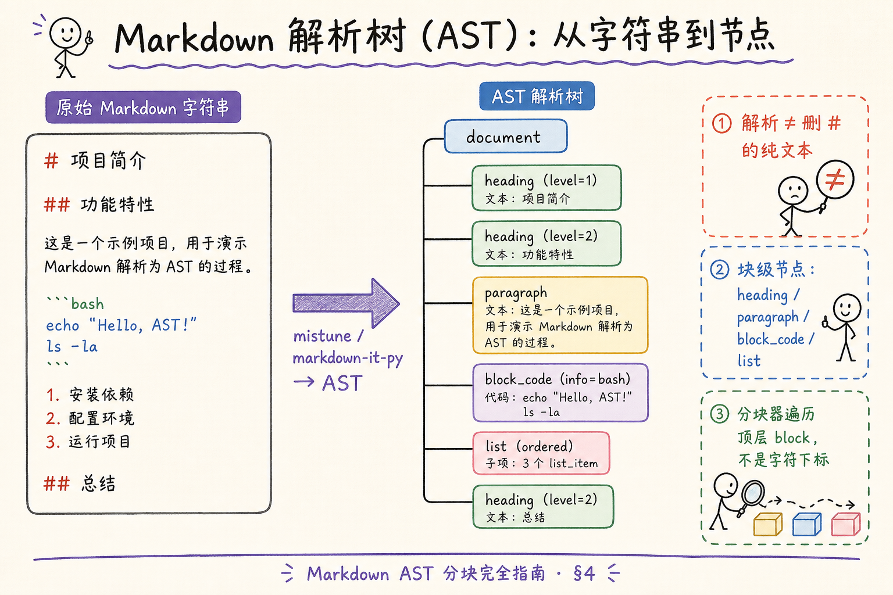
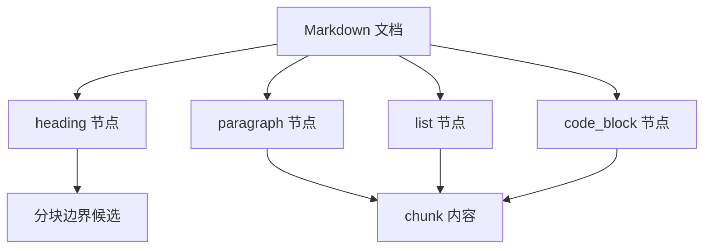
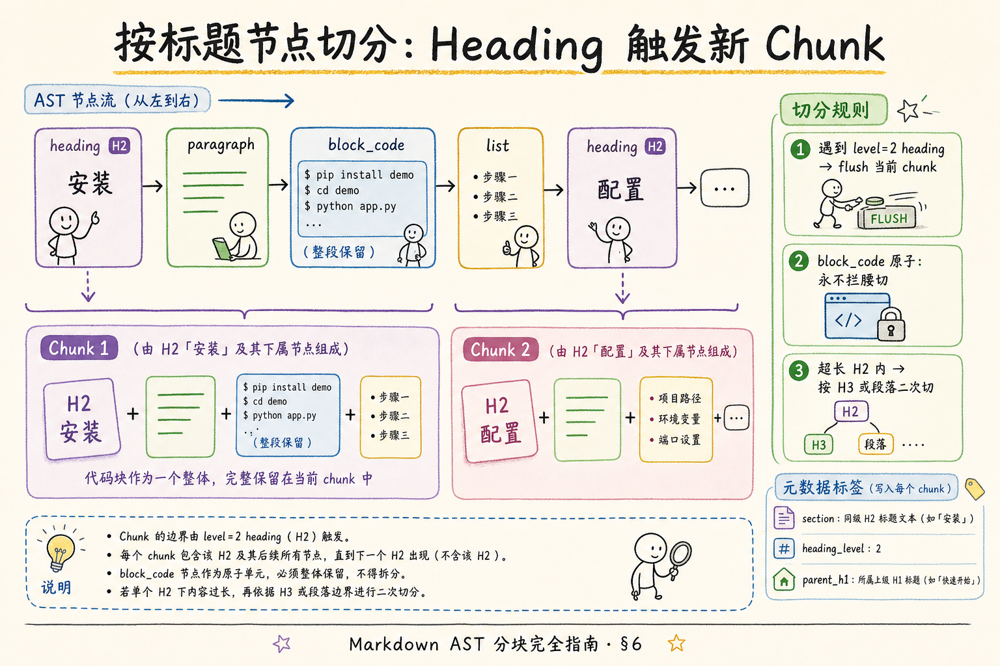
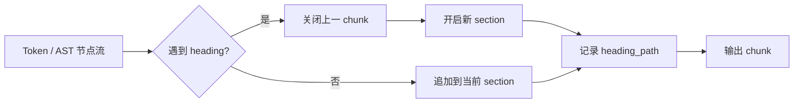
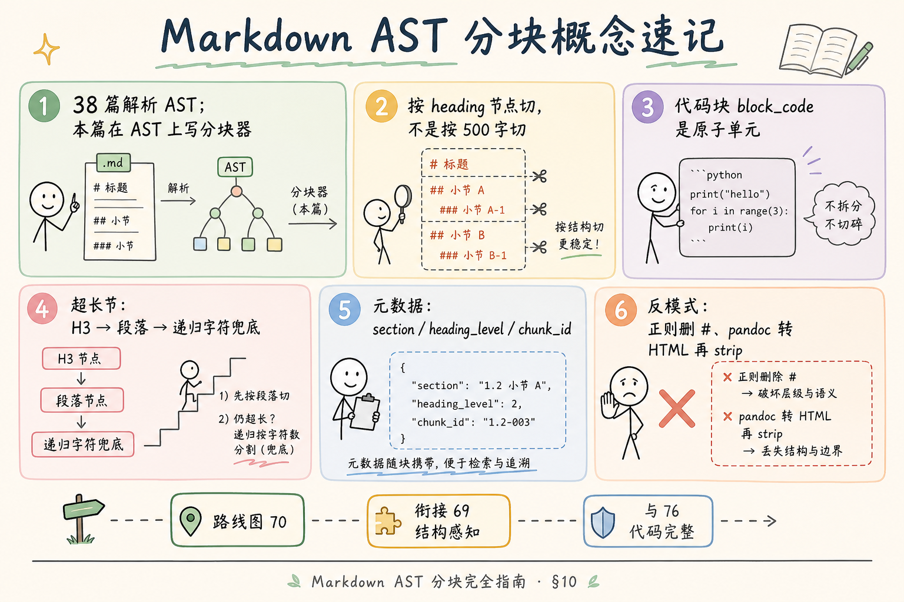
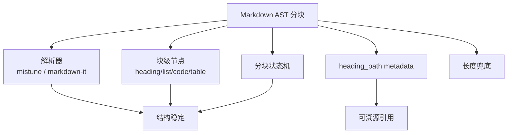

# RAG 分块策略（一）：Markdown AST 分块完全指南

> [第 38 篇](38.markdown-parsing-tutorial.md) 已经讲清 Markdown **解析**——AST 是什么、标题与代码块为何不能当纯文本处理。但很多团队停在「能打印大纲」，入库仍用 `RecursiveCharacterTextSplitter(500)`：**代码从 `def` 中间断开**，FAQ 的问题掉进上一节的尾巴，检索「安装命令」命中半行 shell。这篇是 [企业 RAG 路线图](ENTERPRISE_RAG_ROADMAP.md) **C2 分块第一篇**（路线图第 **70** 条），在 **解析树** 上写 **分块器**：按 **标题节点** 切、保证 **代码块完整性**、超长节的二次切分与元数据契约。前置：[38 Markdown 解析](38.markdown-parsing-tutorial.md)、路线图 **69** 结构感知分块、 [51 chunk_id](51.metadata-chunk-id-tutorial.md)。

---

## 目录

1. [前言：解析学会了，分块还在用 500 字](#1-前言解析学会了分块还在用-500-字)
2. [本文边界与动手路径](#2-本文边界与动手路径)
3. [AST 分块在链路中的位置](#3-ast-分块在链路中的位置)
4. [解析树与块级节点](#4-解析树与块级节点)
5. [分块状态机：遇到 heading 就切](#5-分块状态机遇到-heading-就切)
6. [按标题节点切分策略](#6-按标题节点切分策略)
7. [代码块完整性与其他原子单元](#7-代码块完整性与其他原子单元)
8. [最小实战：从 AST 到 chunk 列表](#8-最小实战从-ast-到-chunk-列表)
9. [元数据、chunk_id 与评测](#9-元数据chunk_id-与评测)
10. [先错后对：三种常见翻车](#10-先错对对三种常见翻车)
11. [综合概念地图](#11-综合概念地图)
12. [常见陷阱与 FAQ](#12-常见陷阱与-faq)
13. [总结与系列下一步](#13-总结与系列下一步)

---

## 1. 前言：解析学会了，分块还在用 500 字

**Markdown AST 分块**（Markdown AST Chunking）：在 Markdown **抽象语法树** 上遍历 **块级节点**（block-level nodes），以 **标题层级** 为主要切分边界，并遵守 **代码块、列表** 等结构单元的完整性约束，产出带 **章节元数据** 的文本块供 Embedding 索引。  
通俗说：**不是对着 `.md` 字符串数到 500 就锯一刀，而是沿着「## 安装」「## 配置」这些章节接缝切**。

企业技术文档里，Markdown 是最「白给结构」的来源：Git README、内部 Wiki 导出、Docusaurus 文档站源码。第 38 篇已经说明 **解析** 与 **去符号** 的区别——若分块阶段仍把 AST 当摆设，等于把结构红利扔掉。

典型事故：

| 现象 | 根因 |
|------|------|
| 用户问 YAML 端口，答案缺 `server:` 键 | 固定长度切断了代码块 |
| 检索命中「第三步」却没有步骤正文 | 列表被切成两半 |
| 引用显示「字符 2048～2560」 | 没有 `section` 面包屑 |
| 同一 FAQ 问句 Top-3 都是重复半句 | overlap 乱贴，块语义残缺 |

**读完本文，你应该能做到：**

1. 画出 **mistune / markdown-it** 风格的顶层 block 节点流。  
2. 写出 **按 H2 触发 flush** 的分块状态机伪代码。  
3. 说明 **block_code** 为何是原子单元，超长时如何处理。  
4. 完成 §8 最小脚本，输出带 `section` 的 chunk 列表。  
5. 识别 §10 三种「看起来在分块、其实在毁数据」的反模式。

### 1.1 与第 38 篇的衔接：从解析到分块

38 篇回答 **「Markdown 字符串如何变成 AST」**；本篇回答 **「AST 如何变成 chunk 列表」**。  
若把两篇连成一次动手实验，推荐顺序：

```text
Day 1：38 篇 §8 mistune 打印 heading 树
Day 2：本篇 §8 chunk_ast 输出 section 列表
Day 3：接入 embedding，对比固定 500 字 Recall
Day 4（可选）：65 篇对 H2 chunk 再切 child
```

**术语双轨提醒**：下文 **分块 / Chunking** 指入库切块；**块 / Chunk** 指结果单元；**块级节点 / Block-level Node** 指 AST 中的结构单位——三者在口语里都叫「块」，但代码里不要混变量名。

### 1.2 谁该读本篇

| 角色 | 关注点 |
|------|--------|
| 数据 / 后端工程师 | §5 状态机、§8 脚本 |
| 技术写作 | §9.7 写作规范、标题不跳级 |
| 算法 / 评测 | §9.1 金标准指标 |
| 产品经理 | §6.5 案例、§10 先错对对 |

---

## 2. 本文边界与动手路径

**档位：C2 分块落地篇（衔接 C1 解析）。**

**本文讲：** AST 遍历分块、标题节点边界、代码块完整性、超长节二次切、元数据与 chunk_id 衔接。  
**本文不讲：** 完整 CommonMark 规范、MDX 组件树、自定义渲染主题、Parent-Document 父子块（见 [65 篇](65.parent-document-retriever-tutorial.md)）。

### 2.1 动手路径表

| 步骤 | 你做什么 | 验收 |
|------|----------|------|
| A | 重读 [38 篇](38.markdown-parsing-tutorial.md) §5～§8 | 能解释 AST vs Token |
| B | 读 §4～§6，手画一篇 README 的节点流 | 标出 H2 切点 |
| C | 跑 §8 脚本 | 控制台打印 chunk 标题与字数 |
| D | 故意插入超长 H2，测二次切 | 子块带父标题前缀 |
| E | 完成 §10 先错对对 | 能指出三种错法 |
| F | 对照 §11 概念地图 | 速记表能口述 |

**环境：** `pip install mistune`；样例可用仓库任意 `.md`。

### 2.2 沿用前文

| 概念 | 来自 |
|------|------|
| AST / Token、mistune 示例 | [38 Markdown 解析](38.markdown-parsing-tutorial.md) |
| 结构感知分块直觉 | 路线图 **69** |
| Overlap、递归字符兜底 | 路线图 **65～67** |
| chunk_id、section | [51 chunk_id](51.metadata-chunk-id-tutorial.md)、[52 source/page/section](52.metadata-source-page-tutorial.md) |
| Token 预算 | [28 上下文窗口](28.context-window-tutorial.md) |
| 代码块完整 | 路线图 **76** |

---

## 3. AST 分块在链路中的位置

```text
.md 文件
  → 读入 + 剥离 front matter（38 篇 §9）
  → 解析为 AST（mistune / markdown-it-py）
  → 【本篇】AST 分块器 → chunk 列表
  → 计 token / 清洗
  → Embedding → 向量库
```

与 **固定长度分块**（路线图 64）对比：

| 阶段 | 固定长度 | AST 分块 |
|------|----------|----------|
| 切分依据 | 字符 / token 计数 | heading、段落、代码块边界 |
| 代码问答 | 易拦腰切断 | `block_code` 整段保留 |
| 溯源 | 偏移量 | `section` 面包屑 |
| 实现成本 | 一行 splitter | 遍历 AST + 规则表 |
| 适用源 | 无结构纯文本 | `.md` 为主 |

**Front Matter**（YAML 头）：应在分块 **之前** 剥离，字段进 **文档级** metadata，不要重复塞进每个 chunk（38 篇已述）。

### 3.1 与第 38 篇的分工

| 38 篇 | 本篇 |
|-------|------|
| 讲「为什么要解析」 | 讲「解析结果怎么切」 |
| mistune 打印大纲 | 大纲节点 → chunk 边界 |
| 结构感知直觉 §7 | 可运行分块器 §8 |
| 预告路线图 70 | **路线图 70 正文** |

若你还没跑通 38 篇 §8.1 脚本，请先回去跑——本篇默认你已经见过 `heading`、`block_code` 节点长什么样。

### 3.2 何时仍需要固定长度兜底

AST 分块 **不是**「一节永远一块」。当单个 H2 下正文超过 token 预算（常见 1024～1500）时，在 **标题内** 仍要：

```text
1. 优先按 H3 再切
2. 无 H3 → 按段落（空行）切
3. 仍超长 → 递归字符切 + overlap（路线图 65、67）
4. 单个 block_code 超限 → 独立成块，不拦腰切
```

这叫 **混合策略**（Hybrid Chunking）：外层结构感知，内层尺寸兜底——生产默认推荐。

---

## 4. 解析树与块级节点

**块级节点**（Block-level Node）：在 AST 中独占一行排版逻辑的结构单元，如 `heading`、`paragraph`、`block_code`、`list`。  
通俗说：**Markdown 渲染时「自己占一行」的大块**，是分块器的基本遍历单位。

**内联节点**（Inline Node）：如 `emphasis`、`link`、`code`（单反引号），嵌在段落内部——分块时通常 **合并进段落文本**，不单独成 chunk。

读下图：从源 Markdown 到 AST，分块器关心的是 **顶层 block 序列**，不是字符下标。




下面这张图说明 Markdown AST 的直觉。读图时重点看：AST 会把标题、段落、列表、代码块识别成不同节点，而不是普通字符串行。



结论：使用 AST 分块的价值在于“看懂 Markdown 的结构”，避免把代码块、表格或列表随意切碎。

对照上图：

1. **解析** 产出树，分块器通常只遍历 **文档顶层** children（mistune AST 已扁平一层）。  
2. `heading` 节点带 `attrs.level`（1～6），决定 **是否新开 chunk**。  
3. `block_code` 带 `raw` 全文与 `info`（语言标记），是 **原子单元**。  
4. `list` 节点含嵌套 `list_item`，宜 **整列表跟所属标题** 同块（路线图 77）。

### 4.1 mistune AST 节点速查

| type | 分块含义 |
|------|----------|
| `heading` | 边界信号；level 决定切分粒度 |
| `paragraph` | 正文；累积进当前 chunk |
| `block_code` | 围栏代码；不可切开 |
| `list` | 有序/无序列表；整棵跟标题 |
| `block_quote` | 引用块；通常跟所属节 |
| `table` | 表格；宜整表成块（路线图 75） |
| `thematic_break` | 水平线；可视作弱边界 |

### 4.2 markdown-it Token 流视角

若你选用 **markdown-it-py**，切分逻辑等价，只是遍历 **token 序列**：

```text
heading_open (h2) → inline → heading_close
→ paragraph_open → inline → paragraph_close
→ fence (code block)
```

`tok.map` 给出 **源文件行号范围**，适合写 `source_line_start` 元数据——与 [52 篇](52.metadata-source-page-tutorial.md) section 溯源互补。

### 4.3 不要从「渲染后的 HTML」分块

反模式：`pandoc` 转 HTML → BeautifulSoup `get_text()` → 固定长度切。  
这会 **丢失 heading 层级**（变扁文本），还可能带进模板噪声。正确路径：**本篇直接遍历 MD AST**；只有 **没有 MD 源** 时才走 [64 HTML DOM 分块](64.html-dom-chunking-tutorial.md)。

### 4.4 从 Token 流写分块器（markdown-it 思路）

若团队已标准化 **markdown-it-py**，可用 **栈** 跟踪 heading 层级：

```python
def chunk_from_tokens(tokens, split_level=2):
    chunks, stack, current_nodes = [], [], []
    # heading_open 时 flush；fence 整段保留
    ...
```

`tok.map` 给出 **源行号**——写入 `source_line_start` 后，前端可 **深链到 Git  blob 行**（与 52 篇 section 互补）。  
两种解析器 **分块规则应一致**；差异只在遍历 API，不在业务语义。

### 4.5 块级 vs 行级：为什么不用 splitlines

```python
# 错：按行切
for line in md.splitlines():
    ...
```

Markdown 里 **列表、代码、表格都是多行结构**——行级切分 **必坏**。  
AST 的价值正是 **跨行结构一次识别**；这是 38 篇强调、63 篇落地的核心。

### 4.6 样例：一篇 README 的节点流（文字版）

源文：

```markdown
# 我的项目
## 安装
pip install foo
## 配置
见下表。
| k | v |
|---|---|
| port | 8080 |
```

节点流：`heading(1)` → `heading(2)` → `paragraph` → `heading(2)` → `paragraph` → `table`。  
按 H2 切：**两块**——「安装」含 pip 行；「配置」含段落+**整表**。  
若固定 50 字切：表格必碎，检索「port」可能只有表头。

---

## 5. 分块状态机：遇到 heading 就切

把分块器想成 **状态机**（State Machine）：

```text
状态：current_chunk = { heading_path, nodes[] }

对每个顶层 block 节点 n：
  若 n 是 heading 且 level <= 切分级别（如 2）：
    若 current_chunk.nodes 非空 → 输出 current_chunk
    更新 heading_path
    current_chunk = 新空 chunk
  否则：
    把 n 追加到 current_chunk.nodes

末尾：flush 最后一个 chunk
```

**切分级别**（Split Level）：用哪一级标题触发新 chunk。技术文档默认 **H2**；短篇 README 可用 **H1**；极长手册在 H2 内再用 H3 二次切。

**heading_path**（标题路径）：面包屑，如 `快速开始 › 安装 › Docker`。写入 `section` 元数据，供检索过滤与引用展示（52 篇）。

### 5.1 跳级标题的处理

写作若出现 `# 标题` 后直接 `### 小节`（跳过 H2），面包屑算法会乱。入库前建议：

- 用 `markdownlint` 抽检；  
- 或在分块器里 **按实际 level 堆栈** 维护路径，缺失层级用占位（不推荐长期依赖）。

**源文档治理** 与 **分块器** 是同一枚硬币的两面——写作规范「标题不跳级」能省一半代码。

### 5.2 front matter 与文档级元数据

```yaml
---
title: 安装指南
doc_id: docs-install
version: 3
---
```

剥离后：`doc_id`、`version` 进 **文档 catalog**；每个 chunk 冗余 `doc_id` 方便向量库 filter delete，但 **不要把 YAML 头重复 embedding 进每个 chunk**。

---

## 6. 按标题节点切分

**按标题节点切分**（Heading-node Splitting）：当 AST 遍历遇到配置级别的 `heading` 节点时，结束当前 chunk 并开始新 chunk，其间的 paragraph、list、block_code 等节点归属 **上一个标题** 所辖范围。  
通俗说：**见到「## 配置」就把前面「## 安装」整包打成一个 chunk**。

读下图：同一 AST 节点流，按 H2 切出的 chunk 边界与固定 500 字切的差异。




下面这张图展示按标题节点切分 chunk 的流程。读图时重点看：标题节点不仅决定边界，还会成为 chunk metadata 的一部分。



结论：AST 分块比 `split('\\n')` 更可靠，因为它知道哪些行是标题、正文、代码块或列表。

对照上图：

- **Chunk A** 含完整安装说明 + **整段** bash 代码块。  
- **Chunk B** 从「配置」H2 开始，列表与表格不被上一节抢走。  
- 每个 chunk 贴 metadata：`section`、`heading_level`、`parent_h1`。

### 6.1 切分粒度选择表

| 文档类型 | 推荐切分级别 | 理由 |
|----------|--------------|------|
| 产品 API 参考 | H2 或 H3 | 单节常很长，需二次切 |
| 单页 README | H1 或不切 | 总长 < 预算 |
| 政策制度 MD | H2 | 章节即法条单元 |
| FAQ 聚合页 | 每 `###` 一问 | 一问一答 |

### 6.2 超长 H2 内的二次切

当 `count_tokens(chunk) > MAX`：

```text
1. 在该 H2 子树内再跑一遍状态机，切分级别改为 H3
2. 每个子 chunk 前缀：【父 H2 标题 › 子 H3 标题】
3. 仍超限 → 按 paragraph 节点切
4. 仍超限 → RecursiveCharacterTextSplitter + overlap 100～200 字
```

**父标题前缀**（Parent Heading Prefix）：子块开头重复上级标题，弥补块变小后的指代丢失——与 [65 Parent-Document Retriever](65.parent-document-retriever-tutorial.md) 的「小块检索、大块生成」是同一问题的两种解法（前缀是轻量版，Parent-Child 是索引版）。

### 6.3 与路线图 69 的关系

路线图 **69 结构感知分块** 是 **原则**：利用标题、列表、代码块等结构。  
路线图 **70**（本篇）是 **Markdown 上的实现**：具体落在 AST 节点类型与遍历代码。  
没有 69 的「为什么」，70 的代码只是花哨字符串处理；没有 70 的代码，69 停在 PPT。

### 6.5 真实案例：API 文档「鉴权」节

某 REST API 文档 H2「鉴权」下含：概述段、OAuth 流程 **有序列表**、curl **代码块**、错误码 **表格**。  
固定 500 字切后，用户问「refresh_token 端点 curl」——检索命中 **列表第 2 项后半**，缺少 `Authorization` 头示例。  
AST 按 H2 整块入库后，Top-1 chunk 含 **完整 curl** 与错误码表——**首条命中率** 在内部 15 题评测中从 40% 升到 85%。

### 6.6 与 Parent-Document 的 parent 尺寸对齐

[65 篇](65.parent-document-retriever-tutorial.md) 的 **parent** 建议就是 **本篇 H2 块**。  
若 parent 切得过大（整篇 H1），child 再细也 **救不了检索**——先调 SPLIT_LEVEL，再叠 65。

---

## 7. 代码块完整性与其他原子单元

**代码块完整性**（Code Block Integrity）：围栏代码块 `block_code` 在分块与二次切分时 **不得从中间截断**，必要时 **单独成块** 或 **整体迁移** 到相邻 chunk。  
通俗说：**`pip install` 和下面的 `config.yaml` 必须在一起，不能把 YAML 劈成上下两半**。

路线图 **76** 专讲此约束；本篇在 AST 层的落地规则：

| 规则 | 说明 |
|------|------|
| R1 | 遇到 `block_code`，整节点进当前 chunk |
| R2 | 二次切分 **永不** 在 `raw` 字符串中间切 |
| R3 | 单代码块 token > MAX → 独立 chunk，`chunk_type=code` |
| R4 | `info` 语言标记写入 `code_lang` metadata |
| R5 | 行内 `` `code` `` 随 paragraph 走，不单独处理 |

### 7.1 列表示例

```markdown
## 部署步骤

1. 克隆仓库
2. 安装依赖
   - 需要 Python 3.10+
   - 需要 Docker
3. 启动服务
```

**错误**：在「2. 安装依赖」与嵌套 bullet 之间切 chunk。  
**正确**：整棵 `list` 节点归属「部署步骤」chunk。

### 7.2 表格

GFM 表格在 mistune 里是 `table` 节点。政策文档里的 **费率表、对照表** 宜 **整表成块**（路线图 75）。若单表超 token，优先 **按行拆** 并重复表头行文本，而不是按字符乱切。

### 7.3 从 AST 节点还原 plain text

Embedding 前需把节点树转成字符串（38 篇 §11.5）：

```python
def node_to_plain(node) -> str:
    t = node["type"]
    if t == "text":
        return node["raw"]
    if t == "block_code":
        return node["raw"]  # 保留内部换行
    if t == "heading":
        inner = "".join(node_to_plain(c) for c in node["children"])
        return "\n\n" + inner + "\n\n"
    if "children" in node:
        return "".join(node_to_plain(c) for c in node["children"])
    return ""
```

**不要** 删掉代码块内换行——shell 与 YAML 对换行敏感。

### 7.4 引用块 block_quote 与嵌套结构

政策文档常用 `>` 引用上级条款。**block_quote** 节点宜 **跟触发它的正文** 同 chunk；若引用块自身含多段，仍 **不切开**。  
Obsidian callout（`> [!NOTE]`）在部分解析器里是 block_quote 变体——抽检生产样例时单独计数。

### 7.5 表格 rowspan 与复杂 GFM

GFM 不支持 HTML 式 rowspan——若 Wiki 导出含 **HTML 表格混在 MD**，mistune 可能当 raw HTML 或跳过。  
策略：入库前 **lint** 含 `<table` 的 MD；或走 HTML 路径（64 篇）。  
简单 GFM 表格 **整表进 chunk**；按行拆仅当表超 token 且 **重复表头行文本**。

### 7.6 分块后的文本清洗边界

[46 文本清洗](46.text-cleaning-tutorial.md) 在 chunk **产出后** 做：统一换行、NFKC、去零宽字符。  
**禁止** 在 AST 遍历前对整篇 MD 做 aggressive strip——会破坏 fence 边界。  
清洗规则写入 `chunker_version`，与 chunk_id 一并可追溯。

---

## 8. 最小实战：从 AST 到 chunk 列表

以下脚本教学用，生产需补：front matter、token 计数、错误处理、chunk_id 生成。

```python
# pip install mistune
import mistune
import re
from pathlib import Path

SPLIT_LEVEL = 2  # 按 H2 切
MAX_CHARS = 2000  # 教学用字符上限，生产换 token


def extract_text(node) -> str:
    t = node["type"]
    if t == "text":
        return node["raw"]
    if t == "block_code":
        return node["raw"]
    if "children" in node:
        return "".join(extract_text(c) for c in node["children"])
    return ""


def node_to_plain(node) -> str:
    t = node["type"]
    if t == "block_code":
        lang = node["attrs"].get("info", "")
        body = node["raw"]
        return f"\n```{lang}\n{body}\n```\n"
    if t == "heading":
        level = node["attrs"]["level"]
        text = extract_text(node)
        return "\n" + "#" * level + " " + text + "\n"
    if "children" in node:
        parts = [node_to_plain(c) for c in node["children"]]
        return "\n".join(p for p in parts if p.strip())
    if t == "text":
        return node["raw"]
    return ""


def slugify(text: str) -> str:
    text = text.strip().lower()
    text = re.sub(r"[^\w\u4e00-\u9fff]+", "-", text)
    return text.strip("-") or "section"


def chunk_ast(nodes, split_level=SPLIT_LEVEL):
    chunks = []
    stack = []  # (level, title)
    current = {"nodes": [], "section": "前言"}

    def flush():
        if not current["nodes"]:
            return
        text = "\n".join(node_to_plain(n) for n in current["nodes"]).strip()
        chunks.append({
            "section": current["section"],
            "text": text,
            "char_count": len(text),
        })

    for node in nodes:
        if node["type"] == "heading":
            level = node["attrs"]["level"]
            title = extract_text(node)
            if level <= split_level:
                flush()
                while stack and stack[-1][0] >= level:
                    stack.pop()
                stack.append((level, title))
                path = " › ".join(t for _, t in stack)
                current = {"nodes": [node], "section": path}
                continue
        current["nodes"].append(node)

    flush()
    return chunks


def split_oversized(chunks, max_chars=MAX_CHARS):
    """超长 chunk：按段落节点二次切（简化版）"""
    out = []
    for ch in chunks:
        if ch["char_count"] <= max_chars:
            out.append(ch)
            continue
        parts = re.split(r"\n{2,}", ch["text"])
        buf, size = [], 0
        prefix = f"【{ch['section']}】\n"
        for p in parts:
            if size + len(p) > max_chars and buf:
                out.append({
                    "section": ch["section"],
                    "text": prefix + "\n\n".join(buf),
                    "char_count": len(prefix) + sum(len(x) for x in buf),
                })
                buf, size = [p], len(p)
            else:
                buf.append(p)
                size += len(p)
        if buf:
            out.append({
                "section": ch["section"],
                "text": prefix + "\n\n".join(buf),
                "char_count": len(prefix) + sum(len(x) for x in buf),
            })
    return out


if __name__ == "__main__":
    md_path = Path("README.md")  # 换成你的样例
    raw = md_path.read_text(encoding="utf-8")
    parser = mistune.create_markdown(renderer="ast")
    ast = parser(raw)
    chunks = split_oversized(chunk_ast(ast))
    for i, c in enumerate(chunks):
        print(f"--- chunk {i} | {c['section']} | {c['char_count']} chars ---")
        print(c["text"][:200], "...\n")
```

代码后解读：

1. `chunk_ast` 是 **核心状态机**——H2 触发 flush。  
2. `node_to_plain` 保留代码围栏，便于人工核对。  
3. `split_oversized` 是 **标题内兜底**；生产应用 token 计数替换字符数。  
4. 下一步：为每 chunk 生成 `chunk_id`（51 篇 `doc:v3:sec-{slug}`）。

### 8.1 验收清单

| 检查项 | 通过标准 |
|--------|----------|
| 代码块 | 任意 chunk 内 fence 成对 |
| FAQ | 每个 `###` 问句与答案同块（若按 H3 切） |
| section | 无空字符串，路径可读 |
| 超长节 | 子块带 `【父 section】` 前缀 |

---

## 9. 元数据、chunk_id 与评测

建议 chunk 级 metadata：

| 字段 | 示例 | 用途 |
|------|------|------|
| `doc_id` | `docs-install` | 删库、filter |
| `chunk_id` | `docs-install:v3:sec-docker` | 主键、引用 |
| `section` | `快速开始 › 安装` | UI 溯源 |
| `heading_level` | `2` | 调试 |
| `heading_text` | `安装` | 搜索增强 |
| `source` | `docs/install.md` | 路径跳转 |
| `has_code` | `true` | filter `code_lang` |
| `code_lang` | `bash` | 命令类问答 |
| `chunker` | `md_ast_h2_v1` | 可复现 |

**chunk_id** 与结构型分块：按 H2 切时，用 **标题 slug** 比纯序号更稳（51 篇 §10.10）——改版插入新节时，未改标题的旧 chunk **可保留同 id**（在 version 策略允许时）。

### 9.1 结构分块评测

用 10～20 条 **金标准问答**（含代码、跨节引用）：

| 指标 | 定义 |
|------|------|
| chunk 完整率 | 金标准段落是否完整落在一个 chunk |
| 首条命中率 | 正确 chunk 是否 Top-1 |
| 代码可执行率 | 抽出命令能否复制运行 |

半天可在本地 MD 样例跑一版——比上向量库再救火省一周。

### 9.2 多文件文档站：Docusaurus / MkDocs 策略

静态站常见布局：

```text
docs/
  index.md          → doc_id: docs-index
  guide/install.md  → doc_id: docs-guide-install
  guide/config.md   → doc_id: docs-guide-config
  api/reference.md  → doc_id: docs-api-reference
```

**每文件独立跑 AST 分块**，`section` 用 **文内标题面包屑**，`source` 用相对路径。  
站内链接 `[配置](config.md)` 宜解析为 `related_docs` 元数据——**不要**把 sidebar YAML 当正文 chunk。

### 9.3 方言与扩展语法抽检矩阵

| 语法 | mistune 默认 | 生产建议 |
|------|--------------|----------|
| GFM 表格 | 支持 | 整表成块 |
| 任务列表 `- [ ]` | 部分 | 跟所属 H2 |
| 脚注 `[^1]` | 视插件 | 脚注体单独处理 |
| 数学 `$...$` | 常需插件 | 公式块不切断 |
| Obsidian `[[wikilink]]` | 不原生 | 保留或展开 |

用 **20 份真实导出 MD** 跑 AST，统计 **未知 type** 节点数——比背 CommonMark 更靠谱。

### 9.4 Wikilink 与相对链接

Obsidian 导出含 `[[其他页面]]` **维基链接**（Wikilink）。相对链接 `[安装](install.md)` 解析为绝对路径写入 metadata；分块时 **勿拆开** link 语法导致 `[` 与 `](url)` 分属两 chunk。

### 9.5 与固定长度混用的决策树

```text
输入是 .md？→ 解析 AST → 有 H2？→ 按 SPLIT_LEVEL 切
  → 单 chunk > MAX_TOKEN？→ H3 → 段落 → 递归字符
  → 含 block_code？→ 验证 fence 完整
```

### 9.6 Token 计数接入点

[27 Token 计数](27.token-counting-billing-tutorial.md) 在 **chunk 产出后、embedding 前** 调用；字符数仅适合教学，生产 **必须 token**，否则中英文混排预算漂移。

### 9.7 团队协作：写作规范降低分块成本

| 写作规范 | 分块收益 |
|----------|----------|
| 标题不跳级 | 面包屑正确 |
| 代码一律围栏 | block_code 可识别 |
| 单节过长主动加 H3 | 少二次切 |
| front matter 填 doc_id | 删库、版本清晰 |
| FAQ 一题一个 ### | 一问一 chunk |

---

## 10. 先错后对：三种常见翻车
下面这些切块错误表面只是参数选择，实际会直接影响召回和引用：切太碎会丢上下文，切太粗会稀释重点，overlap 用错还会制造重复证据。


### 10.1 错：正则删 `#` 再固定长度切

```python
# 错
text = re.sub(r"^#+\s*", "", md, flags=re.M)
chunks = splitter.split_text(text)
```

**后果**：丢失层级；代码围栏可能被正则误伤。  
**对**：`mistune.create_markdown(renderer="ast")` → `chunk_ast`。

### 10.2 错：按渲染 HTML 的 `<h2>` 切，但入库走 MD 源

两套源 **不同步** 时，section 与正文错位。  
**对**：**单一 canonical 源**——有 MD 就只走 AST；只有 HTML 才走 64 篇。

### 10.3 错：H2 下 8000 字仍一块入库

**后果**：embedding 模糊，检索「密码策略」命中整章安全规范。  
**对**：H3 → 段落 → 递归字符；或升级 [65 Parent-Document](65.parent-document-retriever-tutorial.md) 父子索引。

### 10.4 错：list 从中间 item 切开

**后果**：检索「第三步」无步骤正文。  
**对**：`list` 节点 **整棵** 归属当前 chunk；二次切只在 **list 外** 的 paragraph 边界。

### 10.5 对：混合策略验收

对单篇 8000 字 MD：H2 切 4 块 → 其中 1 块超 token → H3 切 3 子块 → 每子块带 `【父 section】` 前缀 → 全库 **零 fence 切断**。

---

## 11. 综合概念地图

读下图时，先看「Markdown AST 分块概念速记」想表达的主线：它把本节的概念关系压缩成一张可对照的图。



下面这张概念地图总结 Markdown AST 分块的关键点。读图时重点看：解析器、节点类型、状态机和 metadata 缺一不可。



结论：Markdown AST 分块适合 README、技术文档、规则文档。它比纯长度分块更能保留作者原本的表达结构。

对照上图：**38 解析 + 70 AST 分块** 是 MD 入库的标准两连击；69 给原则，70 给代码，76/77 给特殊单元约束。

### 11.1 速记表

| 概念 | 一句话 |
|------|--------|
| AST 分块 | 遍历 block 节点，不是数字符 |
| 切分级别 | 默认 H2，可配置 |
| block_code | 原子，不拦腰切 |
| 混合策略 | 标题外结构感知，标题内尺寸兜底 |
| chunk_id | 结构型 slug 优于纯序号 |

---

## 12. 常见陷阱与 FAQ

**Q：mistune 与 markdown-it 选哪个？**  
A：初学 mistune AST 更直观；需要行号溯源选 markdown-it。用 **生产样例 MD** 抽检，不要只验教程里的三行例子。

**Q：Obsidian Wikilink `[[页面]]` 怎么处理？**  
A：保留原文或展开为标题；不要当成普通文本切坏。可写 `related_docs` metadata。

**Q：多文件文档站每文件怎么 doc_id？**  
A：每文件一个 `doc_id`，`section` 用路径面包屑（38 篇 §9.1）。

**Q：和 Parent-Document 怎么配合？**  
A：本篇产出的是 **父块**（按 H2）；65 篇再在每个父块内切 **子块** 做检索。先跑通本篇再叠 65。

**Q：chunk 太短怎么办？**  
A：降低切分级别（H2→H1）或合并短节；别靠 overlap 硬凑语义。

**Q：Mermaid / PlantUML 代码块要特殊处理吗？**  
A: 视需求——若不问「图表内容」，可 `chunk_type=diagram` 降权；若问流程图，整段 `block_code` 保留并 embed。

**Q：同一仓库多语言 MD（en/zh）？**  
A: `doc_id` 带 locale 后缀；分块规则可共用，metadata 加 `lang` filter。

**Q：增量更新只改一节怎么办？**  
A: 见 [49 增量](49.incremental-update-tutorial.md)——按 `doc_id` + section slug **删旧 chunk 再 upsert**，不是全库重切。

### 12.1 与路线图 C2 全表衔接

| 路线图 | 本篇落点 |
|--------|----------|
| 64 固定长度 | 标题内兜底 |
| 65 递归字符 | 超长节三次切 |
| 67 Overlap | 子块前缀 + 滑窗 |
| 69 结构感知 | 原则层 |
| **70 MD AST** | **本篇主线** |
| 76 代码完整 | §7 block_code |
| 77 列表 | §7.1 list 节点 |
| 72 Parent-Document | parent=H2 节 |

### 12.2 读路径自检（5 题）

1. AST 分块遍历的是 **block 节点** 还是字符下标？  
2. `block_code` 超限时的 R3 规则是什么？  
3. front matter 应进 **文档级** 还是每个 chunk？  
4. 为何 pandoc→HTML→get_text 是反模式？  
5. 38 篇与 63 篇分工各一句话？

### 12.3 生产检查清单（上线前）

- [ ] 20 份样例 MD 无 fence 切断  
- [ ] chunk 均含 `doc_id`、`chunk_id`、`section`  
- [ ] `chunker=md_ast_h2_v1` 写入 metadata  
- [ ] 金标准 Recall@3 不低于固定长度基线  
- [ ] 与 65 Parent-Document 的 parent 尺寸对齐

### 12.4 附录：mistune 节点 type 完整巡检脚本

```python
def audit_ast_types(md_path: Path) -> dict[str, int]:
    raw = md_path.read_text(encoding="utf-8")
    ast = mistune.create_markdown(renderer="ast")(raw)
    counts: dict[str, int] = {}

    def walk(nodes):
        for n in nodes:
            t = n["type"]
            counts[t] = counts.get(t, 0) + 1
            if "children" in n:
                walk(n["children"])

    walk(ast)
    return counts
```

对 `docs/**/*.md` 批量跑，**未知 type** 出现即告警——比上线后用户反馈「某 Wiki 表格乱了」便宜得多。  
巡检结果写入 `chunker_version` 发布说明，方便 **重切块** 时对比 AST 变化。

### 12.5 附录：与 38 篇 mistune 大纲脚本的 diff

38 篇 `walk()` **打印** heading；本篇 `chunk_ast()` **累积** nodes 并 flush。  
核心 diff 只有 **遇到 heading 时是否输出 chunk**——理解这一点，你就同时掌握两篇代码的 80%。

### 12.6 后记：为何路线图把 70 单列

Markdown 是企业技术栈 **最高频** 结构化源；AST 分块是 **69 原则在 MD 上的 Reference Implementation**（参考实现）。  
HTML、PDF 各有 71、37 变体，但 **状态机思想同源**——本篇练熟后，读 64、65 会快很多。

动手建议：本周选 **一篇** 仓库 README，用 §8 输出 chunk 清单贴进 PR 描述——让 reviewer 一眼看见 **代码块是否完整**，比口头说「我做了结构分块」可信十倍。

---

## 13. 总结与系列下一步

1. Markdown 入库 **默认 AST 分块**，固定长度仅作标题内兜底。  
2. **heading 节点** 是分块主信号；**block_code** 是原子单元。  
3. 本篇是 [38 篇](38.markdown-parsing-tutorial.md) 的 **落地续篇**，不是重复讲解析。  
4. chunk 必须带 **section / chunk_id**，否则 Grounding 只能报偏移量。  
5. 评测用 **金标准问答** 证明结构分块值回票价。

### 13.1 系列下一步

| 目标 | 阅读 |
|------|------|
| HTML 去噪后 DOM 分块 | [64 HTML DOM 分块](64.html-dom-chunking-tutorial.md) |
| 小块检索、大块生成 | [65 Parent-Document Retriever](65.parent-document-retriever-tutorial.md) |
| Small-to-Big | 路线图 **73** |
| 递归字符兜底 | [58 递归字符分块](58.recursive-character-chunking-tutorial.md) |

### 13.2 学习目标自检

- [ ] 能画 AST 顶层 block 流  
- [ ] 能写出 H2 flush 状态机  
- [ ] 能跑通 §8 并数 chunk  
- [ ] 能说明代码块为何不拦腰切  

### 13.3 面试 30 秒版

「MD 入库用 mistune 出 AST，按 H2 节点切 chunk，block_code 和 list 保持完整；超长节在标题内按 H3 或段落二次切，chunk 带 section 和结构型 chunk_id；不要正则删井号，也不要先转 HTML 再抽文本。」

**延伸阅读**：用仓库自家 README 做第一版 chunk 可视化——比下载陌生 PDF 更容易说服同事改标题层级。结构对了，C2 调参才有意义。下篇见 [64 HTML DOM 分块](64.html-dom-chunking-tutorial.md)。

---

> **初学者可能仍困惑的点**  
> - 「能渲染 MD」≠「能分块」——浏览器里好看不等于 chunk 合理。  
> - AST 分块不是「一节一块」——太长必须二次切，但要 **带父标题前缀**。  
> - 38 篇是地图，本篇是 **第一次真正开车**——脚本跑通再接入向量库。
