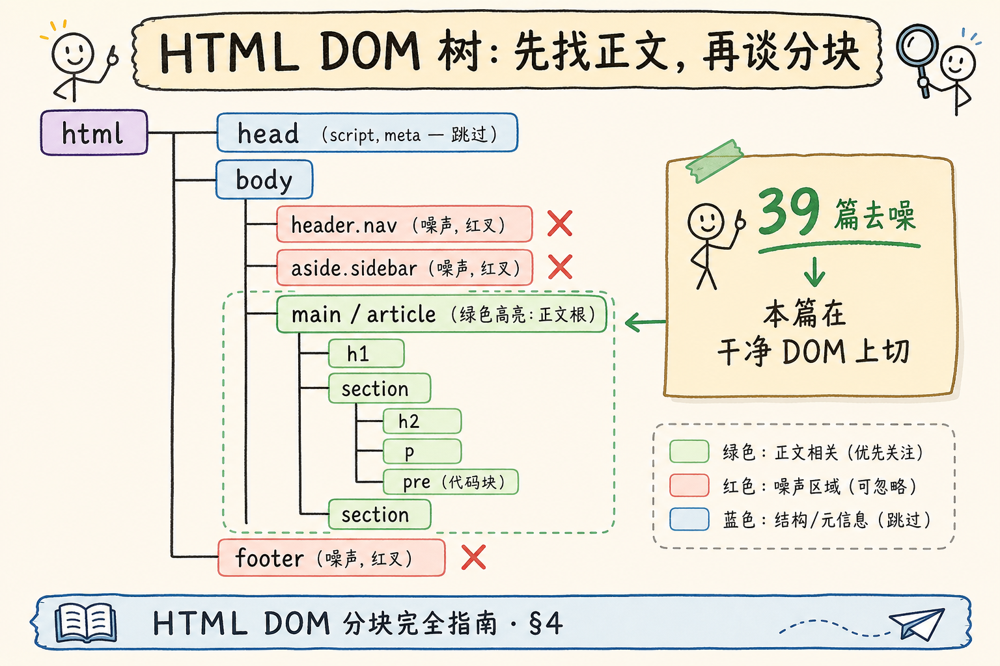
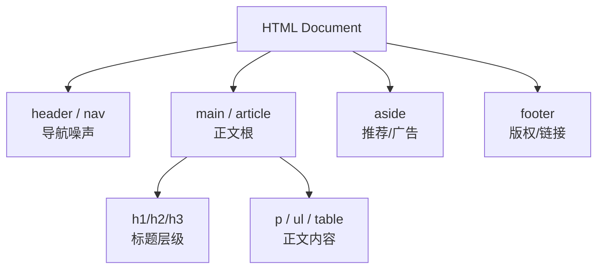
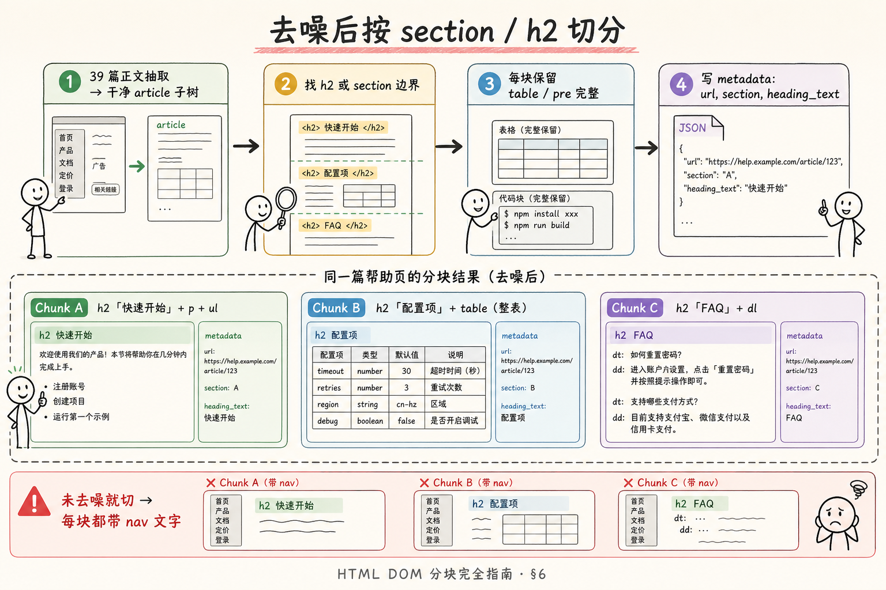
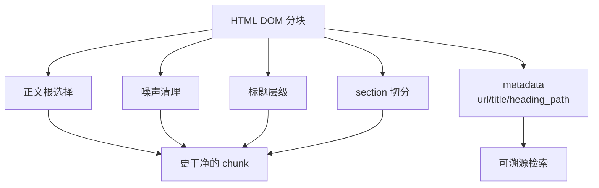

# RAG 分块策略（二）：HTML DOM 分块完全指南

> [第 39 篇](39.html-content-extraction-tutorial.md) 讲清 **正文抽取**——导航、侧栏、页脚是噪声，`main` / `article` 才是信号。但若你把抽出来的正文 `get_text()` 再 **按 500 字切**，FAQ 的 `<dl>` 会被劈开，帮助中心的 `<pre>` 命令与说明分离，表格头行与数据行分家。这篇是 [企业 RAG 路线图](ENTERPRISE_RAG_ROADMAP.md) **C2 分块第二篇**（路线图第 **71** 条），在 **去噪后的 DOM 树** 上分块：按 **`article` / `section` / 标题标签** 切、保留 **代码与表格完整性**，并与 MD AST 分块（[63 篇](63.markdown-ast-chunking-tutorial.md)）形成 **双轨结构感知**。前置：[39 HTML 正文抽取](39.html-content-extraction-tutorial.md)、 [52 source/page/section](52.metadata-source-page-tutorial.md)。

---

## 目录

1. [前言：正文抽干净了，分块仍在 innerText 一刀切](#1-前言正文抽干净了分块仍在-innertext-一刀切)
2. [本文边界与动手路径](#2-本文边界与动手路径)
3. [DOM 分块在链路中的位置](#3-dom-分块在链路中的位置)
4. [DOM 树与语义标签](#4-dom-树与语义标签)
5. [去噪后再切：顺序不能反](#5-去噪后再切顺序不能反)
6. [按 section 与标题切分](#6-按-section-与标题切分)
7. [pre、table 与列表的完整性](#7-pretable-与列表的完整性)
8. [最小实战：BS4 DOM 分块器](#8-最小实战bs4-dom-分块器)
9. [元数据、多站点配置与 JS 渲染](#9-元数据多站点配置与-js-渲染)
10. [先错后对：四种典型翻车](#10-先错对对四种典型翻车)
11. [综合概念地图](#11-综合概念地图)
12. [常见陷阱与 FAQ](#12-常见陷阱与-faq)
13. [总结与系列下一步](#13-总结与系列下一步)

---

## 1. 前言：正文抽干净了，分块仍在 innerText 一刀切

**HTML DOM 分块**（HTML DOM Chunking）：在 **正文抽取** 得到的 DOM 子树（通常是 `main` / `article` 根）上，按 **语义区块**——`section` 元素或 `h2` / `h3` 标题边界——切分出文本块，并保证 `pre`、`table`、`ul`/`ol` 等结构 **不被拦腰截断**。  
通俗说：**先抠出文章主体，再沿 `<h2>` 或小 `<section>` 的边界切蛋糕，而不是把整页文字粘成一串再数 500 字**。

网页与 Markdown 的对比（39 篇已述）：

| 维度 | Markdown | HTML |
|------|----------|------|
| 结构载体 | `#` 标题 | `<h1>`～`<h6>`、`<section>` |
| 噪声 | 少 | 多（模板、广告） |
| 分块前提 | 解析 AST | **先抽取正文 DOM** |
| 代码 | fenced ``` | `<pre><code>` |

典型事故：

| 现象 | 根因 |
|------|------|
| 每 chunk 都有「首页|产品|定价」 | **未去噪** 就切 |
| 重置密码步骤缺第一步 | 有序列表 `<ol>` 被切断 |
| 配置表只命中表头 | `<table>` 拦腰切 |
| 引用跳不回锚点 | 没存 `url` + `section` |

**读完本文，你应该能做到：**

1. 说明 **39 抽取 → 71 分块** 的先后顺序。  
2. 在 `article` 根上按 **h2** 或 **section** 切 DOM 子树。  
3. 保证 **pre / table** 整块进入同一 chunk。  
4. 跑通 §8 BS4 脚本，输出带 `section` 的 chunk 列表。  
5. 识别 §10 四种反模式。

### 1.1 与第 39 篇的衔接

39 篇输出 **干净正文子树**；本篇假设输入已是 `article` / `main` 根，**不再讨论** 如何识别 nav。  
联动手路径：

```text
Day 1：39 篇 BS4 抽取，对比抽取前后字数
Day 2：本篇 §8 DOM 分块，打印 section 列表
Day 3：对 SPA 域名加 Playwright（39 §9.12）再走 Day 2
Day 4：65 篇把 h2 chunk 作 parent
```

**术语双轨**：**DOM 分块 / DOM Chunking** 指在 DOM 子树上切；**正文根 / Content Root** 指 extract_main 返回值；**去噪 / Denoising** 指删除 nav/footer——39 篇动作，本篇前置条件。

### 1.2 帮助页 RAG 的典型失败链

```text
抓取整页 → get_text → 500 字切 → embedding
→ 用户问「重置密码」→ 命中页脚「隐私政策」中的「密码」二字
```

正确链：

```text
抓取 → 编码 → 去噪 → article 根 → h2 切 → metadata(url, section) → embedding
```

每一步失败都会 **封顶检索上限**——DOM 分块是链路的 **后半段**，不是可有可无的优化。

---

## 2. 本文边界与动手路径

**档位：C2 分块落地篇（衔接 C1 HTML 抽取）。**

**本文讲：** DOM 语义切分、去噪后分块、pre/table 完整、BS4 最小实现、元数据与多站点配置。  
**本文不讲：** 完整爬虫合规、Playwright 反爬、CSS 选择器大全、Parent-Document（见 [65 篇](65.parent-document-retriever-tutorial.md)）。

### 2.1 动手路径表

| 步骤 | 你做什么 | 验收 |
|------|----------|------|
| A | 重读 [39 篇](39.html-content-extraction-tutorial.md) §6～§7 | 能跑 BS4 正文抽取 |
| B | 读 §4～§6，打开帮助页标 h2/section | 圈出切分边界 |
| C | 跑 §8 脚本（本地 HTML 或 URL） | 打印 chunk section |
| D | 找含 `<pre>` 的页验证 | 代码块完整 |
| E | 完成 §10 先错对对 | 四种错法 |
| F | 对照 §11 概念地图 | 速记口述 |

**环境：** `pip install beautifulsoup4 lxml requests`；准备静态帮助页 HTML 或本地文件。

### 2.2 沿用前文

| 概念 | 来自 |
|------|------|
| 噪声、main/article 抽取 | [39 HTML 正文抽取](39.html-content-extraction-tutorial.md) |
| section 面包屑 | [52 source/page/section](52.metadata-source-page-tutorial.md) |
| MD AST 分块对照 | [63 Markdown AST 分块](63.markdown-ast-chunking-tutorial.md) |
| 代码块 / 表格完整 | 路线图 **76**、**75** |
| Token 预算 | [28 上下文窗口](28.context-window-tutorial.md) |

---

## 3. DOM 分块在链路中的位置

```text
URL / 本地 .html
  → 字节流 + 编码解码（39 篇 §8）
  → BeautifulSoup / lxml 解析 DOM
  → 【39 篇】正文抽取 → article 子树
  → 【本篇】DOM 分块 → chunk 列表
  → 清洗 + 计 token
  → Embedding → 向量库
```

**关键顺序**：**先抽取，再分块**。对整页 `body` 直接按 h2 切，会把 **侧栏目录里的 h2 文字** 也切进去——每块都带导航噪声。

与 [63 AST 分块](63.markdown-ast-chunking-tutorial.md) 的对照：

| | MD AST（63） | HTML DOM（本篇） |
|---|-------------|------------------|
| 根 | AST 顶层 nodes | `main` / `article` 子树 |
| 边界 | `heading` level | `h2`/`h3` 或 `<section>` |
| 代码 | `block_code` | `<pre>` |
| 表格 | `table` node | `<table>` |
| 前置 | 38 解析 | **39 去噪** |

### 3.1 三种入库来源优先级

```text
有 MD 源 → 63 篇 AST 分块
只有 HTML → 39 篇抽取 + 本篇 DOM 分块
只有 PDF → 37 篇版面 + 结构分块
```

同一主题 **只保留一条 canonical 源**，避免 URL 版与 MD 版 **重复 chunk** 互相稀释检索（39 篇 §9.11）。

### 3.2 innerText 一刀切为何不够

```python
# 常见偷懒
text = soup.get_text("\n")
chunks = splitter.split_text(text)
```

**丢失**：标题层级、列表结构、代码换行；**引入**：若抽取不干净，噪声与正文 **混在同一字符串** 无法区分。  
DOM 分块保留 **「这一 chunk 来自哪个 h2 子树」** 的可追溯性。

### 3.3 与 PDF、HTML 路径的「三轨并行」

企业知识库常 **三源并存**：

| 源 | 分块篇 | 边界信号 |
|----|--------|----------|
| `.md` | 63 AST | heading 节点 |
| `.html` | 64 DOM | h2 / section |
| `.pdf` | 37 版面 + 69 | 书签 / 标题行 |

**metadata schema 统一**（section、chunk_id、doc_id）比 **parser 统一** 更现实——检索与引用层只认 chunk 记录，不认你用什么 parser。

### 3.4 innerText 失败的 HTML 对照（复习 39 篇）

即使只对 **已抽取正文** 做 innerText 切，仍会 **丢失**：

- `<ol>` 步骤序号与嵌套层级；  
- `<pre>` 内换行与缩进；  
- `<table>` 列对齐关系（虽 embedding 不敏感，但 **整表语义** 需要同行）。

DOM 分块的价值是 **chunk 边界与 DOM 子树对齐**，而不只是「比整页短」。

---

## 4. DOM 树与语义标签

**DOM**（Document Object Model，文档对象模型）：HTML 的树形结构表示，每个标签是一个 **节点**（node）。  
通俗说：**浏览器眼里的网页家谱树**——父节点 `body`，子节点 `header`、`main`、`footer`。

**语义标签**（Semantic Tags）：自带含义的 HTML5 标签，如 `article`、`section`、`nav`、`aside`。  
通俗说：**标签名就告诉你这是文章还是导航**，比裸 `div class="content"` 少猜 classname。

读下图：典型帮助页 DOM，噪声与正文根的分工。




下面这张图说明为什么 HTML 不能只取 `innerText`。读图时重点看：DOM 树里包含标题、正文、导航、广告、脚注等结构信号，分块前要先识别哪些是正文。



结论：DOM 分块的价值在于保留网页作者原本写出的结构，而不是把整页压成一坨纯文本。

对照上图：

- **红色叉**：`header.nav`、`aside`、`footer`——39 篇去噪阶段剔除。  
- **绿色高亮**：`main` / `article`——本篇分块的 **根节点**。  
- 正文内：`section` 或 `h2` 划定 chunk 边界；`pre` 是代码原子。

### 4.1 正文根的选择优先级

```text
1. <article>
2. <main>
3. [role="main"]
4. div#content / .post-content（站点配置表）
5. trafilatura 输出 HTML 再 parse（39 篇 §9.2）
```

不同 host 维护 **小型 extractor 配置** 是成熟团队常态（39 篇 §9.14）。

### 4.2 标题标签与 section 的关系

| 模式 | 说明 |
|------|------|
| 扁平 h2 流 | `article > h2 + p + ul + h2 + ...` |
| section 包裹 | `article > section(h2+p) + section(h2+table)` |
| 混合 | GitHub Pages、Confluence 导出各异 |

分块器应 **两种都支持**：优先认 `section` 边界；若无 section，用 **h2 触发新 chunk**（与 63 篇 H2 逻辑同构）。

### 4.3 动态页面提醒

SPA 首屏 HTML 几乎空时，先 **Playwright 渲染**（39 篇 §9.12）再走 **同一套抽取 + 分块**。渲染只解决「字在不在」，不解决「噪声多不多」。

---

## 5. 去噪后再切：顺序不能反

**去噪**（Denoising / Noise Removal）：从完整 DOM 中删除或剥离导航、广告、页脚、脚本等 **非正文** 区域，得到 **干净正文子树**。  
通俗说：**先剪掉侧栏和页脚，再谈怎么切块**——39 篇职责；本篇 **假设输入已是干净 article**。

若跳过抽取：

```text
错误流水线：
  body → 找所有 h2 → 切 chunk
  → 每个 chunk 含 nav 重复文字
  → embedding 权重被「产品|定价|登录」污染
```

**正确流水线**：

```text
  body → extract_main() → article_root
  → 在 article_root 内找 h2/section
  → 切 chunk
```

### 5.1 抽取质量门禁

入库前对正文长度做启发式（39 篇 §9.10）：

| 信号 | 动作 |
|------|------|
| 正文 < 100 字 | 标记抽取失败，进人工队列 |
| 正文 > 原 HTML 80% | 可能未去侧栏，拒绝自动分块 |
| 链接文本占比 > 40% | 可能仍在 nav 区 |

**静默 embedding 垃圾正文** 比 loudly 失败更危险——检索上限在入库那天就定了。

### 5.2 与 trafilatura 的衔接

```python
import trafilatura

downloaded = trafilatura.fetch_url(url)
html = trafilatura.extract(downloaded, output_format="html")
# 再 BeautifulSoup(html) → 本篇分块器
```

trafilatura 输出已是 **正文 HTML**，仍建议走 **h2/section 分块** 而非 `extract(..., output_format="txt")` 一刀切——后者丢结构。

---

## 6. 按 section 与标题切分

**按 section 切分**（Section-based Splitting）：以 `section` 元素或 `h2`/`h3` 标题为边界，将 DOM 子树划分为 chunk，每个 chunk 包含该节标题及其后续兄弟节点，直到下一个同级边界。  
通俗说：**每个「## 级」帮助主题打一包**。

读下图：去噪后的 article，按 h2/section 切出的 chunk 与未去噪 innerText 切的对比。




下面这张图展示 HTML 分块的推荐顺序。读图时重点看：要先去噪，再按 section 或标题层级切分，顺序反了会把导航和广告带进 chunk。


结论：HTML 分块不是“解析之后直接切”。正文抽取、去噪、结构切分、metadata 补齐是连续步骤。

对照上图：

- **Chunk A**：「快速开始」h2 + 段落 + 列表。  
- **Chunk B**：「配置项」h2 + **整表** table。  
- **Chunk C**：「FAQ」h2 + 定义列表 dl。  
- 每块 metadata：`url`、`section`、`heading_text`。

### 6.1 分块算法（h2 兄弟流）

```text
输入：article_root
收集：直接子节点流，或 descendants 中的 h2 锚点

对每个 h2：
  chunk_root = 从该 h2 到下一 h2 之前的所有兄弟/堂兄弟节点
  （实现上：切 DOM 范围或收集节点列表）

若无 h2：整 article 一块，超长再按 h3 或 p 二次切
```

### 6.2 section 包裹型页面

```python
# 逻辑：每个 section 元素即一个 chunk
for sec in article_root.find_all("section", recursive=False):
    title = sec.find(["h1", "h2", "h3"])
    text = sec.get_text("\n", strip=True)
```

注意 **嵌套 section**：只切 **直接子 section** 或 **最外层有 h2 的 section**，避免把整页一个大 section 当一块。

### 6.3 超长 section 二次切

与 63 篇相同 **混合策略**：

```text
1. section 内按 h3 再切
2. 按 <p> 段落切
3. 递归字符 + overlap
4. 前缀重复【父 section 标题】
```

### 6.4 与 63 篇 AST 分块的「同构」

| 概念 | MD AST | HTML DOM |
|------|--------|----------|
| 切分信号 | heading level=2 | h2 或 section |
| 原子代码 | block_code | pre |
| 原子表格 | table node | table element |
| 面包屑 | section 字符串 | section 字符串 |

团队可共用 **同一套 metadata schema** 与 **同一套 chunk_id 规则**（52、51 篇），只是 parser 层不同。

### 6.5 案例：SaaS 帮助中心「计费 FAQ」

某产品计费页 HTML：`article` 内 6 个 `h2`（免费版、专业版、企业版、发票、退款、联系销售）。  
**未去噪** 按 body 切：每块含顶栏「定价|登录」——问「专业版月付」命中导航。  
**39 抽取 + 71 分块**：6 块各 200～600 字，Top-1 为「专业版」节内 **完整价格表**。  
Grounding 引用显示 `帮助中心 › 计费 › 专业版`——用户 **一键跳 URL#professional**（52 篇锚点）。

### 6.6 Confluence / Notion 导出 HTML 的坑

| 导出源 | 常见问题 | 分块对策 |
|--------|----------|----------|
| Confluence | 深层 div 包裹 | host 配置 `#main-content` |
| Notion HTML | 无 semantic section | 按 h1/h2 或 trafilatura |
| GitHub Pages | 结构清晰 | 默认 article+h2 |

**导出 HTML 一次免费抽检** 比上线后改 extractor 便宜一个数量级。

---

## 7. pre、table 与列表的完整性

**元素完整性**（Element Integrity）：特定 HTML 元素在分块时作为 **不可拆分单元** 整体划入一个 chunk。  
通俗说：**`<pre>` 里的命令、`table` 里的整张表，不能劈成上下两半**。

| 元素 | 规则 | 路线图 |
|------|------|--------|
| `<pre>` | 整节点进当前 chunk；超限则独立 chunk | 76 |
| `<table>` | 整表进 chunk；超大按行拆并重复表头 | 75 |
| `<ul>`/`<ol>` | 整列表跟所属 h2 section | 77 |
| `<dl>` FAQ | 整组 dt/dd | 77 |

### 7.1 pre 与 code

帮助中心常：

```html
<pre><code class="language-bash">pip install mypkg</code></pre>
```

分块时 **保留换行**；`get_text()` 前不要 `strip()` 掉 meaningful whitespace。  
`class` 里的 `language-*` 写入 `code_lang` metadata，便于「只搜 bash 示例」filter。

### 7.2 表格

SaaS 定价页、参数对照表是 **检索热点**。按字符切 table 会导致 **表头与数据分离**——用户问「专业版价格」，命中只有 `<th>专业版</th>` 没有 `<td>$99</td>`。

超大表策略：

```text
按 <tr> 拆成多 chunk
每个子 chunk 前缀重复 <thead> 文本
metadata: table_id, row_range
```

### 7.3 列表与 FAQ

```html
<dl>
  <dt>如何重置密码？</dt>
  <dd>点击登录页「忘记密码」...</dd>
</dl>
```

**dt 与 dd 必须在同一 chunk**——否则检索只命中问题没有答案。

### 7.4 图片 alt 与 figure

帮助页常 `<figure><figcaption>`。  
默认 **alt/figcaption 文本进 chunk** 供检索；大图二进制 **不进向量库**（多模态另论，路线图 62）。  
若 alt 为空且 figcaption 无文字，跳过——避免无意义 chunk。

### 7.5 内联样式与 class 噪音

Confluence 导出含 `<span style="...">` 嵌套。  
`get_text()` 前 **不必** 剥 span——文本内容正确即可；勿把 style 属性串 embedding 进去。  
极端脏 HTML 可先 `soup.unwrap()` 多余 span 减 token。

### 7.6 多列布局与 responsive 隐藏

Bootstrap `d-none d-md-block` 可能在 DOM 里 **重复桌面/移动两套 nav**。  
抽取阶段删 `nav` 仍可能留 **hidden 侧栏**——可选 `decompose` 带 `aria-hidden="true"` 且文本重复度高的 subtree。  
此属 **39 篇进阶**；本篇假设 extract_main 已足够干净。

### 7.7 与 46 文本清洗的衔接

chunk 文本产出后：NFKC、去零宽、合并多余空行（[46 篇](46.text-cleaning-tutorial.md)）。  
**pre 内** 仅做换行归一（`\r\n`→`\n`），勿 trim 每行首尾空格——Python 代码靠缩进。

### 7.8 分块结果的人工质检表（上线前 10 页）

| 页类型 | 检查 |
|--------|------|
| 安装指南 | pre 命令完整 |
| 定价 | table 含价格 td |
| FAQ | dt/dd 同块 |
| 长文 | 单 chunk < MAX 或已二次切 |
| 任意 | 无 nav 关键词 |

---

## 8. 最小实战：BS4 DOM 分块器

这一节用一个最小可运行的 BS4 分块器把前面的概念落到代码里。你可以把它理解成三步：先找到正文容器，再按 `h2` 收集一个章节内的 DOM 节点，最后把这些节点转成带 `section` 和 `char_count` 的 chunk。

初学者读代码时不要先纠结所有边界情况，先盯住 `chunk_by_h2()`：它决定“一个 chunk 从哪里开始、到哪里结束”。假设 `extract_main(soup)` 已由 39 篇提供，返回 `article` 节点。

```python
# pip install beautifulsoup4 lxml
from bs4 import BeautifulSoup, NavigableString, Tag
from pathlib import Path
import re

MAX_CHARS = 2500


def extract_main(soup: BeautifulSoup) -> Tag:
    """39 篇最小版：优先 article / main"""
    for sel in ("article", "main", '[role="main"]'):
        node = soup.select_one(sel)
        if node:
            return node
    return soup.body or soup


def heading_text(h tag) -> str:
    return h.get_text(strip=True)


def collect_until_next_h2(start_h2: Tag) -> list[Tag]:
    """从 h2 起收集节点，直到下一个 h2（同级流）"""
    nodes = [start_h2]
    for sib in start_h2.next_siblings:
        if isinstance(sib, Tag) and sib.name == "h2":
            break
        if isinstance(sib, (Tag, NavigableString)):
            nodes.append(sib)
    return nodes


def nodes_to_text(nodes: list) -> str:
    parts = []
    for n in nodes:
        if isinstance(n, NavigableString):
            t = str(n).strip()
            if t:
                parts.append(t)
        elif isinstance(n, Tag):
            if n.name == "pre":
                parts.append(n.get_text("\n"))  # 保留换行
            else:
                parts.append(n.get_text("\n", strip=True))
    return "\n\n".join(p for p in parts if p)


def chunk_by_h2(article: Tag, page_title: str = "") -> list[dict]:
    h2s = article.find_all("h2")
    if not h2s:
        text = article.get_text("\n", strip=True)
        return [{
            "section": page_title or "正文",
            "text": text,
            "char_count": len(text),
        }]

    chunks = []
    for h2 in h2s:
        nodes = collect_until_next_h2(h2)
        title = heading_text(h2)
        path = f"{page_title} › {title}" if page_title else title
        text = nodes_to_text(nodes)
        chunks.append({
            "section": path,
            "heading_text": title,
            "text": text,
            "char_count": len(text),
        })
    return chunks


def split_oversized(chunks, max_chars=MAX_CHARS):
    out = []
    for ch in chunks:
        if ch["char_count"] <= max_chars:
            out.append(ch)
            continue
        parts = re.split(r"\n{2,}", ch["text"])
        buf, size = [], 0
        prefix = f"【{ch['section']}】\n"
        for p in parts:
            if size + len(p) > max_chars and buf:
                out.append({**ch, "text": prefix + "\n\n".join(buf)})
                buf, size = [p], len(p)
            else:
                buf.append(p)
                size += len(p)
        if buf:
            out.append({**ch, "text": prefix + "\n\n".join(buf)})
    return out


def ingest_html(html: str, url: str = "") -> list[dict]:
    soup = BeautifulSoup(html, "lxml")
    for tag in soup(["script", "style", "nav", "footer", "aside", "header"]):
        tag.decompose()
    root = extract_main(soup)
    title = (soup.title.string if soup.title else "").strip()
    chunks = split_oversized(chunk_by_h2(root, page_title=title))
    for i, c in enumerate(chunks):
        c["url"] = url
        c["extractor"] = "bs4_h2_v1"
        c["chunk_index"] = i
    return chunks


if __name__ == "__main__":
    html = Path("sample_help.html").read_text(encoding="utf-8")
    for ch in ingest_html(html, url="https://docs.example.com/install"):
        print(ch["section"], ch["char_count"])
        print(ch["text"][:180], "...\n")
```

代码后解读：

1. `decompose` 去 script/nav 是 **抽取** 的一部分——生产可拆到 39 篇模块。  
2. `collect_until_next_h2` 实现 **h2 兄弟流** 切分。  
3. `pre` 单独 `get_text("\n")` 保留命令换行。  
4. 输出需补 `doc_id`、`chunk_id`（51 篇）、`fetched_at`（54 篇）。

### 8.1 section 包裹型变体

```python
def chunk_by_section(article: Tag, page_title: str = "") -> list[dict]:
    sections = article.find_all("section", recursive=False)
    if not sections:
        return chunk_by_h2(article, page_title)
    chunks = []
    for sec in sections:
        h = sec.find(["h1", "h2", "h3"])
        title = h.get_text(strip=True) if h else "未命名节"
        path = f"{page_title} › {title}" if page_title else title
        text = nodes_to_text(list(sec.children))
        chunks.append({"section": path, "heading_text": title, "text": text})
    return chunks
```

---

## 9. 元数据、多站点配置与 JS 渲染

| 字段 | 示例 | 用途 |
|------|------|------|
| `url` | `https://docs.../install` | 引用跳转 |
| `title` | `<title>` | 卡片展示 |
| `section` | `安装指南 › Docker` | 面包屑 |
| `heading_text` | `Docker` | 过滤 |
| `extractor` | `bs4_h2_v1` | 可复现 |
| `host` | `docs.example.com` | 选配置 |
| `fetched_at` | ISO8601 | 缓存刷新 |
| `has_code` | `true` | 代码类问答 |
| `code_lang` | `bash` | metadata filter |

### 9.1 按 host 的配置表

```python
HOST_CONFIG = {
    "docs.example.com": {"root": "article", "split": "h2"},
    "help.vendor.com": {"root": "div#content", "split": "section"},
}
```

**帮助页 vs 博客**（39 篇 §9.14）：侧栏目录重复度高，勿让目录 h2 进 chunk——抽取阶段去掉 `aside` 是关键。

### 9.2 用户提交 URL 的安全

39 篇 §9.9：SSRF 防护、域名白名单。DOM 分块 **不降低** 安全要求——恶意 HTML 仍要限制解析大小、超时。

### 9.3 与 Parent-Document 的衔接

本篇 chunk 可作为 [65 篇](65.parent-document-retriever-tutorial.md) 的 **父块**（按 h2 节）；父块内再切 **小子块** 做向量检索。HTML 帮助页 **节长适中**，是 Parent-Document 的高频场景。

### 9.4 Playwright 渲染 + DOM 分块完整链

对 **确认是 SPA** 的域名（39 篇 §9.12）：

```text
Playwright goto → page.content() → BeautifulSoup
  → extract_main → chunk_by_h2 → metadata(url, fetched_at)
```

**成本**：渲染比静态抓取贵一个数量级——仅对 **白名单 SPA host** 开启，静态站仍用 `requests`。

```python
def fetch_and_chunk(url: str) -> list[dict]:
    if host_in_spa_list(url):
        html = fetch_rendered_html(url)  # 39 篇 Playwright
    else:
        html = requests.get(url, timeout=15).text
    return ingest_html(html, url=url)
```

### 9.5 帮助中心 vs 营销博客 vs 论坛

| 页面类型 | DOM 特点 | 分块提示 |
|----------|----------|----------|
| 帮助文档 | 侧栏 nav、breadcrumb | 去 aside 后再切 |
| 营销博客 | 广告、推荐文卡片 | trafilatura 常更稳 |
| 论坛帖 | 多层 reply | `chunk_type=reply` 可选 |
| 文档搜索页 | 结果列表非正文 | **勿入库** |

**同一 extractor 打天下** 会翻车——按 `host` 维护 `HOST_CONFIG`（§9.1）是成熟常态。

### 9.6 正文质量门禁自动化

入库前脚本检查：

```python
def quality_gate(chunks: list[dict], raw_html_len: int) -> bool:
    total = sum(c["char_count"] for c in chunks)
    if total < 100:
        return False  # 抽取失败
    if total > raw_html_len * 0.8:
        return False  # 可能未去噪
    nav_words = ("首页", "登录", "Copyright")
    hits = sum(1 for c in chunks if any(w in c["text"] for w in nav_words))
    if hits > len(chunks) * 0.5:
        return False  # 噪声残留
    return True
```

失败样本 **打标进人工队列**，不要静默 embedding。

### 9.7 与 MD AST 分块的评测对照

选 **同一主题** 两条入库路径（CMS 同时导出 MD + HTML）：

| 问句 | 期望 |
|------|------|
| 安装命令完整可复制 | MD 与 HTML chunk 均含完整 pre |
| FAQ 答案不截断 | dl/dt/dd 与 MD 列表均完整 |
| section 面包屑一致 | 「安装 › Docker」同路径 |

**canonical 源只留一条进索引**——对照评测后选 **质量更高** 的源，不是两条都留。

### 9.8 编码与 DOM 分块的顺序

**必须先解决编码**（39 篇 §8），再 parse DOM。乱码 HTML 即使用再精的 h2 切分，embedding 也是 **垃圾进垃圾出**。

```python
resp.encoding = resp.apparent_encoding  # 或 chardet
html = resp.text
```

GBK 老站进 **回归集**，防编码修复被改坏。

### 9.9 表格与代码在帮助页中的检索权重

企业帮助中心 **参数表、CLI 示例** 是高频问答目标。metadata 建议：

```json
{
  "has_table": true,
  "has_code": true,
  "code_lang": "bash",
  "section": "CLI 参考 › 导入命令"
}
```

问答「导入命令」时可 `filter has_code=true` 缩小检索面——DOM 分块阶段就要 **识别 pre/table** 并写标，不是入库后才发现。

---

## 10. 先错对对：四种典型翻车
下面这些切块错误表面只是参数选择，实际会直接影响召回和引用：切太碎会丢上下文，切太粗会稀释重点，overlap 用错还会制造重复证据。


### 10.1 错：未去噪，body 上直接 find_all("h2")

侧栏目录常有 h2 样式文字，**每个 chunk 带导航**。  
**对**：`extract_main` → 仅在 article 内找 h2。

### 10.2 错：整页 get_text 再 RecursiveCharacterTextSplitter

丢失 section 结构；pre 换行被压扁。  
**对**：DOM 边界切 + pre 特殊处理。

### 10.3 错：table 按字符切

表头与数据分离。  
**对**：整表成块或按行拆 + 重复 thead。

### 10.4 错：同一页 MD 与 HTML 双入库

重复 chunk 稀释分数。  
**对**：canonical 源唯一（39 篇 §9.11）。

### 10.5 错：把目录页当正文切

不少帮助站 `<article>` 内第一个 h2 是「本页目录」，正文在后方。  
**对**：启发式跳过 **链接密度 >50%** 的 h2 节，或 host 配置 **跳过首个 h2**。

### 10.6 对：完整 DOM 分块验收样例

```text
输入：sample_help.html（含 nav + article 3×h2 + pre + table）
期望：
  - chunk 数 = 3
  - 任一 chunk 不含「首页|登录」
  - pre 命令完整一行不断
  - table  thead 与首行 td 同块
  - 每块 metadata.url 非空
```

---

## 11. 综合概念地图

读下图时，先看「HTML DOM 分块概念速记」想表达的主线：它把本节的概念关系压缩成一张可对照的图。


下面这张概念地图总结 HTML DOM 分块的关键对象。读图时重点看：正文根、噪声节点、标题路径和 chunk metadata 要一起处理。



结论：高质量 HTML RAG 的关键不是更复杂的模型，而是让入库文本少噪声、有结构、可追溯。

对照上图：**39 + 71** 是 HTML 入库标准两连击；与 **38 + 63** 平行。

### 11.1 速记表

| 概念 | 一句话 |
|------|--------|
| 顺序 | 先去噪，再 DOM 切 |
| 根 | article / main |
| 边界 | h2 或 section |
| pre/table | 原子元素 |
| 元数据 | url + section 必存 |

---

## 12. 常见陷阱与 FAQ

最后用 FAQ 检查 HTML DOM 分块是否真正落地。重点不是“能不能把网页切开”，而是切出来的每个 chunk 是否保留标题层级、正文语义、链接上下文和可追溯 metadata。

**Q：没有 h2 只有 h3 怎么办？**  
A：降级用 h3 作切分级别，或整 article 一块再段落二次切。

**Q：Confluence 导出 HTML 结构很烂？**  
A：优先要 **Confluence API / MD 导出**；HTML 则维护 host 专用选择器。

**Q：评论区要不要进 chunk？**  
A：默认不要；论坛帖另设 `chunk_type=reply`（39 篇 §9.14）。

**Q：编码乱码怎么办？**  
A：分块前必须解决——见 39 篇 §8，`resp.encoding = resp.apparent_encoding`。

**Q：和 63 篇能否共用评测集？**  
A：可以——同一批「安装命令 / FAQ」问句，对比 MD 与 HTML 两路的 chunk 完整率。

**Q：iframe 里的正文怎么办？**  
A: 默认 BS4 拿不到 iframe 内容——需 Playwright `frame` 切换或 CMS API；别对空 iframe 外壳 chunk 入库。

**Q：分页帮助（「下一页」）怎么聚合成 doc？**  
A: 爬虫合并多页 HTML 后再 **一次** extract_main + 分块；或每页独立 `doc_id` + `page` 元数据（52 篇），看产品要「全书问答」还是「单页问答」。

**Q：内联 `<code>` 与 `<pre>` 区别？**  
A: 行内 code 随段落；pre 是原子块——分块器对 pre 单独 `get_text("\n")`。

### 12.1 与路线图 C2 衔接

| 路线图 | 本篇 |
|--------|------|
| 39 正文抽取 | 前置必做 |
| **71 HTML DOM** | **本篇** |
| 75 表格成块 | §7.2 |
| 76 代码完整 | §7.1 pre |
| 77 列表 FAQ | §7.3 dl |
| 72 Parent-Document | h2 chunk = parent |

### 12.2 读路径自检

1. 为何不能对 `body` 直接 `find_all("h2")`？  
2. article 根的选择优先级前三项？  
3. trafilatura 输出后为何仍要 DOM 分块？  
4. 同一 URL 的 MD 与 HTML 如何避免重复索引？  
5. pre 元素为何不能 `strip()` 换行？

### 12.3 30 分钟动手作业

1. 抓一份自家帮助页 HTML（或保存本地）；  
2. 跑 §8，打印 chunk 数与平均字数；  
3. 找含 `<table>` 的 chunk，确认表头与首行数据同块；  
4. 写一条 **未去噪** 时会错的问句，证明 §5 顺序的重要性。

### 12.4 附录：host 配置表示例（YAML）

```yaml
extractors:
  docs.example.com:
    root: article
    split: h2
    strip_selectors: [".breadcrumb", ".edit-on-github"]
  help.vendor.com:
    root: "div#content"
    split: section
    spa: false
  app.modern.com:
    root: main
    split: h2
    spa: true   # 走 Playwright
```

运维改配置 **不改代码**——新域名接入只加一行；`spa: true` 触发 39 篇渲染链。  
配置变更应 bump `extractor` metadata 版本，便于 **重索引** 对账（48、49 篇）。

### 12.5 附录：BeautifulSoup 与 lxml 选型

| 解析器 | 速度 | 容错 | 建议 |
|--------|------|------|------|
| lxml | 快 | 对脏 HTML 较严 | 生产默认 |
| html.parser | 慢 | 内置 | 无 lxml 环境 |
| html5lib | 慢 | 最像浏览器 | 极脏 HTML |

DOM 分块 **遍历次数多**——批量入库选 **lxml**，单页调试可用内置 parser。

### 12.6 附录：从 39 篇抽取函数到 64 篇分块的一文件示例

```python
def pipeline_html(html: str, url: str, host_cfg: dict) -> list[dict]:
    soup = BeautifulSoup(html, "lxml")
    for sel in host_cfg.get("strip_selectors", []):
        for tag in soup.select(sel):
            tag.decompose()
    for tag in soup(["script", "style", "nav", "footer", "aside"]):
        tag.decompose()
    root = soup.select_one(host_cfg["root"]) or extract_main(soup)
    if host_cfg.get("split") == "section":
        chunks = chunk_by_section(root, page_title=get_title(soup))
    else:
        chunks = chunk_by_h2(root, page_title=get_title(soup))
    return attach_url_metadata(split_oversized(chunks), url)
```

此函数是 **39+64 最小合体**——复制进 PoC 仓库即可对帮助页 URL 做端到端入库。

### 12.7 后记：71 在 C2 里的位置

64～68 教 **切多大**；69～71 教 **沿什么切**——HTML 因噪声必须先 39，再 71。  
许多团队 **只有 HTML 源**（CMS 无 MD 导出），71 是它们的主战场；有 MD 源仍建议 **canonical 走 63**，避免双源重复。

### 12.8 与 rerank、filter 的组合顺序

```text
ACL filter → child 向量检索 Top-20 → rerank Top-10
→ 映射 parent 去重 → 拼 context → LLM
```

DOM 分块只保证 **块语义完整**；权限与精排是 **C4 检索轨**——顺序不要颠倒。

### 12.9 常见 host 场景速查（扩展）

| 域名类型 | root 选择 | split | 备注 |
|----------|-----------|-------|------|
| GitHub Pages 文档 | article | h2 | 结构通常规范 |
| ReadTheDocs | div[role=main] | h2 | 侧栏在 nav |
| 旧版 Bootstrap 站 | div.container | h2 | 可能无 article |
| 内网 Confluence | #main-content | h2 | 表格多，注意 75 |
| 单页 SPA 文档 | main | h2 | 必须 Playwright |

遇到 **新 host**，先用 §8 打印 chunk 前 200 字 **人工扫一眼**，比调 embedding 模型快。

### 12.10 与 63 篇 AST 分块的团队规范统一

建议数据平台发布 **《chunk metadata 规范 v1》**，MD 与 HTML 共用字段：`doc_id`、`chunk_id`、`section`、`source`、`chunker`。  
 parser 不同，**下游检索与引用 UI 相同**——这是双轨入库能并存的前提。

### 12.11 延伸阅读：何时升级到 trafilatura 专用管线

当 `HOST_CONFIG` 超过 **20 个域名** 且 BS4 规则维护人力 > 0.5 FTE 时，评估 **trafilatura 默认正文 + 本篇 h2 分块** 的统一管线。  
trafilatura 解决 **找根**；本篇解决 **切节**——职责仍清晰，只是 **找根** 自动化程度更高。

### 12.12 安全提醒：HTML 入库与 XSS

若前端引用 UI **渲染** chunk 内残留 HTML（而非纯文本），必须 **消毒**（路线图 23 XSS）。  
本篇 `get_text()` 路径产出 **纯文本**，风险低；但若保留 HTML 片段供富文本展示，**DOMPurify 类库** 必选。

### 12.13 动手作业（45 分钟）

1. 保存一份帮助页 HTML 到本地；  
2. 分别跑 **未去噪 body 切** 与 **39+64 管线**，对比 chunk 数与 nav 关键词出现次数；  
3. 选含 pre 的 chunk，复制命令到终端 **干跑**（`--help`）验证完整性；  
4. 写 3 条 metadata 字段说明给前端同事——完成即达到本篇最低生产门槛。

若你司帮助中心已用 39 篇跑通正文抽取，**本周唯一任务** 就是把 §8 的 `chunk_by_h2` 接进现有 ingest 脚本——通常 **不到一百行 diff**，却往往是 HTML RAG 检索质量 **最大的一次跃迁**。

### 12.14 与增量更新（49 篇）的配合

单页帮助 **改版** 时：`delete_vectors(filter url=...)` → 重抓 HTML → 39 抽取 → 64 分块 → upsert。  
**不要** 对未变 URL nightly 全量重切——`fetched_at` + ETag 触发增量即可节省 embedding 成本。

HTML DOM 分块 **不替代** 39 的正文抽取，而是其 **直接下游**——把这两篇的代码放在同一 `ingest/html.py` 模块里，新人 onboarding 时 **更不容易迷路**。下一篇 [65 Parent-Document](65.parent-document-retriever-tutorial.md) 会把本篇 h2 chunk 当作 **parent**，再切 child 做精检索。建议用 **同一批帮助页 URL** 连贯做完 64 与 65 的动手作业，对比 **单块索引** 与 **Parent-Document** 的检索差异——这是 C2 分块篇最直观的 A/B 实验。

---

## 13. 总结与系列下一步

1. HTML 分块 **前提是干净正文 DOM**——39 篇不是可选项。  
2. 按 **h2 / section** 切，不是 innerText 数 500 字。  
3. **pre、table、dl** 有完整性约束，与路线图 75～77 一致。  
4. chunk 必带 **url + section**，Grounding 才能跳回帮助页锚点。  
5. 与 63 篇 **同构**，可共用 metadata 与 chunk_id 规范。

### 13.1 系列下一步

| 目标 | 阅读 |
|------|------|
| 小块检索、大块生成 | [65 Parent-Document Retriever](65.parent-document-retriever-tutorial.md) |
| Small-to-Big | 路线图 **73** |
| MD 源优先 | [63 Markdown AST 分块](63.markdown-ast-chunking-tutorial.md) |
| 正文抽取复习 | [39 HTML 正文抽取](39.html-content-extraction-tutorial.md) |

### 13.2 学习目标自检

- [ ] 能画帮助页 DOM 噪声 vs article  
- [ ] 能说明先去噪再切的原因  
- [ ] 能跑 §8 输出 section  
- [ ] 能指出 table 为何不能字符切  

### 13.3 面试 30 秒版

「HTML 入库先 BS4/trafilatura 抽 main/article 正文，再去 script/nav；在 article 内按 h2 或 section 切 chunk，pre 和 table 整块保留；metadata 带 url 和 section 面包屑；有 MD 源则走 AST 分块，不重复索引 HTML。」

**延伸阅读**：为你家帮助中心 **抽 10 页** 跑 §8，统计 chunk 字数分布——你会立刻看到哪些节需要 Parent-Document 或 h3 二次切。下篇见 [65 Parent-Document Retriever](65.parent-document-retriever-tutorial.md)。

---

> **初学者可能仍困惑的点**  
> - 抽取与分块是 **两道工序**，合并写脚本可以，逻辑不能混。  
> - `get_text()` 适合 **预览**，不适合 **生产分块**——结构丢了就救不回来。  
> - JS 站先渲染再抽取再分块——三步缺一都可能「库里全是空壳或噪声」。
