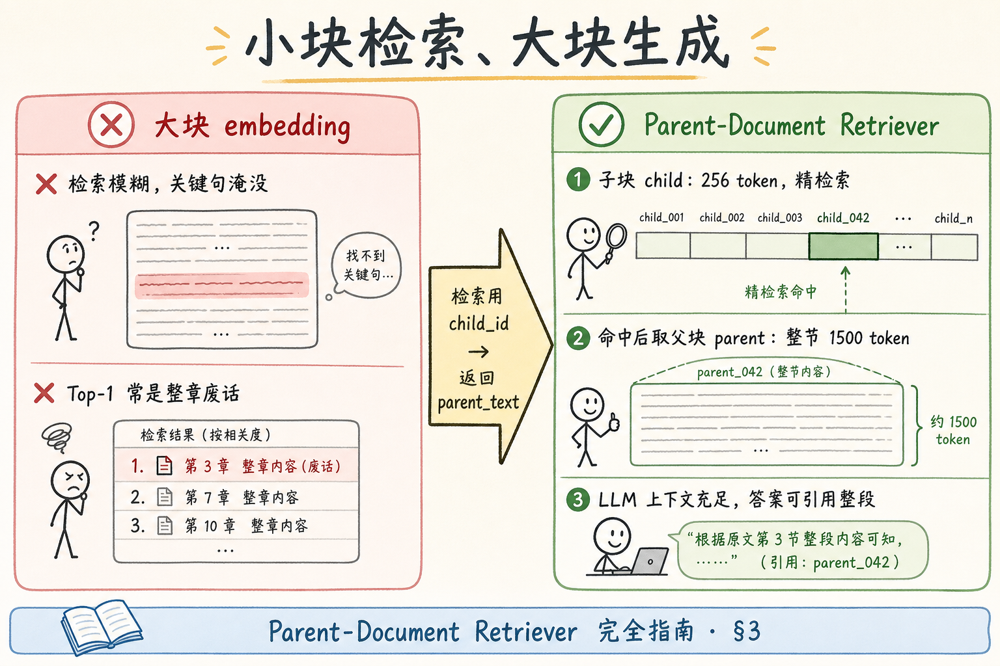
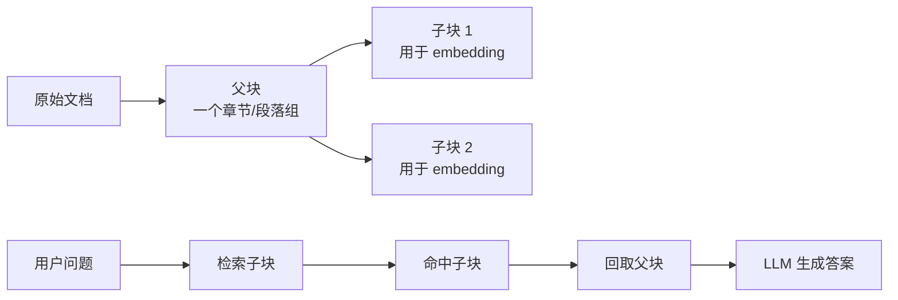
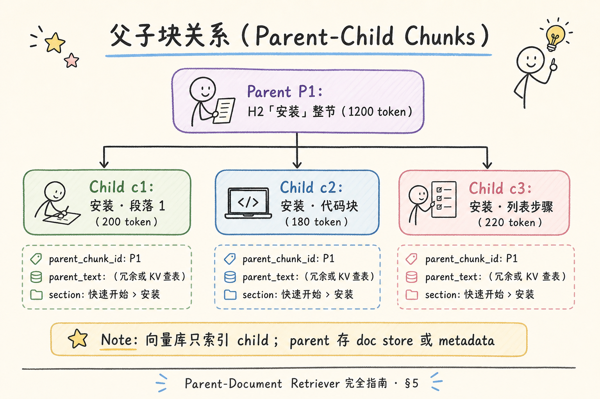
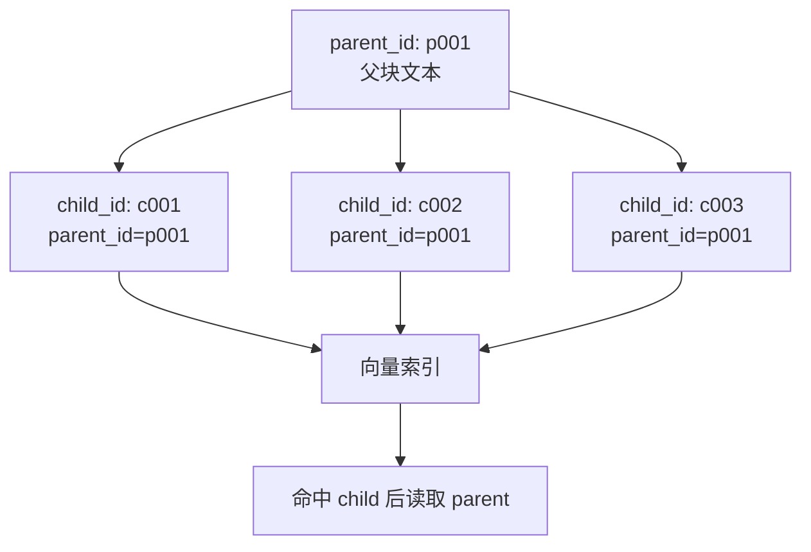
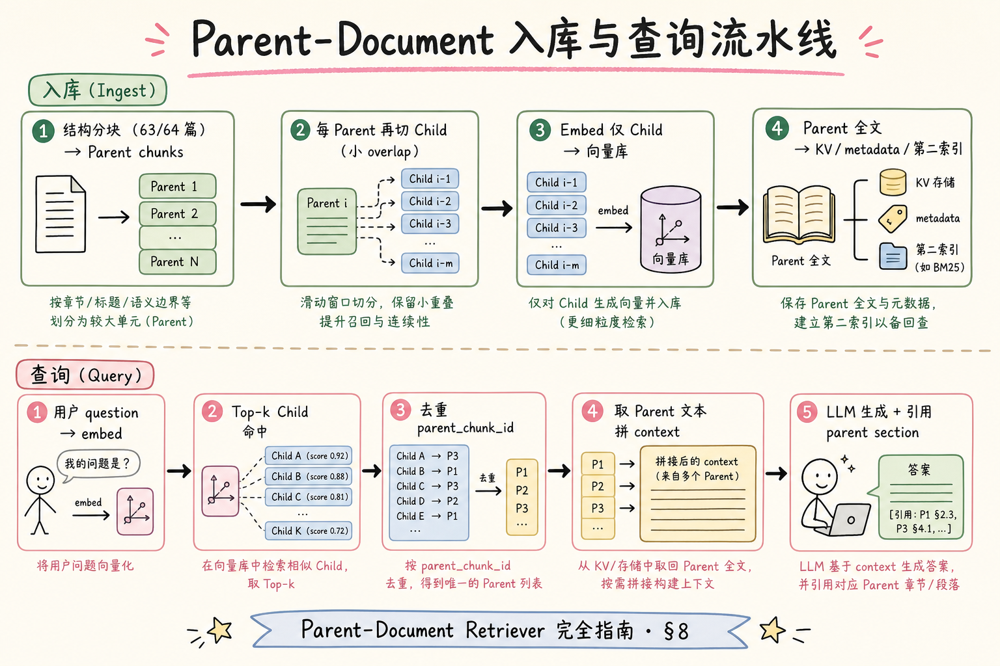
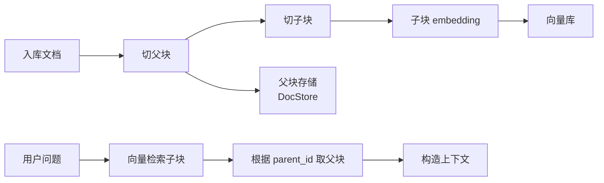
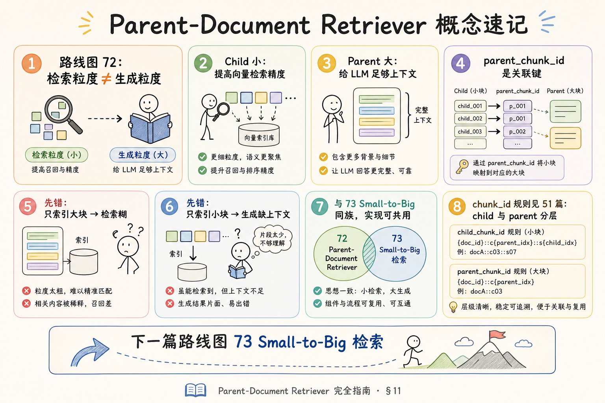
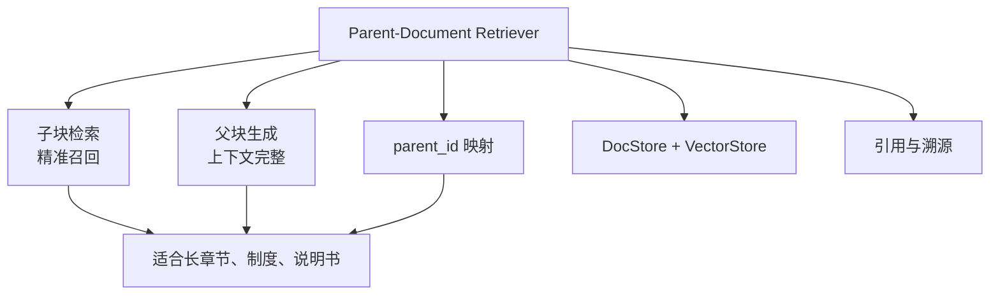

# RAG 分块策略（三）：Parent-Document Retriever 完全指南

> 结构感知分块（[63](63.markdown-ast-chunking-tutorial.md)、[64](64.html-dom-chunking-tutorial.md) 篇）把 chunk 切得 **语义完整** 了，但立刻撞上 **两难**：块 **太大** → embedding 模糊，检索 Top-1 常是整章废话；块 **太小** → 检索精准，LLM 上下文却 **缺前因后果**，答案短、引用对不上。企业长文档（制度、手册、API 参考）几乎都需要 **检索粒度** 与 **生成粒度** 分离。这篇是 [企业 RAG 路线图](ENTERPRISE_RAG_ROADMAP.md) **C2 分块主线篇**（路线图第 **72** 条），讲清 **Parent-Document Retriever**（父文档检索器）：**小块检索、大块生成**、**父子块关系**、为何有效、**动手路径 + 最小实现**，并与路线图 **73 Small-to-Big** 预告衔接。前置：结构分块 [63](63.markdown-ast-chunking-tutorial.md)/[64](64.html-dom-chunking-tutorial.md)、[51 chunk_id](51.metadata-chunk-id-tutorial.md)、[28 上下文窗口](28.context-window-tutorial.md)。

---

## 目录

1. [前言：切块越大越好？越小越好？](#1-前言切块越大越好越小越好)
2. [本文边界与动手路径](#2-本文边界与动手路径)
3. [小块检索、大块生成](#3-小块检索大块生成)
4. [为何 Parent-Document 有效](#4-为何-parent-document-有效)
5. [父子块关系与存储模型](#5-父子块关系与存储模型)
6. [与标题前缀、Overlap 的分工](#6-与标题前缀overlap-的分工)
7. [先错后对：三种典型方案](#7-先错对对三种典型方案)
8. [入库与查询流水线](#8-入库与查询流水线)
9. [最小实现：Python 伪代码到可跑原型](#9-最小实现python-伪代码到可跑原型)
10. [chunk_id、元数据与去重](#10-chunk_id元数据与去重)
11. [综合概念地图](#11-综合概念地图)
12. [与 Small-to-Big 的预告](#12-与-small-to-big-的预告)
13. [常见陷阱与 FAQ](#13-常见陷阱与-faq)
14. [总结与系列下一步](#14-总结与系列下一步)

---

## 1. 前言：切块越大越好？越小越好？

**Parent-Document Retriever**（父文档检索器）：一种 RAG 索引策略——将文档先切成较大的 **父块**（Parent Chunk，通常对应章节），再在每个父块内切成较小的 **子块**（Child Chunk）仅用于 **向量检索**；检索命中子块后，取出关联 **父块全文**（或更大上下文）交给 LLM 生成答案。  
通俗说：**用「小纸条」找位置，用「整页纸」给模型读**——检索找得准，生成读得全。

Chunk size 的 **trade-off**（权衡，路线图 68）：

| 块大小 | 检索 | 生成 |
|--------|------|------|
| 大（1500+ token） | 向量表示「平均化」，关键句被稀释 | 上下文足，指代清晰 |
| 小（128～256 token） | 语义聚焦，Top-k 精准 | 「它」「上述」指代丢失 |
| Parent-Document | 小 child 负责检索 | 大 parent 负责生成 |

真实问法示例：

> 「员工手册里，一线城市住宿标准的金额是多少，是否含早餐？」

若只索引 **整章「差旅规范」**（3000 token），embedding 可能更接近「差旅流程总述」，**数字 500 元** 在 Top-3 里排不进。  
若只索引 **一句「一线城市住宿上限 500 元/晚」**（30 token），检索命中了，但 LLM 看不到 **是否含早餐** 在同段后半——答案不完整或 hallucination。

Parent-Document：**child** 精准命中数字句；**parent** 提供整节政策供模型综合。

**读完本文，你应该能做到：**

1. 解释 **检索粒度 ≠ 生成粒度**。  
2. 画出 parent / child 存储与查询数据流。  
3. 实现 §9 最小原型（内存 dict + 假 embedding 亦可）。  
4. 设计 **parent_chunk_id** 与分层 **chunk_id**（51 篇）。  
5. 识别 §7 三种「只大 / 只小 / 父子搞反」的翻车。

### 1.1 C2 主线在路线图中的位置

```text
64～68 尺寸与 overlap 调参
69～71 结构感知（MD / HTML）
72 Parent-Document ← 本篇（检索≠生成）
73 Small-to-Big（动态放大）
74 多粒度索引
```

63、64 解决 **「在哪里切」**；本篇解决 **「切几层、索引用哪层」**——是从 **几何分块** 到 **索引架构** 的拐点。

### 1.2 术语双轨速查

| 中文 | English | 一句话 |
|------|---------|--------|
| 父块 | Parent Chunk | 结构节，供 LLM 阅读 |
| 子块 | Child Chunk | 小块，供向量检索 |
| 父文档检索器 | Parent-Document Retriever | 72 方案总称 |
| 小块检索大块生成 | Small Retrieve, Big Generate | 核心口号 |
| 关联键 | parent_chunk_id | child→parent 纽带 |

### 1.3 读完本篇的最小交付物

1. 一张 **ingest + query** 数据流图（§8）；  
2. 一份 **parent/child chunk_id 命名规范**（§10）；  
3. 一个 **可跑的 §9 内存原型**；  
4. 三条 **先错后对** 口述（§7）；  
5. 一句话区分 **72 vs 73**（§12）。

---

## 2. 本文边界与动手路径

**档位：C2 主线篇（路线图 72，厚实现导向）。**

**本文讲：** 原理、存储模型、入库/查询流水线、Python 最小实现、chunk_id、与 73 预告。  
**本文不讲：** LangChain 全家桶 API 逐参数、多向量库厂商语法、GraphRAG 实体索引、ColBERT  late interaction。

### 2.1 动手路径表

| 步骤 | 你做什么 | 验收 |
|------|----------|------|
| A | 读 §3～§4，画 child→parent 箭头图 | 能口述「为何」 |
| B | 读 §5，定 parent/child 尺寸 | parent≈章节，child≈256 token |
| C | 用 63 篇脚本产出 parent chunks | 至少 3 个 H2 节 |
| D | 跟做 §9 最小实现 | query 返回 parent 文本 |
| E | 完成 §7 先错对对 | 三种错法 |
| F | 对照 §11 概念地图 + §12 73 预告 | 能区分 72 vs 73 |

**环境：** Python 3.10+；`pip install mistune`（复用 63 篇）；向量库可用 **内存 list** 先跑通逻辑，再换 Pinecone/pgvector。

### 2.2 沿用前文

| 概念 | 来自 |
|------|------|
| MD/HTML 结构 parent | [63 AST](63.markdown-ast-chunking-tutorial.md)、[64 DOM](64.html-dom-chunking-tutorial.md) |
| chunk_id 分层 | [51 chunk_id](51.metadata-chunk-id-tutorial.md) |
| section 溯源 | [52 source/page/section](52.metadata-source-page-tutorial.md) |
| Token 预算 | [28 上下文窗口](28.context-window-tutorial.md) |
| Overlap | 路线图 **67** |
| Small-to-Big | 路线图 **73**（§12 预告） |

---

## 3. 小块检索、大块生成

**小块检索**（Small-chunk Retrieval）：用 **低 token 数** 的子块做 Embedding 与近似最近邻搜索，提高 query 与 **具体陈述** 的匹配精度。  
通俗说：**用短句去库里「钓」最相关的那几句**。

**大块生成**（Large-chunk Generation）：检索阶段选定子块后，向 LLM 提供 **关联父块** 的更长文本作为 context，保证 **背景、例外条款、表格上下文** 不丢失。  
通俗说：**模型写答案时读整节，不是只读命中那半行**。

读下图：错误「只大块索引」与正确「child 检索 → parent 生成」的对照。



下面这张图说明 Parent-Document Retriever 的核心想法。读图时重点看：检索用小块保证命中精准，生成时取回父块保证上下文完整。



结论：它不是简单把 chunk 调大，而是把“检索粒度”和“生成上下文粒度”拆开。

对照上图：

- **左栏（错）**：大块 embedding → 检索糊 → Top-1 是整章标题感。  
- **右栏（对）**：child 256 token 精检索 → 命中 `parent_chunk_id` → 取 parent 1200 token 拼 prompt。  
- **中心键**：`parent_chunk_id` 是关联纽带。

### 3.1 尺寸经验起点（需评测调）

| 层级 | Token 量级 | 典型切法 |
|------|------------|----------|
| Parent | 800～2000 | H2 节 / HTML section |
| Child | 128～400 | 段落、小 overlap 滑窗 |
| 送入 LLM | 1～3 个 parent | 去重后计总 token |

**Overlap**（重叠窗口，路线图 67）：child 之间可 32～64 token overlap，避免边界句丢失；**parent 间不 overlap**（避免生成 context 重复爆炸）。

### 3.2 与「标题前缀」的关系

63 篇 **父标题前缀** 是在 **单索引** 里的小块补救；Parent-Document 是 **双索引/双存储** 的系统性方案——前缀可叠加在 child 上，但 **不能替代** parent 全文。

---

## 4. 为何 Parent-Document 有效

从三个机制理解：

### 4.1 Embedding 的「平均化」效应

**Dense Embedding**（稠密向量，见 [25 篇](25.embedding-vector-tutorial.md)）把整段文本压成一个向量。文本越长，细节信号 **被平均**，query 与 **某一关键句** 的余弦相似度下降。  
Child 短 → 向量更 **聚焦** 于局部语义 → 检索 **discriminative**（可区分性）更强。

### 4.2 LLM 需要局部 + 全局

生成答案常需：

- **局部**：具体数字、命令、专有名词（child 命中）；  
- **全局**：例外情况、适用条件、前后定义（parent 提供）。

只给 child，模型易 **过度泛化** 或 **编造** 未出现的条件（[33 幻觉](33.llm-hallucination-tutorial.md)）。

### 4.3 引用与 Grounding

[34 Grounding](34.grounding-citation-tutorial.md) 要求答案绑证据。引用 UI 展示 **section + snippet** 时：

- 检索日志记录 **child_id**（精确定位命中句）；  
- 用户点开查看 **parent 全文** 或滚动到 section——体验一致。

### 4.4 何时不必上 Parent-Document

| 场景 | 建议 |
|------|------|
| 全文 < 500 token | 单块即可 |
| FAQ 一问一答已 isolated | child=parent |
| 纯关键词日志检索 | 另论 |
| 已有多粒度索引（路线图 74） | 可组合 |

**默认**：企业 **长 PDF/MD/HTML 手册** 值得做；短 README 不必过度工程。

### 4.5 数学直觉：向量空间里的「模糊」

设一节 2000 token，含 20 个事实点 {f1…f20}。Embedding 近似 **整节语义平均** 时，query 专问 f7，相似度常 ∝ **1/20 权重** 被稀释。  
Child 200 token 若 **主要覆盖 f7 邻域**，query–child 相似度 **峰值更尖**，Top-k 排序更稳定——这是 **小块检索** 的几何直觉，非玄学。

### 4.6 企业场景清单：何时优先 72

| 场景 | 建议 |
|------|------|
| 员工制度 PDF（百页级） | 必做 |
| API 参考（长 endpoint 列表） | 必做 |
| 多 H2 帮助中心 | 必做 |
| 10 条 FAQ 单页 | 不必 |
| 实时日志 grep | 非 RAG 路径 |

### 4.7 与 chunk size 调参（路线图 68）的关系

Parent 尺寸 **不是越大越好**——parent 超过 2000 token 时，即使用 child 检索，**同一 parent 内 distant child** 仍可能无关。  
经验：parent 对齐 **63/64 结构节**；child 128～400 token；parent 过长则 **先调 63/64 切细**，而非无限加大 child 数。

### 4.8 幻觉与 Parent-Document

[33 幻觉](33.llm-hallucination-tutorial.md) 在 **context 不足** 时飙升。  
只给小 child 时，模型易 **编造** 未出现的例外条款；parent 提供 **同节否定句、但书** 时，拒答与 Grounding 质量 **同步上升**——Parent-Document 是 **抗幻觉结构手段** 之一，不是只靠 prompt 魔法。

---

## 5. 父子块关系与存储模型

**父块**（Parent Chunk）：结构感知分块产出的 **较大逻辑单元**，通常对应 H2 节或 HTML section，含完整小节上下文。  
**子块**（Child Chunk）：从单个 parent 文本 **二次切分** 的小块，**仅 child 向量进入检索索引**。

读下图：一个 parent 拆多个 child，metadata 关联。




下面这张图展示父子块关系如何存储。读图时重点看：子块要保存 `parent_id`，否则命中后无法回到更完整的父文本。



结论：Parent-Document 的关键字段是 `parent_id`。没有这条关系，系统只能返回碎片，不能恢复大块上下文。

对照上图：

- **Parent P1**：「安装」整节 ~1200 token，存 **文档存储**（KV / SQL / 对象存储）。  
- **Child c1,c2,c3**：从 P1 切出，**embed 进向量库**。  
- 每个 child 带 `parent_chunk_id: P1`；可选冗余 `parent_text`（小项目）或 **查表**（大项目）。

### 5.1 两种存储架构

| 模式 | Parent 存哪 | Child 存哪 | 适用 |
|------|-------------|------------|------|
| A. Metadata 冗余 | 向量库 child metadata 内嵌 parent 全文 | 向量库 | 原型、parent 不长 |
| B. 分离存储 | Postgres / S3 / Redis | 向量库只存 child 向量 + parent_chunk_id | 生产、parent 长 |

**模式 B** 更常见：parent 更新时 **只改 KV**，child 向量可 **lazy 重嵌**（若 parent 文本未变则 child 不变）。

### 5.2 一对多关系

```text
1 parent → N children（N 随 parent 长度变）
1 child  → 1 parent（严格）
查询 Top-k child → 映射 → 去重 parent → Top-m parent 进 prompt
```

同一 parent 下多个 child 同时命中 **正常**——去重后只送 **一次** parent 文本。

### 5.3 与 63/64 的衔接

```text
63/64 结构分块器 → 产出 parent 列表
本篇 child splitter → 对每个 parent 再切
embed(children only)
store(parents in doc store)
```

**不要** 用固定 500 字直接从全文切 child 而 **没有 parent 边界**——child 可能 **跨 H2**，parent 聚合时语义错乱。

---

## 6. 与标题前缀、Overlap 的分工

| 手段 | 解决什么 | 局限 |
|------|----------|------|
| 父标题前缀（63 篇） | 单索引小块的指代 | 仍缺节内细节 |
| Overlap（67） | 边界句不断 | 索引体积涨，不补全节 |
| Parent-Document | 检索精 + 生成全 | 实现复杂、双存储 |

三者 **可叠加**：child 可加前缀「【安装 › Docker】」；parent 仍送整节。

---

## 7. 先错对对：三种典型方案
下面这些错误看起来只是实现细节，实际会破坏检索、引用、评测或用户体验。读的时候重点看：错法缺少了哪个必要信息，以及正确做法如何补上这个缺口。

### 7.1 错：只索引大块

```python
# 错：整节 embed，检索直接送命中块
chunks = chunk_by_h2(ast)  # 每块 1500 token
embed_and_index(chunks)
# query → top chunk → LLM
```

**症状**：Top-1 常是 **章节标题附近** 的空泛段；具体数字排不进 Top-3。  
**对**：child 检索 + parent 生成（§8）。

### 7.2 错：只索引小块

```python
# 错：256 token 切全文，无 parent
children = recursive_split(full_doc, 256)
embed_and_index(children)
# query → top child → LLM（仅 child 文本）
```

**症状**：检索准，但答案 **缺条件、缺表格上下文**；multi-hop 题失败。  
**对**：child 命中后 **必取 parent**。

### 7.3 错：parent/child 关系搞反

```python
# 错：embed parent，检索到 parent 后再现场切 child 给 LLM
```

检索阶段仍 **糊**；生成阶段才切小 **更糊**。  
**对**：**embed child**，**generate with parent**。

### 7.4 对：标准 Parent-Document 查询

```text
query → embed → vector search top-k children
→ 收集 parent_chunk_id 集合
→ 去重、按分数排序 parent
→ 取 top-m parent 全文拼 context
→ LLM generate + cite section
```

### 7.5 案例对照：差旅制度「住宿标准」

**问**：「一线城市出差住宿上限多少，是否含早餐？」

| 方案 | 检索命中 | 生成 context | 答案质量 |
|------|----------|--------------|----------|
| 只大块 | 「差旅总则」段 | 同块，数字被稀释 | 常漏早餐说明 |
| 只小块 | 「500 元/晚」句 | 仅该句 | 易答错含餐 |
| 72 | 「500 元/晚」child | 整节「住宿标准」parent | 数字+条件完整 |

此例可直接写进 **团队 onboarding 幻灯片**——比抽象讲 embedding 平均化更说服业务方。

---

## 8. 入库与查询流水线

读下图：从 ingest 到 answer 的完整路径。




下面这张图把 Parent-Document 的入库和查询串起来。读图时重点看：入库时同时保存父块文本和子块向量，查询时先搜子块再取父块。



结论：这条流水线比普通分块多维护一个父块存储，但换来更稳定的上下文完整性。

对照上图：

**入库（Ingest）**：

```text
1. 解析 + 结构分块（63/64）→ parents[]
2. 对每个 parent：child_split(parent.text) → children[]
3. 为 parent 分配 parent_chunk_id，写入 doc store
4. 为每个 child 分配 child_chunk_id，metadata.parent_chunk_id = ...
5. embed(children) → upsert 向量库（不 embed parent，或 parent 另索引用 74）
6. 写 catalog：doc_id, version, chunker_version
```

**查询（Query）**：

```text
1. q_embed = embed(query)
2. hits = vector_search(q_embed, top_k=20)
3. parent_ids = unique(h.parent_chunk_id for h in hits)
4. parents = batch_get(parent_ids)  # 按检索分数排序 parent
5. context = concat(parents[:m], budget=MAX_CONTEXT)
6. answer = llm(system + context + query)
7. citations 用 child 的 section/snippet，展示可跳 parent
```

### 8.1 Context 预算

[28 篇](28.context-window-tutorial.md)：多个 parent 拼接时 **总 token ≤ 预算**。  
策略：

- 按 **child  hit 分数** 对 parent 排序；  
- 同一 parent 只计 **一次**；  
- 超预算则 **截断低分 parent** 或 **summarize parent**（进阶，非本篇默认）。

### 8.2 与 Rerank 的位置

**Rerank**（重排序，路线图 C4）：可在 child Top-20 后 **交叉编码器** 精排，再映射 parent——Parent-Document 与 rerank **正交**，常叠加。

### 8.3 成本与存储估算

设：1000 篇文档，每篇 10 个 parent，每 parent 5 个 child：

| 项目 | 数量 | 说明 |
|------|------|------|
| Parent 条数 | 10,000 | 存 KV，文本 ~1KB ≈ 10MB 级 |
| Child 条数 | 50,000 | 向量库主索引 |
| Embedding 费用 | 50k 次 | 按 child 文本 token 计 |
| 查询延迟 | 1 次向量 + 1 次 batch_get parent | parent 查表通常 <10ms |

相对 **只索引 10k 大块**，child 索引 **embedding 次数约 5 倍**——用 **检索 Recall 提升** 与 **生成质量** 换存储与 API 成本。多数企业手册场景 **ROI 为正**。

### 8.4 Parent 文本更新时的失效策略

| 变更类型 | Child | Parent | 动作 |
|----------|-------|--------|------|
| 改错别字 | 变 | 变 | 重切 child + 重 embed |
| 升 doc version | 新 id | 新 id | 删旧 doc_id 向量 |
| 只改 metadata | 不变 | 不变 | 不重 embed |

与 [48 版本](48.doc-versioning-tutorial.md)、[49 增量](49.incremental-update-tutorial.md) 联读——**parent 变必 child 变**，不要只更新 parent store 忘向量库。

### 8.5 生成阶段 context 拼接模板

```text
[System] 你是企业助手。仅根据资料回答；不足则拒答。

[Context]
--- 来源 1: {section} ---
{parent_text_1}

--- 来源 2: {section} ---
{parent_text_2}

[User] {query}
```

**不要用 child 片段冒充 context**——debug 时若发现 prompt 里只有 200 字，说明 **parent 查表失败** 或 **误用了 child.text**。

---

## 9. 最小实现：Python 伪代码到可跑原型

以下 **教学可跑**：用 **字符长度** 模拟 token；用 **词袋余弦** 模拟 embedding。替换 `embed()` 为真实 API 即可上生产。

### 9.1 Child 切分器

```python
def split_children(parent_text: str, size: int = 300, overlap: int = 50) -> list[str]:
    """固定窗口 + overlap，生产换 token splitter"""
    chunks, start = [], 0
    while start < len(parent_text):
        end = start + size
        chunks.append(parent_text[start:end])
        start = end - overlap
        if start < 0:
            start = 0
        if end >= len(parent_text):
            break
    return [c.strip() for c in chunks if c.strip()]
```

结构 parent 内切 child，**不跨 parent 边界**——这是与「全文 256 切」的本质区别。

### 9.2 内存索引 + 检索

```python
import math
import re
from collections import defaultdict

# ---------- 假 embedding ----------
def embed(text: str) -> dict[str, float]:
    words = re.findall(r"\w+", text.lower())
    freq: dict[str, float] = defaultdict(float)
    for w in words:
        freq[w] += 1.0
    norm = math.sqrt(sum(v * v for v in freq.values())) or 1.0
    return {k: v / norm for k, v in freq.items()}


def cosine(a: dict, b: dict) -> float:
    keys = set(a) & set(b)
    return sum(a[k] * b[k] for k in keys)


# ---------- 存储 ----------
PARENT_STORE: dict[str, dict] = {}   # parent_chunk_id -> record
CHILD_INDEX: list[dict] = []           # {child_id, parent_chunk_id, vector, section, ...}


def ingest_parent(parent: dict, doc_id: str, version: int, index: int):
    """parent: {section, text} from 63/64 chunker"""
    pid = f"{doc_id}:v{version}:p{index:04d}"
    PARENT_STORE[pid] = {
        "parent_chunk_id": pid,
        "section": parent["section"],
        "text": parent["text"],
        "doc_id": doc_id,
        "version": version,
    }
    for j, child_text in enumerate(split_children(parent["text"])):
        cid = f"{pid}:c{j:02d}"
        CHILD_INDEX.append({
            "child_chunk_id": cid,
            "parent_chunk_id": pid,
            "section": parent["section"],
            "text": child_text,
            "vector": embed(child_text),
        })


def retrieve(query: str, top_k: int = 5, max_parents: int = 2) -> list[dict]:
    qv = embed(query)
    scored = [(cosine(qv, c["vector"]), c) for c in CHILD_INDEX]
    scored.sort(key=lambda x: x[0], reverse=True)
    top_children = [c for _, c in scored[:top_k]]

    # 按 child 分数聚合 parent
    parent_best: dict[str, float] = {}
    for _, c in scored[:top_k * 3]:
        pid = c["parent_chunk_id"]
        s = cosine(qv, c["vector"])
        parent_best[pid] = max(parent_best.get(pid, 0), s)

    ranked_parents = sorted(parent_best.items(), key=lambda x: x[1], reverse=True)
    result = []
    for pid, score in ranked_parents[:max_parents]:
        p = PARENT_STORE[pid]
        result.append({
            "parent_chunk_id": pid,
            "section": p["section"],
            "text": p["text"],
            "score": score,
        })
    return result, top_children


def build_prompt(query: str, parents: list[dict]) -> str:
    ctx = "\n\n---\n\n".join(
        f"[{p['section']}]\n{p['text']}" for p in parents
    )
    return f"""你是企业知识库助手。仅根据下列资料回答；资料不足请说不知道。

资料：
{ctx}

问题：{query}
"""
```

### 9.3 串联 63 篇 parent

```python
import mistune
from pathlib import Path

# 假设已从 63 篇复制 chunk_ast、split_oversized 等函数
def load_parents_from_md(path: Path) -> list[dict]:
    raw = path.read_text(encoding="utf-8")
    ast = mistune.create_markdown(renderer="ast")(raw)
    return split_oversized(chunk_ast(ast))  # 63 篇函数


if __name__ == "__main__":
    doc_id = "employee-handbook"
    version = 1
    for i, parent in enumerate(load_parents_from_md(Path("handbook.md"))):
        ingest_parent(parent, doc_id, version, i)

    parents, children = retrieve("一线城市住宿上限是多少")
    print("=== Parents for LLM ===")
    for p in parents:
        print(p["section"], p["score"], len(p["text"]))
    print("=== Hit children (debug) ===")
    for c in children[:3]:
        print(c["child_chunk_id"], c["text"][:80])
    print(build_prompt("一线城市住宿上限是多少", parents))
```

代码后解读：

1. **只 embed child**——`CHILD_INDEX` 是检索面。  
2. **PARENT_STORE** 是生成面——可用 SQLite 替换 dict。  
3. `retrieve` **去重 parent**，按 child 最高分排序 parent。  
4. `build_prompt` 拼 **parent 全文**，不是 child 片段。

### 9.4 接入真实向量库

替换要点：

```python
# upsert 时
vector_db.upsert(
    id=child["child_chunk_id"],
    vector=openai_embed(child["text"]),
    metadata={
        "parent_chunk_id": child["parent_chunk_id"],
        "section": child["section"],
        "doc_id": doc_id,
        # 小 parent 可冗余 parent_text；大 parent 只存 id
    },
)

# query 时
hits = vector_db.query(embed(query), top_k=20)
parent_ids = list({h.metadata["parent_chunk_id"] for h in hits})
parents = parent_store.mget(parent_ids)
```

### 9.5 验收清单

| 检查 | 标准 |
|------|------|
| child 不跨 H2 | 每个 child 的 parent 唯一 |
| 检索 | 具体数字问句 Top child 含数字 |
| 生成 context | prompt 含完整 parent 节 |
| 去重 | 同一 parent 不重复拼两次 |
| chunk_id | child 含 parent id 前缀（51 篇） |

---

## 10. chunk_id、元数据与去重
Parent-Document Retriever 同时保存父块和子块，因此 ID 设计必须分层：子块负责检索命中，父块负责取回完整上下文。chunk_id、parent_id 和 metadata 如果混在一起，最直接的后果就是去重困难、引用不准、排障找不到原文。

### 10.1 分层 chunk_id（51 篇 FAQ）

```text
parent: employee-handbook:v3:p0002
child:  employee-handbook:v3:p0002:c01
```

或结构型：

```text
parent: employee-handbook:v3:sec-travel-lodging
child:  employee-handbook:v3:sec-travel-lodging:c01
```

**规则**：child id **可推导** parent id（后缀 `:cNN` 或 metadata 强制 `parent_chunk_id`）。

### 10.2 建议 metadata

| 字段 | 层级 | 用途 |
|------|------|------|
| `parent_chunk_id` | child | 关联键 |
| `chunk_role` | both | `parent` / `child` |
| `section` | both | 溯源 |
| `doc_id`, `version` | both | 删库 |
| `child_index` | child | 调试 |
| `chunker` | both | `parent_h2_child256_v1` |

向量库 **主键** 用 `child_chunk_id`；parent 可不进向量库。

### 10.3 查询去重与排序

```python
def rank_parents(hits: list) -> list[str]:
    best = {}
    for h in hits:
        pid = h["parent_chunk_id"]
        best[pid] = max(best.get(pid, 0), h["score"])
    return [pid for pid, _ in sorted(best.items(), key=lambda x: x[1], reverse=True)]
```

同一 parent 多 child 命中 → **提升 parent 置信度**，符合直觉。

### 10.4 双写一致性（生产必谈）

**问题**：parent 写入 KV 成功，child 向量 upsert **部分失败** → 检索命中 orphan child。  
**对策**：

```text
1.  ingest 批次 id；失败整批 rollback
2.  child metadata 冗余 parent_text 前 200 字作降级
3.  定时对账：每个 parent_chunk_id 至少 1 child
4.  监控 orphan child 比例 < 0.1%
```

### 10.5 ACL 与 Parent-Document

[53 ACL](53.metadata-acl-tutorial.md) 在 **检索前** filter：用户只能搜 **有权限 doc_id** 的 child。  
Parent 查表时 **再次校验** parent.doc_id ACL——防 metadata 篡改 **越权读 parent**。

### 10.6 延迟优化：parent 本地缓存

高频 parent（如「总纲」节）可在应用内存 **LRU 缓存** parent 文本——向量检索仍走 child，parent GET 从 O(1) 内存取。  
注意 **版本升级** 时 invalidate 缓存键 `parent_chunk_id@version`。

### 10.7 多 parent 拼接时的 dedupe 与排序伪代码

```python
def build_context(hits: list, max_tokens: int) -> str:
    ranked_pids = rank_parents(hits)
    parts, used = [], 0
    for pid in ranked_pids:
        text = PARENT_STORE[pid]["text"]
        tok = count_tokens(text)
        if used + tok > max_tokens:
            break
        parts.append(text)
        used += tok
    return "\n\n---\n\n".join(parts)
```

**同一 parent 只 append 一次**——多个 child 命中是 **加分信号**，不是 **重复粘贴理由**。

### 10.8 child 尺寸与 parent 长度的关系

| parent 长度 | 建议 child size | 约 child 数 |
|-------------|-----------------|-------------|
| 500 token | 150～200 | 3～4 |
| 1200 token | 200～300 | 5～8 |
| 2500 token | 250～400 | 8～12 |

child 过密（overlap 过大）→ 索引膨胀；过疏 → 检索峰值不够尖。  
用 **验证集** 扫 child size 曲线，别抄博客默认值。

---

## 11. 综合概念地图

读下图时，先看「Parent-Document Retriever 概念速记」想表达的主线：它把本节的概念关系压缩成一张可对照的图。




下面这张概念地图总结 Parent-Document Retriever 的适用点。读图时重点看：它主要解决“小块命中精准”和“大块生成完整”的矛盾。



结论：当普通 chunk 太小会缺上下文、太大又降低检索精度时，Parent-Document 是优先考虑的折中方案。

对照上图：路线图 **72** 是 C2 **主线拐点**——从「怎么切」进入「切几层、索引用哪层」。

### 11.1 速记表

| 概念 | 一句话 |
|------|--------|
| 检索 | 只 embed child |
| 生成 | 用 parent 全文 |
| 关联键 | parent_chunk_id |
| 结构 parent | 来自 63/64 |
| 先错 | 只大 / 只小 / 关系反 |

---

## 12. 与 Small-to-Big 的预告

路线图 **73 Small-to-Big 检索** 与 **72 Parent-Document** 同族：**检索用小单元，生成用大单元**。差异侧重：

| 维度 | 72 Parent-Document | 73 Small-to-Big（预告） |
|------|-------------------|-------------------------|
| 大单元 | 预定义 parent（章节） | 可 **动态扩展**（命中句→段→页） |
| 存储 | parent 预存 | 可能 **运行时** 向上扩展 |
| 典型实现 | 双索引固定父子 | 检索链逐级放大 context |
| 与 72 关系 | 本篇基线 | 在 72 上 **更灵活的放大策略** |

**Small-to-Big**（小到大检索）：先检索 **最小语义单元**（句/段），再按需 **向上扩展** 到更大容器（段→节→文档），直到满足 context 预算或置信度。  
通俗说：**先找到needle，再把整个 haystack  relevant 部分搬给模型**——比固定 parent 更 adaptive。

本篇实现的 **parent store + child index** 可直接作为 73 的 **第一层**；73 会讲 **何时自动扩到 sibling child、何时升到 parent 的 parent**。

**多粒度索引**（路线图 74）：同时索引 document / section / sentence 多个粒度——与 72/73 **可组合**，成本更高，超大库选用。

---

## 13. 常见陷阱与 FAQ

**Q：parent 也要 embed 吗？**  
A：72 标准形态 **不必须**；若要做 **文档级 fallback 检索**，74 多粒度再加 document 向量。

**Q：parent 改了要不要重嵌所有 child？**  
A：parent 文本变 → child 切分变 → **child 向量全重算**；parent id 策略见 [51 篇](51.metadata-chunk-id-tutorial.md) version 规则。

**Q：child overlap 会不会导致重复检索？**  
A：会略微重复，**去重 parent 后** 生成无影响；可调低 overlap 或 dedupe child hits。

**Q：LangChain ParentDocumentRetriever 和本篇一致吗？**  
A：思想一致：小 doc 检索、大 doc 返回。实现上注意 **child 是 embed 单位**——读源码确认不是 embed parent。

**Q：PDF 怎么 parent？**  
A：按页或按 **Outline 书签节** 得 parent；child 在页内切——PDF 结构见 [37](37.pdf-layout-tables-tutorial.md)。

**Q：和 Metadata filter 一起用？**  
A：可以 `filter doc_id + section` 后再 child 检索——[53 ACL](53.metadata-acl-tutorial.md) 在检索前过滤。

**Q：评测怎么做？**  
A：金标准标 **gold_child_id** 或 **gold_parent_id**；分别算 child Recall@k 与 **答案质量**（含 parent context 后）。

**Q：多个 parent 拼接超 context 窗口？**  
A: 按 parent 分数截断；或先 **summarize each parent**（增加一次 LLM 调用）；或降低 `max_parents`。

**Q：child 要不要也送给 LLM 作 highlight？**  
A: 生成用 parent；**引用卡片** 可展示 **child snippet**（命中句）+ 链接到 parent section——UX 最佳。

**Q：和 HyDE / 查询扩展冲突吗？**  
A: 不冲突——扩展后的 query 仍 embed 后搜 child；Parent-Document 是 **索引结构**，不是 query 技巧。

### 13.1 完整对比实验设计（建议做一次）

| 方案 | 索引 | 生成 context |
|------|------|--------------|
| A 基线 | 1024 token 单块 | 命中块 |
| B 小块 | 256 token 单块 | 命中块 |
| C 72 | 256 child | 对应 parent |

用 **同一评测集 30 题**（含数字、条款、跨段）测 Recall@3 与 **人工答案完整性**——C 应在 **数字题** 上显著优于 A，在 **条件题** 上显著优于 B。

### 13.2 LangChain 对照阅读提示

LangChain `ParentDocumentRetriever` 核心参数：

- `child_splitter`：child 切分器  
- `parent_splitter`：parent 切分器  
- `docstore`：parent 存储  

阅读源码时确认：**VectorStore 里 add 的是 child documents**，不是 parent。若文档示例 embed 了 parent，那是 **误用** 或 **另一模式**。

### 13.3 与 Grounding 引用字段对齐

检索日志：

```json
{
  "hit_child_id": "handbook:v3:p0002:c03",
  "parent_chunk_id": "handbook:v3:p0002",
  "section": "差旅 › 住宿",
  "snippet": "一线城市住宿上限 500 元/晚"
}
```

生成答案 `[1]` 映射到 **parent 级 source**，snippet 来自 **child 命中句**——[34 Grounding](34.grounding-citation-tutorial.md) 与 [52 section](52.metadata-source-page-tutorial.md) 字段一致。

### 13.4 PDF 长手册的 Parent 切法

| PDF 结构 | Parent 边界 |
|----------|-------------|
| 有 Outline 书签 | 按书签节 |
| 无书签 | 按页聚合（如 3～5 页）或按检测到的标题行 |
| 扫描件 OCR | OCR 块 + 人工标题（62 路线图） |

Child 仍在 parent **文本范围内** 切——不要 **按页 child、按节 parent** 错配导致跨节 child。

### 13.5 读路径自检（6 题）

1. 标准 72 谁进向量库？  
2. parent_chunk_id 的作用？  
3. 只索引小块错在哪？  
4. child 能否跨 H2 parent？  
5. 72 与 73 一句话区别？  
6. parent 更新时 child 要不要重 embed？

### 13.7 附录：OpenAI + pgvector 最小表结构

```sql
-- parent 表（KV）
CREATE TABLE parent_chunks (
  parent_chunk_id TEXT PRIMARY KEY,
  doc_id TEXT,
  version INT,
  section TEXT,
  text TEXT,
  updated_at TIMESTAMPTZ
);

-- child 向量（pgvector）
CREATE TABLE child_vectors (
  child_chunk_id TEXT PRIMARY KEY,
  parent_chunk_id TEXT REFERENCES parent_chunks,
  embedding vector(1536),
  section TEXT,
  doc_id TEXT
);
CREATE INDEX ON child_vectors USING ivfflat (embedding vector_cosine_ops);
```

查询：`ORDER BY embedding <=> $query_vec LIMIT 20` → 取 `parent_chunk_id` → `SELECT text FROM parent_chunks WHERE ...`。

### 13.8 附录：63→64→65 三篇串联周计划

| 天 | 任务 | 产出 |
|----|------|------|
| Mon | 63 篇 MD AST 分块 | parent 列表 JSON |
| Tue | 64 篇 HTML DOM 分块 | 帮助页 parent JSON |
| Wed | 65 篇 child split + 假检索 | 内存 retrieve 通过 |
| Thu | 接 OpenAI embed + pgvector | 端到端 QA |
| Fri | 30 题评测 A/B/C（§13.1） | 决定是否上生产 |

### 13.9 后记：72 之后读什么

稳定 Parent-Document 后，按优先级：

1. 路线图 **73 Small-to-Big**——动态放大 context；  
2. 路线图 **74 多粒度**——document 级 fallback；  
3. [34 Grounding](34.grounding-citation-tutorial.md)——parent 级引用 UI；  
4. C4 rerank——child Top-20 精排。

**不要** 在 72 未跑通时叠 73+74+rerank——调试归因会 impossible。

### 13.10 团队 Review 清单（Parent-Document PR）

- [ ] 向量库 upsert 的是 **child** 不是 parent  
- [ ] 每个 child 有 **parent_chunk_id**  
- [ ] query 路径取 **parent.text** 拼 prompt  
- [ ] parent 变更触发 **child 重 embed** 文档化  
- [ ] 30 题评测 **C 方案** 优于 A/B 至少一项核心指标  
- [ ] chunk_id 符合 [51 篇](51.metadata-chunk-id-tutorial.md) 分层  

### 13.11 给产品经理的一句话

「我们让搜索用 **短句精确定位**，让 AI 读 **整节政策** 再回答——就像先用目录找到页码，再把整页复印给专家。」

### 13.12 与 Small-to-Big（73）的衔接话术（给团队同步用）

**72 Parent-Document**：父子关系 **入库时固定**——parent 是 H2 节，child 是节内滑窗。  
**73 Small-to-Big**：命中 **句/段** 后，**运行时** 决定是否扩展到段、节、文档——更灵活，调试更复杂。  
建议：**72 跑通 + 评测达标** 后再开 73 PoC，73 的 child 层可复用 72 同一套向量。

### 13.13 成本沟通：多 embed 是否值得

50k child vs 10k 单块：embedding 费用约 **5 倍**；若 Recall@3 从 55%→78%，人工客服 **少 20% 转单**，多数 B2B 知识库 **三个月回本**。  
用 **真实工单抽样** 算数字，比工程审美更能说服财务。

### 13.14 动手作业（60 分钟）

1. 用 63 或 64 产出 **至少 5 个 parent** JSON；  
2. 实现 §9 `split_children` + 内存 `retrieve`；  
3. 手造 5 个问句，打印 **parent context 字符数**，确认远大于 child 命中片段；  
4. 写一段 **只索引小块** 会答错的例子，贴进团队 wiki——作为 72 方案立项依据。

Parent-Document 是 **长文档 RAG 的分水岭**：63/64 告诉你 **刀怎么切**，72 告诉你 **哪一片送去搜索、哪一整块送去思考**。掌握这一层，再读 73 Small-to-Big 就不会迷失在「又一种切块名字」里——73 只是在 72 之上 **多一个运行时放大旋钮**。

---

## 14. 总结与系列下一步

1. **检索粒度 ≠ 生成粒度**——Parent-Document 是长文档 RAG 的默认进阶。  
2. **Child embed、parent 存储、parent_chunk_id 关联**——三件套。  
3. Parent 来自 [63/64](63.markdown-ast-chunking-tutorial.md) **结构分块**，child 在 parent **内部** 切，不跨节。  
4. §7 **先错后对**：只大、只小、关系反——三种必考翻车。  
5. §9 原型可 **当天跑通**；再接 OpenAI embed + pgvector 即 MVP。

### 14.1 系列下一步

| 目标 | 阅读 |
|------|------|
| C3 向量化起点 | [66 L2 归一化](66.l2-normalization-tutorial.md) |
| Small-to-Big 动态扩展 | 路线图 C2 **73**（待成篇） |
| 多粒度索引 | 路线图 C2 **74**（待成篇） |
| chunk_id 分层细则 | [51 chunk_id](51.metadata-chunk-id-tutorial.md) |
| MD/HTML parent 来源 | [63](63.markdown-ast-chunking-tutorial.md)、[64](64.html-dom-chunking-tutorial.md) |
| Grounding 引用 | [34 Grounding](34.grounding-citation-tutorial.md) |

### 14.2 学习目标自检

- [ ] 能画 ingest/query 双流水线  
- [ ] 能解释 embedding 平均化  
- [ ] 能跑 §9 并打印 parent context  
- [ ] 能写出 parent/child chunk_id 示例  
- [ ] 能区分 72 与 73  

### 14.3 面试 30 秒版

「长文档用 Parent-Document：63/64 结构切出 parent 节，节内再切 256 token child 做向量检索；命中 child 后按 parent_chunk_id 取 parent 全文拼 LLM context；只 embed child 不 embed parent；chunk_id 分层；下一阶是 73 Small-to-Big 动态放大。」

### 14.4 30 分钟动手作业

1. 选 [63 篇](63.markdown-ast-chunking-tutorial.md) 产出的一份 parent 列表；  
2. 对每个 parent 跑 `split_children`，统计 child 数；  
3. 手造 5 个问句，用 §9 词袋检索看 parent 是否包含答案全文；  
4. 写一条 **只索引 child** 时会答错、**Parent-Document** 能答对的例子——下篇 73 对比用。

**延伸阅读**：Parent-Document 不是 luxury——当评测集里 **具体数字/条款** 题检索 Recall 低而 parent 节内明明有时，几乎总是 **块太大** 或 **没做 child 层**。先跑 §9 原型再调 embedding 模型，比反过来省两周。下篇路线图 **73 Small-to-Big** 见。

---

> **初学者可能仍困惑的点**  
> - Parent 不是「比 child 大一号的另一种切法」——**只有 child 参与相似度搜索**（标准 72）。  
> - 父标题前缀 ≠ Parent-Document；前者是单索引补救，后者是 **双存储架构**。  
> - child 切分仍要在 **parent 边界内**——全文滑窗是 7.2 的错法。  
> - 73 Small-to-Big 是 **72 的延伸**，不是推翻——先稳定 72 再谈动态放大。
