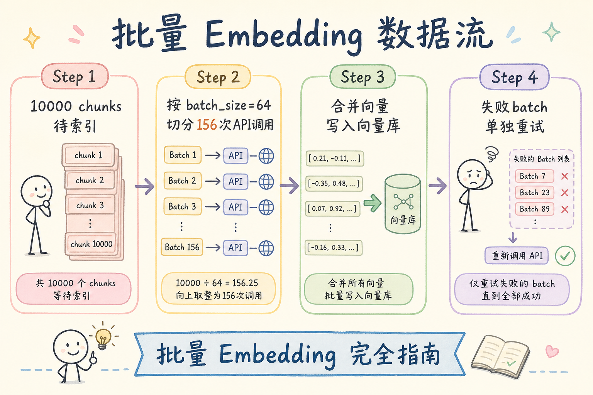
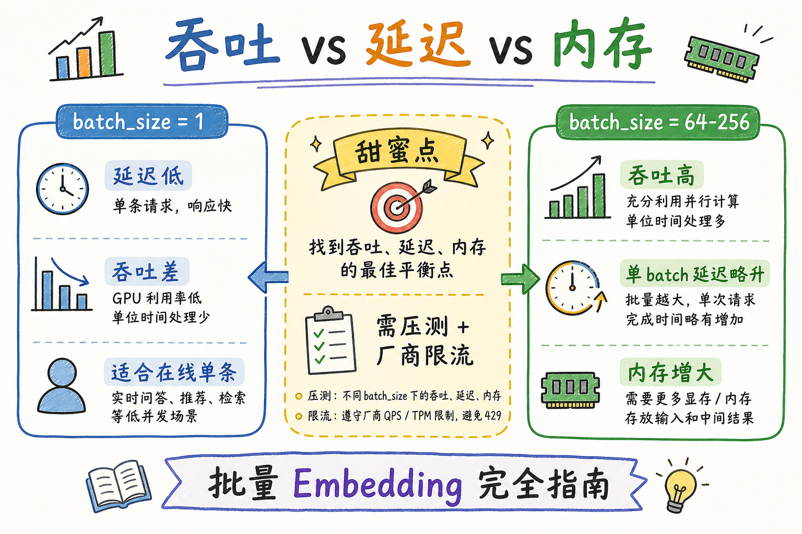
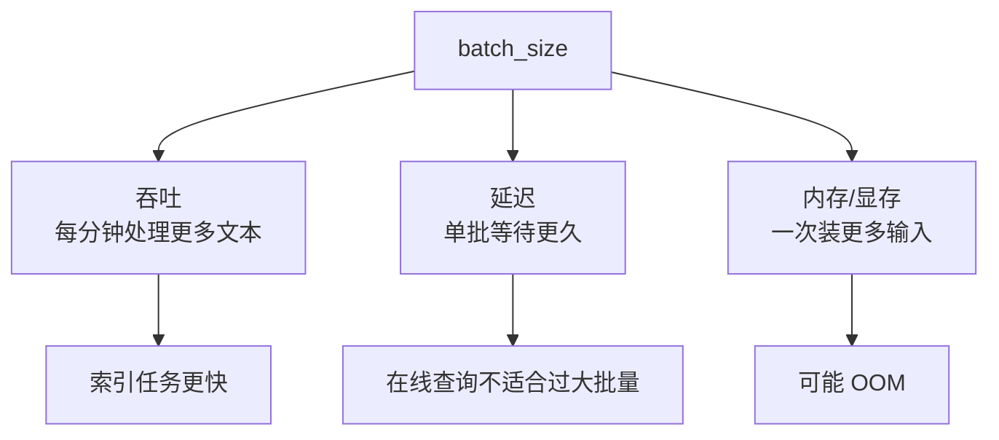
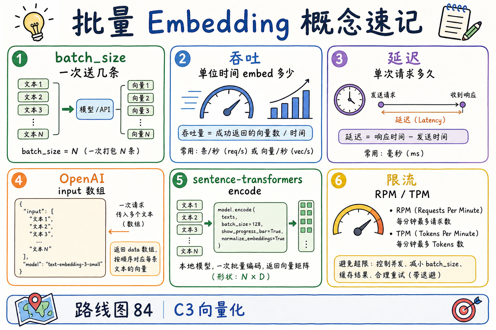
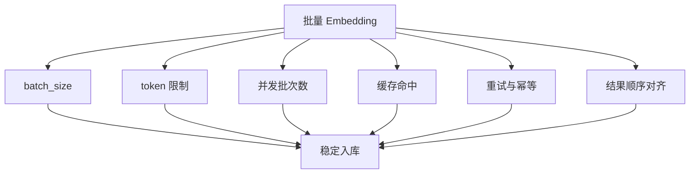

# C3 向量化（七）：批量 Embedding 完全指南

> 索引一万个 chunk，若 **每条一次 API**，不只是慢——还会撞 **RPM/TPM 限流**，账单里全是请求开销。企业 RAG 入库任务几乎必然走 **批量 Embedding**（batching）：一次请求塞多条文本，换吞吐、控内存、配重试。这篇是 [企业 RAG 路线图](ENTERPRISE_RAG_ROADMAP.md) **C3 向量化第七篇**（路线图第 **84** 条），定位 **地基篇**：讲清 **怎么批**、**batch_size 怎么选**、**吞吐 vs 延迟 vs 内存** 三角，以及 **OpenAI API** 与 **sentence-transformers 本地推理** 的可跑示例。前置：[25 Embedding](25.embedding-vector-tutorial.md)、[66 L2 归一化](66.l2-normalization-tutorial.md)（批量后常接矩阵归一化）。

---

## 目录

1. [前言：逐条 embed 是索引任务的敌人](#1-前言逐条-embed-是索引任务的敌人)
2. [本文边界与动手路径](#2-本文边界与动手路径)
3. [批量请求长什么样](#3-批量请求长什么样)
4. [batch_size 与厂商限制](#4-batch_size-与厂商限制)
5. [吞吐、延迟与内存三角](#5-吞吐延迟与内存三角)
6. [失败重试与断点续跑](#6-失败重试与断点续跑)
7. [先错对对：四种典型翻车](#7-先错对对四种典型翻车)
8. [OpenAI 兼容 API 批量示例](#8-openai-兼容-api-批量示例)
9. [sentence-transformers 本地批量](#9-sentence-transformers-本地批量)
10. [综合实战：迷你索引任务](#10-综合实战迷你索引任务)
11. [综合概念地图](#11-综合概念地图)
12. [常见陷阱与 FAQ](#12-常见陷阱与-faq)
13. [总结与系列下一步](#13-总结与系列下一步)

---

## 1. 前言：逐条 embed 是索引任务的敌人

第一次跑全量索引时，很多人这样写：

```python
for chunk in chunks:
    vec = embed_one(chunk.text)
    upsert(chunk.id, vec)
```

十万 chunk 就是十万次 HTTP——**索引要跑一整天**，中途任意网络抖动还要从头来。更糟的是：云厂商按 **token 计费**，但 **请求次数** 还受 **RPM**（每分钟请求数）限制；逐条调用很容易 **没 embed 多少就先 429**。

**批量 Embedding**（embedding batching）：把多条文本 **打包进一次** `embeddings.create` 或本地 `model.encode(batch)`，共享一次网络往返与 GPU 前向。  
通俗说：**一趟班车拉一车人**，而不是每人叫一辆出租车。

批量不改变语义——**同一模型、同一预处理**（含 [66 篇](66.l2-normalization-tutorial.md) L2 归一化）——只改变 **工程效率**。查询路径也常批量化：一晚积累的问题列表、多路召回前的多 query，都可一批 embed。

**读完本文，你应该能做到：**

1. 解释为何索引任务必须批处理，而非逐条 API。  
2. 说出 **batch_size**、**吞吐**、**延迟**、**内存** 四者的拉扯关系。  
3. 根据厂商 **token 上限 / RPM** 估算合理 batch 切分。  
4. 用 OpenAI 兼容 API 写 **可重试的批量循环**。  
5. 用 sentence-transformers 写 **GPU 批量 encode**。  
6. 识别 §7 四种先错对对，避免 OOM 与静默丢条。

### 1.1 C3 主线在路线图中的位置

```text
83  L2 归一化
84  批量 Embedding ← 本篇
85  Embedding 缓存
86  API 重试与限流
```

25 篇 §7 提过「批量、缓存、限流」三角；84～86 把它 **拆开写透**。本篇专注 **批**；缓存见 [68 篇](68.embedding-cache-tutorial.md)；限流细节见路线图 86。

### 1.2 术语双轨速查

| 中文 | English | 一句话 |
|------|---------|--------|
| 批量 | batching | 多条文本一次 embed |
| batch_size | batch size | 每批条数 |
| 吞吐 | throughput | 单位时间处理多少 chunk |
| 延迟 | latency | 单次请求耗时 |
| RPM | requests per minute | 每分钟请求数上限 |
| TPM | tokens per minute | 每分钟 token 上限 |
| OOM | out of memory | 内存/显存用尽 |

---

## 2. 本文边界与动手路径

**档位：地基篇（路线图 84）。**

**本文讲：** 批量数据流、batch_size 选型、吞吐延迟内存、失败重试、OpenAI 与 sentence-transformers 示例、迷你索引任务。  
**本文不讲：** 分布式 Spark 集群、专用 embedding 训练、各云厂商完整配额表（以文档为准）、GPU 多卡并行拓扑。

### 2.1 动手路径表

| 步骤 | 你做什么 | 验收 |
|------|----------|------|
| A | 读 §3～§5，画 batch 切分图 | 能估 10k chunk 要几次请求 |
| B | 读 §8，跟跑 OpenAI 批量（或读代码） | 打印每批条数与耗时 |
| C | 读 §9，了解本地 encode | 知道 `batch_size` 与 OOM |
| D | 完成 §7 先错对对 | 四种错法 |
| E | 跑 §10 迷你索引 | 输出向量矩阵 shape |

**环境：** Python 3.10+；`pip install openai numpy`（API 路径）；可选 `pip install sentence-transformers torch`（本地路径）。

### 2.2 沿用前文

| 概念 | 来自 |
|------|------|
| Embedding 模型与 API | [25 Embedding](25.embedding-vector-tutorial.md) |
| 批量后 L2 归一化 | [66 L2 归一化](66.l2-normalization-tutorial.md) |
| 缓存避免重复 embed | [68 缓存](68.embedding-cache-tutorial.md) |
| Token 计费 | [27 Token 计费](27.token-counting-billing-tutorial.md) |

---

## 3. 批量请求长什么样

读下图：一万 chunk 如何切成多批、合并、写入向量库。




下面这张图展示批量 Embedding 的数据流。读图时重点看：批量不是改变向量含义，而是把多条文本合并成一次请求或一次本地推理。


结论：批量处理的关键是顺序对齐。返回的第 N 条向量必须写回第 N 个 chunk，否则索引会被污染。

对照上图：

1. **输入**：N 条待索引 chunk 文本。  
2. **切分**：按 `batch_size` 切成 ⌈N/batch_size⌉ 个批次。  
3. **调用**：每批一次 API 或一次 `encode`。  
4. **合并**：得到 `(N, dim)` 向量矩阵 → [66 篇](66.l2-normalization-tutorial.md) 行归一化 → upsert。  
5. **失败**：单批失败 **只重试该批**，不拖垮全量。

### 3.1 API 形态（OpenAI 兼容）

`embeddings.create(model=..., input=[text1, text2, ...])`  
`input` 可以是 **字符串数组**——这就是云端批量。返回 `data` 列表与输入 **顺序一致**（以厂商文档为准；不一致是严重 bug，要测）。

### 3.2 本地形态（sentence-transformers）

`model.encode(sentences, batch_size=64, normalize_embeddings=True)`  
内部按 `batch_size` 切 tensor，在 GPU 上 **前向合并**——对你仍是一次 Python 调用。

### 3.3 索引 vs 查询：批量策略不同

| 路径 | 特点 | batch 倾向 |
|------|------|------------|
| **离线索引** | 量大、可过夜 | 偏大 batch，换吞吐 |
| **在线查询** | 要快首字节 | 常 1 条；多 query 场景可小批 |
| **增量更新** | 中等量 | 中等 batch + [68 缓存](68.embedding-cache-tutorial.md) |

### 3.4 与分块的关系

[57～65 分块篇](57.fixed-size-chunking-tutorial.md) 决定 **有多少条** 要 embed。块越小，条数越多，**批量越重要**。Parent-Document（[65 篇](65.parent-document-retriever-tutorial.md)）只 embed child——child 数可能 5× 于单块方案，索引任务更依赖 84 篇。

### 3.5 单条 embed 的隐藏成本清单

除了 API 单价，逐条调用还制造 **看不见的开销**：

| 成本类型 | 逐条 embed | 批量 embed |
|----------|------------|------------|
| HTTP/TLS 握手 | 每条一次 | 每批一次 |
| 客户端 CPU 序列化 | 频繁 | 摊薄 |
| 服务端调度开销 | 高 | 低 |
| 触发 RPM 限流概率 | 高 | 低 |
| 日志与 trace 条数 | 爆炸 | 可控 |

当你向管理层解释「为什么要花两天做批处理改造」时，用这张表比讲「Python for 慢」更有说服力。

### 3.6 查询侧小批量：多 query 场景

有些架构 **一次用户请求** 会触发多个 embed：

- **HyDE** 生成假设文档再 embed（进阶检索）；  
- **多语言并行 query**（中问 + 英问）；  
- **查询扩展** 产出 3～5 条子 query。

此时可用 **小批量** `input=[q1,q2,q3]`，仍是一次 API——比三条单条 **省两次往返**。注意：**总 token 仍累加**，别超单次上限。

---

## 4. batch_size 与厂商限制

**batch_size**（批大小）：单次请求送入模型的 **文本条数**（或等价 token 包）。  
通俗说：一趟班车 **几个座位**——坐太少浪费班次，坐太多车爆胎（超限/OOM）。

### 4.1 三类硬限制

| 限制类型 | 典型约束 | 你怎么应对 |
|----------|----------|------------|
| **单次 input 条数** | 如最多 2048 条/请求（随厂商变） | `batch_size ≤ 上限` |
| **单次 token 总数** | 所有文本 token 之和上限 | 动态 batch：按 token 累加切批 |
| **RPM / TPM** | 分钟级配额 | 加 sleep、指数退避；见路线图 86 |

### 4.2 动态 batch（按 token 切）

固定 `batch_size=100` 简单，但若 chunk 长短悬殊，可能 **单批 token 爆上限**。更稳做法：

```python
def iter_batches_by_token(texts, token_counter, max_tokens_per_batch):
    batch, tok_sum = [], 0
    for t in texts:
        nt = token_counter(t)
        if batch and tok_sum + nt > max_tokens_per_batch:
            yield batch
            batch, tok_sum = [], 0
        batch.append(t)
        tok_sum += nt
    if batch:
        yield batch
```

代码后解读：`token_counter` 可用 tiktoken（[27 篇](27.token-counting-billing-tutorial.md)）；`max_tokens_per_batch` 取厂商文档 **留 10% 余量**。

### 4.3 经验起点（需压测）

| 场景 | batch_size 起点 |
|------|-----------------|
| OpenAI `text-embedding-3-small`，chunk ~256 token | 64～128 条/批（看 token 总和） |
| 本地 bge-small，GPU 8GB | encode `batch_size` 32～128 |
| CPU 推理 | 8～32，看核心数 |
| 在线单 query | 1（延迟优先） |

**没有银弹**：用 **100 条真实 chunk** 压测 P50/P95 延迟与错误率，再定生产值。

### 4.4 并发批次数 vs 单批条数

除「每批多大」，还有 **同时飞几个请求**（并发 workers）。  
`总吞吐 ≈ 单批条数 × 并发批次数 / 单批耗时`——但并发受 **RPM** 限制。常见策略：**中等 batch + 低并发（2～4）**，比「小 batch + 高并发」更稳。

---

## 5. 吞吐、延迟与内存三角

读下图：batch 很小 vs 很大时，三个指标如何拉扯。




下面这张图说明 batch_size 的三角取舍。读图时重点看：更大的批量通常提高吞吐，但会增加单批延迟和内存占用。



结论：离线入库可以追求吞吐，在线查询更关注延迟。不要把同一个 batch_size 套到所有场景。

对照上图：

- **小 batch**：单次快、内存低；总请求次数多 → **吞吐差**、易撞 RPM。  
- **大 batch**：单次慢、内存高；请求次数少 → **吞吐好**；过大则 **超时 / OOM / token 超限**。  
- **甜蜜点**：在 **不 429、不 OOM** 前提下，让 **索引总墙钟时间最短**。

### 5.1 吞吐（throughput）

**吞吐**：单位时间 embed 多少条（如 chunks/秒、tokens/秒）。  
索引任务 KPI 常是 **「今晚能否跑完」**——优先吞吐。

估算：  
`总时间 ≈ (N / batch_size) × (单批延迟 + 间隔)`  
若单批延迟随 batch_size 亚线性增长，**增大 batch 通常划算**，直到触顶。

### 5.2 延迟（latency）

**延迟**：从发起请求到拿到向量的时间。  
在线查询 embed **单条问题** 时，用户感知的是 **这一条** 的延迟——batch=1 或很小。  
别把「索引用大 batch」习惯 **误用到在线路径**。

### 5.3 内存（RAM / VRAM）

本地 `encode` 时，显存占用大致与 `batch_size × seq_len × hidden` 相关。OOM 时 **减半 batch_size** 比瞎调学习率管用。  
云端 API 主要占 **应用侧** 缓冲：合并 `(batch, dim)` float32 矩阵——`batch=256, dim=1536` 约 1.5MB 量级，通常不是瓶颈；**真正大头是等 API**。

### 5.4 压测记录表（建议做一次）

| batch_size | 单批 P95 延迟 | 错误率 | 峰值内存 | chunks/秒 |
|------------|---------------|--------|----------|-----------|
| 16 | | | | |
| 64 | | | | |
| 128 | | | | |

贴进团队 wiki——换模型或换厂商时 **重跑一遍**。

---

## 6. 失败重试与断点续跑

批量让 **单次失败影响面** 变大：一批 64 条全挂。工程上必须：

1. **批级重试**：指数退避 + 抖动；  
2. **批级降级**：仍失败则 **二分 batch** 或逐条定位坏文本；  
3. **断点续跑**：记录 `chunk_id → 已向量化` 状态，或依赖 [68 缓存](68.embedding-cache-tutorial.md)。

### 6.1 坏文本隔离

某条 chunk 含非法字符、超长、全空白，可能 **整批失败**。降级策略：

```text
批失败 → 拆两半各重试 → 仍失败则逐条 → 记录失败 chunk_id 进死信队列
```

别让一条烂数据 **阻塞十万条索引**。

### 6.2 幂等与顺序

upsert 用 **稳定 chunk_id**（[51 篇](51.metadata-chunk-id-tutorial.md)）；重试同一批 **覆盖写** 即可。  
合并向量时 **按 chunk_id 对齐**，不要只信返回顺序——顺序一致是厂商契约，但你的代码应 **zip(id, vec)** 显式绑定。

### 6.3 与缓存协同

批处理中间结果可 **每批写入缓存**（SQLite/Redis，见 68 篇）。进程崩溃后 **跳过已缓存 chunk**，只 embed 缺口——比从头跑省 **钱和时间**。

### 6.4 死信队列（DLQ）最小形态

索引任务应为 **最终失败** 的 chunk 留一条记录：

```python
def log_dead_letter(chunk_id: str, reason: str, path: str = "embed_dlq.jsonl"):
    import json, datetime
    with open(path, "a", encoding="utf-8") as f:
        f.write(json.dumps({
            "chunk_id": chunk_id,
            "reason": reason,
            "ts": datetime.datetime.utcnow().isoformat(),
        }, ensure_ascii=False) + "\n")
```

运营每周扫 DLQ：**修文本 / 截断 / 剔除**，再跑 **增量批**——别让一条 OCR 乱码 **阻塞 99.99% 进度条**。

### 6.5 幂等 upsert 与批顺序

向量库 upsert 应使用 **稳定主键** `chunk_id`（[51 篇](51.metadata-chunk-id-tutorial.md)）。批处理顺序 **不必** 与文档顺序一致，但 **同一 chunk 重复 upsert** 应覆盖而非追加重复行——否则 ANN 索引膨胀、检索出现 **幽灵重复 chunk**。

---

## 7. 先错对对：四种典型翻车
下面这些错误都和“向量空间是否一致”有关。模型、归一化、批处理、缓存和距离度量只要有一处不一致，系统仍然能返回结果，但结果会悄悄变差。

### 7.1 十万次 for 循环单条 API

**错：** `for c in chunks: embed([c])`。  
**对：** 按 batch 切分，`embed(batch_texts)`。  
**后果：** 极慢、429、运维报警。

### 7.2 batch_size 拉满不看 token 上限

**错：** `batch_size=2048` 且每 chunk 2000 token。  
**对：** **按 token 动态切批** 或减小条数。  
**后果：** 400 错误、整批失败。

### 7.3 在线查询也用索引的大 batch 排队

**错：** 用户问题进队列，等凑满 64 条才 embed。  
**对：** 在线 **立即 embed**；批处理留给 **离线任务**。  
**后果：** 首字节延迟爆炸。

### 7.4 批量返回不绑 chunk_id，靠顺序硬猜

**错：** 假设返回顺序永远对，未 zip id。  
**对：** `for item, cid in zip(resp.data, batch_ids): store[cid]=item.embedding`。  
**后果：** 向量张冠李戴——**最难排查的 silent bug**。

### 7.5 团队 Review 清单（批处理 PR）

- [ ] 索引路径 **无逐条 API 热循环**  
- [ ] `batch_size` 或 token 上限 **有文档/配置**  
- [ ] 批失败 **可重试、可降级、可死信**  
- [ ] 向量与 **chunk_id 显式绑定**  
- [ ] 批后 **L2 归一化**（[66 篇](66.l2-normalization-tutorial.md)）  
- [ ] 压测表已更新

---

## 8. OpenAI 兼容 API 批量示例

**演示什么：** 将文本列表按 `batch_size` 切批，调用 `embeddings.create`，合并为矩阵。  
**前置：** `OPENAI_API_KEY`；`pip install openai numpy`  
**预期：** 打印每批耗时与最终 `vectors.shape`。

```python
import os
import time
import numpy as np
from openai import OpenAI

client = OpenAI(api_key=os.environ["OPENAI_API_KEY"])
MODEL = "text-embedding-3-small"
BATCH_SIZE = 64

def l2_normalize_rows(mat, eps=1e-12):
    norms = np.linalg.norm(mat, axis=1, keepdims=True)
    return mat / np.maximum(norms, eps)

def batched_embed(texts, batch_size=BATCH_SIZE):
    all_vecs = []
    for i in range(0, len(texts), batch_size):
        batch = texts[i : i + batch_size]
        t0 = time.perf_counter()
        resp = client.embeddings.create(model=MODEL, input=batch)
        vecs = np.array([d.embedding for d in resp.data], dtype=np.float32)
        vecs = l2_normalize_rows(vecs)
        all_vecs.append(vecs)
        dt = time.perf_counter() - t0
        print(f"batch {i//batch_size + 1}: n={len(batch)} dim={vecs.shape[1]} {dt:.2f}s")
        time.sleep(0.05)  # 略避 RPM；生产用正式退避
    return np.vstack(all_vecs)

texts = [f"示例 chunk 文本编号 {i}：RAG 批量索引演示。" for i in range(200)]
vectors = batched_embed(texts)
print("最终矩阵:", vectors.shape)
```

代码后解读：`input=batch` 即云端批量；`l2_normalize_rows` 承接 [66 篇](66.l2-normalization-tutorial.md)；`sleep` 仅演示——生产换 **指数退避 + 429 处理**（路线图 86）。

### 8.1 兼容网关

`OpenAI(base_url=..., api_key=...)` 同样传 `input` 数组——见 [35 OpenAI 兼容 API](35.openai-compatible-api-tutorial.md)。网关可能有 **更小** batch 上限，以网关文档为准。

### 8.2 异步并发（概念）

`asyncio` + 多批 in flight 可提高吞吐，但受 RPM 约束。地基阶段 **先串行批、跑通再并发**——否则 429 风暴难排障。

### 8.3 带重试的批处理外壳（模板）

下面代码在 §8 外包一层 **批级重试**——生产应替换 `sleep` 为完整退避（路线图 86）：

```python
import time

def embed_batch_with_retry(client, model, batch, max_retries=5):
    delay = 1.0
    for attempt in range(max_retries):
        try:
            return client.embeddings.create(model=model, input=batch)
        except Exception as e:
            if attempt == max_retries - 1:
                raise
            print(f"batch failed attempt={attempt+1} err={e} sleep={delay}s")
            time.sleep(delay)
            delay = min(delay * 2, 60.0)
```

代码后解读：**批失败重试整批**；仍失败则 **拆半**（§6.1）或送 DLQ。不要把「重试 5 次仍失败的批」静默跳过——索引进度会 **永久缺洞**。

### 8.4 tiktoken 动态切批完整片段（示意）

```python
import tiktoken

enc = tiktoken.get_encoding("cl100k_base")  # 按模型换 encoding

def count_tokens(text: str) -> int:
    return len(enc.encode(text))

def iter_token_batches(texts, max_tokens=8000):
  batch, total = [], 0
  for t in texts:
      n = count_tokens(t)
      if n > max_tokens:
          raise ValueError(f"单条超限: {n} tokens")
      if batch and total + n > max_tokens:
          yield batch
          batch, total = [], 0
      batch.append(t)
      total += n
  if batch:
      yield batch
```

与 [27 Token 计费](27.token-counting-billing-tutorial.md) 共用同一计数器，避免 **计费估算与切批逻辑两套标准**。

---

## 9. sentence-transformers 本地批量

**演示什么：** 本地 GPU/CPU 批量 encode，调 `batch_size` 观察速度与 OOM。  
**前置：** `pip install sentence-transformers`  
**预期：** 输出 `(n, dim)` 矩阵；`normalize_embeddings=True` 时范数≈1。

```python
import numpy as np
from sentence_transformers import SentenceTransformer

model = SentenceTransformer("BAAI/bge-small-zh-v1.5")  # 示例；按项目选型
texts = [f"制度条款片段 {i}" for i in range(500)]

embeddings = model.encode(
    texts,
    batch_size=64,
    show_progress_bar=True,
    normalize_embeddings=True,  # 内置 L2；与 66 篇显式 normalize 二选一
    convert_to_numpy=True,
)

print("shape:", embeddings.shape)
print("sample norm:", np.linalg.norm(embeddings[0]))
```

代码后解读：`batch_size` 主要影响 **GPU 利用率**；OOM 则减半。`normalize_embeddings=True` 时 [68 缓存](68.embedding-cache-tutorial.md) 键仍应记录 `normalize_flag=true`。

### 9.1 CPU vs GPU

无 GPU 时 `batch_size` 宜小（8～32），并考虑 **多进程分片** 索引——每进程独立模型实例，注意内存翻倍。

### 9.2 与路线图 78～81 模型选型

BGE/E5/GTE 本地批处理是 **降 API 成本** 主路径；云端 API 批处理是 **省请求次数** 主路径。选型见路线图 78～81；84 篇只教 **怎么批**，不替你做模型评测。

---

## 10. 综合实战：迷你索引任务

把 §8 批处理 + chunk 元数据 + 假向量库 串成 **60 分钟作业**。

**目标：** 200 条假 chunk → 批量 embed → 归一化 → 内存 dict 索引 → 单条查询。

```python
# 接续 §8 的 batched_embed / MODEL / client 思路
from typing import List, Dict

chunks: List[Dict] = [
    {"chunk_id": f"c{i:04d}", "text": f"员工手册第{i}条：差旅住宿标准相关说明。"}
    for i in range(200)
]

texts = [c["text"] for c in chunks]
vecs = batched_embed(texts)

index = {
    c["chunk_id"]: {"text": c["text"], "vec": vecs[i]}
    for i, c in enumerate(chunks)
}

def search(query: str, top_k: int = 3):
    q = client.embeddings.create(model=MODEL, input=[query]).data[0].embedding
    q = l2_normalize_rows(np.array([q], dtype=np.float32))[0]
    scored = [
        (cid, float(np.dot(q, row["vec"])), row["text"])
        for cid, row in index.items()
    ]
    scored.sort(key=lambda x: x[1], reverse=True)
    return scored[:top_k]

for hit in search("一线城市住宿上限"):
    print(hit[0], round(hit[1], 4), hit[2][:40])
```

代码后解读：查询路径 **单条 embed**（延迟优先）；索引路径 **批量**（吞吐优先）。`np.dot` 因已归一化等价余弦（[66 篇](66.l2-normalization-tutorial.md)）。

### 10.1 自检清单

- [ ] 200 条索引 **请求次数 ≈ 200/64** 而非 200  
- [ ] 每条向量有 **chunk_id 绑定**  
- [ ] 查询与库内向量 **同一 MODEL + normalize**  
- [ ] 能口述吞吐 vs 延迟取舍

### 10.2 接到生产还差什么

| 玩具 | 生产 |
|------|------|
| 内存 dict | pgvector / Qdrant |
| 固定 sleep | 正式限流与重试（86） |
| 无缓存 | [68 缓存](68.embedding-cache-tutorial.md) |
| 无队列 | Celery / 云函数批任务 |

### 10.3 索引任务编排：从单机脚本到队列

当 chunk 数从 **两千** 涨到 **两百万**，单机 for 循环批处理仍可能 **跑一周**。这时要把「批」升级成 **任务编排**，但 **单批逻辑不变**：

```text
对象存储 / DB 列出待索引 chunk_id
  → 消息队列按 partition 投递（每消息含最多 K 个 id）
  → Worker 拉取 id → 读文本 → [68 缓存] hit/miss
  → 仅 miss 走 §8 batched_embed
  → L2 归一化 → upsert 向量库 → ack 消息
```

**Worker 数量** 与 **每 worker 并发批数** 仍受 RPM 约束——不是 worker 越多越好。常见起步：**2～4 worker × 每 worker 串行批**，观察 429 率再调。

### 10.4 监控指标（建议接入可观测性）

| 指标 | 含义 | 告警启发 |
|------|------|----------|
| `embed_batch_size` 直方图 | 实际每批条数 | 突然变小可能是 token 切分 bug |
| `embed_batch_latency_p95` | 单批耗时 | 持续升高可能网络或模型侧拥塞 |
| `embed_batches_total` / `embed_chunks_total` | 吞吐核算 | 除一下得平均 batch 利用率 |
| `embed_batch_errors` | 批失败次数 | 单批错误率超阈触发降级 |
| `embed_429_total` | 限流次数 | 应触发退避，而非盲目加并发 |

地基阶段哪怕只打 **日志三行**：`batch_n`、`latency_ms`、`error`——也比完全没有强一个数量级。

### 10.5 与增量更新（49 篇）的批量衔接

[49 增量更新](49.incremental-update-tutorial.md) 每晚可能只有 **几百条变更 chunk**。仍应用小批量 + 缓存：

- 变更列表通常 **短**，固定 `batch_size=64` 可能 **填不满**——没关系，不必为凑批延迟索引；  
- 若变更集中在 **同一文档**，文本可能相似，**缓存 miss 率** 仍低；  
- 大批量全量重建与 **小批量增量** 可共用同一 `batched_embed` 函数，只改 **输入列表来源**。

### 10.6 多语言与长文本对 batch 的影响

[87 中英混合](ENTERPRISE_RAG_ROADMAP.md) 选型前，84 篇要先解决 **token 计数不准** 导致批失败的问题：

- 中文同样字数 **token 数可能更高**——动态切批时 `max_tokens_per_batch` 要 **留更大余量**；  
- 超长 chunk（路线图 61 尺寸权衡）可能 **单条即超上限**——必须在 **分块阶段** 截断，而不是 embed 阶段才发现（见 [61 chunk 尺寸](61.chunk-size-tradeoff-tutorial.md)）。

### 10.7 成本沟通：批处理省的是什么钱

向财务解释时分开三笔账：

| 项目 | 批处理是否减少 |
|------|----------------|
| Token 费用 | **否**（总 token 不变） |
| HTTP 请求次数 / RPM 压力 | **是** |
| 索引墙钟时间 / 人力等待 | **是** |
| 重复文本（未变段落） | **否**，靠 [68 缓存](68.embedding-cache-tutorial.md) |

避免承诺「开批量就省一半 token 费」——那是 **缓存 + 增量** 的功劳。

### 10.8 附录：OpenAI 批处理与实时 API 的区分

OpenAI 还提供 **Batch API**（异步、低价、延迟高）——与本文 **实时 `embeddings.create` 数组 input** 不是同一产品。企业索引若可 **接受 T+24h**，可评估官方 Batch 作业；若需 **当晚索引完成**，走本篇 **实时批量** 路径。读文档时看清 **Batch 文件名** 与 **embedding input 数组** 的区别，别混配置。

---

## 11. 综合概念地图

读下图时，先看「批量 Embedding 概念速记」想表达的主线：它把本节的概念关系压缩成一张可对照的图。




下面这张概念地图总结批量 Embedding 的工程要点。读图时重点看：批量、限流、缓存、失败重试和顺序对齐必须一起设计。



结论：批量化不是“数组传进去”这么简单。可靠的索引任务需要能控速、能重试、能恢复、能验证结果对齐。

对照上图：84 是 C3 **效率** 篇——在 [66 归一化](66.l2-normalization-tutorial.md) 之后，让 **大量向量算得动、算得起**。

### 11.1 速记表

| 概念 | 一句话 |
|------|--------|
| batching | 多条一次 embed |
| batch_size | 每批条数或 token 包 |
| 索引 | 偏大 batch，要吞吐 |
| 查询 | 常小批或单条，要延迟 |
| 限制 | 条数上限、token 上限、RPM |
| 失败 | 批级重试与降级 |
| 绑定 | chunk_id 与向量显式 zip |

### 11.2 三十秒口述稿

> 索引别逐条调 embedding API，按 batch_size 把 chunk 打包进 input 数组，控制每批 token 不超厂商上限，批失败就重试或拆批。离线索引用大 batch 换吞吐，在线查询用小批换延迟。返回向量要和 chunk_id 绑定，批完后做 L2 归一化再入库。

---

## 12. 常见陷阱与 FAQ
最后用 FAQ 检查 Embedding 工程是否稳固。重点看模型版本、向量维度、归一化、批量任务和缓存是否保持一致。

### 12.1 常见陷阱

1. **混淆「并发请求数」与「batch_size」** — 两者都影响吞吐，限制不同。  
2. **长 chunk 不压测就上线大 batch** — token 超限整批挂。  
3. **忽略坏文本** — 一条脏数据阻塞全库索引。  
4. **批处理不做归一化** — 见 66 篇。  
5. **无断点续跑** — 一夜任务失败从头来。

### 12.2 FAQ

**Q：batch_size 越大越好吗？**  
A：直到 **token 上限、OOM、延迟陡增或错误率上升** 为止；用压测表找甜蜜点。

**Q：OpenAI 按 token 计费，批量能省钱吗？**  
A：**token 总数不变**，批量主要省 **时间** 与 **请求次数**（少撞 RPM、少 HTTP 开销）。重复文本要靠 [68 缓存](68.embedding-cache-tutorial.md) 省钱。

**Q：查询时两条问题能一起 embed 吗？**  
A：可以，一次 `input=[q1,q2]`；多路召回、批量问答场景常见。

**Q：Parent-Document 的 child 很多，怎么批？**  
A：与普通 chunk 相同；注意 child 数 **5×** 时总时间线性涨——更要用 84 + 68。

**Q：和路线图 86 限流什么关系？**  
A：84 教你 **一批多大**；86 教你 **撞 429 怎么办**——配合使用。

**Q：下一步读什么？**  
A：[68 Embedding 缓存](68.embedding-cache-tutorial.md)——批处理中间结果与重复文本如何 **不重复花钱**。

**Q：GPU 批处理和 API 批处理能同时开吗？**  
A：可以——例如 **本地模型 embed 未命中缓存的 miss 列表**，云端 API embed 另一路；关键是 **不要对同一 chunk 双写不同模型向量**。

**Q：Parent-Document 只 embed child，批大小要变吗？**  
A：batch_size 按 **条数** 算，不按 parent 数。child 五倍于单块方案时，**总批次数五倍**——更要用 84 + 68，而不是硬扛逐条。

### 12.3 读路径自检（6 题）

1. 为何索引不能 `for` 里单条 API？  
2. `batch_size` 与 `max_tokens_per_batch` 区别？  
3. 在线查询为何通常不凑大批？  
4. 批失败为什么要拆半重试？  
5. 向量与 chunk_id 为什么要 zip 绑定？  
6. 批处理能否省 token 费？

---

## 13. 总结与系列下一步

1. **索引任务必须批处理**——逐条 API 是吞吐与配额杀手。  
2. **batch_size** 受条数上限、**token 上限**、**内存** 三重约束；宜 **动态按 token 切批**。  
3. **吞吐 vs 延迟**：离线索引偏大 batch，在线查询偏小 batch。  
4. **批失败可重试、可拆分、可死信**；向量与 **chunk_id 显式绑定**。  
5. 批后接 [66 L2 归一化](66.l2-normalization-tutorial.md)，再入库。

### 13.1 系列下一步

| 目标 | 阅读 |
|------|------|
| 缓存省重复 embed | [68 Embedding 缓存](68.embedding-cache-tutorial.md) |
| L2 归一化 | [66 L2 归一化](66.l2-normalization-tutorial.md) |
| API 限流重试 | 路线图 **86** |
| 向量从哪来 | [25 Embedding](25.embedding-vector-tutorial.md) |

### 13.2 学习目标自检

- [ ] 能估 N 条 chunk 的请求批次数  
- [ ] 能写 `batched_embed` 循环  
- [ ] 能解释 OOM 时为何减半 batch  
- [ ] 能区分索引与查询的 batch 策略  
- [ ] 能列四条先错对对  

### 13.3 30 分钟动手作业

1. 用 200 条假 chunk 跑 §8，记录 chunks/秒；  
2. 把 `batch_size` 从 16 调到 128，填 §5.4 压测表；  
3. 故意插入一条 **空字符串**，验证 **拆批/死信** 逻辑；  
4. 在 README 写生产 `batch_size` 与 **token 上限** 来源。

### 13.4 给运维的 Runbook 片段

**现象**：索引任务 429 激增。  
**检查**：`embed_429_total`、当前并发 worker 数、单批 token 是否触顶。  
**动作**：并发减半；`batch_size` 减半；指数退避上限调到 120s；确认未与 **在线查询 embed** 抢同一 API 配额桶。  
**恢复**：任务应从 **最后成功批的 chunk_id 检查点** 续跑（配合 68 缓存），而非全量重跑。

**现象**：单批耗时 P95 突然 ×3。  
**检查**：厂商状态页、网络 RTT、是否误把 **巨型 outlier chunk** 塞进固定 batch。  
**动作**：启用 **按 token 动态切批**（§4.2）；把 outlier 送 DLQ（§6.4）。

### 13.5 C3 三篇串联周计划（83→84→85）

| 天 | 任务 | 产出 |
|----|------|------|
| Mon | [66 L2](66.l2-normalization-tutorial.md) §9 + 项目范数体检 | README 三行配置 |
| Tue | 84 篇 §8 批处理 + 压测表 | 定 batch_size |
| Wed | [68 缓存](68.embedding-cache-tutorial.md) §9 SQLite | hit/miss 日志 |
| Thu | 84+68：miss-only 批 + 写缓存 | 200 chunk 端到端 |
| Fri | 路线图 86 限流退避（预习） | 429 演练记录 |

### 13.6 面试追问：「你怎么定 batch_size？」

参考答案骨架：「先用厂商文档上限和 token 上限框住，再用真实 chunk 长度分布做压测表，在 **不 429、不 OOM** 的前提下选 P95 延迟可接受的最大 batch；索引与查询分开——索引偏大 batch 换吞吐，查询单条或小批换延迟；配合缓存只对 miss 批处理。」——体现 **84 + 68 + 86** 体系化，而非拍脑袋数字。

### 13.7 与 66 篇归一化在批输出上的落点

每批 `np.vstack` 之后 **立即** `l2_normalize_rows`（[66 篇](66.l2-normalization-tutorial.md)），再 upsert 或写 [68 缓存](68.embedding-cache-tutorial.md)。不要把「整库 embed 完再统一 normalize」——中途崩溃时 **已写入向量库的半套数据** 模长不一致，排查极痛。批是 **事务边界**：**一批一向量矩阵、一批一 normalize、一批一写库**。

**延伸阅读**：84 与 68 是孪生篇——**批** 解决「一次算多少」，**缓存** 解决「能不能不算」。先把批跑稳，再上缓存，否则你会缓存 **错误批次** 的中间态。下一篇 [68](68.embedding-cache-tutorial.md) 见。

---

> **初学者可能仍困惑的点**  
> - 批量 **不** 改变 embedding 模型输出语义——换 batch 不应改变单向量值（同模型同文本）。  
> - 「并发 8 个请求」≠「batch_size=8」——前者是 **8 辆车同时跑**，后者是 **每车 8 人**。  
> - 本地 GPU 的 `batch_size` 与云端 `input` 数组条数 **概念类似、限制不同**。  
> - 压测要用 **你自己的 chunk 长度分布**——别人的 64 不一定是你的 64。
