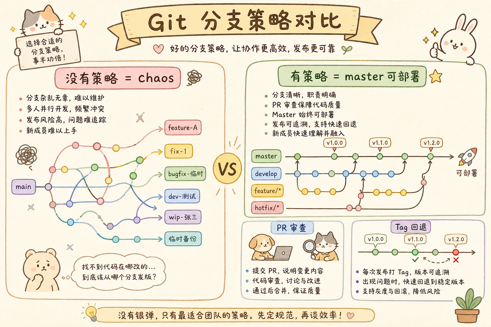
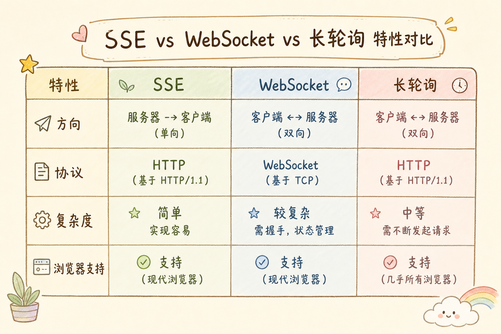
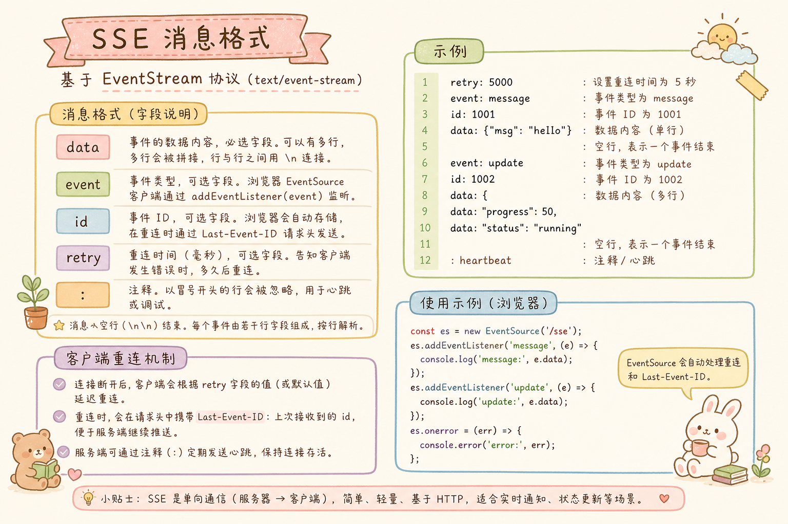
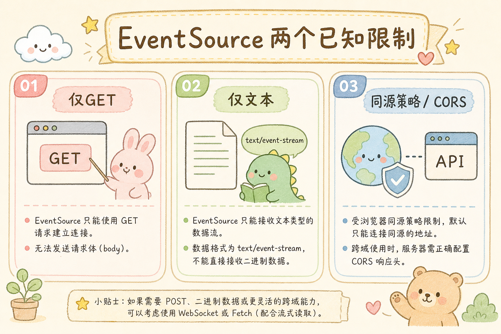
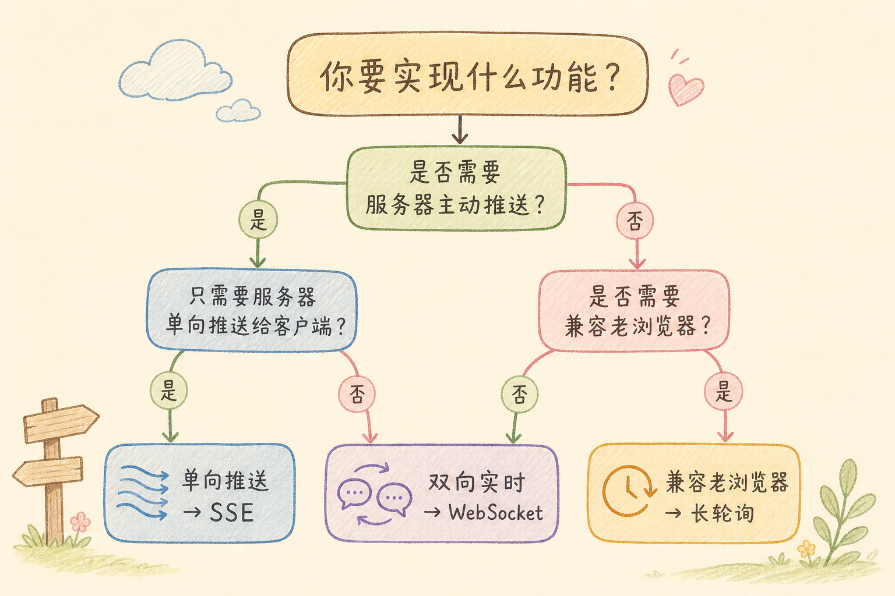
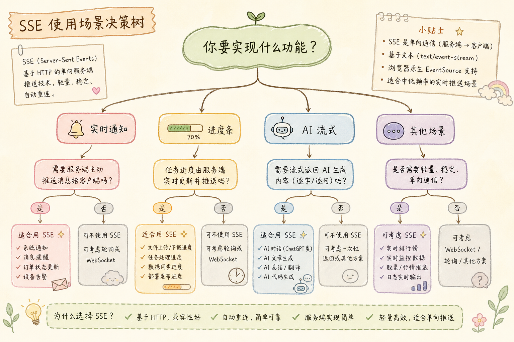
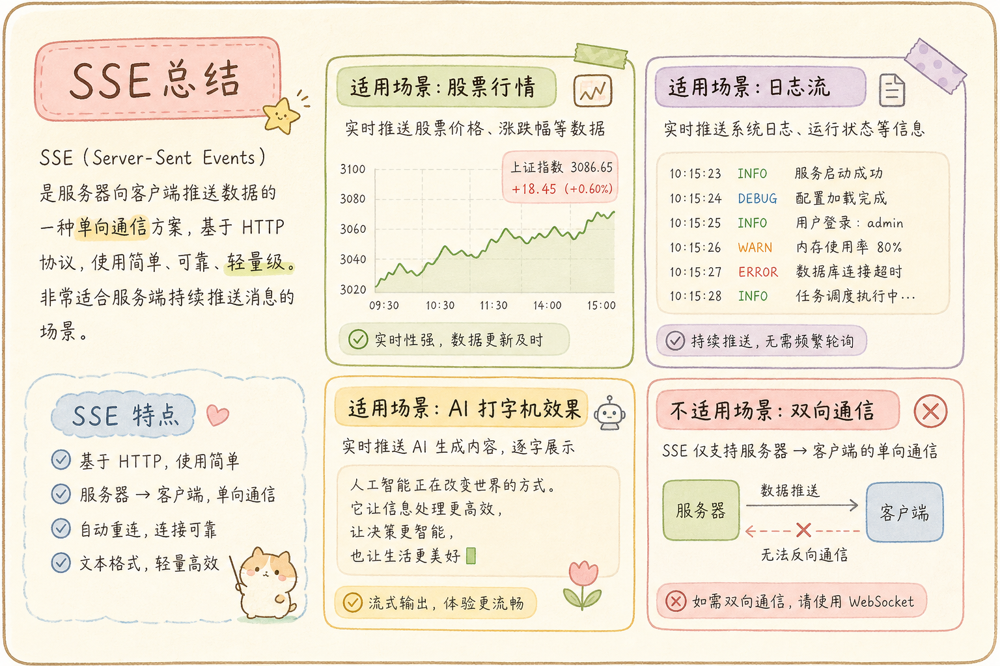

# SSE（Server-Sent Events）完全指南：比 WebSocket 更简单的服务端推送方案

> 你是不是一听到「服务端实时推送」就想到 WebSocket？然后被心跳、重连、Nginx 配置、水平扩展折腾得够呛？其实很多场景根本用不着全双工通信——你只需要服务器单向推送数据。这篇教程从零带你掌握 SSE（Server-Sent Events），一种「HTTP 原生、自动重连、现代浏览器支持良好」的轻量级推送方案。注意：IE 不原生支持 `EventSource`，老旧浏览器需要 polyfill 或降级方案。

---

## 目录

1. [前言：杀鸡为什么总用牛刀](#1-前言杀鸡为什么总用牛刀)
2. [SSE 是什么——来自 HTTP 的「单向广播」](#2-sse-是什么来自-http-的单向广播)
3. [SSE 协议详解](#3-sse-协议详解)
4. [浏览器端 SSE 实战](#4-浏览器端-sse-实战)
5. [Python 服务端 SSE 实战](#5-python-服务端-sse-实战)
6. [实战案例一：AI 对话流式输出](#6-实战案例一ai-对话流式输出)
7. [实战案例二：实时通知系统](#7-实战案例二实时通知系统)
8. [实战案例三：日志实时推送到浏览器](#8-实战案例三日志实时推送到浏览器)
9. [SSE vs WebSocket vs 长轮询——终极对比](#9-sse-vs-websocket-vs-长轮询终极对比)
10. [生产环境部署](#10-生产环境部署)
11. [安全与认证](#11-安全与认证)
12. [最佳实践与避坑指南](#12-最佳实践与避坑指南)
13. [总结](#13-总结)

---

## 1. 前言：杀鸡为什么总用牛刀

2024 年某个周四，同事小王兴冲冲地跑过来说：「我搞定了实时通知——用 WebSocket + Redis Pub/Sub + 心跳 + 自动重连 + Sticky Session！」

你问：「通知是单向还是双向？」

「单向啊，服务器推给前端——就像收到新邮件提醒。」

你沉默了三秒。




**这就是本文的价值——帮你识别什么时候该用 SSE，然后写好它。**

SSE 被严重低估了。几乎每个教程都在讲 WebSocket，但很多场景下 SSE 是更好的选择：

读完本文，你应该能做到三件事：

1. 判断一个实时推送场景是否适合 SSE，而不是默认上 WebSocket。
2. 用浏览器 `EventSource` 和 FastAPI 写出最小可运行的 SSE 示例。
3. 处理生产环境里最常见的重连、代理缓冲、认证和断点续传问题。

本文示例默认使用 Python 3.11+、FastAPI、Uvicorn，以及现代浏览器。运行 Python 示例前先安装依赖：

```bash
pip install fastapi uvicorn pyjwt
```

```
SSE 的典型场景（只要服务器→客户端单向）:
  ✅ AI 对话流式输出 (ChatGPT 那种逐字蹦出来)
  ✅ 实时通知/提醒
  ✅ 股票价格推送
  ✅ 比赛比分直播
  ✅ 日志实时查看
  ✅ CI/CD 构建进度
  ✅ 文件上传/处理进度
  ✅ 监控指标推送
  ✅ 社交媒体动态流 (Twitter/Facebook 时间线)

这些场景都不需要客户端→服务器的实时通道，
用 SSE 比 WebSocket 简单得多。
```

---

## 2. SSE 是什么——来自 HTTP 的「单向广播」

### 2.1 核心概念

**SSE = Server-Sent Events**，直译是「服务器发送的事件」。它并不是新的网络协议，而是**标准 HTTP 协议之上的一种用法**——服务器保持 HTTP 连接不关闭，持续向客户端写入数据。
通俗说：普通 HTTP 像“问一次答一次”，SSE 像“你打开一个水龙头，服务器有新水就一直往外流”。



对照上图：SSE 仍是普通 HTTP 响应，只是 `Content-Type: text/event-stream` 且连接保持打开；数据按 `data:` 行流式写出，浏览器用 `EventSource` 解析。

### 2.2 和普通 HTTP 请求的区别

下面这段代码只演示普通 HTTP 与 SSE 的形状差异，还不是完整可运行服务。你会看到：普通接口直接 `return` 一次性结果，SSE 接口返回 `StreamingResponse`，让连接保持打开。

```python
# 普通 HTTP 请求——响应完了就关闭连接
@app.get("/api/data")
def get_data():
    return {"data": "一次性返回，连接关闭"}

# SSE——连接保持打开，持续写入
@app.get("/events")
async def sse_stream():
    return StreamingResponse(
        event_generator(),
        media_type="text/event-stream",  # 关键: MIME 类型
    )
    # 这个 HTTP 连接不会关闭，一直保持
```

### 2.3 SSE 的六大自然优势



对照上图：自动重连、基于 HTTP、单向够用、实现简单等，都是「只要服务器推」场景下的加分项；若需要双向或二进制，再考虑 WebSocket。

---

## 3. SSE 协议详解

### 3.1 协议格式——比你想的还简单

SSE 的数据格式就是纯文本。每条消息由若干个字段组成，消息之间用空行分隔。

```
SSE 消息的基本格式:

field: value\n
field: value\n
\n              ← 空行表示一条消息结束


六个标准字段:

data:    消息数据（核心字段）
event:   事件类型（不写则触发默认 onmessage）
id:      事件 ID（断点续传用）
retry:   重连间隔（毫秒）
comment: 注释（以 : 开头，不会被客户端处理）
```

### 3.2 逐例详解

**例一：最简单的消息**

```
data: hello\n
\n
```

浏览器收到后触发 `onmessage` 事件，`event.data` = `"hello"`。

> 注意：`data:` 后的数据**不包括**末尾的 `\n`。如果你需要多行数据，每行都以 `data:` 开头。

**例二：多行数据**

```
data: {"user": "张三",\n
data:  "message": "你好",\n
data:  "time": "2024-03-15"}\n
\n
```

浏览器会自动拼接这些 `data:` 行——`event.data` 会得到完整的 JSON 字符串 `{"user": "张三", "message": "你好", "time": "2024-03-15"}`。（中间的 `\n` 在实际传输中就是换行符。）

**例三：JSON 数据（最常用）**

```
data: {"price": 150.25, "symbol": "AAPL"}\n
\n
```

```javascript
es.onmessage = (event) => {
    const data = JSON.parse(event.data);
    console.log(`${data.symbol}: ${data.price}`);
};
```

**例四：命名事件——用 event 字段区分消息类型**

```
event: price_update\n
data: {"symbol": "AAPL", "price": 150.25}\n
\n

event: alert\n
data: {"level": "warning", "message": "价格波动超过 5%"}\n
\n
```

```javascript
// 不同事件用不同的监听器
es.addEventListener('price_update', (event) => {
    const data = JSON.parse(event.data);
    updatePriceChart(data);
});

es.addEventListener('alert', (event) => {
    const data = JSON.parse(event.data);
    showAlert(data);
});

// 没有 event 字段的消息才走 onmessage
es.onmessage = (event) => {
    console.log('默认事件:', event.data);
};
```

**例五：带 ID——实现断点续传**

```
id: 42\n
data: {"price": 150.25}\n
\n

id: 43\n
data: {"price": 150.30}\n
\n

id: 44\n
data: {"price": 150.28}\n
\n
```

当连接断开后重连，浏览器会自动在请求头带上 `Last-Event-ID: 44`，告诉服务器「我从第 44 号事件断开的，请从 45 号开始发」。

**例六：设置重连间隔**

```
retry: 5000\n
\n
```

告诉浏览器：如果连接断开，等 5000 毫秒（5 秒）后再重连。默认是 3 秒。

**例七：注释——不会被客户端收到**

```
: 这是一条注释，用于保活连接\n
: 每 15 秒发一条注释可以防止代理超时\n
\n
```

以冒号开头且后面不是标准字段名——这会被客户端忽略。通常用于「心跳」：在没有业务数据时发送注释，防止代理服务器因长时间无数据而断开连接。

### 3.3 消息的边界

```
一个完整的 SSE 流:

HTTP 响应头
Content-Type: text/event-stream     ← 标识这是 SSE
Cache-Control: no-cache             ← 禁用缓存
Connection: keep-alive              ← 保持连接

消息 1
id: 1
data: hello
                                ← 空行 = 消息结束

消息 2
event: update
data: {"x": 1}
                                ← 空行 = 消息结束

: 心跳注释                       ← 注释被忽略
                                ← 空行

消息 3
id: 2
data: world
                                ← 空行 = 消息结束

... 连接保持打开，持续推送 ...
```

---

## 4. 浏览器端 SSE 实战

### 4.1 EventSource API——只有一个对象

浏览器端的 SSE 客户端就是 `EventSource` 对象。
通俗说：它就是浏览器内置的“SSE 收音机”，你给它一个地址，它会自动连接、收消息、断线后重连。

下面这段代码演示最基本的监听方式。前提是服务端已经提供 `/api/events` 这个 SSE 地址；预期行为是连接成功后打印消息，断线时浏览器自动尝试重连。

```javascript
// 建立连接——和 fetch 一样简单
const es = new EventSource('/api/events');

// 默认事件——event 字段为空的消息
es.onmessage = (event) => {
    console.log('收到:', event.data);      // 消息体
    console.log('事件ID:', event.lastEventId);  // 最后的事件 ID
    console.log('来源:', event.origin);    // 服务器来源
};

// 命名事件——通过 addEventListener 监听
es.addEventListener('price_update', (event) => {
    const data = JSON.parse(event.data);
    updatePrice(data);
});

es.addEventListener('alert', (event) => {
    showNotification(JSON.parse(event.data));
});

// 连接打开
es.onopen = (event) => {
    console.log('SSE 连接已建立');
};

// 连接出错
es.onerror = (event) => {
    console.error('SSE 连接错误');
    // EventSource 会自动重连——你什么都不用做！
    // 检查 readyState:
    // 0 = CONNECTING (正在连)
    // 1 = OPEN (已连接)
    // 2 = CLOSED (已关闭)
    if (es.readyState === EventSource.CLOSED) {
        console.log('连接已关闭，不再重连');
    }
};

// 手动关闭——客户端主动断开
// es.close();
```

### 4.2 带查询参数的连接

下面示例演示如何用查询参数传订阅信息或临时连接凭证。注意：普通长期 JWT 不建议直接放 URL，因为 URL 可能进入浏览器历史、服务器日志或代理日志；生产环境优先使用同源 Cookie，或使用“只用于连接 SSE、有效期很短、一次性”的 token。

```javascript
// 传递一次性、短有效期连接 token
const es = new EventSource(`/api/events?token=${accessToken}`);

// 传递订阅主题
const es = new EventSource(`/api/events?channels=stock.AAPL,stock.GOOGL`);

// 从某个事件 ID 开始（手动指定，而非自动 Last-Event-ID）
// 浏览器不支持直接设置 Last-Event-ID，
// 但可以通过查询参数传给服务器
const es = new EventSource(`/api/events?last_event_id=100`);
```

### 4.3 一个健壮的 SSE 客户端封装

虽然 EventSource 内置了自动重连，但在实际项目中你仍然需要处理一些边界情况。
下面这个封装只做“统一解析、统一回调、统一关闭”，不接管浏览器的重连算法；如果你要自定义退避重试或限制最大重连次数，建议改用 §4.4 的 `fetch-event-source`。

```javascript
class RobustEventSource {
    constructor(url, options = {}) {
        this.url = url;
        this.options = {
            onMessage: options.onMessage || (() => {}),
            onError: options.onError || (() => {}),
            onReconnect: options.onReconnect || (() => {}),
            ...options
        };
        this.reconnectCount = 0;
        this.listeners = new Map();
        this.connect();
    }

    connect() {
        this.es = new EventSource(this.url);

        this.es.onopen = () => {
            console.log('[SSE] 连接成功');
            this.reconnectCount = 0;  // 重置计数器
        };

        this.es.onmessage = (event) => {
            try {
                const data = JSON.parse(event.data);
                this.options.onMessage(data, event);
            } catch {
                this.options.onMessage(event.data, event);
            }
        };

        this.es.onerror = () => {
            if (this.es.readyState === EventSource.CLOSED) {
                console.error('[SSE] 连接关闭');
                this.options.onError(new Error('SSE 连接关闭'));
            } else {
                console.warn('[SSE] 连接错误，自动重连中...');
                this.reconnectCount++;
                this.options.onReconnect(this.reconnectCount);
            }
        };

        // 恢复之前注册的事件监听器
        for (const [eventName, callbacks] of this.listeners) {
            for (const cb of callbacks) {
                this.es.addEventListener(eventName, cb);
            }
        }
    }

    addEventListener(eventName, callback) {
        if (!this.listeners.has(eventName)) {
            this.listeners.set(eventName, []);
        }
        this.listeners.get(eventName).push(callback);
        if (this.es) {
            this.es.addEventListener(eventName, callback);
        }
    }

    close() {
        if (this.es) {
            this.es.close();
        }
    }
}

// 使用
const sse = new RobustEventSource('/api/events?token=xxx', {
    onMessage: (data) => {
        console.log('收到:', data);
    },
    onReconnect: (count) => {
        console.log(`第 ${count} 次重连`);
        if (count > 10) {
            console.error('重连次数过多，放弃');
            sse.close();
        }
    }
});
```

### 4.4 EventSource 的局限性及规避



原生 `EventSource` 最常见的两个限制是：只能发 GET 请求，不能像 `fetch` 那样自由设置自定义请求头。如果你需要 POST、`Authorization` 头或复杂请求体，可以使用 `@microsoft/fetch-event-source`。

**用 fetch-event-source 突破限制：**

```bash
npm install @microsoft/fetch-event-source
```

```javascript
import { fetchEventSource } from '@microsoft/fetch-event-source';

// 支持 POST、自定义 header——和 fetch 一样灵活
fetchEventSource('/api/events', {
    method: 'POST',
    headers: {
        'Content-Type': 'application/json',
        'Authorization': 'Bearer ' + token,
    },
    body: JSON.stringify({
        channels: ['stock.AAPL', 'stock.GOOGL'],
        since: '2024-03-15T00:00:00Z'
    }),
    onmessage(event) {
        if (event.event === 'price_update') {
            const data = JSON.parse(event.data);
            updatePrice(data);
        }
    },
    onerror(err) {
        console.error('SSE 错误:', err);
        // 默认会自动重试; 抛异常则停止
    },
    openWhenHidden: true,  // 页面隐藏时也保持连接
});
```

---

## 5. Python 服务端 SSE 实战

### 5.1 最简单的 SSE 服务端——30 行

下面是完整可运行的 FastAPI 示例。保存为 `simple_sse_server.py` 后执行 `uvicorn simple_sse_server:app --reload`，再用浏览器打开 `http://127.0.0.1:8000/events`，预期每秒看到一条新消息。

```python
# simple_sse_server.py
import asyncio
import json
import time
from fastapi import FastAPI, Request
from fastapi.responses import StreamingResponse

app = FastAPI()

async def event_stream():
    """SSE 事件生成器——最简版本"""
    counter = 0
    while True:
        counter += 1
        # 按 SSE 格式产出数据
        data = json.dumps({
            "time": time.strftime("%H:%M:%S"),
            "count": counter,
            "message": f"第 {counter} 条消息",
        }, ensure_ascii=False)
        yield f"data: {data}\n\n"
        await asyncio.sleep(1)  # 每秒推送一条

@app.get("/events")
async def sse_endpoint():
    return StreamingResponse(
        event_stream(),
        media_type="text/event-stream",
        headers={
            "Cache-Control": "no-cache",
            "Connection": "keep-alive",
            "X-Accel-Buffering": "no",  # 禁用 Nginx 缓冲
        }
    )
```

这是完整的、可以工作的 SSE 服务端。打开浏览器访问 `/events`，你会看到每秒一条消息蹦出来。

### 5.2 带事件类型和 ID

```python
import asyncio
import json
from fastapi import FastAPI
from fastapi.responses import StreamingResponse

app = FastAPI()

async def stock_price_stream():
    """推送股票价格——带事件类型和 ID"""
    event_id = 0
    symbol = "AAPL"
    base_price = 150.0

    while True:
        event_id += 1
        import random
        price = round(base_price + random.uniform(-2, 2), 2)
        change = round(price - base_price, 2)
        change_percent = round(change / base_price * 100, 2)

        # 手动构造 SSE 格式——对每行都有精确控制
        yield f"id: {event_id}\n"
        yield f"event: price_update\n"
        yield f"data: {json.dumps({'symbol': symbol, 'price': price, 'change': change, 'change_percent': change_percent})}\n"
        yield "\n"  # 空行 = 消息结束

        # 每隔 10 条发一个汇总事件
        if event_id % 10 == 0:
            event_id += 1
            yield f"id: {event_id}\n"
            yield f"event: summary\n"
            yield f"data: {json.dumps({'symbol': symbol, 'latest_price': price, 'updates': event_id})}\n"
            yield "\n"

        # 大幅波动时发警报
        if abs(change_percent) > 1.5:
            event_id += 1
            yield f"id: {event_id}\n"
            yield f"event: alert\n"
            yield f"data: {json.dumps({'level': 'warning', 'symbol': symbol, 'change_percent': change_percent})}\n"
            yield "\n"

        base_price = price  # 基于最新价计算下一次波动
        await asyncio.sleep(1)

@app.get("/stocks/stream")
async def stock_sse():
    return StreamingResponse(
        stock_price_stream(),
        media_type="text/event-stream",
        headers={
            "Cache-Control": "no-cache",
            "Connection": "keep-alive",
            "X-Accel-Buffering": "no",
        }
    )
```

### 5.3 一个辅助工具——把生成器写法变得优雅

手写 `yield f"id: ...\n"` 容易出错。封装一个 SSE 发送器：

```python
import json
from typing import AsyncIterator

class SSEResponse:
    """SSE 响应构建器——让你专注数据，不用操心格式"""

    def __init__(self) -> None:
        self._event_id = 0

    async def send(
        self,
        data,
        event: str | None = None,
        event_id: int | None = None,
        retry: int | None = None,
    ) -> str:
        """构造一条 SSE 消息并返回格式化后的字符串"""
        lines = []

        if event_id is not None:
            lines.append(f"id: {event_id}")
        elif self._event_id:
            lines.append(f"id: {self._event_id}")

        if event is not None:
            lines.append(f"event: {event}")

        if retry is not None:
            lines.append(f"retry: {retry}")

        # data 字段支持多行
        text = data if isinstance(data, str) else json.dumps(data, ensure_ascii=False)
        for line in text.split("\n"):
            lines.append(f"data: {line}")

        lines.append("")  # 结尾空行
        return "\n".join(lines) + "\n"

    def next_id(self) -> int:
        """生成自增的事件 ID"""
        self._event_id += 1
        return self._event_id

    @staticmethod
    def heartbeat_comment() -> str:
        """心跳注释——保活"""
        return ": heartbeat\n\n"


# 使用 SSEResponse——清爽多了
sse = SSEResponse()

async def elegant_stream():
    while True:
        msg = await sse.send(
            data={"time": "2024-03-15T10:30:00Z", "value": 42},
            event="update",
            event_id=sse.next_id(),
        )
        yield msg
        await asyncio.sleep(1)
```

### 5.4 支持断点续传（Last-Event-ID）

```python
from fastapi import FastAPI, Request
from fastapi.responses import StreamingResponse
import json

app = FastAPI()

# 模拟消息存储
message_store: list[dict] = []
for i in range(200):
    message_store.append({"id": i + 1, "content": f"消息 {i + 1}"})

async def event_stream_with_resume(request: Request):
    """支持断点续传的 SSE 流"""
    # 读取 Last-Event-ID——客户端重连时自动携带
    last_event_id = request.headers.get("Last-Event-ID")
    # 或从查询参数读取（有些场景需要手动传）
    if not last_event_id:
        last_event_id = request.query_params.get("last_event_id")

    try:
        start_id = int(last_event_id) if last_event_id else 0
    except ValueError:
        start_id = 0
    print(f"[SSE] 从事件 #{start_id + 1} 开始推送 (客户端收到了 #{start_id})")

    # 跳过客户端已经收到的事件
    for msg in message_store:
        if msg["id"] <= start_id:
            continue
        # 补发遗漏的消息
        yield f"id: {msg['id']}\n"
        yield f"data: {json.dumps(msg, ensure_ascii=False)}\n"
        yield "\n"
        await asyncio.sleep(0.01)  # 逐条发送，不要一口气全发出去

    # 补发完成后继续推送新消息
    next_id = max((m["id"] for m in message_store), default=start_id)
    while True:
        next_id += 1
        new_msg = {"id": next_id, "content": f"新消息 {next_id}"}
        message_store.append(new_msg)
        yield f"id: {new_msg['id']}\n"
        yield f"data: {json.dumps(new_msg, ensure_ascii=False)}\n"
        yield "\n"
        await asyncio.sleep(2)

@app.get("/events/resumable")
async def resumable_sse(request: Request):
    return StreamingResponse(
        event_stream_with_resume(request),
        media_type="text/event-stream",
        headers={
            "Cache-Control": "no-cache",
            "Connection": "keep-alive",
            "X-Accel-Buffering": "no",
        }
    )
```

### 5.5 在 SSE 流中使用异步生成器

```python
import asyncio
from typing import AsyncGenerator

async def data_generator() -> AsyncGenerator[str, None]:
    """异步生成器——从消息队列读取数据并转为 SSE 格式"""
    while True:
        # 模拟从 Redis/Kafka 获取数据
        try:
            # wait_for 超时会取消底层等待；真实项目里要确认消息客户端能安全处理取消。
            msg = await asyncio.wait_for(get_next_message(), timeout=30.0)
            yield f"event: update\n"
            yield f"data: {msg}\n"
            yield "\n"
        except asyncio.TimeoutError:
            # 30 秒没数据——发个心跳注释
            yield ": heartbeat\n\n"
```
---

## 6. 实战案例一：AI 对话流式输出

这是 SSE 最经典的应用场景——像 ChatGPT 那样，AI 的回复一个字一个字地「蹦」出来。

### 6.1 服务端

```python
# ai_stream_server.py
import asyncio
import json
from fastapi import FastAPI
from fastapi.responses import StreamingResponse
# 以 OpenAI SDK 为例
from openai import AsyncOpenAI

app = FastAPI()
client = AsyncOpenAI(api_key="sk-...")


async def chat_stream(prompt: str, history: list[dict]):
    """调用 OpenAI 流式 API，逐字产出 SSE"""
    messages = [
        {"role": "system", "content": "你是一个有帮助的助手"},
        *history,
        {"role": "user", "content": prompt},
    ]

    # 发送开始事件——让前端知道对话开始了
    yield f"event: conversation_start\n"
    yield f"data: {json.dumps({'prompt': prompt})}\n\n"

    full_response = ""

    # 调用 OpenAI 流式 API
    stream = await client.chat.completions.create(
        model="gpt-4",
        messages=messages,
        stream=True,
    )

    async for chunk in stream:
        delta = chunk.choices[0].delta

        if delta.content:
            full_response += delta.content
            # 逐字推送——对，就是逐字！
            yield f"event: token\n"
            yield f"data: {json.dumps({'token': delta.content, 'full': full_response})}\n\n"
            # 不加 await asyncio.sleep——有 token 就立刻推

    # 发送结束事件
    yield f"event: conversation_end\n"
    yield f"data: {json.dumps({'full_response': full_response, 'token_count': len(full_response)})}\n\n"


@app.get("/ai/chat")
async def ai_chat(prompt: str):
    """AI 对话流式接口"""
    # 实际项目中 history 应通过 POST body 传入
    return StreamingResponse(
        chat_stream(prompt, history=[]),
        media_type="text/event-stream",
        headers={
            "Cache-Control": "no-cache",
            "Connection": "keep-alive",
            "X-Accel-Buffering": "no",
        }
    )


# 启动: uvicorn ai_stream_server:app --reload
```

### 6.2 前端

```html
<!DOCTYPE html>
<html lang="zh">
<head>
    <meta charset="UTF-8">
    <title>AI 对话——流式输出</title>
    <style>
        * { margin: 0; padding: 0; box-sizing: border-box; }
        body { font-family: system-ui; max-width: 800px; margin: 20px auto;
               padding: 20px; background: #f5f5f5; }
        .chat-box { background: white; border-radius: 12px; padding: 20px;
                    min-height: 300px; max-height: 500px; overflow-y: auto;
                    box-shadow: 0 2px 8px rgba(0,0,0,.1); margin-bottom: 16px; }
        .message { margin-bottom: 12px; padding: 10px 14px; border-radius: 10px;
                   max-width: 80%; word-break: break-word; }
        .message.user { background: #4f46e5; color: white; margin-left: auto; }
        .message.ai { background: #f0f0f0; }
        .token-animation { display: inline; }
        .cursor { display: inline-block; width: 8px; height: 16px;
                  background: #4f46e5; animation: blink 0.8s infinite;
                  vertical-align: text-bottom; margin-left: 2px; }
        @keyframes blink { 0%, 50% { opacity: 1; } 51%, 100% { opacity: 0; } }
        .input-area { display: flex; gap: 8px; }
        .input-area textarea { flex: 1; padding: 10px; border: 1px solid #ddd;
                               border-radius: 8px; font-size: 14px; resize: none;
                               outline: none; font-family: inherit; }
        .input-area textarea:focus { border-color: #4f46e5; }
        .input-area button { padding: 10px 24px; background: #4f46e5; color: white;
                             border: none; border-radius: 8px; cursor: pointer;
                             font-size: 14px; }
        .input-area button:disabled { background: #ccc; cursor: not-allowed; }
    </style>
</head>
<body>
    <div class="chat-box" id="chatBox"></div>
    <div class="input-area">
        <textarea id="promptInput" rows="2" placeholder="输入你的问题..."
                  autocomplete="off"></textarea>
        <button id="sendButton">发送</button>
    </div>

    <script>
        const chatBox = document.getElementById('chatBox');
        const promptInput = document.getElementById('promptInput');
        const sendButton = document.getElementById('sendButton');
        let currentAIMessage = null;
        let streaming = false;

        function addMessage(role, content) {
            const div = document.createElement('div');
            div.className = `message ${role}`;
            div.textContent = content;
            chatBox.appendChild(div);
            chatBox.scrollTop = chatBox.scrollHeight;
            return div;
        }

        async function sendMessage() {
            const prompt = promptInput.value.trim();
            if (!prompt || streaming) return;

            streaming = true;
            sendButton.disabled = true;

            // 显示用户消息
            addMessage('user', prompt);
            promptInput.value = '';

            // 创建 AI 消息容器
            currentAIMessage = addMessage('ai', '');
            currentAIMessage.innerHTML = '<span class="cursor"></span>';

            // 建立 SSE 连接——注意 URL 编码
            const encodedPrompt = encodeURIComponent(prompt);
            const es = new EventSource(`/ai/chat?prompt=${encodedPrompt}`);

            es.addEventListener('conversation_start', (event) => {
                console.log('对话开始:', JSON.parse(event.data));
            });

            es.addEventListener('token', (event) => {
                const { token, full } = JSON.parse(event.data);
                // 逐字追加——用户看到 ChatGPT 同款的逐字效果
                currentAIMessage.innerHTML =
                    escapeHTML(full) + '<span class="cursor"></span>';
                chatBox.scrollTop = chatBox.scrollHeight;
            });

            es.addEventListener('conversation_end', (event) => {
                const { full_response } = JSON.parse(event.data);
                // 去掉光标
                currentAIMessage.innerHTML = escapeHTML(full_response);
                es.close();
                streaming = false;
                sendButton.disabled = false;
                promptInput.focus();
            });

            es.onerror = () => {
                if (es.readyState === EventSource.CLOSED) {
                    currentAIMessage.textContent += '\n[连接中断]';
                    streaming = false;
                    sendButton.disabled = false;
                }
            };
        }

        function escapeHTML(text) {
            const div = document.createElement('div');
            div.textContent = text;
            return div.innerHTML;
        }

        sendButton.addEventListener('click', sendMessage);
        promptInput.addEventListener('keydown', (e) => {
            if (e.key === 'Enter' && !e.shiftKey) {
                e.preventDefault();
                sendMessage();
            }
        });
    </script>
</body>
</html>
```

---

## 7. 实战案例二：实时通知系统

### 7.1 服务端

```python
# notification_server.py
import asyncio
import json
from fastapi import FastAPI, Request, HTTPException, Depends
from fastapi.responses import StreamingResponse
from pydantic import BaseModel
from datetime import datetime
import hashlib

app = FastAPI()

# ===== 通知管理器 =====
class NotificationManager:
    """管理用户的通知推送"""
    def __init__(self):
        # user_id → asyncio.Queue
        self._subscribers: dict[str, asyncio.Queue] = {}

    def subscribe(self, user_id: str) -> asyncio.Queue:
        """用户订阅 SSE 流"""
        queue = asyncio.Queue(maxsize=100)  # 限制缓冲——背压
        self._subscribers[user_id] = queue
        return queue

    def unsubscribe(self, user_id: str):
        """用户断开连接"""
        self._subscribers.pop(user_id, None)

    async def send_notification(self, user_id: str, notification: dict):
        """向指定用户推送通知"""
        queue = self._subscribers.get(user_id)
        if queue:
            try:
                # 用 put_nowait 不阻塞
                queue.put_nowait(notification)
            except asyncio.QueueFull:
                print(f"[警告] 用户 {user_id} 的通知队列已满——可能客户端处理太慢")

    async def broadcast(self, notification: dict, exclude: set[str] = None):
        """向所有在线用户广播"""
        exclude = exclude or set()
        for user_id in list(self._subscribers.keys()):
            if user_id not in exclude:
                await self.send_notification(user_id, notification)


manager = NotificationManager()


# ===== 通知模型 =====
class NotificationCreate(BaseModel):
    user_id: str
    title: str
    content: str
    type: str = "info"  # info / warning / success / error
    link: str | None = None


# ===== 触发通知的 API =====
@app.post("/api/notifications")
async def create_notification(notif: NotificationCreate):
    """其他系统通过这个接口发送通知"""
    event = {
        "id": hashlib.md5(f"{notif.user_id}{datetime.now().isoformat()}".encode()).hexdigest()[:12],
        "title": notif.title,
        "content": notif.content,
        "type": notif.type,
        "link": notif.link,
        "created_at": datetime.now().isoformat(),
    }
    await manager.send_notification(notif.user_id, event)
    return {"success": True, "notification_id": event["id"]}


# ===== SSE 端点 =====
async def get_current_user_id(request: Request) -> str:
    """从查询参数获取 user_id（实际项目用 JWT）"""
    user_id = request.query_params.get("user_id")
    if not user_id:
        raise HTTPException(status_code=401, detail="缺少 user_id")
    return user_id


@app.get("/api/notifications/stream")
async def notification_stream(request: Request):
    user_id = await get_current_user_id(request)
    queue = manager.subscribe(user_id)

    async def event_generator():
        try:
            # 先发一条欢迎消息
            yield f"event: connected\n"
            yield f"data: {json.dumps({'message': '通知服务已连接', 'user_id': user_id}, ensure_ascii=False)}\n\n"

            # 检查是否有离线期间错过的通知（略——实际项目从数据库查）

            while True:
                try:
                    # 等待通知——60 秒超时用于发心跳
                    notification = await asyncio.wait_for(queue.get(), timeout=60.0)

                    yield f"id: {notification['id']}\n"
                    yield f"event: notification\n"
                    yield f"data: {json.dumps(notification, ensure_ascii=False)}\n\n"

                except asyncio.TimeoutError:
                    # 没有新通知——发心跳注释
                    yield ": heartbeat\n\n"

        except asyncio.CancelledError:
            pass
        finally:
            manager.unsubscribe(user_id)

    return StreamingResponse(
        event_generator(),
        media_type="text/event-stream",
        headers={
            "Cache-Control": "no-cache",
            "Connection": "keep-alive",
            "X-Accel-Buffering": "no",
        }
    )
```

### 7.2 前端

```javascript
// 连接通知流
const userId = getCurrentUserId();  // 从你的认证系统获取
const es = new EventSource(`/api/notifications/stream?user_id=${userId}`);

es.addEventListener('notification', (event) => {
    const notif = JSON.parse(event.data);
    // 显示浏览器通知
    if (Notification.permission === 'granted') {
        new Notification(notif.title, {
            body: notif.content,
            icon: '/icon.png'
        });
    }
    // 更新通知计数
    updateNotificationBadge();
    // 添加到通知列表
    addNotificationToList(notif);
});

es.addEventListener('connected', (event) => {
    console.log('通知服务已连接:', JSON.parse(event.data));
});
```

---

## 8. 实战案例三：日志实时推送到浏览器

### 8.1 服务端

```python
# log_stream_server.py
import asyncio
import json
import time
from pathlib import Path
from fastapi import FastAPI
from fastapi.responses import StreamingResponse

app = FastAPI()

async def tail_log_file(log_path: str):
    """模拟 tail -f 效果——实时推送日志内容"""
    # 实际项目中可以用 aiofiles 或 watchfiles
    with open(log_path, "r", encoding="utf-8") as f:
        # 跳到文件末尾
        f.seek(0, 2)

        line_num = 0
        while True:
            line = f.readline()
            if line:
                line_num += 1
                yield f"id: {line_num}\n"
                yield f"event: log_line\n"
                yield f"data: {json.dumps({'line': line.rstrip(), 'line_num': line_num, 'timestamp': time.time()}, ensure_ascii=False)}\n\n"
            else:
                # 没有新行——短暂等待
                await asyncio.sleep(0.1)

                # 每 15 秒发心跳注释
                if line_num > 0 and line_num % 150 == 0:
                    yield ": heartbeat\n\n"


@app.get("/logs/stream")
async def log_stream(log_path: str = "/var/log/app.log"):
    """实时日志流"""
    if not Path(log_path).exists():
        # 模拟日志——演示用
        async def mock_log():
            for i in range(1000):
                yield f"id: {i+1}\n"
                yield f"event: log_line\n"
                yield f"data: {json.dumps({'line': f'[2024-03-15 10:30:{i%60:02d}] INFO Example log message #{i+1}', 'line_num': i+1, 'level': 'INFO'})}\n\n"
                await asyncio.sleep(0.5)
        return StreamingResponse(mock_log(), media_type="text/event-stream",
                                 headers={"Cache-Control": "no-cache"})

    return StreamingResponse(
        tail_log_file(log_path),
        media_type="text/event-stream",
        headers={"Cache-Control": "no-cache", "X-Accel-Buffering": "no"}
    )
```

---

## 9. SSE vs WebSocket vs 长轮询——终极对比

### 9.1 完整功能矩阵

从**通信方向、实现复杂度、自动重连**等维度对比三种方案。



对照上图：若只需服务器→客户端单向推送，SSE 一列往往已打勾；WebSocket 适合聊天室、游戏等双向场景。

### 9.2 选择决策树

按「要不要双向」「要不要二进制」依次决策。



**单向推送 → SSE**；**双向 + 高频交互 → WebSocket**；**legacy 原型 → 长轮询**。

### 9.3 SSE + HTTP 请求 = 伪全双工

很多场景看起来需要全双工，但实际上可以分解为：

```
客户端→服务器: 用普通 HTTP POST/PUT 请求
服务器→客户端: 用 SSE

例子: AI 对话
  用户输入 "你好" → POST /api/chat (普通 HTTP 请求)
  AI 逐字回复 → GET /api/chat/stream (SSE)

  这不是「全双工」，但完美满足需求！
  代码简洁，不需要 WebSocket 的任何复杂度
```

---

## 10. 生产环境部署

### 10.1 Nginx 配置

```nginx
server {
    listen 443 ssl http2;
    server_name api.example.com;

    # SSL 证书...
    ssl_certificate     /etc/nginx/ssl/fullchain.pem;
    ssl_certificate_key /etc/nginx/ssl/privkey.pem;

    location /events/ {
        proxy_pass http://backend:8000;

        # === SSE 关键配置 ===
        proxy_http_version 1.1;
        proxy_set_header Connection "";       # 保持连接
        proxy_set_header Host $host;
        proxy_set_header X-Real-IP $remote_addr;
        proxy_set_header X-Forwarded-For $proxy_add_x_forwarded_for;

        # === 超时——SSE 是长连接 ===
        proxy_read_timeout 86400s;           # 24 小时，根据需求调整
        proxy_send_timeout 86400s;

        # === 禁用缓冲——实时推送必须关闭 ===
        proxy_buffering off;

        # === 禁用 Nginx 对响应的额外缓冲 ===
        proxy_cache off;

        # === 传递 Last-Event-ID 头（断点续传） ===
        proxy_pass_request_headers on;

        # === gzip 对 SSE 无意义——关闭 ===
        gzip off;
    }

    # 普通的 API 路由
    location /api/ {
        proxy_pass http://backend:8000;
        proxy_set_header Host $host;
        proxy_set_header X-Real-IP $remote_addr;
        proxy_set_header X-Forwarded-For $proxy_add_x_forwarded_for;
    }
}
```

### 10.2 HTTP/2 的天然优势

SSE 在 HTTP/1.1 下有一个尴尬的限制：**浏览器对同一域名的并发 HTTP/1.1 连接数上限是 6 个**。如果一个用户打开了 7 个 SSE 流，第 7 个会排队等待。

**HTTP/2 完美解决了这个问题**——它天生支持多路复用，一个连接上可以有无限多个流。这也是为什么 SSE 的创建者之一在 IETF 发言：「SSE + HTTP/2 是比 WebSocket 更优雅的方案。」


---

## 11. 安全与认证

### 11.1 认证方式

```python
# 方式一：查询参数（EventSource 最方便的方式，但只建议放短期、一次性连接 token）
# 前端: const es = new EventSource(`/events?token=${jwt}`)
@app.get("/events")
async def sse_stream(token: str = ""):
    try:
        payload = jwt.decode(token, SECRET_KEY, algorithms=["HS256"])
        user_id = payload["sub"]
    except jwt.InvalidTokenError:
        raise HTTPException(status_code=401, detail="无效的 token")
    # ... 推送流


# 方式二：Cookie（同源自动携带）
# 前端: const es = new EventSource('/events')  # 自动带 cookie
@app.get("/events")
async def sse_stream(request: Request):
    session = request.cookies.get("session_id")
    if not valid_session(session):
        raise HTTPException(status_code=401)
    # ...


# 方式三：先 POST 获取一次性 token，再用 token 连接 SSE
# 适用于需要传复杂订阅参数的场景，也是生产环境更推荐的 URL token 用法
@app.post("/events/subscribe")
async def subscribe(subscription: SubscriptionRequest):
    """客户端先 POST 订阅条件"""
    channel_id = create_channel(subscription)
    # 生成一次性、短有效期的连接 token
    connect_token = generate_connect_token(channel_id, ttl=60)
    return {"connect_token": connect_token, "url": f"/events/{channel_id}?token={connect_token}"}

# 前端:
# const { url } = await fetch('/events/subscribe', {method:'POST', body:...}).then(r=>r.json())
# const es = new EventSource(url)
```

### 11.2 安全实践

```python
# 完整的生产级安全中间件
from fastapi import FastAPI, Request, HTTPException
from fastapi.responses import StreamingResponse
import time
from collections import defaultdict
import hashlib

app = FastAPI()

# 限流器——每个用户最多 3 个 SSE 连接
active_connections: dict[str, set[str]] = defaultdict(set)
MAX_CONNECTIONS_PER_USER = 3

def check_connection_limit(user_id: str) -> bool:
    """检查用户是否超过连接数限制"""
    # 清理因异常退出而残留的旧连接记录（简化逻辑）
    return len(active_connections[user_id]) < MAX_CONNECTIONS_PER_USER

async def sse_endpoint(request: Request):
    # 1. 验证 token
    token = request.query_params.get("token", "")
    if not token:
        raise HTTPException(status_code=401, detail="缺少认证 token")
    try:
        payload = jwt.decode(token, SECRET_KEY, algorithms=["HS256"])
        user_id = payload["sub"]
    except jwt.InvalidTokenError:
        raise HTTPException(status_code=401, detail="token 无效")

    # 2. 检查连接数限制
    if not check_connection_limit(user_id):
        raise HTTPException(status_code=429, detail="连接数已达上限")

    # 3. 检查 Origin（防止跨站劫持）
    origin = request.headers.get("origin", "")
    if origin and origin not in ALLOWED_ORIGINS:
        raise HTTPException(status_code=403, detail="不允许的来源")

    # 4. 生成连接 ID（用于日志追踪）
    connection_id = hashlib.md5(f"{user_id}:{time.time()}".encode()).hexdigest()[:8]
    active_connections[user_id].add(connection_id)

    try:
        async def event_gen():
            try:
                while True:
                    data = await get_data_for_user(user_id)
                    yield f"data: {data}\n\n"
            except asyncio.CancelledError:
                pass
            finally:
                active_connections[user_id].discard(connection_id)

        return StreamingResponse(
            event_gen(),
            media_type="text/event-stream",
            headers={
                "Cache-Control": "no-cache",
                "Connection": "keep-alive",
                "X-Accel-Buffering": "no",
                # 安全头
                "X-Content-Type-Options": "nosniff",
            }
        )
    except Exception:
        active_connections[user_id].discard(connection_id)
        raise
```

---

## 12. 最佳实践与避坑指南

### 12.1 SSE 七条黄金法则

**法则一：启用 HTTP/2——避免连接数上限问题**

```nginx
# Nginx 配置
listen 443 ssl http2;   # 必须加 http2
```

**法则二：不要把长期敏感凭证放在 SSE URL 中**

```javascript
// ❌ URL 中暴露敏感信息
const es = new EventSource(`/events?password=secret&api_key=sk-xxx`);
// URL 会出现在服务器日志、浏览器历史中

// ✅ 可以接受: 使用短时效的一次性连接 token
const es = new EventSource(`/events?token=eyJ...`);  // JWT，5分钟过期

// ✅ 更常见: 同源场景使用 HttpOnly Cookie，由浏览器自动携带
const es = new EventSource('/events');
```

**法则三：服务端记得发心跳**

```python
# 每 15-30 秒发一条注释，防止代理/防火墙断开空闲连接
yield ": heartbeat\n\n"
```

**法则四：利用 `event` 字段区分消息类型——而不是全堆在 `data` 里**

```python
# ❌ 所有消息都走一个通道，前端自己解析
yield f"data: {json.dumps({'type': 'price', 'value': 100})}\n\n"
yield f"data: {json.dumps({'type': 'news', 'title': '...'})}\n\n"

# ✅ 用 event 字段——前端不同事件用不同监听器
yield f"event: price\n"
yield f"data: {json.dumps({'value': 100})}\n\n"

yield f"event: news\n"
yield f"data: {json.dumps({'title': '...'})}\n\n"
```

**法则五：利用 `id` 字段实现断点续传——不要每次都从头推**

```python
# 永远带 ID——这是 SSE 最被低估的特性
yield f"id: {event_id}\n"
yield f"data: {json.dumps(msg)}\n\n"
```

**法则六：连接建立时先发历史数据补发，再推实时数据**

```python
# 客户端重连后，先补发离线期间的消息
for missed in get_messages_since(last_event_id):
    yield f"id: {missed.id}\n"
    yield f"data: {missed.data}\n\n"

# 然后进入实时推送
while True:
    msg = await wait_for_new_message()
    yield f"id: {msg.id}\n"
    yield f"data: {msg.data}\n\n"
```

**法则七：控制消息速率——客户端可能处理不过来**

```python
# 如果数据产生速度超过推送速度，做采样/聚合
# 不要无脑 100 条/秒地推送给浏览器

# 股票行情：变化太快时做节流（每秒最多推 1 次）
last_sent = 0

async def throttled_stream():
    global last_sent
    while True:
        price = get_latest_price()
        now = time.time()
        if now - last_sent >= 1.0:  # 至少隔 1 秒
            yield f"data: {json.dumps({'price': price})}\n\n"
            last_sent = now
        await asyncio.sleep(0.1)
```

### 12.2 常见踩坑实录

**坑一：浏览器 EventSource 连接失败时错误信息为空**

```javascript
// EventSource 的 onerror 事件不携带任何有用信息
es.onerror = (event) => {
    // event 里没有 status code、没有 response body
    // 你只能靠猜（是 401？是 500？是网络断了？）
};

// 解决方案：开发阶段先 curl 确认服务端没问题
// curl -N http://localhost:8000/events
// 或者用 fetch 先发一次请求，看状态码
```

**坑二：Nginx 缓冲导致消息 30 秒才到达**

```nginx
# 这是最高发的 SSE 部署问题！
# 症状：消息攒了一堆，一口气到达前端

# 根本原因：proxy_buffering on (Nginx 默认开启)
# 解决：
proxy_buffering off;

# 另外，如果反向代理前还有 CDN/负载均衡器，
# 它们可能也在缓冲——需要额外配置
```

**坑三：忘记处理客户端断开**

```python
# ❌ 客户端断开后，生成器还在跑——资源泄漏
async def stream():
    while True:
        yield f"data: {get_data()}\n\n"
        await asyncio.sleep(1)

# ✅ 检测客户端断开
async def stream(request: Request):
    while True:
        if await request.is_disconnected():
            break  # 客户端走了——停止生成
        yield f"data: {get_data()}\n\n"
        await asyncio.sleep(1)
```

**坑四：SSE 流中抛出异常后连接静默死亡**

```python
# ❌ 生成器里抛了异常 → 连接断开 → 客户端只知道「error」
async def stream():
    while True:
        data = fetch_data()  # 一旦抛异常，流就断了
        yield f"data: {data}\n\n"

# ✅ 捕获异常，发送错误事件给客户端
async def stream():
    while True:
        try:
            data = fetch_data()
            yield f"data: {data}\n\n"
        except Exception as e:
            # 把错误作为 SSE 事件发给前端——而非直接断开
            yield f"event: error\n"
            yield f"data: {json.dumps({'message': str(e)})}\n\n"
            await asyncio.sleep(5)  # 等一下再试
```

**坑五：用 `asyncio.sleep(0)` 做「不阻塞」——实际没什么用**

```python
# ❌ sleep(0) 只在有其他协程在等待时才出让控制权
# 对 SSE 性能没有实际提升

# ✅ 如果数据来得快，推就完了——不要人为加 delay
# 如果数据来得慢，就自然地 await
```

---

## 13. 总结

### 核心认知速记



对照上图：SSE = HTTP 长连接 + 文本事件流；单向够用就别上 WebSocket；`EventSource` 自带重连；注意代理缓冲与 HTTP/2 多路复用。

### 选型一句话

> **只需要服务器推送 → SSE（代码少 80%，坑少 90%）。需要双向实时通信 → WebSocket。除此之外，不要因为 WebSocket 听起来更「高级」就选它——简单的方案才是好方案。**

### 推荐技术栈

```
最简单的方案:    FastAPI StreamingResponse + 原生 EventSource
                → 10 行代码搞定

更灵活的前端:    @microsoft/fetch-event-source
                → 支持 POST、自定义 header

大规模部署:      FastAPI + Redis Pub/Sub + Nginx (http2) 
                + EventSource

已有 WebSocket:  先审视需求——如果只有 S→C 的推送需求，
                考虑用 SSE 替换 WebSocket
                省钱、省心、省代码
```

---

> **延伸阅读：**
> - [MDN: Server-Sent Events](https://developer.mozilla.org/zh-CN/docs/Web/API/Server-sent_events)——浏览器端最佳文档
> - [HTML Standard: Server-sent events](https://html.spec.whatwg.org/multipage/server-sent-events.html)——SSE 的 W3C 规范
> - [SSE 协议 RFC（草案）](https://datatracker.ietf.org/doc/html/draft-ietf-httpapi-sse-00)——正在标准化的 SSE 协议规范
> - [@microsoft/fetch-event-source](https://github.com/Azure/fetch-event-source)——突破 EventSource 限制的库
> - [FastAPI StreamingResponse 文档](https://fastapi.tiangolo.com/advanced/custom-response/#streamingresponse)
> - [Nginx: ngx_http_proxy_module](https://nginx.org/en/docs/http/ngx_http_proxy_module.html)——`proxy_buffering` 等关键配置
> - [Why SSE is better than WebSocket for most use cases](https://www.smashingmagazine.com/2018/02/sse-websockets-data-flow-http2/)——来自 Smashing Magazine 的经典文章
