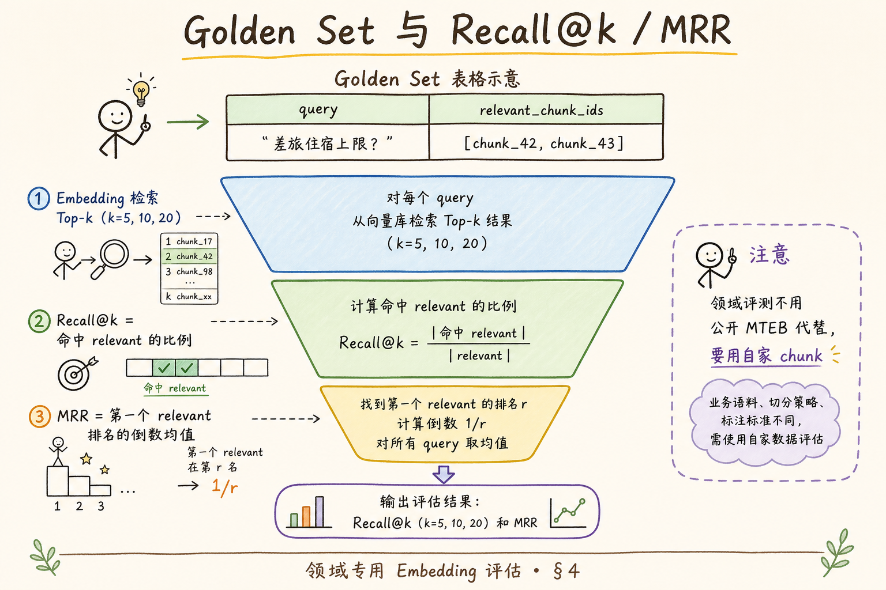
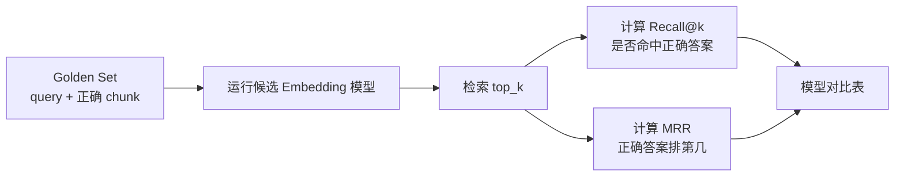
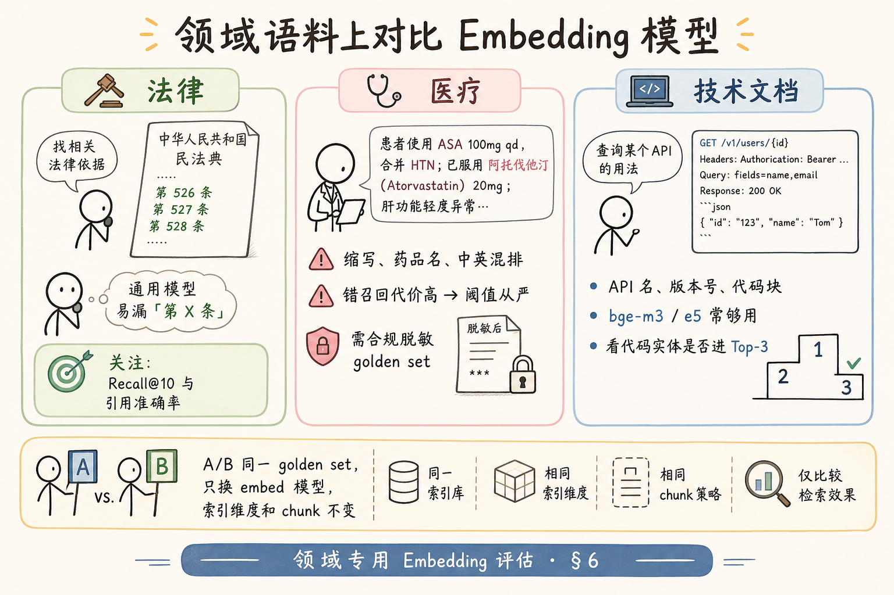
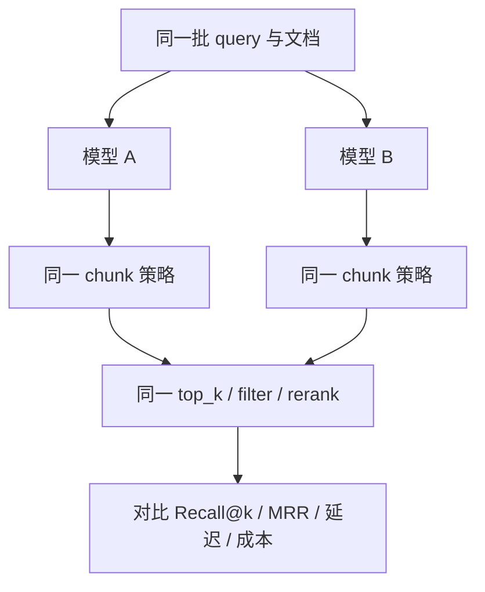
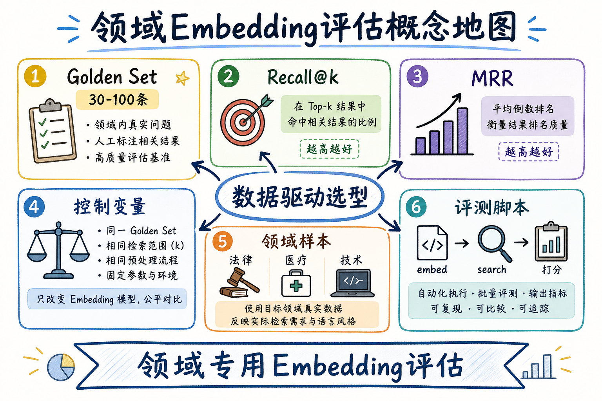
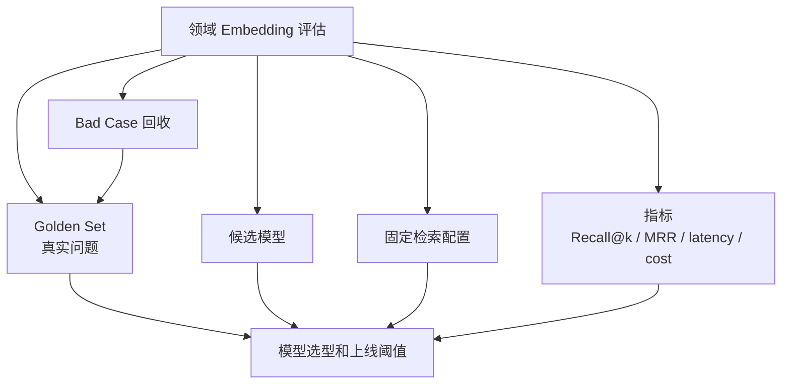

# 向量化（十一）：领域专用 Embedding 评估完全指南

> 公开榜单上 **Model A** 比 **Model B** 高 2 分，上线后法务 RAG 的 Recall@10 反而掉了——因为 MTEB 测的是维基段落，你库里的 chunk 是「第 14.2 条违约责任」加脚注。Embedding 选型若没有 **自家领域语料上的 golden set**，等于用别人的尺子量你的桌子。这篇是 [企业 RAG 路线图](ENTERPRISE_RAG_ROADMAP.md) **C3 向量化主线篇**（路线图第 **88** 条），讲清 **Recall@k**、**MRR**（Mean Reciprocal Rank）、控制变量的 **A/B 模型对比**、法律/医疗/技术三类领域样例，以及可运行的 **评测脚本骨架**。前置：[25 Embedding](25.embedding-vector-tutorial.md)、[26 相似度](26.similarity-metrics-tutorial.md)、[70 混合语料](70.mixed-language-embedding-tutorial.md)、[51 chunk_id](51.metadata-chunk-id-tutorial.md)。

---

## 目录

1. [前言：榜单第一，上线垫底](#1-前言榜单第一上线垫底)
2. [本文边界与动手路径](#2-本文边界与动手路径)
3. [为何需要领域评测](#3-为何需要领域评测)
4. [Golden Set 与 Recall@k / MRR](#4-golden-set-与-recallk--mrr)
5. [控制变量：公平对比两条模型](#5-控制变量公平对比两条模型)
6. [三类领域评测样例](#6-三类领域评测样例)
7. [先错只对：四种评测翻车](#7-先错对对四种评测翻车)
8. [评测流水线：从 chunk 到报告](#8-评测流水线从-chunk-到报告)
9. [最小实现：可跑评测脚本](#9-最小实现可跑评测脚本)
10. [读报告：如何拍板选型](#10-读报告如何拍板选型)
11. [综合概念地图](#11-综合概念地图)
12. [标注指南与 CI 回归](#12-标注指南与-ci-回归)
13. [常见陷阱与 FAQ](#13-常见陷阱与-faq)
14. [总结与系列下一步](#14-总结与系列下一步)

---

## 1. 前言：榜单第一，上线垫底

**Golden Set**（金标准集 / 评测集）：由业务专家标注的「查询 — 相关 chunk」对照表，用于离线衡量检索质量。  
通俗说：**考卷与标准答案**——自己组卷，别只背公开模拟题。

**Recall@k**（前 k 召回率）：在 Top-k 检索结果中，至少命中一条标注相关 chunk 的查询占比。  
通俗说：**开卷只看前 k 页，有多少题能找到答案**。

**MRR**（Mean Reciprocal Rank，平均倒数排名）：对每个查询，取 **第一个** 相关 chunk 的排名 r，计分 1/r，再对所有查询平均。  
通俗说：**不只要找到，还要找得靠前**——排第 1 得 1 分，排第 2 得 0.5 分。

典型故事：

> 技术文档库用榜单冠军 embedding，API 名 `CreateTransfer` 的 chunk 总排第 8；换成维度更低的 bge-m3，Recall@5 从 0.62→0.78。原因：榜单偏新闻体，自家库偏 **驼峰标识符 + 版本号**。

**读完本文，你应该能做到：**

1. 组建 **30～100 题** 领域 golden set（含 chunk_id）。  
2. 计算 **Recall@5/10/20** 与 **MRR**。  
3. 设计 **只换 embed 模型** 的 A/B，chunk 与切分不变。  
4. 解读法律/医疗/技术三类领域的 **评测侧重点**。  
5. 跑通 §9 脚本输出 CSV 报告。  
6. 识别 §7：题库泄漏、chunk 变了却对比、只看 Recall@1、用生成质量代替检索。

### 1.1 C3 主线在路线图中的位置

```text
87 中英混合选型
88 领域 Embedding 评估 ← 本篇（数据驱动定稿）
89 本地推理
90 微调概念
```

88 是 **C3 选型的关门篇**：前面定候选，本篇用数字 **签字**。

### 1.2 术语双轨速查

下面这些术语会在后文反复出现。先用一句话建立直觉，后面再看公式和脚本会更稳。

| 中文 | English | 一句话 |
|------|---------|--------|
| 金标准集 | Golden Set | 标注 query↔chunk |
| 前 k 召回 | Recall@k | Top-k 是否命中 |
| 平均倒数排名 | MRR | 第一个命中要多靠前 |
| 控制变量 | Controlled Experiment | 只改一个因素 |
| 相关 chunk | Relevant Chunk | 能支撑答案的段落 |
| 离线评测 | Offline Eval | 上线前批跑指标 |

### 1.3 读完本篇的最小交付物

1. **50 题** golden set 表（CSV）；  
2. 两模型 **Recall@10 + MRR** 对比表；  
3. §9 评测脚本进仓库 `eval/`；  
4. 选型 **一页纸结论**（模型、维度、是否重建索引）；  
5. 四条 **先错只对**（§7）。

---

## 2. 本文边界与动手路径

**档位：C3 主线篇（路线图 88，厚评测导向）。**

**本文讲：** 指标定义、golden set 组建、控制变量、领域样例、评测流水线、Python 脚本、读报告拍板。  
**本文不讲：** LLM-as-judge 端到端打分、完整 RAGAS 框架、embedding 微调训练、在线 A/B 流量实验（C6）。

### 2.1 动手路径表

| 步骤 | 你做什么 | 验收 |
|------|----------|------|
| A | 从工单抽 30 个真实问法 | 去隐私 |
| B | 专家标 relevant chunk_id | golden.csv |
| C | 固定 chunk 快照，embed 模型 A | 向量文件 A |
| D | 只换模型 B，重 embed | 向量文件 B |
| E | 跑 §9，出 Recall@k / MRR | 对比表 |
| F | 写选型结论 | 团队签字 |

**环境：** Python 3.10+；`pip install numpy pandas sentence-transformers` 或 embed API；**无需** 先上向量库——内存暴力检索即可。

### 2.2 沿用前文

| 概念 | 来自 |
|------|------|
| chunk_id 稳定 | [51 chunk_id](51.metadata-chunk-id-tutorial.md) |
| 相似度 | [26 cosine/ip](26.similarity-metrics-tutorial.md) |
| 混合语料 | [70 mixed-language](70.mixed-language-embedding-tutorial.md) |
| 分块 | [63/64](63.markdown-ast-chunking-tutorial.md)、[65 parent-doc](65.parent-document-retriever-tutorial.md) |
| Top-K | 路线图 **115** |

---

## 3. 为何需要领域评测

公开 **MTEB**（Massive Text Embedding Benchmark）有价值，但是 **别人的任务分布**：

| 维度 | 公开榜单 | 你的企业库 |
|------|----------|------------|
| 文本 | 维基、新闻、QA | 制度、合同、工单、API |
| 长度 | 往往短句 | 长段、表格、列表 |
| 实体 | 通用 | 法条号、药品名、内部项目代号 |
| 语言 | 多语混合测 | 你的 [70 篇](70.mixed-language-embedding-tutorial.md) 分布 |
| 查询 | 数据集作者写 | 员工口语、缩写 |

**领域专用评估** 回答一个问题：**在我这批 chunk、这批问法上，哪个 embedding 排得更前？**

### 3.1 评测集最小规模

| 阶段 | 题量 | 用途 |
|------|------|------|
| 冒烟 | 10～20 | 脚本打通 |
| 选型 | **30～50** | 两模型决胜负 |
| 回归 | **100+** | 换分块/换库后防回退 |
| 生产 | 持续从工单增补 | 月度回归 |

题量太少 **方差大**——50 题里差 2 题 = 4% Recall，别过度解读。

### 3.2 谁标注

- **业务专家** 标 relevant chunk（法务、合规、技术支持）；  
- 工程师提供 **chunk 浏览 UI** 或导出 CSV；  
- 争议题 **双人标注**，不一致进讨论队列。

---

## 4. Golden Set 与 Recall@k / MRR

读下图，盯住「第一个相关排第几」——那是 MRR 关心的。




下面这张图说明 Golden Set 与 Recall@k、MRR 的关系。读图时重点看：评测集要明确“这个问题应该命中哪些文档或 chunk”。



结论：没有 Golden Set，就只能凭感觉说模型好坏。Recall@k 和 MRR 是最小可落地的检索评测指标。

对照上图：

### 4.1 Golden Set 表结构

Golden Set 最好用表格文件维护，因为它要被脚本、评审会议和版本管理共同使用。最小字段如下：

```csv
query_id,query_text,relevant_chunk_ids,notes
q001,一线城市住宿上限?,chunk_42|chunk_43,金额在 chunk_42
q002,违约金比例上限?,chunk_108,第14.2条
```

- `relevant_chunk_ids` 可 **多个**（同义段、parent/child 双命中）；  
- 用 [51 篇](51.metadata-chunk-id-tutorial.md) 的 **稳定 id**，别用行号。

### 4.2 Recall@k 计算

对每个 query：

```text
hit = 1  if (Top-k 结果 ∩ relevant_set) 非空
       0  否则
Recall@k = sum(hit) / 查询总数
```

常报 **k = 5, 10, 20**——对应后续 LLM context 能塞几条（[28 上下文](28.context-window-tutorial.md)）。

### 4.3 MRR 计算

```text
对每个 query:
  找到 relevant 里排名最靠前的 rank r（1-based）
  若没有 → 0
  否则 → 1/r
MRR = 平均值
```

**Recall@k 与 MRR 分工：**

| 指标 | 回答 |
|------|------|
| Recall@10 | 「前 10 条里有没有对的」 |
| MRR | 「对的有多靠前」 |

客服场景常 **Recall@10 优先**（宁可多几条给 rerank）；精确引用场景 **MRR 优先**。

### 4.4 扩展指标（了解）

- **nDCG@k**：多级相关度（强相关/弱相关）；  
- **Hit@1**：严苛版，适合 FAQ 单段答案；  
- 本篇 **Recall@k + MRR** 够 80% 选型。

---

## 5. 控制变量：公平对比两条模型

读下图时，先看「领域语料模型对比」想表达的主线：它把本节的概念关系压缩成一张可对照的图。



下面这张图展示公平比较两个 Embedding 模型的方式。读图时重点看：除了模型本身，其余变量都要固定。



结论：如果同时换模型、切块和 top_k，就无法判断到底是哪一项带来了改进。

对照上图：**法律看条款号、医疗看缩写、技术看 API 名**——golden set 要覆盖领域痛点，但对比实验时 **只能动一个旋钮**。

### 5.1 必须固定的

这些项如果同时变化，评测结论就无法归因。初学者可以把它们理解成“实验里的控制变量”。

| 固定项 | 原因 |
|--------|------|
| chunk 文本与切分 | 否则不知道谁变好 |
| golden set 版本 | 标注一致 |
| 相似度度量 | cosine vs ip，[26 篇](26.similarity-metrics-tutorial.md) |
| k 值与检索方式 | 暴力 Top-k，先不上 HNSW 近似误差 |
| 查询文本 | 同一句中文 |

### 5.2 允许变化的

本轮实验只允许改变候选模型相关的部分。这样分数变化才可以相对可信地归因到 embedding 模型本身。

- **Embedding 模型**（本次实验自变量）；  
- 向量维度（随模型变，各自独立索引）；  
- E5 前缀规则（随模型文档）。

### 5.3 错误对比示例

> 模型 A 用 256 token chunk，模型 B 用 512 token chunk，Recall 提升——**无法归因**。

正确：先 [61 篇](61.chunk-size-tradeoff-tutorial.md) 定 chunk，再 **只换 embed** 跑 88。

---

## 6. 三类领域评测样例
领域评测不能只靠通用问答样例。法律、医疗、财务、内部制度都有自己的术语、边界和错误代价，所以样例要覆盖同义问法、近似干扰项和真实业务答案。


### 6.1 法律 / 合规

**语料特点：** 长句、嵌套编号、「第 X 条」「款」「项」；中英合同对照。  
**查询特点：** 「违约金」「解除条件」「管辖法院」——口语化。  
**评测侧重：**

- Recall@10（法条常分散）；  
- **引用准确率**——命中 chunk 是否含 **可引用条款号**（与 [34 Grounding](34.grounding-citation-tutorial.md) 衔接）；  
- 警惕：模型把 **相似但不同合同** 排在前面。

**样例题：**

| query | 应命中 |
|-------|--------|
| 供应商延迟交付的违约金上限？ | 含「万分之」「日」的违约责任段 |
| 争议解决是仲裁还是诉讼？ | 管辖条款 chunk |

### 6.2 医疗 / 药械（脱敏）

**语料特点：** 缩写（「阿司匹林」/ ASA）、通用名商品名混用、中英药品名。  
**查询特点：** 非专业人士口语；**错误召回代价高**。  
**评测侧重：**

- **MRR 与 Recall@3** 从严（宁缺毋滥，配合 score threshold 路线图 116）；  
- golden set **必须合规脱敏**，用合成或公开指南替代真实病历；  
- 标注 **强相关 vs 禁忌** 分开，避免「相关但危险」算命中。

**样例题：**

| query | 应命中 |
|-------|--------|
| 二甲双胍常规起始剂量？ | 剂量段，非禁忌段 |

### 6.3 技术 / 研发文档

**语料特点：** API 路径、驼峰函数名、版本号、代码块；[76 代码块完整](ENTERPRISE_RAG_ROADMAP.md)。  
**查询特点：** 英文标识符 + 中文「怎么配」。  
**评测侧重：**

- Recall@5 常够用（段较短）；  
- 命中 **含正确版本号** 的 chunk（v2 与 v3 别混）；  
- 与 [70 混合语料](70.mixed-language-embedding-tutorial.md) 叠加：中问 `CreateUser` 接口。

**样例题：**

| query | 应命中 |
|-------|--------|
| CreateTransfer 接口限流多少？ | 含 RPM 数字的 API 参考段 |

### 6.4 跨领域题库比例建议

```text
50 题示例分配：
  20 题核心业务（你司主领域）
  10 题边界案例（表格、脚注、多段）
  10 题跨语言（若 70 篇适用）
  10 题真实高频问题（来自脱敏工单或搜索日志）
```

这只是起点，不是硬性比例。你的主领域越重要，核心业务题占比越高；但边界案例和跨语言题不能为零，否则模型上线后会在最真实的复杂问法上失真。

### 6.5 法律领域：条款编号是硬特征

法律 chunk 常含「第 14.2.1 条」「Article 12」等 **结构化编号**。评测时要问：

- 模型能否把 **口语问法** 对齐到 **带编号** 的段？  
- 相似但不同合同的 **同名条款** 会不会被混淆？（难负例 §12.3）

通用 embedding 对数字与编号 **不一定最敏感**——若法律子集 Recall 低，先检查 chunk 是否把 **条款号切在段首**，再考虑微调（90）或 hybrid BM25（110）。

### 6.6 医疗领域：同义词与禁忌分栏

同一药品「阿司匹林」「ASA」「acetylsalicylic acid」应标 **同一 relevant 组**（多 chunk_id 用 `|` 分隔）。  
**禁忌症** 段不应标为「剂量问法」的 relevant——标注手册要写清 **负例不算命中**。

### 6.7 技术领域：版本与废弃 API

技术 golden set 应含 **废弃接口** 陷阱：

| query | 应命中 | 不应命中 |
|-------|--------|----------|
| ListUsers 分页参数 | v2 当前文档 | v1 deprecated 章 |

否则模型 Recall 高只因 **旧文档噪音多**，上线后引错版本。

### 6.8 从工单挖掘 query 的脱敏流程

1. 导出近 90 天检索日志或客服工单主题；  
2. 正则去掉手机、身份证、邮箱；  
3. 人工抽检 50 条确认无 PII；  
4. 改写成 **自然问法**（去粘贴文档原句）；  
5. 专家标 relevant chunk。

**真实问法** 比工程师拍脑袋的「测试问题」价值高一个数量级。

---

## 7. 先错只对：四种评测翻车
下面先看错误做法，再对照正确写法；这样比只记结论更容易发现自己项目里的隐性问题。

### 7.1 错：用 Chat 回答对不对代替检索

生成流畅 ≠ 引用了对 chunk。  
**对**：离线 **只测检索**；生成另测（C6）。

### 7.2 错：golden set 从训练 chunk 里「背答案」

query 原文出现在 chunk 里 → 虚高 Recall。  
**对**：问法 ** paraphrase**，与文档用语不同。

### 7.3 错：换模型同时换了 HNSW 参数

Recall 变了不知谁锅。  
**对**：评测阶段 **暴力 flat** 或固定 ANN 参数。

### 7.4 错：10 题就敢上线

方差巨大，2 题翻转结论。  
**对**：至少 **30～50 题**，关键项目 **100+**。

---

## 8. 评测流水线：从 chunk 到报告

```text
1. 导出 chunk 快照 JSON（chunk_id, text, metadata）
2. 加载 golden.csv
3. FOR model in [A, B]:
     embed 全部 chunk → matrix / file
     FOR each query:
         embed query → Top-k 暴力检索
         记录 rank、hit
4. 聚合 Recall@k, MRR
5. 输出 diff 报告（B 比 A 提升的题 / 退步的题）
```

### 8.1 多 relevant chunk 时 Recall 怎么算

若 `relevant_chunk_ids = {A, B}`，Top-k 命中 **任意一个** 即算该 query 成功——OR 语义。  
若业务要求 **必须同时引用 A 和 B**（罕见），应拆成两题或自定义 **AND 指标**——提前写进评测 spec，避免扯皮。

### 8.2 手算例题巩固

3 题 golden，k=5：

| q | relevant | Top-5 命中? |
|---|----------|-------------|
| q1 | {a} | 第 2 位命中 → Recall 贡献 1 |
| q2 | {b} | 未命中 → 0 |
| q3 | {c,d} | 第 1 位命中 c → 1 |

Recall@5 = 2/3；MRR = (1/2 + 0 + 1/1) / 3 ≈ 0.5。手算后再跑脚本，避免把代码 bug 当成模型差。

### 8.3 MRR 与 Recall 打架时怎么选

| 场景 | 优先指标 |
|------|----------|
| 客服助手，后面有 rerank | Recall@20 |
| 法务引用，必须第一条就对 | MRR / Hit@1 |
| 技术 FAQ | Recall@5 + MRR |

两个指标 **同时报**，别只挑好看的。MRR 高 Recall 低 = 「偶尔很准但常漏」；Recall 高 MRR 低 = 「能找到但排得靠后」——后者常靠 **加 rerank** 救。

### 8.4 评测结果文件命名规范

```text
eval/
  2025-07-10_bge-m3_recall.json
  2025-07-10_3-small_recall.json
  2025-07-10_diff_misses.csv
```

文件名含 **日期 + 模型 + 指标**，半年后还能对比回归。

### 8.5 暴力检索 vs ANN 的评测误差

HNSW 有 **近似误差**——评测用暴力 flat，生产用 ANN 时，Recall 可能差 1～3%。  
定稿模型后，用 **同一 golden set** 在 **生产 ANN 参数** 下再跑一遍，写进报告脚注 `ann_recall@10`。

### 8.6 第二阶段：加 Reranker 的评测（预告）

Embedding 定稿后，用 **同一 golden set** 对 Top-20 做 rerank（112～113）：

```text
embed_recall@20 = 0.82
after_rerank MRR@5 = 0.71
```

若 embed Recall 已低，rerank **救不了**——先换模型或改 chunk。报告分两节：**第一节 embed-only（88）**，**第二节 +rerank（可选）**。

### 8.7 标注争议处理流程

争议题不是噪声，而是改进标注规范的材料。处理方式要固定，否则每次评测都在换规则。

1. 双标注不一致 → 第三人仲裁；  
2. 仲裁结果写入 `golden_v2.csv` 的 `notes`；  
3. **旧标注不悄悄改**——改就升版本号，保留 `golden_v1` 可对比。

### 8.8 按 query 难度分层报告

| 难度 | 示例 |
|------|------|
| easy | 问法与文档同句 |
| medium | paraphrase 改写过 |
| hard | 跨语言 / 难负例 / OCR 噪声 |

overall Recall 被 easy 题灌水时，**hard 子集** 才反映真实风险。

### 8.9 与 Parent-Document 的关系

若用 [65 篇](65.parent-document-retriever-tutorial.md) **child 检索**，golden 的 relevant 应标 **child_id**，或约定「命中 child 即算 parent 命中」——团队 **统一规则** 写进 README。

### 8.10 版本冻结

```json
{
  "eval_version": "2025-07-10",
  "chunk_snapshot": "s3://eval/chunks_v3.jsonl",
  "golden": "golden_v2.csv",
  "models": ["bge-m3", "text-embedding-3-small"]
}
```

换分块策略 → **新 eval_version**，旧报告可对比回归。

---

## 9. 最小实现：可跑评测脚本

```python
#!/usr/bin/env python3
"""domain embedding eval — 路线图 88 最小脚本"""
import json
import csv
from pathlib import Path
from typing import Dict, List, Set

import numpy as np

# --- 配置 ---
CHUNKS_PATH = Path("data/chunks_snapshot.jsonl")
GOLDEN_PATH = Path("data/golden.csv")
K_LIST = [5, 10, 20]


def load_chunks(path: Path) -> List[dict]:
    return [json.loads(line) for line in path.read_text(encoding="utf-8").splitlines() if line.strip()]


def load_golden(path: Path) -> List[dict]:
    rows = []
    with path.open(encoding="utf-8") as f:
        for row in csv.DictReader(f):
            rel = {x.strip() for x in row["relevant_chunk_ids"].split("|") if x.strip()}
            rows.append({"query_id": row["query_id"], "query": row["query_text"], "relevant": rel})
    return rows


def embed_texts(model, texts: List[str], batch_size: int = 32) -> np.ndarray:
  """替换为你的 API 或 SentenceTransformer"""
  from sentence_transformers import SentenceTransformer
  if isinstance(model, str):
      model = SentenceTransformer(model)
  vecs = model.encode(texts, batch_size=batch_size, normalize_embeddings=True, show_progress_bar=True)
  return np.asarray(vecs, dtype=np.float32)


def topk_search(query_vec: np.ndarray, doc_matrix: np.ndarray, doc_ids: List[str], k: int) -> List[str]:
    scores = doc_matrix @ query_vec  # 已归一化 → cosine
    idx = np.argpartition(-scores, min(k, len(scores) - 1))[:k]
    idx = idx[np.argsort(-scores[idx])]
    return [doc_ids[i] for i in idx]


def recall_at_k(golden, ranked_ids: Dict[str, List[str]], k: int) -> float:
    hits = 0
    for item in golden:
        topk = set(ranked_ids[item["query_id"]][:k])
        if item["relevant"] & topk:
            hits += 1
    return hits / len(golden)


def mrr(golden, ranked_ids: Dict[str, List[str]]) -> float:
    scores = []
    for item in golden:
        rel = item["relevant"]
        rr = 0.0
        for i, cid in enumerate(ranked_ids[item["query_id"]], start=1):
            if cid in rel:
                rr = 1.0 / i
                break
        scores.append(rr)
    return float(np.mean(scores))


def run_eval(model_name: str, chunks: List[dict], golden: List[dict]) -> dict:
    doc_ids = [c["chunk_id"] for c in chunks]
    doc_texts = [c["text"] for c in chunks]
    doc_matrix = embed_texts(model_name, doc_texts)

    ranked: Dict[str, List[str]] = {}
    for item in golden:
        qv = embed_texts(model_name, [item["query"]])[0]
        ranked[item["query_id"]] = topk_search(qv, doc_matrix, doc_ids, k=max(K_LIST))

    report = {"model": model_name, "mrr": mrr(golden, ranked)}
    for k in K_LIST:
        report[f"recall@{k}"] = recall_at_k(golden, ranked, k)
    return report


def main():
    chunks = load_chunks(CHUNKS_PATH)
    golden = load_golden(GOLDEN_PATH)
    models = ["BAAI/bge-m3", "intfloat/multilingual-e5-base"]  # 按候选改

    rows = []
    for m in models:
        print(f"=== eval {m} ===")
        rows.append(run_eval(m, chunks, golden))

    print("\n| model | MRR | Recall@5 | Recall@10 | Recall@20 |")
    print("|-------|-----|----------|-----------|-----------|")
    for r in rows:
        print(f"| {r['model']} | {r['mrr']:.3f} | {r['recall@5']:.3f} | {r['recall@10']:.3f} | {r['recall@20']:.3f} |")


if __name__ == "__main__":
    main()
```

### 9.1 E5 前缀改造点

若 `model_name` 含 `e5`，在 `embed_texts` 内对 golden query 加 `query:`、对 doc 加 `passage:`——见 [70 篇](70.mixed-language-embedding-tutorial.md) §5.2。

### 9.2 输出错题本

```python
def export_misses(golden, ranked, path="misses.csv"):
    with open(path, "w", encoding="utf-8", newline="") as f:
        w = csv.writer(f)
        w.writerow(["query_id", "query", "relevant", "top5"])
        for item in golden:
            top5 = ranked[item["query_id"]][:5]
            if not (item["relevant"] & set(top5)):
                w.writerow([item["query_id"], item["query"], "|".join(item["relevant"]), "|".join(top5)])
```

产品、法务一起过 **misses.csv**，比抽象分数更能推动 chunk 或标注修正。

---

## 10. 读报告：如何拍板选型

| 信号 | 决策 |
|------|------|
| B Recall@10 高 5%+ 且 MRR 不低 | 倾向 B |
| Recall 平、MRR 差一截 | 看是否要 rerank（112） |
| 法律/医疗错题是「相似错段」 | 加 metadata 过滤或微调（90） |
| 技术题 API 名排不进 Top-5 | 试 bge-m3 / 标题前缀 / 混合检索 110 |
| 两模型差距 <2% | 选 **成本低、运维简单** 的 |

**不要** 只报一个 Recall@10——附 **MRR、分领域子表、misses 样例**。

### 10.1 与上线门槛示例

```text
Go 条件（示例）：
  Recall@10 ≥ 0.75
  MRR ≥ 0.55
  医疗类子集 Recall@3 ≥ 0.80
  无 P0 错题（禁忌、错误法条）未解决
```

门槛由业务定，工程提供 **可重复脚本**。

---

## 11. 综合概念地图

读下图时，先看「领域 Embedding 评估概念地图」想表达的主线：它把本节的概念关系压缩成一张可对照的图。




下面这张概念地图总结领域 Embedding 评估闭环。读图时重点看：评测不是一次性选型，而是随语料和问题持续更新。



结论：领域评测的价值在于把真实失败案例沉淀回来，让下一次模型或参数调整有可比较的基准。

对照上图：**golden set → 控制变量 A/B → 指标 → 错题本 → 选型签字**。

---

## 12. 标注指南与 CI 回归
这一节先给出「标注指南与 CI 回归」的整体框架，再拆到下面的小节；这样读者不会一上来就被表格、代码或清单打断。

### 12.1 标注界面最小需求

工程师给业务专家的标注工具不必花哨，但必须：

1. **搜索 chunk 全文**（按 doc_id、关键词）；  
2. 勾选 **一个或多个** relevant chunk_id；  
3. 写 `notes`（「答案在第二段表格」）；  
4. 导出 CSV 与 golden 版本号。

没有浏览 UI，专家会凭记忆标错 chunk——评测从第一天就脏。

### 12.2 标注一致性：Cohen's Kappa（了解）

两人标同一批 20 题，算 **Kappa** 系数。低于 0.6 说明 **标注规范不清**，先开会统一「什么叫相关」再扩到 50 题。  
法律场景：「能回答即可」与「必须可引用条款」是两种标准——写进标注手册。

### 12.3 难负例（Hard Negative）刻意加入

golden set 应含 **看起来很像但不对** 的 distractor：

| query | 应命中 | 易错邻段 |
|-------|--------|----------|
| 违约金上限 | 采购合同第 14 条 | 销售合同第 14 条（数字不同） |
| v2 API 限流 | v2 文档 | v3 文档（更高限制） |

没有难负例，Recall 虚高，上线后用户第一个踩雷。

### 12.4 把评测接进 CI（GitHub Actions 示意）

```yaml
name: embedding-eval
on:
  pull_request:
    paths: ['data/golden.csv', 'data/chunks_snapshot.jsonl', 'eval/**']
jobs:
  eval:
    runs-on: ubuntu-latest
    steps:
      - uses: actions/checkout@v4
      - uses: actions/setup-python@v5
        with: { python-version: '3.11' }
      - run: pip install sentence-transformers numpy pandas
      - run: python eval/domain_embedding_eval.py
      - run: |
          python -c "
          # 伪代码：若 recall@10 < 基线 0.75 则 exit 1
          "
```

换分块 PR 必须跑评测——**防 Recall 回退** 比事后救火便宜。

### 12.5 数值例题：手算 Recall@3 与 MRR

3 个 query，relevant 各 1 个 chunk：

| query | Top-3 结果 | Recall@3 | RR |
|-------|------------|----------|-----|
| q1 | A, **R1**, C | 1 | 1/2=0.5 |
| q2 | X, Y, Z | 0 | 0 |
| q3 | **R3**, B, C | 1 | 1/1=1 |

Recall@3 = 2/3 ≈ 0.667；MRR = (0.5+0+1)/3 ≈ 0.5。  
手算一遍，看报告时就不懵。

### 12.6 分领域子表报告模板

分领域报告用于发现“总体分数不错，但某一类业务明显退步”的情况。下面是可直接复制的 Markdown 模板：

```markdown
### Eval 2025-07-10
| model | overall R@10 | legal R@10 | medical R@3 | tech MRR |
| bge-m3 | 0.78 | 0.72 | 0.85 | 0.61 |
| 3-small | 0.71 | 0.65 | 0.80 | 0.55 |
```

子集样本少时标注 **（n=8）** 提醒读者别过度解读。

### 12.7 与混合语料评测（70 篇）的拼接

50 题中建议 **10 题跨语言**（见 [70 篇](70.mixed-language-embedding-tutorial.md)）——领域评测不是纯单语游戏。报告里单独一行 `cross-lingual R@10`。

### 12.8 读路径自检（8 题）

1. Golden set 最少几题选型？  
2. Recall@k 与 MRR 区别？  
3. 控制变量必须固定什么？  
4. 为何评测用 flat 检索？  
5. misses.csv 给谁看？  
6. 难负例作用？  
7. CI 回归触发条件？  
8. 评测通过能否保证生成对？

---

## 13. 常见陷阱与 FAQ
这一节把前面最容易踩坑的地方集中收束，读完后可以用它来检查自己是否真的理解了「常见陷阱与 FAQ」这一组问题。

### 13.1 需要标注多少 relevant chunk？

多数题 1 个，复杂题 2～3；超过 5 个想想 chunk 是否切太碎。

### 13.2 能用 LLM 自动生成 golden 吗？

可作 **冷启动草稿**，必须人工抽检——幻觉标注会毁掉评测。

### 13.3 评测要每次全量 embed 吗？

选型期要；回归期可 **缓存 chunk 向量**，只对新 chunk 增量 embed（[49 增量](49.incremental-update-tutorial.md)）。

### 13.4 Recall 高但用户仍骂？

可能生成、ACL、或 **检索到了 parent 没送到 LLM**——88 只负责 **检索段**。

### 13.5 和 Reranker 的关系？

Embedding 评测 **不含 rerank**；若生产必上 rerank，应加 **第二阶段评测**（路线图 112～113）。

---

## 14. 总结与系列下一步

1. **领域 golden set** 是 Embedding 选型的合同——没有它别签模型。  
2. **Recall@k** 看有没有；**MRR** 看靠不靠前——两个一起报。  
3. **只换模型**，chunk 与问法冻结，评测用 **flat Top-k** 减变量。  
4. 法律/医疗/技术 **错题形态不同**——子集指标分开看。  
5. §9 脚本 + **misses 错题本** 比榜单更有说服力。

### 14.1 系列下一步

完成领域评测后，下一步通常是降本、微调或进入 rerank 阶段。下面这些方向按常见推进顺序排列。

| 目标 | 阅读 |
|------|------|
| 本地推理降本 | 路线图 **89** sentence-transformers |
| Embedding 微调 | 路线图 **90** |
| 混合语料 | [70 mixed-language](70.mixed-language-embedding-tutorial.md) |
| Rerank 二阶段 | 路线图 **112～113** |
| Top-K 调参 | 路线图 **115** |

### 14.2 学习目标自检

用这份清单检查你是否已经能独立完成一次 embedding 选型，而不是只理解指标定义。

- [ ] 能手写 Recall@k、MRR 公式  
- [ ] 能组 30 题 golden CSV  
- [ ] 能跑 §9 对比两模型  
- [ ] 能解释控制变量表  
- [ ] 能读 misses 并提出 chunk 或标注修正  

### 14.3 面试 30 秒版

「领域 embedding 评估用业务标注的 golden set，固定 chunk 切分只换模型，算 Recall@5/10/20 和 MRR；法律看条款引用、医疗从严 Recall@3、技术看 API 实体；评测用暴力 Top-k，输出错题本驱动选型，不靠公开 MTEB 代替。」

### 14.4 90 分钟动手作业

这份作业强调端到端闭环：准备数据、跑脚本、看错题、写结论。时间不够时也要保留“错题讨论”这一环。

1. 导出 200 chunk 快照 + 写 30 题 golden；  
2. 跑 §9 对比两个候选模型；  
3. 导出 misses.csv，选 5 题开会讨论；  
4. 写 **一页选型结论** 附数字与 Go/No-Go 门槛。

### 14.5 团队 Review 清单（Embedding 选型 PR）

提交 embedding 选型 PR 时，review 重点不是“模型名字是否流行”，而是证据链是否完整。

- [ ] golden 版本号与 chunk 快照路径已记录  
- [ ] 对比仅更换 embed 模型  
- [ ] 报告含 Recall@k + MRR + 子领域表  
- [ ] misses 已人工抽检 ≥10 条  
- [ ] 选定模型维度与 **重建索引** 任务已排期  

### 14.6 附录：golden.csv 完整样例（5 行）

下面的样例只演示字段形态。真实项目要把 query 改成脱敏后的真实问法，并把 chunk_id 换成自己的稳定 ID。

```csv
query_id,query_text,relevant_chunk_ids,notes
q001,员工出差一线城市住宿标准是多少,chunk_handbook_travel_42,含 500 元数字
q002,penalty clause supplier delay,chunk_contract_en_108,英文合同违约责任
q003,CreateUser API 的 RPM 限制,chunk_api_v2_users_12,含 v2 非 v3
q004,试用期解除劳动合同条件,chunk_labor_law_07,劳动法节
q005,二甲双胍起始剂量,chunk_clinical_guide_33,脱敏指南
```

### 14.7 附录：选型一页纸结论模板

这份模板用于把技术评测翻译成团队能签字的决策材料。重点是模型、指标、门槛、风险和签字人都要明确。

```markdown
# Embedding 选型结论 v2025-07-10
- **选定模型**: BAAI/bge-m3（1024 维）
- **对比模型**: text-embedding-3-small（未达标跨语言子集）
- **索引策略**: 统一多语索引（见 70 篇）
- **指标**: overall Recall@10=0.78, MRR=0.58; legal R@10=0.72
- **Go 条件**: 已满足；排期 7/15 全量重建
- **风险**: 医疗子集 n=12 偏小，下月补 20 题
- **签字**: 工程 ___ 业务 ___
```

### 14.8 附录：Parent-Document 评测约定

若生产用 [65 Parent-Document](65.parent-document-retriever-tutorial.md)：

- golden 标 **child_id**；  
- 命中 child 即算 Recall 成功；  
- 报告脚注说明「未测 parent 生成质量」。

避免工程师标 parent_id、检索跑 child 层，永远对不上。

### 14.9 C3 收官：87→88→89

88 签字后进入路线图 **89 本地推理**：评测冠军若 API 太贵，用同一 golden set 对比 **本地 bge-m3 量化版** 是否 Recall 损失 <2%——数据同样说话。

### 14.10 给产品经理的一句话

「我们不会凭网上排行榜选模型，会用 **真实员工问过的 50 道题** 做考卷，看谁家能把正确段落排到前十——数字签字后再换。」

领域评测是 C3 向量化的 **闭环**：没有 golden set，前面的模型选型、混合语料、重试限流都是 **无验收的工程**。

### 14.11 评测会议议程（30 分钟模板）

评测会议要围绕数字和错题展开，避免变成模型偏好讨论。下面的时间分配适合小团队第一次评审。

1. 讲 overall Recall@10 / MRR（5 min）  
2. 过 **legal / medical / tech** 子表（5 min）  
3. 过 **cross-lingual** 与 **hard** 子集（5 min）  
4. 打开 **misses.csv** 过 5 条（10 min）  
5. Go/No-Go 与重建排期（5 min）

### 14.12 失败样例：为何 MTEB 冠军输了

某开源模型 MTEB 中文检索榜首，但企业 50 题 golden 上 Recall@10 比 bge-m3 低 9%。打开 misses 发现：题库含大量 **内部项目代号 + 版本号**，榜单任务不含这类 token 分布。  
**教训**：领域评测不是反榜单，是 **补榜单没覆盖的分布**。

### 14.13 与增量更新的回归（49 篇）

每次 [49 增量](49.incremental-update-tutorial.md) 改分块逻辑，用 **同一 golden_v2** 跑 nightly eval。Recall 掉 2% 即阻断合并——比线上用户先骂便宜。

### 14.14 向管理层汇报的一句话数字

「我们在 **真实业务 50 道题** 上测了三个模型，最终选的 bge-m3 在 **前 10 条检索结果** 里能找对段落的概率是 **78%**，比原方案高 **11 个百分点**；医疗类难题我们还单独加了 **更严的前三条命中率** 门槛。」——用业务能听懂的 **Recall@10**，别讲 cosine。

### 14.15 评测债务（Eval Debt）警示

golden set **长期不更新** 会变成另一种技术债：产品加了新功能模块，评测仍只有旧模块题，Recall 数字好看但 **新模块裸奔**。每季度从工单 **增补 10 题**，版本升 `golden_v3`。评测集与产品功能 **同寿命维护**，不是立项时一次性劳动。

### 14.16 三篇串联：86→87→88

| 篇 | 回答 |
|----|------|
| [69 重试限流](69.embedding-retry-rate-limit-tutorial.md) | 入库跑得完 |
| [70 混合语料](70.mixed-language-embedding-tutorial.md) | 索引选得对 |
| **88 本篇** | 模型选得准 |

先能稳定 embed，再谈中英共存，最后用 golden set **签字**——顺序反了会在错误模型上 **优雅地重试一万次**。本篇主线篇的厚度在 **动手**：请把 §9 脚本克隆进仓库 `eval/`，本周内跑出第一份 **带日期的对比表**，比再读一篇榜单文章更有价值。

### 14.17 附录：diff 报告怎么写

对比模型 B 相对 A 时，输出：

```markdown
### 提升最大的 5 题（B 命中 A 未命中）
- q012: 「…」 relevant: chunk_x

### 退步最大的 5 题（A 命中 B 未命中）
- q034: …

### 两模型都未命中（需改 chunk 或标注）
- q099: …
```

**双失败题** 往往是 chunk 切分或标注问题，不是换模型能救——交给 [61 chunk size](61.chunk-size-tradeoff-tutorial.md) 或专家改 golden。diff 报告是 **88 篇最有价值的交付物**，请与 Recall 数字一起归档。没有 diff，选型会议会沦为 **各说各话的玄学**。把 golden、脚本、报告都 **版本化进 Git**，评测才成为工程资产而非个人笔记本。这是 C3 向量化的 **验收关门**。88 之后，才算真正完成 Embedding 选型。请本周安排 **标注会 + 评测会**，把数字钉在 wiki 上，避免「会上通过、会后无人跑脚本」。评测是 habit，不是 event。坚持才有回归线。

---

> **初学者可能仍困惑的点**  
> - Recall 高不代表 **生成答案对**——88 只评检索第一段。  
> - MTEB 高不代表 **你库高**——领域 golden 是必选项。  
> - 标注争议题要 **讨论固化**，否则每次评测都在改规则。  
> - 选型完记得 **全量重建**——旧向量与新模型混用是灾难（[25 篇](25.embedding-vector-tutorial.md)）。
