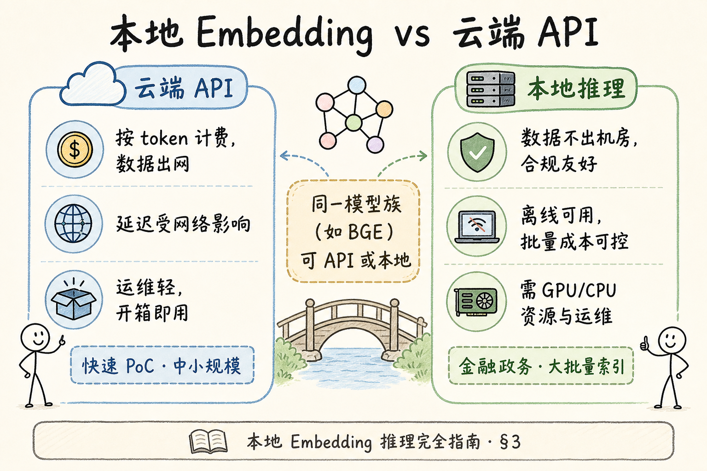
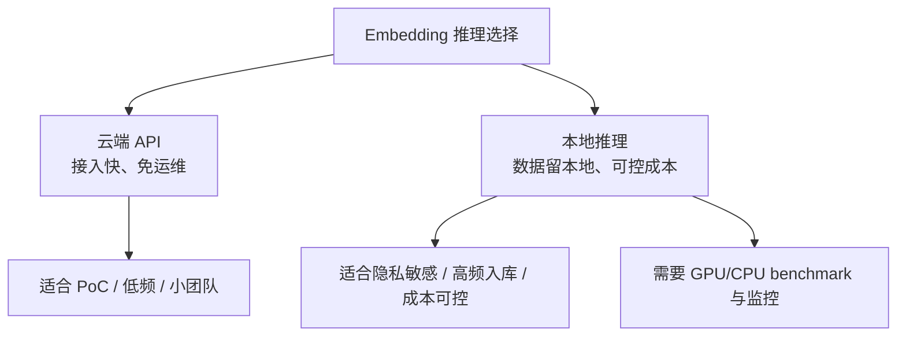
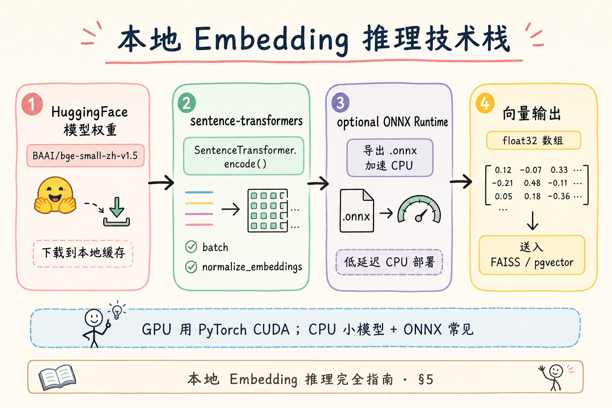
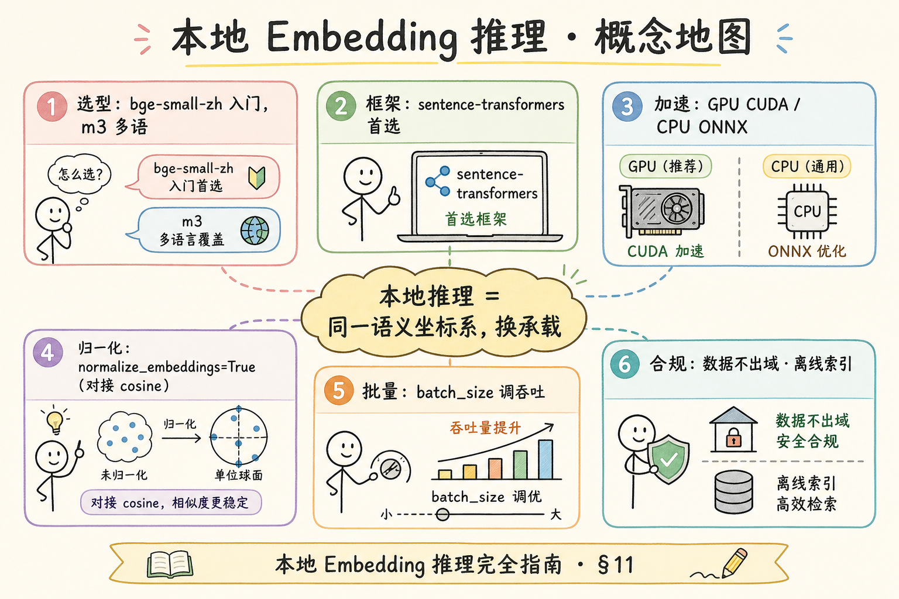
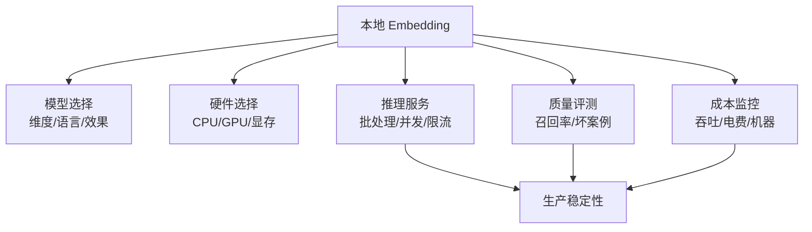

# C3 向量化（十二）：本地 Embedding 推理完全指南

> [25 Embedding 向量表示](25.embedding-vector-tutorial.md) 讲清了「文本 → 向量 → 检索」；[35 OpenAI 兼容 API](35.openai-compatible-api-tutorial.md) 与路线图 **78～87** 侧重 **云端按 token 计费** 的向量化路径。但当数据 **不能出机房**、索引量 **大到 API 账单惊人**、或需要 **离线批量重建** 时，工程师会问：**能不能在自己机器上跑 Embedding？** 这篇是 [企业 RAG 路线图](ENTERPRISE_RAG_ROADMAP.md) **C3 向量化主线篇**（路线图第 **89** 条），讲清 **本地 Embedding 推理**：**sentence-transformers** 上手、**BGE-small-zh** 本地跑通、**GPU vs CPU** 与 **ONNX** 加速直觉、隐私与离线收益，并给出 **最小可运行代码**。前置：[25 Embedding](25.embedding-vector-tutorial.md)、[26 相似度度量](26.similarity-metrics-tutorial.md)；可选路线图 **83 L2 归一化**、**84 批量 Embedding**。

---

## 目录

1. [前言：为什么要在本机算向量](#1-前言为什么要在本机算向量)
2. [本文边界与动手路径](#2-本文边界与动手路径)
3. [本地推理 vs 云端 API](#3-本地推理-vs-云端-api)
4. [核心概念：模型、框架、运行时](#4-核心概念模型框架运行时)
5. [技术栈：从 HuggingFace 到向量](#5-技术栈从-huggingface-到向量)
6. [GPU 与 CPU：怎么选](#6-gpu-与-cpu怎么选)
7. [ONNX：CPU 上的常见加速](#7-onnxcpu-上的常见加速)
8. [BGE-small-zh 本地实战](#8-bge-small-zh-本地实战)
9. [批量、归一化与工程要点](#9-批量归一化与工程要点)
10. [先错后对：三种典型翻车](#10-先错对对三种典型翻车)
11. [综合概念地图](#11-综合概念地图)
12. [常见陷阱与 FAQ](#12-常见陷阱与-faq)
13. [总结与系列下一步](#13-总结与系列下一步)

---

## 1. 前言：为什么要在本机算向量

企业 RAG 的向量化阶段，很多人第一反应是调 **OpenAI / 国内兼容网关** 的 `embeddings` 接口——快、稳、不用管 GPU。但真实项目里常出现三类硬约束：

| 约束 | 典型场景 | 本地推理的价值 |
|------|----------|----------------|
| **数据合规** | 金融、政务、医疗内网 | 文档与 query **不出域** |
| **成本规模** | 千万 chunk 全量重建 | 一次性算完，**无按 token 账单** |
| **离线/弱网** | 工厂边缘、船载、隔离区 | **无公网** 也能建索引 |

**本地 Embedding 推理**（Local Embedding Inference）：在自有服务器或开发机上加载 **开源句向量模型**（如 BGE、E5、GTE），用 **PyTorch / ONNX Runtime** 等执行前向计算，将文本批次转为浮点向量，**不经过第三方 Embedding API**。  
通俗说：**把「编目员」请进自己机房**——模型权重在你磁盘上，算向量在你进程里完成。

这和 [25 篇](25.embedding-vector-tutorial.md) 的语义坐标系 **不矛盾**：本地只是 **换承载**；换模型或换「云 vs 本地」仍要 **重建索引**（同一模型、同一 `normalize` 策略则一致）。

**读完本文，你应该能做到：**

1. 说明 **何时选本地、何时仍用 API** 的三条判断。  
2. 用 **sentence-transformers** 加载 `BAAI/bge-small-zh-v1.5` 并 `encode` 三句话。  
3. 解释 **GPU / CPU / ONNX** 在延迟与吞吐上的分工直觉。  
4. 设置 `normalize_embeddings=True` 并与 [26 篇](26.similarity-metrics-tutorial.md) cosine 检索对齐。  
5. 识别 §10 三种「本地也能翻车」的错法。  
6. 把本地向量 **对接** 后续 FAISS / pgvector（路线图 C4）。

### 1.1 C3 主线在路线图中的位置

```text
78～87 云端向量化、批量、缓存、限流、选型
88 领域专用 Embedding 评估
89 本地 Embedding 推理 ← 本篇（主线 · 可跑代码）
90 Embedding 微调概念（进阶）
91 对比学习（了解）
92～ FAISS、Chroma、Milvus…
```

88 篇帮你 **选模型**；本篇帮你 **在自有机器上跑起来**——是「评估通过」到「生产入库」之间的关键一跳。

### 1.2 术语双轨速查

| 中文 | English | 一句话 |
|------|---------|--------|
| 本地推理 | Local Inference | 自托管算 embedding，不调云 API |
| 句向量模型 | Sentence Embedding Model | 整句/段 → 一向量 |
| sentence-transformers | Sentence Transformers | HuggingFace 生态常用封装库 |
| 归一化 | L2 Normalize | 向量模长变 1，便于 cosine |
| ONNX | Open Neural Network Exchange | 跨框架导出，利于 CPU 部署 |

---

## 2. 本文边界与动手路径

**档位：C3 主线篇（路线图 89，厚实现导向）。**

**本文讲：** 本地 vs 云、sentence-transformers 最小流程、BGE-small-zh、GPU/CPU/ONNX 直觉、批量与归一化、工程注意、可跑代码。  
**本文不讲：** 模型训练与微调（见 [73 篇](73.embedding-finetune-tutorial.md)）、FAISS 索引参数调优（C4）、Kubernetes 大规模调度、完整 MLOps 流水线。

### 2.1 动手路径表

| 步骤 | 你做什么 | 验收 |
|------|----------|------|
| A | 读 §3～§4，列三条「必须本地」的理由 | 能说服合规同事 |
| B | `pip install sentence-transformers`，跑 §8 脚本 | 打印 3×512 形状 |
| C | 对同一批文本比 `normalize True/False` 的余弦 | 理解 [26 篇](26.similarity-metrics-tutorial.md) |
| D | 读 §6，记录你机器 CPU encode 100 句耗时 | 有 baseline |
| E | （可选）读 §7，了解 ONNX 何时值得做 | 能答「为何不一开始就 ONNX」 |
| F | 对照 §11 概念地图 + §13 下一步 | 知道接 FAISS 前还差什么 |

**环境：** Python 3.10+；`pip install sentence-transformers torch`；首跑会从 HuggingFace 下载权重（需网络，仅 **首次**）；内网可提前镜像权重目录。

### 2.2 沿用前文

| 概念 | 来自 |
|------|------|
| 文本 → 向量 → 检索 | [25 Embedding](25.embedding-vector-tutorial.md) |
| cosine / 内积 | [26 相似度](26.similarity-metrics-tutorial.md) |
| L2 归一化 | 路线图 **83** |
| 批量与吞吐 | 路线图 **84** |
| chunk 进模型前的文本 | [57～65 分块](57.fixed-size-chunking-tutorial.md) |

### 2.3 读者分层：你可以跳读哪里

| 读者 | 必读 | 可跳 |
|------|------|------|
| 后端工程师 | §3、§8、§9、§10 | §7 ONNX 首遍 |
| 算法转工程 | 全文 | §13 沟通话术 |
| 产品/合规 | §1、§3.1、§9.4 | §8 代码 |

首周目标：**跑通 §8**；第二周再接向量库与增量更新。遇到 HuggingFace 连不上，直接看 §13.5 离线权重清单，不要卡在下载环节放弃本地路线。本地推理是 C3 的 **工程主峰**，值得花一个下午跑通。

---

## 3. 本地推理 vs 云端 API

读下图：不是「本地永远更好」，而是 **约束驱动选型**。




下面这张图对比本地 Embedding 和云端 API。读图时重点看：本地推理主要换来数据可控和长期成本优势，但要自己承担部署和运维。



结论：本地推理不是默认更高级。只有当数据、成本或吞吐要求明确时，它才值得引入。

对照上图：

- **左（云 API）**：运维轻、按量付费、适合 PoC 与中小库；数据过网关，延迟含 RTT。  
- **右（本地）**：数据不出域、大批量 **边际成本低**、可离线；你要管 **显存/内存、模型版本、进程监控**。  
- **桥梁**：同一模型族（如 BGE）常有 **开源权重**；云厂商也可能托管同名模型——**向量空间是否一致取决于是否同一 checkpoint + 同一前后处理**。

### 3.1 决策三问（白板可用）

1. **数据能否离开 VPC？** 否 → 本地或 **专有云内托管**（仍算「自域」）。  
2. **全量索引 token 量级？** 单次重建 &gt; 数亿 token 时，本地 GPU 批量常比 API 便宜一个数量级（需自家算力摊销）。  
3. **团队能否维护推理服务？** 若只有 1 人兼职、库很小——**先 API**，别过早上 K8s + Triton。

### 3.3 三类团队的默认建议

| 团队画像 | 首年建议 |
|----------|----------|
| 创业小团队、无合规硬杠 | 云 API PoC → 量大再评估本地 |
| 国企/金融内网 | 首周即规划 **本地权重镜像** 与 embed 服务 |
| 已有 GPU 训练平台 | 本地 batch 索引 + 可选 CPU 在线 ONNX |

「默认本地」和「默认云」都偏激——用 §3.1 三问写进 **架构决策记录（ADR）**，半年后复盘。

### 3.4 延迟拆解（在线 query encode）

```text
总延迟 ≈ 网络(若远程调 embed 服务) + tokenize + Transformer 前向 + 序列化
```

本地同机调用 embed 服务可去掉公网 RTT；**检索主延迟** 往往在 ANN（C4），不是 encode 单句——但高 QPS 时 embed 服务也要 **水平扩展**。压测时分开测 **encode 服务** 与 **向量库**，勿混在一个「RAG 慢」工单里。

---

## 4. 核心概念：模型、框架、运行时

把本地推理拆成三层，排障时不会一团糊：

```text
[ 模型权重 ]  BGE / E5 / GTE 的 PyTorch 或 ONNX 文件
      ↓
[ 推理框架 ]  sentence-transformers（封装 tokenizer + forward + pooling）
      ↓
[ 运行时 ]    CUDA GPU / CPU PyTorch / ONNX Runtime
      ↓
[ 输出 ]      numpy.ndarray，shape = (batch, dim)
```

**模型权重**（Model Weights）：神经网络参数文件，决定「什么文本落在什么坐标」。  
通俗说：**编目员的脑子**——换脑子就要重贴全书标签（重建索引）。

**sentence-transformers**：在 HuggingFace `transformers` 之上，为 **句向量** 封装了 `encode()`、多 GPU、常用 pooling。  
通俗说：**开箱即用的编目员工作台**——RAG 本地入门 **首选**，不是唯一（也可用 `transformers` 手写 forward）。

**运行时**：真正执行矩阵运算的环境。GPU 擅长大 batch 并行；CPU 适合小流量或 **ONNX 优化后** 的轻量模型。

---

## 5. 技术栈：从 HuggingFace 到向量

读下图时，先看「推理技术栈」想表达的主线：它把本节的概念关系压缩成一张可对照的图。




下面这张图展示本地 Embedding 的技术栈。读图时重点看：模型文件、推理框架、批处理和向量库是连续链路。


这张图的结论是：本地推理的性能瓶颈可能出现在模型、批大小、运行时、CPU/GPU 或向量写入，不要只盯模型名。

对照上图流水线：

1. **HuggingFace Hub** 拉取 `BAAI/bge-small-zh-v1.5`（约数百 MB）。  
2. **SentenceTransformer** 加载：`model = SentenceTransformer("BAAI/bge-small-zh-v1.5")`。  
3. **encode**：内部完成 tokenize → Transformer → mean pooling（依模型卡说明）→ 可选 L2 normalize。  
4. **下游**：向量写入 FAISS / pgvector；**metric 与 normalize 策略** 须与 [26 篇](26.similarity-metrics-tutorial.md) 一致。

### 5.1 为什么推荐 sentence-transformers 入门

| 方式 | 优点 | 缺点 |
|------|------|------|
| 裸 `transformers` | 最灵活 | 要自己写 pooling、padding、batch |
| **sentence-transformers** | 一行 `encode`，文档多 | 多一层依赖 |
| 厂商 C++ SDK | 极致性能 | 绑定重，入门陡 |

企业 **第一条本地流水线**：sentence-transformers + BGE-small → 跑通评测 → 再考虑 ONNX / Triton 优化。

### 5.2 模型卡要看的三行

打开 HuggingFace 模型页，盯住：

- **max_seq_length**（如 512）：超过要截断，与 [61 chunk 尺寸](61.chunk-size-tradeoff-tutorial.md) 对齐。  
- **embedding dimension**（如 512）：决定向量库存储（路线图 **82**）。  
- **是否建议 query 加前缀**：部分 BGE 模型对 query 要加 instruction——**以官方 README 为准**，query 与 passage 前缀策略不一致会伤检索。

### 5.3 E5 / GTE 与 BGE 的本地切换

本地推理 **不绑定 BGE**——`SentenceTransformer` 同样加载：

| 模型族 | 典型 ID | 备注 |
|--------|---------|------|
| BGE | `BAAI/bge-small-zh-v1.5` | 中文 RAG 常用 |
| E5 | `intfloat/multilingual-e5-small` | 多语，注意 query/passage 前缀 |
| GTE | `Alibaba-NLP/gte-multilingual-base` | 多语，读模型卡 |

切换时只改 `MODEL_ID`，**全库重 embed**；E5 系常要求 `query:` / `passage:` 前缀，规则写进 [embedding_config.json](72.local-embedding-inference-tutorial.md) 同级配置，避免同事凭记忆拼接。

---

## 6. GPU 与 CPU：怎么选

**没有银弹**，只有 **吞吐、延迟、成本、运维** 的权衡。

| 维度 | GPU（CUDA） | CPU（PyTorch） | CPU（ONNX） |
|------|-------------|----------------|-------------|
| 典型场景 | 夜间百万 chunk 重建 | 开发机试跑、小库 | 生产无 GPU 的推理 Pod |
| 吞吐 | 高（大 batch） | 低～中 | 中（算子融合） |
| 延迟（单句） | 低（若已加载） | 较高 | 常优于裸 CPU PyTorch |
| 运维 | 驱动、显存 OOM | 简单 | 需导出与版本对齐 |

### 6.1 经验起点（需自家 benchmark）

- **开发调试**：笔记本 CPU + `bge-small-zh`，batch=8，先跑通逻辑。  
- **全量索引**：单卡 T4 / L4 / A10，`batch_size=32～128`（看显存与句长），离线 job。  
- **在线 query 服务**：QPS 低 → CPU ONNX 单实例常够；QPS 高 → GPU 或多副本 CPU。

**显存粗算直觉**：batch 越大、seq 越长、模型越大，显存越高。`bge-small` 远比 `bge-large` / `bge-m3` 省——**先小后大**，用路线图 **88 领域评估** 说话。

### 6.2 device 参数

```python
from sentence_transformers import SentenceTransformer

model = SentenceTransformer("BAAI/bge-small-zh-v1.5", device="cuda")  # 或 "cpu"
```

多卡可用 `model.encode(..., device=["cuda:0", "cuda:1"])`（库版本支持时）——入门单卡即可。

### 6.3 监控指标（上线后看板）

| 指标 | 含义 | 告警直觉 |
|------|------|----------|
| encode_latency_p99 | 单批延迟 | 涨 → batch 过大或 CPU 饱和 |
| sentences_per_second | 吞吐 | 跌 → 检查是否误用 CPU 跑大 batch |
| oom_restarts | 进程重启 | &gt;0 → 降 batch 或换小模型 |
| model_load_errors | 权重缺失 | 检查挂载卷与 revision |
| truncate_ratio | 超 max_len 占比 | 高 → 回 [61 chunk 尺寸](61.chunk-size-tradeoff-tutorial.md) |

---

## 7. ONNX：CPU 上的常见加速

**ONNX**（Open Neural Network Exchange）：把 PyTorch 模型导出为 `.onnx`，用 **ONNX Runtime**（ORT）在 CPU（或 GPU EP）上推理。  
通俗说：**同一份脑子，换一套更省事的 CPU 手术刀**。

### 7.1 何时值得做 ONNX

| 值得 | 暂不 |
|------|------|
| 生产 **无 GPU**，CPU QPS 吃紧 | 还在改模型、改 chunk 策略 |
| 已锁定 `bge-small-zh` 版本 | 团队没人会导出与对齐数值 |
| 需要统一 C++/Java 推理 | PoC 阶段 |

### 7.2 导出与使用（概念级）

导出路径（示意，版本依库而变）：

```bash
# 概念命令：具体 flags 以 sentence-transformers 文档为准
optimum-cli export onnx --model BAAI/bge-small-zh-v1.5 onnx_bge_small_zh/
```

推理侧用 `optimum.onnxruntime.ORTModelForFeatureExtraction` 或 ORT 原生 API。**验收**：随机 100 句，ONNX 与 PyTorch 向量 **余弦差 &lt; 1e-5** 量级（允许极小数值误差）。

本篇 **不展开** 完整导出排障——记住：**ONNX 是优化手段，不是 RAG 前提**；sentence-transformers 跑通再谈。

### 7.3 多进程 CPU 并行（索引 job）

单机多核可 **按文件分片** 多进程，每进程独立 `SentenceTransformer`（注意内存 × 进程数）：

```python
# 概念：按 chunk 文件分片，worker 内 load model 再 encode
# 合并时统一 float32 numpy memmap 写盘，避免 8 份模型挤爆 RAM
```

更稳妥：**单进程大 batch + GPU** 或 **任务队列多机各一张卡**——笔记本上开 8 进程各载一份 `bge-small` 往往 **不如** 单进程 batch=64。

---

## 8. BGE-small-zh 本地实战

下面脚本可在 **有网首装、之后可离线** 的环境运行：下载模型 → encode 三句 → 打印形状与相似度。

```python
"""
最小本地 Embedding：BGE-small-zh-v1.5
依赖：pip install sentence-transformers torch numpy
"""
from sentence_transformers import SentenceTransformer
import numpy as np

MODEL_ID = "BAAI/bge-small-zh-v1.5"

texts = [
    "员工出差一线城市住宿上限为每晚五百元。",
    "一线城市差旅住宿标准是多少？",
    "公司食堂午餐供应时间为十一点半到一点半。",
]

model = SentenceTransformer(MODEL_ID, device="cpu")  # 有 GPU 改 cuda

embeddings = model.encode(
    texts,
    batch_size=8,
    normalize_embeddings=True,  # L2 归一化，cosine ≈ 点积
    show_progress_bar=True,
)

print("shape:", embeddings.shape)  # (3, 512)

def cosine(a, b):
    return float(np.dot(a, b))  # 已归一化，点积即余弦

q = embeddings[1]  # 问句
for i, t in enumerate(texts):
    print(f"[{i}] score={cosine(q, embeddings[i]):.4f}  {t[:20]}...")
```

**预期直觉**：句 0 与句 1（住宿标准）分数 **高于** 句 2（食堂）——若相反，查 **前缀、normalize、模型是否加载对**。

### 8.1 Query 与 Document 前缀（BGE 常见坑）

部分 BGE checkpoint 建议 query 与 passage 使用不同模板——**以模型 README 为准**。若模型支持 `prompt_name`：

```python
query = "一线城市住宿标准？"
docs = ["员工出差一线城市住宿上限为每晚五百元。"]

q_emb = model.encode([query], prompt_name="query")
d_emb = model.encode(docs, prompt_name="document")
```

**入库与查询必须用同一套前缀规则**——见 §10.2。

### 8.2 从三句到迷你索引

```python
corpus = texts  # 生产换成 chunk 列表
corpus_emb = model.encode(corpus, normalize_embeddings=True)

def retrieve(query: str, top_k: int = 2):
    q_emb = model.encode([query], normalize_embeddings=True)[0]
    scores = corpus_emb @ q_emb  # 已归一化
    idx = np.argsort(-scores)[:top_k]
    return [(int(i), float(scores[i]), corpus[i]) for i in idx]

print(retrieve("差旅住宿多少钱"))
```

这就是 [25 篇](25.embedding-vector-tutorial.md) 迷你索引的 **本地版**——下一步把 `corpus_emb` 交给 FAISS（路线图 **92**）。

### 8.3 扩展：从文件批量 encode

生产索引常从 JSONL 读 chunk：

```python
import json
from pathlib import Path

def load_chunks(path: str) -> list[dict]:
    rows = []
    with open(path, encoding="utf-8") as f:
        for line in f:
            rows.append(json.loads(line))
    return rows

def embed_corpus(model, chunks: list[dict], text_key="text", batch_size=32):
  texts = [c[text_key] for c in chunks]
  vectors = model.encode(texts, batch_size=batch_size, normalize_embeddings=True)
  for c, v in zip(chunks, vectors):
      c["embedding"] = v.tolist()  # 或写二进制/npy
  return chunks

# 用法：chunks = load_chunks("chunks.jsonl"); embed_corpus(model, chunks)
```

与 [84 批量 Embedding](84.embedding-batching-tutorial.md)（路线图）一致：夜间 job 用大 `batch_size`，失败行写入 **死信队列** 单独重试，避免整批重跑。

### 8.4 中英混合短句（路线 87 预告）

`bge-small-zh` 以中文为主，中英夹杂的 SKU 文档可试：

```python
mixed = [
    "型号 AX-9 保修期为二十四个月。",
    "What is the warranty for model AX-9?",
]
emb = model.encode(mixed, normalize_embeddings=True)
```

若混合语料占比高，评测应切换 **bge-m3** 等多语 checkpoint——本地推理代码 **不变**，只换 `MODEL_ID`（仍须重建索引）。

---

## 9. 批量、归一化与工程要点
本地 Embedding 推理要同时处理吞吐和一致性：批量能提高速度，归一化能让相似度计算更稳定，工程上还要记录模型版本和向量维度，避免后续索引混用。

### 9.1 批量（batch_size）

| batch 过小 | batch 过大 |
|------------|------------|
| GPU 吃不饱，吞吐低 | 显存 OOM，进程被杀 |
| CPU 尚可 | 长文本 + 大 batch 易爆 |

**调参法**：从 16 起倍增，直到 OOM 前一档。夜间 job 用大 batch；在线服务按 **p99 延迟** 折中。

### 9.2 归一化与向量库 metric

`normalize_embeddings=True` 时，[26 篇](26.similarity-metrics-tutorial.md)：**cosine 与内积排序一致**。  
pgvector / Milvus 建索引时选 **IP 或 COSINE** 要与之一致——「库用 L2、向量未归一化」是经典翻车。

### 9.3 版本与可复现

生产记录 metadata：

```json
{
  "embedding_model": "BAAI/bge-small-zh-v1.5",
  "model_revision": "hf_commit_or_tag",
  "normalize": true,
  "max_seq_length": 512,
  "library": "sentence-transformers==3.0.1"
}
```

与 [50 doc_id](50.metadata-doc-id-tutorial.md)、[51 chunk_id](51.metadata-chunk-id-tutorial.md) 一起写入索引配置表——半年后重建时不会「同模型名不同权重」。

### 9.5 长文档与截断策略

`max_seq_length=512` 时，超长 parent 节（[65 篇](65.parent-document-retriever-tutorial.md)）进 embed 会被 **截断尾部**。本地推理 **不会** 自动帮你切块——须在 [61 chunk 尺寸](61.chunk-size-tradeoff-tutorial.md) 阶段把单 chunk 控制在模型上限内，或采用 **child 层检索** 架构。监控 `truncate_ratio`：超过 5% 应回分块策略，而非盲目换更大模型。

---

## 10. 先错后对：三种典型翻车
下面这些错误都和“向量空间是否一致”有关。模型、归一化、批处理、缓存和距离度量只要有一处不一致，系统仍然能返回结果，但结果会悄悄变差。

### 10.1 云模型名 ≠ 本地权重

错：评测用 OpenAI `text-embedding-3-small`，生产换 `bge-small-zh` 却 **不重算向量**。  
对：**换模型 = 新坐标系 = 全量重建**（[25 篇](25.embedding-vector-tutorial.md) §6）。

### 10.2 Query 前缀不一致

错：入库 plain text，查询时临时加 instruction 前缀。  
对：**库与 query 同一规则**；或入库时也带相同 passage 模板（依 BGE 文档）。

### 10.5 与混合检索的预告（C4）

本地向量 **不自动解决** SKU、条款编号检索——[BM25](19.bm25-sparse-retrieval-tutorial.md) 与向量 **并行召回** 后 RRF 融合（路线图 **110～111**）是 C4 常态。72 负责 **把稠密坐标算对**；别指望换本地 BGE 就删掉 Elasticsearch 关键词索引。

---

| 场景 | CPU | 内存 | GPU |
|------|-----|------|-----|
| bge-small 在线 | 2～4 核 | 4～8 Gi | 可选 |
| bge-small 夜间索引 | 8+ 核 | 16 Gi | 1×T4 常见 |
| bge-m3 索引 | — | 32 Gi+ | 1×A10 级 |

`requests` 按 **稳态 encode** 设，`limits` 防 OOM 杀邻 Pod；模型文件用 **initContainer** 拷到 emptyDir 或挂 PVC。与 [72 §13.6 FastAPI](72.local-embedding-inference-tutorial.md) 草图组合即最小 **内网 Embedding 微服务**。

---

## 11. 综合概念地图

读下图时，先看「概念地图」想表达的主线：它把本节的概念关系压缩成一张可对照的图。




下面这张概念地图总结本地 Embedding 推理的决策点。读图时重点看：选型要同时考虑数据、成本、性能和运维。



结论：本地化不是“下载模型就完事”。能否稳定服务 RAG，需要从效果、吞吐、成本和可维护性一起评估。

对照上图六格：

1. **选型**：中文 RAG 入门 `bge-small-zh`；多语考虑 `bge-m3`（更重）。  
2. **框架**：sentence-transformers 首选。  
3. **加速**：GPU 批量索引；CPU 在线可考虑 ONNX。  
4. **归一化**：与 cosine 检索对齐。  
5. **批量**：调吞吐与显存。  
6. **合规**：数据不出域、版本可追溯。

---

## 12. 常见陷阱与 FAQ

**Q：没 GPU 能做生产吗？**  
能。小库 + `bge-small` + CPU ONNX + 多副本，不少内网项目如此；**大库夜间重建** 会慢，要排期。

**Q：sentence-transformers 和 transformers 什么关系？**  
前者基于后者，为 **句向量检索** 封装；你仍可在 HF 上找同一权重。

**Q：本地推理还要 [27 token 计费](27.token-counting-billing-tutorial.md) 吗？**  
不收 API token 费，但 **算力、电费、人力** 是成本；超大库要算 ROI。

**Q：和 [73 微调](73.embedding-finetune-tutorial.md) 的关系？**  
本篇用 **现成 checkpoint**；73 讲何时 **改权重**——先本地跑通预训练模型再谈微调。

**Q：Docker 怎么部署？**  
镜像内 `pip install sentence-transformers`，启动时 `TRANSFORMERS_CACHE` 挂载已下载权重；GPU 镜像需 NVIDIA Container Toolkit。

**Q：能否和 API 混用两个模型做 ensemble？**  
可以但复杂；初学 **单模型单索引**，ensemble 属进阶。

### 12.1 性能自检与故障排查

**自检清单：**

- [ ] 1000 句样本测 **句/秒**（GPU 与 CPU 各一）  
- [ ] 确认 `normalize_embeddings` 与库 metric  
- [ ] 记录 `MODEL_ID` 与 revision  
- [ ] 长 chunk 截断率统计（超 512 token 的比例）  
- [ ] OOM 时 batch 降级策略  

| 现象 | 优先检查 |
|------|----------|
| 全零或 NaN 向量 | 模型是否载全、输入是否空串 |
| 相似度全接近 1 | 是否误把同一向量重复写入 |
| 首跑极慢 | 正常下载权重；确认缓存目录可写 |
| CUDA OOM | 降 batch 或 `device=cpu` 做冒烟 |
| 与云 API 分数不可比 | **不同模型** 本就不该比绝对值 |

### 12.2 更多 FAQ

**Q：Mac M 系列芯片能跑吗？**  
能。sentence-transformers 支持 MPS 后端（视版本而定）；中文小模型日常开发足够。大规模索引仍建议 Linux + NVIDIA 服务器。

**Q：内存不够加载模型怎么办？**  
换 `bge-small`、量化（进阶）、或 **云 API 索引 + 本地仅 query**（须同模型）。勿在同一机器同时开多个全尺寸 `bge-m3` 进程。

**Q：与 [85 Embedding 缓存](85.embedding-cache-tutorial.md) 的关系？**  
本地 encode 也可缓存 **chunk_id → vector**——模型版本不变时跳过重复计算，增量更新（[49 篇](49.incremental-update-tutorial.md)）必备。

**Q：安全：模型文件从哪下？**  
优先官方 HuggingFace；内网用 **校验 hash** 的镜像；供应链安全审查时提供 **权重来源与版本** 清单。

### 12.3 与 OpenAI 维度对齐？

`text-embedding-3-small` 维度与 `bge-small-zh` **不同**——不能在同一索引混维度。若从云迁本地，**整库重 embed + 重建索引**，不要试图「投影层对齐」除非算法团队有专门方案。

---

## 13. 总结与系列下一步

1. **本地推理** 解决的是 **合规、成本、离线**，不是「比云更强语义」。  
2. **sentence-transformers + BGE-small-zh** 是企业中文 RAG **最低门槛可跑组合**。  
3. **GPU** 擅长大批量；**CPU + ONNX** 常是在线无卡场景的优化方向。  
4. **normalize、前缀、模型版本** 与云 API 一样要严格——本地不降低工程纪律。  
5. §8 脚本可 **当天跑通**；接 FAISS/pgvector 即 MVP 入库。

### 13.1 系列下一步

| 目标 | 阅读 |
|------|------|
| 何时微调而非换模型 | [73 Embedding 微调](73.embedding-finetune-tutorial.md) |
| 对比学习背景 | [74 对比学习](74.contrastive-learning-tutorial.md) |
| 向量库落地 | 路线图 **92 FAISS**、**98 pgvector** |
| 相似度与 metric | [26 相似度](26.similarity-metrics-tutorial.md) |

### 13.2 学习目标自检

- [ ] 能画三层栈：权重 → ST → 运行时  
- [ ] 能跑 §8 并解释哪两句更相似  
- [ ] 能列三条选本地的业务理由  
- [ ] 能说明换模型为何要重建索引  
- [ ] 知道 ONNX 在何时值得投入  

### 13.3 面试 30 秒版

「本地 Embedding 用 sentence-transformers 加载 BGE 等开源权重，在 GPU 上 batch 重建索引、CPU 或 ONNX 做在线也可；normalize 对齐 cosine；数据不出域；换模型要全量重 embed；下一步接 FAISS。」

### 13.4 60 分钟动手作业

1. 安装依赖，跑通 §8，保存 `embeddings.npy`。  
2. 用 `time` 测 encode 1000 句（重复 corpus）的 CPU 耗时。  
3. 写 `embedding_config.json`（模型名、normalize、维度）。  
4. 用 §8.2 `retrieve` 手造 3 个问句，截图分数排序。  
5. 列一条你们项目 **必须本地** 或 **可以用云** 的理由。

### 13.5 附录：内网离线部署权重清单

隔离环境 **不能访问 HuggingFace** 时，在可联网机器预先准备：

```text
1. pip download sentence-transformers torch -d wheels/
2. 下载模型目录（示例）：
   huggingface-cli download BAAI/bge-small-zh-v1.5 --local-dir ./models/bge-small-zh-v1.5
3. 打包 wheels + models 进内网
4. 内网：pip install --no-index --find-links wheels sentence-transformers torch
5. 加载：SentenceTransformer("./models/bge-small-zh-v1.5", local_files_only=True)
```

验收：同一输入，内外网向量 **余弦差接近 0**（浮点误差除外）。把 `local_files_only=True` 写进启动脚本，防止误触外网。

### 13.6 附录：简易 HTTP 推理服务（FastAPI 草图）

```python
from fastapi import FastAPI
from pydantic import BaseModel
from sentence_transformers import SentenceTransformer

app = FastAPI()
model = SentenceTransformer("BAAI/bge-small-zh-v1.5", device="cpu")

class EmbedRequest(BaseModel):
    texts: list[str]

@app.post("/embed")
def embed(req: EmbedRequest):
    vecs = model.encode(req.texts, normalize_embeddings=True)
    return {"embeddings": vecs.tolist(), "dim": vecs.shape[1]}
```

生产需加：鉴权、batch 上限、超时、健康检查、`/metrics` 暴露 QPS 与延迟。与 [35 OpenAI 兼容 API](35.openai-compatible-api-tutorial.md) 对照——可封装成 **内网兼容 embeddings 端点**，让现有客户端少改代码。

### 13.7 附录：ROI 粗算（给财务的沟通模板）

| 项 | 云 API | 本地 GPU |
|----|--------|----------|
| 一次性索引 | 500 万 chunk × 200 token × 单价 | 电费 + 工程师 2 人日 |
| 每月 query embed | query 量通常远小于库 | 复用同一套在线推理服务，边际成本通常较低 |
| 合规审计 | 需 DPA、出境评估 | 数据不出域，审计简单 |

**不是算谁绝对便宜**，而是 **合规硬性 + 重建频率**。每季度全量重建且库上亿 token 时，本地摊销常占优；百万 token 级、团队无运维，云 API 仍合理。

### 13.8 附录：与分块流水线的衔接

本地 embed 接在 [57～65 分块](57.fixed-size-chunking-tutorial.md) 之后：

```text
原始文档 → 清洗(46) → 分块(63/64) → chunk 列表
    → 本地 batch encode(本篇) → 向量 + chunk_id(51) → 向量库(92)
```

每个 chunk 的 metadata 建议同时写入：`doc_id`、`section`、`embedding_model_version`——方便 [49 增量更新](49.incremental-update-tutorial.md) 时只重算变更 doc 的 child。

### 13.9 读路径自检（8 题）

1. 本地推理解决的三类约束是什么？  
2. sentence-transformers 在栈中哪一层？  
3. `normalize_embeddings=True` 对接哪种 metric？  
4. 换 BGE 版本为何要重建索引？  
5. GPU 更适合索引还是更适合极轻 query？  
6. ONNX 适合 PoC 还是适合已锁定模型版本的生产 CPU？  
7. query/passage 前缀不一致会怎样？  
8. 72 与 73 的分工各一句话？

### 13.10 团队 Review 清单（本地 Embedding PR）

- [ ] `MODEL_ID` 与 `model_revision` 写入配置表  
- [ ] `normalize` 与向量库 metric 一致  
- [ ] 入库与 query 的 **BGE 前缀策略** 文档化  
- [ ] 离线环境 `local_files_only` 测过  
- [ ] OOM 时 batch 自动减半的逻辑  
- [ ] 与云 API **未混用** 在同一 collection  
- [ ] 截断率监控（超 max_seq_length 的 chunk 比例）  

### 13.11 给运维的一句话

「本地 Embedding 服务就是 **无状态的矩阵乘法工厂**：扩缩容看 CPU/GPU 利用率；模型文件挂只读卷；升级模型等于 **新产品发布**——要排重 embed 窗口，不是热补丁。」

### 13.13 周计划：从云 API 迁到本地（示例）

| 天 | 任务 | 产出 |
|----|------|------|
| Mon | 内网机装依赖，镜像权重 | `local_files_only` encode 成功 |
| Tue | §8 脚本对 1k chunk 试跑 | 句/秒 baseline |
| Wed | 与云 API 同文本比 cosine 分布 | 确认非同一模型则不比绝对值 |
| Thu | 夜间全量 embed job | `embeddings.npy` + metadata |
| Fri | 接 FAISS/pgvector 冒烟检索 | 30 query 人工 spot check |

迁移窗口与 [48 文档版本](48.doc-versioning-tutorial.md) 对齐——避免 **一半 doc 云向量、一半本地向量** 的混合索引。

### 13.16 双塔结构（Bi-Encoder）与本地推理

RAG 用的 BGE/E5 **几乎都是双塔**：query 与 document **各自 encode 成一个向量**，再用 cosine 比——对比学习预训练时学的也是这套几何。  
**不是** Cross-encoder 那种 query 与 doc **拼一起过一遍模型**（那是 rerank，路线图 **112**）。  
因此本地 `encode` **两次**（库离线 batch、query 在线）即可；别把 rerank 的交叉编码器当成 Embedding 服务部署——延迟与成本差一个数量级。理解双塔，就理解为什么 **in-batch negatives** 在训练里成立：同一 batch 里既有 query 塔也有 doc 塔，才能做「认出自己的 doc」竞赛（[74 篇](74.contrastive-learning-tutorial.md)）。

---

> **初学者可能仍困惑的点**  
> - 本地 ≠ 免费——算力与运维是成本，只是 **不按 token 开发票**。  
> - ONNX 不是第一步；**先 PyTorch 跑对数值** 再导出。  
> - BGE 的 query/passage 前缀 **以官方为准**，不要照搬别的模型 instruction。  
> - 本地与云 **可以** 都用，但 **不能** 混在同一索引的两个模型上。
