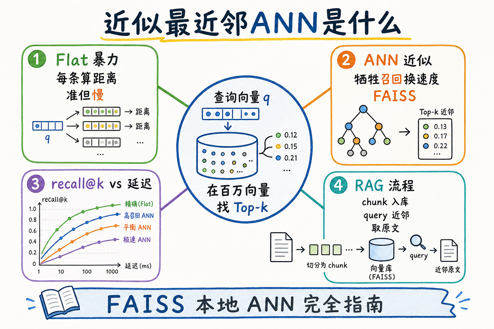
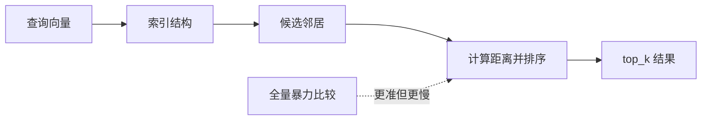
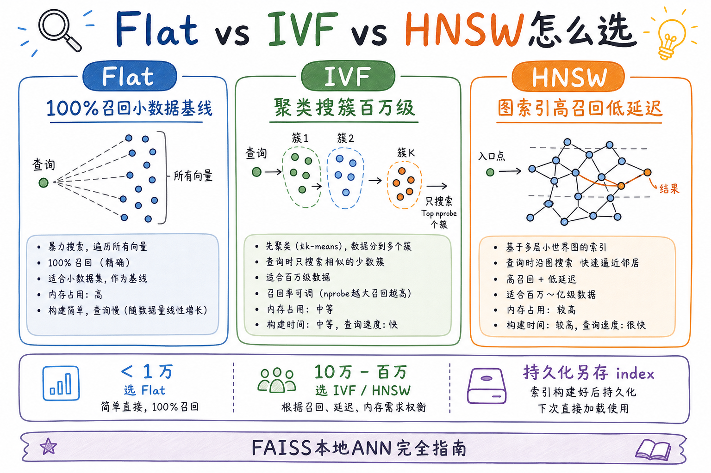
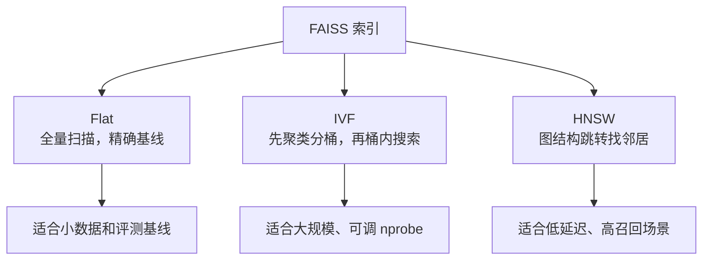
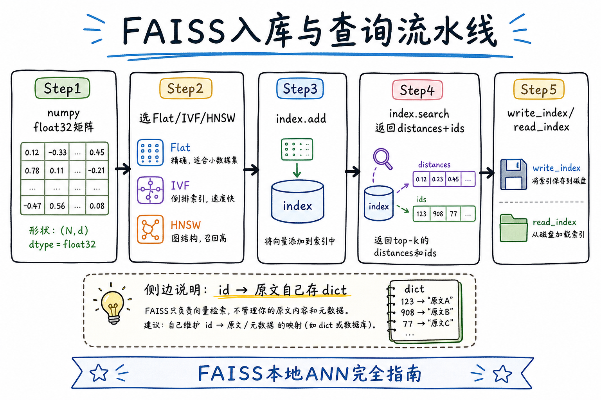
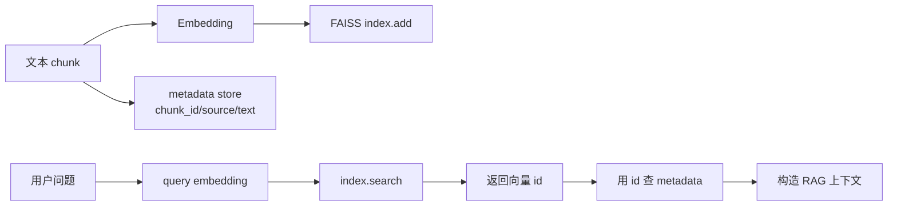
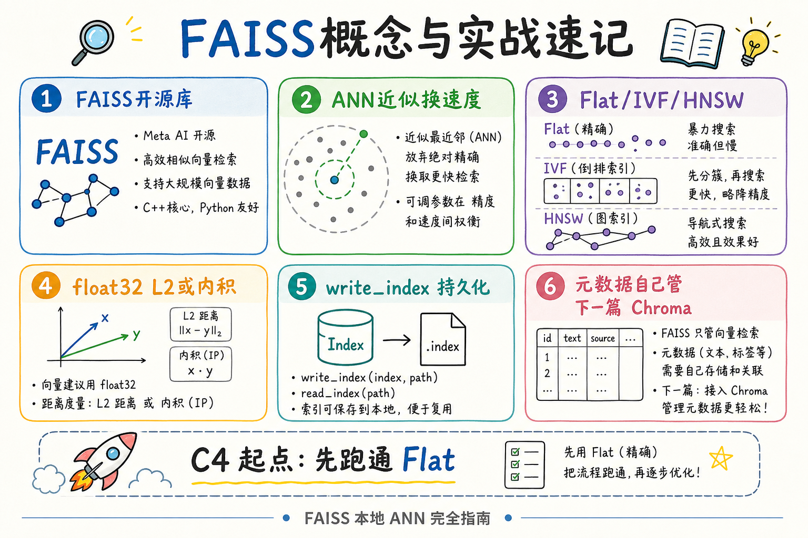
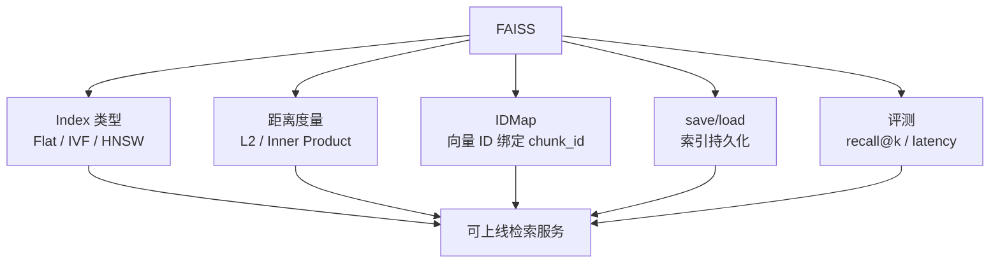

# C4 向量存储（一）：FAISS 本地 ANN 完全指南

> [25 Embedding](25.embedding-vector-tutorial.md) 把 chunk 变成了向量，[26 余弦/内积](26.similarity-metrics-tutorial.md) 讲清了「怎么打分」——但十万、百万条向量时，**每条都算一遍距离** 会慢到无法接受。企业 RAG 的索引层需要 **近似最近邻（ANN）**：用可控的召回损失换 **毫秒级查询**。这篇是 [企业 RAG 路线图](ENTERPRISE_RAG_ROADMAP.md) **C4 向量存储主线篇开篇**（路线图第 **92** 条），讲清 **FAISS**（Facebook AI Similarity Search）本地向量检索：**Flat vs IVF vs HNSW**、内存索引、**save/load**、**numpy 最小实战**，以及 **recall–latency** 权衡。前置：C3 向量化、[25](25.embedding-vector-tutorial.md)/[26](26.similarity-metrics-tutorial.md) 相似度基础；下一篇 [76 Chroma](76.chroma-vector-db-tutorial.md) 在 FAISS 之上补 **持久化 + 元数据** 的「向量库」体验。

---

## 目录

1. [前言：向量有了，怎么在本地「搜邻居」](#1-前言向量有了怎么在本地搜邻居)
2. [本文边界与动手路径](#2-本文边界与动手路径)
3. [ANN 是什么：精确 vs 近似](#3-ann-是什么精确-vs-近似)
4. [FAISS 是什么、解决什么问题](#4-faiss-是什么解决什么问题)
5. [索引家族：Flat、IVF、HNSW](#5-索引家族flativfhnsw)
6. [距离度量：L2 与内积](#6-距离度量l2-与内积)
7. [先错后对：三种典型选型翻车](#7-先错对对三种典型选型翻车)
8. [入库与查询流水线](#8-入库与查询流水线)
9. [最小实现：numpy + FAISS Flat](#9-最小实现numpy--faiss-flat)
10. [IVF 与 HNSW 进阶片段](#10-ivf-与-hnsw-进阶片段)
11. [save/load 与 id 映射](#11-saveload-与-id-映射)
12. [recall–latency 权衡与评测](#12-recalllatency-权衡与评测)
13. [综合概念地图](#13-综合概念地图)
14. [常见陷阱与 FAQ](#14-常见陷阱与-faq)
15. [总结与系列下一步](#15-总结与系列下一步)

---

## 1. 前言：向量有了，怎么在本地「搜邻居」

你在 [25 篇](25.embedding-vector-tutorial.md) 已经跑过「三句文本谁更近」：把文本 embed 成向量，用余弦比大小。**玩具数据** 三条、三十条，暴力循环 `for v in vectors: score(v, q)` 完全够用。

企业知识库入库后常见规模：

| 规模 | chunk 条数（粗估） | 暴力 Flat 体感 |
|------|-------------------|----------------|
| 小 PoC | 1k～1 万 | 毫秒级，可接受 |
| 部门手册库 | 5 万～50 万 | 单次查询百毫秒～秒级 |
| 全公司文档 | 百万+ | 必须 ANN 或分片 |

**ANN**（Approximate Nearest Neighbor，近似最近邻）：不保证找到 **全局** Top-k，但在高维空间里用 **聚类、图、量化** 等结构，把搜索范围缩小到「很可能包含真邻居」的子集，从而 **大幅降延迟**。  
通俗说：**不再把整座图书馆每一页都翻一遍，而是先根据索引牌跳到几个书架，再细找**——偶尔漏一本，但大多数时候够快够准。

**FAISS**（Facebook AI Similarity Search）：Meta 开源的 **高效向量相似度搜索** 库，CPU/GPU 均可，Python 绑定成熟，是本地原型与不少生产管道的 **默认 ANN 引擎之一**。  
通俗说：**专门干「给定 query 向量，从百万向量里捞出 Top-k」这一件事的瑞士军刀**。

**读完本文，你应该能做到：**

1. 解释 **精确检索（Flat）** 与 **ANN（IVF/HNSW）** 的差异与适用规模。  
2. 选对 **IndexFlatL2 / IndexFlatIP** 与是否 **L2 归一化**（衔接 [26 篇](26.similarity-metrics-tutorial.md)）。  
3. 用 **numpy float32** 矩阵跑通 `add` + `search` + `write_index` / `read_index`。  
4. 维护 **FAISS 内部 id → chunk 原文/元数据** 的外部映射表。  
5. 口述 **recall@k vs latency** 权衡，知道何时上 IVF/HNSW。  
6. 识别 §7 三种「索引选错 / metric 错 / 忘持久化」翻车。

### 1.1 C4 主线在路线图中的位置

```text
C3 向量化（78～91）→ 向量坐标已就绪
C4 向量存储与检索 ← 本篇开篇（92 FAISS）
93 Chroma（轻量库 + 元数据）
94～ Milvus / Qdrant / pgvector ...
混合检索、重排序（后续 C4/C5）
```

C3 回答 **「文本怎么变成可比的向量」**；C4 回答 **「百万向量怎么存、怎么快搜、怎么和元数据/权限拼接」**。FAISS 偏 **引擎**——不管你的 chunk 文本存在哪，它只管 **向量的近邻**。

### 1.2 术语双轨速查

| 中文 | English | 一句话 |
|------|---------|--------|
| 最近邻 | Nearest Neighbor (NN) | 离 query 最近的向量 |
| 近似最近邻 | ANN | 允许漏检换速度 |
| 平坦索引 | Flat Index | 暴力全量比较 |
| 倒排文件 | IVF (Inverted File) | 聚类后只搜部分簇 |
| 分层导航小世界图 | HNSW | 图结构近似搜索 |
| 召回率 | Recall@k | 真邻居在 Top-k 中的比例 |

### 1.3 读完本篇的最小交付物

1. 一张 **ingest → index.add → search → 映射 id** 数据流图（§8）；  
2. 一份本地 **`index.faiss` + `id_map.json`** 持久化目录结构（§11）；  
3. 一个 **可跑的 §9 Flat 脚本**（无 API Key，纯 numpy 假向量亦可）；  
4. 三条 **先错对对** 口述（§7）；  
5. 一句话说明 **何时读 76 Chroma**（要内置元数据过滤与 Mini-RAG 一体体验时）。

---

## 2. 本文边界与动手路径

**档位：C4 主线篇（路线图 92，厚实现导向）。**

**本文讲：** ANN 直觉、FAISS 索引类型选型、L2/IP、内存索引、save/load、numpy 最小实战、recall–latency、与 Chroma 分工预告。  
**本文不讲：** GPU 大规模训练式索引调参全书、PQ 乘积量化 bit 级细节、分布式 Milvus 集群、混合 BM25+向量（C4 后续篇）。

### 2.1 动手路径表

| 步骤 | 你做什么 | 验收 |
|------|----------|------|
| A | 读 §3～§4，画「query → ANN → ids」 | 能口述 ANN 价值 |
| B | 读 §5～§6，定 metric（L2 vs IP） | 与 Embedding 是否归一化一致 |
| C | 跟做 §9 Flat 脚本 | `search` 返回 Top-3 ids |
| D | 完成 §11 save/load | 重启进程后仍能 query |
| E | 读 §10，把同一数据换 IVF 或 HNSW | 对比耗时（可选） |
| F | 完成 §7 先错对对 + §13 概念地图 | 能向同事解释选型 |

**环境：** Python 3.10+；`pip install faiss-cpu numpy`（有 NVIDIA GPU 可换 `faiss-gpu`，接口类似）。Windows 上 `faiss-cpu` 轮子通常可直接装；若失败，查官方预编译说明或用 WSL。

### 2.2 沿用前文

| 概念 | 来自 |
|------|------|
| 向量从哪来 | [25 Embedding](25.embedding-vector-tutorial.md) |
| cosine / IP / L2 | [26 相似度](26.similarity-metrics-tutorial.md) |
| chunk 文本与 chunk_id | [51 chunk_id](51.metadata-chunk-id-tutorial.md) |
| 维度与重建 | C3 路线图 82、84 |
| Parent 只 embed child | [65 Parent-Document](65.parent-document-retriever-tutorial.md) |

---

## 3. ANN 是什么：精确 vs 近似

读下图：暴力最近邻与 ANN 在「查全率」和「延迟」上的位置。




下面这张图说明 ANN 的直觉。读图时重点看：ANN 不逐个比较所有向量，而是用索引结构快速找到“很可能接近”的候选。



结论：ANN 用少量召回损失换速度。上线前必须评测 recall 和延迟，而不是只看查询跑得快。

对照上图：

- **Flat（精确）**：对库中 **每一条** 向量算距离，再排序取 Top-k——**Recall@k = 100%**（在同一 metric 定义下），时间复杂度约 **O(N·dim)**。  
- **ANN**：通过 **预处理结构**（聚类中心、多层图……）跳过大量明显不相关的向量——**可能漏掉真邻居**，但 **延迟可降一个数量级**。  
- **RAG 工程现实**：检索只是管道一环；常配合 **rerank**、**混合检索**、**更大 top_k 再过滤**。ANN 的「99% 召回」在不少业务上 **够用**，但要 **用评测集验证**，不能凭感觉。

### 3.1 高维空间的「诅咒」

Embedding 常见 384～1536 维。维度升高时，「最近邻」的直觉会变模糊——所有点距离分布更接近，**暴力搜索更贵**，ANN 结构的价值更大。  
初学者不必啃证明；记住：**维数高 + 条数多 → 优先 ANN 索引，Flat 作基线对照**。

### 3.2 何时可以只用 Flat

| 条件 | 建议 |
|------|------|
| N < 1 万 | Flat 往往足够 |
| 离线批处理、延迟不敏感 | Flat 作 golden 对照 |
| 调 ANN 参数 | 用 Flat 结果算 recall@k |
| 面试手写 demo | Flat 最简单 |

**默认路径**：PoC 用 Flat 跑通 **id 映射 + save/load**；数据上万条再切 IVF 或 HNSW。

---

## 4. FAISS 是什么、解决什么问题

**FAISS** 提供：

1. **多种索引类型**（Flat、IVF、HNSW、PQ 组合……）；  
2. **批量 add / search** 的 C++ 内核 + Python API；  
3. **GPU 加速**（可选）；  
4. **序列化** `write_index` / `read_index`。

它 **不** 提供：

- 文档原文存储（你要自己用 dict、SQLite、Postgres 存）；  
- 元数据过滤 DSL（检索前过滤要自己实现，或换 [76 Chroma](76.chroma-vector-db-tutorial.md)）；  
- 多租户 HTTP 服务（要自建 API 或用向量数据库产品）。

**分工口诀**：FAISS = **向量近邻计算器**；RAG 系统 = **FAISS + 文本库 + 元数据 + Embedding API**。

### 4.1 与「手写 numpy 循环」对比

手写：

```python
# 教学用，生产请用 FAISS
scores = vectors @ query_vec  # (N, dim) @ (dim,)
top_ids = np.argsort(-scores)[:k]
```

当 N 到十万、百万，纯 Python 循环慢；numpy 矩阵乘尚可但 **内存全量、无 ANN**。FAISS 在同一套 API 下可切换到 IVF/HNSW，且 **search 实现高度优化**。

### 4.2 在 RAG 链路中的位置

```text
入库：chunk 文本 → embed → float32 向量 → index.add
      chunk 文本 + 元数据 → 你自己的 DOC_STORE[id]

查询：question → embed → index.search(q, k) → ids
      → DOC_STORE[id] 取文本 → 拼 prompt → LLM
```

FAISS 只出现在 **embed 之后、取文本之前** 的那一步。

---

## 5. 索引家族：Flat、IVF、HNSW

读下图三列对比——这是 C4 面试与排障的高频图。



下面这张图对比 FAISS 常见索引家族。读图时重点看：Flat 精确但慢，IVF 先分桶，HNSW 用图结构找近邻。



结论：先用 Flat 做基准，再评估 IVF/HNSW 是否值得引入。没有基准就不知道 ANN 丢了多少召回。

对照上图可以得出一个实用结论：先确认「Flat vs IVF vs HNSW」里的主流程，再去调整具体参数或实现细节。

### 5.1 IndexFlatL2 / IndexFlatIP（Flat）

| 类名 | 度量 | 说明 |
|------|------|------|
| `IndexFlatL2` | 欧氏距离平方 | 距离 **越小** 越近 |
| `IndexFlatIP` | 内积 | 分数 **越大** 越近（常配合归一化向量 ≈ cosine） |

创建：`index = faiss.IndexFlatIP(dim)` 或 `IndexFlatL2(dim)`。  
`index.add(xb)` 要求 `xb` 为 `numpy.ndarray`，`dtype=float32`，`shape=(n, dim)`。

**特点**：实现简单、**100% 召回**、无训练阶段；数据量大时 **慢 + 占内存**。

### 5.2 IndexIVFFlat（IVF）

**IVF**（Inverted File）：先用 **k-means** 把向量聚成 `nlist` 个簇；查询时只搜索 **离 query 最近的 nprobe 个簇** 内的向量。

典型步骤：

1. `quantizer = faiss.IndexFlatL2(dim)`  
2. `index = faiss.IndexIVFFlat(quantizer, dim, nlist)`  
3. **`index.train(xb)`**（需要足够样本，通常 ≥ nlist）  
4. `index.add(xb)`  
5. 查询前 `index.nprobe = 10`（调大 → 更准更慢）

**特点**：百万级常用；要调 `nlist`、`nprobe`；**train 数据分布** 应代表线上数据。

### 5.3 IndexHNSWFlat（HNSW）

**HNSW**（Hierarchical Navigable Small World）：多层图结构，查询时 **贪心游走** 找近邻。

创建示例：`index = faiss.IndexHNSWFlat(dim, M)`，`M` 为每节点最大连边数（常见 16～64）。

**特点**：**高召回、低延迟** 表现好；**内存占用** 通常高于 IVF；添加向量后结构会更新；适合 **读多写少** 或批量构建后服务。

### 5.4 选型速查表

| 场景 | 首选 | 备注 |
|------|------|------|
| 学习 / <1 万条 | Flat | 作 golden |
| 百万条、可 train | IVF | 调 nprobe |
| 要低延迟高召回、内存够 | HNSW | 注意构建时间 |
| 要压内存 | IVF+PQ（进阶） | 本篇不展开 |
| 要元数据 where 过滤 | 考虑 Chroma / pgvector | [76 篇](76.chroma-vector-db-tutorial.md) |

### 5.5 三种索引的「性格」故事（帮助记忆）

把向量库想成 **找同学问问题**：

- **Flat**：开学典礼上 **逐个问遍全校**——谁与你兴趣最合，一定找得到，但全校一万人要问一小时。  
- **IVF**：先按 **院系聚类**，你只去 **相似院系 + 隔壁两个院系** 问——大多数人能对上，偶尔转专业的学生被分到冷门簇会漏。  
- **HNSW**：校园里有很多 **「熟人引路人」**，每人认识几个更内行的朋友，你沿着引路人链 **几跳就找到圈子**——通常又快又准，但要维护这张关系网（内存）。

面试时能用这个故事讲清 **trade-off**，比背 `nlist` 公式更打动人。

### 5.6 IndexIDMap 与 IndexIDMap2

默认 `add` 后 FAISS 内部 id 是 **0,1,2,…**。生产要用 **业务 chunk_id** 时：

```python
base = faiss.IndexFlatIP(dim)
index = faiss.IndexIDMap2(base)
# ids 必须是 int64 数组
index.add_with_ids(xb, np.array([1001, 1002, 1003], dtype="int64"))
```

若 `chunk_id` 是字符串（如 `hb:v1:c001`），维护 **`chunk_id ↔ int64`** 双向表，或 **哈希**（注意碰撞风险）。Chroma 则 **原生 string ids**——这是向量库便利之一。

### 5.7 线程与并发

FAISS **search** 在多线程读 **只读索引** 时通常安全；**并发 add** 需查版本说明，生产常见 **单线程建库、多线程查询**。Chroma 嵌入式模式 **避免多进程同时写** 同一目录。PoC 单进程足够；QPS 高时把索引放 **专用检索服务** 进程。

---

## 6. 距离度量：L2 与内积

FAISS 只负责按你指定的距离规则找近邻，所以距离度量一定要和 Embedding 的训练方式对齐。对初学者来说，最实用的判断是：向量如果已经归一化，内积和余弦相似度基本等价；如果没有归一化，直接用内积可能会把“向量长度大”误当成“语义更近”。

与 [26 篇](26.similarity-metrics-tutorial.md) 对齐：

- **OpenAI 等 Embedding** 输出常已 **L2 归一化** → 用 **`IndexFlatIP`**，内积等价于余弦相似度。  
- **未归一化** → 用 L2 或先 `faiss.normalize_L2(xb)` 再 IP。

```python
import faiss
import numpy as np

xb = np.random.randn(100, 128).astype("float32")
faiss.normalize_L2(xb)  # 按行归一化
index = faiss.IndexFlatIP(128)
index.add(xb)
```

**铁律**：入库与查询 **同一 metric**；换 metric = 重建索引。

### 6.1 search 返回值怎么读

```python
distances, indices = index.search(xq, k)
```

- **IP**：`distances` 越大越好（FAISS 返回的即是内积值）。  
- **L2**：`distances` 越小越好（返回 L2 平方距离）。  
- `indices` 为 **FAISS 内部序号**（0～N-1），除非你用了 `IndexIDMap` 映射业务 id。

---

## 7. 先错对对：三种典型选型翻车
FAISS 的坑通常来自把“索引库”当成“完整检索系统”。它能高效找近邻向量，但不替你保存原文、不理解业务权限，也不会自动选择最适合的索引类型。下面三类错误分别对应规模、metadata 和距离度量。

### 7.1 错：百万条仍用 Flat，抱怨「FAISS 好慢」

**对**：Flat 是 **故意精确**；上百万条应 **IVF 或 HNSW**，并用 Flat 子集算 recall@k 验证 ANN 参数。

### 7.2 错：Embedding 已归一化，却用 IndexFlatL2 且不设阈值

**对**：归一化向量在球面上，**IP/cosine** 更贴模型语义；L2 与 IP 在归一化后虽可排序相关，但团队文档应 **与 26 篇一致写 cosine/IP**，避免阈值混用。

### 7.3 错：只 `write_index`，不存 id→文本，重启后「搜到序号却没有原文」

**对**：FAISS 索引 **不含** chunk 文本；并行维护 `id_map.json` 或 SQLite（§11）。  
**76 Chroma** 把 documents 存在 collection 里——这是 **向量库 vs 向量引擎** 的核心差异。

### 7.4 错：IVF 不 train 直接 add

**对**：`IndexIVFFlat` 必须先 `train`，且 train 样本量要够；否则报错或召回极差。

### 7.5 错：把 FAISS 当多租户权限系统

**对**：ACL 过滤在 **search 前** 缩小候选 id 集合，或检索后按元数据过滤（效率差）；生产常用 **带 metadata filter 的向量库**（下一篇）。

---

## 8. 入库与查询流水线

读下图时，先看「FAISS 入库与查询流水线」想表达的主线：它把本节的概念关系压缩成一张可对照的图。




下面这张图展示 FAISS 的入库与查询流水线。读图时重点看：FAISS 只管向量索引，业务 metadata 和原文通常还要单独存。



结论：FAISS 返回的是向量 ID 和距离，不是完整文档。RAG 系统必须维护 ID 到 chunk metadata 的映射。

对照上图，标准 **离线建索引** 流程：

1. **准备数据**：chunk 列表，每条含 `chunk_id`、`text`、元数据。  
2. **批量 embed**：得到 `(N, dim)` 的 `float32` 矩阵（C3 batching）。  
3. **构建 index**：选 Flat/IVF/HNSW，`add` 向量。  
4. **建立映射**：`faiss_idx → chunk_id` 或直接用 `IndexIDMap2` 绑业务 id。  
5. **持久化**：`write_index` + 存 `id_map` 与元数据。  
6. **查询**：embed query → `search` → 映射 → 取 `text` → rerank（可选）→ LLM。

### 8.1 与 Parent-Document（65 篇）拼接

若采用 Parent-Document：**只有 child 向量进入 FAISS**；`id_map[faiss_id]` 存 `child_chunk_id`，并带 `parent_chunk_id`；search 命中后 **查 parent store 取全文** 拼 prompt——FAISS 层无感知，映射表里有字段即可。

### 8.2 增量更新

FAISS 原生 **append** 友好（`add` 新向量）；**删除** 较弱（常需重建或 `IDSelector` 标记删除）。企业 **版本全量替换**（[48 版本](48.doc-versioning-tutorial.md)、[49 增量](49.incremental-update-tutorial.md)）时，常见做法是 **新 index 文件切换** 而非原地删向量。

---

## 9. 最小实现：numpy + FAISS Flat

以下 **教学可跑**：用 **随机向量** 模拟 Embedding；替换 `embed_texts()` 为真实 API 即可接入 C3。

### 9.1 假 Embedding 与建库

```python
import json
import faiss
import numpy as np
from pathlib import Path

DIM = 64  # 教学用小维度；生产换 384/1536
DATA_DIR = Path("faiss_demo")
DATA_DIR.mkdir(exist_ok=True)

# ---------- 语料 ----------
CHUNKS = [
    {"chunk_id": "hb:v1:c001", "text": "一线城市住宿上限 500 元每晚", "section": "差旅"},
    {"chunk_id": "hb:v1:c002", "text": "二线城市住宿上限 350 元每晚", "section": "差旅"},
    {"chunk_id": "hb:v1:c003", "text": "年假最少 5 天，入职满一年享受", "section": "休假"},
    {"chunk_id": "hb:v1:c004", "text": "报销需在发生后 30 日内提交", "section": "财务"},
    {"chunk_id": "hb:v1:c005", "text": "培训经费每人每年 2000 元", "section": "人事"},
]


def embed_texts(texts: list[str], dim: int = DIM) -> np.ndarray:
    """生产替换为 OpenAI / BGE；此处用哈希种子假向量"""
    vecs = np.zeros((len(texts), dim), dtype="float32")
    for i, t in enumerate(texts):
        rng = np.random.default_rng(abs(hash(t)) % (2**32))
        vecs[i] = rng.standard_normal(dim).astype("float32")
    faiss.normalize_L2(vecs)
    return vecs


def build_flat_index(chunks: list[dict]) -> tuple[faiss.Index, list[dict]]:
    texts = [c["text"] for c in chunks]
    xb = embed_texts(texts)
    index = faiss.IndexFlatIP(DIM)
    index.add(xb)
    # faiss 内部 id 即 0..n-1，与 chunks 行序一致
    id_map = [{**c, "faiss_id": i} for i, c in enumerate(chunks)]
    return index, id_map


def save_all(index: faiss.Index, id_map: list[dict]):
    faiss.write_index(index, str(DATA_DIR / "index.faiss"))
    (DATA_DIR / "id_map.json").write_text(
        json.dumps(id_map, ensure_ascii=False, indent=2), encoding="utf-8"
    )


def load_all() -> tuple[faiss.Index, list[dict]]:
    index = faiss.read_index(str(DATA_DIR / "index.faiss"))
    id_map = json.loads((DATA_DIR / "id_map.json").read_text(encoding="utf-8"))
    return index, id_map
```

### 9.2 查询

```python
def search(index: faiss.Index, id_map: list[dict], query: str, k: int = 3):
    q = embed_texts([query])
    distances, indices = index.search(q, k)
    hits = []
    for dist, idx in zip(distances[0], indices[0]):
        if idx < 0:
            continue
        rec = id_map[idx]
        hits.append({
            "chunk_id": rec["chunk_id"],
            "text": rec["text"],
            "section": rec["section"],
            "score": float(dist),
        })
    return hits


if __name__ == "__main__":
    index, id_map = build_flat_index(CHUNKS)
    save_all(index, id_map)

    index2, id_map2 = load_all()
    for q in ["住宿标准多少钱", "年假有几天", "报销期限"]:
        print(f"\nQ: {q}")
        for h in search(index2, id_map2, q, k=2):
            print(f"  [{h['score']:.3f}] {h['section']} | {h['text']}")
```

代码后解读：

1. **`float32` + `normalize_L2` + `IndexFlatIP`** 与常见 cosine 检索一致。  
2. **id_map** 与 index **行序绑定**——生产用 `chunk_id` 作业务主键，考虑 `IndexIDMap2`。  
3. **`write_index` / `read_index`** 只存向量结构，**文本必须在 sidecar 文件**。

### 9.3 用 IndexIDMap2 绑业务 id（推荐）

```python
base = faiss.IndexFlatIP(DIM)
index = faiss.IndexIDMap2(base)
ids = np.array([int(c["chunk_id"].split("c")[-1]) for c in CHUNKS], dtype="int64")
xb = embed_texts([c["text"] for c in CHUNKS])
index.add_with_ids(xb, ids)
# search 返回的 indices 即业务 id
```

注意：业务 id 需 **int64**；字符串 `chunk_id` 可用哈希或自增整数映射表。

### 9.5 验收清单

| 检查 | 标准 |
|------|------|
| dtype | `float32` |
| metric | 与 Embedding 归一化策略一致 |
| 持久化 | 重启后 search 结果一致 |
| 映射 | 每个 hit 能取回 `text` |
| Top-k | 相关问句命中含关键词的 chunk |

### 9.6 从假向量过渡到真实 Embedding 的检查单

替换 `embed_texts` 后，务必验证：

1. **维度**：`xb.shape[1]` 与 `index.d` 一致；  
2. **归一化**：若 API 已归一化，勿 **二次 normalize** 弄坏；若未归一化，统一 `faiss.normalize_L2`；  
3. **语种**：中文库用中文友好模型（C3 87）；  
4. **金标 query**：准备 10 条真实用户问法，肉眼看 Top-3 是否 **可读、相关**；  
5. **分数分布**：记录 Top-1 与 Top-10 分数差——差过小可能 **整库语义糊**（chunk 太大，见 [65 篇](65.parent-document-retriever-tutorial.md)）。

### 9.7 教学延伸：用余弦手动验证 FAISS Top-1

对同一 query，用 numpy 暴力算 IP 与 FAISS `search` 对比——应 **id 与分数一致**（浮点误差极小）。不一致时 **90% 是 metric 或归一化搞反**。这是建立 **对 FAISS 信任** 的最好练习。

---

## 10. IVF 与 HNSW 进阶片段

Flat 索引适合理解原理和做小规模基准，但数据量上来后就需要 ANN 索引在“速度”和“召回率”之间做交换。IVF 的思路是先把向量分到若干簇里，查询时只搜部分簇；HNSW 的思路是维护一张近邻图，查询时沿图快速靠近目标。

在 §9 同一 `xb` 上对比（数据量 **至少数千** 才有意义；教学可将 CHUNKS 复制扩增）：

### 10.1 IVF 最小片段

```python
nlist = 100  # 簇数，常取 sqrt(N) 量级
quantizer = faiss.IndexFlatL2(DIM)
ivf_index = faiss.IndexIVFFlat(quantizer, DIM, nlist, faiss.METRIC_INNER_PRODUCT)
faiss.normalize_L2(xb)
ivf_index.train(xb)
ivf_index.add(xb)
ivf_index.nprobe = 10
D, I = ivf_index.search(q, 3)
```

### 10.2 HNSW 最小片段

```python
hnsw = faiss.IndexHNSWFlat(DIM, 32, faiss.METRIC_INNER_PRODUCT)
faiss.normalize_L2(xb)
hnsw.add(xb)
D, I = hnsw.search(q, 3)
```

### 10.3 对比 Flat 算 recall@k

```python
def recall_at_k(approx_ids, exact_ids, k):
    return len(set(approx_ids[:k]) & set(exact_ids[:k])) / k

# exact: Flat search; approx: IVF/HNSW search
```

用 **同一评测 query 集** 画 **nprobe–recall–latency** 曲线——比背参数更有说服力。

---

## 11. save/load 与 id 映射

FAISS 保存的是向量索引本身，不等于保存了一套完整知识库。真实项目里还必须同步保存业务 ID、原文片段、source、page、section 等 metadata，否则查到第 12 行向量时，你不知道它对应哪段文档。


推荐目录结构：

```text
faiss_demo/
  index.faiss          # FAISS 二进制索引
  id_map.json          # faiss 行号或业务 id → chunk 记录
  meta.json            # 可选：dim, metric, model_name, built_at
```

**meta.json** 应记录 **Embedding 模型名与版本**（[25 篇](25.embedding-vector-tutorial.md)）：换模型必须 **重 embed + 重建 index**。

### 11.1 内存占用粗算

`N * dim * 4` 字节（float32），外加 HNSW 图开销。  
例：100 万 × 1536 × 4 ≈ **6 GB** 仅向量——规划机器内存与是否 PQ 压缩。

### 11.2 与 Chroma 的分工（预告）

| 能力 | FAISS | Chroma |
|------|-------|--------|
| 向量 ANN | 强 | 有（底层可换） |
| 存原文 | 自建 | collection 内置 |
| 元数据 filter | 自建 | `where=` |
| 持久化 | write_index | persist_directory |
| 适用 | 引擎/高性能定制 | 轻量 RAG PoC |

---

## 12. recall–latency 权衡与评测

**Recall@k**：对每个 query，用 **Flat 精确 Top-k** 作 gold，看 ANN 返回的 Top-k **命中几条**。  
**Latency**：单次 `search` 的 p50/p95 耗时（注意区分 **含 embed** 与 **仅 search**）。

调参方向：

| 索引 | 提高召回 | 提高速度 |
|------|----------|----------|
| IVF | 增大 nprobe | 减小 nprobe |
| HNSW | 增大 M / efSearch | 减小 efSearch |
| 通用 | 增大 k 再 rerank | 减小 k |

**RAG 端到端**：检索 recall 低时，后面 rerank 和 LLM 都救不了——应先用 **30～50 条金标 query** 测 recall@5，再谈延迟 SLA。

### 12.1 实验记录表（建议做一次）

| 索引 | 参数 | recall@5 | search p95 ms | 备注 |
|------|------|----------|---------------|------|
| Flat | - | 1.00 | | 基线 |
| IVF | nlist=, nprobe= | | | |
| HNSW | M=, ef= | | | |

### 12.2 延迟预算：端到端不是只有 search

真实 RAG 查询延迟常拆成：

| 阶段 | 典型占比 | 优化方向 |
|------|----------|----------|
| Query Embedding API | 30%～60% | 缓存、本地模型（C3 89） |
| FAISS search | 5%～40% | ANN 参数、GPU |
| 取文本 + 拼 prompt | 5%～15% | id_map 放 Redis/SQLite |
| LLM 首 token | 另计 | 与检索分开 SLA |

**初学者误区**：拼命调 `nprobe`，却发现 **p95 仍慢**——Profiler 一看，瓶颈在 **Embedding HTTP**。先用 `time.perf_counter()` 分段计时，再决定优化哪一段。

### 12.3 GPU 加速（了解即可）

安装 `faiss-gpu` 后，可将 `index` 转到 GPU：

```python
res = faiss.StandardGpuResources()
gpu_index = faiss.index_cpu_to_gpu(res, 0, cpu_index)
D, I = gpu_index.search(q, k)
```

适用：**batch 大、维数高、QPS 高** 的 search；小库 CPU 足够。GPU 索引与 CPU 索引的 **序列化** 需注意版本与设备环境——开发机 GPU、生产 CPU 时，常在生产 **CPU read_index** 更稳。

### 12.4 PQ 乘积量化（进阶预告）

**PQ**（Product Quantization）：把高维向量切成子段，每段用 **码本** 近似，显著 **降内存**。FAISS 提供 `IndexIVFPQ` 等组合。代价是 **召回进一步下降**，需更强 rerank。  
**何时考虑**：单机内存放不下 `N×dim×4` 字节，且可接受调参成本。PoC 阶段 **优先 HNSW 或 IVF**，PQ 放在 **压测后** 再上。

### 12.5 与 C3 Embedding 批量入库衔接

生产 ingest 常见模式：

```python
BATCH = 64
all_vecs = []
all_meta = []
for batch in chunked(chunks, BATCH):
    texts = [c["text"] for c in batch]
    vecs = embed_api(texts)  # shape (B, dim), float32
    all_vecs.append(vecs)
    all_meta.extend(batch)
xb = np.vstack(all_vecs)
index.add(xb)
```

要点：

1. API 返回 **直接 float32**，避免 float64 隐式转换浪费内存；  
2. **行序** 与 `id_map` 严格一致——off-by-one 是灾难级 bug；  
3. 失败重试时 **不要部分 add** 不留记录；用 **job id + 幂等 upsert**（[C3 86 重试](ENTERPRISE_RAG_ROADMAP.md)）。

### 12.6 多集合与多租户粗方案

FAISS 无 namespace，多租户常见三种做法：

| 方案 | 做法 | 优缺点 |
|------|------|--------|
| 每租户一 index 文件 | `tenant_a.faiss` | 隔离好，运维文件多 |
| 单 index + id 前缀 | id_map 带 `tenant_id` | 省内存，检索后过滤 |
| 按知识库分 index | 与业务域对齐 | 中等复杂度 |

**ACL**（[53 篇](53.metadata-acl-tutorial.md)）在 FAISS 层只能 **事后过滤** 或 **检索前限制 id 集合**——这也是 [76 Chroma](76.chroma-vector-db-tutorial.md) 在 PoC 更省心原因之一。

---

## 13. 综合概念地图

读下图时，先看「FAISS 概念速记」想表达的主线：它把本节的概念关系压缩成一张可对照的图。



下面这张概念地图总结 FAISS 入门要掌握的对象。读图时重点看：索引类型、距离度量、ID 映射、持久化和评测缺一不可。



结论：FAISS 是本地向量检索工具，不是完整向量数据库。生产化还要补权限、备份、服务封装和元数据存储。

对照上图可以得出一个实用结论：先确认「FAISS 概念速记」里的主流程，再去调整具体参数或实现细节。

### 13.1 速记表

| 概念 | 一句话 |
|------|--------|
| FAISS | 本地向量 ANN 引擎 |
| Flat | 精确、小数据、评测基线 |
| IVF | 聚类倒排，百万常用 |
| HNSW | 图索引，低延迟高召回 |
| 持久化 | write_index + 自建 id_map |
| 下一篇 | Chroma = 向量库体验 |

---

## 14. 常见陷阱与 FAQ

**Q：faiss-cpu 和 faiss-gpu 索引能互读吗？**  
A：同一版本一般可 `write_index` 在 CPU 建、`read_index` 在 GPU 搜，注意环境与版本一致。

**Q：查询向量要归一化吗？**  
A：若库内向量做了 `normalize_L2`，query 向量 **同样归一化** 再用 IP。

**Q：FAISS 支持 cosine 吗？**  
A：归一化后用 **内积** 即 cosine；无单独 `IndexFlatCosine`。

**Q：能按 doc_id 过滤吗？**  
A：原生不支持；可先 **按 doc 建多个 index**，或维护 **id 白名单** 再 search，或用 Chroma/pgvector。

**Q：IVF 的 nlist 怎么设？**  
A：经验起点 `sqrt(N)` 到 `4*sqrt(N)`；以 recall–latency 曲线为准。

**Q：HNSW 适合频繁删除吗？**  
A：不适合；频繁删改考虑 **定期重建** 或换支持 MVCC 的向量数据库。

**Q：和 65 篇 Parent-Document 怎么存？**  
A：FAISS 只存 **child 向量**；id_map 含 `parent_chunk_id`；parent 文本在另一 store。

**Q：Windows 装不上 faiss？**  
A：试 `pip install faiss-cpu`；或 Conda `conda install -c pytorch faiss-cpu`；或 WSL2 Linux 环境。

**Q：索引文件能放 S3 吗？**  
A：可以当 **冷存储**；服务启动时下载到本地再 `read_index`；热更新需版本切换策略。

**Q：Flat 搜出来 Top-1 不对，是 FAISS 的锅吗？**  
A：Flat 是精确的——先查 **Embedding 质量**、metric、query 与库是否 **同模型**（[25](25.embedding-vector-tutorial.md)）。

### 14.1 读路径自检（6 题）

1. ANN 牺牲什么换什么？  
2. Flat 与 IVF 最大工程差异？（train / nprobe）  
3. 归一化向量常用哪种 index？  
4. FAISS 为什么不存原文？  
5. recall@k 相对谁算？  
6. 何时读 76 Chroma？

### 14.2 动手作业（60 分钟）

1. 跑通 §9，对 3 个问句打印 Top-2；  
2. 删除 `index.faiss` 仅留 `id_map.json`，体会 **缺索引无法搜**；  
3. 把 CHUNKS 扩到 5000 条（复制变体），对比 Flat vs HNSW 的 `search` 耗时；  
4. 写一段 **id_map 丢失** 时会发生什么——团队 wiki 警示。

### 14.3 附录：FAISS + SQLite 最小 schema

```sql
CREATE TABLE chunks (
  chunk_id TEXT PRIMARY KEY,
  doc_id TEXT NOT NULL,
  version INT,
  section TEXT,
  text TEXT NOT NULL,
  faiss_id INTEGER UNIQUE
);
CREATE INDEX idx_chunks_doc ON chunks(doc_id);
```

ingest 时：`add` 后把 `faiss_id` 写回 SQLite；query 时：`search` → `SELECT * FROM chunks WHERE faiss_id IN (...)`。  
比纯 JSON **更适合增量更新** 与 **按 doc_id 列举**。

### 14.4 附录：OpenAI Embedding 接 FAISS 完整片段

```python
from openai import OpenAI
import faiss
import numpy as np

client = OpenAI()
MODEL = "text-embedding-3-small"
DIM = 1536

def embed(texts: list[str]) -> np.ndarray:
    r = client.embeddings.create(model=MODEL, input=texts)
    arr = np.array([d.embedding for d in r.data], dtype="float32")
    faiss.normalize_L2(arr)
    return arr

index = faiss.IndexFlatIP(DIM)
xb = embed([c["text"] for c in CHUNKS])
index.add(xb)
faiss.write_index(index, "handbook.faiss")
```

查询侧 **必须用同一 MODEL**；metadata 文件记录 `model=MODEL, dim=DIM, built_at=...`。

### 14.5 附录：C4 开篇周计划（FAISS + Chroma）

| 天 | 任务 | 产出 |
|----|------|------|
| Mon | 读 25/26 + 本篇 §3～§6 | 能画 ANN 示意图 |
| Tue | 跑 §9 Flat + save/load | `index.faiss` 可复现 query |
| Wed | 扩数据对比 HNSW，记 recall@5 | 调参笔记 |
| Thu | 读 [76 Chroma](76.chroma-vector-db-tutorial.md) §9 | Mini-RAG demo |
| Fri | 对照 §10 写选型一页纸 | 团队分享 |

### 14.6 团队 Review 清单（FAISS 索引 PR）

- [ ] `float32` + metric 与 Embedding 文档一致  
- [ ] `meta.json` 含 model_name / dim / metric  
- [ ] id_map 或 SQLite 能 **100% 还原 text**  
- [ ] ANN 索引附 **recall@k 评测** 相对 Flat  
- [ ] 换模型流程：重建而非原地混写  
- [ ] 大文件 **不提交 git**（`.gitignore`）

### 14.7 给产品经理的一句话

「我们把每段知识变成坐标，用 FAISS 在百万坐标里毫秒级找邻居；就像快递分拣中心按邮编先分到区域，再在区域内找具体门牌——比从全国逐户敲门快得多，但偶尔要抽几单复核是不是真的送到了最近的那户。」

### 14.8 与混合检索的衔接（预告）

路线图后续 **BM25 + 向量** 时，FAISS 常作 **稠密通道**：

```text
query → BM25 Top-50 ──┐
                      ├→ 融合 / RRF → rerank → Top-5
query → embed → FAISS Top-50 ──┘
```

FAISS 只负责右边一支；**融合逻辑不在 FAISS 内**。先单通道 recall 达标，再加稀疏通道——否则排障困难。

### 14.9 后记：为何 C4 从 FAISS 而不是直接从 Chroma 开始

Chroma 底层仍依赖 ANN 思想。先 FAISS 你会明白：

- **metric 错了** 不是库的 bug；  
- **recall 低了** 是 `nprobe` 不是 Embedding；  
- **文本丢了** 是因为 **从没存进索引**。

这三条在接任何向量数据库时都会再遇到。**引擎层一天通透，库层一周上手**——顺序不能反。

### 14.10 初学者读路径：按章勾选

| 章节 | 若你只有 15 分钟 | 若你要今天跑通 |
|------|------------------|----------------|
| §3 ANN | 必读 | 必读 |
| §5 索引选型 | 必读 | 必读 |
| §9 代码 | 浏览 | **跟打** |
| §10 IVF/HNSW | 可跳过 | 数据>1万再做 |
| §12 评测 | 浏览 | 写一张表 |
| §14 FAQ | 遇到问题再查 | 读 14.1 六题 |

### 14.11 与路线图 C3 的衔接话术

向团队同步 C4 开篇时可说：「C3 负责把 chunk **变成坐标**；C4 负责 **坐标怎么存、怎么毫秒级找邻居**。FAISS 是本地 ANN 第一课：Flat 当尺子，IVF/HNSW 扛数据量；persist 用 write_index，原文自己存。下一篇 Chroma 把存原文和 where 过滤打包，适合 Mini-RAG 演示。」

**收尾一句**：掌握 FAISS，你就拿到了 C4 的 **尺子**；后面换任何向量库，都是在换 **柜子**，量邻居的原理不变。

---

## 15. 总结与系列下一步

1. **C4 从 FAISS 起**：把 [25/26](25.embedding-vector-tutorial.md) 的向量 **落到可搜的索引**。  
2. **Flat 跑通逻辑，ANN 扛规模**——IVF/HNSW 用 recall@k 验证，不凭玄学。  
3. **metric 与归一化** 必须与 Embedding 管线一致。  
4. **`write_index` + id_map** 是持久化最小集；文本与元数据 **自己管**。  
5. 要 **Collection、where 过滤、Mini-RAG 一体** → [76 Chroma](76.chroma-vector-db-tutorial.md)。

### 15.1 系列下一步

| 目标 | 阅读 |
|------|------|
| 轻量向量库 + 元数据 | [76 Chroma](76.chroma-vector-db-tutorial.md) |
| 相似度打分 | [26 相似度](26.similarity-metrics-tutorial.md) |
| chunk 溯源 | [51 chunk_id](51.metadata-chunk-id-tutorial.md) |
| ACL 过滤 | [53 metadata ACL](53.metadata-acl-tutorial.md) |
| 分布式向量库 | 路线图 94 Milvus、98 pgvector |

### 15.2 学习目标自检

- [ ] 能画 ingest/search 流水线  
- [ ] 能解释 Flat vs IVF vs HNSW  
- [ ] 能跑 §9 并 save/load  
- [ ] 能说明 FAISS 与 Chroma 分工  
- [ ] 能定义 recall@k  

### 15.3 面试 30 秒版

「FAISS 是本地向量 ANN 库：小数据 IndexFlat 精确搜索；大数据 IVF 靠聚类+nprobe 或 HNSW 图索引换速度；向量 float32，归一化后用 IndexFlatIP 等价 cosine；索引只存向量，chunk 文本和元数据外置 id_map；持久化 write_index；ANN 用 recall@k 对 Flat 基线调参；要内置元数据和过滤看 Chroma。」

---

> **初学者可能仍困惑的点**  
> - FAISS **不是数据库**——不会帮你存 Markdown 原文。  
> - **慢** 不一定是 FAISS 不行，可能是 **该上 ANN 了还在 Flat**。  
> - **搜错** 优先怀疑 **Embedding 与 metric**，不是先换 HNSW。  
> - Chroma **不是取代** FAISS，而是 **带存储的更高层**；懂 FAISS 再看 Chroma 底层更踏实。
