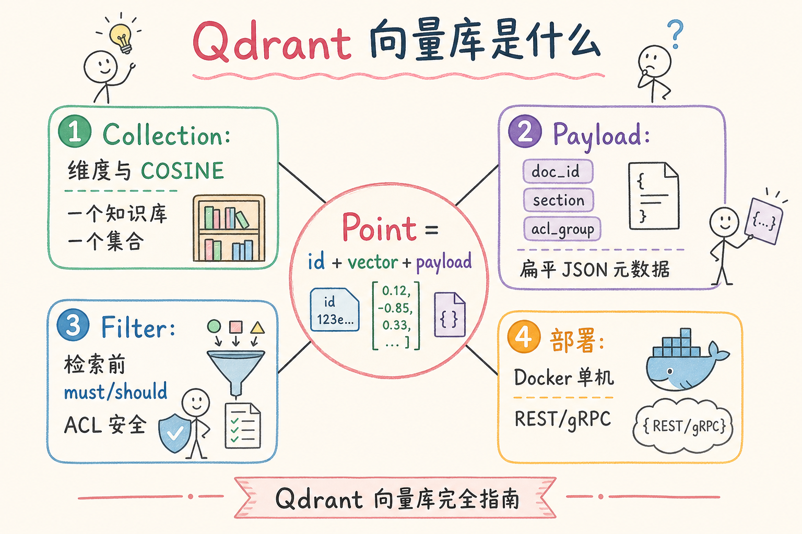
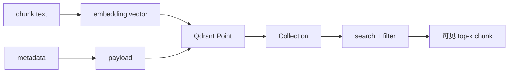
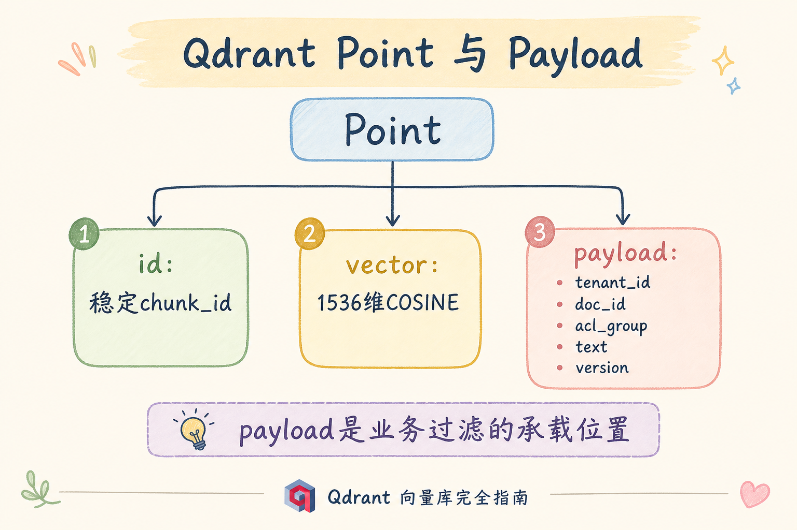
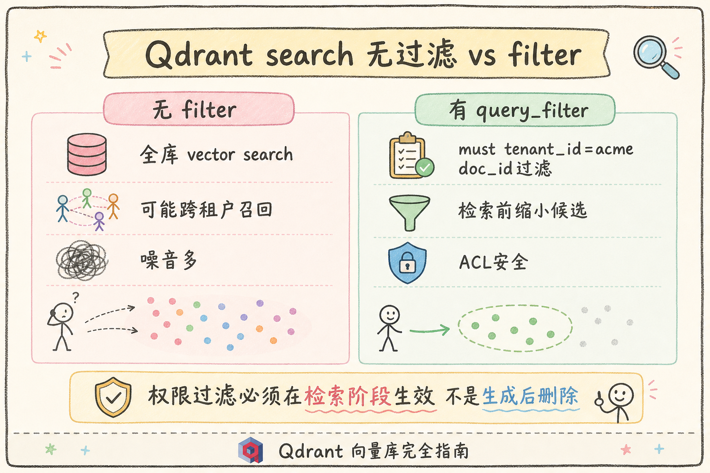
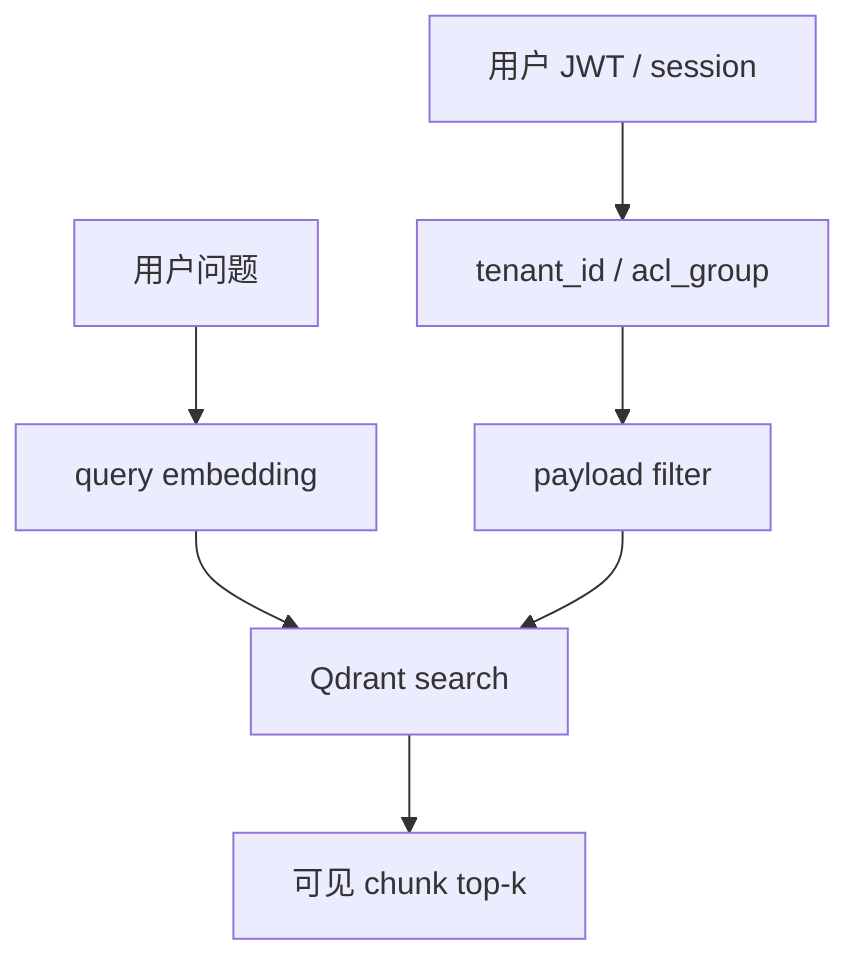
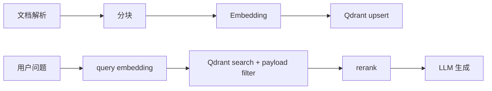

# C4 向量存储（四）：Qdrant 向量库与 Payload 过滤完全指南

**Qdrant** 是一个强调 payload 过滤体验和高性能检索的向量数据库。对 RAG 来说，它的吸引力在于：向量检索和 metadata 过滤可以自然组合，适合做租户、权限、文档类型和版本过滤。  
通俗说：向量负责“内容像不像”，payload 负责“这条内容能不能给当前用户看”。

读完本文，你应能解释 Qdrant 是什么、它解决什么问题、collection / point / payload 分别是什么，并跑通最小写入与过滤查询。

---

## 目录

1. [前言：过滤顺手的向量库](#1-前言过滤顺手的向量库)
2. [本文边界与动手路径](#2-本文边界与动手路径)
3. [Qdrant 是什么](#3-qdrant-是什么)
4. [它解决什么问题](#4-它解决什么问题)
5. [核心概念：Collection、Point、Payload](#5-核心概念collectionpointpayload)
6. [最小可运行示例](#6-最小可运行示例)
7. [Payload 过滤怎么设计](#7-payload-过滤怎么设计)
8. [在 RAG 管道中的位置](#8-在-rag-管道中的位置)
9. [选型边界：Qdrant、Milvus、Chroma](#9-选型边界qdrantmilvuschroma)
10. [调参与评测](#10-调参与评测)
11. [常见翻车与 FAQ](#11-常见翻车与-faq)
12. [总结与下一步](#12-总结与下一步)

---

## 1. 前言：过滤顺手的向量库

企业 RAG 很少是“全库搜一下”这么简单。用户身份、租户、文档版本、语言、权限组都会影响候选 chunk。Qdrant 的 payload 过滤让这些条件能和向量检索一起执行。

如果只按向量相似度检索，系统可能找到了“很相关但当前用户不能看”的 chunk。Qdrant 的价值之一，就是让这些业务约束在检索阶段生效，而不是生成答案之后再补救。

### 1.1 和 RAG 链路的关系

检索只是 RAG 的一环。Qdrant 若只 `search` 不带 `query_filter`，越权 chunk 可能进入 rerank、缓存甚至 prompt——后面 LLM 再强也救不回来。理解 Qdrant，是在 **payload filter** 与 **向量相似度** 之间写对一次查询，而不是把向量库当“黑盒 top-k API”。

### 1.2 三个典型“强过滤”场景

| 场景 | 痛点 | Qdrant 价值 |
|------|------|-------------|
| 多租户 SaaS | 租户数据不能互见 | `tenant_id` 进 filter |
| 部门权限 RAG | ACL 复杂、文档多 | `acl_group` 与向量同查 |
| 文档版本切换 | 新旧 chunk 共存 | `version` / `is_active` 控制 |

这不是说所有 RAG 都该上 Qdrant。数据量到千万级、需要复杂分布式分片时，要评估 Milvus 等（见 [77 Milvus](77.milvus-tutorial.md)）。但对很多服务化 RAG，**先把 filter 写进检索**比过早拆系统更重要。

## 2. 本文边界与动手路径

本文讲 Qdrant 入门和 RAG 常见用法，不讲集群调优、分片、副本和所有高级索引参数。先把下面四步跑通：

| 步骤 | 你做什么 | 验收 |
|------|----------|------|
| A | 创建 collection | 指定向量维度和距离 |
| B | upsert point | point 含 vector 与 payload |
| C | search | 返回相似记录 |
| D | filter payload | 只返回指定 tenant/doc_id |

最小交付物是：你能写出一次“query vector + payload filter”的检索，并解释为什么过滤条件必须进入向量库查询。

### 2.1 每步建议花多久

| 步骤 | 建议时间 | 要点 |
|------|----------|------|
| A | 30 分钟 | Docker 起 Qdrant，`create_collection` 维度与模型一致 |
| B | 45 分钟 | upsert 10～50 条真实 chunk，payload 带 tenant/doc_id |
| C | 30 分钟 | 无 filter 搜一次，观察 score 与 payload |
| D | 45 分钟 | 加 `query_filter`，验证无权限 query 不命中 |

### 2.2 本文不展开

- Qdrant 集群分片、副本、Raft 共识等运维细节
- 量化、稀疏向量、多向量 per point 等高级特性
- 全文 BM25 与混合检索（见 [83 OpenSearch 混合检索](83.opensearch-hybrid-tutorial.md)）

## 3. Qdrant 是什么

Qdrant 以 collection 管理一组 point。每个 point 包含向量和 payload。读下图时，注意 payload 不是可有可无的备注，而是业务过滤条件的承载位置。






上图的结论是：Qdrant 管的是“向量 + 业务字段”的记录。RAG 检索时既要找相似，也要确认可见。

### 3.1 与专用向量库怎么选（粗指南）

| 信号 | 倾向 Qdrant | 倾向其他 |
|------|---------------|----------|
| 强 metadata / payload 过滤 | ✓ | |
| 服务化 REST/gRPC、SDK 顺手 | ✓ | |
| 本地几百条 PoC | | Chroma 更轻 |
| 超大规模分布式、多副本 | | Milvus 等 |
| 数据必须在 Postgres 事务内 | | pgvector（见 [81](81.pgvector-tutorial.md)） |

初学者先用 Qdrant 跑通 **入库 → filter 检索 → 返回 payload**，再按评测数据决定是否换栈。

## 4. 它解决什么问题

Qdrant 适合解决“向量检索必须带业务过滤”的问题。

| 问题 | 只存向量时 | 使用 payload 后 |
|------|------------|----------------|
| 多租户隔离 | 可能跨租户召回 | `tenant_id` 进入 filter |
| 文档权限 | 应用层事后删除 | 检索阶段限制 |
| 版本切换 | 新旧 chunk 混在一起 | `version/is_active` 控制 |
| 调试追踪 | 只知道向量 ID | payload 可带 doc_id、lang、source |

它不负责生成答案，也不负责自动判断权限。权限仍要由后端根据可信身份生成 filter，再交给 Qdrant 执行。

### 4.1 案例：多租户差旅制度 RAG

某 SaaS 为多家企业提供差旅制度问答。同一 embedding 模型服务所有租户，但 `tenant_id` 必须严格隔离。

- **没有 payload filter**：query “住宿标准” 可能召回 competitor 的 chunk，进入日志和 rerank
- **用 Qdrant filter**：后端从 JWT 取 `tenant_id=acme`，`query_filter` 限定 `must: tenant_id=acme`

验收：用 `beta` 租户 token 搜 `acme` 的 doc_id，结果应为空；`acme` 用户应命中含“住宿标准”的 chunk。这类 case 是 Qdrant 的强项，不是 benchmark 数字能替代的。

## 5. 核心概念：Collection、Point、Payload

**Collection**：一组向量维度和距离度量一致的 point。  
通俗说：一个 collection 就像同一种卡片放在同一个盒子里。

**Point**：一条向量记录，包含 `id`、`vector`、`payload`。  
通俗说：一个 point 就是一个可检索的 chunk 记录。

**Payload**：业务字段，例如 `tenant_id`、`doc_id`、`acl_group`、`lang`、`version`。  


通俗说：payload 是这张卡片的标签，用来过滤和回显。

| 字段 | 示例 | 用途 |
|------|------|------|
| `tenant_id` | `acme` | 多租户隔离 |
| `doc_id` | `travel-2025` | 文档级过滤 |
| `acl_group` | `finance` | 权限控制 |
| `version` | `v2` | 文档版本 |

字段名要稳定。不要一部分数据叫 `tenant`，另一部分叫 `tenant_id`，否则 filter 会变成隐性 bug。

### 5.1 字段设计建议

| 字段 | 用途 | 易错点 |
|------|------|--------|
| `chunk_id` | 引用、日志、去重 | 与上游分块 id 命名对齐 |
| `model_id` | 换模型时筛数据 | 混模型不写此字段，召回全乱 |
| `is_active` | 软删旧版本 | 查询忘加条件，旧 chunk 复活 |
| `text` 或摘要 | 回显证据 | 塞整篇原文拖慢返回 |

可选：对低基数枚举字段建 payload index（Qdrant 支持），加速 `tenant_id`、`doc_id` 等常过滤条件。

## 6. 最小可运行示例

下面示例使用内存模式客户端，适合初学者本地快速理解数据形状。真实服务部署时，把 `QdrantClient(":memory:")` 换成你的 Qdrant 地址。

```bash
pip install qdrant-client
```

```python
from qdrant_client import QdrantClient
from qdrant_client.models import Distance, VectorParams, PointStruct, Filter, FieldCondition, MatchValue

client = QdrantClient(":memory:")

client.create_collection(
    collection_name="rag_chunks",
    vectors_config=VectorParams(size=3, distance=Distance.COSINE),
)

client.upsert(
    collection_name="rag_chunks",
    points=[
        PointStruct(
            id=1,
            vector=[0.1, 0.2, 0.3],
            payload={"tenant_id": "acme", "doc_id": "hr-2025", "text": "年假规则"},
        ),
        PointStruct(
            id=2,
            vector=[0.2, 0.1, 0.4],
            payload={"tenant_id": "acme", "doc_id": "travel-2025", "text": "住宿标准"},
        ),
    ],
)

hits = client.search(
    collection_name="rag_chunks",
    query_vector=[0.2, 0.1, 0.35],
    limit=1,
    query_filter=Filter(
        must=[FieldCondition(key="tenant_id", match=MatchValue(value="acme"))]
    ),
)

print(hits[0].payload)
```

这段代码的预期行为是：只在 `tenant_id = acme` 的 point 中找相似向量，并返回 payload。重点是 `query_filter`，它让业务约束进入检索过程。

### 6.1 先错对已：filter 写在哪

```python
# ❌ 应用层：search(limit=20) 后再 if hit.payload["tenant_id"] != "acme": continue
# 问题：越权 chunk 已进入 rerank、日志、缓存

# ✅ Qdrant 层：search(..., query_filter=Filter(must=[...]))
```

### 6.2 距离度量与 query 向量

`create_collection` 时的 `Distance.COSINE` 必须与 embedding 模型训练/推理规范一致。query 向量维度必须与 collection `size` 一致；换模型后通常要新建 collection 或全量重建 point。

## 7. Payload 过滤怎么设计

不要把所有 metadata 都塞进 payload 后不加选择。建议只把检索时真的会用到、且需要回显或审计的字段放进去。





字段设计原则：低基数、常过滤、可审计。全文内容可以作为 chunk text 返回，但不要把整篇原文都塞进 payload；长文档正文应由对象存储、数据库或文档服务管理。

### 7.1 payload 三层分工

| 层级 | 字段示例 | 说明 |
|------|----------|------|
| 隔离层 | `tenant_id`, `env` | 每次查询必带 |
| 权限层 | `acl_group`, `doc_id` | 按用户身份组合 |
| 回显层 | `text`, `source_url`, `page` | 供引用，非过滤 |

### 7.2 先错对已：信任前端 tenant_id

```python
# ❌ filter 直接用请求体里的 tenant_id
# ✅ 从认证上下文取 tenant_id，再构造 query_filter
```

前端传的 `tenant_id` 不可信。后端必须从 JWT、session 或内部服务身份推导，再写入 filter（详见 [88 metadata 过滤](88.metadata-filter-retrieval-tutorial.md)）。

## 8. 在 RAG 管道中的位置

Qdrant 位于 embedding 之后、生成之前。它负责候选召回，不负责最终答案真假。




上图的结论是：Qdrant 只是检索层。答案是否忠实、引用是否正确，还要靠 rerank、prompt、citation 和评测。

### 8.1 入库与更新策略

文档更新时：先 upsert 新 chunk（`is_active=true`），再将旧 point 标 `is_active=false` 或按 `doc_id` 批量删除。不要只更新应用层数据库而忘记 Qdrant，否则用户会看到“文档已删但还能搜到”的幽灵 chunk。

## 9. 选型边界：Qdrant、Milvus、Chroma

| 工具 | 适合 | 初学者理解 |
|------|------|------------|
| Chroma | 本地 PoC、教学 | 最快跑通 |
| Qdrant | 过滤友好、服务化 RAG | payload 体验好 |
| Milvus | 大规模、分布式向量仓库 | 运维能力更强 |

如果你的主要痛点是按租户、权限、doc_id、版本过滤，Qdrant 很值得优先试。如果只是几百条本地学习数据，Chroma 可能更轻；如果是大规模分布式向量平台，Milvus 可能更适合。

### 9.1 规模粗算：何时该认真调索引

Qdrant 默认 HNSW 索引（见 [86 HNSW](86.hnsw-index-tutorial.md)）。十万级 chunk 通常可接受；百万级以上要测 P95 延迟和 recall，并关注内存。经验上：**filter 选择性差**（如只过滤 `lang`）时，有效候选集仍大，延迟与无 filter 接近。

### 9.2 与 pgvector、Pinecone 的迁移时机

- 数据与权限已在 Postgres、团队 SQL 强 → 评估 [81 pgvector](81.pgvector-tutorial.md)
- 要快托管、合规允许出域 → 评估 [80 Pinecone](80.pinecone-tutorial.md)
- 迁移前用同一评测集各跑 recall@k，避免“为迁移而迁移”

## 10. 调参与评测

不必一开始上千条 query。从业务日志抽 50～100 条，标注期望 `chunk_id`，对比：

| 指标 | 说明 |
|------|------|
| recall@k | 与无 filter 全库搜（或小样本 Flat）在**同 filter 下**的重叠 |
| p95 latency | 含网络与 SDK 序列化 |
| 越权率 | 无权限 query 是否返回 0 条 |

调参顺序：先确认 `query_filter` 与距离度量正确 → 再调 `limit` / HNSW `ef`（若暴露）→ 最后接 rerank。把 `tenant_id`、`filter_hash`、`latency_ms` 打进结构化日志（[190](190.structured-logging-rag-tutorial.md)）。

### 10.1 评测：正负例模板

| 用例类型 | 用户身份 | 期望 |
|----------|----------|------|
| 正例 | 财务组成员 | 能召回财务制度 chunk |
| 负例 | 无财务权限 | 不返回财务 chunk |
| 边界 | 跨租户 token | 0 条命中 |
| 回归 | 改 filter 代码后 | 自动化跑全量负例 |

带 filter 的 recall 必须单独测，不能只在无 filter 环境调参（与 [87 ANN 评测](87.ann-recall-latency-tutorial.md) 同理）。

## 11. 常见翻车与 FAQ

### 11.1 payload 字段可以随意命名吗？

不建议。后期会出现 `tenant`、`tenant_id`、`org` 混用。正确做法是统一字段字典，入库流水线校验必填 payload。

### 11.2 只在业务层过滤可以吗？

不可以。越权 chunk 会先被召回，甚至进入日志、缓存或 rerank。正确做法是在 Qdrant filter 中限制。

### 11.3 payload 能放整篇文档吗？

不建议。payload 过大会拖慢返回和网络传输。point 存 chunk 文本或引用即可，全文另存。

### 11.4 文档更新后旧 chunk 怎么办？

payload 带 `version` 或 `is_active`，查询时只召回有效版本；重建索引时要清理旧 point。

### 11.5 为什么 search 返回空？

常见原因：filter 过严、`is_active` 未设、collection 名错、query 向量维度不一致、或该 tenant 确实无数据。先用无 filter 的 search 缩小范围。

### 11.6 换 embedding 模型后要做什么？

新建 collection 或全量重算向量并 upsert，更新 payload 里 `model_id`，**不能**只改应用层模型名。

### 11.7 排错速查

| 现象 | 可能原因 |
|------|----------|
| 有权限却搜不到 | filter 过严、`is_active=false`、post-filter 候选不足 |
| 无权限却能搜到 | 漏写 `query_filter`、信任前端 tenant_id |
| 偶发越权 | 缓存 key 未含 tenant、异步任务用错用户上下文 |
| 延迟突然变高 | 数据量涨、HNSW ef 变大、payload 过大 |

## 12. 总结与下一步

Qdrant 的核心价值是把向量相似度和业务过滤自然结合。初学者重点掌握 collection、point、payload、filter 四个概念，并把权限过滤放在检索阶段。

### 12.1 本篇检查清单

- [ ] `create_collection` 维度、距离与 embedding 模型一致
- [ ] 能写带 `query_filter` 的 `search`，filter 来自后端可信身份
- [ ] 理解 filter 必须在检索阶段，不能事后应用层删
- [ ] 正负例测试可自动化，带 filter 条件下测过 recall
- [ ] 知道文档更新时如何失效旧 point

下一步可以读 [79 Weaviate](79.weaviate-tutorial.md) 对比图式 schema，也可以读 [83 OpenSearch 混合检索](83.opensearch-hybrid-tutorial.md) 理解向量和 BM25 如何并联。
