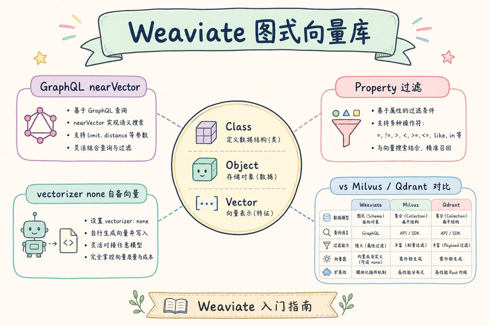
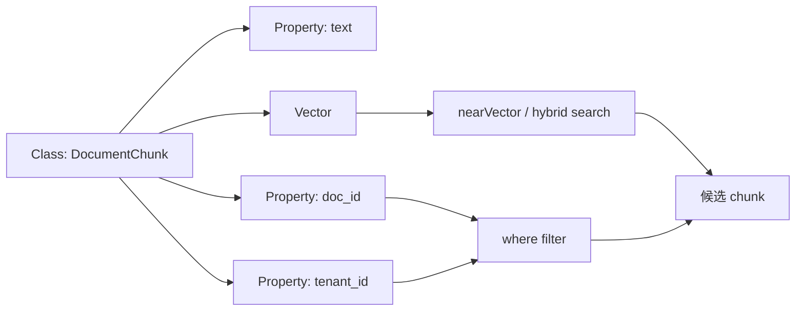
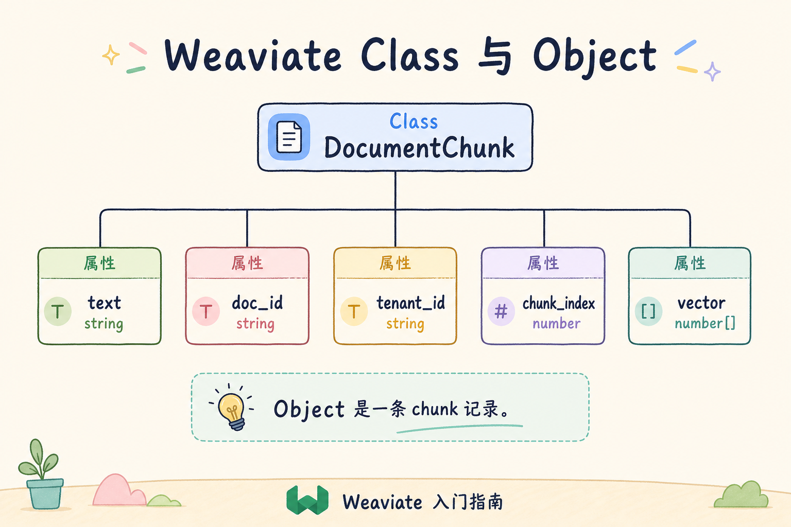
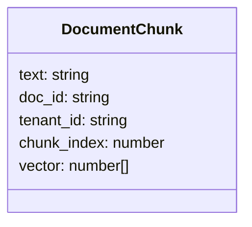
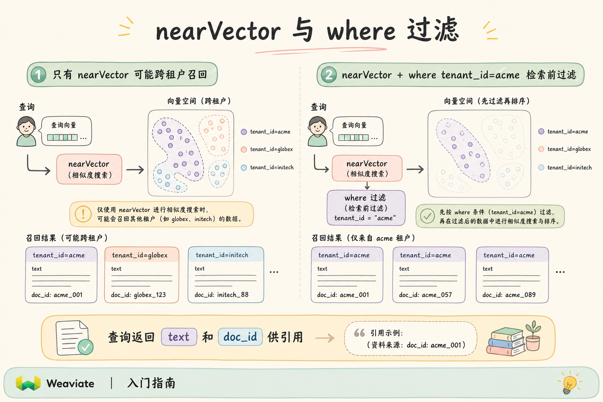
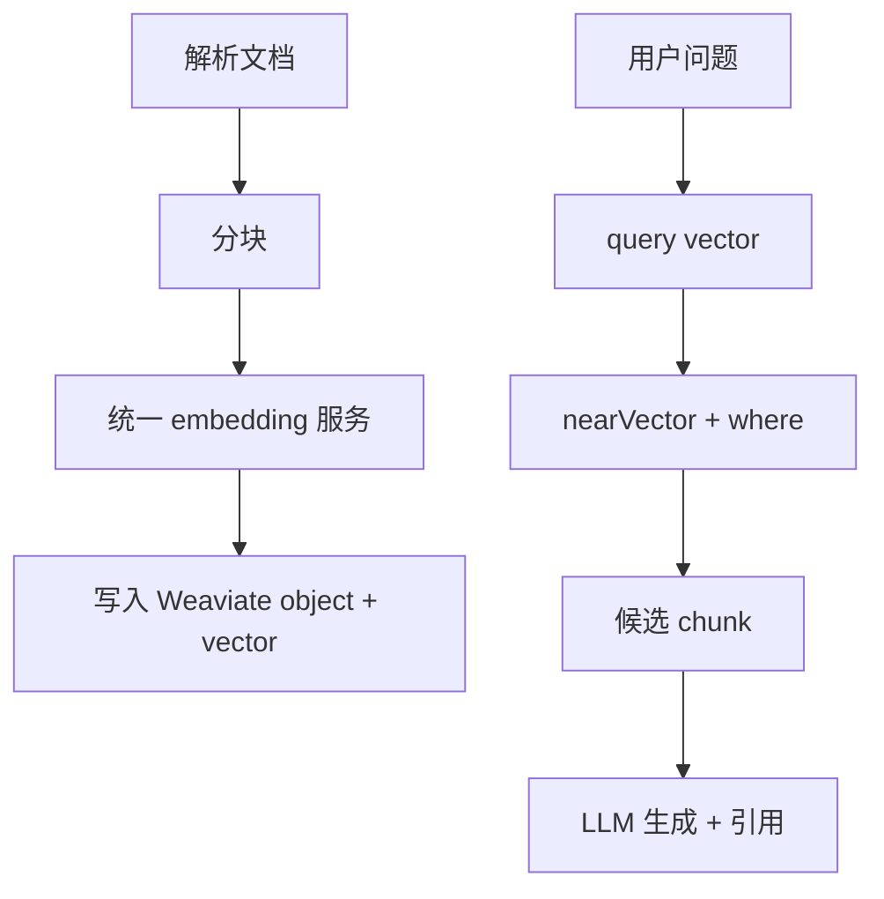

# C4 向量存储（了解）：Weaviate 图式向量库入门指南

**Weaviate** 是一个带 schema 和 GraphQL 风格查询体验的向量数据库。它可以自己调用向量化模块，也可以接收你提前算好的向量。企业 RAG 中更常见的是“自备向量 + metadata 过滤”。

读完本文，你应能说明 Weaviate 是做什么的、Class/Object/Property 如何对应 RAG 数据，以及为什么这篇定位为了解。

---

## 目录

1. [前言：带 schema 的向量库](#1-前言带-schema-的向量库)
2. [本文边界与动手路径](#2-本文边界与动手路径)
3. [Weaviate 是什么](#3-weaviate-是什么)
4. [核心概念：Class、Object、Property](#4-核心概念classobjectproperty)
5. [自备向量的最小思路](#5-自备向量的最小思路)
6. [GraphQL 查询直觉](#6-graphql-查询直觉)
7. [在 RAG 中的典型位置](#7-在-rag-中的典型位置)
8. [何时了解即可，何时深入](#8-何时了解即可何时深入)
9. [调参与评测](#9-调参与评测)
10. [常见翻车与 FAQ](#10-常见翻车与-faq)
11. [总结与下一步](#11-总结与下一步)

---

## 1. 前言：带 schema 的向量库

很多向量库像“向量表”，Weaviate 更强调 schema：你先定义某类对象有哪些属性，再写入对象和向量。

通俗说，Weaviate 像一个有类别和属性说明的知识仓库：`DocumentChunk` 是类别，`text`、`doc_id`、`tenant_id` 是属性，向量用于相似度检索。

### 1.1 和 RAG 链路的关系

检索只是 RAG 的一环。Weaviate 的 `where` 若漏写或信任前端参数，越权 object 仍可能进入 prompt。理解 Weaviate，是在 **schema 化属性** 与 **nearVector 相似度** 之间设计对一次查询，而不是把 GraphQL 当“万能搜索框”。

### 1.2 为什么本系列把它放在“了解”档

Weaviate 概念清晰，但模块生态和 SDK 版本变化较快。初学者先掌握 **Class / Object / Property / where filter** 的通用向量库思维，再按团队是否已选型 Weaviate 决定是否深入。若你主要痛点是 payload 过滤工程体验，可优先对比 [78 Qdrant](78.qdrant-tutorial.md)。

## 2. 本文边界与动手路径

本文只讲 RAG 入门所需概念，不讲模块生态、集群运维和复杂 GraphQL。

| 步骤 | 你做什么 | 验收 |
|------|----------|------|
| A | 定义 chunk class | 属性清楚 |
| B | 写入 object + vector | 能检索 |
| C | 查询时带 where | 能过滤 doc/tenant |
| D | 判断是否值得深入 | 能与 Qdrant/Milvus 对比 |

### 2.1 每步建议花多久

| 步骤 | 建议时间 | 要点 |
|------|----------|------|
| A | 45 分钟 | 定义 `DocumentChunk` 属性，维度与 embedding 一致 |
| B | 1 小时 | 自备向量 insert 10～30 条 chunk |
| C | 45 分钟 | `nearVector` + `where tenant_id` 跑通 |
| D | 30 分钟 | 与 Qdrant payload filter 对比手感 |

### 2.2 本文不展开

- Weaviate 内置向量化模块（text2vec 等）的选型与计费
- 多节点集群、备份、版本升级运维
- Hybrid 检索与 BM25 细节（思路见 [93 混合检索](93.hybrid-search-tutorial.md)）

## 3. Weaviate 是什么

Weaviate 把对象属性、向量和查询放在一个 schema 化系统里。






这张图的结论是：Weaviate 的 schema 让数据结构更明确，但也要求你提前设计属性。

### 3.1 与 Qdrant、Milvus 怎么选（粗指南）

| 信号 | 倾向 Weaviate | 倾向其他 |
|------|---------------|----------|
| 团队已用 Weaviate、熟悉 GraphQL | ✓ | |
| 需要强 schema 文档化 | ✓ | |
| 要快上手、filter 直觉 | | Qdrant |
| 超大规模分布式 | | Milvus |
| 数据必须在 Postgres | | pgvector |

## 4. 核心概念：Class、Object、Property

**Class**：对象类型，类似表或集合。RAG 可以定义 `DocumentChunk`。



**Object**：一条具体数据，类似一行 chunk。

**Property**：对象属性，例如 `text`、`doc_id`、`source_url`、`tenant_id`。



不要把 Class 设计得过细。通常先用一个 `DocumentChunk`，通过 property 区分文档类型即可。

### 4.1 属性设计建议

| 属性 | 用途 | 易错点 |
|------|------|--------|
| `chunk_index` | 排序、去重 | 与上游分块不一致 |
| `model_id` | 换模型隔离 | 混模型不写，召回乱 |
| `is_active` | 版本切换 | 查询忘加 where |
| `text` | 回显证据 | 塞超长正文拖慢 GraphQL |

schema 变更（增删 property）往往要迁移数据。初期字段宁少勿滥，与 [88 metadata 过滤](88.metadata-filter-retrieval-tutorial.md) 字段字典对齐。

## 5. 自备向量的最小思路

企业 RAG 通常希望 embedding 模型由自己的服务统一管理，因此建议自备向量，而不是让数据库自动向量化所有文本。

```python
# 伪代码：表达数据形状，具体 SDK 以当前 Weaviate 版本为准
chunk = {
    "text": "一线城市住宿标准为每晚 600 元。",
    "doc_id": "travel-2025",
    "tenant_id": "acme",
    "chunk_index": 1,
}
vector = embedding_model.embed(chunk["text"])

client.collections.get("DocumentChunk").data.insert(
    properties=chunk,
    vector=vector,
)
```

重点是：embedding 模型、向量维度和 schema 版本要统一管理，否则后续重建索引会很混乱。

### 5.1 案例：统一 embedding 服务

某企业已有内部 embedding API（固定 1536 维、cosine）。若让 Weaviate 自动向量化部分文档、自备向量另一部分，会出现 **向量空间不一致**，同一 query 对不同 chunk 的分数不可比。

正确做法：全量走同一 embedding 服务，property 里记 `model_id`，换模型时按 `model_id` 分批重算或新建 Class。

### 5.2 先错对已：自动向量化 vs 自备向量

```python
# ❌ 生产混用：部分 object 靠 text2vec 模块，部分 insert 自带 vector
# ✅ 企业 RAG：统一 embedding 服务，insert 时始终传 vector + model_id
```

## 6. GraphQL 查询直觉

Weaviate 的查询常带有“取哪些字段”和“按什么条件过滤”的味道。初学者可以先理解这个形状：

```graphql
{
  Get {
    DocumentChunk(
      nearVector: { vector: [0.1, 0.2, 0.3] }
      where: { path: ["tenant_id"], operator: Equal, valueText: "acme" }
      limit: 3
    ) {
      text
      doc_id
    }
  }
}
```

查询结果应返回证据文本和 doc_id，供 RAG 生成阶段引用。



### 6.1 先错对已：where 写在哪

```graphql
# ❌ 查回 20 条后在应用层丢弃 tenant_id != "acme" 的 object
# ✅ GraphQL 查询里 where path tenant_id Equal acme，与 nearVector 同请求
```

### 6.2 返回字段与引用

RAG 至少需要 `text` 或能回溯到 chunk 的 `chunk_id` / `doc_id`。GraphQL 的好处是只取需要的 property，但别在查询里拉取巨大 `raw_html` 之类未索引大字段。

## 7. 在 RAG 中的典型位置




这张图的重点是：Weaviate 只是检索层，不能替代权限设计、引用格式和答案忠实性检查。

### 7.1 案例：单文档内追问

用户在某 PDF 内连续提问，where 应固定 `doc_id`，避免同主题其他文件干扰。若只靠 nearVector，可能召回同目录下相似但非本文件的 chunk——这是 schema 里 `doc_id` property 存在的典型理由。

### 7.2 入库与 schema 版本

文档更新时：insert 新 object 并标记旧 object `is_active=false`，或按 `doc_id` 批量删除。schema 加字段后要计划迁移，避免“新字段只写了一半数据”导致 where 漏筛。

## 8. 何时了解即可，何时深入

| 场景 | 建议 |
|------|------|
| 你刚学向量库 | 了解 Class/Object/Property 即可 |
| 你需要强 payload 过滤 | 也评估 Qdrant |
| 你需要大规模分布式 | 也评估 Milvus |
| 团队已用 Weaviate | 深入 schema、hybrid、备份和监控 |

本系列把 Weaviate 放在了解档，是因为它概念清晰但生态和版本变化较快，初学者先掌握通用向量库思维更重要。

### 8.1 深入前要问的三个问题

1. 团队是否已有 Weaviate 运维经验与监控？
2. 是否必须用 GraphQL / schema 治理，还是 Qdrant 式 payload 更顺手？
3. 合规是否允许数据放在当前 Weaviate 部署形态（云/自建）？

### 8.2 与混合检索的关系

Weaviate 支持 hybrid（向量 + BM25）一类能力，适合“编号 + 语义”并存的 query。企业 RAG 若已用统一 embedding 服务，仍要评估：**关键词路**是否由 Weaviate 承担，还是由 [83 OpenSearch](83.opensearch-hybrid-tutorial.md) / Postgres FTS 并联。初学者先跑通 nearVector + where，再考虑 hybrid，避免一次叠太多变量。

### 8.3 运维侧要知道的事

即使“了解档”，也应知道：Weaviate 需要持久化卷、定期备份 schema 与数据、升级时核对 **API 版本**。无运维人力时，托管或云市场镜像可降低门槛，但合规审批流程不会因此消失。

## 9. 调参与评测

从业务日志抽 50～100 条 query，标注期望 `chunk_id`，在 **固定 where** 下测 recall@k：

| 指标 | 说明 |
|------|------|
| recall@k | 同 filter 下与全库 nearVector 基线重叠 |
| p95 latency | GraphQL 往返 + embedding 耗时 |
| 越权率 | 无权限用户是否 0 命中 |

日志记录 `class_name`、`where` 摘要、`hits_count`，对接 [190 结构化日志](190.structured-logging-rag-tutorial.md)。带 `where` 的 recall 必须单独测，不能只在无 filter 环境调 `limit`。

### 9.1 评测：正负例模板

| 用例 | 身份 | 期望 |
|------|------|------|
| 正例 | 本租户用户 | 命中本租户 chunk |
| 负例 | 他租户 token | 0 条 |
| 单文档 | 指定 doc_id | 不串文档 |
| 回归 | schema 加字段后 | 旧数据仍有必填 property |

### 9.2 线上观测对接

把 `class_name`、`where` 摘要、`limit`、`latency_ms` 打进检索 span，对接 [191 Prometheus](191.prometheus-metrics-rag-tutorial.md)。**召回下降**往往先于用户投诉——若 latency 突然变低，有时是误删了 where 条件或 limit 被改小后“看起来更快”但质量变差。

### 9.3 与 rerank 的衔接

Weaviate 返回的 top-k 常接 [96 BGE reranker](96.bge-reranker-tutorial.md) 等二次排序。注意：rerank 输入仍应是 **已过 where 的候选**，不能把无权限 object 先扩量再 rerank，否则模型上下文已接触越权文本。

## 10. 常见翻车与 FAQ

**Weaviate 会自动帮我做好 RAG 吗？** 不会。它负责检索，RAG 仍需要分块、embedding、权限、prompt 和引用。

**自动向量化模块能不能用？** 能，但企业项目常用自备 embedding 服务，便于统一模型、成本和审计。

**Class 要不要按每种文档建一个？** 初期不建议。优先一个 `DocumentChunk`，用 property 标记文档类型。

**和 Qdrant 最大区别是什么？** Weaviate 更强调 schema 和 GraphQL 查询体验；Qdrant 的 payload filter 更直接。

### 10.1 排错速查

| 现象 | 可能原因 |
|------|----------|
| nearVector 无结果 | 向量维度与 class 配置不一致、库为空 |
| where 后结果为空 | 路径写错、property 类型不匹配、旧数据缺字段 |
| 分数不可比 | 混用自动向量化与自备向量、混 model |
| GraphQL 超时 | 返回字段过大、limit 过大、未建索引属性过滤 |

### 10.2 SDK 版本与文档

Weaviate v3 GraphQL 与 v4 Collections API 并存期较长，复制网上的代码前要核对 **当前实例版本**。本文伪代码表达数据形状，以官方文档为准。

### 10.3 入库侧常见遗漏

批量迁移、管理员代传、异步解析任务最容易写错 `tenant_id` 或漏写 property。入库流水线应对每条 object 校验必填字段，失败则拒写并告警，而不是静默进默认租户。与 [195 PII 脱敏](195.pii-redaction-rag-tutorial.md) 配合时，确认脱敏后的 text 仍与 embedding 输入一致。

### 10.4 和 Qdrant 的工程手感对比

| 维度 | Weaviate | Qdrant |
|------|----------|--------|
| 数据模型 | Class + Property，偏 schema | Point + Payload，偏灵活 |
| 查询 | GraphQL / Collections API | REST / gRPC / Python SDK |
| 过滤 | `where` on property | `query_filter` on payload |
| 学习曲线 | 需理解 schema 先行 | filter 直觉上手快 |

团队无 Weaviate 历史负担时，用评测集在两者间各跑一轮 recall@k 和开发工时，比凭文档印象选型更稳。

## 11. 总结与下一步

Weaviate 是一个 schema 化的向量数据库。初学者要抓住三件事：Class 定义数据类型，Object 存 chunk，Property 承载过滤字段。用于 RAG 时，建议先自备向量，再用 where 过滤租户和文档。

### 11.1 本篇检查清单

- [ ] 能解释 Class / Object / Property 与 RAG chunk 的对应关系
- [ ] 理解企业场景应自备向量，并统一 `model_id`
- [ ] 能写出 nearVector + where 的查询形状（含 tenant/doc 过滤）
- [ ] 知道 schema 变更需要迁移计划
- [ ] 能与 Qdrant、Milvus 说清选型差异

下一步可以读 [80 Pinecone](80.pinecone-tutorial.md) 了解托管向量库，也可以回到 [78 Qdrant](78.qdrant-tutorial.md) 对比 payload 过滤的工程体验。
