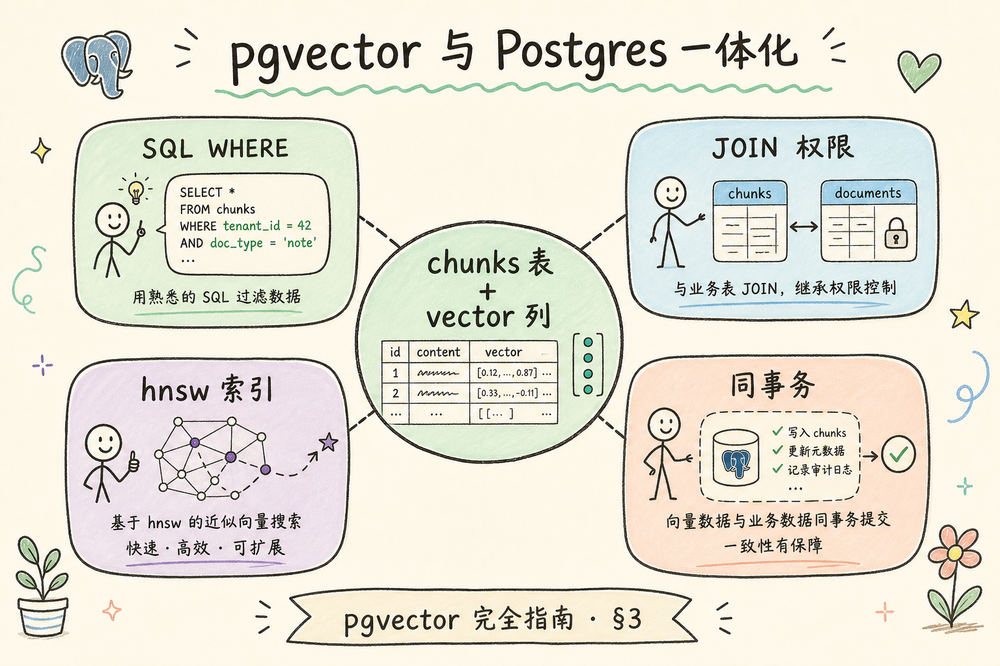
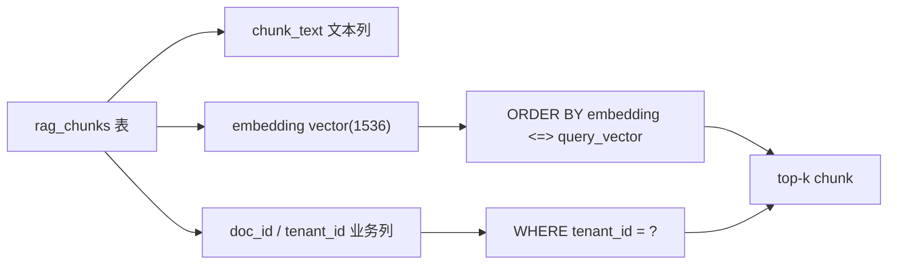
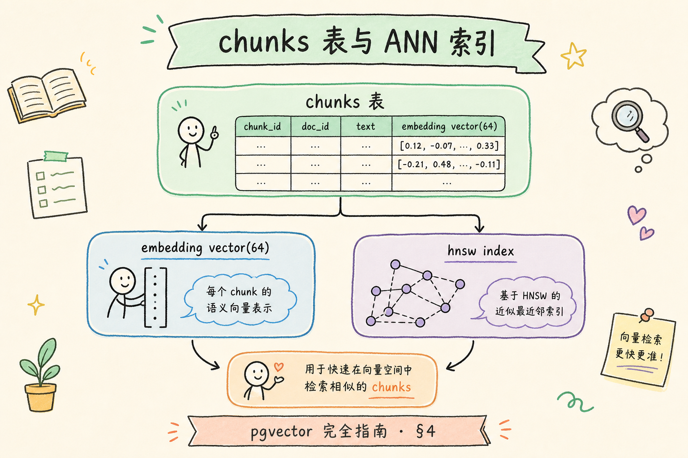
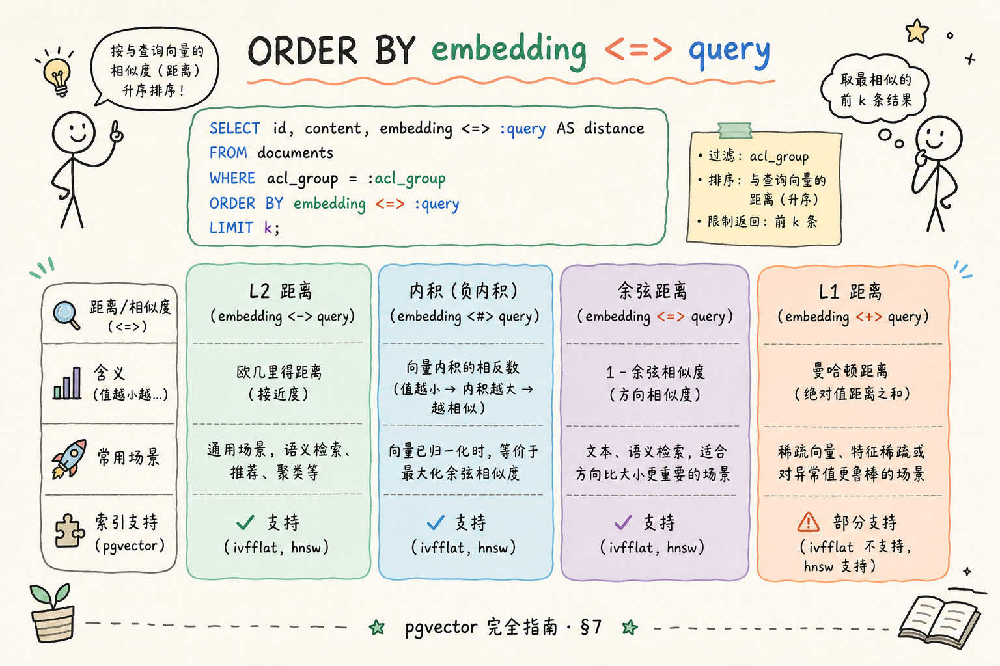
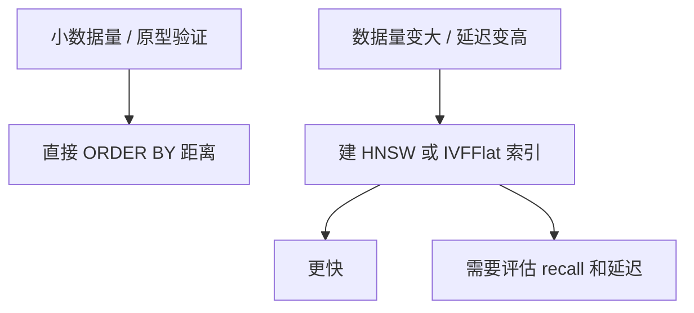

# C4 向量存储（五）：pgvector 与 Postgres 一体化 RAG 指南

**pgvector** 是 PostgreSQL 的向量扩展。它让你在熟悉的关系型数据库里存向量、文本和业务字段，适合数据本来就在 Postgres、团队希望少引入一个新数据库的场景。  
通俗说：pgvector 像给 Postgres 加了一种“能按语义距离排序”的列类型。

读完本文，你应能解释 pgvector 做什么、解决什么问题、如何建表查询相似 chunk，以及它和专用向量库的边界。

---

## 目录

1. [前言：向量进 Postgres 的吸引力](#1-前言向量进-postgres-的吸引力)
2. [本文边界与动手路径](#2-本文边界与动手路径)
3. [pgvector 是什么](#3-pgvector-是什么)
4. [它解决什么问题](#4-它解决什么问题)
5. [表设计：chunk 行 + vector 列](#5-表设计chunk-行--vector-列)
6. [最小 SQL 示例](#6-最小-sql-示例)
7. [距离算子与索引](#7-距离算子与索引)
8. [权限过滤与事务优势](#8-权限过滤与事务优势)
9. [适用边界与取舍](#9-适用边界与取舍)
10. [调参与评测](#10-调参与评测)
11. [常见翻车与 FAQ](#11-常见翻车与-faq)
12. [总结与下一步](#12-总结与下一步)

---

## 1. 前言：向量进 Postgres 的吸引力

很多企业已经有 Postgres：用户、文档、权限、审计都在里面。如果 RAG 系统再额外引入一个向量数据库，就会多一套部署、备份、权限同步和排障链路。

pgvector 的吸引力是把向量也放进同一个数据库。这样 chunk 文本、业务 metadata、权限字段和 embedding 可以在同一张表或同一个事务里维护。对初学者来说，它是理解“向量检索如何落到数据库”的很好的起点。

在实际 RAG 项目里，pgvector 往往表现为“业务库旁多一列 embedding”，而不是独立向量集群。团队若能接受用 SQL 和 `EXPLAIN` 调参，很多问题可在 pgvector 阶段定位清楚，再决定要不要外迁专用向量库。

### 1.1 三个典型“已有 Postgres”场景

| 场景 | 痛点 | pgvector 价值 |
|------|------|---------------|
| 内部知识库 MVP | 不想为 RAG 单独买向量库 | 复用现有备份、监控、权限体系 |
| 多租户 SaaS | 用户/文档/权限已在 PG | `tenant_id` 与向量同表 filter |
| 合规审计 | 需追溯答案引用来源 | SQL join 文档 ACL，审计链完整 |

这不是说所有 RAG 都该上 pgvector。数据量到百万级、P95 延迟卡在几十毫秒时，要评估专用向量库或搜索栈（见 [82](82.elasticsearch-vector-tutorial.md)）。但对很多团队，**先在一个库里跑通**比过早拆系统更重要。

### 1.2 和 RAG 链路的关系

检索只是 RAG 的一环。pgvector 若只 `ORDER BY` 距离、不加 `WHERE tenant_id`，会召回别租户 chunk——后面 rerank 和 LLM 再强也救不回来。理解 pgvector，是在 **SQL 过滤** 与 **向量相似度** 之间写对一条查询，而不是把向量当“黑盒 API”。

## 2. 本文边界与动手路径

本文讲入门建表和查询，不讲大规模索引调优，也不讨论所有 Postgres 运维细节。你只需要先跑通下面四步：

动手时建议把验收写进脚本：同一条租户隔离 query，上线前后各跑一遍，确认 `WHERE` 没被 ORM 悄悄挪到应用层。Docker 起 Postgres 即可，重点不是镜像版本，而是 embedding 维度与模型配置从一开始就一致。

| 步骤 | 你做什么 | 验收 |
|------|----------|------|
| A | 安装 extension | `CREATE EXTENSION vector` 成功 |
| B | 建 chunks 表 | 有 text、metadata、embedding |
| C | 插入向量 | 能按距离排序查询 |
| D | 加 `WHERE` 过滤 | tenant/doc_id/权限条件生效 |

最小交付物是：你能写出一条“按租户过滤 + 按向量距离排序 + 返回 top-k chunk”的 SQL。

### 2.1 每步建议花多久

| 步骤 | 建议时间 | 要点 |
|------|----------|------|
| A | 30 分钟 | Docker 起 Postgres + `CREATE EXTENSION vector` |
| B | 45 分钟 | 建表，维度与 embedding 模型一致 |
| C | 1 小时 | 插入 10～50 条真实 chunk，跑通距离查询 |
| D | 30 分钟 | 加 `tenant_id` filter，验证越权 chunk 不出现 |

### 2.2 本文不展开

- Postgres 主从、连接池、VACUUM 等 DBA 运维细节
- HNSW/IVFFlat 全参数扫表（见 [86 HNSW](86.hnsw-index-tutorial.md)、[85 IVF](85.ivf-index-tutorial.md)）
- 全文检索与 BM25（编号类 query 需另路，见 [92 Sparse](92.sparse-retrieval-rag-tutorial.md)）

## 3. pgvector 是什么

pgvector 提供 `vector(n)` 类型和距离算子，让 Postgres 能保存 embedding 并做相似度排序。

从工程视角看，pgvector 把“向量列”纳入关系型约束体系：主键、外键、索引 opclass 与业务表同级管理。排障时可用熟悉的慢查询日志和连接池指标，而不必同时维护一套向量专用运维手册。




上图的结论是：pgvector 的优势在于向量检索和关系型过滤可以写在同一条 SQL 里。对 RAG 来说，这意味着“找相似证据”和“遵守业务边界”可以一起做。

### 3.1 与专用向量库怎么选（粗指南）

| 信号 | 倾向 pgvector | 倾向专用向量库 |
|------|---------------|----------------|
| 数据与权限已在 Postgres | ✓ | |
| chunk 量 < 50 万且延迟可接受 | ✓ | |
| 需要复杂 metadata join | ✓ | |
| 纯向量、超高 QPS、亚 10ms P95 | | ✓ |
| 团队零 Postgres 经验 | | 评估托管方案 |

初学者先用 pgvector 跑通 **入库 → 过滤检索 → 返回 chunk_text**，再按评测数据决定是否迁移。

## 4. 它解决什么问题

pgvector 主要解决“已有 Postgres 系统想快速加入语义检索”的问题。

很多团队误以为上了向量就万能，却在编号类 query 上吃亏——这不是 pgvector 独有，而是稠密检索的共性。把向量放在 Postgres 里的真正收益，是权限、审计和事务边界仍由数据库保证，向量只是多了一种排序键。



| 问题 | 没有 pgvector 时 | 使用 pgvector 后 |
|------|------------------|------------------|
| 系统数量 | 需要额外向量库 | 可先复用 Postgres |
| 权限过滤 | 要同步到向量库 | 可用 SQL join/filter |
| 事务一致性 | 文本和向量可能分离 | 同库写入更容易一致 |
| 入门成本 | 要学习新数据库 | 使用熟悉 SQL |

它不解决所有问题。超大规模向量、高并发低延迟检索、多租户物理隔离、复杂 ANN 调优，仍可能需要专用向量数据库或搜索系统。

### 4.1 场景案例：财务制度 RAG

某企业制度库已在 Postgres：`documents`、`document_acl`、`users` 都在同库。RAG 需求是“财务组只能搜到有权限的 chunk”。

- **没有 pgvector**：chunk 向量进 Qdrant，权限要在应用层同步，易出现 ACL 滞后
- **用 pgvector**：`rag_chunks` 与 `document_acl` join，`WHERE principal = 'finance-team'` 与向量排序同 SQL

验收：用无权限用户的 query 跑检索，结果集应为空；有权限用户应命中含“住宿标准”的 chunk。这类 case 是 pgvector 的强项，不是 benchmark 数字能替代的。

## 5. 表设计：chunk 行 + vector 列

最小表结构建议如下。示例用 `vector(3)` 是为了让演示向量短一点；真实项目里应替换为你的 embedding 维度，例如 1536 或 3072。

表设计阶段就要想好文档生命周期：制度修订、模型升级、租户迁移都会触发向量重算。把 `model_id` 和 `created_at` 留好，比事后全库扫一遍猜“这批向量是哪版模型”省力得多。chunk 粒度也要与评测 bad case 对齐——太粗漏细节，太碎拉高噪声。

```sql
CREATE EXTENSION IF NOT EXISTS vector;

CREATE TABLE rag_chunks (
  chunk_id text PRIMARY KEY,
  doc_id text NOT NULL,
  tenant_id text NOT NULL,
  chunk_text text NOT NULL,
  embedding vector(3),
  model_id text NOT NULL DEFAULT 'demo-embedding',
  created_at timestamptz DEFAULT now()
);
```

这张表至少要保留三类信息：`chunk_text` 用于返回证据，`embedding` 用于相似度检索，`doc_id/tenant_id/model_id` 用于过滤、追踪和重建索引。

### 5.1 字段设计建议

| 字段 | 用途 | 易错点 |
|------|------|--------|
| `chunk_id` | 引用、日志、去重 | 与向量库 doc id 命名要对齐 |
| `model_id` | 换模型时筛数据 | 混模型不写此字段，召回全乱 |
| `created_at` | 增量重建、审计 | 全量重算向量时按时间分批 |
| `embedding` | 相似度 | 维度必须与 `vector(n)` 一致 |

可选：对 `chunk_text` 建 Postgres FTS 索引，补编号类 query（与向量并行，见 [83 混合检索](83.opensearch-hybrid-tutorial.md) 思路）。

## 6. 最小 SQL 示例

下面示例演示两件事：插入 chunk 向量，以及按 query 向量找最近的 chunk。

示例刻意用小维度，是为了把注意力放在 SQL 结构上，而不是被高维数组淹没。生产环境务必用参数化查询传入 query 向量，避免字符串拼接带来的注入风险和浮点精度问题。

```sql
INSERT INTO rag_chunks (chunk_id, doc_id, tenant_id, chunk_text, embedding)
VALUES
  ('travel-2025#001', 'travel-2025', 'acme', '一线城市住宿标准为每晚 600 元。', '[0.1,0.2,0.3]'),
  ('hr-2025#001', 'hr-2025', 'acme', '员工每年享有带薪年假。', '[0.2,0.1,0.4]');

SELECT chunk_id, doc_id, chunk_text
FROM rag_chunks
WHERE tenant_id = 'acme'
ORDER BY embedding <=> '[0.2,0.1,0.35]'
LIMIT 3;
```

这条查询同时完成租户过滤和向量相似度排序。初学者要注意：`WHERE` 不是装饰，它决定了检索是否遵守业务边界。

### 6.1 先错对已：filter 写在哪

```sql
-- ❌ 应用层：先 LIMIT 10 再 if row.tenant_id != 'acme' 丢弃
-- 问题：日志、缓存可能已接触越权 chunk

-- ✅ 数据库层：WHERE tenant_id = 'acme' 与 ORDER BY 同语句
```

### 6.2 距离算子与 query 向量从哪来

应用层应把 embedding API 返回的向量绑成参数化查询，不要把用户原文直接拼进 `ORDER BY`。query 向量维度必须与列定义一致；换模型后旧向量要重算或按 `model_id` 隔离。

## 7. 距离算子与索引

常见算子如下：

距离算子的选择不是随手选一个 `<=>`：它必须与 embedding 训练目标和归一化流程一致。线上若 cosine 与 L2 混用，索引 opclass 即使建对了，排序语义也会错位，表现就是“有时准、有时飘”。日志里一旦出现对 `rag_chunks` 的 Seq Scan，就该认真评估 HNSW 或 IVFFlat。

| 算子 | 含义 | 适用 |
|------|------|------|
| `<->` | L2 距离 | 欧氏距离 |
| `<#>` | 负内积 | 内积相似度 |
| `<=>` | cosine 距离 | 常见文本 embedding |

读下图时，注意“能查”和“查得快”是两件事。小数据量可以直接排序；数据变大后，才需要 HNSW 或 IVFFlat 索引。





索引能加速，但不要在还没验证数据量和查询模式前过早调参。先用无索引或简单索引确认业务链路正确，再做性能优化。

### 7.1 HNSW vs IVFFlat（选型直觉）

| 索引 | 适合 | 注意 |
|------|------|------|
| 无索引 | < 1 万行原型 | `EXPLAIN` 看 Seq Scan |
| HNSW | 在线查询、召回要求高 | 建索引慢、占内存 |
| IVFFlat | 数据量大、可接受训练 | 需 `lists` 参数，分布变了要重建 |

建 HNSW 示例（**新代码**，维度与表一致）：

```sql
CREATE INDEX ON rag_chunks USING hnsw (embedding vector_cosine_ops);
```

距离算子与索引 opclass 要匹配：cosine 用 `vector_cosine_ops`，L2 用 `vector_l2_ops`。

### 7.2 排错：查询变慢时看什么

1. `EXPLAIN ANALYZE`：是否走了向量索引
2. `WHERE` 选择性：全表扫描后再排序 vs 索引过滤
3. `LIMIT` 是否过大（RAG 通常 5～20 即可）
4. 连接池是否耗尽（延迟像“索引慢”有时是排队）

## 8. 权限过滤与事务优势

pgvector 最大优势之一是能和关系型权限表一起查询：

权限过滤写在 SQL 里，不只是合规要求，也是缩小应用层 bug 面积。很多越权事故来自“先取 top-k 再在 Python 里 if tenant”：缓存、日志和链路追踪可能已泄露本应隔离的 chunk 摘要。JOIN `document_acl` 虽略增复杂度，却能在数据库层给出可审计的访问路径。

```sql
SELECT c.chunk_id, c.chunk_text
FROM rag_chunks c
JOIN document_acl a ON a.doc_id = c.doc_id
WHERE c.tenant_id = 'acme'
  AND a.principal = 'finance-team'
ORDER BY c.embedding <=> '[0.2,0.1,0.35]'
LIMIT 5;
```

这种写法让权限过滤进入数据库层，降低越权召回风险。它也让审计更容易：你可以查到某个答案引用来自哪个 `chunk_id`、哪个 `doc_id`、哪个租户。

### 8.1 事务：文本与向量一起写

文档更新时，理想流程是同一事务内：更新 `chunk_text`、重算 `embedding`、`COMMIT`。分库时易出现“文本已新、向量仍旧”，用户会看到语义对不上的证据。pgvector 在同库可用事务保证一致性，这是相对外挂向量库的工程优势。

## 9. 适用边界与取舍

取舍的本质是：你愿不愿意为极致向量 QPS 多维护一套系统。若团队已有成熟的 Postgres 备份、读写分离和慢查询治理，pgvector 的“够用”往往比理论最优延迟更有商业价值。反过来，若检索已成为独立瓶颈、与 OLTP 争抢同一实例 CPU，拆分专用向量库就是理智演进。

| 场景 | 是否适合 pgvector | 理由 |
|------|------------------|------|
| 数据本来在 Postgres | 适合 | 少一套系统 |
| 需要事务和 SQL join | 适合 | 关系型能力强 |
| 中小规模 RAG 原型 | 适合 | 学习和部署成本低 |
| 超大规模向量检索 | 需评估 | 专用向量库可能更合适 |
| 团队没有 Postgres 运维经验 | 不一定适合 | 仍要维护数据库 |

pgvector 的核心不是“最强向量库”，而是“在已有 Postgres 体系内足够好”。对很多内部知识库 MVP，这已经足够。

### 9.1 规模粗算：何时该认真建索引

假设 768 维、100 万 chunk，无索引每次查询要做 100 万次距离比较，P95 往往不可接受。经验上：**行数过万且查询变卡**就该测 HNSW；**十万级以上**几乎必须索引 + recall 评测（用 [84 Flat](84.flat-brute-force-search-tutorial.md) 在小样本标 gold）。

### 9.2 与专用向量库迁移时机

当出现以下信号时，应认真评估 Qdrant/Milvus 等：纯向量 QPS 持续压满 CPU、P95 在调索引后仍超标、需要跨地域只读副本专供检索。迁移前用同一评测集在 pgvector 与候选库各跑 recall@k，避免“为迁移而迁移”。

## 10. 调参与评测

不必一开始上千条 query。从业务日志抽 50～100 条，标注期望 `chunk_id`，对比：

评测不必追求完美复现论文指标；对内部知识库而言，recall@k 与越权率为零同等重要。建议固定一个小 query 集，每次改索引参数或换模型都在同一脚本里跑出对比，避免“感觉变快了”却无数字存档。

| 指标 | 说明 |
|------|------|
| recall@k | 与无索引全表排序（或小样本 Flat）的重叠 |
| p95 latency | 含网络与连接池 |
| 越权率 | 无权限 query 是否返回 0 行 |

调参顺序：先确认 `WHERE` 与距离算子正确 → 再建索引 → 最后扫 HNSW `ef_search`（若版本支持）。把 `tenant_id`、`latency_ms` 打进结构化日志（[190](190.structured-logging-rag-tutorial.md)），便于线上对比改版前后。

## 11. 常见翻车与 FAQ

生产翻车很少是单点神秘 bug，多半是维度、filter、索引或模型版本有一处悄悄漂移。下面 FAQ 按发生频率排列——建表插入、查询变慢、混模型，每条都对应可操作的检查清单，而不是泛泛的“再试试重启”。

### 11.1 为什么插入失败？

向量维度必须和 `vector(n)` 一致。模型从 1536 维换到 3072 维时，表结构或新表也要同步调整。

### 11.2 为什么查询慢？

可能没有索引、过滤条件选择性差、top_k 太大，或向量列与查询模式不匹配。先用 `EXPLAIN` 看计划，再调索引。冷缓存、共享缓冲区不足也会像“向量慢”。

### 11.3 能不能混不同 embedding 模型？

不建议。同一列里混不同模型会破坏向量空间一致性。至少要加 `model_id`，更稳的是拆表或重建索引。

### 11.4 pgvector 能替代全文搜索吗？

不能。编号、专有名词、精确词仍应结合 Postgres FTS、BM25 或搜索引擎（[92 Sparse](92.sparse-retrieval-rag-tutorial.md)）。

### 11.5 和 Qdrant/Milvus 比差在哪？

专用库往往在纯向量 QPS、分片、混合检索 pipeline 上更成熟。pgvector 赢在 **SQL 生态与事务**，不是绝对延迟冠军。按团队栈选型，用评测说话。

### 11.6 换 embedding 模型后要做什么？

全量重算 `embedding`，更新 `model_id`，**重建向量索引**。不能只改应用层模型名。

## 12. 总结与下一步

pgvector 适合把向量能力加入现有 Postgres 系统。初学者重点掌握 `vector(n)`、距离算子、SQL 过滤、模型维度一致性和索引边界。

回顾全文，pgvector 的价值在于把语义检索焊进你已有的数据平面，而不是夺得向量性能冠军。掌握 SQL 过滤优先、距离度量一致、索引有评测基线这三条，你就具备了在 Postgres 内迭代 RAG 检索的稳固地基。

### 12.1 本篇检查清单

- [ ] `CREATE EXTENSION vector` 成功，表维度与模型一致
- [ ] 能写带 `tenant_id` 的 `ORDER BY embedding <=> query` 查询
- [ ] 理解 filter 必须在 SQL 里，不能事后应用层删
- [ ] 知道何时建 HNSW/IVFFlat，并用小样本测 recall
- [ ] 知道编号类 query 需 Sparse/FTS 补位

下一步可以读 [82 Elasticsearch 向量检索](82.elasticsearch-vector-tutorial.md)，了解搜索栈里做向量检索的路径。
