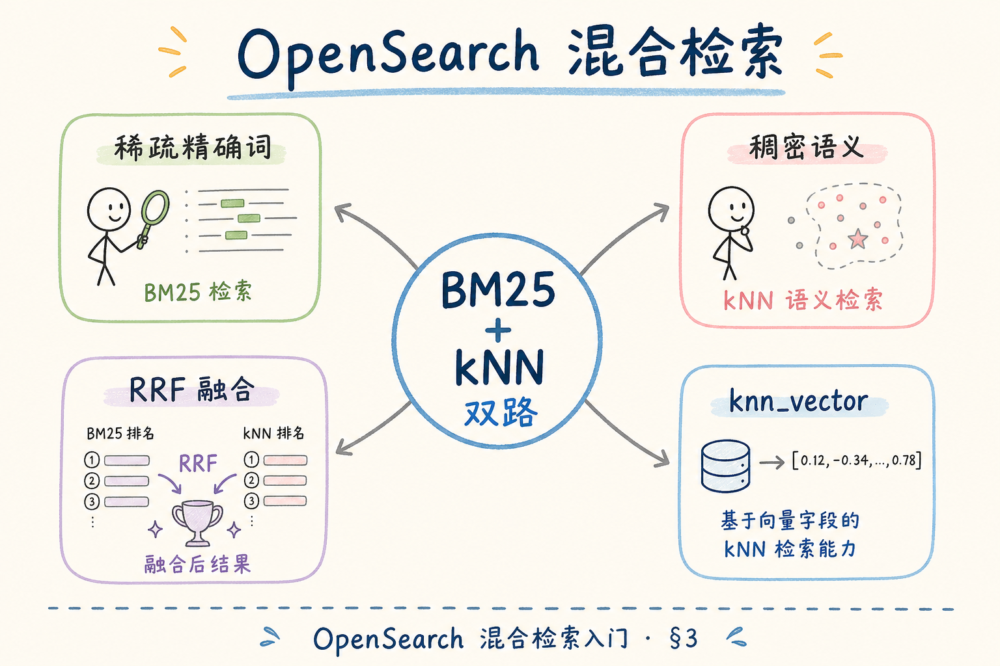
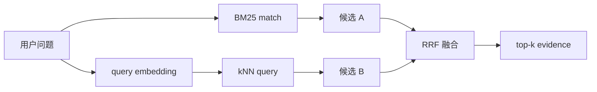
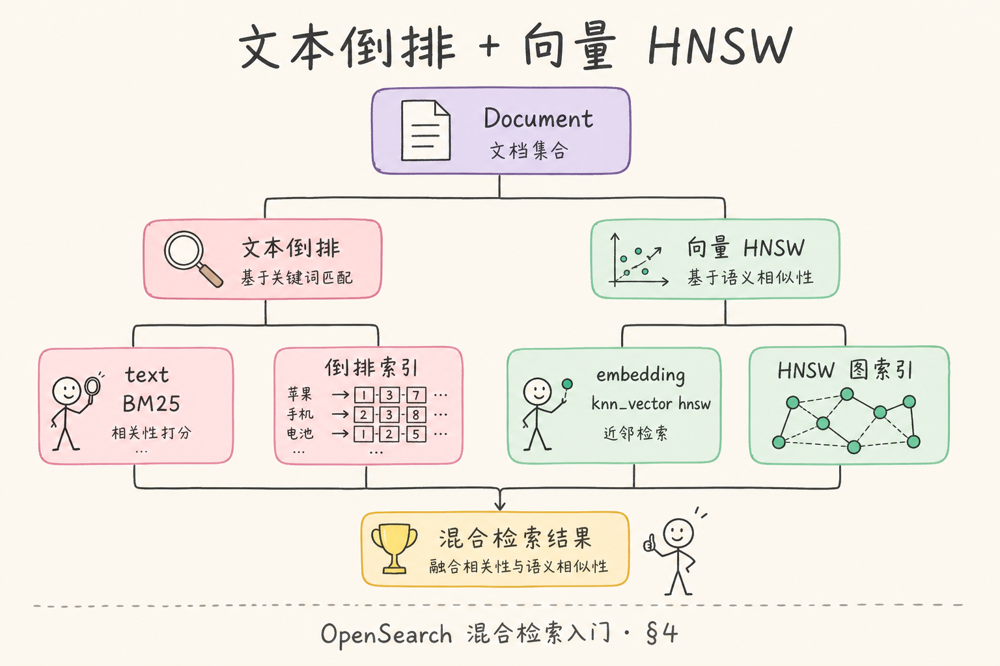
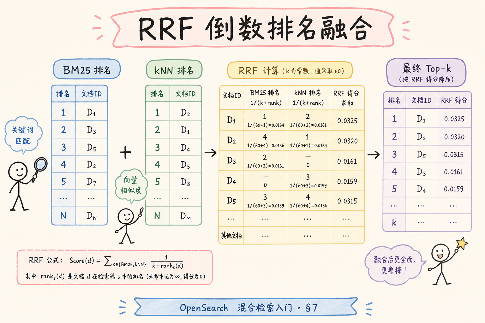
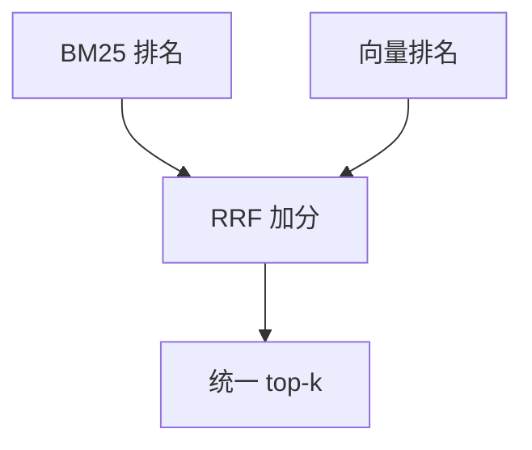
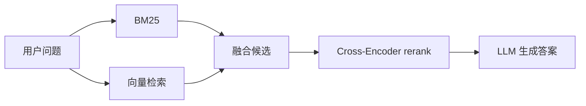

# C4 向量存储（地基）：OpenSearch 混合检索入门指南

**混合检索**（Hybrid Retrieval）把关键词检索和向量检索结合起来。OpenSearch 提供 BM25、k-NN 和 search pipeline 等能力，适合做企业 RAG 的稳健召回。  
通俗说：既让系统按“字面关键词”找，也让系统按“语义相似”找。

读完本文，你应能解释为什么只用向量不够、BM25 和向量各自负责什么、OpenSearch 混合检索解决什么问题，以及如何用 RRF 做最小融合。

---

## 目录

1. [前言：为什么 RAG 要混合检索](#1-前言为什么-rag-要混合检索)
2. [本文边界与动手路径](#2-本文边界与动手路径)
3. [OpenSearch 混合检索是什么](#3-opensearch-混合检索是什么)
4. [它解决什么问题](#4-它解决什么问题)
5. [稀疏检索：BM25 match](#5-稀疏检索bm25-match)
6. [稠密检索：kNN query](#6-稠密检索knn-query)
7. [融合：RRF 的最小直觉](#7-融合rrf-的最小直觉)
8. [RAG 管道中的位置](#8-rag-管道中的位置)
9. [适用边界与注意事项](#9-适用边界与注意事项)
10. [调参与评测](#10-调参与评测)
11. [常见翻车与 FAQ](#11-常见翻车与-faq)
12. [总结与下一步](#12-总结与下一步)

---

## 1. 前言：为什么 RAG 要混合检索

向量检索擅长语义相似，但对编号、错误码、精确术语不总是稳。BM25 擅长关键词匹配，却不理解同义表达。

混合检索的目标是：让“意思像”和“字面命中”都能进入候选集，再用融合算法排序。对企业 RAG 来说，这是比“只上一个向量库”更贴近真实问题的默认思路。

生产环境里，预算问题往往表现为 **检索明明命中了，答案却说不知道**：不是召回失败，而是证据在组装 prompt 时被历史消息挤掉。混合检索的价值在于扩大候选池覆盖面，让 rerank 和 LLM 至少“见过”正确 chunk，而不是在单路漏召回后硬编答案。

### 1.1 为什么“只上向量”在企业里常翻车

| 问题类型 | 示例 | 纯向量风险 |
|----------|------|------------|
| 标准编号 | `GB/T 12345` | 语义相近但编号未命中 |
| 云错误码 | `AccessDenied` | 缩写与大小写敏感 |
| 制度条款 | `第 7.2 条` | 条款号是字面锚点 |

[91 Dense](91.dense-retrieval-tutorial.md) 负责意思接近；[92 Sparse](92.sparse-retrieval-rag-tutorial.md) 负责字面对。OpenSearch 混合检索是把两路放在同一引擎里，用统一 filter 和融合排序。

### 1.2 和 RAG 链路的关系

混合检索发生在 rerank 之前。若 BM25 路忘了 `tenant_id` filter，而 kNN 路有 filter，会出现“一路越权、一路正常”的诡异 bad case。两路必须 **同源 filter、可并发、可分别打日志**。

## 2. 本文边界与动手路径

本文讲入门方案，不展开 OpenSearch 每个 pipeline 参数，也不讨论集群部署。先掌握四步：

动手时务必让 BM25 与 kNN 使用完全相同的 filter DSL，并在日志里分别记录两路命中与耗时。很多“融合后更差”的 case，根因是一路 filter 漏写或分词改动导致 BM25 路整体漂移，而不是 RRF 公式本身有问题。

| 步骤 | 你做什么 | 验收 |
|------|----------|------|
| A | 跑 BM25 match | 精确词能命中 |
| B | 跑 kNN query | 语义问题能命中 |
| C | 合并两路结果 | 候选更稳 |
| D | 用 RRF 排序 | 不依赖单一路分数 |

最小交付物是：你能说明同一个 query 为什么要分两路召回，以及为什么两路都要带权限和租户 filter。

### 2.1 每步建议花多久

| 步骤 | 建议时间 | 要点 |
|------|----------|------|
| A | 1 小时 | BM25 match + filter，精确词能排前 |
| B | 1 小时 | kNN + 同 filter |
| C | 45 分钟 | 两路各取 top-20，肉眼看重叠 |
| D | 1 小时 | 用 RRF 合并，对比融合前后 recall |

### 2.2 本文不展开

- OpenSearch 集群部署与 search pipeline 全参数
- Cross-encoder rerank 训练（见 [95](95.cross-encoder-rerank-tutorial.md)）
- 与 Elasticsearch 逐版本 DSL 差异（按你用的发行版文档为准）

## 3. OpenSearch 混合检索是什么

读下图时，注意 BM25 和 kNN 是两条并行召回路线，最后通过融合得到统一候选。

双路召回不是“跑两次搜索就完事”：两路必须在同一 chunk 主键空间可对齐，filter 语义一致，且各自 top_k 要大到足以让正确证据进入候选池。否则融合层只是在两堆都不完整的列表上做算术，无法弥补单路漏召回。





上图的结论是：混合检索不是二选一，而是让两路召回互相补位。正确证据只要被其中一路召回，后续融合就还有机会保留下来。

### 3.1 双路召回的数据前提

两路共用同一份 chunk 文本与 metadata，但索引能力不同：BM25 依赖分词与倒排；kNN 依赖 `knn_vector` 字段。入库时要保证 **同一 `_id`（chunk_id）** 在两路结果里可对齐，否则 RRF 无法去重加分。

## 4. 它解决什么问题

混合检索主要解决“问题类型不统一”的召回难题。

企业知识库的用户问法高度异构：有人照搬制度原文，有人只记错误码片段，还有人用口语概括。单一路检索往往在某一类 query 上表现亮眼、在另一类上系统性漏召回。混合检索用工程复杂度换召回稳健性，这是多数内部 RAG 愿意接受的 trade-off。



| 用户问题 | 单用向量的风险 | 单用 BM25 的风险 | 混合检索收益 |
|----------|----------------|------------------|--------------|
| “出差住酒店最多能报多少” | 通常较稳 | 可能缺少同词 | 向量补语义 |
| “GB/T 12345” | 可能忽略精确编号 | 通常较稳 | BM25 保底 |
| “S3 AccessDenied 上传失败” | 语义相关但不精确 | 命中错误码 | 两路互补 |
| “类似年假的福利有哪些” | 语义召回较有用 | 关键词可能分散 | 向量扩展 |

它解决的是召回候选的稳健性，不直接保证答案正确。答案质量还依赖 rerank、上下文裁剪、引用和生成。

### 4.1 场景案例：同一 query 两路差异

用户问：`出差住宿一晚上限多少`

| 路 | 可能命中的 chunk | 原因 |
|----|------------------|------|
| BM25 | 含“住宿标准”“元/晚”的制度条 | 关键词重叠 |
| kNN | 写“一线城市酒店报销额度”的段落 | 语义相近、用词不同 |
| 仅一路 | 可能漏掉另一表述 | 混合的价值 |

用户问：`GB/T 12345 适用范围`——通常 BM25 更稳；若只跑 kNN，要把这类 query 放进评测集做回归。

## 5. 稀疏检索：BM25 match

**BM25** 是常见关键词排序算法。通俗说，它会看 query 里的词在文档中出现得是否重要、是否稀有。

BM25 路是企业 RAG 的“字面保险丝”：标准号、API 名、错误码这类 token 往往比语义向量更可靠。上线前应在评测集里专设精确符号类 query，分词或 analyzer 一改就要全量回归，否则会出现“向量路正常、融合后编号全漏”的隐蔽退化。

```json
POST rag_chunks/_search
{
  "query": {
    "bool": {
      "must": { "match": { "chunk_text": "GB/T 12345 报销" } },
      "filter": { "term": { "tenant_id": "acme" } }
    }
  }
}
```

如果用户问题包含标准号、命令、API 名称、错误码，BM25 往往比纯向量更可靠。初学者不要因为“向量更智能”就忽略这些精确符号。

### 5.1 先错对已：match vs term

对中文长句用 `match` 分词；对 `GB/T 12345`、`AccessDenied` 等应建 **keyword 子字段** 或 `term` 查询，避免被分词打碎。评测集里专设 5 条“精确符号”query，分词一改就要重跑。

## 6. 稠密检索：kNN query

**kNN query** 是向量近邻查询。通俗说，它会找和 query vector 最接近的那些 chunk vector。

kNN 路负责接住用户的同义改写和口语概括，但绝不能因为“语义更智能”就放松 filter。两路 filter 不一致时，融合结果会混入只在一路上合法的 chunk——审计上很难解释“这条证据为何对该用户可见”。

```json
POST rag_chunks/_search
{
  "knn": {
    "field": "embedding",
    "query_vector": [0.2, 0.1, 0.35],
    "k": 20,
    "num_candidates": 100,
    "filter": { "term": { "tenant_id": "acme" } }
  }
}
```

注意：kNN 的 filter 同样要承接权限和租户隔离。不要只给 BM25 加 filter，却让向量召回跨租户查。

### 6.1 两路 filter 必须一致

| 检查项 | BM25 | kNN |
|--------|------|-----|
| `tenant_id` | ✓ | ✓ |
| `is_active` | ✓ | ✓ |
| 文档级 ACL | 视架构 | 同左 |

不一致时，融合结果会混入只在一路上合法的 chunk，审计和合规都难解释。

## 7. 融合：RRF 的最小直觉

RRF（Reciprocal Rank Fusion，倒数排名融合）只看排名，不强依赖两路分数是否同尺度。

生产里最常见的融合翻车，是把 BM25 分数与向量距离硬相加——尺度不可比，某一路会 dominate，bad case 难以解释。RRF 用排名贡献做融合，牺牲一点理论最优，换来可调试、可日志化的第一版混合方案。

```python
def rrf(rank, k=60):
    return 1 / (k + rank)

scores = {}

for rank, doc_id in enumerate(bm25_ids, 1):
    scores[doc_id] = scores.get(doc_id, 0) + rrf(rank)

for rank, doc_id in enumerate(vector_ids, 1):
    scores[doc_id] = scores.get(doc_id, 0) + rrf(rank)

final = sorted(scores.items(), key=lambda x: x[1], reverse=True)
```

读下图时，重点看“排名贡献”而不是原始分数：





上图的结论是：RRF 适合作为混合检索第一版融合方案。它不完美，但简单、可解释、容易排查。

### 7.1 先错对已：分数硬加

```python
# ❌ final_score = bm25_score + (1 - cosine_distance)
# 问题：尺度不可比，某一路 dominate，bad case 难解释

# ✅ RRF：只按两路排名贡献，见上文 rrf() 示例
```

### 7.2 RRF 参数 `k`（常取 60）

`k` 越大，排名靠后的文档权重衰减越慢。入门用 60；若某一路候选很少，可对比 `k=30` 与 `k=60` 在评测集上的 recall@10，选拐点即可。

## 8. RAG 管道中的位置

混合检索通常发生在 rerank 之前：

在端到端 RAG 管道里，混合检索的输出只是“宽候选”，不是最终证据。团队应明确各阶段职责：召回负责覆盖面，rerank 负责精排，LLM 负责生成与引用格式。若跳过 rerank 直接把 RRF top-5 塞进 prompt，token 预算和噪声控制往往撑不住生产流量。



融合候选不等于最终证据。后面仍建议加精排、去重、token 预算控制和引用校验。

### 8.1 各阶段职责

| 阶段 | 输入 | 输出 | 不负责 |
|------|------|------|--------|
| BM25 召回 | query 文本 | top-k₁ + 排名 | 生成答案 |
| kNN 召回 | query 向量 | top-k₂ + 排名 | 同左 |
| RRF | 两路列表 | 去重候选 + 融合分 | 权限（应在召回前 filter） |
| Rerank | 候选 + query | top-n | 替 LLM 推理 |

两路可 HTTP 并发，P95 约等于较慢一路加融合开销，通常仍比“单路漏召回再让用户重问”便宜。

## 9. 适用边界与注意事项

混合检索适合企业文档、规范、API、日志、错误码等混合文本。纯闲聊知识库或很小的 FAQ 集，不一定需要复杂融合。

上线前至少记录：

这些记录项决定了你能否在客服反馈“答错”时，快速判断是 BM25 漏了、kNN 漏了，还是融合参数把正确 chunk 挤出了 top-n。没有来源标记的混合检索，排障只能回到“感觉上向量路不行”的主观猜测。

- 两路召回数量。
- 两路 filter 条件。
- 融合参数和最终 top-k。
- 每个最终 chunk 来自哪一路。
- bad case 中正确证据是否进入过候选。

这些日志决定了你后续能否解释“为什么这个证据进了 prompt”。

### 9.1 排错：融合后反而更差

1. 某一路 filter 漏了，脏候选拉高 RRF 分
2. 两路 `top_k` 悬殊（一路 5、一路 100），RRF 被大路主导
3. 分词改动导致 BM25 路整体漂移
4. embedding 换模型但 kNN 未重建

### 9.2 延迟预算怎么估

设 BM25 P95 为 40ms、kNN 为 60ms，两路并发则检索阶段约 60ms 量级，加 RRF 与序列化通常 <10ms。若串行执行则接近两者之和。上线前用压测确认线程池与连接数，避免“逻辑上并发、实际上排队”。

## 10. 调参与评测

建议评测集 30～100 条，分：精确符号、口语语义、负例。分别测 BM25 单路、kNN 单路、RRF 融合后的 recall@5/@10。

混合检索调参要先固定 filter 与分词，再分别调单路 top_k，最后动 RRF 的 `k`。若跳过单路评测直接调融合，很容易把“某一路本来就弱”误判成“RRF 公式不合适”。

| 指标 | 说明 |
|------|------|
| 单路 recall | 看哪一路拖后腿 |
| 融合 recall | 应 ≥ max(单路) 或接近 |
| p95 latency | 两路并发 + RRF |
| 来源标记 | 最终 top-n 来自 BM25/kNN/双路 |

调参顺序：固定分词与 filter → 各调单路 `top_k` → 再调 RRF `k` → 最后上 rerank。日志字段见 [190](190.structured-logging-rag-tutorial.md)。

## 11. 常见翻车与 FAQ

混合检索 FAQ 多半围绕“为何编号类 query 仍漏”和“融合后为何更慢更差”。前者常是 BM25 分词或 keyword 字段设计问题；后者常是 filter 不一致、top_k 悬殊或分数硬加。下面条目按排查顺序排列。

### 11.1 只用向量为什么会漏标准号？

标准号和错误码是精确符号，语义向量未必稳定保留。BM25 更适合这类字面匹配。

### 11.2 能直接把两路分数相加吗？

不建议。BM25 分数和向量距离尺度不同，RRF 更适合入门。

### 11.3 混合检索会更慢吗？

会增加一路查询，但通常能换来更稳的召回。两路可以并发执行。

### 11.4 OpenSearch 和 Elasticsearch 一样吗？

概念相近，具体 DSL、插件和 pipeline 能力要按版本确认。

### 11.5 一路命中、一路没有，RRF 会怎样？

该 `chunk_id` 仍得 RRF 分（单路排名贡献）。这正是混合的意义：任一路召回即可进入候选。

### 11.6 还要不要 rerank？

要。RRF 解决尺度融合，不保证语义最相关的排第一。生产常见：双路各取 20～50 → RRF → cross-encoder 取 top-5。

## 12. 总结与下一步

OpenSearch 混合检索的核心是让 BM25 处理精确词，让向量处理语义表达，再用 RRF 或 pipeline 融合结果。初学者先掌握“双路召回 + 同源 filter + RRF”即可。

从 [82](82.elasticsearch-vector-tutorial.md) 的单路 kNN 到本篇双路融合，核心跃迁是承认企业 query 分布不可被单一检索假设覆盖。掌握同源 filter 与 RRF 后，再读 [84 Flat](84.flat-brute-force-search-tutorial.md) 建立 ANN 评测基线，混合检索的参数变更才有量化依据。

### 12.1 本篇检查清单

- [ ] BM25 与 kNN 使用相同 `tenant_id` filter
- [ ] 能解释为何不能硬加两路分数
- [ ] 能手写或调用 RRF 合并两路 `chunk_id` 列表
- [ ] 评测集含精确符号类 query
- [ ] 日志能追溯每个 chunk 来自哪一路

下一步可以读 [84 Flat 暴力检索](84.flat-brute-force-search-tutorial.md)，理解为什么精确搜索能作为 ANN 评测基线。
