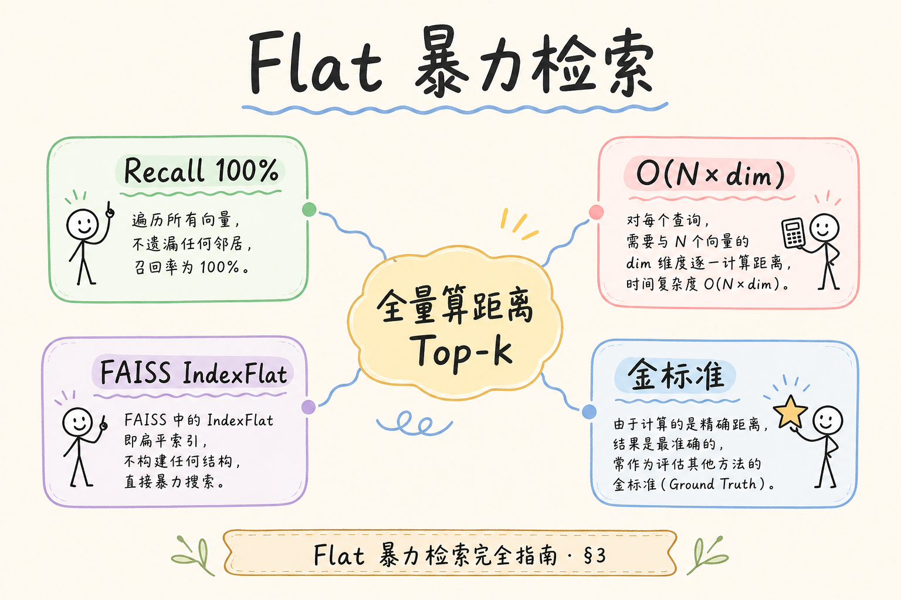
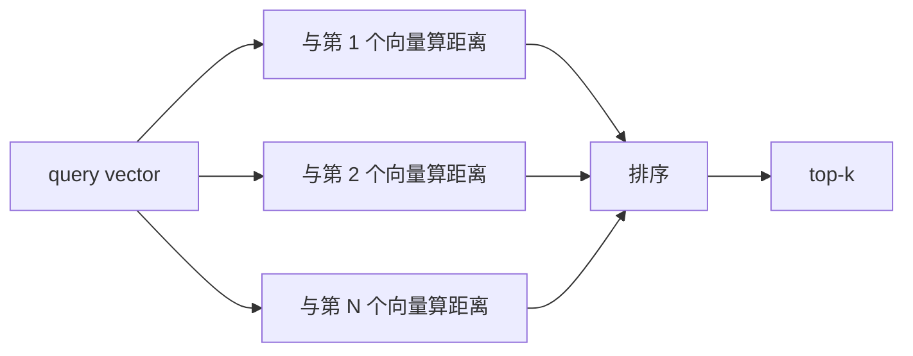
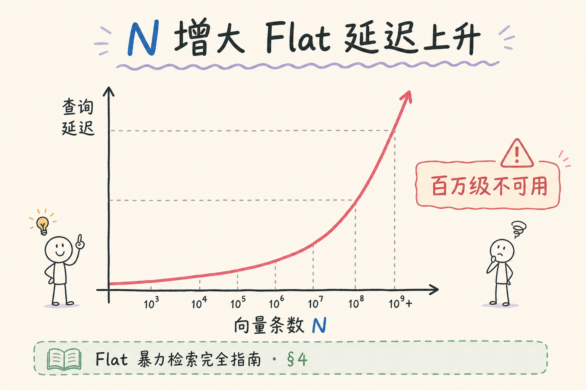
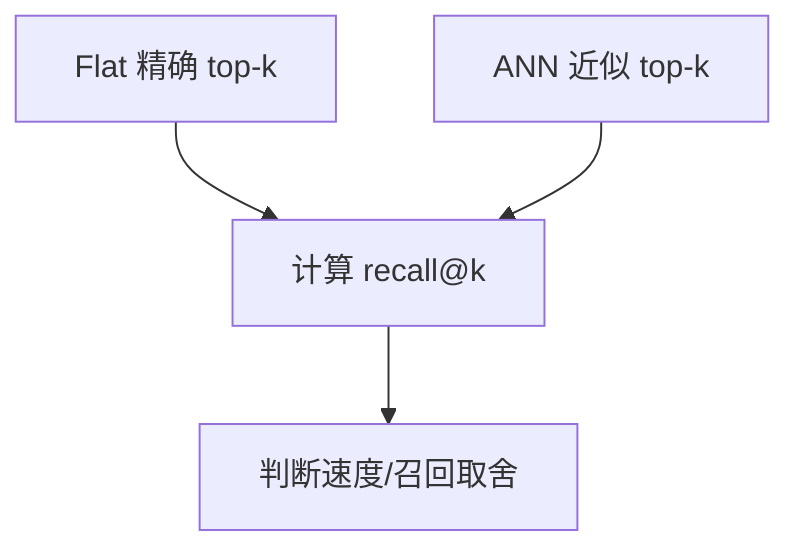
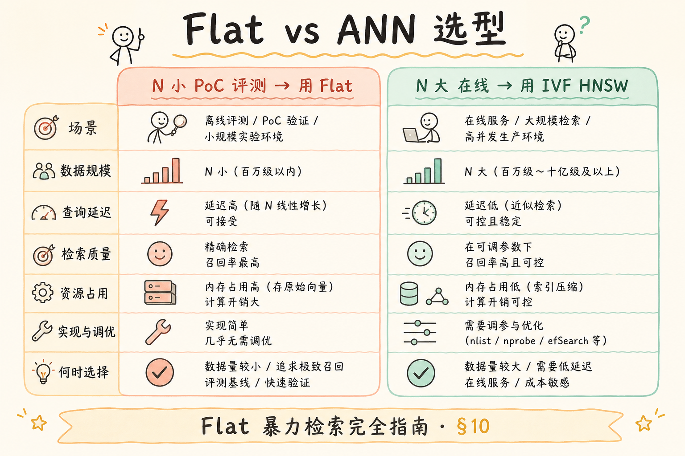

# C4 向量存储（地基）：Flat 暴力检索完全指南

**Flat 暴力检索** 是最直接的向量检索方式：把 query 向量和库里每个向量都算一遍距离，再排序取 top-k。它慢，但精确，是理解 ANN 索引和评测召回率的基线。  
通俗说：不走捷径，每个候选都比一遍。

读完本文，你应能解释 Flat 是什么、为什么先学它、解决什么评测问题、如何用最小代码实现，以及它和 IVF/HNSW 的关系。

---

## 目录

1. [前言：为什么先学笨办法](#1-前言为什么先学笨办法)
2. [本文边界与动手路径](#2-本文边界与动手路径)
3. [Flat 是什么](#3-flat-是什么)
4. [它有什么用：精确基线](#4-它有什么用精确基线)
5. [距离计算与复杂度](#5-距离计算与复杂度)
6. [最小 Python 实现](#6-最小-python-实现)
7. [FAISS IndexFlat 直觉](#7-faiss-indexflat-直觉)
8. [Flat 在评测中的作用](#8-flat-在评测中的作用)
9. [什么时候不能用 Flat](#9-什么时候不能用-flat)
10. [调参与观测](#10-调参与观测)
11. [常见翻车与 FAQ](#11-常见翻车与-faq)
12. [总结与下一步](#12-总结与下一步)

---

## 1. 前言：为什么先学笨办法

很多 ANN 索引会牺牲一点精确性换速度。如果你没学过 Flat，就很难理解“召回率下降了多少”。

Flat 的价值是给你一个标准答案：它算得慢，但只要距离函数正确，top-k 就是精确最近邻。学习它不是为了生产上永远用它，而是为了知道 ANN 在加速时牺牲了什么。

很多团队上线 HNSW 后只看 P95 延迟曲线，却从不问“漏了多少 gold chunk”。Flat 基线把这个问题变成可度量的 recall@k——这是检索层质量门，比事后用 LLM 润色答非所问便宜得多。

### 1.1 和 RAG 链路的关系

线上 RAG 很少用 Flat 做全库检索，但 **调 HNSW/IVF 参数时没有 Flat 基线，就不知道漏了多少正确 chunk**。漏召回发生在 rerank 之前，后面 LLM 再强也无法引用不存在的证据。Flat 是评测锚点，不是生产默认。

常见工作流：每周用抽样 query 在子集上重算 recall@k；若连续两周下降超过 2 个百分点，触发索引参数或 embedding 版本复查。

### 1.2 百万向量时为什么必须理解 Flat

100 万 × 768 维，一次 query 约 100 万次距离运算。P95 延迟随 N 线性恶化。ANN 用可接受的 recall 损失换数量级加速——但“可接受”必须用 Flat 标出的 gold top-k 来量化（见 [86 HNSW](86.hnsw-index-tutorial.md)、[85 IVF](85.ivf-index-tutorial.md)）。

## 2. 本文边界与动手路径

本文讲精确最近邻，不讲 IVF、HNSW、PQ 的内部细节。动手路径如下：

建议先用几十条真实 chunk 手写 NumPy 距离，再切到 FAISS IndexFlat——两步都跑通后，你才分得清“算法理解”和“工程加速”各自解决什么。验收标准是：同一 query 集上，Flat 输出可作为后续 ANN 对比的 gold。

| 步骤 | 你做什么 | 验收 |
|------|----------|------|
| A | 准备几条向量 | 能算距离 |
| B | 暴力排序 | 得到 top-k |
| C | 对比 ANN | 计算 recall@k |
| D | 判断规模边界 | 知道何时换索引 |

最小交付物是：你能用 Python 对所有向量算距离，并解释为什么这个结果可以当 ANN 评测基线。

### 2.1 每步建议花多久

| 步骤 | 建议时间 | 要点 |
|------|----------|------|
| A | 30 分钟 | 手写 NumPy 距离与排序 |
| B | 45 分钟 | 跑通 FAISS IndexFlat |
| C | 1～2 小时 | 同一 query 集对比 HNSW/IVF，算 recall@k |
| D | 30 分钟 | 估算 N、d 与延迟，判断规模边界 |

### 2.2 本文不展开

- IVF、HNSW、PQ 内部实现（见系列其他篇）
- GPU 批量 Flat 优化
- 带 metadata filter 的暴力扫描（工程上常先 filter 再 Flat 子集）

## 3. Flat 是什么

读下图时，重点看 Flat 的“笨”：query 会和每一个向量都计算距离。

Flat 的“笨”恰恰是它的可信度来源：没有簇划分误差、没有图导航剪枝，只有距离函数与向量空间本身。排障 embedding 或 metric 是否配错时，Flat 结果往往比任何 ANN 参数表更先说话。





上图的结论是：Flat 不跳过任何候选，所以精确但计算量随 N 线性增长。N 越大，每次查询要比较的向量越多。

### 3.1 “精确”在说什么

Flat 的 top-k 是在**当前距离度量下**的全局最优 k 个邻居（暴力枚举）。ANN 的 top-k 可能与 Flat 不同——**不同不等于错**，但必须用 recall@k 量化差多少。

## 4. 它有什么用：精确基线

Flat 的主要用途不是炫性能，而是提供标准答案。

在 RAG 工程里，Flat 很少出现在在线路径，却应出现在每次索引发版前的离线脚本里。没有 gold top-k，你只能知道 ANN “变快了”，却不知道正确制度条是否还在 top-10 里——用户投诉往往比仪表盘早两周到达。



| 场景 | Flat 的价值 |
|------|-------------|
| 学习向量检索 | 最容易理解 |
| 小数据集 | 简单可靠 |
| ANN 评测 | 当 gold top-k |
| 参数调优 | 判断 HNSW/IVF 漏了多少 |

如果没有 Flat 基线，你只能知道 ANN “很快”，却不知道它错过了多少本该返回的近邻。

### 4.1 场景案例：调 HNSW 的 efSearch

团队上线 pgvector HNSW，用户反馈“有时引用的制度条不对”。抽 80 条真实 query：

1. 在**同一子集**（如 5 万 chunk）上用 Flat 算 gold top-10
2. 用当前 HNSW 参数算 top-10，算 recall@10
3. 若 recall < 0.85，先增大 `ef_search`，再考虑重建 `M`

没有步骤 1，只能凭感觉调参，容易“延迟降了、漏召回多了”。

### 4.2 Flat 在 RAG 各层的角色

| 层级 | 是否用 Flat | 说明 |
|------|-------------|------|
| 在线检索 | 通常否 | 用 HNSW/IVF 等 ANN |
| 离线 gold | 是 | 标 recall 真值 |
| 调试 embedding | 是 | 排除“索引坏了还是向量坏了” |
| 小库 MVP | 可选 | <1 万向量常直接 Flat |

## 5. 距离计算与复杂度

如果有 `N` 个向量，每个向量维度是 `d`，一次查询大约要做 `N * d` 次运算。

复杂度直觉要带进容量规划：百万向量 × 768 维，一次全扫的 CPU 成本是线性可预期的。ANN 不是魔法，而是用可评测的 recall 损失换这个线性项的系数下降——Flat 就是那个告诉你“损失了多少”的尺子。

| 指标 | Flat 特点 |
|------|-----------|
| 精确性 | 最高 |
| 查询速度 | N 大时慢 |
| 内存 | 存全量向量 |
| 适用 | 小库、评测基线、离线验证 |

常见距离包括 L2、内积和 cosine。metric 必须和 embedding 使用方式一致。例如使用 cosine 时，通常要注意向量是否需要归一化。

### 5.1 距离度量对照

| 度量 | 典型场景 | 注意 |
|------|----------|------|
| L2 | 未归一化向量 | 维数高时距离分布窄 |
| 内积 | 已归一化，等价 cosine 排序 | 未归一化时长向量占优 |
| cosine | 文本 embedding 常见 | 先 normalize 再内积 |

Flat 与 ANN 必须用**同一 metric**，否则 recall 对比无意义。

## 6. 最小 Python 实现

下面代码演示 Flat 的本质：没有索引，没有剪枝，就是全量计算后排序。

这段代码刻意保持可读性而非性能：双重 for 或 NumPy 广播让你看见“每个向量都比一遍”的事实。生产评测 gold 可用 FAISS IndexFlat 批算，但 metric 与 normalize 流程必须与线上一致，否则 recall 对比无意义。

```python
import numpy as np

vectors = np.array([
    [0.1, 0.2, 0.3],
    [0.2, 0.1, 0.4],
    [0.9, 0.1, 0.1],
])
ids = ["a", "b", "c"]
query = np.array([0.2, 0.1, 0.35])

distances = np.linalg.norm(vectors - query, axis=1)
order = np.argsort(distances)

for idx in order[:2]:
    print(ids[idx], distances[idx])
```

预期行为是打印距离 query 最近的两个 ID。真实系统里，`ids` 对应 `chunk_id`，检索结果会继续带上文本、来源和 metadata。

### 6.1 先错对已：metric 混用

```python
# ❌ 用 L2 算 Flat gold，线上 HNSW 用 cosine
# recall 低可能是度量不一致，不是 ANN 坏了

# ✅ 与线上一致的 metric 和 normalize 流程
```

### 6.2 从 NumPy 到生产的差距

手写循环适合理解算法；生产应用 FAISS、pgvector 或向量库内置 Flat，利用 SIMD 与批量 query。评测 gold 可用 FAISS `IndexFlat` 离线批算，与线上一致即可，不必坚持 Python 双重 for 循环。

## 7. FAISS IndexFlat 直觉

FAISS 的 `IndexFlatL2` 和 `IndexFlatIP` 是 Flat 思想的工程实现。它比手写 NumPy 更适合批量向量检索，但算法直觉仍是“全量比一遍”。

IndexFlat 是连接“教科书暴力搜索”与“生产 ANN 评测”的桥梁：同一套向量、同一 metric 下，Flat 输出 id 列表可直接与 HNSW/IVF 结果算重叠率。下标到 `chunk_id` 的映射别偷懒，否则 gold 对了也无法回放 bad case。

```python
import faiss
import numpy as np

xb = np.array([[0.1, 0.2, 0.3], [0.2, 0.1, 0.4]], dtype="float32")
xq = np.array([[0.2, 0.1, 0.35]], dtype="float32")

index = faiss.IndexFlatL2(3)
index.add(xb)
D, I = index.search(xq, k=1)
print(D, I)
```

这段代码的输出里，`I` 是命中的向量下标，`D` 是距离。生产里要把下标映射回 `chunk_id`，否则无法返回引用。

### 7.1 IndexFlatL2 vs IndexFlatIP

| 类 | 距离 | 何时用 |
|----|------|--------|
| `IndexFlatL2` | 欧氏 | 未归一化、模型文档写 L2 |
| `IndexFlatIP` | 内积（越大越近） | 已 normalize，等价 cosine 排序 |

批量 query 时用 `search(xq, k)` 一次算多条，仍是对每个向量全量比——只是 SIMD/BLAS 更快。

## 8. Flat 在评测中的作用

ANN 索引需要评估 recall@k：它找回的 top-k 和 Flat 精确 top-k 有多少重叠。

评测脚本应版本化保存：query 集、Flat gold id 列表、ANN 参数组合三者缺一则半年后无法解释“当时为何选这个 efSearch”。recall@k 是索引层指标，不等于答案正确率，但没有它，检索层退化很难被提前发现。



上图的结论是：Flat 是评测锚点。HNSW、IVF、PQ 等方法可以更快，但要用 Flat 结果证明“快的同时没有漏太多”。

### 8.1 recall@k 怎么算

对每条 query：设 Flat 的 top-k 集合为 G，ANN 的为 P，则单条 recall = |G∩P|/k；对 query 集取平均。不必全库 Flat——可对 **分层抽样子集** 标 gold，再外推参数，但子集要覆盖租户与文档类型。

### 8.2 评测集从哪来

从业务日志抽 50～200 query，加 10 条“易混淆”负例 chunk 邻近的难 query。记录 gold `chunk_id` 与当前 ANN 的 recall@5/@10、p95。改版 embedding 或索引后重复同一套集。

### 8.3 与业务指标对齐

recall@10 从 0.92 提到 0.96，用户体感可能不明显；但从 0.75 提到 0.90 常能明显减少“答非所问”。与产品约定**最低可接受 recall**（如 0.9）比追逐 0.99 更务实，尤其在延迟 SLA 紧张时。

## 9. 什么时候不能用 Flat

数据很大、查询并发高、延迟要求低时，Flat 会吃不消。此时应考虑 IVF、HNSW、PQ 或专用向量数据库。

规模边界不是非黑即白：带 `tenant_id` filter 后，有效搜索空间可能只有数千向量，全租户百万级库仍可对子集做 Flat gold。关键是评测语义与线上一致——“先 ANN 再 filter”与“先 filter 再 Flat”的 recall 数字不可直接对比。

但在小数据集、离线评测、教学实验中，Flat 仍然是最清晰的起点。初学者先学 Flat，再学 ANN，会更容易理解 recall 和 latency 的取舍。

### 9.1 规模粗算

| 规模 | Flat 在线查询 | 建议 |
|------|---------------|------|
| < 1 万向量 | 往往可接受 | 可直接 Flat 或当 gold |
| 1 万～10 万 | 视硬件 | 原型 Flat，上线 ANN |
| > 50 万 | 通常不可作在线全扫 | Flat 仅离线/子集评测 |

### 9.2 多租户与 Flat 子集

若检索必先 `tenant_id` filter，可对每个租户子集单独做 Flat gold——子集仅数千向量时，甚至可在线用 Flat 做该租户的检索，全库仍用 ANN。评测时要与线上一致的 filter 语义，否则 recall 数字会骗人。

## 10. 调参与观测

Flat 本身无索引参数；观测的是 **作为基线时的耗时**，用于对比 ANN：

发版 ANN 参数前，用同一子集跑一轮 Flat vs ANN 是低成本保险。线上不必跑 Flat，但离线 recall 曲线应与 index 版本、embedding 版本一并归档，避免“只有某人笔记本上有一次 benchmark”。

| 指标 | Flat | ANN |
|------|------|-----|
| recall@k | 1.0（定义） | 目标如 ≥0.95 |
| p95 latency | 随 N 线性 | 应显著低于 Flat |
| 内存 | 存全量向量 | 常更高（图/簇结构） |

线上不必跑 Flat，但 **发版索引参数前** 应在离线集上跑一轮对比。日志可记 `ann_recall_est`（抽样）与 `retrieval_latency_ms`（[190](190.structured-logging-rag-tutorial.md)）。

### 10.1 发版前检查

- [ ] 评测集 recall@10 不低于上一版
- [ ] metric 与 normalize 与生产一致
- [ ] gold 子集覆盖主要 tenant 与文档类型
- [ ] ANN P95 低于 Flat 基线（同子集）且 recall 达标

## 11. 常见翻车与 FAQ

Flat 相关翻车多半不是 Flat 本身慢，而是 **metric 不一致** 或 **把 Flat 当成业务 gold 却未标注 chunk_id**。下面 FAQ 覆盖评测基线、cosine 归一化和与精排的边界，避免把召回问题误判为生成问题。

### 11.1 Flat 是不是没用？


不是。它是评测基线和小规模场景的可靠方案。

### 11.2 为什么我的 cosine 结果不对？

可能没有归一化向量，或者 metric 用错。确认模型建议使用 cosine、内积还是 L2。

### 11.3 Flat 和精排一样吗？

不一样。Flat 是向量召回；精排通常用更复杂模型重排文本对（[95](95.cross-encoder-rerank-tutorial.md)）。

### 11.4 为什么 ANN 结果和 Flat 不同？

ANN 会近似搜索，差异需要用 recall@k 评估。不同不一定错，但必须量化。

### 11.5 全库 Flat 太慢怎么办？

对随机或分层抽样的 1～5 万向量子集标 gold；或夜间离线批算全库 gold 缓存，白天只评 ANN。不要因评不了全库就跳过基线。

### 11.6 Flat 能带 SQL filter 吗？

可以：先 `WHERE tenant_id` 得到子集向量再暴力扫——子集小则 Flat 可行。这与“先 ANN 再 filter”的召回语义不同，评测时要与线上一致。

## 12. 总结与下一步

Flat 暴力检索是最简单、最精确的最近邻搜索方法。它慢，但能帮助你理解距离、复杂度和 ANN 评测。

从本篇到 [85 IVF](85.ivf-index-tutorial.md) 与 [86 HNSW](86.hnsw-index-tutorial.md)，主线是同一问题用不同方式少算距离。牢记 Flat 是锚点：任何 ANN 参数表若没有 recall 数字，都只是延迟优化，不是检索质量闭环。

### 12.1 本篇检查清单

- [ ] 能手写或 FAISS 跑通 Flat top-k
- [ ] metric 与 normalize 与线上一致
- [ ] 能算 recall@k（Flat vs ANN）
- [ ] 知道何时在线用 Flat、何时仅作基线
- [ ] 调 HNSW/IVF 前先有小样本 gold

下一步读 [85 IVF](85.ivf-index-tutorial.md)，理解如何通过“先分簇再搜索”减少计算量。
