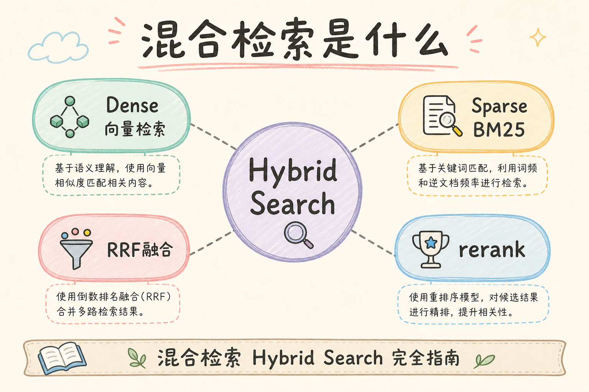
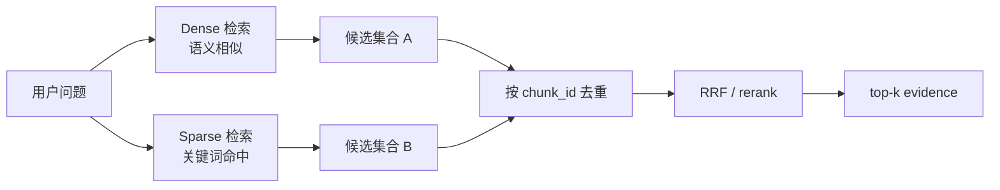
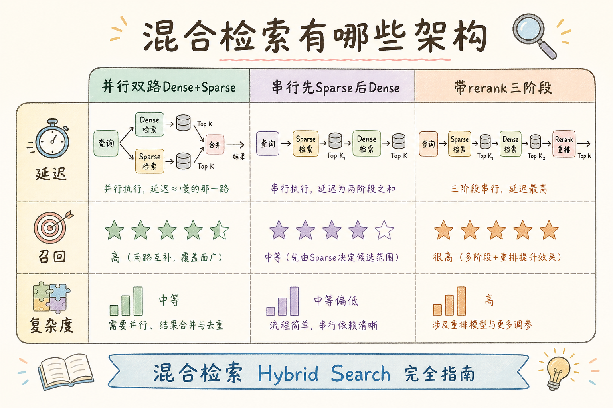
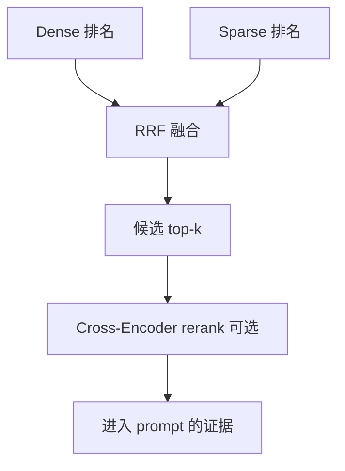
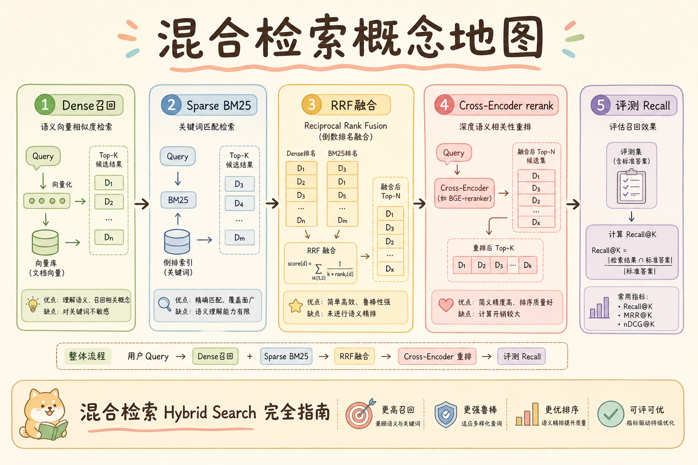

# C5 检索（三）：Hybrid Search 混合检索完全指南

**Hybrid Search**（混合检索）：把 Dense Retrieval 和 Sparse Retrieval 结合起来，同时利用语义相似和关键词命中。  
通俗说：既让系统听懂“意思”，也让它认得“原词、编号、错误码”。

读完本文，你应能解释混合检索解决什么问题、两路召回如何合并、为什么需要 RRF 或 rerank，并能写出最小混合检索伪代码。

---

## 目录

1. [前言：单一路召回为什么不稳](#1-前言单一路召回为什么不稳)
2. [本文边界与动手路径](#2-本文边界与动手路径)
3. [Hybrid Search 是什么](#3-hybrid-search-是什么)
4. [它有什么用：降低漏召回](#4-它有什么用降低漏召回)
5. [两路召回：Dense 与 Sparse](#5-两路召回dense-与-sparse)
6. [候选合并与去重](#6-候选合并与去重)
7. [融合排序：RRF 与 rerank](#7-融合排序rrf-与-rerank)
8. [最小伪代码示例](#8-最小伪代码示例)
9. [评测与上线阈值](#9-评测与上线阈值)
10. [常见翻车与 FAQ](#10-常见翻车与-faq)
11. [总结与下一步](#11-总结与下一步)

---

## 1. 前言：单一路召回为什么不稳

只用 Dense，可能漏掉标准号、错误码、API 名称；只用 Sparse，可能漏掉同义表达和自然语言改写。企业 RAG 用户既会问“报销住宿上限”，也会搜“GB/T 12345”。

混合检索的价值是降低单一路召回失败的概率。它不是为了让架构更复杂，而是因为真实知识库里的问题类型本来就混杂：有人按概念问，有人按原词搜，有人直接贴错误码。

### 1.1 何时值得上 Hybrid

| 信号 | 说明 |
|------|------|
| 评测里 Dense-only 漏标准号/错误码 | 应加 Sparse 路 |
| Sparse-only 漏口语改写 | 应加 Dense 路 |
| 两类问题都多 | Hybrid 为默认架构 |

若库内几乎全是自然语言 FAQ，可先 Dense + 评测，再按需加 Sparse，避免过度设计。

## 2. 本文边界与动手路径

本文讲候选召回层，不讲完整 reranker 训练，也不绑定某个搜索引擎。先掌握四步即可：

| 步骤 | 你做什么 | 验收 |
|------|----------|------|
| A | 跑 Dense top-k | 语义问题能命中 |
| B | 跑 Sparse top-k | 精确词能命中 |
| C | 按 chunk_id 合并去重 | 同一证据不重复进 prompt |
| D | 用 RRF 或 rerank 融合排序 | 最终候选更稳定 |

本文的最小交付物是：你能解释为什么两路都要带权限过滤，并能写出“召回 -> 去重 -> 融合”的伪代码。

### 2.1 每步建议花多久

| 步骤 | 建议时间 | 要点 |
|------|----------|------|
| A～B | 各 1～2 小时 | 单路先跑通并各有小评测集 |
| C | 30 分钟 | 去重键用 `chunk_id` |
| D | 1～2 小时 | 先 RRF，再视情况加 rerank |

### 2.2 本文不展开

- Cross-Encoder 训练（见 [95](95.cross-encoder-rerank-tutorial.md)）
- 搜索引擎集群运维
- 多路除 Dense+Sparse 外的 KG 等扩展路

## 3. Hybrid Search 是什么

读下图时，注意 Dense 和 Sparse 是并行召回，不是谁替代谁。它们先各自找候选，再进入统一的去重和排序。

真实工单里，semantic、keyword、mixed 三类问题往往并存，单一路召回总会在某一类上系统性吃亏。Hybrid 的工程意义不是堆组件，而是 **降低单点盲区**：只要正确 chunk 被任一路捞进候选，RRF 或 rerank 就还有机会把它排到前面。代价是延迟与运维面翻倍，因此应用评测数据证明增益，而不是默认“双路一定更好”。





上图的结论是：Hybrid 的本质是多路召回后统一排序。只要其中一路把正确证据捞进候选集，后续融合和 rerank 就还有机会把它排上来。

## 4. 它有什么用：降低漏召回

混合检索解决的核心问题是“单一召回方式有盲区”。下面是最常见的三类场景：

| 用户问题 | Dense 可能怎样 | Sparse 可能怎样 | Hybrid 收益 |
|----------|----------------|------------------|-------------|
| “酒店最多报多少” | 能理解住宿报销语义 | 可能没有完全同词 | Dense 补位 |
| “GB/T 12345” | 可能把编号语义弱化 | 精确命中编号 | Sparse 补位 |
| “S3 AccessDenied 上传失败” | 能找相近故障说明 | 命中错误码和产品名 | 两路互补 |

初学者要避免一个误区：Hybrid 不是把两个分数简单相加。两路检索器的分数尺度通常不同，直接相加会让某一路不合理地压倒另一路。

### 4.1 融合方式选型

| 方式 | 优点 | 缺点 |
|------|------|------|
| RRF | 不依赖分数尺度，易实现 | 不细判 query-chunk 语义 |
| 加权融合 | 可手工调权 | 需标定尺度，易翻车 |
| Cross-Encoder rerank | 排序最细 | 慢、贵，见 [95](95.cross-encoder-rerank-tutorial.md) |

### 4.2 真实工单三类标签

给历史工单打标签 **semantic / keyword / mixed**，统计占比。若 mixed+keyword 超过 30%，Hybrid 通常比继续调 Dense embedding 更划算。数据驱动选型，比架构审美更可靠。

## 5. 两路召回：Dense 与 Sparse

双路召回时，Dense 与 Sparse 应视为 **同等公民**：各自 top_k、各自超时、各自 filter，而不是“主路 Dense + 附属 BM25”。权限 filter 必须在两路搜索调用里都出现——只在合并后过滤，越权 chunk 仍可能进入中间结果、缓存键或排障日志。线上排障时若发现精确词漏召回，先查 Sparse 分词与字段 mapping，再查 RRF 是否被噪声候选淹没。

| 召回方式 | 擅长 | 不擅长 |
|----------|------|--------|
| Dense | 同义表达、概念相近、自然语言问题 | 精确编号、低频符号、短代码 |
| Sparse | 关键词、错误码、条款号、API 名称 | 改写、隐含语义、同义说法 |

两路都要带同样的权限过滤，例如 `tenant_id`、`acl_group`、`is_active`。不要只在合并后过滤，因为那会让越权候选先进入中间结果，日志和缓存也可能留下风险。

### 5.1 两路 top_k 怎么设

常见起点：Dense top-20～50，Sparse top-20～50，融合后取 8～15 送 rerank 或 prompt。路数越多、K 越大，延迟与噪声越高，应用 [98 Top-K](98.top-k-retrieval-tutorial.md) 分阶段思想。

## 6. 候选合并与去重

合并时应以稳定 `chunk_id` 去重，而不是用文本字符串比较。文本可能被清洗、截断、加标题前缀，但 `chunk_id` 应该稳定代表同一个证据块。

去重键选错会在 prompt 里重复塞同一段证据，浪费 token 并放大幻觉。合并时保留 `sources`（dense/sparse/both）对调参极有价值：若大量正确答案仅 Sparse 命中，应加权重或增大 Sparse top_k，而不是继续调 embedding。融合前的候选池大小要在延迟与 recall 之间折中——两路各取 50 条再 RRF，rerank 成本会线性上升。



```python
def merge_candidates(*lists):
    merged = {}
    sources = {}

    for source_name, candidates in lists:
        for item in candidates:
            merged[item.chunk_id] = item
            sources.setdefault(item.chunk_id, []).append(source_name)

    return [
        {**item.to_dict(), "sources": sources[item.chunk_id]}
        for item in merged.values()
    ]
```

这段代码的预期结果是：同一个 chunk 只出现一次，但保留它来自 Dense、Sparse，还是两路都命中的信息。这个来源信息后面可用于日志解释和调参。

## 7. 融合排序：RRF 与 rerank

读下图时，区分两件事：RRF 是轻量融合，rerank 是更精细的 query-chunk 匹配判断。



RRF 不要求两路分数同尺度，适合作为入门融合方法。Cross-Encoder rerank 更精细，但更慢、更贵，通常接在候选数量已经被压缩之后。

### 7.1 链路时序建议

Dense 与 Sparse **并行** 发起可省 wall-clock；RRF 在内存中合并；rerank 串行最慢。监控里给每段单独计时，便于判断瓶颈在 BM25 集群还是向量库。

### 7.2 日志示例字段

`query_id`、`chunk_id`、`dense_rank`、`sparse_rank`、`rrf_score`、`final_rank`、`filter_hash`。出 bad case 时能回答：“这条是因为只有 Sparse 第 3 名才被 RRF 拉进来的。”

## 8. 最小伪代码示例

下面代码演示核心流程：两路召回、同样的权限过滤、RRF 加分、取最终候选。

```python
acl_filter = {"tenant_id": "acme", "is_active": True}

dense_hits = dense_search(query, top_k=20, filter=acl_filter)
sparse_hits = bm25_search(query, top_k=20, filter=acl_filter)

scores = {}
trace = {}

for rank, hit in enumerate(dense_hits, 1):
    scores[hit.chunk_id] = scores.get(hit.chunk_id, 0) + 1 / (60 + rank)
    trace.setdefault(hit.chunk_id, []).append(("dense", rank))

for rank, hit in enumerate(sparse_hits, 1):
    scores[hit.chunk_id] = scores.get(hit.chunk_id, 0) + 1 / (60 + rank)
    trace.setdefault(hit.chunk_id, []).append(("sparse", rank))

final_ids = sorted(scores, key=scores.get, reverse=True)[:8]
```

生产中还要保留原始分数、召回来源、filter 条件和最终排名。没有这些日志，后续 bad case 排查会很困难。

### 8.1 RRF 常数 60 从哪来

`1/(60+rank)` 里的 60 是文献与工程里常用的平滑项，避免排名第 1 与第 2 差距过大、也避免深排名贡献为零。你可以用评测微调，但 **无评测时不要改**——先与 [94 RRF](94.rrf-fusion-tutorial.md) 默认对齐，减少变量。

### 8.2 失败降级

若 Sparse 路超时，可仅用 Dense + 告警，而非整链失败；反之亦然。Hybrid 的优势是 **单路容错**，但要在监控里看见降级率，防止 Sparse 路长期挂掉却无人知。

## 9. 评测与上线阈值

评测集要覆盖三类问题，不能只用自然语言 FAQ：

| 类型 | 示例 | 期望 |
|------|------|------|
| 语义改写 | “酒店最多报多少” | Dense 命中 |
| 精确词 | “GB/T 12345” | Sparse 命中 |
| 混合 | “AccessDenied 上传失败怎么办” | 两路补位 |

上线前至少比较 Dense-only、Sparse-only、Hybrid 三组 recall@k 和答案引用质量。如果 Hybrid 只提高候选数量但没有提高答案质量，就要检查融合排序、rerank 和 prompt 裁剪。

### 9.1 A/B 对比表（示例）

| 方案 | recall@10 | 引用正确率 | p95 延迟 |
|------|-----------|------------|----------|
| Dense-only | 0.72 | 中 | 低 |
| Sparse-only | 0.58 | 中 | 低 |
| Hybrid+RRF | 0.81 | 高 | 中 |

数字仅为示意，必须以你的评测集为准。

### 9.2 上线检查清单

- [ ] 两路 filter 条件一致
- [ ] 合并日志含 `sources`（dense/sparse/both）
- [ ] 有 Dense-only / Hybrid 回归集
- [ ] 融合参数（如 RRF k）可配置、可版本化

### 9.3 上线评审要问的五个问题

1. Dense-only 的 hit@10 是否已达标？  
2. Sparse-only 在精确词子集上是否达标？  
3. Hybrid 是否在 **两类子集** 上都不弱于单路？  
4. 两路 filter 是否字节级一致？  
5. 降级与单路失败是否有监控？

通过后再调 RRF 常数或加 rerank，避免在漏召回的前提下优化排序。

## 10. 常见翻车与 FAQ

**两路 top_k 设越大越好吗？**  
不一定。候选太多会增加 rerank 成本和噪声。应通过评测选择召回 K 和最终进 prompt 的 K。

**能直接相加两路 score 吗？**  
不建议。BM25 分数、cosine 相似度、向量距离不是同一尺度，RRF 更适合入门。

**Hybrid 一定比 Dense 好吗？**  
不一定。要看评测集。如果知识库几乎全是自然语言 FAQ，Sparse 的增益可能有限。

**权限过滤放哪？**  
两路召回都要放。合并后再过滤只能减少最终展示风险，不能消除中间链路的越权候选风险。

### 10.1 排错速查

| 现象 | 先查什么 |
|------|----------|
| Hybrid 不如 Dense | Sparse 噪声是否压过 RRF；K 是否过大 |
| 精确词仍漏 | Sparse 分词、字段映射、filter |
| 延迟翻倍 | 两路是否可并行；候选 K 是否过大 |

### 10.2 中文分词与 Sparse 路

中文 Hybrid 要确认 BM25 分词与索引 analyzer 一致。分词错误时 Sparse 路形同虚设，RRF 只剩 Dense 一根腿。换分词器后应重跑 **精确词子集** 评测，不能只看整体 hit@k。

### 10.3 容量规划

两路召回使 **峰值 QPS 下资源翻倍**（向量库 + 搜索集群）。容量规划时应按两路并行最坏情况估 CPU/连接数，并为单路降级预留 headroom。

## 11. 总结与下一步

混合检索让 Dense 和 Sparse 互相补位，是企业 RAG 的常见默认方案。初学者重点掌握：两路召回、按 chunk_id 去重、RRF 融合、同源权限过滤、用评测集验证收益。



### 11.1 本篇检查清单

- [ ] 能画双路并行 + 去重 + 融合链路
- [ ] 不用裸分数相加做融合
- [ ] 两路权限 filter 一致
- [ ] 评测集含语义题 + 精确词题
- [ ] 日志可解释 chunk 来源路

Hybrid 上线后第一周重点看：**仅 Dense 命中、仅 Sparse 命中、双路命中** 各占多少。若 90% 只有 Dense，可评估是否简化架构；若精确词类占比高，Sparse 路不能省。

下一步读 [94 RRF Fusion](94.rrf-fusion-tutorial.md)，深入理解为什么排名融合比直接加分更稳。
