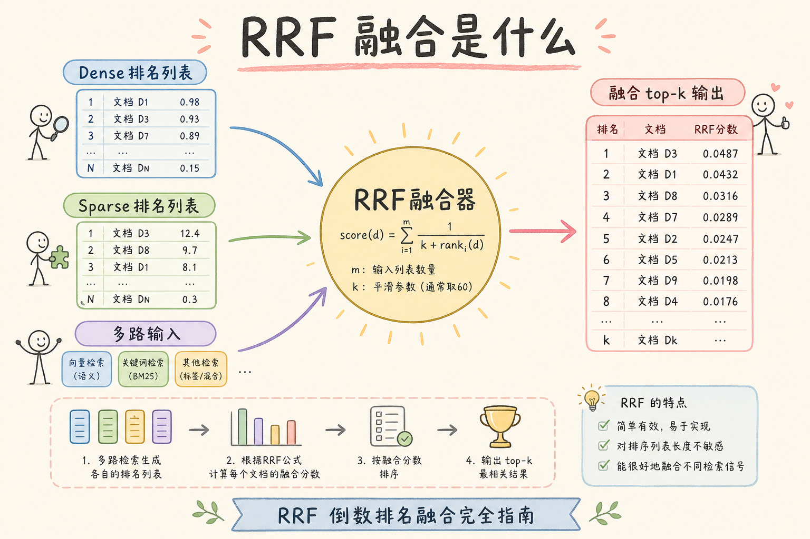
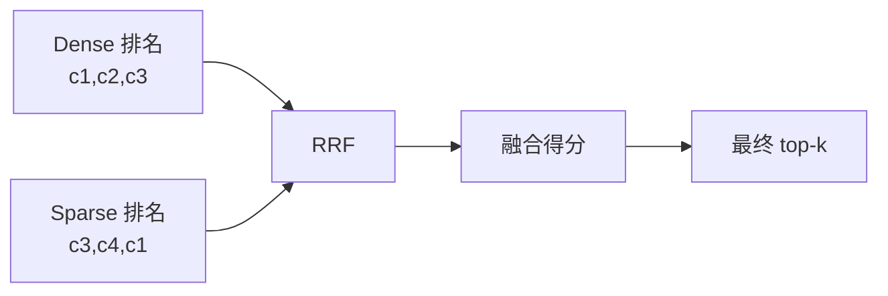
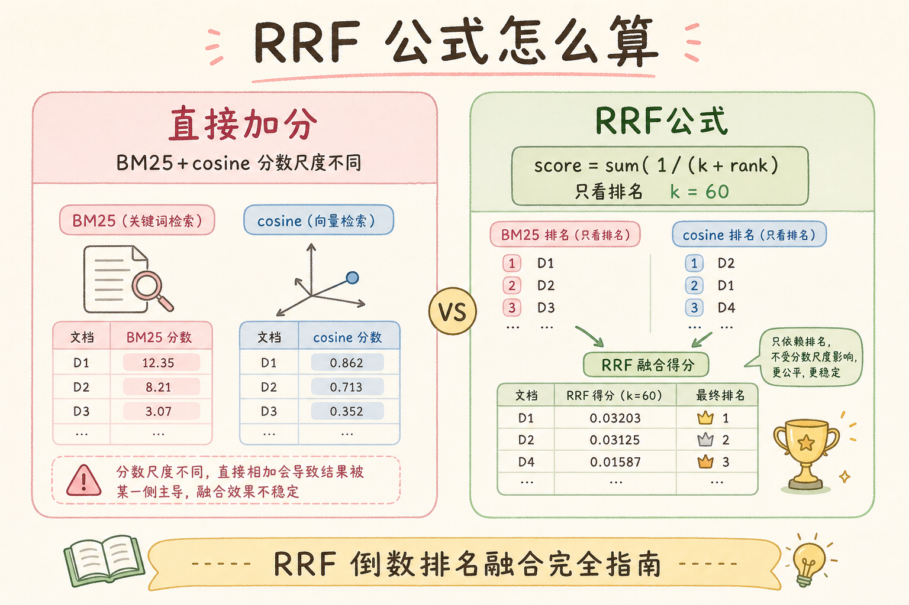
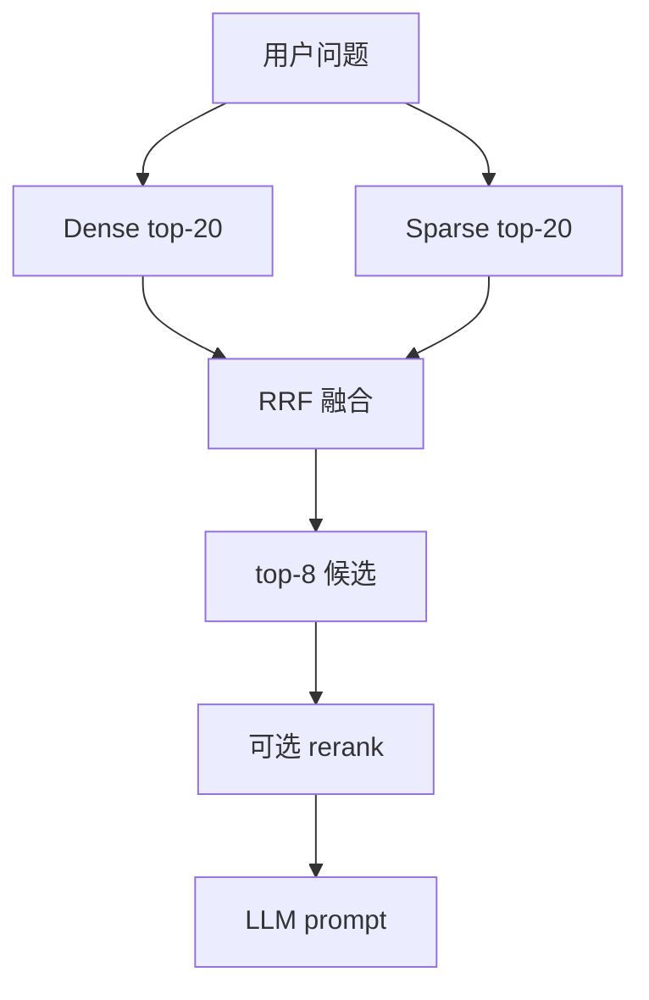
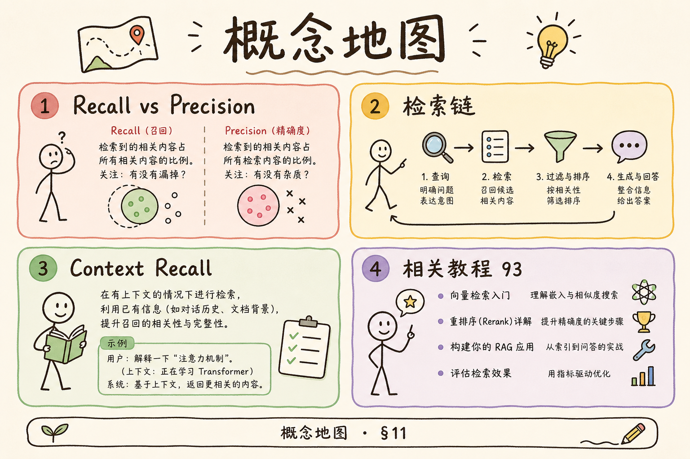

# C5 检索（四）：RRF 融合排序完全指南

**RRF**（Reciprocal Rank Fusion，倒数排名融合）：一种把多路检索结果合成一个排序的方法。它不直接比较不同检索器的原始分数，而是看候选在每一路结果里的排名。  
通俗说：不问“每个裁判打了多少分”，只看“每个裁判把它排第几”。

读完本文，你应能解释 RRF 解决什么问题、公式怎么理解、如何写最小实现，以及它在 Hybrid Search 中的位置。

---

## 目录

1. [前言：为什么不能随便加分](#1-前言为什么不能随便加分)
2. [本文边界与动手路径](#2-本文边界与动手路径)
3. [RRF 是什么](#3-rrf-是什么)
4. [它解决什么问题](#4-它解决什么问题)
5. [公式白话解释](#5-公式白话解释)
6. [最小 Python 实现](#6-最小-python-实现)
7. [在 Hybrid Search 中的位置](#7-在-hybrid-search-中的位置)
8. [参数 k 怎么理解](#8-参数-k-怎么理解)
9. [评测与日志](#9-评测与日志)
10. [常见翻车与 FAQ](#10-常见翻车与-faq)
11. [总结与下一步](#11-总结与下一步)

---

## 1. 前言：为什么不能随便加分

Dense 检索可能返回 cosine 分数，Sparse 检索返回 BM25 分数。两者分数尺度不同，直接相加很容易让一路结果压倒另一路。

举个直觉例子：BM25 的 12 分不一定比 cosine 的 0.82 “更相关”，因为它们不是同一把尺。RRF 的思路是绕开这件事：不比较原始分数，只比较每一路的名次。

### 1.1 和加权融合的对比

有人尝试 `final = α * dense_score + (1-α) * bm25_score`，但 BM25 与 cosine 的分布、量纲不同，α 很难跨 query 稳定。RRF 用 **名次** 做公共语言，工程上更省心，适合作为 Hybrid 第一版基线。

## 2. 本文边界与动手路径

本文讲 RRF 入门，不讲学习排序模型，也不展开 LambdaMART 这类排序训练方法。你要掌握的是一个轻量、可解释、工程上常用的融合基线。

| 步骤 | 你做什么 | 验收 |
|------|----------|------|
| A | 准备两路或多路排名 | Dense / Sparse 都有候选 |
| B | 按排名计算 RRF 分 | 每个 chunk 有融合分 |
| C | 排序取 top-k | 得到统一候选列表 |
| D | 记录来源和名次 | 能解释为什么入选 |

如果你正在做 Hybrid Search，RRF 通常是第一个值得实现的融合方法。

### 2.1 每步建议花多久

| 步骤 | 建议时间 | 要点 |
|------|----------|------|
| A | 已有 Hybrid 双路召回 | 各路至少 top-20 |
| B～C | 1 小时 | 跑通下文 `fuse` 函数 |
| D | 30 分钟 | 日志里记 source + rank |

### 2.2 本文不展开

- Learning to Rank、LambdaMART 训练
- 分数归一化后再加权的高级融合
- 多阶段级联排序

## 3. RRF 是什么

读下图时，重点看：RRF 接收的是“多个排名列表”，输出的是“一个融合后的排名”。

在 Hybrid 流水线里，RRF 是 **第一个应实现的融合器**：它不依赖 BM25 与 cosine 的标定，也不吃离线标注。团队常犯的错误是过早做分数归一化或拍脑袋加权，结果 α 在一个 query 上有效、换一批就翻车。RRF 用排名做公共语言，可解释、可单测、易回滚——适合作为上线基线，再在评测稳定后考虑 Cross-Encoder rerank。





上图的结论是：RRF 是多路排名的合并器，不负责召回本身。如果正确 chunk 没有出现在任何一路候选里，RRF 也无法凭空创造它。

## 4. 它解决什么问题

RRF 主要解决三件事：

| 问题 | 直接加分的风险 | RRF 的处理 |
|------|----------------|------------|
| 分数尺度不同 | BM25 和 cosine 不可直接比较 | 只看排名 |
| 两路都命中同一 chunk | 重复证据可能被复制进 prompt | 合并后加总排名贡献 |
| 单一路偶然高分 | 某一路噪声可能冲到前面 | 多路靠前会更占优 |

这也是为什么 RRF 很适合做 Hybrid Search 的入门方案：它简单、可解释、依赖少，先把融合闭环跑起来，再决定是否接更重的 reranker。

### 4.1 数值直觉（不必手算）

设 `k=60`，排名第 1 贡献约 `1/61≈0.0164`，排名第 10 约 `1/70≈0.0143`。头部名次差距不大，但 **两路都进前 10** 的 chunk 会累加，自然上浮——这正是我们想要的“多路共识”。

## 5. 公式白话解释

RRF 常见公式：



```text
score(doc) = sum(1 / (k + rank_i(doc)))
```

`rank_i(doc)` 是文档在第 i 路结果里的名次；没有出现就不加分。`k` 是平滑常数，常见默认值是 60。

| 情况 | 结果 | 原因 |
|------|------|------|
| 两路都靠前 | 总分高 | 每一路都贡献分数 |
| 只有一路靠前 | 仍有机会 | 至少有一路认为它相关 |
| 排名很靠后 | 加分很小 | `k + rank` 变大 |

初学阶段不要纠结公式推导。先记住一句话：排得越靠前，加分越多；多路都靠前，总分更高。

### 5.1 手算一个三文档例子

Dense 排名 `a,b,c`，Sparse 排名 `c,d,a`，k=60。`a` 在两路分别第 1 和第 3；`c` 在第 3 和第 1。`a` 的 RRF ≈ 1/61+1/63，`c` ≈ 1/63+1/61，两者接近，但双路都靠前的文档会系统性优于只单路爆表的深排名文档。手算一次，公式就不抽象了。

## 6. 最小 Python 实现

下面代码可以直接复制运行，帮助你看清 RRF 的输入输出。

实现时务必保证各路内部排序 **稳定可复现**：同分并列要有固定 tie-break（如 `chunk_id` 字典序），否则 shadow 对比与线上 A/B 会对不上。`traces` 字段应写入结构化日志，而不仅是 print——没有 source + rank，RRF 在排障时会退化成黑盒。单测至少覆盖：仅一路有结果、双路重叠、一路空列表三种边界。

```python
def rrf_score(rank, k=60):
    return 1 / (k + rank)


def fuse(rank_lists, k=60):
    scores = {}
    traces = {}

    for source_name, hits in rank_lists:
        for rank, chunk_id in enumerate(hits, 1):
            scores[chunk_id] = scores.get(chunk_id, 0) + rrf_score(rank, k)
            traces.setdefault(chunk_id, []).append((source_name, rank))

    return sorted(
        [(chunk_id, score, traces[chunk_id]) for chunk_id, score in scores.items()],
        key=lambda x: x[1],
        reverse=True,
    )


dense = ["c1", "c2", "c3"]
sparse = ["c3", "c4", "c1"]

for row in fuse([("dense", dense), ("sparse", sparse)])[:3]:
    print(row)
```

这个例子里，`c1` 和 `c3` 都被两路命中，通常会排得更靠前。`traces` 用来解释每个 chunk 是从哪一路、什么名次进入融合结果的。

### 6.1 边界情况

- 某路 **无结果**（如 Sparse 分词为空）：仍可对另一路单独算 RRF，或跳过该路
- 同一路 **同分并列**：稳定 tie-break（如 `chunk_id`）保证可复现
- 某 chunk 只在一路出现但排第 1：仍可能胜过两路都排第 15 的 chunk——这正是 RRF 的设计

## 7. 在 Hybrid Search 中的位置

RRF 通常放在 Dense 和 Sparse 召回之后、Cross-Encoder rerank 之前。



上图的实践含义是：RRF 先把候选压缩到一个可管理的列表，后面如果接 rerank，就不需要把几十上百个候选都送进更慢的模型。

### 7.1 与加权、学习的边界

RRF 是 **无监督、无训练** 的融合。若你已有大量点击日志，未来可上 LTR；但在没有标注排序数据前，RRF 往往比拍脑袋加权更稳。团队常犯的错是 **过早复杂化**，在 Hybrid 刚跑通时就上深度学习排序，维护成本陡增。

### 7.2 输出 top-k 与输入路数

融合后取 top-8 还是 top-15，取决于后面是否接 rerank、context 多长。路数从 2 增到 3（如加标题检索），RRF 仍适用，但要保证 **每路召回 K 足够**，否则某路只贡献 1～2 条，融合意义不大。

## 8. 参数 k 怎么理解

RRF 的 `k` 越大，排名差距被压得越平；`k` 越小，头部排名影响更强。初学阶段建议用默认 60，不要过早调参。

真正要调参时，用评测集比较 recall@k、MRR 和答案引用质量。只看某一次查询的排序，很容易把参数调成“刚好适配这一个例子”。

### 8.1 调 k 的简易实验

固定 query 集，试 `k ∈ {20, 40, 60, 100}`，记录 MRR@8 与融合后 hit@8。若差异 < 1%，用默认 60 即可，减少运维面。

### 8.1 与业务权重的关系

业务上若更信 Sparse（如法律条文库），有人给 Sparse 路 RRF 贡献乘系数——已偏离标准 RRF。若必须加权，应在文档中标注为 **变体**，并用评测证明优于标准 RRF，否则优先保持简单可解释。

### 8.2 单元测试建议

为 `fuse()` 写 3 条单测：单路 only、双路重叠、一路空列表。发布融合逻辑时先过单测再跑线上 shadow，避免低级索引错误导致生产排序乱序。

### 8.3 与搜索引擎原生融合

Elasticsearch/OpenSearch 8+ 提供 hybrid 查询；托管向量库也可能内置 RRF。自研 `fuse()` 与原生方案 **选其一为主**，避免双融合导致顺序不可解释。无论哪种，日志都要保留各路 rank。

### 8.4 生产配置项

建议将 `rrf_k`、融合后 `top_n` 写入配置中心并带版本号。与 [93 Hybrid](93.hybrid-search-tutorial.md) 的召回 K 一起变更时，用同一张 changelog 记录，便于回滚。

### 8.5 读日志回答三个问题

出问题时日志应能答：**哪几路参与了融合？** **期望 chunk 各路排名多少？** **融合分第几名？** 答不上来就说明 observability 未达标，应先补日志再调 k。

### 8.6 与下一篇 rerank 的衔接

RRF 输出列表直接进入 [95 Cross-Encoder](95.cross-encoder-rerank-tutorial.md) 时，应约定 **融合 top_n 上限**（如 15），避免 RRF 输出过多仍压垮 rerank。两节的 K 要在设计文档里 **成对出现**。

## 9. 评测与日志

日志建议至少记录这些字段：

| 字段 | 用途 |
|------|------|
| `chunk_id` | 知道是哪条证据 |
| `source` | 来自 dense、sparse 还是其他路 |
| `source_rank` | 在原始结果里的名次 |
| `rrf_score` | 融合分 |
| `final_rank` | 最终排名 |

这能帮助你解释：一个 chunk 是因为 Dense 命中、Sparse 命中，还是两路共同支持而进入 prompt。没有日志，RRF 会从“可解释融合”退化成“又一个黑盒排序”。

### 9.1 bad case 复盘模板

| 字段 | 示例 |
|------|------|
| query | `S3 AccessDenied` |
| 期望 chunk | `c_4021` |
| dense_rank | 12（未进融合 top-8） |
| sparse_rank | 2 |
| rrf_final | 第 6（若 K 够大则能进） |
| 行动 | 增大召回 K 或调融合后截断 |

用模板跑 10 条历史工单，比抽象讨论“RRF 好不好”更快落地。

## 10. 常见翻车与 FAQ

**RRF 会提升召回吗？**  
它不创造候选，只融合已有候选。召回上限由各路检索决定。

**RRF 能替代 rerank 吗？**  
不能完全替代。RRF 简单稳健，rerank 能更细地判断 query 与 chunk 是否匹配。

**k 一定要 60 吗？**  
不一定，但 60 是常见经验值。没有评测前不要乱调。

**能融合三路吗？**  
可以。例如 Dense、Sparse、KG 白名单检索都可以进入 RRF，但每一路都要保留来源日志。

### 10.1 排错速查

| 现象 | 可能原因 |
|------|----------|
| 融合后顺序反常 | 某路只返回 1～2 条，RRF 样本不足 |
| 两路都命中却排后 | k 过大压平差距；或 rerank 覆盖 RRF |
| 结果不可复现 | 各路内部排序不稳定（同分 tie-break） |

## 11. 总结与下一步

RRF 的核心价值是不用比较不同检索器的原始分数，只按排名融合候选。它适合做 Hybrid Search 的第一版融合方案：轻量、可解释、容易回滚。



### 11.1 本篇检查清单

- [ ] 融合输入是 **排名列表** 而非裸分数
- [ ] 默认 `k=60`，有评测再调
- [ ] 日志含 source、source_rank、rrf_score
- [ ] 与 rerank 分工清晰：RRF 融合、rerank 精排
- [ ] 三路以上仍保留 traces

RRF 上线后保留 **shadow 模式** 一周：并行算 RRF 与旧排序，只记日志不切流，对比 citation 差异。确认无回退再全量切换，降低融合逻辑 bug 的影响面。

下一步读 [95 Cross-Encoder Rerank](95.cross-encoder-rerank-tutorial.md)，理解如何在融合候选之后做更精细的重排。
