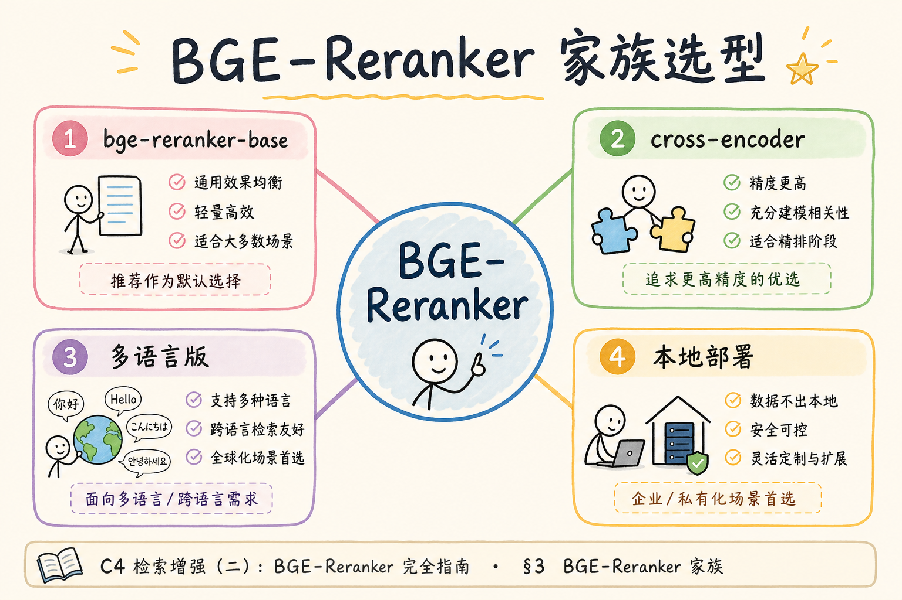
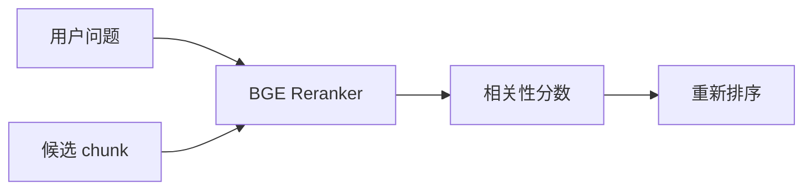
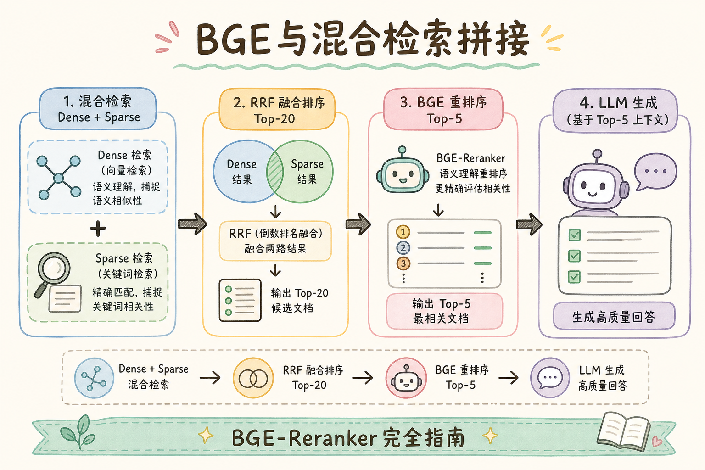
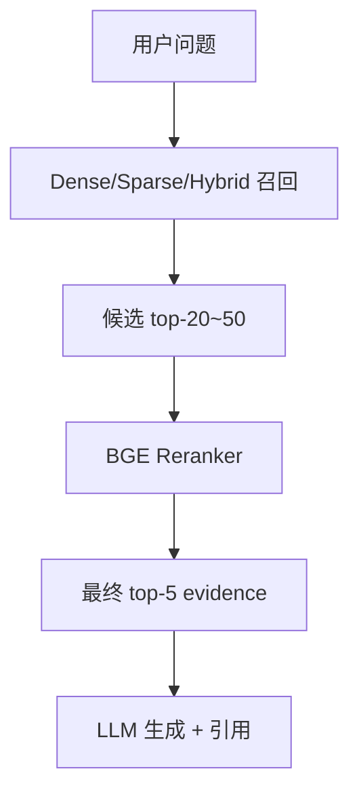
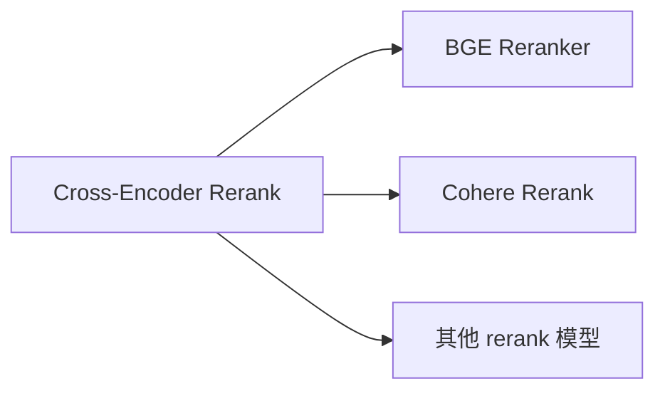

# C5 检索（六）：BGE Reranker 重排模型入门指南

**BGE Reranker** 是常见的开源重排模型系列。它接收“用户问题 + 候选 chunk”，输出相关性分数，用来把召回阶段拿到的候选重新排序。  
通俗说：召回先把资料找来，BGE Reranker 再判断哪几段最像真正答案。

读完本文，你应能说清 BGE Reranker 做什么、解决什么问题、如何接在 Hybrid Search 后面、最小怎么调用，以及它的延迟和评测边界。

---

## 目录

1. [前言：为什么需要专门的 reranker](#1-前言为什么需要专门的-reranker)
2. [本文边界与动手路径](#2-本文边界与动手路径)
3. [BGE Reranker 是什么](#3-bge-reranker-是什么)
4. [它解决什么问题](#4-它解决什么问题)
5. [它在 RAG 管道中的位置](#5-它在-rag-管道中的位置)
6. [最小调用示例](#6-最小调用示例)
7. [候选数量与延迟控制](#7-候选数量与延迟控制)
8. [与 Cross-Encoder 的关系](#8-与-cross-encoder-的关系)
9. [评测方法](#9-评测方法)
10. [常见翻车与 FAQ](#10-常见翻车与-faq)
11. [总结与下一步](#11-总结与下一步)

---

## 1. 前言：为什么需要专门的 reranker

向量检索和 BM25 负责“先找一批可能相关的 chunk”。但这批候选里常有相似但不回答问题的内容。Reranker 的任务是更精细地判断：这段文本是否真的能回答这个问题。

如果检索结果已经很准，reranker 提升可能有限；如果候选噪声多，reranker 往往能明显改善最终引用质量。它不是为了替代召回，而是为了在候选里做更细的排序。

### 1.1 何时优先选 BGE

| 条件 | 倾向 BGE |
|------|----------|
| 数据不能出域 | 本地部署 |
| 已有 GPU/CPU 推理能力 | 可自控延迟 |
| 中文企业文档为主 | 需用业务集评测具体型号 |

合规允许外发时，也可先用 [97 Cohere Rerank](97.cohere-rerank-tutorial.md) 快速验证，再决定是否自建。

## 2. 本文边界与动手路径

本文讲 BGE Reranker 的工程接入，不讲模型训练和模型服务部署细节。动手路径如下：

| 步骤 | 你做什么 | 验收 |
|------|----------|------|
| A | 先 Hybrid 召回 top-30 | 有候选 chunk |
| B | 拼 query + chunk | 构造 pairs |
| C | BGE 打分 | 得到相关性分数 |
| D | 取 top-5 | 进入 prompt |

最小交付物是：你能记录每个候选的原始排名、rerank 分数和最终排名。

BGE 接入的难点往往不在 `predict` 一行代码，而在与现有 Hybrid 管道的契约对齐：候选从哪来、文本截断规则是否与索引阶段一致、失败时是否回退 RRF。建议在 PoC 阶段就固定一份“金标 query 集”，每次改 batch 或换型号都跑同一套，对比 top-1 chunk_id 是否变化。否则很容易出现“本地 notebook 分数很好看、线上 citation 却错位”的割裂——根因通常是 pairs 构造与线不一致，而非 BGE 本身失效。

### 2.1 每步建议花多久

| 步骤 | 建议时间 | 要点 |
|------|----------|------|
| A | 已有 Hybrid 召回 | top-30 常见 |
| B～D | 半天～1 天 | 装模型、跑通 predict |
| 评测 | 半天 | 对比 RRF-only |

### 2.2 本文不展开

- BGE 模型选型全集与榜单解读
- vLLM / Triton 服务化细节
- 模型量化与蒸馏

## 3. BGE Reranker 是什么

BGE Reranker 属于 Cross-Encoder 风格：它把 query 和 passage 一起输入模型，直接输出相关性分数。





上图的结论是：BGE Reranker 不是向量库，它只对少量候选做精排。候选必须先由 Dense、Sparse 或 Hybrid Search 召回。

值班时若听到“BGE 分数很高但答案还是错”，先区分两类情况：一是 chunk 本身不含完整事实，分数只表示“文本像问题”，模型仍会幻觉；二是 rerank 分与 citation 展示顺序不一致，UI 仍按召回序编号。前者要回到 chunk 策略与入库质量，后者要在 API 层统一以 rerank 输出为引用序的唯一真相源。BGE 只负责把更可能回答问题的段落排到前面，不负责替 LLM 完成推理。

## 4. 它解决什么问题

BGE Reranker 主要解决“召回候选顺序不够准”的问题。

生产环境里这类噪声常来自混合检索：BM25 把含关键词但语义偏题的 FAQ 顶上来，向量路又把同主题的无关章节排在前面。BGE 读 query-passage 全文对后，能把“真正含条款编号、金额、日期”的段落往前推。排障日志建议同时打印 RRF 序与 BGE 序的 diff，若 diff 很大但 citation 仍差，再查生成是否忽略排名第一的证据，而不是继续换更大的 rerank 型号。

| 问题 | 只靠召回时 | 使用 BGE Reranker 后 |
|------|------------|----------------------|
| 候选语义相近但不回答 | 容易排前 | 可被压低 |
| Dense/Sparse 排名尺度不同 | 融合不稳定 | 统一用 query-passage 分数 |
| prompt 只能放少量证据 | 可能放错 chunk | 更可能放入有效证据 |
| bad case 难解释 | 只有召回分数 | 多一层 rerank 日志 |

它解决的是排序质量，不解决全库召回。正确 chunk 没进入候选时，BGE 也无法把它排出来。

## 5. 它在 RAG 管道中的位置

读下图时，重点看 BGE 位于候选召回之后、LLM 生成之前。





不要让 BGE 对全库 chunk 打分。它应该接在召回之后、生成之前，对少量候选做精排。

管道位置定下来后，要在监控里单独给 rerank 留指标：`rerank_latency_ms`、`rerank_degraded_total`、`rerank_input_count`。很多团队只监控 API p95，rerank 超时触发降级后整体延迟“变好”了，citation 却悄悄变差，直到差评堆积才被发现。与 LLM 串行时建议给 BGE 预留固定毫秒槽位，槽位用尽即降级 RRF，把剩余时间留给生成，避免精排挤占 LLM 预算。

### 5.1 部署形态粗选

| 形态 | 适用 |
|------|------|
| 进程内 `predict` | 原型、低 QPS |
| 独立 rerank 服务 | 多实例、需扩缩 |
| CPU 小模型 | 无 GPU、可接受更高延迟 |

无论哪种，都要 **与主 API 超时预算** 对齐：rerank 占多少毫秒应在设计阶段写进 SLA。

### 5.2 模型体积与延迟粗感

| 规格 | 直觉 |
|------|------|
| base 级 | 延迟较低，适合高 QPS |
| large / m3 多语 | 效果更好，延迟更高 |
| CPU 推理 | 可行但需控制候选数 |

同一业务应用 **同一型号** 做评测与线上，避免“评测用 large、线上用 base”导致结论失真。

## 6. 最小调用示例

下面是伪代码式示例，实际包名、模型名和推理方式按你使用的框架调整。重点是 pairs 的形状。

```python
query = "出差酒店最多能报多少？"
candidates = hybrid_search(query, top_k=30)

pairs = [(query, c.text) for c in candidates]
scores = reranker.predict(pairs)

ranked = sorted(zip(candidates, scores), key=lambda x: x[1], reverse=True)
final_chunks = [c for c, score in ranked[:5]]
```

生产中还要记录：召回来源、原始排名、rerank 分数、最终排名和耗时。否则重排出了 bad case，很难判断是召回问题还是重排问题。

联调时可在 staging 打开“重放模式”：固定 query、固定候选列表，只换 BGE 型号或 batch，观察排名是否稳定。若同一 pairs 两次分数差超过肉眼阈值，检查是否混用了 FP16/FP32 或模型未 warmup。上线后 p95 突刺时，先看候选数是否被误改成一百、再看 GPU 是否与其他服务争用，最后才怀疑权重文件损坏——这条顺序能避免很多无效的模型回滚。

## 7. 候选数量与延迟控制

Reranker 成本和候选数量近似线性相关。候选越多，质量可能提高，但延迟也会上升。

| 候选数 | 适用 |
|--------|------|
| top-10 | 延迟敏感，候选质量较好 |
| top-30 | 常见起点 |
| top-50 | 召回噪声较大，需要更充分重排 |
| top-100+ | 谨慎，通常需要批处理和缓存 |

如果线上延迟紧张，先减少候选数、加缓存、设置超时和降级，而不是直接删掉 rerank 评测。

### 7.1 文本截断建议

模型有最大长度；过长 chunk 要 **与线上一致的截断**（如取前 512 token 或“标题+首段”）。截断方式变了，分数分布也会变，需重跑阈值与评测。

### 7.1 冷启动与预热

首条 query 往往慢于后续。线上可在发布后对空 query 或固定探针跑 **warmup**，避免用户撞上冷启动。压测报告应写清是否包含 warmup，否则 P95 不可比。

## 8. 与 Cross-Encoder 的关系

BGE Reranker 是具体模型，Cross-Encoder 是模型结构类别。你可以把 BGE Reranker 理解成 Cross-Encoder 重排的一种常用实现。



上图的结论是：BGE 是“本地/开源模型路线”的一个代表；Cohere 这类服务是“托管 rerank 路线”的代表。

### 8.1 多语言与 m3 系列

中英混合文档库可优先试 multilingual reranker，但仍要用 **混合语言 query** 评测。某种语言 hit@5 达标不代表另一种也达标，不要只测中文 FAQ。

### 8.2 资源隔离

rerank 推理建议与在线 API **进程或容器隔离**，避免大 batch 占满 GPU 导致 API 超时。Kubernetes 上可为 rerank 设独立 HPA，与主服务解耦扩缩。

### 9.1 版本锁定

`requirements.txt` / 容器镜像中 **pin** rerank 模型 revision。静默升级 HuggingFace 权重会导致分数分布漂移，与 [99 阈值](99.score-threshold-tutorial.md) 问题类似，需回归评测。

## 10. 常见翻车与 FAQ

评测时不要只看“分数变高”。应看最终 top-k 是否更接近期望证据：

离线对比实验应固定 Hybrid 召回与同一金标集，只切换“无 rerank / RRF / BGE”三档。若 BGE 仅比 RRF 提升一个百分点却增加两百毫秒 p95，需要与产品一起算 SLA 账，而不是默认“上了模型就更好”。评测表里“持平”的行同样重要——说明该 query 类型可能不必过 rerank，可路由到轻量路径省 GPU。

| 指标 | 说明 |
|------|------|
| hit@5 | 期望 chunk 是否进入前 5 |
| MRR | 正确 chunk 排名是否提前 |
| p95 latency | 重排耗时是否可接受 |
| bad case | 是否把相似但错误的 chunk 排前 |

建议同时比较：不重排、RRF、BGE Reranker 三组结果。这样能看出 BGE 是否真的带来增益。

### 9.1 评测表（示例）

| query | RRF top-1 | BGE top-1 | 期望 chunk | BGE 是否更优 |
|-------|-----------|-----------|------------|--------------|
| 住宿上限 | c12 | c12 | c12 | 持平 |
| 年假天数 | c08 | c03 | c03 | 是 |

### 9.2 上线检查清单

- [ ] 模型版本 pinned（如 bge-reranker-v2-m3）
- [ ] batch size 与超时已压测
- [ ] 失败降级到 RRF
- [ ] GPU/CPU 利用率有监控

### 9.3 与 Cohere 的 A/B 方法

同一评测集：BGE 本地 vs Cohere API（若合规允许小样）。对比 hit@5、P95、运维工时。数据不出域时 BGE 常胜；快速试点时 Cohere 常胜。不要脱离 **数据边界** 谈效果。

## 10. 常见翻车与 FAQ

**BGE Reranker 能替代 embedding 吗？**  
不能。它太慢，只适合精排少量候选。

线上最常见翻车是“加了 BGE 反而更慢、 citation 几乎没变”。先核对候选是否本来就在前五——若 RRF 已把正确 chunk 排第一，rerank 的边际收益自然接近零，此时应优先压候选数与优化 LLM 上下文，而不是继续叠模型。另一类是中文制度库却用了英文为主的 rerank 权重，表现为分数挤在一起、名次随机抖动；换领域匹配型号后，务必用同一评测集重标 [99 阈值](99.score-threshold-tutorial.md)，因为分数分布会整体平移。

**为什么分数高但答案错？**  
分数表示相关性，不保证事实完整；还要看 chunk 是否包含足够证据。

**中文效果一定好吗？**  
不一定。要用你的业务问题评测，不要只相信通用榜单。

**线上超时怎么办？**  
设置超时，失败时降级使用 RRF 排序结果，并记录告警。

### 10.1 排错速查

| 现象 | 可能原因 |
|------|----------|
| 分数全接近 | 截断过度、模型未加载对 |
| 比 RRF 更差 | 领域不匹配；候选质量太差 |
| OOM | batch 过大、并发过高 |

### 10.2 量化与蒸馏（知悉即可）

若延迟仍是瓶颈，可调研 INT8 量化、更小 rerank 型号或蒸馏学生模型。任何压缩都需 **重跑 hit@5**，不可假设“量化只慢一点、效果一样”。

静默升级 HuggingFace 权重会导致分数分布漂移，与 [99 阈值](99.score-threshold-tutorial.md) 问题类似，需回归评测。

### 10.1 开源许可与商用

部署 BGE 前确认模型 **License** 是否允许你的商用场景。内部 PoC 与对外 SaaS 的合规要求不同，避免上线后补法律评审。

### 10.2 与量化模型的取舍

INT8 量化可降延迟，务必在 **你的 query 分布** 上复测 hit@5。通用 benchmark 上的 1% 损失，在长尾业务 query 上可能被放大。

BGE 代表 **自托管精排** 路线：数据可控、成本在算力。与 Cohere 对比时，用同一 Hybrid 召回与同一评测集，结论才有说服力。

本地 rerank 的 **运维清单** 还应包括：模型文件存储、驱动/CUDA 版本、健康检查探针、与主 API 的熔断联动。缺少任一项，线上可用性会低于托管服务。

上线第一周建议对比 **rerank 前后 MRR** 与 **GPU 利用率**，确认收益覆盖运维成本；若无提升，优先回头查召回与 chunk，而非继续叠更大 rerank 模型。

BGE 是精排落地的 **默认开源选项之一**；与向量召回、RRF 一样，必须用业务 query 持续回归，而不是一次性压测通过即永久不调。

精排模型与 [99 分数阈值](99.score-threshold-tutorial.md) 常一起调：rerank 输出分分布稳定后，再标定 τ_rerank，避免用召回阶段的 cosine 阈值误裁 rerank 结果。

## 11. 总结与下一步

BGE Reranker 适合放在 Hybrid 召回之后，对少量候选做精细排序。它能提升证据排序，但会增加延迟和推理成本。

自托管路线的长期成本在算力与运维，而不是 API 账单。建议把模型文件校验、CUDA 驱动矩阵、健康探针与熔断写进 runbook，与主 API 共用同一套 on-call 流程。发版时若只升 BGE 权重却不回归 Hybrid 召回，可能出现“新 rerank 把旧 embedding 召回到的错误 chunk 排得更前”的复合回退。下一步读托管方案时，用同一金标集对比本地 BGE 与 [97 Cohere](97.cohere-rerank-tutorial.md)，数据边界往往比榜单分数更早决定选型。


### 11.1 本篇检查清单

- [ ] BGE 只处理召回后候选
- [ ] pairs 构造与线上一致
- [ ] 有 RRF 降级路径
- [ ] 业务评测集验证中文/领域效果
- [ ] 记录模型版本与耗时

下一步读 [97 Cohere Rerank](97.cohere-rerank-tutorial.md)，对比托管 rerank 服务的接入方式和取舍。
