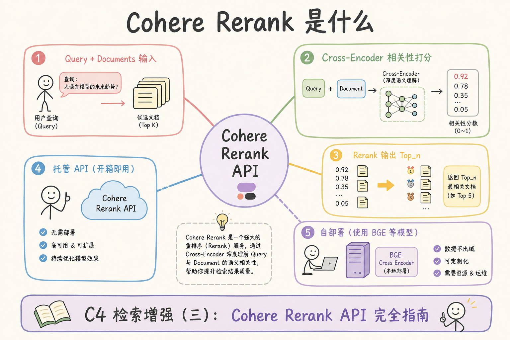
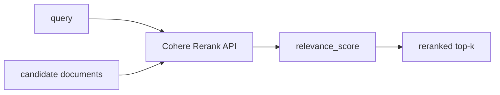
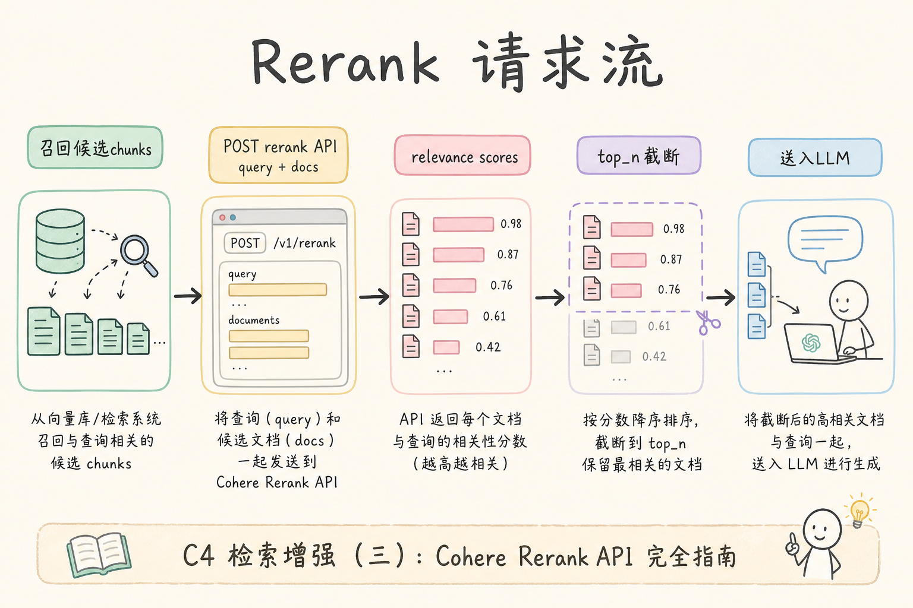
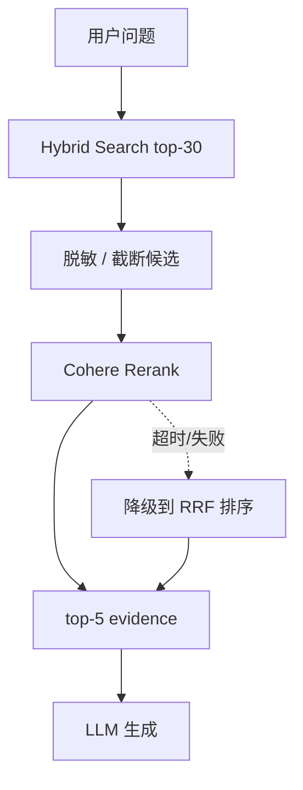
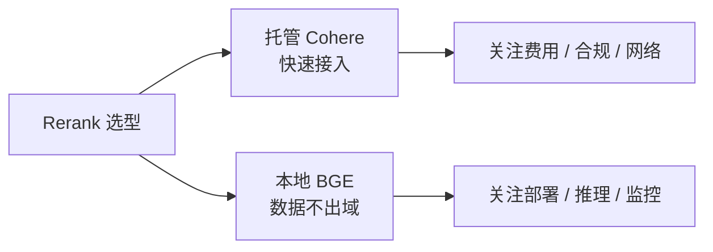

# C5 检索（七）：Cohere Rerank 托管重排服务入门指南

**Cohere Rerank** 是托管式重排服务。它接收 query 和一组候选文档，返回按相关性排序的结果。  
通俗说：前面的检索先“捞一批可能相关的材料”，rerank 再帮你把更像答案证据的材料排到前面。

读完本文，你应能解释 Cohere Rerank 做什么、有什么用、如何放进 RAG 管道、最小怎么调用，以及什么时候不适合用托管 rerank。

---

## 目录

1. [前言：为什么用托管 rerank](#1-前言为什么用托管-rerank)
2. [本文边界与动手路径](#2-本文边界与动手路径)
3. [Cohere Rerank 是什么](#3-cohere-rerank-是什么)
4. [它解决什么问题](#4-它解决什么问题)
5. [RAG 管道位置](#5-rag-管道位置)
6. [最小调用示例](#6-最小调用示例)
7. [数据合规与脱敏](#7-数据合规与脱敏)
8. [延迟、费用与降级](#8-延迟费用与降级)
9. [与本地 BGE 的取舍](#9-与本地-bge-的取舍)
10. [常见翻车与 FAQ](#10-常见翻车与-faq)
11. [总结与下一步](#11-总结与下一步)

---

## 1. 前言：为什么用托管 rerank

自建 reranker 要准备模型、GPU/CPU 推理、批处理、监控和升级。托管服务把这些运维细节交给供应商，让团队更快验证“重排是否提升答案质量”。

但托管服务会把候选文本发给外部 API，因此必须先确认合规边界。它不是一个“只调个接口”的小改动，而是检索链路里的外部数据处理节点。

### 1.1 适合先上 Cohere 的团队画像

- 想 **快速验证** rerank 是否提升 citation
- 暂无 GPU 运维能力
- 数据合规允许 **脱敏后的候选** 出域（或仅公开文档场景）

若默认不能外发内部制度全文，应直接评估 [96 BGE](96.bge-reranker-tutorial.md) 本地路线。

## 2. 本文边界与动手路径

本文讲工程接入，不评价具体商业价格，也不假设你已经有复杂检索系统。先按下面四步理解：

| 步骤 | 你做什么 | 验收 |
|------|----------|------|
| A | 召回 top-20 或 top-30 文档 | 有候选 chunk |
| B | 调 rerank API | 返回排序和相关性分 |
| C | 取 top-5 进 prompt | 引用更准 |
| D | 加超时、脱敏和降级 | 服务异常时仍可用 |

最小交付物是：你能把 rerank 放在“召回之后、生成之前”，并能说明哪些数据会发给外部服务。

动手前与安全、法务对齐一份“可外发字段白名单”：通常允许脱敏后的 chunk 摘要，不允许完整客户合同或含工号的日志片段。工程上建议先做“影子调用”：同一批 query 在本地 BGE 与 Cohere 各跑一遍，只记排名 diff 与延迟，不切换线上路径。这样能在不增加合规风险的前提下验证 citation 提升是否值得承担外发成本，避免先全量接 API 再被审计叫停。

### 2.1 每步建议花多久

| 步骤 | 建议时间 | 要点 |
|------|----------|------|
| A | 已有 Hybrid 召回 | 20～30 候选 |
| B | 2～4 小时 | SDK 调通 + index 映射 |
| C | 半天 | 对比 citation |
| D | 2 小时 | 超时、脱敏、降级 |

## 3. Cohere Rerank 是什么

读下图时，注意 Cohere Rerank 的输入不是全库，而是已经召回出来的一小批候选。

从架构视角，托管 rerank 是多出来的一个外部依赖节点：它有自己的配额、区域、网络 jitter 与密钥轮换节奏。接入前应在架构图里画出降级边——超时回 RRF，而不是让整个问答失败。PoC 周报应同时记录 citation 提升、P95 增量与月预估费用，三者缺一则难以向管理层证明是否继续采购。





上图的结论是：Cohere Rerank 只重排候选，不负责从全库召回。召回质量太差时，rerank 也救不回来。

排障托管 rerank 时，先问“候选里有没有正确 chunk”，再问“API 返回的 index 是否映射回 chunk_id”。第二类 bug 在联调期极常见：开发者按文本去重后重排了数组，却未同步更新 index，用户看到的引用 #1 与 LLM 读入的 #1 不是同一段。建议在响应落库时同时保存 `cohere_index`、`chunk_id`、`rerank_score` 三列，方便与 [182 检索调试台](182.retrieval-debug-console-tutorial.md) 对拍。

## 4. 它解决什么问题

普通向量检索或混合检索拿到的是“候选”，候选里可能包含看起来相关但不真正回答问题的 chunk。Rerank 的目标是更细地判断 query 和 chunk 是否匹配。

| 问题 | 只召回的风险 | rerank 的帮助 |
|------|--------------|---------------|
| 候选太多 | prompt 塞不下 | 挑出 top_n |
| 相似但不回答 | 语义像但证据错 | 按 query-document 相关性重排 |
| 多路召回混杂 | Dense/Sparse 结果顺序不统一 | 统一按相关性排序 |

初学者可以把 rerank 理解成“第二轮筛选”。第一轮检索要尽量别漏，第二轮 rerank 要尽量排准。

托管场景下第二轮还多出一维约束：外发 payload 大小与合规。运营常希望“多给候选让 rerank 挑”，安全却要求“少发敏感正文”。折中做法是先 RRF 压到十五～二十条、每条截断到统一字符上限，再调 Cohere；若 citation 下降，优先回查截断是否切断了表格表头，而不是无脑加候选条数。费用随字符数与调用量线性涨，应在看板里单独记 `document_chars_sent`，便于月底对账时归因到具体租户或知识库。

## 5. RAG 管道位置

读下图时，重点看两个控制点：候选进入外部 API 前要脱敏/截断；API 失败时要能降级。





候选文本进入外部 API 前，应先做长度控制和敏感信息处理。不要把完整原文、密钥、个人信息直接送出去。

### 5.1 请求体大小控制

30 条 × 每条约 2000 字符，单次 rerank  payload 可能数 MB。除截断外，可 **先 RRF 压到 top-15** 再送 Cohere，在质量与费用间折中。记录 `document_chars_sent` 便于成本归因。

### 5.2 SLA 拆分示例

假设端到端 P95 预算 3s：检索 400ms、rerank 800ms、LLM 1.5s、余量 300ms。Cohere 超时设 800ms，到点即降级 RRF。SLA 写在设计文档里，避免 rerank 挤占 LLM 时间却无人察觉。

## 6. 最小调用示例

下面是伪代码，实际 SDK 名称和参数以当前官方文档为准。示例重点是保留候选索引与原始 `chunk_id` 的映射。

```python
query = "出差酒店最多能报多少？"
candidates = hybrid_search(query, top_k=30)

documents = [c.text[:2000] for c in candidates]

response = cohere_client.rerank(
    query=query,
    documents=documents,
    top_n=5,
)

final_chunks = []
for item in response.results:
    original = candidates[item.index]
    final_chunks.append({
        "chunk_id": original.chunk_id,
        "text": original.text,
        "rerank_score": item.relevance_score,
    })
```

生产中要保存 `item.index` 和原始 chunk_id 的映射，否则引用会错位。重排后错引，比不重排更危险，因为用户会以为排序更可信。

集成测试应覆盖三条路径：正常返回、超时降级、429 重试后仍失败。很多团队只测 happy path，上线后供应商抖动时整条问答挂掉。降级到 RRF 时要在日志里打 `degraded=true` 与 `degrade_reason`，方便与 [184 评测看板](184.admin-log-eval-dashboard-tutorial.md) 关联——若某天 citation 下降且 degraded 率飙升，优先查网络与配额，而不是先换 LLM。

## 7. 数据合规与脱敏

托管 rerank 最大问题是数据是否能出边界。候选 chunk 不是“少量无害文本”，它可能包含完整合同条款、客户信息、内部制度或错误日志。

| 数据 | 建议 |
|------|------|
| 公开文档 | 可评估使用 |
| 内部制度 | 需审批并记录用途 |
| 客户隐私 | 默认不外发 |
| 密钥、身份证、手机号 | 调用前脱敏或禁用 |

不要把“只是重排”当成低风险。Rerank 服务看到的是用户问题和候选证据，它们合在一起可能暴露业务意图。

### 7.1 脱敏检查清单

- [ ] 身份证、手机、银行卡模式打码
- [ ] API Key、密码、token 不入候选外发
- [ ] 截断长度与审计：外发了哪些字段
- [ ] 法务/安全对供应商 DPA 已签署（若适用）

### 7.1 审计留痕

每次外发 rerank 记录：query 长度、候选条数、字符数、是否含脱敏、调用结果。合规审计常问“上个月是否把客户合同送过第三方”，没有留痕无法自证。

## 8. 延迟、费用与降级

托管 API 会增加网络延迟和请求成本。建议：

- `top_n` 控制在 5-10，候选控制在 20-50。
- 设置超时，例如 800ms 或 1500ms。
- 失败时降级为 RRF 或原始 hybrid 排序。
- 记录调用量、延迟、错误率、费用和降级次数。

降级不是可选项。没有降级时，外部 API 抖动会直接变成问答不可用。

### 8.1 费用与用量监控

记录每日 rerank 调用次数、平均候选数、`top_n`、失败与降级次数。费用随 **候选条数 × 查询量** 增长，上线前用峰值 QPS 粗算月成本。

### 8.1 跨境与私有化

跨境网络 jitter 会放大 P95。若客户要求数据不出境，应选区域 endpoint 或改本地 BGE。合同里的 **数据驻留** 条款直接决定 Cohere 是否可入围，早于效果评测。

### 8.1 重试策略

对 429/5xx 做 **有限次指数退避**（如 2 次），仍失败则降级。无限重试会把检索链路的 tail latency 拉爆，且掩盖供应商侧故障。

### 8.2 私有链路与 VPC

企业采购常要求 VPC peering 或私有 endpoint。网络方案确定后再做 P95 压测，公网压测结果不能代表私有链路 SLA。

### 8.3 密钥轮换

API key 轮换日要同时检查 **降级路径** 是否仍用旧 key 缓存。轮换窗口内短暂升高降级率可接受，但需告警与值班 runbook。

### 8.4 多区域容灾

若主区域 Cohere 不可用，容灾不仅是换 key，还要在 runbook 里写清：**是否自动切 BGE 本地**、切换后阈值与排序是否需不同配置。

## 9. 与本地 BGE 的取舍

读下图时，不要把“托管”和“本地”理解成谁更高级。它们主要是合规、运维和成本取舍。



如果数据不能外发，本地模型更合适；如果团队缺少模型服务能力，托管服务更快验证价值。选型前先问数据边界，再问效果。

### 9.1 决策矩阵（简版）

|  | 数据可外发 | 数据不可外发 |
|--|------------|--------------|
| 有 GPU | BGE / Cohere 均可试点 | BGE 或同类本地 |
| 无 GPU | Cohere 优先 | BGE CPU 或暂缓 rerank |

矩阵只作首轮筛选，最终仍以 citation 评测和 P95 为准。

### 9.2 供应商切换注意

换 API 版本或区域时，重新测 **index 映射与分数分布**。托管 rerank 的分数不宜与 BGE 分数混用为同一阈值 τ。

切换后阈值与排序是否需不同配置。

Cohere 适合 **验证 rerank ROI** 与 **低运维** 场景；确定长期方案后，仍建议用业务 citation 指标决定留托管还是迁本地，而不是只看首月接入速度。

## 10. 常见翻车与 FAQ

**Cohere Rerank 能直接接全库吗？**  
不能。它应只接召回后的少量候选。全库交给向量检索、BM25 或混合检索。

**为什么引用错了？**  
可能 rerank 返回的是候选索引，你没有映射回原 chunk_id。必须保留候选数组顺序和原始 ID。

**能把敏感文档发过去吗？**  
需要合规审批。默认不要外发隐私、密钥、客户数据和机密制度。

**API 超时怎么办？**  
降级到 RRF 或原始 hybrid 排序，并记录告警。不要让整个问答流程硬失败。

### 10.1 排错速查

| 现象 | 可能原因 |
|------|----------|
| 引用 chunk 错位 | `item.index` 未映射回 `chunk_id` |
| 偶发 403 | API key、区域、配额 |
| 延迟高 | 候选过长、未截断、跨境网络 |

托管 rerank 的 ROI 用 ** citation 提升 / (费用+延迟+合规成本)** 估算。若仅略优于 RRF，可保留 Cohere 作灾备，主路径用 RRF+BGE 混合，降低供应商锁定。

选型结论建议写入 ADR（架构决策记录）：数据边界、主备路径、降级策略、复盘日期。半年后复审，避免“临时托管”变成无文档的永久依赖。

## 11. 总结与下一步

Cohere Rerank 适合快速验证重排价值，但必须认真处理数据外发、费用、延迟和降级。它和本地 BGE 的核心差别不是“谁更高级”，而是运维与合规取舍。

试点结束后应写一份 ADR：主路径、灾备路径、数据驻留、月成本上限与复审日期。托管适合证明“重排值得做”，长期是否留存取决于 citation 提升能否覆盖合规评审与供应商锁定风险。无论留 Cohere 还是迁 BGE，都请与 [98 Top-K](98.top-k-retrieval-tutorial.md) 联调召回 K——外发条数由 K 直接决定，调 K 往往比换 rerank 型号更省钱。


### 11.1 本篇检查清单

- [ ] 合规确认候选可外发或已脱敏
- [ ] `index` → `chunk_id` 映射正确
- [ ] 超时降级到 RRF 已演练
- [ ] 监控调用量与费用
- [ ] 与 BGE 路线有清晰选型理由

下一步读 [98 Top-K Retrieval](98.top-k-retrieval-tutorial.md)，理解召回数量如何影响 rerank 成本和答案质量。
