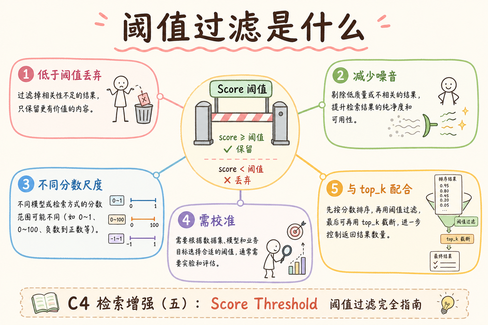
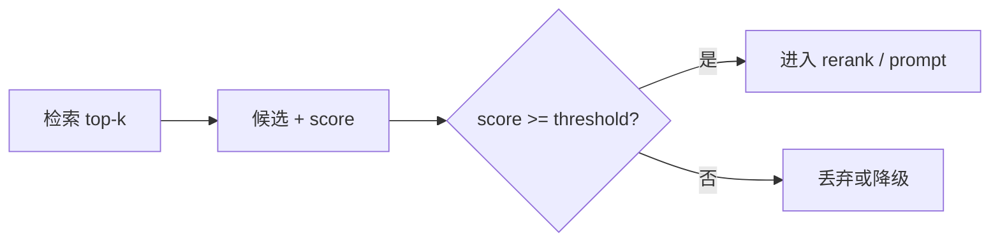
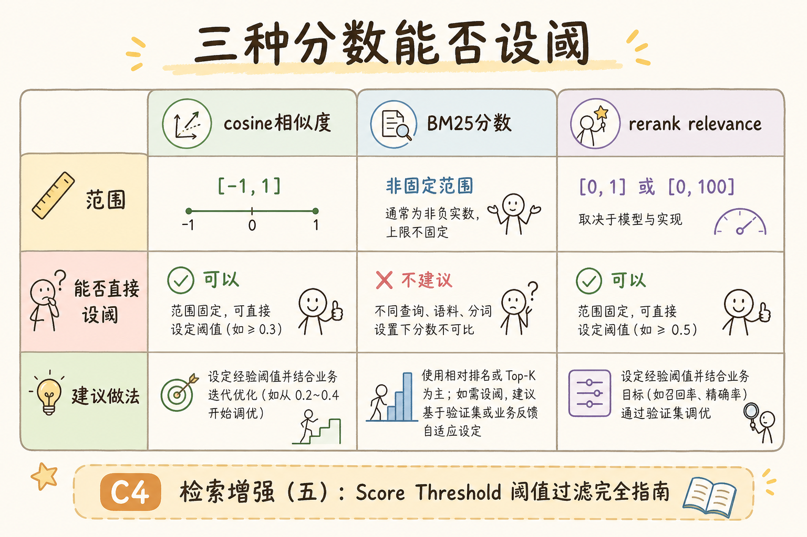
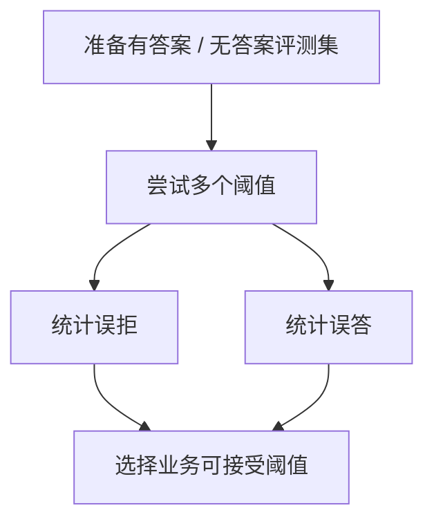

# C5 检索（九）：Score Threshold 分数阈值检索指南

**Score Threshold**（分数阈值）是指只保留相似度或相关性达到一定分数的候选。它和 Top-K 不同：Top-K 固定返回数量，阈值关注“够不够相关”。  
通俗说：Top-K 问“拿几条”，阈值问“这条够不够像答案证据”。

读完本文，你应能解释阈值解决什么问题、为什么不能盲设、如何与 Top-K 组合，并知道它在拒答策略中的作用。

---

## 目录

1. [前言：不是每个问题都该硬答](#1-前言不是每个问题都该硬答)
2. [本文边界与动手路径](#2-本文边界与动手路径)
3. [Score Threshold 是什么](#3-score-threshold-是什么)
4. [它解决什么问题](#4-它解决什么问题)
5. [Top-K 与阈值的区别](#5-top-k-与阈值的区别)
6. [最小实现示例](#6-最小实现示例)
7. [阈值怎么调](#7-阈值怎么调)
8. [与拒答和降级的关系](#8-与拒答和降级的关系)
9. [监控与评测](#9-监控与评测)
10. [常见翻车与 FAQ](#10-常见翻车与-faq)
11. [总结与下一步](#11-总结与下一步)

---

## 1. 前言：不是每个问题都该硬答

用户可能问知识库没有覆盖的问题。如果系统无论如何都取 top-5 给模型，模型就可能基于弱相关 chunk 硬编答案。分数阈值的作用是给检索结果设置最低相关性要求。

阈值不是万能安全锁，但它能减少“明显无证据还回答”的情况。它让系统有机会说：“当前知识库没有足够依据。”

### 1.1 和 Top-K 的配合

Top-K 保证 **最多** 取几条；阈值保证 **至少够相关** 才留下。常见组合：先 `top_k=20`，再 `score >= τ`，再 rerank。见 [98 Top-K](98.top-k-retrieval-tutorial.md)。

## 2. 本文边界与动手路径

本文讲检索后过滤候选，不讲完整拒答策略，也不讨论所有向量库的分数定义。动手路径如下：

| 步骤 | 你做什么 | 验收 |
|------|----------|------|
| A | 跑 top-k 检索 | 有分数 |
| B | 设置阈值 | 过滤弱相关 |
| C | 无候选时拒答或重试 | 不硬编 |
| D | 用评测调参 | 控制误拒和误答 |

最小交付物是：你能准备一组“有答案/无答案”问题，并用它们调出一个业务可接受的阈值。

动手时先画两张直方图：有答案集的最高分分布、无答案集的最高分分布。若两分布重叠严重，单靠一个全局 τ 很难兼顾误拒与误答，需要分意图或分库设阈值，或在 rerank 之后再裁。切忌把开发环境随手写的 0.7 直接抄到生产——换 embedding 或距离度量后，分数尺度可能整体平移，表现为“一夜之间全员拒答”或“从不拒答”。

### 2.1 每步建议花多久

| 步骤 | 建议时间 | 要点 |
|------|----------|------|
| A～B | 2～4 小时 | 看分数分布直方图 |
| C | 1 小时 | 空结果拒答文案 |
| D | 半天 | 有/无答案各 30+ 条 |

### 2.2 本文不展开

- 完整拒答产品与工单流转
- 贝叶斯最优阈值理论
- 多路分数统一校准模型

## 3. Score Threshold 是什么

读下图时，注意阈值发生在候选进入 prompt 之前。

阈值在代码里往往只是一行 `if score >= tau`，但在产品上是“敢不敢答”的开关。金融、合规类库通常宁误拒不误答，内部 FAQ 助手可略宽松并依赖用户反馈纠偏。实现前务必与法务、产品对齐拒答文案与转人工路径，否则工程把 τ 调得很高，客服却抱怨“系统什么都不说了”却不知是检索层在拦。





上图的结论是：阈值是在候选进入后续阶段前的一道质量门槛。它不是生成阶段的提示词，而是检索链路里的控制逻辑。

与 Top-K 联用时，阈值回答“够不够相关”，K 回答“最多看几条”。若只开大 K 不设 τ，库外问题仍会塞进弱相关制度片段，LLM 被迫硬答；若 τ 过高却 K 很小，可能先被 K 截断而从未有机会用分数过滤。排障拒答潮时，同时看 `max_score` 与 `filtered_count`：分数整体下降多半是 embedding 或索引问题，分数正常但全被滤掉才是 τ 过高。

## 4. 它解决什么问题

Score Threshold 主要解决“固定返回数量导致弱证据也进 prompt”的问题。

| 问题 | 没有阈值时 | 有阈值后 |
|------|------------|----------|
| 知识库无答案 | 仍返回 top-k | 可拒答或重试 |
| 弱相关候选 | 进入 prompt 增加幻觉 | 被过滤掉 |
| 不同问题难度 | 都硬取固定数量 | 按分数质量控制 |
| 低质量召回 | 模型被迫基于弱证据回答 | 更容易暴露检索不足 |

它不能保证答案正确，但能减少“候选明显不相关还继续生成”的情况。

企业客服场景里，阈值常与转人工并联：低分不硬答，而是给出来电话术与工单入口。这比单纯返回“不知道”更可用，也降低幻觉带来的合规风险。调参时应用同一批样本同时看误拒率、误答率与用户追问率——若拒答后大量用户换关键词就能命中，可能是 query 太短或 τ 偏高，而非知识库真无答案。

### 4.1 案例：库外问题

用户问“明天天气如何”，知识库只有 HR 制度。无阈值时 top-5 仍是弱相关制度片段，LLM 可能硬编；有阈值且最高分低于 τ 时，应 **拒答或引导换库**。

## 5. Top-K 与阈值的区别

| 方法 | 关注点 | 风险 |
|------|--------|------|
| Top-K | 固定数量 | 弱相关也会进来 |
| Threshold | 最低相关性 | 可能一个都不返回 |
| 两者结合 | 先取候选，再过滤 | 需要评测调参 |

常见做法是先取 `top_k=20`，再按阈值过滤，最后送 rerank 或 prompt。Top-K 给候选池，threshold 做质量门槛。

Hybrid 场景切忌对 Dense 与 BM25 共用同一个 τ：尺度不同，强行统一会导致某一路永远被滤空或永远不过滤。更稳的做法是在 RRF 或 rerank 之后对 **统一分** 设 τ_rerank，或仅对主向量路设 τ_dense。上线前用 [182 调试台](182.retrieval-debug-console-tutorial.md) 看被滤掉的候选长什么样，避免把“分数略低但含唯一正确条款”的 chunk 误杀。

### 5.1 分检索器设阈值

| 检索器 | 阈值思路 |
|--------|----------|
| 向量 cosine | 如 ≥ 0.72（需标定） |
| L2 距离 | 设最大距离或转为相似度 |
| BM25 | 独立 τ_bm25，不能与向量共用 |
| rerank 分 | 可另设 τ_rerank 做二次门槛 |

Hybrid 融合后若只有 RRF 排名、无统一原始分，阈值宜放在 **rerank 输出之后**，或对 **Dense 路单独** 做向量阈值。



## 6. 最小实现示例

下面示例假设分数越高越相似。真实系统必须先确认你的向量库分数方向：有的库返回相似度，越高越好；有的返回距离，越低越好。

```python
hits = vector_store.search(query_vec, top_k=20, filter=acl_filter)

filtered = [h for h in hits if h.score >= 0.72]

if not filtered:
    return "我在当前知识库中没有找到足够可靠的依据。"

final_chunks = rerank(query, filtered)[:5]
```

这段代码的预期行为是：弱相关候选不会进入后续 rerank 或 prompt。注意阈值后的空结果必须有处理路径。

代码评审时重点查分数方向：有的向量库返回距离越小越相似，若误用 `>=` 会变成“只保留最不像的”。单元测试应覆盖“全过滤”“刚好一条过线”“rerank 后再阈值”三条路径。空结果分支不要静默 fallthrough 到无检索生成，否则阈值形同虚设，bad case 里会出现最高分 0.3 仍长篇作答的幻觉。

## 7. 阈值怎么调

阈值不能只靠肉眼选。要同时看有答案问题是否被误拒、无答案问题是否被误答。



调阈值时建议分问题类型看结果。FAQ、制度条款、错误码、多跳问题的分数分布可能不同，用一个全局阈值未必总是合适。

### 7.1 误拒 vs 误答权衡

| 业务 | 倾向 |
|------|------|
| 医疗、合规、财务 | 宁拒答不误答（τ 偏高） |
| 内部助手、低风险 FAQ | 可略降 τ，加人工反馈 |
| 客服转人工顺畅 | 低分走工单而非硬答 |

用同一评测集画 **误拒率-误答率** 曲线选 τ，比拍脑袋稳。

### 7.1 分位数阈值（进阶）

除固定 τ 外，可对 **无答案集** 的分数取 95 分位作为参考上限，有答案集取下限，在两者之间选 τ。比单点拍脑袋稳，但仍需人工 spot check 边界样本。

## 8. 与拒答和降级的关系

阈值过后没有候选，可以走三种路径：

| 路径 | 适用 |
|------|------|
| 直接拒答 | 高风险知识库 |
| 放宽检索重试 | query 可能写得差 |
| 转人工/提交反馈 | 企业客服场景 |

不要把低分 chunk 硬塞给模型，再要求模型“不要幻觉”。证据层已经不稳了，生成阶段很难补救。

### 8.1 拒答文案与产品体验

拒答应说明 **原因与下一步**：“当前知识库未找到可靠依据，请尝试换关键词或联系人工。”比冷冰冰的“不知道”更易用。若走 query rewrite 重试，应限制次数（如 1 次），避免无限循环烧 token。

### 8.2 与幻觉治理的关系

阈值是 **检索层** 防控的一环，不能替代 [195 PII](195.pii-redaction-rag-tutorial.md) 等生成侧治理。但它能减少“硬答”触发率，降低后续审核压力。

### 8.3 阈值 + 拒答的产品指标

除误拒、误答外，跟踪 **用户追问率**（拒答后是否换说法重问）和 **转人工率**。若拒答后 40% 用户换词就能答上，可能是 τ 过高或 query 太短，而非库中无答案。

## 9. 监控与评测

上线后记录：候选分数分布、被阈值过滤数量、拒答率、用户反馈、bad case。

如果拒答率突然升高，可能是 embedding 模型变了、分数尺度变了、索引更新失败或阈值不适配新数据。阈值是和模型、距离度量、数据分布绑定的参数。

### 9.1 监控字段

- `max_score`、`filtered_count`、`reject_rate`
- embedding / index 版本
- 拒答后用户是否 retry 或转人工

### 9.1 季节性拒答率

大促、新版本上线后文档集变化，分数分布会漂移。每月看一次 **有答案集最高分直方图**，必要时微调 τ。把阈值当成与模型绑定的配置，而非一次设定永久有效。

### 9.1 与生成温度的关系

阈值过滤后候选仍可能多条，LLM **temperature** 过高仍会幻觉。阈值是检索层护栏，不能替代生成层 cite-only、低温度等策略，应多层叠加。

### 9.1 灰度调 τ

新 τ 可先对 5% 流量 shadow：旧逻辑出答案，新逻辑只记“是否会拒答”，对比误拒/误答再全量。比一次性改 production τ 更安全。

### 9.1 与 Hybrid 多路分数

若 Dense 与 BM25 分数尺度不同，**不要** 对两路分别设同一 τ 后取并集。应在 RRF 或 rerank 之后对 **统一分** 设阈值，或仅对主向量路设 τ。

### 9.1 文档化 τ 与模型版本

在配置库中维护 `threshold_v2: {embedding: bge-m3, tau: 0.72}` 这类记录，避免升级 embedding 后仍用旧 τ 造成拒答雪崩。

## 10. 常见翻车与 FAQ

**阈值能跨模型复用吗？**  
通常不能。不同模型和距离度量分数尺度不同。

发版最常见翻车是“升级 embedding 未重标 τ”：有答案集最高分从 0.85 降到 0.62，旧 τ=0.72 导致大面积误拒。应在配置中心把 `tau` 与 `embedding_version` 绑成一条记录，CI 检测到模型变更时阻断部署，直到评测集重跑通过。灰度期可用 shadow 模式对比新旧 τ 的拒答差异，再全量切换。

**阈值越高越安全吗？**  
不一定。太高会误拒很多本来可回答的问题，用户体验会变差。

**BM25 分数也能设阈值吗？**  
可以，但 BM25 分数和向量分数不可直接共用同一个阈值。

**无候选一定拒答吗？**  
高风险场景建议拒答；低风险场景可尝试 query rewrite 后重检索。

### 10.1 排错速查

| 现象 | 可能原因 |
|------|----------|
| 全拒答 | τ 过高；分数方向反了（距离当相似度） |
| 从不拒答 | 未设阈值；τ 过低 |
| 换模型后失控 | τ 未重标定 |

## 11. 总结与下一步

Score Threshold 解决的是“候选是否足够相关”的问题。它应和 Top-K、rerank、拒答策略一起设计，并通过有答案/无答案评测集调参。

阈值是检索层护栏，不能替代生成侧 cite-only 与低温度策略，但可显著降低“硬答”触发率。运营复盘时把拒答率、误答率、转人工率放在同一张周报里，比单看 τ 数字更有意义。下一步学习 query rewrite 时，记住拒答前应有限次改写重检，避免用户稍改措辞就能命中却被第一次低分挡在门外。


### 11.1 本篇检查清单

- [ ] 确认分数越高越相似（或已做距离转换）
- [ ] 有/无答案评测集调过 τ
- [ ] 空候选有拒答或重试路径
- [ ] 换模型/索引会重标定阈值
- [ ] 监控拒答率与分数分布

阈值 τ 建议与 embedding 版本号一起配置在配置中心；发版时 **禁止** 只升模型不升 τ 配置项，否则易出现拒答率或误答率阶跃变化。

下一步回到 [100 Query Rewriting](100.query-rewriting-tutorial.md)，学习在拒答前如何改写用户问题提高召回。
