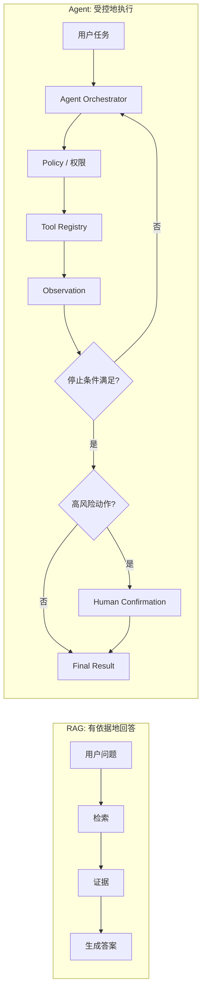
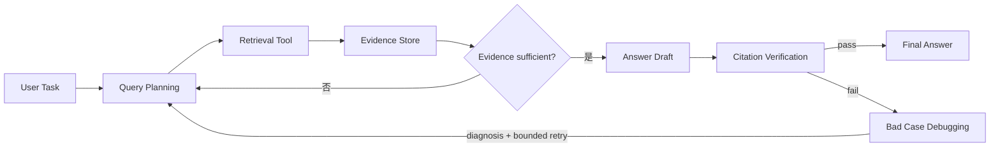
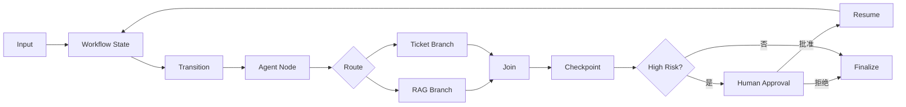
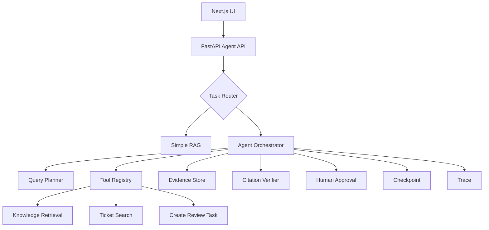

# AI Agent Mermaid 临时配图 Implementation Plan

> **For agentic workers:** REQUIRED SUB-SKILL: Use superpowers:subagent-driven-development (recommended) or superpowers:executing-plans to implement this plan task-by-task. Steps use checkbox (`- [ ]`) syntax for tracking.

**Goal:** 将 7 篇 AI Agent 重点文章的内嵌 Mermaid 图与既有配图规划对齐，并明确 PNG 延后替换状态后推送 `main`。

**Architecture:** Mermaid 源码继续内嵌在文章 Markdown 中，由 GitHub 渲染。只重绘信息缺失的 214、238、244、250；保留 215、218、226 的现有图。每个 `image/*/README.md` 只保存配图状态和未来 PNG 目标，`pending-images.txt` 继续作为 PNG 待办的唯一来源。

**Tech Stack:** Markdown、GitHub Mermaid（`flowchart`、`sequenceDiagram`）、PowerShell 静态验证、Git。

## Global Constraints

- 只使用 GitHub 支持的 Mermaid 基础语法，不新增 Node.js、Mermaid CLI 或构建依赖。
- 节点标识必须是 ASCII；显示标签可使用中文和已有英文术语。
- 每篇重点文章只保留一张主 Mermaid 图；不要追加重复图。
- `pending-images.txt` 的 7 条 PNG 待办必须保留，编码必须保持 UTF-16LE BOM（`FF FE`）。
- 不改动原有未跟踪目录 `.tmp/`。
- 完成验证并提交 Mermaid 改动后，再推送本地 `main` 到 `origin/main`。

---

## File Structure

| 文件 | 职责 |
|---|---|
| `214.rag-to-agent-transition-tutorial.md` | RAG 回答路径与 Agent 受控执行路径的对照图 |
| `238.agentic-rag-architecture-tutorial.md` | 带验证失败诊断回路的 Agentic RAG 架构图 |
| `244.agent-workflow-patterns-tutorial.md` | 含 Checkpoint、人审、Resume 的可恢复工作流图 |
| `250.build-knowledge-base-agent-tutorial.md` | 拆分 Checkpoint 与 Trace 的知识库 Agent 架构图 |
| `215.agent-vs-rag-vs-workflow-tutorial.md` | 保留并验证技术选型决策树 |
| `218.tool-calling-basics-tutorial.md` | 保留并验证工具调用时序图 |
| `226.agent-loop-observe-think-act-tutorial.md` | 保留并验证受预算约束的 Agent Loop 图 |
| `image/*/README.md`（7 个） | 记录 Mermaid 临时图完成、PNG 延后状态 |

---

### Task 1: 对齐 RAG 到 Agent 与 Agentic RAG 架构图

**Files:**
- Modify: `214.rag-to-agent-transition-tutorial.md:62-75`
- Modify: `238.agentic-rag-architecture-tutorial.md:29-40`
- Test: PowerShell Mermaid 结构检查（本任务内联执行）

**Interfaces:**
- Consumes: 文章中现有的一个 `mermaid` 代码块和正文术语。
- Produces: 214 的 RAG/Agent 对照图，以及 238 的 Citation Verification 失败回路图。

- [ ] **Step 1: 写出需要满足的静态断言**

在 PowerShell 中定义本任务的检查目标：

```powershell
$taskFiles = @(
  '214.rag-to-agent-transition-tutorial.md',
  '238.agentic-rag-architecture-tutorial.md'
)
$requiredTerms = @{
  '214.rag-to-agent-transition-tutorial.md' = @('RAG: 有依据地回答', 'Agent: 受控地执行', 'Human Confirmation', '停止条件满足?')
  '238.agentic-rag-architecture-tutorial.md' = @('Query Planning', 'Retrieval Tool', 'Citation Verification', 'Bad Case Debugging', 'bounded retry')
}
```

- [ ] **Step 2: 在改动前运行检查并确认其失败**

运行：

```powershell
foreach ($taskFile in $taskFiles) {
  $content = Get-Content -LiteralPath $taskFile -Raw -Encoding UTF8
  foreach ($term in $requiredTerms[$taskFile]) {
    if ($content -notmatch [regex]::Escape($term)) { "$taskFile missing $term" }
  }
  if ($taskFile -eq '250.build-knowledge-base-agent-tutorial.md' -and $content -match [regex]::Escape('Checkpoint / Trace')) {
    "$taskFile still combines Checkpoint and Trace"
  }
}
```

预期：输出 214 缺少两个对照分组术语和停止条件术语，238 缺少 `bounded retry`；这证明旧图尚未覆盖本任务目标。

- [ ] **Step 3: 替换 214 的 Mermaid 代码块**

将该文件唯一主图替换为：



- [ ] **Step 4: 替换 238 的 Mermaid 代码块**

将该文件唯一主图替换为：



- [ ] **Step 5: 运行结构检查并确认通过**

运行：

```powershell
foreach ($taskFile in $taskFiles) {
  $content = Get-Content -LiteralPath $taskFile -Raw -Encoding UTF8
  $mermaidCount = ([regex]::Matches($content, '(?m)^```mermaid$')).Count
  if ($mermaidCount -lt 1) { throw "$taskFile has no Mermaid block" }
  foreach ($term in $requiredTerms[$taskFile]) {
    if ($content -notmatch [regex]::Escape($term)) { throw "$taskFile missing $term" }
  }
  if ($taskFile -eq '250.build-knowledge-base-agent-tutorial.md' -and $content -match [regex]::Escape('Checkpoint / Trace')) {
    throw "$taskFile still combines Checkpoint and Trace"
  }
}
```

预期：命令正常退出，两个文件都至少有一个 Mermaid 块且包含所有目标术语。

- [ ] **Step 6: 暂存并提交**

```powershell
git add 214.rag-to-agent-transition-tutorial.md 238.agentic-rag-architecture-tutorial.md
git commit -m "docs: refine agent architecture mermaid diagrams"
```

预期：产生只包含两个文章文件的提交。

---

### Task 2: 补全可恢复 Workflow 与知识库 Agent 架构图

**Files:**
- Modify: `244.agent-workflow-patterns-tutorial.md:76-87`
- Modify: `250.build-knowledge-base-agent-tutorial.md:60-75`
- Test: PowerShell Mermaid 结构检查（本任务内联执行）

**Interfaces:**
- Consumes: Workflow、Checkpoint、Approval、Resume 和 Trace 的既有正文概念。
- Produces: 244 的可恢复状态图，以及 250 的职责分离架构图。

- [ ] **Step 1: 写出需要满足的静态断言**

```powershell
$taskFiles = @(
  '244.agent-workflow-patterns-tutorial.md',
  '250.build-knowledge-base-agent-tutorial.md'
)
$requiredTerms = @{
  '244.agent-workflow-patterns-tutorial.md' = @('Workflow State', 'Transition', 'Agent Node', 'Checkpoint', 'Human Approval', 'Resume')
  '250.build-knowledge-base-agent-tutorial.md' = @('Next.js UI', 'FastAPI Agent API', 'Task Router', 'Agent Orchestrator', 'Checkpoint', 'Trace')
}
```

- [ ] **Step 2: 在改动前运行检查并确认其失败**

运行：

```powershell
foreach ($taskFile in $taskFiles) {
  $content = Get-Content -LiteralPath $taskFile -Raw -Encoding UTF8
  foreach ($term in $requiredTerms[$taskFile]) {
    if ($content -notmatch [regex]::Escape($term)) { "$taskFile missing $term" }
  }
}
```

预期：244 缺少 `Workflow State`、`Transition`、`Checkpoint`、`Resume`；250 仍将 `Checkpoint / Trace` 写在一个组合节点中。

- [ ] **Step 3: 替换 244 的 Mermaid 代码块**

将该文件唯一主图替换为：



- [ ] **Step 4: 替换 250 的 Mermaid 代码块**

将该文件唯一主图替换为：



- [ ] **Step 5: 运行结构检查并确认通过**

运行：

```powershell
foreach ($taskFile in $taskFiles) {
  $content = Get-Content -LiteralPath $taskFile -Raw -Encoding UTF8
  $mermaidCount = ([regex]::Matches($content, '(?m)^```mermaid$')).Count
  if ($mermaidCount -lt 1) { throw "$taskFile has no Mermaid block" }
  foreach ($term in $requiredTerms[$taskFile]) {
    if ($content -notmatch [regex]::Escape($term)) { throw "$taskFile missing $term" }
  }
}
```

预期：命令正常退出，244 含完整恢复路径，250 含独立的 `Checkpoint` 和 `Trace` 节点。

- [ ] **Step 6: 暂存并提交**

```powershell
git add 244.agent-workflow-patterns-tutorial.md 250.build-knowledge-base-agent-tutorial.md
git commit -m "docs: add recoverable agent workflow diagrams"
```

预期：产生只包含两个文章文件的提交。

---

### Task 3: 标记 Mermaid 临时图状态并保留 PNG 待办

**Files:**
- Modify: `image/rag-to-agent-transition/README.md`
- Modify: `image/agent-vs-rag-vs-workflow/README.md`
- Modify: `image/tool-calling-basics/README.md`
- Modify: `image/agent-loop-observe-think-act/README.md`
- Modify: `image/agentic-rag-architecture/README.md`
- Modify: `image/agent-workflow-patterns/README.md`
- Modify: `image/build-knowledge-base-agent/README.md`
- Verify only: `pending-images.txt`
- Test: PowerShell status and encoding check（本任务内联执行）

**Interfaces:**
- Consumes: 每个图片 README 已有的 PNG 输出路径。
- Produces: 一致的临时图状态说明；PNG 待办继续由 `pending-images.txt` 管理。

- [ ] **Step 1: 写出需要满足的状态断言**

```powershell
$imageReadmes = @(
  'image/rag-to-agent-transition/README.md',
  'image/agent-vs-rag-vs-workflow/README.md',
  'image/tool-calling-basics/README.md',
  'image/agent-loop-observe-think-act/README.md',
  'image/agentic-rag-architecture/README.md',
  'image/agent-workflow-patterns/README.md',
  'image/build-knowledge-base-agent/README.md'
)
$statusText = 'Mermaid temporary diagram: complete'
```

- [ ] **Step 2: 在改动前运行检查并确认其失败**

运行：

```powershell
foreach ($imageReadme in $imageReadmes) {
  if (-not (Select-String -LiteralPath $imageReadme -SimpleMatch $statusText -Quiet)) {
    "$imageReadme missing Mermaid status"
  }
}
```

预期：7 个 README 全部缺少状态文本。

- [ ] **Step 3: 在每份图片 README 末尾添加统一状态块**

向每个文件追加以下内容，保留已有 PNG 目标路径：

```markdown
## Temporary Mermaid status

- Mermaid temporary diagram: complete. Its source is embedded in the linked tutorial article.
- PNG delivery: deferred. Keep the target output path above for the future bitmap replacement.
```

- [ ] **Step 4: 验证状态文本和 PNG 待办编码**

运行：

```powershell
foreach ($imageReadme in $imageReadmes) {
  if (-not (Select-String -LiteralPath $imageReadme -SimpleMatch $statusText -Quiet)) {
    throw "$imageReadme missing Mermaid status"
  }
}

$pendingEntries = @(Get-Content -LiteralPath pending-images.txt -Encoding Unicode | Where-Object {
  $_ -match '^(214|215|218|226|238|244|250)\.'
})
if ($pendingEntries.Count -ne 7) { throw "Expected 7 PNG pending entries, found $($pendingEntries.Count)" }

$bytes = [System.IO.File]::ReadAllBytes((Resolve-Path pending-images.txt))
if ($bytes[0] -ne 0xFF -or $bytes[1] -ne 0xFE) { throw 'pending-images.txt is not UTF-16LE with BOM' }
```

预期：命令正常退出，7 份 README 都有状态说明，7 条 PNG 待办仍存在，文件 BOM 为 `FF FE`。

- [ ] **Step 5: 暂存并提交**

```powershell
git add image/rag-to-agent-transition/README.md image/agent-vs-rag-vs-workflow/README.md image/tool-calling-basics/README.md image/agent-loop-observe-think-act/README.md image/agentic-rag-architecture/README.md image/agent-workflow-patterns/README.md image/build-knowledge-base-agent/README.md
git commit -m "docs: mark mermaid diagrams as temporary visuals"
```

预期：产生只包含 7 份图片 README 的提交。

---

### Task 4: 回归审计、提交最终状态并推送 main

**Files:**
- Verify: `214.rag-to-agent-transition-tutorial.md`
- Verify: `215.agent-vs-rag-vs-workflow-tutorial.md`
- Verify: `218.tool-calling-basics-tutorial.md`
- Verify: `226.agent-loop-observe-think-act-tutorial.md`
- Verify: `238.agentic-rag-architecture-tutorial.md`
- Verify: `244.agent-workflow-patterns-tutorial.md`
- Verify: `250.build-knowledge-base-agent-tutorial.md`
- Verify: `image/*/README.md`（7 个）
- Verify: `pending-images.txt`

**Interfaces:**
- Consumes: 前三个任务已提交的 Mermaid 图和状态说明。
- Produces: 可推送的 `main`，其中 Mermaid 临时配图和 PNG 待办状态一致。

- [ ] **Step 1: 运行完整 Mermaid 与 Markdown 回归检查**

运行：

```powershell
$articleFiles = @(
  '214.rag-to-agent-transition-tutorial.md',
  '215.agent-vs-rag-vs-workflow-tutorial.md',
  '218.tool-calling-basics-tutorial.md',
  '226.agent-loop-observe-think-act-tutorial.md',
  '238.agentic-rag-architecture-tutorial.md',
  '244.agent-workflow-patterns-tutorial.md',
  '250.build-knowledge-base-agent-tutorial.md'
)

foreach ($articleFile in $articleFiles) {
  $content = Get-Content -LiteralPath $articleFile -Raw -Encoding UTF8
  $fenceCount = ([regex]::Matches($content, '(?m)^```')).Count
  if (($fenceCount % 2) -ne 0) { throw "$articleFile has an unclosed code fence" }
  if (([regex]::Matches($content, '(?m)^```mermaid$')).Count -lt 1) { throw "$articleFile has no Mermaid block" }
  $mermaidMatches = [regex]::Matches($content, '(?ms)^```mermaid\r?\n(.*?)^```')
  foreach ($mermaidMatch in $mermaidMatches) {
    if ($mermaidMatch.Groups[1].Value -notmatch '(?m)^\s*(flowchart|sequenceDiagram)') {
      throw "$articleFile has an unsupported Mermaid diagram type"
    }
  }
}

git diff --check
if ($LASTEXITCODE -ne 0) { throw 'git diff --check failed' }
```

预期：命令正常退出；7 篇文章的围栏均闭合，每篇至少有一张 Mermaid，图类型仅为 `flowchart` 或 `sequenceDiagram`。

- [ ] **Step 2: 检查 Git 状态并确认无意外改动**

运行：

```powershell
$status = @(git status --porcelain=v1)
$unexpected = @($status | Where-Object { $_ -ne '?? .tmp/' })
if ($unexpected.Count -ne 0) { throw "Unexpected changes: $($unexpected -join ', ')" }
```

预期：命令正常退出；唯一允许的未跟踪路径是既有的 `?? .tmp/`。

- [ ] **Step 3: 推送 main**

运行：

```powershell
git push origin main
```

预期：使用仓库配置的个人 GitHub 私钥推送成功，`origin/main` 包含 Mermaid 设计、图形改进和状态说明提交。

- [ ] **Step 4: 验证远端同步**

运行：

```powershell
git status --short --branch
```

预期：显示 `main...origin/main`，不含 ahead 或 behind 标记；允许保留 `?? .tmp/`。
