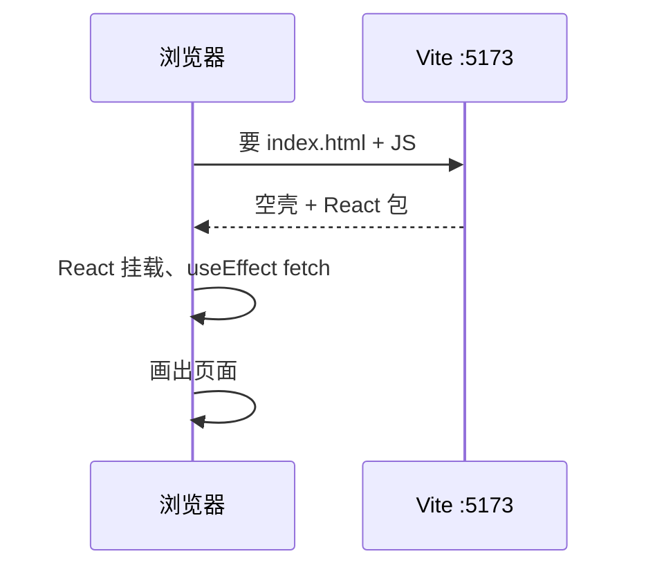
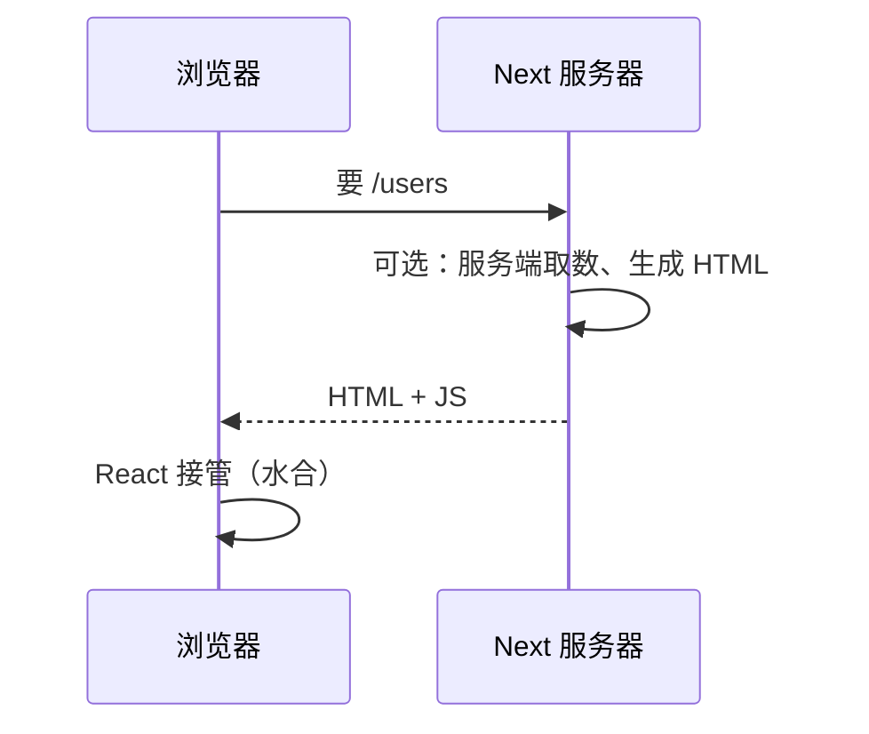

# Next.js 学习系列（一）：什么时候选 Next、和 Vite 差在哪

> 你已经走完 [React 系列](../react/README.md)（ES6 → Vite 组件 → 请求 → 路由 → POST → FastAPI 联调），能搭一个「会动、会请求、多页面」的 SPA。接下来常见疑问：**要不要换 Next.js？和 Vite 有什么不一样？会不会把 React 白学了？** 这篇是 **Next.js 系列第一篇**：只做**选型与概念地图**——不装环境、不写 `app/page.tsx`（第二篇再动手）。读完你能判断当前项目该用 Vite 还是 Next，并知道 React 系列里学的哪些东西**原样带走**、哪些要**换一套说法**。

---

## 目录

1. [前言：不是「升级」，是「另一种壳」](#1-前言不是升级是另一种壳)
2. [三个名字先分清：React、Vite、Next.js](#2-三个名字先分清reactvitenextjs)
3. [同一套 React，不同的「运行方式」](#3-同一套-react不同的运行方式)
4. [对照表：Vite SPA vs Next.js](#4-对照表vite-spa-vs-nextjs)
5. [什么时候继续用 Vite（不必换）](#5-什么时候继续用-vite不必换)
6. [什么时候值得上 Next.js](#6-什么时候值得上-nextjs)
7. [决策树：五问选型](#7-决策树五问选型)
8. [从 React 系列到 Next：概念怎么接](#8-从-react-系列到-next概念怎么接)
9. [常见误解与 FAQ](#9-常见误解与-faq)
10. [学前自检：可以开 Next 系列第二篇了吗](#10-学前自检可以开-next-系列第二篇了吗)
11. [总结与系列下一篇](#11-总结与系列下一篇)

---

## 1. 前言：不是「升级」，是「另一种壳」

典型场景：

- 简历上写「会 React」，招聘要求「熟悉 Next.js」——不知道算不算会。
- 教程有的用 `npm create vite`，有的用 `npx create-next-app`，怕选错。
- 听说 Next 有「服务端渲染」，担心要把 [第三篇](../react/03.use-effect-data-fetching.md) 的 `useEffect` 全部推翻。

**Next.js**：基于 React 的**全栈 Web 框架**，在 React 之上提供路由、渲染策略、构建与部署等约定。  
通俗说：**React 仍是写界面的语言**；Next.js 是带好了「房间布局、水电、门禁」的楼盘——Vite + React Router 则是自己买地皮搭房。

读完本文，你应该能做到：

1. 说清 React、Vite、Next.js 各自负责什么，不混为一谈。
2. 用决策树判断一个需求更适合 Vite SPA 还是 Next.js。
3. 列出 React 系列六篇里哪些能力在 Next 里**继续有效**。
4. 知道 Next 系列第二篇才会动手创建项目——本篇零安装。

**前置阅读**（强烈建议至少练通前三项）：

| 篇章 | 为何相关 |
|------|----------|
| [React（二）Vite + 组件](../react/02.vite-jsx-first-component.md) | 理解 SPA、Vite 角色 |
| [React（四）Router](../react/04.react-router-list-detail.md) | 与 Next 文件路由对照 |
| [React（三）useEffect 请求](../react/03.use-effect-data-fetching.md) | 与 Next 服务端取数对照 |
| [React（六）全栈对接](../react/06.fullstack-vite-fastapi.md) | 与 Next + 独立 API 对比 |

**本文边界**：不讲 `create-next-app` 命令、不讲 Server Component 代码——避免和「选型篇」抢焦点。

---

## 2. 三个名字先分清：React、Vite、Next.js

| 名字 | 是什么 | 通俗说 |
|------|--------|--------|
| **React** | 构建 UI 的库 | 写组件、`useState`、JSX——[系列（一）（二）](../react/README.md) 已在用 |
| **Vite** | 构建工具 + 开发服务器 | 把 `.jsx` 编译给浏览器；`npm run dev` ——**不是** React 替代品 |
| **Next.js** | 基于 React 的框架 | 自带路由、渲染方式、生产构建；底层仍用 React 写页面 |

关系可以记成：

```text
React        = 演员（组件）
Vite         = 排练场 + 装台（开发/打包 SPA）
Next.js      = 剧院整包（React + 路由 + 渲染 + 部署约定）
```

学 Next.js **不要求**忘掉 Vite 项目经验——而是多了一套「在 Next 里页面怎么放、数据在哪取」的规矩。

---

## 3. 同一套 React，不同的「运行方式」

### 3.1 Vite SPA：浏览器里才完整醒来

[React（二）](../react/02.vite-jsx-first-component.md) 的流程：



特点：

- 首屏往往是**空 `#root` + 加载 JS** 后再渲染（纯客户端渲染，CSR）。
- 路由在**浏览器内**切换（[React Router](../react/04.react-router-list-detail.md)），地址栏变但通常不整页刷新。
- 数据常在 **`useEffect` + `fetch`** 里拉（[第三篇](../react/03.use-effect-data-fetching.md)）。

### 3.2 Next.js：页面可在服务器先画一版



**SSR**（Server-Side Rendering，服务端渲染）：在服务器上把组件变成 HTML 再发给浏览器。  
通俗说：用户第一眼看到的是**已经带内容的网页**，而不只是转圈等 JS。

**SSG**（Static Site Generation，静态站点生成）：构建时就把页面生成好 HTML。  
通俗说：博客文章、文档页在「发布那一刻」就印好了，访问极快。

Next 还能继续纯客户端（`"use client"` + `useEffect`）——所以不是「Next = 不用 useEffect」，而是**多了一种在服务器取数的选择**。系列第二篇以后再细讲。

### 3.3 直觉类比（决策以 §4 表为准）

| 类比 | Vite SPA | Next.js |
|------|----------|---------|
| 餐馆 | 顾客进门自己看菜单平板点菜（JS 到了再渲染） | 门口已有今日推荐展板（服务端/静态 HTML） |
| 适用 | 店内后台、不用招揽路人 | 临街店面、要让路人一眼看懂 |

---

## 4. 对照表：Vite SPA vs Next.js

读下表时，左边是 [React 系列](../react/README.md) 默认路线，右边是 Next 常见默认。

| 维度 | Vite + React Router | Next.js（App Router） |
|------|-------------------|------------------------|
| 创建项目 | `npm create vite` | `npx create-next-app` |
| 路由 | `Routes` / `Route` 手写（[四](../react/04.react-router-list-detail.md)） | `app/users/page.tsx` **文件即路由** |
| 入口 | `main.jsx` 挂到 `#root` | `app/layout.tsx` + `page.tsx` |
| 首屏 SEO | 较弱（爬虫常看到空壳） | SSR/SSG 更友好 |
| 数据获取 | 客户端 `useEffect` + `fetch` 为主 | 可在服务端直接取数；客户端仍可用 |
| API | 常对接独立后端（[六](../react/06.fullstack-vite-fastapi.md) FastAPI） | 可 `app/api/...` Route Handler，也可仍调 FastAPI |
| 开发代理 | `vite.config.js` proxy | `next.config` rewrites 或直连 |
| 部署 | `dist/` 静态资源 + Nginx | Node 服务或 Vercel 等 |
| 学习曲线 | 低，概念少 | 中高，多渲染与边界概念 |

**结论不是「Next 全面更好」**，而是 **Next 用复杂度换 SEO、首屏和全栈约定**；很多项目用 Vite 更省事。

---

## 5. 什么时候继续用 Vite（不必换）

下面场景 **继续 Vite + React 完全合理**，不必为了简历硬上 Next：

| 场景 | 原因 |
|------|------|
| 内部管理后台、运营工具 | 不需 SEO；登录后 SPA 体验足够 |
| 后端团队固定 **Python / Java** API | [第六篇](../react/06.fullstack-vite-fastapi.md) 前后端分离清晰 |
| 还在巩固 React / Hook | Vite 干扰少，[系列二～五](../react/README.md) 够练 |
| 嵌入现有页面的「小挂件」 | 不必上大框架 |
| 强交互、少首屏内容 | CSR 可接受 |

你在 React 系列里搭的 **用户列表 + 路由 + POST + FastAPI**，作为**内部系统原型**可以长期停留在 Vite，无需迁移。

---

## 6. 什么时候值得上 Next.js

满足 **下面任意 2 条**，值得认真学 Next 并考虑新项目用它：

| 信号 | Next 能帮你什么 |
|------|-----------------|
| 产品页、博客、文档要 **搜索引擎收录** | SSR / SSG、metadata |
| 希望 **首屏快**、弱网先看到内容 | 服务端或静态 HTML |
| 页面多、嫌 **React Router 配置冗长** | 文件系统路由 |
| 想 **前后端都在一个 JS 仓库**（小全栈） | Route Handler、Server Actions（后续篇） |
| 计划部署 **Vercel** 或类似平台 | Next 是一等公民 |
| React 系列 **六篇已练通**，想接触工程化默认值 | 学习回报高 |

和 [REST API 教程](../5.rest-api-design-tutorial.md) 的关系：Next 可以**仍只做前端**调你的 FastAPI；也可以把部分 API 写在 Next 里——选型时团队后端栈说了算，没有唯一答案。

---

## 7. 决策树：五问选型

```text
1. 这个站要不要 SEO / 分享链接预览卡片？
   否 → 倾向 Vite
   是 → 倾向 Next

2. 用户首屏能不能等 JS 下载完再看到内容？
   能等（内网后台）→ 倾向 Vite
   不能等（公开落地页）→ 倾向 Next

3. 后端是不是已有独立 API 团队（如 FastAPI）？
   是 → Vite 或 Next 都行；Vite 心智更简单
   否、想 JS 全包 → 倾向 Next

4. 团队是否已熟悉 React 系列六篇？
   否 → 先练 Vite，别跳级
   是 → 可以开 Next 系列

5. 部署环境是否只有静态文件托管、没有 Node？
   是 → Vite build 更简单
   否 / 用 Vercel → Next 可选
```

**没有标准答案时**：练手、公司内部工具 → **Vite**；对外官网、内容站 → **Next**。

---

## 8. 从 React 系列到 Next：概念怎么接

你已学过的写法，在 Next 里大致对应如下（**第二篇起才写代码**）：

| React 系列 | Vite 里 | Next 里（预告） |
|------------|---------|-----------------|
| （一）`const`、解构、`map` | 照旧 | **照旧** |
| （二）函数组件、JSX、`useState` | `App.jsx` | `page.tsx`；交互多时要 `"use client"` |
| （三）`useEffect` + `fetch` | 挂载后请求 | 仍可用；或改在**服务端**取数（少一层 loading） |
| （四）`Route` / `Link` | `react-router-dom` | 文件路径 + `next/link` |
| （五）POST 表单 | `fetch` POST | 仍可用；或 Server Actions（后续篇） |
| （六）`vite proxy` + FastAPI | 开发代理 | `rewrites` 或继续直连 API |

**不必重学 JavaScript**；要补的是：

1. **文件放哪** → `app/` 目录约定  
2. **组件默认在哪跑** → 服务端 vs 客户端  
3. **数据何时取** → 构建时 / 请求时 / 浏览器里  

### 8.1 路由：从「配置」到「文件夹」

React（四）：

```jsx
<Route path="/users/:id" element={<UserDetailPage />} />
```

Next（概念）：

```text
app/users/[id]/page.tsx   →  自动就是 /users/:id
```

规则从「写在 `Routes` 里」变成「**目录名就是 URL**」——第二篇会带练。

### 8.2 数据：不是废除 useEffect

第三篇教的三态（loading / error / data）在 Next 里**仍然成立**，只要你还在客户端 `fetch`。  
差别是：有些页面可以在服务器就先拿到数据，**减少**「先进页面再转圈」——不是禁止 `useEffect`。

---

## 9. 常见误解与 FAQ

### 9.1 误解一：「会 Next = 会 React，反过来也一样」

- 会 Next 通常意味着会写 React 组件。  
- 只会配 Next 模板、不懂 `useState` / 列表渲染，遇到客户端交互仍会卡。  
- **建议**：先 React 系列，再 Next 系列——你现在的顺序是对的。

### 9.2 误解二：「用了 Next 就不能用 FastAPI」

错。大量项目是 **Next 前端 + Python API**。[第六篇](../react/06.fullstack-vite-fastapi.md) 的 `fetch('/api/users')` 在 Next 里仍可请求同一后端，只是开发时代理配置从 `vite.config` 换成 `next.config`。

### 9.3 误解三：「Next 比 Vite 高级，Vite 过时」

Vite 仍是主流 React SPA 工具；Next 是**另一类默认套餐**。Shopify 后台、很多 B 端系统长期是 SPA。

### 9.4 FAQ

**Q：Next 要学 Pages Router 还是 App Router？**  
A：新项目选 **App Router**（`app/` 目录）。本系列按 App Router 写。

**Q：要先学 Node.js 吗？**  
A：开发 Next 要会 `npm`、看懂报错；不必先系统学 Node 后端，但要知道「有一台 Next 服务在跑」。

**Q：和 Nuxt、Remix 呢？**  
A：同类「框架包框架」；你已选 React 线，Next 生态最大、资料最多。

**Q：TypeScript 必须吗？**  
A：不是。本系列先用 **JavaScript**，与 React 系列一致；类型可后补。

---

## 10. 学前自检：可以开 Next 系列第二篇了吗

打勾 **≥ 6 项** 再 `create-next-app` 会更顺：

- [ ] 能独立 `npm create vite` 并理解 `main.jsx` 作用  
- [ ] 写过 `useState`、受控表单  
- [ ] 写过 `useEffect` + `fetch` 三态 UI  
- [ ] 配过 `react-router-dom` 的 `Link` 与动态路由  
- [ ] 发过 `POST` JSON 请求  
- [ ] （可选）跑通过 [全栈第六篇](../react/06.fullstack-vite-fastapi.md) 或理解 CORS/代理  
- [ ] 读完本篇，能说出自己下一个项目选 Vite 还是 Next 的理由  

若勾选少：回到 [React README](../react/README.md) 补练，**不是失败**，是少踩坑。

---

## 11. 总结与系列下一篇

### 11.1 一句话对照

| | Vite + React | Next.js |
|---|--------------|---------|
| 定位 | 轻量 SPA 工具链 | React 全栈框架 |
| 路由 | React Router 配置 | 文件系统路由 |
| 首屏 | 多为客户端渲染 | 可选 SSR/SSG |
| 何时优先 | 后台、内网、重交互 | 公开站、SEO、内容站 |

### 11.2 决策速记

```
要 SEO / 公开落地页？     → 学 Next
内网后台 / 还在练 React？ → 继续 Vite
后端已是 FastAPI？        → 两者皆可，Vite 更简单
六篇练通了？              → 可以进入 Next 系列第二篇
```

### 11.3 系列下一篇预告

**Next.js 学习系列（二）**：`create-next-app` 与第一个 page——见 [02.create-next-app-first-page.md](02.create-next-app-first-page.md)。

### 11.4 与仓库其他教程的关系

| 教程 | 关系 |
|------|------|
| [React 系列](../react/README.md) | 本系列前置，组件语法共用 |
| [REST API](../5.rest-api-design-tutorial.md) | Next 仍消费 REST，动词表不变 |
| [Docker Compose](../11.docker-compose-tutorial.md) | 以后可把 Next + API 一起编排 |

---

> **系列定位**：本篇回答「**要不要学、何时学**」。Next 不是 React 的替代品，而是带路由与渲染策略的**下一层**。选对了再学，比跟风安装 `create-next-app` 更重要。
