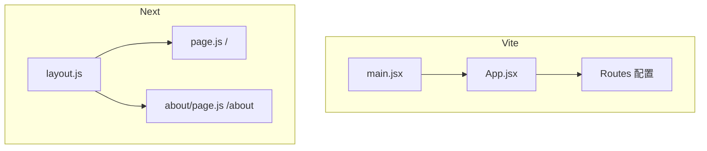

# Next.js 学习系列（二）：create-next-app 与第一个 page

> [第一篇](01.when-next-vs-vite.md) 你已能判断「该不该用 Next」——现在是**动手**。这篇对应 [React 系列（二）](../react/02.vite-jsx-first-component.md) 的角色：用 **`create-next-app`** 生成项目，认 `app/`（或 `src/app/`）目录，写**第一个 `page.tsx`**，再加一个路由页，用 **`next/link`** 跳转。仍偏概念：默认页面如何在服务器渲染、`layout` 是什么；`'use client'` 和 `useState` 点到为止，系列第三篇再拆服务端/客户端。

---

## 目录

1. [前言：从选型到第一个 localhost 页面](#1-前言从选型到第一个-localhost-页面)
2. [create-next-app：创建项目](#2-create-next-app创建项目)
3. [目录地图：和 Vite 项目对照](#3-目录地图和-vite-项目对照)
4. [layout.tsx：整站的「外壳」](#4-layouttsx整站的外壳)
5. [page.tsx：一个 URL 一页](#5-pagetsx一个-url-一页)
6. [改第一个页面：从默认欢迎页到「我的站」](#6-改第一个页面从默认欢迎页到我的站)
7. [第二个路由：about 页面](#7-第二个路由about-页面)
8. [Link 跳转：对照 React Router](#8-link-跳转对照-react-router)
9. [use client 与 useState（点到为止）](#9-use-client-与-usestate点到为止)
10. [常用命令与排错](#10-常用命令与排错)
11. [常见陷阱与 FAQ](#11-常见陷阱与-faq)
12. [总结与系列下一篇](#12-总结与系列下一篇)

---

## 1. 前言：从选型到第一个 localhost 页面

典型卡点：

- `create-next-app` 交互选项一堆，不知道 TypeScript、Tailwind 该不该开。
- 找不到 `main.jsx` / `App.jsx`——和 Vite 项目不一样。
- 写了 `useState` 报错，提示要 `'use client'`。

**App Router**：Next.js 13+ 默认的路由方式，用 `app/` 目录里的 `page` 文件表示页面。  
通俗说：**文件夹路径 = 网址路径**，不再手写 `<Route path="...">`（[React 四](../react/04.react-router-list-detail.md) 那套）。

读完本文，你应该能做到：

1. 用 `create-next-app` 创建 **JavaScript + App Router** 项目并跑起 `npm run dev`。
2. 说出 `layout.tsx` 与 `page.tsx` 的分工，对应 Vite 里什么。
3. 修改首页、新建 `/about` 页面，用 `Link` 互相跳转。
4. 知道为何交互组件文件顶部要写 `'use client'`（概念）。

**前置**：[Next（一）选型](01.when-next-vs-vite.md)；[React（二）](../react/02.vite-jsx-first-component.md) JSX 与组件。

**环境**：Node.js 18+。

### 1.1 本文边界

不深究：

- Server Component vs Client Component 完整规则
- `fetch` 在服务端取数、`metadata` SEO
- `next.config`、部署

目标：**改得动首页，多加一页，链得起来**。

### 1.2 动手路径

| 步骤 | 章节 |
|------|------|
| 创建项目 | §2 |
| 认 layout / page | §3–§5 |
| 改首页 | §6 |
| 加 `/about` + Link | §7–§8 |
| （可选）计数器 + `'use client'` | §9 |

---

## 2. create-next-app：创建项目

演示什么：生成可运行的 Next 项目。在终端执行：

```bash
npx create-next-app@latest my-next-app
```

安装程序会问一系列选项。**与 React 系列对齐**的推荐（初学者）：

| 提问 | 推荐 | 原因 |
|------|------|------|
| TypeScript? | **No** | 与 React 系列一致，先 JS |
| ESLint? | Yes | 保持代码习惯 |
| Tailwind CSS? | **No**（或 Yes，见下） | 不用 Tailwind 时改 `globals.css` 更像 React（二）；选 Yes 也行，只是 class 写法不同 |
| `src/` directory? | **Yes** | 代码在 `src/app/`，类比 Vite 的 `src/` |
| App Router? | **Yes** | 本系列只讲 App Router |
| Turbopack? | 可选 Yes | 开发更快；不熟可先 No |

一行命令（非交互，复制即用）：

```bash
npx create-next-app@latest my-next-app --js --eslint --no-tailwind --src-dir --app --no-turbopack
```

然后：

```bash
cd my-next-app
npm run dev
```

浏览器打开 **`http://localhost:3000`**（默认 **3000**，不是 Vite 的 5173）。看到 Next 欢迎页即成功。

---

## 3. 目录地图：和 Vite 项目对照

`src/` 开启后，核心结构：

```text
my-next-app/
├── package.json
├── next.config.js          # Next 配置（初学少动）
├── public/                 # 静态文件，/logo.png → 根路径访问
└── src/
    └── app/
        ├── layout.js       # 根布局（或 .tsx 若你选了 TS）
        ├── page.js         # 首页  →  /
        ├── globals.css     # 全局样式
        └── favicon.ico
```

与 [React（二）Vite](../react/02.vite-jsx-first-component.md) 对照：

| Vite + React | Next.js App Router |
|--------------|-------------------|
| `index.html` + `#root` | 框架生成，你不用写 |
| `src/main.jsx` 挂载 | `layout.js` 包整站 |
| `src/App.jsx` 根组件 | `src/app/page.js` = `/` |
| `react-router` 配路由 | **新建文件夹 + `page.js`** |
| `vite.config.js` | `next.config.js` |
| `npm run dev` → :5173 | `npm run dev` → :3000 |



对照上图：Next **没有**单独的 `App.jsx` 包所有路由——**每个 URL 有自己的 `page` 文件**，`layout` 负责共用外壳。

---

## 4. layout.tsx：整站的「外壳」

**Layout**（布局）：包住多个页面的公共结构，如 `<html>`、`<body>`、顶栏。  
通俗说：影院的固定墙面和座位，**换场次（页面）时不用拆墙**。

演示什么：打开 `src/app/layout.js`（创建器生成的，可能叫 `.jsx`）：

```jsx
import './globals.css'

export const metadata = {
  title: 'Create Next App',
  description: 'Generated by create next app',
}

export default function RootLayout({ children }) {
  return (
    <html lang="zh-CN">
      <body>
        {children}
      </body>
    </html>
  )
}
```

解读：

| 部分 | 作用 |
|------|------|
| `metadata` | 页面标题、描述（SEO 用，第一篇说的 Next 强项之一） |
| `{children}` | **当前路由的 `page` 插在这里** |
| `lang="zh-CN"` | 可改成中文站 |

**和 Vite 的关系**：类似 `main.jsx` 里 `<App />` 外包的那层——但 Next 要求你显式写 `<html>` / `<body>`。

在 `body` 里加共用导航（后面 §8 会写 `Link`）：

```jsx
<body>
  <header>
    <nav>
      {/* 下一节放 Link */}
    </nav>
  </header>
  {children}
</body>
```

所有路由的页面都会出现在 `{children}` 位置。

---

## 5. page.tsx：一个 URL 一页

**Page**：某个路由下实际显示的内容组件。  
文件规则：**名叫 `page.js` 的文件**才成为可访问页面。

| 文件路径 | URL |
|----------|-----|
| `src/app/page.js` | `/` |
| `src/app/about/page.js` | `/about` |
| `src/app/blog/page.js` | `/blog` |

默认生成的 `src/app/page.js` 是一大段欢迎 UI。结构本质仍是：

```jsx
export default function Home() {
  return (
    <main>
      <h1>欢迎</h1>
    </main>
  )
}
```

和 [React（二）](../react/02.vite-jsx-first-component.md) 的函数组件一样：**默认导出、返回 JSX**。  
差别是：**不用**在别处 `<Route>` 注册——**文件位置即路由**。

---

## 6. 改第一个页面：从默认欢迎页到「我的站」

演示什么：清空脚手架欢迎内容，写成自己的首页。  
修改 `src/app/page.js`：

```jsx
export default function HomePage() {
  return (
    <main>
      <h1>我的 Next 站点</h1>
      <p>这是首页，路径是 /</p>
    </main>
  )
}
```

保存后浏览器自动刷新（Fast Refresh），应只看到标题和段落。

可同时改 `layout.js` 的 `metadata`：

```javascript
export const metadata = {
  title: '我的 Next 站点',
  description: 'Next.js 学习系列练习',
}
```

在浏览器标签页标题上能看到变化——这是 Next 顺带做的 SEO 基础，Vite SPA 要另外配。

---

## 7. 第二个路由：about 页面

演示什么：不加 React Router，只新建文件得到 `/about`。

1. 新建文件夹 `src/app/about/`
2. 在其中新建 `page.js`：

```jsx
export default function AboutPage() {
  return (
    <main>
      <h1>关于</h1>
      <p>这是 /about 页面。</p>
    </main>
  )
}
```

访问 `http://localhost:3000/about` 应显示「关于」。

**动态路由预告**（系列后面写）：`src/app/users/[id]/page.js` → `/users/123`，对应 [React（四）](../react/04.react-router-list-detail.md) 的 `:id`。

---

## 8. Link 跳转：对照 React Router

[React（四）](../react/04.react-router-list-detail.md)：

```jsx
import { Link } from 'react-router-dom'
<Link to="/about">关于</Link>
```

Next.js：

```jsx
import Link from 'next/link'

<Link href="/about">关于</Link>
```

在 `layout.js` 的 `<nav>` 里加全局导航：

```jsx
import Link from 'next/link'
import './globals.css'

export const metadata = {
  title: '我的 Next 站点',
  description: 'Next.js 学习系列练习',
}

export default function RootLayout({ children }) {
  return (
    <html lang="zh-CN">
      <body>
        <header>
          <nav>
            <Link href="/">首页</Link>
            {' · '}
            <Link href="/about">关于</Link>
          </nav>
        </header>
        {children}
      </body>
    </html>
  )
}
```

| | React Router | Next.js |
|---|--------------|---------|
| 组件 | `Link` from `react-router-dom` | `Link` from `next/link` |
| 属性 | `to` | `href` |
| 路由定义 | `<Route path>` | 文件系统 |

**不要用** `<a href="/about">` 做站内主导航——会整页刷新，失去 SPA 体验。外链（如 `https://`）仍用 `<a>`。

首页底部也可加：

```jsx
import Link from 'next/link'

export default function HomePage() {
  return (
    <main>
      <h1>我的 Next 站点</h1>
      <p>这是首页，路径是 /</p>
      <p>
        <Link href="/about">去了解关于页 →</Link>
      </p>
    </main>
  )
}
```

---

## 9. `use client` 与 useState（点到为止）

App Router 里组件**默认在服务器**执行，不能直接用 `useState`、`onClick`——这和 Vite 里**默认全能用 Hook** 不同。

要在页面里做 [React（二）](../react/02.vite-jsx-first-component.md) 那种计数器，需要文件**顶部**加：

```jsx
'use client'

import { useState } from 'react'

export default function Counter() {
  const [count, setCount] = useState(0)
  return (
    <button type="button" onClick={() => setCount(count + 1)}>
      点了 {count} 次
    </button>
  )
}
```

在 `page.js` 里**引入**（page 本身可保持服务端，只把交互拆出去）：

```jsx
import Counter from './Counter'

export default function HomePage() {
  return (
    <main>
      <h1>我的 Next 站点</h1>
      <Counter />
    </main>
  )
}
```

`Counter.js` 放在 `src/app/Counter.js` 或 `src/components/Counter.js`（推荐 `components/` 夹）。

**`'use client'`**（客户端组件指令）：标记该文件在**浏览器**运行，可用 Hook 和事件。  
通俗说：告诉 Next「这一段要在用户电脑上动」——系列第三篇专门讲边界；本篇只记住：**有 `useState` 的文件加一行 `'use client'`**。

---

## 10. 常用命令与排错

| 命令 | 作用 |
|------|------|
| `npm run dev` | 开发，默认 :3000 |
| `npm run build` | 生产构建 |
| `npm run start` | 跑构建后的生产服务 |

| 现象 | 处理 |
|------|------|
| 端口 3000 占用 | 终端提示换端口，或关掉占用进程 |
| 改了 `page.js` 没变化 | 看是否改错项目；硬刷新 |
| `useState` 报错 | 文件顶加 `'use client'` |
| `/about` 404 | 确认路径是 `app/about/page.js`，文件名必须 `page` |
| 样式不生效 | 全局样式在 `layout` 里 `import './globals.css'` |

---

## 11. 常见陷阱与 FAQ

### 11.1 陷阱一：找 `App.jsx`

Next App Router **没有**统一 `App.jsx`；每个路由是独立 `page.js`。

### 11.2 陷阱二：路由文件夹漏 `page`

`app/about/index.js` **不行**（App Router 要 `page.js` 这个文件名）。

### 11.3 陷阱三：在 layout 里用 useState 不加指令

layout 默认也是服务端——顶栏若要复杂客户端交互，拆成 `'use client'` 的子组件再引进 layout。

### 11.4 FAQ

**Q：用 `.js` 还是 `.jsx`？**  
A：Next 两者都行；脚手架可能生成 `.js` 里写 JSX。你也可改成 `.jsx`。

**Q：和 Pages Router（`pages/`）老教程冲突吗？**  
A：老项目用 `pages/index.js`；**新项目用 `app/`**，别混学。

**Q：什么时候接 [React（三）](../react/03.use-effect-data-fetching.md) 的 fetch？**  
A：下一篇 Next（三）：服务端取数 vs `useEffect`。

**Q：能和 [第六篇 FastAPI](../react/06.fullstack-vite-fastapi.md) 联调吗？**  
A：能，`next.config.js` 里 `rewrites` 代理 `/api`，后续篇写。

### 11.5 动手自检清单

- [ ] 能 `create-next-app` 并打开 localhost:3000  
- [ ] 能指出 `layout` 与 `page` 各干什么  
- [ ] 能新建 `/about` 仅通过加文件  
- [ ] 会用 `next/link` 的 `href`  
- [ ] 知道 `useState` 要 `'use client'`  
- [ ] 能对照说出 Vite `App.jsx` 对应 Next 哪几个文件  

---

## 12. 总结与系列下一篇

### 12.1 概念速记

| 概念 | 一句话 |
|------|--------|
| `create-next-app` | 官方脚手架 |
| `app/` | App Router 根目录 |
| `layout.js` | 共用外壳，`{children}` 插页面 |
| `page.js` | 该路径的页面 UI |
| `next/link` | 站内跳转，`href` |
| `'use client'` | 允许 Hook / 浏览器事件 |

### 12.2 Vite → Next 迁移心智

```
main.jsx + App.jsx     →  layout.js + page.js
<Route path="/about">  →  app/about/page.js
react-router Link      →  next/link
默认客户端组件         →  默认服务端，交互加 use client
```

### 12.3 系列下一篇预告

**Next.js 学习系列（三）**：服务端组件、服务端 fetch——见 [03.server-client-fetch.md](03.server-client-fetch.md)。

### 12.4 学习路径位置

```text
React 一～六  →  Next 一（选型）→  Next 二（本篇：搭项目）
                              →  Next 三（数据与 RSC）…
```

---

> **系列定位**：本篇完成「**空站跑起来 + 两页 + 导航**」。Next 和 Vite 的最大体感差异是 **没有 App.jsx、路由靠文件夹**——先习惯这个，再学服务端取数会轻松很多。
