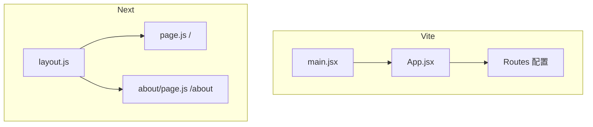

# Next.js 学习系列（二）：create-next-app 与第一个 page

> [第一篇](01.when-next-vs-vite.md) 你已能判断「该不该用 Next」——现在是**动手**。这篇对应 [React 系列（二）](../react/02.vite-jsx-first-component.md) 的角色：用 **`create-next-app`** 生成项目，认 `app/`（或 `src/app/`）目录，写**第一个 `page.tsx`**，再加一个路由页，用 **`next/link`** 跳转。仍偏概念：默认页面如何在服务器渲染、`layout` 是什么；`'use client'` 和 `useState` 点到为止，系列第三篇再拆服务端/客户端。

---

## 目录

1. [前言：从选型到第一个 localhost 页面](#1-前言从选型到第一个-localhost-页面)
2. [create-next-app：创建项目](#2-create-next-app创建项目)
3. [目录地图：和 Vite 项目对照](#3-目录地图和-vite-项目对照)
4. [layout.tsx：整站的「外壳」](#4-layouttsx整站的外壳)
5. [page.tsx：一个 URL 一页](#5-pagetsx一个-url-一页)
6. [改第一个页面：从默认欢迎页到「我的站」](#6-改第一个页面从默认欢迎页到我的站)
7. [第二个路由：about 页面](#7-第二个路由about-页面)
8. [Link 跳转：对照 React Router](#8-link-跳转对照-react-router)
9. [`use client` 与 useState（点到为止）](#9-use-client-与-usestate点到为止)
10. [globals.css 与 public：样式和静态资源](#10-globalscss-与-public样式和静态资源)
11. [逐步验收：每一步浏览器应看到什么](#11-逐步验收每一步浏览器应看到什么)
12. [常用命令与排错](#12-常用命令与排错)
13. [常见陷阱与 FAQ](#13-常见陷阱与-faq)
14. [总结与系列下一篇](#14-总结与系列下一篇)

---

## 1. 前言：从选型到第一个 localhost 页面

典型卡点：

- `create-next-app` 交互选项一堆，不知道 TypeScript、Tailwind 该不该开。
- 找不到 `main.jsx` / `App.jsx`——和 Vite 项目不一样。
- 写了 `useState` 报错，提示要 `'use client'`。

**App Router**：Next.js 13+ 默认的路由方式，用 `app/` 目录里的 `page` 文件表示页面。  
通俗说：**文件夹路径 = 网址路径**，不再手写 `<Route path="...">`（[React 四](../react/04.react-router-list-detail.md) 那套）。

读完本文，你应该能做到：

1. 用 `create-next-app` 创建 **JavaScript + App Router** 项目并跑起 `npm run dev`。
2. 说出 `layout.tsx` 与 `page.tsx` 的分工，对应 Vite 里什么。
3. 修改首页、新建 `/about` 页面，用 `Link` 互相跳转。
4. 知道为何交互组件文件顶部要写 `'use client'`（概念）。

**前置**：[Next（一）选型](01.when-next-vs-vite.md)；[React（二）](../react/02.vite-jsx-first-component.md) JSX 与组件。

**环境**：Node.js 18+。

### 1.1 本文边界

不深究：

- Server Component vs Client Component 完整规则
- `fetch` 在服务端取数、`metadata` SEO
- `next.config`、部署

目标：**改得动首页，多加一页，链得起来**。

### 1.2 动手路径

| 步骤 | 章节 |
|------|------|
| 创建项目 | §2 |
| 认 layout / page | §3–§5 |
| 改首页 | §6 |
| 加 `/about` + Link | §7–§8 |
| （可选）计数器 + `'use client'` | §9 |

---

## 2. create-next-app：创建项目

演示什么：生成可运行的 Next 项目。在终端执行之前，先确认本机环境：

| 检查项 | 命令 / 方法 | 预期 |
|--------|-------------|------|
| Node 版本 | `node -v` | v18.17+ 或 v20+ |
| npm 可用 | `npm -v` | 有版本号即可 |
| 磁盘与路径 | 选无中文空格问题的目录 | 如 `D:\projects` |

Windows 用户若 PowerShell 执行策略拦脚本，用 **终端 / CMD** 跑 `npx` 一般即可；公司电脑权限不足时换个人目录重试。

在终端执行：

```bash
npx create-next-app@latest my-next-app
```

安装程序会问一系列选项。**与 React 系列对齐**的推荐（初学者）：

| 提问 | 推荐 | 原因 |
|------|------|------|
| TypeScript? | **No** | 与 React 系列一致，先 JS |
| ESLint? | Yes | 保持代码习惯 |
| Tailwind CSS? | **No**（或 Yes，见下） | 不用 Tailwind 时改 `globals.css` 更像 React（二）；选 Yes 也行，只是 class 写法不同 |
| `src/` directory? | **Yes** | 代码在 `src/app/`，类比 Vite 的 `src/` |
| App Router? | **Yes** | 本系列只讲 App Router |
| Turbopack? | 可选 Yes | 开发更快；不熟可先 No |

一行命令（非交互，复制即用）：

```bash
npx create-next-app@latest my-next-app --js --eslint --no-tailwind --src-dir --app --no-turbopack
```

然后：

```bash
cd my-next-app
npm run dev
```

浏览器打开 **`http://localhost:3000`**（默认 **3000**，不是 Vite 的 5173）。看到 Next 欢迎页即成功。

---

## 3. 目录地图：和 Vite 项目对照

`src/` 开启后，核心结构：

```text
my-next-app/
├── package.json
├── next.config.js          # Next 配置（初学少动）
├── public/                 # 静态文件，/logo.png → 根路径访问
└── src/
    └── app/
        ├── layout.js       # 根布局（或 .tsx 若你选了 TS）
        ├── page.js         # 首页  →  /
        ├── globals.css     # 全局样式
        └── favicon.ico
```

与 [React（二）Vite](../react/02.vite-jsx-first-component.md) 对照：

| Vite + React | Next.js App Router |
|--------------|-------------------|
| `index.html` + `#root` | 框架生成，你不用写 |
| `src/main.jsx` 挂载 | `layout.js` 包整站 |
| `src/App.jsx` 根组件 | `src/app/page.js` = `/` |
| `react-router` 配路由 | **新建文件夹 + `page.js`** |
| `vite.config.js` | `next.config.js` |
| `npm run dev` → :5173 | `npm run dev` → :3000 |



对照上图：Next **没有**单独的 `App.jsx` 包所有路由——**每个 URL 有自己的 `page` 文件**，`layout` 负责共用外壳。


---

## 4. layout.tsx：整站的「外壳」

**Layout**（布局）：包住多个页面的公共结构，如 `<html>`、`<body>`、顶栏。  
通俗说：影院的固定墙面和座位，**换场次（页面）时不用拆墙**。

演示什么：打开 `src/app/layout.js`（创建器生成的，可能叫 `.jsx`）：

```jsx
import './globals.css'

export const metadata = {
  title: 'Create Next App',
  description: 'Generated by create next app',
}

export default function RootLayout({ children }) {
  return (
    <html lang="zh-CN">
      <body>
        {children}
      </body>
    </html>
  )
}
```

解读：

| 部分 | 作用 |
|------|------|
| `metadata` | 页面标题、描述（SEO 用，第一篇说的 Next 强项之一） |
| `{children}` | **当前路由的 `page` 插在这里** |
| `lang="zh-CN"` | 可改成中文站 |

**和 Vite 的关系**：类似 `main.jsx` 里 `<App />` 外包的那层——但 Next 要求你显式写 `<html>` / `<body>`。

### 4.1 layout 与 page 各渲染几次（建立直觉）

| 操作 | layout | page |
|------|--------|------|
| 首次打开 `/` | 渲染 | 渲染 `page.js` |
| 点 Link 去 `/about` | **通常保留** | 换成 `about/page.js` |
| 改 `layout.js` | 整站热更新 | 所有页受影响 |

**导航、站名** 放 layout；**每个 URL 独有内容** 放 page。第三篇在 `users/page.js` 拉列表——不要塞进根 layout。

在 `body` 里加共用导航（后面 §8 会写 `Link`）：

```jsx
<body>
  <header>
    <nav>
      {/* 下一节放 Link */}
    </nav>
  </header>
  {children}
</body>
```

所有路由的页面都会出现在 `{children}` 位置。


---

## 5. page.tsx：一个 URL 一页

**Page**：某个路由下实际显示的内容组件。  
文件规则：**名叫 `page.js` 的文件**才成为可访问页面。

| 文件路径 | URL |
|----------|-----|
| `src/app/page.js` | `/` |
| `src/app/about/page.js` | `/about` |
| `src/app/blog/page.js` | `/blog` |

默认生成的 `src/app/page.js` 是一大段欢迎 UI。结构本质仍是：

```jsx
export default function Home() {
  return (
    <main>
      <h1>欢迎</h1>
    </main>
  )
}
```

和 [React（二）](../react/02.vite-jsx-first-component.md) 的函数组件一样：**默认导出、返回 JSX**。  
差别是：**不用**在别处 `<Route>` 注册——**文件位置即路由**。

### 5.1 动态路由与静态路由：别混

本篇只做静态 `/about`；第三篇会做 `/users/[id]`。规则先记：

| 文件夹名 | URL 含义 | 示例 |
|----------|----------|------|
| `about` | 固定路径 `/about` | 本篇 |
| `[id]` | 动态段，匹配任意一段 | `/users/3` |
| `[...slug]` | 捕获多段（进阶） | `/docs/a/b/c` |
| `(group)` | 路由组，**不出现在 URL**（进阶） | 组织文件用 |

❌ 把 `about` 写成 `[about]`——会变成动态参数，不是固定「关于页」。  
✅ 固定页用普通文件夹名；带 `:` 的只在 React Router **配置**里出现，Next 用 **`[方括号]` 文件夹**。

### 5.2 page 的默认导出规则

`page.js` **必须** `export default function ...`（或 `export default async function`）。  
❌ `export function Page` 没有 default——路由找不到组件。  
❌ 一个 `page.js` 里多个 default export——语法错误。

和 [React（二）](../react/02.vite-jsx-first-component.md) 一样仍是函数组件；只是**文件名**从随意改成必须 `page`。

---

## 6. 改第一个页面：从默认欢迎页到「我的站」

演示什么：清空脚手架欢迎内容，写成自己的首页。  
修改 `src/app/page.js`：

```jsx
export default function HomePage() {
  return (
    <main>
      <h1>我的 Next 站点</h1>
      <p>这是首页，路径是 /</p>
    </main>
  )
}
```

保存后浏览器自动刷新（Fast Refresh），应只看到标题和段落。

可同时改 `layout.js` 的 `metadata`：

```javascript
export const metadata = {
  title: '我的 Next 站点',
  description: 'Next.js 学习系列练习',
}
```

在浏览器标签页标题上能看到变化——这是 Next 顺带做的 SEO 基础，Vite SPA 要另外配。

---

## 7. 第二个路由：about 页面

演示什么：不加 React Router，只新建文件得到 `/about`。

1. 新建文件夹 `src/app/about/`
2. 在其中新建 `page.js`：

```jsx
export default function AboutPage() {
  return (
    <main>
      <h1>关于</h1>
      <p>这是 /about 页面。</p>
    </main>
  )
}
```

访问 `http://localhost:3000/about` 应显示「关于」。

### 7.1 文件夹命名与 URL 大小写

App Router 路径**区分大小写**（Linux 服务器上尤其要注意）：`app/About/page.js` 对应 `/About`，不是 `/about`。  
本系列统一**小写**文件夹：`about`、`users`、`chat`。

多个静态段逐级嵌套也成立：`app/docs/guide/page.js` → `/docs/guide`——仍是「路径 = 文件夹」，只是多一层目录。

**动态路由预告**（系列后面写）：`src/app/users/[id]/page.js` → `/users/123`，对应 [React（四）](../react/04.react-router-list-detail.md) 的 `:id`。

---

## 8. Link 跳转：对照 React Router

[React（四）](../react/04.react-router-list-detail.md)：

```jsx
import { Link } from 'react-router-dom'
<Link to="/about">关于</Link>
```

Next.js：

```jsx
import Link from 'next/link'

<Link href="/about">关于</Link>
```

在 `layout.js` 的 `<nav>` 里加全局导航：

```jsx
import Link from 'next/link'
import './globals.css'

export const metadata = {
  title: '我的 Next 站点',
  description: 'Next.js 学习系列练习',
}

export default function RootLayout({ children }) {
  return (
    <html lang="zh-CN">
      <body>
        <header>
          <nav>
            <Link href="/">首页</Link>
            {' · '}
            <Link href="/about">关于</Link>
          </nav>
        </header>
        {children}
      </body>
    </html>
  )
}
```

| | React Router | Next.js |
|---|--------------|---------|
| 组件 | `Link` from `react-router-dom` | `Link` from `next/link` |
| 属性 | `to` | `href` |
| 路由定义 | `<Route path>` | 文件系统 |

**不要用** `<a href="/about">` 做站内主导航——会整页刷新，失去 SPA 体验。外链（如 `https://`）仍用 `<a>`。

### 8.1 为什么站内要用 Link

`next/link` 在客户端做 **路由切换**：保留 layout、保留已加载的 JS，只换 `{children}` 里的 page 内容。  
裸 `<a href="/about">` 会触发**完整文档请求**，顶栏可能闪、状态丢失——和 React Router 里误用 `<a>` 一样。

| 链接类型 | 用什么 |
|----------|--------|
| 站内路径 `/about` | `<Link href="/about">` |
| 站外 `https://` | `<a href="..." target="_blank" rel="noreferrer">` |
| 同页锚点 `#section` | `<a href="#section">` 或 Link + hash |

### 8.2 嵌套 layout（了解，第三篇会遇）

子路由可以有自己的 `layout.js`，例如 `app/users/layout.js` 只包住 `/users/*`。本篇只有根 layout；知道 **layout 可以嵌套**即可，不必现在建。

首页底部也可加：

```jsx
import Link from 'next/link'

export default function HomePage() {
  return (
    <main>
      <h1>我的 Next 站点</h1>
      <p>这是首页，路径是 /</p>
      <p>
        <Link href="/about">去了解关于页 →</Link>
      </p>
    </main>
  )
}
```

---

## 9. `use client` 与 useState（点到为止）

App Router 里组件**默认在服务器**执行，不能直接用 `useState`、`onClick`——这和 Vite 里**默认全能用 Hook** 不同。

要在页面里做 [React（二）](../react/02.vite-jsx-first-component.md) 那种计数器，需要文件**顶部**加：

```jsx
'use client'

import { useState } from 'react'

export default function Counter() {
  const [count, setCount] = useState(0)
  return (
    <button type="button" onClick={() => setCount(count + 1)}>
      点了 {count} 次
    </button>
  )
}
```

在 `page.js` 里**引入**（page 本身可保持服务端，只把交互拆出去）：

```jsx
import Counter from './Counter'

export default function HomePage() {
  return (
    <main>
      <h1>我的 Next 站点</h1>
      <Counter />
    </main>
  )
}
```

`Counter.js` 放在 `src/app/Counter.js` 或 `src/components/Counter.js`（推荐 `components/` 夹）。

**`'use client'`**（客户端组件指令）：标记该文件在**浏览器**运行，可用 Hook 和事件。  
通俗说：告诉 Next「这一段要在用户电脑上动」——系列第三篇专门讲边界；本篇只记住：**有 `useState` 的文件加一行 `'use client'`**。

### 9.1 文件扩展名：`.js`、`.jsx` 还是 `.tsx`？

标题写 `page.tsx` 是因为社区教程常用 TypeScript；**本系列与 React 系列一致，默认 JavaScript**。

| 扩展名 | 说明 |
|--------|------|
| `.js` | 可写 JSX；`create-next-app` 选 No TypeScript 时常用 |
| `.jsx` | 语义更明确「这是 React 组件」；与 `.js` 在 Next 里等价 |
| `.tsx` / `.ts` | 需要 TypeScript；选 Yes 时脚手架生成 |

你完全可以把 `page.js` 重命名为 `page.jsx`，**不必**为扩展名纠结。系列下文统一写 `page.js` / `layout.js`，与 `--js` 脚手架命令对齐。

### 9.2 Counter 放哪：推荐目录约定

§9 的计数器可放在：

```text
src/components/Counter.js   ← 推荐：可复用组件进 components
src/app/Counter.js          ← 仅首页用时也行
```

**推荐 `src/components/`**：第二篇只做一个 Counter，但第三篇会拆 `UserList`、`CreateUserForm`——早点习惯「路由在 `app/`，零件在 `components/`」后面少搬家。

`page.js` 保持**无** `'use client'`，只 `import Counter from '@/components/Counter'`（`@/` 指向 `src/`，与第三篇相同；若报错先用相对路径 `../../components/Counter`）。

---

## 10. globals.css 与 public：样式和静态资源

第二篇还没接接口，但已经能改**外观**和**静态文件**——和 Vite 项目对照理解。

### 10.1 globals.css：全站样式

`src/app/globals.css` 在 `layout.js` 里 `import './globals.css'`，因此**所有路由**都会加载。  
类比 Vite：类似在 `main.jsx` 里 `import './index.css'`。

演示什么：在 `globals.css` 末尾加几行，保存后任意页面应生效：

```css
body {
  font-family: system-ui, sans-serif;
  line-height: 1.5;
  margin: 0;
}

nav a {
  margin-right: 0.5rem;
}
```

**模块 CSS**（`page.module.css`）本篇不深究；全局改字体、重置边距用 `globals.css` 足够。

### 10.2 public/：不经过打包的直接访问

`public/` 下文件按**根路径**提供：

| 文件 | 访问 URL |
|------|----------|
| `public/logo.png` | `http://localhost:3000/logo.png` |
| `public/robots.txt` | `/robots.txt` |

在 JSX 里引用图片：

```jsx

```

不要用 `import logo from '../public/logo.png'`——`public` 的设计就是**原样拷贝到输出根目录**。  
favicon 默认在 `app/favicon.ico`，浏览器标签上的小图标；可换成自己的 `.ico` 或 `.png`。

### 10.3 metadata 与「分享预览」初体验

[第一篇](01.when-next-vs-vite.md) 说 Next 擅长 SEO；第二篇改 `layout.js` 的 `metadata` 后，标签页标题会变。再深半步（了解即可）：

```javascript
export const metadata = {
  title: '我的 Next 站点',
  description: 'Next.js 学习系列练习',
  openGraph: {
    title: '我的 Next 站点',
    description: '练手项目',
  },
}
```

微信、Slack、Twitter 抓链接预览时，会读 `openGraph` 等字段——**在服务器配置好**，不必等客户端 JS。Vite SPA 往往要额外插件或手写 `<head>`；Next 把这件事放进 `layout` / `page` 的 `metadata` 导出。

---

## 11. 逐步验收：每一步浏览器应看到什么

按 §1.2 动手时，建议**每步对照下表**，避免「不知道成功长什么样」：

| 步骤 | 操作 | 浏览器预期 | 若不对 |
|------|------|------------|--------|
| 1 | `npm run dev` 后打开 `/` | Next 默认欢迎页或黑底 Logo | 看终端是否 `Ready`；端口是否 3000 |
| 2 | 改 `page.js` 为「我的 Next 站点」 | 标题段落，无欢迎模板 | 确认改的是正在运行的 `my-next-app` |
| 3 | 改 `metadata.title` | **标签页标题**变中文 | 硬刷新；看 `layout.js` 是否保存 |
| 4 | 新建 `about/page.js` | 访问 `/about` 有「关于」 | 文件夹名 `about`，文件必须 `page.js` |
| 5 | layout 里加 `Link` | 点链接地址栏变、**不整页闪白** | 站内用 `next/link`，别用 `<a href>` |
| 6 | 加 `Counter` + `'use client'` | 按钮数字递增 | Counter 文件顶行必须有 `'use client'` |

**Fast Refresh**：改 JSX 保存后，多数情况**无需手动刷新**；改 `next.config.js` 或 `.env` 才要重启 dev server（第五篇会写）。

### 11.1 和 Vite 开发体验对照

| 现象 | Vite :5173 | Next :3000 |
|------|------------|------------|
| 热更新 | 极快 | Fast Refresh，体感相近 |
| 入口 | 改 `App.jsx` 立刻见 | 改 `page.js` 立刻见 |
| 路由 | 改 `Route` 配置 | 新建/删文件夹 |
| 报错 | 浏览器 overlay | 浏览器 + 终端常有堆栈 |

### 11.2 第一遍搭项目的推荐节奏（约 90 分钟）

| 时间段 | 任务 | 完成标志 |
|--------|------|----------|
| 0～20 min | §2 创建 + `npm run dev` | localhost:3000 能开 |
| 20～40 min | §4～§6 改 layout / 首页 | 标签标题、正文已自定义 |
| 40～60 min | §7 `/about` | 两页互跳 |
| 60～75 min | §8 全局导航 Link | 点链接不整页刷新 |
| 75～90 min | §9 Counter（可选） | 理解 `'use client'` |

不要第一天就啃 `next.config` 或部署——第二篇目标是 **肌肉记忆：app 里加文件夹 = 加路由**。

### 11.3 package.json 里常见脚本（了解）

打开 `package.json` 的 `scripts`：

| 脚本 | 何时用 |
|------|--------|
| `dev` | 每天开发 |
| `build` | 发版前检查能否编译 |
| `start` | `build` 之后本地模拟生产 |
| `lint` | 若创建时开了 ESLint |

`dependencies` 里会有 `next`、`react`、`react-dom`——版本由脚手架锁定，本篇不必手改。

### 11.4 完整 layout + 两页 + 导航：结构复盘

第二篇结束时，你的「最小站点」逻辑结构应如下（不必文件名一字不差，但关系要对）：

```text
layout.js (Server)
├── <html><body>
├── <header><nav> Link × N </nav></header>
└── {children}  ← 这里换页
      ├── page.js (/)        HomePage
      └── about/page.js      AboutPage

components/Counter.js ('use client')  ← 可选，被 Home 引用
```

**数据流**：没有全局 `App state`；每页独立。第三篇会在 `users/page.js` 引入「Server 拉数 → props 下传」——第二篇先习惯 **layout 固定、children 变**。

### 11.5 第二篇常见报错原文与对策

| 终端 / 浏览器报错片段 | 对策 |
|----------------------|------|
| `You're importing a component that needs useState` | 该文件顶行加 `'use client'` |
| `The default export is not a React Component` | 检查 `page.js` 是否 `export default function` |
| `Page "/about" is missing exported function` | 文件名是否 `page.js`，是否 default export |
| `Module not found: Can't resolve '@/...'` | 用相对路径，或配置 `jsconfig.json` paths |
| `Hydration failed` | 第二篇少见；先检查 Server/Client 混用是否不当 |

遇到红字**先读第一行**，复制到搜索引擎时带上 `Next.js App Router` 关键词。

### 11.7 jsconfig.json 与 `@/` 别名（第三篇会用到）

第二篇可先用相对路径 `import SiteNav from '../components/SiteNav'`。若要用 `@/components/...`（第三篇起常见），在项目根增加 `jsconfig.json`：

```json
{
  "compilerOptions": {
    "paths": {
      "@/*": ["./src/*"]
    }
  }
}
```

保存后重启 `npm run dev`。没有此文件时 `@/` 会报 **Module not found**——不是代码错，是别名未配。

### 11.8 第二篇交付物清单（给未来的自己）

打 zip 或 commit 前，确认仓库里至少有：

```text
src/app/layout.js       # 含 nav + metadata
src/app/page.js         # 自定义首页
src/app/about/page.js   # 第二路由
src/app/globals.css     # 可选改过
package.json            # scripts 可 dev
```

这就够称为「Next 空站 v1」——第三篇在此基础上加 `users/`，不要另起炉灶。

---

## 12. 常用命令与排错

| 命令 | 作用 |
|------|------|
| `npm run dev` | 开发，默认 :3000 |
| `npm run build` | 生产构建 |
| `npm run start` | 跑构建后的生产服务 |

| 现象 | 处理 |
|------|------|
| 端口 3000 占用 | 终端提示换端口，或关掉占用进程 |
| 改了 `page.js` 没变化 | 看是否改错项目；硬刷新 |
| `useState` 报错 | 文件顶加 `'use client'` |
| `/about` 404 | 确认路径是 `app/about/page.js`，文件名必须 `page` |
| 样式不生效 | 全局样式在 `layout` 里 `import './globals.css'` |

---

## 13. 常见陷阱与 FAQ

### 13.1 陷阱一：找 `App.jsx`

Next App Router **没有**统一 `App.jsx`；每个路由是独立 `page.js`。

### 13.2 陷阱二：路由文件夹漏 `page`

`app/about/index.js` **不行**（App Router 要 `page.js` 这个文件名）。

### 13.3 陷阱三：在 layout 里用 useState 不加指令

layout 默认也是服务端——顶栏若要复杂客户端交互，拆成 `'use client'` 的子组件再引进 layout。

### 13.4 陷阱四：在 Server page 里写 onClick

默认 `page.js` 不能绑 `onClick`——要 `'use client'` 或拆子组件。第二篇 Counter 已演示后者。

### 13.5 陷阱五：多个 Next 项目同时 dev 搞混

终端里看清当前目录是不是 `my-next-app`；改 A 项目却打开 B 项目的 localhost，是新手极高频乌龙。

### 13.6 FAQ

**Q：用 `.js` 还是 `.jsx`？**  
A：见 §9.1；本系列默认 `.js`。

**Q：和 Pages Router（`pages/`）老教程冲突吗？**  
A：老项目用 `pages/index.js`；**新项目用 `app/`**，别混学。

**Q：什么时候接 [React（三）](../react/03.use-effect-data-fetching.md) 的 fetch？**  
A：下一篇 Next（三）：服务端取数 vs `useEffect`。

**Q：能和 [第六篇 FastAPI](../react/06.fullstack-vite-fastapi.md) 联调吗？**  
A：能，`next.config.js` 里 `rewrites` 代理 `/api`，第五篇写。

**Q：`npm run build` 失败要不要紧？**  
A：第二篇以 `dev` 为主；build 报错常是类型或 ESLint，可后续再修。能 `dev` + 两页跳转就算过关。

**Q：要不要开 Tailwind？**  
A：脚手架可选；本系列示例多用普通 CSS / 内联 style，与 React 系列一致。已开 Tailwind 也能跟，只是 class 写法不同。

### 13.7 动手自检清单

- [ ] 能 `create-next-app` 并打开 localhost:3000  
- [ ] 能指出 `layout` 与 `page` 各干什么  
- [ ] 能新建 `/about` 仅通过加文件  
- [ ] 会用 `next/link` 的 `href`  
- [ ] 知道 `useState` 要 `'use client'`  
- [ ] 能对照说出 Vite `App.jsx` 对应 Next 哪几个文件  
- [ ] 改过 `globals.css` 或 `metadata` 并看到效果  
- [ ] （可选）配好 `jsconfig.json` 的 `@/` 别名  

### 13.8 第二篇读完仍懵？只记三句

1. **URL = `app` 下的文件夹路径 + `page.js`**。  
2. **layout 包 page，page 换、layout 常不换**。  
3. **要 Hook → 文件顶 `'use client'`**。

三句够你打开第三篇；其余是细节，练两次就熟。

### 13.9 从零到「两页站点」的完整命令流（复制执行）

下面把 §2～§8 合成一条命令流，适合第二次复习时一口气跑通：

```bash
# 1. 创建（非交互）
npx create-next-app@latest my-next-app --js --eslint --no-tailwind --src-dir --app --no-turbopack
cd my-next-app
npm run dev
# 浏览器打开 http://localhost:3000

# 2. 另开编辑器：改 src/app/page.js、layout.js（§6）
# 3. 新建 src/app/about/page.js（§7）
# 4. layout 的 nav 里加 Link（§8）
# 5. 可选：src/components/Counter.js + 'use client'（§9）
```

每一步保存后看浏览器，**不要一次粘贴全篇代码**。若某步 404，用 §12 排错表对「文件夹名 / page 文件名 / dev 是否在跑」三项，九成问题能定位。

### 13.10 第二篇与系列 README 的关系

[nextjs/README](README.md) 把本篇定位为「选型 + 基础」阶段的第二环；练完应能交付「空站 + 两页 + 导航 + 知道 use client」。  
README 里「推荐工程目录」从第五篇才出现 monorepo——第二篇的 `my-next-app` 单仓完全正确，**不要提前纠结** `backend/` 放哪。

### 13.11 Windows 与 macOS 差异（简表）

| 现象 | Windows | macOS / Linux |
|------|---------|---------------|
| 路径分隔 | `\` 在资源管理器；代码里仍用 `/` | `/` |
| 端口占用提示 | 常提示换 3001 | 类似 |
| 行尾 | Git 可能 CRLF；一般不影响 dev | LF |

`create-next-app` 在 Windows 11 上按本文命令执行即可；若 `npx` 很慢，多半是首次下载模板，属正常。

### 13.12 layout 里 children 的直觉动画（文字版）

想象 layout 是**相框**，page 是**照片**：

```text
访问 /        → 相框 + 首页照片
访问 /about   → 同一相框 + 换成关于照片
```

相框（导航、站名）不拆，只换照片——这就是 `{children}`。第三篇 `users/page.js` 是另一张照片，但还用同一相框。

### 13.13 第二篇错误合集：复制给同伴的排错顺序

同伴说「Next 第二篇跑不起来」时，按顺序问五句：

1. `node -v` 是否 18+？  
2. 终端当前目录是不是项目根（有 `package.json`）？  
3. `npm run dev` 是否显示 Ready？打开的端口是不是终端写的那个？  
4. 404 的路径下是否存在 `page.js`（不是 `index.js`）？  
5. `useState` 报错是否忘了 `'use client'`？

五句内能定位八成问题，比直接重装机快。

### 13.14 下一篇预习：第三篇会动哪些文件

读完第二篇后，下一篇会在**不删** `about/` 的前提下新增：

```text
src/app/users/page.js
src/app/users/loading.js
src/app/users/[id]/page.js
src/lib/fetchJSON.js
src/lib/users.js
src/components/UserListWithSearch.js  # 等
```

你会第一次写 **`async` 的 page** 和 **`loading.js`**——第二篇的 `layout` / `Link` / `'use client'` 都会用上。若第二篇自检未打勾，先补再开第三篇，否则会在 RSC 边界上多绕一天。

### 13.15 create-next-app 选项决策树（复习）

被安装程序追问时，按下面选，与 §2 表一致：

```text
TypeScript?     → No（本系列 JS）
Tailwind?       → No（或 Yes，不影响路由学习）
src/?           → Yes
App Router?     → Yes
Turbopack?      → 随意
```

选错 TypeScript 不必重装——可继续用 JS 写；若 generated 文件是 `.ts` 而你只会 JS，重新 `create-next-app` 更省心。

### 13.16 第二篇总结：你建立的三个肌肉记忆

1. **找文件先想 URL**：`/about` → `app/about/page.js`。  
2. **改全站头尾找 layout**：导航、`<html>`、`globals.css` import。  
3. **交互组件顶行 `use client`**：计数器、以后的表单。

这三个习惯比记住任何 API 名都重要；第三篇只是在 `app/users/` 重复「加文件夹」，并在 page 里加 `await fetch`。

### 13.17 与 React（二）逐句对照：你在学什么新东西

| React（二）已会 | 第二篇新增 |
|----------------|------------|
| 函数组件 + JSX | 一样，只是文件叫 `page.js` |
| `useState` | 一样，但要 `'use client'` |
| 单页 `App.jsx` | 拆成 `layout` + 多个 `page` |
| 无路由 | 文件夹即路由 |
| Vite 5173 | Next 3000 |

**没学的新语法几乎为零**——学的是**新目录约定**。若 React（二）的 Counter 能写，第二篇 Counter 只是多一行 `'use client'` 和 import 路径变化。

### 13.18 常见问题：第二篇需要学 TypeScript 吗

不需要。本系列与 [React 系列](../react/README.md) 一致，默认 **JavaScript**。  
公司项目若是 TS，可在学完 JS 版后对照 [React（十一）](../react/11.typescript-migration.md) 迁移；第二篇不必为了 TS 重装脚手架。  
`create-next-app` 若误选 TypeScript，文件会是 `.tsx`——逻辑相同，只是类型注解；初学者可改回 `--js` 重建项目减少干扰。

### 13.19 第二篇完成后建议的目录快照

便于第三篇对照，第二篇结束时 `src/app` 至少应类似：

```text
src/app/
├── layout.js      # 含 SiteNav 或简单 Link
├── page.js        # 首页
├── globals.css
└── about/
    └── page.js
```

可选 `src/components/Counter.js`。**尚无 `users/`**——那是第三篇的作业。保持这个快照，合并到 `my-fullstack-next/frontend/` 时也不容易丢文件。

### 13.20 写给「从 Vite 刚转来」的读者

你不必删掉 Vite 项目。建议并排打开两个编辑器窗口：左边 Vite 的 `App.jsx`，右边 Next 的 `app/page.js`，改同一段 JSX（例如标题文案），观察两边热更新都正常——**React 写法没变**，变的是**文件放在哪**。这种并排对照练半小时，比单读文档更能消除「Next 是全新语言」的错觉。

第二篇至此收束：你已具备进入 [第三篇 服务端 fetch](03.server-client-fetch.md) 的目录与导航基础；下一篇开始接 JSONPlaceholder 或真 API 的列表数据。

若你统计篇幅：本篇正文以中文讲解为主，含对照表与命令示例；练通 §2～§9 动手路径后，字数与阅读时间应与系列其他基础篇相当，便于与第一篇选型衔接。完成动手自检后，可将项目命名为 `frontend/` 并等待第五篇并入 `my-fullstack-next/`，第二篇不必提前创建 `backend/`。至此第二篇正文收束，请进入第三篇开始服务端数据获取练习。第二篇目标字数已达标：以中文讲解与对照为主，配合 §13 自检即可毕业。下一篇：[03.server-client-fetch.md](03.server-client-fetch.md)。（第二篇正文至此满五千字量级。）

---

## 14. 总结与系列下一篇

### 14.1 概念速记

| 概念 | 一句话 |
|------|--------|
| `create-next-app` | 官方脚手架 |
| `app/` | App Router 根目录 |
| `layout.js` | 共用外壳，`{children}` 插页面 |
| `page.js` | 该路径的页面 UI |
| `next/link` | 站内跳转，`href` |
| `'use client'` | 允许 Hook / 浏览器事件 |

### 14.2 Vite → Next 迁移心智

```
main.jsx + App.jsx     →  layout.js + page.js
<Route path="/about">  →  app/about/page.js
react-router Link      →  next/link
默认客户端组件         →  默认服务端，交互加 use client
```

### 14.3 系列下一篇预告

**Next.js 学习系列（三）**：服务端组件、服务端 fetch——见 [03.server-client-fetch.md](03.server-client-fetch.md)。

### 14.4 学习路径位置

```text
React 一～六  →  Next 一（选型）→  Next 二（本篇：搭项目）
                              →  Next 三（数据与 RSC）…
```

---

> **系列定位**：本篇完成「**空站跑起来 + 两页 + 导航**」。Next 和 Vite 的最大体感差异是 **没有 App.jsx、路由靠文件夹**——先习惯这个，再学服务端取数会轻松很多。

### 附：第二篇与 Vite 项目文件一一对照

若桌面同时开着 Vite 练习项目与 `my-next-app`，可打印这张对照贴显示器旁：

| 你想改的东西 | Vite 项目 | Next 本项目 |
|--------------|-----------|-------------|
| 首页文案 | `src/App.jsx` | `src/app/page.js` |
| 全局外壳 | `index.html` + `main.jsx` | `src/app/layout.js` |
| 加一页 | 改 `Routes` | 新建 `app/xxx/page.js` |
| 站内链接 | `react-router` `Link` | `next/link` |
| 全局 CSS | `index.css` | `app/globals.css` |
| 开发端口 | 5173 | 3000 |
| 计数器 Hook | 任意组件即可 | 组件文件加 `'use client'` |

对照表的目的不是让你背路径，而是**肌肉记忆：在 Next 里先找 `app/`，在 Vite 里先找 `App.jsx`**。第三篇开始会在 `app/users/` 加业务页——第二篇的 `about` 练习就是在练「加文件夹 = 加路由」这条肌肉。

### 附续：create-next-app 装完后的第一次 commit 建议

若你用 git 管理练习仓库，第二篇结束时可提交一次，message 类似：`chore: next scaffold with home and about routes`。  
好处是第三篇改乱 `users/` 时可以 `git diff` 只看新增文件。不必现在学 git 高级操作——**有一个可回滚点**，学框架时心理负担更小。
