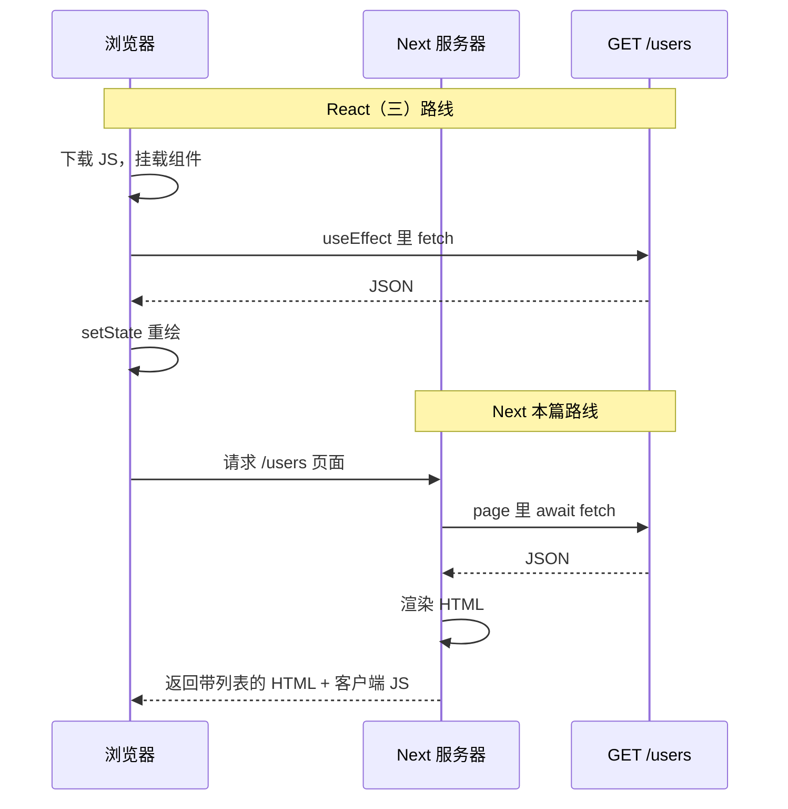
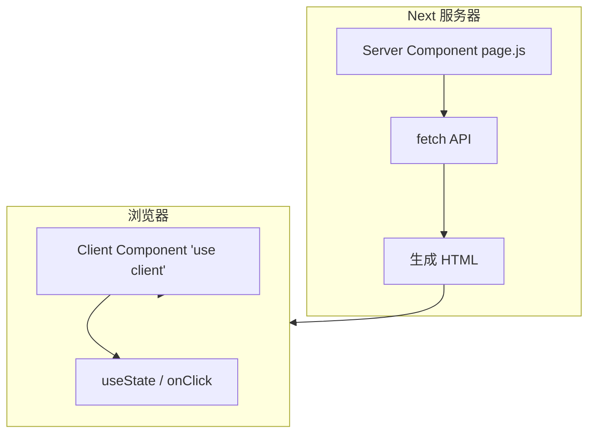
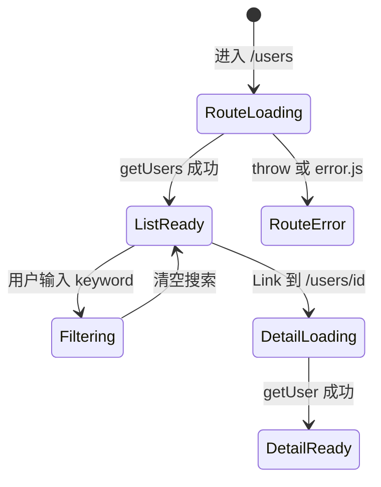
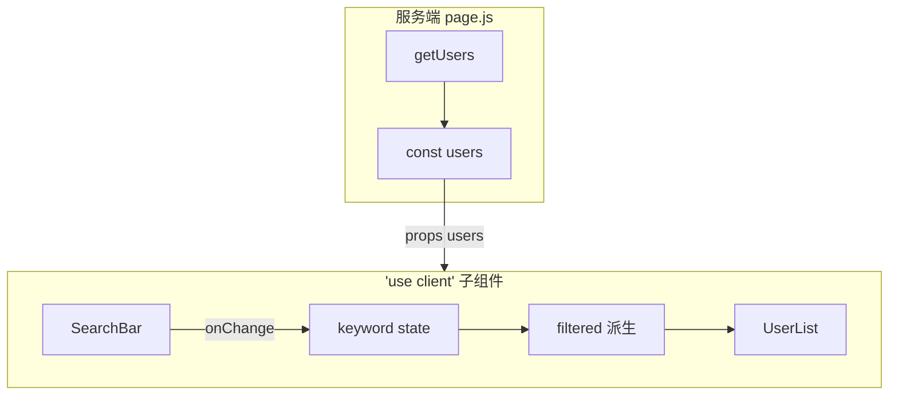

# Next.js 学习系列（三）：服务端组件、服务端 fetch 与 useEffect 对照

> [第二篇](02.create-next-app-first-page.md) 你搭好了 `layout` 和 `page`，知道 `'use client'` 才能 `useState`——但用户列表数据该在哪拉？[React（三）](../react/03.use-effect-data-fetching.md) 教的是 **`useEffect` + `fetch` + loading/error 三态**；Next App Router 默认页面是 **服务端组件（Server Component）**，可以在服务器上 **`async/await` 直接 `fetch`**，首屏 HTML 里就带上列表。这篇是系列第三篇：分清 **服务端 vs 客户端组件**、写 **服务端取数**、和 Vite 路线 **对照决策**；客户端 `useEffect` 何时仍需要。偏概念与可运行示例，缓存策略、`React.cache` 等进阶后查。

---

## 目录

1. [前言：数据该在服务器拿还是浏览器拿](#1-前言数据该在服务器拿还是浏览器拿)
2. [全栈视角：服务端 fetch 在 REST 里站哪](#2-全栈视角服务端-fetch-在-rest-里站哪)
3. [两种组件：默认在服务器跑](#3-两种组件默认在服务器跑)
4. [async 的 page：标准写法与先错对对](#4-async-的-page标准写法与先错对对)
5. [三态 UI：loading.js、错误与成功](#5-三态-uiloadingjs错误与成功)
6. [消费 JSON：?.、?? 与 map 列表](#6-消费-json与-map-列表)
7. [封装 getUsers / fetchJSON：少写重复样板](#7-封装-getusers--fetchjson少写重复样板)
8. [对照 React（三）：同一份列表两种写法](#8-对照-react三同一份列表两种写法)
9. [组件数据流：Server 握数据、Client 管交互](#9-组件数据流server-握数据client-管交互)
10. [稍复杂一点：筛选、选中与回调](#10-稍复杂一点筛选选中与回调)
11. [loading.js、error.js 与 Suspense](#11-loadingjserrorjs-与-suspense)
12. [动态路由详情页：服务端按 id 拉取](#12-动态路由详情页服务端按-id-拉取)
13. [接自己的 API：rewrites 与完整 URL](#13-接自己的-apirewrites-与完整-url)
14. [综合实战：用户列表页](#14-综合实战用户列表页)
15. [常见陷阱与 FAQ](#15-常见陷阱与-faq)
16. [总结与系列下一步](#16-总结与系列下一步)

---

## 1. 前言：数据该在服务器拿还是浏览器拿

第二篇典型卡点：

- 习惯性在 `page.js` 里写 `useEffect`——报错或 lint 提示 Hook 不对。
- 不知道还要不要 **loading / error 三个 state**。
- 服务端组件和客户端组件**能互相 import 吗**？
- 听说 Next「不用 useEffect 了」，和 [React（三）](../react/03.use-effect-data-fetching.md) 白练了吗？

**服务端组件**（Server Component，RSC）：在 **Next 服务器**上渲染的 React 组件，代码**不会**整份作为交互 bundle 发到浏览器。  
通俗说：在「厨房」里就把菜配好，再端给客人——浏览器收到时列表已在 HTML 里。

**客户端组件**（Client Component）：文件顶有 **`'use client'`**，在**浏览器**运行，可用 `useState`、`useEffect`、`onClick`。  
通俗说：必须在餐桌上现做现吃的部分——交互、浏览器 API。

读完本文，你应该能做到：

1. 说清默认 `page.js` 是服务端组件，何时加 `'use client'`。
2. 在 **async 的 page** 里 `await fetch` 拉列表并 `map` 渲染。
3. 用 `loading.js`、`try/catch` 或 `error.js` 表达 **loading / error / success** 三态。
4. 对照 [React（三）](../react/03.use-effect-data-fetching.md) 写出等价心智模型与取舍。
5. 拆分「服务端拉数 + 客户端搜索/选中」，理清 props 数据流。
6. 在 `users/[id]/page.js` 服务端拉详情。

**前置阅读**：

| 篇章 | 必看内容 |
|------|----------|
| [Next（二）](02.create-next-app-first-page.md) | `layout` / `page`、`Link`、`'use client'` 入门 |
| [React（三）](../react/03.use-effect-data-fetching.md) | `useEffect`、三态、`fetchJSON`、容器/展示拆分 |
| [React（一）§8–§10](../react/01.javascript-es6-quickstart.md) | `?.` / `??`、`map`、`fetch` / `async/await` |
| [REST API 设计](../5.rest-api-design-tutorial.md) | `GET /users`、JSON 响应、HTTP 状态码 |

**环境**：第二篇的 `my-next-app`；`npm run dev` 能跑。示例默认请求 [JSONPlaceholder](https://jsonplaceholder.typicode.com/)（需联网）。

### 1.1 本文边界

本篇**先建立地图**，不深究：

- `fetch` 完整缓存表、`revalidate`、ISR 细节
- Streaming、`React.cache`、并行请求优化
- React Query / SWR（客户端库）
- Server Actions、POST 创建（系列第四篇）

目标：**列表页用服务端 fetch 跑通**，能拆 2～3 个文件协作，并知道什么时候仍用 `useEffect`。

### 1.2 动手路径

| 步骤 | 做什么 | 章节 |
|------|--------|------|
| 1 | 新建 `users/page.js`，写 `async` + `await fetch` | §4 |
| 2 | 加 `loading.js`、`try/catch` 错误提示 | §5、§11 |
| 3 | 抽 `lib/fetchJSON.js` | §7 |
| 4 | 拆 `UserList` 展示 + 服务端 page | §9 |
| 5 | 加 `'use client'` 搜索与选中 | §10 |
| 6 | 加 `users/[id]/page.js` 详情 | §12 |
| 7 | 对照写 `/users-client`（可选） | §8 |
| 8 | Ctrl+U 对比 SSR（建议） | §8.3 |

若你 React（三）已练过用户列表，**步骤 1–5 可在同一下午完成**；步骤 7–8 用于巩固「两种取数」差异，不必跳过。

### 1.3 读前请打开的两个文件

边读边对照效果更好：

1. 你自己 [React（三）](../react/03.use-effect-data-fetching.md) 项目里的 `App.jsx` 或 `UserListPage.jsx`（若有）。  
2. 第二篇创建的 `my-next-app` 里空的 `src/app/page.js`——本篇会在其旁新增 `users/` 路由，**不必删首页**。

---

后端按 [REST 教程](../5.rest-api-design-tutorial.md) 暴露资源 URL，Next 服务端组件用 HTTP 动词访问——**动词表不变**，变的是**谁发起请求、在哪执行**。

| 后端（REST） | Vite + useEffect（React 三） | Next 服务端 page（本篇） |
|--------------|------------------------------|--------------------------|
| `GET /api/users` | 浏览器 `fetch` | Next **服务器** `fetch` |
| 200 + JSON 数组 | `await res.json()` → `setUsers` | `await res.json()` → `const users` |
| 404 / 500 | `res.ok` 为 false → `error` state | `throw` → `try/catch` 或 `error.js` |
| 字段 `id`, `name` | `users.map(...)` | 同样 `map`，在服务端 JSX 里 |



对照上图：**React（三）请求在浏览器、结果进 `useState`**；**本篇请求在 Next 服务器、结果进普通变量再写进 HTML**。REST 的 URL、状态码、`res.ok` 判断方式两边相同。

### 2.1 和 React（一）async/await 的衔接

第一篇 §10.3 在控制台里：

```javascript
const res = await fetch(url);
const data = await res.json();
```

在 Next 服务端 page 里**逻辑相同**，只是：

1. 写在 **`async function Page()`** 或 `async function getUsers()` 里，而不是 `useEffect`；
2. 结果交给 **`const users = data`**，而不是 `setUsers`；
3. 用 `try/catch` 或 `throw` 把错误转成界面文案或交给 `error.js`。

### 2.2 同一 REST 接口，两种消费位置

[REST 教程](../5.rest-api-design-tutorial.md) 只规定 **URL + 动词 + 状态码**；并不规定请求必须来自浏览器。因此：

| 问题 | 答案 |
|------|------|
| Next 还用 `GET /users` 吗？ | 用，URL 不变 |
| 还要 `res.ok` 吗？ | 要 |
| JSON 字段变了吗？ | 没变，仍 `map` |
| 谁发 HTTP 请求？ | React 三：**浏览器**；本篇默认：**Next 服务器** |

后端同事无需为你的前端框架改接口——变的是 **Next 项目里文件放哪、函数是否 `async`**。

### 2.3 请求发生在「哪一段电线」上

把一次列表页打开拆成两段，更容易记住 Server / Client 分工：

```text
用户点击 /users
    │
    ▼
┌───────────────────────────────────────┐
│ ① Next 服务器（本篇主战场）              │
│    page.js → await getUsers() → HTML   │
└───────────────────────────────────────┘
    │
    ▼ 把 HTML + 少量 JS 发给浏览器
┌───────────────────────────────────────┐
│ ② 浏览器（仅交互部分）                 │
│    UserListWithSearch：搜索、选中      │
└───────────────────────────────────────┘
```

[React（三）](../react/03.use-effect-data-fetching.md) 的 `useEffect` 发生在 **②**；本篇默认把 **①** 也交给 Next 完成。不是「不用 fetch 了」，而是 **fetch 的执行地点**从浏览器挪到了服务器。

### 2.4 和第二篇 layout 的关系

[Next（二）](02.create-next-app-first-page.md) 的 `layout.js` 默认也是 **Server Component**。你可以在 layout 里放静态导航（`Link` 列表），但不要在 layout 里写 `useState` 做主题切换——那种放 `'use client'` 的 `ThemeToggle` 子组件。列表数据仍建议放在 **`users/page.js`**，不要塞进根 layout，否则所有页面都会被迫等用户接口。

### 2.5 为何 Next 默认把取数放在服务器

[Next（一）](01.when-next-vs-vite.md) 提过：公开页、SEO、首屏速度——列表数据若已在 HTML 里，搜索引擎和用户**不依赖 JS 执行完**才看到内容。内网后台仍可用客户端 `useEffect`；本篇教你**两种都会**，再按场景选。

从 [React（三）](../react/03.use-effect-data-fetching.md) 转过来时，可以先把心智模型改成下面四句（不必一次全懂，练完 `/users` 再回头看）：

1. **没有挂载** → 所以不用 `useEffect(() => {}, [])` 表示「进页拉一次」。  
2. **await 在 Server** → 等价于 React 三里 `load()` 函数体，只是执行地点换了。  
3. **三态还在** → `loading.js` / `error.js` 顶替了两个 state。  
4. **交互还在浏览器** → 搜索、选中仍用 `useState`，与 React（二）（三）相同。

---

## 3. 两种组件：默认在服务器跑

[第二篇](02.create-next-app-first-page.md) 的 `Counter` 加了 `'use client'` 才能 `useState`。App Router 里**没写 `'use client'` 的文件默认都是服务端组件**——包括 `layout.js`、`page.js`、普通 `components/UserCard.js`（只要不标 client）。



### 3.1 对照表

| | 服务端组件（默认） | 客户端组件 `'use client'` |
|---|-------------------|---------------------------|
| 运行位置 | Next 服务器 | 用户浏览器 |
| `useState` / `useEffect` | ❌ | ✅ |
| `onClick` / `onChange` | ❌ | ✅ |
| `async` 组件直接 `await fetch` | ✅ | ❌（要用 effect 或库） |
| 访问 `window` / `localStorage` | ❌ | ✅ |
| 典型用途 | 读数据、拼静态结构 | 表单、搜索框、轮播 |

**只展示接口数据的列表**优先放服务端；**要点击、输入**的部分拆到客户端子组件。

### 3.2 组合规则（初学版）

1. **页面默认服务端** → `export default async function Page()` → 里层 `await fetch`。  
2. **要交互** → 单独 `UserSearch.js` 标 `'use client'`。  
3. **服务端 page 可以 import 并渲染客户端子组件**；客户端组件**不能** import 服务端组件（会把服务器代码打进 bundle）。  
4. 需要把服务端渲染好的 JSX 塞给客户端壳子时，用 **`children`** 传递（§9.3 示例）。

### 3.3 边界：一页里谁干什么

```text
app/users/page.js          ← Server：await getUsers()
components/UserList.js     ← Server 或 Client：纯展示 map
components/UserSearch.js   ← Client：input + useState
components/UserListWithSearch.js  ← Client：筛选 + 列表
```

经验法则：**数据越过网络边界的那一次 fetch，尽量靠 Server**；**数据已在 props 里之后的筛选、选中，靠 Client**。

### 3.5 RSC 边界：哪些代码会到浏览器

不必背编译器细节，只记三条实用结论：

1. **无 `'use client'` 的组件**：默认只在服务器执行；发到浏览器的是**渲染结果**（HTML / 序列化后的 props），不是完整组件源码。  
2. **标了 `'use client'` 的文件**：其代码会进入浏览器 bundle，可交互。  
3. **不要把巨大服务端工具函数 import 进 client 文件**——会增大下载体积；数据用 props 传**已序列化的 JSON**（用户数组可以，数据库连接不行）。

因此 [React（三）](../react/03.use-effect-data-fetching.md) 里整个 `fetchJSON` + `useEffect` 块，在 Next 推荐形态里是：**`fetchJSON` 只在 `lib/` 被 Server page 调用**；客户端子组件只收 `users` 数组。

### 3.6 先错对对

```jsx
// ❌ 默认 page 里不能 useEffect
export default function UsersPage() {
  useEffect(() => { fetch(...) }, [])  // 报错
}

// ❌ 默认 page 里不能 useState
export default function UsersPage() {
  const [users, setUsers] = useState([])  // 报错
}

// ✅ 服务端：直接 async + await
export default async function UsersPage() {
  const users = await getUsers()
  return <ul>...</ul>
}

// ✅ 客户端：仍用 useEffect（与 React 三相同）
'use client'
export default function UsersPageClient() {
  const [users, setUsers] = useState([])
  useEffect(() => { ... }, [])
}
```

---

## 4. async 的 page：标准写法与先错对对

在服务端组件里，**组件函数本身可以是 `async`**——这是与 Vite SPA 最大的语法差异之一。你不需要 `useEffect` 来「等挂载后再请求」：Next 在渲染这个 page **之前**就会 `await` 你的数据函数。

### 4.1 最小可运行列表

演示什么：拉用户列表并显示人数。新建 `src/app/users/page.js`：

```jsx
const API = 'https://jsonplaceholder.typicode.com/users'

async function getUsers() {
  const res = await fetch(API, { cache: 'no-store' })
  if (!res.ok) {
    throw new Error(`HTTP ${res.status}`)
  }
  return res.json()
}

export default async function UsersPage() {
  const users = await getUsers()

  return (
    <main>
      <h1>用户列表</h1>
      <p>共 {users.length} 人</p>
    </main>
  )
}
```

前置：需联网；`npm run dev` 后访问 `http://localhost:3000/users`。  
预期：页面直接显示「共 10 人」——没有「先 0 人再变 10 人」的客户端闪烁（仍可能有极短 `loading.js`，见 §5）。

**代码后解读**：`getUsers` 在 **Next 服务器**执行；返回的 HTML 已含 `<p>共 10 人</p>`。这与 [React（三）](../react/03.use-effect-data-fetching.md)「先 `users=[]` 渲染，再 `setUsers`」顺序不同。

### 4.2 用 Link 代替裸 `<a>`

站内跳转应用 [第二篇](02.create-next-app-first-page.md) 的 `Link`，避免整页刷新：

```jsx
import Link from 'next/link'

<ul>
  {users.map((user) => (
    <li key={user.id}>
      <Link href={`/users/${user.id}`}>{user.name}</Link>
    </li>
  ))}
</ul>
```

### 4.3 检查 res.ok（对齐 REST 语义）

**HTTP 状态码** 4xx/5xx 时，`fetch` **不会自动抛错**，要靠 `res.ok` 判断——与 [React（三）§4.3](../react/03.use-effect-data-fetching.md) 完全一致：

```javascript
if (!res.ok) {
  throw new Error(`请求失败: ${res.status}`)
}
```

服务端里常见两种处理错误的方式：

| 方式 | 适用 |
|------|------|
| `throw new Error(...)` | 交给 `error.js` 统一展示（§11） |
| `try/catch` 在 page 内返回 `<p role="alert">` | 初学、局部错误 UI |

### 4.4 fetch 缓存（了解即可）

Next 对 `fetch` 有**默认缓存**行为，开发时有时像「改了接口数据页面不刷新」。动态列表建议先写：

```javascript
const res = await fetch(API, { cache: 'no-store' })
```

优化阶段再学 `next: { revalidate: 60 }` 等；本篇不深究。

### 4.5 为何服务端可以 `async function Page`，客户端不行

客户端组件若写 `async function Page()`，React 无法把它当普通组件调度——所以 [React（三）](../react/03.use-effect-data-fetching.md) 才用 `useEffect` 包一层 `async function load()`。服务端没有「挂载后」这个概念，**等数据是渲染流程的一部分**，因此 `async page` 是一等公民。

依赖数组 `[]` 在服务端 **不存在**：每次用户请求 `/users`，Next 都会重新执行该 page 的数据逻辑（再配合 `cache` 策略决定是否打 API）。初学可记：**换 URL = 新请求；同 URL 刷新 = 再走一遍 page**。

### 4.6 从 Vite 项目「搬」代码时的对照

你若已经按 [React（三）§10](../react/03.use-effect-data-fetching.md) 写好 `App.jsx` 列表页，迁移到 Next 时按列改即可：

| Vite / React（三） | Next 本篇 |
|--------------------|-----------|
| `src/App.jsx` 整页 | `src/app/users/page.js` |
| `useEffect(() => load(), [])` | 删掉；`const users = await getUsers()` |
| `useState` 三态 | `loading.js` + `try/catch` |
| `import './App.css'` | `globals.css` 或 `page` 同级 CSS Module |
| `react-router` `Link` | `next/link` 的 `Link` |
| `utils/fetchJSON.js` | `lib/fetchJSON.js`（路径习惯不同，写法相同） |

**不要**先把整个 `App.jsx` 贴进 `page.js` 再加 `'use client'`——能跑，但学不到 Server fetch。建议：**先写服务端 `/users`，再保留 `/users-client` 对照**。

### 4.7 并行拉两个资源（了解）

同一页面要用户列表 + 文章列表时，在 `async page` 里：

```jsx
export default async function DashboardPage() {
  const [users, posts] = await Promise.all([
    getUsers(),
    getPosts(),
  ])
  return (
    <main>
      <h1>仪表盘</h1>
      <p>用户 {users.length}，文章 {posts.length}</p>
    </main>
  )
}
```

与 [React（三）FAQ](../react/03.use-effect-data-fetching.md) 里「同一个 `load` 里 `Promise.all`」相同，只是没有 `useEffect` 外壳。

---

## 5. 三态 UI：loading.js、错误与成功

[React（三）§5](../react/03.use-effect-data-fetching.md) 用三个 `useState` 表达加载中、错误、成功。Next 服务端路由里，**用户感受仍是三态**，实现可以拆开：

| 状态 | 用户看到 | React（三） | Next 本篇 |
|------|----------|-------------|-----------|
| 加载中 | 「加载中…」 | `loading === true` | `loading.js` 或 Suspense |
| 错误 | 红字提示 | `error` 字符串 | `try/catch` 或 `error.js` |
| 成功 | 列表 | `users.map` | 同样 `map` |

### 5.1 loading.js：路由级「转圈」

在 `src/app/users/loading.js`（与 `page.js` 同级）：

```jsx
export default function Loading() {
  return <p className="status">加载用户列表…</p>
}
```

当 `users/page.js` 里 `await getUsers()` 较慢时，Next **先**显示 `loading.js`，数据就绪后再换成 page 内容——类比 React（三）的 `if (loading) return ...`，但**不必手写 `useState(true)`**。

### 5.2 try/catch：页内错误态

演示什么：接口失败时显示可读文案（不依赖 `error.js`）。

```jsx
export default async function UsersPage() {
  let users = []
  let error = null

  try {
    users = await getUsers()
  } catch (e) {
    error = e.message ?? '加载失败'
  }

  if (error) {
    return (
      <main>
        <h1>用户列表</h1>
        <p role="alert" className="status error">
          出错了：{error}
        </p>
      </main>
    )
  }

  return (
    <main>
      <h1>用户列表</h1>
      <ul>
        {users.map((user) => (
          <li key={user.id}>{user.name}</li>
        ))}
      </ul>
    </main>
  )
}
```

把 URL 故意改错（如 `.../userss`）可自测错误分支。

### 5.3 成功态：早返回模式仍然适用

服务端 page 同样可以 **早返回**（Early Return）：先处理 error，最后写主列表 JSX——与 [React（三）§5.2](../react/03.use-effect-data-fetching.md) 结构一致，只是没有 `loading` 分支（交给 `loading.js`）。

### 5.4 三态与界面草图（Next 版）

```text
  用户访问 /users
        │
        ▼
  ┌─────────────┐
  │ loading.js  │ ──→ 「加载用户列表…」
  └──────┬──────┘
         │ await getUsers() 结束
  ┌──────▼──────┐
  │ 成功？       │
  └──┬────────┬─┘
    否│        │是
      ▼        ▼
  error UI   users.map
  try/catch   列表页
  或 error.js
```

### 5.5 空列表也是成功

`users.length === 0` 且没有 error 时，应显示「暂无用户」，不要和 loading 混淆：

```jsx
if (!error && users.length === 0) {
  return (
    <main>
      <h1>用户列表</h1>
      <p>暂无用户</p>
    </main>
  )
}
```

### 5.6 与 React（三）三态代码并列对照

左边是 [React（三）§5](../react/03.use-effect-data-fetching.md) 核心结构，右边是 Next 本篇推荐结构——**用户看到的三种情况同名**：

| 用户感受 | React（三）实现 | Next 本篇实现 |
|----------|-----------------|---------------|
| 加载中 | `if (loading) return <p>加载中…</p>` | `loading.js` 自动显示 |
| 错误 | `if (error) return <p role="alert">…` | `try/catch` 或 `error.js` |
| 成功 | `return <ul>{users.map…}` | `return <ul>{users.map…}` |

React（三）在 effect 里维护状态：

```jsx
// React（三）— 客户端
const [loading, setLoading] = useState(true)
const [error, setError] = useState(null)
const [users, setUsers] = useState([])

useEffect(() => {
  async function load() {
    setLoading(true)
    try {
      const data = await fetchJSON(API)
      setUsers(data)
    } catch (e) {
      setError(e.message)
    } finally {
      setLoading(false)
    }
  }
  load()
}, [])
```

Next 本篇拆成文件约定 + 直接 await：

```jsx
// Next — 服务端 page（users/page.js）
export default async function UsersPage() {
  const users = await getUsers()  // 失败可 throw 给 error.js
  return <ul>{users.map(...)}</ul>
}

// Next — users/loading.js（并行存在，不需 import）
export default function Loading() {
  return <p>加载中…</p>
}
```

混合页（§10）里，**服务端三态**管首屏列表；**客户端**不再 loading 整页，只对 `keyword` 做即时筛选——这是比 React（三）多出来的一层分工，别在 `UserListWithSearch` 里又为 `users` 写一遍 `useEffect`。

### 5.7 双层页面：首屏 Server + 交互 Client 各管哪一段

实际产品里常常是「**外层 Server 已结束 loading** → **内层 Client 只有成功态 UI**」：

| 阶段 | 谁负责 | 用户看到 |
|------|--------|----------|
| 打开 `/users` | Server `getUsers` + `loading.js` | 先「加载用户列表…」 |
| 数据返回 | Server `page` 渲染 | 完整列表 + 搜索框 |
| 输入搜索 | Client `keyword` | 即时过滤，无整页 loading |
| 点进 `/users/3` | Server 详情 + `loading.js` | 路由级 loading 再来一次 |



这与 [React（三）](../react/03.use-effect-data-fetching.md) 单页内三态**叠加**：Next 在**路由跳转**时可能再显示 `loading.js`，但**搜索筛选**不应触发这层——筛选是纯客户端 state，没有新的 HTTP 列表请求。

---

## 6. 消费 JSON：?.、?? 与 map 列表

接口形状因后端而异。[REST 教程](../5.rest-api-design-tutorial.md) 里列表可能是**裸数组**，也可能是**包一层**：

```json
{ "users": [ { "id": 1, "name": "小明" } ], "total": 1 }
```

[React（一）§8](../react/01.javascript-es6-quickstart.md) 的写法在服务端 page 里同样适用：

```jsx
const body = await getUsers()
const users = body?.users ?? []
// JSONPlaceholder 直接返回数组：const users = Array.isArray(body) ? body : []
```

### 6.1 字段映射：接口名 ≠ 展示名

JSONPlaceholder 用户字段是 `name`；若你后端是 snake_case，用解构重命名：

```jsx
{users.map(({ id, user_name: name }) => (
  <li key={id}>{name}</li>
))}
```

全栈项目要**对齐 REST 文档里的字段名**——服务端 `fetch` 的 URL 和后端路由也要一致（见 §13）。

### 6.2 map 与 key

与 [React（二）](../react/02.vite-jsx-first-component.md) 相同：列表项用稳定 **`key={user.id}`**，不要用数组下标当 key（除非列表静态且不重排）。

---

## 7. 封装 getUsers / fetchJSON：少写重复样板

[React（三）§7](../react/03.use-effect-data-fetching.md) 把 `fetchJSON` 抽到 `utils/`；Next 项目可放在 `src/lib/fetchJSON.js`（或 `src/utils/`）：

```javascript
export async function fetchJSON(url, options) {
  const res = await fetch(url, options)
  if (!res.ok) {
    throw new Error(`请求失败: ${res.status} ${res.statusText}`)
  }
  return res.json()
}
```

`src/lib/users.js` 专管用户资源：

```javascript
import { fetchJSON } from './fetchJSON.js'

const API = 'https://jsonplaceholder.typicode.com/users'

export async function getUsers() {
  return fetchJSON(API, { cache: 'no-store' })
}

export async function getUser(id) {
  return fetchJSON(`${API}/${id}`, { cache: 'no-store' })
}
```

`src/app/users/page.js` 变薄：

```jsx
import Link from 'next/link'
import { getUsers } from '@/lib/users'

export default async function UsersPage() {
  const users = await getUsers()
  return (
    <main>
      <h1>用户列表</h1>
      <ul>
        {users.map((user) => (
          <li key={user.id}>
            <Link href={`/users/${user.id}`}>{user.name}</Link>
          </li>
        ))}
      </ul>
    </main>
  )
}
```

**模块导出**与 [React（一）§11](../react/01.javascript-es6-quickstart.md) 相同；`@/` 是 Next 默认指向 `src/` 的别名，报错时改用相对路径 `../../lib/users`。

列表页与详情页共用 `getUser` / `getUsers`，避免每个 `page.js` 复制粘贴 `fetch` 样板。

### 7.1 为何放在 `lib/` 而不是 `utils/`

Next 社区常把 **与 React 无关的纯数据函数** 放 `src/lib/`（也可叫 `utils/`，团队统一即可）。判断标准：

| 放 `lib/users.js` | 留在 `page.js` |
|-------------------|----------------|
| 多个路由复用 `getUsers` | 只用一次且极简单 |
| 要单测 API 封装 | 原型草稿 |
| 与 UI 无关 | 强耦合某页布局 |

[React（三）§7](../react/03.use-effect-data-fetching.md) 的 `fetchJSON` 在 Vite 里放 `utils/`；迁到 Next 时 **函数体可原样复制**，只改 import 路径——这是跨系列复用率最高的一段代码。

### 7.2 page 变薄后的阅读顺序

新人读 `users/page.js` 时应能一眼看出：**import 数据函数 → await → JSX**，没有 Hook、没有 effect。若 page 超过约 40 行，继续往 `components/` 或 `lib/` 拆——与 React（三）「`App.jsx` 胖了拆 `UserList`」同一原则。

---

## 8. 对照 React（三）：同一份列表两种写法

这一节把 **同一 API、同一列表 UI** 用两种方式写全，便于你对照迁移。

### 8.1 流程对照表

| 步骤 | Vite + useEffect（React 三） | Next 服务端 page |
|------|------------------------------|------------------|
| 何时请求 | 组件挂载后 | 渲染页面前 |
| 请求写在哪 | `useEffect` 内 `async function load` | `async function page` 或 `getUsers()` |
| 数据放哪 | `useState` | `const users` |
| loading UI | `loading` state + 分支 | `loading.js` |
| error UI | `error` state | `try/catch` 或 `error.js` |
| 首屏 HTML | 常为空壳再填 | 常含列表内容 |

### 8.2 客户端完整对照版（可选练习）

若你暂时想保留 [React（三）](../react/03.use-effect-data-fetching.md) 写法，可在 Next 里建 `src/app/users-client/page.js`，**整文件**标 `'use client'`：

```jsx
'use client'

import { useState, useEffect } from 'react'
import Link from 'next/link'

const API = 'https://jsonplaceholder.typicode.com/users'

async function fetchJSON(url) {
  const res = await fetch(url)
  if (!res.ok) throw new Error(`HTTP ${res.status}`)
  return res.json()
}

export default function UsersClientPage() {
  const [users, setUsers] = useState([])
  const [loading, setLoading] = useState(true)
  const [error, setError] = useState(null)

  useEffect(() => {
    async function load() {
      setLoading(true)
      setError(null)
      try {
        const data = await fetchJSON(API)
        setUsers(data ?? [])
      } catch (e) {
        setError(e.message ?? '加载失败')
        setUsers([])
      } finally {
        setLoading(false)
      }
    }
    load()
  }, [])

  if (loading) return <p>加载中…</p>
  if (error) {
    return (
      <p role="alert">
        出错了：{error}
      </p>
    )
  }

  return (
    <main>
      <h1>用户列表（客户端拉数）</h1>
      <ul>
        {users.map((user) => (
          <li key={user.id}>
            <Link href={`/users/${user.id}`}>{user.name}</Link>
          </li>
        ))}
      </ul>
    </main>
  )
}
```

访问 `/users-client` 与 `/users` 对比：**行为几乎一样**，但查看网页源代码（Ctrl+U）时，`/users` 的 HTML 里通常已有用户名，而 `/users-client` 常只有空壳——这就是 [Next（一）](01.when-next-vs-vite.md) 说的 SSR 体感差异。

**为何还要保留这一页？** 三个理由：（1）从 Vite 迁来的代码可先原样跑通；（2）与 §8.3 对照实验；（3）「点击按钮才加载」类需求仍只能 Client。日常开发列表页仍以 **`/users` 服务端版** 为主。

### 8.3 用开发者工具验证：SSR 到底生效了吗

这是本篇与 [React（三）](../react/03.use-effect-data-fetching.md) 最直观的**肉眼差别**，建议必做：

**步骤一：看网页源代码（不是 Elements）**

1. 浏览器打开 `http://localhost:3000/users`，等列表出现。  
2. 按 **Ctrl+U**（Mac：**Cmd+Option+U**）打开「查看网页源代码」。  
3. 在源代码里搜索某个用户名，例如 `Leanne`。

若搜得到，说明该名字在 **服务器生成的 HTML** 里就已经存在——这就是服务端 fetch + RSC 的典型痕迹。  
若访问 `/users-client`（§8.2 对照页），再 Ctrl+U，往往**搜不到**用户名，或只有空 `<div id="__next">`——数据是 JS 执行后才填进去的。

**步骤二：Network 面板**

1. F12 → **Network**，勾选 **Disable cache**。  
2. 刷新 `/users`。  
3. 找 **Document** 类型、路径为 `users` 的那条请求，看 **Response** 预览里是否已有列表 HTML。

**步骤三：对比 API 请求发起方**

- `/users-client`：Network 里通常能看到浏览器对 `jsonplaceholder.typicode.com` 的 **fetch/xhr**。  
- `/users`（服务端拉数）：浏览器 Network **不一定**出现对 JSONPlaceholder 的请求——请求在 Next 服务器上发出。若你看 Next 终端日志或后端 access log，反而能看到服务器 outbound 请求（视部署而定）。

三张表总结：

| 观察点 | `/users` 服务端 | `/users-client` 客户端 |
|--------|-----------------|-------------------------|
| 查看源代码含用户名 | 通常 ✅ | 通常 ❌ |
| 浏览器直连 JSON API | 通常 ❌ | ✅ |
| 需要 JS 执行才见列表 | 否（HTML 已有） | 是 |

不必一次背住所有细节；记住 **Ctrl+U 搜用户名** 这一条，就足够说服自己「服务端取数」和 `useEffect` 不是一回事。

### 8.4 何时仍用 useEffect（客户端）

| 场景 | 原因 |
|------|------|
| 进页不拉数据，**点击按钮才拉** | 服务端 page 无法响应点击 |
| 强依赖 `localStorage`、地理位置 | 服务端没有 `window` |
| 轮询、WebSocket | 长连接适合客户端 |
| 从 Vite 迁过来的页面整块复用 | 先 `'use client'` 过渡 |

**决策简记**：**首屏就要的数据 → 服务端 fetch**；**纯交互触发 → 客户端 `useEffect`**。

### 8.5 三态还要不要记？

要。[React（三）](../react/03.use-effect-data-fetching.md) 的三态思维在 Next 里**仍然成立**——只是 loading/error 可以交给**文件约定**（`loading.js` / `error.js`），不必事事 `useState`。

---

## 9. 组件数据流：Server 握数据、Client 管交互

[React（三）§8](../react/03.use-effect-data-fetching.md) 的原则：**容器握数据，展示管 JSX**。Next 里常见映射：



| 文件 | 类型 | 职责 |
|------|------|------|
| `app/users/page.js` | Server | `await getUsers()`，拼页面骨架 |
| `components/UserList.js` | Server 或 Client | 纯展示 `users` map |
| `components/UserSearch.js` | Client | 输入框、`useState` 关键字 |

- **服务端 page**：握「从网络拉来的那份数据」。  
- **客户端子组件**：握「只在浏览器里变的交互状态」（关键字、选中项）。  
通俗说：**父组件当数据中心**——只是这个「父」可能在服务器；数据通过 **props** 往下流，事件通过 **回调** 往上报（与 React 二、三相同）。

### 9.1 UserList 只负责 map

`src/components/UserList.js`（无 `'use client'`，默认服务端亦可；若子项有 `onClick` 则此文件需 client）：

```jsx
export default function UserList({ users, onSelect }) {
  if (users.length === 0) {
    return <p>没有匹配的用户</p>
  }

  return (
    <ul className="user-list">
      {users.map((user) => (
        <li key={user.id}>
          <button type="button" onClick={() => onSelect(user.id)}>
            {user.name}
          </button>
        </li>
      ))}
    </ul>
  )
}
```

有 `onClick` 时，文件顶需加 `'use client'`。`users`、`onSelect` 都由父组件传入——子组件**不 fetch**。

下面给出一个**纯展示、无点击**的 Server 版 `UserList`（可不含 `'use client'`），供只要链接跳转、不要选中高亮的场景：

```jsx
import Link from 'next/link'

export default function UserList({ users }) {
  if (users.length === 0) {
    return <p>没有匹配的用户</p>
  }

  return (
    <ul className="user-list">
      {users.map((user) => (
        <li key={user.id}>
          <Link href={`/users/${user.id}`}>{user.name}</Link>
        </li>
      ))}
    </ul>
  )
}
```

服务端 page 直接使用：

```jsx
import { getUsers } from '@/lib/users'
import UserList from '@/components/UserList'

export default async function UsersPage() {
  const users = await getUsers()
  return (
    <main>
      <h1>用户列表</h1>
      <UserList users={users} />
    </main>
  )
}
```

此时尚未引入搜索框，但已具备 [React（三）§8](../react/03.use-effect-data-fetching.md)「父握数据、子管 map」的结构——**父是 Server page**。

### 9.2 服务端 page 传 props 给客户端壳子

`src/app/users/page.js`：

```jsx
import { getUsers } from '@/lib/users'
import UserListWithSearch from '@/components/UserListWithSearch'

export default async function UsersPage() {
  const users = await getUsers()

  return (
    <main>
      <h1>用户列表</h1>
      <UserListWithSearch users={users} />
    </main>
  )
}
```

**数据流**：服务器 `getUsers` → **props `users`** → 客户端筛选与展示。

### 9.3 children 模式（了解）

当需要「客户端外壳 + 服务端内容」时，可由服务端父组件这样写：

```jsx
// app/demo/page.js — Server
import ClientShell from '@/components/ClientShell'
import ServerContent from '@/components/ServerContent'

export default async function DemoPage() {
  const data = await getUsers()
  return (
    <ClientShell>
      <ServerContent users={data} />
    </ClientShell>
  )
}
```

`ClientShell` 是 `'use client'`，`children` 由服务端提前渲染好再传入——初学用 **props 传 JSON** 即可；children 模式系列进阶再练。

---

## 10. 稍复杂一点：筛选、选中与回调

与 [React（三）§9](../react/03.use-effect-data-fetching.md) 相同：在**客户端**握 `keyword`、`selectedId`，**派生** `filtered`，不要把筛选结果写回「原始 users」。

`src/components/UserListWithSearch.js`：

```jsx
'use client'

import { useState } from 'react'
import Link from 'next/link'
import UserList from './UserList'

export default function UserListWithSearch({ users }) {
  const [keyword, setKeyword] = useState('')
  const [selectedId, setSelectedId] = useState(null)

  const filtered = users.filter((u) =>
    u.name.toLowerCase().includes(keyword.toLowerCase())
  )
  const selected = users.find((u) => u.id === selectedId)

  return (
    <div>
      <input
        value={keyword}
        onChange={(e) => setKeyword(e.target.value)}
        placeholder="搜索用户名"
      />
      <p>共 {filtered.length} / {users.length} 人</p>
      <UserList users={filtered} onSelect={setSelectedId} />
      {selected && (
        <section className="detail">
          <h2>{selected.name}</h2>
          <p>{selected.email}</p>
          <p>
            <Link href={`/users/${selected.id}`}>查看详情页 →</Link>
          </p>
        </section>
      )}
    </div>
  )
}
```

| 数据 | 放哪 | 理由 |
|------|------|------|
| `users` 原始列表 | 服务端 fetch → props | 接口只拉一次 |
| `keyword` | 客户端 state | 筛选是交互行为 |
| `filtered` | 客户端 `const` 计算 | 由 `users` + `keyword` 推导 |
| `selectedId` | 客户端 state | 列表与详情区兄弟，需提升 state |

**状态提升**（Lifting State Up）：多个子组件要共用同一数据时，把 state 挪到它们最近的共同父组件——在 Next 里，**原始 users 提升到 Server page**，**交互 state 提升到 Client 父组件**。

### 10.1 数据流小结表

| 方向 | 机制 | 示例 |
|------|------|------|
| 服务器 → 客户端 | props | `users={users}` |
| 子 → 父（客户端内） | 回调 props | `onSelect={setSelectedId}` |
| 外部 API → 服务器 | `await getUsers()` | 无 `useState` |
| 客户端内推导 | `const` | `filtered = users.filter(...)` |

### 10.2 两种筛选路线回顾

| 路线 | 做法 | 取舍 |
|------|------|------|
| A. 全客户端页 | `page.js` 标 `'use client'` + `useEffect` | 写法熟悉，失去服务端首屏优势 |
| B. 混合（推荐） | Server fetch + Client 筛选 | 多一种文件边界，性能与 SEO 更好 |

### 10.3 选中态与详情页：不要重复 fetch

[React（三）§9](../react/03.use-effect-data-fetching.md) 在列表下方用 `selected` 展示邮箱；点进 [React（四）](../react/04.react-router-list-detail.md) 详情页会 **按 id 再请求一次**。Next 本篇同样：

| 位置 | 数据从哪来 | 是否再打 API |
|------|------------|--------------|
| 列表下「已选」区块 | 已有 `users` props 里 `find` | 否 |
| `/users/[id]` 详情页 | `getUser(id)` | 是（新路由） |

勿在 `UserListWithSearch` 里为选中项再 `fetch('/users/3')`——`users` 里已有完整对象时，**先用 props 展示预览**；只有独立详情 URL 才走 §12 的 `getUser`。这与 React（三）（四）分工一致，只是详情页从 `useEffect([id])` 换成 **async Server page**。

### 10.4 若筛选要发请求（了解，本篇不实现）

真实项目里若数据量极大，搜索可能改成 **带 `?q=` 的 GET** 由服务端分页——那时要么：

- 搜索框 `'use client'`，`useEffect([keyword])` 防抖后 `fetch`（回到 React 三模式）；  
- 要么用 **URL 查询参数** `?q=leanne`，让 Server page 读 `searchParams` 再 `getUsers(q)`（系列进阶）。

初学用 props 全量 + 客户端 `filter` 即可，与 React（三）§9 相同，先把数据流走顺。

---

## 11. loading.js、error.js 与 Suspense

### 11.1 loading.js（再述）

`app/users/loading.js` 对该路由段下所有**慢**的 async Server Component 生效。与 `page.js` 同级即可，无需 import。

可加简单样式与 [React（三）](../react/03.use-effect-data-fetching.md) 的 `.status` 类对齐。

### 11.2 error.js：路由级错误边界

`src/app/users/error.js` 必须是 **`'use client'`**（Next 要求错误边界在客户端运行）：

```jsx
'use client'

export default function UsersError({ error, reset }) {
  return (
    <main>
      <h1>用户列表</h1>
      <p role="alert">
        加载失败：{error.message}
      </p>
      <button type="button" onClick={() => reset()}>
        重试
      </button>
    </main>
  )
}
```

当 `page.js` 或子 Server Component **`throw`** 未捕获错误时，Next 显示此 UI。`reset()` 会尝试重新渲染——类比 React（三）FAQ 里「错误态加重试按钮」。

与 §5.2 `try/catch` 对比：

| | try/catch 在 page | error.js |
|---|-------------------|----------|
| 错误范围 | 当前 page 内可控 | 整个 `users` 路由段 |
| 重试 | 需自己写 Link 刷新 | `reset()` 内置 |
| 初学 | 更直观 | 更贴近生产 |

### 11.4 动态 metadata（了解，与 SEO 相关）

[Next（一）](01.when-next-vs-vite.md) 提到 SEO：服务端拉到的 `user.name` 可直接用于 **页面标题**。在 `users/[id]/page.js` 可导出：

```jsx
export async function generateMetadata({ params }) {
  const { id } = await params
  try {
    const user = await getUser(id)
    return { title: `${user.name} · 用户详情` }
  } catch {
    return { title: '用户不存在' }
  }
}
```

浏览器标签页标题会随用户变化——这是 **Server fetch 的衍生好处**，[React（三）](../react/03.use-effect-data-fetching.md) 客户端拉数要另用 `document.title` 或 Helmet 类库。本篇不深究 `metadata` 全表，知道「**数据在服务器时，标题也能在服务器定**」即可。

### 11.5 Suspense（概念）

除 `loading.js` 外，也可在 JSX 里用 `<Suspense fallback={...}>` 包住慢的子组件，实现**局部**加载占位。`loading.js` 是**路由级**约定；Suspense 是**组件级**——初学先把 `loading.js` 用好即可。

---

## 12. 动态路由详情页：服务端按 id 拉取

对应 [React（四）](../react/04.react-router-list-detail.md) 的 `useParams` + `useEffect([id])`。文件夹 `users/[id]` 表示动态段。

`src/app/users/[id]/page.js`：

```jsx
import Link from 'next/link'
import { getUser } from '@/lib/users'

export default async function UserDetailPage({ params }) {
  const { id } = await params
  const user = await getUser(id)

  return (
    <main>
      <p>
        <Link href="/users">← 返回列表</Link>
      </p>
      <h1>{user.name}</h1>
      <p>{user.email}</p>
      <p>{user.phone}</p>
      <p>{user.address?.city}</p>
    </main>
  )
}
```

可为详情段单独加 `src/app/users/[id]/loading.js`：

```jsx
export default function Loading() {
  return <p>加载用户详情…</p>
}
```

### 12.1 params 与 Next 版本

**`params`**：动态路由参数。Next 15 起 `params` 为 **Promise**，需 **`await params`**（上例已写）。若你用的版本 `params` 仍是普通对象，则 `const { id } = params` 即可——以项目 `package.json` 里 `next` 版本为准，报错时查官方迁移说明。

### 12.2 与 React（四）对照

| React（四）Vite | Next 本篇 |
|-----------------|-----------|
| `useParams()` | `params` prop |
| `useEffect([id])` 重新拉 | 换 URL 即新请求，page 内 `await getUser(id)` |
| 客户端三态 | `loading.js` + `error.js` / `try/catch` |
| `<Link to={...}>` | `<Link href={...}>` |

### 12.3 404 处理（了解）

`getUser` 若返回 404，可 `throw new Error('用户不存在')` 由 `error.js` 展示；或调用 Next 提供的 **`notFound()`** 显示 404 页：

```jsx
import { notFound } from 'next/navigation'
import { getUser } from '@/lib/users'

export default async function UserDetailPage({ params }) {
  const { id } = await params
  let user
  try {
    user = await getUser(id)
  } catch {
    notFound()
  }
  if (!user?.id) {
    notFound()
  }
  // ...
}
```

同目录可加 `not-found.js` 自定义文案：「该用户不存在」。系列第四篇前后再系统学即可；初学 `try/catch` + 错误提示够用。

### 12.4 客户端导航时会发生什么

点击 `Link href="/users/3"` 时，Next 做 **客户端路由切换**（不必整页白屏刷新），但仍会在服务端 **重新执行** `users/[id]/page.js` 的数据逻辑（除非被缓存）。你会看到：

1. 保留上一页的 layout（导航栏仍在）；  
2. 若配置了 `[id]/loading.js`，详情区先显示 loading；  
3. `getUser(id)` 完成后替换为详情 JSX。

这与 [React（四）](../react/04.react-router-list-detail.md) `useEffect([id])` **效果类似**（id 变就重新拉），触发机制从「依赖数组变化」变成「新路由的 Server page 执行」。

---

## 13. 接自己的 API：rewrites 与完整 URL

当你用 FastAPI 按 [REST 教程](../5.rest-api-design-tutorial.md) 写好 `GET /api/users`，[React（六）](../react/06.fullstack-vite-fastapi.md) 在 Vite 里用 `server.proxy`；Next 用 **`next.config.js`**：

```javascript
/** @type {import('next').NextConfig} */
const nextConfig = {
  async rewrites() {
    return [
      {
        source: '/api/:path*',
        destination: 'http://localhost:8000/api/:path*',
      },
    ]
  },
}

module.exports = nextConfig
```

改 `next.config.js` 后需**重启** `npm run dev`。

### 13.1 服务端 fetch 打哪条 URL

服务端 `fetch` 发生在 **Next 服务器进程**里，不是浏览器地址栏：

```javascript
// 方式一：经 Next 自身端口，由 rewrite 转发到 FastAPI
const res = await fetch('http://localhost:3000/api/users', { cache: 'no-store' })

// 方式二：开发环境直连后端（简单，但生产要改）
const res = await fetch('http://127.0.0.1:8000/api/users', { cache: 'no-store' })
```

| 写法 | 说明 |
|------|------|
| 浏览器里 `fetch('/api/users')` | 相对当前站点，适合客户端组件 |
| 服务器里 `fetch('http://localhost:3000/api/users')` | 走 rewrite，与浏览器同源路径一致 |
| 环境变量 `process.env.API_URL` | 生产常用，系列联调篇再展开 |

初学用 JSONPlaceholder 可跳过本节；接真 API 时 **URL 与 REST 文档一致**，响应形状用 §6 的 `?.` / `??` 对齐。

### 13.2 响应形状对齐

后端返回：

```json
{ "users": [...], "total": 100 }
```

`src/lib/users.js`：

```javascript
export async function getUsers() {
  const body = await fetchJSON('/api/users', { cache: 'no-store' })
  return body?.users ?? []
}
```

字段名不一致时，要么后端改文档，要么前端映射——**不要 silent 猜字段**（同 [React（三）§11.2](../react/03.use-effect-data-fetching.md)）。

### 13.3 CORS 与服务端 fetch

浏览器直连另一端口会遇 **CORS**；服务端 `fetch` **不受浏览器 CORS 限制**——这是 Next 全栈项目里「列表放 Server 拉」的隐性好处之一。客户端组件仍要注意 CORS 或走 rewrite。

### 13.4 环境变量（概念，生产常用）

硬编码 `http://localhost:8000` 只适合本地。生产通常用 **环境变量** 区分 API 根地址：

```text
# .env.local（不要提交 git）
API_BASE_URL=http://127.0.0.1:8000
```

`src/lib/users.js`：

```javascript
const API = process.env.API_BASE_URL
  ? `${process.env.API_BASE_URL}/api/users`
  : 'https://jsonplaceholder.typicode.com/users'
```

服务端与客户端都能读 `NEXT_PUBLIC_` 前缀的变量；**仅服务端**用的密钥不要加 `NEXT_PUBLIC_`。系列联调篇写 FastAPI 时再展开；本篇记住：**Server fetch 的 URL 也应可配置**，与 [React（六）](../react/06.fullstack-vite-fastapi.md) 代理思想一致。

### 13.5 与 React（六）全栈对照小结

| 话题 | React（六）Vite | Next 本篇 |
|------|-----------------|-----------|
| 开发代理 | `vite.config.js` `server.proxy` | `next.config.js` `rewrites` |
| 前端请求路径 | `fetch('/api/users')` | Server：`fetch(绝对URL)` 或 rewrite 后同源 |
| 谁需要 CORS | 浏览器必考虑 | Server fetch 常可直连后端 |
| 组件内取数 | `useEffect` | 默认 `async page` |

两套路由都消费同一 REST 接口时，**后端只写一份**，前端按框架选入口即可。

---

## 14. 综合实战：用户列表页

**阅读顺序**：§3–§13，[React（三）](../react/03.use-effect-data-fetching.md) §3–§10。

### 14.1 建议文件结构

```text
src/
├── app/
│   ├── layout.js              # 导航加 Link href="/users"
│   ├── users/
│   │   ├── page.js
│   │   ├── loading.js
│   │   ├── error.js           # 可选
│   │   └── [id]/
│   │       ├── page.js
│   │       └── loading.js
│   └── users-client/
│       └── page.js            # 可选：useEffect 对照
├── components/
│   ├── UserList.js
│   └── UserListWithSearch.js
└── lib/
    ├── fetchJSON.js
    └── users.js
```

### 14.2 layout 里加导航

在 [第二篇](02.create-next-app-first-page.md) 的 `layout.js` 的 `{children}` 上方增加：

```jsx
import Link from 'next/link'

<nav>
  <Link href="/">首页</Link>
  {' · '}
  <Link href="/users">用户（服务端）</Link>
  {' · '}
  <Link href="/users-client">用户（客户端对照）</Link>
</nav>
```

### 14.3 完整服务端列表页（汇总）

`src/app/users/page.js`：

```jsx
import { getUsers } from '@/lib/users'
import UserListWithSearch from '@/components/UserListWithSearch'

export default async function UsersPage() {
  const users = await getUsers()

  return (
    <main className="app">
      <h1>用户列表</h1>
      <UserListWithSearch users={users} />
    </main>
  )
}
```

配合 §7、§10 的 `lib/` 与 `UserListWithSearch.js` 即可跑通。

下面给出 **接近 [React（三）§10](../react/03.use-effect-data-fetching.md) 单文件体量** 的汇总版 `UserListWithSearch.js`（已含搜索、选中、详情链接），便于一次性粘贴后对照 React 版行数与结构：

```jsx
'use client'

import { useState } from 'react'
import Link from 'next/link'

function UserList({ users, onSelect }) {
  if (users.length === 0) return <p>没有匹配的用户</p>
  return (
    <ul className="user-list">
      {users.map((u) => (
        <li key={u.id}>
          <button type="button" onClick={() => onSelect(u.id)}>
            {u.name}
          </button>
        </li>
      ))}
    </ul>
  )
}

export default function UserListWithSearch({ users }) {
  const [keyword, setKeyword] = useState('')
  const [selectedId, setSelectedId] = useState(null)

  const filtered = users.filter((u) =>
    u.name.toLowerCase().includes(keyword.toLowerCase())
  )
  const selected = users.find((u) => u.id === selectedId)

  return (
    <div>
      <input
        value={keyword}
        onChange={(e) => setKeyword(e.target.value)}
        placeholder="搜索用户名"
        aria-label="搜索用户名"
      />
      <p>共 {filtered.length} / {users.length} 人</p>
      <UserList users={filtered} onSelect={setSelectedId} />
      {selected && (
        <section className="detail">
          <h2>{selected.name}</h2>
          <p>{selected.email}</p>
          <p>
            <Link href={`/users/${selected.id}`}>查看详情页 →</Link>
          </p>
        </section>
      )}
    </div>
  )
}
```

注意：**没有 `useEffect`**——因为 `users` 已由 Server page 传入。这就是本篇与 React（三）**代码 diff 的核心**：删掉 effect 与三态 state，换成父级 `await getUsers()` + `loading.js`。

### 14.4 自测清单

| 操作 | 预期 |
|------|------|
| 访问 `/users` | 可先闪 `loading.js`，再出列表约 10 人 |
| 搜索框输入 `Leanne` | 列表过滤，无整页刷新 |
| 点击列表用户名 | 下方出现邮箱与详情链接 |
| 点「查看详情页」或列表 Link | 进入 `/users/3` 等 |
| 查看 `/users` 网页源代码 | HTML 里已有用户名（服务端痕迹） |
| 访问 `/users-client`（若建了） | 行为类似，但源代码对比不同 |
| 断网或改错 API | `error.js` 或 try/catch 提示 |

### 14.5 建议你拆文件的顺序

1. `lib/fetchJSON.js`  
2. `lib/users.js`  
3. `components/UserList.js`  
4. `components/UserListWithSearch.js`  
5. `app/users/page.js` + `loading.js`  
6. `app/users/[id]/page.js`  
7. （可选）`app/users-client/page.js` 对照

### 14.6 手把手：从零新建 `users` 路由（约 20 分钟）

若第二篇项目里还没有 `users`，按顺序做：

**第 1 步**：建 `src/lib/fetchJSON.js`、`src/lib/users.js`（§7 全文复制）。

**第 2 步**：建文件夹 `src/app/users/`，新建 `page.js`：

```jsx
import { getUsers } from '@/lib/users'

export default async function UsersPage() {
  const users = await getUsers()
  return (
    <main>
      <h1>用户列表</h1>
      <p>共 {users.length} 人</p>
    </main>
  )
}
```

保存后访问 `/users`，应看到「共 10 人」。若 404，检查文件夹名是否为 `users`、文件是否叫 `page.js`。

**第 3 步**：同目录加 `loading.js`（§5.1）。为制造可见 loading，可临时在 `getUsers` 里加：

```javascript
await new Promise((r) => setTimeout(r, 1500))
```

刷新应看到约 1.5 秒「加载用户列表…」。验证完**删掉**这行延迟。

**第 4 步**：把列表 map 进 `page.js`，或抽 `UserList`（§9.1）。加 `Link` 到 `/users/[id]`（§4.2）。

**第 5 步**：建 `src/app/users/[id]/page.js`（§12），点列表进详情。

**第 6 步**：建 `UserListWithSearch.js`（§10），在 `page.js` 引用，打开搜索与选中。

**第 7 步**（可选）：建 `users-client/page.js`（§8.2），做 Ctrl+U 对比（§8.3）。

每步只加一个文件、验证一次，比一次粘贴整篇代码更容易排错。

### 14.7 样式与 React（三）对齐（可选）

[React（三）§10](../react/03.use-effect-data-fetching.md) 示例用了 `App.css` 的 `.status`、`.error`。Next 可在 `src/app/globals.css` 追加：

```css
.status {
  padding: 0.5rem 0;
}
.error {
  color: #c00;
}
.user-list {
  list-style: none;
  padding: 0;
}
.detail {
  margin-top: 1rem;
  padding: 1rem;
  border: 1px solid #ddd;
}
```

`loading.js`、`error.js`、`UserListWithSearch` 里继续用相同 class，视觉与 React 系列一致，便于对照学习。

### 14.8 与系列前文的语法对照

| 代码片段 | 出处 |
|----------|------|
| `async/await` + `fetch` | React（一）§10 |
| `?.` / `??` | React（一）§8 |
| `.filter` / `.map` / `.find` | React（一）§9 |
| 三态 UI | React（三）§5 |
| `fetchJSON` | React（三）§7 |
| 容器 / 展示、状态提升 | React（三）§8–§9 |
| `Link href` | Next（二）§8 |
| `'use client'` | Next（二）§9 |

---

## 15. 常见陷阱与 FAQ

### 15.1 陷阱一：在 Server Component 用 Hook

默认 `page.js` 里 `useState` / `useEffect` / `useRef` 均不可——加 `'use client'` 或拆到子文件。

### 15.2 陷阱二：客户端 import 服务端组件

```jsx
'use client'
import ServerOnly from './ServerOnly'  // ❌ 通常不行
```

初学用 **props 传 JSON 数据**；进阶用 **children** 由服务端父组件传入。

### 15.3 陷阱三：以为不用三态了

用户仍需要 loading / error 反馈——用 `loading.js`、`try/catch`、`error.js`，不是删掉反馈。

### 15.4 陷阱四：开发环境数据「不更新」

给 `fetch` 加 `{ cache: 'no-store' }` 试一次；仍不行则重启 dev server。

### 15.5 陷阱五：整页 `'use client'` 图省事

列表、详情全标 client 能跑，但**首屏与 SEO 优势会丢**——交互块尽量拆小。

### 15.6 陷阱六：服务端与客户端各 fetch 一遍

`page.js` 拉完又把同样 URL 在子组件 `useEffect` 再拉——浪费。数据 **Server 拉一次，props 下传**。

### 15.7 陷阱七：把筛选结果写进「原始 users」

`users` props 应视为**接口原始数据**；筛选用 `filtered` 派生，否则清空搜索无法恢复完整列表（同 [React（三）§12.5](../react/03.use-effect-data-fetching.md)）。

### 15.8 陷阱八：服务端 fetch 用相对路径 `/api/users` 却不配 rewrite

在 **Server** 里 `fetch('/api/users')` 可能解析失败或打到错误主机——用 **绝对 URL** 或配好 `rewrites` / 环境变量。

### 15.9 排错：常见现象 → 可能原因

| 现象 | 先检查 |
|------|--------|
| `useEffect is not defined` / Hooks 报错 | `page.js` 误写 Hook；改 Server async 或加 `'use client'` |
| `/users` 404 | 文件夹是否 `src/app/users/page.js` |
| 列表一直「加载中…」 | `getUsers` 是否挂起未返回；网络是否通 |
| 改了代码数据不变 | `fetch` 加 `cache: 'no-store'`；重启 dev |
| `@/lib/users` 找不到 | 用相对路径或检查 `jsconfig.json` 的 `paths` |
| 详情页 `params` 报错 | Next 15 用 `await params`；旧版用同步对象 |
| 搜索框不显示 | `UserListWithSearch` 是否 `'use client'` |
| 客户端组件 import 服务端组件报错 | 改 props 传数据，勿跨边界 import |
| HTML 源代码里没有用户名 | 是否误用全 `'use client'` 页；对照 §8.3 |

终端里 Next 的**红色堆栈**常指到具体行；浏览器里 **Console** 与 **Network** 对照 [React（三）](../react/03.use-effect-data-fetching.md) 同样有效，只是 Network 里不一定能看到服务端 outbound 的 API 请求。

### 15.10 FAQ

**Q：还要学 React（三）吗？**  
A：要。客户端场景仍靠 `useEffect`；Next 是**多了一种服务端取数**，不是替换。

**Q：Strict Mode 下 effect 双请求？**  
A：仅影响 `'use client'` 页里的 `useEffect`；服务端 `await getUsers()` 按请求生命周期执行，与 React 18 Strict Mode 不是同一回事。

**Q：要用 React Query 吗？**  
A：主要在客户端；与服务端 fetch 可共存，列表放 Server、突变放 Client 是常见组合。

**Q：和 axios？**  
A：服务端可用 `fetch` 或 axios；`fetch` 与 Next 缓存集成更顺，初学继续 `fetch`。

**Q：并行拉两个接口？**  
A：同一 `async page` 里 `await Promise.all([getUsers(), getPosts()])` 即可，不必 `useEffect`。

**Q：系列下一篇？**  
A：**Server Actions** 与 POST 创建（对照 [React（五）](../react/05.forms-post-create-user.md)）、或与 FastAPI 全栈联调。

### 15.11 动手自检清单

- [ ] 能说出 Server / Client 各能用什么 API  
- [ ] 写过 `async` 的 `page` + `await fetch`  
- [ ] 能对照 React（三）说清请求时机差异  
- [ ] 会用 `loading.js` 与 `try/catch` 或 `error.js`  
- [ ] 会抽 `lib/fetchJSON.js` / `lib/users.js`  
- [ ] 能拆 `UserList` + `UserListWithSearch`，props 传 `users`  
- [ ] 能用 `filter` 搜索，且不改坏原始 `users`  
- [ ] 写过 `users/[id]/page.js` 服务端详情  
- [ ] （可选）写过 `/users-client` 对照页  

---

## 16. 总结与系列下一步

### 16.1 概念速记

| 概念 | 一句话 |
|------|--------|
| Server Component | 默认，服务器渲染，可 async fetch |
| Client Component | `'use client'`，Hook 与事件 |
| async page | 服务端 await 数据，无 useEffect |
| loading.js | 路由级加载 UI |
| error.js | 路由级错误 + reset 重试 |
| cache: 'no-store' | 开发时少踩缓存坑 |
| 状态提升 | 原始 users 在 Server，交互 state 在 Client |

### 16.2 决策树

```
首屏就要列表？
└─ Server async fetch + map + loading.js

要搜索框 / 点击才拉数？
└─ Client 子组件（props 或 useEffect）

与 React（三）关系？
└─ 三态思维保留；实现可换到服务器与文件约定

接 FastAPI？
└─ next.config rewrites，lib/users 对齐 REST

从 Vite 迁页面？
└─ 先 users-client 全 client，再拆 Server fetch
```

### 16.3 三篇串联

| 篇 | 你掌握了什么 |
|----|--------------|
| Next 一 | 何时选 Next、与 Vite 差异 |
| Next 二 | create-next-app、layout/page、Link |
| Next 三 | **服务端 fetch、RSC vs Client、与 React 三对照** |

### 16.4 系列下一步

**Next.js 学习系列（四）**：Server Actions 与 POST 创建——见 [04.server-actions-post-create.md](04.server-actions-post-create.md)。

### 16.5 与 React 系列的对照位置

```text
React 一（fetch）→ React 二（组件）→ React 三（useEffect 三态）
                                              ↓ 对照
Next 二（page）  → Next 三（async page 三态 + RSC）
```

### 16.6 读完本篇后，建议你对照 React（三）做的练习

1. **同一 API 写两页**：`/users`（Server）与 `/users-client`（`useEffect`），完成 §8.3 的 Ctrl+U 对比。  
2. **故意改错 URL**，确认 `error.js` 或 `try/catch` 能接住。  
3. **把 React（三）§10 的 `UserList` 拆法**原样搬到 Next，只把 `useEffect` 换成 `getUsers`。  
4. **在 `UserListWithSearch` 加一项**：显示「当前选中用户 id」——练 Client state，勿再 fetch。  
5. **读一遍** [REST 教程](../5.rest-api-design-tutorial.md) 的 `GET` 列表节，标出哪些句子对 Vite 与 Next **同样成立**。

完成以上任三条，本篇与 React（三）的「同量级」理解才算落地——字数相近不是目的，**两种取数方式都会**才是。

### 16.7 本篇新增术语与 React（三）对照

| 术语 | 本篇含义 | React（三）最接近的对应 |
|------|----------|-------------------------|
| Server Component | 默认，服务器执行 | 无直接对应（整页都在浏览器） |
| Client Component | `'use client'` | 默认就是客户端 |
| async page | 服务端 await 数据 | `useEffect` + `load()` |
| loading.js | 路由加载 UI | `loading` state |
| error.js | 路由错误边界 | `error` state + 可选重试 |
| `cache: 'no-store'` | 禁用 fetch 缓存 | 每次 mount 都请求（类似） |
| `params` / `searchParams` | 动态路由与查询串 | `useParams` / `useSearchParams` |
| rewrite | 开发时代理 `/api` | Vite `server.proxy` |
| RSC 边界 | 谁能 import 谁 | 单页无此问题 |
| props 下传 users | Server → Client 数据流 | 父 `useState` → 子 props |

背不下全部没关系；遇到报错时回来查 **RSC 边界** 与 **async page** 两行，能解决大半问题。

---

> **系列定位**：本篇是 Next 路线的「**数据篇**」——与 [React（三）](../react/03.use-effect-data-fetching.md) **并列对照**，而不是作废它。会两种取数方式，才能在真实项目里选对边；把 `/users` 练到能拆文件、能对照 `/users-client` 看 HTML 差异，比赶进度更重要。
