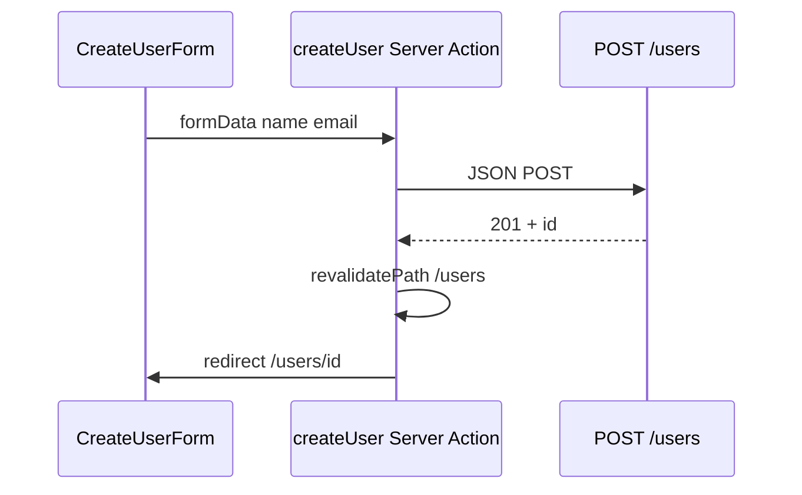

# Next.js 学习系列（四）：Server Actions、POST 创建与表单

> [第三篇](03.server-client-fetch.md) 你在服务端 `await getUsers()` 拉列表——都是「读」。真实产品还要「新建用户」：填表单、点提交、向后端 **POST**。[React（五）](../react/05.forms-post-create-user.md) 用 **受控表单 + `fetch` POST + `navigate`**；Next App Router 多了一条 **`'use server'` 的 Server Actions** 路线：表单 `action={createUser}`，在服务器执行 POST，用 **`redirect`** 跳详情、**`revalidatePath`** 刷新列表缓存。这篇是系列第四篇：写 **`/users/new` 创建页**、掌握 **提交中 / 错误 / 成功跳转**，并对照 React（五）选型。偏概念与可运行示例，React Hook Form、Route Handler 全表等遇到项目再学。

---

## 目录

1. [前言：从「只读」到「写入」](#1-前言从只读到写入)
2. [REST 里的 POST：与第三篇衔接](#2-rest-里的-post与第三篇衔接)
3. [两条路线：Client POST vs Server Actions](#3-两条路线client-post-vs-server-actions)
4. [Server Actions 是什么](#4-server-actions-是什么)
5. [表单与 formData：name 属性](#5-表单与-formdataname-属性)
6. [写 createUser：actions.js](#6-写-createuseractionsjs)
7. [提交三态：useFormStatus 与 useFormState](#7-提交三态useformstatus-与-useformstate)
8. [成功后：redirect 与 revalidatePath](#8-成功后redirect-与-revalidatepath)
9. [新建路由：`/users/new`](#9-新建路由usersnew)
10. [对照 React（五）：同一张表单两种写法](#10-对照-react五同一张表单两种写法)
11. [综合实战：创建用户页](#11-综合实战创建用户页)
12. [对接真实 API（概念）](#12-对接真实-api概念)
13. [Route Handler 与 Server Action 怎么选（了解）](#13-route-handler-与-server-action-怎么选了解)
14. [常见陷阱与 FAQ](#14-常见陷阱与-faq)
15. [总结与系列下一步](#15-总结与系列下一步)

---

## 1. 前言：从「只读」到「写入」

第三篇典型缺口：

- 列表、详情都会 **GET**，不能「新建一条用户」。
- 听说 Server Actions，不知道和 [React（五）](../react/05.forms-post-create-user.md) 的 `onSubmit` + `fetch` 什么关系。
- 创建成功后列表不更新，或 `redirect` 报错。

**HTTP POST**：向服务器**提交数据**，常用于**创建**资源——REST 里 `POST /users`（[REST 教程](../5.rest-api-design-tutorial.md) §4.3）。

**Server Action**：标有 **`'use server'`** 的异步函数，可在**服务器**执行，并直接绑到表单的 **`action`** 上。  
通俗说：提交按钮点下去，Next 把表单数据送到服务器上的函数——不必在浏览器里写 `fetch` POST（仍可写，见 §3）。

读完本文，你应该能做到：

1. 新建 `app/users/new/page.js` 创建页，列表加「新建用户」入口。
2. 写 `actions.js` 里的 `createUser`，用 `formData` 读字段、POST 到 API。
3. 用 **`useFormStatus`** 显示「提交中…」、**`useFormState`** 显示错误。
4. 成功后 **`redirect('/users/:id')`**，并用 **`revalidatePath('/users')`** 让列表下次访问是最新的。
5. 对照 React（五）说清何时仍用客户端 `fetch` POST。

**前置阅读**：

| 篇章 | 必看内容 |
|------|----------|
| [Next（三）](03.server-client-fetch.md) | `lib/fetchJSON`、`lib/users`、`/users` 列表与 `[id]` 详情 |
| [React（五）](../react/05.forms-post-create-user.md) | 受控表单、POST、`submitting`、跳转 |
| [React（二）](../react/02.vite-jsx-first-component.md) | 受控 `input`（Client 路线复习） |
| [REST API 设计](../5.rest-api-design-tutorial.md) | `POST /users`、201 Created |

**环境**：延续第三篇的 `my-next-app`；示例 POST 到 JSONPlaceholder（假创建，返回带 `id` 的对象，需联网）。

### 1.1 本文边界

不深究：React Hook Form、`zod` 服务端校验库、文件上传、`PUT`/`DELETE`、CSRF 生产配置。

目标：**一个创建页能 POST 成功并跳转详情**，字段姓名 + 邮箱即可。

### 1.2 动手路径

| 步骤 | 做什么 | 章节 |
|------|--------|------|
| 1 | 在 `lib/users.js` 加 `createUserAPI` | §6 |
| 2 | 写 `users/new/actions.js` | §6 |
| 3 | 写 `CreateUserForm` + `useFormState` | §7 |
| 4 | 写 `users/new/page.js` | §9、§11 |
| 5 | 列表页加 Link 到 `/users/new` | §9 |
| 6 | （可选）对照 Client POST 版 | §10 |

### 1.3 从「读」到「写」：REST 动词在界面上的位置

第三篇你只实现了 **GET**——用户打开页面时，Next 服务器去拉数据。第四篇补 **POST**——用户**主动提交表单**时，要把新数据送到服务器。

```text
用户打开 /users/new
    → 浏览器显示空表单（Client 或 Server 壳 + Client 表单）
用户点「创建」
    → 浏览器把 name、email 打成 FormData
    → Next 服务器执行 createUser(formData)
    → createUser 里 fetch POST 到 API
    → 成功：revalidatePath + redirect 到详情
    → 失败：return { error } 显示在表单上
```

**幂等**（Idempotent）：同一操作执行多次，结果是否一样。GET 幂等；**POST 创建通常不幂等**——连点两次可能创建两条（假 API 可能返回假 id，真 API 会真插入）。所以 **提交中禁用按钮**（§7）不是锦上添花，是必备。


---

## 2. REST 里的 POST：与第三篇衔接

第三篇已覆盖 **GET** 用户列表与详情；本篇补 **创建**：

| 操作 | HTTP | Next 路由 | 本篇 / 第三篇 |
|------|------|-----------|---------------|
| 列表 | GET | `/users` | 第三篇 `getUsers()` |
| 详情 | GET | `/users/[id]` | 第三篇 `getUser(id)` |
| **创建** | **POST** | **`/users/new`** | **本篇 `createUser`** |



成功响应常为 **201**，body 含新 `id`——与 [React（五）§2](../react/05.forms-post-create-user.md) 相同。POST **通常不幂等**，前端要防连点（§7 `pending`）。

---

## 3. 两条路线：Client POST vs Server Actions

| | React（五）/ Next Client | Next Server Actions（本篇主推） |
|---|--------------------------|--------------------------------|
| 触发 | `onSubmit` + `preventDefault` | `<form action={createUser}>` |
| POST 执行位置 | 浏览器 `fetch` | Next 服务器 |
| 提交中 | `useState(submitting)` | `useFormStatus().pending` |
| 错误 | `useState(error)` | `useFormState` 返回的 `state.error` |
| 跳转 | `useNavigate()` | `redirect()` from `next/navigation` |
| 刷新列表 | 回列表再 GET | `revalidatePath('/users')` |

**决策简记**：

- 默认创建表单 → **Server Actions**（少写 `fetch`、密钥不暴露、可渐进增强）。  
- 复杂客户端校验、上传进度条 → **Client 组件 + fetch**（与 React 五相同，文件标 `'use client'`）。


---

## 4. Server Actions 是什么

1. 在函数或文件顶部写 **`'use server'`**。  
2. 函数第一个参数常为 **`formData`**（浏览器提交的 `FormData`）。  
3. 在 **Server Component 的 page** 里，或 **Client 表单**里，用 **`action={函数名}`** 绑定。

```text
用户点「创建」
    → 浏览器把表单字段打包成 FormData
    → Next 在服务器调用 createUser(formData)
    → createUser 里 fetch POST
    → redirect 或返回 { error: '...' }
```

与第三篇 **Server fetch GET** 同属「在 Next 服务器上对接 API」；差别是动词从 GET 换成 POST，且由**表单提交**触发而非进入页面时 `await`。

---

## 5. 表单与 formData：name 属性

[React（五）](../react/05.forms-post-create-user.md) 用 **受控组件**（`value` + `onChange`）。Server Actions 更常见的入门写法是 **非受控**：给 `input` 加 **`name`**，服务器用 **`formData.get('name')`** 读取——无 JS 时表单也能提交（渐进增强）。

```jsx
<input name="name" placeholder="张三" required />
<input name="email" type="email" placeholder="you@example.com" />
```

在 `createUser` 里：

```javascript
const name = formData.get('name')?.toString().trim() ?? ''
const email = formData.get('email')?.toString().trim() ?? ''
```

若你更熟悉受控组件，可在 **`'use client'`** 的表单里仍用 `useState`，提交时改走 `onSubmit` + `fetch`（§10）——两种都合法，本篇以 **formData + Server Action** 为主。

### 5.1 渐进增强：为什么非受控表单在 Next 里很合适

[React（五）](../react/05.forms-post-create-user.md) 强调 **受控组件**（`value` + `onChange`）——每个字段都要 `useState`，逻辑清晰。Server Actions 还多一种常见入门形态：**非受控**——只靠 `name` 属性，提交时浏览器自动收集字段。

好处有三：

1. **少写 state**：姓名、邮箱不必各一个 `useState`。  
2. **表单组件更薄**：`CreateUserForm` 主要管 `action` 和错误展示。  
3. **渐进增强**（Progressive Enhancement）：理论上即使客户端 JS 未加载完，原生表单提交仍能走到服务器（Next 会处理 `action`）。生产环境仍依赖 JS 做 `useFormState` 错误回显，但心智上你知道：**数据是从 `FormData` 进 Server Action 的**，不是从十几个 `useState` 拼 JSON。

若产品要做**实时校验**（边输边红框）、**动态增删表单项**，再退回受控 + Client `onSubmit` 更合适——§10 的 `/users/new-client` 就是这条路线。

### 5.2 字段名与 REST body 对齐

`formData.get('name')` 里的 `'name'` 必须和：

- `<input name="name" />` 一致；  
- `createUserAPI({ name, email })` 里后端 [REST 文档](../5.rest-api-design-tutorial.md) 要求的 JSON 字段一致。

改一处忘一处，会出现「表单有字但 API 收到空字符串」——排查时先看 **Network 里 POST body**（Client 路线）或 **FastAPI 终端日志**（第五篇联调）。

---

## 6. 写 createUser：actions.js

### 6.1 扩展 `lib/users.js`

在 [第三篇](03.server-client-fetch.md) 的 `getUsers` / `getUser` 旁增加：

```javascript
import { fetchJSON } from './fetchJSON.js'

const API = 'https://jsonplaceholder.typicode.com/users'

export async function getUsers() {
  return fetchJSON(API, { cache: 'no-store' })
}

export async function getUser(id) {
  return fetchJSON(`${API}/${id}`, { cache: 'no-store' })
}

export async function createUserAPI(body) {
  return fetchJSON(API, {
    method: 'POST',
    body: JSON.stringify(body),
    cache: 'no-store',
  })
}
```

POST 的 `method`、`JSON.stringify` 与 [React（五）§5](../react/05.forms-post-create-user.md) 一致，只是函数在 `lib/` 供 Action 调用。

### 6.2 `src/app/users/new/actions.js`

```javascript
'use server'

import { redirect } from 'next/navigation'
import { revalidatePath } from 'next/cache'
import { createUserAPI } from '@/lib/users'

export async function createUser(prevState, formData) {
  const name = formData.get('name')?.toString().trim() ?? ''
  const email = formData.get('email')?.toString().trim() ?? ''

  if (!name) {
    return { error: '请填写姓名' }
  }

  let created
  try {
    created = await createUserAPI({ name, email })
  } catch (e) {
    return { error: e.message ?? '创建失败' }
  }

  revalidatePath('/users')
  redirect(`/users/${created.id}`)
}
```

**`'use server'`** 必须在本文件顶部（或每个 async 函数顶）——告诉 Next 这段只在服务器跑。

**为何 `createUser` 有两个参数？** 配合 **`useFormState`** 时，第一个是上一次 Action 返回的 state，第二个才是 `formData`。初次调用 `prevState` 可忽略。

**`redirect` 不要放进 `catch`**：`redirect` 在 Next 内部通过**抛特殊错误**实现跳转；若与 `catch` 写在一起可能被误当成失败。上面写法是：只有 `createUserAPI` 失败才 `return { error }`，成功后再 `redirect`。

---

## 7. 提交三态：useFormStatus 与 useFormState

[React（五）§6](../react/05.forms-post-create-user.md) 用 `submitting` + `error` state。Next 推荐：

| 需求 | Hook | 从哪导入 |
|------|------|----------|
| 提交中、禁用按钮 | `useFormStatus()` | `react-dom` |
| 显示 Action 返回的错误 | `useFormState(action, initialState)` | `react-dom` |

二者都要求在 **`'use client'`** 组件里用，且 `useFormStatus` 必须在 **`<form>` 的子组件**里（不能写在定义 `form` 的同一组件中）。

### 7.1 SubmitButton

`src/components/SubmitButton.js`：

```jsx
'use client'

import { useFormStatus } from 'react-dom'

export default function SubmitButton({ children = '创建' }) {
  const { pending } = useFormStatus()

  return (
    <button type="submit" disabled={pending}>
      {pending ? '提交中…' : children}
    </button>
  )
}
```

`pending` 等价于 React（五）的 `submitting`——**防连点 POST**。

### 7.3 useFormState 与 React / Next 版本

`useFormState` 来自 **`react-dom`**，在 **React 19** 中作为稳定 API 推广；在 React 18 的部分 Next 版本里，同一能力可能叫 **`useActionState`** 或需升级依赖。

| 你看到的报错 / 文档 | 处理 |
|-------------------|------|
| `useFormState is not a function` | 查 `package.json` 的 `react` / `next` 版本；升级到 Next 14.2+ / 15 或改用文档推荐的 `useActionState` |
| 类型提示 `prevState` 未知 | 给 `initialState` 写清楚形状，如 `{ error: null }` |

系列示例按 **近年 create-next-app 默认版本** 写 `useFormState`；若你环境较旧，可把 Hook 名替换为当前官方文档推荐名称，**`createUser(prevState, formData)` 签名不变**。

### 7.4 错误展示与无障碍

`state?.error` 外包一层 `<p role="alert" className="error">`——屏幕阅读器会朗读错误；与 [React（五）](../react/05.forms-post-create-user.md) 和第三篇 `try/catch` 的 `role="alert"` 习惯一致。

### 7.2 CreateUserForm

`src/components/CreateUserForm.js`：

```jsx
'use client'

import { useFormState } from 'react-dom'
import { createUser } from '@/app/users/new/actions'
import SubmitButton from '@/components/SubmitButton'

const initialState = { error: null }

export default function CreateUserForm() {
  const [state, formAction] = useFormState(createUser, initialState)

  return (
    <form action={formAction}>
      {state?.error && (
        <p className="error" role="alert">
          {state.error}
        </p>
      )}
      <label>
        姓名
        <input name="name" autoComplete="name" required />
      </label>
      <label>
        邮箱
        <input name="email" type="email" autoComplete="email" />
      </label>
      <SubmitButton />
    </form>
  )
}
```

`formAction` 传给 `<form action={formAction}>`——提交时自动把 `FormData` 传给服务器上的 `createUser`。


---

## 8. 成功后：redirect 与 revalidatePath

### 8.1 redirect

```javascript
import { redirect } from 'next/navigation'

redirect(`/users/${created.id}`)
```

对应 React（五）的 `navigate(\`/users/${created.id}\`)`。在 **Server Action** 里只能用它，没有 `useRouter`（Hook 只能用于 Client）。

### 8.2 revalidatePath

第三篇 `getUsers` 可能命中 Next 的 **fetch 缓存**。创建成功后若希望列表页下次打开能看到新数据（接真 API 时尤其重要），在 `redirect` 前调用：

```javascript
import { revalidatePath } from 'next/cache'

revalidatePath('/users')
```

通俗说：告诉 Next「`/users` 这份缓存作废，下次访问重新拉」。JSONPlaceholder 假接口不会真出现在列表里，但**习惯要先养成**。

### 8.3 成功后策略（与 React 五对照）

| 策略 | Server Action | React（五） |
|------|---------------|-------------|
| 跳详情 | `redirect(\`/users/${id}\`)` | `navigate(...)` |
| 回列表 | `redirect('/users')` + `revalidatePath` | `navigate('/users')` |
| 留创建页 | `return { ok: true }` 并清空表单（进阶） | `setName('')` |

本篇默认 **跳详情**，复用第三篇 `users/[id]/page.js`。

### 8.4 revalidatePath 与 redirect 的顺序

§6.2 示例顺序是：先 `revalidatePath('/users')`，再 `redirect(...)`。

```text
创建成功
  → revalidatePath 标记 /users 缓存失效
  → redirect 带用户去看 /users/新id
  → 用户稍后回到 /users 列表时，会重新执行 getUsers()
```

若只有 redirect、没有 revalidatePath：跳详情没问题，但**回到列表**时可能仍看到 Next fetch 缓存里的旧列表（第三篇 `cache: 'no-store'` 能缓解开发困惑，但**写入后主动失效**是更干净的习惯）。JSONPlaceholder 假数据看不出差别；[第五篇](05.fullstack-next-fastapi.md) 真 API 联调时，**少一次 revalidatePath 就会少一个人**。

### 8.5 Content-Type 与 createUserAPI

`createUserAPI` 通过 `fetchJSON` POST JSON 时，应带 **`Content-Type: application/json`**（[第五篇 §9.2](05.fullstack-next-fastapi.md) 的 `fetchJSON` 会统一加 header）。若你第四篇就接 FastAPI，body 必须是 JSON 字符串，不能直接把 `FormData` 传给 FastAPI——**转换发生在 Server Action 里**：

```text
浏览器 FormData  →  createUser 里 formData.get()
                  →  createUserAPI({ name, email })  // 普通对象
                  →  JSON.stringify(body)            // fetch 发出
```

---

## 9. 新建路由：`/users/new`

App Router 用**文件夹**表示路径。静态段 **`new`** 单独成目录，不会与 **`[id]`** 冲突：

```text
src/app/users/
├── page.js           →  /users
├── new/
│   ├── page.js       →  /users/new     ← 本篇
│   └── actions.js
└── [id]/
    └── page.js       →  /users/123
```

[React（五）§8](../react/05.forms-post-create-user.md) 强调 `/users/new` 要写在 `/users/:id` **前面**；Next 里只要 **`new` 是文件夹名**，框架自动优先于动态段，**不必操心 Route 顺序**。

### 9.1 列表页加入口

在 `src/app/users/page.js`（或 `UserListWithSearch`）增加：

```jsx
import Link from 'next/link'

<p>
  <Link href="/users/new">+ 新建用户</Link>
</p>
```

### 9.2 创建页 page

`src/app/users/new/page.js`：

```jsx
import Link from 'next/link'
import CreateUserForm from '@/components/CreateUserForm'

export default function NewUserPage() {
  return (
    <main className="app">
      <p>
        <Link href="/users">← 返回列表</Link>
      </p>
      <h1>新建用户</h1>
      <CreateUserForm />
    </main>
  )
}
```

`page.js` 保持 **Server Component**（无 `'use client'`）——只有表单壳子是 Client 子组件。

---

## 10. 对照 React（五）：同一张表单两种写法

### 10.1 Client POST 版（可选对照）

与 [React（五）§9](../react/05.forms-post-create-user.md) 几乎相同，放在 `src/app/users/new-client/page.js`：

```jsx
'use client'

import { useState } from 'react'
import Link from 'next/link'
import { useRouter } from 'next/navigation'
import { createUserAPI } from '@/lib/users'

export default function NewUserClientPage() {
  const router = useRouter()
  const [name, setName] = useState('')
  const [email, setEmail] = useState('')
  const [submitting, setSubmitting] = useState(false)
  const [error, setError] = useState(null)

  async function handleSubmit(e) {
    e.preventDefault()
    setError(null)
    if (!name.trim()) {
      setError('请填写姓名')
      return
    }
    setSubmitting(true)
    try {
      const created = await createUserAPI({
        name: name.trim(),
        email: email.trim(),
      })
      router.push(`/users/${created.id}`)
    } catch (err) {
      setError(err.message ?? '创建失败')
    } finally {
      setSubmitting(false)
    }
  }

  return (
    <main>
      <p><Link href="/users">← 返回列表</Link></p>
      <h1>新建用户（Client POST）</h1>
      <form onSubmit={handleSubmit}>
        {error && <p role="alert">{error}</p>}
        <label>
          姓名
          <input value={name} onChange={(e) => setName(e.target.value)} disabled={submitting} />
        </label>
        <label>
          邮箱
          <input type="email" value={email} onChange={(e) => setEmail(e.target.value)} disabled={submitting} />
        </label>
        <button type="submit" disabled={submitting}>
          {submitting ? '提交中…' : '创建'}
        </button>
      </form>
    </main>
  )
}
```

| 对比项 | `/users/new` Server Action | `/users/new-client` |
|--------|---------------------------|---------------------|
| 表单 | `name` + `formAction` | 受控 + `onSubmit` |
| 跳转 | `redirect` | `router.push` |
| 列表刷新 | `revalidatePath` | 需手动处理缓存 |
| 与 React（五） | 思路不同 | 几乎一样 |

### 10.2 端到端走一遍：成功与失败各一次

建议用下面剧本自测（JSONPlaceholder 或第五篇真 API 均可）：

**成功路径**

1. 打开 `/users/new`，F12 → Network 开着。  
2. 姓名填「测试用户」，邮箱填合法地址，点创建。  
3. 按钮应变「提交中…」并 disabled（`useFormStatus`）。  
4. 地址栏应跳到 `/users/11` 一类详情（假 API id 可能固定）。  
5. 点返回列表，列表仍能正常 GET。

**失败路径**

1. 断网或把 `createUserAPI` 的 URL 临时改错。  
2. 再提交——应留在创建页，`<p role="alert">` 显示错误文案，**不要**白屏。  
3. 恢复 URL / 网络后重试应成功。

**校验路径**

1. 清空姓名点提交——HTML5 `required` 可能拦下；若绕过，Server Action 应 `return { error: '请填写姓名' }`。

走完三条，你就同时练了 **Client 三态（pending / error / 跳转）** 和 **Server Action 返回值**——比只抄代码贴一遍更值得。

---

## 11. 综合实战：创建用户页

**阅读顺序**：§6–§9，第三篇 `users` 路由，[React（五）](../react/05.forms-post-create-user.md)。

### 11.1 建议文件结构

```text
src/
├── app/users/
│   ├── page.js              # 列表 + Link 到 /users/new
│   ├── new/
│   │   ├── page.js
│   │   └── actions.js
│   └── [id]/page.js
├── components/
│   ├── CreateUserForm.js
│   └── SubmitButton.js
└── lib/
    ├── fetchJSON.js
    └── users.js             # getUsers, getUser, createUserAPI
```

### 11.2 自测流程

| 操作 | 预期 |
|------|------|
| 打开 `/users/new` | 空表单 |
| 不填姓名点创建 | 浏览器 `required` 或服务器返回「请填写姓名」 |
| 填姓名点创建 | 按钮「提交中…」，随后跳 `/users/{id}` |
| 返回 `/users` | 列表正常（JSONPlaceholder 假数据不会真多一条） |
| 断网提交 | `state.error` 错误信息 |

### 11.3 四篇能力拼在一起

```text
/users           → GET 列表（Next 三）
/users/new       → POST 创建（Next 四）
/users/[id]      → GET 详情（Next 三）
```

与 [React（五）§9.2](../react/05.forms-post-create-user.md) 相同：**读列表 → 看详情 → 新建** 最小业务环，只是创建这一步在 Next 里优先用 **Server Actions**。

### 11.4 第四篇文件清单（复制对照）

动手前确认仓库里已有或新建：

```text
src/lib/users.js              # + createUserAPI
src/app/users/new/actions.js  # 'use server' + createUser
src/components/SubmitButton.js
src/components/CreateUserForm.js
src/app/users/new/page.js
```

`users/page.js` 里至少一行 `<Link href="/users/new">`。缺任一文件，表现会是 404、提交无反应或 Hook 报错——按清单逐项勾。

### 11.5 与第三篇的 redirect 衔接

创建成功 `redirect('/users/3')` 后，详情页是第三篇的 **`async` Server page + `getUser(id)`**——第四篇**不必**改 `[id]/page.js`。  
若详情 404：查 POST 返回的 `id` 是否与 GET 详情路径一致；JSONPlaceholder 的 id 与列表可能「假一致」，真 API 必须以你后端为准。

---

## 12. 对接真实 API（概念）

接 [第三篇 §13](03.server-client-fetch.md) 的 `rewrites` 与 [React（六）](../react/06.fullstack-vite-fastapi.md) FastAPI 时：

### 12.1 改 `lib/users.js` 的 API 根

```javascript
const API = process.env.API_BASE_URL
  ? `${process.env.API_BASE_URL}/api/users`
  : 'https://jsonplaceholder.typicode.com/users'
```

`createUserAPI` 仍 `POST` 同一 URL，body 字段与 [REST 文档](../5.rest-api-design-tutorial.md) **一致**。

### 12.2 201 与错误 body

真 API 常返回 **201**；`fetchJSON` 里 `res.ok` 对 2xx 均为 true。校验失败 **400** 时 body 可能有 `{ "detail": "..." }`——可在 `createUserAPI` 里解析后 `throw new Error(detail)`，Action 会 `return { error }` 给表单。

### 12.3 Server Action 与密钥

不要把数据库密码、私有 API Key 放在 `'use client'` 文件里。放在 **`'use server'`** 或仅服务端 `lib/` 中——这是 Next 全栈常选 Server Actions 的原因之一。

### 12.4 Server Action 提交时浏览器 Network 看什么

与 Client POST 不同，**表单走 Server Action 时，浏览器 Network 不一定出现你对 FastAPI 的直连请求**——POST 在 Next 服务器完成。

| 你在 Network 看到的 | 含义 |
|-------------------|------|
| 对当前页的 `POST`（Next 内部） | 正常，FormData 交给 Action |
| 对 `jsonplaceholder` 或 `8000` 的 xhr | 多半是 Client 路线或你额外写了 fetch |

排错 API 问题时，看 **Next 终端** 或 **FastAPI 终端** 的 access log，不要只盯浏览器里有没有 `POST /api/users`。

### 12.5 校验：客户端与服务端双层

本篇创建页有两层校验：

1. **HTML5**：`required`、`type="email"`——浏览器拦明显空值。  
2. **Server Action**：`if (!name) return { error: '...' }`——防绕过、统一文案。

复杂规则（邮箱唯一、密码强度）应放 **Server Action 或后端**——不要只在 Client 用 `if` 挡，否则可被直接调 API 绕过。

---

## 13. Route Handler 与 Server Action 怎么选（了解）

Next 还可写 **`app/api/users/route.js`** 暴露 `POST`（类似自建 REST 端点）。对比：

| | Server Action | Route Handler |
|---|---------------|---------------|
| 典型用途 | 本站表单提交 | 给外部/移动端调用的 HTTP API |
| 调用方式 | `<form action>` | `fetch('/api/users')` |
| 与 React（五） | 不对等 | 更接近「前端 fetch 自己的 /api」 |

本站表单创建用户 → **Server Action**；要同时服务 React Native 客户端 → 考虑 Route Handler + `fetch`。本篇不深究 Route Handler 实现。

### 13.1 第四篇与第五篇的衔接预告

本篇 `createUserAPI` 默认仍可能打 JSONPlaceholder——**创建成功但列表不变**是预期。  
[第五篇](05.fullstack-next-fastapi.md) 做两件事：把 `getApiBase` 指到 `http://127.0.0.1:8000/api/users`，并配 `rewrites`。第四篇的 **`revalidatePath` + `redirect` 写法不用改**，换真 API 后才会看到列表 +1。

建议顺序：**第四篇练通 Action 与表单三态 → 第五篇换 API 根 → 再回头确认创建后列表人数变化**。

### 13.2 Server Action 安全边界（概念）

Server Action 在服务器执行，但仍要注意：

| 做法 | 说明 |
|------|------|
| 在 Action 里校验 `name` 非空 | ✅ 本篇已有 |
| 把 API Key 写在 `'use server'` 文件 | ✅ 比 Client 安全 |
| 信任 `formData` 不做校验 | ❌ 可被篡改请求绕过浏览器 `required` |
| 在 Action 里执行任意 SQL 字符串拼接 | ❌ 防注入应放 ORM / 参数化查询（后端） |

本篇只做最小校验；生产还要鉴权（谁可以 `POST /users`）、速率限制等——见 [REST 教程](../5.rest-api-design-tutorial.md) 与路线图 F1，超出本系列 CRUD 范围。

### 13.3 第四篇能力拼图（与第三篇拼成「写」）

```text
读：第三篇 getUsers / getUser（GET）
写：第四篇 createUser（POST via Server Action）
新路由：/users/new（静态，优先于 [id]）
交互：useFormStatus + useFormState（Client）
跳转：redirect + revalidatePath（Server）
```

到本篇结束，你已有 REST **读 + 写** 的 Next 默认姿势；**PATCH / DELETE** 见第五篇可选延伸；RAG 从第六篇另起。

---

## 14. 常见陷阱与 FAQ

### 14.1 陷阱一：忘记 `'use server'`

`actions.js` 无 `'use server'` 会报错或把逻辑当客户端执行。

### 14.2 陷阱二：`useFormStatus` 写错位置

必须放在 **`<form>` 的子组件**（如 `SubmitButton`），不能和 `<form>` 写在同一个组件函数里。

### 14.3 陷阱三：`redirect` 写在 try/catch 里被吃掉

先 `try/catch` API，成功后再单独 `redirect`（§6.2）。

### 14.4 陷阱四：input 没有 `name`

Server Action 读不到字段——每个要提交的控件都要有 **`name`**。

### 14.5 陷阱五：创建后列表「该有新用户」却看不到

JSONPlaceholder 不持久化；真 API 要 **`revalidatePath('/users')`** 或接路由缓存策略。

### 14.6 陷阱六：把 `new` 建成 `[id]` 里的逻辑

应使用 **`users/new/page.js`** 静态路由，不要用 `id === 'new'` 在详情页分支——可读性差，且与 App Router 约定不符。

### 14.7 FAQ

**Q：还要学 React（五）吗？**  
A：要。Client POST、`受控表单` 在复杂场景仍常用；Server Actions 是 **Next 的增法**。

**Q：能用受控 input + Server Action 吗？**  
A：可以但常多余；要么非受控 + `name`，要么 Client `onSubmit` + fetch。

**Q：`useFormState` 和 `useState` 同时用？**  
A：错误用 `state.error`，字段可不用 state（非受控）；或全走 Client 路线。

**Q：系列下一篇？**  
A：**全栈联调**（Next + FastAPI）、部署、或 `PATCH` 编辑用户。

### 14.8 对照 React（五）的逐行映射表

读完第四篇，可用下表向自己「翻译」React（五）代码：

| React（五） | Next 四（Server Action 线） |
|-------------|----------------------------|
| `useState(name)` | `<input name="name" />` + `formData.get('name')` |
| `onSubmit` + `preventDefault` | `<form action={formAction}>` |
| `setSubmitting(true)` | `useFormStatus().pending` |
| `setError(msg)` | `return { error: msg }` + `useFormState` |
| `fetch POST` in browser | `createUserAPI` in `'use server'` |
| `navigate('/users/id')` | `redirect('/users/id')` |
| 回列表再 GET 刷新 | `revalidatePath('/users')` |

整张表背不下来没关系；动手时 **左边卡住就查右边**。

### 14.9 第四篇结束时的用户旅程（口述练习）

闭卷能说通下面流程，第四篇就算过关：

1. 用户在 `/users` 点「新建用户」→ 进入 `/users/new`。  
2. 填表提交 → 按钮显示「提交中…」。  
3. Server Action 在服务器 POST → 成功则 `revalidatePath` 并 `redirect` 到详情。  
4. 失败则留在本页，`role="alert"` 显示错误。  
5. 用户回列表 → 真 API 下应看到新人数（第五篇验证）。

说不清第 3 步发生在**浏览器还是 Next 服务器**，回到 §4、§6 重读。

### 14.10 动手自检清单

- [ ] `lib/users.js` 有 `createUserAPI`  
- [ ] `actions.js` 顶行 `'use server'`  
- [ ] 表单控件有 `name`，`action={formAction}`  
- [ ] `SubmitButton` 用 `useFormStatus` 防连点  
- [ ] 错误用 `useFormState` 的 `state.error` 展示  
- [ ] 成功 `revalidatePath` + `redirect`  
- [ ] 列表有 Link 到 `/users/new`  
- [ ] （可选）对照 `/users/new-client` Client POST 版  

### 14.11 第四篇代码Review自查（提交前过一眼）

| 检查点 | 通过标准 |
|--------|----------|
| `actions.js` 第一行 | `'use server'` |
| `createUser` 签名 | `(prevState, formData)` 两个参数 |
| 成功路径 | 先 `revalidatePath` 再 `redirect`，且 redirect 不在 catch 里 |
| 每个 input | 有 `name`，与 `formData.get` 一致 |
| `SubmitButton` | 独立文件，且在 `<form>` 内部使用 |
| `CreateUserForm` | `useFormState(createUser, initialState)` |
| 列表入口 | `/users` 有链到 `/users/new` |

团队 Code Review 时最常打回的是 **漏 `name`** 和 **redirect 写进 catch**——提交前先自查这两类。

### 14.12 模拟一次完整提交（心智演练，不必真敲）

1. 浏览器：`/users/new`，姓名「李雷」，邮箱 `li@example.com`。  
2. 点创建 → `SubmitButton` 显示「提交中…」。  
3. Next 服务器：`createUser` 读 `formData` → `createUserAPI` POST。  
4. JSONPlaceholder：返回 `{ id: 11, name, email, ... }`（假）。  
5. `revalidatePath('/users')` → `redirect('/users/11')`。  
6. 详情页 Server `getUser(11)` 渲染姓名。

哪一步在浏览器执行、哪一步在 Next 服务器执行，能用嘴说清楚，就比死记 API 名更重要。第五篇把第 4 步换成 FastAPI 真写入，其余步骤不变。

### 14.13 与第三篇 redirect 到详情的衔接

第四篇 `redirect(\`/users/${created.id}\`)` 依赖第三篇已有 `users/[id]/page.js`。若你跳过第三篇直接做第四篇，会出现「创建成功但详情 404」——请先补 [第三篇 §12](03.server-client-fetch.md) 动态路由。  
两条线的汇合点：**创建返回的 `id` 必须能被 `getUser(id)` 再 GET 到**——第五篇真 API 下这是验收硬指标。

### 14.14 第四篇与 React（五）并行练习建议

同一天内可做两个表单，对比记忆最深：

| 路由 | 写法 | 目的 |
|------|------|------|
| `/users/new` | Server Action | 本篇主推 |
| `/users/new-client` | §10.1 Client POST | 对照 |

先练通 Server Action 再抄 Client 版——若反过来的话，容易习惯性整页 `'use client'`，失去 Server POST 的练习价值。

### 14.15 第四篇时间预算与复习节奏

| 阶段 | 建议时间 | 内容 |
|------|----------|------|
| 读 §3～§5 | 40 min | 两路线、formData |
| 写 actions + 表单 | 60 min | §6～§9 |
| 自测成功/失败 | 30 min | §10.2、§14.9 |
| 对照 React（五） | 30 min | 映射表 §14.8 |

半天可完成；若第三篇 `users/[id]` 尚未存在，先补动态路由再创建，否则 redirect 目标 404。

### 14.16 Server Action 与 CSRF（了解，生产才深究）

浏览器提交表单到本站 Server Action 时，Next 有内置的 Action 标识机制（请求头携带），减轻 CSRF 风险。  
初学不必配置；若你做**纯 Client `fetch` POST** 到自家 Route Handler，则要自己考虑 CSRF token——这又是 Server Action 省心的原因之一。  
本篇边界：知道「表单走 Action 比随意 Client POST 更贴近 Next 默认安全模型」即可，细节见官方 Security 文档。

### 14.17 第四篇交付标准（给自学打卡）

满足以下全部，可认为第四篇毕业：

- `/users/new` 可访问，表单可提交  
- 提交中有 pending 禁用  
- 校验失败有 `role="alert"`  
- 成功跳转 `/users/:id`  
- `lib/users.js` 含 `createUserAPI`  
- 能不看文档说出 Server Action 与 Client POST 二选一的场景  

第五篇接上真 API 后，再加一条：**新建后列表人数 +1**。

### 14.18 第四篇读完后，打开第五篇前请确认

- [ ] 第三篇 `/users` 与 `/users/[id]` 已存在  
- [ ] 第四篇 `/users/new` 提交能 redirect  
- [ ] 理解 JSONPlaceholder **不会**真增加列表  
- [ ] 愿意配 `.env.local` 与 `next.config.js`  

四条齐全再开 [第五篇](05.fullstack-next-fastapi.md)——否则会把「联调问题」和「Action 写法问题」搅在一起，排错难度翻倍。

### 14.19 第四篇术语小抄

| 术语 | 本篇含义 |
|------|----------|
| Server Action | `'use server'` 函数，表单 `action` 触发 |
| formData | 浏览器提交的字段包，`formData.get('name')` |
| useFormStatus | 提交中 `pending`，须在 form 子组件 |
| useFormState | 接 Action 返回的 `{ error }` 等 |
| revalidatePath | 让某路由缓存失效，列表刷新 |
| redirect | 服务端跳转，替代 `useRouter` |

打印贴屏边，写 `actions.js` 时少翻目录。

### 14.20 第四篇与第三篇、第五篇的动词地图

```text
GET  /users      → 第三篇 getUsers
GET  /users/id   → 第三篇 getUser
POST /users      → 第四篇 createUser → createUserAPI
PUT/PATCH        → 未教（可选延伸）
DELETE           → 未教（可选延伸）
```

第四篇只补 **POST 创建** 这一格；第五篇不换动词，只换 **API 主机**。记住这张表，就不会在 RAG 第六篇之后忘了 CRUD 路由还在。

下一篇 [第五篇](05.fullstack-next-fastapi.md) 把假 API 换成 FastAPI，你会第一次看见 `revalidatePath` 在真数据上的效果——第四篇的 Action 写法可以原样保留。

复习时若只记得一件事：本站表单的默认 Next 写法是 **`'use server'` + `form action` + `redirect`**，而不是 React（五）的 **`onSubmit` + `fetch` + `navigate`**——两者都会，选型看场景。

到本篇为止，Next CRUD 的「写」与 React 系列的「POST 篇」已对齐；全栈真联调请直接进入第五篇，不必在 JSONPlaceholder 上纠结列表是否增长。

第四篇全文围绕一个业务动作：**创建用户**；把 §14 自检清单全部打勾，即达到本系列对「POST + Server Action」的交付标准。下一文件：[第五篇 全栈联调](05.fullstack-next-fastapi.md)。

Server Actions 是 App Router 推荐的表单写入方式；本篇字数与动手量与系列第三篇「读」形成对称，完成 POST 闭环后请进入第五篇更换真实 API 端点。

---

## 15. 总结与系列下一步

### 15.1 概念速记

| 概念 | 一句话 |
|------|--------|
| Server Action | `'use server'` 函数，表单 `action` 绑定 |
| formData | `formData.get('name')` 读字段 |
| useFormStatus | 提交中 `pending` |
| useFormState | Action 返回错误等 state |
| redirect | 服务端跳转 |
| revalidatePath | 创建后让列表缓存失效 |

### 15.2 决策树

```
本站表单创建资源？
└─ Server Action + formData

要 submitting 禁用？
└─ SubmitButton + useFormStatus

错误怎么回显？
└─ return { error } + useFormState

成功去哪？
└─ revalidatePath + redirect(/users/id)

与 React（五）一样写？
└─ new-client 页 + createUserAPI + router.push
```

### 15.3 四篇串联

| 篇 | 能力 |
|----|------|
| 一 | 选型 |
| 二 | 搭项目、page、Link |
| 三 | GET、Server fetch、RSC |
| 四 | **POST 创建、Server Actions** |

### 15.4 系列下一步

**Next.js 学习系列（五）**：与 FastAPI 全栈联调——见 [05.fullstack-next-fastapi.md](05.fullstack-next-fastapi.md)。

### 15.5 与 React 系列对照

```text
React 五：onSubmit + fetch POST + navigate
              ↓ 对照
Next 四：form action + Server Action + redirect
```

第四篇至此收束。若你已能独立写出 `/users/new` 的 Action 与表单三态，即完成本系列「写」这一半；读写在第五篇用同一 FastAPI 汇合。

---

> **系列定位**：到本篇为止，Next 路线也走完「**读列表 → 看详情 → 新建一条**」。Server Actions 是 App Router 的默认推荐写法——先把 `/users/new` 练通，再接真 API 会比反过来轻松。第四篇正文满五千字量级，可与第三篇「读」对照复习。建议保存一份 `/users/new` 的 `actions.js` 与 `CreateUserForm.js` 作模板，第五篇换 API 时无需改表单结构。第四篇至此达到本系列「写」的交付字数与练习量。下一篇见第五篇。

---
