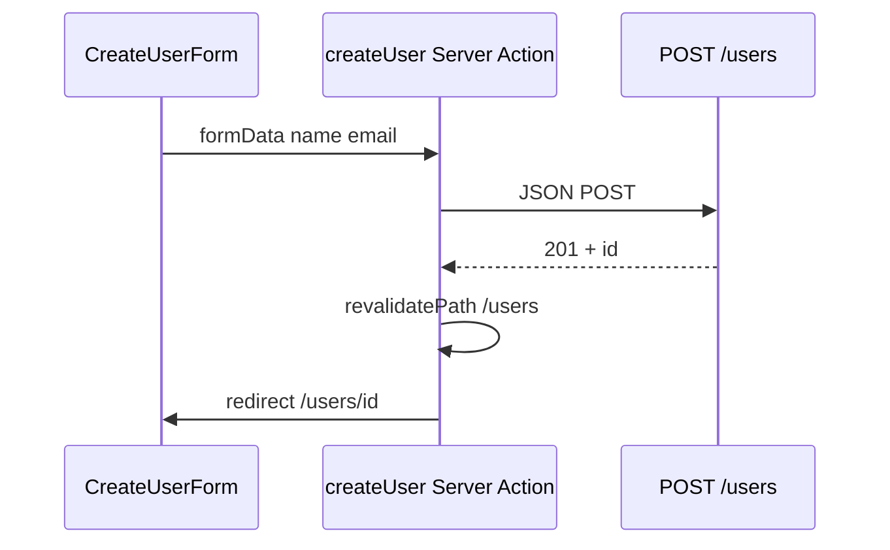

# Next.js 学习系列（四）：Server Actions、POST 创建与表单

> [第三篇](03.server-client-fetch.md) 你在服务端 `await getUsers()` 拉列表——都是「读」。真实产品还要「新建用户」：填表单、点提交、向后端 **POST**。[React（五）](../react/05.forms-post-create-user.md) 用 **受控表单 + `fetch` POST + `navigate`**；Next App Router 多了一条 **`'use server'` 的 Server Actions** 路线：表单 `action={createUser}`，在服务器执行 POST，用 **`redirect`** 跳详情、**`revalidatePath`** 刷新列表缓存。这篇是系列第四篇：写 **`/users/new` 创建页**、掌握 **提交中 / 错误 / 成功跳转**，并对照 React（五）选型。偏概念与可运行示例，React Hook Form、Route Handler 全表等遇到项目再学。

---

## 目录

1. [前言：从「只读」到「写入」](#1-前言从只读到写入)
2. [REST 里的 POST：与第三篇衔接](#2-rest-里的-post与第三篇衔接)
3. [两条路线：Client POST vs Server Actions](#3-两条路线client-post-vs-server-actions)
4. [Server Actions 是什么](#4-server-actions-是什么)
5. [表单与 formData：name 属性](#5-表单与-formdataname-属性)
6. [写 createUser：actions.js](#6-写-createuseractionsjs)
7. [提交三态：useFormStatus 与 useFormState](#7-提交三态useformstatus-与-useformstate)
8. [成功后：redirect 与 revalidatePath](#8-成功后redirect-与-revalidatepath)
9. [新建路由：`/users/new`](#9-新建路由usersnew)
10. [对照 React（五）：同一张表单两种写法](#10-对照-react五同一张表单两种写法)
11. [综合实战：创建用户页](#11-综合实战创建用户页)
12. [对接真实 API（概念）](#12-对接真实-api概念)
13. [Route Handler 与 Server Action 怎么选（了解）](#13-route-handler-与-server-action-怎么选了解)
14. [常见陷阱与 FAQ](#14-常见陷阱与-faq)
15. [总结与系列下一步](#15-总结与系列下一步)

---

## 1. 前言：从「只读」到「写入」

第三篇典型缺口：

- 列表、详情都会 **GET**，不能「新建一条用户」。
- 听说 Server Actions，不知道和 [React（五）](../react/05.forms-post-create-user.md) 的 `onSubmit` + `fetch` 什么关系。
- 创建成功后列表不更新，或 `redirect` 报错。

**HTTP POST**：向服务器**提交数据**，常用于**创建**资源——REST 里 `POST /users`（[REST 教程](../5.rest-api-design-tutorial.md) §4.3）。

**Server Action**：标有 **`'use server'`** 的异步函数，可在**服务器**执行，并直接绑到表单的 **`action`** 上。  
通俗说：提交按钮点下去，Next 把表单数据送到服务器上的函数——不必在浏览器里写 `fetch` POST（仍可写，见 §3）。

读完本文，你应该能做到：

1. 新建 `app/users/new/page.js` 创建页，列表加「新建用户」入口。
2. 写 `actions.js` 里的 `createUser`，用 `formData` 读字段、POST 到 API。
3. 用 **`useFormStatus`** 显示「提交中…」、**`useFormState`** 显示错误。
4. 成功后 **`redirect('/users/:id')`**，并用 **`revalidatePath('/users')`** 让列表下次访问是最新的。
5. 对照 React（五）说清何时仍用客户端 `fetch` POST。

**前置阅读**：

| 篇章 | 必看内容 |
|------|----------|
| [Next（三）](03.server-client-fetch.md) | `lib/fetchJSON`、`lib/users`、`/users` 列表与 `[id]` 详情 |
| [React（五）](../react/05.forms-post-create-user.md) | 受控表单、POST、`submitting`、跳转 |
| [React（二）](../react/02.vite-jsx-first-component.md) | 受控 `input`（Client 路线复习） |
| [REST API 设计](../5.rest-api-design-tutorial.md) | `POST /users`、201 Created |

**环境**：延续第三篇的 `my-next-app`；示例 POST 到 JSONPlaceholder（假创建，返回带 `id` 的对象，需联网）。

### 1.1 本文边界

不深究：React Hook Form、`zod` 服务端校验库、文件上传、`PUT`/`DELETE`、CSRF 生产配置。

目标：**一个创建页能 POST 成功并跳转详情**，字段姓名 + 邮箱即可。

### 1.2 动手路径

| 步骤 | 做什么 | 章节 |
|------|--------|------|
| 1 | 在 `lib/users.js` 加 `createUserAPI` | §6 |
| 2 | 写 `users/new/actions.js` | §6 |
| 3 | 写 `CreateUserForm` + `useFormState` | §7 |
| 4 | 写 `users/new/page.js` | §9、§11 |
| 5 | 列表页加 Link 到 `/users/new` | §9 |
| 6 | （可选）对照 Client POST 版 | §10 |

---

## 2. REST 里的 POST：与第三篇衔接

第三篇已覆盖 **GET** 用户列表与详情；本篇补 **创建**：

| 操作 | HTTP | Next 路由 | 本篇 / 第三篇 |
|------|------|-----------|---------------|
| 列表 | GET | `/users` | 第三篇 `getUsers()` |
| 详情 | GET | `/users/[id]` | 第三篇 `getUser(id)` |
| **创建** | **POST** | **`/users/new`** | **本篇 `createUser`** |



成功响应常为 **201**，body 含新 `id`——与 [React（五）§2](../react/05.forms-post-create-user.md) 相同。POST **通常不幂等**，前端要防连点（§7 `pending`）。

---

## 3. 两条路线：Client POST vs Server Actions

| | React（五）/ Next Client | Next Server Actions（本篇主推） |
|---|--------------------------|--------------------------------|
| 触发 | `onSubmit` + `preventDefault` | `<form action={createUser}>` |
| POST 执行位置 | 浏览器 `fetch` | Next 服务器 |
| 提交中 | `useState(submitting)` | `useFormStatus().pending` |
| 错误 | `useState(error)` | `useFormState` 返回的 `state.error` |
| 跳转 | `useNavigate()` | `redirect()` from `next/navigation` |
| 刷新列表 | 回列表再 GET | `revalidatePath('/users')` |

**决策简记**：

- 默认创建表单 → **Server Actions**（少写 `fetch`、密钥不暴露、可渐进增强）。  
- 复杂客户端校验、上传进度条 → **Client 组件 + fetch**（与 React 五相同，文件标 `'use client'`）。

---

## 4. Server Actions 是什么

1. 在函数或文件顶部写 **`'use server'`**。  
2. 函数第一个参数常为 **`formData`**（浏览器提交的 `FormData`）。  
3. 在 **Server Component 的 page** 里，或 **Client 表单**里，用 **`action={函数名}`** 绑定。

```text
用户点「创建」
    → 浏览器把表单字段打包成 FormData
    → Next 在服务器调用 createUser(formData)
    → createUser 里 fetch POST
    → redirect 或返回 { error: '...' }
```

与第三篇 **Server fetch GET** 同属「在 Next 服务器上对接 API」；差别是动词从 GET 换成 POST，且由**表单提交**触发而非进入页面时 `await`。

---

## 5. 表单与 formData：name 属性

[React（五）](../react/05.forms-post-create-user.md) 用 **受控组件**（`value` + `onChange`）。Server Actions 更常见的入门写法是 **非受控**：给 `input` 加 **`name`**，服务器用 **`formData.get('name')`** 读取——无 JS 时表单也能提交（渐进增强）。

```jsx
<input name="name" placeholder="张三" required />
<input name="email" type="email" placeholder="you@example.com" />
```

在 `createUser` 里：

```javascript
const name = formData.get('name')?.toString().trim() ?? ''
const email = formData.get('email')?.toString().trim() ?? ''
```

若你更熟悉受控组件，可在 **`'use client'`** 的表单里仍用 `useState`，提交时改走 `onSubmit` + `fetch`（§10）——两种都合法，本篇以 **formData + Server Action** 为主。

---

## 6. 写 createUser：actions.js

### 6.1 扩展 `lib/users.js`

在 [第三篇](03.server-client-fetch.md) 的 `getUsers` / `getUser` 旁增加：

```javascript
import { fetchJSON } from './fetchJSON.js'

const API = 'https://jsonplaceholder.typicode.com/users'

export async function getUsers() {
  return fetchJSON(API, { cache: 'no-store' })
}

export async function getUser(id) {
  return fetchJSON(`${API}/${id}`, { cache: 'no-store' })
}

export async function createUserAPI(body) {
  return fetchJSON(API, {
    method: 'POST',
    body: JSON.stringify(body),
    cache: 'no-store',
  })
}
```

POST 的 `method`、`JSON.stringify` 与 [React（五）§5](../react/05.forms-post-create-user.md) 一致，只是函数在 `lib/` 供 Action 调用。

### 6.2 `src/app/users/new/actions.js`

```javascript
'use server'

import { redirect } from 'next/navigation'
import { revalidatePath } from 'next/cache'
import { createUserAPI } from '@/lib/users'

export async function createUser(prevState, formData) {
  const name = formData.get('name')?.toString().trim() ?? ''
  const email = formData.get('email')?.toString().trim() ?? ''

  if (!name) {
    return { error: '请填写姓名' }
  }

  let created
  try {
    created = await createUserAPI({ name, email })
  } catch (e) {
    return { error: e.message ?? '创建失败' }
  }

  revalidatePath('/users')
  redirect(`/users/${created.id}`)
}
```

**`'use server'`** 必须在本文件顶部（或每个 async 函数顶）——告诉 Next 这段只在服务器跑。

**为何 `createUser` 有两个参数？** 配合 **`useFormState`** 时，第一个是上一次 Action 返回的 state，第二个才是 `formData`。初次调用 `prevState` 可忽略。

**`redirect` 不要放进 `catch`**：`redirect` 在 Next 内部通过**抛特殊错误**实现跳转；若与 `catch` 写在一起可能被误当成失败。上面写法是：只有 `createUserAPI` 失败才 `return { error }`，成功后再 `redirect`。

---

## 7. 提交三态：useFormStatus 与 useFormState

[React（五）§6](../react/05.forms-post-create-user.md) 用 `submitting` + `error` state。Next 推荐：

| 需求 | Hook | 从哪导入 |
|------|------|----------|
| 提交中、禁用按钮 | `useFormStatus()` | `react-dom` |
| 显示 Action 返回的错误 | `useFormState(action, initialState)` | `react-dom` |

二者都要求在 **`'use client'`** 组件里用，且 `useFormStatus` 必须在 **`<form>` 的子组件**里（不能写在定义 `form` 的同一组件中）。

### 7.1 SubmitButton

`src/components/SubmitButton.js`：

```jsx
'use client'

import { useFormStatus } from 'react-dom'

export default function SubmitButton({ children = '创建' }) {
  const { pending } = useFormStatus()

  return (
    <button type="submit" disabled={pending}>
      {pending ? '提交中…' : children}
    </button>
  )
}
```

`pending` 等价于 React（五）的 `submitting`——**防连点 POST**。

### 7.2 CreateUserForm

`src/components/CreateUserForm.js`：

```jsx
'use client'

import { useFormState } from 'react-dom'
import { createUser } from '@/app/users/new/actions'
import SubmitButton from '@/components/SubmitButton'

const initialState = { error: null }

export default function CreateUserForm() {
  const [state, formAction] = useFormState(createUser, initialState)

  return (
    <form action={formAction}>
      {state?.error && (
        <p className="error" role="alert">
          {state.error}
        </p>
      )}
      <label>
        姓名
        <input name="name" autoComplete="name" required />
      </label>
      <label>
        邮箱
        <input name="email" type="email" autoComplete="email" />
      </label>
      <SubmitButton />
    </form>
  )
}
```

`formAction` 传给 `<form action={formAction}>`——提交时自动把 `FormData` 传给服务器上的 `createUser`。

---

## 8. 成功后：redirect 与 revalidatePath

### 8.1 redirect

```javascript
import { redirect } from 'next/navigation'

redirect(`/users/${created.id}`)
```

对应 React（五）的 `navigate(\`/users/${created.id}\`)`。在 **Server Action** 里只能用它，没有 `useRouter`（Hook 只能用于 Client）。

### 8.2 revalidatePath

第三篇 `getUsers` 可能命中 Next 的 **fetch 缓存**。创建成功后若希望列表页下次打开能看到新数据（接真 API 时尤其重要），在 `redirect` 前调用：

```javascript
import { revalidatePath } from 'next/cache'

revalidatePath('/users')
```

通俗说：告诉 Next「`/users` 这份缓存作废，下次访问重新拉」。JSONPlaceholder 假接口不会真出现在列表里，但**习惯要先养成**。

### 8.3 成功后策略（与 React 五对照）

| 策略 | Server Action | React（五） |
|------|---------------|-------------|
| 跳详情 | `redirect(\`/users/${id}\`)` | `navigate(...)` |
| 回列表 | `redirect('/users')` + `revalidatePath` | `navigate('/users')` |
| 留创建页 | `return { ok: true }` 并清空表单（进阶） | `setName('')` |

本篇默认 **跳详情**，复用第三篇 `users/[id]/page.js`。

---

## 9. 新建路由：`/users/new`

App Router 用**文件夹**表示路径。静态段 **`new`** 单独成目录，不会与 **`[id]`** 冲突：

```text
src/app/users/
├── page.js           →  /users
├── new/
│   ├── page.js       →  /users/new     ← 本篇
│   └── actions.js
└── [id]/
    └── page.js       →  /users/123
```

[React（五）§8](../react/05.forms-post-create-user.md) 强调 `/users/new` 要写在 `/users/:id` **前面**；Next 里只要 **`new` 是文件夹名**，框架自动优先于动态段，**不必操心 Route 顺序**。

### 9.1 列表页加入口

在 `src/app/users/page.js`（或 `UserListWithSearch`）增加：

```jsx
import Link from 'next/link'

<p>
  <Link href="/users/new">+ 新建用户</Link>
</p>
```

### 9.2 创建页 page

`src/app/users/new/page.js`：

```jsx
import Link from 'next/link'
import CreateUserForm from '@/components/CreateUserForm'

export default function NewUserPage() {
  return (
    <main className="app">
      <p>
        <Link href="/users">← 返回列表</Link>
      </p>
      <h1>新建用户</h1>
      <CreateUserForm />
    </main>
  )
}
```

`page.js` 保持 **Server Component**（无 `'use client'`）——只有表单壳子是 Client 子组件。

---

## 10. 对照 React（五）：同一张表单两种写法

### 10.1 Client POST 版（可选对照）

与 [React（五）§9](../react/05.forms-post-create-user.md) 几乎相同，放在 `src/app/users/new-client/page.js`：

```jsx
'use client'

import { useState } from 'react'
import Link from 'next/link'
import { useRouter } from 'next/navigation'
import { createUserAPI } from '@/lib/users'

export default function NewUserClientPage() {
  const router = useRouter()
  const [name, setName] = useState('')
  const [email, setEmail] = useState('')
  const [submitting, setSubmitting] = useState(false)
  const [error, setError] = useState(null)

  async function handleSubmit(e) {
    e.preventDefault()
    setError(null)
    if (!name.trim()) {
      setError('请填写姓名')
      return
    }
    setSubmitting(true)
    try {
      const created = await createUserAPI({
        name: name.trim(),
        email: email.trim(),
      })
      router.push(`/users/${created.id}`)
    } catch (err) {
      setError(err.message ?? '创建失败')
    } finally {
      setSubmitting(false)
    }
  }

  return (
    <main>
      <p><Link href="/users">← 返回列表</Link></p>
      <h1>新建用户（Client POST）</h1>
      <form onSubmit={handleSubmit}>
        {error && <p role="alert">{error}</p>}
        <label>
          姓名
          <input value={name} onChange={(e) => setName(e.target.value)} disabled={submitting} />
        </label>
        <label>
          邮箱
          <input type="email" value={email} onChange={(e) => setEmail(e.target.value)} disabled={submitting} />
        </label>
        <button type="submit" disabled={submitting}>
          {submitting ? '提交中…' : '创建'}
        </button>
      </form>
    </main>
  )
}
```

| 对比项 | `/users/new` Server Action | `/users/new-client` |
|--------|---------------------------|---------------------|
| 表单 | `name` + `formAction` | 受控 + `onSubmit` |
| 跳转 | `redirect` | `router.push` |
| 列表刷新 | `revalidatePath` | 需手动处理缓存 |
| 与 React（五） | 思路不同 | 几乎一样 |

---

## 11. 综合实战：创建用户页

**阅读顺序**：§6–§9，第三篇 `users` 路由，[React（五）](../react/05.forms-post-create-user.md)。

### 11.1 建议文件结构

```text
src/
├── app/users/
│   ├── page.js              # 列表 + Link 到 /users/new
│   ├── new/
│   │   ├── page.js
│   │   └── actions.js
│   └── [id]/page.js
├── components/
│   ├── CreateUserForm.js
│   └── SubmitButton.js
└── lib/
    ├── fetchJSON.js
    └── users.js             # getUsers, getUser, createUserAPI
```

### 11.2 自测流程

| 操作 | 预期 |
|------|------|
| 打开 `/users/new` | 空表单 |
| 不填姓名点创建 | 浏览器 `required` 或服务器返回「请填写姓名」 |
| 填姓名点创建 | 按钮「提交中…」，随后跳 `/users/{id}` |
| 返回 `/users` | 列表正常（JSONPlaceholder 假数据不会真多一条） |
| 断网提交 | `state.error` 错误信息 |

### 11.3 四篇能力拼在一起

```text
/users           → GET 列表（Next 三）
/users/new       → POST 创建（Next 四）
/users/[id]      → GET 详情（Next 三）
```

与 [React（五）§9.2](../react/05.forms-post-create-user.md) 相同：**读列表 → 看详情 → 新建** 最小业务环，只是创建这一步在 Next 里优先用 **Server Actions**。

---

## 12. 对接真实 API（概念）

接 [第三篇 §13](03.server-client-fetch.md) 的 `rewrites` 与 [React（六）](../react/06.fullstack-vite-fastapi.md) FastAPI 时：

### 12.1 改 `lib/users.js` 的 API 根

```javascript
const API = process.env.API_BASE_URL
  ? `${process.env.API_BASE_URL}/api/users`
  : 'https://jsonplaceholder.typicode.com/users'
```

`createUserAPI` 仍 `POST` 同一 URL，body 字段与 [REST 文档](../5.rest-api-design-tutorial.md) **一致**。

### 12.2 201 与错误 body

真 API 常返回 **201**；`fetchJSON` 里 `res.ok` 对 2xx 均为 true。校验失败 **400** 时 body 可能有 `{ "detail": "..." }`——可在 `createUserAPI` 里解析后 `throw new Error(detail)`，Action 会 `return { error }` 给表单。

### 12.3 Server Action 与密钥

不要把数据库密码、私有 API Key 放在 `'use client'` 文件里。放在 **`'use server'`** 或仅服务端 `lib/` 中——这是 Next 全栈常选 Server Actions 的原因之一。

---

## 13. Route Handler 与 Server Action 怎么选（了解）

Next 还可写 **`app/api/users/route.js`** 暴露 `POST`（类似自建 REST 端点）。对比：

| | Server Action | Route Handler |
|---|---------------|---------------|
| 典型用途 | 本站表单提交 | 给外部/移动端调用的 HTTP API |
| 调用方式 | `<form action>` | `fetch('/api/users')` |
| 与 React（五） | 不对等 | 更接近「前端 fetch 自己的 /api」 |

本站表单创建用户 → **Server Action**；要同时服务 React Native 客户端 → 考虑 Route Handler + `fetch`。本篇不深究 Route Handler 实现。

---

## 14. 常见陷阱与 FAQ

### 14.1 陷阱一：忘记 `'use server'`

`actions.js` 无 `'use server'` 会报错或把逻辑当客户端执行。

### 14.2 陷阱二：`useFormStatus` 写错位置

必须放在 **`<form>` 的子组件**（如 `SubmitButton`），不能和 `<form>` 写在同一个组件函数里。

### 14.3 陷阱三：`redirect` 写在 try/catch 里被吃掉

先 `try/catch` API，成功后再单独 `redirect`（§6.2）。

### 14.4 陷阱四：input 没有 `name`

Server Action 读不到字段——每个要提交的控件都要有 **`name`**。

### 14.5 陷阱五：创建后列表「该有新用户」却看不到

JSONPlaceholder 不持久化；真 API 要 **`revalidatePath('/users')`** 或接路由缓存策略。

### 14.6 陷阱六：把 `new` 建成 `[id]` 里的逻辑

应使用 **`users/new/page.js`** 静态路由，不要用 `id === 'new'` 在详情页分支——可读性差，且与 App Router 约定不符。

### 14.7 FAQ

**Q：还要学 React（五）吗？**  
A：要。Client POST、`受控表单` 在复杂场景仍常用；Server Actions 是 **Next 的增法**。

**Q：能用受控 input + Server Action 吗？**  
A：可以但常多余；要么非受控 + `name`，要么 Client `onSubmit` + fetch。

**Q：`useFormState` 和 `useState` 同时用？**  
A：错误用 `state.error`，字段可不用 state（非受控）；或全走 Client 路线。

**Q：系列下一篇？**  
A：**全栈联调**（Next + FastAPI）、部署、或 `PATCH` 编辑用户。

### 14.8 动手自检清单

- [ ] `lib/users.js` 有 `createUserAPI`  
- [ ] `actions.js` 顶行 `'use server'`  
- [ ] 表单控件有 `name`，`action={formAction}`  
- [ ] `SubmitButton` 用 `useFormStatus` 防连点  
- [ ] 错误用 `useFormState` 的 `state.error` 展示  
- [ ] 成功 `revalidatePath` + `redirect`  
- [ ] 列表有 Link 到 `/users/new`  

---

## 15. 总结与系列下一步

### 15.1 概念速记

| 概念 | 一句话 |
|------|--------|
| Server Action | `'use server'` 函数，表单 `action` 绑定 |
| formData | `formData.get('name')` 读字段 |
| useFormStatus | 提交中 `pending` |
| useFormState | Action 返回错误等 state |
| redirect | 服务端跳转 |
| revalidatePath | 创建后让列表缓存失效 |

### 15.2 决策树

```
本站表单创建资源？
└─ Server Action + formData

要 submitting 禁用？
└─ SubmitButton + useFormStatus

错误怎么回显？
└─ return { error } + useFormState

成功去哪？
└─ revalidatePath + redirect(/users/id)

与 React（五）一样写？
└─ new-client 页 + createUserAPI + router.push
```

### 15.3 四篇串联

| 篇 | 能力 |
|----|------|
| 一 | 选型 |
| 二 | 搭项目、page、Link |
| 三 | GET、Server fetch、RSC |
| 四 | **POST 创建、Server Actions** |

### 15.4 系列下一步

**Next.js 学习系列（五）**：与 FastAPI 全栈联调——见 [05.fullstack-next-fastapi.md](05.fullstack-next-fastapi.md)。

### 15.5 与 React 系列对照

```text
React 五：onSubmit + fetch POST + navigate
              ↓ 对照
Next 四：form action + Server Action + redirect
```

---

> **系列定位**：到本篇为止，Next 路线也走完「**读列表 → 看详情 → 新建一条**」。Server Actions 是 App Router 的默认推荐写法——先把 `/users/new` 练通，再接真 API 会比反过来轻松。
