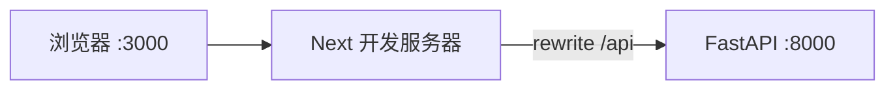

# Next.js 学习系列（五）：全栈对接——Next 前端 + FastAPI 后端

> 第三、四篇用 JSONPlaceholder——POST 成功列表也不变。现在要接**自己的后端**：Next 跑在 `localhost:3000`，FastAPI 在 `localhost:8000`。[React（六）](../react/06.fullstack-vite-fastapi.md) 用 **Vite `server.proxy`**；Next 用 **`next.config.js` 的 `rewrites`**，并把 `lib/users.js` 从假 API 改成 **`/api/users`**。这篇是系列第五篇：复用同一套 FastAPI，打通 **GET 列表、GET 详情、Server Action 创建**，本机两个终端跑通「列表 → 新建 → 详情」且数据**真的增加**。偏概念与能跑通的步骤，PostgreSQL、Docker 可衔接本仓库其他教程。

---

## 目录

1. [前言：假接口够用了，该接真后端](#1-前言假接口够用了该接真后端)
2. [全栈开发时两个地址：3000 与 8000](#2-全栈开发时两个地址3000-与-8000)
3. [CORS、rewrites 与服务端 fetch](#3-corsrewrites-与服务端-fetch)
4. [后端：复用 React（六）的 FastAPI](#4-后端复用-react六的-fastapi)
5. [Next：rewrites 配置](#5-nextrewrites-配置)
6. [环境变量与 lib/users.js](#6-环境变量与-libusersjs)
7. [字段与响应形状对齐](#7-字段与响应形状对齐)
8. [本地同时跑起来：两个终端](#8-本地同时跑起来两个终端)
9. [综合实战：串起列表 / 详情 / 创建](#9-综合实战串起列表--详情--创建)
10. [排错清单](#10-排错清单)
11. [常见陷阱与 FAQ](#11-常见陷阱与-faq)
12. [总结与系列收工](#12-总结与系列收工)

---

## 1. 前言：假接口够用了，该接真后端

第四篇典型卡点：

- `revalidatePath` 做了，列表仍看不到新用户——JSONPlaceholder 不持久化。
- 把 `lib/users.js` 改成 `8000` 后，**某一页能跑、某一页 404**——Server fetch 与浏览器 fetch 的 URL 写法不一致。
- 不知道 `next.config.js` 和 [React（六）](../react/06.fullstack-vite-fastapi.md) 的 `vite.config.js` 怎么对照。

**全栈**：同一产品里既有 **Next 前端**，也有 **FastAPI 后端** 提供 REST API。

读完本文，你应该能做到：

1. 说明 Next 开发时 **3000 / 8000** 各干什么，以及 **rewrites** 与 Vite **proxy** 的对应关系。
2. 启动与 [React（六）](../react/06.fullstack-vite-fastapi.md) **相同**的 FastAPI 用户 API（或共用 `backend/main.py`）。
3. 配置 `next.config.js` + `.env.local`，统一 `lib/users.js` 的 `getUsers` / `getUser` / `createUserAPI`。
4. 本机完成：`/users` 列表 → `/users/new` 创建 → `/users/:id` 详情，**新建后列表人数 +1**。
5. 说清 **服务端 fetch** 与 **浏览器 fetch** 在 Next 里各用什么 URL。

**前置阅读**：

| 篇章 | 必看内容 |
|------|----------|
| [Next（三）](03.server-client-fetch.md) | `lib/fetchJSON`、`getUsers`、rewrites 概念 §13 |
| [Next（四）](04.server-actions-post-create.md) | `createUser` Server Action、`revalidatePath` |
| [React（六）](../react/06.fullstack-vite-fastapi.md) | FastAPI `main.py`、CORS、代理心智 |
| [REST API 设计](../5.rest-api-design-tutorial.md) | `GET/POST /api/users` |

**环境**：Node.js 18+、Python 3.10+、第三～四篇的 `my-next-app`。

### 1.1 本文边界

不展开：PostgreSQL（[教程](../8.postgresql-tutorial.md)）、Docker Compose（[教程](../11.docker-compose-tutorial.md)）、生产部署、JWT 登录。

目标：**两个终端，浏览器走 Next 完成读写闭环**。

### 1.2 项目目录建议

```text
my-fullstack-next/
├── backend/                 # 与 React（六）相同
│   ├── main.py
│   └── requirements.txt
└── frontend/                # 第二篇起的 my-next-app
    ├── next.config.js
    ├── .env.local
    └── src/
        ├── lib/users.js
        └── app/users/...
```

后端**只写一份**；Vite 与 Next 前端可共用 `backend/`。

### 1.3 动手路径

| 步骤 | 做什么 | 章节 |
|------|--------|------|
| 1 | 起 FastAPI，用 `/docs` 自测 | §4 |
| 2 | 配 `next.config.js` rewrites | §5 |
| 3 | 写 `.env.local` + 改 `lib/users.js` | §6 |
| 4 | 两个终端联调 | §8 |
| 5 | 列表 → 新建 → 验证人数 +1 | §9 |

---

## 2. 全栈开发时两个地址：3000 与 8000



| 进程 | 默认地址 | 干什么 |
|------|----------|--------|
| `npm run dev` | `http://localhost:3000` | Next 页面、Server Component、Server Actions |
| `uvicorn main:app` | `http://localhost:8000` | `GET/POST /api/users` |

与 [React（六）](../react/06.fullstack-vite-fastapi.md) 对照：只是把 **5173 → 3000**，**Vite proxy → Next rewrites**。

---

## 3. CORS、rewrites 与服务端 fetch

### 3.1 浏览器请求：仍怕 CORS

**客户端组件**里若写：

```javascript
fetch('http://localhost:8000/api/users')  // ❌ 易 CORS
```

浏览器页面在 **3000**，API 在 **8000**——不同源，可能被拦（同 React 六 §3）。

**推荐**：浏览器与 [React（六）](../react/06.fullstack-vite-fastapi.md) 一样，只请求 **相对路径**：

```javascript
fetch('/api/users')  // 浏览器打到 3000，由 Next rewrite 到 8000
```

### 3.2 服务端 fetch：不受 CORS 限制

[第三篇](03.server-client-fetch.md) 的 `getUsers()` 在 **Next 服务器**执行，不走浏览器 CORS。开发环境两种写法：

| 写法 | 说明 |
|------|------|
| `http://127.0.0.1:8000/api/users` | 直连 FastAPI，简单明确 |
| `http://localhost:3000/api/users` | 经 Next rewrites 转发，与浏览器路径一致 |

本篇用 **环境变量** 统一（§6），避免 `lib/users.js` 里散落多个 host。

### 3.3 rewrites 与 proxy 对照

| | React（六）Vite | Next（五）本篇 |
|---|-----------------|----------------|
| 配置文件 | `vite.config.js` → `server.proxy` | `next.config.js` → `rewrites` |
| 前端路径 | `fetch('/api/users')` | 浏览器侧相同 |
| 改后重启 | 重启 `npm run dev` | 重启 `npm run dev` |

---

## 4. 后端：复用 React（六）的 FastAPI

**不必重写后端**。直接复制 [React（六）§4](../react/06.fullstack-vite-fastapi.md) 的 `backend/requirements.txt` 与 `main.py`：

- `GET /api/users` — 列表  
- `GET /api/users/{user_id}` — 详情  
- `POST /api/users` — 创建，**201**，内存存储  

```bash
cd backend
pip install -r requirements.txt
uvicorn main:app --reload --port 8000
```

浏览器打开 `http://localhost:8000/docs`，确认 `GET /api/users` 返回小明、小红两条。

**注意路径**：后端必须是 **`/api/users`**，与 Next `rewrites` 的 `source: '/api/:path*'` 对齐——不要一端有 `/api` 一端没有（同 React 六 §11.2）。

---

## 5. Next：rewrites 配置

在 `frontend/next.config.js`（项目根，与 `package.json` 同级）：

```javascript
/** @type {import('next').NextConfig} */
const nextConfig = {
  async rewrites() {
    return [
      {
        source: '/api/:path*',
        destination: 'http://localhost:8000/api/:path*',
      },
    ]
  },
}

module.exports = nextConfig
```

| 配置 | 含义 |
|------|------|
| `source` | 浏览器 / Next 收到的路径前缀 |
| `destination` | 转发到 FastAPI 的真实地址 |

**改 `next.config.js` 后必须重启** `npm run dev`。

数据流：

```text
浏览器 fetch('/api/users')
  → http://localhost:3000/api/users
  → Next rewrite
  → http://localhost:8000/api/users
  → FastAPI 返回 JSON
```

Server Action 里 `createUserAPI` 若用 §6 的 `getApiBase()`，在服务器上同样能打到 FastAPI。

---

## 6. 环境变量与 lib/users.js

### 6.1 `.env.local`

在 Next 项目根（不要提交 git）：

```text
# 服务端 fetch 直连后端（推荐开发）
API_BASE_URL=http://127.0.0.1:8000

# 可选：浏览器侧相对路径前缀（默认 /api/users 已够用）
# NEXT_PUBLIC_API_PREFIX=/api
```

Next 自动加载 `.env.local`；**改后重启** dev server。

### 6.2 统一的 `src/lib/api.js`

抽一层 API 根地址，避免 `getUsers` 与 `createUserAPI` 各写一套：

```javascript
/**
 * 服务端 fetch 用的绝对 URL（直连 FastAPI，走 API_BASE_URL）
 * 未配置时回退 JSONPlaceholder（便于未起后端时单独练 UI）
 */
export function getApiBase() {
  const base = process.env.API_BASE_URL
  if (base) {
    return `${base.replace(/\/$/, '')}/api/users`
  }
  return 'https://jsonplaceholder.typicode.com/users'
}

/**
 * 浏览器 / 相对路径（走 Next rewrites，需 FastAPI 已起）
 * 仅当 API_BASE_URL 已配置时使用 /api；否则仍用假 API 完整 URL
 */
export function getBrowserApiBase() {
  if (process.env.API_BASE_URL) {
    return '/api/users'
  }
  return 'https://jsonplaceholder.typicode.com/users'
}
```

### 6.3 改写 `src/lib/users.js`

```javascript
import { fetchJSON } from './fetchJSON.js'
import { getApiBase } from './api.js'

function usersUrl(id) {
  const base = getApiBase()
  return id ? `${base}/${id}` : base
}

export async function getUsers() {
  return fetchJSON(usersUrl(), { cache: 'no-store' })
}

export async function getUser(id) {
  return fetchJSON(usersUrl(id), { cache: 'no-store' })
}

export async function createUserAPI(body) {
  return fetchJSON(usersUrl(), {
    method: 'POST',
    body: JSON.stringify(body),
    cache: 'no-store',
  })
}
```

**要点**：

- 第三篇的 **Server page** `await getUsers()` → 服务器上 `fetch('http://127.0.0.1:8000/api/users')`。  
- 第四篇 **Server Action** `createUserAPI` → 同样在服务器 POST，**不暴露**后端地址给浏览器 bundle。  
- 若你有 `'use client'` 页用 `fetch('/api/users')`，用 `getBrowserApiBase()`（进阶；本篇主路径是 Server fetch + Action）。

### 6.4 与 JSONPlaceholder 切换

| `API_BASE_URL` | 行为 |
|----------------|------|
| 未设置 | 仍打 JSONPlaceholder，第三～四篇可独立练 |
| `http://127.0.0.1:8000` | 全打真 API |

---

## 7. 字段与响应形状对齐

与 [React（六）§7](../react/06.fullstack-vite-fastapi.md) **完全相同**：

| 字段 | 列表 | 详情 | POST 响应 |
|------|------|------|-----------|
| `id` | ✅ | ✅ | 服务器生成 |
| `name` | ✅ | ✅ | 必填 |
| `email` | ✅ | ✅ | 必填 |

本篇 FastAPI 返回 **裸数组** `GET /api/users` → `[{ id, name, email }, ...]`，第三篇 `users.map` **不用改**。

若你后端包一层 `{ "users": [] }`，在 `getUsers` 里：

```javascript
const body = await fetchJSON(usersUrl(), { cache: 'no-store' })
return body?.users ?? []
```

POST 返回 **201** + 完整用户对象 → 第四篇 `redirect(\`/users/${created.id}\`)` 与详情 `getUser(id)` **id 一致**——接真 API 的最大好处。

---

## 8. 本地同时跑起来：两个终端

| 终端 | 目录 | 命令 |
|------|------|------|
| 1 | `backend/` | `uvicorn main:app --reload --port 8000` |
| 2 | `frontend/`（Next 根） | `npm run dev` |

确认：

1. `.env.local` 含 `API_BASE_URL=http://127.0.0.1:8000`  
2. `next.config.js` 已配 rewrites  
3. 两个进程都在跑  

浏览器打开 `http://localhost:3000/users`：

1. 应看到 **小明、小红**（来自 FastAPI 内存数据）。  
2. 点「新建用户」→ 提交 → 跳详情 → 回列表应 **3 人**。  
3. **只重启后端**，人数回 2——数据在内存，未接数据库（预期）。

---

## 9. 综合实战：串起列表 / 详情 / 创建

**阅读顺序**：本篇 §4–§8，[Next（三）（四）](03.server-client-fetch.md)，[React（六）](../react/06.fullstack-vite-fastapi.md)。

### 9.1 路由与职责（第三～四篇已有）

```text
/users           → page.js          → getUsers()
/users/[id]      → [id]/page.js     → getUser(id)
/users/new       → new/page.js      → CreateUserForm → createUser Action
```

第四篇 `createUser` **无需改逻辑**，只要 `createUserAPI` 已指向真 API；`revalidatePath('/users')` 在真数据下才有可见效果。

### 9.2 `fetchJSON` 增强错误信息（可选）

与 [React（六）§9.2](../react/06.fullstack-vite-fastapi.md) 相同，便于看 FastAPI 的 422 详情：

```javascript
export async function fetchJSON(url, options = {}) {
  const res = await fetch(url, {
    headers: {
      'Content-Type': 'application/json',
      ...options.headers,
    },
    ...options,
  })
  if (!res.ok) {
    const text = await res.text()
    throw new Error(text || `请求失败: ${res.status}`)
  }
  return res.json()
}
```

### 9.3 自测表

| 步骤 | 预期 |
|------|------|
| 只开 Next、不开 FastAPI | `/users` 报错或连接失败 |
| 只开 FastAPI、访问 8000/docs | Swagger 正常 |
| 两端都开 + `.env.local` | 列表 2 人 |
| 新建「张三」 | 列表 3 人，详情为张三 |
| `/users/999` | 404，`error.js` 或 try/catch 提示 |
| 去掉 `API_BASE_URL` 重启 Next | 回到 JSONPlaceholder 行为 |

### 9.4 与 React（六）并排对照

| 能力 | React（六） | Next（五）本篇 |
|------|-------------|----------------|
| 列表 | `useEffect` + `/api/users` | Server `getUsers()` |
| 详情 | `useEffect` + `/api/users/:id` | Server `getUser(id)` |
| 创建 | Client POST + `navigate` | Server Action + `redirect` |
| 代理 | Vite proxy | Next rewrites |
| 新建后列表更新 | 回列表再 GET | `revalidatePath` + 再访问 `/users` |

**后端 `main.py` 一份**；换框架只换前端项目与代理配置。

---

## 10. 排错清单

| 现象 | 可能原因 | 处理 |
|------|----------|------|
| `ECONNREFUSED 127.0.0.1:8000` | FastAPI 未起 | 终端 1 起 uvicorn |
| `/api/users` 404 | rewrite 或后端路径不一致 | 对照 `main.py` 与 `next.config.js` |
| 改了 rewrite / `.env` 无效 | 未重启 Next | Ctrl+C 后 `npm run dev` |
| 列表仍是 JSONPlaceholder 10 人 | 未设 `API_BASE_URL` | 检查 `.env.local` |
| POST 422 | email 格式或缺字段 | 看 FastAPI 响应；对齐 `UserCreate` |
| Server fetch 404 但浏览器 /api 正常 | `getApiBase` 拼错 | 应为 `.../api/users` 不是 `.../users` |
| 创建成功列表不 +1 | 仍用假 API 或未 `revalidatePath` | 第四篇 Action 里确认 `revalidatePath('/users')` |

F12 → **Network**：浏览器里看 `/api` 请求（若有 Client 请求）；Server fetch 错误看 **Next 终端**红色日志。

---

## 11. 常见陷阱与 FAQ

### 11.1 陷阱一：Server 里 `fetch('/api/users')` 无 host

相对路径在 **Node 服务端**可能解析失败——用 **`getApiBase()` 绝对 URL** 或 `http://localhost:3000/api/users`。

### 11.2 陷阱二：只配 rewrites 不设 `API_BASE_URL`

rewrites 主要帮 **浏览器** 打 `/api`；第三篇 **Server page** 的 `getUsers` 若仍写 JSONPlaceholder URL，列表不会变真数据。

### 11.3 陷阱三：`API_BASE_URL` 末尾多斜杠

`getApiBase()` 里 `replace(/\/$/, '')` 可避免 `//api/users`。

### 11.4 陷阱四：生产把 `127.0.0.1:8000` 写进仓库

`.env.local` **不要提交**；生产用部署环境变量指向真实 API 或内网地址。

### 11.5 FAQ

**Q：能和 React（六）共用同一个 backend 吗？**  
A：能。同时开 Vite（5173）和 Next（3000）时，两个前端都代理到自己的 `/api` 即可。

**Q：Server Action 还要 CORS 吗？**  
A：Action 在服务器 `fetch` FastAPI，**不需要**浏览器 CORS。

**Q：数据如何持久化？**  
A：接 [PostgreSQL](../8.postgresql-tutorial.md)；FastAPI 把 `_users` 换成数据库。

**Q：Next 系列还写吗？**  
A：可选 **部署**（Vercel + API 分离）、**PATCH 编辑**、**Route Handler 对外 API**；全栈闭环到本篇可收工练项目。

### 11.6 动手自检清单

- [ ] 能解释 3000 与 8000 的角色  
- [ ] FastAPI `/docs` 测通三个接口  
- [ ] `next.config.js` 有 `rewrites`  
- [ ] `.env.local` 有 `API_BASE_URL`  
- [ ] `lib/api.js` + `lib/users.js` 已改  
- [ ] 新建后列表从 2 变 3  
- [ ] 能对照说出与 React（六）的差异  

---

## 12. 总结与系列收工

### 12.1 概念速记

| 概念 | 一句话 |
|------|--------|
| rewrites | Next 开发时把 `/api` 转到 FastAPI |
| API_BASE_URL | 服务端 fetch 直连后端 |
| getApiBase | 统一绝对 URL，给 Server 用 |
| revalidatePath | 创建后让列表页重新拉取 |
| 字段对齐 | 与 FastAPI `UserOut` 一致 |

### 12.2 决策树

```
开发联调 Next + FastAPI？
└─ rewrites + API_BASE_URL + lib/users.js

列表在哪拉？
└─ Server getUsers（第三篇）

创建在哪写？
└─ Server Action createUser（第四篇）

要持久化？
└─ PostgreSQL / Docker（另学）

生产部署？
└─ 环境变量 + 反代（另学）
```

### 12.3 五篇回顾

| 篇 | 主题 |
|----|------|
| 一 | 何时选 Next |
| 二 | create-next-app、page、Link |
| 三 | Server fetch、RSC |
| 四 | Server Actions、POST |
| 五 | **真后端 FastAPI 联调** |

### 12.4 与 React 系列的关系

```text
React 一～六（Vite SPA 全栈）  ←→  Next 一～五（App Router 全栈）
         同一 REST API / 同一 backend/main.py
```

### 12.5 系列下一步

RAG 前端从 [第六篇](06.rag-frontend-skeleton.md) 起在同一 `frontend/` 上累积；本篇第五篇仍是 CRUD 收束，读者若走 Next 主栈请直接进入第六篇搭骨架。

可选续篇（CRUD 延伸，非 RAG 主线）：

- **PATCH 编辑用户**：详情页预填 + Server Action 更新  
- **Route Handler**：`app/api/users/route.js` 作 BFF 层  

---

> **系列定位（第五篇）**：本篇把 Next 系列从「会写页面」推到「**能和 Python API 联调**」。若你以 RAG 全栈为目标，第五篇是底座；**第六篇起**进入知识库助手前端主线，见 [nextjs/README.md](README.md)。
