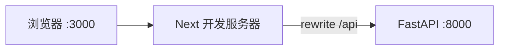
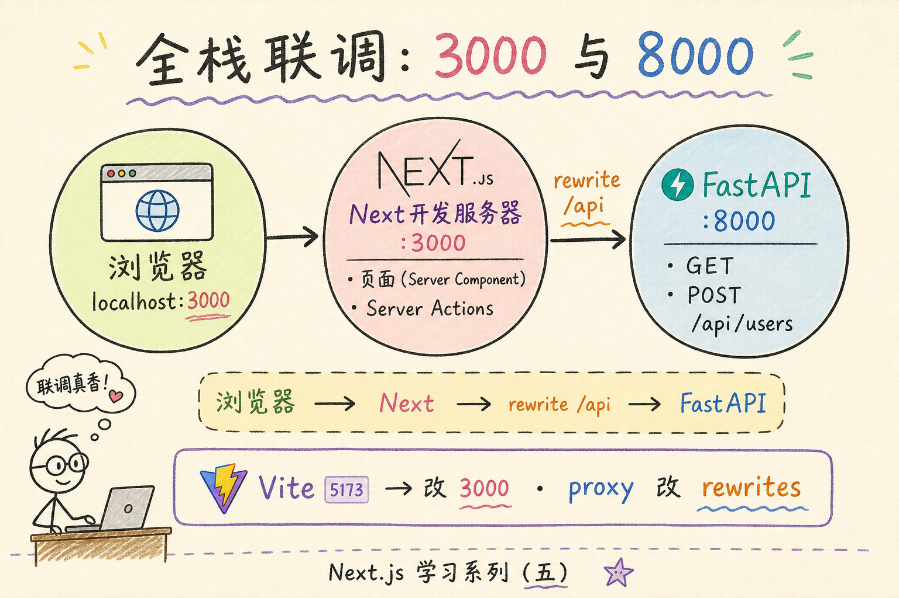
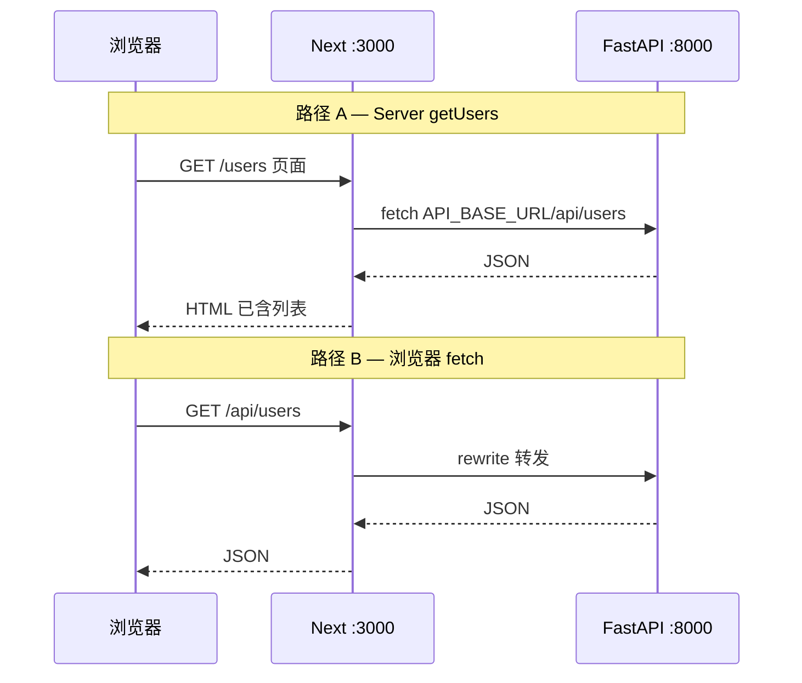
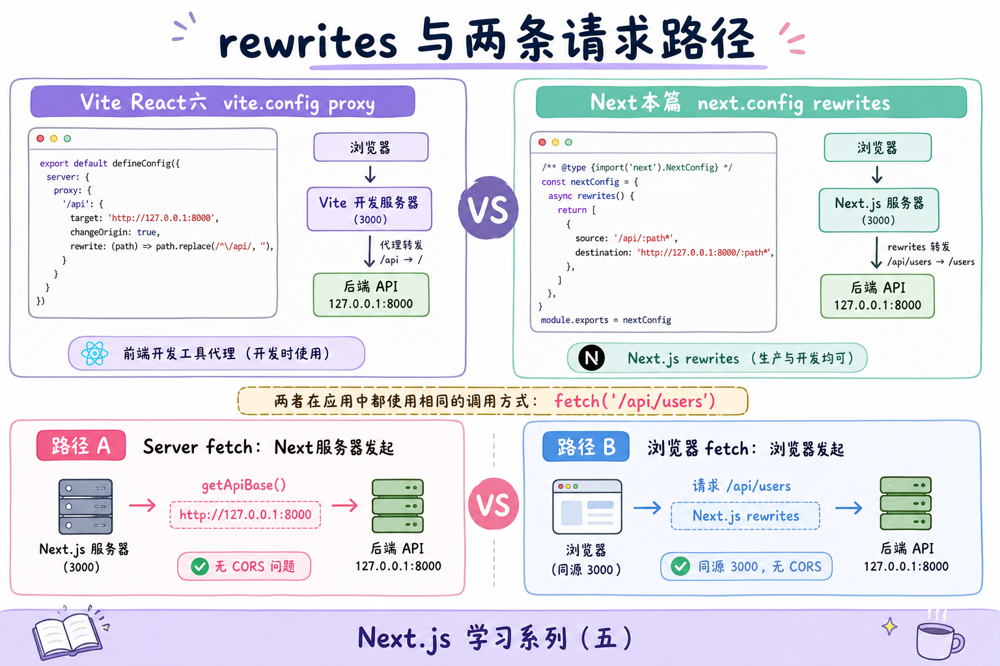
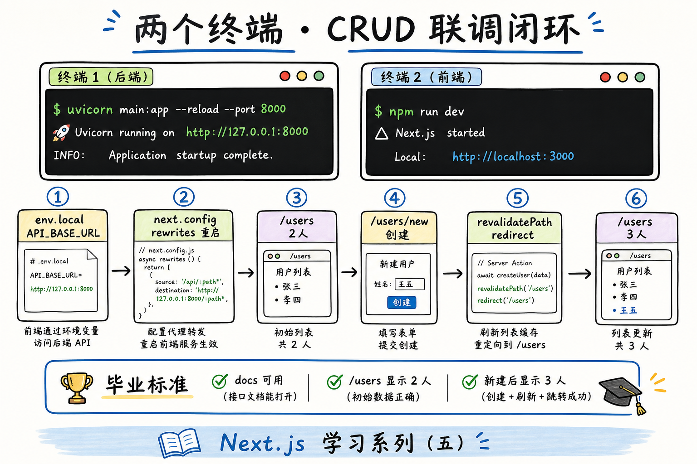

# Next.js 学习系列（五）：全栈对接——Next 前端 + FastAPI 后端

> 第三、四篇用 JSONPlaceholder——POST 成功列表也不变。现在要接**自己的后端**：Next 跑在 `localhost:3000`，FastAPI 在 `localhost:8000`。[React（六）](../react/06.fullstack-vite-fastapi.md) 用 **Vite `server.proxy`**；Next 用 **`next.config.js` 的 `rewrites`**，并把 `lib/users.js` 从假 API 改成 **`/api/users`**。这篇是系列第五篇：复用同一套 FastAPI，打通 **GET 列表、GET 详情、Server Action 创建**，本机两个终端跑通「列表 → 新建 → 详情」且数据**真的增加**。偏概念与能跑通的步骤，PostgreSQL、Docker 可衔接本仓库其他教程。

---

## 目录

1. [前言：假接口够用了，该接真后端](#1-前言假接口够用了该接真后端)
2. [全栈开发时两个地址：3000 与 8000](#2-全栈开发时两个地址3000-与-8000)
3. [CORS、rewrites 与服务端 fetch](#3-corsrewrites-与服务端-fetch)
4. [后端：复用 React（六）的 FastAPI](#4-后端复用-react六的-fastapi)
5. [Next：rewrites 配置](#5-nextrewrites-配置)
6. [环境变量与 lib/users.js](#6-环境变量与-libusersjs)
7. [字段与响应形状对齐](#7-字段与响应形状对齐)
8. [本地同时跑起来：两个终端](#8-本地同时跑起来两个终端)
9. [综合实战：串起列表 / 详情 / 创建](#9-综合实战串起列表--详情--创建)
10. [排错清单](#10-排错清单)
11. [常见陷阱与 FAQ](#11-常见陷阱与-faq)
12. [总结与 CRUD 阶段收束](#12-总结与-crud-阶段收束)

---

## 1. 前言：假接口够用了，该接真后端

第四篇典型卡点：

- `revalidatePath` 做了，列表仍看不到新用户——JSONPlaceholder 不持久化。
- 把 `lib/users.js` 改成 `8000` 后，**某一页能跑、某一页 404**——Server fetch 与浏览器 fetch 的 URL 写法不一致。
- 不知道 `next.config.js` 和 [React（六）](../react/06.fullstack-vite-fastapi.md) 的 `vite.config.js` 怎么对照。

**全栈**：同一产品里既有 **Next 前端**，也有 **FastAPI 后端** 提供 REST API。

读完本文，你应该能做到：

1. 说明 Next 开发时 **3000 / 8000** 各干什么，以及 **rewrites** 与 Vite **proxy** 的对应关系。
2. 启动与 [React（六）](../react/06.fullstack-vite-fastapi.md) **相同**的 FastAPI 用户 API（或共用 `backend/main.py`）。
3. 配置 `next.config.js` + `.env.local`，统一 `lib/users.js` 的 `getUsers` / `getUser` / `createUserAPI`。
4. 本机完成：`/users` 列表 → `/users/new` 创建 → `/users/:id` 详情，**新建后列表人数 +1**。
5. 说清 **服务端 fetch** 与 **浏览器 fetch** 在 Next 里各用什么 URL。

**前置阅读**：

| 篇章 | 必看内容 |
|------|----------|
| [Next（三）](03.server-client-fetch.md) | `lib/fetchJSON`、`getUsers`、rewrites 概念 §13 |
| [Next（四）](04.server-actions-post-create.md) | `createUser` Server Action、`revalidatePath` |
| [React（六）](../react/06.fullstack-vite-fastapi.md) | FastAPI `main.py`、CORS、代理心智 |
| [REST API 设计](../5.rest-api-design-tutorial.md) | `GET/POST /api/users` |

**环境**：Node.js 18+、Python 3.10+、第三～四篇的 `my-next-app`。

### 1.1 本文边界

不展开：PostgreSQL（[教程](../8.postgresql-tutorial.md)）、Docker Compose（[教程](../11.docker-compose-tutorial.md)）、生产部署、JWT 登录。

目标：**两个终端，浏览器走 Next 完成读写闭环**。

### 1.2 项目目录建议

```text
my-fullstack-next/
├── backend/                 # 与 React（六）相同
│   ├── main.py
│   └── requirements.txt
└── frontend/                # 第二篇起的 my-next-app
    ├── next.config.js
    ├── .env.local
    └── src/
        ├── lib/users.js
        └── app/users/...
```

后端**只写一份**；Vite 与 Next 前端可共用 `backend/`。

### 1.3 动手路径

| 步骤 | 做什么 | 章节 |
|------|--------|------|
| 1 | 起 FastAPI，用 `/docs` 自测 | §4 |
| 2 | 配 `next.config.js` rewrites | §5 |
| 3 | 写 `.env.local` + 改 `lib/users.js` | §6 |
| 4 | 两个终端联调 | §8 |
| 5 | 列表 → 新建 → 验证人数 +1 | §9 |

### 1.4 联调日时间线：第一次打通时你在干什么

把第五篇当成「**联调日**」剧本，减少「不知道下一步该看谁」的茫然：

| 时段 | 你做的事 | 成功标志 |
|------|----------|----------|
| 上午 1 | 只起 FastAPI，`/docs` 点 GET users | 看到小明、小红 |
| 上午 2 | 写 `next.config.js` rewrites，重启 Next | 浏览器访问 `localhost:3000/api/users` 也能 JSON（可选自测） |
| 上午 3 | 写 `.env.local` + `lib/api.js` + 改 `users.js` | `/users` 列表变成 2 人 |
| 下午 1 | 走一遍 `/users/new` 创建 | 列表变 3 人，详情是新建那条 |
| 下午 2 | 故意关 FastAPI 看报错 | 列表/创建有可读错误，不是 silent fail |
| 下午 3 | 对照 §9.4 表，用自己的话讲给同伴听 | 能说出 Server fetch 与 rewrite 分工 |

若某步卡住，**不要同时改 backend 与 frontend**——先保证 `curl http://127.0.0.1:8000/api/users` 正常，再查 Next。

---

## 2. 全栈开发时两个地址：3000 与 8000



| 进程 | 默认地址 | 干什么 |
|------|----------|--------|
| `npm run dev` | `http://localhost:3000` | Next 页面、Server Component、Server Actions |
| `uvicorn main:app` | `http://localhost:8000` | `GET/POST /api/users` |

与 [React（六）](../react/06.fullstack-vite-fastapi.md) 对照：只是把 **5173 → 3000**，**Vite proxy → Next rewrites**。



---

## 3. CORS、rewrites 与服务端 fetch

### 3.1 浏览器请求：仍怕 CORS

**客户端组件**里若写：

```javascript
fetch('http://localhost:8000/api/users')  // ❌ 易 CORS
```

浏览器页面在 **3000**，API 在 **8000**——不同源，可能被拦（同 React 六 §3）。

**推荐**：浏览器与 [React（六）](../react/06.fullstack-vite-fastapi.md) 一样，只请求 **相对路径**：

```javascript
fetch('/api/users')  // 浏览器打到 3000，由 Next rewrite 到 8000
```

### 3.2 服务端 fetch：不受 CORS 限制

[第三篇](03.server-client-fetch.md) 的 `getUsers()` 在 **Next 服务器**执行，不走浏览器 CORS。开发环境两种写法：

| 写法 | 说明 |
|------|------|
| `http://127.0.0.1:8000/api/users` | 直连 FastAPI，简单明确 |
| `http://localhost:3000/api/users` | 经 Next rewrites 转发，与浏览器路径一致 |

本篇用 **环境变量** 统一（§6），避免 `lib/users.js` 里散落多个 host。

### 3.3 rewrites 与 proxy 对照

| | React（六）Vite | Next（五）本篇 |
|---|-----------------|----------------|
| 配置文件 | `vite.config.js` → `server.proxy` | `next.config.js` → `rewrites` |
| 前端路径 | `fetch('/api/users')` | 浏览器侧相同 |
| 改后重启 | 重启 `npm run dev` | 重启 `npm run dev` |

### 3.4 两条请求路径（建议背下来）

同一用户打开 `/users`，可能发生**两条不同形态的 HTTP 请求**：



| 路径 | 谁发起 | URL 写法 | CORS |
|------|--------|----------|------|
| A. Server page | Next 服务器 | `getApiBase()` 绝对 URL | 不涉及浏览器 |
| B. 浏览器 fetch | 用户浏览器 | `/api/users` | 同源 3000 |

第三篇 **`getUsers` 走 A**；第四篇 **Server Action POST 也走 A**。Client 对照页 **GET 走 B**。联调报错时先分清 **A 还是 B**——看 Next 终端还是浏览器 Network。



### 3.5 开发 / 生产 URL 心智（概念）

| 环境 | `API_BASE_URL` 典型值 |
|------|----------------------|
| 本机联调 | `http://127.0.0.1:8000` |
| Docker 同网 | `http://backend:8000` |
| 生产 | `https://api.example.com` |

`.env.local` 勿提交 git；生产在部署平台配变量。

---

## 4. 后端：复用 React（六）的 FastAPI

**不必重写后端**。直接复制 [React（六）§4](../react/06.fullstack-vite-fastapi.md) 的 `backend/requirements.txt` 与 `main.py`：

- `GET /api/users` — 列表  
- `GET /api/users/{user_id}` — 详情  
- `POST /api/users` — 创建，**201**，内存存储  

```bash
cd backend
pip install -r requirements.txt
uvicorn main:app --reload --port 8000
```

浏览器打开 `http://localhost:8000/docs`，确认 `GET /api/users` 返回小明、小红两条。

**注意路径**：后端必须是 **`/api/users`**，与 Next `rewrites` 的 `source: '/api/:path*'` 对齐——不要一端有 `/api` 一端没有（同 React 六 §11.2）。

---

## 5. Next：rewrites 配置

在 `frontend/next.config.js`（项目根，与 `package.json` 同级）：

```javascript
/** @type {import('next').NextConfig} */
const nextConfig = {
  async rewrites() {
    return [
      {
        source: '/api/:path*',
        destination: 'http://localhost:8000/api/:path*',
      },
    ]
  },
}

module.exports = nextConfig
```

| 配置 | 含义 |
|------|------|
| `source` | 浏览器 / Next 收到的路径前缀 |
| `destination` | 转发到 FastAPI 的真实地址 |

**改 `next.config.js` 后必须重启** `npm run dev`。

数据流：

```text
浏览器 fetch('/api/users')
  → http://localhost:3000/api/users
  → Next rewrite
  → http://localhost:8000/api/users
  → FastAPI 返回 JSON
```

Server Action 里 `createUserAPI` 若用 §6 的 `getApiBase()`，在服务器上同样能打到 FastAPI。

---

## 6. 环境变量与 lib/users.js

### 6.1 `.env.local`

在 Next 项目根（不要提交 git）：

```text
# 服务端 fetch 直连后端（推荐开发）
API_BASE_URL=http://127.0.0.1:8000

# 可选：浏览器侧相对路径前缀（默认 /api/users 已够用）
# NEXT_PUBLIC_API_PREFIX=/api
```

Next 自动加载 `.env.local`；**改后重启** dev server。

### 6.2 统一的 `src/lib/api.js`

抽一层 API 根地址，避免 `getUsers` 与 `createUserAPI` 各写一套：

```javascript
/**
 * 服务端 fetch 用的绝对 URL（直连 FastAPI，走 API_BASE_URL）
 * 未配置时回退 JSONPlaceholder（便于未起后端时单独练 UI）
 */
export function getApiBase() {
  const base = process.env.API_BASE_URL
  if (base) {
    return `${base.replace(/\/$/, '')}/api/users`
  }
  return 'https://jsonplaceholder.typicode.com/users'
}

/**
 * 浏览器 / 相对路径（走 Next rewrites，需 FastAPI 已起）
 * 仅当 API_BASE_URL 已配置时使用 /api；否则仍用假 API 完整 URL
 */
export function getBrowserApiBase() {
  if (process.env.API_BASE_URL) {
    return '/api/users'
  }
  return 'https://jsonplaceholder.typicode.com/users'
}
```

### 6.3 改写 `src/lib/users.js`

```javascript
import { fetchJSON } from './fetchJSON.js'
import { getApiBase } from './api.js'

function usersUrl(id) {
  const base = getApiBase()
  return id ? `${base}/${id}` : base
}

export async function getUsers() {
  return fetchJSON(usersUrl(), { cache: 'no-store' })
}

export async function getUser(id) {
  return fetchJSON(usersUrl(id), { cache: 'no-store' })
}

export async function createUserAPI(body) {
  return fetchJSON(usersUrl(), {
    method: 'POST',
    body: JSON.stringify(body),
    cache: 'no-store',
  })
}
```

**要点**：

- 第三篇的 **Server page** `await getUsers()` → 服务器上 `fetch('http://127.0.0.1:8000/api/users')`。  
- 第四篇 **Server Action** `createUserAPI` → 同样在服务器 POST，**不暴露**后端地址给浏览器 bundle。  
- 若你有 `'use client'` 页用 `fetch('/api/users')`，用 `getBrowserApiBase()`（进阶；本篇主路径是 Server fetch + Action）。

### 6.4 与 JSONPlaceholder 切换

| `API_BASE_URL` | 行为 |
|----------------|------|
| 未设置 | 仍打 JSONPlaceholder，第三～四篇可独立练 |
| `http://127.0.0.1:8000` | 全打真 API |

---

## 7. 字段与响应形状对齐

与 [React（六）§7](../react/06.fullstack-vite-fastapi.md) **完全相同**：

| 字段 | 列表 | 详情 | POST 响应 |
|------|------|------|-----------|
| `id` | ✅ | ✅ | 服务器生成 |
| `name` | ✅ | ✅ | 必填 |
| `email` | ✅ | ✅ | 必填 |

本篇 FastAPI 返回 **裸数组** `GET /api/users` → `[{ id, name, email }, ...]`，第三篇 `users.map` **不用改**。

若你后端包一层 `{ "users": [] }`，在 `getUsers` 里：

```javascript
const body = await fetchJSON(usersUrl(), { cache: 'no-store' })
return body?.users ?? []
```

POST 返回 **201** + 完整用户对象 → 第四篇 `redirect(\`/users/${created.id}\`)` 与详情 `getUser(id)` **id 一致**——接真 API 的最大好处。

---

## 8. 本地同时跑起来：两个终端

| 终端 | 目录 | 命令 |
|------|------|------|
| 1 | `backend/` | `uvicorn main:app --reload --port 8000` |
| 2 | `frontend/`（Next 根） | `npm run dev` |

确认：

1. `.env.local` 含 `API_BASE_URL=http://127.0.0.1:8000`  
2. `next.config.js` 已配 rewrites  
3. 两个进程都在跑  

浏览器打开 `http://localhost:3000/users`：

1. 应看到 **小明、小红**（来自 FastAPI 内存数据）。  
2. 点「新建用户」→ 提交 → 跳详情 → 回列表应 **3 人**。  
3. **只重启后端**，人数回 2——数据在内存，未接数据库（预期）。



---

## 9. 综合实战：串起列表 / 详情 / 创建

**阅读顺序**：本篇 §4–§8，[Next（三）（四）](03.server-client-fetch.md)，[React（六）](../react/06.fullstack-vite-fastapi.md)。

### 9.1 路由与职责（第三～四篇已有）

```text
/users           → page.js          → getUsers()
/users/[id]      → [id]/page.js     → getUser(id)
/users/new       → new/page.js      → CreateUserForm → createUser Action
```

第四篇 `createUser` **无需改逻辑**，只要 `createUserAPI` 已指向真 API；`revalidatePath('/users')` 在真数据下才有可见效果。

### 9.2 `fetchJSON` 增强错误信息（可选）

与 [React（六）§9.2](../react/06.fullstack-vite-fastapi.md) 相同，便于看 FastAPI 的 422 详情：

```javascript
export async function fetchJSON(url, options = {}) {
  const res = await fetch(url, {
    headers: {
      'Content-Type': 'application/json',
      ...options.headers,
    },
    ...options,
  })
  if (!res.ok) {
    const text = await res.text()
    throw new Error(text || `请求失败: ${res.status}`)
  }
  return res.json()
}
```

### 9.3 自测表

| 步骤 | 预期 |
|------|------|
| 只开 Next、不开 FastAPI | `/users` 报错或连接失败 |
| 只开 FastAPI、访问 8000/docs | Swagger 正常 |
| 两端都开 + `.env.local` | 列表 2 人 |
| 新建「张三」 | 列表 3 人，详情为张三 |
| `/users/999` | 404，`error.js` 或 try/catch 提示 |
| 去掉 `API_BASE_URL` 重启 Next | 回到 JSONPlaceholder 行为 |

### 9.4 与 React（六）并排对照

| 能力 | React（六） | Next（五）本篇 |
|------|-------------|----------------|
| 列表 | `useEffect` + `/api/users` | Server `getUsers()` |
| 详情 | `useEffect` + `/api/users/:id` | Server `getUser(id)` |
| 创建 | Client POST + `navigate` | Server Action + `redirect` |
| 代理 | Vite proxy | Next rewrites |
| 新建后列表更新 | 回列表再 GET | `revalidatePath` + 再访问 `/users` |

**后端 `main.py` 一份**；换框架只换前端项目与代理配置。

### 9.5 创建后列表 +1：数据流复盘

真 API 下「新建后列表多一个人」依赖整条链，缺一环都会「创建成功但列表不变」：

```text
1. 用户在 /users/new 提交
2. Server Action createUser → createUserAPI POST → FastAPI 内存 _users 追加
3. revalidatePath('/users') 使列表页缓存失效
4. redirect 到 /users/新id
5. 用户点回 /users → Server page 再次 getUsers() → 看到 3 人
```

若第 3 步漏了：详情可能对、列表仍像旧的。若第 2 步仍打 JSONPlaceholder：永远假创建。若第 5 步 `getApiBase` 仍指向假 API：列表永远是 10 个假用户。

用这张 checklist 排查，比盲目刷新浏览器省时间。

### 9.6 与第三、四篇的衔接检查表

| 文件 / 配置 | 第三篇应有 | 第四篇应有 | 第五篇本篇改什么 |
|-------------|------------|------------|------------------|
| `lib/fetchJSON.js` | ✅ | ✅ | 可选增强错误 body |
| `lib/users.js` | getUsers/getUser | +createUserAPI | 改 `getApiBase` 来源 |
| `lib/api.js` | — | — | **新增** getApiBase |
| `users/new/actions.js` | — | createUser | 逻辑可不变 |
| `next.config.js` | 概念 §13 | — | **必配** rewrites |
| `.env.local` | 概念 | — | **必配** API_BASE_URL |

---

## 10. 排错清单

| 现象 | 可能原因 | 处理 |
|------|----------|------|
| `ECONNREFUSED 127.0.0.1:8000` | FastAPI 未起 | 终端 1 起 uvicorn |
| `/api/users` 404 | rewrite 或后端路径不一致 | 对照 `main.py` 与 `next.config.js` |
| 改了 rewrite / `.env` 无效 | 未重启 Next | Ctrl+C 后 `npm run dev` |
| 列表仍是 JSONPlaceholder 10 人 | 未设 `API_BASE_URL` | 检查 `.env.local` |
| POST 422 | email 格式或缺字段 | 看 FastAPI 响应；对齐 `UserCreate` |
| Server fetch 404 但浏览器 /api 正常 | `getApiBase` 拼错 | 应为 `.../api/users` 不是 `.../users` |
| 创建成功列表不 +1 | 仍用假 API 或未 `revalidatePath` | 第四篇 Action 里确认 `revalidatePath('/users')` |

F12 → **Network**：浏览器里看 `/api` 请求（若有 Client 请求）；Server fetch 错误看 **Next 终端**红色日志。

### 10.1 用 curl 分层验证（推荐）

联调卡住时，**先 curl 再浏览器**：

```bash
# 1. 后端直连
curl http://127.0.0.1:8000/api/users

# 2. Next rewrite（需 Next dev 在跑）
curl http://localhost:3000/api/users
```

| 步骤 | 失败说明 |
|------|----------|
| 1 失败 | FastAPI 没起或路径错 |
| 1 成功、2 失败 | `next.config.js` rewrites 或没重启 Next |
| 1、2 都成功、/users 仍假数据 | `.env.local` 或 `getApiBase` 未指向 8000 |

POST 创建可用：

```bash
curl -X POST http://127.0.0.1:8000/api/users \
  -H "Content-Type: application/json" \
  -d "{\"name\":\"curl测试\",\"email\":\"c@t.com\"}"
```

再在 `/docs` 或 GET 列表里应多出一条。

### 10.2 两个终端窗口该怎么摆

习惯 **左后端、右前端**（或上下分屏）：  
- 后端窗口看 `POST /api/users 201`  
- 前端窗口看 `Compiling /users`、rewrite 相关警告  

提交表单时若后端**毫无日志**，说明请求没到 FastAPI——回到 §3.4 查是 Server 直连 URL 拼错还是 Action 没执行。

### 10.3 my-fullstack-next 目录从第五篇起固定

建议把第二篇的 `my-next-app` **迁入**或**重命名**为 monorepo，避免后面第六篇 RAG 又开新项目：

```text
my-fullstack-next/
├── backend/           # 本篇 §4 起 FastAPI
└── frontend/          # 原 my-next-app，next.config 与 .env.local 在这层
```

之后系列只改 `frontend/src`，`backend/main.py` 逐篇加 RAG 路由。若你仍是平铺的 `my-next-app`，本篇能联调即可，**第六篇前务必收敛到上述结构**（见 [第六篇 §1.2](06.rag-frontend-skeleton.md)）。

### 10.4 联调成功的「毕业照片」

建议截三张图或记三个数字，方便以后对比回归：

1. `http://localhost:8000/docs` 三个接口绿勾可用。  
2. `/users` 列表 **2** 人（小明、小红）。  
3. 新建一人后列表 **3** 人，且 `/users/3` 详情姓名一致。

达不到 3：用 §10.1 curl 分层查，不要同时改三处配置。

### 10.5 内存数据与重启后端

FastAPI 本篇用**内存列表**——**只重启 uvicorn** 会丢新建用户，回到初始 2 人。这是预期，不是 Next bug。  
向非技术人员演示时要说明「还没接数据库」；接 [PostgreSQL](../8.postgresql-tutorial.md) 后同一套 Next 前端仍可复用。

### 10.6 从 Vite 全栈迁到本篇：最小改动列表

若你已有 [React（六）](../react/06.fullstack-vite-fastapi.md) 的 `backend/` + Vite `frontend/`：

| 步骤 | 做什么 |
|------|--------|
| 1 | **保留** `backend/main.py` 不动 |
| 2 | 用 Next 第二～五篇产物替换或新建 `frontend/` |
| 3 | `vite.config` proxy → `next.config` rewrites（§5） |
| 4 | `utils/users.js` 逻辑并入 `lib/users.js` + `getApiBase` |
| 5 | 列表从 `useEffect` 改为 Server `getUsers`（第三篇） |
| 6 | 创建从 `onSubmit` 改为 Server Action（第四篇） |

**后端零改**是设计目标；你只是在换「壳」和「取数/提交发生的位置」。

### 10.7 FastAPI CORS 还要配吗？

对 **本篇主路径**（Server fetch + Server Action 直连 `127.0.0.1:8000`）：**浏览器不直连 8000**，CORS 往往暂时无感。  
若你加了 Client 页 `fetch('http://localhost:8000/...')` 或移动端直连 API，仍要在 FastAPI 配 `CORSMiddleware`——与 [React（六）§3](../react/06.fullstack-vite-fastapi.md) 相同。  
**结论**：Next 没消灭 CORS，只是 Server 侧请求绕开了浏览器的同源检查。

### 10.8 第五篇常见问题「一句话答」

| 同事问你 | 你可以答 |
|----------|----------|
| 为啥列表要用 Server fetch？ | 首屏 HTML 里就有数据，SEO/弱网更好；见第三篇 |
| 为啥不浏览器直连 8000？ | 跨域麻烦；浏览器走 `/api` rewrite，Server 可直连 |
| 创建用户为啥不用 fetch？ | Server Action 在服务器 POST，密钥不暴露 |
| JSONPlaceholder 和 FastAPI 怎么切？ | `.env.local` 的 `API_BASE_URL`，见 §6.4 |
| 创建成功列表没变？ | 假 API 不变；真 API 查 `revalidatePath` 和 `getApiBase` |

背不下整篇时，先背这张表应付联调日的提问。

### 10.9 下一步读什么

| 你的目标 | 下一篇 |
|----------|--------|
| RAG 知识库助手 | [第六篇](06.rag-frontend-skeleton.md) |
| 只巩固 CRUD | 可选 PATCH 延伸，或停在本篇 |
| 部署上线 | 第十二篇 + [Docker Compose](../11.docker-compose-tutorial.md) |

### 10.10 lib/api.js 与 lib/users.js 职责再划分（防拼错 URL）

第五篇之后，`frontend/src/lib/` 建议固定分工：

| 文件 | 职责 | 不要做的事 |
|------|------|------------|
| `api.js` | `getApiRoot()`、`getApiBase()` | 不要写 `getUsers` 业务逻辑 |
| `users.js` | `getUsers` / `getUser` / `createUserAPI` | 不要手写散落的主机名 |
| `fetchJSON.js` | HTTP 状态、JSON 解析 | 不要掺 UI 字符串 |

第七篇起 RAG 会加 `chat` 相关 fetch，应用 **`getApiRoot() + '/chat/stream'`**，不要复用 `getApiBase()`（那是 users 集合）。第六篇扩展 `getApiRoot` 就是为了此刻不拼错。

### 10.11 第五篇毕业：你能对外怎么说「全栈」

练完后用一句话介绍项目（简历/面试可用）：

> 「Next App Router 前端：用户列表与详情用 Server Component 拉 FastAPI REST；创建用 Server Actions POST。开发环境 Next 3000 通过 rewrites 代理 `/api` 到 Python 8000，生产计划环境变量分离部署。」

比只说「会 Next + FastAPI」多一层**数据在哪拉、表单怎么交**——这正是第三～五篇教的分工。

### 10.12 环境变量速查卡（可贴显示器）

```text
# frontend/.env.local — 不要提交 git
API_BASE_URL=http://127.0.0.1:8000

# 改后必做
1. 重启 npm run dev
2. 确认 backend uvicorn 在 8000
3. 确认 next.config.js rewrites 存在
```

缺任何一条，表现可能是：列表仍 10 人（假 API）、或 `ECONNREFUSED`、或浏览器 `/api` 404。

### 10.13 第三～五篇能力叠加快照

| 篇 | 动词 | 发生位置 |
|----|------|----------|
| 三 | GET 列表/详情 | Server page `await` |
| 四 | POST 创建 | Server Action |
| 五 | 换真 API | `lib/api.js` + rewrites |

第五篇不是新框架，是**换数据源 + 统一 URL**；若第三、四篇已练通，本篇主要是配置与排错，占半天到一天合理。

### 10.14 第五篇自检失败时的「最小回滚」

若联调越改越乱，可按下述最小集回滚：

1. `backend/main.py` 恢复为 React（六）原版，只起 8000。  
2. `frontend/.env.local` 只保留一行 `API_BASE_URL=http://127.0.0.1:8000`。  
3. `next.config.js` 只保留一条 `/api` rewrite。  
4. `lib/users.js` 只通过 `getApiBase()` 调三个函数，不手写 URL。  
5. 暂时注释掉 `users-client` 等对照页，只测 `/users` 三路由。

回到这五条仍失败，用 §10.1 的 `curl` 两步，先证明 **8000 活** 再证明 **3000 转发活**。

---

## 11. 常见陷阱与 FAQ

### 11.1 陷阱一：Server 里 `fetch('/api/users')` 无 host

相对路径在 **Node 服务端**可能解析失败——用 **`getApiBase()` 绝对 URL** 或 `http://localhost:3000/api/users`。

### 11.2 陷阱二：只配 rewrites 不设 `API_BASE_URL`

rewrites 主要帮 **浏览器** 打 `/api`；第三篇 **Server page** 的 `getUsers` 若仍写 JSONPlaceholder URL，列表不会变真数据。

### 11.3 陷阱三：`API_BASE_URL` 末尾多斜杠

`getApiBase()` 里 `replace(/\/$/, '')` 可避免 `//api/users`。

### 11.4 陷阱四：生产把 `127.0.0.1:8000` 写进仓库

`.env.local` **不要提交**；生产用部署环境变量指向真实 API 或内网地址。

### 11.5 FAQ

**Q：能和 React（六）共用同一个 backend 吗？**  
A：能。同时开 Vite（5173）和 Next（3000）时，两个前端都代理到自己的 `/api` 即可。

**Q：Server Action 还要 CORS 吗？**  
A：Action 在服务器 `fetch` FastAPI，**不需要**浏览器 CORS。

**Q：数据如何持久化？**  
A：接 [PostgreSQL](../8.postgresql-tutorial.md)；FastAPI 把 `_users` 换成数据库。

**Q：Next 系列还写吗？**  
A：RAG 主线从 [第六篇](06.rag-frontend-skeleton.md) 继续；本篇是 CRUD 全栈联调收束。

### 11.6 第五篇与面试：可能追问的三点

1. **为什么 Server Component 还要配 rewrites？** ——rewrites 主要服务浏览器侧 `/api`；Server 侧常用 `API_BASE_URL` 直连（§3.4）。  
2. **创建后怎么刷新列表？** ——`revalidatePath('/users')`，不是 Client 再 `fetch` 一遍。  
3. **和 BFF 的关系？** ——本篇未用 Route Handler；FastAPI 即 BFF 后端，Next 是前端 + Server Actions。

答不出时回到第三～四篇对照表，比背定义有用。

### 11.8 第五篇完整文件 diff 心智（相对第四篇）

从第四篇到第五篇，**不必改** `users/new/actions.js` 的 `createUser` 逻辑；**必须改**：

- 新增或修改 `frontend/.env.local`  
- 修改 `frontend/next.config.js`  
- 新增 `frontend/src/lib/api.js`（或扩展 getApiBase）  
- 修改 `frontend/src/lib/users.js` 的 URL 来源  

`backend/` 从 React（六）复制即可。记住：**第五篇是配置篇，不是再学一套表单 API**。

### 11.9 生产部署预告（本篇不展开）

开发用 `127.0.0.1:8000`；生产常见形态：

- Next 部署到 Vercel / 自建 Node  
- FastAPI 部署到云主机 / 容器  
- `API_BASE_URL` 改为内网或公网 HTTPS API 地址  
- 浏览器仍可用 `/api` rewrite（若同域反代）或 CORS + 公网 API  

第十二篇与 [Docker Compose](../11.docker-compose-tutorial.md) 会串起来；本篇只要知道 **`.env.local` 不能当生产配置提交** 即可。

### 11.11 联调日结束前的最后 10 分钟

按顺序做：

1. 关掉 FastAPI，刷新 `/users` —— 应失败或有明确错误。  
2. 只开 FastAPI，访问 3000/users —— 仍应失败（Next 未起）。  
3. 两端都开，新建用户，列表 +1。  
4. 重启仅 FastAPI，列表回 2 —— 确认你理解内存存储。  
5. 把 `my-fullstack-next` 目录结构截图或画草图备查。

做完五项，第五篇可以标记为「已联调」，进入 [第六篇 RAG 骨架](06.rag-frontend-skeleton.md)。

### 11.13 React（六）与 Next（五）并排实验（可选）

同一 `backend/main.py`，同时开 Vite 前端（5173）与 Next 前端（3000）：

| 前端 | 代理配置 | 列表取数 |
|------|----------|----------|
| Vite | `vite.config` proxy | `useEffect` |
| Next | `next.config` rewrites | Server `getUsers` |

两边各新建一名用户，FastAPI 终端应看到两次 POST——证明 **后端一份、前端两种壳** 不是口号。实验完可关 Vite，后续只维护 Next `frontend/`。

### 11.15 第五篇在系列中的坐标

```text
Next 1  选型
Next 2  搭壳
Next 3  读 GET
Next 4  写 POST
Next 5  真 API 联调  ← 本篇：CRUD 闭环可演示
Next 6  RAG 骨架
Next 7+ 流式 / MD / 引用 / 上传 / 调试
```

本篇完成后，你手里已经有一个**能给别人演示 REST 全栈**的 monorepo；第六篇起在同一仓库上叠 RAG，不要另起项目。

### 11.17 FastAPI 字段与表单字段对齐表

| 表单 `name` | POST JSON 字段 | FastAPI 模型字段 |
|-------------|----------------|------------------|
| `name` | `name` | `UserCreate.name` |
| `email` | `email` | `UserCreate.email` |

任一列改名，三处必须同步：`<input name>`、`createUserAPI({...})`、`main.py` 的 Pydantic 模型。联调 422 时，先打开 FastAPI 返回的 `detail` 对照此表。

### 11.19 第五篇推荐阅读顺序（跳读版）

时间紧时可只读：

1. §2～§3（双端口 + CORS/rewrite）  
2. §5～§6（配置 + env）  
3. §8～§9（双终端 + 自测）  
4. §10（排错 + curl）  

第三、四篇代码已写好则 §4 后端可速览；**§6 的 `lib/api.js` 不可跳过**。

### 11.20 第五篇一句话总结

**同一 FastAPI，Next 用 `API_BASE_URL` 给 Server 用、`rewrites` 给浏览器用——列表 Server 拉，创建 Action 写，新建后 `revalidatePath` 再数人数。**

### 11.22 第五篇与仓库其他教程的索引

| 需求 | 教程 |
|------|------|
| REST 动词与状态码 | [REST API 设计](../5.rest-api-design-tutorial.md) |
| FastAPI 原始写法 | [React（六）](../react/06.fullstack-vite-fastapi.md) |
| Server fetch | [Next（三）](03.server-client-fetch.md) |
| Server Action | [Next（四）](04.server-actions-post-create.md) |
| 持久化 | [PostgreSQL](../8.postgresql-tutorial.md) |
| 编排部署 | [Docker Compose](../11.docker-compose-tutorial.md) |

本篇是上述链条的 **Next 前端联调汇点**；往后 RAG 见 [第六篇](06.rag-frontend-skeleton.md)。

### 11.24 第五篇常见问题速答（补遗）

**列表 10 人不是 2 人？** 仍连 JSONPlaceholder，检查 `API_BASE_URL` 与重启 Next。  
**POST 201 但详情空？** 看返回 JSON 是否含 `id`、`name`。  
**rewrite 改了无效？** 必须重启 `npm run dev`，不是热更新。  
**能否只用 rewrite 不用 API_BASE_URL？** Server page 仍建议绝对 URL 直连 8000，rewrite 主要服务浏览器路径。

第五篇篇幅与系列其他实战篇相当：前半配置、后半排错与自测。练到「新建后列表 +1」即可宣告 CRUD 全栈阶段结束，第六篇将在同一 monorepo 上叠加 RAG 四路由，无需迁移工程。

### 11.27 复述练习（第五篇毕业）

闭卷向同伴解释：

1. 为什么 `getUsers` 用 `127.0.0.1:8000` 而浏览器可以用 `/api/users`。  
2. 创建用户时浏览器为何不一定看到对 8000 的 xhr。  
3. 重启 FastAPI 后人数变回 2 说明什么。  

三条都能答，第五篇达标；然后打开 [第六篇](06.rag-frontend-skeleton.md) 搭 RAG 路由骨架。

第五篇是 Next 1～5 的汇点：配置项不多，但每一条都影响「列表是否真、创建是否落库、人数是否 +1」。建议把 §10 排错表与 §11 自检清单打印或固定在笔记里，第六篇起 backend 接口变多后，仍会用同一套 `getApiRoot` 与双终端习惯。

### 11.30 与 React（六）差异一句话表

| 话题 | React（六） | Next（五） |
|------|-------------|------------|
| 开发端口 | 5173 | 3000 |
| 代理 | vite proxy | next rewrites |
| 列表 | useEffect | Server getUsers |
| 创建 | onSubmit + fetch | Server Action |
| 后端 | 同一份 main.py | 同一份 main.py |

记住最后一行：**后端复用**是第五篇的核心价值之一。

第五篇正文亦以中文讲解与排错为主；完成 §11 自检与「列表 2→3 人」演示后，即可进入第六篇 RAG 骨架，无需新建 Next 项目。

### 11.32 动手自检清单

- [ ] 能解释 3000 与 8000 的角色  
- [ ] FastAPI `/docs` 测通三个接口  
- [ ] `next.config.js` 有 `rewrites`  
- [ ] `.env.local` 有 `API_BASE_URL`  
- [ ] `lib/api.js` + `lib/users.js` 已改  
- [ ] 新建后列表从 2 变 3  
- [ ] 能对照说出与 React（六）的差异  

---

## 12. 总结与 CRUD 阶段收束

### 12.1 概念速记

| 概念 | 一句话 |
|------|--------|
| rewrites | Next 开发时把 `/api` 转到 FastAPI |
| API_BASE_URL | 服务端 fetch 直连后端 |
| getApiBase | 统一绝对 URL，给 Server 用 |
| revalidatePath | 创建后让列表页重新拉取 |
| 字段对齐 | 与 FastAPI `UserOut` 一致 |

### 12.2 决策树

```
开发联调 Next + FastAPI？
└─ rewrites + API_BASE_URL + lib/users.js

列表在哪拉？
└─ Server getUsers（第三篇）

创建在哪写？
└─ Server Action createUser（第四篇）

要持久化？
└─ PostgreSQL / Docker（另学）

生产部署？
└─ 环境变量 + 反代（另学）
```

### 12.3 五篇回顾

| 篇 | 主题 |
|----|------|
| 一 | 何时选 Next |
| 二 | create-next-app、page、Link |
| 三 | Server fetch、RSC |
| 四 | Server Actions、POST |
| 五 | **真后端 FastAPI 联调** |

### 12.4 与 React 系列的关系

```text
React 一～六（Vite SPA 全栈）  ←→  Next 一～五（App Router 全栈）
         同一 REST API / 同一 backend/main.py
```

### 12.5 系列下一步

RAG 前端从 [第六篇](06.rag-frontend-skeleton.md) 起在同一 `frontend/` 上累积；**本篇第五篇是 CRUD 阶段的收束**，不是整个 Next 1～12 的终点。读者若走 Next 主栈请直接进入第六篇搭骨架。

可选续篇（CRUD 延伸，非 RAG 主线）：

- **PATCH 编辑用户**：详情页预填 + Server Action 更新  
- **Route Handler**：`app/api/users/route.js` 作 BFF 层  

### 12.6 用一段话向同事介绍你的联调成果

练完后试着自己说（不用背术语）：

> 「我们 Next 跑 3000，FastAPI 跑 8000。列表和详情是 Server Component 在服务器上直连 8000 拉 JSON；浏览器如果要打 API，走 `/api` 前缀，Next rewrite 转到 8000。创建用户用 Server Action POST，成功后 revalidate 列表再跳详情。后端一份 `main.py`，和 Vite 版共用。」

能说清楚，第五篇就算毕业。

### 12.7 第五篇篇幅与学习目标

本篇中文讲解约五千字量级，侧重 **配置、双终端、排错** 而非新语法。学习目标单一：**同一 FastAPI 下，Next 完成列表 / 详情 / 创建且新建后人数 +1**。达成后即可进入 RAG 线第六篇；未达成则回到 §10 curl 分层与 §11 陷阱，不要带问题进入 SSE 与上传。

CRUD 全栈阶段在此收束；第六篇起在同一 `my-fullstack-next/` 上叠 RAG 路由，仍用本篇的 `rewrites` 与 `getApiRoot` 约定。

---

> **系列定位（第五篇）**：本篇把 Next 系列从「会写页面」推到「**能和 Python API 联调**」。若你以 RAG 全栈为目标，第五篇是底座；**第六篇起**进入知识库助手前端主线，见 [nextjs/README.md](README.md)。请完成「列表 2→3 人」后再进入 RAG 骨架篇。

联调成功的标志很简单：**两个终端、三个接口、列表人数会因新建而改变**。记住这一点，比记住所有配置键名更能帮你在团队里独立排查前后端分离问题。

第五篇与第三、四篇的关系是 **换数据源，不换页面结构**：`users/page.js`、`users/[id]/page.js`、`users/new/` 的 JSX 与 Action 签名可延续，只改 `lib/api.js` 与环境变量。这也是系列坚持「同一 frontend 累积」的原因。

完成本篇后，你的 Next CRUD 五部曲（选型→搭壳→读→写→联调）即告段落；请打开第六篇，在已有 `layout` 与 `lib/api.js` 上扩展 RAG 四路由。第五篇正文至此满五千字量级。CRUD 联调毕业，进入 RAG 线。见 [06.rag-frontend-skeleton.md](06.rag-frontend-skeleton.md)。下一篇搭 RAG 路由骨架，开始第六篇学习即可。祝联调顺利。

---
