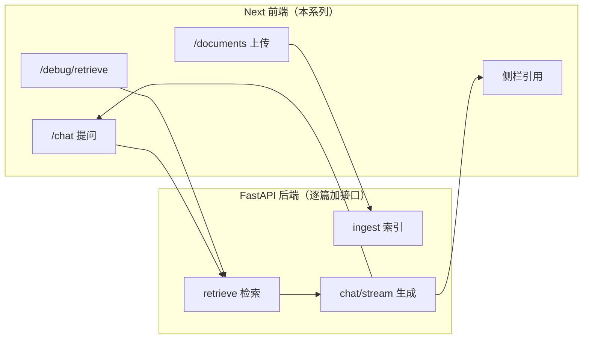
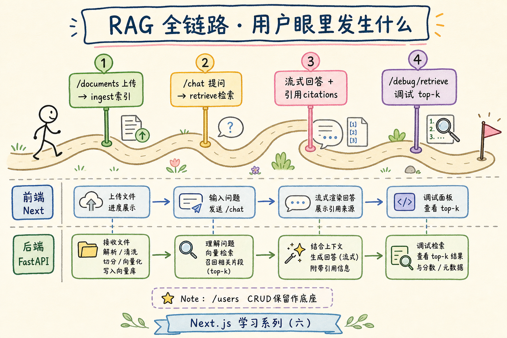
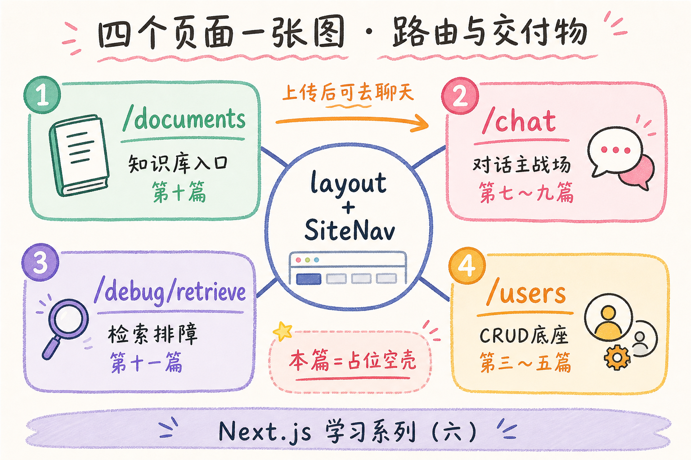
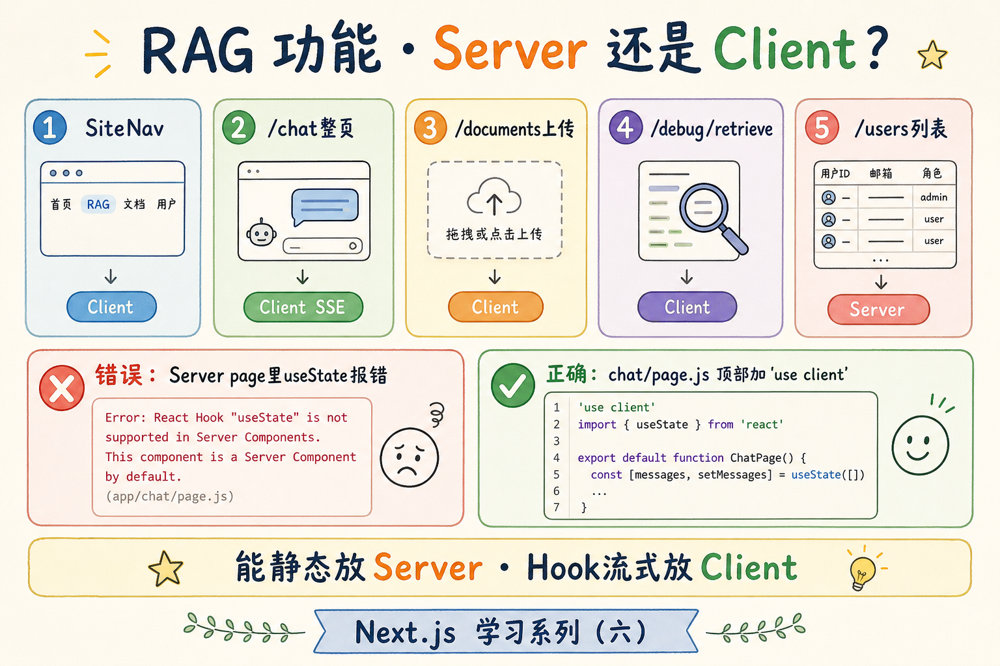

# Next.js 学习系列（六）：RAG 前端地图与工程骨架

> 第五篇你已能用 Next + FastAPI 跑通用户 CRUD——列表、详情、创建都在。但 **RAG 知识库助手** 不是「多几个用户页」：要有**流式聊天**、**Markdown 回答**、**引用溯源**、**文档上传**、**检索调试**。这篇是系列第六篇、也是 **RAG 线起点**：先画清**前端在整条 RAG 链路里站哪**、定好 **路由与目录**、分清 **Server Component 与 `'use client'` 的切分**，在第五篇的 `my-fullstack-next/` 上搭出**可点击跳转的空壳**（第七～十一篇往壳里填肉）。偏概念与能跑通的骨架；流式协议、Markdown 组件、真上传接口分别在后续篇展开。

---

## 目录

1. [前言：CRUD 够了，该搭「知识库助手」壳子](#1-前言crud-够了该搭知识库助手壳子)
2. [RAG 全链路：用户眼里发生什么](#2-rag-全链路用户眼里发生什么)
3. [四个页面一张图：路由与交付物](#3-四个页面一张图路由与交付物)
4. [Server 还是 Client：RAG 功能怎么切](#4-server-还是-clientrag-功能怎么切)
5. [目录树：在第五篇工程上扩展什么](#5-目录树在第五篇工程上扩展什么)
6. [统一 API 根地址：为聊天与文档做准备](#6-统一-api-根地址为聊天与文档做准备)
7. [全局导航：layout 与 SiteNav](#7-全局导航layout-与-sitenav)
8. [占位页面：chat / documents / debug](#8-占位页面chat--documents--debug)
9. [后端接口地图（预告，本篇不实现）](#9-后端接口地图预告本篇不实现)
10. [综合实战：搭骨架并自检四链路由](#10-综合实战搭骨架并自检四链路由)
11. [常见陷阱与 FAQ](#11-常见陷阱与-faq)
12. [总结与系列下一步](#12-总结与系列下一步)

---

## 1. 前言：CRUD 够了，该搭「知识库助手」壳子

第五篇典型延伸问题：

- 用户 CRUD 练熟了，但**不知道 RAG 产品前端该有几页、每页干什么**。
- 听说聊天要 SSE、上传要 `FormData`——想一口气全写进 `page.js`，结果 **`useState` 报错** 或 **流式代码跑在服务器上**。
- 想对照 [React（七）](../react/07.sse-streaming-chat.md) 的 Vite 项目，不确定 Next 里文件该放 `app/` 还是 `components/`。

**RAG**（Retrieval-Augmented Generation，检索增强生成）：先根据用户问题从知识库**检索**相关片段，再把这些片段交给大模型**生成**回答。  
通俗说：答题前先翻资料，再组织语言——减少「瞎编」。

**知识库助手**（本系列前端产品名）：用户能 **上传文档 → 等索引 → 提问 → 看流式回答与引用 →（开发者）调试检索** 的一整套界面。  
通俗说：一个能演示「我们公司文档问答」的 Web 产品，而不只是 Postman 调接口。

读完本文，你应该能做到：

1. 用一张**路由地图**说清 `/chat`、`/documents`、`/debug/retrieve` 与 CRUD `/users` 的关系。
2. 列出 RAG 各功能该用 **Server Component** 还是 **`'use client'`**，并说出理由。
3. 在第五篇的 `frontend/` 上新增 **导航 + 三个占位页 + `lib` 预告文件**，浏览器能点通四条业务链。
4. 对照 [企业 RAG 路线图](../ENTERPRISE_RAG_ROADMAP.md) 阶段 4，标出前端负责的 **F2 #188～199** 落在哪几篇。
5. 说清本篇**不实现**什么，以及第七篇起每篇填哪块肉。

### 1.4 为什么 CRUD 练完还要保留 `/users`

第五篇全栈联调已经「毕业」，第六篇却不删用户模块—— intentional：

| 理由 | 说明 |
|------|------|
| **对照组** | REST 列表/详情/POST 与 RAG 的 SSE、multipart、调试接口形态不同，保留 `/users` 可随时对比 |
| **同一工程习惯** | 真实产品也常是「管理后台 + 业务前台」共处一仓；练会在同一 `layout` 下挂多条业务线 |
| **作品集** | 演示时可走「用户 CRUD 证明全栈底座」→「文档 → 对话」完整路径 |
| **不增加维护成本** | 占位阶段不动 `users/`，只加 `chat/`、`documents/`、`debug/` |

若导航显得挤，可在 `SiteNav` 里把「用户」放最后；**不要删代码**，除非你做极简 demo 且确定不需要 REST 对照。

### 1.5 RAG 术语速查（通俗版）

后面篇章会反复出现这些词，本篇先建卡片：

| 术语 | 通俗说 | 前端要不要实现 |
|------|--------|----------------|
| **Embedding** | 把一段话变成「坐标」，方便算相似度 | 否，后端做 |
| **向量库** | 存坐标的仓库，按相似度找片段 | 否 |
| **分块**（Chunk） | 长文档切成小段再入库 | 否；前端只见进度 |
| **检索**（Retrieve） | 根据问题找最相关的几块 | 结果在聊天引用 / 调试台展示 |
| **Ingest / 索引** | 上传 → 解析 → 切块 → 写入向量库 | 前端只见 `/documents` 状态 |
| **top-k** | 最多取几条片段 | 调试台表格列 |
| **score** | 相似度分数，越高越相关 | 调试台表格列 |
| **SSE** | 服务器边生成边推字 | `/chat` 打字机效果（第七篇） |
| **citation / 引用** | 回答里标注「依据第几段资料」 | 第九篇侧栏 |

你不需要会调模型；只要知道**哪一页展示哪一步的用户感知**。

**前置阅读**：

| 篇章 | 必看内容 |
|------|----------|
| [Next（三）](03.server-client-fetch.md) | Server / Client 分工、§3 对照表 |
| [Next（五）](05.fullstack-next-fastapi.md) | `my-fullstack-next/` 目录、`lib/api.js`、`rewrites` |
| [React（一）ES6+](../react/01.javascript-es6-quickstart.md) | `fetch`、`async/await`（Next 主栈读者必读） |
| [SSE 教程](../7.sse-tutorial.md) | 流式概念（了解即可，第七篇再用） |

**环境**：延续第五篇——Node.js 18+、Python 3.10+、`frontend/` 已能 `/users` CRUD 联调。

### 1.1 本文边界

本篇**不展开**：

- SSE 流式聊天实现（[第七篇](07.sse-streaming-chat.md)）
- Markdown 渲染与 XSS（[第八篇](08.markdown-message-render.md)）
- 引用侧栏 UI（[第九篇](09.citation-source-ui.md)）
- `FormData` 上传与轮询（[第十篇](10.file-upload-index-progress.md)）
- 检索调试台表单与结果表（[第十一篇](11.retrieval-debug-console.md)）
- 向量库、分块、Embedding（路线图阶段 1～3，后端另学）
- TypeScript、TanStack Query（README「进阶可选」，对照 [React（十一）（十二）](../react/README.md)）

目标：**同一仓库、同一 `layout` 导航下，四块 RAG 路由空壳可访问**；代码以「占位 + 注释预告」为主，读者点链接不 404。

### 1.2 项目目录（本篇结束时应达到）

```text
my-fullstack-next/
├── backend/
│   └── main.py                 # 第五篇用户 API；本篇 §9 只加注释预告
└── frontend/
    ├── next.config.js          # 第五篇 rewrites，本篇不改
    ├── .env.local
    └── src/
        ├── lib/
        │   ├── api.js          # 本篇扩展 getApiRoot
        │   ├── fetchJSON.js    # 第五篇已有
        │   ├── users.js        # 第五篇已有
        │   └── sse.js          # 本篇空壳，第七篇实现
        ├── components/
        │   └── SiteNav.js      # 本篇：全局导航（Client）
        └── app/
            ├── layout.js       # 本篇：挂 SiteNav
            ├── page.js         # 首页：链到各模块
            ├── users/...       # 第三～五篇，保留
            ├── chat/
            │   └── page.js     # 占位 → 第七篇
            ├── documents/
            │   └── page.js     # 占位 → 第十篇
            └── debug/
                └── retrieve/
                    └── page.js # 占位 → 第十一篇
```

### 1.3 动手路径

| 步骤 | 做什么 | 章节 |
|------|--------|------|
| 1 | 理解 RAG 用户旅程与四页地图 | §2～§3 |
| 2 | 抄 Server/Client 切分表，避免后面返工 | §4 |
| 3 | 扩展 `lib/api.js`、新建 `lib/sse.js` 空壳 | §6 |
| 4 | 写 `SiteNav` + 改 `layout.js` | §7 |
| 5 | 新建三个占位 `page.js` + 改首页 | §8 |
| 6 | 两终端启动，按自检清单点通路由 | §10 |

**阅读顺序（综合实战 §10 前）**：须先读完 §2～§4（概念），再写 §6～§8 代码。

---

## 2. RAG 全链路：用户眼里发生什么

后端 RAG 完整链路是：上传 → 解析分块 → 向量化 → 检索 → 生成。  
**前端不实现**这些步骤，但要让用户**感知**进度、看到结果。

下面用「用户故事」串起来；读图时看**哪一步对应哪一页**。



对照上图：

| 用户动作 | 前端页 | 后端能力（后续篇加） |
|----------|--------|----------------------|
| 上传 PDF | `/documents` | `POST /api/documents` + 任务状态 |
| 问「报销流程？」 | `/chat` | `POST /api/chat/stream`（SSE） |
| 点引用 [1] | `/chat` 侧栏 | 响应里带 `citations` |
| 查 top-k 是否合理 | `/debug/retrieve` | `POST /api/debug/retrieve` |

**CRUD `/users`** 在本系列里是**练手底座**（第三～五篇），与 RAG **共用**同一 `layout` 和 `backend/`，但业务上可以想成「管理后台用户」——不必删，方便你对照 REST 与 RAG 接口风格。



---

## 3. 四个页面一张图：路由与交付物

本系列 RAG 前端收束时应有 **四条可演示链路**（第十二篇串联）。本篇先保证路由存在。

| 路由 | 系列篇 | 本篇交付 | 后续篇交付 |
|------|--------|----------|------------|
| `/chat` | 7～9 | 占位标题 + 「第七篇实现」 | 流式气泡、Markdown、引用侧栏 |
| `/documents` | 10 | 占位 + 链到 `/chat` | 上传、进度条、文档列表 |
| `/debug/retrieve` | 11 | 占位 + 说明用途 | query 输入、top-k 表格 |
| `/users`… | 3～5 | **已有** | 可选保留作管理示例 |

```text
                    ┌─────────────┐
                    │  layout     │
                    │  SiteNav    │
                    └──────┬──────┘
           ┌───────────────┼───────────────┐
           ▼               ▼               ▼
      /documents        /chat      /debug/retrieve
      知识库入口        对话主战场    开发者排障
           │               │
           └───────► 上传后可去聊天 ◄────┘
```

首页 `/` 建议做成**模块入口**（类似仪表盘），而不是仍显示 `create-next-app` 默认欢迎页——§8.4 给出改法。



与路线图 **F2 前端**对照：

| 路线图条目 | 落在哪篇 |
|------------|----------|
| #188 聊天消息列表 | 第七篇 |
| #189～190 Markdown / 高亮 | 第八篇 |
| #191～192 流式 / 中断 | 第七篇 |
| #193～195 引用 UI | 第九篇 |
| #196～198 上传 / 进度 / 重建 | 第十篇 |
| #199 检索调试台 | 第十一篇 |

本篇只负责：**路由与目录与 Server/Client 边界**——让后续篇有地方落代码。

---

## 4. Server 还是 Client：RAG 功能怎么切

[第三篇](03.server-client-fetch.md) 原则不变：**能静态、能服务端取数的放 Server；要 Hook、事件、流式的放 Client**。

### 4.1 切分总表

| 功能 | 推荐 | 理由 |
|------|------|------|
| 全局导航 `SiteNav` | **Client** | 需要 `usePathname` 高亮当前路由（可选） |
| `/chat` 整页 | **Client** | `useState` 消息列表、SSE、`AbortController` |
| `/documents` 列表首屏 | **Server 或 Client** | 第十篇用轮询，整页 Client 更简单；本篇占位用 Server 即可 |
| `/documents` 上传按钮 | **Client** | `onChange`、进度 state |
| `/debug/retrieve` | **Client** | 表单提交、结果表交互 |
| `/users` 列表 | **Server** | 第三篇已做，保持 |



### 4.2 先错后对：别把聊天写进 Server page

❌ **错误**：在默认 `app/chat/page.js` 里直接写 `useState`：

```jsx
// app/chat/page.js — 没有 'use client'
import { useState } from 'react'

export default function ChatPage() {
  const [messages, setMessages] = useState([]) // 报错
  return <div>...</div>
}
```

预期：构建或运行时报错，提示 Hook 只能在 Client Component 中使用。

✅ **正确**：整页标 Client，或拆成 `ChatPage.js`（Client）被 `page.js` 再 export（两种等价，系列采用**整页 Client** 更直观）：

```jsx
// app/chat/page.js
'use client'

import { useState } from 'react'

export default function ChatPage() {
  const [messages, setMessages] = useState([])
  return (
    <main>
      <h1>对话</h1>
      <p>消息数：{messages.length}（第七篇接 SSE）</p>
    </main>
  )
}
```

### 4.3 组件树预览（第七篇目标形态）

先建立预期，本篇只实现**左侧虚线框**：

```text
layout.js (Server)
└── SiteNav.js ('use client')
└── chat/page.js ('use client')     ← 本篇：仅标题 + 空 state
    └── （第七篇起）
        ├── ChatMessageList
        ├── ChatInput
        └── CitationPanel（第九篇）
```

**Route Handler**（`app/api/chat/route.ts`）作 BFF 代理：本篇**不讲**；默认 **浏览器 `fetch('/api/chat/stream')` + rewrites 直连 FastAPI**，与第五篇用户 API 一致。若生产要藏 API Key，再在进阶里加 BFF。

---

## 5. 目录树：在第五篇工程上扩展什么

在第五篇已存在的 `frontend/src` 上**只新增**，不要新建第二个 Next 项目。

| 路径 | 操作 |
|------|------|
| `components/SiteNav.js` | 新建 |
| `app/layout.js` | 修改：引入 `SiteNav` |
| `app/page.js` | 修改：模块入口 |
| `app/chat/page.js` | 新建 |
| `app/documents/page.js` | 新建 |
| `app/debug/retrieve/page.js` | 新建 |
| `lib/api.js` | 修改：抽出 `getApiRoot` |
| `lib/sse.js` | 新建：空壳导出 |
| `app/users/**` | **不动** |

`components/` 与 `app/` 平级在 `src/` 下，与 [第二篇](02.create-next-app-first-page.md) `src/` 目录约定一致。

---

## 6. 统一 API 根地址：为聊天与文档做准备

第五篇 `getApiBase()` 返回 **用户 API** 根（`/api/users`）。RAG 还会有 `/api/chat/stream`、`/api/documents` 等——若每个文件手写 URL，容易拼错。

演示什么：扩展 `src/lib/api.js`，让 **users** 与 **未来 RAG 接口**共用「API 根」。

前置：第五篇 `lib/api.js`、`lib/fetchJSON.js` 已存在；`.env.local` 有 `API_BASE_URL=http://127.0.0.1:8000`。

```javascript
// src/lib/api.js — 在第五篇基础上扩展

/** 服务端 fetch 用的绝对 API 根，如 http://127.0.0.1:8000/api */
export function getApiRoot() {
  const base = process.env.API_BASE_URL
  if (base) {
    return `${base.replace(/\/$/, '')}/api`
  }
  // 浏览器侧：走 Next rewrites 的相对路径
  return '/api'
}

/** 用户 CRUD（第五篇）— 改为基于 getApiRoot */
export function getApiBase() {
  return `${getApiRoot()}/users`
}
```

预期：`getUsers()` 行为与第五篇一致；`getApiRoot()` 在 Server 上为 `http://127.0.0.1:8000/api`，在浏览器 bundle 里为 `/api`。

### 6.1 `lib/sse.js` 空壳（第七篇实现）

演示什么：先占文件名与导出签名，避免第七篇到处改 import。

```javascript
// src/lib/sse.js
/**
 * 读 SSE 流并逐段回调 — 第七篇实现。
 * @param {Response} res - fetch 返回且 body 未消费
 * @param {(chunk: string) => void} onChunk
 */
export async function readSSEStream(res, onChunk) {
  if (!res.body) {
    throw new Error('响应没有 body，无法读流')
  }
  // 第七篇：getReader() + 解码 data: 行
  void onChunk
  throw new Error('readSSEStream：请读完第七篇后再调用')
}
```

本篇**不要**在页面里调用 `readSSEStream`——调用会故意抛错，提醒阅读顺序。第七篇实现前，**不要** `import { readSSEStream } from '@/lib/sse'` 到任何 `page.js`。

### 6.2 先错或对：API 路径少写 `/api`

❌ `fetch(`${getApiRoot()}/chat/stream`)` 当 `getApiRoot()` 已是 `.../api` 时 → `.../api/chat/stream` ✅  

❌ 若手写 `getApiBase()` 去请求 chat → 路径变成 `.../api/users/chat` —— 张冠李戴。

习惯：**资源名用 `getApiRoot()` + 子路径**，用户集合才用 `getApiBase()`。

---

## 7. 全局导航：layout 与 SiteNav

演示什么：所有 RAG 页与 CRUD 页共用顶栏，点击不 404。

### 7.1 SiteNav（Client）

需要 `usePathname` 时导航文件必须是 Client Component。若只做链接、不做高亮，理论上可放 Server layout；系列统一用 Client，方便第十一篇加「当前页」样式。

前置：`next/link` 在第二篇已学。

```jsx
// src/components/SiteNav.js
'use client'

import Link from 'next/link'
import { usePathname } from 'next/navigation'

const links = [
  { href: '/', label: '首页' },
  { href: '/chat', label: '对话' },
  { href: '/documents', label: '文档' },
  { href: '/debug/retrieve', label: '检索调试' },
  { href: '/users', label: '用户' },
]

export default function SiteNav() {
  const pathname = usePathname()

  return (
    <nav aria-label="主导航" style={{ marginBottom: '1rem' }}>
      {links.map(({ href, label }) => {
        const active = pathname === href || (href !== '/' && pathname.startsWith(href))
        return (
          <span key={href} style={{ marginRight: '0.75rem' }}>
            <Link
              href={href}
              style={{ fontWeight: active ? 'bold' : 'normal' }}
            >
              {label}
            </Link>
          </span>
        )
      })}
    </nav>
  )
}
```

预期：访问 `/chat` 时「对话」加粗；`/users/1` 时「用户」加粗（`startsWith`）。

### 7.2 修改 layout.js

演示什么：在第五篇 layout 上挂导航，保留 `metadata` 与 `globals.css`。

```jsx
// src/app/layout.js
import Link from 'next/link'
import SiteNav from '../components/SiteNav.js'
import './globals.css'

export const metadata = {
  title: '知识库助手',
  description: 'Next.js RAG 全栈练习',
}

export default function RootLayout({ children }) {
  return (
    <html lang="zh-CN">
      <body>
        <header>
          <p>
            <strong>知识库助手</strong>
            <span style={{ marginLeft: '0.5rem', color: '#666' }}>
              Next 系列练习
            </span>
          </p>
          <SiteNav />
        </header>
        <main style={{ padding: '0 1rem 2rem' }}>{children}</main>
      </body>
    </html>
  )
}
```

若 layout 里未使用的 `import Link` 触发 lint，删掉即可——导航已在 `SiteNav` 内。

---

## 8. 占位页面：chat / documents / debug

每个占位页须：**标题 + 一句话说明 + 链到相关页**。本篇不要求调 API。

### 8.1 `/chat` — Client 占位

```jsx
// src/app/chat/page.js
'use client'

import Link from 'next/link'
import { useState } from 'react'

export default function ChatPage() {
  const [messages] = useState([])

  return (
    <section>
      <h1>对话</h1>
      <p>
        这里将接入 <strong>SSE 流式问答</strong>（第七篇）。
        当前消息数：{messages.length}
      </p>
      <p>
        还没有文档？先去 <Link href="/documents">文档管理</Link> 上传。
      </p>
    </section>
  )
}
```

### 8.2 `/documents` — Server 占位

演示什么：默认 Server Component，第十篇再加 Client 上传子组件。

```jsx
// src/app/documents/page.js
import Link from 'next/link'

export default function DocumentsPage() {
  return (
    <section>
      <h1>文档与知识库</h1>
      <p>
        这里将接入 <strong>文件上传与索引进度</strong>（第十篇）。
      </p>
      <p>
        索引完成后，去 <Link href="/chat">对话页</Link> 提问。
      </p>
    </section>
  )
}
```

### 8.3 `/debug/retrieve` — Client 占位

```jsx
// src/app/debug/retrieve/page.js
'use client'

export default function RetrieveDebugPage() {
  return (
    <section>
      <h1>检索调试</h1>
      <p>
        开发者工具：输入 query，查看 <strong>top-k 片段与 score</strong>（第十一篇）。
      </p>
      <p style={{ color: '#666' }}>
        用于判断「检索漏了」还是「生成胡编」——先修检索再怪模型。
      </p>
    </section>
  )
}
```

### 8.4 首页 `/` — 模块入口

```jsx
// src/app/page.js
import Link from 'next/link'

const modules = [
  { href: '/documents', title: '文档', desc: '上传 PDF / Markdown，等待索引' },
  { href: '/chat', title: '对话', desc: '流式问答与引用溯源' },
  { href: '/debug/retrieve', title: '检索调试', desc: '查看 top-k 与相似度分数' },
  { href: '/users', title: '用户 CRUD', desc: '第三～五篇 REST 练习' },
]

export default function HomePage() {
  return (
    <section>
      <h1>知识库助手</h1>
      <p>RAG 前端骨架已就绪，按模块进入：</p>
      <ul>
        {modules.map((m) => (
          <li key={m.href} style={{ marginBottom: '0.75rem' }}>
            <Link href={m.href}>{m.title}</Link>
            <span> — {m.desc}</span>
          </li>
        ))}
      </ul>
    </section>
  )
}
```

---

## 9. 后端接口地图（预告，本篇不实现）

前端骨架搭好后，第七～十一篇会**逐段**在 `backend/main.py` 加路由。本篇只在文件顶或注释块记「契约」，**不必**实现。

| 方法 | 路径 | 篇 | 作用 |
|------|------|-----|------|
| `POST` | `/api/chat/stream` | 7 | SSE 流式回答 |
| `POST` | `/api/documents` | 10 | multipart 上传 |
| `GET` | `/api/documents` | 10 | 文档列表 |
| `GET` | `/api/documents/{id}` | 10 | 单文档 + 任务状态 |
| `POST` | `/api/debug/retrieve` | 11 | 返回 top-k chunks |

在 `main.py` 末尾可加：

```python
# --- RAG 接口预告（第六篇仅注释，第七篇起实现）---
# POST /api/chat/stream     -> SSE
# POST /api/documents       -> UploadFile
# GET  /api/documents/{id}  -> 任务状态 pending|running|done|failed
# POST /api/debug/retrieve  -> {"query","top_k"} -> chunks[]
```

**Ingest**（入库）：后端把文件解析、分块、写入向量库；前端只在 `/documents` 看状态。  
通俗说：厨房在后厨，前台只显示「处理中 / 已完成」。

### 9.1 后端流水线（前端视角，仍不实现）

用一段话把「用户上传 PDF 到能提问」串起来——实现都在后端，但**排障时要心里有这张图**：

```text
POST /api/documents（multipart）
  → 存文件、创建任务 id
  → 后台任务：解析 PDF → 分块 → Embedding → 写入向量库
  → GET /api/documents/{id} 返回 status: pending → running → done

用户去 /chat 提问
  → POST /api/chat/stream（SSE）
  → 后端：问题 Embedding → 向量库 top-k → 拼 prompt → 模型流式输出
  → 前端：逐字显示 + citations 数组（第九篇）

开发者怀疑「检索错了」
  → POST /api/debug/retrieve
  → 直接看 top-k 片段与 score，不经过生成模型
```

第十篇让你看见 **pending/running/done**；第七～九篇让你看见 **流式与引用**；第十一篇让你看见 **top-k 表格**。本篇只保证**路由存在**，避免第七篇还在争论 `app/chat` 放哪。

---

## 10. 综合实战：搭骨架并自检四链路由

### 10.1 阅读顺序

动手前确认已读完：**§2～§4**（地图与切分）、**§6～§8**（代码）。

沿用第五篇：

| 沿用项 | 来自 |
|--------|------|
| `next.config.js` rewrites | 第五篇 §5 |
| `.env.local` `API_BASE_URL` | 第五篇 §6 |
| `lib/fetchJSON.js`、`lib/users.js` | 第三、五篇 |
| `/users` 三页 | 第三～五篇 |

### 10.2 两个终端启动

```bash
# 终端 1 — backend/
uvicorn main:app --reload --port 8000

# 终端 2 — frontend/
npm run dev
```

浏览器打开 `http://localhost:3000`。

### 10.3 自检清单

- [ ] 顶栏有五个链接，无控制台报错  
- [ ] `/` 列出四个模块，链接均可点  
- [ ] `/chat` 显示「消息数：0」，无 Hook 报错  
- [ ] `/documents`、`/debug/retrieve` 有说明文字  
- [ ] `/users` 列表仍正常（第五篇联调未回退）  
- [ ] `getApiRoot()` 在 `lib/api.js` 已存在；`getUsers` 仍正常  
- [ ] 未调用 `readSSEStream`（或调用会抛「第七篇」提示）

### 10.4 建议演示顺序（面试/作品集）

```text
首页 → 文档（说明即将上传）→ 对话（空壳）→ 检索调试 → 用户 CRUD（证明全栈底座仍在）
```

第十二篇会把此顺序做成「可演示业务流」；本篇只需**路由通**。

### 10.5 从 CRUD 到 RAG：心智切换三句话

第五篇你还在想 **REST 动词 + Server fetch + Server Action**；第六篇起多记三句：

1. **长连接与流式**在 Client（`/chat`），不要塞进 Server page 的 `await`。  
2. **上传与轮询**在 `/documents`，进度是 state，不是 `loading.js` 能单独解决的。  
3. **调试接口**给开发者看 raw 检索结果，产品 UI 可藏入口，但路由要先留 `/debug/retrieve`。

带着这三句进第七篇，少踩「把 SSE 写进 async page」的坑。

### 10.6 与 React（七）Vite 项目的文件对照

若你并行开着 [React（七）](../react/07.sse-streaming-chat.md) 的 Vite 仓库，可这样对照迁移心智（第七篇会细写）：

| Vite + React Router | Next 本系列 |
|---------------------|-------------|
| `src/pages/Chat.jsx` 或路由表 | `app/chat/page.js` |
| `utils/readSSEStream.js` | `lib/sse.js` |
| `vite.config` proxy `/api` | `next.config` rewrites |
| 整页 `'use client'` 常见 | `/chat` 整页 Client |

**逻辑可抄，路径要改**——不要在 Next 里再建 `src/pages/`（那是 Pages Router 老习惯）。

### 10.7 占位页样式统一（可选）

四张占位页可用同一 class，便于第十二篇串联时视觉一致。在 `globals.css` 追加：

```css
.placeholder-hint {
  color: #666;
  font-size: 0.95rem;
  margin-top: 0.5rem;
}
```

各 `page.js` 里说明段用 `className="placeholder-hint"`——与第三篇 `.status` 一样，是小成本的专业感。

### 10.8 第六篇完成后你应具备的能力陈述

用 checklist 对照「能力」而非「代码行数」：

- [ ] 能不看文档说出四个 RAG 路由各自用途  
- [ ] 能解释为何 `/chat` 必须 `'use client'`  
- [ ] 能指出 `getApiRoot()` 与 `getApiBase()` 区别  
- [ ] 能在同一 `layout` 下从 `/` 点进四模块且 `/users` 仍 CRUD 正常  
- [ ] 能说出第七～十一篇各填哪块、本篇 deliberately 不实现什么  

全部打勾再开第七篇——否则 SSE 与上传会挤在错误的文件边界里返工。

### 10.9 企业路线图阶段 4 与本系列对齐（展开）

[企业 RAG 路线图](../ENTERPRISE_RAG_ROADMAP.md) **阶段 4 应用层**强调「用户能用的产品界面」，而非只有 API。本系列 6～12 对应 **F2 前端能力**的落地顺序：

| 产品能力 | 用户可感知 | 系列篇 |
|----------|------------|--------|
| 能问问题 | 打字、看流式字蹦出来 | 7 |
| 能读格式 | 标题、列表、代码块不乱 | 8 |
| 能信答案 | 点引用看原文 | 9 |
| 能喂资料 | 上传、看进度 | 10 |
| 能排障 | 开发者看 top-k | 11 |
| 能演示 | 全链路点得通 | 12 |

本篇（六）不实现上表任何一行——只保证**路由与工程边界**先对齐路线图，避免做到第十篇才发现 `/documents` 路径与团队约定不一致。

### 10.10 SiteNav 与可访问性（小但专业）

§7 的 `SiteNav` 已加 `aria-label="主导航"`。后续可加：

- 当前页 `aria-current="page"`（与 `usePathname` 配合）  
- 键盘 Tab 能走遍链接  
- 不要只用颜色区分当前页（已用 `fontWeight`）

RAG 产品常要演示给业务方看——导航可读性影响第一印象，占位阶段就养成习惯，比第十二篇临改省事。

### 10.11 第六篇 backend 要不要改？

**本篇可以不改 `main.py` 逻辑**——只在文件末尾加 §9 的注释预告即可。  
`uvicorn` 仍只需提供用户 CRUD 三接口；第七篇才在 backend 加最小 `POST /api/chat/stream` 桩。  
若你手痒想先加空路由返回 `501 Not Implemented`，也可以，但**别让未完成接口阻塞** `/users` 联调。

### 10.12 从第五篇直接进入第六篇的检查

- [ ] 第五篇列表 2 人、新建变 3 人仍正常  
- [ ] `frontend/` 与 `backend/` 已在同一 `my-fullstack-next/`  
- [ ] 你接受「接下来几篇 backend 会越长越大」——与路线图阶段 4 一致  

以上都打勾再改 `layout` 加 `SiteNav`，避免 RAG 骨架搭在仍指向 JSONPlaceholder 的工程上。

### 10.13 四个占位页的「用户一句话」

演示时每一页用一句台词介绍用途，第十二篇串联时会复用：

| 路由 | 台词示例 |
|------|----------|
| `/documents` | 「在这里上传公司文档，等索引完成。」 |
| `/chat` | 「在这里向知识库提问，回答会流式出现。」 |
| `/debug/retrieve` | 「在这里看检索到了哪几段，分数多少。」 |
| `/users` | 「这是前几篇练的 REST 用户管理底座。」 |

占位页文字可改成你的业务用语，但**路由名建议与系列一致**，否则后面复制第七～十一篇代码时路径对不上。

第七篇将在 `backend/main.py` 增加最小 SSE 桩，并在 `lib/sse.js` 实现 `readSSEStream`——本篇空壳 deliberately 不调用，避免未读教程就踩运行时错误。读完可打开 [第七篇](07.sse-streaming-chat.md) 继续。骨架篇的目标是让后续五篇「只填功能、不搬路由」。

---

## 11. 常见陷阱与 FAQ

### 11.1 陷阱一：在 Server `page.js` 里写 `onClick`

❌ 默认 Server 组件不能绑浏览器事件。  
✅ 加 `'use client'` 或拆到 Client 子组件。

### 11.2 陷阱二：删除 `/users` 以为 RAG 不需要

CRUD 是**对照组**：REST 列表/详情/POST 与 RAG 的流式/上传接口风格不同，保留便于学。作品集可隐藏导航里「用户」链接，但建议保留代码。

### 11.3 陷阱三：`debug` 路由少一层文件夹

Next 文件路由：`app/debug/retrieve/page.js` → URL 是 **`/debug/retrieve`**，不是 `/retrieve`。  
❌ `app/retrieve/page.js` 会变成 `/retrieve`，与系列约定不一致。

### 11.4 陷阱四：新建第二个 Next 项目做 RAG

❌ `my-rag-app` 与 `my-fullstack-next` 并存——rewrites、`.env` 要维护两份。  
✅ 始终在第五篇 `frontend/` **累积**。

### 11.5 FAQ

**Q：占位页要不要调后端？**  
A：本篇不要。第七篇先在 `main.py` 加最小 `/api/chat/stream`，再改 `/chat`。

**Q：/documents 为什么先用 Server，chat 必须 Client？**  
A：第十篇上传前列表可服务端拉；聊天**一定**要 Hook 与流式，整页 Client 最省事。也可 tenth 篇再拆 `UploadForm.js` (Client)。

**Q：和 React（七）的 Vite 项目是什么关系？**  
A：交互概念相同；Next 用 `app/` 文件路由代替 `react-router`，用 `'use client'` 标边界。可对照 [React（七）](../react/07.sse-streaming-chat.md) 的 `readSSEStream` 逻辑，第七篇会迁到 `lib/sse.js`。

**Q：何时用 Route Handler 代替 rewrites？**  
A：需要隐藏 API Key、改 Cookie、或在 Edge 跑代理时。本系列默认 rewrites + FastAPI，与第五篇一致。

**Q：骨架要加 TypeScript 吗？**  
A：本篇仍用 JS，与系列 1～5 一致；类型见 README 进阶与 React（十一）。

### 11.6 第六篇搭完后的「空壳演示词」

向别人演示骨架时，可以照读（1 分钟）：

> 「这是同一套 Next + FastAPI 工程。左边导航：文档页以后管上传，对话页接 SSE 流式问答，检索调试给开发者看 top-k。用户 CRUD 是前几篇练的 REST 底座。现在路由都通了，第七篇开始在 `/chat` 接真流式。」

---

## 12. 总结与系列下一步

### 12.1 概念速记

| 概念 | 一句话 |
|------|--------|
| RAG 前端四页 | `/documents` → `/chat` + 引用 → `/debug/retrieve` |
| Server | 默认 page、文档静态说明、users 列表 |
| Client | 聊天、上传交互、调试表单、SiteNav 高亮 |
| `getApiRoot()` | 统一 `/api` 前缀，防路径拼错 |
| 累积工程 | 第五篇 `frontend/` 上只增不改删 users |

### 12.2 决策树

```text
新功能加在哪？
├─ 要 useState / 流式 / 文件选择 → 'use client' 组件或 page
├─ 只展示服务端拉取的一次性列表 → Server page（第十篇列表可选）
└─ 只是站内跳转说明 → Server page 占位即可

API 路径怎么拼？
├─ 用户 → getApiBase() 即 .../api/users
└─ 其他 RAG → getApiRoot() + '/chat/stream' 等
```

### 12.3 系列 RAG 篇地图

| 篇 | 主题 | 填哪块肉 |
|----|------|----------|
| **六（本篇）** | 地图 + 骨架 | 路由、导航、lib 预告 |
| [七](07.sse-streaming-chat.md) | SSE 流式对话 | `/chat` + `lib/sse.js` |
| [八](08.markdown-message-render.md) | Markdown | 消息气泡渲染 |
| [九](09.citation-source-ui.md) | 引用溯源 | 侧栏原文 |
| [十](10.file-upload-index-progress.md) | 上传与进度 | `/documents` |
| [十一](11.retrieval-debug-console.md) | 检索调试 | `/debug/retrieve` |
| [十二](12.ship-rag-frontend.md) | 收官 | 串联 + 部署概念 |

### 12.4 下一步

打开 [第七篇：SSE 流式对话与 AbortController](07.sse-streaming-chat.md)，在 `/chat` 接入 `POST /api/chat/stream`，实现 `readSSEStream` 与打字机效果。

---

> **系列定位**：本篇是 RAG 线的「施工图」——不追求功能完整，追求**后面五篇不用搬路由、不用争论 Client/Server**。骨架搭好后，建议按 7 → 8 → 9 → 10 → 11 顺序推进，不要跳篇做上传却还没有聊天页。
