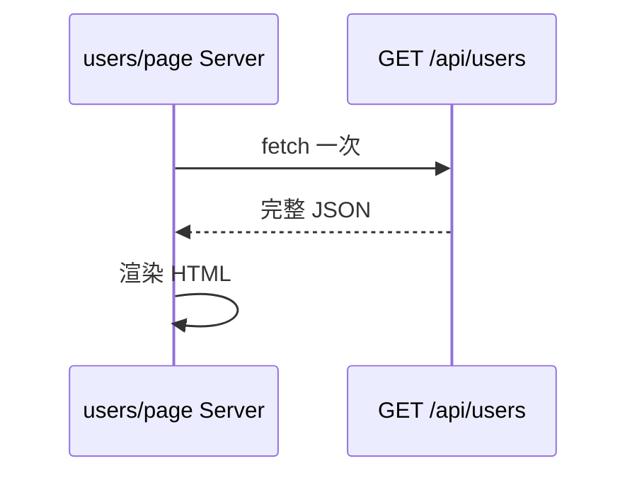
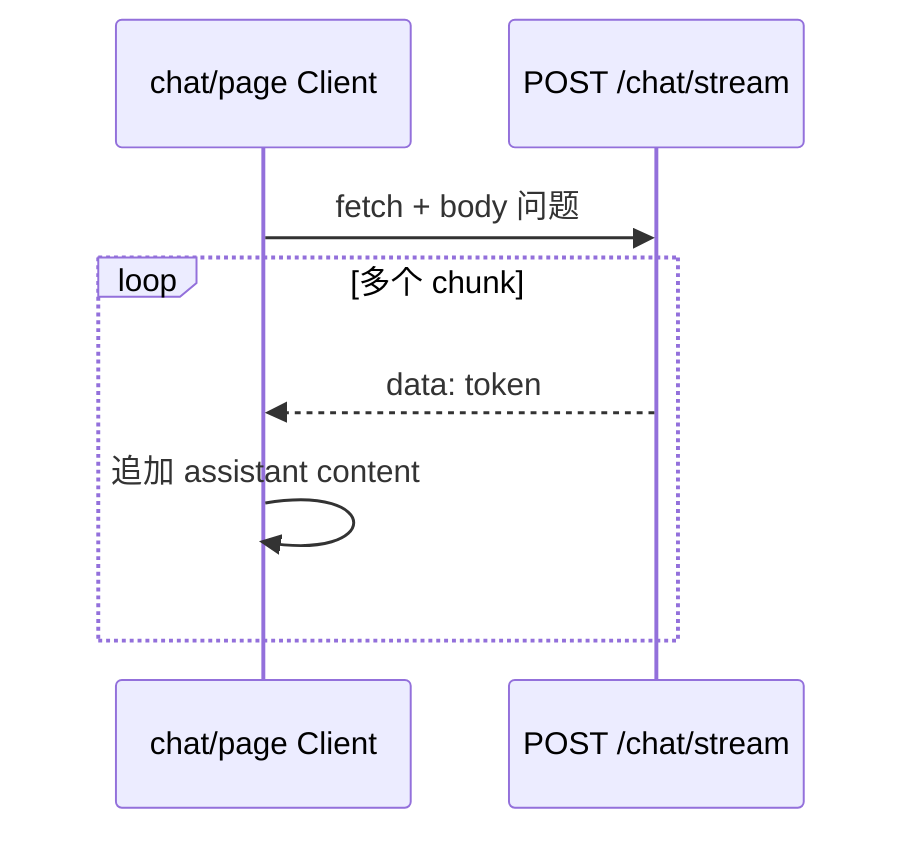

# Next.js 学习系列（七）：SSE 流式对话与 AbortController

> [第六篇](06.rag-frontend-skeleton.md) 你在 `/chat` 留了占位页，并约定聊天必须是 **`'use client'`**。大模型回答往往要**边生成边显示**——若等整段 JSON 再渲染，用户会盯着空白等好几秒。这篇是系列第七篇：认识 **流式响应** 与 **SSE**（Server-Sent Events，服务端推送事件），在 FastAPI 加 **`POST /api/chat/stream`**，在 Next 里用 `fetch` + **`ReadableStream`** 实现打字机效果，用 **`AbortController`** 停止生成。偏概念与能跑通的步骤；Markdown 见 [第八篇](08.markdown-message-render.md)，引用见 [第九篇](09.citation-source-ui.md)。概念可对照 [React（七）](../react/07.sse-streaming-chat.md)，本篇路径与组件拆分按 **Next App Router** 写法。

---

## 目录

1. [前言：占位页该接真流式了](#1-前言占位页该接真流式了)
2. [一次性 JSON vs 流式：为何聊天不用 res.json()](#2-一次性-json-vs-流式为何聊天不用-resjson)
3. [SSE 长什么样：服务端边算边推](#3-sse-长什么样服务端边算边推)
4. [后端：在 main.py 加流式接口](#4-后端在-mainpy-加流式接口)
5. [前端：实现 lib/sse.js 读流](#5-前端实现-libssejs-读流)
6. [AbortController：停止生成](#6-abortcontroller停止生成)
7. [聊天 UI：消息列表与逐字追加](#7-聊天-ui消息列表与逐字追加)
8. [useRef：新字出来时滚到底部](#8-useref新字出来时滚到底部)
9. [综合实战：填满 /chat 页面](#9-综合实战填满-chat-页面)
10. [与第五篇联调：rewrites 与排错](#10-与第五篇联调rewrites-与排错)
11. [常见陷阱与 FAQ](#11-常见陷阱与-faq)
12. [总结与系列下一步](#12-总结与系列下一步)

---

## 1. 前言：占位页该接真流式了

第六篇典型卡点：

- `/chat` 只有标题，`readSSEStream` 一调用就抛「请读完第七篇」。
- 不确定流式请求该写 **`useEffect` 还是点发送时 `fetch`**。
- 用户点「停止」后字还在涨——**没绑 `AbortController`**，或两条 assistant **串台**。

**流式响应**（Streaming Response）：服务器不一次性返回完整 body，而是**分多次**推送片段。  
通俗说：不是等整桌菜上完再吃，而是**做好一道上一道**。

**SSE**（Server-Sent Events，服务端推送事件）：基于 HTTP 的流式文本格式，常见 `Content-Type: text/event-stream`，正文多行 `data: ...`。  
通俗说：服务器**广播**，浏览器**只收**——适合模型逐字输出。

读完本文，你应该能做到：

1. 说清「`await res.json()`」与「读 `res.body` 流」的区别，以及为何 RAG 聊天选后者。
2. 在第五篇 `backend/main.py` **并存** `POST /api/chat/stream`，用 `curl -N` 看到分段 `data:`。
3. 实现 [第六篇](06.rag-frontend-skeleton.md) 预留的 **`lib/sse.js`**，替换抛错空壳。
4. 在 **`app/chat/page.js`**（Client）完成「输入 → 逐字 assistant → 停止」，经 **`/api/chat/stream`** 走 Next **rewrites**。
5. 用 **`useRef`** 在消息变长时滚到底部。

**前置阅读**：

| 篇章 | 必看内容 |
|------|----------|
| [Next（五）](05.fullstack-next-fastapi.md) | `rewrites`、`API_BASE_URL`、双终端 |
| [Next（六）](06.rag-frontend-skeleton.md) | `/chat` 占位、`getApiRoot()`、`lib/sse.js` 空壳 |
| [React（一）ES6+](../react/01.javascript-es6-quickstart.md) | `fetch`、`async/await` |
| [SSE 教程](../7.sse-tutorial.md) | 协议背景（可选） |

**环境**：Node.js 18+、Python 3.10+、第六篇骨架已搭好。

### 1.1 本文边界

本篇**不展开**：

- `react-markdown`、代码高亮（[第八篇](08.markdown-message-render.md)）
- 引用卡片、`citations` 字段（[第九篇](09.citation-source-ui.md)）
- 真 OpenAI / DeepSeek API Key（用本地模拟流）
- Route Handler 代理流（默认 **浏览器 `fetch('/api/...')` + rewrites**，与第五篇一致）
- Server Component 里拉流（**不支持**——流式必须在 Client）

目标：**两个终端，在 `/chat` 能「提问 → 逐字出答 → 点停止」**。

### 1.2 动手路径

| 步骤 | 做什么 | 章节 |
|------|--------|------|
| 1 | `curl` 或 `/docs` 认 SSE 格式 | §3～§4 |
| 2 | 实现 `lib/sse.js` | §5 |
| 3 | 加 `AbortController` 与停止按钮 | §6 |
| 4 | `messages` state + `ChatMessage` | §7～§8 |
| 5 | 拼满 `app/chat/page.js` 并联调 | §9～§10 |

### 1.3 本篇结束后的目录

```text
frontend/src/
├── lib/
│   ├── api.js          # 第六篇 getApiRoot
│   └── sse.js          # 本篇实现 readSSEStream
├── components/
│   ├── SiteNav.js
│   ├── ChatMessage.js  # 本篇
│   └── ChatInput.js    # 本篇
└── app/
    └── chat/
        └── page.js     # 本篇：'use client' 整页逻辑
```

---

## 2. 一次性 JSON vs 流式：为何聊天不用 res.json()

[第三篇](03.server-client-fetch.md) 用户列表模式：



读图时看：**一次请求、一块数据**——适合 CRUD。

聊天模式：



对照上图：同一次 HTTP 连接里 body **分多次到达**；每次 `setState`，用户先看到开头。

| 对比项 | 第三篇 `fetchJSON` | 本篇流式 |
|--------|-------------------|----------|
| 典型 API | `GET /api/users` | `POST /api/chat/stream` |
| 取数 | `await res.json()` | `res.body.getReader()` 循环 |
| 在 Next 哪跑 | Server Component 常见 | **必须 Client**（`useState` 高频更新） |
| 取消 | 关页即可 | 应提供 **AbortController** |

### 2.1 什么时候不必上流式

- 列表、详情、短 POST 回执 → 继续第三、四篇写法。
- 双向高频（协同编辑）→ 常选 WebSocket（本篇不展开）。
- 无人在线看的后台任务 → 可不做流式 UI。

---

## 3. SSE 长什么样：服务端边算边推

演示什么：认 SSE 正文格式。前置：无。

```text
data: {"token": "你"}

data: {"token": "好"}

```

预期：客户端按 `\n\n` 切事件，从 `data: ` 行解析 JSON，取出 `token` 拼接。

| 项目 | 一次性 JSON | SSE 流 |
|------|-------------|--------|
| Content-Type | `application/json` | `text/event-stream` |
| 前端解析 | `JSON.parse` 一次 | 循环读 chunk + 按行拆 |
| POST 带问题 | 常见 | **本篇用法**（故用 `fetch` 读流，不用仅支持 GET 的 `EventSource`） |

**EventSource**（浏览器 API）：只对 **GET** URL 订阅 SSE。  
通俗说：专用收音机只能听 GET 台。聊天要把问题 **POST** 上去，所以本篇用 **`fetch` + ReadableStream**。

---

## 4. 后端：在 main.py 加流式接口

演示什么：在第五篇用户 API **同文件**增加模拟流式接口，不调用真 LLM。  
前置：第五篇 `backend/main.py` 已有 `/api/users`。

在文件顶部确保有：

```python
import asyncio
import json
from fastapi.responses import StreamingResponse
from pydantic import BaseModel
```

在现有 `app = FastAPI(...)` 与用户路由**之后**追加：

```python
class ChatRequest(BaseModel):
    message: str


async def fake_llm_stream(user_message: str):
    """模拟大模型：逐字推送 SSE。"""
    reply = f"收到你的问题：「{user_message}」。这是模拟流式回答，每个字单独推送。"
    for char in reply:
        yield f"data: {json.dumps({'token': char}, ensure_ascii=False)}\n\n"
        await asyncio.sleep(0.05)


@app.post("/api/chat/stream")
async def chat_stream(body: ChatRequest):
    return StreamingResponse(
        fake_llm_stream(body.message),
        media_type="text/event-stream",
        headers={
            "Cache-Control": "no-cache",
            "Connection": "keep-alive",
            "X-Accel-Buffering": "no",
        },
    )
```

**StreamingResponse**（FastAPI 流式响应）：把异步生成器边产边发给客户端。  
通俗说：水管对接，有水就流，不攒满一桶再倒。

### 4.1 自测

```bash
cd backend
uvicorn main:app --reload --port 8000
```

```bash
curl -N -X POST http://localhost:8000/api/chat/stream \
  -H "Content-Type: application/json" \
  -d "{\"message\":\"什么是RAG\"}"
```

预期：终端连续出现多行 `data: {"token": "收"}`，而非一行大 JSON。  
`curl` 的 **`-N`** 关闭缓冲，否则可能等很久才显示。

---

## 5. 前端：实现 lib/sse.js 读流

第六篇留了空壳，本篇**整文件替换**。

演示什么：从 `Response` 解析 SSE 的 `token`，每收到一个调用 `onToken`。  
前置：用户**点击发送**时调用；不要写在 `useEffect([], [])` 里。

### 5.1 先错后对：对流式响应调 json()

```javascript
// ❌ 会等到流结束才返回，失去「边收边显」
const data = await res.json()

// ✅ 读字节流
const reader = res.body.getReader()
```

### 5.2 readSSEStream 完整实现

```javascript
// src/lib/sse.js

/**
 * 读 POST 返回的 SSE 流，每解析出一个 token 调用 onToken(token)。
 * @param {Response} res
 * @param {(token: string) => void} onToken
 */
export async function readSSEStream(res, onToken) {
  if (!res.ok) {
    const text = await res.text().catch(() => '')
    throw new Error(text || `HTTP ${res.status}`)
  }
  if (!res.body) {
    throw new Error('当前环境不支持流式响应 body')
  }

  const reader = res.body.getReader()
  const decoder = new TextDecoder()
  let buffer = ''

  while (true) {
    const { done, value } = await reader.read()
    if (done) break
    buffer += decoder.decode(value, { stream: true })

    const parts = buffer.split('\n\n')
    buffer = parts.pop() ?? ''

    for (const part of parts) {
      const line = part.split('\n').find((l) => l.startsWith('data: '))
      if (!line) continue
      const jsonStr = line.slice('data: '.length).trim()
      if (jsonStr === '[DONE]') continue
      try {
        const payload = JSON.parse(jsonStr)
        if (payload.token) onToken(payload.token)
      } catch {
        onToken(jsonStr)
      }
    }
  }
}
```

**ReadableStream**（可读流）：`res.body.getReader()` 每次读一块字节。  
通俗说：舀一勺处理一勺，不用等池子满。

**TextDecoder** 的 `stream: true`：多段 UTF-8 可能跨 chunk，半个汉字等下一块再解码。

**buffer + `\n\n`**：一次 `read()` 可能只拿到半行，先拼 buffer 再按 SSE 事件边界切。

### 5.3 请求 URL

Client 组件里用第六篇的 **`getApiRoot()`**：

```javascript
import { getApiRoot } from '../lib/api.js'

const url = `${getApiRoot()}/chat/stream`
// 浏览器 bundle 内通常为 '/api/chat/stream' → 第五篇 rewrites → :8000
```

| 场景 | 用啥 |
|------|------|
| 用户列表、创建 | `fetchJSON` + `getApiBase()` |
| 聊天流式 | `fetch` + `readSSEStream` + `getApiRoot()` |

---

## 6. AbortController：停止生成

**AbortController**（中止控制器）：把 **`signal`** 传给 `fetch`，调用 **`abort()`** 可取消请求。  
通俗说：给这次请求系上「急刹车」。

副作用：**`abort()` 会让 `fetch` 与 `reader.read()` 抛出 `AbortError`**——要在 `catch` 里区分用户主动停止与真错误。

```javascript
const controller = new AbortController()

const res = await fetch(url, {
  method: 'POST',
  headers: { 'Content-Type': 'application/json' },
  body: JSON.stringify({ message: userText }),
  signal: controller.signal,
})

// 停止按钮
controller.abort()
```

先错或对：

```javascript
// ❌ 组件外只 new 一次，多次发送共用一个 controller
// ✅ 每次发送 new 一个；isStreaming 时禁用再发
```

---

## 7. 聊天 UI：消息列表与逐字追加

### 7.1 消息结构

```javascript
// { id, role: 'user' | 'assistant', content: string }
const [messages, setMessages] = useState([])
```

### 7.2 发送流程

演示什么：先插入 user + 空 assistant，流式只更新 **assistantId** 那条。  
前置：§5、§6。

```javascript
async function handleSend() {
  if (!input.trim() || isStreaming) return
  const userText = input.trim()
  setInput('')
  setIsStreaming(true)
  setError(null)

  const assistantId = crypto.randomUUID()
  setMessages((prev) => [
    ...prev,
    { id: crypto.randomUUID(), role: 'user', content: userText },
    { id: assistantId, role: 'assistant', content: '' },
  ])

  const controller = new AbortController()
  setAbortController(controller)

  try {
    const res = await fetch(`${getApiRoot()}/chat/stream`, {
      method: 'POST',
      headers: { 'Content-Type': 'application/json' },
      body: JSON.stringify({ message: userText }),
      signal: controller.signal,
    })
    await readSSEStream(res, (token) => {
      setMessages((prev) =>
        prev.map((m) =>
          m.id === assistantId ? { ...m, content: m.content + token } : m
        )
      )
    })
  } catch (err) {
    if (err.name !== 'AbortError') setError(err.message)
  } finally {
    setAbortController(null)
    setIsStreaming(false)
  }
}
```

**函数式更新** `setMessages(prev => ...)`：流式回调很快，用 `prev` 避免闭包过期。  
**不可变更新**：`{ ...m, content: m.content + token }`，不要 `m.content += token`。

### 7.3 ChatMessage 组件

```jsx
// src/components/ChatMessage.js

export default function ChatMessage({ role, content }) {
  const isUser = role === 'user'
  return (
    <div
      style={{
        display: 'flex',
        justifyContent: isUser ? 'flex-end' : 'flex-start',
        marginBottom: 8,
      }}
    >
      <div
        style={{
          maxWidth: '80%',
          padding: '8px 12px',
          borderRadius: 12,
          background: isUser ? '#2563eb' : '#e5e7eb',
          color: isUser ? '#fff' : '#111',
          whiteSpace: 'pre-wrap',
        }}
      >
        {content || (isUser ? '' : '…')}
      </div>
    </div>
  )
}
```

本篇用纯文本气泡；[第八篇](08.markdown-message-render.md) 再把 assistant 换成 Markdown。

### 7.4 ChatInput 组件

```jsx
// src/components/ChatInput.js

export default function ChatInput({
  value,
  onChange,
  onSend,
  onStop,
  isStreaming,
}) {
  return (
    <div style={{ display: 'flex', gap: 8, marginTop: 12 }}>
      <textarea
        value={value}
        onChange={(e) => onChange(e.target.value)}
        rows={2}
        style={{ flex: 1 }}
        placeholder="输入问题…"
        disabled={isStreaming}
      />
      {isStreaming ? (
        <button type="button" onClick={onStop}>
          停止
        </button>
      ) : (
        <button type="button" onClick={onSend} disabled={!value.trim()}>
          发送
        </button>
      )}
    </div>
  )
}
```

| UI 状态 | 表现 |
|---------|------|
| `idle` | 可输入、可发送 |
| `isStreaming` | 发送变停止；assistant 条变长 |
| `error` | 页顶或输入上方红字 |

不必套第三篇整页 `loading`——用户气泡**立刻**出现，只有 assistant 在「边写边显」。

---

## 8. useRef：新字出来时滚到底部

**useRef**（引用 Hook）：`ref.current` 改动**不触发**重渲染，适合记 DOM 节点。  
通俗说：便签纸贴组件上，记「列表底部在哪」。

```jsx
import { useEffect, useRef } from 'react'

const bottomRef = useRef(null)

useEffect(() => {
  bottomRef.current?.scrollIntoView({ behavior: 'smooth' })
}, [messages])

// JSX 列表末尾
<div ref={bottomRef} />
```

预期：每追加 token 自动滚底。进阶可只在用户已在底部附近时才滚——初学可跳过。

---

## 9. 综合实战：填满 /chat 页面

**阅读顺序**：§4 后端 → §5 读流 → §6 停止 → §7～§8 UI，再粘贴整页。

### 9.1 完整 app/chat/page.js

替换第六篇占位内容：

```jsx
// src/app/chat/page.js
'use client'

import { useEffect, useRef, useState } from 'react'
import Link from 'next/link'
import ChatMessage from '../../components/ChatMessage.js'
import ChatInput from '../../components/ChatInput.js'
import { getApiRoot } from '../../lib/api.js'
import { readSSEStream } from '../../lib/sse.js'

export default function ChatPage() {
  const [messages, setMessages] = useState([])
  const [input, setInput] = useState('')
  const [isStreaming, setIsStreaming] = useState(false)
  const [error, setError] = useState(null)
  const [abortController, setAbortController] = useState(null)
  const bottomRef = useRef(null)

  useEffect(() => {
    bottomRef.current?.scrollIntoView({ behavior: 'smooth' })
  }, [messages])

  async function handleSend() {
    if (!input.trim() || isStreaming) return
    const userText = input.trim()
    setInput('')
    setIsStreaming(true)
    setError(null)

    const assistantId = crypto.randomUUID()
    setMessages((prev) => [
      ...prev,
      { id: crypto.randomUUID(), role: 'user', content: userText },
      { id: assistantId, role: 'assistant', content: '' },
    ])

    const controller = new AbortController()
    setAbortController(controller)

    try {
      const res = await fetch(`${getApiRoot()}/chat/stream`, {
        method: 'POST',
        headers: { 'Content-Type': 'application/json' },
        body: JSON.stringify({ message: userText }),
        signal: controller.signal,
      })
      await readSSEStream(res, (token) => {
        setMessages((prev) =>
          prev.map((m) =>
            m.id === assistantId ? { ...m, content: m.content + token } : m
          )
        )
      })
    } catch (err) {
      if (err.name !== 'AbortError') setError(err.message)
    } finally {
      setAbortController(null)
      setIsStreaming(false)
    }
  }

  function handleStop() {
    abortController?.abort()
  }

  return (
    <section>
      <h1>对话</h1>
      <p style={{ color: '#666', fontSize: 14 }}>
        模拟流式问答；知识库上传见{' '}
        <Link href="/documents">文档页</Link>（第十篇）。
      </p>
      {error && (
        <p style={{ color: '#b91c1c' }} role="alert">
          {error}
        </p>
      )}
      <div
        style={{
          height: '50vh',
          overflowY: 'auto',
          border: '1px solid #ddd',
          borderRadius: 8,
          padding: 12,
          marginTop: 8,
        }}
      >
        {messages.length === 0 && (
          <p style={{ color: '#888' }}>输入问题并发送，观察逐字输出。</p>
        )}
        {messages.map((m) => (
          <ChatMessage key={m.id} role={m.role} content={m.content} />
        ))}
        <div ref={bottomRef} />
      </div>
      <ChatInput
        value={input}
        onChange={setInput}
        onSend={handleSend}
        onStop={handleStop}
        isStreaming={isStreaming}
      />
    </section>
  )
}
```

预期：打开 `/chat`，发「你好」后用户气泡立刻出现，助手气泡**逐渐变长**。

### 9.2 沿用项对照

| 沿用 | 来自 |
|------|------|
| `next.config.js` rewrites | 第五篇 §5 |
| `.env.local` `API_BASE_URL` | 第五篇 §6（Server 用；Client 走 `/api`） |
| `SiteNav`、`layout` | 第六篇 §7 |
| `/users` CRUD | 第三～五篇，本篇不动 |

### 9.3 自测清单

- [ ] 后端 `curl -N` 能看到分段 `data:`  
- [ ] 两终端：`uvicorn` + `npm run dev`  
- [ ] `/chat` 发送后用户气泡立刻出现  
- [ ] assistant **逐字**变长，非一次闪现  
- [ ] 流式中点「停止」，字不再增加，无红错（`AbortError`）  
- [ ] 再发第二条，两条 assistant **不混**  
- [ ] DevTools → Network：`chat/stream` 耗时数秒，Type 常为 `eventsource` 或 chunked  

---

## 10. 与第五篇联调：rewrites 与排错

### 10.1 浏览器路径

与第五篇相同，**不要**在 Client 里写死 `http://localhost:8000`：

```text
fetch('/api/chat/stream')
  → localhost:3000/api/chat/stream
  → Next rewrites
  → localhost:8000/api/chat/stream
```

第五篇 `next.config.js` 的 `source: '/api/:path*'` **已覆盖** chat，本篇**不必改**配置。

### 10.2 排错清单

| 现象 | 可能原因 | 怎么查 |
|------|----------|--------|
| 字一次性全出 | 代理/中间层缓冲 SSE | `curl` 直连 8000 对比 |
| CORS 报错 | Client 写死后端 URL | 改回 `getApiRoot()` 相对路径 |
| 404 | 后端未加路由或路径不一致 | 对照 `main.py` 与 `fetch` URL |
| `res.json is not a function` | 对流式调了 `json()` | 用 `readSSEStream` |
| 停止后仍追加 | 未传 `signal` | 核对 §6 |
| Hook 报错 | 未写 `'use client'` | 确认 `page.js` 第一行 |

F12 → **Network** 看浏览器；Server 日志看 Next 终端；流式 body 以 **FastAPI 终端 + curl** 为准。

---

## 11. 常见陷阱与 FAQ

### 11.1 陷阱一：在 useEffect 里自动发聊天

```javascript
// ❌ 挂载就 POST，Strict Mode 还可能发两次
useEffect(() => {
  fetch(`${getApiRoot()}/chat/stream`, { method: 'POST', ... })
}, [])
```

聊天由**用户点击**触发；`useEffect` 留给进页拉配置类 GET（第三篇）。

### 11.2 陷阱二：在 Server page 里读流

```javascript
// ❌ app/chat/page.js 无 'use client'，无法 useState 逐字更新
export default async function ChatPage() {
  const res = await fetch(...) // 即使能 fetch，也无法边读边更新浏览器 UI
}
```

流式聊天整页保持 **`'use client'`**（第六篇约定）。

### 11.3 陷阱三：流式回调里突变 state

```javascript
// ❌
messages[messages.length - 1].content += token
setMessages(messages)

// ✅ map + 新对象 + 函数式更新
```

### 11.4 陷阱四：忘记 AbortError

用户点停止不是网络故障，`err.name === 'AbortError'` 时勿当 `error` 展示。

### 11.5 FAQ

**Q：和 React（七）差在哪？**  
A：逻辑相同；Next 用 `app/chat/page.js` 代替 `react-router` 的 `/chat`，`lib/sse.js` 代替 `utils/readSSEStream.js`，代理用 **rewrites** 代替 Vite proxy。

**Q：能用 Server Action 发聊天吗？**  
A：不适合流式 UI——Action 返回时通常已结束，无法边生成边推给浏览器。聊天用 **Client `fetch` 读流**。

**Q：SSE 和 WebSocket？**  
A：单向「服务器推」用 SSE 够；双向高频用 WebSocket。多数 LLM HTTP API 是 **POST + SSE**。

**Q：接真 OpenAI 怎么改？**  
A：后端转发流（藏 API Key）；前端仍 `readSSEStream`，解析字段可能是 `choices[0].delta.content`，改 `onToken` 提取逻辑即可。

**Q：token 很密会卡吗？**  
A：可节流合并 `setState`（进阶）；初学逐 token 更新一般够用。

---

## 12. 总结与系列下一步

### 12.1 概念速记

| 概念 | 一句话 |
|------|--------|
| SSE | `data:` 行 + `\n\n` 分隔事件 |
| 读流 | `getReader()` + `TextDecoder` + buffer |
| Client 必选 | `/chat` 高频 `setState` |
| AbortController | `signal` + 区分 `AbortError` |
| URL | `getApiRoot() + '/chat/stream'` |

### 12.2 决策树

```text
聊天数据怎么拉？
└─ Client fetch 读流，不用 res.json()

流式放哪？
└─ app/chat/page.js 标 'use client'

怎么停？
└─ 每次发送 new AbortController

列表/创建用户呢？
└─ 仍用 Server + fetchJSON（第三～五篇）
```

### 12.3 系列下一步

| 篇 | 主题 |
|----|------|
| 六 | 骨架 |
| **七（本篇）** | **SSE 流式** |
| [八](08.markdown-message-render.md) | Markdown 气泡 |
| [九](09.citation-source-ui.md) | 引用侧栏 |

打开 [第八篇](08.markdown-message-render.md)，把 assistant 气泡从纯文本换成 Markdown 渲染（仍保持 Client 组件）。

---

> **系列定位**：本篇把 `/chat` 从占位变成**可演示的流式对话**——RAG 产品体验的核心一半。下一步让回答「好看」（Markdown），再让回答「可溯源」（引用）。
