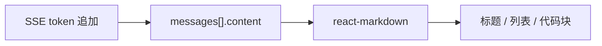

# Next.js 学习系列（八）：Markdown 消息渲染——react-markdown 与代码高亮

> [第七篇](07.sse-streaming-chat.md) 的助手气泡用纯文本 `whiteSpace: 'pre-wrap'`——模型一旦输出 **标题、列表、加粗、代码块**，用户看到的是带 `##`、反引号和 `*` 的「源码」。大模型和 RAG 回答几乎默认用 **Markdown** 写。这篇是系列第八篇：在 `ChatMessage` 上接入 **`react-markdown`**，用 **`remark-gfm`** 支持表格，用 **`rehype-highlight`** 给代码块上色，并说明 **流式半截 Markdown** 与 **XSS 安全**。偏概念与能跑通的步骤；引用见 [第九篇](09.citation-source-ui.md)。概念可对照 [React（八）](../react/08.markdown-message-render.md)，本篇按 **Next App Router** 组织样式与组件路径。

---

## 目录

1. [前言：助手消息不该是一坨符号](#1-前言助手消息不该是一坨符号)
2. [Markdown 是什么：模型输出的排版语言](#2-markdown-是什么模型输出的排版语言)
3. [为什么不用 dangerouslySetInnerHTML](#3-为什么不用-dangerouslysetinnerhtml)
4. [安装依赖与在 Next 里引 CSS](#4-安装依赖与在-next-里引-css)
5. [最小 MarkdownBubble 组件](#5-最小-markdownbubble-组件)
6. [remark-gfm 与 rehype-highlight](#6-remark-gfm-与-rehype-highlight)
7. [流式输出时半截 Markdown 怎么办](#7-流式输出时半截-markdown-怎么办)
8. [聊天气泡样式](#8-聊天气泡样式)
9. [改第七篇：ChatMessage 与 chat/page](#9-改第七篇chatmessage-与-chatpage)
10. [后端：让模拟流吐出 Markdown（可选）](#10-后端让模拟流吐出-markdown可选)
11. [常见陷阱与 FAQ](#11-常见陷阱与-faq)
12. [总结与系列下一步](#12-总结与系列下一步)

---

## 1. 前言：助手消息不该是一坨符号

第七篇典型卡点：

- 模型返回 `## 结论`、列表和围栏代码块，界面原样显示符号。
- 不知道在 Next 里 **CSS 引在哪**——Vite 教程写 `main.jsx`，Next 用 `layout.js`。
- 担心模型输出夹 **HTML 脚本**——能不能 `innerHTML`？
- 流式时 `**加粗` 只出现一半，排版闪一下。

**Markdown**：用纯文本写标题、列表、链接、代码块的轻量标记语言。  
通俗说：排版简码，渲染后像排好版的文章。

**react-markdown**：把 Markdown 字符串转成 React 组件树的库，默认不把未知 HTML 当脚本执行。  
通俗说：把 `## 标题` 翻译成真正的 `<h2>`。

读完本文，你应该能做到：

1. 说明助手用 Markdown 渲染、用户消息保持纯文本的理由。
2. 在第七篇 `frontend/` 安装 `react-markdown`、`remark-gfm`、`rehype-highlight`。
3. 写出 `MarkdownBubble`，显示标题、列表、表格与代码块高亮。
4. 在 `layout.js` 引入 highlight.js 主题与气泡样式 CSS。
5. 更新 `ChatMessage` 与 `/chat` 页，流式结束后（或边流边）正确排版。
6. 说清 **XSS** 风险：避免 `dangerouslySetInnerHTML` 与盲目的 `rehype-raw`。

**前置阅读**：

| 篇章 | 必看内容 |
|------|----------|
| [Next（七）](07.sse-streaming-chat.md) | `ChatMessage`、`messages`、SSE 追加 |
| [Next（二）](02.create-next-app-first-page.md) | 组件、`layout` |

**环境**：延续第七篇；`npm run dev` 能跑 `/chat` 流式对话。

### 1.1 本文边界

本篇**不展开**：

- `react-markdown` AST 定制、Shiki 全主题
- 引用 `[1]` 点击跳转（[第九篇](09.citation-source-ui.md)）
- LaTeX 公式（`remark-math`，需另开）
- 代码块「复制」按钮（进阶 UI）

目标：**助手气泡能显示常见 Markdown；代码块有颜色；知悉流式与安全底线。**

**阅读时间预期**：安装依赖 + 组件 + 联调约 **2.5～4 小时**。建议先用 §5 的 `sample` 常量测通 `MarkdownBubble`，再改 `ChatMessage`——不要一边 SSE 一边调样式。

### 1.3 典型卡点（第八篇专属）

| 卡点 | 本质 | 本篇怎么解 |
|------|------|------------|
| 看见 `##` 而不是标题 | 未走 `react-markdown` | §5 `MarkdownBubble` |
| 代码块无颜色 | 缺 highlight CSS | §4 layout 引 `github.css` |
| 流式时排版闪一下 | 半截 `**` 被当 Markdown | §7 策略 A/B |
| 担心模型输出 `<script>` | XSS | §3 不用 `innerHTML` |
| Vite 教程 CSS 引不进 | Next 入口不同 | §4.1 `layout.js` |

### 1.4 动手路径

| 步骤 | 做什么 | 章节 |
|------|--------|------|
| 1 | `npm install` 三件套 | §4 |
| 2 | `MarkdownBubble` + 常量自测 | §5～§6 |
| 3 | 加 CSS（layout 引入） | §8 |
| 4 | 改 `ChatMessage`、`chat/page.js` | §9 |
| 5 | （可选）改后端 `reply` 为 Markdown | §10 |

### 1.5 本篇新增/修改文件

```text
frontend/
├── src/
│   ├── app/
│   │   ├── layout.js          # 修改：引入 CSS
│   │   └── chat/page.js       # 修改：传 streaming
│   ├── components/
│   │   ├── ChatMessage.js     # 修改：助手走 Markdown
│   │   └── MarkdownBubble.js  # 新建
│   └── styles/
│       └── markdown-bubble.css # 新建
```

---

## 2. Markdown 是什么：模型输出的排版语言

| 存的 `content` 字符串 | 读者应看到 |
|----------------------|------------|
| `## RAG 三步` | 大号标题 |
| `- 检索\n- 增强\n- 生成` | 项目符号列表 |
| `` 用 `useEffect` 拉数据 `` | 行内代码样式 |
| fenced `python` 代码块 | 着色代码块 |

**GFM**（GitHub Flavored Markdown，GitHub 风味 Markdown）：标准 Markdown 加表格、删除线、任务列表等。  
通俗说：README 里常写的那套加强版。

- **用户输入**：短句，纯文本即可（第七篇保留）。
- **助手输出**：长文 + 结构 + 代码 → **Markdown 渲染**。



读图时看：**流式只改字符串**；排版由 `ChatMessage` 内是否调用 `react-markdown` 决定。

### 2.1 初学者 Markdown 语法速查（够用版）

模型常输出的符号，对照「字符串里写什么」与「渲染后长什么样」：

| 你写的（content 字符串） | 渲染后 | 记法 |
|--------------------------|--------|------|
| `## 标题` | 二级标题 | `#` 个数 = 标题级 |
| `- 项` 或 `* 项` | 无序列表 | 行首 `-` + 空格 |
| `1. 项` | 有序列表 | 数字 + `.` + 空格 |
| `**粗**` | **粗体** | 两侧各两个 `*` |
| `` `code` `` | 行内代码 | 两侧反引号 |
| ` ```py` 换行 代码 换行 ` ``` ` | 代码块 + 高亮 | 围栏代码块，语言写在第一行 |
| `[文字](url)` | 可点链接 | 默认会渲染成 `<a>` |
| `\| a \| b \|` 表格行 | 表格 | 需 `remark-gfm` |

**用户消息不要走这套**：用户输入 `*哈哈*` 若也 Markdown，可能变斜体——第七篇约定用户侧 **纯文本**（§11.4）。

### 2.2 渲染管线：从 SSE 到 DOM（心里要有这张图）

```text
后端 yield token
  → onToken 拼进 messages[i].content（仍是普通字符串）
  → ChatMessage 收到 content prop
  → streaming=true 时：pre-wrap 原样显示（策略 B）
  → streaming=false 后：ReactMarkdown 解析字符串 → React 元素树 → 浏览器 DOM
```

`react-markdown` **不执行** Markdown 里的 `<script>` 为脚本（默认模式）——它把未知标签当文本或忽略，这就是比 `innerHTML` 安全的原因。


### 2.3 模型常输出的块级结构：读者应看到什么

| 模型常写 | 不渲染时（七） | 八篇渲染后 |
|----------|----------------|------------|
| `## 结论` + 段落 | 看见井号 | 大标题 + 正文 |
| 有序列表 1.2.3. | 数字行 | 缩进列表 |
| 围栏代码块 | 反引号墙 | 着色 + 滚动 |
| `> 引用` | 大于号 | 左侧竖线引用样式（GFM） |
| 表格 | 管道符乱码 | 有边框表格 |

练手时让后端 §10 的 `reply` 故意包含以上五种，一次验收排版能力。

---

## 3. 为什么不用 dangerouslySetInnerHTML

**XSS**（Cross-Site Scripting，跨站脚本攻击）：恶意脚本借浏览器执行。  
通俗说：内容里藏 `<script>`，你若原样当 HTML 插入就中招。

React 的 **`dangerouslySetInnerHTML`**（危险地设置内部 HTML）：只用于**可信** HTML。

先错后对：

```jsx
// ❌ 模型输出不可信时不要这样
function BadBubble({ content }) {
  return <div dangerouslySetInnerHTML={{ __html: content }} />
}
```

```jsx
// ✅ react-markdown 把内容当 Markdown 解析
import ReactMarkdown from 'react-markdown'

function SafeBubble({ content }) {
  return <ReactMarkdown>{content}</ReactMarkdown>
}
```

| 方式 | 适合 AI 输出？ |
|------|----------------|
| 纯文本 `{content}` | 无 XSS，但看见 `#` |
| `dangerouslySetInnerHTML` | ❌ |
| `react-markdown` 默认 | ✅ 推荐 |
| + **`rehype-raw`** | ⚠️ 须配合 `rehype-sanitize` |

**rehype-raw**（可选插件）：允许 Markdown 内 HTML 进 DOM。初学 **不要装**。

### 3.1 XSS 场景推演：模型被诱导时会发生什么

假设助手 `content` 里被塞入：

```html
<script>alert('xss')</script>

```

| 渲染方式 | 结果 |
|----------|------|
| `dangerouslySetInnerHTML` | ⚠️ 可能执行脚本 |
| 纯文本 `{content}` | 看见源码，安全但丑 |
| `react-markdown` 默认 | 通常当文本或剥离，**不执行** |
| `react-markdown` + `rehype-raw` | ⚠️ 可能执行 HTML |

所以 AI 产品默认路径是 **react-markdown 且不启 raw**。若业务必须渲染有限 HTML（如 `<br>`），用 `rehype-sanitize` 白名单（进阶，本篇不装）。


### 3.2 用户消息为何保持纯文本

用户输入不可控：有人粘贴网页、有人输入 `<b>test</b>`。  
助手侧我们「选择相信 Markdown」；用户侧我们「只当字符串显示」——权限不对称是刻意的。

---

## 4. 安装依赖与在 Next 里引 CSS

演示什么：在 `frontend/` 安装包，并在 **根 layout** 引全局 CSS。  
前置：当前目录为 `frontend/`。

```bash
cd frontend
npm install react-markdown remark-gfm rehype-highlight
```

| 包 | 作用 |
|----|------|
| `react-markdown` | Markdown → React |
| `remark-gfm` | 表格、删除线等 |
| `rehype-highlight` | 代码块高亮（highlight.js） |

### 4.1 Next 与 Vite 的 CSS 入口差在哪

| | React（八）Vite | Next（八）本篇 |
|---|-----------------|----------------|
| 全局 CSS | `main.jsx` 顶部 `import` | **`app/layout.js`** 顶部 `import` |
| 组件 CSS | 同左或 CSS Modules | `styles/*.css` 在 layout 引 |

在 `src/app/layout.js` **已有** `import './globals.css'` 的下面追加：

```javascript
import 'highlight.js/styles/github.css'
import '../styles/markdown-bubble.css'
```

改 layout 后保存即可；开发模式一般**热更新**，若无样式重启 `npm run dev`。

验证：`import ReactMarkdown from 'react-markdown'` 不报错。

---

## 5. 最小 MarkdownBubble 组件

演示什么：接收 `content`，渲染标题与段落。  
前置：§4 已安装。

```jsx
// src/components/MarkdownBubble.js
import ReactMarkdown from 'react-markdown'

export default function MarkdownBubble({ content }) {
  if (!content) {
    return <span style={{ color: '#6b7280' }}>…</span>
  }
  return (
    <div className="markdown-bubble">
      <ReactMarkdown>{content}</ReactMarkdown>
    </div>
  )
}
```

临时在 `chat/page.js` 里用常量自测（测完删掉）：

```jsx
const sample = `## 你好

这是**加粗**和*斜体*。

- 列表项 A
- 列表项 B
`
// <MarkdownBubble content={sample} />
```

预期：出现二级标题与列表，**不是**带 `##` 的源码。

**ReactMarkdown 的花括号**：里面是 **字符串**，不是 `import` `.md` 文件路径。

### 5.1 从零调试：MarkdownBubble 不显示时

| 检查项 | 怎么做 |
|--------|--------|
| 依赖装了没 | `package.json` 有 `react-markdown` |
| import 路径 | `components/MarkdownBubble.js` 大小写 |
| content 是否空 | 空时组件显示 `…` |
| 是否误放在 Server 树 | 应由 Client 的 `ChatMessage` 调用 |
| 控制台报错 | 常见：插件未装、CSS 路径错 |

**隔离测试**：在 `chat/page.js` 临时 `return <MarkdownBubble content={sample} />` 包一整页——若这能显示，问题在 `ChatMessage` 分支或 `streaming` 逻辑，不在 Markdown 本身。

---

## 6. remark-gfm 与 rehype-highlight

演示什么：表格、删除线与代码高亮。  
修改 `MarkdownBubble.js`：

```jsx
import ReactMarkdown from 'react-markdown'
import remarkGfm from 'remark-gfm'
import rehypeHighlight from 'rehype-highlight'

export default function MarkdownBubble({ content }) {
  if (!content) return <span style={{ color: '#6b7280' }}>…</span>
  return (
    <div className="markdown-bubble">
      <ReactMarkdown
        remarkPlugins={[remarkGfm]}
        rehypePlugins={[rehypeHighlight]}
      >
        {content}
      </ReactMarkdown>
    </div>
  )
}
```

**remark**：处理 Markdown 语法树。  
**rehype**：处理 HTML 树（高亮、消毒等）。  
通俗说：remark 管「Markdown 懂什么」；rehype 管「变 HTML 后怎么加工」。

### 6.1 代码块语言标签：为何写 ```python

`rehype-highlight` 依赖围栏第一行的语言标识：

````markdown
```python
def hello():
    print("hi")
```
````

| 第一行 | 高亮 |
|--------|------|
| ` ```python ` | Python 关键字上色 |
| ` ``` ` 无语言 | 有边框但颜色单一 |
| ` ```js ` | JavaScript |

模型常输出带语言的围栏；若只有 ` ``` `，可在 Prompt 里要求「代码块标注语言」（后端调优，非本篇重点）。

### 6.2 remark / rehype 管线（心里有一张图）

```text
content 字符串
  → remark 解析 Markdown AST
  → remark-gfm 增强（表格等）
  → 转成 HTML AST
  → rehype-highlight 给 <pre><code> 加 class
  → 转成 React 元素（h2, p, pre, table…）
```

你不需要会改 AST；知道 **表格问题查 remark-gfm，颜色问题查 rehype + CSS** 即可。

测试字符串（可贴进临时页）：

```markdown
| 方法 | 延迟 |
|------|------|
| 纯向量 | 低 |
| 混合检索 | 中 |

~~过时~~ 推荐 **Hybrid**。
```

代码块测试：

````markdown
行内：`const x = 1`

```python
def answer(query: str) -> str:
    return retrieve(query) + generate(query)
```
````

预期：表格有边框（§8 CSS）；`python` 块有着色——若无色，检查 layout 是否引了 `github.css`。

### 6.1 先错或对：忘记语言标签

无 ` ```python ` 时仍有 `<pre>`，但高亮弱——可让 Prompt 要求模型写语言标签。

---

## 7. 流式输出时半截 Markdown 怎么办

第七篇不断 `content += token`。未闭合的 `` ` ``、`**` 可能导致短暂丑排版。

| 策略 | 做法 | 优点 | 缺点 |
|------|------|------|------|
| **A. 边流边渲染** | 始终 `MarkdownBubble` | 像 ChatGPT，即时 | 偶发闪烁 |
| **B. 结束后再渲染** | `streaming` 时 `pre-wrap`，结束后 MD | 排版稳 | 流中见符号 |

```jsx
function AssistantContent({ content, streaming }) {
  if (!content) return <span style={{ color: '#6b7280' }}>…</span>
  if (streaming) {
    return <div style={{ whiteSpace: 'pre-wrap' }}>{content}</div>
  }
  return <MarkdownBubble content={content} />
}
```

策略 A（更简单）：

```jsx
function AssistantContent({ content }) {
  return <MarkdownBubble content={content || '…'} />
}
```

**建议**：教程 Demo 用 **A**；给业务方演示排版用 **B**。下文 §9 综合示例采用 **B**。


### 7.1 时间轴：策略 B 下用户眼里发生什么

以模型输出 `## 结论\n\n**要点**` 为例（每个字仍是一个 SSE token）：

| 时刻 | `content` 字符串（累积） | `streaming=true` 界面 | `streaming=false` 后 |
|------|--------------------------|----------------------|-------------------|
| t1 | `## 结` | 原样显示 `## 结` | — |
| t2 | `## 结论` | 原样 | — |
| t3 | `## 结论\n\n**要` | 原样 | — |
| 流结束 | 完整字符串 | 仍 `pre-wrap` | **突然**变成大标题 + 粗体 |

策略 B 的取舍：**流式阶段牺牲美观，换稳定**；适合演示录屏。策略 A 在 t2 就可能把 `##` 解析成 `<h2>`，但 `**要` 未闭合时粗体可能闪一下。

### 7.2 选策略的决策（初学者版）

```text
你在做课堂 Demo、能接受流中看见 ##？
├─ 是 → 策略 B（本篇 §9 默认）
└─ 否，要像 ChatGPT 边出边排版 → 策略 A

流式 setState 很密、页面卡？
└─ 策略 B 往往更省（流中只 pre-wrap，不重跑 remark/rehype）
```

两种策略 **共用同一份 `content`**——只改 `ChatMessage` 分支，不必存两份数据。

---

## 8. 聊天气泡样式

`react-markdown` 生成 `h2`、`p`、`pre` 等；默认样式在窄气泡里往往过大。

### 8.1 为何要单独 markdown-bubble.css

Next 的 `globals.css` 管全站；聊天气泡里的 `h2`、`pre` 若用浏览器默认样式，会出现：

| 元素 | 默认问题 | 本篇 CSS 意图 |
|------|----------|---------------|
| `h2` | 字号过大、上下留白太多 | 缩小到 1.1em，贴近气泡 |
| `pre` | 撑破窄气泡 | `overflow-x: auto` 横向滚动 |
| `table` | 列挤成一团 | 小字号 + 边框 |
| `p` | 段间距过大 | `margin` 收紧 |

**助手气泡**是「卡片里的文章」，不是整页文档——所以要局部覆盖，而不是改全局 `body` 字号。

新建 `src/styles/markdown-bubble.css`：

```css
.markdown-bubble {
  font-size: 14px;
  line-height: 1.6;
  word-break: break-word;
}

.markdown-bubble h1,
.markdown-bubble h2,
.markdown-bubble h3 {
  margin: 0.6em 0 0.4em;
  font-size: 1.1em;
}

.markdown-bubble h1 {
  font-size: 1.25em;
}

.markdown-bubble p {
  margin: 0.4em 0;
}

.markdown-bubble ul,
.markdown-bubble ol {
  margin: 0.4em 0;
  padding-left: 1.4em;
}

.markdown-bubble pre {
  margin: 0.5em 0;
  padding: 10px 12px;
  border-radius: 8px;
  overflow-x: auto;
  background: #1e1e1e;
  color: #d4d4d4;
}

.markdown-bubble :not(pre) > code {
  padding: 0.15em 0.35em;
  border-radius: 4px;
  background: rgba(0, 0, 0, 0.06);
  font-size: 0.9em;
}

.markdown-bubble table {
  border-collapse: collapse;
  width: 100%;
  margin: 0.5em 0;
}

.markdown-bubble th,
.markdown-bubble td {
  border: 1px solid #ddd;
  padding: 6px 8px;
}
```

已在 §4.1 于 `layout.js` 引入。预期：标题适中；代码块可横滚；表格有边框。

本篇 **仅助手侧** 用 `MarkdownBubble`；用户蓝色气泡保持纯文本。

### 8.2 CSS 与 highlight.js 主题如何配合

`rehype-highlight` 给代码块里的 `span` 加 `hljs-*` class；**颜色**来自 `highlight.js/styles/github.css`（浅色主题）。  
`markdown-bubble.css` 里 `pre` 的深色背景 `#1e1e1e` 是为 **行内未高亮** 时也有对比——若你发现代码块「黑底黑字」，说明 github 主题与 `pre` 背景冲突，可换 `github-dark.css` 或去掉 `pre` 上的背景色。

| 现象 | 可能原因 | 处理 |
|------|----------|------|
| 完全无颜色 | layout 未引 `github.css` | §4.1 |
| 只有行内 code 有灰底 | 围栏块未识别 | 检查模型是否输出 ` ``` ` |
| 表格超出气泡 | 列太多 | 给 `.markdown-bubble` 加 `overflow-x: auto` |
| 流式结束后样式变 | 正常：pre-wrap → MD | 策略 B 预期 |

### 8.3 暗色模式（了解，本篇不做）

产品常做「用户气泡深色 + 助手浅色」或全站 dark mode——实现路径：

- CSS 变量在 `globals.css` 定义 `--bubble-assistant-bg`；
- 或 `prefers-color-scheme` 媒体查询覆盖 `.markdown-bubble pre`。

本篇用固定色值降低初学负担；接 UI 库（shadcn 等）时再统一 token。

---

## 9. 改第七篇：ChatMessage 与 chat/page

**阅读顺序**：完成 §4～§8 再改。

### 9.1 完整 ChatMessage.js

替换第七篇纯文本版：

```jsx
// src/components/ChatMessage.js
import MarkdownBubble from './MarkdownBubble.js'

function AssistantContent({ content, streaming }) {
  if (!content) return <span style={{ color: '#6b7280' }}>…</span>
  if (streaming) {
    return <div style={{ whiteSpace: 'pre-wrap' }}>{content}</div>
  }
  return <MarkdownBubble content={content} />
}

export default function ChatMessage({ role, content, streaming = false }) {
  const isUser = role === 'user'
  return (
    <div
      style={{
        display: 'flex',
        justifyContent: isUser ? 'flex-end' : 'flex-start',
        marginBottom: 8,
      }}
    >
      <div
        style={{
          maxWidth: '80%',
          padding: '8px 12px',
          borderRadius: 12,
          background: isUser ? '#2563eb' : '#f3f4f6',
          color: isUser ? '#fff' : '#111',
        }}
      >
        {isUser ? (
          <div style={{ whiteSpace: 'pre-wrap' }}>{content}</div>
        ) : (
          <AssistantContent content={content} streaming={streaming} />
        )}
      </div>
    </div>
  )
}
```

若选 **策略 A**，把 `AssistantContent` 改成始终 `return <MarkdownBubble content={content || '…'} />`，并去掉 `streaming` 参数。

### 9.1.1 AssistantContent 三分支在何时走哪条

```text
content 为空 → 显示 …
streaming=true（策略 B）→ pre-wrap 纯文本
streaming=false → MarkdownBubble 完整排版
```

`streaming` 的计算在 `page.js`：

```jsx
streaming={
  isStreaming &&
  m.role === 'assistant' &&
  index === messages.length - 1
}
```

只有**当前正在生成的那条** assistant 为 true——历史 assistant 即使内容相同，也应 `streaming=false` 以走 Markdown，否则旧消息在有人发新问时会闪回 pre-wrap。

### 9.2 修改 chat/page.js 传 streaming

在第七篇 `messages.map` 处：

```jsx
{messages.map((m, index) => (
  <ChatMessage
    key={m.id}
    role={m.role}
    content={m.content}
    streaming={
      isStreaming &&
      m.role === 'assistant' &&
      index === messages.length - 1
    }
  />
))}
```

预期：流式中最后一条 assistant 用 `pre-wrap`（策略 B）；`isStreaming` 变 false 后同一 `content` 自动 Markdown 重排，**无需两份数据**。

### 9.3 自测表

| 步骤 | 操作 | 预期 |
|------|------|------|
| 1 | 临时用 §5 `sample` 作 assistant 假数据 | 标题、列表正常 |
| 2 | §6 代码块字符串 | Python 高亮 |
| 3 | SSE 问「用三点说明 RAG」 | 流式纯文本或逐字 MD；结束后排版正确 |
| 4 | content 含 `<script>alert(1)</script>` | 不弹窗；显示为文本或忽略 |

### 9.4 layout.js 片段对照

确保 `layout.js` 类似：

```jsx
import './globals.css'
import 'highlight.js/styles/github.css'
import '../styles/markdown-bubble.css'
import SiteNav from '../components/SiteNav.js'
// … RootLayout 其余不变
```

### 9.5 逐步验收：每一步你应该看到什么

| 步骤 | 操作 | 预期 | 若不对 |
|------|------|------|--------|
| 1 | `npm install` 三件套 | 无 peer 冲突 | 查 Node 版本 ≥18 |
| 2 | layout 引两份 CSS | 代码块有底色 | DevTools 看 `hljs` class |
| 3 | 仅用 `sample` 渲染 | 标题列表正常 | 查 `MarkdownBubble` import |
| 4 | 接上 `/chat` SSE | 流中为纯文本（B） | 查 `streaming` prop |
| 5 | 流结束 | 同一气泡变排版 | 查 `isStreaming` 变 false |
| 6 | 用户发 `## 测试` | 仍显示 `##` 原文 | 用户侧应 pre-wrap |
| 7 | 表格 + 代码块问题 | 表格线、Python 上色 | 查 `remarkGfm` / `rehypeHighlight` |

### 9.6 闭卷口述：向同伴解释 Markdown 气泡

> 「助手 `content` 仍是普通字符串，由 `react-markdown` 转成 React 元素。`remark-gfm` 管表格，`rehype-highlight` 管代码块颜色，主题 CSS 在 `layout.js` 全局引入。流式时策略 B 用 `pre-wrap` 避免半截 Markdown 闪；结束后同一字符串交给 `MarkdownBubble`。不用 `dangerouslySetInnerHTML`，防 XSS。」

### 9.7 分层排错

```text
层 1：常量 sample 能否渲染？
  失败 → 依赖、MarkdownBubble、layout CSS
  成功 ↓
层 2：非流式假数据能否排版？
  失败 → remark/rehype 插件
  成功 ↓
层 3：SSE 结束后能否排版？
  失败 → streaming 判断、isStreaming 未复位
  成功 ↓
层 4：流中样式不对
  → 策略 A/B 预期不同，勿当 bug
```

### 9.8 与 React（八）对照

| 话题 | React（八）Vite | Next（八）本篇 |
|------|-----------------|----------------|
| 组件路径 | `components/MarkdownBubble.jsx` | `components/MarkdownBubble.js` |
| 全局 CSS | `main.jsx` | `app/layout.js` |
| 流式页 | `pages/Chat.jsx` | `app/chat/page.js` + `streaming` |
| 安全结论 | 同：默认 react-markdown | 同 |

---

## 10. 后端：让模拟流吐出 Markdown（可选）

改 [第七篇 §4](07.sse-streaming-chat.md) 的 `fake_llm_stream` 里 `reply` 即可；前端逻辑不变。

```python
reply = f"""## 关于「{user_message}」

简要说明：

1. **检索**：从向量库找片段
2. **增强**：拼进 Prompt
3. **生成**：调用 LLM

示例（Python）：

    chunks = retriever.search(query, k=5)

以上仅为演示 Markdown 流式。"""
```

仍按字符 `yield token`；策略 B 下流式结束才看到完整排版。

---

## 11. 常见陷阱与 FAQ

### 11.1 陷阱一：Markdown 当 HTML 塞 innerHTML

见 §3。AI 产品默认 **`react-markdown` 默认模式**。

### 11.2 陷阱二：在 Client 组件里 dynamic import 漏 CSS

highlight 主题必须在 **layout** 或 **page** 顶层 `import`，不要只在某个函数里懒加载 CSS（Next 可能抽不到）。

### 11.3 陷阱三：开启 rehype-raw 不消毒

```jsx
// ❌ 产品级 AI 聊天不要
rehypePlugins={[rehypeRaw]}
```

### 11.4 陷阱四：用户消息也用 Markdown

用户输入 `*哈哈*` 可能变斜体——**用户侧保持纯文本**。

### 11.5 陷阱五：忘记 highlight.js CSS

代码块无颜色 → 检查 layout 的 `github.css` import。

### 11.6 陷阱六：Server Component 里用 react-markdown 包流式消息

流式 `content` 在 Client 的 `messages` state 里变——`MarkdownBubble` 由 **`ChatMessage`（Client 树内）** 调用即可；不要试图在 Server `page` 里渲染正在增长的字符串。

### 11.7 FAQ

**Q：和 React（八）差在哪？**  
A：组件逻辑相同；CSS 改在 **`layout.js`** 引入；路径为 `components/MarkdownBubble.js`。

**Q：能用 `next/font` 吗？**  
A：可以；本篇用系统字体 + CSS 即可。

**Q：和 `marked` + DOMPurify？**  
A：都行；`react-markdown` 与 React 一体，少 `innerHTML` 负担。

**Q：LaTeX？**  
A：`remark-math` + `rehype-katex`，另开。

**Q：链接会跳转到外站吗？**  
A：默认渲染 `<a href>`；若要禁止外链，需自定义 `components` 过滤 `href`（进阶）。

**Q：流结束后排版没变化？**  
A：查 `streaming` 是否仍为 true——`finally` 里 `setIsStreaming(false)` 是否执行；或误用策略 A 但 content 无 Markdown 符号。

**Q：表格在气泡里挤成一团？**  
A：加 `markdown-bubble.css` 里 `overflow-x: auto` 包一层；窄屏横向滚动比压扁可读。

### 11.8 本篇时间预算

| 阶段 | 时长 | 验收 |
|------|------|------|
| §2～§3 概念 | 30 分钟 | 能解释 XSS 与 remark/rehype 分工 |
| §4～§6 组件 | 60～90 分钟 | sample + 代码块高亮 |
| §7～§9 接聊天 | 60～90 分钟 | §9.5 七步全绿 |
| 口述复习 | 20 分钟 | §9.6 闭卷能说 |

### 11.10 第八篇与第七、九篇的边界再强调

| 篇 | 管什么 | 不管什么 |
|----|--------|----------|
| 七 | SSE、`content` 字符串增长 | 排版 |
| **八** | **assistant 排版与安全** | 引用、citations |
| 九 | `citations`、侧栏 | Markdown 插件选型 |

改第八篇时**不要**动 `readSSEStream` 协议；改 `ChatMessage` 的 assistant 分支即可。  
第九篇会在 `ChatMessage` 下再加 `CitationList`——保持组件单一职责。

### 11.11 推荐阅读顺序（卡住时）

1. `sample` 常量能否渲染（§5）  
2. 代码块颜色（§4 layout + §6）  
3. 接上 SSE 后**流结束**能否排版（§7 策略 B）  
4. 最后才调 `markdown-bubble.css` 美观

### 11.12 动手自检清单

- [ ] 已装三个 npm 包  
- [ ] layout 引了 `github.css` 与 `markdown-bubble.css`  
- [ ] `MarkdownBubble` 显示表格与代码高亮  
- [ ] 助手 Markdown、用户纯文本  
- [ ] `/chat` SSE 结束后排版正确  
- [ ] 能说明为何不用 `dangerouslySetInnerHTML`  

### 11.13 第八篇知识串联（七 → 八 → 九）

```text
七：content 字符串随 SSE 增长（pre-wrap 或纯文本）
八：同一 content，流结束后交给 react-markdown
九：并列 citations 数组，不塞进 content
```

改第八篇时只动 **assistant 渲染分支**；`lib/sse.js` 在第九篇才加 `onCitations`。若你跳过第八篇直接做引用，气泡里仍会看见 `##` 和 `**`——产品演示会显得很「半成品」。

### 11.14 常见渲染问题速查（扩展）

| 现象 | 第一层查 | 第二层查 |
|------|----------|----------|
| 全是源码符号 | 是否走 MarkdownBubble | streaming 是否一直 true |
| 表格没线 | remark-gfm | CSS `.markdown-bubble table` |
| 链接变蓝可点 | 正常 MD 行为 | 要禁止则自定义 components |
| 流结束不排版 | isStreaming | AssistantContent 分支 |

### 11.15 本篇时间预算（细化）

| 阶段 | 时长 | 产出 |
|------|------|------|
| 读 §2～§3 | 40 分钟 | 能手绘 SSE→state→MD 管线 |
| 装依赖 + layout CSS | 30 分钟 | 代码块有颜色 |
| MarkdownBubble 孤立测 | 45 分钟 | sample 表格+列表 |
| 接 ChatMessage + SSE | 90 分钟 | 策略 B 流结束排版 |
| XSS + 口述 | 30 分钟 | §9.6 闭卷 |

### 11.16 第八篇面试题自测

| 问题 | 要点 |
|------|------|
| 为什么不用 innerHTML？ | XSS；模型输出不可信 |
| remark 和 rehype 分工？ | MD 语法 vs HTML 后处理 |
| 流式时排版闪？ | 策略 A/B；半截 `**` |
| CSS 为什么在 layout 引？ | Next 全局入口，非 main.jsx |
| 用户消息为何不用 MD？ | 输入不可控，避免误解析 |

### 11.17 动手作业（可选，加深理解）

1. 把 `github.css` 换成 `github-dark.css`，观察代码块对比度变化。  
2. 用策略 A 跑同一问题，录屏对比策略 B 的流式观感。  
3. 在 `content` 里加一张 Markdown 图片 ``，看是否渲染（默认可；讨论外链风险）。  
4. 给用户气泡误加 `MarkdownBubble`，输入 `*test*` 看斜体——再改回纯文本。

作业不提交也行；做过一遍会比只读 §7 记得牢。

### 11.18 与 npm 依赖版本

`react-markdown` v9+ 与 v8 API 接近；若安装时报 peer 冲突，优先保证 **Node 18+**。锁定大版本后不要随意升级 major——插件 `remark-gfm`、`rehype-highlight` 需与 `react-markdown` 主版本兼容。遇到「插件不是函数」，查三件套版本是否同一生态（npm 页面 Dependencies）。

### 11.19 第八篇常见渲染故障扩展表

| 现象 | 第一层 | 第二层 |
|------|--------|--------|
| 列表变成一行 | 模型没换行 | MD 需要 `- ` 或 `1. ` 前缀 |
| 链接不可点 | 不是合法 `[t](url)` | 检查括号 |
| 代码块里 HTML 显示出来 | 正常 | 围栏内当字面量 |
| 流式结束仍纯文本 | `streaming` 未 false | `finally` 与 index 判断 |
| 只有助手该 MD | 用户也 MD 了 | 改回 user 分支 pre-wrap |

### 11.20 读完第八篇应能改的三处文件

1. `app/layout.js` — 两行 CSS import  
2. `components/MarkdownBubble.js` — 三插件  
3. `components/ChatMessage.js` — `AssistantContent` 分支  

`chat/page.js` 只多传 `streaming` prop，不必重写第七篇 `handleSend`。增量越小，回归第七篇流式的风险越低。

第八篇完成后，建议用同一条 SSE 问题截屏对比「第七篇纯文本」与「第八篇排版后」——产品价值一眼可见。

### 11.21 remark-gfm 表格对齐小技巧

模型输出的表格有时列数不齐，`remark-gfm` 仍尽量渲染——若整表消失，检查是否少了表头分隔行 `|---|---|`。练手时在 §6 测试字符串里故意少一行，看报错长什么样，以后见客户数据就不慌。

### 11.22 第八篇收束：三句话给未来的你

1. 助手 `content` 永远是字符串，排版是渲染层的事。  
2. 安全默认：react-markdown，不启 rehype-raw。  
3. 流式排版问题用策略 B，别急着上复杂 AST 插件。

若你计划接 MUI / shadcn 等组件库，Markdown 气泡可包在 `prose` 类（Tailwind Typography）里——原理与本篇 `markdown-bubble.css` 相同：局部覆盖排版。

第八篇与第七篇共用同一份 `messages` state——**永远不要**为渲染 Markdown 复制一份 `content`，否则流式与排版会不同步。

下一篇 [第九篇](09.citation-source-ui.md) 会在助手气泡下加引用卡片；Markdown 正文里可保留「见 [1]」文字，但真正可点的是卡片而非正文里的方括号。

动手验收：用第八篇 §10 可选 Markdown `reply` 后端，发一条含二级标题与代码块的问题，确认流结束后排版正确——这是第八篇的「毕业考」。记住：**排版层只读 `content`，不改协议。** 若第八篇改完流式断了，第一时间查是否误动第七篇 `readSSEStream` 或 `handleSend`。第八篇的成功标准是：**流式行为与第七篇完全一致，仅 assistant 最终排版不同。** 安装依赖后若 `npm run dev` 报 CSS 路径错，先核对 `layout.js` 里 `../styles/` 相对路径。第八篇全部验收通过后，assistant 气泡应同时支持列表、表格与代码高亮三种最常见模型输出。下一篇见引用溯源。

**易错点**：用户气泡永远 `pre-wrap`，勿误套 Markdown 组件——否则历史提问里的反引号会被当成行内代码渲染。练完请对照 §10 验收表。

---

## 12. 总结与系列下一步

### 12.1 概念速记

| 概念 | 一句话 |
|------|--------|
| react-markdown | Markdown 字符串 → React 元素 |
| remark-gfm | 表格、任务列表 |
| rehype-highlight | 代码块上色 |
| layout 引 CSS | Next 全局样式入口 |
| 策略 A/B | 边流边 MD vs 结束后 MD |
| XSS | 忌裸 innerHTML |

### 12.2 决策树

```text
助手要标题、列表、代码？
└─ react-markdown + remark-gfm

要代码上色？
└─ rehype-highlight + layout 引 github.css

流式排版闪？
└─ 策略 B 或节流 setState

下一步引用 [1]？
└─ 第九篇
```

### 12.3 系列回顾

| 篇 | 主题 |
|----|------|
| 七 | SSE、AbortController |
| **八（本篇）** | **Markdown、高亮、安全** |
| [九](09.citation-source-ui.md) | 引用溯源 |

### 12.4 系列下一步

打开 [第九篇：引用溯源 UI](09.citation-source-ui.md)，让回答可点击查证来源。

---

> **系列定位**：本篇把第七篇「打字机」升级成「**能读的助手回答**」。Markdown 解决好看；引用解决可信——RAG 产品两个面子问题。
