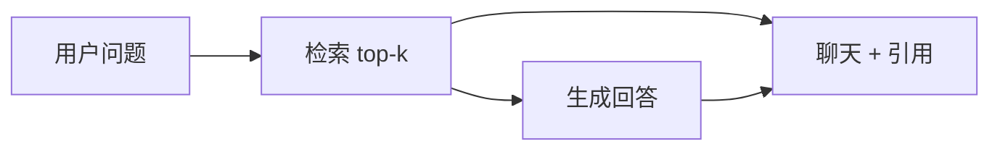

# Next.js 学习系列（九）：引用溯源 UI——SSE 元数据、脚注与侧栏原文

> [第八篇](08.markdown-message-render.md) 能把助手回答排成 Markdown，但 RAG 产品还要回答：**这句话依据哪份文档、哪一页？** 没有溯源，用户不敢信模型。这篇是系列第九篇：在 [第七篇](07.sse-streaming-chat.md) SSE 协议里增加 **`citations` 元数据**，扩展 `lib/sse.js`；在 `messages` 里挂 **`citations` 数组**；做 **引用卡片** 与 **侧栏原文预览**。偏概念与能跑通的步骤；上传见 [第十篇](10.file-upload-index-progress.md)。概念可对照 [React（九）](../react/09.citation-source-ui.md)。

---

## 目录

1. [前言：能读还不够，还要能查证](#1-前言能读还不够还要能查证)
2. [RAG 里「引用」长什么样](#2-rag-里引用长什么样)
3. [协议设计：token 与 citations 分两路](#3-协议设计token-与-citations-分两路)
4. [后端：流结束后再推 citations](#4-后端流结束后再推-citations)
5. [扩展 lib/sse.js：onCitations 回调](#5-扩展-libssejsoncitations-回调)
6. [消息 state：给 assistant 挂上 citations](#6-消息-state给-assistant-挂上-citations)
7. [CitationList：气泡下方的引用卡片](#7-citationlist气泡下方的引用卡片)
8. [侧栏 SourcePanel：点击看原文片段](#8-侧栏-sourcepanel点击看原文片段)
9. [行内 [1] 与 Markdown（了解即可）](#9-行内-1-与-markdown了解即可)
10. [综合实战：改 /chat 为聊天 + 侧栏](#10-综合实战改-chat-为聊天--侧栏)
11. [常见陷阱与 FAQ](#11-常见陷阱与-faq)
12. [总结与系列下一步](#12-总结与系列下一步)

---

## 1. 前言：能读还不够，还要能查证

第八篇典型卡点：

- 助手说「根据公司内部文档……」——用户问：**哪份文档？**
- 不知道引用放 `content` 里还是单独字段。
- 流式吐字时，引用列表何时显示？
- 点 `[1]` 看原文，state 和组件怎么拆？

**Grounding**（接地 / 有据生成）：让回答绑在检索片段上，并能指出出处。  
通俗说：「我这句话有凭据」。

**Citation**（引用 / 溯源条目）：结构化出处，含文档名、页码、原文片段等。  
通俗说：脚注里的「出处卡片」。

读完本文，你应该能做到：

1. 约定最小 `Citation` JSON，与后端 chunk 元数据对齐。
2. 在 SSE **末尾**推送 `{"citations":[...]}`，与 `token` 字符合流。
3. 扩展 `readSSEStream`，增加 `onCitations` 回调。
4. 实现 `CitationList`、`SourcePanel`，点击引用在侧栏看 `snippet`。
5. 把 `/chat` 改成「主栏对话 + 侧栏原文」布局。

**前置阅读**：

| 篇章 | 必看内容 |
|------|----------|
| [Next（七）](07.sse-streaming-chat.md) | `lib/sse.js`、`handleSend` |
| [Next（八）](08.markdown-message-render.md) | `ChatMessage`、`MarkdownBubble` |

**环境**：第七、八篇 `my-fullstack-next/`；`rewrites` 与第五篇一致。

### 1.1 本文边界

本篇**不展开**：

- PDF 页内高亮、跳转真实 PDF 阅读器
- 行内 `[1]` 与 Markdown 自动互链（§9 仅概念）
- 多租户 `acl`、真向量检索（后端另学）

目标：**模拟流式回答 + 流结束后 2 条引用，点击侧栏看片段。**

**阅读时间预期**：协议 + 后端 + 侧栏布局约 **3～5 小时**。建议先 `curl -N` 确认流末尾有 `citations` 行，再改 `sse.js`，最后做 UI——避免 citations 被当成 token 拼进正文。

### 1.4 典型卡点（第九篇专属）

| 卡点 | 本质 | 本篇怎么解 |
|------|------|------------|
| 气泡下没有引用卡片 | `onCitations` 未接或 message 无字段 | §5～§6 |
| 正文里出现 JSON 字符串 | citations 走了 `onToken` | §5 先错或对 |
| 点引用侧栏空白 | `activeCitation` 未 set | §8、`handleSend` 清空逻辑 |
| 流式中就想要引用 | 协议约定在末尾 | §3，或改后端先发 citations |
| 侧栏与聊天抢宽度 | 布局未 flex | §10 双栏 |

### 1.5 动手路径

| 步骤 | 做什么 | 章节 |
|------|--------|------|
| 1 | 约定 `Citation` JSON | §2～§3 |
| 2 | 改 FastAPI 模拟流 | §4 |
| 3 | 改 `lib/sse.js` + `handleSend` | §5～§6 |
| 4 | `CitationList`、`SourcePanel` | §7～§8 |
| 5 | 改 `chat/page.js` 布局 | §10 |

### 1.6 本篇新增/修改文件

```text
frontend/src/
├── lib/sse.js                 # 修改：onCitations
├── components/
│   ├── ChatMessage.js         # 修改：citations + CitationList
│   ├── CitationList.js        # 新建
│   └── SourcePanel.js         # 新建
└── app/chat/page.js           # 修改：侧栏布局、activeCitation
backend/main.py                # 修改：fake_rag_stream
```

---

## 2. RAG 里「引用」长什么样

检索层先拿到 **chunk**（文档切块），再交给 LLM。前端 `Citation` 常来自 chunk 元数据：

| 字段 | 含义 | 示例 |
|------|------|------|
| `id` | 脚注编号 `[1]` | `1` |
| `title` | 文档标题 | `员工手册.pdf` |
| `source` | 路径或 doc_id | `kb/handbook.pdf` |
| `page` | 页码（可选） | `12` |
| `snippet` | 命中片段 | `年假不少于 10 个工作日……` |
| `score` | 相似度（可选） | `0.87` |



读图时看**两路进 UI**：`content` 是模型总结；`citations` 是检索给的出处——**不要把大段 snippet 全塞进 Markdown 正文**。

### 2.2 用户为什么需要「可点击的出处」

RAG 产品如果只给一段流利回答，用户心里会问：

| 用户疑问 | 没有溯源时 | 有 Citation + 侧栏时 |
|----------|------------|----------------------|
| 这是不是瞎编？ | 只能信或不信 | 可点开看原文片段 |
| 哪本手册说的？ | 不知道 | `title`、`page` 标明 |
| 和我想的文档是一回事吗？ | 无法核对 | `snippet` 对照 |

**Grounding** 不是锦上添花——是企业内问答、法务、医疗等场景的**底线能力**。第九篇做的是最小可用：**卡片 + 侧栏 snippet**，够演示与面试讲解。

### 2.3 字段最小集：后端和前端要对齐什么

真项目 chunk 元数据可能很多；本篇 **Citation 最小集** 够 UI 跑通：

| 字段 | 没有会怎样 |
|------|------------|
| `id` | 无法显示 `[1]`、无法区分多条 |
| `title` | 卡片不知道显示啥文件名 |
| `snippet` | 侧栏空白——最伤体验 |
| `source` / `page` | 可省略，但演示可信度下降 |
| `score` | 可选；调试台（十一篇）更常用 |

后端改字段名时，**先改 JSON 再改组件**——不要在前端硬编码 `c.doc_name` 而后端发 `title`。

---

### 2.1 与第八篇分工

| 放哪 | 放什么 |
|------|--------|
| `content` | 总结、列表；可写「见 [1][2]」 |
| `citations` | 结构化出处 → `CitationList` |
| `SourcePanel` | 选中引用的 `snippet` 全文 |


---

## 3. 协议设计：token 与 citations 分两路

第七篇每行：

```text
data: {"token":"你"}
```

本篇在**正文结束后**再发：

```text
data: {"citations":[{"id":1,"title":"...","snippet":"..."}]}
data: [DONE]
```

| 事件 | JSON | 前端 |
|------|------|------|
| 正文 | `{ "token": "x" }` | 追加 `content` |
| 引用 | `{ "citations": [ ... ] }` | 写 `message.citations` |
| 结束 | `[DONE]` 或流关闭 | `isStreaming = false` |

**为何 citations 放流末尾？** 检索多在生成前已定；先出字、最后补脚注，协议简单。进阶也可先发 `citations`——前后端约定一致即可。

### 3.1 一条 assistant 消息在协议里的生命周期

以用户问「什么是 RAG」为例，**同一条** `message` 对象如何被填满：

```text
1. handleSend 创建 assistant 占位
   { id, role:'assistant', content:'', citations:[] }

2. 每个 data: {"token":"x"} 
   → content 逐字变长；citations 仍 []

3. 流末尾 data: {"citations":[...]}
   → 只触发 onCitations；content 不再变

4. isStreaming=false
   → CitationList 可点；Markdown 排版（第八篇）
```

**不要**在步骤 2 里把 citations 写进 `content`——正文只放模型说的话；出处是**并列字段**。


### 3.2 先错对对：三种常见协议误用

```javascript
// ❌ 把 snippet 拼进 Markdown 正文
onToken(c.snippet)

// ❌ citations 当 token
onToken(JSON.stringify(payload.citations))

// ✅ 分支
if (payload.token != null) onToken(payload.token)
if (payload.citations) onCitations(payload.citations)
```

### 3.3 curl 验收：末尾必须看见 citations

```bash
curl -N -X POST http://localhost:8000/api/chat/stream \
  -H "Content-Type: application/json" \
  -d "{\"message\":\"RAG\"}" | tail -n 5
```

预期：最后几行之一含 `"citations":[{...}]`，且**不是**拆成很多 `token` 字符。

### 3.4 完整 SSE 事件序列示例（心里建模）

一次成功对话的 `data:` 事件顺序：

```text
data: {"token":"#"}
data: {"token":"#"}
...（许多 token）...
data: {"citations":[{"id":1,"title":"...", "snippet":"..."}, ...]}
data: [DONE]
```

前端 `readSSEStream` 对每一行的处理：

- 含 `token` → 只改 `content`  
- 含 `citations` → 只改 `citations`  
- `[DONE]` → 跳过，等 while 结束  
- 流关闭 → `finally` 里 `isStreaming=false`

**不要**期待 citations 在第一个 token 之前到达——本篇协议是「先说完，再给脚注」。

---

## 4. 后端：流结束后再推 citations

演示什么：替换第七篇 `fake_llm_stream` 为 `fake_rag_stream`。  
前置：第七篇 FastAPI 已跑。

```python
import asyncio
import json
from fastapi.responses import StreamingResponse
from pydantic import BaseModel

# 与第七篇同 app；用户 API 保留


class ChatRequest(BaseModel):
    message: str


MOCK_CITATIONS = [
    {
        "id": 1,
        "title": "RAG 入门笔记",
        "source": "docs/rag-intro.md",
        "page": None,
        "snippet": "RAG = Retrieval-Augmented Generation：先检索相关片段，再交给大模型生成。",
    },
    {
        "id": 2,
        "title": "向量检索 FAQ",
        "source": "docs/faq.pdf",
        "page": 3,
        "snippet": "混合检索结合 BM25 与向量相似度，常用 RRF 融合排序。",
    },
]


async def fake_rag_stream(user_message: str):
    answer = f"""## 关于「{user_message}」

简要结论（详见引用 [1][2]）：

1. **RAG** 先检索再生成。
2. 生产环境常用 **混合检索** 提升召回。

以上依据知识库片段整理。"""

    for char in answer:
        yield f"data: {json.dumps({'token': char}, ensure_ascii=False)}\n\n"
        await asyncio.sleep(0.02)

    yield f"data: {json.dumps({'citations': MOCK_CITATIONS}, ensure_ascii=False)}\n\n"
    yield "data: [DONE]\n\n"


@app.post("/api/chat/stream")
async def chat_stream(body: ChatRequest):
    return StreamingResponse(
        fake_rag_stream(body.message),
        media_type="text/event-stream",
        headers={
            "Cache-Control": "no-cache",
            "Connection": "keep-alive",
            "X-Accel-Buffering": "no",
        },
    )
```

预期：`curl -N` 先见大量 `token`，最后一行含 `citations`。

**真 RAG**：`MOCK_CITATIONS` 换检索结果；LLM 换真流式 API——**给前端的 JSON 形状可不变**。

---

## 5. 扩展 lib/sse.js：onCitations 回调

演示什么：在第七篇 `readSSEStream` 上增加第三个可选参数。  
前置：§3 协议。

**整文件替换** `src/lib/sse.js`：

```javascript
/**
 * @param {Response} res
 * @param {(token: string) => void} onToken
 * @param {(citations: object[]) => void} [onCitations]
 */
export async function readSSEStream(res, onToken, onCitations) {
  if (!res.ok) {
    const text = await res.text().catch(() => '')
    throw new Error(text || `HTTP ${res.status}`)
  }
  if (!res.body) {
    throw new Error('当前环境不支持流式响应 body')
  }

  const reader = res.body.getReader()
  const decoder = new TextDecoder()
  let buffer = ''

  while (true) {
    const { done, value } = await reader.read()
    if (done) break
    buffer += decoder.decode(value, { stream: true })

    const parts = buffer.split('\n\n')
    buffer = parts.pop() ?? ''

    for (const part of parts) {
      const line = part.split('\n').find((l) => l.startsWith('data: '))
      if (!line) continue
      const jsonStr = line.slice('data: '.length).trim()
      if (jsonStr === '[DONE]') continue

      try {
        const payload = JSON.parse(jsonStr)
        if (payload.token != null) onToken(payload.token)
        if (payload.citations && onCitations) {
          onCitations(payload.citations)
        }
      } catch {
        if (jsonStr) onToken(jsonStr)
      }
    }
  }
}
```

先错或对：

```javascript
// ❌ citations 当 token 拼进正文
if (payload.citations) onToken(JSON.stringify(payload.citations))

// ✅ 分支：token → content；citations → onCitations
```

预期：最后一条 `citations` 只触发 `onCitations` 一次，不污染 `content`。

---

## 6. 消息 state：给 assistant 挂上 citations

扩展消息对象：

```javascript
// { id, role, content, citations?: object[] }
const assistantMsg = {
  id: assistantId,
  role: 'assistant',
  content: '',
  citations: [],
}
```

在 `handleSend` 里：

```javascript
await readSSEStream(
  res,
  (token) => {
    setMessages((prev) =>
      prev.map((m) =>
        m.id === assistantId ? { ...m, content: m.content + token } : m
      )
    )
  },
  (citations) => {
    setMessages((prev) =>
      prev.map((m) =>
        m.id === assistantId ? { ...m, citations } : m
      )
    )
  }
)
```

**侧栏选中**用单独 `useState`，不要塞进每条 `message`：

```javascript
const [activeCitation, setActiveCitation] = useState(null)
```

建议在 `handleSend` 开头 `setActiveCitation(null)`，避免新问题仍显示旧片段。

### 6.1 两类 state：消息内 vs 页面临时

初学者容易把所有东西塞进 `messages`——建议分开：

| 数据 | 放哪 | 生命周期 |
|------|------|----------|
| `content` | `messages[i]` | 跟这条 assistant 绑定 |
| `citations` | `messages[i]` | 流结束后写入，跟这条绑定 |
| `activeCitation` | `page` 的 `useState` | 用户点卡片时设置；新问题时清空 |
| `isStreaming` | `page` | 全局一次只允许一条流 |

**侧栏展示的是「当前选中的引用」**，不是「最后一条消息的引用」——除非你在 `onCitations` 里自动 `setActiveCitation(citations[0])`（可做，本篇默认手动点）。

### 6.2 onCitations 走读：与 onToken 并行不冲突

```text
readSSEStream 解析到 payload
├─ 有 token？ → onToken → map 改 assistantId 的 content
└─ 有 citations？ → onCitations → map 改 assistantId 的 citations

同一轮 read 里可能先处理多个 token 事件，最后才一个 citations 事件
```

两次 `setMessages` 都应用 **函数式更新** 和 **assistantId**，避免互相覆盖——React 18 会批处理相邻 setState，一般安全。

---

## 7. CitationList：气泡下方的引用卡片

演示什么：`citations.length > 0` 时在助手气泡下展示可点按钮。  
前置：第八篇 `ChatMessage` 结构。

```jsx
// src/components/CitationList.js

export default function CitationList({ citations, onSelect }) {
  if (!citations?.length) return null

  return (
    <div style={{ marginTop: 8, display: 'flex', flexDirection: 'column', gap: 6 }}>
      <div style={{ fontSize: 12, color: '#6b7280' }}>参考来源</div>
      {citations.map((c) => (
        <button
          key={c.id}
          type="button"
          onClick={() => onSelect(c)}
          style={{
            textAlign: 'left',
            padding: '8px 10px',
            borderRadius: 8,
            border: '1px solid #e5e7eb',
            background: '#fff',
            cursor: 'pointer',
            fontSize: 13,
          }}
        >
          <span style={{ fontWeight: 600, marginRight: 6 }}>[{c.id}]</span>
          <span>{c.title}</span>
          {c.page != null && (
            <span style={{ color: '#6b7280', marginLeft: 6 }}>p.{c.page}</span>
          )}
        </button>
      ))}
    </div>
  )
}
```

**用 `<button>`**：键盘可聚焦，语义比 `div onClick` 清晰。

更新 `ChatMessage.js`（在第八篇基础上）：

```jsx
import MarkdownBubble from './MarkdownBubble.js'
import CitationList from './CitationList.js'

function AssistantContent({ content, streaming }) {
  if (!content) return <span style={{ color: '#6b7280' }}>…</span>
  if (streaming) {
    return <div style={{ whiteSpace: 'pre-wrap' }}>{content}</div>
  }
  return <MarkdownBubble content={content} />
}

export default function ChatMessage({
  role,
  content,
  citations,
  streaming = false,
  onCitationSelect,
}) {
  const isUser = role === 'user'
  return (
    <div
      style={{
        display: 'flex',
        justifyContent: isUser ? 'flex-end' : 'flex-start',
        marginBottom: 12,
      }}
    >
      <div style={{ maxWidth: isUser ? '80%' : '100%' }}>
        <div
          style={{
            maxWidth: isUser ? undefined : '80%',
            padding: '8px 12px',
            borderRadius: 12,
            background: isUser ? '#2563eb' : '#f3f4f6',
            color: isUser ? '#fff' : '#111',
          }}
        >
          {isUser ? (
            <div style={{ whiteSpace: 'pre-wrap' }}>{content}</div>
          ) : (
            <AssistantContent content={content} streaming={streaming} />
          )}
        </div>
        {!isUser && (
          <CitationList citations={citations} onSelect={onCitationSelect} />
        )}
      </div>
    </div>
  )
}
```

预期：流结束后出现「参考来源」；流式中 `citations` 仍 `[]`，列表不显示。

---

## 8. 侧栏 SourcePanel：点击看原文片段

**SourcePanel**（原文侧栏）：展示选中引用的 `snippet`、`source`、`page`。  
通俗说：点开脚注后的「证据页」。

### 8.1 布局：主栏 + 侧栏如何分工

```text
┌─────────────────────────────┬──────────────┐
│  messages + ChatInput       │ SourcePanel  │
│  (flex: 1)                  │ (width 300)  │
└─────────────────────────────┴──────────────┘
```

| 区域 | 组件 | 数据从哪来 |
|------|------|------------|
| 主栏 | `ChatMessage`、`ChatInput` | `messages`、`input` |
| 侧栏 | `SourcePanel` | `activeCitation`（单条，可空） |

侧栏**不**自己 `fetch`——点击 `CitationList` 时父组件 `setActiveCitation(c)` 把整条对象传下来。这样 snippet 与卡片一定一致。

### 8.2 无障碍与交互细节

- 关闭钮加 `aria-label="关闭"`，读屏能听懂。
- `snippet` 用 `<blockquote>` 语义上表示「引文」，比裸 `div` 更清晰。
- 侧栏 `overflowY: auto`：snippet 很长时可滚动，不撑破视口。

```jsx
// src/components/SourcePanel.js

export default function SourcePanel({ citation, onClose }) {
  if (!citation) {
    return (
      <aside
        style={{
          width: 300,
          flexShrink: 0,
          borderLeft: '1px solid #e5e7eb',
          padding: 16,
          color: '#9ca3af',
          fontSize: 14,
        }}
      >
        点击回答下方的引用卡片，在此查看原文片段。
      </aside>
    )
  }

  return (
    <aside
      style={{
        width: 300,
        flexShrink: 0,
        borderLeft: '1px solid #e5e7eb',
        padding: 16,
        overflowY: 'auto',
      }}
    >
      <div
        style={{
          display: 'flex',
          justifyContent: 'space-between',
          marginBottom: 12,
        }}
      >
        <strong style={{ fontSize: 15 }}>
          [{citation.id}] {citation.title}
        </strong>
        <button type="button" onClick={onClose} aria-label="关闭">
          ✕
        </button>
      </div>
      <div style={{ fontSize: 12, color: '#6b7280', marginBottom: 8 }}>
        {citation.source}
        {citation.page != null && ` · 第 ${citation.page} 页`}
      </div>
      <blockquote
        style={{
          margin: 0,
          padding: 12,
          background: '#f9fafb',
          borderLeft: '3px solid #2563eb',
          fontSize: 14,
          lineHeight: 1.6,
          whiteSpace: 'pre-wrap',
        }}
      >
        {citation.snippet}
      </blockquote>
    </aside>
  )
}
```

---

## 9. 行内 [1] 与 Markdown（了解即可）

| 做法 | 说明 |
|------|------|
| **A. 纯文本** | `[1]` 留在 Markdown，用户在下方卡片点 |
| **B. 自定义链接** | `react-markdown` 的 `components.a` 拦截 `#citation-1` |

初学 **做法 A** 足够演示。做法 B 需 Prompt 输出 `[1](#citation-1)`——产品与算法约定，本篇不强制。

### 9.1 为何不用 Markdown 脚注语法承载 snippet

| 方案 | 流式协议 | 长 snippet | 本篇选择 |
|------|----------|------------|----------|
| `[^1]` 脚注定义跟流 | 复杂 | 挤在脚注区 | ❌ |
| `citations` JSON + 侧栏 | 末尾一次推送 | 侧栏滚动 | ✅ |

**结构化字段**让前端能排序、过滤、做 ACL（哪条引用用户能看）——比纯 Markdown 脚注更贴近产品演进。

### 9.2 真 RAG 对接时前端通常不用改什么

| 后端变化 | 前端 |
|----------|------|
| mock → 向量检索 | 仍发同形状 `citations` |
| snippet 变长 | `SourcePanel` 滚动即可 |
| 增加 `score` | 可选显示在卡片上 |
| 多文档 ACL | 过滤 `citations` 数组（进阶） |

第九篇的价值是**协议与 UI 壳**——后端换真检索时，Demo 前端可复用。

---

## 10. 综合实战：改 /chat 为聊天 + 侧栏

**阅读顺序**：§4～§8 完成后再改 `page.js`。

在第七、八篇 `app/chat/page.js` 基础上调整布局与 props。关键片段：

```jsx
// src/app/chat/page.js — 在第八篇基础上增补
'use client'

import { useEffect, useRef, useState } from 'react'
import Link from 'next/link'
import ChatMessage from '../../components/ChatMessage.js'
import ChatInput from '../../components/ChatInput.js'
import SourcePanel from '../../components/SourcePanel.js'
import { getApiRoot } from '../../lib/api.js'
import { readSSEStream } from '../../lib/sse.js'

export default function ChatPage() {
  const [messages, setMessages] = useState([])
  const [input, setInput] = useState('')
  const [isStreaming, setIsStreaming] = useState(false)
  const [error, setError] = useState(null)
  const [abortController, setAbortController] = useState(null)
  const [activeCitation, setActiveCitation] = useState(null)
  const bottomRef = useRef(null)

  useEffect(() => {
    bottomRef.current?.scrollIntoView({ behavior: 'smooth' })
  }, [messages])

  async function handleSend() {
    if (!input.trim() || isStreaming) return
    setActiveCitation(null)

    const userText = input.trim()
    setInput('')
    setIsStreaming(true)
    setError(null)

    const assistantId = crypto.randomUUID()
    setMessages((prev) => [
      ...prev,
      { id: crypto.randomUUID(), role: 'user', content: userText },
      {
        id: assistantId,
        role: 'assistant',
        content: '',
        citations: [],
      },
    ])

    const controller = new AbortController()
    setAbortController(controller)

    try {
      const res = await fetch(`${getApiRoot()}/chat/stream`, {
        method: 'POST',
        headers: { 'Content-Type': 'application/json' },
        body: JSON.stringify({ message: userText }),
        signal: controller.signal,
      })
      await readSSEStream(
        res,
        (token) => {
          setMessages((prev) =>
            prev.map((m) =>
              m.id === assistantId
                ? { ...m, content: m.content + token }
                : m
            )
          )
        },
        (citations) => {
          setMessages((prev) =>
            prev.map((m) =>
              m.id === assistantId ? { ...m, citations } : m
            )
          )
        }
      )
    } catch (err) {
      if (err.name !== 'AbortError') setError(err.message)
    } finally {
      setAbortController(null)
      setIsStreaming(false)
    }
  }

  function handleStop() {
    abortController?.abort()
  }

  return (
    <section style={{ display: 'flex', gap: 0, minHeight: '70vh' }}>
      <div style={{ flex: 1, display: 'flex', flexDirection: 'column' }}>
        <h1>对话</h1>
        <p style={{ color: '#666', fontSize: 14 }}>
          带引用溯源；文档上传见{' '}
          <Link href="/documents">文档页</Link>（第十篇）。
        </p>
        {error && (
          <p style={{ color: '#b91c1c' }} role="alert">
            {error}
          </p>
        )}
        <div
          style={{
            flex: 1,
            overflowY: 'auto',
            border: '1px solid #ddd',
            borderRadius: 8,
            padding: 12,
            marginTop: 8,
          }}
        >
          {messages.length === 0 && (
            <p style={{ color: '#888' }}>提问后观察流式回答与引用卡片。</p>
          )}
          {messages.map((m, index) => (
            <ChatMessage
              key={m.id}
              role={m.role}
              content={m.content}
              citations={m.citations}
              streaming={
                isStreaming &&
                m.role === 'assistant' &&
                index === messages.length - 1
              }
              onCitationSelect={setActiveCitation}
            />
          ))}
          <div ref={bottomRef} />
        </div>
        <ChatInput
          value={input}
          onChange={setInput}
          onSend={handleSend}
          onStop={handleStop}
          isStreaming={isStreaming}
        />
      </div>
      <SourcePanel
        citation={activeCitation}
        onClose={() => setActiveCitation(null)}
      />
    </section>
  )
}
```

说明：侧栏与主栏同属 **`'use client'`** 的 `page.js`，无需 Server 参与；`layout` 的 `SiteNav` 仍在顶栏。

### 10.1 数据流总览：从点击发送到侧栏显示

```text
用户点发送
  → setActiveCitation(null)
  → messages += user + assistant(citations:[])
  → readSSEStream
       onToken → content 增长（八：流中 pre-wrap）
       onCitations → 该条 assistant.citations = [...]
  → ChatMessage 渲染 Markdown + CitationList
  → 用户点 [1]
  → onCitationSelect(c) → setActiveCitation(c)
  → SourcePanel 显示 c.snippet
```

**props 向下、事件向上**：`ChatMessage` 不直接改 `activeCitation`，只 `onCitationSelect(c)` 通知父组件——与 React 单向数据流一致，侧栏状态集中在 `page.js` 最好查。


### 10.2 flex 布局数值为何这样设

| 样式 | 值 | 原因 |
|------|-----|------|
| 外层 `display:flex` | 横排主栏+侧栏 | 桌面演示常见形态 |
| 主栏 `flex:1` | 占满剩余宽 | 聊天区优先 |
| 侧栏 `width:300` + `flexShrink:0` | 固定宽不挤扁 | snippet 需要稳定阅读宽 |
| `minHeight:70vh` | 视口内可滚 | 消息区 `overflowY:auto` |

移动端可把 `SourcePanel` 改成底部抽屉（进阶）；本篇桌面 Demo 足够面试展示。

### 10.3 ChatMessage 新增 props 一览

| Prop | 类型 | 谁传 |
|------|------|------|
| `citations` | 数组 | `messages[i].citations` |
| `onCitationSelect` | `(c) => void` | `page` 里 `setActiveCitation` |
| `streaming` | boolean | 同第八篇，最后一条 assistant |

缺 `citations` 默认值时，用 `citations={m.citations ?? []}` 避免 `undefined.length` 报错。

---

### 10.4 自测表

| 步骤 | 操作 | 预期 |
|------|------|------|
| 1 | 问「什么是 RAG」 | 流式 Markdown |
| 2 | 流结束 | 气泡下 2 条引用 |
| 3 | 点 `[1]` | 右侧 snippet |
| 4 | 点 ✕ | 侧栏恢复占位 |
| 5 | 再问一题 | 新 citations；发送时已清空侧栏 |

### 10.5 自检清单

- [ ] 后端流末尾有 `citations`  
- [ ] `readSSEStream` 分支 token / citations  
- [ ] assistant 消息含 `citations: []` 初始值  
- [ ] `CitationList` 可点  
- [ ] `SourcePanel` 显示 snippet  
- [ ] `handleSend` 开头 `setActiveCitation(null)`  

### 10.6 逐步验收：每一步你应该看到什么

| 步骤 | 操作 | 预期 | 若不对 |
|------|------|------|--------|
| 1 | `curl -N` 看流末尾 | 有 `citations` JSON | §4 后端 |
| 2 | 问一题等流结束 | 气泡下 2 张引用卡 | §5～§6 |
| 3 | 流式进行中 | 尚无卡片或空列表 | 正常：等末尾事件 |
| 4 | 点 `[1]` | 右侧 snippet 全文 | `SourcePanel`、`activeCitation` |
| 5 | 点关闭 | 侧栏占位文案恢复 | `onClose` |
| 6 | 再问一题 | 新 citations；旧侧栏已清空 | `handleSend` 开头清空 |
| 7 | 点停止（第七篇） | 字停；citations 可能无 | §11.4，勿报错 |

### 10.7 闭卷口述

> 「SSE 里 token 事件拼 `content`，citations 事件在流末尾单独推，由 `readSSEStream` 第三个回调写入 `message.citations`。`CitationList` 展示卡片，点击把整条 citation 放进 `activeCitation`，`SourcePanel` 显示 snippet。正文与出处分离，snippet 不进 Markdown。」

### 10.8 分层排错

```text
层 1：curl 末尾有 citations？
  失败 → fake_rag_stream、JSON 形状
  成功 ↓
层 2：onCitations 是否被调用？
  失败 → sse.js 分支、是否误走 onToken
  成功 ↓
层 3：UI 有卡片但点不开？
  失败 → CitationList onClick、id 类型
  成功 ↓
层 4：侧栏 snippet 与卡片不一致？
  → 检查是否传错 citation 对象引用
```

### 10.9 与 React（九）对照

| 话题 | React（九） | Next（九）本篇 |
|------|-------------|----------------|
| 双栏布局 | 单页 flex | `app/chat/page.js` flex |
| 路由链 | `react-router` Link | `next/link` |
| 协议 | 同 SSE 双事件 | 同 |

### 10.10 组件职责卡片（复习用）

| 组件 | 输入 | 输出/行为 | 不应做 |
|------|------|-----------|--------|
| `readSSEStream` | Response | 调 onToken / onCitations | 改 React state |
| `ChatMessage` | content, citations, streaming | 渲染气泡+列表 | 自己 fetch |
| `CitationList` | citations[], onSelect | 渲染可点卡片 | 持有侧栏 state |
| `SourcePanel` | citation \| null | 显示 snippet | 再请求 API |
| `chat/page.js` | 用户操作 | 协调 state、fetch | 解析 SSE 字节 |

初学者排错时先问：**这条逻辑该在上表哪一格？** 放错层（例如在 `CitationList` 里 `fetch`）会导致后期难维护。

### 10.11 与第七、八篇的增量 diff

相对第七篇，第九篇**只多**：

1. `sse.js` 第三个参数 `onCitations`；
2. `messages` 里 `citations` 字段；
3. `CitationList`、`SourcePanel` 与 flex 布局；
4. 后端 `fake_rag_stream` 末尾多一行 citations。

**不要**重写 `readSSEStream` 的 buffer 逻辑，也不要删掉 `AbortController`——在已有流式基础上「加一路事件」才是正确增量思路。

### 10.12 MOCK_CITATIONS 与第十一调试台数据对齐

本篇 `MOCK_CITATIONS` 与第十一 `MOCK_CHUNKS` 在 Demo 里应**讲同一套故事**（如 `docs/rag-intro.md`）。否则产品演示时会出现：聊天引用 A 文档，调试台 top-1 却是 B 文档——观众会质疑链路。

对齐方式（团队约定即可）：

| 字段 | 聊天 citation | 调试 hit |
|------|---------------|----------|
| 标题 | `title` | `title` |
| 路径 | `source` | `source` |
| 片段 | `snippet` | `snippet` |
| 序号 | `id` | `rank` |

后端接真检索时，**同一次 retrieve 结果**既喂 LLM 又序列化成 citations，调试台与聊天自然一致。

### 10.13 侧栏交互的键盘与可访问性（了解）

- `CitationList` 用 `<button>` 而非 `div onClick`，Tab 键可聚焦。
- `SourcePanel` 关闭钮带 `aria-label`。
- 进阶：点引用后把焦点移到侧栏标题，读屏用户能立刻听到文档名。

Demo 不强制 WCAG 全过，但**按钮语义**应保留——这是「能上线的产品」与「作业」的差别。

### 10.14 第九篇增量检查清单（相对第七、八篇）

- [ ] `sse.js` 有第三个参数且分支正确  
- [ ] assistant 初始 `citations: []`  
- [ ] `ChatMessage` 渲染 `CitationList`  
- [ ] `page.js` 有 `activeCitation` + `SourcePanel`  
- [ ] flex 双栏在 1280px 宽屏不挤扁  
- [ ] `handleSend` 第一行清空侧栏  

### 10.15 第九篇面试题自测

| 问题 | 要点 |
|------|------|
| citations 为何不放 content？ | 正文与证据分离；snippet 太长 |
| 何时出现引用卡片？ | 流末尾 `citations` 事件后 |
| activeCitation 放哪？ | page state，不塞 messages |
| 停止后无 citations？ | 正常；保持 `[]` |
| 与调试台不一致？ | 对齐 MOCK / 真检索同源 |

### 10.16 真 RAG 后端替换 checklist（给全栈延伸）

| 步骤 | 后端 | 前端 |
|------|------|------|
| 1 | retrieve(query) 得 chunks | 不变 |
| 2 | LLM 流式生成 | 仍 onToken |
| 3 | 把用到的 chunks 映射 citations | 仍 onCitations |
| 4 | 可选：行内 `[1]` 由 Prompt 控制 | 仍点卡片为主 |

前端本篇的 **JSON 形状稳定** 是全栈并行的前提——先约定 `Citation` 再各自实现。

### 10.17 侧栏移动端（延伸思路）

窄屏可把 `SourcePanel` 改为：

- 点击引用后底部 `position:fixed` 抽屉；或  
- 全屏 modal 显示 snippet。

桌面 Demo 用固定 300px 侧栏；响应式是第十二篇之后的产品 polish，不影响你先理解数据流。

### 10.18 第九篇完成后 /chat 的 props 树（复习）

```text
ChatPage
├── messages.map → ChatMessage(role, content, citations, streaming, onCitationSelect)
├── ChatInput(...)
└── SourcePanel(citation=activeCitation)
```

任何溯源 bug：沿这棵树向下查 props 是否传到、回调是否触发。

### 10.19 citations JSON 长什么样（读者应对照一次）

单条最小示例：

```json
{
  "id": 1,
  "title": "RAG 入门笔记",
  "source": "docs/rag-intro.md",
  "page": null,
  "snippet": "RAG = Retrieval-Augmented Generation：先检索再生成。"
}
```

数组在 SSE 里包在 `{"citations":[...]}` 事件中。前端 `onCitations` 收到的是 **数组**，直接 `setMessages` 写到 `message.citations`——不要再 `JSON.parse` 字符串（已在 `sse.js` 做过）。

### 10.20 第九篇与路线图 F2 条目

| 路线图 | 本篇 |
|--------|------|
| #193 引用列表 | CitationList |
| #194 原文预览 | SourcePanel |
| #195 点击跳转片段 | onCitationSelect |

阶段 4 应用层「可溯源问答」的前端部分，本篇即最小达标实现。

### 10.21 溯源产品的「信任阶梯」（给产品思维）

```text
1. 能答（七）→ 2. 能读（八）→ 3. 能查（九）→ 4. 有料可查（十）→ 5. 能验检索（十一）
```

每上一阶，用户信任度才合理加深。跳过上传直接吹「企业知识库」，演示时容易被追问「文档哪来的」。

### 10.22 侧栏为空时的 UX 文案

`SourcePanel` 占位文案应明确下一步：**「点击回答下方的引用卡片」**——比空白侧栏更能教用户操作。若改成自动打开第一条引用，演示会省事，但用户学不会「脚注是可点的」这一心智。

### 10.23 多轮对话里 citations 存哪

每条 `assistant` 自带 `citations` 数组——回看历史时，旧消息的卡片仍应可点，侧栏显示**那一条**的 snippet。`activeCitation` 只表示「当前选中」，不要覆盖历史 message 上的数据。

### 10.24 协议演进：若后端要先发 citations

少数产品会先给脚注再吐字——只需约定 `citations` 事件可出现在任意 token 之前；`readSSEStream` 已分支处理，前端 `onCitations` 可先执行。本篇 Demo 仍用「末尾 citations」以降低初学认知负担。

### 10.25 点击引用时的 state 时序

```text
用户点 [1] → onCitationSelect(c) → setActiveCitation(c)
→ SourcePanel 重绘 → 显示 c.snippet
```

若点了没反应，在 React DevTools 看 `activeCitation` 是否更新——没更新则是事件没绑上；更新了但侧栏空则是字段名不对（如 `snippet` 缺失）。

第九篇完成后，`/chat` 应从「能聊」升级为「能聊且能查证」——这是企业 RAG 与通用 ChatGPT 外壳的核心差别之一。

下一篇 [第十篇](10.file-upload-index-progress.md) 解决「引用里的文档谁上传」——溯源 UI 与知识库入口合体，演示故事才完整。

动手验收：流结束后必须出现至少两条 `CitationList` 卡片，点第一条后 `SourcePanel` 的 `snippet` 与卡片标题一致——这是第九篇的「毕业考」。侧栏与卡片数据必须来自**同一条** citation 对象。若 `id` 用数字而后端发字符串，React `key` 仍可用，但比较时要注意类型一致。第九篇与第七、八篇共用同一 `chat/page.js`——改布局时保留 `handleSend` 与 `readSSEStream` 调用结构。flex 侧栏宽度可按设计稿调整，但不要改 citations 协议。完成第九篇后，建议截图一张「气泡 + 引用卡 + 侧栏 snippet」三联图，用作作品集说明图。溯源 UI 是 ToB RAG 项目的标配展示点。第九篇协议稳定后，后端换真 LLM 时前端通常无需改动 citations 处理逻辑。

---

## 11. 常见陷阱与 FAQ

### 11.1 陷阱一：snippet 全塞进 content

正文臃肿；检索结果走 **`citations`**。

### 11.2 陷阱二：citations 当 token 拼接

气泡里出现 JSON 字符串——见 §5 先错或对。

### 11.3 陷阱三：id 与 map 下标混用

`key={c.id}`，勿用 `index` 当业务 id。

### 11.4 陷阱四：abort 后仍等 citations

用户停止后后端可能不发 `citations`——保持 `[]`，勿报错。

### 11.5 陷阱五：在 Server Component 里放 SourcePanel 状态

`activeCitation` 必须在 **`'use client'`** 的 `/chat` 页——与第六篇边界一致。

### 11.6 FAQ

**Q：和 React（九）差在哪？**  
A：逻辑相同；组件在 `components/*.js`，页面在 `app/chat/page.js`。

**Q：citations 能单独 REST 吗？**  
A：可以 `GET /api/chat/{id}/citations`；SSE 末尾一并推更省请求。

**Q：引用很多？**  
A：UI 只展示 top 3～5，其余「展开更多」。

**Q：与真检索对接？**  
A：后端 chunk 映射成同一 JSON；前端本篇可不变。

**Q：用户停止后还要 citations 吗？**  
A：真产品可取消生成并不返回；本篇 Demo 保持 `[]` 即可。

**Q：侧栏要不要独立路由 `/sources/1`？**  
A：Demo 用同页 state 最简单；分享链接场景再拆路由。

### 11.7 本篇时间预算

| 阶段 | 时长 | 验收 |
|------|------|------|
| §2～§3 协议 | 45 分钟 | curl 见 citations |
| §4～§5 后端+sse | 60 分钟 | onCitations 单次触发 |
| §6～§10 UI | 90～120 分钟 | §10.6 七步 |
| 口述 | 20 分钟 | §10.7 |

### 11.8 第九篇 FAQ 补充

**Q：citations 能边流边出吗？**  
A：可以改协议先发 citations；本篇为简单放在末尾。

**Q：多轮对话 citations 会混吗？**  
A：不会，每条 assistant 自带数组；新问清空侧栏即可。

**Q：snippet 能高亮关键词吗？**  
A：进阶在 `SourcePanel` 里对 query 做字符串高亮；本篇纯文本足够。

**Q：PDF 页码一定要吗？**  
A：PDF 场景建议有；纯 Markdown 可 null。

### 11.9 第九篇与路线图 F2 对照（复习）

| 路线图条目 | 本篇实现 |
|------------|----------|
| 引用列表展示 | CitationList |
| 点击看原文 | SourcePanel |
| 流式与引用并存 | SSE 双事件 |

第九篇完结后，`readSSEStream` 已成为系列协议核心——后续后端改动应优先保持事件形状稳定。动手练：改 mock citations 的 title，确认 UI 无需改组件即可显示新数据。若侧栏与卡片不一致，打印 `activeCitation` 与点击的 `c` 是否同一引用。

### 11.10 第九篇收束三问

1. token 与 citations 各更新哪个字段？  
2. 侧栏 state 放哪？  
3. 为何 citations 放 SSE 末尾？

能答上再进入第十篇。第九篇是「可信」层：有 Markdown 还不够，用户要能点开证据。练完请对照 §10.6 七步验收表逐项打勾。溯源三件套：`CitationList`、`SourcePanel`、`onCitations`。完成第九篇后，RAG 聊天页应具备：流式、Markdown、引用、侧栏四能力。下一篇进入知识库上传，完成「有料可查」闭环。若你只做一篇复习，请重做 §10.6 七步验收——比通读全文更能发现遗漏。务必亲手点通侧栏一次。

### 11.11 第九篇动手复盘（建议 15 分钟）

1. curl 看流末尾 `citations`。  
2. 流结束后点 `[1]` 看侧栏。  
3. 再问一题，确认侧栏已清空。  

---

## 12. 总结与系列下一步

### 12.1 概念速记

| 概念 | 一句话 |
|------|--------|
| Grounding | 回答要有检索依据 |
| token 事件 | 拼 `content` |
| citations 事件 | 写 `message.citations` |
| CitationList | 气泡下卡片 |
| SourcePanel | 侧栏 snippet |

### 12.2 决策树

```text
要显示来源？
└─ citations + CitationList + SourcePanel

正文与出处？
└─ content 总结；snippet 在 citations

协议？
└─ SSE 末尾 {"citations":[...]}

文档从哪来？
└─ 第十篇上传
```

### 12.3 系列下一步

| 篇 | 主题 |
|----|------|
| 七～八 | 流式 + Markdown |
| **九（本篇）** | **引用溯源** |
| [十](10.file-upload-index-progress.md) | 文件上传 |

打开 [第十篇：文件上传与索引进度](10.file-upload-index-progress.md)，让 `docs/rag-intro.md` 真的能从页面上传。

---

> **系列定位**：本篇补上 RAG 的「可信」——能读（八）还要能查（九）。下一篇补「有料可查」：知识库入口。
