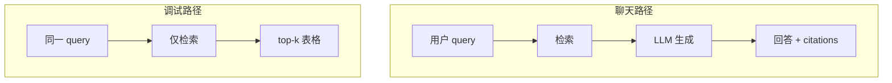

# Next.js 学习系列（十一）：检索调试台——top-k、score 与 bad case 排查

> [第十篇](10.file-upload-index-progress.md) 打通了上传与索引，[第九篇](09.citation-source-ui.md) 聊天里能点引用——但用户说「答错了」，是 **检索没召回** 还是 **模型胡编**？聊天界面 alone 看不出来。路线图 F2 #199 要求能「输入 query 看 top-k」。这篇是系列第十一篇（RAG 排障）：后端 **`POST /api/debug/retrieve`** 返回带 **score** 的 chunk 列表；前端在 **`/debug/retrieve`** 做 **查询 + 结果表**。偏概念与能跑通的步骤；真向量库见路线图阶段 2。概念可对照 [React（十三）](../react/13.retrieval-debug-console.md)；本篇用 **JS + `fetch`**，不用 TanStack Query。

---

## 目录

1. [前言：聊天界面看不出检索质量](#1-前言聊天界面看不出检索质量)
2. [调试台在 RAG 排障里站哪](#2-调试台在-rag-排障里站哪)
3. [API 设计：RetrieveHit 形状](#3-api-设计retrievehit-形状)
4. [后端：模拟 top-k 检索](#4-后端模拟-top-k-检索)
5. [lib/retrieve.js：调试 API](#5-libretrievejs调试-api)
6. [RetrieveHitTable：结果表格](#6-retrievehittable结果表格)
7. [综合实战：填满 /debug/retrieve](#7-综合实战填满-debugretrieve)
8. [与 /chat 串联：带 query 跳转](#8-与-chat-串联带-query-跳转)
9. [常见陷阱与 FAQ](#9-常见陷阱与-faq)
10. [总结与系列下一步](#10-总结与系列下一步)

---

## 1. 前言：聊天界面看不出检索质量

第十篇典型后续：

- 问「年假几天」回答离谱——**库里没 chunk** 还是 **模型没听话**？
- 想调 `top_k`，只有后端日志，产品同学看不到。
- 引用 `[1]` 的 `snippet` 和心里预期对不上。

**检索调试台**（Retrieval Debug Console）：输入与聊天相同的 **query**，直接展示 **top-k 片段与分数**，**不调用 LLM**。  
通俗说：只打开「搜索结果页」，不打开「写作文的模型」。

**top-k**：检索时取得分最高的前 **k** 条片段。  
通俗说：只看最像的前 5 条，不是全库扫描。

读完本文，你应该能做到：

1. 说清 `RetrieveHit` 字段，并与第九篇 `Citation` 对齐。
2. 实现 FastAPI `POST /api/debug/retrieve` 返回模拟排序结果。
3. 在 `app/debug/retrieve/page.js` 完成输入、提交、表格、展开 snippet。
4. 用 `fetch` + `useState` 发调试请求（点按钮才查）。
5. 从 `/chat` 链到调试台，可选带 `?q=` 预填问题。

**前置阅读**：

| 篇章 | 必看内容 |
|------|----------|
| [Next（九）](09.citation-source-ui.md) | `Citation`、`snippet` |
| [Next（六）](06.rag-frontend-skeleton.md) | `/debug/retrieve` 路由 |
| [Next（五）](05.fullstack-next-fastapi.md) | `getApiRoot`、`rewrites` |

**环境**：`my-fullstack-next/` 第七～十篇已通。

### 1.1 本文边界

不深究：混合检索 BM25+向量、reranker 可视化、生产权限（调试台应内网或管理员）。

目标：**输入问题 → 表格 ≥3 条命中 + score → 点击行展开 snippet。**

**阅读时间预期**：API + 表格 + 与 `/chat` 串联约 **2.5～4 小时**。建议先 `curl` POST 调试接口，确认 `hits` 形状，再做表格——不要用 `/chat/stream` 猜检索结果。

### 1.4 典型卡点（第十一篇专属）

| 卡点 | 本质 | 本篇怎么解 |
|------|------|------------|
| 答错了不知怪谁 | 聊天混了生成 | 独立 debug API |
| score 看不懂 | 未统一「越大越好」 | §6 表头标注 |
| 与聊天引用对不上 | top_k 或 mock 数据不同 | §8 hit→citation |
| `useSearchParams` 构建报错 | App Router 边界 | §7.1 Suspense |
| 空表格 | query 太偏或 mock 无命中 | §4 换关键词 |

### 1.5 动手路径

| 步骤 | 做什么 | 章节 |
|------|--------|------|
| 1 | 约定 JSON 形状 | §3 |
| 2 | FastAPI `debug/retrieve` | §4 |
| 3 | `lib/retrieve.js` | §5 |
| 4 | `RetrieveHitTable.js` | §6 |
| 5 | `debug/retrieve/page.js` | §7～§8 |

### 1.6 本篇新增/修改文件

```text
backend/main.py                      # 追加 debug 路由
frontend/src/
├── lib/retrieve.js                  # 新建
├── components/RetrieveHitTable.js   # 新建
└── app/debug/retrieve/page.js       # 替换第六篇占位
```

---

## 2. 调试台在 RAG 排障里站哪



读图对比：**调试路径不调 LLM**。这里就 0 条命中 → 修索引或 query；有命中但聊天仍错 → 修 Prompt 或生成。

| 现象 | 调试台先看 |
|------|------------|
| 0 条命中 | 未入库、chunk 太大、query 不匹配 |
| 有命中但 score 低 | top_k、阈值、embedding |
| 命中对但回答错 | 生成 / Prompt |
| 与 citation 不一致 | 字段映射或缓存 |

### 2.1 bad case 排查剧本（建议打印贴显示器旁）

产品同学说「答错了」时，按顺序问三个问题——**不要先改 Prompt**：

```text
1. 打开 /debug/retrieve，输入同一句话
   → 0 条命中？  先查索引/上传是否 done（第十篇）
   → 有命中但 score 都 < 0.3？  调 top_k、查 embedding（后端）
   → top-1 snippet 看起来对？  进入 2

2. 回 /chat 看 citations[0].snippet 与调试台 top-1 是否同一来源
   → 不一致？  聊天与调试是否同一 mock 数据、top_k 不同
   → 一致？  进入 3

3. 判定为「检索对、生成错」——改 Prompt、温度、或模型
```

调试台的价值：**把步骤 1 从「猜」变成「看表」**。

### 2.2 score 怎么读（初学者版）

本篇 mock 用 0～1，**越大越相关**：

| score 区间 | 通俗理解 | 建议动作 |
|------------|----------|----------|
| ≥ 0.7 | 很相关 | 正常应进 citations |
| 0.4～0.7 | 可能相关 | 看 snippet 是否真有用 |
| < 0.4 | 弱相关 | 考虑改 query 或扩库 |
| 全行相同 | mock 算法太粗 | 接真向量库后会更拉开 |

**不要**把 score 当「准确率百分比」——它只是相似度排序用的相对值。

### 2.3 三个虚构 bad case 走查（当练习读）

**Case A：问「年假几天」，聊天胡编，调试台 0 命中**  
→ 结论：检索层没召回（可能没上传员工手册或 chunk 不含「年假」）。  
→ 动作：第十篇确认 ingest；换 query「年假」在调试台再试。

**Case B：调试台 top-1 明显对，聊天仍乱答**  
→ 结论：生成层没遵守引用（Prompt、温度、模型能力）。  
→ 动作：后端加「仅依据以下片段」；前端无需改表格。

**Case C：调试台 top-1 与聊天 `[1]` snippet 不同**  
→ 结论：两条 API 用了不同 mock 或不同 top_k。  
→ 动作：对齐 `MOCK_CHUNKS` 与 `MOCK_CITATIONS` 数据源（第九篇 §10.9）。

把 A/B/C 抄在笔记里，下次答错了先对号入座，比盲目改 Prompt 快。

---

## 3. API 设计：RetrieveHit 形状

与第九篇 `Citation` 对齐，并加检索字段（本篇用 JSDoc，系列仍用 JS）：

```javascript
/**
 * @typedef {Object} RetrieveHit
 * @property {number} rank          1-based 排名
 * @property {number} score        0~1，越大越相关（本篇约定）
 * @property {string} chunk_id
 * @property {string} document_id
 * @property {string} title
 * @property {string} source
 * @property {number|null} [page]
 * @property {string} snippet
 */

/**
 * @typedef {Object} RetrieveDebugResponse
 * @property {string} query
 * @property {number} top_k
 * @property {RetrieveHit[]} hits
 * @property {number} took_ms
 */
```

| Citation（九） | RetrieveHit（十一） |
|----------------|---------------------|
| `id` | `rank`（展示用） |
| `title`, `source`, `page`, `snippet` | 同左 |
| — | `score`, `chunk_id`, `document_id` |

---

## 4. 后端：模拟 top-k 检索

演示什么：不连向量库，用关键词简单打分。  
在 `main.py` 追加（与第七～十篇同 `app`）：

```python
import re
import time
from pydantic import Field


MOCK_CHUNKS = [
    {
        "chunk_id": "c1",
        "document_id": "d1",
        "title": "RAG 入门笔记",
        "source": "docs/rag-intro.md",
        "page": None,
        "snippet": "RAG = Retrieval-Augmented Generation：先检索相关片段，再交给大模型生成。",
    },
    {
        "chunk_id": "c2",
        "document_id": "d2",
        "title": "向量检索 FAQ",
        "source": "docs/faq.pdf",
        "page": 3,
        "snippet": "混合检索结合 BM25 与向量相似度，常用 RRF 融合排序。",
    },
    {
        "chunk_id": "c3",
        "document_id": "d3",
        "title": "员工手册",
        "source": "docs/handbook.pdf",
        "page": 12,
        "snippet": "年假不少于 10 个工作日，需提前在系统申请。",
    },
]


class RetrieveDebugRequest(BaseModel):
    query: str = Field(min_length=1)
    top_k: int = Field(default=5, ge=1, le=20)


def _mock_score(query: str, snippet: str) -> float:
    words = [w for w in re.split(r"\W+", query.lower()) if len(w) > 1]
    if not words:
        return 0.0
    text = snippet.lower()
    hits = sum(1 for w in words if w in text)
    return min(1.0, hits / len(words))


@app.post("/api/debug/retrieve")
def debug_retrieve(body: RetrieveDebugRequest):
    t0 = time.perf_counter()
    scored = [( _mock_score(body.query, ch["snippet"]), ch) for ch in MOCK_CHUNKS]
    scored.sort(key=lambda x: x[0], reverse=True)
    top = scored[: body.top_k]

    hits = []
    for i, (score, ch) in enumerate(top, start=1):
        hits.append(
            {
                "rank": i,
                "score": round(score, 4),
                "chunk_id": ch["chunk_id"],
                "document_id": ch["document_id"],
                "title": ch["title"],
                "source": ch["source"],
                "page": ch.get("page"),
                "snippet": ch["snippet"],
            }
        )

    took_ms = int((time.perf_counter() - t0) * 1000)
    return {
        "query": body.query,
        "top_k": body.top_k,
        "hits": hits,
        "took_ms": took_ms,
    }
```

### 4.1 _mock_score 在算什么（读懂算法比背 API 重要）

```python
words = 从 query 里拆出长度>1 的词（小写）
hits = 这些词在 snippet 里出现了几个
score = hits / len(words)，上限 1.0
```

| query | 最可能排第一的 chunk | 原因 |
|-------|---------------------|------|
| 「年假」 | 员工手册 | snippet 含「年假」 |
| 「RAG」 | RAG 入门笔记 | 含 RAG 全称 |
| 「不存在xyz」 | 可能全员低分 | 词都不命中 |

这是**关键词玩具检索**，不是向量相似度——但足够教你：**调试台要先能解释「为啥这条排第一」**。接真向量库后，JSON 形状不变，只换 `scored` 的计算。

### 4.2 curl 自测与页面结果对照

自测：

```bash
curl -X POST http://localhost:8000/api/debug/retrieve \
  -H "Content-Type: application/json" \
  -d "{\"query\":\"年假\",\"top_k\":3}"
```

预期：`员工手册` 片段 `score` 相对较高。

---

## 5. lib/retrieve.js：调试 API

演示什么：封装 POST，复用 `getApiRoot`。  
前置：第五、六篇 `lib/api.js`。

```javascript
// src/lib/retrieve.js
import { getApiRoot } from './api.js'

/**
 * @param {{ query: string, top_k?: number }} params
 * @returns {Promise<import('./retrieve.js').RetrieveDebugResponse>}
 */
export async function debugRetrieve({ query, top_k = 5 }) {
  const res = await fetch(`${getApiRoot()}/debug/retrieve`, {
    method: 'POST',
    headers: { 'Content-Type': 'application/json' },
    body: JSON.stringify({ query, top_k }),
  })
  if (!res.ok) {
    const text = await res.text().catch(() => '')
    throw new Error(text || `HTTP ${res.status}`)
  }
  return res.json()
}
```

为何不用 TanStack Query：**调试是点按钮才发**，`useState` + `async function handleSearch` 足够；进阶见 README 对照 [React（十二）](../react/12.tanstack-query.md)。

先错或对：

```javascript
// ❌ 用聊天流式接口测检索——混了生成，无法单独评召回
fetch(`${getApiRoot()}/chat/stream`, ...)

// ✅ 独立 debug API
debugRetrieve({ query, top_k })
```

### 5.1 为何路径是 `/debug/retrieve` 而不是 `/retrieve`

与第六篇路由预留一致：`app/debug/retrieve/page.js` → 用户访问 `/debug/retrieve`。  
`getApiRoot()` 在浏览器通常是 `/api`，故 fetch URL 为 **`/api/debug/retrieve`**，经 rewrites 到 FastAPI。

| 层 | 路径 |
|----|------|
| 浏览器地址栏 | `/debug/retrieve` |
| fetch URL | `/api/debug/retrieve` |
| FastAPI 路由 | `@app.post("/api/debug/retrieve")` |

三层名字接近但**不必完全相同**——关键是 rewrites 把 `/api/*` 转到后端。

### 5.2 handleSearch 与聊天的 fetch 差异

| | `/chat` stream | debug retrieve |
|---|----------------|----------------|
| 方法 | POST + 读流 | POST + `res.json()` |
| 频率 | 用户每问一次 | 用户点「检索」一次 |
| 适合 Query 缓存 | 否 | 可加（进阶） |

调试台**不要**在 `useEffect` 里自动 POST——否则 Strict Mode 或每次改 `top_k` 都会狂请求。点按钮才查（与第三篇「用户列表进页拉一次」不同）。

---

## 6. RetrieveHitTable：结果表格

演示什么：`rank` / `score` / 预览，点击展开全文。

### 6.1 表格列设计的教学意图

| 列 | 给初学者什么信息 |
|----|------------------|
| `#`（rank） | 排序结果中的第几名——对应聊天里的 `[1]` |
| `score ↑` | 表头注明越大越好，避免误读 |
| 文档 | `title` + `source`，快速知道哪份文件 |
| 片段预览 | 前几十字，不用展开也能扫一眼 |

点击行展开 **完整 snippet**——与第九篇 `SourcePanel` 同类信息，但调试台一次看 **top-k 多条**，方便对比「为啥第二条也进来了」。

### 6.2 expandedId 与 chunk_id

用 `chunk_id` 做展开状态，不用 `rank`——因为 rerank 后排名可能变，**chunk 身份更稳定**。  
`Fragment key={h.chunk_id}` 避免 React 列表警告。

新建 `components/RetrieveHitTable.js`：

```jsx
// src/components/RetrieveHitTable.js
'use client'

import { Fragment, useState } from 'react'

export default function RetrieveHitTable({ hits }) {
  const [expandedId, setExpandedId] = useState(null)

  if (!hits?.length) {
    return <p>无命中。请检查知识库是否已索引或换 query。</p>
  }

  return (
    <table style={{ width: '100%', borderCollapse: 'collapse', fontSize: 14 }}>
      <thead>
        <tr style={{ textAlign: 'left', borderBottom: '2px solid #e5e7eb' }}>
          <th style={{ padding: 8 }}>#</th>
          <th style={{ padding: 8 }} title="越大越相关">score ↑</th>
          <th style={{ padding: 8 }}>文档</th>
          <th style={{ padding: 8 }}>片段预览</th>
        </tr>
      </thead>
      <tbody>
        {hits.map((h) => (
          <Fragment key={h.chunk_id}>
            <tr
              onClick={() =>
                setExpandedId((id) =>
                  id === h.chunk_id ? null : h.chunk_id
                )
              }
              style={{
                cursor: 'pointer',
                borderBottom: '1px solid #f3f4f6',
                background:
                  expandedId === h.chunk_id ? '#f9fafb' : undefined,
              }}
            >
              <td style={{ padding: 8 }}>{h.rank}</td>
              <td style={{ padding: 8 }}>{Number(h.score).toFixed(3)}</td>
              <td style={{ padding: 8 }}>
                {h.title}
                {h.page != null && ` · p.${h.page}`}
              </td>
              <td style={{ padding: 8, color: '#4b5563' }}>
                {h.snippet.slice(0, 60)}
                {h.snippet.length > 60 ? '…' : ''}
              </td>
            </tr>
            {expandedId === h.chunk_id && (
              <tr>
                <td colSpan={4} style={{ padding: '8px 12px 16px' }}>
                  <pre
                    style={{
                      margin: 0,
                      whiteSpace: 'pre-wrap',
                      background: '#f3f4f6',
                      padding: 12,
                      borderRadius: 8,
                    }}
                  >
                    {h.snippet}
                  </pre>
                  <div
                    style={{ fontSize: 12, color: '#6b7280', marginTop: 6 }}
                  >
                    chunk: {h.chunk_id} · source: {h.source}
                  </div>
                </td>
              </tr>
            )}
          </Fragment>
        ))}
      </tbody>
    </table>
  )
}
```

**key 写在 `Fragment` 上**：`map` 返回多行时避免 React 警告。

---

## 7. 综合实战：填满 /debug/retrieve

**阅读顺序**：§4～§6 完成后再写 `page.js`。

替换第六篇占位，整页 **Client**（表单 + 请求 + 表格）：

```jsx
// src/app/debug/retrieve/page.js
'use client'

import { useEffect, useState } from 'react'
import Link from 'next/link'
import { useSearchParams } from 'next/navigation'
import RetrieveHitTable from '../../../components/RetrieveHitTable.js'
import { debugRetrieve } from '../../../lib/retrieve.js'

export default function RetrieveDebugPage() {
  const searchParams = useSearchParams()
  const [query, setQuery] = useState('')
  const [topK, setTopK] = useState(5)
  const [data, setData] = useState(null)
  const [loading, setLoading] = useState(false)
  const [error, setError] = useState(null)

  useEffect(() => {
    const q = searchParams.get('q')
    if (q) setQuery(q)
  }, [searchParams])

  async function handleSearch(e) {
    e.preventDefault()
    if (!query.trim() || loading) return

    setLoading(true)
    setError(null)
    setData(null)

    try {
      const result = await debugRetrieve({
        query: query.trim(),
        top_k: topK,
      })
      setData(result)
    } catch (err) {
      setError(err.message)
    } finally {
      setLoading(false)
    }
  }

  return (
    <section style={{ maxWidth: 900 }}>
      <div
        style={{
          display: 'flex',
          justifyContent: 'space-between',
          alignItems: 'center',
        }}
      >
        <h1>检索调试</h1>
        <Link href="/chat">← 返回聊天</Link>
      </div>
      <p style={{ color: '#6b7280', fontSize: 14 }}>
        只测检索、不调用 LLM。用于排查「没召回」类 bad case。
      </p>

      <form
        onSubmit={handleSearch}
        style={{ display: 'flex', gap: 8, marginBottom: 16, flexWrap: 'wrap' }}
      >
        <input
          value={query}
          onChange={(e) => setQuery(e.target.value)}
          placeholder="输入与聊天相同的 query…"
          style={{ flex: 1, minWidth: 200, padding: 8 }}
        />
        <label>
          top_k
          <input
            type="number"
            min={1}
            max={20}
            value={topK}
            onChange={(e) => setTopK(Number(e.target.value))}
            style={{ width: 56, marginLeft: 4 }}
          />
        </label>
        <button type="submit" disabled={loading}>
          {loading ? '检索中…' : '检索'}
        </button>
      </form>

      {error && <p style={{ color: '#b91c1c' }}>{error}</p>}

      {data && (
        <>
          <p style={{ fontSize: 13, color: '#6b7280' }}>
            query: 「{data.query}」 · {data.hits.length} 条 · {data.took_ms}{' '}
            ms
          </p>
          <RetrieveHitTable hits={data.hits} />
        </>
      )}
    </section>
  )
}
```

### 7.0 页面 state 与「为何不用 useEffect 自动查」

| state | 初值 | 何时变 |
|-------|------|--------|
| `query` | `''` 或 URL `?q=` | 用户输入 |
| `topK` | `5` | 用户改数字 |
| `loading` | false | 提交检索时 true |
| `error` | null | 失败时 |
| `data` | null | 成功时整包响应 |

调试台**不在** `useEffect` 里自动 POST——与第三篇「进页拉用户列表」不同。检索调试是 **用户显式点按钮** 才发请求，避免 Strict Mode 或改 `topK` 时重复打 API。

### 7.0.1 空结果怎么向非技术同事解释

| 表格 | 说法 | 下一步 |
|------|------|--------|
| 无命中 | 「库里可能没有这句相关的段落」 | 查上传、索引、换问法 |
| 有行但分低 | 「找到了但都不太像」 | 调 top_k、混合检索 |
| top-1 对但聊天错 | 「资料对了，模型没写好」 | Prompt / 模型 |
| 与聊天引用不一致 | 「两条链路数据不同步」 | 对齐后端 mock |

### 7.1 useSearchParams 与 Suspense（了解即可）

Next App Router 中 `useSearchParams()` 在构建时可能要求外层 **`Suspense`**。本地 `npm run dev` 一般直接可用；若 `next build` 报错，在 `app/debug/retrieve/` 加 `loading.js` 或把表单拆到子组件外包一层：

```jsx
// app/debug/retrieve/page.js（可选拆法）
import { Suspense } from 'react'
import RetrieveDebugClient from './RetrieveDebugClient.js'

export default function Page() {
  return (
    <Suspense fallback={<p>加载…</p>}>
      <RetrieveDebugClient />
    </Suspense>
  )
}
```

初学可把上面代码都放在一个 `'use client'` 文件里，遇 build 问题再拆。

### 7.2 自测表

| 步骤 | 操作 | 预期 |
|------|------|------|
| 1 | query=「年假」, top_k=3 | 员工手册 score 较高 |
| 2 | 点击表格行 | 展开完整 snippet |
| 3 | query=「不存在xyz」 | 命中少或 score 低 |
| 4 | SiteNav 点「检索调试」 | 页面正常 |
| 5 | `curl` 直连 8000 | 与页面结果一致 |

### 7.3 自检清单

- [ ] `POST /api/debug/retrieve` curl 通  
- [ ] 表格显示 rank / score / 预览  
- [ ] 点击展开 snippet  
- [ ] 与 `/chat` 互链  
- [ ] 字段能与第九篇 `Citation` 对应  

### 7.4 逐步验收：每一步你应该看到什么

| 步骤 | 操作 | 预期 | 若不对 |
|------|------|------|--------|
| 1 | `curl` POST debug | JSON 含 `hits` 数组 | §4 路由 |
| 2 | query=「RAG」 | ≥3 行，score 有高低 | mock 数据 |
| 3 | 点表格行 | 展开完整 snippet | RetrieveHitTable |
| 4 | 改 top_k=1 | 只 1 行 | 请求体 top_k |
| 5 | 从 `/chat` 链过来带 `?q=` | 输入框预填 | §8 |
| 6 | 对比聊天 `[1]` | snippet 与 top-1 大致同段 | 映射表 §8 |

### 7.5 闭卷口述

> 「调试台只调 `POST /api/debug/retrieve`，不走 LLM。返回 top-k 条 RetrieveHit，含 score 和 snippet。答错时先看有没有命中——没有就查上传索引；有命中再看聊天引用是否一致；都对了才怀疑生成。」

### 7.6 分层排错

```text
层 1：curl debug 有 hits？
  失败 → main.py 路由、POST body
  成功 ↓
层 2：页面表格空？
  失败 → lib/retrieve.js、rewrites
  成功 ↓
层 3：score 全 0 或乱序？
  → mock 算法预期；真库另论
层 4：与 chat citations 对不上？
  → top_k、MOCK 数据是否同源
```

---

## 8. 与 /chat 串联：带 query 跳转

在 [第九篇](09.citation-source-ui.md) `chat/page.js` 标题旁加链接（可选）：

```jsx
import Link from 'next/link'

// 在 h1 附近
<Link
  href={`/debug/retrieve?q=${encodeURIComponent(input)}`}
  style={{ fontSize: 14, marginLeft: 12 }}
>
  用当前问题调试检索
</Link>
```

`input` 为空时 URL 为 `?q=`，调试页可手动改 query。

**hit → citation 对照**（排查时心里映射）：

```javascript
function hitToCitation(h) {
  return {
    id: h.rank,
    title: h.title,
    source: h.source,
    page: h.page,
    snippet: h.snippet,
  }
}
```

调试台看到 top-1 与聊天 `[1]` 不一致时，查后端是否用了不同 top_k 或 rerank。

### 8.1 带 query 跳转的 URL 编码

`encodeURIComponent(input)` 防止用户问题里的 `&`、`?` 破坏 query string。  
调试页用 `useSearchParams().get('q')` 读回——空字符串时允许用户手改。

### 8.2 团队工作流：谁该常开调试台

| 角色 | 用法 |
|------|------|
| 算法 / 后端 | 调 mock/向量分、top_k |
| 产品 | 看 bad case 是否「没召回」 |
| 前端 | 核对 `Citation` 字段与表格一致 |

本篇做进 `SiteNav` 是为了强调：**检索质量不是只后端关心的事**。

---

## 9. 常见陷阱与 FAQ

### 9.1 陷阱一：调试台对公网开放

应加登录或内网；本篇 Demo 仅本地。

### 9.2 陷阱二：score 方向不一致

本篇 **越大越好**；表头标注 `score ↑`。

### 9.3 陷阱三：用 `/chat/stream` 测检索

流式接口混了生成——**必须**独立 debug API。

### 9.4 陷阱四：在 Server page 里 `useSearchParams`

会报错——调试页保持 **`'use client'`**（第六篇已预留路由）。

### 9.5 FAQ

**Q：和 React（十三）差在哪？**  
A：无 TS / TanStack Query；页面在 `app/debug/retrieve/page.js`；预填 query 用 **`?q=`** 而非 React Router `state`。

**Q：真向量库怎么接？**  
A：替换 `_mock_score`；**响应 JSON 形状不变**。

**Q：要 BM25 vs 向量两列？**  
A：阶段 2 进阶；初学一列 `score` 即可。

**Q：和 RAGAS？**  
A：RAGAS 离线评测；调试台在线人工看召回，互补。

**Q：调试台能代替单元测试吗？**  
A：不能；它是**人工验收**工具，适合 Demo 与 bad case 沟通。

**Q：query 能保存历史吗？**  
A：进阶 localStorage 存最近十条；本篇不做。

**Q：导出 CSV？**  
A：作业：把 `hits` 转 CSV 下载，方便产品分析。

**Q：与 LangSmith 等 trace 工具？**  
A：互补；trace 看链路，调试台看检索结果快照。

### 9.5.1 FAQ 小结

调试台解决「这一条 query 召回啥」；不是替代日志平台，而是给产品/前端一个**可点击的检索视图**。完成第十一篇后，请打开第十二篇做全站彩排。调试台页面应保持简洁：一个输入框、一个 top_k、一张表——功能够用即可。第十一篇收束：答错先 `/debug/retrieve`，再决定改检索还是生成。

### 9.5.2 第十一篇收束三问

1. 调试台为何不调 LLM？  
2. score 越大越好还是越小越好？  
3. bad case A/B/C 各先改谁？

第十一篇是前端参与 RAG 质量的最低门槛：会写聊天页不够，还要会证明检索是否靠谱。把 `/debug/retrieve` 链进 SiteNav，提醒自己和其他人一样会用到它。检索调试是 RAG 迭代中最常打开的页面之一，值得单独收藏书签。练两次 query：「年假」与「RAG」，确认 mock 排序符合 §4.1 表。第十一篇完成后，RAG 前端六～十一 的能力应全部可在浏览器里点通。打开第十二篇，用 §3.2 自检清单给全站做一次毕业考。调试台不是可选项，而是 RAG 产品可维护性的标志之一。把 bad case 三步排查写在便签上，比再读一遍全文更高效。

### 9.5.3 第十一篇动手复盘（建议 20 分钟）

1. curl POST debug，保存 JSON。  
2. 页面搜「年假」，展开 top-1 snippet。  
3. 从 `/chat` 带 `?q=` 跳转，确认预填。  
4. 对比聊天 `[1]` 与 top-1 是否同源。  

四步全过即可进入第十二篇收官。第十一篇完结：你已有工具单独验证检索，而不必猜模型。检索质量是 RAG 的地基；聊天 UI 再漂亮，地基松了也会塌。请把 `/debug/retrieve` 与 `/chat` 互链，形成「问→查→证」动线。

### 9.5.4 调试台与聊天联调清单

| 检查项 | 通过标准 |
|--------|----------|
| 同 query 两条路 | debug 与 chat 都能发 |
| top-1 与 `[1]` | snippet 大致同段（mock 一致时） |
| SiteNav | 两页互链可点 |
| top_k 改动 | 表格行数随之变化 |
| 空 query | 前端或后端拒绝提交 |

联调通过后再做第十二篇全站彩排。§9.5.4 五格清单与 §2.3 bad case 树配套使用：先对号入座判定 A/B/C，再带着调试台截图讨论改索引还是改 Prompt。

### 9.5.5 初学者易混：调试台 vs 聊天页

| 维度 | `/debug/retrieve` | `/chat` |
|------|-------------------|---------|
| 输出形态 | JSON 命中表 | SSE 流式正文 + citations |
| 是否调 LLM | 否，只召回 | 是，检索后生成 |
| 典型排错 | 0 命中、排序反常 | 流断、引用与 top-1 对不上 |
| query 带入 | 支持 `?q=` 预填 | 用户输入或从调试页跳转 |

记住：**调试台回答「模型能看见哪些 chunk」；聊天页回答「模型最终说了什么」**——两者互补，不可互相替代。

### 9.5.6 mock 联调：三个必做 query

| query | 期望 top-1 主题 | 用来练什么 |
|-------|-----------------|------------|
| 年假 | 员工手册 | 业务词命中行政文档 |
| RAG | 入门笔记 | 技术词命中教程文档 |
| xyznotexist | 0 命中或低分 | bad case A：索引或分词 |

用同一句 query 在 `/debug/retrieve` 与 `/chat` 各走一遍，确认 `[1]` 的 snippet 与表格第一行同源——这是第十一篇最重要的十分钟练习。

### 9.5.7 截图存档建议（团队协作）

向同事报「检索不对」时，请附三张图：**调试台 top-3 表**、**聊天 citations 卡片**、**Network 里 debug 请求的 JSON**。比口头描述「感觉搜偏了」更能推动后端改 embedding 或分块策略。

---

### 9.6 本篇时间预算

| 阶段 | 时长 | 验收 |
|------|------|------|
| §2～§3 概念 | 30 分钟 | 能讲 bad case 三步 |
| §4～§5 API | 60 分钟 | curl 通 |
| §6～§7 UI | 90 分钟 | §7.4 六步 |
| 与 chat 串联 | 30 分钟 | `?q=` 预填 |

### 9.7 三条 MOCK_CHUNKS 的设计意图

| chunk | 训练读者什么 |
|-------|--------------|
| RAG 入门 | 技术 query「RAG」应命中 |
| 向量 FAQ | 混合检索相关词 |
| 员工手册 | 业务 query「年假」应命中 |

故意用 **不同文档类型**，让你习惯「同一调试台要试多种问法」——只测「RAG」不能证明年假问答也准。

### 9.8 从调试台到改后端的决策表

| 调试台观察 | 优先改的后端 | 前端要不要动 |
|------------|--------------|--------------|
| 0 命中 | ingest、分块、是否入库 | 一般不动 |
| 有命中但 score 低 | embedding 模型、top_k、混合检索 | 可调默认 top_k |
| top-1 对、回答错 | Prompt、温度、模型 | 可加「仅依据引用」文案 |
| snippet 太长看不清 | 后端截断策略 | 表格预览长度 |

### 9.9 第十一与第九篇联调剧本

1. `/chat` 问「年假」→ 记下 `[1]` 的 title/snippet。  
2. `/debug/retrieve?q=年假` → 看 top-1 是否同为员工手册。  
3. 若不同：查 chat 与 debug 是否同一 `MOCK` 数据源。  
4. 若相同但回答仍错：向听众声明「检索 OK，生成需调 Prompt」。

### 9.10 生产权限（必提一句）

调试台能暴露 **内部文档片段**——上线必须加登录、IP 白名单或管理员角色。Demo 本地全开不代表产品也全开；面试时主动说这句，体现工程成熟度。

### 9.11 扩展：表格里还能加什么列（路线图）

| 列 | 阶段 | 作用 |
|----|------|------|
| `chunk_id` | 已有 | 与库对齐 |
| BM25 score / 向量 score | 阶段 2 | 混合检索对比 |
| rerank score | 阶段 2+ | 精排前后 |
| 是否进入 Prompt | 进阶 | 标注最终喂模型的 chunk |

列越多越像内部工具——初学 **rank + score + snippet** 三列够演示。

### 9.12 调试台与自动化评测分工

| 工具 | 何时用 |
|------|--------|
| 本篇调试台 | 开发中人工看一条 query |
| 批量 JSONL 评测 | 回归测试 hundreds queries |
| RAGAS 等框架 | 离线指标（faithfulness 等） |

不要指望调试台替代评测集；它是 **「当下这条问句怎么回事」** 的放大镜。

### 9.13 RetrieveHit 字段逐项（初学者背诵版）

| 字段 | 一句话 |
|------|--------|
| `rank` | 排第几，从 1 开始 |
| `score` | 多像这条 query，本篇越大越好 |
| `chunk_id` | 库内块唯一 id |
| `document_id` | 属于哪份文档 |
| `title` / `source` | 给人看的文件名与路径 |
| `page` | PDF 页码，可无 |
| `snippet` | 命中那段原文 |

与第九篇 `Citation` 差在 **rank/score/chunk_id**——调试信息更全，UI 可只展示子集。

### 9.14 top_k 调参时前端能做什么

`debug/retrieve` 页上的 `top_k` 数字输入不是摆设——产品/算法联调时会反复试 3、5、10：

| top_k 太小 | top_k 太大 |
|------------|------------|
| 漏掉相关段 | 噪声进 Prompt，模型分心 |
| 调试台一眼看清 | 表格长，难对比 |

前端只负责把用户选的 k 传给 API；**好不好**要靠调试台与聊天效果一起判。养成习惯：bad case 先记下当时用的 k。

### 9.15 第十一篇在 6～12 中的位置

```text
6 骨架 → 7～9 问答体验 → 10 数据入口 → 11 质量放大镜 → 12 串讲交付
```

没有 11，团队会在 Slack 里争论「模型不行」还是「检索不行」——有调试台，争论能对着同一张表。

### 9.16 调试 API 与聊天 API 的隔离原则

| 必须隔离 | 原因 |
|----------|------|
| URL 不同 | 职责不同 |
| 聊天可关 LLM 调试 | 调试台永不调生成 |
| 响应类型不同 | stream vs JSON |

以后加鉴权时，给 `/api/debug/*` 单独加管理员角色——不要与公开 chat 共用同一套宽松 CORS。

### 9.17 把调试台写进 on-call 手册（模板）

1. 用户反馈 query Q 答错。  
2. 打开 `/debug/retrieve?q=Q`。  
3. 记录 top-3 的 title、score、snippet 截图。  
4. 判定 A/B/C（§2.3）并转 ticket 给检索或生成负责人。  

前端本篇只提供 UI；流程是团队资产。

### 9.18 模拟数据与真数据切换开关（延伸）

进阶可在 `main.py` 用环境变量 `USE_MOCK_RETRIEVAL=1` 切换 mock 与真库——前端 **零改动**。调试台的价值之一就是：切换后端实现时，仍用同一页面验收。

### 9.19 第十一篇三句话收束

1. 答错先查检索，再查生成。  
2. 调试台不调 LLM。  
3. `score` 用于排序，不是准确率。

练完本篇，用同一个 query 在 `/chat` 与 `/debug/retrieve` 各走一遍，并写下 top-1 与 `[1]` 是否一致——这是第十一这篇最重要的 10 分钟练习。

检索调试台不会替你自动修索引，但能让你在改 Prompt 之前先问一句：**「模型到底看见资料了吗？」**——这句话值得贴在显示器边。

下一篇 [第十二篇](12.ship-rag-frontend.md) 把 6～11 收成可路演产品——练完本篇务必走一遍全站演示脚本。

动手验收：对 query「年假」与「RAG」各检索一次，能口头解释为何员工手册与入门笔记分别排前——这是第十一篇的「毕业考」。调试台是团队共享的「事实来源」，请养成截图习惯。把 top-k 结果贴进 issue，比只说「检索不好」更能推动后端改进。第十一与第九篇共用 MOCK 故事时，团队沟通成本最低。检索调试页不必做得华丽，**表格准确、snippet 可读** 比动画更重要。完成第十一篇后，你应具备独立判断「检索问题 vs 生成问题」的前端协作能力。请把 §2.3 三个 bad case 抄进你的学习笔记。调试台是 RAG 团队的前端侧「显微镜」，值得单独练到熟练。

---

## 10. 总结与系列下一步

### 10.1 概念速记

| 概念 | 一句话 |
|------|--------|
| 检索调试台 | 只测召回，不生成 |
| top-k | 前 k 条命中 |
| score | 相关性，语义统一 |
| RetrieveHit | 单条命中 + 元数据 |
| bad case | 先调试台再判检索/生成 |

### 10.2 决策树

```text
答错了？
├─ 调试台 0 命中 → 索引 / query
├─ 有命中 score 低 → top_k / embedding
└─ 命中对 → Prompt / 生成

用什么 API？
└─ POST /api/debug/retrieve（不是 chat/stream）
```

### 10.3 RAG 线进度（6～11）

| 篇 | 主题 |
|----|------|
| 6 | 骨架 |
| 7～10 | 聊天闭环 + 上传 |
| **11（本篇）** | **检索排障** |

### 10.4 系列下一步

打开 [第十二篇：收官——路由串联与部署概念](12.ship-rag-frontend.md)，把全站串成可演示产品并建立生产部署心智。

---

> **系列定位**：本篇补上 RAG「可观测」——能聊、能传、还要能**单独验检索**。配合路线图阶段 4：**上传 → 索引 → 问答 → 引用 → 检索可调试**。
