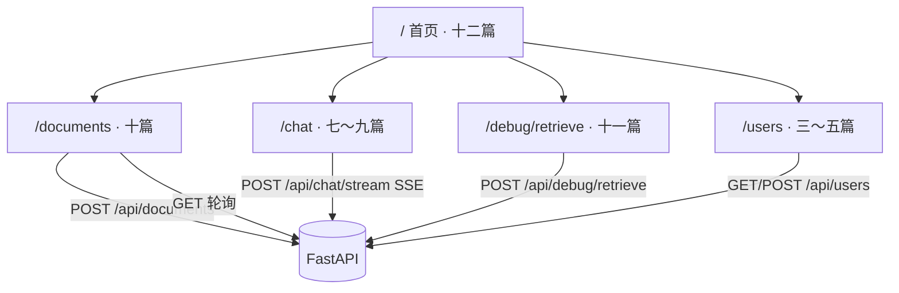

# Next.js 学习系列（十二）：收官——路由串联、演示脚本与部署概念

> 第六～十一篇分别在 `/documents`、`/chat`、`/debug/retrieve` 上落了代码，但**面试官或产品演示**时要的是一条顺畅故事：「上传 → 等索引 → 提问 → 看引用 → 不对就查检索」。这篇是系列**第十二篇、主线收束**：用 **演示脚本 + 全站自检** 把 `my-fullstack-next/` 收成可展示产品，并建立 **开发 vs 生产** 的环境变量与部署心智（不深挖 Docker/K8s，衔接本仓库 [Docker Compose](../11.docker-compose-tutorial.md)）。偏概念与可验收清单；JWT、真向量库、TypeScript 见 README「进阶可选」。

---

## 目录

1. [前言：从「会写页面」到「能演示产品」](#1-前言从会写页面到能演示产品)
2. [知识库助手：路由与能力地图](#2-知识库助手路由与能力地图)
3. [演示脚本：5 分钟业务流](#3-演示脚本5-分钟业务流)
4. [首页收口：把模块入口写成仪表盘](#4-首页收口把模块入口写成仪表盘)
5. [本地构建验收：next build](#5-本地构建验收next-build)
6. [开发 vs 生产：环境变量与 API 地址](#6-开发-vs-生产环境变量与-api-地址)
7. [三种部署拓扑（概念）](#7-三种部署拓扑概念)
8. [生产排错：流式、上传、CORS](#8-生产排错流式上传cors)
9. [对齐路线图阶段 4 与后续学什么](#9-对齐路线图阶段-4-与后续学什么)
10. [全系列回顾与进阶可选](#10-全系列回顾与进阶可选)
11. [常见陷阱与 FAQ](#11-常见陷阱与-faq)
12. [系列收束](#12-系列收束)

---

## 1. 前言：从「会写页面」到「能演示产品」

第十一篇典型后续：

- 各页能跑，但演示时**不知道先点哪、怎么讲**。
- `npm run dev` 惯了，没试过 **`next build`**，上线心里没底。
- 第五篇的 `rewrites` 指向 `localhost:8000`——**生产**还能这么写吗？
- 系列学完，**后端真 RAG** 该从哪继续？

**演示脚本**（Demo Script）：按固定顺序操作产品并讲解每一步在业务上的含义。  
通俗说：彩排好的「5 分钟路演」，不是随便点页面。

**生产环境**（Production）：真实用户访问的部署环境，配置与密钥与本地开发分离。  
通俗说：不是你自己笔记本上的 `localhost`。

读完本文，你应该能做到：

1. 按 **§3 演示脚本** 在 5～8 分钟内完整展示 RAG 前端闭环。
2. 用 **§3.2 全站自检清单** 验收第六～十一篇能力未回退。
3. 在本地跑通 **`npm run build` + `npm start`**，说清与 `dev` 的差异。
4. 画出 **开发双终端** 与 **生产 Next + 独立 API** 两种拓扑。
5. 对照 [企业 RAG 路线图](../ENTERPRISE_RAG_ROADMAP.md) **阶段 4** 应用层，列出你还缺的后端/工程化项。

**前置阅读**：建议已实操 [第六篇](06.rag-frontend-skeleton.md)～[第十一篇](11.retrieval-debug-console.md)；至少通读全文。

**环境**：`my-fullstack-next/` 第七～十一篇功能齐全；Node 18+、Python 3.10+。

### 1.1 本文边界

本篇**不展开**：

- 完整 `docker-compose.yml` 手写（见 [Docker Compose 教程](../11.docker-compose-tutorial.md)）
- Kubernetes、CI/CD、HTTPS 证书申请
- JWT、`middleware.ts` 鉴权
- 真向量库、Celery 队列（路线图阶段 1～3、5）

目标：**能演示 + 能 build + 知道生产要改哪几个配置**。

**阅读时间预期**：演示彩排 + `next build` + 读部署概念约 **2～3.5 小时**。建议先按 §3.2 自检清单逐项打勾，再练 §3.3 口述——不要跳过 build 直接谈上线。

### 1.3 典型卡点（第十二篇专属）

| 卡点 | 本质 | 本篇怎么解 |
|------|------|------------|
| 演示时不知先点哪 | 缺固定脚本 | §3.3 表 |
| 从未 `next build` | 只练 dev | §5 |
| 生产 API 仍写 localhost | rewrites 环境差异 | §6～§7 |
| 演示中索引未完成就问 | 检索不到新文档 | 等 `done` 或讲清限制 |
| 说不清 Server/Client 分工 | 系列跨度大 | §10 能力地图 |

### 1.4 动手路径

| 步骤 | 做什么 | 章节 |
|------|--------|------|
| 1 | 两终端启动 backend + frontend | §3 |
| 2 | 按演示脚本走一遍并打勾 | §3 |
| 3 | （可选）改首页仪表盘文案 | §4 |
| 4 | `next build` / `next start` | §5 |
| 5 | 读部署拓扑与环境变量 | §6～§7 |

---

## 2. 知识库助手：路由与能力地图

读图时对照：**每条路由对应系列哪一篇、调了哪些 API**。



| 路由 | 系列篇 | 核心能力 | 主要 API |
|------|--------|----------|----------|
| `/` | 二、六、十二 | 模块入口 | — |
| `/documents` | 十 | FormData 上传、索引进度 | `POST/GET /api/documents` |
| `/chat` | 七～九 | SSE、Markdown、引用侧栏 | `POST /api/chat/stream` |
| `/debug/retrieve` | 十一 | top-k、score 表格 | `POST /api/debug/retrieve` |
| `/users` | 三～五 | RSC 列表、Server Action 创建 | `GET/POST /api/users` |

顶栏 **SiteNav**（第六篇）应链到：`/`、`/chat`、`/documents`、`/debug/retrieve`、`/users`。

### 2.1 推荐终态目录（核对用）

```text
my-fullstack-next/
├── backend/
│   ├── main.py              # users + chat/stream + documents + debug/retrieve
│   └── requirements.txt
└── frontend/
    ├── next.config.js
    ├── .env.local             # 勿提交 git
    └── src/
        ├── app/
        │   ├── layout.js
        │   ├── page.js
        │   ├── users/...
        │   ├── chat/page.js
        │   ├── documents/page.js
        │   └── debug/retrieve/page.js
        ├── components/
        │   ├── SiteNav.js
        │   ├── ChatMessage.js, ChatInput.js
        │   ├── MarkdownBubble.js
        │   ├── CitationList.js, SourcePanel.js
        │   ├── UploadForm.js, DocumentList.js
        │   └── RetrieveHitTable.js
        └── lib/
            ├── api.js, fetchJSON.js
            ├── sse.js, documents.js, retrieve.js
            └── users.js
```

缺文件时回到对应篇补，**不要新建第二个 Next 项目**。

---

## 3. 演示脚本：5 分钟业务流

### 3.1 启动

```bash
# 终端 1
cd backend
uvicorn main:app --reload --port 8000

# 终端 2
cd frontend
npm run dev
```

浏览器：`http://localhost:3000`。

### 3.2 全站自检清单（演示前必过）

**基础设施**

- [ ] `next.config.js` 含 `/api` → `8000` 的 `rewrites`
- [ ] `.env.local` 有 `API_BASE_URL=http://127.0.0.1:8000`（Server 侧 `/users` 用）
- [ ] `SiteNav` 五链无 404

**RAG 主线（按演示顺序）**

- [ ] **上传**：`/documents` 选 `.md` → 列表出现 → `running` → `done`
- [ ] **聊天**：`/chat` 提问 → 流式 Markdown → 停止按钮有效
- [ ] **引用**：流结束后「参考来源」≥1 条 → 点 `[1]` 侧栏见 snippet
- [ ] **排障**：`/debug/retrieve` query=「年假」→ 员工手册 score 相对较高
- [ ] **串联**：文档页「去问答」、聊天链到调试台（可选 `?q=`）

**CRUD 底座（可选 30 秒）**

- [ ] `/users` 列表 → 新建 → 人数 +1

任一项失败：先查该篇 **排错清单**（第五、七、十、十一篇 §10/§9），不要跳步。

### 3.3 口述演示脚本（面试 / 作品集）

| 顺序 | 你做什么 | 你可以怎么说 |
|------|----------|--------------|
| 1 | 打开 `/`，介绍四模块 | 「这是企业知识库助手前端，Next App Router + FastAPI。」 |
| 2 | `/documents` 上传 | 「用户上传文档，后端异步 ingest，前端轮询进度。」 |
| 3 | 等 `done` | 「索引完成后知识库才可检索；Demo 用内存任务模拟。」 |
| 4 | `/chat` 提问 | 「SSE 流式回答，Markdown 渲染；停止用 AbortController。」 |
| 5 | 点引用 | 「Grounding：每条回答可溯源到 chunk snippet。」 |
| 6 | `/debug/retrieve` 同问题 | 「若答错，先只看检索 top-k，区分检索漏了还是生成胡编。」 |
| 7 | （可选）`/users` | 「同一仓库也演示了 RSC 与 Server Actions CRUD。」 |

整段 **5～8 分钟**；留 2 分钟给提问（Server vs Client、为何聊天不用 Server Action 等——见第七、十一篇 FAQ）。

### 3.3.1 演示话术与页面对应（防忘词）

背不下来时看浏览器地址栏即可想起下一句：

| URL | 一句话业务含义 |
|-----|----------------|
| `/documents` | 知识进库的唯一入口 |
| `/chat` | 消费知识库的对话面 |
| `/debug/retrieve` | 工程师的「检索 X 光」 |
| `/users` | 证明你还会经典全栈 CRUD |

### 3.3.2 演示失败时的降级策略

若现场网络或后端不稳，可降级为「口述 + 截图」：

1. 提前录屏 §3.3 全流程 30 秒；
2. 仓库 README 贴 §3.2 自检勾选截图；
3. 口头强调 API 形状（SSE、citations、FormData）比「必须 live demo」更能体现你理解架构。

---

### 3.4 演示翻车急救（现场别慌）

| 现场情况 | 先做什么 | 对外怎么说 |
|----------|----------|------------|
| `/chat` 无字 | 看 uvicorn 是否在跑；F12 Network | 「后端服务重启一下」 |
| 上传一直 pending | 查终端 traceback | 「Demo 用内存任务，我重启后端」 |
| 引用不出现 | 等流完全结束 | 「引用在 SSE 末尾事件」 |
| 调试台空 | 换 query「RAG」「年假」 | 「mock 数据对关键词敏感」 |
| `next build` 红字 | 看是否 `useSearchParams` | 「我本地 dev 正常，build 提示我拆 Suspense」 |

**原则**：演示前 10 分钟按 §3.2 跑一遍；翻车时**只修一层**（先后端 curl，再浏览器），不要当众大改代码。

### 3.5 给面试官的 30 秒电梯稿（可背诵）

> 「这是一个 Next App Router 知识库助手：文档页 FormData 上传并轮询索引进度；聊天页 Client 读 SSE，Markdown 渲染，流末尾 citations 做侧栏溯源；调试台单独 POST 检索看 top-k，用来排 bad case。用户 CRUD 用 Server Component 和 Server Actions 作对照。开发用 rewrites 把 `/api` 转到 FastAPI，生产会把 API 拆到独立域名并处理 SSE 缓冲。」

---

## 4. 首页收口：把模块入口写成仪表盘

[第六篇](06.rag-frontend-skeleton.md) 已有模块列表；收官时可加 **演示提示** 与 **状态说明**（仍可用 Server 组件，无 Hook）。

演示什么：让 `/` 成为路演入口，而非 create-next-app 默认页。

```jsx
// src/app/page.js — 在第六篇基础上增补
import Link from 'next/link'

const modules = [
  {
    href: '/documents',
    title: '1. 文档',
    desc: '上传并等待索引完成',
    step: '演示第一步',
  },
  {
    href: '/chat',
    title: '2. 对话',
    desc: '流式问答 + Markdown + 引用',
    step: '索引 done 后',
  },
  {
    href: '/debug/retrieve',
    title: '3. 检索调试',
    desc: '只看 top-k，不调用 LLM',
    step: '排障用',
  },
  {
    href: '/users',
    title: '用户 CRUD',
    desc: 'REST + Server Actions 练习',
    step: '可选',
  },
]

export default function HomePage() {
  return (
    <section>
      <h1>知识库助手</h1>
      <p>
        Next.js 系列收官项目：按 <strong>1 → 2 → 3</strong> 演示 RAG 前端闭环。
      </p>
      <ol>
        {modules.map((m) => (
          <li key={m.href} style={{ marginBottom: '1rem' }}>
            <Link href={m.href}>{m.title}</Link>
            <span> — {m.desc}</span>
            <br />
            <small style={{ color: '#6b7280' }}>{m.step}</small>
          </li>
        ))}
      </ol>
      <p style={{ fontSize: 14, color: '#6b7280' }}>
        本地需同时运行 FastAPI (:8000) 与 Next (:3000)。详见第十二篇演示脚本。
      </p>
    </section>
  )
}
```

预期：新访客打开站点的第一眼即知演示顺序。

---

## 5. 本地构建验收：next build

开发 `npm run dev` 与生产构建行为不同：**收束篇应至少本地 build 一次**。

演示什么：验证 TypeScript 未启用时 JS 项目能编译通过。  
前置：`frontend/` 目录。

```bash
cd frontend
npm run build
npm start
```

访问 `http://localhost:3000`，**重复 §3.2 中 RAG 四条**（可略缩）。

| 命令 | 作用 |
|------|------|
| `npm run dev` | 开发：热更新、详细错误 |
| `npm run build` | 编译优化、检查能否生产构建 |
| `npm start` | 以生产模式跑 build 结果 |

**常见 build 失败**：

| 现象 | 处理 |
|------|------|
| `useSearchParams` 相关 | 见 [第十一篇](11.retrieval-debug-console.md) §7.1，`Suspense` 包裹 |
| `window is not defined` | 把访问 `window` 的代码放进 `'use client'` 或 `useEffect` |
| ESLint 报错 | 按提示改，或临时在 `next.config.js` 调 `eslint.ignoreDuringBuilds`（不推荐长期） |

预期：`build` 成功、`start` 后聊天流式仍可用（仍要 backend 在 8000）。

### 5.1 build 时 Next 实际在检查什么（初学者版）

`npm run build` 不只是「压缩代码」，还会：

| 检查 | 和你项目的关系 |
|------|----------------|
| 能否静态分析 import | `layout.js` 里 CSS 路径错会在此暴露 |
| Client / Server 边界 | Server 组件里误用 Hook 会报错 |
| 部分动态 API | `useSearchParams` 可能要求 Suspense（十一篇） |
| 生产 bundle 体积 | 过大时常因整库打进 Client——本篇组件量一般无感 |

**dev 能跑 ≠ build 能过**：收官篇的意义就在于此。建议把「build 成功」写进作品集 README 的验收项。

### 5.2 start 与 dev 体感差异

| | dev | start（生产模式本地） |
|---|-----|----------------------|
| 热更新 | 有 | 无，改代码要重新 build |
| 错误页 | 详细堆栈 | 更简洁 |
| 性能 | 未优化 | 接近上线 |
| API | 仍靠 rewrites + 8000 | 同左 |

本地 `start` 仍**不是**真生产——没有 CDN、没有 HTTPS，但足够验证「编译后流式还能不能聊」。

---

## 6. 开发 vs 生产：环境变量与 API 地址

### 6.1 开发（第五篇起）

```text
浏览器 Client fetch('/api/...')
  → Next :3000 rewrites
  → FastAPI :8000

Server Component fetch
  → API_BASE_URL=http://127.0.0.1:8000/api/...
```

| 变量 | 谁读 | 作用 |
|------|------|------|
| `API_BASE_URL` | Server（`getApiRoot` 在服务端） | 直连后端 |
| （无 `NEXT_PUBLIC_`） | Client 用相对 `/api` | 走 rewrites |

**`.env.local` 不要提交 git**；仓库用 `.env.example` 示意：

```bash
# frontend/.env.example
API_BASE_URL=http://127.0.0.1:8000
```

### 6.2 生产要点

**rewrites 里的 `localhost:8000` 不能原样上线**——要改成：

- 内网 API 地址（如 `http://api.internal:8000`），或
- 公网 API 域名（如 `https://api.example.com`）

Client 侧仍可用相对 `/api`（若 Next 与反代同域）；或设 **`NEXT_PUBLIC_API_BASE`** 指向公网 API（需前后端一起改 `getApiRoot` 逻辑——进阶）。

Server Component 的 `API_BASE_URL` 在生产环境变量里配**服务端可达**的 API 根。

### 6.3 一张表分清「谁在用哪个地址」

初学者混用地址是最常见的生产事故，收官时背这张表：

| 代码位置 | 运行时 | 典型 URL | 配置来源 |
|----------|--------|----------|----------|
| `users/page.js` Server fetch | Node（服务器） | `http://api.internal:8000/api/users` | `API_BASE_URL` |
| `chat/page.js` Client fetch | 浏览器 | `/api/chat/stream` | 相对路径 + rewrites |
| `curl` 直连后端 | 本机终端 | `http://127.0.0.1:8000/...` | 绕过 Next |
| 生产 Client（进阶） | 浏览器 | `https://api.example.com/...` | `NEXT_PUBLIC_*` 或同域反代 |

**记忆口诀**：Server 组件在服务器上跑，它看不见浏览器里的 `localhost:3000`；Client 组件在用户浏览器里跑，应打**用户能访问的** API 入口（通常同域 `/api`）。

### 6.4 .env 文件纪律

| 文件 | 能否提交 git | 内容 |
|------|--------------|------|
| `.env.local` | ❌  never | 本机真实地址、密钥 |
| `.env.example` | ✅ | 只有键名 + 占位值 |
| 托管平台面板 | — | 生产 `API_BASE_URL` |

第十二篇收官时，检查仓库 `git status` 里没有 `.env.local`——若误提交，轮换密钥并写进 `.gitignore`。

---

## 7. 三种部署拓扑（概念）

读图时看 **Next 与 FastAPI 是否分机、浏览器打谁**。

### 7.1 拓扑 A：开发（本系列默认）

```text
[浏览器] → :3000 Next dev → rewrite → :8000 FastAPI
```

### 7.2 拓扑 B：生产分机（常见）

```text
[浏览器] → https://app.example.com     (Next on Vercel / Node)
[浏览器] → https://api.example.com     (FastAPI + Uvicorn/Gunicorn)
```

- Next 上配置 **rewrites 指向 api 域名**，或前端 `NEXT_PUBLIC_*` 直连 API。
- FastAPI 配 **CORS** 允许 `app.example.com`（若浏览器直连 API）。
- 流式 SSE：反代需 **关闭缓冲**（第七篇 `X-Accel-Buffering: no`）。

### 7.3 拓扑 C：Docker Compose 单机（延伸）

```text
[浏览器] → :80 Nginx → / → next:3000
                      → /api → fastapi:8000
```

详见 [Docker Compose 教程](../11.docker-compose-tutorial.md)；本篇只建立「可以一台机编排多服务」的心智。

| 拓扑 | 适合 |
|------|------|
| A | 本地学习 |
| B | 团队演示、前后端独立扩缩 |
| C | 内网 Demo、路线图阶段 5 |

### 7.4 流式与上传在生产反代的注意点（复习七、十篇）

| 能力 | 反代层要做什么 |
|------|----------------|
| SSE `/chat/stream` | 关闭缓冲（`X-Accel-Buffering: no`、proxy_buffering off） |
| 大文件上传 | 提高 `client_max_body_size` 等 |
| WebSocket（若以后用） | Upgrade 头 |

第十二篇不手写 Nginx 配置，但面试时应能说出：**「字一次性出来，先查 SSE 缓冲；上传 413，查 body 大小限制。」**

### 7.5 选型：我这个小团队该用哪种拓扑

| 情况 | 建议 |
|------|------|
| 学习、本地 Demo | 拓扑 A |
| 前后端两人分工部署 | 拓扑 B |
| 要给内网演示、想一键起 | 拓扑 C（Docker） |
| 只有 Vercel 无 Python | Next 静态/Serverless + 独立 API 域（B 变体） |

---

## 8. 生产排错：流式、上传、CORS

| 症状 | 常见原因 | 查哪篇 |
|------|----------|--------|
| 生产聊天一次性出字 | Nginx/CDN 缓冲 SSE | 七、十二 §7.2 |
| 上传 413 | 反代 body 大小限制 | 十 |
| CORS 红字 | 浏览器直连 API 域，未配 CORS | 五 §3 |
| `/users` 空或假数据 | 生产未设 `API_BASE_URL` | 五 §11 |
| 构建过、运行挂 | 环境变量未注入托管平台 | 十二 §6 |

日志：浏览器 **Network**；Next 托管面板日志；FastAPI 终端；延伸 [Linux 日志](../12.linux-commands-log-tutorial.md)。

---

## 9. 对齐路线图阶段 4 与后续学什么

### 9.1 本系列已覆盖（应用层 F2）

| 路线图 | 本系列 |
|--------|--------|
| #188 聊天列表 | 七 |
| #189～190 Markdown / 高亮 | 八 |
| #191～192 流式 / 中断 | 七 |
| #193～195 引用 UI | 九 |
| #196～198 上传 / 进度 | 十 |
| #199 检索调试台 | 十一 |

**阶段 4 前端验收**：按 §3 演示脚本完成 → **你已达标**。

### 9.2 本系列未覆盖（建议下一步）

| 方向 | 说明 | 去哪学 |
|------|------|--------|
| 真 RAG 后端 | ingest、向量库、检索 | [路线图](../ENTERPRISE_RAG_ROADMAP.md) 阶段 1～3 |
| 持久化 | PostgreSQL、任务队列 | PG 教程 8、Docker 11 |
| 工程化 | TS、TanStack Query | React 11～12、README 进阶 |
| 生产化 | 观测、成本 | 路线图阶段 5 |
| 鉴权 | JWT、多租户 | 路线图 F1 #181～183 |

```text
你现在的位置：
  Next 1～12  ✅  RAG 前端可演示
  路线图阶段 4 应用层  ✅（前端部分）
  路线图阶段 1～3 后端 RAG  ⏭ 建议下一步
```

### 9.3 后端 RAG 学习顺序建议（衔接本仓库）

若你刚完成 1～12 前端主线，按路线图建议的后端顺序：

| 顺序 | 主题 | 你会用到前端的哪里 |
|------|------|-------------------|
| 1 | 文档解析与分块 | 第十篇上传的文件 |
| 2 | Embedding + 向量库 | 第十一调试台 score 变真 |
| 3 | 检索 API 与 chat 对接 | 第九篇 citations 来源变真 |
| 4 | 任务队列持久化 | 第十篇轮询改事件推 |

不必等后端全做完再维护前端——**保持 JSON 形状稳定**，前后端可并行。

### 9.4 前端维护者 vs 全栈者的分叉

| 角色 | 12 篇之后 |
|------|-----------|
| 偏前端 | TypeScript、TanStack Query、组件测试、设计系统 |
| 偏全栈 | 路线图阶段 1～3 + Docker Compose 部署 |
| 偏算法 | 检索质量、评测 RAGAS、与十一调试台联调 |

---

## 10. 全系列回顾与进阶可选

### 10.1 能力地图（1～12）

```text
选型 1 → 基础 2 → 数据 3 → CRUD 4～5
        → RAG 骨架 6 → 流式 7 → MD 8 → 引用 9 → 上传 10
        → 排障 11 → 收官 12
```

| 你想交付… | 重点篇章 |
|-----------|----------|
| 会 Next App Router | 1～5 |
| RAG 演示前端 | 6～12 |
| 只会 CRUD | 1～5 即可停 |

### 10.2 进阶可选（README 汇总）

| 主题 | 可参考 |
|------|--------|
| TypeScript | [React（十一）](../react/11.typescript-migration.md) |
| TanStack Query 替代文档轮询 | [React（十二）](../react/12.tanstack-query.md) |
| JWT + `middleware.ts` | 路线图 F1 |
| Route Handler BFF | 第六篇概念 |
| Docker 全栈部署 | [Docker Compose](../11.docker-compose-tutorial.md) |

### 10.3 按目标选「最小复习集」

| 你的目标 | 最少精读 | 可速览 |
|----------|----------|--------|
| 面试 RAG 前端 | 6、7、9、10、12 | 1～5 回顾概念 |
| 只会 Next CRUD | 1～5 | 6～12 看目录 |
| 从 React 系列转来 | 1、3、6 + 对照 React 7～10 | 2、4、5 挑读 |
| 准备接真后端 RAG | 12 §9.2 + 路线图阶段 1～3 | 重复读 7～11 API 形状 |

### 10.4 系列写完后的能力自评（诚实版）

打勾表示「能独立做出来并讲清为什么」，不是「读过」：

- [ ] 说清 Server vs Client 在本系列的切分  
- [ ] 不用抄代码写出 `readSSEStream` 骨架  
- [ ] 解释 citations 为何不与 token 混流  
- [ ] FormData 上传 + 轮询停止条件  
- [ ] 用调试台区分检索错 vs 生成错  
- [ ] 5 分钟演示 + `next build` 通过  

有未勾项：回到对应篇 §「逐步验收」表，**做一遍**比重读全文快。

### 10.5 十二篇一句话总结（背不下来就扫这张表）

| 篇 | 一句话 |
|----|--------|
| 1 | 何时选 Next 而非纯 Vite |
| 2 | App Router 第一页 |
| 3 | Server 拉数据、Client 交互 |
| 4 | Server Actions 写数据 |
| 5 | Next + FastAPI 全栈 CRUD |
| 6 | RAG 四路由骨架 |
| 7 | SSE 流式聊天 |
| 8 | Markdown 与安全 |
| 9 | citations 溯源 |
| 10 | 上传与轮询 |
| 11 | 检索调试台 |
| 12 | 演示、build、部署心智 |

### 10.6 作品集 README 建议结构（可直接抄标题）

1. **项目一句话**：Next + FastAPI 知识库助手 Demo  
2. **演示步骤**：链到 §3.3 表（或录屏 GIF）  
3. **技术栈**：Next App Router、SSE、FormData、无 TS（或注明进阶）  
4. **本地启动**：双终端命令（§3.1）  
5. **已知限制**：内存任务、mock 检索、未做鉴权  
6. **下一步**：路线图阶段 1～3 后端  

诚实写限制比吹嘘「完整 RAG」更加分。

### 10.7 收官后第一周建议动作

| 天 | 动作 |
|----|------|
| 1 | 按 §3.2 自检打勾 + 录屏 |
| 2 | `next build` 修到绿 |
| 3 | 改 README 贴演示链接 |
| 4～5 | 选路线图后端一小节（如 Embedding） |
| 6～7 | 把 mock 检索换成真 API 一条 |

### 10.8 第十二篇面试题自测

| 问题 | 要点 |
|------|------|
| dev 和生产的 API 地址？ | Server `API_BASE_URL`；Client `/api` |
| 演示顺序？ | 上传 done → chat → 引用 → 调试 |
| build 为了查什么？ | 边界、Suspense、生产编译 |
| rewrites 生产能写 localhost 吗？ | 不能，改 API 域 |
| 12 篇后学啥？ | 路线图后端 1～3 或 TS/Query |

### 10.9 系列 1～12 能力矩阵（一张表复习）

| 能力 | 首篇引入 | 收官时应有 |
|------|----------|------------|
| 选型 Next | 1 | 能对比 Vite |
| App Router | 2 | 多路由 |
| Server fetch | 3 | `/users` 列表 |
| Server Actions | 4 | 创建用户 |
| FastAPI 联调 | 5 | rewrites |
| RAG 路由 | 6 | 四链 + nav |
| SSE | 7 | 流式 chat |
| Markdown | 8 | 助手排版 |
| citations | 9 | 侧栏溯源 |
| 上传 | 10 | FormData + 轮询 |
| 调试检索 | 11 | top-k 表 |
| 演示/build | 12 | 本篇 |

空一格就回到该篇 §「逐步验收」，不要跳过整篇。

### 10.10 给「非前端同事」的 2 分钟版

> 我们有一个网页：左边能上传公司文档，等进度条走完；中间能像 ChatGPT 一样问问题，字是逐字出来的，还能点引用看原文；右边工程师有个调试页，能看系统到底搜到了哪几段话。前端用 Next，接口用 Python FastAPI，现在检索还是演示数据，下一步接真向量库。

这段话对应 §3.5 电梯稿的口语版，适合对产品/老板快速对齐范围。

### 10.11 收官后仓库里建议保留的三样东西

1. **双终端启动说明**（backend + frontend 命令）  
2. **§3.2 自检清单**打勾截图或录屏  
3. **`.env.example`**（无密钥）  

面试官 clone 后能 10 分钟跑起来，比长 README 更能证明工程化习惯。

### 10.12 部署前 5 分钟 checklist（生产向）

- [ ] `next build` 绿  
- [ ] 环境变量在托管面板配置，非 `.env.local` 提交  
- [ ] API 地址不是 `127.0.0.1`  
- [ ] SSE 反代缓冲已关（若有 Nginx）  
- [ ] 上传大小限制已知  
- [ ] 调试台不对公网（或已鉴权）  

本篇不手写 Terraform/K8s；这张表是**上线前最后一次自检**。

### 10.13 系列完结后推荐的第一周（可打印）

| 天 | 任务 |
|----|------|
| 一 | 完整演示 3 遍 + 计时 |
| 二 | `next build` + 修 Suspense 等 |
| 三 | README + `.env.example` |
| 四 | 选路线图后端一节开读 |
| 五 | mock 检索换一条真 API |

十二篇不是终点，是**可演示里程碑**——接下来把「像真的」补齐。

恭喜你走完 Next 1～12 主线：你手里已经有一个能讲、能点、能 build 的知识库助手前端壳。下一段路在 [企业 RAG 路线图](../ENTERPRISE_RAG_ROADMAP.md) 的后端与工程化驿站。

把 §3.3 演示脚本练到不看稿，比把十二篇文章再读一遍更有用——**产品感来自彩排，不来自字数**。

### 10.14 第十二篇三句话收束

1. 能演示：按脚本走完上传→对话→引用→调试。  
2. 能构建：`next build` 至少本地通过一次。  
3. 知边界：生产改 API 地址与 SSE 缓冲，后端 RAG 另学。

系列 1～12 全部完成后，建议在仓库根目录打 tag 或写一条 release note：「RAG 前端 Demo 可演示」——给未来的自己一个检查点。

你已完成 Next 学习系列主线；接下来无论是深化前端工程化还是攻后端 RAG，都请带着 **可运行的 `my-fullstack-next/`** 继续迭代，而不是另起炉灶重搭。

全系列 1～12 至此收束。感谢跟读与动手——祝你在 RAG 全栈路上顺利。把 `my-fullstack-next/` 推上 GitHub 前，确认 `.env.local` 未入库、README 含启动命令与演示链接。

系列主线读完不等于精通 RAG，但你已具备**可演示的前端壳**与**分层排错习惯**——这是接企业路线图时最该带走的两样东西。

---

## 11. 常见陷阱与 FAQ

### 11.1 陷阱一：只练 dev 从未 build

上线前至少本地 `next build` 一次（§5）。

### 11.2 陷阱二：把 `.env.local` 提交仓库

含内网地址或密钥 → 用 `.env.example` + 托管平台环境变量。

### 11.3 陷阱三：演示不看索引状态就问

Demo 建议 **`done` 后再聊**（第十篇）；否则要讲清「真后端可能检索不到新文档」。

### 11.4 陷阱四：生产 rewrites 仍写 127.0.0.1

构建机上的 `localhost` 不是用户浏览器里的后端。

### 11.5 FAQ

**Q：系列完结算全栈 RAG 工程师吗？**  
A：**全栈 RAG 的前端 + 联调**已达标；真向量检索、评测、部署需路线图后续阶段。

**Q：Vercel 部署要注意啥？**  
A：FastAPI 另部署；Next 环境变量 + rewrites 指 API；SSE 查缓冲。

**Q：还要学 Vite/React 系列吗？**  
A：Next 主栈不必；概念卡住时对照 React 7～13。

**Q：一个 README 给面试官？**  
A：本仓库 `my-fullstack-next` 附 §3 演示脚本 + 路线图阶段 4 勾选即可。

**Q：12 篇学完算 Junior 全栈吗？**  
A：算「能独立搭 RAG **前端演示** + FastAPI 联调」；真检索、鉴权、部署要接路线图后续。

**Q：最先该练哪几篇复习？**  
A：演示向：六、七、九、十、十二；CRUD 向：三、四、五。

### 11.7 本篇时间预算

| 阶段 | 时长 | 验收 |
|------|------|------|
| §3 演示彩排 | 60～90 分钟 | §3.2 全勾 |
| §5 build | 30～45 分钟 | build + start 聊天通 |
| §6～§7 部署概念 | 45 分钟 | 能画拓扑 A/B |
| 口述电梯稿 | 15 分钟 | §3.5 流畅 |

### 11.8 收官自检（12 条）

- [ ] 演示脚本 7 步能在 8 分钟内走完  
- [ ] `npm run build` 成功  
- [ ] 能画拓扑 A 与 B  
- [ ] 说清 `API_BASE_URL` vs 浏览器 `/api`  
- [ ] 知道生产不能硬编码 `127.0.0.1:8000`  
- [ ] 路线图阶段 4 前端项能勾选  
- [ ] 说出后端 RAG 下一步学什么  

---

## 12. 系列收束

### 12.1 概念速记

| 概念 | 一句话 |
|------|--------|
| 演示脚本 | 上传 → done → 聊 → 引用 → 调试 |
| next build | 生产构建验收 |
| rewrites | 开发 `/api` 转发；生产改目标 |
| API_BASE_URL | Server 直连后端 |
| 阶段 4 | 前端 F2 已覆盖；后端另学 |

### 12.2 决策树

```text
要给别人演示？
└─ 按 §3 脚本 + 自检清单

要上线？
├─ next build 过？
├─ 环境变量在托管平台配好？
├─ API 分机还是 Compose？
└─ SSE/上传大小反代检查

学完干啥？
├─ 前端维护 → TS / Query 进阶
└─ 真 RAG → 路线图阶段 1～3 后端
```

### 12.3 十二篇一览

| 篇 | 主题 |
|----|------|
| 1～5 | 选型、CRUD、FastAPI |
| 6 | RAG 骨架 |
| 7～10 | 流式、MD、引用、上传 |
| 11 | 检索调试 |
| **12（本篇）** | **演示 + build + 部署概念** |

---

> **系列定位**：第十二篇是 Next RAG 主线的**句号**——不是多学一个配置项，而是把 6～11 收成**可讲、可 build、知道生产往哪改**的知识库助手前端。后端真 RAG、Docker 一键起、JWT 登录，是你在这条线上的**下一段**；路线图 [ENTERPRISE_RAG_ROADMAP.md](../ENTERPRISE_RAG_ROADMAP.md) 已标好驿站。
