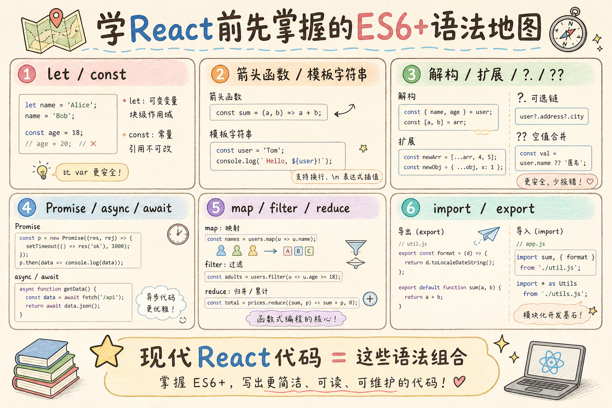
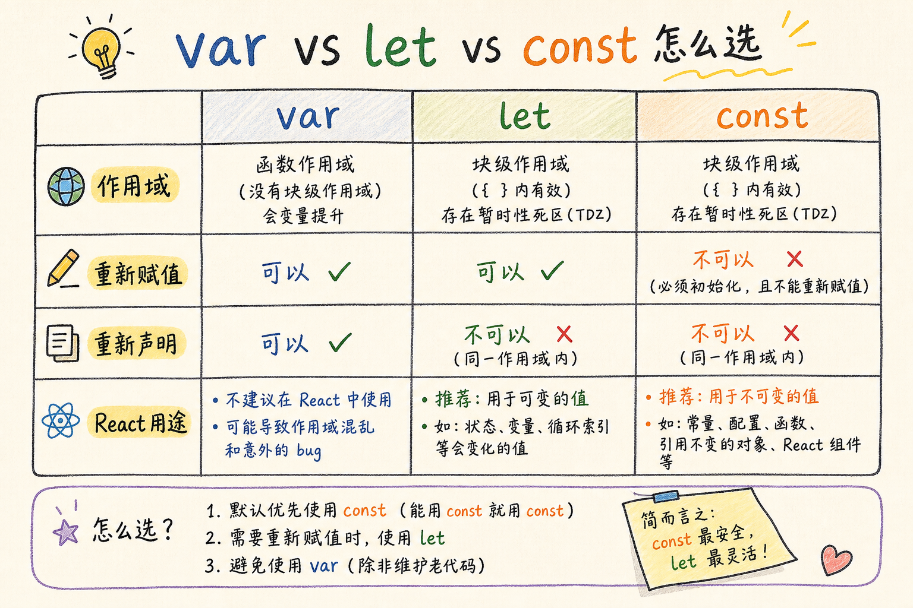
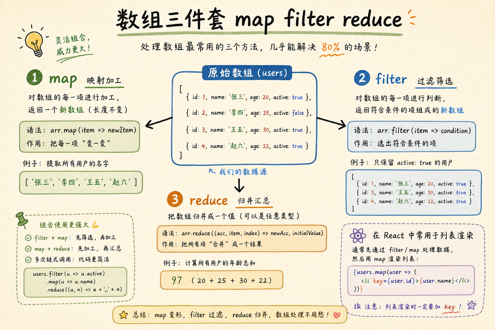
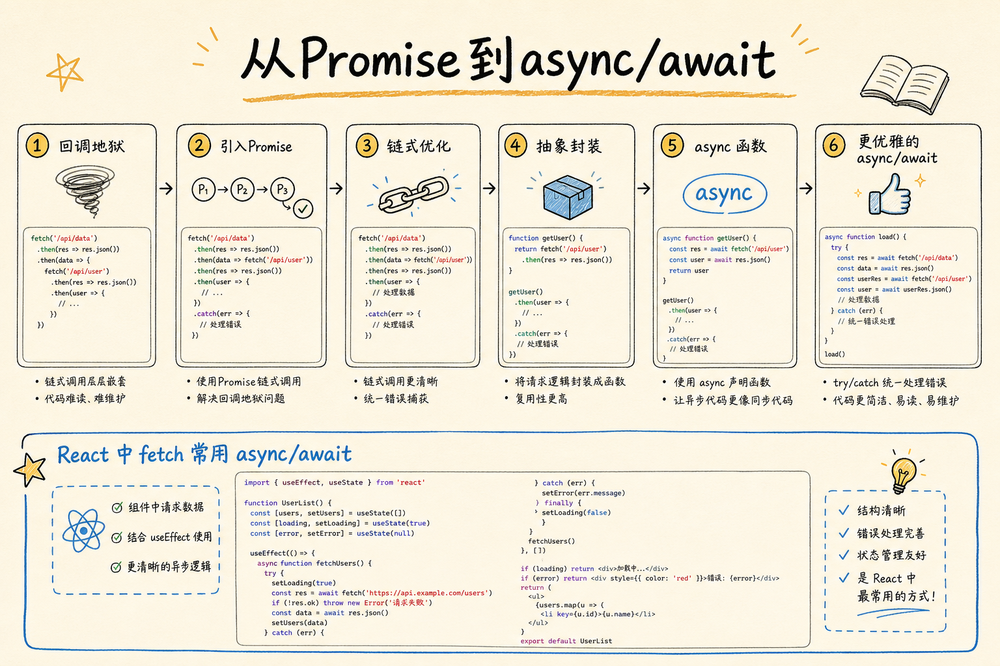
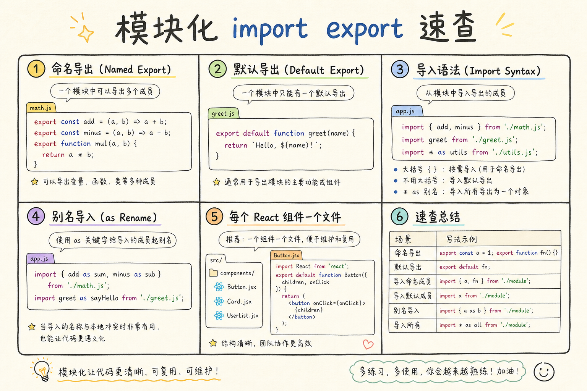

# React 学习系列（一）：JavaScript ES6+ 快速入门——学 React 前先补的语法课

> 你兴冲冲打开 React 官方文档，第一眼却是满屏 `const`、`=>`、`{...user}`、`users.map()`、`import`……如果你只会老式 `var function(){}` 和 `for` 循环，会像读天书。React 现代写法**几乎完全建立在 ES6+（ES2015 及之后版本）的 JavaScript 语法上**。这篇是系列第一篇：不动 React，先把 `let/const`、箭头函数、解构、扩展运算符、Promise、`async/await`、数组方法、`import/export`、可选链和空值合并练到能读懂组件代码。全程对照「以后在 React 里长什么样」，示例可在浏览器控制台直接跑。

---

## 目录

1. [前言：不是 React 难，是语法陌生](#1-前言不是-react-难是语法陌生)
2. [ES6+ 是什么：和「老 JavaScript」差在哪](#2-es6-是什么和老-javascript-差在哪)
3. [let 与 const：别再用 var](#3-let-与-const别再用-var)
4. [箭头函数：写组件事件时天天见](#4-箭头函数写组件事件时天天见)
5. [模板字符串：拼 JSX 外的字符串](#5-模板字符串拼-jsx-外的字符串)
6. [解构赋值：从对象和数组里「拆包装」](#6-解构赋值从对象和数组里拆包装)
7. [扩展运算符：复制与合并](#7-扩展运算符复制与合并)
8. [可选链与空值合并：安全地读深层属性](#8-可选链与空值合并安全地读深层属性)
9. [数组方法：map、filter、reduce](#9-数组方法mapfilterreduce)
10. [Promise 与 async/await：请求数据](#10-promise-与-asyncawait请求数据)
11. [模块化：import 与 export](#11-模块化import-与-export)
12. [综合练习：迷你「待办列表」数据处理](#12-综合练习迷你待办列表数据处理)
13. [常见陷阱与 FAQ](#13-常见陷阱与-faq)
14. [总结与系列下一篇](#14-总结与系列下一篇)

---

## 1. 前言：不是 React 难，是语法陌生

典型场景：

```jsx
const [count, setCount] = useState(0);

const users = data?.users ?? [];

return (
  <ul>
    {users.map((u) => (
      <li key={u.id}>{u.name}</li>
    ))}
  </ul>
);
```

若你不认识 `const`、箭头函数、`?.`、`??`、`.map()`，会以为这是「React 专属黑魔法」。其实大部分是 **标准 JavaScript**——React 只是拿这些语法来描述界面。

**JavaScript**（JS）：运行在浏览器（以及 Node.js）里的脚本语言，网页交互、前端框架都靠它。  
通俗说：浏览器的「台词本」——HTML 是骨架，CSS 是皮肤，JS 是行为。

**ES6+**：ES2015 及之后每年一版的新语法集合；口语里说「现代 JavaScript」往往就是指这套。  
通俗说：2015 年以后给 JS 装的「新工具箱」——React 教程默认你用的是这套，不是 2009 年的写法。

读完本文，你应该能做到：

1. 用 `let`/`const` 声明变量，并说明为什么 React 示例里几乎不见 `var`。
2. 读懂并书写箭头函数、模板字符串、解构、扩展运算符。
3. 用 `map`/`filter`/`reduce` 处理列表数据，说出和 React 列表渲染的关系。
4. 用 `async/await` 调用接口，理解和在 `useEffect` 里请求数据的衔接。
5. 使用 `import`/`export` 组织多文件代码。
6. 用 `?.` 和 `??` 安全访问可能为空的数据。

**前置**：会在浏览器按 F12 打开「控制台」（Console），能复制粘贴运行下面代码。  
**环境**：Chrome / Edge / Firefox 最新版即可；Node.js 18+ 可跑同样语法（系列后面搭建 React 项目时会用到）。

**不必先学完整个 JavaScript**：本文只覆盖 **React 高频语法**；其他如 `class`、原型链等遇到再补。

### 1.1 怎么练习本文代码

| 方式 | 做法 |
|------|------|
| 浏览器控制台 | F12 → Console，粘贴单段代码回车 |
| Node.js | 安装 Node 18+，`node file.js`（模块文件见 §11） |
| 在线编辑器 | [MDN Playground](https://developer.mozilla.org/zh-CN/docs/Web/JavaScript) 或 CodeSandbox |

建议：**每学完一节就在控制台敲一遍**，不要只眼读。React 项目是「语法 + 工程工具」；工具第二篇再搭，语法第一篇必须手熟。

每节末尾的「用例」和 §12 综合练习是刻意设计的重复——**同一语法在不同小场景里出现两遍**，是为了形成肌肉记忆。第一遍跟打，第二遍闭卷写。

### 1.2 本文边界

本篇是 React 系列的 **JavaScript 地基**，只覆盖组件里天天见的 ES6+ 语法。读完应能**读懂**第二篇起的 JSX 与 `fetch`，而不是「学完整个 JavaScript 语言」。

| 本篇会讲 | 本篇不讲（遇到再查 / 系列后续） |
|----------|--------------------------------|
| `let`/`const`、箭头函数、解构、展开 | `class` 组件、原型链、`this` 绑定 |
| `?.`/`??`、`map`/`filter`/`reduce` | 事件循环、宏任务/微任务（调试异步时再学） |
| `async/await`、`fetch`、模块 `import` | Webpack/Vite 打包原理、npm 依赖树 |
| 控制台可跑的语法片段 | React Hooks（`useState` 从第二篇起） |
| §12 待办数据处理练习 | TypeScript（第十一篇）、DOM 无框架操作 |

若你已有现代 JS 基础，可快速扫 §2 决策表与 §14 速记表，从 [第二篇 Vite + JSX](02.vite-jsx-first-component.md) 开始；若 `?.` 和 `map` 仍陌生，请按 §1.1 逐节敲控制台。

### 1.3 读完本篇你能看懂什么样的 React 代码

```jsx
import { useState, useEffect } from "react";

export default function UserList() {
  const [users, setUsers] = useState([]);
  const [error, setError] = useState(null);

  useEffect(() => {
    async function load() {
      try {
        const res = await fetch("/api/users");
        const data = await res.json();
        setUsers(data?.users ?? []);
      } catch (e) {
        setError(e.message ?? "加载失败");
      }
    }
    load();
  }, []);

  if (error) return <p>{error}</p>;

  return (
    <ul>
      {users
        .filter((u) => u.active !== false)
        .map((u) => (
          <li key={u.id}>{u.name}</li>
        ))}
    </ul>
  );
}
```

现在不必懂 `useState`——只要能把加粗概念对上号：`import`、`export default`、`const`、箭头函数、`async/await`、`?.`、`??`、`.filter`、`.map`。下一篇会逐行拆组件。

### 1.4 按行标注：上面组件用了哪些语法

| 行 / 片段 | 语法点 | 本文章节 |
|-----------|--------|----------|
| `import { useState, useEffect } from "react"` | 命名导入 | §11 |
| `export default function UserList()` | 默认导出 + 函数声明 | §11 |
| `const [users, setUsers] = useState([])` | const + 数组解构 | §3、§6 |
| `async function load()` | async 函数 | §10 |
| `await fetch` / `await res.json()` | await 等待 Promise | §10 |
| `data?.users ?? []` | 可选链 + 空值合并 | §8 |
| `e.message ?? "加载失败"` | 空值合并默认值 | §8 |
| `.filter(...).map(...)` | 数组链式调用 | §9 |
| `(u) => (...)` | 箭头函数作回调 | §4 |

学完对应章节后，遮住右列，试着自己标一遍——比单纯「看过」有效得多。

---

## 2. ES6+ 是什么：和「老 JavaScript」差在哪

读下图时，把每一块当成「打开 React 项目后会反复见到的语法」——先建立地图，后面逐章填空。



对照上图：React 函数组件本质是 **JavaScript 函数** 返回 **描述界面的对象（JSX）**；状态、事件、列表、请求，都靠上图这些语法表达。下一篇才会正式讲 JSX 和组件——本篇先把「台词」练熟。

| 老写法（了解即可） | 现代写法（React 常见） |
|--------------------|------------------------|
| `var x = 1` | `const x = 1` |
| `function add(a,b){ return a+b }` | `const add = (a, b) => a + b` |
| `'hi' + name` | `` `hi ${name}` `` |
| `var first = arr[0]` | `const [first] = arr` |
| 回调嵌套请求 | `await fetch(...)` |
| 全局 `<script>` 堆在一起 | `import Button from './Button'` |

### 2.1 和 Python 后端同学的对照（可选）

若你学过本仓库 Python 教程，可以这样对齐直觉（**语言不同，仅帮助记忆**）：

| JavaScript | Python | 说明 |
|------------|--------|------|
| `const` / `let` | 赋值变量 | Python 无 const，JS 用 const 表达「不重新绑定」 |
| `=>` 箭头函数 | `lambda` | 都偏短函数；箭头函数更常用 |
| `` `f"${x}"` `` | `f"{x}"` | 模板字符串 |
| `[a, b] = arr` | `a, b = arr` | 解构 |
| `{...a, ...b}`（对象展开） | `{**a, **b}` | JS 用三个点展开；Python 用 `**` 合并字典 |
| `async/await` | `async/await` | 概念极像，见 [asyncio 教程](../3.python-asyncio-tutorial.md) |
| `import` from | `import` from | 模块化思路相同 |

### 2.2 本文语法在一段代码里如何「同框出现」

下面这段**故意挤在一起**，方便你对照地图；不必一次全懂，学完各章再回来看会顺很多：

```javascript
import { formatName } from "./utils.js";

export default async function showUsers(raw) {
  const list = raw?.users ?? [];
  const names = list
    .filter((u) => u.active)
    .map((u) => formatName(u));
  const title = `共 ${names.length} 人`;
  return { title, names };
}
```

从左到右依次是：`import`、`export default`、`async`、`const`、可选链与空值合并、`filter`、`map`、箭头函数、模板字符串。第二篇会把 `return { title, names }` 换成 `return <div>...</div>`。

### 2.3 对象与数组：本文两条「数据主线」

React 组件里几乎总在处理两类结构：

| 类型 | 典型来源 | 常用语法 |
|------|----------|----------|
| **对象** | 单条用户、表单、配置、props | 解构 `{ }`、展开 `{ ...obj }`、`?.` |
| **数组** | 列表、菜单、表格行 | `map` / `filter`、展开 `[...arr]` |

先判断你手里是「一个东西」还是「一排东西」：单个用对象语法，多个用数组方法——后面各章按这两条线展开即可。

---

## 3. let 与 const：别再用 var

**let**：块级作用域的变量，可以重新赋值。  
**const**：块级作用域的常量，**不能重新赋值**（引用类型的内容仍可改，见下文）。  
通俗说：`let` 是贴了可撕便签的变量；`const` 是「不能再换一张新便签」，但便签上写的对象还能改里面字段。

**var**（老式）：函数作用域，会「提升」，容易出 bug——**新代码不要用**，包括 React 项目。

读下图对比三者的差异；React 社区默认 **能 const 就 const**，只有需要重新赋值时用 `let`（例如循环计数、稍后赋值的变量）。



对照上图：函数组件里 `const [state, setState] = useState()` 用 `const` 是因为 **数组引用不变**，变的是 React 内部状态，不是让你给 `state` 变量重新赋值。

演示什么：块级作用域与 const。  
在浏览器控制台粘贴运行：

```javascript
// let 可以改
let count = 0;
count = 1;
console.log(count); // 1

// const 不能整体换绑
const title = "我的应用";
// title = "别的";  // ❌ 报错 Assignment to constant variable

// const 对象：不能换对象，但能改属性（React state 常这样更新）
const user = { name: "小明" };
user.name = "小红";
console.log(user.name); // "小红"
```

**和 React 的关系**：组件里 `const props = ...`、`const [x, setX] = useState(0)` 是标准写法；不要用 `var`，否则 ESLint 会直接报错。

### 3.0 先错对对：var 的循环闭包经典 bug（理解即可）

下面用 `var` 演示「为什么不要用」——现代代码请用 `let`：

```javascript
// ❌ var：三次 setTimeout 都打印 3
for (var i = 0; i < 3; i++) {
  setTimeout(() => console.log("var", i), 0);
}

// ✅ let：分别打印 0、1、2
for (let j = 0; j < 3; j++) {
  setTimeout(() => console.log("let", j), 0);
}
```

`var` 的 `i` 整个循环共享一个绑定；`let` 每次迭代是新绑定。事件监听、定时器里若捕获循环变量，用 `let` 可避免莫名 bug。

### 3.1 块级作用域是什么意思

```javascript
if (true) {
  let x = 1;
}
// console.log(x);  // ❌ x 不存在

for (let i = 0; i < 3; i++) {
  // 每次循环 i 都是新的块级绑定
}
```

`var` 会穿透 `if`/`for` 整块函数，循环里闭包经典 bug；`let` 在 `for` 里每次迭代是独立变量——现代代码默认 `let`/`const`。

### 3.2 先错后对：以为 const 数组不能 push

```javascript
const items = [];
items.push(1);        // ✅ 可以改数组内容
// items = [];        // ❌ 不能换一个新数组

// React 更新列表时更推荐「新数组」：
setItems((prev) => [...prev, newItem]);
```

### 3.3 暂时性死区（了解即可）

`let` / `const` 在声明行**之前**不能访问，叫 **暂时性死区**（Temporal Dead Zone）。  
`var` 会「提升」成 `undefined`，反而更容易埋坑——这也是 React 项目禁用 `var` 的原因之一。

```javascript
// console.log(count); // ❌ 引用错误
let count = 0;
```

日常写组件时，把变量声明放在使用之前即可；不必背术语，知道「先声明再用」。

### 3.4 什么时候用 let，什么时候用 const

React 函数组件里有一句不成文规矩：**默认 `const`，只有「后面还要重新赋值」才用 `let`**。

| 场景 | 推荐写法 | 原因 |
|------|----------|------|
| 组件内状态、props 解构结果 | `const [x, setX] = useState(0)` | 绑定名不变，变的是 React 内部 |
| 事件里算出的中间值 | `const next = count + 1` | 算完就不改 |
| `for` 循环计数 | `for (let i = 0; i < n; i++)` | 每次迭代要新的 `i` |
| 先声明、分支里再赋值 | `let message` 后 `if (...) message = "..."` | 少数需要「空槽后填」的情况 |

演示什么：`let` 在分支里赋不同值。控制台运行：

```javascript
let status;
const ok = true;
if (ok) {
  status = "成功";
} else {
  status = "失败";
}
console.log(status); // "成功"
```

这种「先占位再赋值」在纯展示逻辑里不多见；更常见的是直接用 `const` + 三元表达式：`const status = ok ? "成功" : "失败"`。

### 3.5 用例：遍历列表时的计数（配合后面 map）

```javascript
const items = ["苹果", "香蕉", "橙子"];
let index = 0;
for (const name of items) {
  console.log(`${index}: ${name}`);
  index += 1; // let 允许改
}
// 0: 苹果  1: 香蕉  2: 橙子
```

React 里列表渲染用 `map` 的第二个参数自带 `index`（见 §9.7），不必手写 `let index`——这里是为了理解 **`let` = 会变的计数器**。

---

## 4. 箭头函数：写组件事件时天天见

**箭头函数**（Arrow Function）：更短的函数写法，用 `=>` 连接参数和函数体。  
通俗说：把 `function` 收成一支箭——参数在左，逻辑在右。

**函数**（Function）：把一段可重复执行的逻辑起个名字。React 函数组件本质上就是一个函数，只是返回的是界面描述而不是数字或字符串。

演示什么：传统函数与箭头函数对照。预期 `double(5)` 均为 `10`：

```javascript
// 传统函数
function double(n) {
  return n * 2;
}

// 箭头函数
const double = (n) => n * 2;

// 多个参数、多行逻辑
const sum = (a, b) => {
  const result = a + b;
  return result;
};

// 无参数
const now = () => Date.now();
```

**和 React 的关系**：

```jsx
// 事件处理
<button onClick={() => setCount(count + 1)}>+1</button>

// 列表渲染（下一节配合 map）
{items.map((item) => <li key={item.id}>{item.text}</li>)}
```

### 4.1 this 与箭头函数（了解即可）

箭头函数**没有自己的 `this`**，继承外层的 `this`。  
在 **React 函数组件**里几乎不用 `this`（老 class 组件才常见）——初学函数组件可先记住：**事件用箭头函数或普通函数都行，别纠结 this**。

### 4.2 先错后对：箭头函数体里的对象

```javascript
// ❌ 误以为返回对象
const makeUser = () => { name: "小明" };  // 语法歧义，花括号被当成函数体

// ✅ 用括号包一层
const makeUser = () => ({ name: "小明" });
```

### 4.3 隐式 return 与显式 return

箭头函数函数体有两种形态，初学者最容易混：

| 写法 | 含义 | 示例 |
|------|------|------|
| `(n) => n * 2` | **隐式 return**，单行表达式直接作为返回值 | `map` 回调极常见 |
| `(n) => { return n * 2; }` | **显式 return**，花括号里是语句块 | 多行逻辑必须这样 |
| `(n) => ({ id: n })` | 返回对象字面量，外层括号不能省 | 生成新对象时常用 |

演示什么：三种写法等价。预期 `double(3)` 都是 `6`：

```javascript
const double = (n) => n * 2;
const double2 = (n) => { return n * 2; };
console.log(double(3), double2(3));
```

**和 React 的关系**：`users.map(u => u.name)` 是隐式 return；若要在 map 里打日志再返回，必须显式 return：

```javascript
users.map((u) => {
  console.log("渲染", u.id);
  return u.name;
});
```

### 4.4 箭头函数当「回调」传递

**回调**（Callback）：把函数当作参数传给另一个函数，等时机到了再调用。  
通俗说：你留电话给外卖员——不是现在执行，是「到了再打我」。

```javascript
function greet(name, formatter) {
  return formatter(name);
}

const upper = (s) => s.toUpperCase();
console.log(greet("react", upper)); // "REACT"

// 直接内联传箭头函数
[1, 2, 3].map((n) => n * 10); // [10, 20, 30]
```

React 里 `onClick={() => ...}`、`items.map(item => ...)` 都是「把箭头函数当回调传进去」。先在这里练熟，后面看组件不会觉得突兀。

### 4.5 用例：根据条件返回不同结构

演示什么：多行箭头函数 + 显式 return。模拟「根据用户角色返回展示文案」：

```javascript
const formatUser = (user) => {
  if (!user) return "访客";
  const { name, role } = user;
  return role === "admin" ? `${name}（管理员）` : name;
};

console.log(formatUser({ name: "小明", role: "admin" })); // "小明（管理员）"
console.log(formatUser(null)); // "访客"
```

这段和 React 里「根据 props 算展示内容」的写法一模一样，只是还没包进 JSX。

---

## 5. 模板字符串：拼 JSX 外的字符串

**模板字符串**（Template Literal）：用反引号 `` ` `` 包裹，里面用 `${表达式}` 插值。  
通俗说：带插槽的字符串——`${}` 里可以是变量或运算。

### 5.1 基本插值与多行字符串

演示什么：变量插值与多行文本。在浏览器控制台运行，预期 `msg` 含 `React` 与当天日期：

```javascript
const name = "React";
const msg = `你好，${name}！今天是 ${new Date().getDate()} 号`;
console.log(msg);

// 多行字符串（日志、拼 SQL 片段时常用）
const html = `
  <div>
    <p>${name}</p>
  </div>
`;
```

**和 React 的关系**：界面主体用 **JSX** 写（`{name}` 插值），不用模板字符串拼整段 HTML——但 `console.log(\`用户 ${id} 加载失败\`)`、拼 API URL `` `/api/users/${id}` `` 非常常见。

```javascript
const id = 42;
const url = `/api/users/${id}`;
```

### 5.2 用例：拼带查询参数的 URL

接口常要 `?page=1&size=10`。用模板字符串比手写 `+` 清晰：

```javascript
const page = 2;
const size = 20;
const keyword = "react";
const url = `/api/users?page=${page}&size=${size}&q=${encodeURIComponent(keyword)}`;
console.log(url);
// /api/users?page=2&size=20&q=react
```

`encodeURIComponent` 会把空格等特殊字符编码——真实项目拼 URL 时别忘了（中文搜索词尤其需要）。

### 5.3 模板字符串里能写任意表达式

`` `${}` `` 里不限于变量名，可以是运算、三元、甚至函数调用：

```javascript
const price = 99;
const label = `现价：${price * 0.8} 元`;
const badge = `状态：${price > 50 ? "贵" : "便宜"}`;
console.log(label, badge);
```

**和 React 的关系**：JSX 里 `{price * 0.8}` 同理——花括号里也是「表达式」，只是界面用 JSX、字符串用模板字面量。

### 5.4 多行模板与缩进（日志场景）

```javascript
const user = { id: 1, name: "小明" };
const log = `
  [DEBUG]
  userId=${user.id}
  name=${user.name}
`;
console.log(log);
```

反引号保留换行；若嫌左侧缩进空格太多，可用数组 `join` 或工具库——初学知道「能写多行」即可。

### 5.5 标签模板（了解即可）

反引号还可接「标签函数」，如 styled-components 的 `` css`...` ``。初学知道有这回事即可，系列后面用到再学。

---

## 6. 解构赋值：从对象和数组里「拆包装」

**解构**（Destructuring）：从数组或对象里按位置或属性名取出值，赋给变量。  
通俗说：快递拆箱——不用 `box.item1`，直接 `const { item1 } = box`。

### 6.1 数组解构

数组解构按**位置**取值：左边变量顺序对应右边数组下标 0、1、2……

演示什么：基本取值、跳过中间项、收集剩余项。控制台运行：

```javascript
const colors = ["红", "绿", "蓝"];
const [first, second] = colors;
console.log(first, second); // 红 绿

// 跳过中间一项：第二个位置留空
const [head, , third] = colors;
console.log(head, third); // 红 蓝

// 剩余项进 rest 数组
const [a, ...rest] = colors;
console.log(rest); // ["绿", "蓝"]
```

**和 React 的关系**：`useState` 返回固定为 `[当前值, 更新函数]` 的数组，所以几乎总是：

```javascript
// 概念预览（下一篇细讲）
const [count, setCount] = useState(0);
// 不能写成 const { count, setCount } = useState(0) —— 返回的不是普通对象
```

### 6.2 对象解构

对象解构按**属性名**取值：左边写什么属性名，就从右边对象里取什么字段。

演示什么：基本解构、重命名、默认值、作为函数参数。预期 `greet(user)` 返回带称呼的字符串：

```javascript
const user = { id: 1, name: "小明", role: "admin" };
const { name, role } = user;
console.log(name, role); // 小明 admin

// 重命名：取 user.name 但本地变量叫 userName
const { name: userName } = user;

// 默认值：user 上没有 age 时用 18
const { age = 18 } = user;

// 函数参数位置解构（组件 props 极其常见）
function greet({ name, role = "guest" }) {
  return `你好，${name}（${role}）`;
}
console.log(greet(user));
```

React 组件写法与上面 `greet` 相同——组件就是一个函数，参数是 props 对象：

```jsx
function UserCard({ name, role }) {
  return <p>{name} - {role}</p>;
}
```

### 6.3 嵌套解构（可选）

```javascript
const data = { user: { profile: { city: "上海" } } };
const { user: { profile: { city } } } = data;
```

深层嵌套可读性差——后面会用 **可选链** 简化。日常更推荐：

```javascript
const city = data?.user?.profile?.city;
```

而不是三层花括号解构，除非中间每一层都确定存在。

### 6.3.1 默认值在解构里的触发时机

```javascript
const { role = "guest" } = { name: "小明" };
console.log(role); // "guest" —— 缺少 role 字段

const { role: r = "guest" } = { role: "" };
console.log(r); // "" —— 有字段但为空字符串，默认值不触发
```

只有属性为 `undefined` 时默认值才生效；`null`、`""`、`0` 都不会触发——与 `??` 的规则不同，不要混为一谈。

### 6.4 在函数参数里解构 props（React 核心习惯）

```javascript
// 老式：props 是一个大对象，到处 props.name
function Card(props) {
  return props.title + props.desc;
}

// 现代：参数位置直接解构
function Card({ title, desc, onClick }) {
  return `${title}: ${desc}`;
}
```

带默认值可防止父组件没传：

```javascript
function Badge({ text = "默认", color = "gray" }) {
  return `${text} (${color})`;
}
```

### 6.5 交换两个变量（解构技巧）

老式写法要临时变量；解构一行搞定：

```javascript
let a = 1;
let b = 2;
[a, b] = [b, a];
console.log(a, b); // 2 1
```

### 6.6 函数返回多个值，调用处解构

```javascript
function useCounter(initial = 0) {
  let count = initial;
  const increment = () => { count += 1; };
  const get = () => count;
  return [get, increment]; // 返回数组，像 useState 的形状
}

const [getCount, inc] = useCounter(0);
inc();
inc();
console.log(getCount()); // 2
```

这不是真正的 React Hook，只是帮你理解 **「返回数组 → 调用处解构」** 为什么长那样。

### 6.7 用例：接口 JSON 字段名不一致时解构重命名

后端返回 `user_name`，前端想用 `name`：

```javascript
const apiRow = { user_name: "小明", user_age: 20 };
const { user_name: name, user_age: age = 0 } = apiRow;
console.log(name, age); // 小明 20
```

全栈项目里字段对齐很重要；解构重命名能减少满屏 `row.user_name` 的噪音。

### 6.8 剩余 props：`...rest` 收集未解构的字段

演示什么：从 props 对象里「点名」拿几个，其余打包进 `rest`。在控制台模拟：

```javascript
function Input({ label, type = "text", ...rest }) {
  console.log("label:", label, "type:", type);
  console.log("rest:", rest);
}

Input({
  label: "邮箱",
  type: "email",
  placeholder: "you@example.com",
  id: "email",
  maxLength: 100,
});
// rest = { placeholder, id, maxLength }
```

`...rest` 必须写在解构**最后**。真实 React 里下一行往往是 `<input type={type} {...rest} />`——把 `placeholder`、`id` 等原样传给 DOM，而不必一个个手写。

---

## 7. 扩展运算符：复制与合并

**扩展运算符**（Spread Operator）：写法是三个点 `...`，把数组或对象「展开」。  
通俗说：把一盒积木倒在桌上——拼成新数组、新对象，或当函数参数列表。

### 7.1 数组

演示什么：合并、拷贝。预期 `b` 为 `[1,2,3,4]`，`copy` 修改不影响 `a`：

```javascript
const a = [1, 2];
const b = [...a, 3, 4];   // [1, 2, 3, 4]
const copy = [...a];        // 浅拷贝
```

### 7.2 对象

演示什么：多层默认值被覆盖的顺序。预期 `settings.theme` 为 `"dark"`（`user` 未提供 theme，但最后一项显式覆盖）：

```javascript
const defaults = { theme: "light", lang: "zh" };
const user = { name: "小明" };
const settings = { ...defaults, ...user, theme: "dark" };
// { theme: "dark", lang: "zh", name: "小明" }
// 后面的同名属性覆盖前面的
```

**和 React 的关系**：更新 state 时常用「展开旧对象 + 改字段」，而不是直接改原对象（否则 React 可能检测不到变化）：

```javascript
// 概念预览
setUser((prev) => ({ ...prev, name: "新名字" }));
```

### 7.3 函数调用

```javascript
Math.max(...[3, 9, 1]);  // 9
```

把数组「展开」成多个参数，等价于 `Math.max(3, 9, 1)`。React 里更常见的是对象/数组展开，但理解「三个点 = 摊开」有助于区分 §7.4 的剩余参数。

### 7.4 剩余参数（Rest）与展开对照

解构里的 `...rest` 和展开里的 `...arr` **写法相同、方向相反**：

| 位置 | 写法 | 含义 |
|------|------|------|
| 解构左侧 | `const [a, ...rest] = arr` | **收集**剩余项到数组 |
| 字面量右侧 | `[...arr, 3]` | **展开**已有数组进新数组 |
| 函数参数 | `function log(tag, ...args)` | 收集任意多个实参 |

```javascript
function sum(first, ...others) {
  return others.reduce((acc, n) => acc + n, first);
}
console.log(sum(1, 2, 3, 4)); // 10
```

React 里 `...rest` 常见于把「未显式解构的 props」转交给子组件：`<input {...rest} />`（系列后面讲 props 时会再出现）。

### 7.5 浅拷贝与「为什么 React 要新对象」

`{ ...obj }` 和 `[...arr]` 都是 **浅拷贝**：只复制第一层。嵌套对象仍共享引用：

```javascript
const a = { user: { name: "小明" } };
const b = { ...a };
b.user.name = "小红";
console.log(a.user.name); // "小红" —— 内层还是同一份
```

因此更新深层字段时，有时要写成 `setState(prev => ({ ...prev, user: { ...prev.user, name: "新" } }))`。初学先记住：**改 state 优先返回新对象/新数组**；深拷贝技巧遇到再查。

### 7.6 用例：删除数组中某一项（不可变）

React 删列表项不要 `arr.splice` 改原数组，用 `filter` 生成新数组（与 §9.2 呼应）：

```javascript
const todos = [
  { id: 1, text: "A" },
  { id: 2, text: "B" },
];
const idToRemove = 1;
const next = todos.filter((t) => t.id !== idToRemove);
console.log(next); // 只剩 id=2
console.log(todos.length); // 2 —— 原数组未变
```

### 7.7 用例：合并默认配置与用户设置

组件常接收 `options`，要和默认值合并：

```javascript
const defaultOptions = { pageSize: 10, sort: "desc", showAvatar: true };
const userOptions = { pageSize: 20 };
const finalOptions = { ...defaultOptions, ...userOptions };
console.log(finalOptions);
// { pageSize: 20, sort: "desc", showAvatar: true }
```

后面同名属性覆盖前面——和用户改设置覆盖默认项是同一逻辑。

### 7.8 条件展开：有值才放进对象

ES2018 起可在对象里按条件加字段（React 传 props 时常用）：

```javascript
const isAdmin = true;
const user = { name: "小明", ...(isAdmin && { role: "admin" }) };
console.log(user); // { name: "小明", role: "admin" }

const isGuest = false;
const guest = { name: "访客", ...(isGuest && { role: "admin" }) };
console.log(guest); // { name: "访客" } —— false 时不展开
```

`&&` 左侧为假时得到假值，展开假值会被忽略（不报错、不加字段）。初学先理解效果，不必深究规范细节。

---

## 8. 可选链与空值合并：安全地读深层属性

接口返回的数据常有「某层是 `null`」——直接 `.profile.city` 会报错。

### 8.1 可选链 `?.`

**可选链**（Optional Chaining）：左边是 `null` 或 `undefined` 时，整个表达式短路为 `undefined`，不抛错。  
通俗说：「如果有这一层再往下点」——像问「他有地址吗？有的话城市是哪儿？」而不是假设一定有。

演示什么：对比直接访问与可选链。预期第二行不报错、结果为 `undefined`：

```javascript
const user = { profile: null };

// ❌ user.profile.city  // 报错 Cannot read properties of null

// ✅
console.log(user.profile?.city);           // undefined
console.log(user.profile?.city ?? "未知"); // 配合 ?? 见下
```

数组、函数也支持：

```javascript
users?.[0]?.name;
onClick?.();  // 有回调才调用
```

### 8.2 空值合并 `??`

**空值合并**（Nullish Coalescing）：左侧是 `null` 或 `undefined` 时，取右侧默认值。  
通俗说：只有「真的没值」才用替补；`0` 和 `''` 不会被当成「没值」。

演示什么：对比 `||` 与 `??` 对数字 `0` 的不同处理。预期第一行 `10`、第二行 `0`：

```javascript
const count = 0;
console.log(count || 10);  // 10  —— || 把 0 当假值，常踩坑
console.log(count ?? 10);  // 0   —— ?? 只认 null/undefined
```

**和 React 的关系**：

```jsx
const title = data?.title ?? "加载中...";
const list = data?.items ?? [];
```

### 8.3 和逻辑或 `||` 的分工（再强调）

```javascript
const showBanner = config.showBanner ?? true;   // 未配置时默认 true
const label = input || "请输入";                 // 空字符串也想用默认值时用 ||
```

### 8.4 先错后对：可选链不是「万能默认值」

```javascript
const user = { score: 0 };

// ❌ 以为 ?. 会给默认值——没有 score 属性时仍是 undefined
const label = user.score?.toFixed(1);  // undefined（score 是 0 时正常）

// ✅ 要默认值用 ??
const display = user.profile?.name ?? "匿名";
```

`?.` 只负责**不报错地往下读**；「没有就用某某」仍要配 `??`。

### 8.5 用例：完整处理一份「可能残缺」的接口响应

演示什么：模拟真实 API 返回，安全取值并给 UI 默认值。控制台运行：

```javascript
const response = {
  code: 0,
  data: {
    user: null,
    items: [{ id: 1, title: "第一条" }],
  },
};

const userName = response.data?.user?.name ?? "匿名用户";
const list = response.data?.items ?? [];
const total = response.data?.total ?? list.length;
const firstTitle = list[0]?.title ?? "暂无";

console.log({ userName, list, total, firstTitle });
// userName: "匿名用户", list 有 1 项, total: 1, firstTitle: "第一条"
```

以后在 React 里往往是：`const list = data?.items ?? []` 再 `list.map(...)`——**先安全拿到数组，再 map**，避免对 `null` 调用 `.map` 报错。

### 8.6 可选链调用方法

```javascript
const obj = {
  greet: () => "你好",
};
console.log(obj.greet?.());     // "你好"
console.log(obj.missing?.());  // undefined，不报错
```

父组件可选传入回调时：`onSave?.(formData)`——有函数才执行。

### 8.7 用例：表单字段与配置项的默认值矩阵

接口和配置项混用时，常要叠多层默认值。演示什么：按优先级取值。

```javascript
function resolvePageSize(userSetting, serverDefault, fallback = 10) {
  return userSetting ?? serverDefault ?? fallback;
}

console.log(resolvePageSize(undefined, 20));  // 20
console.log(resolvePageSize(0, 20));        // 0 —— 用户明确设 0 条也保留
console.log(resolvePageSize(undefined, undefined)); // 10

const cfg = { showSidebar: false };
const show = cfg.showSidebar ?? true;
console.log(show); // false —— false 是有效配置，不能被 ?? 换掉
```

记住：**用户故意设为 `0` 或 `false` 时，用 `??` 不要用 `||`**，否则会被默认值覆盖。

---

## 9. 数组方法：map、filter、reduce

React 里 **列表渲染** 几乎总是 `array.map()`。先在三张「纯 JS」里练熟，再看 JSX。

读下图：中心是一份 `users` 数组，三条 spoke 对应三种典型用途。



对照上图：**map 变长度不变（一对一）**；**filter 变短**；**reduce 收成单个值**。

三种方法都接受一个**回调函数**作为参数，回调里常用箭头函数。牢记口诀：**map 变形、filter 变少、reduce 变一个**。

### 9.1 map：每一项映射成新的一项

`map` 会遍历原数组，对每一项调用你传入的函数，把返回值按顺序组成**新数组**；原数组长度不变。

演示什么：数字翻倍、从对象数组抽字段名。预期 `doubled` 为 `[2,4,6]`，`names` 为 `["小明","小红"]`：

```javascript
const nums = [1, 2, 3];
const doubled = nums.map((n) => n * 2);
console.log(doubled); // [2, 4, 6]

const users = [
  { id: 1, name: "小明" },
  { id: 2, name: "小红" },
];
const names = users.map((u) => u.name);
console.log(names); // ["小明", "小红"]
```

**React 预览**（JSX 下一篇详讲）：`map` 的返回值从「字符串/数字」换成「React 元素」：

```jsx
<ul>
  {users.map((user) => (
    <li key={user.id}>{user.name}</li>
  ))}
</ul>
```

每个 `<li>` 需要稳定唯一的 `key`（通常用 `id`）——这是 React  Diff 算法的要求，下一篇细讲。

### 9.2 filter：筛出符合条件的项

`filter` 同样遍历数组，但只保留回调返回 **真值** 的项，得到**更短或等长**的新数组。

演示什么：筛偶数、筛管理员。预期 `evens` 为 `[2,4]`：

```javascript
const nums = [1, 2, 3, 4, 5];
const evens = nums.filter((n) => n % 2 === 0);
console.log(evens); // [2, 4]

const users = [
  { id: 1, name: "小明", role: "admin" },
  { id: 2, name: "小红", role: "user" },
];
const admins = users.filter((u) => u.role === "admin");
console.log(admins.length); // 1
```

常见组合：先 `filter` 再 `map`——例如只展示「上架商品」的名称列表。

### 9.3 reduce：聚合成一个值

`reduce` 把数组「折叠」成一个累积结果：回调接收 `(累积值, 当前项)`，每次 return 新的累积值；第二个参数是初始累积值。

演示什么：求和、购物车总价。预期 `sum` 为 10，`total` 为 498：

```javascript
const sum = [1, 2, 3, 4].reduce((acc, n) => acc + n, 0);
console.log(sum); // 10

const cart = [
  { name: "键盘", price: 399 },
  { name: "鼠标", price: 99 },
];
const total = cart.reduce((acc, item) => acc + item.price, 0);
console.log(total); // 498
```

`acc` 是 accumulator（累积器）的缩写。第一次循环 `acc` 为初始值 `0`，之后每次是上轮 return 的结果。购物车总价、未读消息数——`reduce` 很常见；**列表展示仍优先 `map`**。

### 9.4 链式调用：先筛再变换再拼接

演示什么：活跃用户名字用顿号连接。预期类似 `"小明、小红"`（取决于数据）：

```javascript
const users = [
  { name: "小明", active: true },
  { name: "小红", active: true },
  { name: "小刚", active: false },
];

const result = users
  .filter((u) => u.active)
  .map((u) => u.name)
  .join("、");

console.log(result); // "小明、小红"
```

链式调用从左到右执行：每一步返回新数组（或最终 `join` 返回字符串），**不修改原数组**。React 里常见写法是 `.filter(...).map(...)` 直接写在 JSX 花括号里。

### 9.5 find、some、every（补充）

| 方法 | 作用 | 示例场景 |
|------|------|----------|
| `find` | 找第一个符合条件的**元素** | `users.find(u => u.id === 2)` |
| `some` | 是否存在至少一个 | `users.some(u => u.admin)` |
| `every` | 是否全部满足 | `todos.every(t => t.done)` |

列表渲染仍首选 `map`；判断是否显示「全部完成」徽章可用 `every`。

### 9.6 不要滥用 map 做副作用

```javascript
// ❌ map 用来「遍历干别的事」，返回值被丢弃——意图不清
users.map((u) => console.log(u));

// ✅ 专门遍历用 forEach
users.forEach((u) => console.log(u));
```

### 9.7 map 的第二个参数：index

`map` 回调可接收 `(元素, 下标, 原数组)`：

```javascript
const tags = ["React", "Vue", "Svelte"];
const withIndex = tags.map((tag, index) => `${index + 1}. ${tag}`);
console.log(withIndex);
// ["1. React", "2. Vue", "3. Svelte"]
```

React 列表渲染**优先用稳定 id 当 key**，不要用 `index` 当 key（列表会增删重排时出 bug）——但展示序号时 `index` 很合适。

### 9.8 用例：购物车——filter + map + reduce 组合

演示什么：一条业务链走完三种方法。预期 `total` 为 498：

```javascript
const cart = [
  { id: 1, name: "键盘", price: 399, selected: true },
  { id: 2, name: "鼠标", price: 99, selected: true },
  { id: 3, name: "线材", price: 29, selected: false },
];

const selectedNames = cart
  .filter((item) => item.selected)
  .map((item) => item.name);
console.log("已选:", selectedNames.join("、")); // 键盘、鼠标

const total = cart
  .filter((item) => item.selected)
  .reduce((sum, item) => sum + item.price, 0);
console.log("合计:", total); // 498
```

这是电商结算页的纯 JS 版：先筛「勾选项」，再算总价；React 里只是把 `selectedNames` 换成 `map` 渲染 `<li>`。

### 9.8.1 同一数据用三种方法各做一件事

对同一份 `cart` 练手，体会分工：

```javascript
const cart = [
  { id: 1, name: "键盘", price: 399, selected: true },
  { id: 2, name: "鼠标", price: 99, selected: false },
];

// map：抽出展示用字段
const labels = cart.map((item) => `${item.name} ¥${item.price}`);

// filter：只要选中的
const picked = cart.filter((item) => item.selected);

// reduce：选中项总价
const total = cart
  .filter((item) => item.selected)
  .reduce((sum, item) => sum + item.price, 0);

console.log(labels);
console.log(picked.length, total); // 1 399
```

同一份数据可以经过多条管道；写 React 前先在这里把管道想清楚，组件里只负责「展示管道结果」。

### 9.9 用例：reduce 按分类分组

```javascript
const posts = [
  { title: "A", tag: "react" },
  { title: "B", tag: "vue" },
  { title: "C", tag: "react" },
];

const byTag = posts.reduce((acc, post) => {
  const tag = post.tag;
  if (!acc[tag]) acc[tag] = [];
  acc[tag].push(post.title);
  return acc;
}, {});

console.log(byTag);
// { react: ["A", "C"], vue: ["B"] }
```

`acc`（accumulator）是「累加器」——每次循环更新并 return，最终得到分组对象。侧边栏按标签展示文章时会见到类似逻辑。

### 9.10 find、findIndex、includes 实战

```javascript
const users = [
  { id: 1, name: "小明" },
  { id: 2, name: "小红" },
];

const u = users.find((user) => user.id === 2);
console.log(u?.name); // "小红"

const idx = users.findIndex((user) => user.id === 2);
console.log(idx); // 1

const names = users.map((x) => x.name);
console.log(names.includes("小明")); // true
```

`find` 找不到返回 `undefined`——配合 `?.` 更安全。`includes` 判断数组是否含某值，适合「是否已选中」类逻辑。

### 9.11 排序：sort 会改原数组，React 里先拷贝

```javascript
const nums = [3, 1, 2];
const sorted = [...nums].sort((a, b) => a - b);
console.log(sorted); // [1, 2, 3]
console.log(nums);   // [3, 1, 2] —— 原数组未变
```

`sort` 默认按字符串比；数字排序要传比较函数。永远 `[...arr].sort(...)` 或 `arr.slice().sort(...)`，别把 state 里的原数组直接 sort 了。

### 9.12 用例：从列表生成 id → 对象的查找表

有时需要按 `id` 快速查找，可先 `reduce` 成对象（了解即可，小列表用 `find` 就够）：

```javascript
const users = [
  { id: "a", name: "小明" },
  { id: "b", name: "小红" },
];

const byId = users.reduce((acc, u) => {
  acc[u.id] = u;
  return acc;
}, {});

console.log(byId["a"].name); // "小明"
```

React 里若父组件已传数组，子组件仍用 `map` 渲染即可；查找表适合频繁按 id 取详情的场景。

---

## 10. Promise 与 async/await：请求数据

React 组件常要从接口拉数据。**Promise** 和 **async/await** 是处理「过一会儿才有结果」的标准方式。  
若你读过本仓库 [Python asyncio 教程](../3.python-asyncio-tutorial.md)，可类比：Promise 像「未来会兑现的承诺」；`await` 像「等这个承诺完成再往下走」。

读下图，跟一遍从回调到 `async/await` 的演进。**上半部分六步是纯 JavaScript**；图底部带 `useEffect` 的 React 示例属于**第三篇**内容，本篇可先看六步，React 块暂时跳过即可。



对照上图：六步演进的核心是 **await 等到的是 Promise 的结果**；底部 React 块预告了第三篇「挂载后拉数据 + 三态 UI」的写法，现在不必深究 `useEffect`。

### 10.1 Promise 的三种状态

**Promise**（承诺）：代表一个异步操作，将来变成「成功」或「失败」。  
通俗说：外卖订单号——稍后要么送到（resolve），要么退单（reject）。

Promise 在任意时刻只处于下面三种状态之一：

| 状态 | 含义 | 你会见到 |
|------|------|----------|
| `pending` | 进行中，还没结果 | `fetch` 刚发出、网络还在转 |
| `fulfilled` | 成功，有结果 | 进入 `.then()` 或 `await` 拿到值 |
| `rejected` | 失败，有错误原因 | 进入 `.catch()` 或 `try/catch` |

状态一旦从 `pending` 变成 fulfilled 或 rejected，**不会再变**——所以可以放心链式 `.then()`。

```javascript
const p = new Promise((resolve, reject) => {
  setTimeout(() => resolve("好了"), 1000);
});

p.then((value) => console.log(value));  // 约 1 秒后 "好了"
p.catch((err) => console.error(err));
```

`fetch` 本身返回的就是 Promise；**HTTP 404 不会自动 reject**，仍要检查 `res.ok`（见 §10.3）。

### 10.1.1 用 `new Promise` 理解异步（可选深入）

真实项目很少手写 `new Promise`，但有助于理解 `fetch` 背后在干什么：

```javascript
function delay(ms) {
  return new Promise((resolve) => {
    setTimeout(() => resolve(`等了 ${ms}ms`), ms);
  });
}

async function main() {
  const msg = await delay(500);
  console.log(msg);
}
main();
```

`resolve` 调用时 Promise 变 fulfilled，`await delay(500)` 拿到的就是 `resolve` 传入的值。

### 10.1.2 `fetch` 与 JSON：两个 await 的原因

`fetch(url)` 完成的是 **HTTP 响应头到达**，body 往往还要再读一次：

```javascript
const res = await fetch("/api/users"); // 第一步：Response 对象
const data = await res.json();         // 第二步：把 body 解析成 JS 对象
```

`res.json()` 本身也返回 Promise（解析可能耗时）。只 `await` 第一次时，若忘了第二次 `await`，变量里仍是 Promise 而不是用户列表——这是初学者极高频 bug（见 §10.6）。

### 10.2 fetch + then：Promise 链式调用

**`.then()`**：当前 Promise 成功后执行，返回值可以是普通值或新的 Promise，形成链。  
**`.catch()`**：链上任意一步失败时进入。

演示什么：用公开接口拉一条假数据。在浏览器控制台运行（需联网）：

```javascript
fetch("https://jsonplaceholder.typicode.com/users/1")
  .then((res) => res.json())   // 第一个 then 拿到 Response，转成 JSON（仍是 Promise）
  .then((data) => console.log(data.name))  // 第二个 then 拿到解析后的对象
  .catch((err) => console.error("失败", err));
```

预期：打印一个用户名，如 `Leanne Graham`。

同一逻辑用 `async/await` 写往往更易读（§10.3）——React 项目里 `await` 更常见，但读老代码或库文档时仍会见到 `.then()`。

### 10.3 async / await

**async**：标记函数内有异步等待。  
**await**：在 async 函数里等待 Promise 完成，写法像同步代码。  
通俗说：`async` 是「这个函数里会有等外卖」；`await` 是「站门口等到外卖来了再走」。

```javascript
async function loadUser() {
  try {
    const res = await fetch("https://jsonplaceholder.typicode.com/users/1");
    if (!res.ok) throw new Error(`HTTP ${res.status}`);
    const data = await res.json();
    console.log(data.name);
    return data;
  } catch (err) {
    console.error("加载失败", err);
  }
}

loadUser();
```

**副作用**：`await` 只能在 `async` 函数里用；`async` 函数**总是返回 Promise**。

### 10.3.1 用例：POST 提交 JSON（与 REST 教程衔接）

演示什么：向测试接口 POST 一条数据。需联网；若 CORS 受限可在 Node 环境试同样写法：

```javascript
async function createPost() {
  const res = await fetch("https://jsonplaceholder.typicode.com/posts", {
    method: "POST",
    headers: { "Content-Type": "application/json" },
    body: JSON.stringify({ title: "你好", body: "内容", userId: 1 }),
  });
  if (!res.ok) throw new Error(`HTTP ${res.status}`);
  const created = await res.json();
  console.log("新 id:", created.id);
  return created;
}
// createPost();
```

`body` 必须是字符串，对象要先 `JSON.stringify`；读响应仍用 `await res.json()`。这与 [REST API 教程](../5.rest-api-design-tutorial.md) 里的 JSON 请求体一致，只是运行在浏览器。

### 10.4 和 React 的衔接（概念）

演示什么：第三篇里常见的「挂载后请求」形状（此处仅作对照，不必现在会写 `useEffect`）。注意仍要检查 `res.ok`（§10.3），404 不会自动进 `catch`：

```javascript
// 第三篇常见模式（此处仅作对照）
useEffect(() => {
  async function load() {
    const res = await fetch("/api/users");
    if (!res.ok) throw new Error(`HTTP ${res.status}`);
    const data = await res.json();
    setUsers(data);
  }
  load();
}, []);
```

`setUsers` 是 React 更新列表 state 的函数——第二、三篇会细讲；本篇只要认出 **`await` 之后拿到的是 JSON 数据** 即可。

### 10.5 Promise.all 与并行请求（了解即可）

```javascript
const [users, posts] = await Promise.all([
  fetch("/api/users").then((r) => r.json()),
  fetch("/api/posts").then((r) => r.json()),
]);
```

多个接口互不依赖时并行，比串行 `await` 两次更快——React 页面初次加载常这样拉多份数据。

### 10.6 忘记 await 会怎样

```javascript
async function bad() {
  const data = fetch("/api/users"); // ❌ 忘了 await，data 是 Promise 不是 JSON
  console.log(data.name);           // undefined
}

async function good() {
  const res = await fetch("/api/users");
  const data = await res.json();
  console.log(data);
}
```

### 10.7 用例：封装 `fetchJSON` 小工具

重复出现的模式可以提成函数——模块化之前先在控制台练「形状」：

```javascript
async function fetchJSON(url) {
  const res = await fetch(url);
  if (!res.ok) {
    throw new Error(`请求失败: ${res.status} ${res.statusText}`);
  }
  return res.json();
}

async function demo() {
  try {
    const user = await fetchJSON(
      "https://jsonplaceholder.typicode.com/users/1"
    );
    console.log(user.email);
  } catch (err) {
    console.error(err.message);
  }
}
demo();
```

第二篇搭项目后，这类函数会放进 `utils/request.js` 并 `export` 出去。

### 10.8 串行 await vs Promise.all 并行

演示什么：感受时间差（需联网；时间因网络波动，看相对关系即可）。

```javascript
async function serial() {
  const t0 = Date.now();
  await fetch("https://jsonplaceholder.typicode.com/users/1");
  await fetch("https://jsonplaceholder.typicode.com/users/2");
  console.log("串行约", Date.now() - t0, "ms");
}

async function parallel() {
  const t0 = Date.now();
  await Promise.all([
    fetch("https://jsonplaceholder.typicode.com/users/1"),
    fetch("https://jsonplaceholder.typicode.com/users/2"),
  ]);
  console.log("并行约", Date.now() - t0, "ms");
}

// await serial(); await parallel();
```

两个请求互不依赖时用 `Promise.all`；**后一个依赖前一个结果**（例如先登录拿 token 再拉用户信息）必须串行 `await`。

### 10.9 用例：模拟「加载中 → 成功 / 失败」

React 里常有 `loading`、`error`、`data` 三个状态；先用纯 JS 理解流程：

```javascript
async function loadWithStatus(setStatus) {
  setStatus({ loading: true, error: null, data: null });
  try {
    const data = await fetchJSON(
      "https://jsonplaceholder.typicode.com/users/1"
    );
    setStatus({ loading: false, error: null, data });
  } catch (e) {
    setStatus({ loading: false, error: e.message, data: null });
  }
}

// 假装 setState
const state = { loading: false, error: null, data: null };
function setStatus(next) {
  Object.assign(state, next);
  console.log(state);
}
loadWithStatus(setStatus);
```

`fetchJSON` 沿用 §10.7；预期最终会 `loading: false` 且 `data` 有内容。下一篇用 `useState` 存这三项，界面根据 `loading` 显示转圈、根据 `error` 显示红字。

---

## 11. 模块化：import 与 export

现代 React 项目用 **ES Module**：每个文件是一个模块，用 `export` 导出、`import` 导入。  
通俗说：把代码分文件装盒，需要时 `import` 拆盒——不再用一个巨大 `<script>` 堆完全部代码。

读下图对照命名导出与默认导出——React 组件文件两种都会见到。



对照上图：**一个组件文件通常 `export default function App()`**；工具函数、常量多用 **命名导出** `export const`。

### 11.1 命名导出与导入

**命名导出**（Named Export）：一个文件里可以 `export` 多个名字，导入时花括号里的名字**必须一致**（或用 `as` 改名）。

演示什么：两个文件分工——`utils.js` 提供工具，`main.js` 消费。Node 或 `type="module"` 的浏览器可跑：

`utils.js`：

```javascript
export const PI = 3.14;
export function add(a, b) {
  return a + b;
}
```

`main.js`：

```javascript
import { PI, add } from "./utils.js";
console.log(add(1, 2));
```

### 11.2 默认导出与导入

`Button.js`：

```javascript
export default function Button({ label }) {
  return `<button>${label}</button>`;  // 纯 JS 演示，非 JSX
}
```

`App.js`：

```javascript
import Button from "./Button.js";
```

默认导入名字可自取：`import MyBtn from "./Button.js"`。

**对照记忆**：

| | 导出写法 | 导入写法 | 花括号 |
|---|----------|----------|--------|
| 命名 | `export const x` | `import { x } from` | 必须 |
| 默认 | `export default fn` | `import fn from` | 不要 |

一个文件只能有一个 `export default`，但可以有多个命名导出——组件文件通常是 default，工具文件通常是 named。

### 11.3 混合与重导出

```javascript
export { add } from "./utils.js";
import { add as plus } from "./utils.js";
```

### 11.4 在浏览器里练模块

普通 `<script>` 标签不能直接 `import`，需要：

```html
<script type="module" src="./main.js"></script>
```

用 Vite 创建 React 项目时，工具链会帮你处理扩展名和路径——系列第二篇会搭环境；本篇先记住 **语法形状**。

### 11.5 项目里常见的文件组织（预习）

```text
src/
├── App.jsx           # 默认导出根组件
├── main.jsx          # import App，挂载到页面
├── components/
│   └── Button.jsx    # 默认导出 Button
└── utils/
    └── format.js     # export const formatDate = ...
```

### 11.6 什么时候不必拆文件（心里有数）

单页 demo、控制台练习可以一个文件写完。真实 React 项目一旦组件超过一两屏、或同一工具函数被多处引用，就应 `export` 出去——否则改一处要翻几千行。本篇只练语法；第二篇搭 Vite 后会看到 `src/components/` 的真实目录。

### 11.7 用例：一个小型 utils 模块

`format.js`（命名导出多个工具）：

```javascript
export function formatPrice(cents) {
  return `¥${(cents / 100).toFixed(2)}`;
}

export function formatDate(iso) {
  return new Date(iso).toLocaleDateString("zh-CN");
}
```

`ProductCard.js`（默认导出组件 + 导入工具）：

```javascript
import { formatPrice } from "./format.js";

export default function ProductCard({ name, priceCents }) {
  const label = `${name}：${formatPrice(priceCents)}`;
  return label; // 真实项目里返回 JSX
}

console.log(ProductCard({ name: "键盘", priceCents: 39900 }));
// "键盘：¥399.00"
```

一个文件**默认导出只能有一个**（通常是组件），但可以有**多个命名导出**（工具函数）。

### 11.8 `import * as` 与重命名

```javascript
import * as Format from "./format.js";
console.log(Format.formatPrice(100));

import { formatPrice as price } from "./format.js";
console.log(price(100));
```

命名冲突或想缩短名字时用 `as`。

### 11.9 动态 import（了解即可）

```javascript
const module = await import("./heavy.js");
```

路由懒加载、按需加载大组件时会见到——第二篇搭项目后再学不迟。

### 11.10 先错后对：默认导出 vs 命名导出混用

```javascript
// utils.js
export default function add(a, b) { return a + b; }
export const PI = 3.14;

// ❌ 把默认导出当命名导入
// import { add } from "./utils.js";

// ✅ 默认导入名字随意
import add from "./utils.js";
import { PI } from "./utils.js";

// ✅ 默认 + 命名一起
import add, { PI } from "./utils.js";
```

读开源 React 项目时，看到 `import React, { useState } from 'react'` 就是「默认导入 React + 命名导入 useState」——下一篇会天天见到。

---

## 12. 综合练习：迷你「待办列表」数据处理

**阅读顺序**：§3–§11。

演示什么：不用 React，用 ES6+ 处理一份待办数据——和以后组件里的逻辑相同。  
在控制台运行：

### 12.1 分步读懂每一段在干什么

| 步骤 | 用到的语法 | 在 React 里将来对应 |
|------|------------|---------------------|
| 定义 `todos` 数组 | 对象字面量 | 初始 state 或接口数据 |
| `filter` + `map` 得未完成文案 | 链式数组方法 | 条件渲染前的数据准备 |
| `map` + 展开生成 `allDone` | 不可变更新 | `setTodos(todos.map(...))` |
| `?.` + `??` 安全列表 | 可选链、空值合并 | 接口 `data` 为空时不崩 |
| `async` + `await` + 解构 | 异步、解构参数 | `useEffect` 里拉数据 |

### 12.2 完整代码

```javascript
const todos = [
  { id: 1, text: "学 let/const", done: true },
  { id: 2, text: "学 map", done: false },
  { id: 3, text: "学 useState", done: false },
];

// 1. 未完成项文案列表
const pending = todos
  .filter((t) => !t.done)
  .map((t) => t.text);
console.log("未完成:", pending);

// 2. 全部标为完成（不可变更新：map 返回新数组）
const allDone = todos.map((t) => ({ ...t, done: true }));
console.log("原数组未完成数:", todos.filter((t) => !t.done).length);
console.log("新数组未完成数:", allDone.filter((t) => !t.done).length);

// 3. 模拟接口数据可能为空
const api = { data: null };
const safeList = api.data?.todos ?? [];
console.log("安全列表长度:", safeList.length);

// 4. 异步拉取（简化）
async function loadTodos() {
  const res = await fetch("https://jsonplaceholder.typicode.com/todos?_limit=3");
  const data = await res.json();
  return data.map(({ id, title, completed }) => ({
    id,
    text: title,
    done: completed,
  }));
}
loadTodos().then(console.log);
```

预期：`pending` 有两项；`allDone` 未完成数为 0；`loadTodos` 打印 3 条待办。

### 12.3 变体练习（建议亲手改）

1. 把 `filter` 条件改成「文案包含『map』的项」。  
2. 用 `reduce` 统计 `done === true` 的个数。  
3. 给 `loadTodos` 加 `try/catch`，失败时 `console.error` 并返回 `[]`。  
4. 用模板字符串拼 `未完成: ${pending.join(" | ")}`。

这段练习几乎覆盖了本文所有语法——下一篇会把 `pending.map(...)` 放进 JSX 里渲染成 `<li>`。

### 12.4 用例：把待办转成「展示用」对象列表

演示什么：`map` 返回新对象数组——和 React 里「算一层 props 再 map 渲染」同构：

```javascript
const todos = [
  { id: 1, text: "学解构", done: true },
  { id: 2, text: "学 map", done: false },
];

const rows = todos.map(({ id, text, done }) => ({
  id,
  label: done ? `✅ ${text}` : `⬜ ${text}`,
  done,
}));

console.log(rows);
// [{ id:1, label:"✅ 学解构", done:true }, { id:2, label:"⬜ 学 map", done:false }]
```

参数里直接解构 `{ id, text, done }`，返回对象用 `({ ... })` 包一层——这是 React 组件里极高频的组合。

### 12.5 用例：模拟搜索过滤（filter + 模板字符串）

演示什么：用户输入关键词，过滤待办文案。在控制台改 `keyword` 试不同结果：

```javascript
const todos = [
  { id: 1, text: "学习 map", done: false },
  { id: 2, text: "学习 filter", done: false },
  { id: 3, text: "复习 Python", done: true },
];

const keyword = "学习";
const matched = todos
  .filter((t) => t.text.includes(keyword))
  .map((t) => `· ${t.text}`);

const message =
  matched.length > 0
    ? `包含「${keyword}」的项：\n${matched.join("\n")}`
    : `没有包含「${keyword}」的项`;

console.log(message);
```

`includes` 判断字符串是否包含子串；`join` 把数组拼成字符串——列表渲染前的「搜索框」逻辑往往就是这样。

---

## 13. 常见陷阱与 FAQ

### 13.1 陷阱一：const 对象以为「全都不能改」

`const user = {}` 不能 `user = {}`，但可以 `user.name = 'x'`。React 里更新 state 要 **返回新对象/新数组**（`{...prev}`），不要直接改 `prev` 再 set 同一个引用。

### 13.2 陷阱二：map 忘了 return

```javascript
// ❌ 花括号体没 return
nums.map((n) => { n * 2 });

// ✅
nums.map((n) => n * 2);
nums.map((n) => { return n * 2; });
```

### 13.3 陷阱三：|| 当默认值误伤 0

用 `??` 代替 `||` 当默认值，除非你真的想把 `0`、`''` 也换掉。

### 13.4 陷阱四：在非 async 函数里 await

```javascript
// ❌
function load() {
  await fetch(...);
}

// ✅
async function load() {
  await fetch(...);
}
```

### 13.5 陷阱五：import 路径写错

React 项目里 `import App from './App'` 区分大小写；`./App` 和 `./app` 在 Linux 构建机上不是同一个文件。

### 13.6 陷阱六：解构空值

```javascript
const row = null;
// const { name } = row;  // ❌ 不能对 null 解构

const { name } = row ?? {};
console.log(name); // undefined
```

接口整体为 `null` 时，先 `?? {}` 再解构，或改用 `row?.name`。

### 13.7 陷阱七：展开 `null` 或 `undefined`

```javascript
const extra = null;
const obj = { a: 1, ...extra }; // ✅ 等价于 { a: 1 }，不报错
const bad = { ...undefined };     // ✅ 空对象
```

与 `{ ...null }` 在较新环境也安全；但若 `extra` 可能是 `null` 且你想跳过，用 §7.8 的条件展开更直观。

### 13.8 陷阱八：表达式 vs 语句（为 JSX 预习）

**表达式**（Expression）：有值、能放在 `=` 右边或函数参数里，例如 `1 + 1`、`user?.name`。  
**语句**（Statement）：执行动作但本身不是值，例如 `if (...) { }`、`for (...) { }`。

```javascript
// ✅ 三元是表达式
const label = ok ? "是" : "否";

// ❌ if 块是语句，不能赋给变量
// const label = if (ok) { "是" } else { "否" };
```

下一篇 JSX 花括号 `{ }` 里只能放**表达式**。复杂分支先在外面用 `if` 算好变量，或在 JSX 里用 `ok ? <A /> : <B />`——本篇先建立「表达式 vs 语句」区分即可。

### 13.9 FAQ

**Q：要先学完 JS 再学 React 吗？**  
A：不必「学完」，但本文语法要熟。本篇 + 下一篇组件/JSX 即可开干。

**Q：TypeScript 呢？**  
A：系列后面会涉及；TS 是 JS 上加类型，语法基础仍是 ES6+。

**Q：和 Python 列表推导像吗？**  
A：`[x*2 for x in nums]` 像 `nums.map(x => x*2)`；`filter` 像带 if 的推导。

**Q：`const` 和「不可变数据」是一回事吗？**  
A：不是。`const` 只保证变量名不重新绑定；对象内容仍可改。React 强调的不可变是指 **更新 state 时返回新引用**，习惯上用展开运算符生成新对象/数组。

**Q：箭头函数能当构造函数 `new` 吗？**  
A：不能。定义「类」有 `class` 语法，系列后面若用到再学；函数组件不需要 `new`。

**Q：为什么示例里大量用 `console.log`？**  
A：控制台是最便宜的练习场。下一篇在浏览器里看组件效果，但**数据处理逻辑**仍可在控制台先验证。

### 13.10 动手自检清单

- [ ] 能写出 `const`、`let` 的区别
- [ ] 能写箭头函数和模板字符串
- [ ] 能对对象/数组解构、展开
- [ ] 会用 `?.` 和 `??`
- [ ] 能 `map`/`filter`/`reduce` 各写一例
- [ ] 能 `async/await` + `fetch` 拉数据
- [ ] 能写 `export default` 和 `import`

---

## 14. 总结与系列下一篇

### 14.1 语法速记表

| 语法 | 一句话 | React 里常见于 |
|------|--------|----------------|
| `const` / `let` | 块级变量，优先 const | 组件、hooks |
| `=>` | 箭头函数 | 事件、map 回调 |
| `` `${}` `` | 模板字符串 | API URL、日志 |
| `{ a, b }` / `[a, b]` | 解构 | props、useState |
| `{ ...obj }` | 展开合并 | 更新 state |
| `?.` / `??` | 安全访问 / 默认值 | 接口数据 |
| `.map` | 列表变换 | 渲染 `<li>` |
| `async/await` | 异步等待 | useEffect 请求 |
| `import/export` | 分文件模块 | 组件拆分 |

### 14.2 决策：遇到数据怎么处理

```
有一份数组要展示？
└─ users.map(u => <Item key={u.id} ... />)

要筛一部分？
└─ .filter 后再 .map

要算合计/计数？
└─ .reduce

接口数据可能 null？
└─ data?.list ?? []

要改 state 里对象某字段？
└─ setState(prev => ({ ...prev, field: newValue }))
```

### 14.3 系列下一篇预告

**React 学习系列（二）**：用 Vite 创建项目、认识 JSX、写第一个函数组件、`useState` 与事件——见 [02.vite-jsx-first-component.md](02.vite-jsx-first-component.md)。

**React 学习系列（三）**：`useEffect` 与接口请求、加载中与错误态——见 [03.use-effect-data-fetching.md](03.use-effect-data-fetching.md)。

完整 1～13 篇目录与阅读路线见 [react/README.md](README.md)。

### 14.4 与后端系列的关系

你已完成 Python 后端教程的话，会发现：

- 前端 `fetch('/api/users')` 调的就是你 [REST API 教程](../5.rest-api-design-tutorial.md) 里设计的接口。
- `async/await` 与 [asyncio](../3.python-asyncio-tutorial.md) 都是「等待 I/O」，只是运行环境在浏览器。
- 全栈项目里，后端返回 JSON，前端用本文的 `?.`、`??`、`map` 消费——两边语法不同，**数据形状（字段名）要对齐**。

### 14.5 推荐练习（按天拆分）

| 天 | 内容 | 检验标准 |
|----|------|----------|
| 第 1 天 | §3–§5：变量、箭头函数、模板字符串 | 能默写 `const`/`let` 区别；能写隐式/显式 return |
| 第 2 天 | §6–§8：解构、展开、可选链 | 能解构 props 形状；能写 `data?.x ?? 默认值` |
| 第 3 天 | §9–§10：数组方法 + fetch | 独立完成 §9.8 购物车；能写 `fetchJSON` |
| 第 4 天 | §11–§12：模块 + 综合练习 | 本地两个 `.js` 文件 `import` 成功；§12 变体做完 |

练完再开系列第二篇，搭 Vite 时不会同时被「语法 + 工具链」两头打。

### 14.7 自测：不看文档写出下面三段

巩固用——先遮住上文，再对照检查：

**题 1**：从 `{ items: null }` 安全取出列表，默认 `[]`。  
参考答案：`const list = data?.items ?? []`

**题 2**：把 `[{id:1,name:"A"},{id:2,name:"B"}]` 变成 `["A","B"]`。  
参考答案：`users.map((u) => u.name)`

**题 3**：更新对象 `user` 的 `name` 字段为 `"新"`，其余字段不变。  
参考答案：`const next = { ...user, name: "新" }`

三道都能写对，就可以开 React 第二篇了。

### 14.6 语法组合拳速查（复习用）

遇到需求时先想「数据形状」，再选语法：

| 我想…… | 首选语法 | 本节 |
|--------|----------|------|
| 声明不会重新赋值的变量 | `const` | §3 |
| 写短函数 / 回调 | 箭头函数 | §4 |
| 拼 URL、日志 | 模板字符串 | §5 |
| 从 props / state 取字段 | 解构 | §6 |
| 复制对象并改一两个字段 | `{ ...obj, field: v }` | §7 |
| 接口某层可能没有 | `?.` + `??` | §8 |
| 列表每一项变 JSX / 新对象 | `map` | §9 |
| 拉接口 | `async/await` + `fetch` | §10 |
| 拆文件 | `import` / `export` | §11 |

---

> **系列定位**：本文是 React 路线的 **JavaScript 地基**。掌握后下一篇 [（二）Vite + JSX](02.vite-jsx-first-component.md) 会顺很多；完整目录见 [README.md](README.md)。
