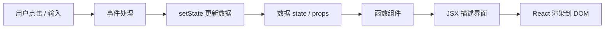
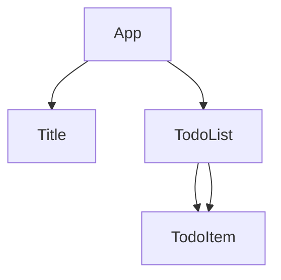

# React 学习系列（二）：Vite 搭项目、认识 JSX、第一个组件与 useState

> 第一篇你把 `const`、`map`、解构、`import` 在控制台练熟了——但真正的 React 项目长什么样？`npm create` 之后满屏文件夹，`App.jsx` 里既有 HTML 又像 JS，`useState` 到底是什么？这篇是系列第二篇：**用 Vite 创建项目**，把第一篇的语法装进真实的 `.jsx` 文件，写**第一个函数组件**，用 **`useState` 管状态**、用 **事件** 响应点击。偏概念与动手，构建配置、性能优化等细节遇到项目再深挖。

---

## 目录

1. [前言：从语法课到真项目](#1-前言从语法课到真项目)
2. [React 是什么：用函数描述界面](#2-react-是什么用函数描述界面)
3. [Vite 是什么：现代前端项目的启动器](#3-vite-是什么现代前端项目的启动器)
4. [创建第一个 Vite + React 项目](#4-创建第一个-vite--react-项目)
5. [项目目录：先认路，别急着背配置](#5-项目目录先认路别急着背配置)
6. [认识 JSX：在 JavaScript 里写界面](#6-认识-jsx在-javascript-里写界面)
7. [函数组件：你的第一个「界面函数」](#7-函数组件你的第一个界面函数)
8. [拆分组件与 props：解构登场](#8-拆分组件与-props解构登场)
9. [useState：让界面「动起来」](#9-usestate让界面动起来)
10. [事件处理：点击、输入与表单](#10-事件处理点击输入与表单)
11. [列表渲染：把第一篇的 map 写进 JSX](#11-列表渲染把第一篇的-map-写进-jsx)
12. [综合实战：计数器 + 迷你待办](#12-综合实战计数器--迷你待办)
13. [常见陷阱与 FAQ](#13-常见陷阱与-faq)
14. [总结与系列下一篇](#14-总结与系列下一篇)

---

## 1. 前言：从语法课到真项目

典型卡点：

- 第一篇 §12 的待办逻辑在控制台能跑，但不知道放进哪个文件。
- 跑 `npm create vite@latest` 后，`vite.config.js`、`eslint` 一堆名词，想先逃。
- 看见 `return (<div>...</div>)` 不确定这是 HTML 还是 JS。

**React**（React.js）：一个用于构建用户界面的 JavaScript 库，由 Meta 开源。  
通俗说：你写「界面长什么样」的函数，React 负责把它画到浏览器里，并在数据变化时高效更新。

**Vite**（法语「快」）：现代前端构建工具，开发时启动快、改代码后刷新快。  
通俗说：帮你把 `.jsx` 翻译成浏览器能跑的 JS，并起一个本地开发服务器——不用自己配 webpack。

读完本文，你应该能做到：

1. 用 Vite 创建一个 React 项目并跑起 `npm run dev`。
2. 说出 `src/main.jsx` 与 `src/App.jsx` 各自干什么（概念级）。
3. 读懂并编写简单 JSX：表达式插值、条件、列表、`className`。
4. 写函数组件，用 props 解构传参。
5. 用 `useState` 做计数器、待办勾选，并处理 `onClick` 事件。

**前置阅读**：[系列（一）JavaScript ES6+ 快速入门](01.javascript-es6-quickstart.md)——尤其 `const`、箭头函数、解构、`map`、`import/export`。本篇默认这些已经能看懂。

**环境要求**：

| 依赖 | 版本建议 |
|------|----------|
| Node.js | 18+（带 `npm`） |
| 编辑器 | VS Code / Cursor |
| 浏览器 | Chrome / Edge 最新版 |

### 1.1 本文边界：先建立地图，不深挖配置

下面这些**本篇只点到为止**，写项目时遇到了再查即可：

- Vite 插件、路径别名、`vite.config` 每一项含义
- React 18 并发特性、Strict Mode 双渲染原理
- CSS Modules、Tailwind、状态管理库（Redux 等）
- `useEffect` 拉接口（系列第三篇或之后）

目标：**今天结束你能改 `App.jsx`、加一个按钮、列表能增删**——这就够开启真实练习了。

### 1.2 动手路径（建议顺序）

| 步骤 | 做什么 | 对应章节 |
|------|--------|----------|
| 1 | `npm create vite` 跑通默认页 | §4 |
| 2 | 打开 `App.jsx`，改成自己的标题 | §6–§7 |
| 3 | 新建 `Title.jsx`，练习 props | §8 |
| 4 | 做计数器 `useState` | §9 |
| 5 | 做待办列表 + 勾选 | §10–§12 |

不要跳步：**先能在浏览器里看到字，再加按钮，再加列表**。

---

## 2. React 是什么：用函数描述界面

传统网页：用 JS 操作 DOM——`document.getElementById`、`.innerHTML`、一个个改节点。  
React 的思路：**用数据描述界面应该长什么样**，数据变了，React 帮你算出差分并更新 DOM。

可以把它想成「Excel 公式」：单元格（界面）由数据（state/props）推导出来，改数据，显示自动变——你不用手动找哪个 `<span>` 要改。



对照上图：本篇重点在 **B → C**（写组件和 JSX）和 **E → F → G**（事件 + `useState`）；「React 怎么高效更新 DOM」属于进阶，现在知道「会更新」即可。

### 2.1 和第一篇怎么衔接

| 第一篇（纯 JS） | 本篇（React） |
|-----------------|---------------|
| `const x = 1` | 组件里照样 `const` |
| `users.map(u => u.name)` | `{users.map(u => <li key={u.id}>...</li>)}` |
| `function Card({ title })` | 同名写法，只是 `return` 里是 JSX |
| `import { add } from './utils'` | `import { useState } from 'react'` |

第一篇是「台词」；本篇是「上台排戏」——语法同一套，只是文件后缀变成 `.jsx`，返回值从字符串变成界面描述。

---

## 3. Vite 是什么：现代前端项目的启动器

90 年代式前端：一个 HTML 里堆多个 `<script>`。  
现代 React 项目：几十个 `.jsx` 文件、`import` 互相引用——浏览器**不能直接**理解 JSX 和裸 `import`，需要**构建工具**在开发/打包时做转换。

**构建工具**（Build Tool）：把源码（JSX、TS、CSS）转成浏览器能执行的文件。  
通俗说：厨房里的「预处理」——你写菜谱（源码），它切好配好（打包），再端给客人（浏览器）。

选 Vite 的原因（直觉级，不必背 benchmark）：

| 对比 | 老工具常见体验 | Vite |
|------|----------------|------|
| 冷启动 | 等几十秒 | 通常几秒内 |
| 改代码后 | 整页慢刷新 | 热更新快 |
| 官方模板 | 要自己拼 | `npm create vite` 一键 React |

Create React App（CRA）曾很流行，近年新项目更常选 **Vite** 或 Next.js。本系列练手用 Vite 足够轻。

---

## 4. 创建第一个 Vite + React 项目

演示什么：从零生成项目并在浏览器看到默认页。  
前置：已安装 Node 18+，终端能跑 `node -v`。

### 4.1 创建项目

在你要放项目的目录下执行（Windows PowerShell / macOS / Linux 终端均可）：

```bash
npm create vite@latest my-react-app -- --template react
```

- `my-react-app`：项目文件夹名，可改成任意英文名（勿中文、勿空格）。
- `--template react`：使用官方 React 模板（JavaScript 版，非 TypeScript）。

交互式创建也可以：省略项目名，按提示选 **React** → **JavaScript**。

### 4.2 安装依赖并启动

```bash
cd my-react-app
npm install
npm run dev
```

终端会打印本地地址，通常是：

```text
  ➜  Local:   http://localhost:5173/
```

浏览器打开该地址，应看到 Vite + React 的默认页（Logo 和计数按钮）。**看到这页就算环境成功。**

### 4.3 常用 npm 脚本（先记三个）

| 命令 | 作用 |
|------|------|
| `npm run dev` | 开发模式，改代码自动刷新 |
| `npm run build` | 打包成可部署的静态文件（`dist/`） |
| `npm run preview` | 本地预览打包结果 |

开发阶段 99% 的时间只用 `npm run dev`。`build` 上线前再用。

### 4.4 先错后对：常见启动失败

| 现象 | 可能原因 | 处理 |
|------|----------|------|
| `npm` 不是内部命令 | 未装 Node | 安装 [Node.js LTS](https://nodejs.org/) |
| 端口 5173 被占用 | 别的程序占端口 | 终端里按提示换端口，或关掉占用进程 |
| 页面空白 + 控制台报错 | 改坏了 `main.jsx` | 用 Git 还原或对照 §5 检查 |

---

## 5. 项目目录：先认路，别急着背配置

Vite 生成的 React 模板大致如下（只标**本篇要认的**文件）：

```text
my-react-app/
├── index.html          # 页面壳，里面有一个 <div id="root">
├── package.json        # 依赖列表和 npm 脚本
├── vite.config.js      # Vite 配置（初学可不动）
├── public/             # 静态资源，原样复制
└── src/
    ├── main.jsx        # 入口：把 React 挂到 #root
    ├── App.jsx         # 根组件（你先改的大本营）
    ├── App.css         # App 的样式
    ├── index.css       # 全局样式
    └── assets/         # 图片等，import 进组件用
```

**挂载**（Mount）：把 React 组件「插」到 HTML 某个 DOM 节点上。  
通俗说：`index.html` 留一个空插座 `#root`，`main.jsx` 把整棵组件树插上去。

### 5.1 入口 `main.jsx` 在干什么

演示什么：理解「谁把 App 显示到页面上」。不必背，能指着说即可：

```jsx
import { StrictMode } from 'react'
import { createRoot } from 'react-dom/client'
import App from './App.jsx'
import './index.css'

createRoot(document.getElementById('root')).render(
  <StrictMode>
    <App />
  </StrictMode>,
)
```

解读（概念级）：

1. `import App from './App.jsx'`——第一篇的默认导入；`App` 是根组件。
2. `document.getElementById('root')`——找到 `index.html` 里的插座。
3. `createRoot(...).render(<App />)`——让 React 渲染 `App`，显示成网页。

`StrictMode` 是开发时的「严格检查包装」，可能让部分逻辑在开发环境执行两次——**初学可忽略细节**，不要删就行。

### 5.2 你今天主要改 `App.jsx`

实战阶段：**90% 改动在 `src/` 下的 `.jsx`**。`vite.config.js` 和 `package.json` 除非装新库，否则很少动。

### 5.3 热更新（HMR）是什么

**热模块替换**（Hot Module Replacement，HMR）：开发时改代码，浏览器**不整页刷新**就替换改动的模块。  
通俗说：换舞台上一块布景，不用整场戏重播——状态有时能保留（不保证 100%，初学知道「保存后很快能看到变化」即可）。

若你改了 `App.jsx` 保存，几秒内页面自动更新，说明 Vite 开发服务器工作正常。

### 5.4 引入样式：import CSS

```jsx
import './App.css'

export default function App() {
  return <main className="app">...</main>;
}
```

`className="app"` 对应 `App.css` 里的 `.app { ... }`。全局样式在 `main.jsx` 里 `import './index.css'`。  
CSS 写法不是 React 专属——会 HTML/CSS 就能慢慢改外观；本篇不展开布局框架。

---

## 6. 认识 JSX：在 JavaScript 里写界面

**JSX**（JavaScript XML）：在 JavaScript 里写类似 HTML 的语法，描述 UI 结构。  
通俗说：不是字符串拼 `<div>`，而是像写 HTML 一样写界面，由工具转成 `React.createElement` 调用。

浏览器**不能**直接执行 JSX——Vite 在开发时帮你编译，所以项目里才能 `return (<div>...</div>)`。

### 6.1 JSX 与 HTML 的关键区别

| HTML / 习惯 | JSX |
|-------------|-----|
| `class="box"` | `className="box"`（`class` 是 JS 保留字） |
| `for="email"` | `htmlFor="email"` |
| 标签可不闭合 | 必须闭合：``、`<br />` |
| 注释 `<!-- -->` | `{/* 注释 */}` |
| 内联样式字符串 | `style={{ color: 'red' }}`（外层对象，驼峰属性） |

### 6.2 插值：花括号里是 JavaScript 表达式

和第一篇模板字符串的 `${}` 类似，JSX 里用 **`{表达式}`**：

```jsx
const name = "React";
const count = 3;

function Greeting() {
  return (
    <div>
      <h1>你好，{name}</h1>
      <p>共 {count} 项</p>
      <p>双倍：{count * 2}</p>
    </div>
  );
}
```

**规则**：`{ }` 里必须是**表达式**（有值），不能写 `if`、`for` 语句块——第一篇 §13.8 讲过。条件用三元：`{ok ? <p>是</p> : <p>否</p>}`。

### 6.3 必须有一个根元素（或 Fragment）

```jsx
// ❌ 两个并列根
return (
  <h1>标题</h1>
  <p>段落</p>
);

// ✅ 包一层
return (
  <div>
    <h1>标题</h1>
    <p>段落</p>
  </div>
);

// ✅ 不想多一层 div 时用 Fragment
return (
  <>
    <h1>标题</h1>
    <p>段落</p>
  </>
);
```

`<>...</>` 是 `React.Fragment` 的简写，不会在 DOM 里多出一个 div。

### 6.4 条件渲染：三种常见写法

演示什么：根据状态显示不同内容。下面 `loggedIn` 可先写死 `true`/`false` 试效果：

```jsx
const loggedIn = false;

// 1. 三元表达式（最常用）
return <div>{loggedIn ? <p>欢迎回来</p> : <p>请先登录</p>}</div>;

// 2. && 短路：前面为真才渲染后面
return <div>{loggedIn && <p>只有登录才看见我</p>}</div>;

// 3. 先在外面算好变量（逻辑复杂时更清晰）
let content;
if (loggedIn) {
  content = <Dashboard />;
} else {
  content = <LoginForm />;
}
return <div>{content}</div>;
```

第三种的 `if` 写在 `return` **之前**，不是写在 JSX 花括号里——再次呼应「花括号里只能是表达式」。

### 6.5 组件名必须大写

```jsx
// ❌ 小写会被当成 HTML 标签
<welcome />

// ✅ 组件首字母大写
<Welcome />
```

---

## 7. 函数组件：你的第一个「界面函数」

**函数组件**（Function Component）：一个返回 JSX 的 JavaScript 函数。  
通俗说：界面 = 函数的返回值，跟 `return 1 + 1` 一样，只是返回的是「描述 DOM 的树」。

演示什么：最小组件。把 `App.jsx` 改成下面，保存后浏览器应显示标题和段落：

```jsx
export default function App() {
  return (
    <main>
      <h1>我的第一个 React 页</h1>
      <p>这是用 Vite 跑起来的。</p>
    </main>
  );
}
```

解读：

- `export default`——第一篇 §11；`main.jsx` 里 `import App from './App.jsx'` 导入的就是它。
- `function App()`——组件名 `App` 大写。
- `return (...)`——返回 JSX；多行时括号包起来，避免自动分号坑。

### 7.1 箭头函数写法（等价）

```jsx
const App = () => {
  return (
    <main>
      <h1>我的第一个 React 页</h1>
    </main>
  );
};

export default App;
```

团队两种都有；模板常用 `export default function App()`。**选一个风格保持一致即可。**

### 7.2 在组件里用 `const` 算展示数据

第一篇的纯 JS 逻辑可以直接写在 `return` 之前：

```jsx
export default function App() {
  const title = "待办清单";
  const items = ["学 JSX", "学 useState", "学事件"];
  const count = items.length;

  return (
    <main>
      <h1>{title}</h1>
      <p>共 {count} 项</p>
    </main>
  );
}
```

这里还没有「点击会变」的状态——只是普通 `const`，每次渲染重新算一遍。要「可交互」需要 §9 的 `useState`。

---

## 8. 拆分组件与 props：解构登场

项目变大后，一个 `App.jsx` 塞所有东西会难维护。**拆分**成小组件，用 **props** 传数据。

**props**（Properties）：父组件传给子组件的只读参数，是一个对象。  
通俗说：父组件给子组件的「定制单」——子组件按 props 决定显示什么。

### 8.1 子组件 + props 解构

新建 `src/Title.jsx`（与 `App.jsx` 同级）：

```jsx
export default function Title({ text, subtitle }) {
  return (
    <header>
      <h1>{text}</h1>
      {subtitle && <p className="subtitle">{subtitle}</p>}
    </header>
  );
}
```

`App.jsx` 使用：

```jsx
import Title from './Title.jsx'

export default function App() {
  return (
    <main>
      <Title text="我的待办" subtitle="系列第二篇练习" />
    </main>
  );
}
```

对照第一篇 §6.4：参数里 `{ text, subtitle }` 就是 **props 解构**；`subtitle && <p>...</p>` 表示「有 subtitle 才渲染段落」。

### 8.2 默认值

```jsx
function Badge({ label = "默认", color = "gray" }) {
  return <span className={`badge badge-${color}`}>{label}</span>;
}
```

父组件没传 `label` 时用 `"默认"`——与第一篇解构默认值相同。

### 8.3 组件树（概念）



**数据通常从上往下流**（父 → 子 via props）。子怎么「通知」父？用**回调 props**（§10）——父传函数下去，子在里面调用。

---

## 9. useState：让界面「动起来」

静态 `const` 改了不会触发重新渲染。**状态**（State）：组件要记住、且变化后要刷新界面的数据。

**Hook**（钩子）：以 `use` 开头的特殊函数，只能在函数组件顶层调用。  
通俗说：给函数组件「挂上」状态、副作用等能力——`useState` 是最常用的一个。

**`useState`**：返回 `[当前值, 更新函数]`，更新后 React 会**重新执行**组件函数，画出新界面。

### 9.1 和第一篇数组解构的对上了

```jsx
import { useState } from 'react'

export default function Counter() {
  const [count, setCount] = useState(0);

  return (
    <div>
      <p>当前：{count}</p>
      <button onClick={() => setCount(count + 1)}>+1</button>
    </div>
  );
}
```

| 片段 | 第一篇对应 |
|------|------------|
| `import { useState } from 'react'` | 命名导入 §11 |
| `const [count, setCount] = ...` | 数组解构 §6.1 |
| `useState(0)` | 初始值为 `0` |
| `setCount(count + 1)` | 用新值触发更新 |
| `onClick={() => ...}` | 箭头函数 §4 |

**不要**直接 `count = count + 1`——React 不知道你改了，界面不会更新。必须通过 **`setCount`**。

### 9.2 状态更新是「替换」，不是改原变量

```jsx
const [user, setUser] = useState({ name: "小明", age: 18 });

// ❌ 直接改对象字段，React 可能不刷新
// user.name = "小红";

// ✅ 新对象（第一篇 §7 展开运算符）
setUser({ ...user, name: "小红" });
```

列表同理：`setItems([...items, newItem])`，不要 `items.push` 后 set 同一引用。

### 9.3 函数式更新

下一次状态依赖上一次时，用回调形式更稳：

```jsx
<button onClick={() => setCount((c) => c + 1)}>+1</button>
```

`c` 是 React 保证的「最新 count」——快速连点或多处更新时更可靠。初学 `setCount(count + 1)` 也常够用；看到 `(c) => c + 1` 要知道是同一回事。

### 9.4 多个 useState

```jsx
const [name, setName] = useState("");
const [done, setDone] = useState(false);
```

一个组件可以有多个 `useState`，各管各的字段——比一个大对象初学更直观。

### 9.5 用表格对照：state vs 普通 const

| | `const x = ...` | `useState` |
|---|-----------------|------------|
| 会变吗 | 每次渲染重新执行，用户操作不会单独触发 | `setX` 会触发重新渲染 |
| 典型用途 | 派生展示、常量配置 | 计数、表单输入、列表数据 |
| 第一篇类比 | 普通变量 | `useState` 返回数组解构 §6.1 |

```jsx
const doubled = count * 2;  // 由 count 算出来，count 变会自动重算
return <p>{doubled}</p>;
```

`doubled` 不必再设一个 state——**能从 state 算出来的，优先用 const 算**。

---

## 10. 事件处理：点击、输入与表单

**事件处理**（Event Handling）：用户点击、输入时执行的函数。  
React 里写法是 **camelCase 属性 + 函数**：`onClick`、`onChange`，不是 HTML 的 `onclick`。

### 10.1 onClick

```jsx
function App() {
  const handleClick = () => {
    alert("被点了");
  };

  return <button onClick={handleClick}>点我</button>;
}
```

注意：传的是 **函数引用** `handleClick`，不是 `handleClick()`——后者会在渲染时立刻执行。

```jsx
// ❌ 渲染时就 alert
<button onClick={handleClick()}>

// ✅ 点击时才执行
<button onClick={handleClick}>
<button onClick={() => handleClick()}>  // 需要传参时用箭头包一层
```

### 10.2 子组件通知父组件：回调 props

父组件把 `setState` 或包装函数传给子组件：

```jsx
function Child({ onAdd }) {
  return <button onClick={() => onAdd("新待办")}>添加</button>;
}

function Parent() {
  const [items, setItems] = useState([]);

  const handleAdd = (text) => {
    setItems([...items, { id: Date.now(), text }]);
  };

  return <Child onAdd={handleAdd} />;
}
```

数据流：**父握有 state**，子通过 `onAdd` **上报意图**——这是 React 里最常用的父子通信方式（概念级）。

若用户快速连点「添加」，更稳妥的写法是函数式更新：`setItems((prev) => [...prev, { id: Date.now(), text }])`——与 §9.3 计数器里的 `setCount((c) => c + 1)` 同一道理，避免读到陈旧的 `items`。

### 10.3 输入框：onChange

```jsx
const [text, setText] = useState("");

return (
  <input
    value={text}
    onChange={(e) => setText(e.target.value)}
    placeholder="输入待办"
  />
);
```

这叫**受控组件**：输入框的值由 `text` state 控制，`onChange` 里用 `e.target.value` 更新。`e` 是**合成事件**（SyntheticEvent），行为接近原生事件——细节用到再查，记住 `e.target.value` 取输入值即可。

---

## 11. 列表渲染：把第一篇的 map 写进 JSX

第一篇 §9：`users.map(u => <li>...</li>)` 在 React 里几乎原样搬进 JSX，外面包一层 `{ }`：

```jsx
const todos = [
  { id: 1, text: "学 JSX", done: false },
  { id: 2, text: "学 useState", done: true },
];

return (
  <ul>
    {todos.map((todo) => (
      <li key={todo.id}>
        {todo.done ? "✅" : "⬜"} {todo.text}
      </li>
    ))}
  </ul>
);
```

### 11.1 key 是什么、为什么需要

**key**：列表每一项的稳定唯一标识，给 React Diff 算法用。  
通俗说：一列队里每人胸牌号——重排、增删时 React 知道谁是谁。

```jsx
{todos.map((todo) => (
  <li key={todo.id}>...</li>  // ✅ 用数据里的 id
))}
```

| 写法 | 是否推荐 |
|------|----------|
| `key={todo.id}` | ✅ 稳定 id |
| `key={index}` 仅用下标 | ⚠️ 列表会排序/删中间项时易出 bug |
| 不写 key | ❌ 控制台警告 |

### 11.2 拆成 TodoItem 子组件

```jsx
function TodoItem({ todo, onToggle }) {
  return (
    <li>
      <label>
        <input
          type="checkbox"
          checked={todo.done}
          onChange={() => onToggle(todo.id)}
        />
        {todo.text}
      </label>
    </li>
  );
}

function TodoList({ todos, onToggle }) {
  return (
    <ul>
      {todos.map((todo) => (
        <TodoItem key={todo.id} todo={todo} onToggle={onToggle} />
      ))}
    </ul>
  );
}
```

`todo={todo}` 是把整个对象作为 prop 传下去；子组件里继续解构 `todo.text`、`todo.done`——第一篇 §6 全程复用。

---

## 12. 综合实战：计数器 + 迷你待办

**阅读顺序**：§4–§11，且第一篇 §6–§9、§7 展开运算符。

演示什么：一个文件版「能点、能勾、能加」的待办——建议新建 `src/App.jsx` 覆盖练习（或备份默认内容）。

```jsx
import { useState } from 'react'
import './App.css'

export default function App() {
  const [count, setCount] = useState(0);
  const [input, setInput] = useState("");
  const [todos, setTodos] = useState([
    { id: 1, text: "读完第二篇", done: false },
  ]);

  const addTodo = () => {
    const text = input.trim();
    if (!text) return;
    setTodos([...todos, { id: Date.now(), text, done: false }]);
    setInput("");
  };

  const toggleTodo = (id) => {
    setTodos(
      todos.map((t) => (t.id === id ? { ...t, done: !t.done } : t))
    );
  };

  return (
    <main className="app">
      <section>
        <h2>计数器</h2>
        <p>点了 {count} 次</p>
        <button onClick={() => setCount((c) => c + 1)}>+1</button>
      </section>

      <section>
        <h2>待办</h2>
        <input
          value={input}
          onChange={(e) => setInput(e.target.value)}
          placeholder="新待办"
        />
        <button onClick={addTodo}>添加</button>
        <ul>
          {todos.map((todo) => (
            <li key={todo.id}>
              <label>
                <input
                  type="checkbox"
                  checked={todo.done}
                  onChange={() => toggleTodo(todo.id)}
                />
                {todo.text}
              </label>
            </li>
          ))}
        </ul>
      </section>
    </main>
  );
}
```

预期行为：

- 「+1」每次点击数字增加。
- 输入文字点「添加」，列表多一项。
- 勾选 checkbox，对应项显示为已勾选（`done` 翻转）。

对照第一篇： `map`、展开 `{ ...t, done: !t.done }`、`const`、`箭头函数` 全部在真实 `.jsx` 里出现——这就是系列（一）→（二）的衔接。

### 12.1 建议你亲手改的四个小扩展

1. 给已完成待办加删除线：`style={{ textDecoration: todo.done ? 'line-through' : 'none' }}`  
2. 显示未完成数量：`todos.filter(t => !t.done).length`  
3. 把 `<section>计数器` 拆到 `Counter.jsx`  
4. 空输入时 `addTodo` 不添加（上面已用 `trim` 判断）

### 12.2 文件拆分版目录（可选）

练熟后把 §12 拆成多文件，熟悉 import 路径：

```text
src/
├── App.jsx           # 组合 Counter + TodoApp
├── Counter.jsx       # 计数器
├── TodoApp.jsx       # 输入框 + 列表
├── TodoItem.jsx      # 单项
└── main.jsx
```

`App.jsx` 里 `import Counter from './Counter.jsx'`——与第一篇 §11 相同，只是扩展名写成 `.jsx`。相对路径 `./` 表示同目录，`../` 表示上一级（第一篇 §11.5）。

### 12.3 运行结果自检

| 操作 | 预期 |
|------|------|
| 点 +1 | 数字递增 |
| 输入「测试」点添加 | 列表多一行 |
| 勾选某项 | checkbox 状态保持 |
| 刷新浏览器 | 列表恢复初始（尚未持久化，正常） |

---

## 13. 常见陷阱与 FAQ

### 13.1 陷阱一：Hook 写在 if / 循环里

```jsx
// ❌ 条件里才 useState —— 违反 Hook 规则
if (ok) {
  const [x, setX] = useState(0);
}

// ✅ 永远在组件顶层调用
const [x, setX] = useState(0);
```

Hook 调用顺序必须每次渲染一致——细节系列进阶再讲，**先记住：useState 写在函数最外层**。

### 13.2 陷阱二：直接修改 state 数组/对象

见 §9.2。口诀：**set 时给新数组/新对象**。

### 13.3 陷阱三：map 里忘记 key 或用 index 乱用

见 §11.1。有 `id` 就用 `id`。

### 13.4 陷阱四：把组件当普通函数直接调

```jsx
// ❌ 不会按 React 组件生命周期走
App();

// ✅ JSX 或 createElement
<App />
```

### 13.5 FAQ

**Q：`.jsx` 和 `.js` 有什么区别？**  
A：`.jsx` 表示文件里可能有 JSX 语法；Vite 两者都能处理。React 项目习惯组件用 `.jsx`。

**Q：改完代码页面没变？**  
A：看终端是否还在跑 `npm run dev`；看浏览器是否连对端口；硬刷新 `Ctrl+Shift+R`。

**Q：必须学 class 组件吗？**  
A：新项目绝大多数用函数组件 + Hooks。老代码可能见到 class，遇到再查。

**Q：什么时候学 `useEffect` 拉接口？**  
A：本篇先把「点击改 state、列表 map」练熟。下一篇或系列（三）接 `fetch` + `useEffect`，衔接第一篇 §10。

**Q：Vite 和 Next.js 选哪个？**  
A：练 React 基础用 Vite 更轻。要做 SEO、全栈路由再学 Next.js。

### 13.6 动手自检清单

- [ ] 能独立 `npm create vite` 并打开 localhost 页面
- [ ] 能解释 `main.jsx` 与 `App.jsx` 的分工
- [ ] 能写带 `{表达式}` 的 JSX，会用 `className`
- [ ] 能拆子组件并用 props 解构
- [ ] 能用 `useState` 做计数器
- [ ] 能写 `onClick` / `onChange`，理解受控 input
- [ ] 能 `todos.map` 渲染列表并加 `key`

---

## 14. 总结与系列下一篇

### 14.1 概念速记表

| 概念 | 一句话 | 对应第一篇 |
|------|--------|------------|
| Vite | 开发服务器 + 构建工具 | Node 跑 npm |
| JSX | JS 里写 UI，编译后给 React | 表达式规则 §13.8 |
| 函数组件 | 返回 JSX 的函数 | 箭头函数、export |
| props | 父传子的只读参数 | 解构 §6 |
| useState | `[值, set值]` 管状态 | 数组解构 §6 |
| 事件 | `onClick` 等传函数 | 箭头函数 §4 |
| 列表 | `map` + `key` | §9 |

### 14.2 决策：我现在该写什么

```
刚搭好项目？
└─ 先改 App.jsx，确认能显示一行字

要显示动态数字？
└─ useState + {count} + button onClick

要显示列表？
└─ useState([]) + map + key={item.id}

子组件要改父组件数据？
└─ 父传回调 onXxx，子里调用

要请求后端？
└─ 本篇先不急着上；下一篇 useEffect + fetch
```

### 14.3 系列下一篇预告

**React 学习系列（三）**：[useEffect 与接口请求、加载态与数据流](03.use-effect-data-fetching.md)——把第一篇的 `async/await` 和 [REST API 教程](../5.rest-api-design-tutorial.md) 接进页面。

完整目录见 [react/README.md](README.md)。

### 14.4 与全栈路径的衔接

- 本篇的待办还在浏览器内存里，刷新会丢——以后要接后端 API 或 `localStorage`。
- 样式目前用普通 CSS；项目大了可接触 CSS Modules 或 Tailwind，**不影响**你先理解组件和 state。

---

> **系列定位**：第一篇补 **JS 语法**；本篇补 **React 写界面与交互的最小闭环**。下一篇 [（三）useEffect 与数据请求](03.use-effect-data-fetching.md)；完整 1～13 路线见 [README.md](README.md)。
