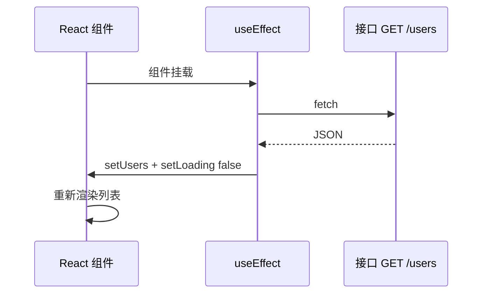
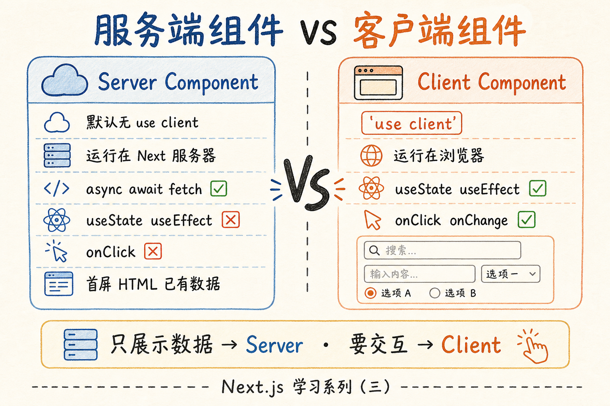
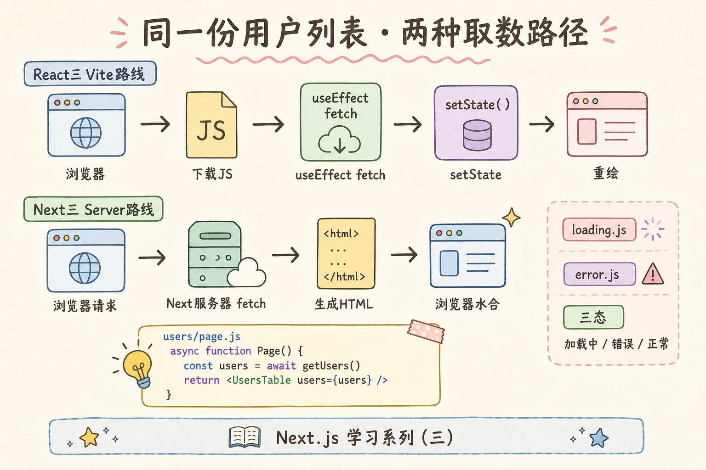
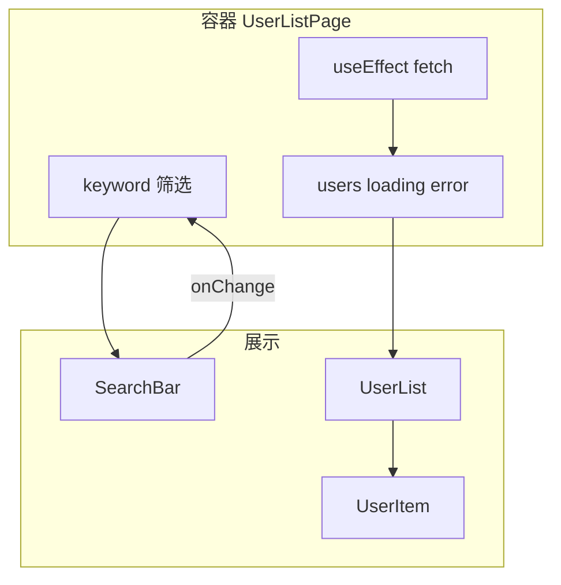
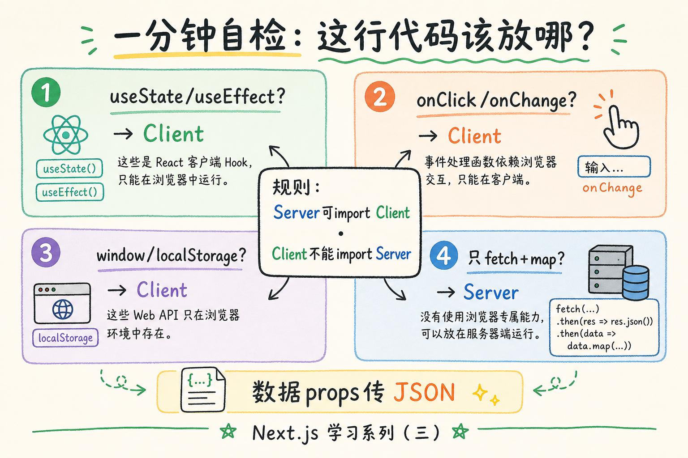

# React 学习系列（三）：useEffect 与接口请求、加载态与数据流

> 第二篇的待办列表在浏览器内存里，刷新就没了；真实产品要从后端拉用户、订单、文章。你在第一篇练过 `async/await` 和 `fetch`，在 [REST API 教程](../5.rest-api-design-tutorial.md) 里设计过 `GET /api/users`——现在要把它们**接进 React 页面**：组件挂载后自动请求、等待时显示「加载中」、失败时显示错误、成功后再 `map` 渲染列表。这篇是系列第三篇：认识 **`useEffect`**，掌握 **loading / error / data 三态**，理清 **父组件握数据、子组件管展示** 的稍复杂数据流。偏概念与可运行示例，请求库封装、React Query 等遇到项目再学。

---

## 目录

1. [前言：界面要接真实数据了](#1-前言界面要接真实数据了)
2. [全栈视角：前端请求在 REST 里站哪](#2-全栈视角前端请求在-rest-里站哪)
3. [副作用与 useEffect：什么时候拉接口](#3-副作用与-useeffect什么时候拉接口)
4. [async/await 进 useEffect：标准写法](#4-asyncawait-进-useeffect标准写法)
5. [三态 UI：加载中、错误、成功](#5-三态-ui加载中错误成功)
6. [消费 JSON：?.、?? 与 map 列表](#6-消费-json与-map-列表)
7. [封装 fetchJSON：少写重复样板](#7-封装-fetchjson少写重复样板)
8. [组件数据流：谁握 state、谁只展示](#8-组件数据流谁握-state谁只展示)
9. [稍复杂一点：筛选、选中与回调](#9-稍复杂一点筛选选中与回调)
10. [综合实战：用户列表页](#10-综合实战用户列表页)
11. [对接自己的后端（概念）](#11-对接自己的后端概念)
12. [常见陷阱与 FAQ](#12-常见陷阱与-faq)
13. [总结与系列下一步](#13-总结与系列下一步)

---

## 1. 前言：界面要接真实数据了

第二篇典型卡点：

- 知道 `fetch` 能拉数据，但不知道写在组件的**哪一行**。
- 页面先白屏再出字，或报错时整页空白——不知道要单独处理 **loading / error**。
- 列表在父组件、卡片在子组件，**筛选条件**放哪、怎么传，容易乱。

**副作用**（Side Effect）：与「算完 JSX 就结束」无关、要**在渲染之外**触发的逻辑，例如请求接口、订阅、改 `document.title`。  
通俗说：组件除了「画界面」，还要「对外办事」——拉数据就是最常见的一种。

**`useEffect`**（Effect Hook）：在函数组件里注册副作用，在特定时机（通常是挂载后）执行你写的函数。  
通俗说：组件「上台演出后」，再去后台取道具（数据）——取回来用 `setState` 更新界面。

读完本文，你应该能做到：

1. 用 `useEffect` 在组件挂载后请求公开 API，并用 `async/await` 解析 JSON。
2. 用三个 state（或等价结构）表达 **loading、error、data**，界面分支渲染。
3. 用 `data?.items ?? []` 安全消费接口字段，用 `map` 渲染列表。
4. 拆分「容器组件拉数据 / 展示组件管 UI」，用 props + 回调传递筛选与选中。
5. 说清与 [REST API 教程](../5.rest-api-design-tutorial.md) 里 `GET` 列表接口的对应关系。

**前置阅读**：

| 篇章 | 必看内容 |
|------|----------|
| [（一）ES6+](01.javascript-es6-quickstart.md) | §8 `?.`/`??`、§9 `map`、§10 `fetch`/`async/await`、§10.7 `fetchJSON` |
| [（二）Vite + JSX](02.vite-jsx-first-component.md) | `useState`、列表 `key`、props 解构、子组件 |
| [REST API 设计](../5.rest-api-design-tutorial.md) | `GET /users`、JSON 响应、HTTP 状态码（了解即可） |

**环境**：延续第二篇的 Vite + React 项目；`npm run dev` 能跑。示例默认请求 [JSONPlaceholder](https://jsonplaceholder.typicode.com/)（免费假接口，需联网）。

### 1.1 本文边界

本篇**先建立地图**，不深究：

- `useEffect` 依赖数组每一项的精细规则、闭包陷阱
- `AbortController` 取消请求、Strict Mode 双请求
- React Query / SWR / TanStack Query
- 全局状态管理（Redux、Zustand）

目标：**能做一个「进页拉列表 → 转圈 → 成功/失败」的页面**，并能拆成 2～3 个组件协作。

### 1.2 动手路径

| 步骤 | 做什么 | 章节 |
|------|--------|------|
| 1 | 在 `App.jsx` 里写最小 `useEffect` + `fetch` | §3–§4 |
| 2 | 加 loading / error 分支 | §5 |
| 3 | 抽 `fetchJSON` 到 `utils` | §7 |
| 4 | 拆 `UserList` / `UserItem` | §8 |
| 5 | 加搜索筛选 | §9–§10 |

---

## 2. 全栈视角：前端请求在 REST 里站哪

后端按 [REST 教程](../5.rest-api-design-tutorial.md) 暴露资源 URL，前端用 HTTP 动词访问。列表页最常见：

| 后端（REST） | 前端（React） |
|--------------|---------------|
| `GET /api/users` | `fetch('/api/users')` 或开发时代理到后端 |
| 200 + JSON 数组 | `await res.json()` 得到 `users` |
| 404 / 500 | `res.ok` 为 false，进错误态 |
| 字段 `id`, `name` | `users.map(u => <li key={u.id}>{u.name}</li>)` |



对照上图：**请求由副作用触发**，结果通过 **`setState` 进组件**，再驱动 JSX——不是把 `fetch` 写在 `return` 里。

### 2.1 和第一篇 async/await 的衔接

第一篇 §10.3 在控制台里：

```javascript
const res = await fetch(url);
const data = await res.json();
```

在 React 里**逻辑相同**，只是：

1. 写在 `useEffect` 里的 `async function` 中；
2. 结果交给 `setUsers(data)` 之类，而不是 `console.log`；
3. 用 `try/catch` 把错误转成界面上的 `error` 文案。

---

## 3. 副作用与 useEffect：什么时候拉接口

### 3.1 为什么不在 render 里直接 fetch

```jsx
// ❌ 每次渲染都请求，可能无限循环
function Bad() {
  const [users, setUsers] = useState([]);
  fetch("/api/users").then((r) => r.json()).then(setUsers);
  return <ul>...</ul>;
}
```

渲染 → 请求 → `setUsers` → 再渲染 → 再请求……**不能把「会触发 setState 的请求」放在函数体顶层**。

应在 **`useEffect`** 里请求：默认在**首次挂载后**执行一次（依赖数组写 `[]` 时）。

### 3.2 useEffect 最小形状

```jsx
import { useEffect } from 'react'

useEffect(() => {
  // 副作用：拉数据、订阅、日志等
  console.log('组件已挂载到页面');
}, []); // 空数组：只在挂载后执行一次（初学先记这个）
```

**依赖数组**（Dependency Array）：第二个参数 `[]`，控制「何时重新执行 effect」。  
通俗说：空数组 = 「只在上台时做一次」；以后学 ` [userId] ` 表示 userId 变了再拉。

本篇**先用 `[]`** 做「进页面拉一次列表」。依赖数组的精细行为系列进阶再讲。



### 3.3 和 useState 分工

| | useState | useEffect |
|---|----------|-----------|
| 管什么 | 当前要显示的数据、loading、error | 何时去取/同步外部数据 |
| 谁触发更新 | `setXxx` | 挂载、依赖变化 |
| 第一篇类比 | §6 解构、`const` | §10 异步（时机不同） |

---

## 4. async/await 进 useEffect：标准写法

### 4.1 先错后对：不要把 useEffect 回调本身写成 async

```jsx
// ❌ useEffect 的回调不能是 async 函数（返回值类型冲突）
useEffect(async () => {
  const data = await fetch(...);
}, []);

// ✅ 在里面再定义 async 函数并调用
useEffect(() => {
  async function loadUsers() {
    const res = await fetch('https://jsonplaceholder.typicode.com/users');
    const data = await res.json();
    console.log(data);
  }
  loadUsers();
}, []);
```

演示什么：挂载后打印用户数组。打开 F12 控制台，应看到 10 个用户对象。

### 4.2 完整最小请求 + 写入 state

演示什么：把接口数据放进 `useState`，界面显示用户数量。  
前置：第二篇 `useState`；需联网。

```jsx
import { useState, useEffect } from 'react'

export default function App() {
  const [users, setUsers] = useState([]);

  useEffect(() => {
    async function load() {
      const res = await fetch('https://jsonplaceholder.typicode.com/users');
      const data = await res.json();
      setUsers(data);
    }
    load();
  }, []);

  return (
    <main>
      <h1>用户列表</h1>
      <p>共 {users.length} 人</p>
    </main>
  );
}
```

第一次渲染时 `users` 是 `[]`，请求完成后 `setUsers` 触发第二次渲染，数字变成 10。中间会有一瞬间是 0——下一节用 **loading** 遮住。

### 4.3 检查 res.ok（对齐 REST 语义）

**HTTP 状态码** 4xx/5xx 时，`fetch` **不会自动抛错**，要靠 `res.ok` 判断：

```javascript
if (!res.ok) {
  throw new Error(`请求失败: ${res.status}`);
}
```

与 REST 教程一致：201 创建成功、404 资源不存在——前端应给用户可读提示，而不是假装成功。

---

## 5. 三态 UI：加载中、错误、成功

真实页面至少三种情况：

| 状态 | 用户看到 | state 典型值 |
|------|----------|--------------|
| 加载中 | 转圈 / 「加载中…」 | `loading === true` |
| 错误 | 红字提示、重试按钮 | `error` 有字符串 |
| 成功 | 列表、图表 | `data` / `users` 有内容 |

第一篇 §10.9 用纯 JS 模拟过；这里拆成三个 `useState`（初学最直观）：

```jsx
const [users, setUsers] = useState([]);
const [loading, setLoading] = useState(true);
const [error, setError] = useState(null);
```

### 5.1 请求里切换三态

演示什么：带 `try/catch/finally` 的完整加载流程。

```jsx
useEffect(() => {
  async function load() {
    setLoading(true);
    setError(null);
    try {
      const res = await fetch('https://jsonplaceholder.typicode.com/users');
      if (!res.ok) throw new Error(`HTTP ${res.status}`);
      const data = await res.json();
      setUsers(data);
    } catch (e) {
      setError(e.message ?? '加载失败');
      setUsers([]);
    } finally {
      setLoading(false);
    }
  }
  load();
}, []);
```

`finally` 里 `setLoading(false)` 保证成功失败都会结束「转圈」——第一篇 §10 的 `try/catch` 原样搬进组件。

### 5.2 JSX 里分支：先处理 loading 和 error

```jsx
if (loading) {
  return <p>加载中…</p>;
}

if (error) {
  return (
    <p role="alert">
      出错了：{error}
    </p>
  );
}

return (
  <ul>
    {users.map((u) => (
      <li key={u.id}>{u.name}</li>
    ))}
  </ul>
);
```

这叫 **早返回**（Early Return）：主界面逻辑留在最后，上面专门挡 loading/error。第二篇 §6.4 条件渲染的实战版。



### 5.3 三态与界面草图

```text
        挂载
          │
          ▼
    ┌───────────┐
    │ loading   │ ──→ 「加载中…」
    └─────┬─────┘
          │ fetch 结束
    ┌─────▼─────┐
    │ 成功？     │
    └─┬───────┬─┘
   否│       │是
      ▼       ▼
  error     users.map
  提示       列表
```

---

## 6. 消费 JSON：?.、?? 与 map 列表

接口形状因后端而异。REST 教程里列表可能是**裸数组**，也可能是**包一层**：

```json
{ "users": [ { "id": 1, "name": "小明" } ], "total": 1 }
```

第一篇 §8 的写法直接用在 JSX 前一行：

```jsx
const list = data?.users ?? [];
// 或接口直接返回数组：const list = Array.isArray(data) ? data : [];
```

### 6.1 字段映射：接口名 ≠ 展示名

JSONPlaceholder 用户字段是 `name`，没有 `user_name`；若你后端是 snake_case，用解构重命名（第一篇 §6.7）：

```jsx
{users.map(({ id, user_name: name }) => (
  <li key={id}>{name}</li>
))}
```

全栈项目要**对齐 REST 文档里的字段名**——前端 `fetch` 的 URL 和后端路由也要一致（见 §11）。

### 6.2 空列表也是成功

`users.length === 0` 且没有 error 时，应显示「暂无数据」，不要和 loading 混淆：

```jsx
if (!loading && !error && users.length === 0) {
  return <p>暂无用户</p>;
}
```

---

## 7. 封装 fetchJSON：少写重复样板

第二篇多个页面都要请求时，把第一篇 §10.7 搬进 `src/utils/fetchJSON.js`：

```javascript
export async function fetchJSON(url, options) {
  const res = await fetch(url, options);
  if (!res.ok) {
    throw new Error(`请求失败: ${res.status} ${res.statusText}`);
  }
  return res.json();
}
```

组件里：

```jsx
import { fetchJSON } from './utils/fetchJSON.js'

useEffect(() => {
  async function load() {
    setLoading(true);
    setError(null);
    try {
      const data = await fetchJSON('https://jsonplaceholder.typicode.com/users');
      setUsers(data);
    } catch (e) {
      setError(e.message ?? '加载失败');
    } finally {
      setLoading(false);
    }
  }
  load();
}, []);
```

**模块导出**与第一篇 §11 相同；路径 `./utils/fetchJSON.js` 与第二篇 §12.2 拆文件一致。

---

## 8. 组件数据流：谁握 state、谁只展示

数据流原则（第二篇 §8.3 延伸）：



- **容器组件**（Container）：握 `useState`、`useEffect`、请求逻辑。  
- **展示组件**（Presentational）：只收 props，负责 JSX 好看、好读。

通俗说：**父组件当「数据中心」**，子组件当「显示屏」——数据从上往下流（props），事件从下往上报（回调）。

### 8.1 UserList 只负责 map

`src/components/UserList.jsx`：

```jsx
export default function UserList({ users, onSelect }) {
  if (users.length === 0) {
    return <p>没有匹配的用户</p>;
  }

  return (
    <ul className="user-list">
      {users.map((user) => (
        <li key={user.id}>
          <button type="button" onClick={() => onSelect(user.id)}>
            {user.name}
          </button>
        </li>
      ))}
    </ul>
  );
}
```

`users`、`onSelect` 都由父组件传入——子组件**不 fetch**。

### 8.2 父组件握数据与请求

```jsx
import { useState, useEffect } from 'react'
import { fetchJSON } from '../utils/fetchJSON.js'
import UserList from './components/UserList.jsx'

export default function UserListPage() {
  const [users, setUsers] = useState([]);
  const [loading, setLoading] = useState(true);
  const [error, setError] = useState(null);
  const [selectedId, setSelectedId] = useState(null);

  useEffect(() => {
    async function load() {
      setLoading(true);
      setError(null);
      try {
        const data = await fetchJSON('https://jsonplaceholder.typicode.com/users');
        setUsers(data);
      } catch (e) {
        setError(e.message ?? '加载失败');
      } finally {
        setLoading(false);
      }
    }
    load();
  }, []);

  if (loading) return <p>加载中…</p>;
  if (error) return <p role="alert">错误：{error}</p>;

  const selected = users.find((u) => u.id === selectedId);

  return (
    <main>
      <h1>用户</h1>
      <UserList users={users} onSelect={setSelectedId} />
      {selected && <p>已选：{selected.name}</p>}
    </main>
  );
}
```

`onSelect={setSelectedId}`：把 React 的 setState 函数直接当回调传下去（第二篇 §10.2）——子点一下，父的 `selectedId` 更新，底部展示跟着变。

---

## 9. 稍复杂一点：筛选、选中与回调

在父组件再加**筛选关键字** state，**派生**过滤结果（不必为 filtered 单独 `useState`）：

```jsx
const [keyword, setKeyword] = useState('');

const filtered = users.filter((u) =>
  u.name.toLowerCase().includes(keyword.toLowerCase())
);
```

把 `filtered` 传给 `UserList`，把 `keyword` 和 `setKeyword` 传给搜索框：

```jsx
<input
  value={keyword}
  onChange={(e) => setKeyword(e.target.value)}
  placeholder="搜索用户名"
/>
<UserList users={filtered} onSelect={setSelectedId} />
```

| 数据 | 放哪 | 理由 |
|------|------|------|
| `users` 原始列表 | 父 state | 接口只拉一次 |
| `keyword` | 父 state | 筛选是页面级行为 |
| `filtered` | 父组件内 `const` 计算 | 可由 `users` + `keyword` 推导 |
| `selectedId` | 父 state | 详情区与列表兄弟，需提升 state |

**状态提升**（Lifting State Up）：多个子组件要共用同一数据时，把 state 挪到它们最近的共同父组件。  
通俗说：账本不要各记各的，提到「能看见所有人」的那一层。

### 9.1 数据流小结表

| 方向 | 机制 | 示例 |
|------|------|------|
| 父 → 子 | props | `users={filtered}` |
| 子 → 父 | 回调 props | `onSelect={setSelectedId}` |
| 外部 → 父 | useEffect + fetch | `setUsers(data)` |
| 父内部推导 | `const` | `filtered = users.filter(...)` |

---

## 10. 综合实战：用户列表页

**阅读顺序**：§3–§9，第二篇 §8–§11，第一篇 §8–§10。

演示什么：可粘贴进第二篇 Vite 项目的完整示例（单文件版，便于先跑通）。  
文件：`src/App.jsx`（或 `src/UserListPage.jsx` 再在 `App` 里引用）。

```jsx
import { useState, useEffect } from 'react'
import './App.css'

const API = 'https://jsonplaceholder.typicode.com/users'

async function fetchJSON(url) {
  const res = await fetch(url)
  if (!res.ok) throw new Error(`HTTP ${res.status}`)
  return res.json()
}

function UserList({ users, onSelect }) {
  if (users.length === 0) return <p>没有匹配的用户</p>
  return (
    <ul>
      {users.map((u) => (
        <li key={u.id}>
          <button type="button" onClick={() => onSelect(u.id)}>
            {u.name}
          </button>
        </li>
      ))}
    </ul>
  )
}

export default function App() {
  const [users, setUsers] = useState([])
  const [loading, setLoading] = useState(true)
  const [error, setError] = useState(null)
  const [keyword, setKeyword] = useState('')
  const [selectedId, setSelectedId] = useState(null)

  useEffect(() => {
    async function load() {
      setLoading(true)
      setError(null)
      try {
        const data = await fetchJSON(API)
        setUsers(data ?? [])
      } catch (e) {
        setError(e.message ?? '加载失败')
        setUsers([])
      } finally {
        setLoading(false)
      }
    }
    load()
  }, [])

  const filtered = users.filter((u) =>
    u.name.toLowerCase().includes(keyword.toLowerCase())
  )
  const selected = users.find((u) => u.id === selectedId)

  if (loading) return <p className="status">加载中…</p>
  if (error) {
    return (
      <p className="status error" role="alert">
        {error}
      </p>
    )
  }

  return (
    <main className="app">
      <h1>用户列表</h1>
      <input
        value={keyword}
        onChange={(e) => setKeyword(e.target.value)}
        placeholder="搜索用户名"
      />
      <p>共 {filtered.length} / {users.length} 人</p>
      <UserList users={filtered} onSelect={setSelectedId} />
      {selected && (
        <section className="detail">
          <h2>{selected.name}</h2>
          <p>{selected.email}</p>
        </section>
      )}
    </main>
  )
}
```

预期：

1. 先进「加载中…」，再出列表约 10 人。  
2. 搜索框输入 `Leanne` 等可筛名字。  
3. 点击用户名，下方出现邮箱。  
4. 断网可看到错误提示（可把 URL 改错自测）。

### 10.1 建议你拆文件的顺序

1. `utils/fetchJSON.js`  
2. `components/UserList.jsx`  
3. `UserListPage.jsx` 握 effect 与三态  
4. `App.jsx` 只 `<UserListPage />`

### 10.2 与系列前文的语法对照

| 代码片段 | 出处 |
|----------|------|
| `useState` / 解构 | 第二篇 §9 |
| `useEffect` + 内部 `async function` | 本篇 §4 |
| `?? []` | 第一篇 §8 |
| `.filter` / `.map` / `.find` | 第一篇 §9 |
| `onClick={() => onSelect(u.id)}` | 第二篇 §10 |
| `GET` 列表 JSON | REST 教程 §2 |

---

## 11. 对接自己的后端（概念）

当你用 FastAPI / Flask 按 REST 教程写好 `GET /api/users`，前端要改两处：

### 11.1 URL 与代理

开发时浏览器访问 `http://localhost:5173`（Vite），后端常在 `http://localhost:8000`——**不同源**，可能遇 **CORS**（跨域）拦截。

初学两种办法（细节遇项目再配）：

| 做法 | 说明 |
|------|------|
| Vite 代理 | `vite.config.js` 里把 `/api` 转到 `localhost:8000` |
| 后端开 CORS | 后端允许前端源访问 |

本篇不展开配置项；**记住：前端 `fetch('/api/users')` 的 path 要和 REST 文档一致**。



### 11.2 响应形状对齐

后端返回：

```json
{ "users": [...], "total": 100 }
```

前端：

```jsx
const body = await fetchJSON('/api/users');
const list = body?.users ?? [];
setUsers(list);
```

字段名不一致时，要么后端改文档，要么前端做一层映射——**不要 silent 猜字段**。

### 11.3 POST / 删除（了解即可）

创建用户是 `POST /api/users` + `JSON.stringify(body)`，第二篇未重点讲 `fetch` 的 `method` / `body`；需要时对照第一篇 §10.3.1 与 REST 教程动词表。列表页仍以 **GET** 为主。

---

## 12. 常见陷阱与 FAQ

### 12.1 陷阱一：useEffect 里忘记 []  dependency

不写第二个参数时，effect **每次渲染后**都会执行——列表页会疯狂请求。初学列表拉取：**请写 `[]`**，直到学会按 `userId` 等重新拉取。

### 12.2 陷阱二：在 effect 里用 async 回调

见 §4.1。记住模式：`useEffect(() => { async function load() {...} load(); }, [])`。

### 12.3 陷阱三：loading 默认 false

若 `loading` 初始为 `false`，第一帧会闪一下空列表再转圈。列表页建议 **`useState(true)`**，请求结束再 `false`。

### 12.4 陷阱四：子组件里各自 fetch 同一份列表

多个子组件各拉一遍，浪费且状态难同步——**提到父组件拉一次**，props 往下分。

### 12.5 陷阱五：把筛选结果也 setState 进 users

`users` 应保存**接口原始数据**；筛选用 `filtered` 派生，否则清空搜索条件后无法恢复完整列表。

### 12.6 FAQ

**Q：Strict Mode 下 effect 执行两次？**  
A：开发环境 React 18 可能故意双调用以帮你发现副作用 bug。生产环境通常一次；请求假接口多刷一遍一般无碍。若要取消进行中的请求，见 [（七）SSE 流式对话](07.sse-streaming-chat.md) §6 的 **`AbortController`**（`fetch` 传 `signal`，卸载时 `abort()`）。

**Q：要用 axios 吗？**  
A：`fetch` 浏览器内置够用。axios 是可选库，语法不同但三态模式一样。

**Q：和第一篇 `Promise.all` 并行拉两个接口？**  
A：可以在同一个 `async function load` 里 `await Promise.all([...])`，仍放在 `useEffect` 内。

**Q：错误态要不要重试按钮？**  
A：可加 `onClick` 再调一遍 `load` 函数——把 `load` 提到 effect 外或 `useCallback` 是进阶，初学复制 `load` 逻辑到按钮里也行。

### 12.7 动手自检清单

- [ ] 能写 `useEffect(() => { ... }, [])` 并在挂载后请求  
- [ ] 能设置 loading / error / data 三态 UI  
- [ ] 会检查 `res.ok` 并用 `try/catch`  
- [ ] 会用 `data?.field ?? []` 防御空数据  
- [ ] 能拆容器 + 展示组件，props 传列表与回调  
- [ ] 能用 `filter` 做搜索，且不改坏原始 `users`

---

## 13. 总结与系列下一步

### 13.1 概念速记表

| 概念 | 一句话 |
|------|--------|
| 副作用 | 渲染之外的事：请求、订阅等 |
| useEffect | 注册副作用；`[]` 表示挂载后执行一次 |
| 三态 | loading / error / success 分支 UI |
| fetchJSON | 复用 `res.ok` + `json()` |
| 容器组件 | 握请求与 state |
| 展示组件 | 只 props + JSX |
| 状态提升 | 共用 state 放到父组件 |

### 13.2 决策树

```
进页面要拉数据？
└─ useEffect + async load + []

要显示请求过程？
└─ loading / error / data 三个 state

列表谁渲染？
└─ 父握 users，子 UserList map

要搜索、选中？
└─ keyword / selectedId 放父，filtered 用 const 算

接自己的 FastAPI？
└─ URL 对齐 REST，注意 CORS / 代理
```

### 13.3 系列下一步

**React 学习系列（四）**：React Router 列表与 `/users/:id` 详情——见 [04.react-router-list-detail.md](04.react-router-list-detail.md)。

**React 学习系列（五）**：受控表单与 `POST /users` 创建资源——见 [05.forms-post-create-user.md](05.forms-post-create-user.md)。

### 13.4 三篇串联

| 篇 | 你掌握了什么 |
|----|--------------|
| 一 | `fetch`、`async/await`、`map`、`?.` |
| 二 | 组件、JSX、`useState`、事件 |
| 三 | `useEffect` 把数据接进界面，父子协作 |

---

> **系列定位**：到本篇为止，你已经走完「**语法 → 组件 → 数据**」最小全栈前端闭环。下一篇起进入多页 CRUD：[（四）路由](04.react-router-list-detail.md)、[（五）POST 创建](05.forms-post-create-user.md)。完整路线见 [系列 README](README.md)。
