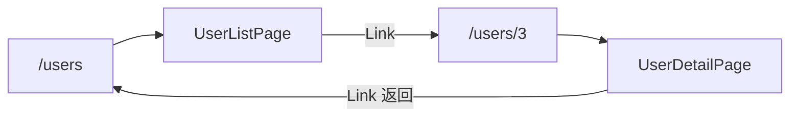

# React 学习系列（四）：React Router——从列表到 `/users/:id` 详情页

> 第三篇你在同一个页面里拉用户列表、点一下在下方显示详情——像一张长海报。真实网站多是「用户列表页」和「用户详情页」两个地址，能收藏链接、能点浏览器后退。这篇是系列第四篇：装上 **React Router**，把单页应用拆成**多路由**，用 **`Link`** 跳转、用 **`/users/:id`** 打开详情，并在详情页用 **`useParams` + `useEffect`** 拉 `GET /users/123`。偏概念与可运行示例，路由 loader、嵌套布局进阶等遇到项目再学。

---

## 目录

1. [前言：为什么需要路由](#1-前言为什么需要路由)
2. [单页应用与 URL：第三篇缺的那块](#2-单页应用与-url第三篇缺的那块)
3. [安装 React Router](#3-安装-react-router)
4. [最小路由：两个页面切换](#4-最小路由两个页面切换)
5. [Link 与 useNavigate：怎么跳转](#5-link-与-usenavigate怎么跳转)
6. [动态路由与 useParams：`/users/:id`](#6-动态路由与-useparamsusersid)
7. [列表页与详情页：各拉各的数据](#7-列表页与详情页各拉各的数据)
8. [两种带数据进详情的方式](#8-两种带数据进详情的方式)
9. [布局路由与 404（了解即可）](#9-布局路由与-404了解即可)
10. [综合实战：用户列表 + 详情](#10-综合实战用户列表--详情)
11. [与 REST API 的 URL 对齐](#11-与-rest-api-的-url-对齐)
12. [常见陷阱与 FAQ](#12-常见陷阱与-faq)
13. [总结与系列下一步](#13-总结与系列下一步)

---

## 1. 前言：为什么需要路由

第三篇典型局限：

- 地址栏始终是 `http://localhost:5173/`，刷新后**无法直接打开某个用户的详情**。
- 「选中用户」存在 `selectedId` 里，**不能发链接**给同事说「看这个用户」。
- 所有界面挤在 `App.jsx`，页面变多后难维护。

**路由**（Routing）：根据浏览器 **URL 路径** 决定显示哪个组件。  
通俗说：不同网址看不同「子页面」——其实还是同一个 React 应用，只是换了一块主内容。

**React Router**：React 生态里最常用的路由库（`react-router-dom` 包）。  
通俗说：给 Vite 单页应用装上「多房间导航」——房间 = 路由对应的页面组件。

读完本文，你应该能做到：

1. 在 Vite 项目中安装并配置 `BrowserRouter`、`Routes`、`Route`。
2. 用 `Link` 从列表跳到 `/users/1`，用 `useParams` 读出 `id`。
3. 列表页 `GET /users`、详情页 `GET /users/:id` 各写一套三态（loading/error/data）。
4. 说清「详情页再请求一次」和「列表把数据带过去」的差别与选用。
5. 与 [REST API 教程](../5.rest-api-design-tutorial.md) 的资源 URL 设计对齐。

**前置阅读**：

| 篇章 | 必看内容 |
|------|----------|
| [（二）Vite + JSX](02.vite-jsx-first-component.md) | 组件拆分、`import`、JSX |
| [（三）useEffect 与请求](03.use-effect-data-fetching.md) | `useEffect` 拉接口、三态 UI、`fetchJSON` |
| [REST API 设计](../5.rest-api-design-tutorial.md) | `GET /users`、`GET /users/123` |

**环境**：在第三篇的 Vite 项目上演练，或新建 `npm create vite@latest my-react-app -- --template react`。需联网（JSONPlaceholder）。

### 1.1 本文边界

不深究：

- React Router 6.4+ 的 Data Router（`createBrowserRouter`、`loader`）
- 嵌套路由权限、路由懒加载 `React.lazy`
- Next.js 文件系统路由

目标：**两个 URL（列表 + 详情）能跑通**，且详情能根据 `id` 请求接口。

### 1.2 动手路径

| 步骤 | 做什么 | 章节 |
|------|--------|------|
| 1 | `npm install react-router-dom` | §3 |
| 2 | `main.jsx` 包 `BrowserRouter`，`App` 里写 `Routes` | §4 |
| 3 | 列表项改成 `Link to={/users/${id}}` | §5–§6 |
| 4 | 新建 `UserDetailPage`，`useParams` + `useEffect` | §7 |
| 5 | 跑通 §10 综合示例 | §10 |

---

## 2. 单页应用与 URL：第三篇缺的那块

**SPA**（Single Page Application，单页应用）：浏览器只加载一次 HTML，之后换页面**不整页刷新**，由 JS 换组件。Vite + React 默认就是 SPA。



对照上图：第三篇的 `selectedId` 是**组件内部状态**；路由把「看谁」写进 **URL**，刷新、分享链接都能恢复上下文。

| 第三篇做法 | 本篇做法 |
|------------|----------|
| `selectedId` state | URL 里的 `:id` |
| 同页下方展示详情 | 独立路由 `/users/:id` |
| 一个 `App.jsx` 包办 | `pages/UserListPage`、`pages/UserDetailPage` |

---

## 3. 安装 React Router

在 Vite 项目根目录执行：

```bash
npm install react-router-dom
```

演示什么：确认包装进项目。`package.json` 的 `dependencies` 里应出现 `react-router-dom`（版本 6.x 即可，不必背小版本）。

**react-router-dom**：面向浏览器的路由包（DOM 环境）；若在 React Native 里会用别的包名——Web 项目记这个即可。

---

## 4. 最小路由：两个页面切换

### 4.1 在入口挂上 BrowserRouter

**`BrowserRouter`**：使用浏览器 History API 的路由器，URL 形如 `/users/1`（没有 `#`）。  
通俗说：让地址栏路径和 React 路由表连在一起。

修改 `src/main.jsx`（在 `App` 外包一层）：

```jsx
import { StrictMode } from 'react'
import { createRoot } from 'react-dom/client'
import { BrowserRouter } from 'react-router-dom'
import App from './App.jsx'
import './index.css'

createRoot(document.getElementById('root')).render(
  <StrictMode>
    <BrowserRouter>
      <App />
    </BrowserRouter>
  </StrictMode>,
)
```

### 4.2 Routes 与 Route：路径对应组件

**`Routes`**：路由匹配容器，从上往下找第一个匹配的 **`Route`**。  
**`Route`**：`path` 配 URL 模式，`element` 配要渲染的组件。

演示什么：根路径显示首页，`/about` 显示关于页。保存后访问 `http://localhost:5173/about` 应看到不同文字。

`src/App.jsx`：

```jsx
import { Routes, Route } from 'react-router-dom'

function HomePage() {
  return <h1>首页</h1>
}

function AboutPage() {
  return <h1>关于</h1>
}

export default function App() {
  return (
    <Routes>
      <Route path="/" element={<HomePage />} />
      <Route path="/about" element={<AboutPage />} />
    </Routes>
  )
}
```

预期：访问 `/` 见「首页」，访问 `/about` 见「关于」，**无整页白屏刷新**（SPA 内切换）。

### 4.3 先错后对：Router 包错层级

```jsx
// ❌ BrowserRouter 写在 App 里面且没包到 Routes 外层时，容易和结构混乱
// ✅ 惯例：main.jsx 包 BrowserRouter，App.jsx 里只有 Routes
```

---

## 5. Link 与 useNavigate：怎么跳转

### 5.1 Link：声明式导航

**`Link`**：渲染成 `<a>`，点击时**不刷新整页**，只改路由。  
通俗说：站内超链接——别用普通 `<a href="/users">` 做站内跳（会整页重载），用 `Link`。

```jsx
import { Link } from 'react-router-dom'

<Link to="/users">用户列表</Link>
<Link to="/about">关于</Link>
```

`to` 可以是字符串或对象；初学字符串足够。

### 5.2 useNavigate：代码里跳转

**`useNavigate`**：返回一个函数，在事件回调里**主动跳转**（例如表单提交成功后）。  
通俗说：不写链接，由逻辑「下令换页」。

```jsx
import { useNavigate } from 'react-router-dom'

function GoButton() {
  const navigate = useNavigate()
  return (
    <button type="button" onClick={() => navigate('/users')}>
      去用户列表
    </button>
  )
}
```

| 场景 | 推荐 |
|------|------|
| 列表项、导航栏 | `Link` |
| 提交成功、定时跳转、权限不够踢走 | `useNavigate` |

### 5.3 相对路径（了解即可）

`Link to=".." ` 或 `to="123"` 在嵌套路由里表示相对路径——本篇扁平路由先用**绝对路径** `/users`、`/users/1` 即可。

---

## 6. 动态路由与 useParams：`/users/:id`

REST 教程里单个用户是 **`GET /users/123`**——前端路由常设计成 **`/users/123`**，其中 `123` 是变化的。

### 6.1 路由参数 `:id`

```jsx
<Route path="/users/:id" element={<UserDetailPage />} />
```

`:id` 叫**动态段**（路由参数）：匹配 `/users/1`、`/users/42`，不匹配 `/users`（那是列表）。

### 6.2 useParams 读出 id

**`useParams`**：Hook，返回当前 URL 里匹配到的参数对象。  
通俗说：从地址栏「抠」出 `:id` 的值。

```jsx
import { useParams } from 'react-router-dom'

export default function UserDetailPage() {
  const { id } = useParams()
  return <p>当前用户 id：{id}</p>
}
```

访问 `/users/7`，页面显示 `7`。注意：`id` 是**字符串** `"7"`，若要和数字比大小，可 `Number(id)` 或 `parseInt(id, 10)`。

### 6.3 列表里链到详情

```jsx
import { Link } from 'react-router-dom'

{users.map((user) => (
  <li key={user.id}>
    <Link to={`/users/${user.id}`}>{user.name}</Link>
  </li>
))}
```

模板字符串拼 URL——与第一篇 §5 相同。`user.id` 与 JSONPlaceholder 的 `id` 一致即可。

---

## 7. 列表页与详情页：各拉各的数据

第三篇在一个组件里 `fetch` 整表；有路由后常见拆法：

| 路由 | 组件 | 请求 |
|------|------|------|
| `/users` | `UserListPage` | `GET .../users` |
| `/users/:id` | `UserDetailPage` | `GET .../users/:id` |

### 7.1 列表页（复习第三篇）

`src/pages/UserListPage.jsx` 核心与第三篇 §10 相同：`useEffect` + 三态 + `map` + `Link`：

```jsx
import { useState, useEffect } from 'react'
import { Link } from 'react-router-dom'

const API = 'https://jsonplaceholder.typicode.com/users'

async function fetchJSON(url) {
  const res = await fetch(url)
  if (!res.ok) throw new Error(`HTTP ${res.status}`)
  return res.json()
}

export default function UserListPage() {
  const [users, setUsers] = useState([])
  const [loading, setLoading] = useState(true)
  const [error, setError] = useState(null)

  useEffect(() => {
    async function load() {
      setLoading(true)
      setError(null)
      try {
        const data = await fetchJSON(API)
        setUsers(data ?? [])
      } catch (e) {
        setError(e.message ?? '加载失败')
      } finally {
        setLoading(false)
      }
    }
    load()
  }, [])

  if (loading) return <p>加载中…</p>
  if (error) return <p role="alert">{error}</p>

  return (
    <main>
      <h1>用户列表</h1>
      <ul>
        {users.map((u) => (
          <li key={u.id}>
            <Link to={`/users/${u.id}`}>{u.name}</Link>
          </li>
        ))}
      </ul>
    </main>
  )
}
```

### 7.2 详情页：依赖 id 的 useEffect

**关键**：`id` 变时要重新请求——依赖数组写 **`[id]`**（第三篇一直用 `[]`，这里第一次学「按参数重拉」）。

```jsx
import { useState, useEffect } from 'react'
import { Link, useParams } from 'react-router-dom'

const API = 'https://jsonplaceholder.typicode.com/users'

async function fetchJSON(url) {
  const res = await fetch(url)
  if (!res.ok) throw new Error(`HTTP ${res.status}`)
  return res.json()
}

export default function UserDetailPage() {
  const { id } = useParams()
  const [user, setUser] = useState(null)
  const [loading, setLoading] = useState(true)
  const [error, setError] = useState(null)

  useEffect(() => {
    async function load() {
      setLoading(true)
      setError(null)
      try {
        const data = await fetchJSON(`${API}/${id}`)
        setUser(data)
      } catch (e) {
        setError(e.message ?? '加载失败')
        setUser(null)
      } finally {
        setLoading(false)
      }
    }
    load()
  }, [id])

  if (loading) return <p>加载中…</p>
  if (error) return <p role="alert">{error}</p>
  if (!user) return <p>用户不存在</p>

  return (
    <main>
      <p><Link to="/users">← 返回列表</Link></p>
      <h1>{user.name}</h1>
      <p>{user.email}</p>
      <p>{user.phone}</p>
    </main>
  )
}
```

从 `/users/1` 点到 `/users/2` 时，`id` 变化 → effect 再跑 → 拉新用户。这是路由系列比第三篇**多出来**的核心知识点。

### 7.3 App.jsx 路由表

```jsx
import { Routes, Route } from 'react-router-dom'
import UserListPage from './pages/UserListPage.jsx'
import UserDetailPage from './pages/UserDetailPage.jsx'

export default function App() {
  return (
    <Routes>
      <Route path="/" element={<UserListPage />} />
      <Route path="/users" element={<UserListPage />} />
      <Route path="/users/:id" element={<UserDetailPage />} />
    </Routes>
  )
}
```

`/` 与 `/users` 都进列表是常见做法；也可只保留 `/users`，首页另做欢迎页。

---

## 8. 两种带数据进详情的方式

### 8.1 方式 A：详情页再请求（推荐初学默认）

- 列表只负责 `GET /users`
- 详情 `GET /users/:id`
- 优点：刷新详情页、直接打开链接都有完整数据
- 缺点：从列表点进详情会多一次请求（通常可接受）

上文 §7.2 即方式 A，与 REST 资源模型最一致。

### 8.2 方式 B：Link 携带 state（可选优化）

列表已有整行对象时，可临时把数据塞进路由 state，详情**先显示**再决定是否补请求：

```jsx
<Link to={`/users/${user.id}`} state={{ user }}>
  {user.name}
</Link>
```

详情页：

```jsx
import { useLocation, useParams } from 'react-router-dom'

const { id } = useParams()
const location = useLocation()
const cached = location.state?.user

// 若 cached 且 String(cached.id) === id，可先展示 cached，同时可选再 fetch 刷新
```

**`location.state`**：跳转时附带的内存对象，**刷新页面会丢失**——所以不能单靠它做唯一数据源。  
通俗说：像快递备注，重新进站（刷新）备注可能没了，重要信息仍要以 `GET /users/:id` 为准。

| | 方式 A 再请求 | 方式 B state |
|---|----------------|--------------|
| 刷新详情页 | ✅ 仍有数据 | ❌ state 没了要再请求 |
| 实现难度 | 低 | 中 |
| 与 REST 对齐 | ✅ | 需补请求兜底 |

**决策**：初学**默认方式 A**；方式 B 作了解，优化体验时用。

---

## 9. 布局路由与 404（了解即可）

### 9.1 公共布局

多个页面有相同顶栏时，可用**嵌套路由**（本篇只给概念）：

```jsx
<Route element={<Layout />}>
  <Route path="/users" element={<UserListPage />} />
  <Route path="/users/:id" element={<UserDetailPage />} />
</Route>
```

`Layout` 里用 `<Outlet />`（React Router 提供）渲染子路由——顶栏写一次。拆文件时再把 `Layout.jsx` 抽出来即可。

### 9.2 404 未匹配

```jsx
<Route path="*" element={<NotFoundPage />} />
```

`path="*"` 放在**最后**，匹配所有未定义路径。`NotFoundPage` 里 `Link to="/users"` 引导回家。

---

## 10. 综合实战：用户列表 + 详情

**阅读顺序**：§3–§9，第三篇全文。

建议目录：

```text
src/
├── main.jsx              # BrowserRouter
├── App.jsx               # Routes
├── pages/
│   ├── UserListPage.jsx
│   └── UserDetailPage.jsx
└── utils/
    └── fetchJSON.js      # 从第三篇抽出
```

`utils/fetchJSON.js`：

```javascript
export async function fetchJSON(url) {
  const res = await fetch(url)
  if (!res.ok) throw new Error(`请求失败: ${res.status}`)
  return res.json()
}
```

列表页从第三篇 §10 改两处即可：**去掉** `selectedId` 区块，**把** `<button onClick>` **换成** `<Link to={...}>`。

### 10.1 自测流程

| 操作 | 预期 |
|------|------|
| 打开 `/users` | 列表约 10 人，有 loading |
| 点击某人 | 地址变 `/users/3`，显示详情 |
| 浏览器后退 | 回列表，无整页闪白 |
| 直接访问 `/users/5` | 仍能加载第 5 号用户 |
| 访问 `/users/99999` | 假接口可能仍返回对象；真实 API 常 404 → 进 error |

### 10.2 与第三篇的代码迁移对照

| 第三篇 | 第四篇 |
|--------|--------|
| `App.jsx` 大包大揽 | 拆 `pages/*` |
| `selectedId` + 下方详情 | 删掉，改路由详情页 |
| `useEffect(..., [])` | 列表 `[]`，详情 `[id]` |
| `onSelect={setSelectedId}` | `Link to={/users/id}` |

---

## 11. 与 REST API 的 URL 对齐

[REST 教程](../5.rest-api-design-tutorial.md) 强调：**URL 表资源，动词表操作**。

| REST 设计 | React Router `path` | 前端 fetch |
|-----------|---------------------|------------|
| `GET /api/users` | `/users` | `fetchJSON('/api/users')` |
| `GET /api/users/123` | `/users/123` | `fetchJSON(\`/api/users/${id}\`)` |

前端路由路径**不必**和后端字符完全一致，但团队常对齐成一样，减少心智负担。接自己的 API 时：

- 开发环境：`fetchJSON('/api/users/1')` + Vite 代理到 `localhost:8000`（见第三篇 §11）
- 生产环境：同域或配置好的 API 基址

**注意**：React 的 `Route path="/users/:id"` 只管**浏览器内**显示谁；真正数据仍靠 **`fetch` 的 URL** 指向后端。

---

## 12. 常见陷阱与 FAQ

### 12.1 陷阱一：详情 effect 仍用 `[]`

`id` 变了不重新请求，页面还显示上一个用户——依赖必须 **`[id]`**。

### 12.2 陷阱二：站内用 `<a href>`

```jsx
// ❌ 整页刷新，SPA 状态丢失
<a href={`/users/${user.id}`}>

// ✅
<Link to={`/users/${user.id}`}>
```

### 12.3 陷阱三：Route 顺序把 `*` 放最前

`path="*"` 会吃掉所有路径——**永远放在 Routes 最后**。

### 12.4 陷阱四：忘记包 BrowserRouter

`useParams` / `Link` 报错 "outside Router" → 检查 `main.jsx` 是否包了 `BrowserRouter`。

### 12.5 陷阱五：id 类型

`useParams()` 的 `id` 是字符串。和数字 `user.id` 比较时留意：`String(user.id) === id` 或统一转数字。

### 12.6 FAQ

**Q：部署到服务器后刷新 `/users/1` 404？**  
A：SPA 需要服务器把未知路径回退到 `index.html`（Nginx `try_files` 等）——**构建部署**时处理，本地 `vite dev` 无此问题。

**Q：要用 Hash 路由吗？**  
A：`BrowserRouter` 用干净 URL；老环境或不便配服务器时用 `HashRouter`（`#/users/1`）。新项目优先 BrowserRouter。

**Q：列表和详情要共享 users 缓存吗？**  
A：进阶可用 Context、React Query。初学各 fetch 各的即可。

**Q：下一篇写什么？**  
A：系列（五）：[受控表单与 `POST /users`](05.forms-post-create-user.md)，创建用户后跳转到详情或刷新列表。

### 12.7 动手自检清单

- [ ] 已安装 `react-router-dom` 并在 `main.jsx` 使用 `BrowserRouter`
- [ ] 能配置 `/users` 与 `/users/:id` 两条 Route
- [ ] 列表用 `Link`，详情用 `useParams` 取 `id`
- [ ] 详情 `useEffect` 依赖 `[id]`
- [ ] 能解释为何详情页建议再 `GET` 一次
- [ ] 知道 `Link` 与 `<a href>` 的区别

---

## 13. 总结与系列下一步

### 13.1 概念速记表

| 概念 | 一句话 |
|------|--------|
| SPA | 单 HTML，换组件不整页刷新 |
| BrowserRouter | 绑定地址栏与路由表 |
| Route | path → 显示哪个组件 |
| Link | 站内跳转，不刷新 |
| useNavigate | 代码里跳转 |
| `:id` | URL 动态参数 |
| useParams | 读出 `:id` 的值 |
| `[id]` 依赖 | id 变则重新 fetch |

### 13.2 决策树

```
要多「页面」？
└─ 上 React Router

列表点进详情？
└─ Link to={`/users/${id}`}

详情数据哪来？
└─ 默认 GET /users/:id + useEffect([id])

只是不想重复请求？
└─ 可 Link state，但刷新仍要 GET 兜底

未匹配路径？
└─ Route path="*" 404 页
```

### 13.3 系列下一步

**React 学习系列（五）**：受控表单与 `POST /users` 创建用户——见 [05.forms-post-create-user.md](05.forms-post-create-user.md)。

**React 学习系列（六）**：全栈对接 Vite + FastAPI——见 [06.fullstack-vite-fastapi.md](06.fullstack-vite-fastapi.md)。

### 13.4 四篇串联

| 篇 | 能力 |
|----|------|
| 一 | fetch、async/await、map |
| 二 | 组件、useState、事件 |
| 三 | useEffect、三态、父子数据流 |
| 四 | 多 URL、列表/详情、REST 单资源 GET |

---

> **系列定位**：到本篇为止，你的前端已经具备「**多页导航 + 读接口**」的最小产品形态。下一篇 [（五）POST 创建](05.forms-post-create-user.md) 补上写接口，[（六）全栈联调](06.fullstack-vite-fastapi.md) 接真后端——与 REST 教程动词表闭环。
