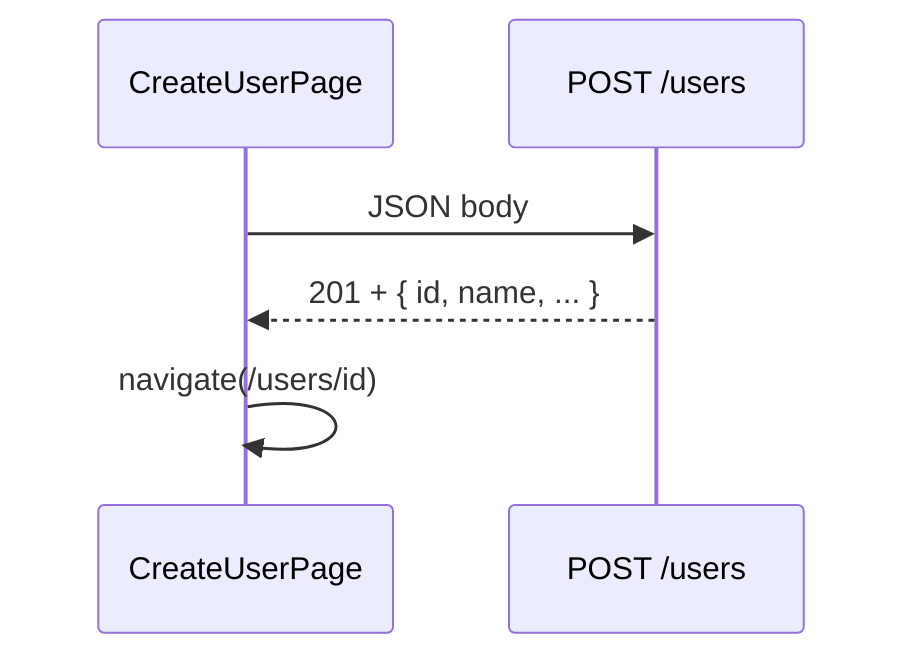
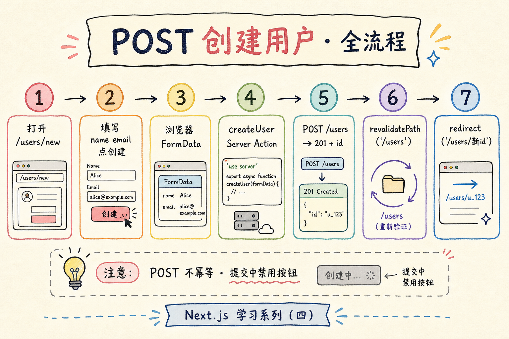
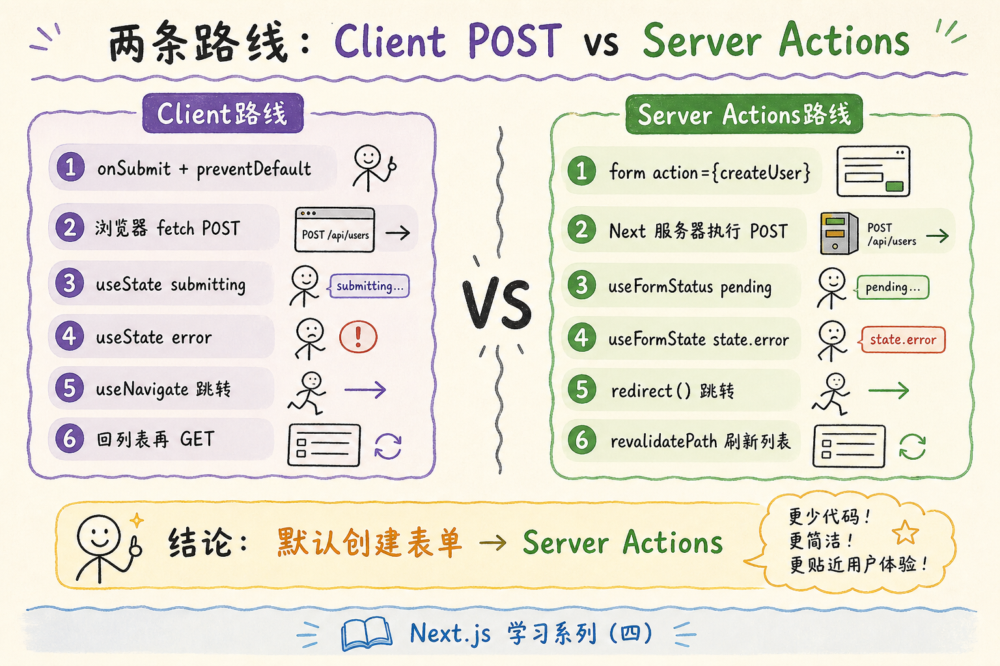
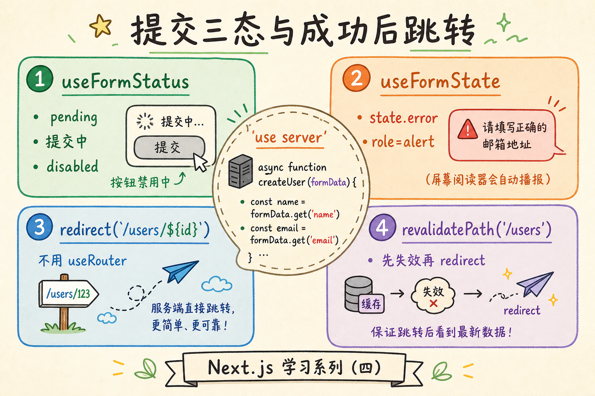

# React 学习系列（五）：受控表单与 POST——创建用户并跳转

> 前四篇你会 **GET** 列表、点进详情——都是「读」。真实产品还要「新建用户」「提交订单」：填表单、点提交、向后端 **POST** 一条 JSON。第二篇学过受控 `input` 和 `onChange`；第一篇学过 `fetch` 和 `async/await`；[REST 教程](../5.rest-api-design-tutorial.md) 里 **`POST /users` 创建资源**——这篇把它们串起来：写 **创建页表单**、发 **POST 请求**、处理 **提交中 / 成功 / 失败**，成功后 **`navigate` 到详情** 或回列表。偏概念与可运行示例，复杂校验库、React Hook Form 等遇到项目再学。

---

## 目录

1. [前言：从「只读」到「写入」](#1-前言从只读到写入)
2. [REST 里的 POST：创建资源](#2-rest-里的-post创建资源)
3. [受控表单复习：state 握输入值](#3-受控表单复习state-握输入值)
4. [表单提交：onSubmit 与 preventDefault](#4-表单提交onsubmit-与-preventdefault)
5. [fetch 发 POST：method、headers、body](#5-fetch-发-postmethodheadersbody)
6. [提交三态：idle、submitting、error](#6-提交三态idlesubmittingerror)
7. [成功后怎么办：跳转详情 vs 刷新列表](#7-成功后怎么办跳转详情-vs-刷新列表)
8. [新建路由：`/users/new`](#8-新建路由usersnew)
9. [综合实战：创建用户页](#9-综合实战创建用户页)
10. [对接真实 API（概念）](#10-对接真实-api概念)
11. [常见陷阱与 FAQ](#11-常见陷阱与-faq)
12. [总结与系列下一步](#12-总结与系列下一步)

---

## 1. 前言：从「只读」到「写入」

第四篇典型缺口：

- 只会 `GET`，不能「新建一条用户」。
- 表单字段多了不知道怎样组织 state。
- 点提交后按钮还能连点，或不知道成功以后该跳哪。

**HTTP POST**：HTTP 动词之一，向服务器**提交数据**，常用于**创建**资源。  
通俗说：往仓库**新进一箱货**——不是查库存（GET），是往里放东西。

**受控组件**（Controlled Component）：表单控件的值由 React **state** 控制，用户输入通过 `onChange` 回写 state。  
通俗说：输入框显示什么，以 state 为准——第二篇 §10.3 的 `value` + `onChange` 模式。

读完本文，你应该能做到：

1. 用多个 `useState`（或一个对象 state）管理创建表单字段。
2. 在 `onSubmit` 里 `preventDefault`，用 `fetch` 发送 `POST` + JSON body。
3. 处理提交中禁用按钮、失败显示错误、成功 `navigate` 到 `/users/:id`。
4. 说清与 REST 教程 `POST /users`、响应 `201` 的对应关系。
5. 在第四篇路由结构上增加 `/users/new` 创建页。

**前置阅读**：

| 篇章 | 必看内容 |
|------|----------|
| [（二）Vite + JSX](02.vite-jsx-first-component.md) | 受控 `input`、`onChange` |
| [（三）useEffect 与请求](03.use-effect-data-fetching.md) | `fetchJSON`、`try/catch`、三态 |
| [（四）React Router](04.react-router-list-detail.md) | `Link`、`useNavigate`、路由 |
| [REST API 设计](../5.rest-api-design-tutorial.md) | §4.3 `POST /users`、201 Created |

**环境**：延续第四篇 Vite 项目。示例用 JSONPlaceholder 的 `POST https://jsonplaceholder.typicode.com/users`（假创建，会返回带 `id` 的对象，需联网）。

### 1.1 本文边界

不深究：

- `react-hook-form`、`formik` 等表单库
- 字段级异步校验、文件上传 `multipart/form-data`
- `PUT` / `PATCH` / `DELETE`（可作系列续篇）
- CSRF Token、OAuth 登录表单

目标：**一个创建用户页能 POST 成功并跳转**，表单 2～3 个字段即可。

### 1.2 动手路径

| 步骤 | 做什么 | 章节 |
|------|--------|------|
| 1 | 复习受控 input | §3 |
| 2 | 写 `onSubmit` + `preventDefault` | §4 |
| 3 | 拼 POST `fetch` | §5 |
| 4 | 加 submitting / error | §6 |
| 5 | 成功 `navigate` | §7–§9 |

---

## 2. REST 里的 POST：创建资源

[REST 教程](../5.rest-api-design-tutorial.md) 的核心对照：

| 操作 | HTTP | URL 示例 | 前端典型场景 |
|------|------|----------|--------------|
| 列表 | GET | `/api/users` | 第四篇列表页 |
| 单个 | GET | `/api/users/123` | 第四篇详情页 |
| **创建** | **POST** | **`/api/users`** | **本篇创建页** |

创建时：

- **请求体**：JSON，如 `{ "name": "小明", "email": "a@b.com" }`
- **请求头**：`Content-Type: application/json`
- **成功响应**：常为 **`201 Created`**，body 含新资源（含 `id`）



对照上图：POST 完成后你拿到 **`id`**，就能用第四篇的详情路由跳过去。

**幂等**（Idempotent）：同一请求执行多次，效果是否「像只执行一次」。  
POST 创建**通常不幂等**——连点两次可能创建两条（除非后端做唯一约束）。所以前端要 **提交中禁用按钮**。



---

## 3. 受控表单复习：state 握输入值

第二篇写法：一个字段一对 `useState`，初学最清晰。

演示什么：姓名、邮箱两个字段。预期：输入框内容跟 state 同步。

```jsx
const [name, setName] = useState('')
const [email, setEmail] = useState('')

return (
  <form>
    <label>
      姓名
      <input
        value={name}
        onChange={(e) => setName(e.target.value)}
        placeholder="张三"
      />
    </label>
    <label>
      邮箱
      <input
        type="email"
        value={email}
        onChange={(e) => setEmail(e.target.value)}
        placeholder="you@example.com"
      />
    </label>
  </form>
)
```

### 3.1 多字段：一个对象 state（可选）

字段很多时，可合并（第一篇 §7 展开运算符更新字段）：

```jsx
const [form, setForm] = useState({ name: '', email: '' })

const onChange = (field) => (e) => {
  setForm((prev) => ({ ...prev, [field]: e.target.value }))
}

<input value={form.name} onChange={onChange('name')} />
```

本篇综合实战用**两个独立 `useState`**，逻辑更直观；熟悉后再 refactor 成对象。

### 3.2 提交前校验（最简）

```jsx
const trimmed = name.trim()
if (!trimmed) {
  setError('请填写姓名')
  return
}
```

复杂校验交给库；本篇 **非空 + trim** 够用。

---

## 4. 表单提交：onSubmit 与 preventDefault

用 **`<form onSubmit={...}>`** 统一处理提交（支持回车提交），不要只靠按钮 `onClick`（除非有特殊理由）。

**`event.preventDefault()`**：阻止表单默认行为——浏览器否则会**整页刷新**并丢 SPA 状态。  
通俗说：拦住「传统 HTML 提交」，改由 React 用 `fetch` 发请求。

```jsx
function handleSubmit(e) {
  e.preventDefault()
  // 在这里 POST
}

return (
  <form onSubmit={handleSubmit}>
    {/* 字段 */}
    <button type="submit">创建</button>
  </form>
)
```

| 按钮 type | 行为 |
|-----------|------|
| `submit` | 触发表单 `onSubmit`（默认） |
| `button` | 不提交表单，只当普通按钮 |

创建按钮用 **`type="submit"`**；若页面上还有「取消」链接，用 `Link` 或 `type="button"` 避免误提交。

---

## 5. fetch 发 POST：method、headers、body



第一篇 §10.3.1 在控制台发过 POST；在组件里放进 `handleSubmit` 的 **async 函数**即可（不必放 `useEffect`，因为是**用户点击**触发）。

演示什么：在组件内提交表单（`name`、`email` 来自 §3 的 `useState`）。预期：返回 JSON 含 `id`（假数据会模拟成功）。

```jsx
import { useState } from 'react'

export default function CreateUserDemo() {
  const [name, setName] = useState('')
  const [email, setEmail] = useState('')

  async function handleSubmit(e) {
    e.preventDefault()

    const res = await fetch('https://jsonplaceholder.typicode.com/users', {
      method: 'POST',
      headers: {
        'Content-Type': 'application/json',
      },
      body: JSON.stringify({
        name: name.trim(),
        email: email.trim(),
      }),
    })

    if (!res.ok) {
      throw new Error(`HTTP ${res.status}`)
    }

    const created = await res.json()
    console.log('新用户 id', created.id)
  }

  return (
    <form onSubmit={handleSubmit}>
      <input value={name} onChange={(e) => setName(e.target.value)} />
      <input value={email} onChange={(e) => setEmail(e.target.value)} />
      <button type="submit">创建</button>
    </form>
  )
}
```

要点：

| 部分 | 作用 |
|------|------|
| `method: 'POST'` | 动词是创建，不是 GET |
| `Content-Type: application/json` | 告诉服务器 body 是 JSON |
| `JSON.stringify(...)` | 对象转成字符串才能放进 body |
| `await res.json()` | 读响应体，拿 `id` |

封装进 `utils/fetchJSON.js`（扩展第三篇版本）。注意：**先** `...options`，**再**写 `headers`——否则 `options` 里的 `headers` 会整段覆盖默认的 `Content-Type`：

```javascript
export async function fetchJSON(url, options = {}) {
  const res = await fetch(url, {
    ...options,
    headers: {
      'Content-Type': 'application/json',
      ...options.headers,
    },
  })
  if (!res.ok) {
    throw new Error(`请求失败: ${res.status} ${res.statusText}`)
  }
  return res.json()
}
```

调用：

```javascript
const created = await fetchJSON(API, {
  method: 'POST',
  body: JSON.stringify({ name, email }),
})
```

---

## 6. 提交三态：idle、submitting、error

读请求有 loading/error/data（第三篇）；写请求常用 **submitting / error**：

```jsx
const [submitting, setSubmitting] = useState(false)
const [error, setError] = useState(null)

async function handleSubmit(e) {
  e.preventDefault()
  setError(null)

  if (!name.trim()) {
    setError('请填写姓名')
    return
  }

  setSubmitting(true)
  try {
    const created = await fetchJSON(API, {
      method: 'POST',
      body: JSON.stringify({
        name: name.trim(),
        email: email.trim(),
      }),
    })
    // 成功：§7 跳转
    navigate(`/users/${created.id}`)
  } catch (err) {
    setError(err.message ?? '创建失败')
  } finally {
    setSubmitting(false)
  }
}

return (
  <form onSubmit={handleSubmit}>
    {error && <p role="alert">{error}</p>}
    {/* 字段 */}
    <button type="submit" disabled={submitting}>
      {submitting ? '提交中…' : '创建'}
    </button>
  </form>
)
```

`disabled={submitting}` 防止连点两次 POST——对应 REST 里 POST 非幂等。



---

## 7. 成功后怎么办：跳转详情 vs 刷新列表

| 策略 | 做法 | 适用 |
|------|------|------|
| **跳转详情** | `navigate(\`/users/${created.id}\`)` | 创建后立刻查看、编辑单条 |
| **回列表** | `navigate('/users')` | 列表页会 `useEffect` 重拉；若未重拉需另想办法 |
| **留创建页** | 清空表单 `setName('')` | 连续录入多条 |

本篇默认 **跳转详情**——复用第四篇 `UserDetailPage`，且 URL 可收藏。

```jsx
import { useNavigate } from 'react-router-dom'

const navigate = useNavigate()
// 成功后
navigate(`/users/${created.id}`)
```

JSONPlaceholder 的详情 `GET` 对任意 `id` 会返回模板用户，**与 POST 返回的 id 可能对不上真实字段**——练手够用。接真 API 后，POST 返回的 `id` 与 `GET /users/:id` 一致。

### 7.1 用 state 提示列表页「刚创建」（了解即可）

```jsx
navigate('/users', { state: { flash: '创建成功' } })
```

列表页 `useLocation().state?.flash` 显示 toast——刷新后 message 消失。初学用 **跳详情** 更简单。

---

## 8. 新建路由：`/users/new`

在第四篇 `App.jsx` 增加：

```jsx
import CreateUserPage from './pages/CreateUserPage.jsx'

<Route path="/users/new" element={<CreateUserPage />} />
```

**路由顺序**：更具体的 `/users/new` 应写在 `/users/:id` **之前**，否则 `new` 会被当成 `id`。

```jsx
<Route path="/users/new" element={<CreateUserPage />} />
<Route path="/users/:id" element={<UserDetailPage />} />
<Route path="/users" element={<UserListPage />} />
```

列表页加入口：

```jsx
<p>
  <Link to="/users/new">+ 新建用户</Link>
</p>
```

---

## 9. 综合实战：创建用户页

**阅读顺序**：§3–§8，第四篇路由，第三篇 `fetchJSON`。

`src/pages/CreateUserPage.jsx`：

```jsx
import { useState } from 'react'
import { Link, useNavigate } from 'react-router-dom'
import { fetchJSON } from '../utils/fetchJSON.js'

const API = 'https://jsonplaceholder.typicode.com/users'

export default function CreateUserPage() {
  const navigate = useNavigate()
  const [name, setName] = useState('')
  const [email, setEmail] = useState('')
  const [submitting, setSubmitting] = useState(false)
  const [error, setError] = useState(null)

  async function handleSubmit(e) {
    e.preventDefault()
    setError(null)

    const trimmedName = name.trim()
    if (!trimmedName) {
      setError('请填写姓名')
      return
    }

    setSubmitting(true)
    try {
      const created = await fetchJSON(API, {
        method: 'POST',
        body: JSON.stringify({
          name: trimmedName,
          email: email.trim(),
        }),
      })
      navigate(`/users/${created.id}`)
    } catch (err) {
      setError(err.message ?? '创建失败')
    } finally {
      setSubmitting(false)
    }
  }

  return (
    <main>
      <p><Link to="/users">← 返回列表</Link></p>
      <h1>新建用户</h1>
      <form onSubmit={handleSubmit}>
        {error && (
          <p className="error" role="alert">
            {error}
          </p>
        )}
        <label>
          姓名
          <input
            value={name}
            onChange={(e) => setName(e.target.value)}
            disabled={submitting}
            autoComplete="name"
          />
        </label>
        <label>
          邮箱
          <input
            type="email"
            value={email}
            onChange={(e) => setEmail(e.target.value)}
            disabled={submitting}
            autoComplete="email"
          />
        </label>
        <button type="submit" disabled={submitting}>
          {submitting ? '提交中…' : '创建'}
        </button>
      </form>
    </main>
  )
}
```

### 9.1 自测流程

| 操作 | 预期 |
|------|------|
| 打开 `/users/new` | 空表单 |
| 不填姓名点创建 | 显示「请填写姓名」，不 POST |
| 填姓名点创建 | 按钮变「提交中…」，随后跳 `/users/{id}` |
| 断网提交 | `role="alert"` 错误信息 |

### 9.2 五篇能力拼在一起

```text
/users          → GET 列表（三）
/users/new      → POST 创建（五）
/users/:id      → GET 详情（四）
```

这就是 REST 「用户」资源在前端的最小 **CRUD 读 + 创建** 闭环（更新/删除留给续篇）。

---

## 10. 对接真实 API（概念）

接 [REST 教程](../5.rest-api-design-tutorial.md) 自建后端时：

### 10.1 URL 与 body 字段

后端文档写：

```http
POST /api/users
Content-Type: application/json

{ "name": "...", "email": "..." }
```

前端把 `API` 换成 `'/api/users'`（配合 Vite 代理），`JSON.stringify` 字段名与文档**一致**。

### 10.2 201 与 Location

真 API 常返回 **201** 而非 200。`fetch` 的 `res.ok` 对 201 仍为 true（2xx）。有的 API 在头里给 `Location: /api/users/123`——读 `res.headers.get('Location')` 是进阶，初学用 body 里的 `id` 即可。

### 10.3 错误 body

后端校验失败可能 **400**，body 是 `{ "detail": "邮箱格式错误" }`——可在 `catch` 前解析 `res.json()` 取 `detail` 显示。本篇用 `Error` 消息简化。

---

## 11. 常见陷阱与 FAQ

### 11.1 陷阱一：忘记 `preventDefault`

表单提交后整页闪白刷新 → 检查 `e.preventDefault()`。

### 11.2 陷阱二：忘记 `JSON.stringify`

`body: { name }` 不对，必须是 **字符串** `body: JSON.stringify({ name })`。

### 11.3 陷阱三：POST 用 GET 的 fetch

创建必须 `method: 'POST'`；只写 `fetch(url)` 默认是 GET。

### 11.4 陷阱四：路由把 `new` 当成 id

`/users/:id` 写在 `/users/new` 前面会匹配错——**静态路径放动态路径前**。

### 11.5 陷阱五：提交中不禁用按钮

用户连点，发出多次 POST——用 `submitting` + `disabled`。

### 11.6 FAQ

**Q：能用 `<form action>` 吗？**  
A：SPA 里用 `onSubmit` + `fetch`；传统 `action` 会离开 React 流程。

**Q：textarea、select 呢？**  
A：同样是 `value` + `onChange`，`select` 的 `value` 是选中的 `option` 值。

**Q：创建后列表为何看不到新用户？**  
A：JSONPlaceholder 不真持久化；真 API 回列表需重新 `GET` 或本地 `setUsers([...users, created])` 乐观更新（进阶）。

**Q：下一篇？**  
A：可选 **全栈对接**（Vite 代理 + FastAPI）、**PUT/PATCH 编辑**、或 **React Query** 统一管读写。

### 11.7 动手自检清单

- [ ] 表单字段受控（`value` + `onChange`）
- [ ] `onSubmit` 里 `preventDefault`
- [ ] POST 带 `Content-Type` 与 `JSON.stringify`
- [ ] 有 submitting 禁用与错误展示
- [ ] 成功后 `navigate` 到详情或列表
- [ ] `/users/new` 路由在 `/users/:id` 之前

---

## 12. 总结与系列下一步

### 12.1 概念速记表

| 概念 | 一句话 |
|------|--------|
| POST | 创建资源，body 常为 JSON |
| 受控表单 | state 握 value，onChange 回写 |
| preventDefault | 阻止表单整页刷新 |
| JSON.stringify | 对象 → 请求体字符串 |
| submitting | 写请求的 loading |
| navigate | 创建成功后跳转 |

### 12.2 决策树

```
要创建资源？
└─ POST + JSON body

表单怎么写？
└─ 受控组件 + onSubmit

提交时要防连点？
└─ submitting + disabled

成功去哪？
└─ 默认 navigate(/users/:id)

静态路径 /users/new？
└─ 写在 /users/:id 前面
```

### 12.3 系列五步回顾

| 篇 | 能力 |
|----|------|
| 一 | 语法、fetch、async |
| 二 | 组件、useState、受控 input |
| 三 | useEffect、GET、三态 |
| 四 | 路由、列表/详情 |
| 五 | POST、创建表单、跳转 |

### 12.4 系列下一步

**React 学习系列（六）**：[全栈对接 Vite + FastAPI](06.fullstack-vite-fastapi.md)——把本篇 POST 接到真后端，列表里能看见新建用户。

### 12.5 可选延伸

- **编辑用户**：`PATCH /users/:id` + 详情页预填表单  
- **删除**：`DELETE` + 列表刷新确认框  

---

> **系列定位**：到本篇为止，你已走完「**读列表 → 看详情 → 新建一条**」的最小业务环。下一篇 [（六）全栈联调](06.fullstack-vite-fastapi.md) 把 JSONPlaceholder 换成自己的 FastAPI；RAG 线从 [（七）流式对话](07.sse-streaming-chat.md) 开始。
