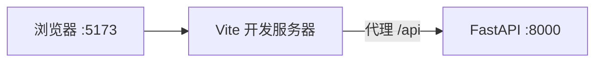

# React 学习系列（六）：全栈对接——Vite 前端 + FastAPI 后端

> 前五篇用 JSONPlaceholder 练手——数据是假的，刷新也未必一致。现在要接**自己的后端**：浏览器跑在 `localhost:5173`，API 跑在 `localhost:8000`，`fetch('/api/users')` 可能被 **CORS** 拦住。这篇是系列第六篇：写一个最小的 **FastAPI** 用户 API，用 **Vite 代理**（或后端 CORS）打通前后端，把第三～五篇的 **GET 列表、GET 详情、POST 创建** 全部改成打真接口。偏概念与能跑通的步骤，数据库持久化、Docker 编排可衔接本仓库其他教程。

---

## 目录

1. [前言：假接口够用了，该接真后端](#1-前言假接口够用了该接真后端)
2. [全栈开发时两个地址：谁是谁](#2-全栈开发时两个地址谁是谁)
3. [CORS 与代理：初学者先懂哪条](#3-cors-与代理初学者先懂哪条)
4. [后端：最小 FastAPI 用户 API](#4-后端最小-fastapi-用户-api)
5. [前端：Vite 代理配置](#5-前端vite-代理配置)
6. [改 fetch 地址：从假 API 到 `/api`](#6-改-fetch-地址从假-api-到-api)
7. [字段与响应形状对齐](#7-字段与响应形状对齐)
8. [本地同时跑起来：两个终端](#8-本地同时跑起来两个终端)
9. [综合实战：串起列表 / 详情 / 创建](#9-综合实战串起列表--详情--创建)
10. [排错清单](#10-排错清单)
11. [常见陷阱与 FAQ](#11-常见陷阱与-faq)
12. [总结与系列下一步](#12-总结与系列下一步)

---

## 1. 前言：假接口够用了，该接真后端

第五篇典型卡点：

- `POST` 成功但列表里永远看不到「刚建的用户」——假接口不持久化。
- 把 URL 改成 `http://localhost:8000/api/users` 后，控制台 **CORS error** 一片红。
- 不确定 `vite.config.js` 该改哪几行。

**全栈**（Full Stack）：同一套产品里既有**前端界面**（React），也有**后端 API**（如 FastAPI）提供数据。  
通俗说：一个团队里「看页面的」和「管数据的」在你学习机上都要跑起来。

**FastAPI**：基于 Python 的现代 Web 框架，适合写 REST API，自带 OpenAPI 文档。  
通俗说：用 Python 函数声明 URL，自动帮你生成接口文档和 JSON 响应。

读完本文，你应该能做到：

1. 说明为何开发时会出现 CORS，以及 Vite **代理**如何解决。
2. 启动一个提供 `GET/POST /api/users` 的最小 FastAPI 服务。
3. 配置 `vite.config.js`，让前端 `fetch('/api/users')` 转到后端。
4. 把第四、五篇页面里的 URL 从 JSONPlaceholder 换成 `/api`。
5. 创建用户后，在列表里能看到**真实新增**的数据（内存存储，重启会丢——够用练手）。

**前置阅读**：

| 篇章 | 必看内容 |
|------|----------|
| [（三）useEffect](03.use-effect-data-fetching.md) | `fetchJSON`、三态、§11 对接概念 |
| [（四）Router](04.react-router-list-detail.md) | 列表 / 详情路由 |
| [（五）POST 表单](05.forms-post-create-user.md) | 创建页、`POST` body |
| [REST API 设计](../5.rest-api-design-tutorial.md) | `GET/POST /users`、201 |
| Python 基础 | 能 `pip install`、运行 `uvicorn` |

**环境**：

| 组件 | 版本建议 |
|------|----------|
| Node.js | 18+（前端） |
| Python | 3.10+（后端） |
| 第四篇起的 Vite 项目 | 已含 Router |

### 1.1 本文边界

本篇**不展开**：

- PostgreSQL 持久化（见 [PostgreSQL 教程](../8.postgresql-tutorial.md)）
- Docker Compose 一键起前后端（见 [Docker 教程](../11.docker-compose-tutorial.md)）
- 生产部署、HTTPS、JWT 登录

目标：**本机两个终端，浏览器里完成「列表 → 新建 → 详情」且数据来自 FastAPI**。

### 1.2 项目目录建议

```text
my-fullstack/
├── backend/
│   ├── main.py          # FastAPI 应用
│   └── requirements.txt
└── frontend/            # 第四篇的 Vite 项目
    ├── vite.config.js
    └── src/
```

也可前后端分两个仓库；学习阶段放同一父目录最省事。

---

## 2. 全栈开发时两个地址：谁是谁



| 进程 | 默认地址 | 干什么 |
|------|----------|--------|
| `npm run dev` | `http://localhost:5173` | 提供 React 页面 |
| `uvicorn main:app` | `http://localhost:8000` | 提供 `/api/users` 等 |

浏览器里你访问的是 **5173**；`fetch('/api/users')` 的 host 也是 5173——再由 Vite **转发**到 8000。这样浏览器认为「同源」，避开 CORS 麻烦（开发环境常用做法）。

---

## 3. CORS 与代理：初学者先懂哪条

**CORS**（Cross-Origin Resource Sharing，跨域资源共享）：浏览器安全策略，**不同源**的页面用 `fetch` 访问 API 时，后端必须显式允许。  
通俗说：前端在 A 门牌号，API 在 B 门牌号——浏览器要先问 B「A 能来取数据吗？」

| 源 | 协议 + 域名 + 端口 |
|----|------------------|
| `http://localhost:5173` | 前端 |
| `http://localhost:8000` | 后端 |

端口不同 = **不同源** → 直接 `fetch('http://localhost:8000/api/users')` 可能被拦。

### 3.1 两条路（开发环境）

| 方案 | 做法 | 本篇 |
|------|------|------|
| **A. Vite 代理** | 只请求 `/api/...`，Vite 转发到 8000 | ✅ 主推 |
| **B. 后端 CORS** | FastAPI 加 `CORSMiddleware` 允许 5173 | 备选 / 与 A 二选一 |

初学 **优先 A**：前端代码里 URL 永远是 **`/api/users`**，不写死后端 host，和生产用 Nginx 反代的思路接近。

### 3.2 方案 B 长什么样（了解即可）

```python
from fastapi.middleware.cors import CORSMiddleware

app.add_middleware(
    CORSMiddleware,
    allow_origins=["http://localhost:5173"],
    allow_methods=["*"],
    allow_headers=["*"],
)
```

直连 `http://localhost:8000` 时需要；用代理且 `fetch` 只打 `/api` 时，**浏览器看到的仍是 5173**，往往不必配 CORS。两个项目合并部署时再系统学 CORS 即可。

---

## 4. 后端：最小 FastAPI 用户 API

演示什么：内存里存用户，提供 REST 教程对齐的三个接口。  
前置：已安装 Python 3.10+。

### 4.1 依赖

`backend/requirements.txt`：

```text
fastapi>=0.100.0
uvicorn[standard]>=0.22.0
email-validator>=2.0.0
```

`email-validator` 供 Pydantic 的 `EmailStr` 校验邮箱格式；若嫌麻烦可把 `UserCreate.email` 改成普通 `str`。

```bash
cd backend
pip install -r requirements.txt
```

### 4.2 main.py

演示什么：GET 列表、GET 单个、POST 创建。重启进程数据清空——仅练手。

```python
from fastapi import FastAPI, HTTPException
from pydantic import BaseModel, EmailStr

app = FastAPI(title="Users API")

# 内存「数据库」
_users: list[dict] = [
    {"id": 1, "name": "小明", "email": "ming@example.com"},
    {"id": 2, "name": "小红", "email": "hong@example.com"},
]
_next_id = 3


class UserCreate(BaseModel):
    name: str
    email: EmailStr


class UserOut(BaseModel):
    id: int
    name: str
    email: str


@app.get("/api/users", response_model=list[UserOut])
def list_users():
    return _users


@app.get("/api/users/{user_id}", response_model=UserOut)
def get_user(user_id: int):
    for u in _users:
        if u["id"] == user_id:
            return u
    raise HTTPException(status_code=404, detail="用户不存在")


@app.post("/api/users", response_model=UserOut, status_code=201)
def create_user(body: UserCreate):
    global _next_id
    user = {"id": _next_id, "name": body.name, "email": body.email}
    _next_id += 1
    _users.append(user)
    return user
```

**Pydantic**：FastAPI 用来校验请求/响应体的库；`UserCreate` 保证 POST 的 JSON 有 `name`、`email`。  
通俗说：门口保安对照清单，字段不对直接 422。

### 4.3 启动与自测

**uvicorn**（/ˈjuːvɪkɔːrn/）：ASGI 服务器，负责把 FastAPI 应用跑在指定端口上。  
通俗说：后端的「开机键」——下面这条命令让 API 在 8000 端口监听请求。

```bash
cd backend
uvicorn main:app --reload --port 8000
```

- `main:app`：`main.py` 里的 `app` 对象（FastAPI 实例）。
- `--reload`：改代码后自动重启（仅开发用）。

浏览器打开 `http://localhost:8000/docs` 可见 **Swagger** 交互文档——先在这里点 `GET /api/users` 试通，再改前端。

预期：`GET /api/users` 返回 2 条用户；`POST` 后 `GET` 能见到第 3 条。

---

## 5. 前端：Vite 代理配置

演示什么：把以 `/api` 开头的请求转到 `localhost:8000`。  
修改 `frontend/vite.config.js`：

```javascript
import { defineConfig } from 'vite'
import react from '@vitejs/plugin-react'

export default defineConfig({
  plugins: [react()],
  server: {
    proxy: {
      '/api': {
        target: 'http://localhost:8000',
        changeOrigin: true,
      },
    },
  },
})
```

| 配置 | 含义 |
|------|------|
| `target` | 真实后端地址 |
| `changeOrigin` | 转发时 Host 头与 target 一致，部分环境需要 |

**改 config 后需重启** `npm run dev` 才生效。

代理后数据流：

```text
fetch('/api/users')
  → 浏览器请求 http://localhost:5173/api/users
  → Vite 转发 http://localhost:8000/api/users
  → FastAPI 返回 JSON
```

---

## 6. 改 fetch 地址：从假 API 到 `/api`

第三～五篇里的：

```javascript
const API = 'https://jsonplaceholder.typicode.com/users'
```

统一改为：

```javascript
const API = '/api/users'
```

### 6.1 各页面怎么写

| 页面 | 第三～五篇 | 本篇 |
|------|------------|------|
| 列表 | `fetchJSON(API)` | `fetchJSON('/api/users')` |
| 详情 | `` fetchJSON(`${API}/${id}`) `` | `` fetchJSON(`/api/users/${id}`) `` |
| 创建 | `fetchJSON(API, { method: 'POST', ... })` | 同上，URL 为 `/api/users` |

`fetchJSON` 保持第三篇 / 第五篇封装不变——**只改路径**。

### 6.2 环境变量（了解即可）

生产环境 API 可能不在同域，常用：

```javascript
const API = import.meta.env.VITE_API_BASE ?? ''
// fetch(`${API}/api/users`)
```

`.env` 里 `VITE_API_BASE=https://api.example.com`。开发阶段用代理时 **留空**，继续 `fetch('/api/users')` 即可。

---

## 7. 字段与响应形状对齐

### 7.1 后端与前端字段表

本篇约定两端一致：

| 字段 | 类型 | 列表 | 详情 | 创建 POST |
|------|------|------|------|-----------|
| `id` | number | ✅ | ✅ | 响应含服务器生成 |
| `name` | string | ✅ | ✅ | 必填 |
| `email` | string | ✅ | ✅ | 必填 |

React 里继续 `user.name`、`user.email`、`key={user.id}`——与 JSONPlaceholder 字段相同，**改 URL 即可**， JSX 几乎不用动。

### 7.2 若后端包一层 `{ "users": [...] }`

REST 项目有时列表返回：

```json
{ "users": [...], "total": 2 }
```

前端列表页改为：

```javascript
const body = await fetchJSON('/api/users')
const list = body?.users ?? []
setUsers(list)
```

**先读后端文档或 `/docs` 里的响应示例**，再写 `setUsers`——不要猜字段。

### 7.3 POST 返回 201

FastAPI 示例已设 `status_code=201`。`fetch` 的 `res.ok` 对 201 为 true（2xx）。创建页 `navigate(\`/users/${created.id}\`)` 与第五篇相同，且 **`id` 与详情 GET 一致**——这是接真 API 的最大好处。

---

## 8. 本地同时跑起来：两个终端

| 终端 | 目录 | 命令 |
|------|------|------|
| 1 | `backend/` | `uvicorn main:app --reload --port 8000` |
| 2 | `frontend/` | `npm run dev` |

浏览器打开 `http://localhost:5173/users`：

1. 应看到 2 个初始用户（小明、小红）。  
2. 点「新建」→ 提交 → 跳详情 → 返回列表应 **3 人**。  
3. 重启 **仅后端** 后人数回 2——说明数据在内存，未接数据库（预期行为）。

---

## 9. 综合实战：串起列表 / 详情 / 创建

**阅读顺序**：本篇 §4–§7，第四、五篇全文。

### 9.1 App.jsx 路由（复习 + 确认顺序）

```jsx
<Route path="/users/new" element={<CreateUserPage />} />
<Route path="/users/:id" element={<UserDetailPage />} />
<Route path="/users" element={<UserListPage />} />
```

### 9.2 utils/fetchJSON.js（共用）

与第五篇相同：先 `...options`，再合并 `headers`，避免 POST 时丢失 `Content-Type`。失败时用 `res.text()` 读出 body（便于看 FastAPI 422 校验详情）；第三篇只用 `statusText`，本篇接真 API 时读 body 更好排查。

```javascript
export async function fetchJSON(url, options = {}) {
  const res = await fetch(url, {
    ...options,
    headers: {
      'Content-Type': 'application/json',
      ...options.headers,
    },
  })
  if (!res.ok) {
    const text = await res.text()
    throw new Error(text || `请求失败: ${res.status}`)
  }
  return res.json()
}
```

### 9.3 创建页核心（仅 URL 变化）

```javascript
const created = await fetchJSON('/api/users', {
  method: 'POST',
  body: JSON.stringify({
    name: trimmedName,
    email: email.trim(),
  }),
})
navigate(`/users/${created.id}`)
```

### 9.4 自测表

| 步骤 | 预期 |
|------|------|
| 只开前端、不开后端 | 列表 error，提示连接失败或 500 |
| 只开后端、访问 8000/docs | Swagger 正常 |
| 两端都开 | 列表 2 人 |
| 新建「张三」 | 列表 3 人，详情显示张三 |
| 访问 `/users/999` | 404，前端显示错误文案 |

---

## 10. 排错清单

联调失败时按「现象 → 原因 → 处理」对照，比反复改代码快。打开 F12 → **Network** 看 `/api/users` 状态码是 200 还是 `(failed)`；**Console** 看是否有 CORS 红字。

| 现象 | 可能原因 | 处理 |
|------|----------|------|
| `CORS policy` / `No 'Access-Control-Allow-Origin'` | 浏览器直连 `localhost:8000` 或未配代理 | 前端一律 `fetch('/api/...')` + `vite.config.js` 的 `server.proxy` |
| `404` on `/api/users` | 后端未启、路径不一致、或代理未生效 | 先访问 `http://localhost:8000/docs` 确认路由；对照 `main.py` 与前端 URL |
| `404` 但 `/docs` 里路径是 `/users` 无 `/api` | 前后端前缀不一致 | 统一为 `/api/users`，或 proxy 加 `rewrite`（进阶） |
| `ECONNREFUSED` / `Network Error` / `(failed) net::ERR_CONNECTION_REFUSED` | 后端没跑或端口错 | 终端 1 执行 `uvicorn main:app --reload --port 8000`；确认无其他程序占 8000 |
| 改了 `vite.config.js` proxy 仍 404 | 未重启 Vite dev server | Ctrl+C 后重新 `npm run dev` |
| `422 Unprocessable Entity` | POST 缺字段、类型错、`email` 格式不对 | Network → 点开失败请求 → **Response** 看 FastAPI 校验详情；对齐 `UserCreate` |
| `500 Internal Server Error` | 后端代码抛错 | 看运行 uvicorn 的终端 traceback；先用 `/docs` 单独测接口 |
| 列表永远 `[]` 或字段全是 `undefined` | 响应多包一层（如 `{ data: users }`） | §7.2 按真实 JSON 解包后再 `setUsers` |
| 详情页 `404` 但列表有此人 | `id` 类型或 URL 拼错 | 确认 `navigate(\`/users/${created.id}\`)` 的 `id` 与 GET 路径一致 |
| 新建成功但列表仍 2 人 | 创建后未刷新列表或未跳转 | 第五篇应用 `navigate` 到详情或列表页重新 `fetch` |
| 两个终端都开但前端仍失败 | 访问了错误端口 | 页面必须是 `http://localhost:5173`，不是 8000 |
| `405 Method Not Allowed` | 用了 GET 调 POST 或反之 | 对照 `/docs` 里该路径允许的动词 |

**推荐排错顺序**：① `/docs` 点通 → ② `curl` 或 Swagger 测 → ③ 前端 Network → ④ 对照上表。

---

## 11. 常见陷阱与 FAQ

### 11.1 陷阱一：前端写死后端完整 URL

```javascript
// ❌ 开发时易 CORS
fetch('http://localhost:8000/api/users')

// ✅ 配合代理
fetch('/api/users')
```

### 11.2 陷阱二：代理 path 与后端不一致

后端若写成 `@app.get("/users")` 而前端请求 `/api/users`，会 404——**两边都要 `/api/users`** 或代理做 `rewrite`（进阶）。

### 11.3 陷阱三：id 类型

URL 里 `id` 是字符串；后端路径参数 `user_id: int` 会自动转换。比较时用 `===` 时注意类型。

### 11.4 FAQ

**Q：为什么要 FastAPI，不用 Express？**  
A：本仓库 Python 线多；你后端用什么，前端 `fetch` 写法一样，只要 REST 对齐。

**Q：数据如何持久化？**  
A：把 `_users` 换成 PostgreSQL——见 [PostgreSQL 教程](../8.postgresql-tutorial.md)；或用 [Docker Compose](../11.docker-compose-tutorial.md) 起 PG + API。

**Q：生产怎么部署？**  
A：常见：`npm run build` 静态文件 + Nginx 反代 `/api` 到后端。本篇只覆盖开发联调。

**Q：系列还写吗？**  
A：可选 **PATCH 编辑**、**登录 JWT**、或 **React Query**；全栈闭环到本篇已可收工练项目。

### 11.5 动手自检清单

- [ ] 能解释 5173 与 8000 的角色
- [ ] 能启动 FastAPI 并用 `/docs` 测接口
- [ ] 已配置 `vite.config.js` 的 `server.proxy`
- [ ] 前端 API 路径为 `/api/users`
- [ ] 新建用户后列表数量增加
- [ ] 会用 Network 面板看请求状态码

---

## 12. 总结与系列下一步

### 12.1 概念速记表

| 概念 | 一句话 |
|------|--------|
| 同源 | 协议+域名+端口都相同 |
| CORS | 跨源时浏览器的许可机制 |
| Vite proxy | 开发时把 `/api` 转到后端 |
| FastAPI | Python 写 REST，自带 `/docs` |
| 字段对齐 | 前后端 JSON 形状一致 |
| 201 | 创建成功常见状态码 |

### 12.2 决策树

```
开发联调前后端？
└─ 前端 fetch('/api/...') + Vite proxy → :8000

后端用 Python？
└─ FastAPI + uvicorn

列表没数据？
└─ 先 /docs 测 API，再 Network 看前端

要持久化？
└─ 接数据库 / Docker（另学）

生产环境？
└─ build 静态资源 + 反代（另学）
```

### 12.3 系列六篇回顾

| 篇 | 主题 |
|----|------|
| 一 | JavaScript 语法 |
| 二 | 组件、useState |
| 三 | useEffect、GET |
| 四 | 路由 |
| 五 | POST 表单 |
| 六 | **真后端联调** |

### 12.4 系列下一步

**React 学习系列（七）**：[SSE 流式对话与 AbortController](07.sse-streaming-chat.md)——RAG / 聊天产品主线起点；其后接 [（八）Markdown](08.markdown-message-render.md)、[（九）引用](09.citation-source-ui.md)、[（十）上传](10.file-upload-index-progress.md)。

### 12.5 可选延伸

- **Next.js 系列**：[什么时候选 Next](../nextjs/01.when-next-vs-vite.md)；全栈见 [Next（五）](../nextjs/05.fullstack-next-fastapi.md)  
- **编辑用户**：`PATCH /api/users/:id` + 预填表单  
- **认证**：登录后发 Token，`fetch` 带 `Authorization` 头  
- **TanStack Query**：见 [（十二）](12.tanstack-query.md)（替代手写列表缓存）  

---

> **系列定位**：本篇把 React 系列从「会写界面」推到「**能和 Python API 联调**」。CRUD 六篇到此收束；RAG 演示请从 [（七）流式对话](07.sse-streaming-chat.md) 继续，全系列目录见 [README.md](README.md)。
