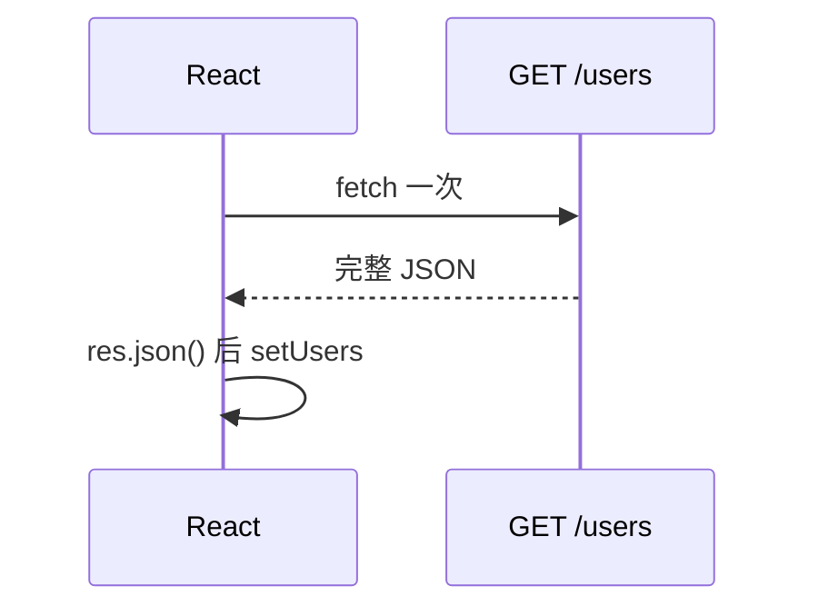
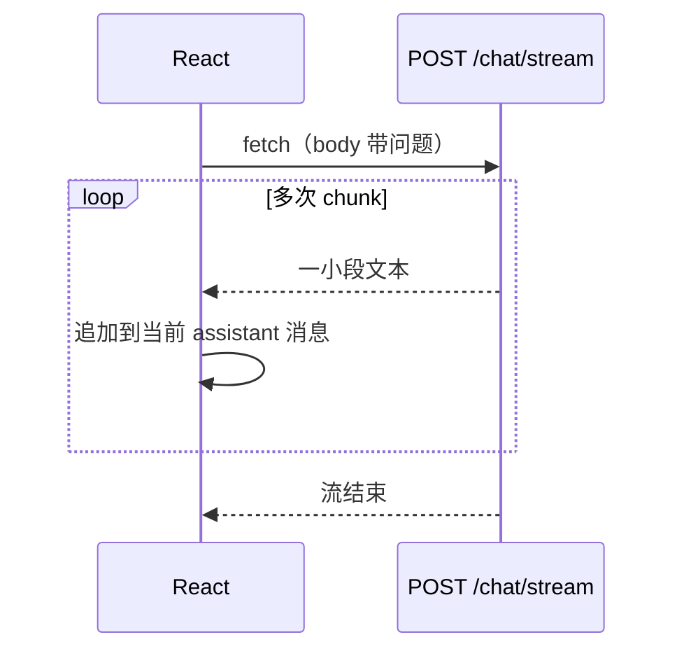
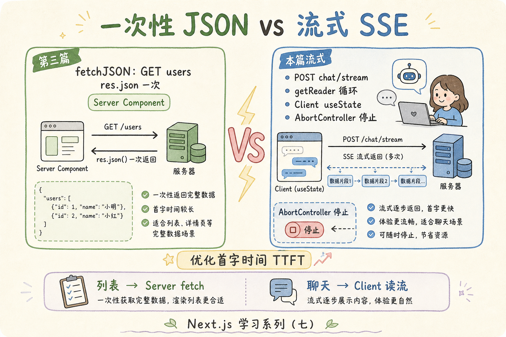
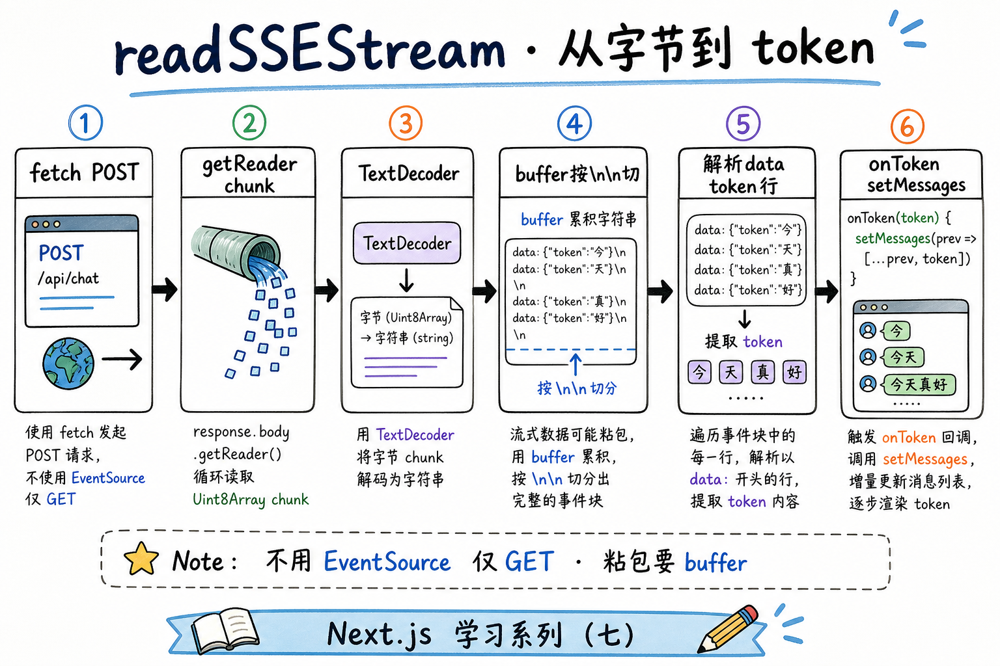
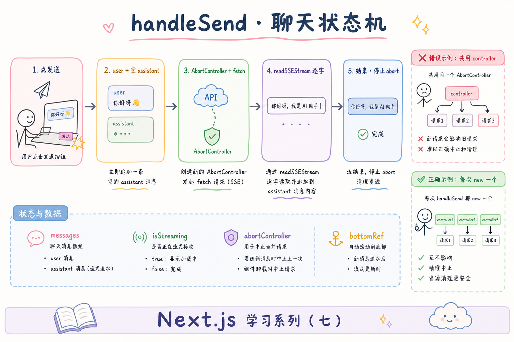

# React 学习系列（七）：SSE 流式对话——逐字显示与 AbortController

> 第三篇用 `fetch` 等完整 JSON 再 `setState`——用户列表、订单详情够用。但 **大模型问答** 往往要边生成边显示：等整段回答返回再渲染，用户会盯着空白等好几秒。这篇是系列第七篇：认识 **流式响应** 与 **SSE**（Server-Sent Events，服务端推送事件），用 `fetch` + **`ReadableStream`** 在 React 里做「打字机」效果，用 **`AbortController`** 随时停止生成，并搭一个最小的 **聊天气泡界面**。偏概念与能跑通的步骤；Markdown 见 [（八）](08.markdown-message-render.md)，引用溯源见 [（九）](09.citation-source-ui.md)，对应 [企业 RAG 路线图](../ENTERPRISE_RAG_ROADMAP.md) 阶段 0「流式对话」。

---

## 目录

1. [前言：等一整块 JSON 太慢了](#1-前言等一整块-json-太慢了)
2. [一次性响应 vs 流式响应](#2-一次性响应-vs-流式响应)
3. [SSE 是什么：服务端怎么「边算边推」](#3-sse-是什么服务端怎么边算边推)
4. [后端：最小 FastAPI 流式接口](#4-后端最小-fastapi-流式接口)
5. [前端：fetch 读流，而不是等 json()](#5-前端fetch-读流而不是等-json)
6. [AbortController：停止生成](#6-abortcontroller停止生成)
7. [聊天 UI：消息列表与逐字追加](#7-聊天-ui消息列表与逐字追加)
8. [useRef：新字出来时滚到底部](#8-useref新字出来时滚到底部)
9. [综合实战：简单对话页](#9-综合实战简单对话页)
10. [与第六篇联调：代理与排错](#10-与第六篇联调代理与排错)
11. [常见陷阱与 FAQ](#11-常见陷阱与-faq)
12. [总结与系列下一步](#12-总结与系列下一步)

---

## 1. 前言：等一整块 JSON 太慢了

第六篇典型卡点（若你做过用户 CRUD，也会遇到同类问题）：

- 调 LLM 接口时，后端要 **10～30 秒** 才返回完整回答——界面一直转圈，体验像「卡死」。
- 听说要用 **SSE** 或 **WebSocket**，但不知道在 React 里写在哪、和第三篇 `useEffect` + `fetch` 有何不同。
- 用户点了「停止」，请求还在跑，下一条消息和上一条 **串台**。

**流式响应**（Streaming Response）：服务器不一次性返回完整 body，而是**分多次**把数据片段推给浏览器。  
通俗说：不是等厨师做完一整桌菜再上桌，而是**做好一道上一道**。

**SSE**（Server-Sent Events，服务端推送事件）：一种基于 HTTP 的流式协议，服务器按行推送 `data: ...` 文本，浏览器用 `fetch` 读流或 `EventSource` 订阅。  
通俗说：服务器像**广播**，客户端**只收不发**（适合「模型一个字一个字吐出来」）。

读完本文，你应该能做到：

1. 说清「等 `res.json()`」与「读 `res.body` 流」的区别，以及 RAG/聊天场景为何选流式。
2. 启动一个返回 SSE 的最小 FastAPI `/api/chat/stream`，并在 Swagger 或 `curl` 里看到分段输出。
3. 在 React 里用 `fetch` + `getReader()` 逐段追加 assistant 消息，界面有打字机效果。
4. 用 **`AbortController`** 绑定 `fetch`，点击「停止」时中断请求并恢复输入框。
5. 用 **`useRef`** 在消息变长时滚到底部。

**前置阅读**：

| 篇章 | 必看内容 |
|------|----------|
| [（一）ES6+](01.javascript-es6-quickstart.md) | §10 `async/await`、`fetch` |
| [（二）Vite + JSX](02.vite-jsx-first-component.md) | `useState`、受控 `input`、事件 |
| [（三）useEffect](03.use-effect-data-fetching.md) | 三态 UI、`fetchJSON`（本篇**不**在 effect 里拉流式对话） |
| [（六）全栈对接](06.fullstack-vite-fastapi.md) | Vite 代理、`/api` 路径 |
| [REST API 设计](../5.rest-api-design-tutorial.md) | POST、状态码（了解即可） |

**环境**：

| 组件 | 版本建议 |
|------|----------|
| Node.js | 18+（前端，延续第六篇 Vite 项目或新建） |
| Python | 3.10+（后端 SSE 演示） |
| 浏览器 | 现代 Chrome / Edge / Firefox（支持 `ReadableStream`） |

### 1.1 本文边界

本篇**先建立地图**，不深究：

- `react-markdown`、代码高亮（见 [（八）Markdown 渲染](08.markdown-message-render.md)）；引用卡片 UI（见 [（九）引用溯源](09.citation-source-ui.md)）
- `EventSource` 与 `fetch` 流的全面对比、WebSocket 双向通道
- Zustand / React Query 管理多轮会话
- 真实 OpenAI / DeepSeek API Key 与计费（用本地模拟流代替）

目标：**本机两个终端，浏览器里能「输入问题 → 逐字出回答 → 点停止」**。

### 1.2 动手路径

| 步骤 | 做什么 | 章节 |
|------|--------|------|
| 1 | 用 `curl` 或 `/docs` 理解 SSE 长什么样 | §3–§4 |
| 2 | 写 `readSSEStream` 工具函数 | §5 |
| 3 | 加 `AbortController` 与停止按钮 | §6 |
| 4 | 搭 `messages` state + 气泡列表 | §7–§8 |
| 5 | 合成 `ChatPage` 并走 Vite 代理 | §9–§10 |

---

## 2. 一次性响应 vs 流式响应

第三篇列表页的模式：



读图时看**箭头数量**：请求一次、响应一次、数据**整块**到达。

聊天 / RAG 生成更适合：



对照上图：同一次 HTTP 连接里，**body 分多次到达**；React 每收到一段就 `setState` 一次，用户先看到开头，不必等全文。

| 对比项 | 一次性 JSON（第三篇） | 流式（本篇） |
|--------|----------------------|--------------|
| 典型 API | `GET /users` | `POST /chat/stream`、LLM SSE |
| 前端取数 | `await res.json()` | `res.body.getReader()` 循环读 |
| 用户感知 | 转圈 → 整页出现 | 字逐渐变多 |
| 适合场景 | 列表、详情、短 POST 回执 | 大模型生成、长日志 tail |
| 取消 | 关页面即可（进阶用 Abort） | **应**提供停止按钮 |



### 2.1 什么时候不必上流式

- 接口几十毫秒内返回、数据很小（用户列表、配置项）→ 继续用第三篇写法。
- 需要**双向**高频通信（协同编辑、游戏）→ 往往用 **WebSocket**（本篇不展开）。
- 只做后台批处理、无人在线看进度 → 流式 UI 可省略。

直觉类比：流式像**直播**；一次性 JSON 像**网盘下完再打开**。RAG 问答面向用户时，默认按「直播」设计体验。

---

## 3. SSE 是什么：服务端怎么「边算边推」

**SSE** 在 HTTP 响应里约定一种简单文本格式：

- 响应头常含 `Content-Type: text/event-stream`
- 正文由多「事件」组成，每条常以 `data: ` 开头，以**空行**结束
- 浏览器可用 **`EventSource`**（仅 GET）或 **`fetch` + 读 body**（POST 时常用后者）

演示什么：一段最小的 SSE 文本长什么样。  
前置：无；用眼睛认格式即可。

```text
data: 你

data: 好

data: ，

data: 世界

```

预期：客户端按行解析，每遇到 `data: ` 就取出后面的字，拼到界面上。

下面用表格对照「第三篇 JSON」与「本篇 SSE 片段」：

| 项目 | JSON 一次性 | SSE 流式 |
|------|-------------|----------|
| Content-Type | `application/json` | `text/event-stream` |
| body 形状 | `{"answer":"你好世界"}` | 多行 `data: ...` |
| 前端解析 | `JSON.parse` 一次 | 循环读 chunk，按行拆 |
| 连接何时结束 | 收到完整 body | 服务器关闭流 |

**EventSource**（浏览器内置 API）：只对 **GET** URL 建长连接，自动按 SSE 格式解析。  
通俗说：专用收音机，只能听广播台（GET）。  
聊天要把**用户问题 POST 上去**，所以本篇主推 **`fetch` + ReadableStream**——POST body 带问题，响应体仍可按 SSE 格式读。

---

## 4. 后端：最小 FastAPI 流式接口

演示什么：不调用真 LLM，用 Python **模拟**每隔 0.1 秒吐一个字，格式符合 SSE。  
前置：Python 3.10+，已读过 [第六篇](06.fullstack-vite-fastapi.md) 的 FastAPI 结构。

在第六篇 `backend/` 旁新建或扩展 `main.py`。若你已有用户 API，可**并存**同文件：

### 4.1 依赖

沿用第六篇 `requirements.txt` 即可，无需新包。

### 4.2 流式聊天接口

演示什么：`POST /api/chat/stream`，body 为 `{"message":"..."}`，响应为 SSE。  
预期：用 `curl -N` 能看到多行 `data:` 逐条出现。

```python
import asyncio
import json
from fastapi import FastAPI
from fastapi.responses import StreamingResponse
from pydantic import BaseModel

app = FastAPI(title="Chat Stream Demo")

# … 第六篇的用户 API 可保留在同 app …


class ChatRequest(BaseModel):
    message: str


async def fake_llm_stream(user_message: str):
    """模拟大模型：把回复拆成字，按 SSE 格式 yield。"""
    reply = f"收到你的问题：「{user_message}」。这是模拟流式回答，每个字单独推送。"
    for char in reply:
        # SSE 规范：每条消息以 data: 开头，以双换行结束
        yield f"data: {json.dumps({'token': char}, ensure_ascii=False)}\n\n"
        await asyncio.sleep(0.05)


@app.post("/api/chat/stream")
async def chat_stream(body: ChatRequest):
    return StreamingResponse(
        fake_llm_stream(body.message),
        media_type="text/event-stream",
        headers={
            "Cache-Control": "no-cache",
            "Connection": "keep-alive",
            "X-Accel-Buffering": "no",  # 部分反代（如 Nginx）需关闭缓冲
        },
    )
```

**StreamingResponse**（FastAPI 流式响应）：把异步生成器的内容边产边发给客户端。  
通俗说：水管对接，**有水就流**，不攒满一桶再倒。

**`json.dumps` 包一层 `token`**：方便以后扩展 `{"token":"你","done":false}`；前端只取 `token` 字段拼接即可。

### 4.3 启动与自测

**uvicorn**：ASGI 服务器，把 FastAPI 应用跑在指定端口上（详见 [第六篇 §4.3](06.fullstack-vite-fastapi.md)）。

```bash
cd backend
uvicorn main:app --reload --port 8000
```

用 **curl** 看流（`-N` 关闭缓冲，否则可能等很久才显示）：

```bash
curl -N -X POST http://localhost:8000/api/chat/stream \
  -H "Content-Type: application/json" \
  -d "{\"message\":\"什么是RAG\"}"
```

预期：终端里连续出现多行 `data: {"token": "收"}` 这类输出，而不是一行大 JSON。

也可在 `http://localhost:8000/docs` 里试 `POST /api/chat/stream`；Swagger UI 对流式支持有限，**以 curl 或前端为准**。

---

## 5. 前端：fetch 读流，而不是等 json()

第三篇写法（**不适合**流式 body）：

```javascript
const res = await fetch(url);
const data = await res.json(); // 会等到 body 完全结束
```

演示什么：用 `getReader()` 循环读 chunk，解码成字符串，再按 SSE 行解析。  
前置：第一篇 `async/await`；在**用户点击发送**时调用，不要写在 `useEffect([], [])` 里（没有「挂载后自动聊一句」的需求）。

### 5.1 先错后对：在 render 里 await fetch

```javascript
// ❌ 错误：render 里不能 await，也不能边渲染边 setState
function Chat() {
  const res = await fetch('/api/chat/stream'); // 语法就不合法
  return <div>...</div>;
}
```

```javascript
// ✅ 正确：放在事件处理函数里
async function handleSend() {
  const res = await fetch('/api/chat/stream', { method: 'POST', ... });
  // 读流，见下文
}
```

### 5.2 最小读流函数

演示什么：从 `Response` 里读出 SSE 的 `token` 字段，每收到一个 token 调用 `onToken`。  
环境：现代浏览器；与第四篇起的 Vite 项目同目录，可放在 `src/utils/readSSEStream.js`。

```javascript
/**
 * 读 POST 返回的 SSE 流，每解析出一个 token 调用 onToken(token)。
 * @param {Response} res - fetch 得到的响应，须 res.ok
 * @param {(token: string) => void} onToken
 */
export async function readSSEStream(res, onToken) {
  if (!res.ok) {
    const text = await res.text().catch(() => '');
    throw new Error(text || `HTTP ${res.status}`);
  }
  if (!res.body) {
    throw new Error('当前环境不支持流式响应 body');
  }
  const reader = res.body.getReader();
  const decoder = new TextDecoder();
  let buffer = '';

  while (true) {
    const { done, value } = await reader.read();
    if (done) break;
    buffer += decoder.decode(value, { stream: true });

    // SSE 事件以空行分隔
    const parts = buffer.split('\n\n');
    buffer = parts.pop() ?? '';

    for (const part of parts) {
      const line = part.split('\n').find((l) => l.startsWith('data: '));
      if (!line) continue;
      const jsonStr = line.slice('data: '.length).trim();
      if (jsonStr === '[DONE]') continue;
      try {
        const payload = JSON.parse(jsonStr);
        if (payload.token) onToken(payload.token);
      } catch {
        // 非 JSON 的 data: 行可忽略或当纯文本
        onToken(jsonStr);
      }
    }
  }
}
```

**ReadableStream**（可读流）：`res.body` 是字节流，用 **`getReader()`** 每次读一块。  
通俗说：水龙头接水桶，**舀一勺处理一勺**，不用等池子满。

**TextDecoder**：把 `Uint8Array` 字节转成字符串；`stream: true` 表示多段 UTF-8 可能跨 chunk，解码器会留着半个字等下一块。

**buffer 与 `\n\n`**：一次 `read()` 可能只拿到半行，所以先拼进 `buffer`，按 SSE 事件边界切分。

预期行为：后端每推一个 `data: {"token":"你"}`，`onToken` 就被调用一次，参数为 `"你"`。



### 5.3 和第三篇 fetchJSON 的分工

| 场景 | 用啥 |
|------|------|
| 列表、详情、创建用户 | `fetchJSON` → `res.json()` |
| 聊天流式 | `fetch` + `readSSEStream` |
| 流式结束后的元数据（引用列表） | 在 SSE 末尾发 `{"citations":[...]}`——见 [（九）](09.citation-source-ui.md) |

---

## 6. AbortController：停止生成

用户点「停止」时，应**取消正在进行的 fetch**，否则：

- 旧流仍往 state 里写字，和新问题 **混在一起**；
- 浪费带宽与后端算力。

**AbortController**（中止控制器）：浏览器内置对象，把它的 **`signal`** 传给 `fetch`，调用 **`abort()`** 可取消请求。  
通俗说：给这次请求系上「急刹车」拉绳。

演示什么：发送时创建 controller，停止时 `abort()`。  
前置：组件内需声明 `const [abortController, setAbortController] = useState(null)`，供停止按钮读取当前这一次请求的 controller。  
副作用：**`abort()` 会让 `fetch` 和后续的 `reader.read()` 抛出名为 `AbortError` 的异常**——要在 `catch` 里区分「用户主动停止」和「真错误」。

```javascript
// ChatPage 内与 input、isStreaming 等并列声明
const [abortController, setAbortController] = useState(null);

async function handleSend() {
  const controller = new AbortController();
  setAbortController(controller); // 存进 state，停止按钮能拿到

  try {
    const res = await fetch('/api/chat/stream', {
      method: 'POST',
      headers: { 'Content-Type': 'application/json' },
      body: JSON.stringify({ message: input }),
      signal: controller.signal,
    });
    await readSSEStream(res, (token) => { /* 追加字 */ });
  } catch (err) {
    if (err.name === 'AbortError') {
      // 用户点停止，不算失败
      return;
    }
    setError(err.message);
  } finally {
    setAbortController(null);
    setIsStreaming(false);
  }
}

function handleStop() {
  abortController?.abort();
}
```

先错后对：

```javascript
// ❌ 每次发送共用一个全局 controller，且从不 abort
const controller = new AbortController(); // 写在组件外或只创建一次

// ✅ 每次发送 new 一个；停止只对应当前这一次 fetch
```

预期：点停止后，界面不再追加新字；`catch` 里不因 `AbortError` 弹红错。

---

## 7. 聊天 UI：消息列表与逐字追加

### 7.1 消息长什么样

不用为「流式」单独换数据结构——在内存里用**数组**表示多轮对话即可：

```javascript
// 每条：role 区分谁说的；content 是已显示的全文（流式时逐渐变长）
const [messages, setMessages] = useState([
  // { id: '1', role: 'user', content: '你好' },
  // { id: '2', role: 'assistant', content: '你' }, // 流式中会不断变长
]);
```

| 字段 | 含义 |
|------|------|
| `id` | 列表 `key`，用 `crypto.randomUUID()` 或递增 id |
| `role` | `'user'` \| `'assistant'` |
| `content` | 当前气泡里显示的文字 |

### 7.2 发送时：先插两条，再改 assistant

演示什么：用户点发送后，立刻在列表里出现「用户问题 + 空 assistant」，流式 token 只更新**最后一条 assistant**。  
前置：§5 `readSSEStream`、§6 `AbortController`。



```javascript
async function handleSend() {
  if (!input.trim() || isStreaming) return;
  const userText = input.trim();
  setInput('');
  setIsStreaming(true);
  setError(null);

  const userMsg = { id: crypto.randomUUID(), role: 'user', content: userText };
  const assistantId = crypto.randomUUID();
  const assistantMsg = { id: assistantId, role: 'assistant', content: '' };
  setMessages((prev) => [...prev, userMsg, assistantMsg]);

  const controller = new AbortController();
  setAbortController(controller);

  try {
    const res = await fetch('/api/chat/stream', {
      method: 'POST',
      headers: { 'Content-Type': 'application/json' },
      body: JSON.stringify({ message: userText }),
      signal: controller.signal,
    });
    await readSSEStream(res, (token) => {
      setMessages((prev) =>
        prev.map((m) =>
          m.id === assistantId ? { ...m, content: m.content + token } : m
        )
      );
    });
  } catch (err) {
    if (err.name !== 'AbortError') setError(err.message);
  } finally {
    setAbortController(null);
    setIsStreaming(false);
  }
}
```

**函数式更新** `setMessages(prev => ...)`：流式回调可能很快触发多次，用 `prev` 避免闭包里的 `messages` 过期。  
通俗说：每次改列表都基于**最新一桌菜**，而不是上一轮快照。

**不可变更新**：`{ ...m, content: m.content + token }`，不要 `m.content += token`。

### 7.3 简单气泡组件

演示什么：按 `role` 分左右样式。  
预期：用户消息靠右，助手靠左；`content` 为空时可显示「思考中…」或光标。

```jsx
function ChatMessage({ role, content }) {
  const isUser = role === 'user';
  return (
    <div
      style={{
        display: 'flex',
        justifyContent: isUser ? 'flex-end' : 'flex-start',
        marginBottom: 8,
      }}
    >
      <div
        style={{
          maxWidth: '80%',
          padding: '8px 12px',
          borderRadius: 12,
          background: isUser ? '#2563eb' : '#e5e7eb',
          color: isUser ? '#fff' : '#111',
          whiteSpace: 'pre-wrap',
        }}
      >
        {content || (isUser ? '' : '…')}
      </div>
    </div>
  );
}
```

本篇用内联样式降低门槛；后续可加 Tailwind 或组件库。模型输出多为 **Markdown**——见 [（八）Markdown 消息渲染](08.markdown-message-render.md)。

### 7.4 界面状态：比三态多一个「流式中」

| 状态 | 界面表现 |
|------|----------|
| `idle` | 可输入，可发送 |
| `isStreaming === true` | 发送禁用或变「停止」；assistant 条在长高 |
| `error` | 顶部或底部错误条，可重试 |

不必再套第三篇的 `loading` 整页转圈——用户消息已立刻出现，**只有 assistant 在「边写边显」**。

---

## 8. useRef：新字出来时滚到底部

**useRef**（引用 Hook）：返回一个 `{ current: ... }` 对象，改 `current` **不会**触发重新渲染。  
通俗说：便签纸贴在组件上，记 DOM 节点或任意值，适合「滚滚动条」这种副作用。

聊天列表变长时，应把视口滚到最新消息。用 `useEffect` 监听 `messages` 变化：

演示什么：列表底部放一个「锚点」div，`scrollIntoView`。  
前置：§7 已有 `messages`。

```jsx
import { useEffect, useRef } from 'react';

function ChatPage() {
  const [messages, setMessages] = useState([]);
  const bottomRef = useRef(null);

  useEffect(() => {
    bottomRef.current?.scrollIntoView({ behavior: 'smooth' });
  }, [messages]);

  return (
    <div style={{ height: '60vh', overflowY: 'auto', border: '1px solid #ddd' }}>
      {messages.map((m) => (
        <ChatMessage key={m.id} role={m.role} content={m.content} />
      ))}
      <div ref={bottomRef} />
    </div>
  );
}
```

预期：每追加 token，列表自动滚到底；`behavior: 'smooth'` 可改为 `'auto'` 减少卡顿。

**可选优化**：仅当用户已在底部附近时才自动滚（否则用户翻历史会被拽回去）——标为进阶，初学可跳过。

---

## 9. 综合实战：简单对话页

**阅读顺序**：先读完 §4 后端、§5 读流、§6 停止、§7 消息 state、§8 滚动，再拼整页。

### 9.1 建议目录

```text
frontend/src/
├── utils/
│   └── readSSEStream.js
├── components/
│   ├── ChatMessage.jsx
│   └── ChatInput.jsx
└── pages/
    └── ChatPage.jsx
```

`ChatInput.jsx`：受控 `textarea` + 发送/停止按钮（第五篇受控表单复习）。

```jsx
export function ChatInput({ value, onChange, onSend, onStop, isStreaming }) {
  return (
    <div style={{ display: 'flex', gap: 8, marginTop: 12 }}>
      <textarea
        value={value}
        onChange={(e) => onChange(e.target.value)}
        rows={2}
        style={{ flex: 1 }}
        placeholder="输入问题…"
        disabled={isStreaming}
      />
      {isStreaming ? (
        <button type="button" onClick={onStop}>
          停止
        </button>
      ) : (
        <button type="button" onClick={onSend} disabled={!value.trim()}>
          发送
        </button>
      )}
    </div>
  );
}
```

### 9.2 挂到路由（可选）

若已有 [第四篇](04.react-router-list-detail.md) 的 `BrowserRouter`，可加：

```jsx
<Route path="/chat" element={<ChatPage />} />
```

### 9.3 自测流程

| 步骤 | 操作 | 预期 |
|------|------|------|
| 1 | 后端 `uvicorn`，前端 `npm run dev` | 两个进程正常 |
| 2 | 打开 `/chat`，输入「你好」点发送 | 立刻出现用户气泡 |
| 3 | 观察助手气泡 | 文字**逐渐变长**，非一次闪现 |
| 4 | 流式过程中点「停止」 | 字不再增加，无报错红条 |
| 5 | 再发第二条 | 新 assistant 独立，不与上条混 |
| 6 | DevTools → Network | `chat/stream` 类型为 `eventsource` 或 chunked，耗时数秒 |

---

## 10. 与第六篇联调：代理与排错

### 10.1 Vite 代理

与 [第六篇 §5](06.fullstack-vite-fastapi.md) 相同：`fetch('/api/chat/stream')` 由 Vite 转到 `localhost:8000`。

```javascript
// vite.config.js — server.proxy 与第六篇一致即可
proxy: {
  '/api': {
    target: 'http://localhost:8000',
    changeOrigin: true,
  },
},
```

**注意**：流式响应经代理时，个别环境会缓冲；本地 Vite 一般正常。若部署到 Nginx，需关 `proxy_buffering`（见后端 `X-Accel-Buffering` 头）。

### 10.2 排错清单

| 现象 | 可能原因 | 怎么查 |
|------|----------|--------|
| 一直转圈，字一次性全出 | 中间层缓冲了 SSE | curl 直连 8000 对比；查代理配置 |
| CORS 报错 | 绕过代理写死后端 URL | 改回 `fetch('/api/...')` |
| 停止后仍追加 | 未传 `signal` 或 `onToken` 未检查 aborted | 核对 §6 |
| `res.json is not a function` | 对流式响应调了 `json()` | 改用 `readSSEStream` |
| 乱码 | 未用 `TextDecoder` 或 buffer 切行错误 | 核对 §5.2 |

---

## 11. 常见陷阱与 FAQ

### 11.1 陷阱一：在 useEffect 里自动发聊天请求

```javascript
// ❌ 挂载就 POST 一句，Strict Mode 还可能发两次
useEffect(() => {
  fetch('/api/chat/stream', { method: 'POST', body: ... });
}, []);
```

聊天应由**用户点击**触发；`useEffect` 留给「进页拉配置」类 GET（第三篇）。

### 11.2 陷阱二：流式回调里直接改 messages

```javascript
// ❌
messages[messages.length - 1].content += token;
setMessages(messages);

// ✅ map + 新对象，函数式 setState
setMessages((prev) => prev.map(...));
```

### 11.3 陷阱三：忘记处理 AbortError

把用户点停止当成网络错误，会误导用户。`err.name === 'AbortError'` 时静默或提示「已停止」即可。

### 11.4 陷阱四：assistant 更新错 id

并发两次发送（若未禁用按钮）会共用一个 `assistantId`。发送期间应 **`isStreaming` 时禁用发送**，或每次生成唯一 `assistantId` 且只更新该 id。

### 11.5 FAQ

**Q：SSE 和 WebSocket 选哪个？**  
A：单向「服务器推、客户端只收」用 SSE 足够；要双向高频用 WebSocket。多数 LLM HTTP API 是 **POST + SSE 流**。

**Q：能用 EventSource 吗？**  
A：仅 **GET** 且 URL 带参数时方便。POST 问题体用 **`fetch` + signal** 更通用。

**Q：和 OpenAI 真 API 怎么接？**  
A：后端转发流（推荐，藏 API Key）；前端仍读 `data:` 行，字段可能是 `choices[0].delta.content`，在 `readSSEStream` 里改解析逻辑即可，**React 追加 state 的模式不变**。

**Q：流式时 React 会卡吗？**  
A：token 极密时 `setState` 很频繁，可**节流**（如每 50ms 合并一次）——进阶优化；初学先逐 token 更新，量不大时足够。

### 11.6 动手自检清单

- [ ] 能用 curl `-N` 看到后端 SSE 分段输出  
- [ ] 写了 `readSSEStream`，能解析 `data: {"token":"..."}`  
- [ ] 发送用 `AbortController`，停止不报假错  
- [ ] `messages` 用 `role` + `content`，流式只更新当前 assistant  
- [ ] `useRef` + `scrollIntoView` 滚到底  
- [ ] 经 Vite 代理 `fetch('/api/chat/stream')` 联调成功  

---

## 12. 总结与系列下一步

### 12.1 概念速记表

| 概念 | 一句话 |
|------|--------|
| 流式响应 | body 分多次到达，不必等全文 |
| SSE | `data: ` 行 + 空行；常配合 `text/event-stream` |
| ReadableStream | `res.body.getReader()` 循环读 chunk |
| TextDecoder | 字节 → 字符串，注意跨 chunk 的 UTF-8 |
| AbortController | `signal` 传给 fetch，`abort()` 取消 |
| 消息 state | `{ id, role, content }[]`，流式改最后一条 assistant |
| useRef | 滚到底、不触发额外渲染 |

### 12.2 决策树

```
接口要等很久才返回全文？
└─ 是，且用户在等「字」→ 流式 + 打字机 UI

用 POST 提交问题？
└─ fetch + readSSEStream（不用 EventSource）

用户要能停止？
└─ 每次发送 new AbortController，停止时 abort()

列表 / 短 JSON？
└─ 继续用第三篇 res.json()，不必流式

要 Markdown / 引用 / 多轮持久化？
└─ Markdown 见 [（八）](08.markdown-message-render.md)；引用见 [（九）](09.citation-source-ui.md)
```

### 12.3 系列七篇回顾

| 篇 | 主题 |
|----|------|
| 一 | JavaScript 语法 |
| 二 | 组件、useState |
| 三 | useEffect、GET、三态 |
| 四 | 路由 |
| 五 | POST 表单 |
| 六 | 真后端联调 |
| 七 | **流式对话、停止、聊天 UI** |

### 12.4 系列下一步

**React 学习系列（八）**：[Markdown 消息渲染](08.markdown-message-render.md)——让助手回复可读；其后接 [（九）引用溯源](09.citation-source-ui.md)、[（十）文件上传](10.file-upload-index-progress.md)。

### 12.5 可选延伸

- **Zustand + React Query**：多会话、列表缓存（见 [第六篇 §12.5](06.fullstack-vite-fastapi.md)）  
- **TypeScript**：把 `.jsx` 迁为 `.tsx`——见 [（十一）](11.typescript-migration.md)  

---

> **系列定位**：本篇把 React 系列从「**REST CRUD**」推进到「**对话式产品**」——全栈 RAG 工程师的前端门槛。下一篇 [（八）Markdown 渲染](08.markdown-message-render.md)；完整 RAG 线 7～13 见 [README.md](README.md)。
